> **v2.30 / 2026-08-13 變更摘要（AD-E07-49：F116 v1.1 樞紐分析頁籤 — 職稱／新人標註／總計欄置前／工作天模式）**：
>
> 新增 **§5.19「F116 v1.1 樞紐分析頁籤架構決策（AD-E07-49）」** 與決策記錄 [`implementation-log/AD-E07-49-f116-v1.1-pivot-newcomer-workday.md`](implementation-log/AD-E07-49-f116-v1.1-pivot-newcomer-workday.md)。裁定 F116 v1.1 spec §12 之 A-1~A-5：**確認**（不推翻）A-1（工作天 `ceil(cnt/workingDays)` 換算為前端展示轉換，與既有佔比換算 BR-3 同構，不下推後端以免每層資料結構翻倍）、A-3（不回傳 `hireDate`，最小曝光面）、A-5（維度切換為純前端 UI state，不持久化）；**具體化** A-2（`workingDays` 複用 `assignment-list/stage0-estimate.service.ts` 匯出之純函式 `computeWorkingDayRatios`，比照 `assignment-run-pipeline.service.ts:53` 既有跨模組「只共用 pure function、不共用 injectable class」慣例，`I-RUN-EST-01` 延伸為第四消費者，不需在 `assignment.module.ts` 新增 `imports: [AssignmentListModule]`）；**推翻** A-4 之 spec 假設——查證 v1.0 現行 `getPivot` 之 TS 端 `Map` 聚合僅保證「輸出節點不重複」，不保證「`ob_emphire` 潛在重複 `emp_id` 列造成 join fan-out 時計數不被重複計入」，改為 SQL 層以 `ROW_NUMBER() OVER (PARTITION BY emp_id) = 1` 去重 derived table 取代直接 `LEFT JOIN ob_emphire`，使外層 `COUNT(*)` 天然正確。新增 5 個不變式（`I-F116-CALENDAR-SHARE-01` / `I-F116-EMPHIRE-DEDUP-01` / `I-F116-CEIL-PER-CELL-01` / `I-F116-NO-ACTIVE-FILTER-01` / `I-F116-CLIENT-STATE-01`）。無 schema / migration 變更。covers 補入 F116（v1.0 上線時未曾補列）。**A-4 為 HOW 層級修正，不影響 F116 spec 契約，不需回頭修訂 spec。**
>
> **同日更正（2026-08-13，隨 F116 spec v1.1.1 / AD-E07-49 v1.1）**：使用者實機檢視 dev MSSQL 317 筆資料後更正職稱來源——`ob_emphire.jfun_nm`（91% 為「營業一般職」，職能分類無辨識度）→ **`ob_emphire.title_name`**（業務專員／業務襄理／業務副理…13 種有意義分佈，符合「員編－姓名－職稱」原始意圖）；API 欄位 `jfunNm` → **`titleName`**。§5.19 mermaid 資料流圖與 AD-E07-49 之 SQL 示意／不變式表已同步改為 `title_name`/`titleName`。純欄位替換，型別同為 `nvarchar`（`title_name` 長度 30 vs `jfun_nm` 15）、NULL 特性相同（皆 12 筆 NULL），**不影響**先前 A-1~A-5 任何裁定，亦不需新增不變式（詳見 AD §10 變更紀錄 v1.1 列）。

> **v2.29 / 2026-08-04 變更摘要（AD-E07-48：F117 部門比例「有處長」過濾 + F118 從上月複製「已複製過」提示 — 🔴 DRAFT，待人工審閱）**：
>
> **✅ 2026-08-04 人工審閱閘：F117 v1.1 / F118 v1.1 / AD-E07-48 v1.1 均已核可，可作為 TDD 實作依據。** 原業務阻塞事項（OQ-F117-B1 / OQ-F118-B2 / OQ-F118-B3）全數裁決完畢。新增 **§5.18「F117/F118 UX 精煉架構決策（AD-E07-48）」** 與決策記錄 [`implementation-log/AD-E07-48-f117-f118-ux-refinements.md`](implementation-log/AD-E07-48-f117-f118-ux-refinements.md)。核心決策：(1) **F117**：GET flag 命名採 `requireDirector`；不引入樂觀鎖（孤兒判定於 PUT 呼叫當下即時查詢，A-2）；**不新增元件**——三分類 + PUT 孤兒保留邏輯直接擴充既有 `DeptRatioService`，抽取共用 private method `computeActiveDirectorMap()` 避免 GET/PUT 出現第二套處長判定實作；查證確認 GET 現行已計算 `directorMap` 並回傳 `directorName`，F117 對 GET 側**零新查詢成本**；(2) **F118**：**推翻 spec §5.1 建議之選項 (A)**（補完從未實作的 `copy-source-options` 端點），改採獨立最小端點 **`GET /api/v1/assignment/lists/copy-duplicate-check?prevYm&currentYm`**（v1.1 修訂：原設計為 POST 帶前端候選；OQ-F118-B3 裁決後候選過濾規則已唯一明確，改由後端自載候選，使判定所用之 `condition_payload` 與儲存端**同源**，強化 AC-2 一致性）——固定 3 次查詢，與候選數無關；亦查證確認 `copy-source-options` 之既有文件路徑前綴 `assignment/list-definitions` 在現行程式碼中根本不存在（實際為 `assignment/lists`），為該端點「規格與實作徹底脫節」之額外佐證；(3) 判定邏輯 100% 重用既有 `AssignmentListService.normalizeConditionPayload`（同 class private method 直接呼叫，不抽取新檔案）；(4) 對既有 `findActiveConditionDuplicate` 之**最小修改**：新增 `ORDER BY list_no ASC` 決定性排序，並使新端點採同一排序，確保多筆同簽章候選時 AC-2（儲存時 422）與 AC-4（提示顯示）之目標名單編號一致（OQ-F118-02）——此為對既有已上線程式碼的修改，已於 AD §10.2 R-2 記錄為低風險項並建議補回歸測試。無 schema / migration 變更（兩者皆為查詢時衍生狀態）。新增 9 個不變式（`I-F117-DIRECTOR-SINGLE-SOURCE-01` / `I-F117-ORPHAN-PRESERVE-01` / `I-F117-SUM-SCOPE-01` / `I-F117-HIDDEN-ZERO-01` / `I-F118-SINGLE-NORMALIZE-01` / `I-F118-CONST-QUERY-01` / `I-F118-CONFLICT-ORDER-01` / `I-F118-READONLY-JUDGE-01`；v1.1 移除 `I-F118-CLIENT-PAYLOAD-TRUST-01`——GET 化後不再接受前端候選，該信任模型已不適用）。covers 補入 F117/F118。AD-E07-48 §10 之待確認事項已於人工審閱閘全數結案。

> **v2.28 / 2026-07-12 變更摘要（AD-E07-45 v1.2 修正：實測結果推翻「抽樣後即次秒級」+ 前端 histogram 快取）**：
>
> 更新 §5.17 摘要以對齊 [`implementation-log/AD-E07-45-sampling-estimator.md`](implementation-log/AD-E07-45-sampling-estimator.md) v1.2。
> 實測（team lead 提供）推翻 v2.27 changelog／§5.17.3 原「抽樣後已達次秒級」之敘述：`TABLESAMPLE` 抽樣本身
> ≈0.5s（設計有效），但 score histogram 查詢對重卡（CARD_TYPE=E）實測 **≈12s**——根因為 `buildStage2ScoreExprMssql`
> （不得修改之單一真源）對 AGE／gender 等衍生欄位逐處字串內嵌、非計算一次重用；F050 實測 619ms 確認抽樣核心
> 本身無問題。**伺服器端維持「不快取」結論不變**；新增前端 per-cardType histogram 快取策略：F055
> `card-levels/preview` 回應新增 `histogram: [{score, count}]` 原始欄位，前端每個 cardType 僅需成功呼叫一次
> 並快取，Tab 4 草稿門檻編輯與 Tab 5 TIER 分布切換皆改為前端純函式對已快取 histogram 重新分桶（零額外伺服器
> 呼叫）；F056 `tier-mapping/preview` 與 F055 `distribution` 之伺服器端計算維持不變、作為 canonical／測試
> 基準（deliberate perf split，非邏輯重複）。新增不變式 `I-SAMPLE-CLIENT-HISTOGRAM-01` /
> `I-SAMPLE-BUCKET-PARITY-01`。殘留風險：US-174 AC-1「1 秒內回應」字面上不再對端點本身成立，需 PO /
> spec-writer 審視措辭（AD §9.4(a) / §10 已記錄）。covers 不變。

> **v2.27 / 2026-07-11 變更摘要（AD-E07-45 抽樣估算共用元件，F050/F055/F056 / US-174/175/176）**：
>
> 新增 **§5.17「抽樣估算共用元件（F050/F055/F056 / AD-E07-45）」** 與決策記錄
> [`implementation-log/AD-E07-45-sampling-estimator.md`](implementation-log/AD-E07-45-sampling-estimator.md)。
> 背景：`GET .../card-levels/preview`（F055）現行對 `ob_pool_data` 全表 1,679,489 列即時 Stage 2 計分，
> CARD_TYPE=E 實測 224.6 秒逾時；F056 新增「預估各 TIER 分布」面板（現行無）；F050 建立草稿頁「預估命中
> 筆數」現行為與真實資料無關之前端假公式。核心決策：(1) **三者共用單一抽樣核心**（`sampling-estimator.ts`，
> `apps/api/src/modules/assignment/stage1/`）——固定樣本 50,000 筆（≈母體 3%，95% CI 最大誤差 ≈0.44pp）+
> 固定 `REPEATABLE` 種子（不隨輸入變動）；(2) 兩階段抽樣：`TABLESAMPLE`（MSSQL `(n PERCENT) REPEATABLE(seed)
> AS o`；PG `AS o TABLESAMPLE SYSTEM(n) REPEATABLE(seed)`）頁級粗抽樣達成 I/O 縮減，疊加
> `ORDER BY <hash(orgno,appl_no,seed)> {TOP|LIMIT} 50000` 決定性修剪至精確筆數（hash 排序避免與 ETL 載入
> 物理順序相關之系統性偏誤）；(3) 母體 `totalCount <= 50,000` 時完全略過 `TABLESAMPLE`（小母體 fallback，
> 涵蓋開發/測試環境）；(4) 抽樣來源別名恆為 `o`，`buildStage2ScoreExpr(Mssql)` / `buildStage1WhereConditions` /
> `buildCustomerCoreClause`（F109／AD-E07-37 既有函式）零修改即可運作（僅 FROM 目標從 `ob_pool_data o` 換成
> 抽樣 CTE）；F050 消費者並同時呼叫 `buildCustomerCoreClause` 將 customer_core 條件式 `LEFT JOIN` 掛在抽樣後
> 之 `o` 之上，草稿估算之欄位篩選子步驟因此**含** customer_core（F109）來源篩選欄位；(5) 縮放公式
> `scaleEstimate = round(sampleMatchCount / effectiveSampleSize * totalCount)`；(6) **移除** F055 既有
> `cardLevelHistogramCache`（60 秒應用層快取），三端點皆不做任何跨請求快取（抽樣後已達次秒級，快取存在
> 理由消失）；(7) F056 新端點重用 F055 之 histogram 查詢邏輯（同一 service 抽出共用 private method），
> 依 active（非草稿）門檻分桶後再依 `ob_tier` 映射彙總（Standard 多對一加總／Fallback 單一 TIER 100%）；
> (8) **讀鎖豁免裁決**（解 F056 A-8 標記）：三估算端點統一不受 `SCORING_VERSION_LOCKED` /
> `ASSIGNMENT_RUN_ALREADY_RUNNING` 影響——查證確認 F055 `previewCardLevels` 現行程式碼本就未呼叫
> `assertNotLocked()`，F055 §5.2 錯誤表之 409 列為文件與程式碼不一致之舊版遺留描述，非現行行為，本裁定
> 為文件對齊程式碼，零程式碼回歸風險，需 spec-writer 於 F055 下一輪修訂（v1.8）採納。新增 9 個不變式
> （`I-SAMPLE-FIXED-SIZE-01` / `I-SAMPLE-LITERAL-01` / `I-SAMPLE-ALIAS-PRESERVE-01` /
> `I-SAMPLE-SINGLE-REF-01` / `I-SAMPLE-SMALLPOOL-FALLBACK-01` / `I-SAMPLE-SCALE-DENOM-01` /
> `I-SAMPLE-NO-CACHE-01` / `I-SAMPLE-LOCK-EXEMPT-01` / `I-SAMPLE-CC-INCLUDE-01`）。無 schema / migration
> 變更。**v1.1（同日修訂）**：F050 消費者納入 customer_core（F109）篩選欄位——composer 對 customer_core
> 條件之既有 skip 行為不代表草稿估算可忽略，改為與 `buildStage1WhereConditions` 一併呼叫既有
> `buildCustomerCoreClause`（AD-E07-37 不修改），D2 之其餘排除範圍（MONTH_CNT／去重／特殊 DELETE）不變。
> covers 不變（F050/F055/F056 已在列）。

> **v2.26 / 2026-07-09 變更摘要（AD-E05-7 `code_decode` 節點架構，F110 / US-173）**：
>
> 新增 **AD-E05-7「`code_decode` 節點架構設計」**（本節末，緊接 AD-E05-6 之後）：新增第 14 種 ETL 轉換節點類型 `code_decode`（`lookup` 之泛用化——對同一張字典表在一次資料流掃描中以任意數量 mapping 完成多欄代碼解碼），取代原本需要 N 個各自「就地全表 UPDATE」的 `lookup` 節點鏈。核心決策：(1) 單趟多 LEFT JOIN、dialect-neutral 語意設計；(2) **SELECT INTO 新暫存表**（比照 `derived_field`）為核心效能決策，取代 `lookup` 現行「就地 ALTER+UPDATE」策略（`lookup` 本身不變、不淘汰）；(3) PG／MSSQL 雙 Handler 檔案並行（`code-decode-handler.ts` / `code-decode-handler-mssql.ts`），比照 P4 既有慣例；(4) 節點連線規則沿用 AD-E05-4（Transform 類別，單一必要輸入 + 選用 `lookup-input` 第二輸入，比照 `lookup`）；(5) 新增不變式 I-CODEDECODE-JOIN-FILTER-01 / I-CODEDECODE-DEDUP-TIEBREAK-01 / I-CODEDECODE-NORMALIZE-01 / I-CODEDECODE-COLLISION-01 / I-CODEDECODE-EQ-01。完整 SQL 形狀（filter-in-derived-table、`_cdmp_id` tie-break、`OPTION (HASH JOIN)`）與 `customer_core` pipeline definition 收斂 migration 設計，見 [`implementation-log/AD-E07-41-mssql-p4-etl-engine.md`](implementation-log/AD-E07-41-mssql-p4-etl-engine.md) §13（v1.3 新增）。§3 節點目錄（原「13 種轉換節點」）同步更新為 14 種。covers 補入 F110。

> **v2.25 / 2026-07-02 變更摘要（AD-E07-37 F109 客戶資料來源篩選欄位）**：
>
> 新增 **§5.16「客戶資料來源篩選欄位（F109 / AD-E07-37）」** 與決策記錄 [`implementation-log/AD-E07-37-f109-customer-source-filter.md`](implementation-log/AD-E07-37-f109-customer-source-filter.md)。核心決策：(1) **OQ-F109-01**：condition 之 `data_source` 判定採雙層機制——寫入時固化進 `condition_payload.conditions[].dataSource`（`createList`/`updateList` 新增 `stampConditionDataSource` 步驟，置於 `injectSystemFixedConditions` 之後）為主，讀取時對缺值（F109 上線前既有名單）以靜態常數 `CUSTOMER_CORE_COLUMN_NAMES` fallback，兩者皆不 runtime 查白名單（維持 F075 BR-4）；(2) **OQ-F109-02**：composer `buildStage1WhereConditions(list)` 簽名不變，customer_core 條件（AGE / LEFT3 衍生 + 直接比對）改由新函式 `buildCustomerCoreClause`（`stage1-customer-core-clause.ts`）產生，由 `buildStage1Sql`（PG 下推）與 `executeStage1Chain`（chain 路徑）**共用同一份 SQL 產生邏輯**取得等價保證（而非各自實作再測試守住）；`Stage1SqlCore` 新增 `customerCoreJoin` 欄位，條件式注入 `LEFT JOIN customer_core cc ON cc.source_customer_no = o.custo_no`；(3) **OQ-F109-03**：`customer_core.gender`（非 `cus_sex`）值域乾淨（`1`/`2`/`3` + 少量雜訊碼），遵循 story 直接 `IN` 比對；(4) **OQ-F109-04**：JOIN 兩側索引已齊備（`idx_customer_core_source_no` UNIQUE + `idx_ob_pool_data_custo_no`），無需新 migration；(5) **OQ-F109-05**：維持 seed-only，不擴充 `available-columns` / `POST` 可寫 `dataSource`。新增 migration m305（schema）/ m306（8 欄白名單 + 7 欄可選值 seed）。covers 補入 F108/F109。

> **v2.24 / 2026-06-26 變更摘要（AD-E07-36 F049 v2.0 Stage 0 試算頁業務化重設計）**：
>
> 新增 **§5.15「Stage 0 試算頁業務化重設計（F049 v2.0 / AD-E07-36）」** 與決策記錄 [`implementation-log/AD-E07-v3.6-f049-stage0-dept-matrix.md`](implementation-log/AD-E07-v3.6-f049-stage0-dept-matrix.md)。核心決策：(1) **OQ-F049-01**：新增獨立端點 `GET /api/v1/assignment/stage0/dept-estimate`（一次回整月部門矩陣，total-agnostic `daily-estimate` 不動，I-RUN-EST-01 分工保留）；(2) **OQ-F049-02**：`list_total[L]` 優先取 F088 物化 `stage0_estimate_count`（O(1)），NULL 時並行 fallback 即時 COUNT（30s 整體 timeout + per-list 失敗寫 `STAGE0_LIST_ESTIMATE_PARTIAL` warning 不阻擋整體回應），部門投影 / 缺口 / 人均 in-memory 合成（31×8 cells）；(3) **OQ-F049-03**：env var `STAGE0_MAX_CASES_PER_PERSON_PER_DAY`，預設 null → 不標紅（AC-FEAS-4 降級）；(4) **OQ-F049-04**：`dept-estimate` 新端點無 `@RequireDirector()`（DirectorOrSectionChief）；`list-definitions/:listNo/estimate` 移除 `@RequireDirector()`；`daily-estimate` 不動（director only）；actor 由 `req.user` 傳入 service；service 呼叫 `SectionChiefScopeService.getScopeDeptCode` 套 dept scope filter（鏡像 `listLists`）；scope=null → 200 空結果 + `SCOPE_UNRESOLVED` warning；(5) **OQ-F049-05**：production ETL 後 SQL 查核清單（pre-prod check，非 build blocker）；(6) **OQ-F049-06 RESOLVED（PO）**：人均分母 = 全部在職員工，不過濾 `jfun_nm`；(7) **OQ-F049-07**：`warnings[]` 結構性欄位（`DEPT_HEADCOUNT_ZERO` / `SCOPE_UNRESOLVED` / `STAGE0_LIST_ESTIMATE_PARTIAL`），不擴充 audit enum，無新 migration。延伸 **I-RUN-EST-01**（L3 投影層第三消費者）；新增 **I-DEPT-SCOPE-01**（service 層為安全邊界）與 **I-DEPT-ORDER-01**（deptCells deptCode ASC 確定性排序）。covers 補入 F102~F105。
>

> **v2.23 / 2026-06-05 變更摘要（AD-E07-29 F101 月名單分派 Stage 3/4 真實比例分派）**：
>
> 新增 **§5.14「月名單分派 Stage 3/4 真實比例分派（F101）」** 與 **AD-E07-29**（決策記錄 [`implementation-log/AD-E07-v3.2-f101-stage3-4-proportional-assignment.md`](implementation-log/AD-E07-v3.2-f101-stage3-4-proportional-assignment.md)）。背景：現行 `runStage4Sql` placeholder 全部案件指向 `dept[0]` + 單一 `defaultEmplid`，當 AI000 無員工設定時 `emplid=NULL`（Bug C）。取代方案：以 legacy SP（`st2_dept` / `st3_emplid`，UTF-16LE 解碼）算法為基底，Stage 3（dept）依三維分組（`ob_pool_data.dept_id`、`list_no`、`ob_monthly_run_result.tier_level`）FLOOR + 確定性差額補足，Stage 4（empl）依課內員工 FLOOR + 兩階段補足，ASSIGNDAY 複用 `calculateDailyEstimate(ym)`（I-RUN-EST-01 延伸）。**5 個 OQ 全部裁定**：OQ-F101-01 確定性鍵（obdeptid/emplid 升冪差額 + (orgno,appl_no) 升冪案件）；**OQ-F101-02 st4_exchange 廢除**（SP 硬編碼 `202408起停止交換` + simplified is_cr + F100 OQ-F100-01 三重佐證，`runStage4Sql` senior swap 由 F101 移除，不變式 I-NO-ST4-EXCHANGE）；OQ-F101-03 ob_assign_set vestigial 保留 entity 但排程獨立清理 sprint；OQ-F101-04 沿用 I-IDEM-01（per-list 清除 + per-run 冪等）；OQ-F101-05 警告寫 `assignment_run.skipped_cases.warnings[]` + `warning_summary`（不擴 audit_log enum，無 migration）。Schema Gap G-1 裁示：Stage 3 `tier_level` 讀 `ob_monthly_run_result`（Stage 2 輸出），pipeline 順序不變式 I-PIPELINE-STAGE-ORDER：Stage 2→Stage 3→Stage 4(empl)→ASSIGNDAY。修訂 AD-E07-28 P3 Stage 4 範圍（移除 senior swap）；不影響 P1/P2 / AD-E07-27 / AD-E07-26。
>

> **v2.22 / 2026-06-02 變更摘要（AD-E07-28 月名單分派執行模型重構：Worker 抽離 + Stage 1~4 SQL 下推）**：
>
> 新增 **§5.13「月名單分派執行模型重構」** 與 **AD-E07-28**（決策記錄 [`implementation-log/AD-E07-v3.1-monthly-run-execution-model.md`](implementation-log/AD-E07-v3.1-monthly-run-execution-model.md)）。背景：月名單分派 pipeline 現與 Web API 同程序 / 同 event loop / 同 heap（`AssignmentRunService.kickoffPipeline()` 之 `setImmediate(() => pipeline.runPipeline(...))`），造成 (F1) event loop 阻塞——月名單分派期間 API 全逾時（實測 202606 dev 3 份名單卡滿一核 >25 分鐘 / 0 DB query）；(F2) `stage1-filter-chain.ts` 全載 `ob_pool_data` 進 heap → prod 量級 OOM → 整站 500。目標架構：`triggerRun` 改入列 **pg-boss**（靠現有 Postgres，免 Redis）→ 獨立 **`cdmp-worker`** 容器消費 → Stage 1~4 set-based SQL `INSERT INTO ob_monthly_run_result SELECT … FROM ob_pool_data WHERE …`。分階段：**P1** worker 抽離（pg-boss + 容器 + triggerRun 改入列 + cancellation poller + orphan reaper，解 F1）；**P2** Stage 1 SQL 下推（解 F2 Stage1）；**P3** Stage 2~4 SQL 下推 + v2 真實計分引擎（`ob_levelcard_*` 區間/類別權重 `SUM(CASE…)`、`customer_core` LEFT JOIN、CR `EXISTS`、st4_exchange `ROW_NUMBER()+CEIL(×0.1)`，解 F2 全）。四個踩雷前例調和：estimate≡run 共用 `buildStage1Sql` core（**I-RUN-EST-01**）；廢除 RGv2-005 grep-JS guard，改 PG 真庫 JS↔SQL 等價測試為驗收門檻；year-above CAST portability 採選項 C 保留應用層（**I-PORT-01**）；冪等清理（**I-IDEM-01**）。6 個 OQ-AD28-* 待使用者拍板（pg-boss schema 固定方式 / orphan 欄位 / portability 選項 / 重試策略 / worker scaling / st4 排序鍵）。修訂 AD-E07-22/23/25，不影響 AD-E07-26/27。covers 不變（F061/F062/F065/F066/F091/F092/F094 已在列）。
>
> **v2.21 / 2026-05-28 變更摘要（AD-E07-18 §18.12 validateConditionPayload min-count 精化）**：
>
> 精化 §18.12.2 決策表（新增 18.12.8）與 §18.12.5 call-stack：`validateConditionPayload` 的「最少 1 條 condition」最低數量檢查，現改為**排除 `is_system_fixed = true` 的系統固定欄位**後計算；即要求「使用者自行提供且非系統固定的 conditions 數量 ≥ 1」，否則回 422 `VALIDATION_ERROR`。`best_case`（系統固定，由 `injectSystemFixedConditions` 自動注入）不計入此最低數。驗證仍在注入前執行（先驗使用者原始 payload，注入在驗證通過後）。injection / migration / deactivation guard / Stage 1 均不受影響。

> **v2.20 / 2026-05-28 變更摘要（AD-E07-18 §18.12 US-144 best_case 系統固定篩選條件 Design A）**：
>
> 新增 **AD-E07-18 §18.12「US-144 best_case 系統固定篩選條件架構設計（Design A）」**，涵蓋：(1) `pooldata_field_whitelist` 新增 `is_system_fixed BOOLEAN NOT NULL DEFAULT false` 欄位設計（PG + SQLite 雙模式）；(2) `injectSystemFixedConditions(payload, systemFixedFields)` helper 設計：call-stack 置於 `validateConditionPayload` 之後、`deriveBackwardCompatColumns` + DB write 之前，`createList` 及 `updateList`（僅 conditionPayload 有傳值時）皆適用；固定值由 whitelist query 動態取得，不 hardcode 欄位名；(3) pooldata-field service 層 deactivation guard（422 `SYSTEM_FIXED_FIELD_CANNOT_DEACTIVATE`）defense-in-depth 設計；(4) 兩個 migration 規格：M-B1（`1711360000295-AddIsSystemFixedToPooldataFieldWhitelist.ts`，schema + seed）與 M-B2（`1711360000296-BackfillBestCaseConditionPayloadDraftLists.ts`，draft 名單回填，idempotent）；(5) 明確 Stage 1 無需任何改動。data-model.md `field_whitelist` 表補入 `is_system_fixed` 欄位說明。

> **v2.19 / 2026-05-27 變更摘要（AD-E07-27 作業月語意統一架構決策）**：
>
> 新增 **AD-E07-27「F097 作業月語意統一（target_work_ym 分離 + SystemService 收斂 + 前端共享狀態 + 過去月 guard + 去重視窗對齊）」**：(1) 概念分離：`current_work_ym`（系統錨點月，唯一 `new Date()` 來源）vs `target_work_ym`（作業月，預設 `current_work_ym + 1`）；(2) `SystemService.getCurrentWorkYm()` 單一來源 + 新增 `getDefaultTargetWorkYm()`，收斂三個 controller static `computeCurrentWorkYm()`；(3) 過去月 guard `RUN_WORKYM_PAST`（422）落點於 `AssignmentRunController` / `AssignmentRunService`，比對基準 `SystemService.getCurrentWorkYm()` / SP `getdate()`，邊界 `>=`；(4) 前端 `AssignmentWorkYmContext`（React Context）Provider 掛載於 assignment 區段 layout，涵蓋四頁（名單定義 / 準備完成摘要 / Stage 0 試算 / 月名單分派觸發），`run-history` 與下游結果頁排除；(5) 月名單分派觸發寫入 `AssignmentRun.project_workym = target_work_ym` 為下游單一真實來源；(6) `computeDedupWindow` 邏輯不改，靠 `workdt = parseWorkdt(project_workym)` 帶目標月自動對齊 `[workdt−3月, workdt−1日]`，關聯既有 OQ-STAGE1-02；(7) forward-only 不回填策略記錄為架構註記。covers 補入 F097。
>
> **v2.18 / 2026-05-27 變更摘要（AD-E07-25 + AD-E07-26 全 DP Resolved，進入可實作狀態）**：
>
> **AD-E07-25 全 6 DP Resolved**：DP-AD25-1 保留 `data_source` 欄改值域為 `'etl_load'`；DP-AD25-2 精簡 schema（Stage 2 仍 JOIN ob_pool_data）；DP-AD25-3 短期雙軌保留 snapshot type=result；DP-AD25-4 去重上界改 `MAX(ob_pool_data_list.assignday)`（NULL 退化 WORKDT-1）；DP-AD25-5 既有 monthly_run 資料自然淘汰；DP-AD25-6 新增 `assignday VARCHAR(100) NULL` 欄位（Forward-compat）。`ob_monthly_run_result` schema 含 assignday 欄已確認，migration `1711360000292`。
>
> **AD-E07-26 全 3 DP Resolved**：DP-AD26-1 SP 觸發條件確認，與 AD-E07-25 Phase A 同批 deploy；DP-AD26-2 補 `parseInt` 防禦性轉換；DP-AD26-3 本輪範疇=修 trigger + parseInt + 前端唯讀 API，不新建 DB 欄位；新增 §26.5 API 契約（`appliedSpecialRules[]` 讀時推導，無新 DB 欄位）。
>
> **新增 AD-E07-26 §26.7 白名單清理決策**：`pooldata_field_whitelist` 的 `list_type` 條目 `is_active=false`；`case_status → ob_pool_data.list_type` 為唯一期別篩選路徑；需新 seed migration `1711360000293`。
>
> **v2.17 / 2026-05-27 變更摘要（ob_pool_data_list 單源化 + 特例規則結構化：AD-E07-25 + AD-E07-26 設計稿，待使用者確認 DP）**：
>
> **AD-E07-25「ob_pool_data_list 資料架構乾淨化」（修訂 AD-E07-21）**：(1) 移除月名單分派寫入 ob_pool_data_list 的設計，改為新建獨立結果表 `ob_monthly_run_result`；(2) ob_pool_data_list 回歸「ETL 單一來源」語意，`data_source` 欄降為 ETL 標記用，去重查詢僅讀此表；(3) 去重上界改由 `MAX(ob_pool_data_list.assignday)` 推導，廢除 WORKDT-1 近似，同時廢除 `OBASSSIGNSET` 方向；(4) 定義對 F090/F091/F092 現行實作的影響範圍；(5) 提出 6 個 DP 待使用者拍板。
>
> **AD-E07-26「特例規則 SP 落差修正 + 結構化模型」（修訂 AD-E07-22）**：(1) 透過 Node.js 解碼 SP UTF-16LE 確認：年資 trigger = `'%年以上%'`（非 `'%年資%'`）；規則 1 觸發 = `'%期中%機車%'`（非「中結強案」）；規則 2 觸發 = `'%期中%'` + 刪除條件含 `'%小資%'`（非「中結」+「滿」）；SP L113 寫入 OBPOOLDATA_LIST 為 per-list_no 全量 DELETE（無 data_source 分區語意）；(2) 設計結構化特例規則模型：`ob_special_delete_rule` 系統表 + `ob_list_definition.special_rule_flags JSONB` 觸發欄位；(3) 定義前端唯讀呈現 API 契約；(4) 提出 3 個 DP 待使用者拍板。

> **v2.16 / 2026-05-26 變更摘要（Stage 1 精確化工程：AD-E07-21~24 + 6 個 DP 全部 Resolved）**：新增 AD-E07-21「OBPOOLDATA_LIST ETL 設計與 ob_pool_data_list 雙重角色」（ETL 雙層流程、DP-AD21-1 歷史限定策略、DP-AD21-2 方案 A `data_source` 欄 + migration `1711360000291`、DP-AD21-3 近似上界 WORKDT-1、欄位映射全表確認）；AD-E07-22「Stage 1 補完整：遺漏步驟對照 SP 落地設計」（MONTH_CNT 期別過濾 `buildMonthCntFragment`、近 3 個月去重應用層 + DP-AD21-3 上界確認、特殊 DELETE DP-AD22-1 忠實複刻決議 + OQ-STAGE1-01 結構化旗標 follow-up）；AD-E07-23「Stage 1 完整鏈 Dry-run 架構」（`Stage1FilterChain.executeStage1Chain` 單一入口、DP-AD23-1 完整鏈精確 dry-run、DP-AD23-2 無 flag 直接生效）；AD-E07-24「分階段交付計劃」（Phase 2 影響欄更新為「直接生效、需 deploy 前業務知會」；§24.3 風險管控改為無 flag 版本；§24.4 決策彙總表全 Resolved；§24.6 新增 OQ follow-up）。data-model.md 同步補入 `ob_pool_data_list.data_source` 欄位說明。

> **v2.15 / 2026-05-26 變更摘要（F088 準備完成摘要：AD-E07-20 物化估算快取設計）**：新增 AD-E07-20「F088 準備完成摘要：物化估算快取設計」，涵蓋 (1) `ob_list_definition` 兩欄新增（`stage0_estimate_count` INTEGER NULL + `stage0_estimated_at` TIMESTAMP NULL）設計理由與 nullable 策略；(2) migration 命名（`1711360000290-AddObListDefinitionStage0EstimateCache`）+ PG/SQLite e2e 相容 DDL 草案；(3) `approveToReady()` best-effort hook 架構原則（transaction 之外、catch 不 rethrow）；(4) `AssignmentListModule` → `AssignmentStageModule` 單向 import wiring，`Stage0EstimateService` 注入路徑與循環依賴分析；(5) `ob_dept_pct.created_by` JOIN `users` 無 schema 變更之設計者姓名解析方案。

> **v2.14 / 2026-05-25 變更摘要（F084 v2.0 auto-advance 架構設計 AD-E07-19）**：(1) 新增 AD-E07-19「F084 v2.0 auto-advance 架構設計」，落實三個 assumption：A-5（advisory lock 機制選型：採 blocking `pg_advisory_xact_lock`，拒絕 try-lock 以避免並發可見性導致 stage 永遠卡住）、A-6（transaction 邊界：`StageTransitionService.advanceToInMgr()` 新增過載接受外部 EntityManager；`PersonnelRatioValidationService.assertAllDeptsSumEquals100WithMgr()` 新增 EntityManager 版本；`setPersonnelRatios()` tx scope 擴大涵蓋 lock + 偵測 + stage 更新 + 稽核）、A-7（`operator_role` 推導沿用 `advancedByRole` pattern 寫入 `metadata` JSONB）；(2) §3.10 元件表更新：`StageTransitionService`（補登 `advanceToInMgr` 過載）、`PersonnelRatioValidationService`（補登 `assertAllDeptsSumEquals100WithMgr`）、`AssignmentRatio Service`（補登 `PersonnelRatioService.setPersonnelRatios()` tx scope 說明）、`FeatureFlagGuard`（補登 `ENABLE_E07_AUTO_ADVANCE_TO_APPROVAL` 雙 flag 關係）；(3) 本決議推翻 F084 spec §5.2/BR-13 的 try-lock 降級假設，spec 將由 spec-writer 對齊。

> **v2.13 / 2026-05-21 變更摘要（v2.3 Sidebar IA 重整決策 AD-E02-4-F）**：新增 §AD-E02-4-F「Assignment Module Sidebar IA v2.3 重整」：(1) 確立「客戶名單分派」sidebar section 最終 11 個 entry 清單（對應 37/28/27/29d/30/31/32/33/34/35/36 原型頁）；(2) 定義「工作流子頁 vs. 獨立功能入口」判準，明確 29a/29b/29c 定位為工作流子頁、不出現在 sidebar；(3) 記錄 `deprecated 29-ratio-config.html` 移除決策；(4) 新增 5 條架構不變式 I-NAV-01 ~ I-NAV-05；(5) Agent Loading Guide 補入 UI/UX Designer 欄 AD-E02-4-F。

> **v2.12 / 2026-05-18 變更摘要（F075 v1.4 available-columns 端點架構決策）**：(1) 新增 `GET /api/v1/pooldata-fields/available-columns` 端點，掛載於既有 `PooldataFieldWhitelistController`，靜態路由 `available-columns` 置頂於動態路由 `:columnName` 之前（NestJS 靜態路由優先規則）；(2) Guard 鏈：method 級 `@RequireDirector()` + `@RequireFeatureFlag('ENABLE_E07_REFACTOR_PHASE3')`（503 fallback，與 POST 寫入端點一致；此端點為新增 Modal dropdown 資料來源，強耦合於寫入流程，不屬下游唯讀 GET）；(3) `DataSource.query()` raw SQL 查詢 `information_schema.columns WHERE table_schema='public' AND table_name='ob_pool_data'`，子查詢排除所有 `pooldata_field_whitelist.column_name`（**含** `is_active=false`，BR-13）；(4) `suggestedFieldType` 推斷邏輯由 service 層 `private _inferSuggestedFieldType(dataType)` pure function 實作（三類：`numeric` / `date` / `categorical`），不使用 SQL CASE；(5) `ob_pool_data` 不存在 / available 為空 → 回 200 + 空陣列（合法狀態）；(6) 不加 cache（information_schema catalog 查詢 < 5ms，呼叫頻率低，加 cache 引入失效複雜度不值得）；(7) §3.10 服務表補入 `PooldataFieldWhitelistService` v1.4 bullet；(8) A-3（OBPOOLDATA 欄位孤兒新增風險）升級為 [RESOLVED]（新增階段）。

> **v2.11 / 2026-05-16 變更摘要（E07 合併重構 AD-E07 v3.0）**：(1) §3.10 Account Service 補登 `AccountsService.updateBusinessRole()` method（取代 v2.10 之 `updateE07Role()`），對應 [F006a](features/F006a-update-business-role.md) 新 PATCH `/business-role` 端點；(2) §3.10 新增 E07 後端 Guard 元件清單（`DirectorOrSectionChiefGuard` / `DirectorGuard` / `SectionChiefGuard` 三 Guard 體系，取代舊 `SalesManagerGuard`）；(3) AD-E02-1 / AD-E02-4 改採 `business_role` 單欄位設計（廢除 v1.x `is_sales_manager` + `e07_role` 雙欄位）；(4) covers 補登 F006a / F075~F089。

# 系統架構規格書

## Agent Loading Guide

| Agent 角色 | 建議閱讀章節 |
|-----------|------------|
| Test Designer | 2. 系統上下文、3. 邏輯架構（含 3.9 C360 模組、3.10 E07 Assignment Module）、5. 整合與通訊（5.6 Pipeline 執行流程、5.11 C360 查詢流程、5.12 E07 月名單分派執行流程、**5.13 月名單分派執行模型重構**、**§5.14 Stage 3/4 真實比例分派**、**§5.15 Stage 0 試算頁業務化重設計**、**§5.18 F117/F118 UX 精煉（DRAFT，待人工審閱後方可用於出題）**、**§5.19 F116 v1.1 樞紐分析頁籤（職稱/新人/總計欄置前/工作天模式）**）、**AD-E07-28（§6 estimate≡run 共用 / JS↔SQL 等價測試 / I-RUN-EST-01 / I-PORT-01 / I-IDEM-01 不變式）**、**AD-E07-29（確定性排序鍵表 / st4_exchange 廢除 / 警告通道 / AC-12~18 測試策略）**、**AD-E07-36（端點拓樸 / Guard 接線 / DTO shape / I-DEPT-SCOPE-01 / I-DEPT-ORDER-01 / OQ 裁定）**、**AD-E07-48（F117/F118，DRAFT）**、**AD-E07-49（F116 v1.1：workingDays 共用 helper / ob_emphire 去重 join / isNewcomerAtWorkym 純函式 / I-RUN-EST-01 第四消費者）**、10. 技術棧決策 |
| TDD Developer | 3. 邏輯架構（ETL Pipeline 模組 AD-E05-1~5、C360 模組 AD-E06-1~5、E07 Assignment Module AD-E07-1~7、**AD-E07-16（F072 應用層 Transaction）**、**前端路由與 Sidebar AD-E02-4**）、4. 資料架構（EtlPipeline/Version/Log 實體、customer_core 說明、ob_* 表、assignment_* 表）、5. 整合與通訊、6. NFR 對應、**E07-G M02 擴充 Migration 設計（D-CT-01/02/03 + D11 驗證 SQL）**、**AD-E07-49（F116 v1.1 樞紐分析：`getPivot` 去重 derived table SQL 重構 + `workingDays`/`isNewcomerAtWorkym` 純函式設計）**、10. 技術棧決策 |
| UI/UX Designer | 2. 系統上下文、3. 邏輯架構（前端模組，含 C360 頁面、E07 面板、**AD-E02-4 Sidebar 元件架構**、**AD-E02-4-F Assignment Sidebar IA v2.3 重整決策**）、10. 技術棧決策（React Flow） |
| DevOps / CI/CD | 7. 部署與執行時期視圖、**5.13.7（cdmp-worker 容器 / pg-boss schema / docker-compose 變更 / dev synchronize vs prod migration）**、**AD-E07-28 §7~8（pg-boss schema migration 固定、worker entrypoint、不引入 Redis）**、10. 技術棧決策 |
| Product Analyst | 8. 風險（風險 6-9 為 E05 新增、風險 12 為 E06 新增、**風險 13~16 為 E07 M02 擴充新增**）、9. 待決事項（9.4 E05 已決議、9.5 E05 假設、9.6 E07 已決議） |
| E07 TDD Developer | 3.10 E07 Assignment Module（AD-E07-1~7）、4. 資料架構（ob_* 表定義、assignment_run/snapshot/audit_log）、5.12 E07 月名單分派執行流程、**附錄 E07-A~F**（資料來源分層、Migration 設計、ETL 設計、月名單分派架構、PostgreSQL function 設計、開發前檢核）；**AD-E07-13（ob_pool_data 結構修正：PK 重設、list_no 移除）**；**AD-E07-10-L（fn_calc_tier_level customer_core / ob_arreturndf_min_cap LEFT JOIN 約定與 column_name 對應規則表）**；**AD-E07-15（HM 計分卡獨立化：不借用 M 設定；ob_levelcard_version 缺 HM 計分；E07-F P5 HM 驗收前置條件）**；**data-model.md `#ob-tier-entity` CARD_TYPE 覆蓋率表（M3/HC/C3 ob_tier seed 規範）**；**AD-E07-21（OBPOOLDATA_LIST ETL 設計）**；**AD-E07-22（Stage 1 補完整：MONTH_CNT / 去重 / 特殊 DELETE）**；**AD-E07-23（Stage 1 完整鏈 Dry-run 架構）**；**AD-E07-24（分階段交付計劃與 DP 決策點彙總）**；**AD-E07-25（ob_pool_data_list 單源化：全 DP Resolved）**；**AD-E07-26（特例規則 SP 落差修正：全 DP Resolved）**；**AD-E07-27（F097 作業月語意統一：target_work_ym 分離 / SystemService 收斂 / AssignmentWorkYmContext / 過去月 guard / 去重視窗對齊）**；**AD-E07-18 §18.12（US-144 best_case 系統固定篩選條件 Design A：is_system_fixed schema + injectSystemFixedConditions call-stack + deactivation guard + M-B1 / M-B2 migration）**；**§5.13 + AD-E07-28（月名單分派執行模型重構：pg-boss worker 抽離 + Stage 1~4 SQL 下推；P1/P2/P3 階段邊界；estimate≡run 共用 buildStage1Sql / I-RUN-EST-01；JS↔SQL 等價測試取代 RGv2-005；year-above portability 選項 C / I-PORT-01；冪等 I-IDEM-01；cancellation poller + orphan reaper；OQ-AD28-01~06）**；**§5.14 + AD-E07-29（F101 Stage 3/4 真實比例分派：三維分組 FLOOR + 確定性差額補足；st4_exchange 廢除 I-NO-ST4-EXCHANGE；ASSIGNDAY calculateDailyEstimate 共享；確定性排序鍵 obdeptid/emplid/orgno+appl_no；警告通道 skipped_cases.warnings；OQ-F101-01~05 全裁定；I-DET-01 / I-PIPELINE-STAGE-ORDER）**；**AD-E07-48（F117/F118 UX 精煉，🔴 DRAFT，待人工審閱：`computeActiveDirectorMap` 共用 helper / PUT 孤兒保留演算法 / `checkCopyDuplicates` 常數查詢設計 / `findActiveConditionDuplicate` ORDER BY 修正 / 9 個不變式）**；**AD-E07-49（F116 v1.1 樞紐分析職稱/新人/總計欄置前/工作天模式：`getPivot` 改 LEFT JOIN 去重 derived table `ROW_NUMBER() PARTITION BY emp_id` 防 join fan-out 重複計數 / `workingDays` 複用 `computeWorkingDayRatios`，I-RUN-EST-01 第四消費者 / `isNewcomerAtWorkym` TS 端純函式 / 5 個不變式）** |

## 目錄

1. [架構總覽](#1-架構總覽)
2. [系統上下文](#2-系統上下文)
3. [邏輯架構](#3-邏輯架構)（含 3.10 E07 Assignment Module）
4. [資料架構](#4-資料架構)（含 ob_* 表、assignment_* 表）
5. [整合與通訊](#5-整合與通訊)（含 5.12 E07 月名單分派執行流程）
6. [非功能需求架構對應](#6-非功能需求架構對應)
7. [部署與執行時期視圖](#7-部署與執行時期視圖)
8. [風險、取捨與替代方案](#8-風險取捨與替代方案)
9. [待決事項](#9-待決事項)（含 9.6 E07 已決議）
10. [技術棧決策](#10-技術棧決策)

---

## 1. 架構總覽

### 1.1 架構風格

CDMP MVP 採用 **Modular Monolith** 架構搭配 **SPA（Single Page Application）前端**。後端為單一部署單元，但內部依業務能力切分模組邊界（Auth、Account、Datasource、Extraction、ETL Pipeline），各模組明確定義職責範圍，避免跨模組直接耦合。

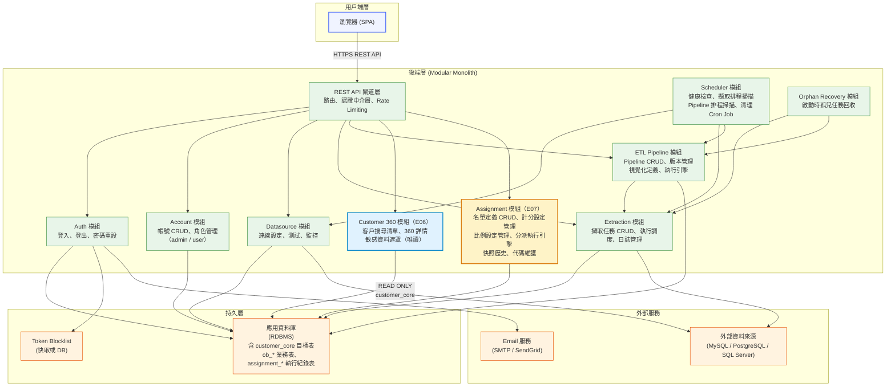
```mermaid
graph TD
    subgraph 用戶端["用戶端層"]
        Browser["瀏覽器 (SPA)"]
    end

    subgraph 後端["後端層 (Modular Monolith)"]
        API["REST API 閘道層<br/>路由、認證中介層、Rate Limiting"]
        AuthMod["Auth 模組<br/>登入、登出、密碼重設"]
        AccountMod["Account 模組<br/>帳號 CRUD、角色管理<br/>（admin / user）"]
        DatasourceMod["Datasource 模組<br/>連線設定、測試、監控"]
        ExtractionMod["Extraction 模組<br/>擷取任務 CRUD、執行調度、日誌管理"]
        ETLMod["ETL Pipeline 模組<br/>Pipeline CRUD、版本管理<br/>視覺化定義、執行引擎"]
        C360Mod["Customer 360 模組（E06）<br/>客戶搜尋清單、360 詳情<br/>敏感資料遮罩（唯讀）"]
        AssignmentMod["Assignment 模組（E07）<br/>名單定義 CRUD、計分設定管理<br/>比例設定管理、分派執行引擎<br/>快照歷史、代碼維護"]
        Scheduler["Scheduler 模組<br/>健康檢查、擷取排程掃描<br/>Pipeline 排程掃描、清理 Cron Job"]
        OrphanRecoveryMod["Orphan Recovery 模組<br/>啟動時孤兒任務回收"]
    end

    subgraph 持久層["持久層"]
        AppDB["應用資料庫<br/>(RDBMS)<br/>含 customer_core 目標表<br/>ob_* 業務表、assignment_* 執行紀錄表"]
        TokenStore["Token Blocklist<br/>(快取或 DB)"]
    end

    subgraph 外部["外部服務"]
        Email["Email 服務<br/>(SMTP / SendGrid)"]
        TargetDB["外部資料來源<br/>(MySQL / PostgreSQL / SQL Server)"]
    end

    Browser -->|"HTTPS REST API"| API
    API --> AuthMod
    API --> AccountMod
    API --> DatasourceMod
    API --> ExtractionMod
    API --> ETLMod
    API --> C360Mod
    API --> AssignmentMod
    AssignmentMod --> AppDB
    Scheduler --> DatasourceMod
    Scheduler --> ExtractionMod
    Scheduler --> ETLMod
    OrphanRecoveryMod --> ExtractionMod
    OrphanRecoveryMod --> ETLMod
    ETLMod --> ExtractionMod
    AuthMod --> AppDB
    AuthMod --> TokenStore
    AuthMod --> Email
    AccountMod --> AppDB
    DatasourceMod --> AppDB
    DatasourceMod --> TargetDB
    ExtractionMod --> AppDB
    ExtractionMod --> TargetDB
    ETLMod --> AppDB
    C360Mod -->|"READ ONLY<br/>customer_core"| AppDB

    classDef layer fill:#f0f4ff,stroke:#4f6ef7,stroke-width:2px
    classDef module fill:#e8f5e9,stroke:#388e3c,stroke-width:1px
    classDef c360module fill:#e0f2fe,stroke:#0284c7,stroke-width:2px
    classDef external fill:#fff3e0,stroke:#e65100,stroke-width:1px
    class Browser layer
    classDef assignmentmodule fill:#fef3c7,stroke:#d97706,stroke-width:2px
    class API,AuthMod,AccountMod,DatasourceMod,ExtractionMod,ETLMod,Scheduler,OrphanRecoveryMod module
    class C360Mod c360module
    class AssignmentMod assignmentmodule
    class Email,TargetDB,AppDB,TokenStore external
```

### 1.2 架構選擇理由

| 決策 | 選擇 | 理由 |
|------|------|------|
| 整體架構 | Modular Monolith | 使用者規模 500 人以下、開發團隊小、MVP 階段。Microservices 的操作複雜度在此規模不合理。 |
| 前端 | SPA | 規格書明確假設（A6）。Admin 後台需要豐富互動體驗（儀表板、即時狀態更新）。 |
| API 風格 | RESTful API | 標準、可預測，與 SPA 搭配成熟。規格書已定義所有端點路徑與 HTTP 方法。 |
| Session 管理 | JWT + Refresh Token | OQ-1 決議。支援無狀態水平擴展，短效 Access Token 降低洩漏風險。 |
| Token 失效 | Token Blocklist | NFR-001.1 明確要求。用於登出、帳號停用、密碼重設後強制失效。 |
| 排程 | 內建 Scheduler 模組 | MVP 排程需求包含靜態 Cron（健康檢查每 30 分鐘、清理每日）與動態 Cron 掃描（擷取排程每分鐘），引入獨立排程服務（如 BullMQ）過度複雜。 |
| 擷取執行模型 | Promise-based 非同步執行 | MVP 擷取為 I/O 密集（資料庫查詢），Node.js 非同步 I/O 足以應對；API 層回傳 `202 Accepted`，前端 Polling 取得進度。 |
| Pipeline 定義儲存 | JSONB 欄位 | Pipeline 節點與連線結構為非固定 schema，JSONB 提供靈活儲存並支援 PostgreSQL 原生 JSONB 查詢；版本 Diff 在應用層計算。 |
| Pipeline 執行引擎 | 同 Monolith 內的 Promise-based 循序執行 | MVP 規模下節點數量有限，I/O 密集型操作，Node.js 非同步 I/O 已足夠；BullMQ 等佇列系統引入 Redis 依賴，不符 MVP 複雜度預算。 |
| Pipeline 視覺化編輯器 | 前端 React Flow | 規格書 F029 明確建議；SPA 架構下純前端即可實現拖拉畫布；定義以 JSONB 序列化後傳送至後端儲存。 |
| 技術棧 | Node.js + NestJS + React + PostgreSQL | 詳見第 10 節技術棧決策。 |

### 1.3 關鍵取捨

- **選擇 Modular Monolith 而非 Microservices**：犧牲部分服務獨立擴展能力，換取顯著較低的開發與運維複雜度。MVP 並發需求（100 人）可由單機處理。
- **JWT 短效 Access Token + Refresh Token**：比純 blocklist 方案複雜，但安全性更佳，且支援未來 SSO 整合（Phase 2）。
- **Polling 而非 WebSocket**（儀表板更新）：OQ-9 決議。降低後端實作複雜度，30 秒輪詢對監控場景可接受。擷取任務進度 Polling 採 3 秒間隔（F021/F024）。
- **Promise-based 非同步執行而非 BullMQ / Worker Thread**（擷取作業與 Pipeline 執行）：MVP 任務為 I/O 密集（資料庫批次查詢），Node.js 事件循環可有效處理。BullMQ 引入 Redis 強依賴與額外運維複雜度，不符 MVP 規模。
- **Pipeline 定義以 JSONB 儲存而非正規化關聯表**：節點類型有 13 種（13 種 Transform + Extract + Load），各節點設定結構差異大，正規化設計需大量 JOIN 且擴展困難。JSONB 儲存允許應用層解析，版本 Diff 於後端計算後回傳 API。
- **Pipeline 排程複用 Extraction Scheduler 掃描模式**：每分鐘掃描符合排程條件的 Pipeline，避免引入動態 Cron Job 管理複雜度（每個 Pipeline 獨立 Cron 物件需追蹤生命週期）。

---

## 2. 系統上下文

### 2.1 外部參與者與整合點

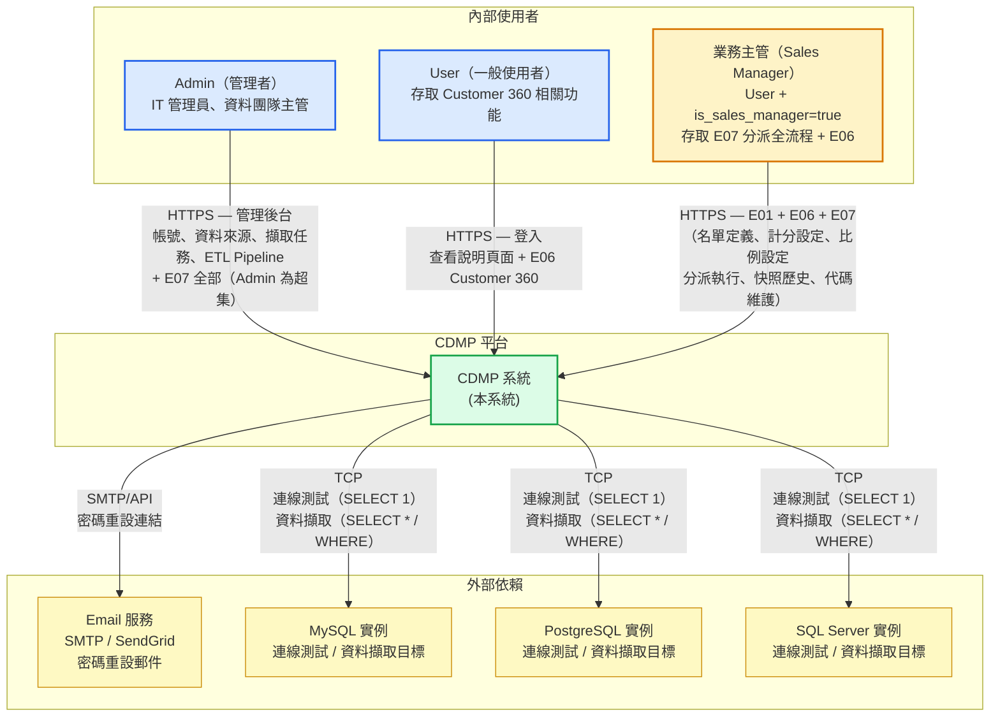
```mermaid
graph TB
    subgraph 內部使用者["內部使用者"]
        Admin["Admin（管理者）<br/>IT 管理員、資料團隊主管"]
        User["User（一般使用者）<br/>存取 Customer 360 相關功能"]
        SalesManager["業務主管（Sales Manager）<br/>User + is_sales_manager=true<br/>存取 E07 分派全流程 + E06"]
    end

    subgraph CDMP["CDMP 平台"]
        System["CDMP 系統<br/>(本系統)"]
    end

    subgraph 外部服務["外部依賴"]
        EmailSvc["Email 服務<br/>SMTP / SendGrid<br/>密碼重設郵件"]
        MySQL["MySQL 實例<br/>連線測試 / 資料擷取目標"]
        PostgreSQL["PostgreSQL 實例<br/>連線測試 / 資料擷取目標"]
        SQLServer["SQL Server 實例<br/>連線測試 / 資料擷取目標"]
    end

    Admin -->|"HTTPS — 管理後台<br/>帳號、資料來源、擷取任務、ETL Pipeline<br/>+ E07 全部（Admin 為超集）"| System
    User -->|"HTTPS — 登入<br/>查看說明頁面 + E06 Customer 360"| System
    SalesManager -->|"HTTPS — E01 + E06 + E07<br/>（名單定義、計分設定、比例設定<br/>分派執行、快照歷史、代碼維護）"| System
    System -->|"SMTP/API<br/>密碼重設連結"| EmailSvc
    System -->|"TCP<br/>連線測試（SELECT 1）<br/>資料擷取（SELECT * / WHERE）"| MySQL
    System -->|"TCP<br/>連線測試（SELECT 1）<br/>資料擷取（SELECT * / WHERE）"| PostgreSQL
    System -->|"TCP<br/>連線測試（SELECT 1）<br/>資料擷取（SELECT * / WHERE）"| SQLServer

    classDef actor fill:#dbeafe,stroke:#2563eb,stroke-width:2px
    classDef salesactor fill:#fef3c7,stroke:#d97706,stroke-width:2px
    classDef system fill:#dcfce7,stroke:#16a34a,stroke-width:2px
    classDef external fill:#fef9c3,stroke:#ca8a04,stroke-width:1px
    class Admin,User actor
    class SalesManager salesactor
    class System system
    class EmailSvc,MySQL,PostgreSQL,SQLServer external
```

### 2.2 信任邊界

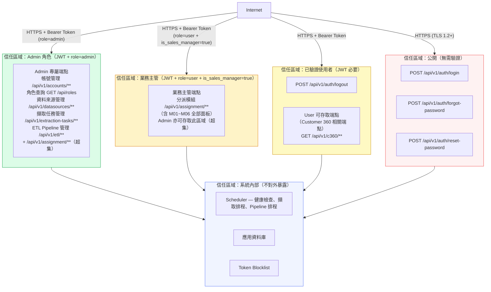
```mermaid
graph TB
    subgraph TZ_Public["信任區域：公開（無需驗證）"]
        Login["POST /api/v1/auth/login"]
        ForgotPw["POST /api/v1/auth/forgot-password"]
        ResetPw["POST /api/v1/auth/reset-password"]
    end

    subgraph TZ_Auth["信任區域：已驗證使用者（JWT 必要）"]
        Logout["POST /api/v1/auth/logout"]
        UserEndpoints["User 可存取端點<br/>（Customer 360 相關端點）<br/>GET /api/v1/c360/**"]
    end

    subgraph TZ_SalesManager["信任區域：業務主管（JWT + role=user + is_sales_manager=true）"]
        SalesEndpoints["業務主管端點<br/>分派模組 /api/v1/assignment/**<br/>（含 M01~M06 全部面板）<br/>Admin 亦可存取此區域（超集）"]
    end

    subgraph TZ_Admin["信任區域：Admin 角色（JWT + role=admin）"]
        AdminEndpoints["Admin 專屬端點<br/>帳號管理 /api/v1/accounts/**<br/>角色查詢 GET /api/roles<br/>資料來源管理 /api/v1/datasources/**<br/>擷取任務管理 /api/v1/extraction-tasks/**<br/>ETL Pipeline 管理 /api/v1/etl/**<br/>+ /api/v1/assignment/**（超集）"]
    end

    subgraph TZ_Internal["信任區域：系統內部（不對外暴露）"]
        Scheduler["Scheduler — 健康檢查、擷取排程、Pipeline 排程"]
        DB["應用資料庫"]
        TokenStore["Token Blocklist"]
    end

    Internet -->|"HTTPS (TLS 1.2+)"| TZ_Public
    Internet -->|"HTTPS + Bearer Token"| TZ_Auth
    Internet -->|"HTTPS + Bearer Token<br/>(role=user + is_sales_manager=true)"| TZ_SalesManager
    Internet -->|"HTTPS + Bearer Token (role=admin)"| TZ_Admin
    TZ_Admin --> TZ_Internal
    TZ_SalesManager --> TZ_Internal
    TZ_Auth --> TZ_Internal
    TZ_Public --> TZ_Internal

    classDef public fill:#fef2f2,stroke:#ef4444
    classDef auth fill:#fef9c3,stroke:#ca8a04
    classDef sales fill:#fef3c7,stroke:#d97706
    classDef admin fill:#dcfce7,stroke:#16a34a
    classDef internal fill:#f0f4ff,stroke:#4f6ef7
    class TZ_Public public
    class TZ_Auth auth
    class TZ_SalesManager sales
    class TZ_Admin admin
    class TZ_Internal internal
```

### 2.3 外部依賴摘要

| 外部依賴 | 通訊方式 | 用途 | 相關 Feature |
|---------|---------|------|-------------|
| Email 服務（SMTP / SendGrid） | SMTP 或 HTTPS API | 寄送密碼重設連結 | F009 |
| MySQL 實例 | TCP（Port 3306） | 連線測試（`SELECT 1`）、自動健康檢查、資料擷取（批次 SQL Query） | F015, F016, F021, F023 |
| PostgreSQL 實例 | TCP（Port 5432） | 連線測試（`SELECT 1`）、自動健康檢查、資料擷取（批次 SQL Query） | F015, F016, F021, F023 |
| SQL Server 實例 | TCP（Port 1433） | 連線測試（`SELECT 1`）、自動健康檢查、資料擷取（批次 SQL Query） | F015, F016, F021, F023 |
| 瀏覽器 | HTTPS | 使用者介面 | 全部 |

> **E05 新增說明**：ETL Pipeline 的 Extract 節點讀取 AppDB 內的 raw data 表（不直接連外部資料庫），Load 節點寫入 AppDB 內的目標表（Phase 1 MVP 為 `customer_core`，約 45 欄位，整合 ZZIP_BAMCUST_M 與 MLMCUSTOMER 兩個來源），因此 ETL Pipeline 執行不新增外部依賴，資料流閉合於 AppDB 內部。Target Table Registry 為 in-process 靜態定義，無額外依賴。

> **E07 新增說明**：E07 Assignment Module 不直連 OB 資料庫。OB 系統業務表（OBMLISTDF、OBPOOLDATA_LIST 等）已全數遷移至 AppDB（以 `ob_` 前綴 snake_case 命名），E07 所有讀寫操作均對 AppDB 執行。`ob_pool_data`（案件池）由 E04 擷取任務定期從 OB 原始系統匯入（建議月初執行一次）；E07 月名單分派 Stage 1 讀取的 `ob_pool_data` 資料新鮮度由 E04 任務頻率控制。E07 不引入新的外部系統依賴。

> **注意**：資料擷取（F021/F023）對目標資料庫的流量性質與連線測試（`SELECT 1`）顯著不同——擷取為批次資料讀取（`SELECT * FROM table` 或增量 `WHERE col > value`），可能涉及大量資料傳輸，對目標資料庫的負載影響需評估。

---

## 3. 邏輯架構

### 3.1 元件總覽


```mermaid
graph TB
    subgraph Frontend["前端 (SPA)"]
        Router["路由層<br/>角色導向 / 守護"]
        AuthPages["驗證頁面<br/>登入、忘記密碼、重設密碼"]
        AdminPages["Admin 管理頁面<br/>帳號清單、新增帳號、編輯帳號<br/>資料來源清單、新增、編輯<br/>資料來源狀態儀表板<br/>擷取任務儀表板、任務清單<br/>建立/編輯擷取任務、執行日誌<br/>Pipeline 列表、視覺化編輯器<br/>Pipeline 日誌、版本管理"]
        C360Pages["Customer 360 頁面（E06）<br/>客戶清單（搜尋 / 篩選 / 分頁）<br/>客戶 360 詳情（8 個資料分類）"]
        UserPage["User 說明頁面"]
        APIClient["API Client<br/>JWT 附加、錯誤處理、Retry"]
    end

    subgraph Backend["後端 (Modular Monolith)"]
        Middleware["中介層<br/>JWT 驗證、RBAC 守衛<br/>Rate Limiting、CORS、Input Sanitization"]

        subgraph AuthModule["Auth 模組"]
            LoginSvc["Login Service<br/>bcrypt 比對、JWT 發行"]
            LogoutSvc["Logout Service<br/>Token 加入 Blocklist"]
            PwResetSvc["Password Reset Service<br/>Token 產生/驗證、Email 觸發"]
        end

        subgraph AccountModule["Account 模組"]
            AccountSvc["Account Service<br/>CRUD、雙層角色指派<br/>停用/啟用、密碼重設"]
            RoleSvc["Role Service<br/>角色清單查詢（Seed Data）<br/>角色有效性驗證"]
        end

        subgraph DatasourceModule["Datasource 模組"]
            DsSvc["Datasource Service<br/>CRUD、AES-256 加密/解密<br/>連線測試邏輯"]
            DashboardSvc["Dashboard Service<br/>摘要統計、告警計算<br/>效能指標查詢"]
        end

        subgraph ExtractionModule["Extraction 模組"]
            ExtTaskSvc["ExtractionTask Service<br/>CRUD、啟用/停用、軟刪除"]
            ExtExecSvc["ExtractionExecution Service<br/>非同步執行引擎、進度更新<br/>手動/排程/重試 共用邏輯"]
            ExtDashSvc["ExtractionDashboard Service<br/>摘要統計、趨勢圖<br/>效能排名查詢"]
        end

        subgraph ETLModule["ETL Pipeline 模組"]
            PipelineSvc["Pipeline Service<br/>CRUD、啟用/停用、軟刪除<br/>版本管理（建立/回滾/發布）"]
            PipelineDefSvc["Pipeline Definition Service<br/>儲存/載入 JSONB definition<br/>連線規則驗證、step_count 更新"]
            PipelineExecSvc["Pipeline Execution Service<br/>非同步執行引擎（節點循序執行）<br/>Extract/Transform/Load 節點執行<br/>進度更新（5 秒 Polling）"]
            PipelineVersionSvc["Pipeline Version Service<br/>版本 Diff 計算<br/>發布前測試執行驗證"]
        end

        subgraph SchedulerModule["Scheduler 模組"]
            HealthCron["Health Check Cron<br/>每 30 分鐘<br/>呼叫 Datasource Service"]
            ExtractionCron["Extraction Scheduler Cron<br/>每分鐘<br/>掃描動態 Cron 任務"]
            PipelineCron["Pipeline Scheduler Cron<br/>每分鐘<br/>掃描 active + enabled Pipeline"]
            CleanupCron["Cleanup Cron<br/>清理過期 Token / HealthLog<br/>清理過期 ExtractionLog<br/>清理過期 EtlPipelineLog<br/>修復孤立 running 狀態"]
        end

        subgraph OrphanRecoveryModule["Orphan Recovery 模組（F038）"]
            OrphanSvc["OrphanRecovery Service<br/>OnApplicationBootstrap<br/>回收孤兒 ExtractionTask（E04）<br/>回收孤兒 EtlPipeline（E05）"]
        end

        subgraph C360Module["Customer 360 模組（E06）"]
            C360Controller["C360 Controller<br/>GET /api/v1/c360/customers/stats<br/>GET /api/v1/c360/customers<br/>GET /api/v1/c360/customers/:customerId"]
            C360Svc["C360 Service<br/>統計摘要、搜尋邏輯<br/>360 詳情組裝、敏感資料遮罩"]
            CustomerCoreRepo["CustomerCoreRepository<br/>Raw SQL / QueryBuilder<br/>FTS 查詢（tsvector/tsquery）<br/>customer_core 唯讀抽象層"]
        end

        subgraph AssignmentModule["Assignment 模組（E07）"]
            AssignmentListSvc["AssignmentList Service<br/>名單定義 CRUD（ob_list_definition）<br/>LIST_NO 自動產生（OB{YYYYMM}{NNN}）<br/>同月 999 筆上限 → 422"]
            AssignmentScoringSvc["AssignmentScoring Service<br/>計分卡版本管理（ob_levelcard_*）<br/>CARD_LEVEL 門檻 / TIER_LEVEL 對應<br/>複雜計分邏輯呼叫 PostgreSQL function"]
            AssignmentRatioSvc["AssignmentRatio Service<br/>per-LIST_NO 部門比例（ob_dept_pct）<br/>人員比例（ob_empl_set）<br/>CR 回分規則開關"]
            AssignmentCodeSvc["AssignmentCode Service<br/>代碼維護（ob_code_df）<br/>PROD_KIND / SPEC_TP / CASE_STATUS"]
            AssignmentRunSvc["AssignmentRun Service<br/>觸發月名單分派（202 非同步）<br/>Stage 0~4 執行引擎<br/>快照原子性寫入（Transaction）"]
            AssignmentSnapshotSvc["AssignmentSnapshot Service<br/>歷史清單、快照詳情<br/>兩次執行差異比對"]
            AssignmentAuditSvc["AssignmentAudit Service<br/>E07 所有 CRUD 操作稽核<br/>寫入 assignment_audit_log"]
        end

        subgraph SharedInfra["共用基礎建設"]
            CryptoUtil["Crypto Util<br/>AES-256 加解密"]
            HashUtil["Hash Util<br/>bcrypt 雜湊/比對"]
            JWTUtil["JWT Util<br/>簽發/驗證/Blocklist 查詢"]
            EmailUtil["Email Util<br/>SMTP/SendGrid 發送"]
            Logger["Logger<br/>結構化日誌（禁止記錄憑證）"]
        end
    end

    subgraph Persistence["持久層"]
        AppDB["應用資料庫<br/>User / Datasource / PasswordResetToken / DatasourceHealthLog<br/>ExtractionTask / ExtractionLog / raw_{task_id_short}<br/>EtlPipeline / EtlPipelineVersion / EtlPipelineLog<br/>customer_core（E05 目標表）<br/>ob_list_definition / ob_pool_data / ob_pool_data_list<br/>ob_dept_pct / ob_empl_set / ob_code_df<br/>ob_levelcard_version / ob_levelcard_column / ob_levelcard_score / ob_levelcard_level<br/>assignment_run / assignment_run_snapshot / assignment_audit_log"]
        TokenStore["Token Blocklist Store"]
    end

    subgraph External["外部"]
        EmailExt["Email 服務"]
        TargetDBs["目標資料庫群"]
    end

    Router --> AuthPages
    Router --> AdminPages
    Router --> C360Pages
    Router --> UserPage
    AuthPages --> APIClient
    AdminPages --> APIClient
    APIClient -->|"REST API HTTPS"| Middleware
    Middleware --> AuthModule
    Middleware --> AccountModule
    Middleware --> DatasourceModule
    Middleware --> ExtractionModule
    Middleware --> ETLModule
    Middleware --> C360Module
    SchedulerModule --> DatasourceModule
    SchedulerModule --> ExtractionModule
    SchedulerModule --> ETLModule
    OrphanRecoveryModule --> ExtractionModule
    OrphanRecoveryModule --> ETLModule
    ETLModule --> ExtractionModule
    AuthModule --> SharedInfra
    AccountModule --> SharedInfra
    DatasourceModule --> SharedInfra
    ExtractionModule --> SharedInfra
    ETLModule --> SharedInfra
    SharedInfra --> AppDB
    SharedInfra --> TokenStore
    EmailUtil --> EmailExt
    DsSvc -->|"TCP 連線測試"| TargetDBs
    ExtExecSvc -->|"TCP 批次資料擷取"| TargetDBs
    PipelineExecSvc -->|"讀取 raw_* 表<br/>寫入 customer_* 表"| AppDB
    C360Controller --> C360Svc
    C360Svc --> CustomerCoreRepo
    CustomerCoreRepo -->|"READ ONLY<br/>customer_core"| AppDB
    C360Pages --> APIClient
    Middleware --> AssignmentModule
    AssignmentModule --> SharedInfra
    AssignmentListSvc -->|"CRUD ob_list_definition"| AppDB
    AssignmentScoringSvc -->|"讀寫 ob_levelcard_*<br/>呼叫 PostgreSQL function"| AppDB
    AssignmentRatioSvc -->|"讀寫 ob_dept_pct / ob_empl_set"| AppDB
    AssignmentCodeSvc -->|"CRUD ob_code_df"| AppDB
    AssignmentRunSvc -->|"讀 ob_pool_data\n寫 ob_pool_data_list\n寫 assignment_run / snapshot"| AppDB
    AssignmentAuditSvc -->|"寫入 assignment_audit_log"| AppDB

    classDef frontend fill:#dbeafe,stroke:#2563eb
    classDef c360fe fill:#bfdbfe,stroke:#1d4ed8,stroke-width:2px
    classDef module fill:#dcfce7,stroke:#16a34a
    classDef etlmodule fill:#fce7f3,stroke:#db2777
    classDef c360module fill:#e0f2fe,stroke:#0284c7,stroke-width:2px
    classDef assignmentmodule fill:#fef3c7,stroke:#d97706,stroke-width:2px
    classDef orphan fill:#e8f4fd,stroke:#2196F3,stroke-width:1px
    classDef shared fill:#f3e8ff,stroke:#9333ea
    classDef persist fill:#fef9c3,stroke:#ca8a04
    classDef external fill:#fef2f2,stroke:#ef4444
    class Frontend,Router,AuthPages,AdminPages,UserPage,APIClient frontend
    class C360Pages c360fe
    class AuthModule,AccountModule,DatasourceModule,ExtractionModule,SchedulerModule module
    class ETLModule,PipelineSvc,PipelineDefSvc,PipelineExecSvc,PipelineVersionSvc etlmodule
    class C360Module,C360Controller,C360Svc,CustomerCoreRepo c360module
    class AssignmentModule,AssignmentListSvc,AssignmentScoringSvc,AssignmentRatioSvc,AssignmentCodeSvc,AssignmentRunSvc,AssignmentSnapshotSvc,AssignmentAuditSvc assignmentmodule
    class OrphanRecoveryModule,OrphanSvc orphan
    class SharedInfra,CryptoUtil,HashUtil,JWTUtil,EmailUtil,Logger shared
    class AppDB,TokenStore persist
    class EmailExt,TargetDBs external
```

### 3.2 各元件職責說明

#### 前端 SPA

| 子模組 | 職責 | 輸入 / 輸出 |
|--------|------|------------|
| 路由層 | 依 JWT 中的 `role` 欄位導向對應頁面；未驗證時導回登入頁 | JWT（localStorage / cookie）→ 路由決策 |
| 驗證頁面（AuthPages） | 登入表單、忘記密碼、重設密碼頁面；前端欄位驗證 | 使用者輸入 → API 請求 |
| Admin 管理頁面 | 帳號管理（F004-F010）、資料來源管理（F011-F016）、擷取任務管理（F017-F025）、ETL Pipeline 管理（F027-F034, F036）所有 UI | API 回應 → 畫面渲染 |
| Customer 360 頁面（E06） | 客戶清單頁（`/c360/customers`）：統計摘要卡片、搜尋框、類型篩選下拉、分頁列表；客戶 360 詳情頁（`/c360/customers/:customerId`）：8 個資料分類卡片、風控旗標高亮、ETL 資料新鮮度警告；Admin 與 User 兩種角色均可存取（F046, F047） | API 回應 → 畫面渲染；遮罩值由後端回傳，前端直接顯示 |
| User 說明頁面 | 靜態說明內容，無可操作功能（MVP 限制） | — |
| API Client | 統一附加 `Authorization: Bearer {token}` header；處理 401/403 回應；提供 Loading 狀態管理；支援不同 Polling 頻率（儀表板 30 秒、擷取進度 3 秒、Pipeline 執行進度 5 秒） | 業務邏輯請求 → HTTP 請求 |

**重要設計決策**：Access Token 的儲存位置（`localStorage` vs `httpOnly Cookie`）由實作團隊決定，但需注意：`localStorage` 面臨 XSS 風險；`httpOnly Cookie` 需處理 CSRF 防護。建議使用 `httpOnly Cookie`。

#### 後端中介層（Middleware）

| 中介層 | 職責 | 執行順序 |
|--------|------|---------|
| CORS | 限制允許的 Origin（OQ-12 決議，需要 CORS 設定） | 1 |
| Rate Limiting | 登入端點：5 次/分鐘/IP（OQ-5 決議）；密碼重設端點：同樣限制 | 2 |
| JWT 驗證 | 驗證 Bearer Token 格式、簽章、有效期；查詢 Token Blocklist | 3 |
| RBAC 守衛 | 依端點定義的角色需求比對 JWT payload 中的 `role`；支援 2 種角色（admin / user）；未授權存取回傳 403 | 4 |
| Input Sanitization | 清除 XSS 與 SQL Injection 惡意字元 | 5 |

#### Auth 模組

| 服務 | 職責 | 關鍵函式 | 相關 Feature |
|------|------|---------|-------------|
| Login Service | 驗證 Email/密碼；發行 Access Token + Refresh Token | `login(email, password, rememberMe)` | F001, F002 |
| Logout Service | 將 Access Token 加入 Blocklist；撤銷 Refresh Token | `logout(userId, token)` | F003 |
| Password Reset Service | 產生 `PasswordResetToken`；觸發 Email 發送；驗證 Token；更新密碼 Hash；失效所有現有 Token | `requestReset(email)`, `resetPassword(token, newPassword)` | F009 |

**Access Token 策略**（依 OQ-1 決議）：
- 短效 Access Token（預設 8 小時；記住我 30 天）
- Refresh Token 用於無停機 JWT Secret 輪替（OQ-11 決議）
- 登出時 Access Token 加入 Blocklist，Refresh Token 撤銷

#### Account 模組

| 服務 | 職責 | 關鍵業務規則 | 相關 Feature |
|------|------|-----------|-------------|
| Account Service | 帳號 CRUD；系統角色指派（admin / user）；**業務角色（`business_role`）變更**（v2.11 / 2026-05-16 / E07 合併重構 AD-E07 v3.0：`AccountsService.updateBusinessRole()`，見下方說明）；停用/啟用；Admin 代為重設密碼 | 最後一位 Admin 保護（ACCOUNT_LAST_ADMIN）；Admin 不可停用自己（ACCOUNT_SELF_DISABLE）；Email 大小寫不敏感唯一性；停用時失效所有 Session；指派系統角色前驗證 role_code 為有效的預設角色之一；**`business_role` 僅可由 Admin 透過 PATCH `/api/v1/accounts/:id/business-role` 變更（[F006a](features/F006a-update-business-role.md) 定義；v2.11 取代 v2.10 之 PATCH `/e07-role` 端點）** | F004-F010, F006a, F073, F074 |
| Role Service | 提供角色清單查詢（`GET /api/roles`）；角色 Seed Data 初始化（migration 自動執行）；角色 role_code 有效性驗證（供 Account Service 使用） | 不提供角色新增 / 刪除 API（AC-2，US-017）；角色資料為 Seed Data，不可由 API 修改 | F004, ~~F008（DEPRECATED v3.x）~~（US-017, US-014） |

**`AccountsService.updateBusinessRole()` 元件說明（v2.11 / 2026-05-16 / E07 合併重構）**：

| 項目 | 規格 |
|------|------|
| Method 簽名 | `updateBusinessRole(targetUserId: string, newRole: 'director' \| 'section_chief' \| null, actorId: string): Promise<UserResponseDto>` |
| 觸發來源 | PATCH `/api/v1/accounts/:id/business-role`（Admin only，見 [F006a](features/F006a-update-business-role.md)） |
| 同 transaction 寫入 | (a) UPDATE `users.business_role`；(b) UPDATE `users.password_changed_at = new Date(Date.now() + 1000)`；(c) INSERT `assignment_audit_log`（`action = 'ASSIGN_ROLE'` / `'REVOKE_ROLE'`、`entity_type = 'business_role'`、`entity_id = '{userId}\|{role}'`） |
| Token revoke 機制 | **沿用 F009 / F010 既有 `password_changed_at` 機制**（已上線並驗證）；不新建 token blocklist 表、**不新增 `AuthService.revokeAllUserTokens(userId)` method**（與下方 [RESOLVED] 註記對應） |
| 錯誤碼 | 404 `ACCOUNT_NOT_FOUND`（目標帳號不存在）；422 `ACCOUNT_BUSINESS_ROLE_INVALID`（值非允許列表）；403 `AUTH_FORBIDDEN`（呼叫者非 admin，由既有 RolesGuard 拋出） |
| ~~`AccountsService.updateE07Role()`~~ | **v2.10 / DEPRECATED v2.11**：舊 PATCH `/e07-role` 端點之 method 由 `updateBusinessRole()` 取代；行為與簽名相同（僅 method 名與 column 名變更） |
| ~~`AccountsService.updateSalesManagerFlag()`~~ | **F008 舊 method / DEPRECATED v2.11**：`users.is_sales_manager` 欄位於 m14 migration DROP；本 method 已無對應欄位可寫入 |

**E07 後端 Guard 元件清單（v2.11 / 2026-05-16 新增 / E07 合併重構）**：

| Guard 名稱 | 通過條件 | 失敗錯誤碼 | 適用範圍 |
|---|---|---|---|
| `DirectorOrSectionChiefGuard`（取代舊 `SalesManagerGuard`） | `req.user.role === 'admin'` OR `req.user.businessRole IN ('director', 'section_chief')` | 403 `E07_ROLE_NOT_ASSIGNED` | E07 全部 controller 入口（M02 除外） |
| `DirectorGuard` | `req.user.role === 'admin'` OR `req.user.businessRole === 'director'` | 403 `AUTH_FORBIDDEN` | 部長專屬功能（M02 全部端點含 GET、M06 寫入、月名單分派觸發、名單 CRUD、M03a / M03c / M03d Rollback） |
| `SectionChiefGuard` | `req.user.businessRole === 'section_chief'` | 403 `AUTH_FORBIDDEN` | 處長專用端點（少數明確標記） |

> **檢查順序**：JWT 驗證 → `DirectorOrSectionChiefGuard` → `DirectorGuard`（若功能為部長專屬）→ service 層 `scopeByCreator()`（處長轄區過濾）。詳見 [F002 v2.0 §4.6](features/F002-user-login.md#e07-角色矩陣)。

~~**SalesManagerGuard**~~ **（v2.11 廢除）**：v1.x 之 `SalesManagerGuard` 已由 `DirectorOrSectionChiefGuard`（一般入口）+ `DirectorGuard`（部長專屬）兩 Guard 取代；既有 `@RequireSalesManager()` decorator 一律改為 `@RequireDirector()` 或 `@RequireDirectorOrSectionChief()`。

**[RESOLVED] `AuthService.revokeAllUserTokens(userId)` 設計決策（v2.10 / v2.11 沿用）**：

E07 重構批次 1 階段（2026-05-15）system-architect 草案曾提及可新增顯式 method `AuthService.revokeAllUserTokens(userId)` 作為 token revoke 的統一入口。經 PO 決議（2026-05-16），採方案：

- **不新增此方法**。由 `AccountsService.updateBusinessRole()` 直接寫入 `users.password_changed_at`（最低跨模組耦合原則），AuthGuard 既有比對邏輯（`JWT.iat * 1000 < password_changed_at`）即可達成「批次 revoke 該 user 所有舊 token」效果
- **若未來確實需要顯式 method 名**（例如統一稽核 log 識別 token revoke 來源、或多處 service 需共用），可再加 thin wrapper 集中於 `AuthService`，本決策不阻擋未來擴充
- 此決策同步適用於：F006a / F007 / F009 / F010 / 任何未來需「批次 revoke 單一 user 所有 token」之場景


**樂觀鎖定**（OQ-6 決議）：帳號編輯與資料來源編輯均採用 Optimistic Locking，以版本號或 `updated_at` 時間戳記偵測並發衝突，回傳 HTTP 409。

**架構決策 AD-E02-1（更新 2026-04-24）：角色 + is_sales_manager 旗標 RBAC 模型**

CDMP 系統角色維持 2 種（admin / user），但新增 `is_sales_manager` 布林欄位擴充業務主管能力，實現角色與功能旗標的正交組合：

| 身份 | role | is_sales_manager | 可存取模組 |
|------|------|-----------------|-----------|
| 管理者 | `admin` | 任意（忽略） | 全部（E01~E07） |
| 業務主管 | `user` | `true` | E01 + E06 + E07 全部（M01~M06） |
| 一般使用者 | `user` | `false` | E01 + E06 |

**RBAC 中介層檢查順序**：
1. JWT 驗證（token 有效、未過期、未在 blocklist）
2. `role` 欄位檢查（admin 端點要求 `role=admin`）
3. 需要業務主管權限的端點（`/api/v1/assignment/**`）額外檢查 `is_sales_manager=true`（Admin 無需此檢查，已在步驟 2 通過）

**JWT Payload 更新**：新增 `is_sales_manager: boolean` 欄位，與 `role` 一同在登入時寫入 payload；帳號的 `is_sales_manager` 變更後，舊 JWT 仍有效直至過期（短效 8h/30d Access Token 機制提供自然過期），若需即時失效需將 Token 加入 Blocklist。

原有 role_code 說明：

| 角色 role_code | 用途 |
|--------------|------|
| `admin` | 完整平台管理權限（帳號、資料來源、擷取任務、ETL Pipeline、E07 分派） |
| `user` | 一般使用者；可存取 E06 Customer 360；若 `is_sales_manager=true` 額外存取 E07 分派全流程 |

**架構決策 AD-E02-2：角色為 Seed Data，不提供動態 CRUD**

**決策（2026-04-02 業務確認）**：2 種角色為系統預設，在 migration 時自動建立（Seed Data），不開放 Admin 自行新增或刪除。

**理由**：系統僅需 Admin / User 兩種固定角色。角色名稱為業務域的固定概念（來自組織設計），不需動態管理。

**實作約束**：
- 後端不提供 `POST /api/roles` 與 `DELETE /api/roles/:code` 端點；若透過 API 嘗試，回傳 `403 Forbidden`
- `GET /api/roles` 為唯一暴露的角色端點，僅限 Admin 存取
- Seed Data 透過 TypeORM Migration 執行，不透過 Seeder Script，確保部署流程原子性

**架構決策 AD-E02-3：User 表 role 欄位策略（Enum 擴充 vs 外鍵關聯）**

| 方案 | 說明 | 取捨 |
|------|------|------|
| **方案 A（採用）**：User.role 使用 Enum（2 種值） | `role` 欄位使用 Enum，值為 `admin` 與 `user` | 實作簡單；無需 JOIN；角色驗證在應用層完成。缺點：新增角色需 DB migration 修改 Enum 型別。 |
| 方案 B：User.role 改為外鍵 FK 指向 roles 表 | 建立 `roles` 參考表，`user.role_code` 為外鍵 | 資料正規化更完整；新增角色只需 INSERT。缺點：每次查詢 User 需 JOIN roles；角色 Seed Data 需在 FK 約束前建立，migration 順序複雜。 |

**選擇方案 A（Enum）的理由**：角色為固定 Seed Data（AD-E02-2），不支援動態新增；Enum 型別已充分表達「值集合固定」的語意。避免引入額外 JOIN 及 migration 順序複雜度。應用層的 `RoleService.validateRoleCode()` 負責業務層驗證，與 DB Enum 約束形成雙重防護。

**JWT Payload 中的 role 欄位**（影響 Auth 模組）：JWT payload 的 `role` 欄位承載角色值，結構為 `role: "admin" | "user"`。RBAC 中介層依此欄位判斷存取權限。

---

**架構決策 AD-E02-4（新增 2026-05-13）：前端路由 Guard 模型與共用 Sidebar 架構**

> **問題根因**：`manager@cdmp.test`（`role=user, is_sales_manager=true`）登入後被 redirect 至 `/user-info`，該頁無 sidebar，使用者完全無法導覽。現有三個 Guard（`ProtectedRoute` / `AdminRoute` / `UserRoute`）均不讀取 `is_sales_manager`，且 `AdminRoute` 在 `role !== 'admin'` 時一律 redirect 至 `/user-info`。此外，各 Page 各自渲染 sidebar 造成散落，E07 功能上線後維護困難。

##### AD-E02-4-A：Route Guard 模型

系統前端維護 **4 個** Route Guard，職責如下：

| Guard 名稱 | 放行條件 | 未通過時 redirect | 適用路由 |
|---|---|---|---|
| `ProtectedRoute` | `isAuthenticated() === true` | `/login` | 所有受保護路由的最外層（可單獨使用） |
| `AdminRoute` | `isAuthenticated() && role === 'admin'` | `/c360/customers` | `/`、`/datasources/**`、`/extraction-tasks/**`、`/etl-pipelines/**` |
| `SalesManagerRoute` | `isAuthenticated() && (role === 'admin' \|\| isSalesManager === true)` | `/c360/customers` | `/assignment/**`（E07 全部路由） |
| `UserRoute` | **廢棄**。原職責（保護 `/user-info`）由 `ProtectedRoute` 取代 | — | — |

**關鍵變更說明：**

1. `AdminRoute` redirect 目標由 `/user-info` 改為 `/c360/customers`。Customer 360 對所有已認證身份開放，是最合適的 fallback 著陸頁。
2. `SalesManagerRoute` 新增：採用 **嚴格布林比對** `isSalesManager === true`（非 truthy），防止舊 token 的 `undefined` 值誤放行。Admin 視為超集，無需持有 `is_sales_manager` 旗標即可通過。
3. `UserRoute` 廢棄：原設計限定 `role === 'user'` 才放行，會將 admin 擋在 `/user-info` 之外；且 `/user-info` 在 MVP 階段已無存在必要（見下方 AD-E02-4-C）。
4. `ProtectedRoute` 維持不變，僅檢查 `isAuthenticated()`。

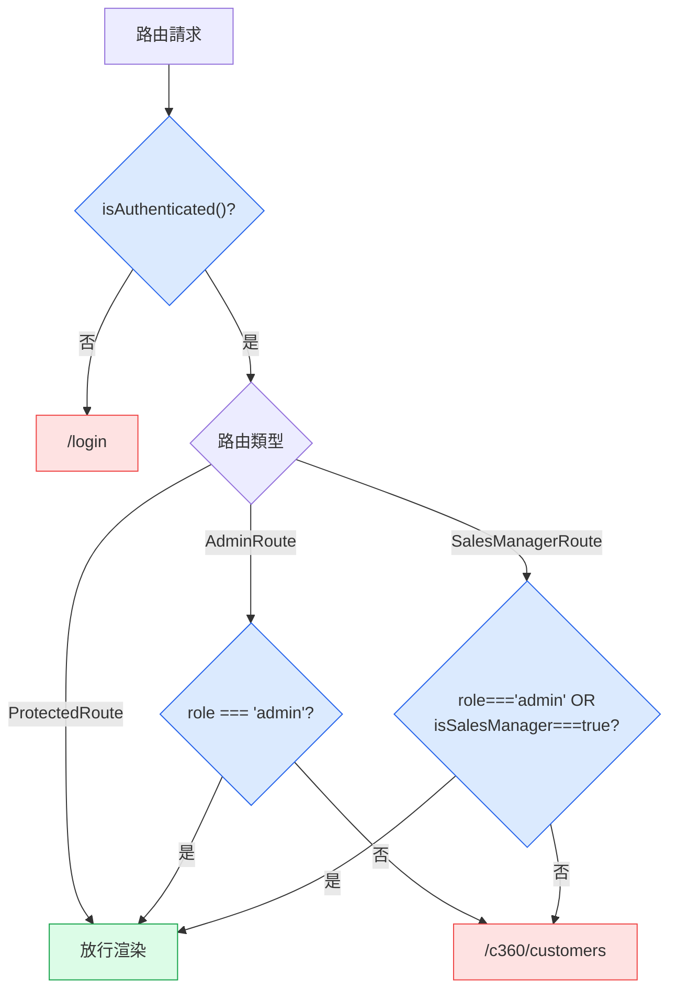
```mermaid
graph TD
    Request["路由請求"] --> IsAuth{"isAuthenticated()?"}
    IsAuth -->|否| Login["/login"]
    IsAuth -->|是| RouteType{"路由類型"}
    RouteType -->|AdminRoute| IsAdmin{"role === 'admin'?"}
    RouteType -->|SalesManagerRoute| IsSM{"role==='admin' OR<br/>isSalesManager===true?"}
    RouteType -->|ProtectedRoute| Allow["放行渲染"]
    IsAdmin -->|是| Allow
    IsAdmin -->|否| C360["/c360/customers"]
    IsSM -->|是| Allow
    IsSM -->|否| C360

    classDef guard fill:#dbeafe,stroke:#2563eb
    classDef redirect fill:#fee2e2,stroke:#ef4444
    classDef allow fill:#dcfce7,stroke:#16a34a
    class IsAuth,IsAdmin,IsSM guard
    class Login,C360 redirect
    class Allow allow
```

##### AD-E02-4-B：路由 Guard 對應表（完整）

| Route | 目前 Guard | 建議 Guard | 備註 |
|---|---|---|---|
| `/` | `AdminRoute` | `AdminRoute` | redirect 目標改為 `/c360/customers` |
| `/datasources/**` | `AdminRoute` | `AdminRoute` | 同上 |
| `/extraction-tasks/**` | `AdminRoute` | `AdminRoute` | 同上 |
| `/etl-pipelines/**` | `AdminRoute` | `AdminRoute` | 同上 |
| `/c360/customers` | `ProtectedRoute` | `ProtectedRoute` | 不變，全身份可用 |
| `/c360/customers/:id` | `ProtectedRoute` | `ProtectedRoute` | 不變 |
| `/user-info` | `UserRoute` | **移除或改 `ProtectedRoute`**（見 AD-E02-4-C） | `UserRoute` 廢棄 |
| `/assignment/**`（E07，待實作） | — | `SalesManagerRoute` | Admin + 業務主管可用 |

##### AD-E02-4-C：`/user-info` 存廢決策

**決策：保留路由，改為通用 Settings/Profile 頁面，套用 `ProtectedRoute`（全身份可用）。**

理由：
- MVP 階段 Customer 360 已對所有身份開放，「目前尚無可用功能」的說明訊息已無語意。
- 廢棄路由會造成已存在書籤失效。
- 改為簡易 Profile 頁（顯示姓名、Email、角色、`is_sales_manager` 狀態）仍具使用價值，且可作為未來帳號設定的進入點。
- `ProtectedRoute` 保護即可，無需角色限制。
- **Sidebar 處理**：`/user-info` 改版後應套用共用 `<AppLayout>`（見 AD-E02-4-D），讓使用者能在 Profile 頁看到 sidebar 並自由導覽。

**ASSUMPTION-AD-E02-4-C-1**：`/user-info` 頁面的「目前尚無可用功能」訊息更新為 Profile 顯示內容，由 TDD Developer 於實作時定案（不需 spec-writer 額外建立新 Feature spec，屬 UI 層調整）。

##### AD-E02-4-D：登入後導向策略

**決策：在 LoginPage 的 `onSuccess` callback 依 `user.role` + `user.isSalesManager` 決定 redirect 目標。**

| 實質身份 | 條件 | 登入後導向 |
|---|---|---|
| 管理者 | `role === 'admin'` | `/`（帳號管理頁） |
| 業務主管 | `role === 'user' && isSalesManager === true` | `/c360/customers` |
| 一般使用者 | `role === 'user' && isSalesManager !== true` | `/c360/customers` |

**選擇在 LoginPage 處理而非根 router 的理由**：根 router 的 redirect 邏輯難以讀取 `isSalesManager`（`AdminRoute` 只做 admin/非admin 二分），且在根 router 實作「依 isSalesManager 三向分岔」會導致 guard 邏輯與 redirect 邏輯分散在兩處，不易維護。LoginPage 已有 `onSuccess` 時機，集中處理最清晰。

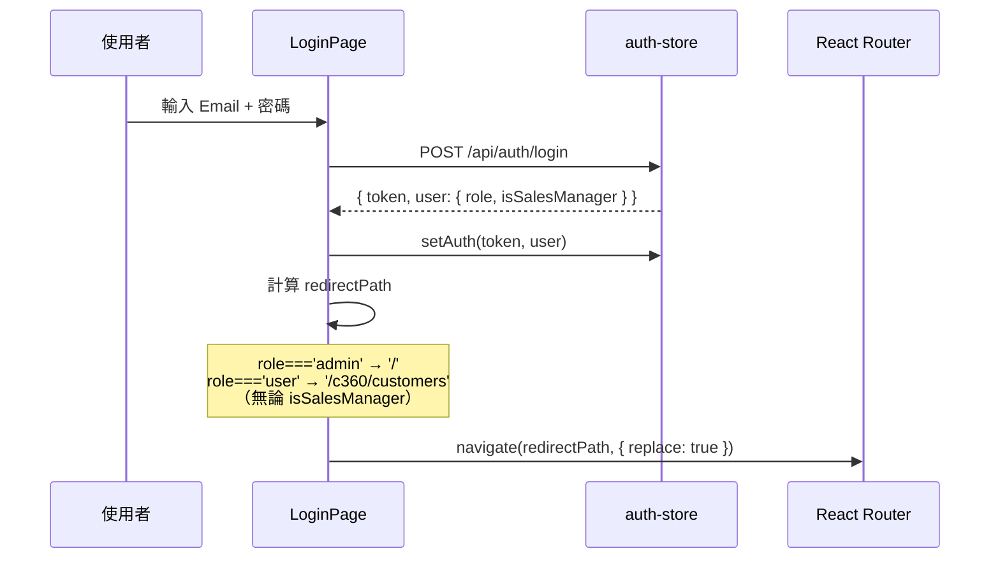
```mermaid
sequenceDiagram
    participant U as 使用者
    participant LP as LoginPage
    participant AS as auth-store
    participant R as React Router

    U->>LP: 輸入 Email + 密碼
    LP->>AS: POST /api/auth/login
    AS-->>LP: { token, user: { role, isSalesManager } }
    LP->>AS: setAuth(token, user)
    LP->>LP: 計算 redirectPath
    Note over LP: role==='admin' → '/'<br/>role==='user' → '/c360/customers'<br/>（無論 isSalesManager）
    LP->>R: navigate(redirectPath, { replace: true })
```

**注意**：業務主管與一般使用者均導向 `/c360/customers`，導向邏輯因此簡化為二分而非三分。兩者的功能差異由 sidebar 可見項目與 `SalesManagerRoute` 在執行時期控制，無需登入時分派至不同路徑。

##### AD-E02-4-E：共用 Sidebar 元件架構

**決策：抽出共用 `<AppLayout>` 元件，包含 `<AppSidebar>` 子元件，依 `role` + `isSalesManager` 動態 render menu items。取代各 Page 各自渲染 sidebar 的散落模式。**

**Menu 設定資料結構（宣告式）：**

```typescript
type MenuRequires = 'authenticated' | 'admin' | 'sales_manager';

interface MenuItem {
  to: string;
  label: string;
  icon: string;           // lucide-react icon name
  requires: MenuRequires;
}

interface MenuGroup {
  label: string;
  items: MenuItem[];
}

interface MenuSection {
  label: string;           // 分組標頭（如「資料治理」、「應用模組」）
  groups: MenuGroup[];     // 含可折疊子項的群組（如「客戶名單分派」）
  items?: MenuItem[];      // 直屬 item（無子群組）
}
```

**過濾邏輯規則：**

| `requires` 值 | 顯示條件 |
|---|---|
| `'authenticated'` | 永遠顯示（已通過 `ProtectedRoute`） |
| `'admin'` | `role === 'admin'` |
| `'sales_manager'` | `role === 'admin' \|\| isSalesManager === true` |

**`is_sales_manager` 讀取來源**：`auth-store.getUser().isSalesManager`，嚴格比對 `=== true`。舊 token 的 `undefined` 值視同 `false`。`isSalesManager` 為 `optional` 欄位（`UserInfo` 型別），實作時需以 `user?.isSalesManager === true` 模式防禦 `undefined`。

**Sidebar Menu 設定（依 prototype/27-list-definition.html 對齊）：**

```
── 資料治理（requires: admin）
│   ├── 帳號管理      /             admin
│   ├── 資料來源      /datasources   admin
│   ├── 資料擷取      /extraction-tasks  admin
│   └── ETL Pipeline  /etl-pipelines     admin
──（分隔線）
── 應用模組
│   ├── Customer 360  /c360/customers    authenticated
│   └── 客戶名單分派（可折疊群組，requires: sales_manager）
│       ├── 代碼維護   /assignment/base-codes    sales_manager
│       ├── 計分卡設定  /assignment/scoring        sales_manager
│       ├── 比例設定   /assignment/ratios         sales_manager
│       ├── 名單定義   /assignment/list-definitions  sales_manager
│       ├── Stage 0 試算  /assignment/estimate     sales_manager
│       ├── 觸發月名單分派   /assignment/run            sales_manager
│       ├── 執行進度   /assignment/run-progress   sales_manager
│       ├── 結果摘要   /assignment/run-summary    sales_manager
│       ├── 執行歷史   /assignment/history        sales_manager
│       ├── 快照詳情   /assignment/snapshots      sales_manager
│       └── 結果比對   /assignment/compare        sales_manager
```

**E07 子項顯示策略：**
- 「客戶名單分派」群組整體以 `requires: 'sales_manager'` 控制，一般使用者看不到此群組。
- E07 子項在 MVP 期間以 **路由 stub 方式實作**（回傳「施工中」畫面），**不使用 `[尚未實作]` 標籤或 disabled 樣式**。理由：業務主管登入後應能看到完整導覽結構，disabled 項目會造成困惑；stub 頁面保留可點擊性且不暴露技術細節。
- 「客戶名單分派」折疊群組預設展開（`defaultOpen: true`），以對齊 prototype 中的活躍狀態表示。

**實作順序建議：**
1. 建立 `apps/web/src/components/layout/app-sidebar.tsx`（宣告式 menu config + 過濾邏輯）
2. 建立 `apps/web/src/components/layout/app-layout.tsx`（包含 sidebar + header + 主內容 slot）
3. 在 `auth-store.ts` 新增 `getIsSalesManager(): boolean` helper（`user?.isSalesManager === true`）
4. 在 `protected-route.tsx` 新增 `SalesManagerRoute`；廢棄 `UserRoute`（保留空 export 避免編譯錯誤，標記 `@deprecated`）
5. 更新 `App.tsx`：調整 `AdminRoute` redirect 目標；所有 `/assignment/**` 路由套用 `SalesManagerRoute`；`/user-info` 改用 `ProtectedRoute`
6. 更新 LoginPage：在 `onSuccess` 依 `role` 決定 redirect 目標（admin → `/`，其他 → `/c360/customers`）
7. 逐一將各 page 的 sidebar 渲染移除，改為套用 `<AppLayout>`

**風險：RISK-AD-E02-4-1**（中等）：`UserInfo.isSalesManager` 為 `optional` 欄位（`isSalesManager?: boolean`），舊 token 可能為 `undefined`。所有判斷必須以 `=== true` 嚴格比對，不可使用 truthy 判斷式。影響：`SalesManagerRoute`、sidebar 過濾邏輯、`getIsSalesManager()` helper 均需遵循此規則。

##### AD-E02-4-F：Assignment Module Sidebar IA v2.3 重整（2026-05-21）

> **決策背景**：prototype v2.3 同步更新了全部 35 個 HTML 的 sidebar 結構（`assignmentPages` array）。本節記錄該次重整的架構決策與不變式，作為 React 落地時的導覽 IA ground truth。

###### AD-E02-4-F-1：Sidebar Entry 最終清單（11 entries）

「客戶名單分派」可折疊群組的最終 entry 清單如下，以 prototype `assignmentPages` array 為唯一權威。React `<AppSidebar>` 的 menu config 必須與此清單一一對應。

| # | Label | Prototype 檔案 | React Route（預計） |
|---|---|---|---|
| 1 | 篩選欄位 | `37-base-code.html` | `/assignment/base-codes` |
| 2 | 計分卡設定 | `28-scoring-config.html` | `/assignment/scoring` |
| 3 | 名單定義 | `27-list-definition.html` | `/assignment/list-definitions` |
| 4 | 準備完成摘要 | `29d-ready-summary.html` | `/assignment/ready-summary` |
| 5 | Stage 0 試算 | `30-stage0-estimate.html` | `/assignment/estimate` |
| 6 | 觸發月名單分派 | `31-trigger-run.html` | `/assignment/run` |
| 7 | 執行進度 | `32-run-progress.html` | `/assignment/run-progress` |
| 8 | 結果摘要 | `33-run-summary.html` | `/assignment/run-summary` |
| 9 | 執行歷史 | `34-run-history.html` | `/assignment/history` |
| 10 | 快照詳情 | `35-snapshot-detail.html` | `/assignment/snapshots` |
| 11 | 結果比對 | `36-run-compare.html` | `/assignment/compare` |

**注意**：prototype `37-base-code.html` 對應代碼維護（已依 E07 Phase 3b 決策 rename 為「篩選欄位」）。AD-E02-4-E 舊版 menu config 中的 `/assignment/base-codes`（label「代碼維護」）落地時應使用本表 label「篩選欄位」。

###### AD-E02-4-F-2：工作流子頁 vs. 獨立功能入口判準

**判準定義**：

| 分類 | 定義 | 處置 |
|---|---|---|
| **獨立功能入口** | 使用者可主動導覽至此頁、不依賴特定上游操作作為前提 | 列入 sidebar entry |
| **工作流子頁** | 只能從特定 Kanban 卡片按鈕（per-stage 操作）進入、無法從 sidebar 直接抵達且不具獨立語意 | 不列入 sidebar；唯一入口為 M01 主頁卡片按鈕 |

**29a / 29b / 29c 的定位（v2.3 決策）**：

| 原型檔案 | 功能 | 分類 | 唯一入口 | 對應 Feature Spec |
|---|---|---|---|---|
| `29a-draft-review.html` | draft 審核（提交申請） | 工作流子頁 | 27 Kanban「draft」欄卡片按鈕 | F084（advance-to-approval）|
| `29b-dept-ratio.html` | 部門比例設定 | 工作流子頁 | 27 Kanban「dept_ratio」欄卡片按鈕 | [F079](features/F079-set-dept-ratio.md) |
| `29c-approval.html` | 個別比例簽核 | 工作流子頁 | 27 Kanban「personnel_ratio」欄卡片按鈕 | [F082](features/F082-set-personnel-ratio.md)、[F086](features/F086-approve-to-ready.md)、[F087](features/F087-reject-to-personnel-ratio.md) |

**子頁離開行為**：子頁完成或取消後跳回 M01 主頁（`/assignment/list-definitions`），並透過 `sessionStorage['cdmp.pendingToast']` signal 通知主頁顯示 toast。Signal Protocol 之完整定義見 **[F050 v2.2 §7 BR-13](features/F050-create-list-definition.md)**（本節不重複定義）。

M01 主頁為上述所有子頁的 consumer，init 時讀取 signal 並顯示 toast，詳見 **[F048 v2.0](features/F048-view-list-definition.md)**。

子頁入口操作矩陣（各角色在各 stage 可見哪些進入子頁的按鈕）見 **[F077 v1.3 §6 BR-7](features/F077-month-switch-and-stage-overview.md)**（本節不重複定義）。

###### AD-E02-4-F-3：Deprecated 項目

| 原型檔案 | 棄用原因 | 處置 |
|---|---|---|
| `29-ratio-config.html` | 被 29a / 29b / 29c / 29d 四頁取代；v2.3 已從所有 35 個原型的 sidebar 移除 | React 落地時不建立對應 route；如收到舊書籤請求，可 redirect 至 `/assignment/list-definitions` |

###### AD-E02-4-F-4：架構不變式（I-NAV-01 ~ I-NAV-05）

以下不變式在 prototype 同步完成（v2.3 / 2026-05-21）後成立，React 落地及後續 UI 迭代必須維持。

| ID | 不變式 |
|---|---|
| **I-NAV-01** | `assignmentPages` array（`toggleAssignmentSection()` 函式內）是 35 個 prototype HTML 之 sidebar entry 唯一定義來源；修改 sidebar entry 清單必須同步更新全部 35 個 prototype 檔案，不得只改部分。 |
| **I-NAV-02** | 「客戶名單分派」sidebar section 只列**獨立功能 / module 入口**（使用者可主動導覽），不列**工作流子頁**（依賴特定 Kanban 卡片按鈕才能合法進入的頁面）。 |
| **I-NAV-03** | 29a / 29b / 29c 三頁為工作流子頁，唯一入口為 M01 Kanban（`27-list-definition.html`）對應 stage 欄的卡片操作按鈕，**不在 sidebar 出現，不建立獨立 sidebar route stub**。 |
| **I-NAV-04** | 工作流子頁（29a / 29b / 29c）完成或取消離開時，必須透過 `sessionStorage['cdmp.pendingToast']` signal 通知 M01 主頁顯示 toast；不得以直接導覽或 URL query param 傳遞訊息。（Signal Protocol 見 F050 v2.2 §7 BR-13。） |
| **I-NAV-05** | `deprecated 29-ratio-config.html` 對應的 URL 在 React 落地時不建立 route；若接收到對應 URL 請求，redirect 至 `/assignment/list-definitions`，不回傳 404。 |

###### AD-E02-4-F-5：未來擴充原則

新增「客戶名單分派」相關頁面時，依以下決策樹判斷 sidebar 處置：

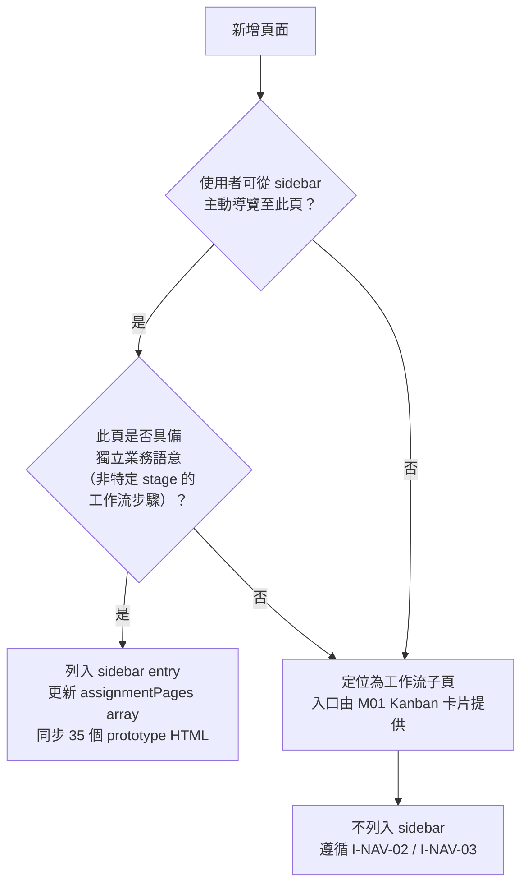
```mermaid
graph TD
    A[新增頁面] --> B{使用者可從 sidebar<br/>主動導覽至此頁？}
    B -- 是 --> C{此頁是否具備<br/>獨立業務語意<br/>（非特定 stage 的<br/>工作流步驟）？}
    C -- 是 --> D[列入 sidebar entry<br/>更新 assignmentPages array<br/>同步 35 個 prototype HTML]
    C -- 否 --> E[定位為工作流子頁<br/>入口由 M01 Kanban 卡片提供]
    B -- 否 --> E
    E --> F[不列入 sidebar<br/>遵循 I-NAV-02 / I-NAV-03]
```

**注意**：sidebar 入口增加會同步影響所有 35 個 prototype HTML（I-NAV-01），應在 prototype 同步完成後才進行 React 落地，避免 prototype 與 React 實作分歧。

---

#### Datasource 模組

| 服務 | 職責 | 關鍵業務規則 | 相關 Feature |
|------|------|-----------|-------------|
| Datasource Service | 資料來源 CRUD；AES-256 加密密碼；執行連線測試（`SELECT 1`，10 秒逾時）；更新狀態與 `last_tested_at`；寫入 `DatasourceHealthLog`；查詢外部資料來源的 schema 列表與 table 列表（透過 `IExtractionExecutor.listSchemas()` / `listTables()`） | 密碼 API 回應遮罩；編輯後重設狀態為 `unknown`；軟刪除使用 `deleted_at`；schema/table 查詢設定 10 秒逾時 | F011-F015, F017, F019 |
| Dashboard Service | 彙整儀表板摘要統計；計算告警（連續 >= 2 次失敗）；查詢效能趨勢資料 | 軟刪除資料來源排除；告警依 `consecutiveFailures` 降序 | F016 |

**連線測試隔離**：每次連線測試使用獨立的短期連線，不占用應用程式連線池（MVP 不使用連線池，OQ-R9 決議）。AES-256 解密後的密碼僅在記憶體中存在，測試完成後立即釋放。

**Schema / Table 查詢端點**（AD-E04-10）：Datasource Controller 提供兩個端點，供建立/編輯擷取任務時動態載入來源 schema 與 table 列表：

| 端點 | 說明 | 回應格式 |
|------|------|---------|
| `GET /api/v1/datasources/:id/schemas` | 查詢指定資料來源的可用 schema（或 database）列表 | `{ schemas: string[] }` |
| `GET /api/v1/datasources/:id/schemas/:schema/tables` | 查詢指定 schema 下的資料表列表 | `{ tables: string[] }` |

- 兩個端點均透過 `IExtractionExecutor` 介面的 `listSchemas()` 與 `listTables()` 方法連線外部資料庫查詢
- 設定 10 秒連線逾時；連線失敗時回傳 `503 Service Unavailable`
- 不使用快取機制，每次請求均即時查詢外部資料庫
- 僅 Admin 角色可存取

#### Extraction 模組

| 服務 | 職責 | 關鍵業務規則 | 相關 Feature |
|------|------|-----------|-------------|
| ExtractionTask Service | 擷取任務 CRUD；啟用/停用（toggle）；軟刪除；欄位驗證（cron 格式、增量模式必填欄位）；名稱唯一性（排除軟刪除） | Optimistic Locking；`status=running` 時禁止編輯/停用/刪除；cron 表達式以 `cron-parser` 驗證（UTC）；必須參考存在且未刪除的 Datasource | F017, F018, F019, F020, F025 |
| ExtractionExecution Service | 建立 ExtractionLog（`status=running`）；更新 ExtractionTask（`status=running`）；非同步執行擷取作業（含動態建表、批次讀取外部來源、批次寫入 AppDB raw data 表）；批次更新進度（`extracted_count`、`progress_percent`）；完成後更新統計（`avg_duration_ms`、`execution_count`）；增量模式成功後更新 `last_incremental_value` | 並發控制（`status=running` 時拒絕重複觸發，回傳 409）；執行失敗需捕捉例外並更新狀態為 `failed`；手動觸發可繞過 `enabled` 旗標；全量模式先 TRUNCATE 再寫入；增量模式追加寫入 | F021, F023 |
| ExtractionDashboard Service | 摘要統計（今日成功/失敗以 UTC+8 計算）；趨勢圖（7/14/30 天聚合查詢）；效能排名（Top 5 by `avg_duration_ms DESC`）；執行中任務列表 | 軟刪除任務排除；無執行紀錄時成功率回傳 `0.0`；今日起訖以 UTC+8 (Asia/Taipei) 為邊界 | F018（summary）, F024 |

**非同步執行模型**（AD-E04-1）：

`POST /api/v1/extraction-tasks/:id/run` 回傳 `202 Accepted`，擷取作業在背景非同步執行。

- **選擇方案**：Promise-based 背景作業。API 層建立 ExtractionLog 並更新 Task 狀態後，立即回傳 202；擷取邏輯在背景 Promise chain 中執行。
- **理由**：MVP 擷取為 I/O 密集（非 CPU 密集），Node.js 事件循環可有效處理。BullMQ 需要 Redis 依賴，超出 MVP 規模需求。
- **進度更新機制**：每批次（預設 `batch_size`，可配置 100-10000，預設 1000）更新 `ExtractionTask.extracted_count` 與 `progress_percent` 至資料庫；前端以 3 秒 Polling 讀取進度。
- **逾時機制**：擷取執行最長 2 小時（AQ-9 決議）。超時由 Cleanup Cron 偵測並標記為 `failed`。
- **共用設計**（AD-E04-3）：`ExtractionExecutionService` 為獨立可注入服務，同時被手動觸發 API 端點（F021）與排程 Cron Job（F023）呼叫，差異僅在 `triggered_by` 欄位值（`manual` / `schedule` / `retry`）。

**並發控制**（AD-E04-4）：採用資料庫樂觀檢查（執行前查詢 `status != 'running'`），而非分散式鎖。MVP 單機部署下此方案足夠；水平擴展時需升級為資料庫鎖或分散式鎖（詳見第 8 節）。

#### Scheduler 模組

| Cron Job | 執行頻率 | 職責 |
|---------|---------|------|
| Health Check Cron | 每 30 分鐘 | 平行測試所有未軟刪除的資料來源；呼叫 Datasource Service 的測試邏輯；寫入 `DatasourceHealthLog` |
| Extraction Scheduler Cron | 每分鐘 | 掃描 `enabled=true AND deleted_at IS NULL AND status != 'running'` 的擷取任務；以 `cron-parser` 比對 cron 表達式與當前 UTC 時間；觸發符合條件的任務（呼叫 ExtractionExecution Service，`triggered_by='schedule'`） |
| Pipeline Scheduler Cron | 每分鐘 | 掃描 `enabled=true AND deleted_at IS NULL AND status != 'running'` 且 `status = 'active'` 的 ETL Pipeline；以 `cron-parser` 比對 cron 表達式與當前 UTC 時間；觸發符合條件的 Pipeline（呼叫 Pipeline Execution Service，`triggered_by='schedule'`，使用最新 `published` 版本） |
| Cleanup Cron | 每日 | 清理超過 90 天的 `DatasourceHealthLog`（OQ-10 決議）；清理超過 30 天的 `ExtractionLog`（AQ-10 決議）；清理超過 30 天的 `EtlPipelineLog`（AQ-14 決議）；清理已過期的 `PasswordResetToken`；清理已過期的 Token Blocklist 記錄；修復孤立 running 日誌——ExtractionLog（AD-E04-7）與 EtlPipelineLog（AD-E05-2） |

**孤立 running 日誌修復**（AD-E04-7）：Cleanup Cron 每次執行時，將 `started_at < NOW() - 2 hours AND finished_at IS NULL` 的 ExtractionLog 標記為 `failed`（error_message: `'Execution timeout: exceeded 2 hour limit'`），並同步更新對應 ExtractionTask.status 為 `failed`。

**Raw Data 動態表管理**（AD-E04-8）：擷取任務首次執行時，系統自動於 AppDB 建立 raw data 表（`raw_{task_id_short}`）。表結構從外部來源表的 metadata（`INFORMATION_SCHEMA`）推斷。表名由系統自動生成（`raw_` + task_id 前 8 碼），僅包含 hex 字元，不接受使用者輸入，避免 SQL Injection 風險。欄位名稱經 sanitize 處理（僅允許字母、數字、底線）。

**Raw Data 寫入模式**（AD-E04-9）：
- **全量（full）**：每次執行前 `TRUNCATE TABLE raw_{task_id_short}`，再重新批次寫入全部資料
- **增量（incremental）**：根據 `incremental_column > last_incremental_value` 篩選新增資料，追加寫入
- **批次大小**：預設 1,000 筆/批次（可透過 `EXTRACTION_BATCH_SIZE` 環境變數配置，範圍 100-10,000）

**Raw Data 預覽 API**（AD-E04-10）：`GET /api/v1/extraction-tasks/:id/raw-data` 透過動態 SQL 查詢 raw data 表，支援分頁（`LIMIT` + `OFFSET`）與單欄位排序。不使用 ORM Entity，直接以 Raw SQL 操作動態表。百萬筆資料場景下，依賴 `_cdmp_id`（或主鍵）索引確保分頁效能。非索引欄位排序時附帶效能警告。

#### ETL Pipeline 模組（E05 新增）

| 服務 | 職責 | 關鍵業務規則 | 相關 Feature |
|------|------|-----------|-------------|
| Pipeline Service | Pipeline CRUD；啟用/停用（toggle）；軟刪除；名稱唯一性（排除軟刪除）；與 Version 服務協作完成建立與狀態管理 | 建立時同步建立初始 EtlPipelineVersion（version=1, status=draft）；啟用前驗證有 `published` 版本；`status=running` 時禁止刪除；軟刪除後排程自動排除 | F027, F028, F031, F034 |
| Pipeline Definition Service | 儲存/載入 Pipeline JSONB definition；連線規則驗證（Extract→Transform→Load 方向；禁止逆向循環連線）；更新 `step_count` | 草稿狀態允許不完整設定（節點未填完仍可儲存）；儲存成功後更新 EtlPipeline.step_count 為 nodes 數量 | F029 |
| Pipeline Execution Service | 建立 EtlPipelineLog（`status=running`）；更新 EtlPipeline.status；非同步節點循序執行（Extract→Transform→Load）；進度更新（`processed_count`）；完成後更新統計；測試執行（`is_test_run=true`）不計入正式統計 | 並發控制：`status=running` 時拒絕重複觸發（409）；手動/排程/測試/重試共用執行邏輯，差異僅在 `triggered_by` 與 `is_test_run`；測試執行成功後更新版本狀態 `draft→testing`；排程執行使用最新 `published` 版本 | F030, F033 |
| Pipeline Version Service | 版本歷史查詢；Diff 計算（節點增刪改）；回滾（建立新版本，複製舊版本內容）；發布（`testing→published`，驗證有成功測試執行記錄）；更新 EtlPipeline.version | 版本狀態單向流轉：`draft→testing→published`；發布前必須有 `is_test_run=true` 的成功執行記錄；回滾不修改舊版本，建立新版本（版本號遞增）；排程引擎僅使用最新 `published` 版本 | F033 |
| Target Table Service | 提供目標表清單與 schema 查詢；管理 Target Table Registry（in-process 靜態定義）；為 Load 節點提供欄位對應所需的 schema；標記 ETL 追蹤欄位（`isEtlTracking`）供前端介面識別 | Phase 1 MVP 僅含 `customer_core`（約 45 欄位，分 A~H 八類）；schema 定義為靜態，不支援 Admin 自訂（BR-4）；查詢不存在的表名回傳 404；ETL 追蹤欄位（`data_source`、`_etl_loaded_at`、`_etl_pipeline_id`）由系統自動填充，不可手動對應 | F036 |

**Pipeline 非同步執行模型**（AD-E05-1）：

`POST /api/v1/etl/pipelines/:id/execute` 與 `POST /api/v1/etl/pipelines/:id/test` 均回傳 `202 Accepted`，Pipeline 在背景非同步執行。

- **執行方式**：Promise-based 背景作業；API 層建立 EtlPipelineLog 並更新 Pipeline 狀態後立即回傳 202；節點執行邏輯在背景 Promise chain 中循序執行
- **節點執行順序**：依 definition 的 edges（有向無環圖 DAG）進行拓撲排序後循序執行
- **Extract 節點**：讀取 AppDB 內的 `raw_{task_id_short}` 動態表，以 Raw SQL 查詢（不使用 ORM Entity）
- **Transform 節點**：在應用記憶體中執行 14 種轉換邏輯（Merge/FieldMapping/Format/Conditional/NullHandler/TypeCast/Filter/Deduplicate/Lookup/CodeDecode/String/Masking/Aggregate/DerivedColumn）——`CodeDecode`（`code_decode`，AD-E05-7 / F110）為 `Lookup` 之泛用化，新增於 `lookup` 之後，`lookup` 本身不變、不淘汰
- **Load 節點**：以 UPSERT（主鍵衝突時 UPDATE，否則 INSERT）寫入目標表（`customer_core` 等）；自動填充 ETL 追蹤欄位（`data_source`、`_etl_loaded_at`、`_etl_pipeline_id`）
- **進度更新**：每個節點執行完成後更新 EtlPipelineLog.node_logs（JSONB）與 processed_count；前端以 5 秒 Polling 讀取進度
- **逾時機制**：Pipeline 執行最長 2 小時；超時由 Cleanup Cron 偵測並標記為 `failed`
- **孤立狀態修復**（AD-E05-2）：Cleanup Cron 每日執行時，將 `started_at < NOW() - 2 hours AND finished_at IS NULL` 的 EtlPipelineLog 標記為 `failed`，並同步更新對應 EtlPipeline.status

**Pipeline 版本管理設計**（AD-E05-3）：

版本狀態流轉（單向）：`draft` → `testing` → `published`

```
建立 Pipeline    → 同時建立 version=1, status=draft 的 EtlPipelineVersion
儲存 definition  → 更新當前 draft 版本的 definition（不建立新版本號）
測試執行成功     → 版本狀態 draft→testing
發布             → 版本狀態 testing→published；更新 EtlPipeline.version
回滾             → 複製舊版本內容，建立新的 draft 版本（版本號遞增）
```

**節點連線規則**（AD-E05-4）：

| 來源節點類型 | 可連接目標 | 禁止連接 |
|-------------|-----------|---------|
| Extract | Transform | Extract、Load、自身 |
| Transform | Transform、Load | Extract、自身（禁止循環） |
| Load | 無（終端節點） | Extract、Transform、Load |

**目標表 UPSERT 策略**（AD-E05-5）：Load 節點執行時以目標表的主鍵（Phase 1 MVP 僅 `customer_core.customer_id`）判斷 INSERT 或 UPDATE（PostgreSQL `ON CONFLICT DO UPDATE`）。目標表不透過 TypeORM Entity 管理，使用動態 SQL 執行寫入操作。Phase 2/3 新增目標表時，無需修改執行引擎，僅需在 Target Table Registry 中新增 schema 定義。

**Target Table Registry 設計**（AD-E05-6）：

目標表的 schema 定義採用「靜態程式碼內嵌（hardcoded in-process registry）」方式管理，而非資料庫表或外部設定檔。

| 設計元素 | 說明 |
|---------|------|
| 實作位置 | `target-table.service.ts` 內以 TypeScript 物件陣列定義 |
| 擴展機制 | 新增 Phase 2/3 目標表時，在 Registry 陣列中新增一個物件即可；符合開放封閉原則（Open/Closed Principle） |
| API 讀取 | `TargetTableService.listTables()` 與 `TargetTableService.getSchema(tableName)` 均從 in-process 陣列讀取，無 DB 查詢，回應速度極快 |
| 冪等性 | GET 端點完全冪等；schema 定義不隨執行狀態改變 |
| 欄位分類 | `customer_core` 的 45 個欄位依 A~H 八個語意分類組織（識別與分類、個人屬性、聯絡資訊、地址、職業與就業、財務與風控、企業客戶專屬、稽核與 ETL 追蹤） |
| ETL 追蹤欄位標記 | `isEtlTracking: true` 欄位（`data_source`、`_etl_loaded_at`、`_etl_pipeline_id`）在欄位對應介面以灰色標示，不可手動對應，由 Pipeline Execution Service 自動填充 |

**選擇靜態 Registry 而非資料庫表的理由**：目標表 schema 在 MVP 階段為靜態定義（BR-4），不支援 Admin 自訂；程式碼版本控制即為 schema 的唯一真實來源（single source of truth）；避免引入 `target_table_definitions` 管理表與對應 CRUD API 的額外複雜度。Phase 2/3 擴展時，透過程式碼變更（Git PR）新增 schema 定義，可享有程式碼審查與測試保護。

**來源資料表至目標表的資料流（F036 / US-049）**：

`customer_core` 整合兩個來源系統的資料，ETL 轉換規則在 Transform 節點中執行，Load 節點負責最終寫入。

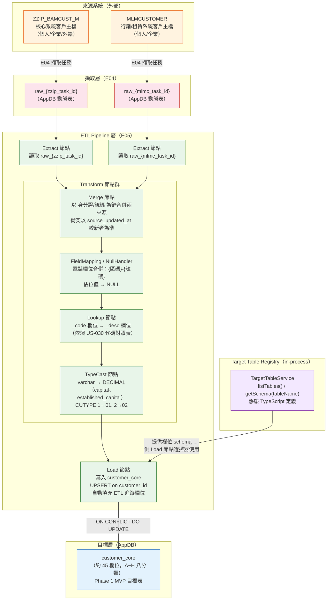
```mermaid
graph TD
    subgraph 來源系統["來源系統（外部）"]
        ZZIP["ZZIP_BAMCUST_M<br/>核心系統客戶主檔<br/>（個人/企業/外籍）"]
        MLMC["MLMCUSTOMER<br/>行銷/租賃系統客戶主檔<br/>（個人/企業）"]
    end

    subgraph ExtractionLayer["擷取層（E04）"]
        RawZZIP["raw_{zzip_task_id}<br/>（AppDB 動態表）"]
        RawMLMC["raw_{mlmc_task_id}<br/>（AppDB 動態表）"]
    end

    subgraph ETLLayer["ETL Pipeline 層（E05）"]
        ExtractNode1["Extract 節點<br/>讀取 raw_{zzip_task_id}"]
        ExtractNode2["Extract 節點<br/>讀取 raw_{mlmc_task_id}"]

        subgraph TransformNodes["Transform 節點群"]
            MergeNode["Merge 節點<br/>以 身分證/統編 為鍵合併兩來源<br/>衝突以 source_updated_at 較新者為準"]
            PhoneNode["FieldMapping / NullHandler<br/>電話欄位合併：{區碼}-{號碼}<br/>佔位值 → NULL"]
            CodeNode["Lookup 節點<br/>_code 欄位 → _desc 欄位<br/>（依賴 US-030 代碼對照表）"]
            TypeCastNode["TypeCast 節點<br/>varchar → DECIMAL<br/>（capital、established_capital）<br/>CUTYPE 1→01, 2→02"]
        end

        LoadNode["Load 節點<br/>寫入 customer_core<br/>UPSERT on customer_id<br/>自動填充 ETL 追蹤欄位"]
    end

    subgraph TargetLayer["目標層（AppDB）"]
        CustomerCore["customer_core<br/>（約 45 欄位，A~H 八分類）<br/>Phase 1 MVP 目標表"]
    end

    subgraph Registry["Target Table Registry（in-process）"]
        TargetSvc["TargetTableService<br/>listTables() / getSchema(tableName)<br/>靜態 TypeScript 定義"]
    end

    ZZIP -->|"E04 擷取任務"| RawZZIP
    MLMC -->|"E04 擷取任務"| RawMLMC
    RawZZIP --> ExtractNode1
    RawMLMC --> ExtractNode2
    ExtractNode1 --> MergeNode
    ExtractNode2 --> MergeNode
    MergeNode --> PhoneNode
    PhoneNode --> CodeNode
    CodeNode --> TypeCastNode
    TypeCastNode --> LoadNode
    LoadNode -->|"ON CONFLICT DO UPDATE"| CustomerCore
    TargetSvc -->|"提供欄位 schema<br/>供 Load 節點選擇器使用"| LoadNode

    classDef source fill:#fff3e0,stroke:#e65100
    classDef raw fill:#fce4ec,stroke:#c62828
    classDef etl fill:#e8f5e9,stroke:#2e7d32
    classDef target fill:#e3f2fd,stroke:#1565c0
    classDef registry fill:#f3e8ff,stroke:#7b1fa2
    class ZZIP,MLMC source
    class RawZZIP,RawMLMC raw
    class ExtractNode1,ExtractNode2,MergeNode,PhoneNode,CodeNode,TypeCastNode,LoadNode etl
    class CustomerCore target
    class TargetSvc registry
```

**Phase 2/3 擴展路徑**：

| Phase | 新增目標表 | 前提條件 | 擴展方式 |
|-------|---------|---------|---------|
| Phase 2 | `customer_financial` | 合約明細系統接入 | Target Table Registry 新增 schema 定義 + DB Migration 建表 |
| Phase 2 | `customer_interaction` | CRM / 行銷自動化接入 | 同上 |
| Phase 3 | `customer_service` | 客服工單系統接入 | 同上 |

擴展時執行引擎（Pipeline Execution Service）的 UPSERT 邏輯無需修改，僅需：①在 `target-table.service.ts` Registry 中新增 schema 物件、②執行 DB Migration 建立目標表、③新增對應的擷取任務（E04）。

**架構挑戰**：多實例部署時，Scheduler 可能同時執行導致重複健康檢查與重複擷取觸發。MVP 單機部署不受影響；若未來水平擴展，需引入分散式鎖定機制（見第 8 節）。

#### `code_decode` 節點架構設計（AD-E05-7，F110 / US-173）

> 完整 SQL 形狀（MSSQL/PG dialect 細節、duplicate-key tie-break、migration 設計）見 [`implementation-log/AD-E07-41-mssql-p4-etl-engine.md`](implementation-log/AD-E07-41-mssql-p4-etl-engine.md) §13。本節僅記錄架構層級決策（Why + What，非 How）。

**問題背景**：`customer_core` Pipeline 有 31 個 `lookup` 節點，其中 5 組（依字典表實例分組）各自對**同一張**小型字典表（約 3,000 列）以不同 filter 取出一欄描述。每個 `lookup` 節點是「就地全表 `ALTER TABLE ADD` + `UPDATE ... JOIN`」，在大分支（約 360 萬列）上每個 5–11 分鐘，19 個此類節點使解碼耗時逾 45 分鐘、整條 Pipeline 逼近 1.5 小時（US-173 背景）。

**AD-E05-7a：泛用單趟多重解碼設計（dialect-neutral）**——新增第 14 種轉換節點類型 `code_decode`：對**同一張**字典表，在**一次資料流掃描**中，以任意數量組「代碼欄位 → 描述欄位」mapping（每組可各自帶任意 filter：單一等式、複合條件、或無 filter）一次完成解碼，取代一組打同一字典表的 `lookup` 節點鏈。節點級只保留單一共用字典來源（`lookupRef`/`lookupSource`，解析規則與 `lookup` 完全一致）；比對欄、filter、輸出欄下沉至 per-mapping。固定 LEFT JOIN／NULL 語意（無對應 ⇒ 描述欄 NULL、不刪列），不提供 `noMatchStrategy`/`defaultValue`（單趟多 mapping 下 `skip_row` 之刪列語意與其他 mapping 保留列語意衝突，無法共存於一次掃描）。完整 config schema／等價契約／`lookup`⇒`code_decode` 決定性收斂對應見 [F110](features/F110-etl-code-decode-node.md) §5～§7（spec 層權威定義，本節不重複）。

**AD-E05-7b：`SELECT INTO` 新暫存表（非就地 `ALTER`+`UPDATE`）為核心效能決策**——`code_decode` 比照 `derived_field` 之「單一 minimally-logged 全表寫出」策略，而非比照 `lookup` 現行「就地新增欄位 + `UPDATE...FROM` 逐列更新」策略。理由：`lookup` 的就地 UPDATE 策略之所以合理，是因為它假設「一次只加一組欄位」，代價可接受；但 `code_decode` 一次要加 N 組欄位（customer_core 最多 9 組），若沿用就地策略需 N 次循序 `UPDATE...FROM`（僅省去 N-1 次全表複製，仍是 N 次全表隨機堆積寫入，效益有限）。改為單一 `SELECT <passthrough 欄位> , <N 組 LEFT JOIN 解碼欄位> INTO 新暫存表 FROM 主表 <N 個 LEFT JOIN>` 的單一循序寫入，一次寫完全部 N 組欄位。**實測依據**：360 萬列全表 `SELECT INTO`（minimally-logged）約 30 秒等級 vs. 單一 `lookup` 就地 UPDATE 5–11 分鐘（P6c 真實 dev MSSQL 量測，`OPTION (HASH JOIN)` 修法前）；即使 `lookup` 現行版本已加上 `OPTION (HASH JOIN)` 修法後降至數十秒等級，N=9 組仍需 N 次獨立全表 UPDATE 循序執行，`code_decode` 单一掃描一次完成 N 組解碼在**節點數**與**排程/暫存表管理開銷**上更精簡（對應 US-173 AC-3／F110 AC-11 之 3 分鐘門檻）。`lookup` 節點本身不因此變更（`lookup` 在單組 mapping 情境下就地 UPDATE 仍是合理選擇，兩節點類型並存、各自適用不同情境，見 AC-8/BR-10）。

**AD-E05-7c：PG + MSSQL 雙 Handler 檔案並行**——比照 AD-E07-41 P4 既有慣例（§1.2），新增 `code-decode-handler.ts`（PG）與 `code-decode-handler-mssql.ts`（MSSQL）兩個平行檔案，不在同一 class 內用 if/else 切兩種 SQL 產生邏輯；組裝點（`etl-pipeline-execution.service.ts` 之 `createDispatcher()`）依 `DB_TYPE` 分支各自 `dispatcher.register(...)`，與現行 9 個 handler 之註冊方式一致（新增第 10 對）。

**AD-E05-7d：節點連線規則**——`code_decode` 屬 Transform 類別節點，沿用既有節點連線規則（AD-E05-4）不新增例外：可接受 Extract/Transform 上游、可連往 Transform/Load 下游、禁止自身循環。輸入 handle 比照 `lookup` 之雙 handle 設計（`default`：主資料流，必要；`lookup-input`：選用第二輸入，供上游節點直接提供字典 DataSet，向下相容模式則由 `lookupRef`/`lookupSource` 動態解析）；輸出為單一 handle（單一新暫存表，非多輸出）。

**AD-E05-7e：不變式**

| ID | 說明 |
|---|---|
| **I-CODEDECODE-JOIN-FILTER-01** | 每組 mapping 的 filter 必須套用於「LEFT JOIN 右側的字典衍生子查詢（derived table）內部」，不得以主查詢層級的 `WHERE` 對已 LEFT JOIN 完成的結果做後置過濾——後者會使無對應列的字典欄位（NULL）被 WHERE 條件濾除，LEFT JOIN 語意實質退化為 INNER JOIN，違反 F110 AC-3／BR-3 |
| **I-CODEDECODE-DEDUP-TIEBREAK-01** | 字典子集（套用該 mapping filter 後）出現重複比對鍵時，必須在 LEFT JOIN 之前以確定性規則（`ROW_NUMBER() OVER (PARTITION BY 正規化鍵 ORDER BY 決定性排序鍵) = 1`）預先去重為每鍵至多一列，禁止未去重直接 JOIN（會使主表列數因字典重複鍵而增生／fan-out，於 360 萬列主表上為災難性錯誤） |
| **I-CODEDECODE-NORMALIZE-01** | 每一組 JOIN 比對鍵等式與每一個輸出值，正規化（TRIM + 文字轉型）須與 `LookupExecutor`（F043 §4.8）完全相同，此為 F110 §7.4 逐格等價契約的前提 |
| **I-CODEDECODE-COLLISION-01** | 輸出 SELECT 清單必須以「顯式欄位枚舉」組成（比照 `derived_field` 現行做法排除將被覆蓋之既有欄位），禁止使用 `SELECT *`／`m.*` 萬用字元——`outputAlias` 與既有輸入欄同名時會產生實體表重複欄名錯誤 |
| **I-CODEDECODE-EQ-01** | 比照 I-MSSQL-ETL-EQ-01：`customer_core` 每一個收斂後的 `code_decode` 節點，皆須有對應測試與其所取代之等價 `lookup` 節點鏈輸出逐格比對，不得僅憑 SQL 轉換表核對即宣稱完成 |

#### Orphan Recovery 模組（F038 新增）

**架構決策 AD-F038-1：獨立 Module 設計**

| 服務 | 職責 | 執行時機 | 相關 Feature |
|------|------|---------|-------------|
| OrphanRecovery Service | 在應用程式啟動時一次性回收孤兒任務；批次更新 `ExtractionTask`（E04）與 `EtlPipeline`（E05）的 `status=running` 記錄為 `failed`；同步更新對應的 Log 記錄 | `OnApplicationBootstrap`（HTTP Server 開始接受請求前執行） | F038 |

**為何建立獨立 Module 而非放入 Extraction 或 ETL Module**

- **職責分離**：回收邏輯是啟動時的系統行為，與 `ExtractionTaskModule`（業務 CRUD + 執行）和 `EtlModule`（Pipeline 管理）的業務職責無關。
- **跨模組依賴**：`OrphanRecoveryModule` 需同時注入 E04（`ExtractionTask`、`ExtractionLog`）與 E05（`EtlPipeline`、`EtlPipelineLog`）四個 Repository；若放入任一現有模組，另一方需被 import，產生不必要的模組耦合。
- **可測試性**：獨立 Module 可單獨進行整合測試，不需載入完整業務模組。
- **未來擴展性**：若需加入其他啟動時修復邏輯（如資料一致性檢查），可集中於此 Module。

**為何選擇 `OnApplicationBootstrap` 而非 `OnModuleInit`**

`OnApplicationBootstrap` 在**所有模組 DI 完成後**、HTTP Server 開始接受請求前觸發，確保 TypeORM Repository 均已就緒，且 HTTP 請求在回收完成前不被處理。`OnModuleInit` 在單一模組初始化完成後立即觸發，此時其他模組的 Repository 可能尚未就緒，不適用。

**Transaction 設計（AD-F038-2）**

E04（擷取任務）與 E05（ETL Pipeline）的回收在各自獨立的 Transaction 中執行：
- Transaction 1（E04）：批次更新 `extraction_tasks` + 批次更新對應 `extraction_logs`
- Transaction 2（E05）：批次更新 `etl_pipelines` + 批次更新對應 `etl_pipeline_logs`
- E04 Transaction 失敗不影響 E05 Transaction 的執行
- 兩組失敗均僅記錄 `Logger.error()`，不拋出例外，不中止應用程式啟動

**AppModule import 順序**

`OrphanRecoveryModule` 須在 `ExtractionTaskModule` 與 `EtlModule` 之後、`SchedulerModule` 之前 import，確保孤兒回收在排程引擎首次掃描前完成。

---

#### Customer 360 模組（E06 新增）

**架構決策 AD-E06-1：C360 模組直接查詢 customer_core 表，不建立 TypeORM Entity**

`customer_core` 目標表由 ETL Pipeline（E05）的 Load 節點以動態 SQL 管理，TypeORM 不持有其 Entity 定義。C360 模組採用 `DataSource.query()`（Raw SQL）或 `QueryBuilder` 存取 `customer_core`，透過 `CustomerCoreRepository` 抽象層封裝所有查詢邏輯。此決策避免在 TypeORM Entity 與 ETL 動態 Schema 之間產生雙重管理責任。

**架構決策 AD-E06-2：敏感資料遮罩硬編碼於 Service 層，依角色判斷**

遮罩邏輯（`maskIdNumber()`、`maskPhone()`）硬編碼於 `C360Service`，在 API 回應序列化前依 JWT payload 的 `role` 欄位決定是否套用遮罩，不使用 Middleware 或 Interceptor 攔截。規則：Admin 回傳完整明碼，User 回傳遮罩值。遮罩規則不支援動態設定（MVP 限制）。

**架構決策 AD-E06-3：全文搜尋使用 PostgreSQL 原生 FTS（tsvector/tsquery）**

C360 的姓名搜尋使用 PostgreSQL 原生全文搜尋（`tsvector` + `tsquery` + GIN 索引），不使用應用層 LIKE 查詢，亦不引入外部搜尋引擎（如 Elasticsearch）。MVP 資料量（≤ 1,000 筆）下，PostgreSQL FTS 加 GIN 索引已足以滿足 NFR-002 的 < 500ms 要求，避免引入額外系統依賴。

**架構決策 AD-E06-4：GIN 索引建立於獨立 Migration**

FTS 所需的 GIN 索引（`idx_customer_core_fulltext`）在獨立的 TypeORM Migration 中建立，不包含在 `customer_core` 建表 Migration 中。此設計使 C360 模組的前置依賴（GIN 索引）可獨立部署，並與 ETL Pipeline 的 Schema Migration 解耦。

```sql
-- Migration: AddCustomerCoreFullTextIndex
CREATE INDEX IF NOT EXISTS idx_customer_core_fulltext
  ON customer_core
  USING GIN (to_tsvector('simple', coalesce(name, '') || ' ' || coalesce(english_name, '')));
```

**架構決策 AD-E06-5：C360 模組在執行時期不依賴 Extraction 或 ETL Pipeline 模組**

C360 模組僅在執行時期依賴 Auth 模組（JWT 驗證）與應用資料庫（讀取 `customer_core`）。它不注入 ExtractionTaskService 或 PipelineService，只消費 ETL 產生的資料成果（`customer_core` 資料列）。模組邊界清晰，C360 為純粹的唯讀消費者。

| 服務 | 職責 | 關鍵業務規則 | 相關 Feature |
|------|------|-----------|-------------|
| C360 Controller | 提供 3 個 REST 端點；JWT 驗證強制（Admin / User 均可）；QueryString 驗證（keyword 最少 2 字元） | 所有端點需 Bearer Token；keyword < 2 字元回傳 422 | F046, F047 |
| C360 Service | 客戶統計摘要查詢；搜尋優先邏輯（idNumber 優先於 keyword）；類型篩選（AND 組合）；360 詳情 8 分類組裝；敏感資料遮罩 | BR-2（遮罩硬編碼）；BR-3（idNumber 優先）；BR-4（預設 name 升序）；BR-7（統計即時查詢，不快取） | F046, F047 |
| CustomerCoreRepository | 封裝所有 `customer_core` 查詢的 Raw SQL / QueryBuilder；分頁（LIMIT/OFFSET）；FTS 查詢（tsvector/tsquery）；精確比對（source_customer_no）；單筆詳情查詢（customer_id） | 不執行任何 INSERT / UPDATE / DELETE；所有查詢加上 `deleted_at IS NULL`（若 customer_core 有此欄位，否則無條件查詢） | F046, F047 |

**API 端點摘要**

| HTTP Method | 路徑 | 說明 | 角色 |
|-------------|------|------|------|
| GET | `/api/v1/c360/customers/stats` | 客戶統計摘要（總數、個人、企業、外籍） | Admin / User |
| GET | `/api/v1/c360/customers` | 客戶清單搜尋（keyword、idNumber、type、page、pageSize） | Admin / User |
| GET | `/api/v1/c360/customers/:customerId` | 單一客戶 360 詳情（85 欄位 / 8 分類） | Admin / User |

**搜尋優先邏輯**

```
若 idNumber 存在且非空 → 精確比對 source_customer_no（忽略 keyword）
若僅有 keyword（>= 2 字元）→ FTS：to_tsvector('simple', name || ' ' || english_name) @@ plainto_tsquery('simple', keyword)
兩者皆無 → 全部客戶（僅受 type 篩選影響）
type 篩選 → AND customer_type_code IN (...)
```

**Monorepo 結構（新增）**

```
apps/api/src/modules/
└── c360/                           # Customer 360 模組（E06）
    ├── c360.module.ts
    ├── c360.controller.ts          # 3 個端點
    ├── c360.service.ts             # 搜尋邏輯、遮罩、詳情組裝
    ├── customer-core.repository.ts # Raw SQL 查詢抽象層
    └── dto/
        ├── customer-list.dto.ts    # 回應 DTO（清單項目）
        ├── customer-detail.dto.ts  # 回應 DTO（360 詳情）
        └── customer-stats.dto.ts   # 回應 DTO（統計摘要）

apps/web/src/pages/
└── c360/
    ├── CustomerListPage.tsx        # 客戶清單（F046）
    └── CustomerDetailPage.tsx      # 客戶 360 詳情（F047）
```

---

#### E07 Assignment Module（客戶名單分派模組）

**架構決策 AD-E07-1：OB 業務資料完全遷移至 AppDB，Assignment Module 直接操作 ob_* 表**

OB 系統的業務表（OBMLISTDF 等 10 張表）已遷移至 AppDB，以 `ob_` 前綴 snake_case 命名。E07 不直連 OB 原始資料庫，所有讀寫操作均針對 AppDB，資料流閉合。`ob_pool_data`（案件池）由 E04 擷取任務定期從 OB 原始系統匯入（建議月初執行一次），E07 月名單分派 Stage 1 讀取此表。

**架構決策 AD-E07-2：月名單分派採非同步執行模型，三份快照原子性寫入**

`POST /api/v1/assignment/runs` 回傳 `202 Accepted`，月名單分派在背景 Promise chain 非同步執行 Stage 0~4。前端以 3 秒 Polling 讀取進度。同月僅允許一個 `pending` 或 `running` 狀態的月名單分派（重複觸發回傳 409）。月名單分派完成後，三份快照（config / input_list / result）在同一 DB Transaction 中原子性寫入 `assignment_run_snapshot`；任一失敗則整體 Rollback，`assignment_run.status` 改為 `failed`。

**AD-E07-2 補充（v1.3 / 2026-05-18）：match_type 切換之 atomic delete + update + insert transaction scope**

F054 v1.3 引入 `match_type` 欄位後，`AssignmentScoringService` 在更新計分維度（PUT `/scoring/dimensions`）時，若 `match_type` 發生變更（如 `CATEGORY` → `RANGE`），須於同一 DB Transaction 中依序執行：

```
Transaction scope（match_type 切換時）：
  1. DELETE ob_levelcard_score WHERE card_type=:ct AND card_version=:cv AND column_name=:cn
     -- scoresClear 原子操作：清除所有舊 score 紀錄，避免 match_type 不一致殘留
  2. UPDATE ob_levelcard_column SET match_type=:newMatchType WHERE ...
  3. INSERT ob_levelcard_score ... （新 match_type 對應的 score 資料）
  4. INSERT assignment_audit_log（action='UPDATE', 記錄 match_type 變更快照）
```

Transaction 失敗則整體 Rollback，回傳 500。若 `match_type` 未變更（僅調整 score 值），則 step 1 仍需執行（先清後寫，保持冪等性）；step 2 中 `match_type` 欄位值不變。

**架構決策 AD-E07-3：複雜計分邏輯保留為 PostgreSQL function**

TIER_LEVEL 對應計算、多維度加權計分等複雜邏輯由 PostgreSQL function 實作，`AssignmentScoringService` 作為呼叫層（Service 層發出 `SELECT fn_calc_tier_level(...)` 等 Raw SQL 呼叫）。此決策確保效能（在 DB 層減少資料傳輸），並與既有 Stored Procedure 邏輯對應，降低移植風險。PostgreSQL function 的命名規範與版本管理策略見 open-questions.md（A44）。

**AD-E07-3 補充（v1.3 / 2026-05-18）：fn_calc_tier_level 三模式分支**

`fn_calc_tier_level` 須依 `ob_levelcard_column.match_type` 分三個計分分支執行，ETL 統一 RTRIM 與 NULL 規一化策略如下：

```
fn_calc_tier_level 內部分支邏輯（pseudocode）：

FOR each active column IN ob_levelcard_column WHERE card_type=:ct AND card_version=:cv:
  raw_value = getFieldValue(case, column.column_name)  -- 從 ob_pool_data 取欄位值
  normalized_value = RTRIM(COALESCE(raw_value, ''))    -- 統一 RTRIM + NULL → ''

  CASE column.match_type
    WHEN 'CATEGORY' THEN
      matched_score = SELECT score FROM ob_levelcard_score
        WHERE column_name=:cn AND level1 = normalized_value
        -- 精確比對；RTRIM 後無尾隨空白可靠
    WHEN 'RANGE' THEN
      -- Try-cast 策略（使用者決策 2026-05-18）：
      --   若 level2_s 與 level2_e 皆符合 numeric regex → numeric BETWEEN（避免字典序錯誤）
      --   否則 fallback VARCHAR BETWEEN（字典序，適用 zero-padded 字串如 PROJECT_TP '01'~'23'）
      --   此行為與舊 SQL Server SP 在 INT 左側時的 implicit cast 等價。
      --
      -- Pseudocode：
      --   IF level2_s ~ '^-?\d+(\.\d+)?$' AND level2_e ~ '^-?\d+(\.\d+)?$' THEN
      --     BETWEEN = level2_s::numeric <= normalized_value::numeric <= level2_e::numeric
      --   ELSE
      --     BETWEEN = level2_s <= normalized_value AND normalized_value <= level2_e  -- VARCHAR 字典序
      --
      -- 範例（numeric 路徑）：level2_s='5', level2_e='99', value='9' → '9'::numeric=9，命中
      -- 範例（VARCHAR 路徑）：level2_s='A', level2_e='Z', value='M' → 'A'<='M'<='Z'，命中
      matched_score = SELECT score FROM ob_levelcard_score
        WHERE column_name=:cn
          AND CASE
            WHEN level2_s ~ '^-?[0-9]+(\.[0-9]+)?$'
             AND level2_e ~ '^-?[0-9]+(\.[0-9]+)?$'
            THEN level2_s::numeric <= normalized_value::numeric
             AND (level2_e IS NULL OR normalized_value::numeric <= level2_e::numeric)
            ELSE level2_s <= normalized_value
             AND (level2_e IS NULL OR normalized_value <= level2_e)
          END
        -- level2_e IS NULL 表示無上限開放區間（兩路徑皆適用）
    WHEN 'COMPOSITE' THEN
      -- 先嘗試 level1 精確比對，再嘗試 level2 區間比對（同 RANGE try-cast 邏輯），取第一個命中
      matched_score = SELECT score FROM ob_levelcard_score
        WHERE column_name=:cn
          AND (level1 = normalized_value
            OR CASE
                 WHEN level2_s ~ '^-?[0-9]+(\.[0-9]+)?$'
                  AND level2_e ~ '^-?[0-9]+(\.[0-9]+)?$'
                 THEN level2_s::numeric <= normalized_value::numeric
                  AND (level2_e IS NULL OR normalized_value::numeric <= level2_e::numeric)
                 ELSE level2_s <= normalized_value
                  AND (level2_e IS NULL OR normalized_value <= level2_e)
               END)
        LIMIT 1
  END CASE

  total_score += COALESCE(matched_score, 0)  -- 未命中記為 0 分（不拋錯）
END FOR
```

**全 OB\* CHAR 欄位 ETL 統一 RTRIM 策略（使用者決策 2026-05-18 / 保守策略）**：

所有 OB\* 來源表（SQL Server）的 `CHAR` / `VARCHAR` 欄位，於 E05 Pipeline Field Mapping 節點（或 L1 Migration 腳本）執行寫入前統一 RTRIM，不限特定欄位。涵蓋範圍：

| 來源表 | 受影響代表欄位 | 說明 |
|--------|--------------|------|
| OBPOOLDATA | 所有 CHAR/VARCHAR 欄位（如 CARD_TYPE, PROD_KIND 等）| 月名單分派 Stage 2 計分之 JOIN 鍵與比對值 |
| OBLEVELCARD_COLUNM | CARD_TYPE, COLUNM, COLUNM_NAME | 計分維度定義；`column_name` 比對鍵 |
| OBLEVELCARD_SCORE | CARD_TYPE, COLUNM, LEVEL1, LEVEL2_S, LEVEL2_E | `level1` 值與 CATEGORY 比對；數值欄位在 CAST 前 RTRIM |
| OBTIER | CARD_TYPE, CARD_LEVEL, TIER_LEVEL | TIER_LEVEL 對應查詢鍵 |
| OBMCODEDF | TBL_ID, TBL_CD | 代碼維護查詢鍵 |
| OBMDEPTPCT | DEPTID_M | 已知 padded 50 chars（OQ-E07-17 Resolved） |
| OBEMPLSETMF | DEPTID_M | 已知 padded 50 chars |
| OBEMPHIRE | DEPTID_M | ETL 同步時 RTRIM |

**ETL helper 命名規範（供 ETL 開發者遵循）**：

```typescript
// E05 Pipeline Field Mapping 節點通用 helper
function normalizeCharField(value: string | null): string {
  return value == null ? '' : value.trimEnd();  // RTRIM only（保留前導空白，與 SQL RTRIM 語意一致）
}

// 所有 OB* CHAR/VARCHAR 欄位寫入前統一呼叫：
const cardType = normalizeCharField(row['CARD_TYPE']);
const level1   = normalizeCharField(row['LEVEL1']) || null;  // 空字串還原為 NULL
```

> `level1` / `level2_s` / `level2_e` 在 RTRIM 後若為空字串，應還原為 `NULL`（`normalizeCharField(v) || null`），以維持 `ob_levelcard_score` 之 NULL 語意與 `match_type` 規則一致。

| 服務 | 職責 | 關鍵業務規則 | 相關 Stories |
|------|------|------------|------------|
| AssignmentList Service | `ob_list_definition` CRUD；LIST_NO 自動產生；停用（status='inactive'） | LIST_NO 格式 `OB{YYYYMM}{NNN}`；同月 > 999 筆回傳 422（LIST_NO_LIMIT_EXCEEDED）；停用不刪除記錄；**F118 v1.0 補登（AD-E07-48，🔴 DRAFT）**：新增 `checkCopyDuplicates(currentYm, candidates)` public method（供「從上月複製」已複製過判定，固定 2 次查詢 + 重用既有 `normalizeConditionPayload`）；既有 `findActiveConditionDuplicate` 新增 `ORDER BY list_no ASC` 決定性排序（AD §5.3） | US-070, US-071, US-088, US-089, US-090 |
| AssignmentScoring Service | 計分維度（ob_levelcard_*）讀寫；版本管理（新版本遞增）；CARD_LEVEL 門檻；TIER_LEVEL 對應；**F056 v1.5 起：所有寫入端點加入 CARD_TYPE 範圍鎖（assertCardTypeActive）**；**F054 v1.3：match_type 欄位 atomic delete + update + insert（AD-E07-2 補充）** | 寫入時建立新 CARD_VERSION（不覆蓋舊版本）；複雜計分呼叫 PostgreSQL function（AD-E07-3）；**F056 TIER_LEVEL 列舉驗證（T1~T10）；Fallback/Standard 互斥檢查**（應用層 Mutex）；**ob_tier fallback 紀錄刪除必須用 `repo.remove(entity)`（TypeORM NULL PK silent bug 防範）**；**`scoresClear` 原子操作（F054 v1.3）**：match_type 切換時先 `DELETE ob_levelcard_score WHERE (card_type, card_version, column_name) = (:ct, :cv, :cn)` 再重新 INSERT，確保舊 score 紀錄不殘留；整段在同一 DB Transaction 中執行（DELETE + INSERT + UPDATE ob_levelcard_column.match_type）；Transaction 失敗時 Rollback，回傳 500 | US-072, US-073, US-074, US-075 |
| CardType Service（**F069~F072 新增**） | `ob_card_type` CRUD；查詢清單（JOIN `ob_code_df` 取 prodKindName）；新增（同 transaction 自動建立 v1 `ob_levelcard_version`）；編輯（card_name / prod_kind 僅此兩欄）；刪除預覽（5 張下游表筆數統計 + ob_list_definition active 引用數）；級聯 hard delete（6 步驟 transaction）；審計日誌同 transaction 寫入 | **依賴 Repository**：`ObCardType`（新建 Entity）/ `ObLevelcardVersion` / `ObLevelcardColumn` / `ObLevelcardScore` / `ObLevelcardLevel` / `ObTier` / `ObCodeDf`（需新增 module import）/ `AssignmentRun` / `AssignmentAuditLog`；F070 同 transaction：INSERT ob_card_type + INSERT ob_levelcard_version（v1，sdate=今日 / edate=20991231 / status=active）；F072 採應用層 transaction（AD-E07-16，不使用 `ON DELETE CASCADE`） | US-093, US-094, US-095, US-096 |
| AssignmentRatio Service（含 `PersonnelRatioService`） | per-LIST_NO 部門比例（ob_dept_pct）讀寫；人員比例（ob_empl_set）讀寫；CR 回分規則開關；**F084 v2.0 auto-advance 觸發宿主（AD-E07-19 補登）**；**F117 v1.0 補登（AD-E07-48，🔴 DRAFT）**：`DeptRatioService`（`ratios/dept`）新增共用 private method `computeActiveDirectorMap()`（自 GET 現行邏輯抽取，GET/PUT 共用）；GET 增量 `hasActiveDirector`/`isRatioEditable`/`hiddenNoDirectorCount` + `requireDirector` flag；PUT 增量孤兒列伺服器端保留（BR-4/5）+ 無處長防呆 422 `RATIO_DEPT_DIRECTOR_REQUIRED`（BR-6）+ 加總驗證範圍改為最終持久化集合（BR-7） | 比例總和驗證（各部門 RATION 總和需 = 100%）由應用層執行；`ob_dept_pct` 即為 per-LIST_NO 設定（無全域表）；**`PersonnelRatioService.setPersonnelRatios()` 擴大後 transaction scope（AD-E07-19）**：`dataSource.transaction(async (mgr) => {` (1) `mgr.query('SELECT pg_advisory_xact_lock($1)', [lockKey])`（tx 開頭取得 blocking advisory lock，`lockKey = hashtext(listNo)::bigint`）→ (2) DELETE `ob_empl_set` WHERE `(list_no, deptid_m)` → (3) INSERT 新員工比例紀錄 → (4) INSERT `assignment_audit_log`（`SET_PERSONNEL_RATIO`）→ (5)（若 `ENABLE_E07_AUTO_ADVANCE_TO_APPROVAL` = on）呼叫 `assertAllDeptsSumEquals100WithMgr(listNo, mgr)` 偵測完成度 → (6)（若全部完成且 `stage = 'personnel_ratio'`）月名單分派 guard check → (7) `stageTransition.advanceToInMgr(listNo, 'personnel_ratio', 'approval', actorId, mgr, { auto_advanced_by_completion: true, operator_role })` → `})`；tx commit 時 advisory lock 自動釋放；lock 等待超時（`lock_timeout = 5000ms`）→ auto-advance 跳過、PUT 仍回 200 + `autoAdvanced: false` | US-078, US-079, US-080, US-091 |
| AssignmentCode Service | `ob_code_df` CRUD（PROD_KIND / SPEC_TP / CASE_STATUS **三類**代碼維護；**CASEYEAR 不納入**，因 CASEYEAR 為前端 hard-coded 的 11 個固定 enum 選項 0~10，不從 `ob_code_df` 動態載入，證據：`reference/Areas/OBZ/Views/OBZ020/edit.cshtml:174-235`）；`tbl_id` 使用英文常數（非原系統數字代碼），映射規則：`'01'→'PROD_KIND'`、`'02'→'SPEC_TP'`、`'22'→'CASE_STATUS'`（AD-E07-14；初版含 `'04'→'CASEYEAR'`，於 2026-05-12 OQ-E07-24 Resolved 後移除） | Admin 與業務主管均可存取；代碼用於名單定義表單選項；F050/F051 `case_status` 欄位多選選項來源為 `tbl_id='CASE_STATUS'`；F050/F051 `caseyear` 欄位為前端固定 11 個選項（0~10），非 ob_code_df 動態載入 | US-092 |
| AssignmentRun Service | 觸發月名單分派（202 非同步）；Stage 0~4 執行引擎；進度查詢；結果摘要；**匯出分派結果（23 欄，xlsx / CSV 雙格式 streaming；v2.0 改多表 join；BR-F064-01~15，AD-E07-31）** | 同月僅一個 running/pending 月名單分派（409 拒絕重複）；快照 Transaction 原子性（AD-E07-2）；Stage 1 讀取 ob_pool_data（依賴 E04）；Stage 3/4 回寫 ob_pool_data_list.ob_dept / ob_emplid；**F064 v2.0 匯出：資料來源改 `ob_monthly_run_result` 多表 join（INNER JOIN `ob_pool_data_list`，LEFT JOIN `ob_emphire`/`ob_list_definition`），不讀 snapshot JSONB；xlsx / CSV 共用 server-side cursor row-producer** | US-081, US-082, US-083, US-084, US-155 |
| AssignmentSnapshot Service | 執行歷史清單；快照詳情；兩次執行差異比對 | 差異比對在應用層計算（比對兩份 result 快照 JSONB）；快照為不可變記錄 | US-085, US-086, US-087 |
| AssignmentAudit Service | E07 所有 CRUD 操作後寫入 `assignment_audit_log` | 不對外暴露 API；由各 Service 呼叫；保留 3 年，Cleanup Cron 每日清理 | 所有 E07 Stories |
| **ScoringIntegrityCheckService**（**v1.3 / 2026-05-18 新增，F054 v1.3 / F061 v1.3**） | Stage 2 前置計分設定完整性稽核；提供 `checkAndWarn(runId, cardType, cardVersion)` method | 稽核內容：(1) `MATCH_TYPE_FIELD_MISMATCH`：`ob_levelcard_column.match_type` 與對應 `ob_levelcard_score` 紀錄之 level1 / level2_s 組合不一致；(2) `CATEGORY_DUPLICATE`：`match_type = 'CATEGORY'` 下同 `column_name + level1` 重複；稽核發現問題時**不拋錯、不中斷月名單分派**，而是：(a) 寫入 `assignment_audit_log`（`action = 'SCORING_INTEGRITY_WARN'`）；(b) 更新 `assignment_run.report_payload.warningSummary.SCORING_INTEGRITY_WARN`；稽核通過（無問題）時不寫任何紀錄；位置：`AssignmentModule` 底下，與 `AssignmentRunGuardService` 同層 | F054 v1.3, F061 v1.3 |
| **AssignmentRunGuardService**（2026-05-16 新增 / 決議 #6） | 月名單分派並發守衛集中實作；提供 `assertNoRunningRun(workYm?)` method | 查詢 `assignment_run.status IN ('pending', 'running')`，若有則拋 `ConflictException` (409) + `ASSIGNMENT_RUN_ALREADY_RUNNING`；所有 E07 寫入 service method 最頂層呼叫；月名單分派結束（`status = 'completed'` / `'failed'`）後自動解除阻擋；位置：assignment 模組底下，與 `StageTransitionService` 同層 | F050 v2.0, F051, F052, F078, F079, F080, F081, F082 v1.3, F083（透過 F082 PUT）, F084, F085, F086, F087, F089 |
| **StageTransitionService**（2026-05-15 新增 / E07 重構批次 4 引入；2026-05-16 補登元件說明；**2026-05-25 補登 `advanceToInMgr` 過載 / AD-E07-19**） | 五階段流程引擎共用 helper；提供 `advanceTo` / `advanceToInMgr` / `rollbackTo` / `rejectTo` / `assertStageEquals` 5 個 method | `advanceTo(listNo, fromStage, toStage, actorId, preconditionFn, postActionFn?)` 自開 transaction，用於 F078 / F080 / F084 fallback 手動路徑 / F086；**`advanceToInMgr(listNo, fromStage, toStage, actorId, mgr, auditMetadata?)`（AD-E07-19 新增）**：接受外部 `EntityManager`、不自開 transaction，供 F084 v2.0 auto-advance 掛入 `setPersonnelRatios()` 的同一 tx；`auditMetadata` 為選擇性 JSONB 附加欄位（用於寫入 `metadata.auto_advanced_by_completion = true` / `metadata.operator_role`）；`rollbackTo(listNo, fromStage, toStage, actorId, cleanupFn)` 用於 F081 / F085 / F089；`rejectTo(listNo, fromStage, toStage, actorId, rejectReason, cleanupFn?, postActionFn?)` 用於 F087；`assertStageEquals(listNo, expectedStage, mgr?)` 接受可選 EntityManager，由各 service 共用；所有寫入操作於同一 DB transaction 內完成（含稽核 INSERT，稽核失敗例外）| F078, F079, F080, F081, F082, F084, F085, F086, F087, F089 |
| **PersonnelRatioValidationService**（2026-05-15 新增 / E07 重構批次 5 引入；2026-05-16 補全員離職邊界；**2026-05-25 補登 `assertAllDeptsSumEquals100WithMgr` / AD-E07-19**） | per-DEPT 個別業務比例驗算 helper；提供 `assertDeptSumEquals100` / `assertAllDeptsSumEquals100` / `assertAllDeptsSumEquals100WithMgr` 3 個 method | `assertDeptSumEquals100(deptCode, ratios, activeEmployeeCount)` 用於 F082 PUT 寫入校驗（**v1.3 / 決議 #1**：若 `activeEmployeeCount === 0` **短路 return**，允許部門 sum = 0%、不阻擋儲存）；`assertAllDeptsSumEquals100(listNo)` 用於 F084 fallback 手動路徑推進前置條件驗證（使用 Repository 直查 `ob_empl_set`）；**`assertAllDeptsSumEquals100WithMgr(listNo, mgr)`（AD-E07-19 新增）**：接受外部 `EntityManager`，使用 `mgr.createQueryBuilder()` 查詢，確保能讀到 F082 PUT 同一 tx 內剛寫入但未 commit 的 `ob_empl_set` 資料（READ COMMITTED 隔離下 Repository 直查看不到未 commit 資料），供 F084 v2.0 auto-advance 偵測使用；全員離職部門（`activeEmployeeCount === 0`）短路邏輯兩個版本相同；錯誤碼 `PERSONNEL_RATIO_SUM_NOT_100`（per-DEPT 語意，與 `RatioValidationService` 之 per-LIST_NO 語意區隔） | F082, F084 |
| **RatioValidationService**（2026-05-15 新增 / E07 重構批次 4 引入） | per-LIST_NO 部門比例驗算 helper；提供 `assertSumEquals100` / `assertEachInRange` 2 個 method | `assertSumEquals100(ratios)` 用於 F079 PUT + F080 推進前置條件驗證；`assertEachInRange(ratios, [0, 100])` 用於單欄位邊界校驗；錯誤碼 `RATIO_SUM_NOT_100` / `RATIO_OUT_OF_RANGE` | F079, F080 |
| **FeatureFlagGuard**（2026-05-16 補登 / 決議 #2；**2026-05-25 補登 `ENABLE_E07_AUTO_ADVANCE_TO_APPROVAL` 雙 flag 關係 / AD-E07-19**） | Feature flag 控制 Guard；管理兩個 E07 flag：`ENABLE_E07_REFACTOR_PHASE3`（P3 整體功能集）與 `ENABLE_E07_AUTO_ADVANCE_TO_APPROVAL`（auto-advance 細粒度控制） | **`ENABLE_E07_REFACTOR_PHASE3`**：gate 整個 E07 P3 功能集（含 F082 PUT 本體 + F084 手動 endpoint 等所有 P3 端點）；`false` 時統一回 **503 Service Unavailable** + `FEATURE_NOT_ENABLED`（沿用 F050 v2.0 §13.2 統一行為）；**`ENABLE_E07_AUTO_ADVANCE_TO_APPROVAL`**（AD-E07-19 新增，prod 預設 **off**）：細粒度 gate「F082 PUT 觸發 auto-advance」行為；`false` 時 auto-advance 邏輯完全不執行，PUT response `autoAdvanced: false`，退回 v1.x 手動推進行為；**雙 flag 組合行為**：(1) phase3 = off → 所有 P3 端點 503，auto flag 無作用；(2) phase3 = on + auto = off → F082 PUT 正常，手動 F084 endpoint 正常，auto-advance 不觸發；(3) phase3 = on + auto = on → F082 PUT 觸發 auto-advance（主路徑）；實作機制（環境變數）沿用既有設計 | F050 v2.0, F051, F052, F078, F079, F080, F081, F082, F084, F085, F086, F087, F089 |
| **SectionChiefScopeGuard**（2026-05-15 新增 / E07 重構批次 5 引入；2026-05-16 補 method 分支） | 處長轄區隔離 Guard；於 F082 端點套用 | (1) admin / director 直接放行；(2) section_chief 依 HTTP method 分支：**GET 不攔截**（由 service 層 `scopeByCreator(currentUserId)` 統一過濾，越權回 200 + `departments = []`）；**PUT / POST 攔截**（從 request body / params 抽 `deptCode` + `empIds`，比對 `ob_empl_set.created_by`，不符回 403 `PERSONNEL_RATIO_OUT_OF_SCOPE`）；後續 M03d / 簽核流程可重用 | F082 v1.3 |
| **PooldataFieldWhitelistService**（F075 v1.3 / 2026-05-16；**v1.4 補登 2026-05-18**） | `pooldata_field_whitelist` CRUD（新增 / 編輯 / 軟刪除）；欄位類別管理（field_type：numeric / categorical / date）；F076-C 級聯軟停用（categorical 切離時同 transaction 批次 SET pooldata_field_option.is_active=false）；**[v1.4 新增]** `getAvailableColumns()`：以 `DataSource.query()` raw SQL 查詢 `information_schema.columns WHERE table_schema='public' AND table_name='ob_pool_data'` 並排除所有 `pooldata_field_whitelist.column_name`（含 is_active=false，BR-13）；`private _inferSuggestedFieldType(dataType)` pure function 推斷三類型（numeric / date / categorical） | 寫入限 admin / director（`DirectorGuard`）；讀取開放至 section_chief（`DirectorOrSectionChiefGuard`）；`GET /available-columns` 受 `DirectorGuard` + `FeatureFlagGuard`（`ENABLE_E07_REFACTOR_PHASE3`）保護；column_name 唯一性由 DB UNIQUE index + 應用層雙重保證（衝突 → 409 POOLDATA_FIELD_DUPLICATE，BR-1）；ob_pool_data 不存在時回空陣列（非 500）；稽核失敗不 rollback（BR-8）；不快取 available-columns 查詢結果（information_schema catalog 查詢成本可忽略，呼叫頻率低） | F075, F076, US-092 |

**E07 API Endpoints 摘要**

| HTTP Method | 路徑 | 說明 | 最低角色要求 |
|-------------|------|------|------------|
| GET | `/api/v1/assignment/list-definitions` | 本月名單定義清單 | user + is_sales_manager |
| POST | `/api/v1/assignment/list-definitions` | 新增名單定義 | user + is_sales_manager |
| PUT | `/api/v1/assignment/list-definitions/:listNo` | 編輯名單定義 | user + is_sales_manager |
| PUT | `/api/v1/assignment/list-definitions/:listNo/disable` | 停用名單定義 | user + is_sales_manager |
| GET | `/api/v1/assignment/list-definitions/:listNo/estimate` | Stage 0 案件估算 | user + is_sales_manager |
| GET | `/api/v1/assignment/lists/copy-duplicate-check?prevYm&currentYm` | **[F118 v1.1 新增，AD-E07-48 v1.1]** 「從上月複製」已複製過唯讀判定（回傳 `items[]`：`listNo` / `alreadyCopied` / `copiedToListNo`，固定 3 次查詢）；⚠️ 路由須宣告於 `@Get(':listNo...')` 動態路由之前，否則會被誤匹配；不影響任何寫入路徑，class 級 `DirectorOrSectionChiefGuard` 讀權限即可，不加 `@RequireDirector`。**注意**：本表其餘 `assignment/list-definitions/*` 路徑前綴與現行 controller 實際路由前綴 `assignment/lists`（`AssignmentListController`）不一致，屬本輪查證發現之既有文件落差（AD-E07-48 §2 事實 3），本列採**實際**路由前綴，未回頭修正其餘既有列 | user + is_sales_manager |
| GET | `/api/v1/assignment/scoring/card-types` | **[F069 新增]** 查看 CARD_TYPE 計分卡類型清單（含 prodKindName JOIN） | user + is_sales_manager |
| POST | `/api/v1/assignment/scoring/card-types` | **[F070 新增]** 新增 CARD_TYPE（同 transaction 自動建立 v1 版本） | user + is_sales_manager |
| PUT | `/api/v1/assignment/scoring/card-types/:cardType` | **[F071 新增]** 編輯 CARD_TYPE（card_name / prod_kind；代碼不可修改） | user + is_sales_manager |
| GET | `/api/v1/assignment/scoring/card-types/:cardType/delete-preview` | **[F072 新增]** 刪除預覽（5 張下游表筆數 + ob_list_definition 引用數） | user + is_sales_manager |
| DELETE | `/api/v1/assignment/scoring/card-types/:cardType` | **[F072 新增]** 級聯 hard delete（需 confirmCascade=true query） | user + is_sales_manager |
| GET | `/api/v1/assignment/scoring` | 查看計分維度設定（**F053 v1.2：需 cardType query param；加 CARD_TYPE 存在性驗證**） | user + is_sales_manager |
| PUT | `/api/v1/assignment/scoring/dimensions` | 編輯計分維度與分數（**F054 v1.2：加 CARD_TYPE 範圍鎖**） | user + is_sales_manager |
| PUT | `/api/v1/assignment/scoring/card-levels` | 編輯 CARD_LEVEL 門檻（**F055 v1.4：加 CARD_TYPE 範圍鎖**） | user + is_sales_manager |
| PUT | `/api/v1/assignment/scoring/tier-mapping` | 編輯 TIER_LEVEL 對應表（**F056 v1.5 breaking：CARD_TYPE 範圍鎖 + TIER_LEVEL 列舉 + Fallback/Standard 互斥**） | user + is_sales_manager |
| GET | `/api/v1/assignment/ratios/dept/:listNo` | 查看部門比例設定（**[F117 v1.0 增量，🔴 DRAFT]** 新增 `requireDirector` query flag + `hasActiveDirector`/`isRatioEditable`/`hiddenNoDirectorCount` 回應欄位） | user + is_sales_manager |
| PUT | `/api/v1/assignment/ratios/dept/:listNo` | 設定 per-LIST_NO 部門比例（**[F117 v1.0 增量，🔴 DRAFT]** 孤兒列伺服器端保留 + 無處長防呆 422 `RATIO_DEPT_DIRECTOR_REQUIRED` + 加總驗證範圍改為最終持久化集合） | user + is_sales_manager |
| GET | `/api/v1/assignment/ratios/personnel/:listNo` | 查看人員比例設定 | user + is_sales_manager |
| PUT | `/api/v1/assignment/ratios/personnel/:listNo` | 編輯人員比例設定 | user + is_sales_manager |
| PUT | `/api/v1/assignment/ratios/cr-rule` | 開關 CR 回分規則 | user + is_sales_manager |
| GET | `/api/v1/assignment/codes` | 查看代碼清單 | user + is_sales_manager |
| PUT | `/api/v1/assignment/codes` | 維護代碼 | user + is_sales_manager |
| POST | `/api/v1/assignment/runs` | 觸發分派月名單分派 | user + is_sales_manager |
| GET | `/api/v1/assignment/runs/:runId` | 查看月名單分派執行進度 | user + is_sales_manager |
| GET | `/api/v1/assignment/runs/:runId/summary` | 查看分派結果摘要 | user + is_sales_manager |
| GET | `/api/v1/assignment/runs/:runId/export` | 匯出分派結果 CSV | user + is_sales_manager |
| GET | `/api/v1/assignment/history` | 查看歷史執行清單 | user + is_sales_manager |
| GET | `/api/v1/assignment/history/:runId/snapshot` | 查看執行快照詳情 | user + is_sales_manager |
| GET | `/api/v1/assignment/history/compare` | 比對兩次執行差異（?runA=&runB=） | user + is_sales_manager |
| GET | `/api/v1/pooldata-fields` | **[F075]** 白名單欄位列表（?active=true\|false 可選過濾） | admin / director / section_chief |
| POST | `/api/v1/pooldata-fields` | **[F075]** 新增白名單欄位 | admin / director |
| PATCH | `/api/v1/pooldata-fields/:columnName` | **[F075]** 編輯欄位 displayName / fieldType（含 F076-C 軟停用級聯） | admin / director |
| DELETE | `/api/v1/pooldata-fields/:columnName` | **[F075]** 軟刪除欄位（is_active=false） | admin / director |
| GET | `/api/v1/pooldata-fields/available-columns` | **[F075 v1.4 新增]** 查詢 `ob_pool_data` 欄位中尚未列入白名單者（含停用紀錄排除，`information_schema` raw query，schema=`public`）；回傳 `availableColumns`（columnName / dataType / suggestedFieldType）；供新增 Modal dropdown 使用；受 `DirectorGuard` + `FeatureFlagGuard`（`ENABLE_E07_REFACTOR_PHASE3`）保護 | admin / director |

**E07 與 E04 的依賴關係**

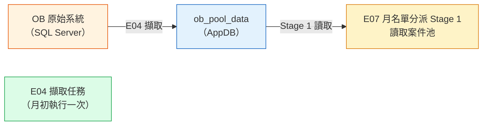
```mermaid
graph LR
    OB_Sys["OB 原始系統\n（SQL Server）"]
    E04["E04 擷取任務\n（月初執行一次）"]
    ob_pool["ob_pool_data\n（AppDB）"]
    E07["E07 月名單分派 Stage 1\n讀取案件池"]

    OB_Sys -->|"E04 擷取"| ob_pool
    ob_pool -->|"Stage 1 讀取"| E07

    classDef ob fill:#fff3e0,stroke:#e65100
    classDef extraction fill:#dcfce7,stroke:#16a34a
    classDef appdb fill:#e3f2fd,stroke:#1565c0
    classDef e07 fill:#fef3c7,stroke:#d97706
    class OB_Sys ob
    class E04 extraction
    class ob_pool appdb
    class E07 e07
```

---

#### 共用基礎建設（Shared Infrastructure）

| 工具 | 職責 | 安全性注意事項 |
|------|------|--------------|
| Crypto Util | AES-256-GCM 加密/解密資料庫連線密碼 | 金鑰從環境變數讀取（OQ-4 決議），禁止硬編碼 |
| Hash Util | bcrypt 密碼雜湊（cost factor >= 10）與比對 | 明文密碼不得出現在日誌 |
| JWT Util | 發行/驗證 JWT；支援多 Secret 並行驗證（OQ-11 決議） | 支援無停機 Secret 輪替 |
| Email Util | 封裝 SMTP / SendGrid 呼叫；Email 寄送為非同步操作（不阻塞 API 回應） | Email 內容不含密碼 |
| Logger | 結構化日誌輸出；自動遮罩敏感欄位（password、token、encrypted_password） | Stack trace 禁止出現在 API 回應 |

---

## 4. 資料架構

### 4.1 核心資料實體（ER 圖）


```mermaid
erDiagram
    User {
        uuid id PK
        string name
        string email "唯一，小寫儲存"
        string password_hash "bcrypt, cost>=10"
        enum role "admin|user"
        enum status "active|disabled"
        timestamp created_at
        timestamp updated_at
    }

    TokenBlocklist {
        string token PK "完整 Token 或 JTI"
        uuid user_id FK
        timestamp revoked_at
        timestamp expires_at "用於定期清理"
    }

    PasswordResetToken {
        uuid id PK
        uuid user_id FK
        string token "UUID v4，唯一"
        timestamp expires_at "建立後 24 小時"
        timestamp used_at "NULL = 未使用"
        timestamp created_at
    }

    Datasource {
        uuid id PK
        string name "唯一（排除軟刪除）"
        enum type "mysql|postgresql|sqlserver"
        string host
        integer port "1-65535"
        string database_name
        string username
        string encrypted_password "AES-256-GCM"
        string description
        enum status "connected|disconnected|unknown"
        timestamp last_tested_at
        uuid created_by FK
        timestamp deleted_at "NULL = 未刪除（軟刪除）"
        timestamp created_at
        timestamp updated_at
    }

    DatasourceHealthLog {
        uuid id PK
        uuid datasource_id FK
        boolean success
        integer response_time_ms "成功時記錄"
        string error_message "失敗時記錄"
        timestamp checked_at
    }

    ExtractionTask {
        uuid id PK
        string name "唯一（排除軟刪除，max 255）"
        uuid datasource_id FK
        enum mode "full|incremental"
        enum status "running|scheduled|completed|failed|disabled"
        string source_schema "來源 Schema 名稱，max 255，nullable"
        string source_table "來源資料表名稱，max 255"
        string incremental_column "增量模式必填"
        string incremental_column_type "timestamp|integer|string，預設 timestamp"
        string last_incremental_value "max 255，string 儲存"
        string schedule "Cron 表達式（UTC），max 100"
        integer batch_size "100-10000，預設 1000"
        timestamp last_execution_at
        integer extracted_count "最近一次擷取筆數"
        integer total_count "來源總筆數"
        decimal progress_percent "0-100"
        integer avg_duration_ms "平均執行時間"
        integer execution_count "總執行次數"
        string error_message "最後錯誤訊息"
        boolean enabled "預設 true"
        uuid created_by FK
        timestamp deleted_at "NULL = 未刪除（軟刪除）"
        timestamp created_at
        timestamp updated_at
    }

    ExtractionLog {
        uuid id PK
        uuid task_id FK
        enum status "running|completed|failed"
        timestamp started_at "UTC"
        timestamp finished_at "UTC，nullable"
        integer duration_ms "finish - start"
        integer extracted_count
        integer total_count
        string error_message "失敗時記錄"
        enum triggered_by "schedule|manual|retry"
        uuid created_by FK
    }

    EtlPipeline {
        uuid id PK
        string name "唯一（排除軟刪除，max 255）"
        string description "TEXT，選填"
        integer version "當前版本號，預設 1"
        integer step_count "節點數量，預設 0"
        enum status "draft|active|running|failed|disabled"
        string schedule "Cron（UTC），max 100，選填"
        timestamp last_execution_at "nullable"
        timestamp next_execution_at "nullable"
        integer processed_count "累計處理筆數，預設 0"
        integer avg_duration_ms "平均執行時間，預設 0"
        integer execution_count "累計執行次數，預設 0"
        boolean enabled "預設 false"
        uuid created_by FK
        timestamp deleted_at "NULL=未刪除（軟刪除）"
        timestamp created_at
        timestamp updated_at
    }

    EtlPipelineVersion {
        uuid id PK
        uuid pipeline_id FK
        integer version "同 Pipeline 下遞增"
        jsonb definition "nodes + edges JSONB 結構"
        enum status "draft|testing|published"
        string change_summary "max 500，選填"
        uuid created_by FK
        timestamp created_at
    }

    EtlPipelineLog {
        uuid id PK
        uuid pipeline_id FK
        integer version "執行時使用的版本號"
        enum status "running|completed|failed"
        timestamp started_at "UTC"
        timestamp finished_at "UTC，nullable"
        integer duration_ms "nullable"
        integer processed_count "預設 0"
        string error_message "TEXT，nullable"
        jsonb node_logs "各節點執行記錄 JSONB，nullable"
        enum triggered_by "schedule|manual|test|retry"
        boolean is_test_run "預設 false"
        uuid created_by FK
    }

    User ||--o{ TokenBlocklist : "has revoked tokens"
    User ||--o{ PasswordResetToken : "has reset tokens"
    User ||--o{ Datasource : "creates (created_by)"
    User ||--o{ ExtractionTask : "creates (created_by)"
    User ||--o{ EtlPipeline : "creates (created_by)"
    User ||--o{ AssignmentRun : "triggers (triggered_by)"
    User ||--o{ AssignmentAuditLog : "operates (operator_id)"
    Datasource ||--o{ DatasourceHealthLog : "has health logs"
    Datasource ||--o{ ExtractionTask : "referenced by"
    ExtractionTask ||--o{ ExtractionLog : "has execution logs"
    EtlPipeline ||--o{ EtlPipelineVersion : "has versions"
    EtlPipeline ||--o{ EtlPipelineLog : "has execution logs"
    AssignmentRun ||--o{ AssignmentRunSnapshot : "has snapshots"
    ObListDefinition {
        varchar list_no PK "OB{YYYYMM}{NNN}"
        text list_nm
        varchar status "active|inactive"
        varchar card_type "新欄位（獨立輸入）"
        timestamp created_at
        timestamp updated_at
    }
    AssignmentRun {
        uuid run_id PK
        varchar ym "YYYYMM"
        enum status "pending|running|completed|failed"
        uuid triggered_by FK
        timestamp triggered_at
        timestamp completed_at
        integer total_count
        text error_message
    }
    AssignmentRunSnapshot {
        uuid run_id FK
        enum snapshot_type "config|input_list|result"
        jsonb payload
        timestamp created_at
    }
    AssignmentAuditLog {
        bigint id PK
        varchar action "CREATE|UPDATE|DISABLE|SET_RATIO|TRIGGER_RUN"
        varchar entity_type
        varchar entity_id
        uuid operator_id FK
        timestamp operated_at
        jsonb before_payload
        jsonb after_payload
        varchar ip_address
    }
```

### 4.2 資料所有權

| 實體 | 擁有模組 | 其他模組存取方式 |
|------|---------|----------------|
| User（含 role / is_sales_manager 欄位） | Account 模組 | Auth 模組讀取（驗證登入，JWT payload 攜帶 role 與 is_sales_manager）；RBAC Middleware 使用 is_sales_manager 判斷 E07 存取權；透過服務介面呼叫，不直接存取 Repository |
| 角色 Seed Data（Enum 定義） | Account 模組（RoleService） | Auth 模組使用（JWT payload 中 role 的有效值集合）；RBAC Middleware 使用（判斷角色） |
| TokenBlocklist | Auth 模組 | Middleware 查詢（驗證請求）；Account 模組透過 Auth Service 寫入（停用帳號） |
| PasswordResetToken | Auth 模組 | 不對其他模組開放 |
| Datasource | Datasource 模組 | Dashboard Service 讀取（彙整統計）；Extraction 模組透過 Datasource Service 介面查詢（驗證參照完整性） |
| DatasourceHealthLog | Datasource 模組 | Dashboard Service 讀取（趨勢圖、告警計算） |
| ExtractionTask | Extraction 模組 | Scheduler 模組透過 ExtractionExecution Service 介面呼叫；ETL Pipeline 模組透過 Extraction 模組介面查詢可用 raw data 表（Extract 節點來源選擇，F029 AC-6） |
| ExtractionLog | Extraction 模組 | 不對其他模組開放 |
| EtlPipeline | ETL Pipeline 模組 | Scheduler 模組透過 Pipeline Execution Service 介面呼叫 |
| EtlPipelineVersion | ETL Pipeline 模組 | 不對其他模組開放；Pipeline Execution Service 讀取最新 published 版本的 definition |
| EtlPipelineLog | ETL Pipeline 模組 | 不對其他模組開放 |
| 目標表（`customer_core` 等） | ETL Pipeline 模組（寫入）/ C360 模組（唯讀） | ETL Pipeline 以動態 SQL 執行 UPSERT；C360 模組以 Raw SQL / QueryBuilder 唯讀查詢；兩者均不透過 TypeORM Entity 管理此表；Phase 1 MVP 僅含 `customer_core`（85 欄位）；Phase 2/3 擴展時新增目標表至 Registry |
| ob_* 表（ob_list_definition 等 10 張） | Assignment 模組（讀寫）/ E04 Extraction 模組（ob_pool_data 寫入） | Assignment Module 負責 CRUD；ob_pool_data 例外：由 E04 ExtractionExecution Service 從 OB 原始系統匯入寫入，E07 僅讀取 |
| assignment_run / assignment_run_snapshot | Assignment 模組（讀寫） | 不對其他模組開放；月名單分派紀錄與快照完整由 AssignmentRun Service 管理 |
| assignment_audit_log | Assignment 模組（只寫）/ DBA（唯讀） | 由 AssignmentAudit Service 寫入；不提供 API 查詢（稽核用途，由 DBA 直接查詢）；Cleanup Cron 負責 3 年清理 |

### 4.3 資料一致性模型

| 操作 | 一致性需求 | 實作方式 |
|------|----------|---------|
| 登入驗證 | 強一致性 | 同步讀取 User 與 TokenBlocklist |
| 帳號停用 + Token 失效 | 強一致性 | 單一 DB 交易：更新 User.status + 批次寫入 TokenBlocklist |
| 密碼重設 + Token 失效 | 強一致性 | 單一 DB 交易：更新 password_hash + 撤銷所有現有 Token |
| 連線測試結果更新 | 強一致性 | 同步更新 Datasource.status + 寫入 DatasourceHealthLog |
| Email 寄送（密碼重設） | 最終一致性 | 非同步操作；API 在 Email 寄出前即回應成功訊息 |
| 健康檢查歷史清理 | 最終一致性 | 背景 Cron Job，不影響前台操作 |
| 觸發擷取執行（建立 Log + 更新 Task status） | 強一致性 | 同一 DB 交易：INSERT ExtractionLog + UPDATE ExtractionTask.status = 'running' |
| 擷取進度更新（extracted_count） | 最終一致性 | 非交易性批次更新（每 batch_size 筆一次）；Polling 容忍短暫延遲 |
| 擷取完成（更新 Log + Task） | 強一致性 | 同一 DB 交易：UPDATE ExtractionLog（finished_at, duration_ms）+ UPDATE ExtractionTask（status, last_execution_at, avg_duration_ms, execution_count）；增量模式同時更新 `last_incremental_value` |
| 排程掃描執行 | 最終一致性 | 掃描失敗記錄日誌，下次掃描重試 |
| ExtractionLog 清理 | 最終一致性 | 背景 Cron Job，不影響前台操作 |
| 觸發 Pipeline 執行（建立 Log + 更新狀態） | 強一致性 | 同一 DB 交易：INSERT EtlPipelineLog + UPDATE EtlPipeline.status = 'running' |
| Pipeline 進度更新（node_logs、processed_count） | 最終一致性 | 每個節點完成後以非交易性更新；前端 5 秒 Polling 容忍短暫延遲 |
| Pipeline 執行完成（更新 Log + Pipeline） | 強一致性 | 同一 DB 交易：UPDATE EtlPipelineLog（finished_at, duration_ms）+ UPDATE EtlPipeline（status, last_execution_at, processed_count, avg_duration_ms, execution_count）；測試執行同時更新 EtlPipelineVersion.status = 'testing' |
| Pipeline 版本發布 | 強一致性 | 同一 DB 交易：UPDATE EtlPipelineVersion.status = 'published' + UPDATE EtlPipeline.version |
| EtlPipelineLog 清理 | 最終一致性 | 背景 Cron Job，不影響前台操作 |
| 觸發月名單分派（建立 AssignmentRun + 更新狀態） | 強一致性 | 同一 DB 交易：INSERT AssignmentRun（status=pending）+ 驗證同月無 pending/running 紀錄（並發控制） |
| 月名單分派三份快照寫入 | 強一致性 | 同一 DB Transaction 原子性寫入三份 AssignmentRunSnapshot；任一失敗整體 Rollback，AssignmentRun.status 改為 failed（AD-E07-2） |
| 月名單分派回寫 ob_pool_data_list（OB_DEPT / OB_EMPLID） | 強一致性 | Stage 3/4 完成後同步更新；失敗時 AssignmentRun.status 改為 failed |
| E07 CRUD 稽核日誌寫入 | 最終一致性 | AssignmentAudit Service 在業務操作成功後寫入；若稽核寫入失敗僅記錄 Logger.error，不 Rollback 業務操作 |
| AssignmentAuditLog 清理 | 最終一致性 | Cleanup Cron Job 每日清理超過 3 年記錄 |

### 4.4 資料庫索引建議

| 表格 | 欄位 | 索引類型 | 理由 |
|------|------|---------|------|
| User | email | UNIQUE INDEX | 登入查詢；Email 唯一性檢查 |
| User | role, status | 複合 INDEX | 帳號清單篩選（F005）；角色值的清單過濾 |
| TokenBlocklist | token | UNIQUE INDEX | Middleware 頻繁查詢 |
| TokenBlocklist | expires_at | INDEX | 定期清理查詢 |
| TokenBlocklist | user_id | INDEX | 帳號停用批次撤銷 |
| PasswordResetToken | token | UNIQUE INDEX | 重設流程查詢 |
| PasswordResetToken | expires_at | INDEX | 定期清理 |
| Datasource | name, database_name, deleted_at | 複合 INDEX | 名稱＋資料庫名稱複合唯一性檢查（排除軟刪除） |
| Datasource | deleted_at | INDEX | 所有清單查詢的過濾條件 |
| DatasourceHealthLog | datasource_id, checked_at | 複合 INDEX | 趨勢圖查詢、告警計算（NFR-002.4） |
| DatasourceHealthLog | checked_at | INDEX | 清理超過 90 天紀錄 |
| ExtractionTask | name, deleted_at | 複合 INDEX | 名稱唯一性檢查（排除軟刪除） |
| ExtractionTask | status, deleted_at | 複合 INDEX | 排程掃描查詢（每分鐘執行） |
| ExtractionTask | datasource_id | INDEX | 外鍵查詢；資料來源刪除影響檢查 |
| ExtractionTask | deleted_at | INDEX | 清單查詢過濾條件 |
| ExtractionLog | task_id, started_at | 複合 INDEX | 日誌查詢（倒序分頁）、趨勢圖聚合 |
| ExtractionLog | started_at | INDEX | 今日統計計算、清理查詢 |
| ExtractionLog | status, started_at | 複合 INDEX | 今日成功/失敗計數（F018 summary, F024 dashboard） |
| raw_{task_id_short} | _cdmp_id（若存在） | PRIMARY KEY INDEX | Raw data 預覽分頁與排序（F026），動態建表時自動建立 |
| etl_pipeline | name, deleted_at | 複合 INDEX | 名稱唯一性檢查（排除軟刪除） |
| etl_pipeline | status, deleted_at | 複合 INDEX | 排程掃描查詢（每分鐘執行，掃描 active + enabled + not running） |
| etl_pipeline | deleted_at | INDEX | 清單查詢過濾條件 |
| etl_pipeline | enabled, deleted_at | 複合 INDEX | 排程掃描輔助條件 |
| etl_pipeline_version | pipeline_id, version | 複合 INDEX | 版本清單查詢（倒序）；查詢最新 published 版本 |
| etl_pipeline_version | pipeline_id, status | 複合 INDEX | 查詢最新 published 版本（排程執行）；啟用前驗證是否有 published 版本 |
| etl_pipeline_log | pipeline_id, started_at | 複合 INDEX | 日誌查詢（倒序分頁）；趨勢圖聚合 |
| etl_pipeline_log | started_at | INDEX | 今日統計計算；清理查詢（30 天保留） |
| etl_pipeline_log | status, started_at | 複合 INDEX | 今日成功/失敗計數（F035 dashboard） |
| etl_pipeline_log | is_test_run, pipeline_id | 複合 INDEX | 版本發布前查詢是否有成功測試執行記錄 |
| customer_core | customer_id | PRIMARY KEY | UPSERT 主鍵衝突判斷（`ON CONFLICT(customer_id) DO UPDATE`）；C360 詳情查詢主鍵 |
| customer_core | source_customer_no | UNIQUE INDEX | 身分證/統編唯一性保護；C360 精確搜尋（`WHERE source_customer_no = :idNumber`） |
| customer_core | _etl_pipeline_id | INDEX | 追溯特定 Pipeline 執行載入的客戶筆數；Load 後稽核查詢 |
| customer_core | customer_type_code | INDEX | C360 客戶類型篩選（`WHERE customer_type_code IN (...)`）效能 |
| customer_core | name | INDEX | C360 預設排序（`ORDER BY name ASC`）效能 |
| customer_core | idx_customer_core_fulltext（GIN） | GIN INDEX | C360 全文搜尋（`to_tsvector('simple', coalesce(name,'') \|\| ' ' \|\| coalesce(english_name,''))`）；F046 前置依賴 |
| ob_list_definition | list_no | PRIMARY KEY | 名單定義查詢主鍵 |
| ob_list_definition | status, project_workym | 複合 INDEX | 查詢本月 active 名單清單（US-070）；月名單分派 Stage 1 篩選條件 |
| ob_pool_data_list | list_no, orgno, appl_no | PRIMARY KEY（複合） | 月名單分派 Stage 3/4 更新 ob_dept / ob_emplid |
| ob_dept_pct | project_workym, list_no, obdeptid | PRIMARY KEY（複合） | 部門比例讀取（Stage 2）；per-LIST_NO 查詢 |
| ob_empl_set | list_no, deptid_m, emplid | PRIMARY KEY（複合） | 人員比例讀取（Stage 4） |
| ob_levelcard_version | card_type, card_version | 複合 INDEX | 最新計分版本查詢；版本管理 |
| ob_levelcard_score | card_type, card_version | 複合 INDEX | 計分分數批次讀取 |
| ob_levelcard_level | card_type, card_version | 複合 INDEX | CARD_LEVEL 門檻讀取 |
| assignment_run | ym | INDEX | 同月唯一性檢查（防止重複月名單分派）；歷史清單年月篩選 |
| assignment_run | status | INDEX | 排程或查詢 running/pending 月名單分派 |
| assignment_run | triggered_at DESC | INDEX | 歷史清單倒序排列（US-085） |
| assignment_run_snapshot | run_id, snapshot_type | 複合 INDEX | 快速載入指定執行的特定快照類型 |
| assignment_audit_log | entity_type, entity_id | 複合 INDEX | 查詢特定實體操作歷史 |
| assignment_audit_log | operator_id | INDEX | 查詢特定使用者操作歷史 |
| assignment_audit_log | operated_at DESC | INDEX | 時間範圍查詢；Cleanup Cron 清理（3 年） |

### 4.5 資料生命週期

| 資料 | 保留策略 | 清理機制 |
|------|---------|---------|
| DatasourceHealthLog | 90 天（OQ-10 決議） | Cleanup Cron Job 每日執行 |
| PasswordResetToken | 永久保留記錄（已使用/過期不刪除，僅標記狀態），或由 Cron 清理過期未使用的 Token | Cleanup Cron Job |
| TokenBlocklist | 保留至 `expires_at` 之後，Cron 定期清理 | Cleanup Cron Job |
| Datasource（軟刪除） | 永久保留（`deleted_at` 非 NULL），不自動清理 | 手動 DBA 操作（如需復原） |
| ExtractionLog | 30 天（AQ-10 決議） | Cleanup Cron Job 每日執行，刪除 `started_at < NOW() - 30 days` 的記錄 |
| ExtractionTask（軟刪除） | 永久保留（`deleted_at` 非 NULL），不自動清理 | 手動 DBA 操作（如需復原） |
| EtlPipelineLog | 30 天（AQ-14 決議）| Cleanup Cron Job 每日執行，刪除 `started_at < NOW() - 30 days` 的記錄 |
| EtlPipeline（軟刪除） | 永久保留（`deleted_at` 非 NULL），不自動清理 | 手動 DBA 操作（如需復原） |
| EtlPipelineVersion | 永久保留（隨 Pipeline 保留，不自動清理） | 版本紀錄為審計軌跡，不可自動清除 |
| 目標表資料（`customer_core` 等） | 永久保留（UPSERT 寫入，同一 `customer_id` 會被覆蓋更新），不自動清理 | 由 DBA 或下游系統管理；ETL 追蹤欄位（`_etl_loaded_at`、`_etl_pipeline_id`）記錄最近一次 Load 的時間與 Pipeline |

---

## 5. 整合與通訊

### 5.1 通訊模式總覽

| 整合點 | 方向 | 同步/非同步 | 協定 |
|--------|------|-----------|------|
| 瀏覽器 ↔ 後端 | 雙向 | 同步（Request/Response） | HTTPS REST API |
| 後端 → 應用資料庫 | 單向 | 同步 | ORM / SQL over TCP |
| 後端 → Token Blocklist | 雙向 | 同步 | 依實作（DB 或 Redis） |
| 後端 → Email 服務 | 單向 | 非同步（fire-and-forget） | SMTP / HTTPS |
| 後端 → 目標資料庫（連線測試） | 單向 | 同步（含 10 秒逾時） | TCP `SELECT 1` |
| 後端 → 目標資料庫（資料擷取） | 單向 | 非同步（背景執行，2 小時逾時） | TCP 批次 SQL Query |
| 後端 → AppDB raw data 表（ETL Extract） | 單向 | 非同步（Pipeline 執行中讀取） | Raw SQL（`SELECT`，Dynamic table name） |
| 後端 → AppDB target 表（ETL Load） | 單向 | 非同步（Pipeline 執行中寫入） | Raw SQL（`INSERT ON CONFLICT DO UPDATE`） |
| 後端（C360）← AppDB customer_core 表 | 單向（唯讀） | 同步（API 請求驅動） | Raw SQL / QueryBuilder（`SELECT`，含 FTS） |
| Scheduler → 後端邏輯 | 內部呼叫 | 同步 | 模組內部方法呼叫 |

### 5.2 驗證流程（Auth Flow）

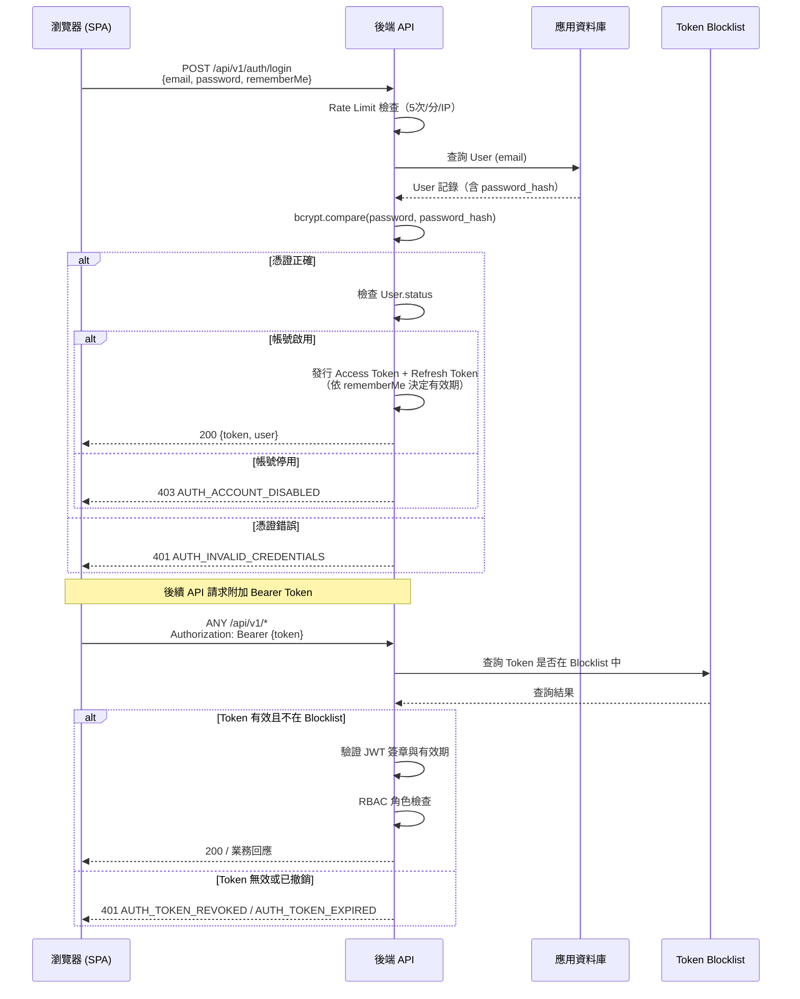
```mermaid
sequenceDiagram
    participant Browser as 瀏覽器 (SPA)
    participant API as 後端 API
    participant DB as 應用資料庫
    participant Blocklist as Token Blocklist

    Browser->>API: POST /api/v1/auth/login<br/>{email, password, rememberMe}
    API->>API: Rate Limit 檢查（5次/分/IP）
    API->>DB: 查詢 User (email)
    DB-->>API: User 記錄（含 password_hash）
    API->>API: bcrypt.compare(password, password_hash)
    alt 憑證正確
        API->>API: 檢查 User.status
        alt 帳號啟用
            API->>API: 發行 Access Token + Refresh Token<br/>（依 rememberMe 決定有效期）
            API-->>Browser: 200 {token, user}
        else 帳號停用
            API-->>Browser: 403 AUTH_ACCOUNT_DISABLED
        end
    else 憑證錯誤
        API-->>Browser: 401 AUTH_INVALID_CREDENTIALS
    end

    Note over Browser,API: 後續 API 請求附加 Bearer Token

    Browser->>API: ANY /api/v1/*<br/>Authorization: Bearer {token}
    API->>Blocklist: 查詢 Token 是否在 Blocklist 中
    Blocklist-->>API: 查詢結果
    alt Token 有效且不在 Blocklist
        API->>API: 驗證 JWT 簽章與有效期
        API->>API: RBAC 角色檢查
        API-->>Browser: 200 / 業務回應
    else Token 無效或已撤銷
        API-->>Browser: 401 AUTH_TOKEN_REVOKED / AUTH_TOKEN_EXPIRED
    end
```

### 5.3 密碼重設流程

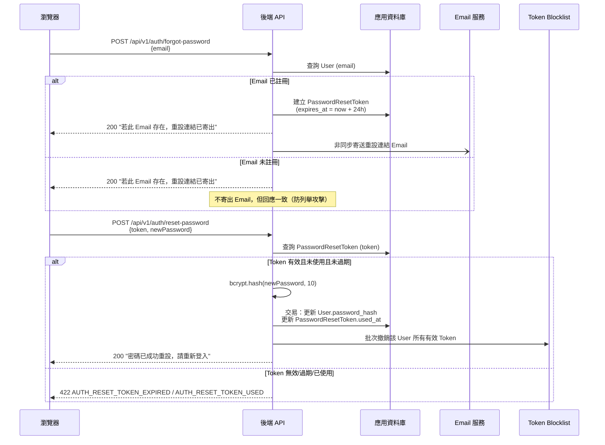
```mermaid
sequenceDiagram
    participant Browser as 瀏覽器
    participant API as 後端 API
    participant DB as 應用資料庫
    participant Email as Email 服務
    participant Blocklist as Token Blocklist

    Browser->>API: POST /api/v1/auth/forgot-password<br/>{email}
    API->>DB: 查詢 User (email)
    alt Email 已註冊
        API->>DB: 建立 PasswordResetToken<br/>(expires_at = now + 24h)
        API-->>Browser: 200 "若此 Email 存在，重設連結已寄出"
        API-)Email: 非同步寄送重設連結 Email
    else Email 未註冊
        API-->>Browser: 200 "若此 Email 存在，重設連結已寄出"
        Note over API: 不寄出 Email，但回應一致（防列舉攻擊）
    end

    Browser->>API: POST /api/v1/auth/reset-password<br/>{token, newPassword}
    API->>DB: 查詢 PasswordResetToken (token)
    alt Token 有效且未使用且未過期
        API->>API: bcrypt.hash(newPassword, 10)
        API->>DB: 交易：更新 User.password_hash<br/>更新 PasswordResetToken.used_at
        API->>Blocklist: 批次撤銷該 User 所有有效 Token
        API-->>Browser: 200 "密碼已成功重設，請重新登入"
    else Token 無效/過期/已使用
        API-->>Browser: 422 AUTH_RESET_TOKEN_EXPIRED / AUTH_RESET_TOKEN_USED
    end
```

### 5.4 連線測試流程（F015）

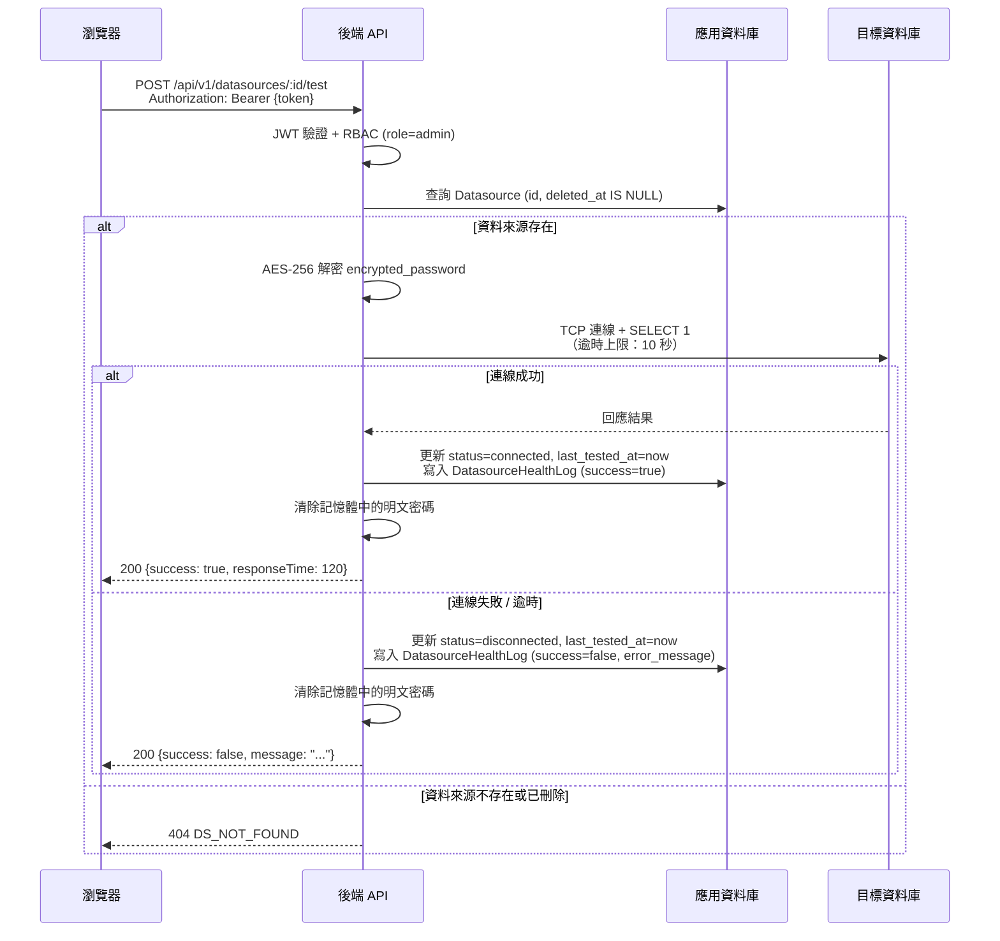
```mermaid
sequenceDiagram
    participant Browser as 瀏覽器
    participant API as 後端 API
    participant DB as 應用資料庫
    participant TargetDB as 目標資料庫

    Browser->>API: POST /api/v1/datasources/:id/test<br/>Authorization: Bearer {token}
    API->>API: JWT 驗證 + RBAC (role=admin)
    API->>DB: 查詢 Datasource (id, deleted_at IS NULL)
    alt 資料來源存在
        API->>API: AES-256 解密 encrypted_password
        API->>TargetDB: TCP 連線 + SELECT 1<br/>（逾時上限：10 秒）
        alt 連線成功
            TargetDB-->>API: 回應結果
            API->>DB: 更新 status=connected, last_tested_at=now<br/>寫入 DatasourceHealthLog (success=true)
            API->>API: 清除記憶體中的明文密碼
            API-->>Browser: 200 {success: true, responseTime: 120}
        else 連線失敗 / 逾時
            API->>DB: 更新 status=disconnected, last_tested_at=now<br/>寫入 DatasourceHealthLog (success=false, error_message)
            API->>API: 清除記憶體中的明文密碼
            API-->>Browser: 200 {success: false, message: "..."}
        end
    else 資料來源不存在或已刪除
        API-->>Browser: 404 DS_NOT_FOUND
    end
```

### 5.5 擷取任務執行流程（F021 / F023）

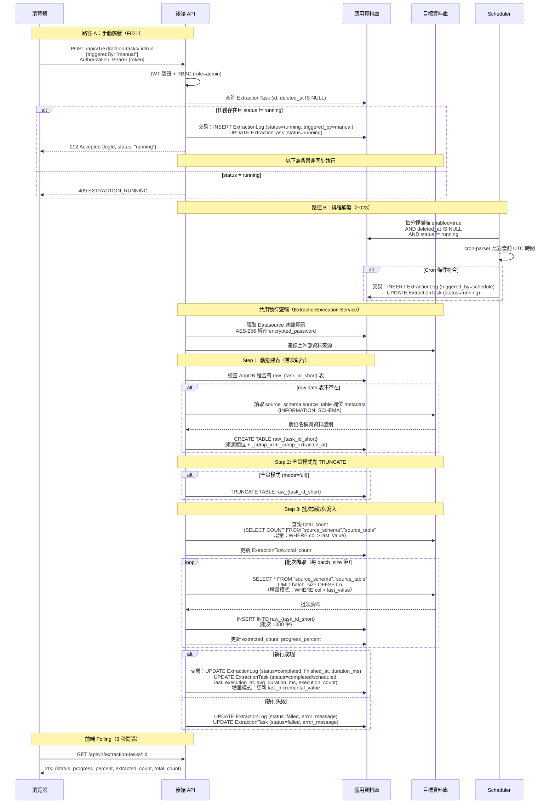
```mermaid
sequenceDiagram
    participant Browser as 瀏覽器
    participant API as 後端 API
    participant DB as 應用資料庫
    participant TargetDB as 目標資料庫
    participant Scheduler as Scheduler

    Note over Browser,API: 路徑 A：手動觸發（F021）
    Browser->>API: POST /api/v1/extraction-tasks/:id/run<br/>{triggeredBy: "manual"}<br/>Authorization: Bearer {token}
    API->>API: JWT 驗證 + RBAC (role=admin)
    API->>DB: 查詢 ExtractionTask (id, deleted_at IS NULL)
    alt 任務存在且 status != running
        API->>DB: 交易：INSERT ExtractionLog (status=running, triggered_by=manual)<br/>UPDATE ExtractionTask (status=running)
        API-->>Browser: 202 Accepted {logId, status: "running"}
        Note over API,TargetDB: 以下為背景非同步執行
    else status = running
        API-->>Browser: 409 EXTRACTION_RUNNING
    end

    Note over Scheduler,API: 路徑 B：排程觸發（F023）
    Scheduler->>DB: 每分鐘掃描 enabled=true<br/>AND deleted_at IS NULL<br/>AND status != running
    Scheduler->>Scheduler: cron-parser 比對當前 UTC 時間
    alt Cron 條件符合
        Scheduler->>DB: 交易：INSERT ExtractionLog (triggered_by=schedule)<br/>UPDATE ExtractionTask (status=running)
    end

    Note over API,TargetDB: 共用執行邏輯（ExtractionExecution Service）
    API->>DB: 讀取 Datasource 連線資訊<br/>AES-256 解密 encrypted_password
    API->>TargetDB: 連線至外部資料來源

    Note over API,DB: Step 1: 動態建表（首次執行）
    API->>DB: 檢查 AppDB 是否有 raw_{task_id_short} 表
    alt raw data 表不存在
        API->>TargetDB: 讀取 source_schema.source_table 欄位 metadata<br/>(INFORMATION_SCHEMA)
        TargetDB-->>API: 欄位名稱與資料型別
        API->>DB: CREATE TABLE raw_{task_id_short}<br/>(來源欄位 + _cdmp_id + _cdmp_extracted_at)
    end

    Note over API,TargetDB: Step 2: 全量模式先 TRUNCATE
    alt 全量模式 (mode=full)
        API->>DB: TRUNCATE TABLE raw_{task_id_short}
    end

    Note over API,TargetDB: Step 3: 批次讀取與寫入
    API->>TargetDB: 查詢 total_count<br/>(SELECT COUNT FROM "source_schema"."source_table"<br/>增量：WHERE col > last_value)
    API->>DB: 更新 ExtractionTask.total_count

    loop 批次擷取（每 batch_size 筆）
        API->>TargetDB: SELECT * FROM "source_schema"."source_table"<br/>LIMIT batch_size OFFSET n<br/>（增量模式：WHERE col > last_value）
        TargetDB-->>API: 批次資料
        API->>DB: INSERT INTO raw_{task_id_short}<br/>(批次 1000 筆)
        API->>DB: 更新 extracted_count, progress_percent
    end

    alt 執行成功
        API->>DB: 交易：UPDATE ExtractionLog (status=completed, finished_at, duration_ms)<br/>UPDATE ExtractionTask (status=completed/scheduled,<br/>last_execution_at, avg_duration_ms, execution_count)<br/>增量模式：更新 last_incremental_value
    else 執行失敗
        API->>DB: UPDATE ExtractionLog (status=failed, error_message)<br/>UPDATE ExtractionTask (status=failed, error_message)
    end

    Note over Browser,API: 前端 Polling（3 秒間隔）
    Browser->>API: GET /api/v1/extraction-tasks/:id
    API-->>Browser: 200 {status, progress_percent, extracted_count, total_count}
```

### 5.6 Pipeline 執行流程（F030 / F033）

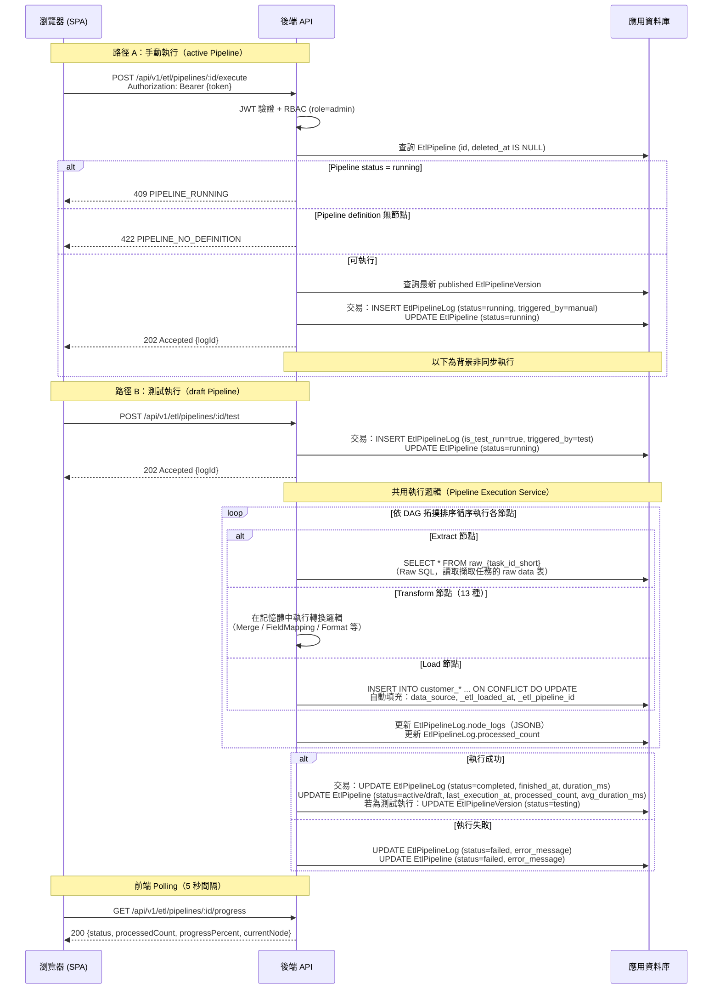
```mermaid
sequenceDiagram
    participant Browser as 瀏覽器 (SPA)
    participant API as 後端 API
    participant DB as 應用資料庫

    Note over Browser,API: 路徑 A：手動執行（active Pipeline）
    Browser->>API: POST /api/v1/etl/pipelines/:id/execute<br/>Authorization: Bearer {token}
    API->>API: JWT 驗證 + RBAC (role=admin)
    API->>DB: 查詢 EtlPipeline (id, deleted_at IS NULL)
    alt Pipeline status = running
        API-->>Browser: 409 PIPELINE_RUNNING
    else Pipeline definition 無節點
        API-->>Browser: 422 PIPELINE_NO_DEFINITION
    else 可執行
        API->>DB: 查詢最新 published EtlPipelineVersion
        API->>DB: 交易：INSERT EtlPipelineLog (status=running, triggered_by=manual)<br/>UPDATE EtlPipeline (status=running)
        API-->>Browser: 202 Accepted {logId}
        Note over API,DB: 以下為背景非同步執行
    end

    Note over Browser,API: 路徑 B：測試執行（draft Pipeline）
    Browser->>API: POST /api/v1/etl/pipelines/:id/test
    API->>DB: 交易：INSERT EtlPipelineLog (is_test_run=true, triggered_by=test)<br/>UPDATE EtlPipeline (status=running)
    API-->>Browser: 202 Accepted {logId}

    Note over API,DB: 共用執行邏輯（Pipeline Execution Service）
    loop 依 DAG 拓撲排序循序執行各節點
        alt Extract 節點
            API->>DB: SELECT * FROM raw_{task_id_short}<br/>（Raw SQL，讀取擷取任務的 raw data 表）
        else Transform 節點（13 種）
            API->>API: 在記憶體中執行轉換邏輯<br/>（Merge / FieldMapping / Format 等）
        else Load 節點
            API->>DB: INSERT INTO customer_* ... ON CONFLICT DO UPDATE<br/>自動填充：data_source, _etl_loaded_at, _etl_pipeline_id
        end
        API->>DB: 更新 EtlPipelineLog.node_logs（JSONB）<br/>更新 EtlPipelineLog.processed_count
    end

    alt 執行成功
        API->>DB: 交易：UPDATE EtlPipelineLog (status=completed, finished_at, duration_ms)<br/>UPDATE EtlPipeline (status=active/draft, last_execution_at, processed_count, avg_duration_ms)<br/>若為測試執行：UPDATE EtlPipelineVersion (status=testing)
    else 執行失敗
        API->>DB: UPDATE EtlPipelineLog (status=failed, error_message)<br/>UPDATE EtlPipeline (status=failed, error_message)
    end

    Note over Browser,API: 前端 Polling（5 秒間隔）
    Browser->>API: GET /api/v1/etl/pipelines/:id/progress
    API-->>Browser: 200 {status, processedCount, progressPercent, currentNode}
```

### 5.7 應用程式啟動生命週期（F038 新增）

F038 `OrphanRecoveryModule` 透過 NestJS `OnApplicationBootstrap` 生命週期鉤子在啟動時執行孤兒回收，並在 HTTP Server 開始接受請求前完成。

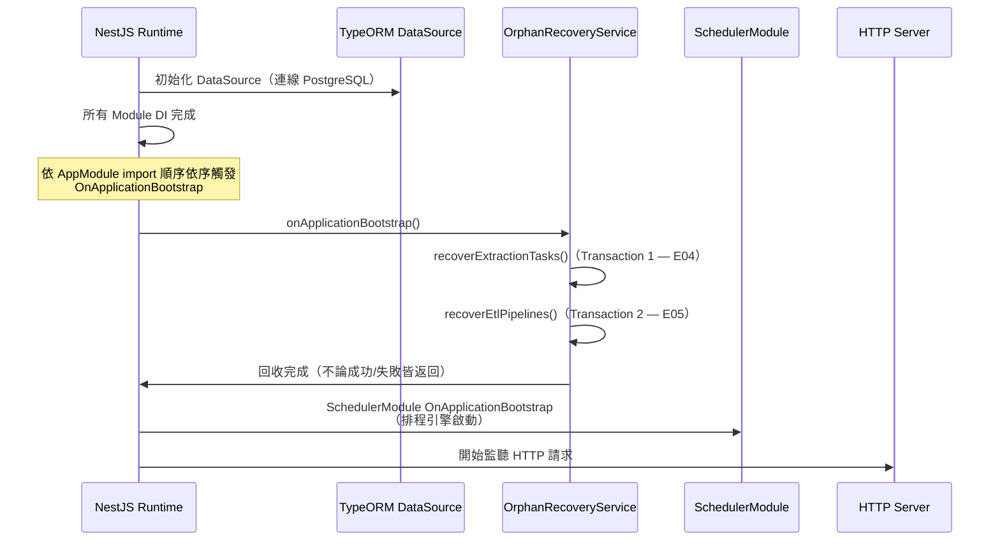
```mermaid
sequenceDiagram
    participant NestJS as NestJS Runtime
    participant ORM as TypeORM DataSource
    participant ORS as OrphanRecoveryService
    participant Sched as SchedulerModule
    participant HTTP as HTTP Server

    NestJS->>ORM: 初始化 DataSource（連線 PostgreSQL）
    NestJS->>NestJS: 所有 Module DI 完成
    Note over NestJS: 依 AppModule import 順序依序觸發<br/>OnApplicationBootstrap
    NestJS->>ORS: onApplicationBootstrap()
    ORS->>ORS: recoverExtractionTasks()（Transaction 1 — E04）
    ORS->>ORS: recoverEtlPipelines()（Transaction 2 — E05）
    ORS->>NestJS: 回收完成（不論成功/失敗皆返回）
    NestJS->>Sched: SchedulerModule OnApplicationBootstrap<br/>（排程引擎啟動）
    NestJS->>HTTP: 開始監聽 HTTP 請求
```

**關鍵設計約束**：
- `OrphanRecoveryModule` 必須在 `SchedulerModule` **之前** import，確保排程引擎首次掃描時，孤兒狀態已被修復，不會發生「孤兒任務因 `status=running` 被排程器跳過」的問題。
- `OnApplicationBootstrap` 為同步阻塞執行，回收未完成前 HTTP Server 不會啟動；若回收耗時過長（NFR-002.12 要求 < 5 秒），應記錄警告。

### 5.8 錯誤處理與韌性

| 整合點 | 失敗場景 | 處理策略 |
|--------|---------|---------|
| 目標資料庫連線測試 | 逾時 / 拒絕連線 | 10 秒強制 timeout；回傳 success=false；更新狀態為 disconnected |
| Email 服務不可用 | SMTP 連線失敗 | 回傳 SYSTEM_EMAIL_SEND_FAILED（500）；非同步寄送失敗不影響 Token 生成 |
| 應用資料庫連線失敗 | DB 不可達 | 回傳 SYSTEM_INTERNAL_ERROR（500）；錯誤記錄至 Logger（不含敏感資訊） |
| Token Blocklist 查詢失敗 | Cache/DB 不可達 | **架構挑戰**：Fail-Open（允許請求通過）vs Fail-Closed（拒絕請求）。建議 Fail-Closed 以優先安全性。詳見第 8 節。 |
| 健康檢查 Cron 失敗 | 單次執行異常 | 記錄錯誤至日誌；下次排程正常繼續；不影響前台 API |
| 目標資料庫（資料擷取） | 執行中連線斷開 / 查詢失敗 | 捕捉例外；更新 ExtractionTask.status = 'failed' 與 error_message；更新 ExtractionLog；不自動重試（AD-E04-6），須 Admin 手動重試 |
| 目標資料庫（Schema/Table 列表查詢） | 逾時 / 拒絕連線 | 10 秒逾時；回傳 503 DATASOURCE_SCHEMA_LOAD_FAILED 或 DATASOURCE_TABLE_LOAD_FAILED；前端顯示錯誤，下拉停用；不使用快取 |
| 擷取排程掃描（每分鐘） | DB 查詢失敗 | 記錄 ERROR 日誌；跳過本次掃描；下次掃描正常繼續 |
| Pipeline 執行（節點執行失敗） | Transform 邏輯錯誤 / Load 寫入失敗 | 捕捉例外；更新失敗節點的 node_logs；更新 EtlPipelineLog.status = 'failed'；更新 EtlPipeline.status = 'failed'；不自動重試，須 Admin 手動重新執行 |
| Pipeline 排程掃描（每分鐘） | DB 查詢失敗 | 記錄 ERROR 日誌；跳過本次掃描；下次掃描正常繼續 |
| 版本發布驗證（無測試執行記錄） | 前置條件不滿足 | 回傳 422 PIPELINE_PUBLISH_REQUIRES_TEST；不執行發布操作 |

### 5.9 冪等性考量

| 端點 | 冪等性 | 說明 |
|------|-------|------|
| `POST /api/v1/auth/login` | 非冪等 | 每次呼叫產生新 Token |
| `POST /api/v1/auth/logout` | 冪等 | 重複呼叫結果相同（Token 已在 Blocklist） |
| `POST /api/v1/auth/forgot-password` | 冪等（行為一致） | 回應一致；多次呼叫產生多個 PasswordResetToken（舊的仍有效，但 24h 到期） |
| `POST /api/v1/datasources/:id/test` | 冪等（副作用重複） | 可重複呼叫；每次均產生新的 HealthLog 記錄 |
| `GET /api/v1/datasources/:id/schemas` | 冪等 | 唯讀查詢，即時查詢外部資料庫，不使用快取 |
| `GET /api/v1/datasources/:id/schemas/:schema/tables` | 冪等 | 唯讀查詢，即時查詢外部資料庫，不使用快取 |
| `DELETE /api/v1/datasources/:id` | 冪等 | 重複軟刪除結果相同 |
| `POST /api/v1/extraction-tasks/:id/run` | 非冪等 | 每次呼叫建立新的 ExtractionLog；`status=running` 時拒絕（409）避免重複觸發 |
| `PATCH /api/v1/extraction-tasks/:id/toggle` | 冪等 | 停用已停用的任務回傳成功，無額外副作用 |
| `DELETE /api/v1/extraction-tasks/:id` | 冪等 | 重複軟刪除結果相同 |
| `GET /api/v1/etl/pipelines` | 冪等 | 唯讀查詢 |
| `POST /api/v1/etl/pipelines` | 非冪等 | 每次呼叫建立新 Pipeline；名稱重複時回傳 409 |
| `POST /api/v1/etl/pipelines/:id/execute` | 非冪等 | 每次呼叫建立新的 EtlPipelineLog；`status=running` 時拒絕（409）|
| `POST /api/v1/etl/pipelines/:id/test` | 非冪等 | 每次呼叫建立新的測試 EtlPipelineLog；`status=running` 時拒絕（409）|
| `PATCH /api/v1/etl/pipelines/:id/toggle` | 冪等 | 停用已停用的 Pipeline 回傳成功，無額外副作用 |
| `DELETE /api/v1/etl/pipelines/:id` | 冪等 | 重複軟刪除結果相同 |
| `PUT /api/v1/etl/pipelines/:id/definition` | 冪等 | 相同 definition 重複儲存結果相同（覆寫） |
| `PATCH /api/v1/etl/pipelines/:id/versions/:versionId/publish` | 冪等（重複發布相同版本結果相同） | 已 published 的版本重複發布無副作用 |
| `POST /api/v1/etl/pipelines/:id/versions/:versionId/rollback` | 非冪等 | 每次呼叫建立新版本 |
| `GET /api/v1/etl/target-tables` | 冪等 | 唯讀查詢，回傳靜態 Registry 資料，無 DB 查詢 |
| `GET /api/v1/etl/target-tables/:tableName/schema` | 冪等 | 唯讀查詢，回傳靜態 Registry 資料；不存在的 tableName 回傳 404 |

### 5.10 Target Table Registry API 流程（F036）

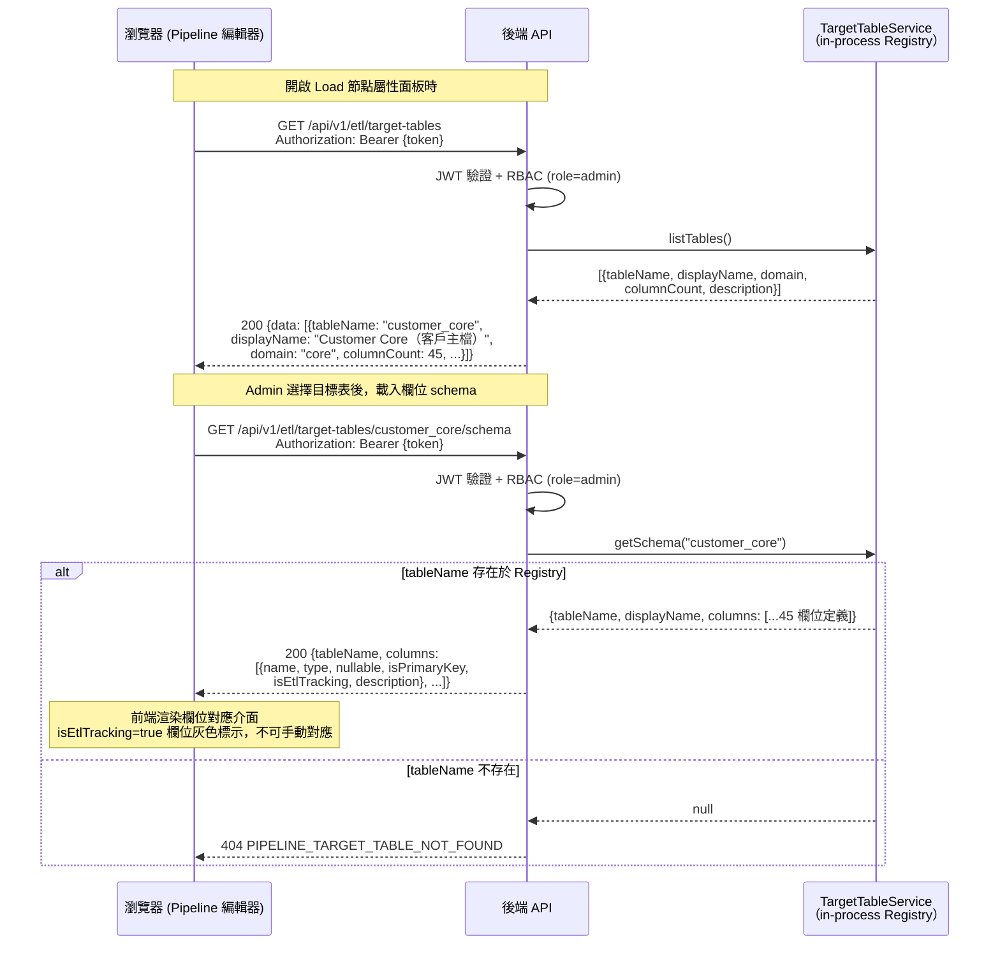
```mermaid
sequenceDiagram
    participant Browser as 瀏覽器 (Pipeline 編輯器)
    participant API as 後端 API
    participant Registry as TargetTableService<br/>（in-process Registry）

    Note over Browser,API: 開啟 Load 節點屬性面板時

    Browser->>API: GET /api/v1/etl/target-tables<br/>Authorization: Bearer {token}
    API->>API: JWT 驗證 + RBAC (role=admin)
    API->>Registry: listTables()
    Registry-->>API: [{tableName, displayName, domain,<br/>columnCount, description}]
    API-->>Browser: 200 {data: [{tableName: "customer_core",<br/>displayName: "Customer Core（客戶主檔）",<br/>domain: "core", columnCount: 45, ...}]}

    Note over Browser,API: Admin 選擇目標表後，載入欄位 schema

    Browser->>API: GET /api/v1/etl/target-tables/customer_core/schema<br/>Authorization: Bearer {token}
    API->>API: JWT 驗證 + RBAC (role=admin)
    API->>Registry: getSchema("customer_core")
    alt tableName 存在於 Registry
        Registry-->>API: {tableName, displayName, columns: [...45 欄位定義]}
        API-->>Browser: 200 {tableName, columns:<br/>[{name, type, nullable, isPrimaryKey,<br/>isEtlTracking, description}, ...]}
        Note over Browser: 前端渲染欄位對應介面<br/>isEtlTracking=true 欄位灰色標示，不可手動對應
    else tableName 不存在
        Registry-->>API: null
        API-->>Browser: 404 PIPELINE_TARGET_TABLE_NOT_FOUND
    end
```

**Load 節點執行時的 ETL 追蹤欄位自動填充**（AC-5）：

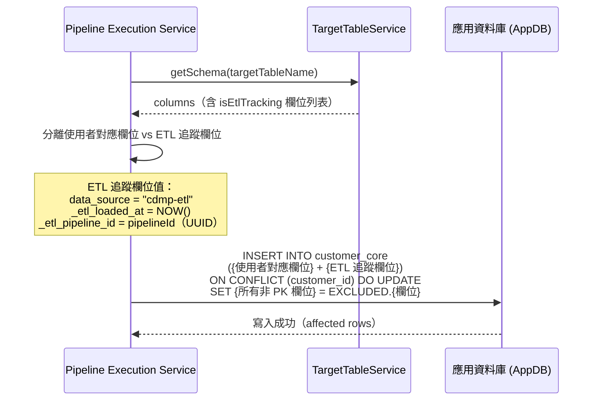
```mermaid
sequenceDiagram
    participant ExecSvc as Pipeline Execution Service
    participant Registry as TargetTableService
    participant DB as 應用資料庫 (AppDB)

    ExecSvc->>Registry: getSchema(targetTableName)
    Registry-->>ExecSvc: columns（含 isEtlTracking 欄位列表）

    ExecSvc->>ExecSvc: 分離使用者對應欄位 vs ETL 追蹤欄位
    Note over ExecSvc: ETL 追蹤欄位值：<br/>data_source = "cdmp-etl"<br/>_etl_loaded_at = NOW()<br/>_etl_pipeline_id = pipelineId（UUID）

    ExecSvc->>DB: INSERT INTO customer_core<br/>({使用者對應欄位} + {ETL 追蹤欄位})<br/>ON CONFLICT (customer_id) DO UPDATE<br/>SET {所有非 PK 欄位} = EXCLUDED.{欄位}
    DB-->>ExecSvc: 寫入成功（affected rows）
```

### 5.11 Customer 360 查詢流程（F046 / F047）

C360 模組為純唯讀消費者，不產生任何寫入操作。以下時序圖涵蓋客戶清單搜尋與 360 詳情查詢的完整流程。

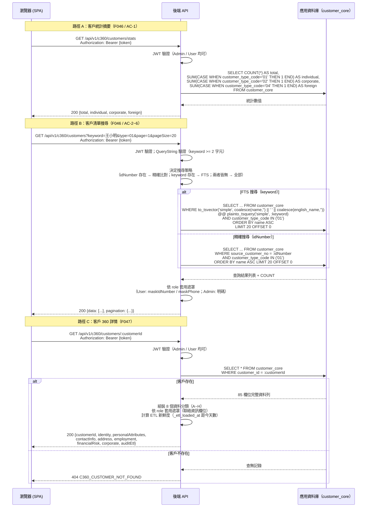
```mermaid
sequenceDiagram
    participant Browser as 瀏覽器 (SPA)
    participant API as 後端 API
    participant DB as 應用資料庫（customer_core）

    Note over Browser,API: 路徑 A：客戶統計摘要（F046 / AC-1）
    Browser->>API: GET /api/v1/c360/customers/stats<br/>Authorization: Bearer {token}
    API->>API: JWT 驗證（Admin / User 均可）
    API->>DB: SELECT COUNT(*) AS total,<br/>SUM(CASE WHEN customer_type_code='01' THEN 1 END) AS individual,<br/>SUM(CASE WHEN customer_type_code='02' THEN 1 END) AS corporate,<br/>SUM(CASE WHEN customer_type_code='04' THEN 1 END) AS foreign<br/>FROM customer_core
    DB-->>API: 統計數值
    API-->>Browser: 200 {total, individual, corporate, foreign}

    Note over Browser,API: 路徑 B：客戶清單搜尋（F046 / AC-2~6）
    Browser->>API: GET /api/v1/c360/customers?keyword=王小明&type=01&page=1&pageSize=20<br/>Authorization: Bearer {token}
    API->>API: JWT 驗證；QueryString 驗證（keyword >= 2 字元）
    API->>API: 決定搜尋策略<br/>（idNumber 存在 → 精確比對；keyword 存在 → FTS；兩者皆無 → 全部）

    alt FTS 搜尋（keyword）
        API->>DB: SELECT ... FROM customer_core<br/>WHERE to_tsvector('simple', coalesce(name,'') || ' ' || coalesce(english_name,''))<br/>@@ plainto_tsquery('simple', :keyword)<br/>AND customer_type_code IN ('01')<br/>ORDER BY name ASC<br/>LIMIT 20 OFFSET 0
    else 精確搜尋（idNumber）
        API->>DB: SELECT ... FROM customer_core<br/>WHERE source_customer_no = :idNumber<br/>AND customer_type_code IN ('01')<br/>ORDER BY name ASC LIMIT 20 OFFSET 0
    end

    DB-->>API: 查詢結果列表 + COUNT
    API->>API: 依 role 套用遮罩<br/>（User: maskIdNumber / maskPhone；Admin: 明碼）
    API-->>Browser: 200 {data: [...], pagination: {...}}

    Note over Browser,API: 路徑 C：客戶 360 詳情（F047）
    Browser->>API: GET /api/v1/c360/customers/:customerId<br/>Authorization: Bearer {token}
    API->>API: JWT 驗證（Admin / User 均可）
    API->>DB: SELECT * FROM customer_core<br/>WHERE customer_id = :customerId
    alt 客戶存在
        DB-->>API: 85 欄位完整資料列
        API->>API: 組裝 8 個資料分類（A~H）<br/>依 role 套用遮罩（聯絡資訊欄位）<br/>計算 ETL 新鮮度（_etl_loaded_at 距今天數）
        API-->>Browser: 200 {customerId, identity, personalAttributes,<br/>contactInfo, address, employment,<br/>financialRisk, corporate, auditEtl}
    else 客戶不存在
        DB-->>API: 查無記錄
        API-->>Browser: 404 C360_CUSTOMER_NOT_FOUND
    end
```

**C360 模組冪等性**

| 端點 | 冪等性 | 說明 |
|------|-------|------|
| `GET /api/v1/c360/customers/stats` | 冪等 | 唯讀查詢；結果隨 customer_core 資料而定 |
| `GET /api/v1/c360/customers` | 冪等 | 唯讀查詢；相同參數回傳相同結果 |
| `GET /api/v1/c360/customers/:customerId` | 冪等 | 唯讀查詢；不存在時固定回傳 404 |

**C360 與其他模組的執行時期關係**

C360 模組在執行時期**不依賴** Extraction 模組或 ETL Pipeline 模組。它只消費 ETL 執行後留存於 AppDB 的 `customer_core` 資料，屬於資料消費者（Read Consumer），而非資料生產者（Data Producer）。若 ETL Pipeline 尚未執行，`customer_core` 無資料，C360 的統計摘要將顯示全零，清單顯示空狀態——此為預期行為，不構成錯誤。

---

### 5.13 月名單分派執行模型重構（Worker 抽離 + Stage 1~4 SQL 下推）（AD-E07-28）

> 完整決策、四個踩雷前例調和方案、P1/P2/P3 階段邊界與相依、Open Questions：見
> [`implementation-log/AD-E07-v3.1-monthly-run-execution-model.md`](implementation-log/AD-E07-v3.1-monthly-run-execution-model.md)。
> 本節為架構主文之概要 + 目標時序，供 Test Designer / TDD Developer / DevOps 快速定位。

#### 5.13.1 問題與目標（一句話）

月名單分派 pipeline 現與 Web API **同程序、同 event loop、同 heap**（`AssignmentRunService.kickoffPipeline()`
之 `setImmediate(() => pipeline.runPipeline(...))`），造成兩個失效面：**F1 event loop 阻塞**（同步 JS
迴圈無讓出點 → 月名單分派期間 API 全逾時；實測 202606 dev 3 份名單即卡滿一核 >25 分鐘、0 DB query）、
**F2 OOM**（`stage1-filter-chain.ts` 全載 `ob_pool_data` 進 heap → prod 量級程序崩 → 整站 500）。

**目標架構**：`triggerRun` 改入列 **pg-boss**（靠現有 Postgres，免 Redis）job → 獨立 **`cdmp-worker`**
容器消費 → Stage 1~4 以 set-based SQL `INSERT INTO ob_monthly_run_result SELECT … FROM ob_pool_data
WHERE …` 在 DB 內完成，使 API event loop 與 heap 完全脫離月名單分派負載。

#### 5.13.2 目標元件與資料流

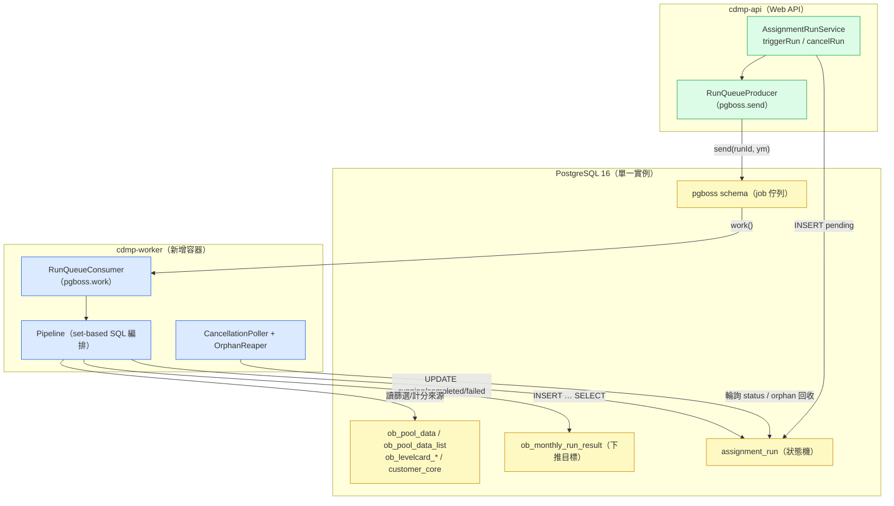
```mermaid
graph TD
    subgraph apiC["cdmp-api（Web API）"]
        RunSvc["AssignmentRunService<br/>triggerRun / cancelRun"]
        Producer["RunQueueProducer（pgboss.send）"]
    end
    subgraph pg["PostgreSQL 16（單一實例）"]
        PgBoss["pgboss schema（job 佇列）"]
        RunTbl["assignment_run（狀態機）"]
        Src["ob_pool_data / ob_pool_data_list<br/>ob_levelcard_* / customer_core"]
        Result["ob_monthly_run_result（下推目標）"]
    end
    subgraph workerC["cdmp-worker（新增容器）"]
        Consumer["RunQueueConsumer（pgboss.work）"]
        Pipeline["Pipeline（set-based SQL 編排）"]
        Reaper["CancellationPoller + OrphanReaper"]
    end

    RunSvc -->|"INSERT pending"| RunTbl
    RunSvc --> Producer -->|"send(runId, ym)"| PgBoss
    PgBoss -->|"work()"| Consumer --> Pipeline
    Pipeline -->|"UPDATE running/completed/failed"| RunTbl
    Pipeline -->|"INSERT … SELECT"| Result
    Pipeline -->|"讀篩選/計分來源"| Src
    Reaper -->|"輪詢 status / orphan 回收"| RunTbl

    classDef api fill:#dcfce7,stroke:#16a34a
    classDef db fill:#fef9c3,stroke:#ca8a04
    classDef worker fill:#dbeafe,stroke:#2563eb
    class RunSvc,Producer api
    class PgBoss,RunTbl,Src,Result db
    class Consumer,Pipeline,Reaper worker
```

#### 5.13.3 目標觸發時序

```mermaid
sequenceDiagram
    participant Browser as 瀏覽器（SPA）
    participant API as cdmp-api
    participant DB as PostgreSQL（assignment_run + pgboss）
    participant Worker as cdmp-worker

    Browser->>API: POST /api/v1/assignment-runs { workYm }
    API->>API: assertNoRunningRun + readiness 前置（不變）
    API->>DB: INSERT assignment_run(status=pending)
    API->>DB: pgboss.send('assignment-run', {runId, ym})
    API-->>Browser: 202 { runId, status: pending }
    Note over API: API event loop 立即釋放（不再 setImmediate 跑 pipeline）

    DB-->>Worker: pgboss.work() 派發 job
    Worker->>DB: UPDATE assignment_run SET status=running
    loop 每份 ready 名單（可中斷邊界）
        Worker->>DB: INSERT INTO ob_monthly_run_result SELECT … FROM ob_pool_data WHERE <Stage1 SQL>
        Worker->>DB: 查 assignment_run.status（CancellationPoller）
        alt 已被 cancelRun 標 failed
            Worker->>Worker: 拋 RunCancelledException → 提早結束
        end
    end
    Worker->>DB: 原子寫快照 + UPDATE status=completed
    Note over Browser: 前端 polling getRunById 收到 completed
```

#### 5.13.4 階段邊界（P1 / P2 / P3）

| 階段 | 範圍 | 解決 | 相依 |
|------|------|------|------|
| **P1 Worker 抽離** | pg-boss + `cdmp-worker` 容器 + `triggerRun` 改入列 + cancellation poller + orphan reaper（pipeline 仍 JS） | **F1**（event loop 阻塞）；OOM 改炸 worker 不炸 API（整站不再 500） | 無 |
| **P2 Stage 1 SQL 下推** | `executeStage1Chain` 改 `INSERT…SELECT`：欄位篩選 + month_cnt + 詐騙白牌 + 近 3 月去重 anti-join + 機車/小資特例（year-above 例外） | **F2**（Stage 1 範圍） | P1 |
| **P3 Stage 2~4 SQL 下推 + v2 計分** | `ob_levelcard_*` 區間/類別權重以 `SUM(CASE…)`、`customer_core` `LEFT JOIN`、CR `EXISTS`、st4_exchange `ROW_NUMBER()+CEIL(×0.1)` 視窗函式 | **F2**（全） | P2 |

#### 5.13.5 四個踩雷前例調和（摘要，細節見 AD 文件 §6）

| 前例 | 調和方案 | 不變式 |
|------|---------|-------|
| **estimate≡run 不可分叉**（F049 根因） | run（`INSERT…SELECT`）與 estimate（`SELECT COUNT(*)`）共用同一 `buildStage1Sql` 輸出之 WHERE/JOIN core | **I-RUN-EST-01**：兩路徑 SQL core 必須來自同一函式輸出 |
| **regression guard 衝突**（RGv2-005 pin JS `includes`） | 廢除 grep-原始碼型 guard；改 PG 真庫 JS↔SQL 結果等價測試為 P2/P3 驗收門檻（trigger 判斷 `matchesSpecialRule` 仍 JS，受既有單元測試保護） | 等價比對為「結果可證等價」落地 |
| **portability（year-above CAST PG≠SQLite）** | 採選項 C：fraud/motorcycle/xiaozi 下推 SQL，**year-above 保留 worker 應用層 filter**（對 SQL 已縮小結果集套用）；OQ-AD28-03 待確認 | **I-PORT-01**：CAST 行為差異規則須有 PG integration test |
| **效益門檻已變** | 從「省 1s」升為「整站可用性 + 防 OOM」，量級不同，故重評推翻前否決 | — |

#### 5.13.6 失敗 / 取消 / orphan / 冪等

- **失敗**：pipeline try/catch（已存在）標 `status='failed'`；worker 崩潰由 OrphanReaper 掃
  `status='running'` 但 job 已 expire → 標 failed。
- **取消**：`cancelRun` 仍標 `assignment_run.status='failed'`（API 側不變）；worker `CancellationPoller`
  於每份 list / 每 Stage 之間查 status，被取消則拋 `RunCancelledException` 提早結束（補齊現況
  `cancelRun` 註解自承「背景不會真停」之缺陷）。
- **冪等（I-IDEM-01）**：重試 / 重觸發前須 `DELETE FROM ob_monthly_run_result WHERE run_id=:runId`
  + 清快照（PK `(run_id, list_no, orgno, appl_no)` + FK ON DELETE CASCADE 支援）。

#### 5.13.7 pg-boss 與既有 Postgres 整合 / docker-compose / migration

- **單一 Postgres**：pg-boss 自帶 `pgboss` schema 與 `cdmp_dev` 同庫，**不引入 Redis、不引入第二庫**。
- **docker-compose**：新增 `worker` service（`build.context: ./apps/api`、worker entrypoint、共用 DB_* /
  AES / feature-flag 環境變數、`depends_on: postgres healthy`、**不 expose port**）；`api` 移除「同程序跑
  pipeline」職責，新增 producer 初始化。`ASSIGNMENT_PIPELINE_V2` 等 flag 須同時供 worker（真正執行者）。
- **dev synchronize vs prod migration**：`ob_monthly_run_result` 既有（migration `1711360000292`）；
  pg-boss schema **非 TypeORM entity**，須以「migration 包 DDL」或「部署腳本明確 `boss.start()`」二擇一
  固定（**OQ-AD28-01**），不可僅依賴 worker 首啟自建（prod 多 worker 首啟 race）；任何新欄位（如 orphan
  偵測之 `heartbeat_at`，OQ-AD28-02）同步補 migration。

#### 5.13.8 與既有 AD 的關係

修訂 **AD-E07-22 / AD-E07-23**（Stage 1 由「欄位 SQL + 應用層 month_cnt/去重/特例」→「全步驟 set-based
SQL，year-above 例外」，estimate≡run 共用原則保留並強化）、修訂 **AD-E07-25**（寫入 `ob_monthly_run_result`
方式由 JS `save()` → `INSERT…SELECT`）；**不影響 AD-E07-26**（trigger 判斷仍 JS）、**不影響 AD-E07-27**
（workdt / 去重視窗語意不變，僅計算位置移入 SQL）。

---

### 5.14 月名單分派 Stage 3/4 真實比例分派（F101 / AD-E07-29）

> 完整決策、5 個 OQ 裁示、確定性排序鍵表格、st4_exchange 廢除依據、Schema Gap G-1 裁示：見
> [`implementation-log/AD-E07-v3.2-f101-stage3-4-proportional-assignment.md`](implementation-log/AD-E07-v3.2-f101-stage3-4-proportional-assignment.md)。
> 本節為架構主文之概要，供 Test Designer / TDD Developer 快速定位。

#### 5.14.1 問題與目標

現行 `runStage4Sql` placeholder（F100 P3）全部案件指向 `dept[0]` + 單一 `defaultEmplid`；當 `dept[0]`
（如 AI000）在 `ob_empl_set` 無員工設定時 `defaultEmplid = null` → 全部案件 `emplid = NULL`（**Bug C**，
已於 OB202606001 名單驗證）。

目標：以 legacy SP（`st2_dept` / `st3_emplid`）算法為基底，實作三維分組 FLOOR + 確定性比例分派，
取代 placeholder，消除 Bug C，並確保分派結果可重現（US-150）。

#### 5.14.2 Pipeline 執行順序不變式（I-PIPELINE-STAGE-ORDER / I-CR-ORDER-01）

> **F102 更新（AD-E07-30）**：在 Stage 2 與 Stage 3 之間插入 CR 優先分派前置步驟（F102），
> 並在 CR 步驟之前執行 Stage 3 前清除（I-CR-ORDER-01）。

```mermaid
graph LR
    S1["Stage 1<br/>案件挑選<br/>帶入 cr_id/cr_nm/is_cr"]
    S2["Stage 2<br/>計分 + tier_level 寫入"]
    CLR["Stage 3 前清除<br/>dept_id/emplid/assignday→NULL<br/>is_cr 保留"]
    CR["F102 CR 前置步驟<br/>閘控（per-list cr_enabled）<br/>步驟1 逾2年清空<br/>步驟2 離職清空<br/>步驟3 CR 優先指派"]
    S3["Stage 3<br/>dept ration 分配<br/>配額基數排除 is_cr=Y<br/>寫 dept_id"]
    S4E["Stage 4<br/>empl ration 分配<br/>配額基數排除 is_cr=Y<br/>寫 emplid / emplid_deptid"]
    S4A["Stage 4<br/>ASSIGNDAY<br/>emplid IS NOT NULL（含 CR）<br/>寫 assignday"]

    S1 --> S2 --> CLR --> CR --> S3 --> S4E --> S4A

    classDef stage fill:#dbeafe,stroke:#2563eb
    classDef cr fill:#fef9c3,stroke:#ca8a04
    classDef clear fill:#fee2e2,stroke:#dc2626
    class S1,S2,S3,S4E,S4A stage
    class CR cr
    class CLR clear
```

**強制前置依賴**（I-PIPELINE-STAGE-ORDER + I-CR-ORDER-01）：
- Stage 2 依賴 Stage 1 寫入之 `cr_id` / `cr_nm` / `is_cr`（I-CR-COLSRC-01）。
- Stage 3 前清除（`dept_id`/`emplid`/`assignday`→NULL，`is_cr` 保留）必須在 CR 步驟之前執行（C-2 / I-CR-ORDER-01）。
- CR 步驟依賴 Stage 2 已寫之 `tier_level`；依 per-list `cr_enabled` 閘控（I-CR-SNAPSHOT-01）。
- Stage 3/4 ration **配額基數**排除 `is_cr='Y'`（I-CR-DEDUCT-01）；CR 案件 `emplid`/`dept_id` 不被覆蓋。
- **ASSIGNDAY 案件池 = `emplid IS NOT NULL`（含 CR 案件）**；CR 案件依其 emplid 同樣散佈至工作日（I-CR-ASSIGNDAY-01）。
- Stage 4 empl 依賴 Stage 3 寫入之 `dept_id`；ASSIGNDAY 依賴 `emplid`。
任何跳過或亂序均為錯誤（BR-F101-01 / BR-F102-09）。

#### 5.14.3 Stage 3 — 部門（電銷課）比例分配設計

三維分組：`(ob_pool_data.dept_id, ob_monthly_run_result.list_no, ob_monthly_run_result.tier_level)`。

| 步驟 | 操作 | 對齊 SP |
|------|------|--------|
| 1. 初始配額 | `FLOOR(group_cnt × ration / 100)` | SP `FLOOR(A.CNT*B.RATION/100)` |
| 2. 差額補足 | 差額 = `group_cnt - Σ FLOOR`；`obdeptid ASC` 排序前差額課各 +1 | SP `ORDER BY NEWID()` → 改確定性 |
| 3. 案件指派 | 各課依 `(orgno, appl_no) ASC` 從未分配池取前 N 件，寫 `dept_id` | SP `ORDER BY NEWID()` → 改確定性 |

**Schema Gap G-1 裁示**：`tier_level` 讀 `ob_monthly_run_result`（Stage 2 已寫），非 `ob_pool_data`；
`dept_id`（分處）讀 `ob_pool_data`，以 `JOIN ob_pool_data o ON o.orgno=r.orgno AND o.appl_no=r.appl_no`
取得。

**CR 優先分派（F102 更新）**：legacy `st2_dept` SP 中 CR 業代優先分配邏輯（#OBPOOLDATA_LIST 臨時表 +
失效清空 + CR UPDATE + 配額扣除）由 F102 `cr-priority.ts` / `cr-priority-sql.ts` 前置步驟實作，
在 Stage 3 ration 分派前執行（BR-F102-12，I-CR-ORDER-01）。`cr_enabled=false` 名單之案件全入 ration 池
（simplified is_cr 語意，與 F101 BR-F101-12 一致）；`cr_enabled=true` 名單執行完整 CR 邏輯（AD-E07-30）。

#### 5.14.4 Stage 4 — 員工比例分配設計

分組粒度：每（`dept_id`〔Stage 3 已寫〕、`tier_level`）。

| 步驟 | 操作 | 對齊 SP |
|------|------|--------|
| 1. 初始配額 | `FLOOR(dept_tier_cnt × ration / 100)` | SP `FLOOR(@r_APPL_TOTAL*RATION/100)` |
| 2. 均攤（ADD_CNT） | `ADD_CNT = FLOOR(LEFT / empl_cnt)`；若 >0 每員工 + ADD_CNT，重算 LEFT | SP `@r_ADD_CNT = @r_LEFT_CNT / @count` |
| 3. 前 N 各 +1 | 剩餘 LEFT，`emplid ASC` 前 LEFT 員工各 +1 | SP `SEQ <= @r_LEFT_CNT`，SEQ 由 `NEWID()` → 改確定性 |
| 4. 案件指派 | 各員工依 `(orgno, appl_no) ASC` 取前 N 件，寫 `emplid` / `emplid_deptid` | SP `TOP(@r_EMPLID_COUNTS) ORDER BY SEQ`（SEQ=NEWID）→ 改確定性 |

**T5 / 資深無分流**：T1–T5 使用同一 ration 演算法（BR-F101-11）。`ob_empl_set.prod_type` 僅供標記，
F101 不依其分流。

#### 5.14.5 Stage 4 — ASSIGNDAY 設計

複用 `Stage0EstimateService.calculateDailyEstimate(ym)` 千分比日曆（BR-F101-13）：

| 步驟 | 操作 |
|------|------|
| EMP_ORD | `ROW_NUMBER() OVER (PARTITION BY emplid ORDER BY orgno ASC, appl_no ASC)` |
| per casedt | `FLOOR(M_EMP_ORD × ratioPerMille / 1000)` 件（累進，已分配 + FLOOR 新增） |
| 最末 casedt | 吸收所有 FLOOR 捨去餘額（對齊 SP STEP 11 最後一筆全吸收語意） |
| DIVIDE_LEFT | 跨 Tier 剩餘案件；`ASSIGN_ORDER = ROW_NUMBER() OVER (PARTITION BY emplid ORDER BY tier_level ASC, orgno ASC, appl_no ASC)`；round-robin `((ASSIGN_ORDER-1) % workingDays) + 1` |

#### 5.14.6 st4_exchange 廢除決策（OQ-F101-02，最重要）

```mermaid
graph TD
    EV1["SP 硬編碼停用<br/>202408起停止交換<br/>IF @LIST_YEAR_MONTH >= '202408' RETURN"]
    EV2["業務語意消失<br/>simplified is_cr<br/>T1–T5 同一 ration 演算法"]
    EV3["F100 OQ-F100-01<br/>明確排除 SP 配對語意/<br/>寄信告警/整批回滾"]
    DEC["裁定：st4_exchange 不執行<br/>I-NO-ST4-EXCHANGE<br/>runStage4Sql senior swap 移除"]

    EV1 --> DEC
    EV2 --> DEC
    EV3 --> DEC

    classDef evidence fill:#fef9c3,stroke:#ca8a04
    classDef decision fill:#dcfce7,stroke:#16a34a
    class EV1,EV2,EV3 evidence
    class DEC decision
```

**最終 Stage 4 實作路徑**：dept ration（Stage 3）→ empl ration（Stage 4）→ ASSIGNDAY（Stage 4）；
無 senior swap 步驟。`Stage2to4ListContext` 的 `seniorEmplid` / `defaultEmplid` / `deptId` 欄位
由 F101 廢棄，取代為 ration 查詢邏輯。

#### 5.14.7 確定性排序鍵彙總（OQ-F101-01）

| 場景 | 確定性鍵 |
|------|---------|
| Stage 3 差額補足（課順序） | `obdeptid ASC` |
| Stage 3 案件指派（池排序） | `orgno ASC, appl_no ASC` |
| Stage 4 差額補足——前 N 各 +1（員工順序） | `emplid ASC` |
| Stage 4 案件指派（池排序） | `orgno ASC, appl_no ASC` |
| ASSIGNDAY EMP_ORD（per-emplid 散佈） | `PARTITION BY emplid ORDER BY orgno ASC, appl_no ASC` |
| DIVIDE_LEFT ASSIGN_ORDER | `PARTITION BY emplid ORDER BY tier_level ASC, orgno ASC, appl_no ASC` |

**不變式 I-DET-01**：以上場景全程無 `NEWID()` / `Math.random()` / `ORDER BY RANDOM()` /
`crypto.randomUUID()`；靜態掃描 AC-2 守住。

#### 5.14.8 警告通道（OQ-F101-05）

警告寫 `assignment_run.skipped_cases`（JSONB `warnings` 子鍵）+ `warning_summary`（VARCHAR 100），
不擴展 `assignment_audit_log.action` union type / 不新增 migration：

```json
{
  "warnings": [
    { "event": "STAGE3_NO_DEPT_RATION", "list_no": "...", "tier_level": "T2", "case_count": 45 },
    { "event": "STAGE4_NO_EMPL_WARN",   "dept_id": "AI000", "list_no": "...", "tier_level": "T1", "case_count": 50 },
    { "event": "ASSIGNDAY_NO_CALENDAR_WARN", "list_no": "...", "work_ym": "202606" }
  ]
}
```

F063 摘要頁（US-083）`AssignmentRunReportService.getSummary()` 的 `warnings` 段即可呈現。

#### 5.14.9 冪等與 ob_assign_set（OQ-F101-03/04）

- **OQ-F101-04**：沿用 I-IDEM-01（run 級重觸發前 DELETE run_id；Stage 3 開始清 `dept_id / emplid / assignday`；`is_cr` 保留）。
- **OQ-F101-03**：`ob_assign_set` vestigial 保留 entity 但 F101 不引用（BR-F101-18 / AC-18）；
  獨立清理 sprint 執行 DROP TABLE + migration。

#### 5.14.10 與既有 AD 的關係

修訂 **AD-E07-28 P3 Stage 4 範圍**（`runStage4Sql` senior swap 移除，由 F101 ration 分派取代）；
**不影響** AD-E07-28 P1/P2；延伸 **I-RUN-EST-01**（ASSIGNDAY 層）；**不影響** AD-E07-27（workym 語意）；
**不影響** AD-E07-26（Stage 1 特例規則仍 JS）。

---

### 5.15 Stage 0 試算頁業務化重設計（F049 v2.0 / AD-E07-36）

> 完整決策、7 個 OQ 裁示、端點 DTO、Guard 接線、SQLite/PG 移植性：見
> [`implementation-log/AD-E07-v3.6-f049-stage0-dept-matrix.md`](implementation-log/AD-E07-v3.6-f049-stage0-dept-matrix.md)。
> 本節為架構主文概要，供 Test Designer / TDD Developer 快速定位。

#### 5.15.1 新增端點（AD-E07-36 OQ-F049-01）

| 端點 | 授權（Guard）| 用途 |
|---|---|---|
| `GET /api/v1/assignment/stage0/dept-estimate` | `DirectorOrSectionChiefGuard`（新，無 `@RequireDirector()`）| 部門 × 日期件數矩陣 + 缺口 + 人均，處長 scope-filtered |
| `GET /api/v1/assignment/stage0/daily-estimate` | `@RequireDirector()`（不動）| 純 calendar + ratio，total-agnostic（v1.x，I-RUN-EST-01）|
| `GET /api/v1/assignment/list-definitions/:listNo/estimate` | `DirectorOrSectionChiefGuard`（移除 `@RequireDirector()`）| per-list 完整 Stage 1 dry-run COUNT（F092）|

#### 5.15.2 計算分層（I-RUN-EST-01 延伸）

```mermaid
graph TD
    L0["L0 computeWorkingDayRatios\n（不動，Stage 4 / daily-estimate 共用）"]
    L1["L1 estimateListCount / stage0_estimate_count\n（F092 dry-run ≡ 月名單分派 Stage 1）"]
    L2["L2 聚合層\n全部 active 名單 / 單一 listNo"]
    L3["L3 部門投影層\ndept_real = Σ list_total × ration / 100 × dpm / 1000\nin-memory 合成（31×8 cells）"]
    L4["L4 範圍隔離層\nSectionChiefScopeService.getScopeDeptCode\nservice 層強制 filter（I-DEPT-SCOPE-01）"]
    L5["L5 可行性層\nper_person = round（dept_daily ÷ headcount）\nCOUNT ob_emphire WHERE resign_date IS NULL"]

    L0 --> L3
    L1 --> L2
    L2 --> L3
    L3 --> L4
    L4 --> L5
```

#### 5.15.3 不變式

| 不變式 | 說明 |
|---|---|
| **I-RUN-EST-01**（延伸）| `computeWorkingDayRatios` 為唯一 ratio 計算來源；`dept-estimate` 為第三消費者，不分叉底層 |
| **I-DEPT-SCOPE-01**（新增）| 處長 scope filter 在 service 層強制套用，後端為安全邊界，前端遮罩僅 UX |
| **I-DEPT-ORDER-01**（新增）| `deptCells` 依 `deptCode ASC` 確定性排序；`days` 依 `date ASC` |

#### 5.15.4 Guard 變更摘要（OQ-F049-04）

```mermaid
graph LR
    subgraph 舊
        OLD1["dailyEstimate\n@RequireDirector()"]
        OLD2["estimateListCount\n@RequireDirector()"]
    end
    subgraph 新
        NEW1["dept-estimate\n（新）DirectorOrSectionChief\nclass 基準閘"]
        NEW2["estimateListCount\n移除 @RequireDirector()\nDirectorOrSectionChief"]
        NEW3["dailyEstimate\n@RequireDirector() 不動"]
    end
    OLD1 -->|不動| NEW3
    OLD2 -->|開放處長| NEW2
```

---

### 5.16 客戶資料來源篩選欄位（F109 / AD-E07-37）

> 完整決策（5 個 OQ 裁定）、程式碼契約（`buildCustomerCoreClause` 簽名 + SQL 模板）、migration 計畫、不變式：見
> [`implementation-log/AD-E07-37-f109-customer-source-filter.md`](implementation-log/AD-E07-37-f109-customer-source-filter.md)。
> 本節為架構主文概要，供 Test Designer / TDD Developer 快速定位。

#### 5.16.1 背景

F075 白名單新增第二個資料來源「客戶資料」（`customer_core`），F109 新增 8 個篩選欄位（性別 / 年齡 / 職業別 / 教育程度 / 婚姻狀況 / 身分別 / 收入區間 / 居住城市）。核心挑戰：Stage 1 現行 SQL 組裝（`buildStage1WhereConditions` / `buildStage1Sql` / `executeStage1Chain`）僅認識單一來源表 `ob_pool_data`，須擴充為條件式 `LEFT JOIN customer_core`（僅名單引用 customer_core 欄位時注入）並保持 PG 下推路徑與 chain 路徑等價。

#### 5.16.2 資料流

```mermaid
graph TD
    A["condition_payload.conditions[]"] --> B{"resolveConditionDataSource(cond)\n固化值優先 / 靜態 Set fallback"}
    B -->|ob_pool_data| C["buildStage1WhereConditions\n（composer，簽名/邏輯不變）"]
    B -->|customer_core| D["buildCustomerCoreClause（新模組）\nAGE / LEFT3 衍生 + 直接比對"]
    C --> E["WHERE clauses（AND 合併）"]
    D --> E
    D -->|join≠null| F["條件式 LEFT JOIN customer_core cc\nON cc.source_customer_no = o.custo_no"]
    E --> G["stage1-sql-executor.ts\nINSERT…SELECT / SELECT COUNT(*)\n（PG 下推 與 chain 路徑共用同一份 SQL 產生邏輯）"]
    F --> G

    classDef unchanged fill:#e8e8e8,stroke:#888
    classDef new fill:#d4f4dd,stroke:#2a9d5c
    class C unchanged
    class D,F new
```

#### 5.16.3 5 個 OQ 裁定摘要

| OQ | 裁定 |
|---|---|
| OQ-F109-01（data_source 判定機制） | 雙層：寫入時固化進 `condition_payload.conditions[].dataSource`（`stampConditionDataSource`，置於 `injectSystemFixedConditions` 之後）+ 讀取時對缺值 fallback 至靜態常數 `CUSTOMER_CORE_COLUMN_NAMES`；皆不 runtime 查白名單（F075 BR-4 相容） |
| OQ-F109-02（衍生運算式落點 + 簽名） | composer 簽名不變；新函式 `buildCustomerCoreClause(conditions, workdt, baseAlias, warnings)` 由 `buildStage1Sql` 與 `executeStage1Chain` 共用同一份 SQL（等價由同一程式碼保證，非兩份實作對測） |
| OQ-F109-03（gender 欄位） | Phase 0 dev 實查 `customer_core.gender` 值域乾淨（1/2/3+少量雜訊），遵循 story 用 `gender`，不改綁 `cus_sex` |
| OQ-F109-04（JOIN 索引） | 兩側索引已存在（`idx_customer_core_source_no` UNIQUE / `idx_ob_pool_data_custo_no`），無需新 migration；UNIQUE 索引亦保證 JOIN 基數 ≤1:1（I-CC-JOIN-CARD-01） |
| OQ-F109-05（UI 新增任意欄位） | 維持 seed-only，`available-columns` / `POST` 不擴充 |

#### 5.16.4 不變式

| 不變式 | 說明 |
|---|---|
| **I-CC-DATASOURCE-01** | `data_source` 決定性解析，Stage 1 永不 runtime 查白名單做 JOIN 決策 |
| **I-CC-JOIN-CARD-01** | `source_customer_no` UNIQUE 保證 LEFT JOIN 基數 ≤1:1，不列膨脹 |
| **I-CC-NULL-EXCLUDE-01** | customer_core 條件不得 COALESCE；NULL 恆經 SQL 三值邏輯自然排除 |
| **I-CC-COMPOSER-SCOPE-01** | composer 僅負責 `ob_pool_data` 側 fragment，customer_core 側一律由 `buildCustomerCoreClause` 產生 |
| **I-CC-PARAM-NS-01** | `buildCustomerCoreClause` 參數一律 `cc` 前綴，與 composer 既有前綴零碰撞 |

#### 5.16.5 測試邊界

`customer_core` 僅存在於 PostgreSQL（SQLite 測試 DB 無此表）；含 customer_core 條件之 Stage 1 測試（AC-6~AC-11）僅能寫在 `.pg.spec.ts`。純案件資料 regression（AC-11 無 customer_core 條件不注入 JOIN）可在既有 SQLite 測試中驗證。

---

### 5.17 抽樣估算共用元件（F050/F055/F056 / AD-E07-45）

> 完整設計決策（樣本大小/種子/放大公式推導）、`sampling-estimator.ts` 程式碼契約、三消費者 SQL 契約、
> 讀鎖豁免裁決全文、不變式、風險：見
> [`implementation-log/AD-E07-45-sampling-estimator.md`](implementation-log/AD-E07-45-sampling-estimator.md)。
> 本節為架構主文概要，供 Test Designer / TDD Developer 快速定位。

#### 5.17.1 背景

`GET .../card-levels/preview`（F055）現行對 `ob_pool_data` 全表（1,679,489 列）即時套用完整 Stage 2 計分表達式後分桶統計，CARD_TYPE=E 實測 224.6 秒逾時；F056 新增「預估各 TIER 分布」面板（現行無對應能力）；F050 建立草稿頁「預估命中筆數」現行為與真實資料無關之前端假公式。team lead 已就三者共用之產品邏輯拍板（D1）：`ob_pool_data` 固定筆數隨機樣本 + 可重現種子 + 放大推算 + 估算標示 + 次秒級；抽樣機制本身授權本 AD 決定。核心主張：**三個消費者共用同一個抽樣核心元件**，差異僅在於「對抽樣後的列做什麼聚合」（F055/F056 算分後依 score 分桶；F050 套欄位篩選 WHERE 後 COUNT），抽樣本身是完全共用的正交關注點。

#### 5.17.2 資料流

```mermaid
graph TD
    T["getPoolDataTotalCount()\nSELECT COUNT(*) FROM ob_pool_data"] --> S["buildPoolDataSampleFrom(totalCount, dialect)\nTABLESAMPLE 頁級粗抽樣 + hash 排序決定性修剪至 50,000 筆\n（母體 <= 50,000 時 fallback 全表直連）"]
    S --> C1["score histogram 查詢\n（既有 buildStage2ScoreExpr(Mssql) 不變，FROM 換成樣本）"]
    C1 --> F055["F055 previewCardLevels\nhistogram → 草稿 levels 分桶"]
    C1 --> F056["F056 previewTierMapping（新）\nhistogram → active levels 分桶 → ob_tier 映射彙總"]
    S --> C3["buildStage1WhereConditions + buildCustomerCoreClause\n（皆既有不變）FROM 換成樣本 → COUNT(*)"]
    C3 --> F050["F050 previewHitCount（新）\n草稿 condition_payload，先經 injectSystemFixedConditions；\n含 customer_core 篩選欄位"]
    F055 --> SC["scaleEstimate()\nround(sampleMatchCount / effectiveSampleSize * totalCount)"]
    F056 --> SC
    F050 --> SC

    classDef shared fill:#d4f4dd,stroke:#2a9d5c
    classDef unchanged fill:#e8e8e8,stroke:#888
    class T,S,SC shared
    class C1,C3 unchanged
```

#### 5.17.3 核心設計決策摘要

| 決策 | 內容 |
|---|---|
| 樣本大小 | 固定常數 `POOL_DATA_SAMPLE_SIZE = 50,000`（≈母體 3%，95% CI 最大誤差 ≈±0.44 個百分點），三消費者共用同一常數，不依 CARD_TYPE / 條件 / 當下母體筆數變動 |
| 抽樣機制 | 兩階段：`TABLESAMPLE`（頁級粗抽樣，I/O 降低之主要來源）+ `ORDER BY <hash(orgno,appl_no,seed)> {TOP\|LIMIT} 50000` 決定性修剪至精確筆數；hash 排序（非原始欄位排序）避免與 ETL 載入物理順序相關之系統性偏誤 |
| 種子 | 固定常數 `POOL_DATA_SAMPLE_SEED = 42`，不隨 cardType / 條件 / 時間變動（AC-2 可重現性之基礎） |
| 小母體 fallback | `totalCount <= 50,000` 時完全略過 `TABLESAMPLE`，直接全表查詢，`sampleSize = totalCount`（精確值） |
| 別名保留 | 抽樣來源恆別名 `o`，`buildStage2ScoreExpr(Mssql)` / `buildStage1WhereConditions` / `buildCustomerCoreClause` 零修改即可運作 |
| 縮放公式 | `scaleEstimate = round(sampleMatchCount / effectiveSampleSize * totalCount)`，分母恆為實際樣本列數 |
| 快取取捨（伺服器端） | **移除** F055 既有 `cardLevelHistogramCache`（60 秒 TTL），三端點皆不做跨請求快取；不因效能實測結果重新引入 |
| **v1.2 實測與根因** | `TABLESAMPLE` 抽樣本身 ≈0.5s（設計有效），但 score histogram 查詢對重卡（CARD_TYPE=E）實測 **≈12s**，推翻原「抽樣後已次秒級」之假設；根因為 `buildStage2ScoreExprMssql`（不得修改之單一真源）對 AGE／gender 等衍生欄位逐處字串內嵌、非計算一次重用；F050 實測 619ms 確認抽樣核心本身無問題 |
| **v1.2 前端 histogram 快取** | F055 `card-levels/preview` 回應新增 `histogram: [{score, count}]` 原始欄位；前端每個 cardType 僅需成功呼叫一次並快取，Tab 4 草稿門檻編輯與 Tab 5 TIER 分布切換皆為前端純函式對已快取 histogram 重新分桶（零額外伺服器呼叫）；≈12s 成本因此每 cardType 僅發生一次，為已知、已接受之成本 |
| F056 histogram 重用 | 與 F055 同一 service 抽出共用 `computeScoreHistogram` private method；依 **active**（非草稿）門檻分桶後再依 `ob_tier` 映射彙總（Standard 多對一加總 / Fallback 單一 TIER 100%）；伺服器端契約與行為不受 v1.2 影響，作為 canonical／測試基準保留（deliberate perf split，非邏輯重複） |
| 讀鎖豁免裁決 | 三估算端點統一不受 `SCORING_VERSION_LOCKED` / `ASSIGNMENT_RUN_ALREADY_RUNNING` 影響；查證確認 F055 `previewCardLevels` 現行程式碼本就未呼叫 `assertNotLocked()`，§5.2 錯誤表 409 列為文件與程式碼不一致之舊版遺留描述，本裁定為文件對齊程式碼、零程式碼回歸風險（解 F056 A-8 標記） |

#### 5.17.4 不變式

| 不變式 | 說明 |
|---|---|
| **I-SAMPLE-FIXED-SIZE-01** | 樣本大小與種子為應用程式常數，跨三消費者共用，不得成為 API 可調參數 |
| **I-SAMPLE-LITERAL-01** | `samplePercent` / `seed` / `targetSampleSize` 出現於 `TABLESAMPLE`/`TOP`/`LIMIT` 子句時為驗證過之數值字面量直接嵌入 SQL，不透過繫結參數傳遞 |
| **I-SAMPLE-ALIAS-PRESERVE-01** | 抽樣來源別名恆為 `o`，既有 SQL 片段產生器零修改 |
| **I-SAMPLE-SINGLE-REF-01** | 抽樣 CTE 於單一查詢中只能被引用一次 |
| **I-SAMPLE-SMALLPOOL-FALLBACK-01** | 母體 <= 樣本目標時略過 `TABLESAMPLE`，直接全表查詢 |
| **I-SAMPLE-SCALE-DENOM-01** | 縮放分母恆為實際樣本列數；`totalCount` 每次即時查詢，不快取 |
| **I-SAMPLE-NO-CACHE-01** | 三估算端點皆不做任何跨請求應用層快取 |
| **I-SAMPLE-LOCK-EXEMPT-01** | 三估算端點皆為讀鎖豁免，不受月名單分派 / 計分設定鎖定影響 |
| **I-SAMPLE-CC-INCLUDE-01** | F050 消費者之欄位篩選子步驟包含 customer_core（F109）來源條件，經既有 `buildCustomerCoreClause`（AD-E07-37 不修改）條件式 LEFT JOIN 至抽樣後之 `o` |
| **I-SAMPLE-CLIENT-HISTOGRAM-01**（v1.2） | F055 回應之 `histogram` 為前端 per-cardType 快取之權威來源；同一 cardType 於同一 session 內僅需成功呼叫一次，後續門檻編輯 / 分頁切換皆為前端重新計算，不得重新呼叫伺服器端點 |
| **I-SAMPLE-BUCKET-PARITY-01**（v1.2） | 前端分桶／彙總演算法須與後端既有演算法保持邏輯等價（移植，非重新設計）；為刻意的效能分工而非邏輯重複，建議以共享 histogram fixture 驗證前後端輸出一致 |

#### 5.17.5 測試邊界

`TABLESAMPLE` 不存在於 SQLite，抽樣 CTE 分支只能於 `.pg.spec.ts` / `.mssql.spec.ts` 驗證；小母體 fallback 分支不含 `TABLESAMPLE`，可於 SQLite 單元測試驗證。純函式部分（`scaleEstimate`、F056 histogram→card_level→tier 彙總邏輯）為 driver-agnostic，應以一般單元測試覆蓋。**v1.2**：`card-levels/preview` / `tier-mapping/preview` 端點本身之效能斷言不應為 <1 秒（重卡實測 ≈12s），僅 F050 端點與前端 re-bucketing 行為（不觸發新 HTTP 請求）為 <1 秒之驗收點。

---

### 5.18 F117/F118 UX 精煉架構決策（AD-E07-48）

> 🔴 **本節為 DRAFT，不可作為 TDD 實作依據。** F117（US-180）/ F118（US-181）之 feature spec 本身為 DRAFT，各帶一項業務阻塞待裁事項（[OQ-F117-B1](open-questions.md) / [OQ-F118-B2](open-questions.md)），待業務主管裁示前不得進入實作。本節記錄 architect 已先行解決之 HOW 層級決策，供裁示後直接銜接 TDD、不需二次架構往返。
>
> 完整設計（GET/PUT 完整契約、`computeActiveDirectorMap` 抽取、PUT 孤兒保留演算法、新端點 DTO 契約、`checkCopyDuplicates` 方法、`findActiveConditionDuplicate` 修改細節、9 個不變式、風險與待確認事項）：見
> [`implementation-log/AD-E07-48-f117-f118-ux-refinements.md`](implementation-log/AD-E07-48-f117-f118-ux-refinements.md)。
> 本節為架構主文概要，供 Test Designer / TDD Developer 快速定位。

#### 5.18.1 背景

F117 限縮 F079 部門比例設定頁之可設定範圍為「有在職處長」之部門；F118 於 F050「從上月複製」Modal 疊加「已複製過」提示。兩者皆為既有已上線流程之增量擴充，不需新模組、不需 migration，可獨立部署、順序無關，故合併於同一 AD 處理。

#### 5.18.2 F117 資料流

```mermaid
graph TD
    A["GET/PUT ratios/dept/:listNo"] --> B["computeActiveDirectorMap()\n（自現行 getDeptRatios 抽取，GET/PUT 共用，零新查詢）"]
    B --> C{"三分類：hasActiveDirector × ration>0"}
    C -->|"有處長"| D["可編輯，isRatioEditable=true"]
    C -->|"無處長 + ration>0"| E["孤兒：顯示鎖定"]
    C -->|"無處長 + ration=0"| F["無關：requireDirector=true 時隱藏"]

    G["PUT payload"] --> H["BR-6 防呆：對無處長且非孤兒部門配置 ration>0 → 422"]
    H --> I["finalRows = payload（扣除孤兒覆寫）∪ orphanRows（原樣強制併入）"]
    I --> J["BR-7：加總驗證對象 = finalRows"]
    J --> K["Tx：DELETE + INSERT finalRows + audit"]

    classDef unchanged fill:#e8e8e8,stroke:#888
    classDef new fill:#d4f4dd,stroke:#2a9d5c
    class A unchanged
    class B,C,D,E,F,H,I,J new
```

#### 5.18.3 F118 資料流

```mermaid
graph TD
    A["Modal 開啟（prevYm = computePrevYm(currentYm)）"] --> A2["既有：listLists(prevYm)\n（不變，渲染用）"]
    A --> B["[新] GET assignment/lists/copy-duplicate-check\n?prevYm&currentYm（可與 listLists 並行）"]
    B --> C["AssignmentListService.checkCopyDuplicates\n查詢①：loadSystemFixedFields\n查詢②：上月候選（BR-9 過濾）\n查詢③：本月 active 名單（ORDER BY list_no ASC）"]
    C --> D["記憶體索引比對（沿用既有 normalizeConditionPayload）\n固定 3 次查詢，與候選數無關"]
    D --> E["alreadyCopied / copiedToListNo"]

    F["儲存（createList）"] --> G["findActiveConditionDuplicate\n（新增 ORDER BY list_no ASC，與②一致）"]
    G --> H["422 LIST_NO_DUPLICATE（AC-2 依建構一致）"]

    classDef unchanged fill:#e8e8e8,stroke:#888
    classDef new fill:#d4f4dd,stroke:#2a9d5c
    class A unchanged
    class B,C,D,E new
    class F unchanged
    class G,H new
```

#### 5.18.4 核心決策摘要

| 決策 | 內容 |
|---|---|
| F117 flag 命名（A-1） | `requireDirector`，比照既有 `excludeZeroRatio` 之 API 層 flag 慣例 |
| F117 併發語意（A-2） | 不引入樂觀鎖；GET/PUT 皆為呼叫當下即時查詢 `ob_emphire`；理由與接受風險見 AD §3.1 |
| F117 元件邊界 | 不新增 service；擴充既有 `DeptRatioService`，抽取共用 private method `computeActiveDirectorMap()` 避免 GET/PUT 出現第二套處長判定 |
| F117 端點拓樸 | 不新增端點；沿用既有 `GET/PUT ratios/dept/:listNo`，增量欄位對既有呼叫端零 breaking change |
| F118 端點拓樸（OQ-F118-01） | **不補完 `copy-source-options`**（殭屍規格，轉獨立技術債 OQ-F118-06）；改採獨立端點 **`GET assignment/lists/copy-duplicate-check?prevYm&currentYm`**（v1.1：OQ-F118-B3 裁決後改由後端自載候選，判定與儲存端同源）；查證確認 spec 文件路徑前綴 `assignment/list-definitions` 於現行程式碼中不存在（實際為 `assignment/lists`） |
| F118 選取決定性（OQ-F118-02） | `ORDER BY list_no ASC`；**同步修正**既有 `findActiveConditionDuplicate`（新增同一排序），確保 AC-2/AC-4 之目標名單編號一致 |
| F118 正規化重用 | 新方法與 `findActiveConditionDuplicate` 同屬 `AssignmentListService`，直接呼叫既有 private `normalizeConditionPayload`，不抽取新檔案 |

#### 5.18.5 不變式

| 不變式 | 說明 |
|---|---|
| **I-F117-DIRECTOR-SINGLE-SOURCE-01** | 處長在職判定僅 `computeActiveDirectorMap` 一份實作，GET/PUT 皆呼叫此方法 |
| **I-F117-ORPHAN-PRESERVE-01** | PUT 覆寫式寫入前必先計算孤兒列並強制併入最終寫入集合，不論其是否出現於 payload |
| **I-F117-SUM-SCOPE-01** | 加總驗證對象為「最終持久化集合」，非原始 payload |
| **I-F117-HIDDEN-ZERO-01** | 「無關部門」既有 `ration` 恆為 0 或無紀錄；此為分類條件本身保證，非外部斷言 |
| **I-F118-SINGLE-NORMALIZE-01** | `checkCopyDuplicates` 與 `findActiveConditionDuplicate` 共用同一 `normalizeConditionPayload`，禁止平行實作 |
| **I-F118-CONST-QUERY-01** | `checkCopyDuplicates` 固定 2 次查詢，與 `candidates.length` 無關 |
| **I-F118-CONFLICT-ORDER-01** | 兩條路徑皆以 `list_no ASC` 為決定性排序，多筆同簽章候選時選取結果須一致 |
| **I-F118-READONLY-JUDGE-01** | 判定端點不寫入任何資料表，真正攔截仍在儲存時發生（`findActiveConditionDuplicate`） |
| ~~I-F118-CLIENT-PAYLOAD-TRUST-01~~ | **v1.1 移除**：GET 化後端點不再接受前端傳入之候選資料，`condition_payload` 一律由後端自 DB 讀取（與儲存端同源），原「信任前端 payload」之信任模型已不適用 |

#### 5.18.6 測試邊界

F117／F118 皆無 PG-only 依賴（不涉及 `customer_core` / `TABLESAMPLE`），完整邏輯可於 SQLite unit test 覆蓋；`.pg.spec.ts` / `.mssql.spec.ts` 僅需驗證既有 dialect 差異（如 `emphire-active.util` 既有兩軌模式），無需新增 dialect-only 測試分支。

#### 5.18.7 風險與待人工確認事項（摘要）

完整清單見 AD §10。摘要：(1) F117 BR-5「孤兒列鎖定」與 OQ-F117-B1 可能裁示之「強制歸零」操作有潛在牴觸，建議業務裁示時一併評估是否需要 API 層新增專屬操作（R-1）；(2) §5.3 對既有 `findActiveConditionDuplicate` 加入 `ORDER BY` 屬於對已上線程式碼的修改，建議 TDD 階段補回歸測試（R-2）；(3) F118 端點設計使 Modal 開啟維持兩次請求，已於 AD 中權衡並判斷「與 OQ-F118-B3 解耦」之價值更高（R-3）；(4) `copy-source-options` 殭屍端點本輪未清除，待 OQ-F118-B3 裁示時一併處理（R-4）。

---

### 5.19 F116 v1.1 樞紐分析頁籤架構決策（AD-E07-49）

> 完整設計（`getPivot` SQL 重構、`workingDays` 共用 helper、`isNewcomerAtWorkym` 純函式、response 契約增量、5 個不變式、風險與殘留議題）：見
> [`implementation-log/AD-E07-49-f116-v1.1-pivot-newcomer-workday.md`](implementation-log/AD-E07-49-f116-v1.1-pivot-newcomer-workday.md)。
> 本節為架構主文概要，供 Test Designer / TDD Developer 快速定位。

#### 5.19.1 背景

F116 v1.0（2026-07-14 上線）之樞紐分析頁籤（`AssignmentRunReportService.getPivot`）以「部門名稱 × 員編 × 名單代號」聚合分派結果計數。US-182（2026-08-13 人工閘門裁定）疊加三項 UX 精修：員編列補職稱＋新人標註、總計欄移至最左（純前端渲染順序）、新增「整月／工作天」第二維度。F116 v1.1 spec §12 留 5 項 HOW 層級事項（A-1~A-5）予 architect 裁定，其中 A-4 推翻 spec 對現行程式碼行為的假設，其餘四項為確認／具體化，皆不需回頭修訂 spec 契約。

#### 5.19.2 資料流

```mermaid
graph TD
    A["GET runs/:runId/pivot"] --> B["run = runRepo.findOne(runId)\n404 若不存在（既有，不變）"]
    B --> C["qb：r LEFT JOIN (去重 ob_emphire derived table, rn=1)\nGROUP BY dept_name/emplid/emp_nm/title_name/hire_date/list_no\nscope 條件（既有，不變）"]
    C --> D["TS Map 聚合（既有結構）\n+ titleName 直接投影\n+ isNewcomerAtWorkym(hireDate, project_workym)"]
    B --> E["loadWorkingDays(run.project_workym)\n複用 computeWorkingDayRatios（I-RUN-EST-01 第四消費者）"]
    D --> F["PivotResponse\n+ projectWorkym + workingDays\n+ 逐 emplid titleName/isNewcomer"]
    E --> F
    F --> G["前端：整月/工作天 toggle（純前端 ceil(cnt/workingDays)）\n計數/佔比 toggle（既有，前端）\n總計欄置左（純渲染順序）"]

    classDef unchanged fill:#e8e8e8,stroke:#888
    classDef new fill:#d4f4dd,stroke:#2a9d5c
    class A,B unchanged
    class C,D,E,F,G new
```

#### 5.19.3 核心決策摘要（A-1 ~ A-5）

| # | 議題 | 裁定 | 是否推翻 spec |
|---|---|---|---|
| A-1 | `ceil(cnt/workingDays)` 運算歸屬 | **確認前端換算**：與既有「佔比」換算（BR-3）同構，後端只需多回 2 個純量（`projectWorkym`/`workingDays`）；下推後端需在 `depts[]`/`emplids[]`/`grandByList` 每層新增一份平行數值，對 O(1) 純數學轉換是不必要的 payload 膨脹 | 否 |
| A-2 | `workingDays` 查詢複用策略 | **複用 `computeWorkingDayRatios`**（`assignment-list/stage0-estimate.service.ts` 匯出純函式），比照 `assignment-run-pipeline.service.ts:53` 既有跨模組 import 慣例與 `loadWorkingDayRatios(ym)`（同檔案 988-1001 行）查詢範本；不注入 `Stage0EstimateService`、不新增 `assignment.module.ts` 之 `imports: [AssignmentListModule]`。`I-RUN-EST-01` 延伸為第四消費者 | 否（具體化） |
| A-3 | 是否回傳 `hireDate` | **確認不回傳**；`isNewcomer` 布林已足夠，最小曝光面 | 否 |
| A-4 | `ob_emphire` 同 `emp_id` 重複列防禦 | **推翻 spec 假設**：v1.0 現行 TS `Map` 聚合僅保證「輸出節點不重複」，不保證「join fan-out 時計數不被重複計入」；改 SQL 層以 `ROW_NUMBER() OVER (PARTITION BY emp_id) = 1` 去重 derived table 取代直接 `LEFT JOIN ob_emphire`，使 `COUNT(*)` 天然正確 | **是（HOW 層級，不影響 spec 契約）** |
| A-5 | 前端維度狀態持久化 | **確認不需要**；純 UI state，v1.1 未提出持久化需求 | 否 |

#### 5.19.4 不變式

| 不變式 | 說明 |
|---|---|
| **I-F116-CALENDAR-SHARE-01** | `workingDays` 必須透過 `computeWorkingDayRatios` 取得，禁止另立第二套週末/假日判準；`I-RUN-EST-01` 第四消費者 |
| **I-F116-EMPHIRE-DEDUP-01** | pivot 查詢對 `ob_emphire` 之 join 必須經 `emp_id` 去重 derived table，禁止直接 `LEFT JOIN ob_emphire` 原表，避免 join fan-out 使計數被重複計入 |
| **I-F116-CEIL-PER-CELL-01** | 工作天換算須逐格獨立計算（前端），不得先加總再 ceil、亦不得先 ceil 再加總（BR-14） |
| **I-F116-NO-ACTIVE-FILTER-01** | pivot 查詢與 `workingDays` 計算皆不得引入 `emphire-active.util` 或 `resign_date` 條件（BR-9／T-6） |
| **I-F116-CLIENT-STATE-01** | 整月/工作天與計數/佔比之 UI 狀態純前端記憶體 state，不落地、不進 URL query、不進 session |

#### 5.19.5 非功能與測試邊界（摘要）

查詢次數由 1（+scope 1）增為 2（+scope 1），新增之 `ob_calendar` 查詢為單月固定筆數（≤31 列），非隨結果集規模增長；回應體積增量僅於 `emplids[]` 層級（人力規模數十至數百節點），遠低於 F055 OOM／getSummary 45s 案例量級；`ROW_NUMBER() OVER (PARTITION BY ...)` 為 ANSI SQL，SQLite/MSSQL/PG 皆支援，無 dialect-only 測試分支需求。完整分析見 AD §8。

#### 5.19.6 風險（摘要）

完整清單見 AD §9。摘要：(1) `workingDays` 查詢邏輯與既有 `AssignmentRunPipelineService.loadWorkingDayRatios` 物理上為兩份同構程式碼，列為技術債，本輪不強制重構（R-1）；(2) `ROW_NUMBER() OVER (PARTITION BY ...)` 為新引入至 `getPivot` 之視窗函式語法，ANSI 標準、測試邊界不受影響（R-2）；(3) A-4 之 derived table 修正屬對 v1.0 已上線查詢的修改，`emp_id` 為 PK 理論上為 no-op、行為對現有正確資料零改變，建議 TDD 階段對 v1.0 既有回歸測試保持綠燈作為驗收條件之一（R-3）。

---

## 6. 非功能需求架構對應

### 6.1 安全性（NFR-001）

```mermaid
graph LR
    subgraph NFR["安全性 NFR"]
        N1["NFR-001.1<br/>Token 管理"]
        N2["NFR-001.2<br/>RBAC"]
        N3["NFR-001.3<br/>密碼安全"]
        N4["NFR-001.4<br/>憑證保護"]
        N5["NFR-001.5<br/>傳輸安全"]
    end

    subgraph ARCH["架構決策"]
        A1["JWT Access Token (短效)<br/>+ Refresh Token<br/>+ Token Blocklist"]
        A2["RBAC Middleware<br/>route-level 角色守衛<br/>403 + 日誌記錄"]
        A3["bcrypt Hash Util<br/>cost factor >= 10<br/>Logger 自動遮罩"]
        A4["AES-256-GCM Crypto Util<br/>金鑰來自環境變數<br/>API 回應遮罩"]
        A5["TLS 1.2+ 強制<br/>HTTP→HTTPS 重導<br/>HSTS 標頭"]
    end

    N1 --> A1
    N2 --> A2
    N3 --> A3
    N4 --> A4
    N5 --> A5
```

| NFR | 架構決策 | 實作位置 |
|-----|---------|---------|
| NFR-001.1 Token 管理 | JWT 短效 Access Token（8h/30d）+ Refresh Token；Token Blocklist 支援強制失效 | JWT Util、Auth 模組、Middleware |
| NFR-001.2 RBAC | 路由層級的角色守衛中介層；支援 2 種角色（admin / user）；未授權回傳 403 並記錄至日誌 | RBAC Middleware |
| NFR-001.3 密碼安全 | bcrypt（cost >= 10）；Logger 自動遮罩密碼欄位；明文密碼絕不持久化 | Hash Util、Logger |
| NFR-001.4 憑證保護 | AES-256-GCM 加密儲存；金鑰從環境變數讀取；API 序列化層排除 `encrypted_password` 欄位；回傳遮罩字串 `****` | Crypto Util、Datasource Service、DTO 序列化層 |
| NFR-001.5 傳輸安全 | 強制 TLS 1.2+；HTTP 請求重導至 HTTPS；設定 HSTS 標頭；CORS 白名單（OQ-12） | 反向代理（Nginx/等）配置、後端中介層 |

**額外安全措施**（規格書中隱含）：
- API 路徑使用 `/api/v1/` 前綴（OQ-13 決議）
- Rate Limiting：登入端點 5 次/分鐘/IP（OQ-5 決議）
- 所有回應排除 Stack Trace；500 錯誤使用通用訊息
- 多 JWT Secret 並行支援無停機輪替（OQ-11 決議）

### 6.2 效能（NFR-002）

| NFR | 目標值 | 架構決策 |
|-----|--------|---------|
| NFR-002.1 API 回應時間 | p95 < 500ms | 資料庫索引（見 4.4）；避免 N+1 查詢；分頁強制執行 |
| NFR-002.2 並發使用者 | >= 100 人 | Modular Monolith 可於單機處理；JWT 無狀態驗證減少 DB 查詢；Token Blocklist 建議使用高效能存儲（Redis 或帶索引的 DB） |
| NFR-002.3 連線測試逾時 | <= 10 秒 | Datasource Service 強制 10 秒 TCP 連線 Timeout；每次測試使用獨立短期連線 |
| NFR-002.4 儀表板載入（資料來源） | < 2 秒（50 資料來源） | `datasource_health_logs` 上的複合索引（datasource_id, checked_at）；Dashboard Service 使用聚合查詢而非應用層計算；前端 Polling 間隔 30 秒（避免頻繁請求） |
| NFR-002.5 清單搜尋效能 | < 500ms（1,000 筆） | 分頁強制執行（預設 20 筆/頁）；搜尋欄位建立索引；`deleted_at IS NULL` 條件搭配索引 |
| NFR-002.6 擷取儀表板載入 | < 2 秒（50 任務） | ExtractionLog 上的 `(task_id, started_at)` 與 `(status, started_at)` 複合索引；今日統計使用 DB 聚合查詢（`DATE_TRUNC`）而非應用層計算；趨勢圖使用 `DATE_TRUNC` 聚合 |
| NFR-002.7 擷取任務清單 | < 500ms（1,000 筆） | 分頁強制執行（預設 10 筆/頁）；`(status, deleted_at)` 複合索引；搜尋欄位索引 |
| NFR-002.8 Pipeline 列表載入 | < 2 秒（F027） | `(status, deleted_at)` 複合索引；分頁強制執行（預設 10 筆/頁）；統計查詢（today processed）使用 DB 聚合（`DATE_TRUNC`，UTC+8 邊界換算） |
| NFR-002.9 Pipeline 執行進度查詢 | p95 < 500ms | EtlPipelineLog 主鍵查詢；`(pipeline_id, started_at)` 複合索引；前端 5 秒 Polling |
| NFR-002.10 Pipeline 版本 Diff | < 2 秒 | Diff 在應用層計算（比對兩個 JSONB definition）；版本數量有限（典型 < 50 版），應用層計算可接受 |
| NFR-002.12 孤兒回收耗時（F038） | < 5 秒 | `OrphanRecoveryService` 使用批次 QueryBuilder（`WHERE id IN (...)`）取代逐筆更新；典型場景（0 ~ 數筆孤兒）耗時可忽略不計；若耗時超過 5 秒，Logger 應記錄警告供後續調查 |
| NFR-002.13 C360 清單查詢（F046） | < 500ms（1,000 筆以內） | GIN 索引加速 FTS；`customer_type_code` INDEX 加速類型篩選；`source_customer_no` UNIQUE INDEX 加速精確搜尋；分頁強制執行（預設 20 筆/頁，最大 100 筆） |
| NFR-002.14 C360 統計摘要（F046） | < 500ms | `customer_core` 全表 COUNT + 條件 SUM；資料量 MVP 規模（≤ 1,000 筆）可於索引掃描完成 |
| NFR-002.15 C360 客戶詳情（F047） | < 1 秒 | `customer_id` PRIMARY KEY 點查詢；無 JOIN；85 欄位序列化為 JSON 為主要耗時 |

**效能風險**：
- `DatasourceHealthLog` 隨時間增長（每 30 分鐘 × 資料來源數），90 天保留期需確保 Cleanup Cron 正常執行，否則查詢效能將逐漸下降。
- `ExtractionLog` 保留 30 天（AQ-10 決議），Cleanup Cron 確保不會無限增長。
- `EtlPipelineLog` 保留 30 天（AQ-14 決議），若 Pipeline 執行頻繁（多個排程 Pipeline 每小時執行），Log 數量增長需 Cleanup Cron 正常運行。
- Pipeline Transform 節點在記憶體中執行，大型資料集（數百萬筆）的 Transform 可能導致記憶體壓力。MVP 規模下建議設定合理的 Extract 節點查詢上限。

### 6.3 可用性與可觀測性

| 面向 | 架構決策 |
|------|---------|
| 可用性 | MVP 單機部署；HTTPS 由反向代理（Nginx 等）終止；後端進程崩潰需 Process Manager（PM2 等）自動重啟 |
| 日誌（Logging） | 結構化日誌（JSON 格式建議）；敏感欄位自動遮罩；區分 INFO / WARN / ERROR 等級；錯誤包含 request ID 追蹤 |
| 健康端點 | 建議提供 `GET /api/health` 端點，供 Load Balancer / 部署平台健康檢查 |
| 監控 | MVP 階段最低需求：應用程式日誌集中收集；若部署雲端，利用雲端原生監控 |
| 擷取任務孤立狀態偵測 | 若後端 Process 在擷取執行中崩潰，ExtractionLog 將保持 `status=running`。Cleanup Cron 的孤立 running 修復邏輯（AD-E04-7）每日偵測並標記超過 2 小時的孤立記錄為 `failed` |

### 6.4 可維護性

| 面向 | 架構決策 |
|------|---------|
| 模組邊界 | 各模組透過服務介面互動，禁止跨模組直接存取資料庫 Repository |
| API 版本控制 | 路由使用 `/api/v1/` 前綴（OQ-13），為未來版本升級預留空間 |
| 設定管理 | 所有環境相關設定（DB 連線字串、JWT Secret、AES 金鑰）透過環境變數注入，不硬編碼 |
| Monorepo | 前後端同一 Repository（OQ-3 決議），統一 CI/CD 流程 |

---

## 7. 部署與執行時期視圖

### 7.1 部署單元

```mermaid
graph TB
    subgraph Server["伺服器（單機 MVP）"]
        subgraph ReverseProxy["反向代理（Nginx 等）"]
            TLSTermination["TLS 終止<br/>HTTP → HTTPS 重導<br/>HSTS 標頭"]
            StaticServe["靜態資源服務<br/>SPA 建置產出"]
        end

        subgraph AppServer["應用程式伺服器"]
            BackendProcess["後端 Process<br/>（含 Scheduler 模組）<br/>Process Manager 管理（PM2 等）"]
        end

        subgraph DataLayer["資料層"]
            AppDatabase["應用資料庫<br/>（PostgreSQL 16）"]
            TokenStore["Token Blocklist<br/>（PostgreSQL 同庫 或 Redis）"]
        end
    end

    subgraph External["外部服務（網路可達）"]
        EmailService["Email 服務<br/>SMTP / SendGrid"]
        TargetDatabases["目標資料庫群<br/>MySQL / PostgreSQL / SQL Server"]
    end

    Internet -->|"HTTPS 443"| ReverseProxy
    ReverseProxy -->|"HTTP 內部"| AppServer
    ReverseProxy -->|"靜態檔案"| StaticServe
    AppServer <-->|"DB 連線"| DataLayer
    AppServer -->|"SMTP / HTTPS"| EmailService
    AppServer -->|"TCP 連線測試 / 資料擷取"| TargetDatabases

    classDef proxy fill:#dbeafe,stroke:#2563eb
    classDef app fill:#dcfce7,stroke:#16a34a
    classDef data fill:#fef9c3,stroke:#ca8a04
    classDef external fill:#fef2f2,stroke:#ef4444
    class ReverseProxy,TLSTermination,StaticServe proxy
    class AppServer,BackendProcess app
    class DataLayer,AppDatabase,TokenStore data
    class External,EmailService,TargetDatabases external
```

### 7.2 環境分離

| 環境 | 用途 | 建議配置 |
|------|------|---------|
| Development | 本地開發 | 本機 DB；Mock Email 服務（如 Mailhog）；Docker Compose 啟動相依服務 |
| Test / CI | 自動化測試 | 獨立測試 DB（每次 CI 重建）；Mock 外部服務；執行 Unit + Integration Test |
| Production | 正式環境 | 企業內網或私有雲；HTTPS 強制；真實 Email 服務；DB 備份策略 |

### 7.3 擴展模型

| 情境 | 擴展策略 |
|------|---------|
| MVP（並發 <= 100 人） | 單機部署，垂直擴展（升級硬體規格） |
| 未來水平擴展（Phase 2+） | 多後端實例需：Token Blocklist 使用 Redis（跨實例共享）；Scheduler 引入分散式鎖（避免重複健康檢查與重複擷取觸發）；Session 無狀態（JWT 已滿足）；擷取並發控制需升級為資料庫 row-level lock 或分散式鎖（避免 status 競爭條件） |

### 7.4 設定與密鑰管理

所有敏感設定必須透過環境變數注入，禁止出現在程式碼或版本控制中：

| 設定項目 | 說明 |
|---------|------|
| `DATABASE_URL` | 應用資料庫連線字串 |
| `JWT_SECRET` | JWT 簽章 Secret（支援多個以逗號分隔，供輪替用） |
| `AES_ENCRYPTION_KEY` | AES-256 加密金鑰（Base64 編碼，256-bit） |
| `EMAIL_SMTP_HOST/PORT/USER/PASS` 或 `SENDGRID_API_KEY` | Email 服務設定 |
| `TOKEN_BLOCKLIST_REDIS_URL` | Token Blocklist Redis 連線（若使用 Redis） |
| `APP_BASE_URL` | 前端應用 URL（用於產生密碼重設連結） |

**Secret 輪替流程**（JWT Secret，OQ-11 決議）：
1. 新增新 Secret 至環境變數（保留舊 Secret）
2. 部署後端（JWT Util 支援多 Secret 並行驗證）
3. 等待所有現有 Token 到期（最多 30 天）
4. 移除舊 Secret

### 7.5 資料庫初始化

系統部署時需透過 Seed 機制建立至少一個 Admin 帳號（規格書假設 A1）：

```
Seed 流程：
1. 執行 Schema Migration
2. 檢查是否存在任何 Admin 帳號
3. 若不存在，建立預設 Admin（帳號資訊透過環境變數注入，非硬編碼）
4. 記錄 Seed 執行結果至日誌
```

---

## 8. 風險、取捨與替代方案

### 8.1 架構風險

#### 風險 1：Token Blocklist 查詢失敗時的 Fail-Open 問題

**描述**：若 Token Blocklist 存儲（Redis 或 DB）暫時不可用，中介層需決定是允許請求通過（Fail-Open）或拒絕（Fail-Closed）。

**影響**：Fail-Open 可能讓已登出的 Token 短暫重新有效，造成安全漏洞。Fail-Closed 可能導致系統整體不可用（可用性問題）。

**建議**：採用 Fail-Closed 策略，優先保障安全性。監控 Blocklist 存儲的可用性，建立告警機制。

**替代方案**：使用短效 Access Token（8h）減少 Blocklist 查詢頻率；大多數請求的 Token 到期後自動失效，Blocklist 只需在 Token 未到期時強制失效。

---

#### 風險 2：Scheduler 多實例重複執行

**描述**：MVP 為單機部署，Scheduler 無問題。但若未來水平擴展，多個後端實例將各自啟動 Scheduler，導致每 30 分鐘對同一資料來源執行多次健康檢查，以及每分鐘重複觸發擷取任務（擷取排程掃描的 `status != 'running'` 檢查存在競爭條件）。

**影響**：DatasourceHealthLog 產生重複記錄；目標資料庫接受多餘連線；擷取任務可能被多實例同時觸發。

**建議**：MVP 階段忽略此問題。水平擴展前引入分散式鎖（Redis SET NX EX）或改用獨立排程服務（如 BullMQ、Celery）。

**F038 的部分緩解**：F038 `OrphanRecoveryModule` 在單機架構下能有效處理進程崩潰後遺留的孤兒任務，確保重啟後排程器不會因 `status=running` 而跳過已中斷的任務。然而，F038 本身依賴單一進程假設（啟動時無其他執行中進程），在多副本部署時無法提供保護，反而可能造成多個實例同時執行回收邏輯（詳見風險 10）。

---

#### 風險 3：Email 服務可用性影響密碼重設流程

**描述**：密碼重設（F009）依賴外部 Email 服務，若 Email 服務不可用，使用者無法接收重設連結。

**影響**：使用者被鎖定，需聯絡 Admin 透過 F010 重設密碼。

**建議**：Email 寄送為非同步操作（不阻塞 API 回應）；記錄 Email 寄送失敗至日誌；考慮引入 Email 重試機制（指數退避）。

---

#### 風險 4：AES 加密金鑰遺失

**描述**：若 `AES_ENCRYPTION_KEY` 遺失，所有已儲存的資料來源密碼將無法解密，導致連線測試與資料擷取全數失敗。

**影響**：所有資料來源連線失效，需逐一重新輸入密碼。

**建議**：加密金鑰存放於安全的密鑰管理系統（企業內部可使用 HashiCorp Vault、AWS KMS 等），並建立金鑰備份程序。

---

#### 風險 5：非同步擷取執行的孤立 Running 狀態

**描述**：F021 採用 Promise-based 背景執行。若 Node.js Process 崩潰（OOM、硬體故障等），正在執行的擷取任務的 ExtractionLog 將永遠保持 `status=running`，`finished_at` 為 null。此孤立狀態會導致排程引擎跳過該任務（因為 `status=running`），且前端儀表板顯示永不完成的任務。

**影響**：受影響的任務無法被排程引擎自動重觸發；Admin 需手動識別並重新執行。

**建議**：Cleanup Cron 新增孤立 running 日誌修復邏輯（AD-E04-7）：將 `started_at < NOW() - 2 hours AND finished_at IS NULL` 的 ExtractionLog 標記為 `failed`，並同步更新對應 ExtractionTask.status。

---

#### 風險 6（E05 新增）：Pipeline Transform 記憶體消耗

**描述**：Pipeline Execution Service 在 Node.js 記憶體中執行所有 Transform 節點（Merge、Aggregate、Deduplicate 等）。若 Extract 節點載入數十萬筆 raw data，應用伺服器的 Heap 記憶體可能急遽上升，導致 OOM（Out of Memory）崩潰。

**影響**：Pipeline 執行失敗；若 Process 崩潰（OOM Kill），EtlPipelineLog 留下孤立 `status=running` 狀態，需 Cleanup Cron 修復。

**建議**：
- MVP 階段建立 Extract 節點的查詢筆數上限（建議 100,000 筆，可透過環境變數 `PIPELINE_MAX_EXTRACT_ROWS` 配置）
- 監控 Node.js Heap 使用量（PM2 metrics 或 cloud monitoring）
- 若未來需處理百萬筆資料，考慮升級為 Worker Thread 或獨立 Worker Process（Phase 2）

---

#### 風險 7（E05 新增）：Pipeline 排程與 Extraction 排程的競爭條件

**描述**：Pipeline Scheduler Cron 與 Extraction Scheduler Cron 均每分鐘執行，若兩個 Cron Job 在同一分鐘同時觸發大量任務，可能造成 DB 連線池壓力與 Node.js Event Loop 擁塞。

**影響**：API 請求延遲增加；Cron Job 本身執行時間超過一分鐘導致下次觸發重疊。

**建議**：MVP 階段不使用連線池（OQ-R9 決議），短暫高峰可接受。水平擴展前需評估引入 `pg-pool` 或 Prisma 連線池管理。

---

#### 風險 8（E05 新增）：Pipeline 孤立 running 狀態（Process 崩潰）

**描述**：與擷取任務孤立問題類似（風險 5），若 Node.js Process 在 Pipeline 執行中崩潰，EtlPipelineLog 將保持 `status=running`，導致排程無法再次觸發（掃描條件 `status != 'running'`）。

**影響**：受影響的 Pipeline 無法被排程觸發；Admin 需手動識別並重新執行。

**建議**：Cleanup Cron 的孤立修復邏輯（AD-E05-2）：每日偵測 `started_at < NOW() - 2 hours AND finished_at IS NULL` 的 EtlPipelineLog 並標記為 `failed`，同步更新 EtlPipeline.status。

---

#### 風險 10（F038 新增）：孤兒回收機制的單進程架構假設

**描述**：`OrphanRecoveryModule.onApplicationBootstrap()` 假設執行時系統中不存在其他正在運行的任務進程（即啟動即表示前一個進程已完全終止）。若未來採用多副本部署（水平擴展），多個實例同時啟動時將各自執行回收邏輯，對同一批孤兒任務進行重複更新（雖然結果冪等，不會造成資料錯誤，但存在不必要的競爭寫入）；更嚴重的是，若某個副本在另一個副本仍在執行任務時崩潰並重啟，回收邏輯可能錯誤地將仍在執行中（由其他副本負責）的任務標記為 `failed`。

**影響**：多副本部署下，孤兒回收可能誤傷正在執行中的任務，造成任務執行中斷與狀態不一致。

**建議**：MVP 單機部署不受影響。水平擴展前需將 `OrphanRecoveryModule` 改為基於**超時判斷**（`started_at < NOW() - 2 hours`，與 Cleanup Cron 的邏輯一致）或引入**分散式鎖**（Redis SET NX EX）確保只有一個實例執行回收。

---

#### 風險 12（E06 新增）：customer_core Schema Drift 影響 C360 查詢

**描述**：`customer_core` 目標表由 ETL Pipeline（E05）的 Migration 與 Load 節點管理。若 ETL 團隊在未通知 C360 模組維護者的情況下，對 `customer_core` 執行欄位改名、型別變更或刪除欄位，`CustomerCoreRepository` 中的 Raw SQL / QueryBuilder 查詢將在執行時期報錯（PostgreSQL column does not exist），導致 C360 API 回傳 500 錯誤。

**影響**：C360 清單與詳情 API 全面失效；使用者無法查詢客戶資料；需緊急修復 `CustomerCoreRepository` 查詢語法。

**建議**：
- 在開發初期建立 `customer_core` Schema 的文件化 Contract（欄位名稱、型別、nullable 狀態），C360 模組依此 Contract 撰寫查詢
- ETL Pipeline 的任何 Schema Migration 在合併前，需由 C360 模組維護者 Review（跨模組 PR 審查規則）
- 考慮在 CI Pipeline 中加入 C360 Integration Test，在測試環境執行真實查詢，當 `customer_core` Schema 變更時即早發現查詢失效

**替代方案**：若 Schema Drift 風險被評估為高，可建立 `customer_core_schema_version` 設定值，C360 啟動時驗證 Schema 版本是否符合預期。

---

#### 風險 13（E07 M02 計分設定擴充新增）：ob_tier UNIQUE INDEX 未建立導致 Fallback/Standard 互斥失效

**描述**：`ob_tier` 複合唯一鍵 `UNIQUE INDEX ON ob_tier (card_type, COALESCE(card_level, ''))` 由 migration 以 raw SQL 建立（entity 檔案 line 9 說明：TypeORM `@Index` 不支援 `COALESCE` 表達式）。若此索引未在實際執行的 migration 中建立，則同一 `(card_type, card_level)` 組合可重複寫入，導致 F056 `TIER_LEVEL_DUPLICATE` 保護失效，且 Stage 2 `ob_tier` join 查詢可能取得多筆結果（非確定性）。

**影響**：`ob_tier` 寫入重複紀錄；月名單分派 Stage 2 TIER_LEVEL 對應結果非確定性；資料一致性受損。

**建議**：TDD Developer 在實作前必須確認現有 `ob_tier` migration 是否已包含 raw SQL `UNIQUE INDEX` 語句（非透過 `@Index` 裝飾器）；若未建立，需在 D-CT-01 附近的 migration 中補建。

---

#### 風險 14（E07 M02 計分設定擴充新增）：D-CT-03 CHECK constraint 早於 TIER_LEVEL 轉換 UPDATE 執行

**描述**：Migration D-CT-03（為 `ob_tier.tier_level` 加 CHECK constraint）依賴 D3 migration（OBTIER → ob_tier 遷移）與 TIER_LEVEL 後綴值轉換 UPDATE 全部完成後才能執行。若 TypeORM migration 執行順序因時間戳記設定錯誤導致 D-CT-03 早於 D3 執行，則 D3 INSERT 時舊後綴值（如 `T1M`、`T1HM`）將違反 CHECK constraint，整批 migration 失敗。

**影響**：Production 環境 migration 失敗；需手動 rollback 並修正 migration 順序後重新執行。

**建議**：D-CT-03 migration 的時間戳記必須晚於 D3（OBTIER 遷移）+ TIER_LEVEL UPDATE + M3/HC/C3 seed 三個 migration 的時間戳記；建議在 D-CT-03 migration 開頭加入 pre-condition guard（執行 D11 驗證 SQL，若有違規行直接 throw Error 中止 migration）。

---

#### 風險 15（E07 M02 計分設定擴充新增）：CHECK constraint 語法在 SQLite E2E 環境不相容

**描述**：`ob_card_type.card_type` 的 regex CHECK（`card_type ~ '^[A-Z0-9]{1,5}$'`）使用 PostgreSQL 專有 `~` 運算子，SQLite 不支援。若 TypeORM migration 未以 `process.env.DB_TYPE` 條件分支，E2E 測試（SQLite）執行 migration 時將拋出語法錯誤。

**影響**：所有 F069~F072 相關的 E2E 測試無法建表，導致整個 E2E 測試套件失敗。

**建議**：TypeORM migration 中所有 PostgreSQL 專有語法（regex CHECK、`NULLS NOT DISTINCT` 等）必須以 `process.env.DB_TYPE === 'sqlite'` 判斷條件分支；SQLite 版本省略該 constraint，由應用層保證格式正確性。

---

#### 風險 16（E07 M02 計分設定擴充新增）：ob_list_definition 無 card_type 索引導致 F072 preview 查詢效能問題

**描述**：F072 刪除預覽端點需執行 `SELECT COUNT(*) FROM ob_list_definition WHERE card_type = :ct AND status = 'active'`。若 `ob_list_definition.card_type` 無索引，此查詢需 full table scan。

**影響**：MVP 資料量（`ob_list_definition` 數百筆）下影響可忽略（< 5ms）；若未來資料量增長至數萬筆，preview 端點回應時間可能超過 500ms。

**建議**：MVP 可接受；若 `ob_list_definition` entity 目前無 `card_type` 索引，P2 階段補建。

---

#### 風險 11（F036 新增）：來源欄位結構假設與實際不符

**描述**：`customer_core` 的 45 個欄位定義（US-049）基於對 ZZIP_BAMCUST_M 與 MLMCUSTOMER 兩個來源表的欄位假設（如欄位名稱、資料型別、佔位值格式）。若實際來源表的欄位與假設不符（如欄位改名、型別不同、佔位值格式差異），ETL Transform 節點的轉換規則將產生錯誤或無效輸出。

具體高風險點包括：
- `MLMC.CUSTNOWCAPTIAL` / `CUSTCREATECAPTIAL` 的 varchar 值是否都能合法轉為 DECIMAL（可能含文字說明如「未填寫」）
- 電話欄位佔位值格式：假設為 `00-0000000000`，實際格式需以真實資料確認
- `ZZIP.CUSTO_NO` 與 `MLMC.CUSTID` 的值格式是否一致（Merge 鍵的準確性）

**影響**：TypeCast 節點執行時拋出型別轉換例外，導致 Pipeline 執行失敗；或 Merge 節點因鍵格式不一致產生重複客戶記錄。

**建議**：
- 開發前執行來源表欄位 Profile（`INFORMATION_SCHEMA` 查詢）確認欄位存在性與型別
- 對 varchar→DECIMAL 欄位執行資料品質掃描（`COUNT(*) WHERE column NOT REGEXP '^[0-9.]+$'`）
- 以實際資料樣本確認電話佔位值格式與 Merge 鍵格式
- TypeCast 節點加入錯誤容忍機制（無效值轉換為 NULL 而非拋出例外，可透過 `NullHandler` 節點前置處理）

---

#### 風險 9（E05 原有）：目標資料庫大量資料擷取的負載影響

**描述**：擷取任務（全量模式）執行時，對外部資料來源執行全表查詢（`SELECT * FROM "{source_schema}"."{source_table}"`），並將資料批次寫入 AppDB raw data 表。對於大型表（數百萬筆），此查詢可能對外部資料來源造成顯著負載，甚至影響其正常業務查詢。同時，大量批次 INSERT 至 AppDB 也會佔用資料庫資源。

**影響**：目標資料庫效能下降；若目標資料庫為生產系統，可能影響業務連續性。

**建議**：
- 擷取使用可配置的 `batch_size`（預設 1000，範圍 100-10000）分批讀取（AQ-11 決議）
- 建議在低峰時段設定 cron 排程
- 增量模式可顯著降低此風險（規格書已提供 `incremental` 模式）
- 擷取連線使用獨立短期連線，不占用應用程式連線池

---

### 8.2 已評估但放棄的替代方案

| 方案 | 放棄理由 |
|------|---------|
| Microservices 架構 | 使用者規模 500 人、MVP 階段，Microservices 的網路複雜度、服務發現、分散式追蹤等成本遠超收益 |
| Server-Side Rendering（SSR）前端 | 規格書假設 A6 明確為 SPA；Admin 後台需豐富互動（儀表板、即時更新），SSR 不適合 |
| WebSocket（儀表板即時更新） | OQ-9 已決議採用 Polling（30 秒間隔）。WebSocket 需要持久連線管理，在監控場景中 Polling 的延遲可接受 |
| 不使用 Token Blocklist（純 JWT 到期） | NFR-001.1 明確要求 Token 可主動失效（登出、帳號停用、密碼重設）；純到期機制無法滿足 |
| 使用 Cookie Session（非 JWT） | 規格書 F001 明確定義 JWT Token 機制；Phase 2 SSO 整合（OQ-R3）需要 JWT 相容性 |
| Redis 作為主要 Token Blocklist | MVP 不強制引入 Redis（增加依賴），以應用資料庫的 TokenBlocklist 表替代；若效能不足可升級 |
| BullMQ + Redis 作為擷取任務佇列 | 引入 Redis 強依賴；MVP 擷取任務數量有限，Promise-based 非同步足夠；BullMQ 的持久化佇列與重試機制雖有益，但超出 MVP 複雜度預算 |
| 每個擷取任務使用獨立動態 Cron Job | 任務數量變動時維護複雜（需追蹤每個 Job 的 reference）；不如「每分鐘掃描 + cron-parser 比對」模式穩定；F023 BR-1 明確定義固定頻率掃描方案 |
| Pipeline 定義使用正規化關聯表（節點表 + 連線表） | 13 種節點類型各有不同設定欄位，正規化需大量 JOIN 且擴展困難；JSONB 儲存允許彈性結構，版本 Diff 在應用層計算即可 |
| Pipeline 執行使用 Worker Thread / Worker Process | 對 I/O 密集的 Transform 操作不必要（CPU 密集才需要 Worker Thread）；增加 IPC（Inter-Process Communication）複雜度；MVP 規模不合理 |
| Pipeline 視覺化編輯器使用後端渲染 | 拖拉畫布需要豐富的前端互動，規格書 F029 明確建議 React Flow（前端庫）；後端無法實現拖拉式 UX |
| Pipeline 版本 Diff 使用資料庫層計算 | PostgreSQL JSONB Diff 需複雜 SQL 函數；應用層 JSON 比對更直觀且可維護；版本數有限，應用層計算效能可接受 |
| C360 搜尋使用 Elasticsearch | MVP 資料量（≤ 1,000 筆）遠低於 Elasticsearch 的適用門檻（通常百萬筆以上）；引入額外系統依賴（部署、維運、記憶體）完全不合理；PostgreSQL FTS + GIN 索引已足以滿足 NFR |
| C360 使用 TypeORM Entity 管理 customer_core | `customer_core` 由 ETL Pipeline 以動態 SQL 管理，若同時建立 TypeORM Entity，將產生雙重管理責任，Schema Migration 與 Entity 定義容易失去同步；選擇 Raw SQL 抽象層（CustomerCoreRepository）更符合單一職責原則 |
| C360 遮罩邏輯實作為 Middleware / Interceptor | Interceptor 需要攔截所有 API 回應，難以針對特定欄位（sourceCustomerNo、mobilePhone）和特定角色精確套用規則；Service 層硬編碼更直觀，且遮罩邏輯可獨立測試 |

### 8.3 需要驗證的領域

| 項目 | 風險等級 | 說明 |
|------|---------|------|
| Token Blocklist 查詢效能 | 中 | 每個 API 請求均查詢 Blocklist，需確認在 100 人並發下的查詢延遲（建議早期進行負載測試） |
| 連線測試並發安全性 | 中 | F016「Refresh All」觸發平行連線測試，50 個資料來源同時測試的資源消耗需驗證 |
| Email 非同步可靠性 | 低-中 | 非同步 Email 寄送的重試機制需定義（目前規格書未明確） |
| AES-256-GCM 實作正確性 | 高 | 加密金鑰管理與 IV（Initialization Vector）處理需要安全性審查 |
| 擷取任務並發數量 | 中 | 多個大型擷取任務同時執行時，Node.js Event Loop 的 I/O 吞吐量與記憶體使用需驗證 |
| Pipeline Transform 記憶體上限 | 高 | Transform 節點在記憶體中執行，100,000 筆資料的 Merge/Aggregate 操作的記憶體峰值需在開發初期量測，並設定合理上限 |
| Pipeline + Extraction 排程同時觸發 | 中 | 兩個每分鐘 Cron Job 同時觸發大量任務的 DB 連線壓力與 Event Loop 影響需驗證 |
| JSONB definition Diff 效能 | 低 | 版本 Diff 在應用層計算，典型 Pipeline 節點數量（< 20）效能可預期；若版本差異極大需確認回應時間 |

---

## 9. 待決事項

> 以下問題在撰寫本架構規格書時識別，需要在開發開始前確認。

### 9.1 架構層級待決事項

| # | 問題 | 影響範圍 | 建議方向 | 決策期限 |
|---|------|---------|---------|---------|
| AQ-1 | Access Token 儲存位置：`localStorage` 或 `httpOnly Cookie`？ | F001, F002, F003，前端整體安全性 | 建議 `httpOnly Cookie`（避免 XSS 風險），但需處理 CORS 和 CSRF 防護 | 開發前確認 |
| AQ-2 | Token Blocklist 實作：應用 DB 同庫 或 獨立 Redis？ | F003, F007, F009, F010，整體效能 | MVP 使用 DB 同庫；若並發測試顯示效能不足，升級至 Redis | 技術選型後確認 |
| AQ-3 | 健康端點（`GET /api/health`）的定義與回應格式 | DevOps、部署健康檢查 | 至少回傳 `{"status": "ok", "timestamp": "..."}` | 開發初期定義 |
| AQ-4 | Scheduler 的實作方式：框架內建 Cron 或 外部服務（BullMQ 等）？ | F016, F023, Cleanup 工作 | MVP 使用框架內建（`@nestjs/schedule`），降低依賴 | 技術選型後確認 |

### 9.2 功能層級待決事項

| # | 問題 | 影響範圍 | 建議方向 |
|---|------|---------|---------|
| AQ-5 | 「Refresh All」（F016）的平行測試是否有最大並行數限制（Concurrency Limit）？ | F016 效能與目標 DB 負載 | 建議設定上限（如最多 10 個並行連線），避免大量 TCP 連線同時建立 |
| AQ-6 | PasswordResetToken 過期後的保留策略：永久保留（僅標記）或 Cron 清理？ | 資料庫儲存空間 | 建議 Cron 清理超過 30 天且已使用/過期的記錄 |
| AQ-7 | Email 寄送失敗時是否需要重試機制？重試次數與退避策略？ | F009 可靠性 | 建議最多 3 次重試，指數退避 |
| AQ-8 | 帳號清單（F005）與資料來源清單（F012）的排序規則（預設排序欄位與方向）？ | F005, F012 | 建議預設依 `created_at DESC`，並支援前端指定排序欄位 |

### 9.3 已決議事項（E04 資料擷取）

> 以下為 E04 架構設計過程中提出並已決議的事項，記錄於此供實作參照。

| # | 問題 | 決議 | 決議日期 |
|---|------|------|---------|
| AQ-9 | 擷取執行是否有最長執行時間限制？ | **2 小時**。超時由 Cleanup Cron 偵測並標記為 `failed`（AD-E04-7） | 2026-03-17 |
| AQ-10 | ExtractionLog 保留策略 | **保留 30 天**。Cleanup Cron 每日清理 `started_at < NOW() - 30 days` 的記錄 | 2026-03-17 |
| AQ-11 | 批次讀取大小（Batch Size）是否可配置？ | **可配置**。ExtractionTask 新增 `batch_size` 欄位（integer, 預設 1000, 範圍 100-10000） | 2026-03-17 |
| AQ-12 | API 路徑前綴統一 | **使用 `/api/v1/extraction-tasks`**。依循現行程式碼慣例（`app.setGlobalPrefix('api/v1')`），Controller 宣告 `@Controller('extraction-tasks')` | 2026-03-17 |
| AQ-13 | `last_incremental_value` 資料型別處理 | **string 儲存 + `incremental_column_type` 欄位**。新增 `incremental_column_type`（enum: `timestamp`/`integer`/`string`，預設 `timestamp`），後端依型別決定 WHERE 比較方式與型別轉換，前端依型別決定顯示格式 | 2026-03-17 |

### 9.4 已決議事項（E05 ETL Pipeline）

> 以下為 E05 架構設計過程中提出並已決議的事項，記錄於此供實作參照。

| # | 問題 | 決議 | 決議日期 |
|---|------|------|---------|
| AQ-14 | EtlPipelineLog 保留策略 | **保留 30 天**。與 ExtractionLog 一致；Cleanup Cron 每日清理 `started_at < NOW() - 30 days` 的記錄 | 2026-03-20 |
| AQ-15 | Pipeline 執行最長時間限制 | **2 小時**。與擷取任務一致；超時由 Cleanup Cron 偵測（AD-E05-2） | 2026-03-20 |
| AQ-16 | ETL Pipeline API 路徑前綴 | **使用 `/api/v1/etl/`**。與擷取任務（`/api/v1/extraction-tasks/`）區隔；Controller 宣告 `@Controller('etl')`；子路由：`/etl/pipelines/**`、`/etl/target-tables/**`、`/etl/logs/**` | 2026-03-20 |
| AQ-17 | Pipeline Transform 執行位置 | **在 Node.js 主 Process 記憶體中執行**。MVP 規模（資料量 < 100,000 筆）可接受；需設定 `PIPELINE_MAX_EXTRACT_ROWS` 上限環境變數（建議預設 100,000）防止 OOM | 2026-03-20 |
| AQ-18 | Merge 節點（多輸入）的執行順序 | **左右兩個 Extract/Transform 輸入節點先並行執行，兩者完成後再執行 Merge**。DAG 拓撲排序時偵測多輸入節點，執行引擎使用 `Promise.all()` 等待所有輸入完成 | 2026-03-20 |
| AQ-19 | Pipeline 版本 Diff 的計算層 | **應用層計算**。後端讀取兩個版本的 JSONB definition，以 JavaScript 比對 nodes（id、type、data 差異）與 edges（source/target 差異），回傳結構化 diff 結果 | 2026-03-20 |

### 9.5 待確認假設（E05 新增）

| 假設 | 風險 | 確認方式 |
|------|------|---------|
| Pipeline Transform 節點在記憶體中執行的最大資料筆數（建議 100,000）足以滿足 MVP 業務需求 | 若業務資料量超過此限制，Pipeline 執行將受限或 OOM | 與業務部門確認典型資料量級（ZZIP_BAMCUST_M 與 MLMCUSTOMER 的客戶總筆數），並進行記憶體壓力測試 |
| `customer_core` 的約 45 欄位定義（US-049 A~H 分類）與實際來源欄位完全對應 | 若來源系統的欄位名稱或型別與假設不符，ETL 轉換規則需調整 | 在開發前確認 ZZIP_BAMCUST_M 與 MLMCUSTOMER 的實際欄位清單（`INFORMATION_SCHEMA` 驗證）；電話佔位值格式（如 `00-0000000000`）需以實際資料樣本確認 |
| 目標表 Schema 在 MVP 期間固定不變（Admin 無法自訂欄位）| 若業務需求變更，需透過 DB Migration 修改目標表 Schema 與 Registry 程式碼 | 確認 F036 BR-4（目標表 schema 為靜態定義）在 MVP 範圍內是否有例外 |
| `ZZIP.CUSTO_NO` 與 `MLMCUSTOMER.CUSTID` 在兩系統中均為身分證字號或統一編號，值格式一致可直接作為 Merge 鍵 | 若兩系統的客戶編號格式不一致（大小寫、空白、前綴差異），Merge 節點會產生重複客戶記錄 | 以實際資料樣本驗證兩欄位值的格式一致性；若有差異，需在 Merge 前加入 String 節點做格式正規化 |
| Pipeline 執行中，所有被 Extract 節點參照的 raw data 表均存在（ExtractionTask 已至少執行一次） | 若 raw data 表不存在，Extract 節點執行時將報錯 | 在 Pipeline 執行前加入前置檢查：驗證所有 Extract 節點參照的 raw data 表存在 |

### 9.6 待確認假設（原有）

| 假設 | 風險 | 確認方式 |
|------|------|---------|
| 部署環境具備 HTTPS 支援（TLS 憑證已配置） | 若部署環境無 TLS，傳輸安全性 NFR 無法滿足 | 確認目標部署平台的 TLS 配置方式 |
| 目標資料庫（連線測試目標）從 CDMP 伺服器網路可達 | 若有防火牆隔離，連線測試將全數失敗 | 確認網路拓樸與防火牆規則 |
| 應用資料庫的選擇（RDBMS 類型：PostgreSQL / MySQL / SQL Server） | 影響 ORM 選擇與 SQL 語法 | 技術選型階段確認 |
| 初始 Admin 帳號的建立機制（Seed Script 或手動） | 若無初始 Admin，系統無法使用 | 定義 Seed 機制與 Admin 密碼設定方式 |
| 系統角色採用 Admin / User 兩種（**已確認，AQ-20 決議**） | — | — |

### 9.8 已決議事項（E06 Customer 360）

> 以下為 E06 架構設計過程中提出並已決議的事項，記錄於此供實作參照。

| # | 問題 | 決議 | 決議日期 |
|---|------|------|---------|
| AQ-23 | C360 搜尋引擎選擇：PostgreSQL FTS 或 Elasticsearch？ | **PostgreSQL FTS**。MVP 資料量（≤ 1,000 筆）不需外部搜尋引擎；GIN 索引 + tsvector/tsquery 滿足 < 500ms NFR；詳見 AD-E06-3 | 2026-04-13 |
| AQ-24 | customer_core 是否建立 TypeORM Entity？ | **否**。以 Raw SQL / QueryBuilder 透過 `CustomerCoreRepository` 存取；避免 ETL Schema 管理與 ORM Entity 雙重責任衝突；詳見 AD-E06-1 | 2026-04-13 |
| AQ-25 | 敏感資料遮罩實作位置：Middleware / Interceptor / Service？ | **Service 層硬編碼**。遮罩函式（maskIdNumber、maskPhone）於 C360Service 依 JWT role 欄位套用；規則固定不支援動態設定（MVP 限制）；詳見 AD-E06-2 | 2026-04-13 |
| AQ-26 | FTS 語言設定：`simple` 或 `chinese`？ | **`simple`**。PostgreSQL 預設不含中文詞幹處理器；`simple` 設定對中文姓名逐字元索引，適合短字串前綴搜尋；`english_name` 英文姓名亦不需詞幹處理（人名搜尋） | 2026-04-13 |
| AQ-27 | C360 API 路徑前綴 | **`/api/v1/c360/`**。與現有模組路徑（`/api/v1/etl/`、`/api/v1/extraction-tasks/`）一致的 v1 前綴；子路由：`/c360/customers/stats`、`/c360/customers`、`/c360/customers/:customerId` | 2026-04-13 |

### 9.7 已決議事項（E02 角色管理）

> 以下為 E02 帳號與角色管理架構設計過程中提出並已決議的事項，記錄於此供實作參照。

| # | 問題 | 決議 | 決議日期 |
|---|------|------|---------|
| AQ-20 | 系統角色數量是否從 2 種擴充為 8 種？ | **否**。回歸為 Admin / User 兩種角色。原先擴充至 8 種的計畫已取消，E06 Customer 360 僅保留 US-060 與 US-061，不需業務角色細化。詳見 AD-E02-1 | 2026-04-13 |
| AQ-21 | 角色是否開放 Admin 自行新增/刪除？ | **否**。角色為系統預設 Seed Data，不提供 POST/DELETE 端點（AC-2，US-017），詳見 AD-E02-2 | 2026-04-02 |
| AQ-22 | User.role 欄位採用 Enum 或新增 roles 外鍵表？ | **Enum**（方案 A）。2 種值（admin / user）；角色固定不支援動態增刪，Enum 足以表達此語意。詳見 AD-E02-3 | 2026-04-02 |

---

## 10. 技術棧決策

### 10.1 技術棧總覽

```mermaid
graph TB
    subgraph Frontend["前端"]
        React["React 18+"]
        TypeScript_FE["TypeScript 5+"]
        Vite["Vite（建置工具）"]
        TailwindCSS["Tailwind CSS"]
        ReactRouter["React Router v6"]
        TanStack["TanStack Query<br/>（API 狀態管理）"]
        Recharts["Recharts<br/>（儀表板圖表）"]
        ReactFlow["React Flow<br/>（Pipeline 視覺化編輯器）"]
    end

    subgraph Backend["後端"]
        Node["Node.js 20 LTS"]
        TypeScript_BE["TypeScript 5+"]
        NestJS["NestJS<br/>（應用框架）"]
        TypeORM["TypeORM<br/>（ORM）"]
        Passport["Passport.js + JWT Strategy"]
        NodeCron["node-cron<br/>（排程）"]
        CronParser["cron-parser<br/>（動態 Cron 解析）"]
    end

    subgraph Database["資料層"]
        PostgreSQL["PostgreSQL 16"]
        Redis["Redis 7（選配）<br/>Token Blocklist"]
    end

    subgraph DevOps["開發與部署"]
        Docker["Docker + Docker Compose"]
        Nginx["Nginx（反向代理）"]
        PM2["PM2（Process Manager）"]
        Vitest["Vitest + Supertest<br/>（測試框架）"]
    end

    Frontend -->|"HTTPS REST API"| Backend
    Backend -->|"TypeORM"| Database
    Nginx -->|"反向代理"| Backend
    Nginx -->|"靜態資源"| Frontend

    classDef fe fill:#dbeafe,stroke:#2563eb
    classDef be fill:#dcfce7,stroke:#16a34a
    classDef db fill:#fef9c3,stroke:#ca8a04
    classDef ops fill:#f3e8ff,stroke:#9333ea
    class React,TypeScript_FE,Vite,TailwindCSS,ReactRouter,TanStack,Recharts fe
    class Node,TypeScript_BE,NestJS,TypeORM,Passport,NodeCron,CronParser be
    class PostgreSQL,Redis db
    class Docker,Nginx,PM2,Vitest ops
```

### 10.2 後端技術棧

| 層級 | 技術選擇 | 版本 | 選擇理由 |
|------|---------|------|---------|
| Runtime | Node.js | 20 LTS | 長期支援版本；非同步 I/O 模型適合 API 伺服器與並發連線測試；前後端統一語言降低認知負擔 |
| 語言 | TypeScript | 5+ | 型別安全降低執行時期錯誤；IDE 自動補全提升開發效率；與 NestJS 原生整合 |
| 框架 | NestJS | 10+ | 內建模組化架構，天然支援 Modular Monolith；內建 Guard、Middleware、Pipe 機制完整對應 RBAC、JWT 驗證、Input Validation 需求；內建 Scheduler 模組（`@nestjs/schedule`）；完善的 DI（Dependency Injection）容器便於測試 |
| ORM | TypeORM | 0.3+ | 支援 PostgreSQL；支援 Migration；Entity 定義與 TypeScript 整合良好；支援 Optimistic Locking（`@VersionColumn`） |
| 驗證 | Passport.js + `@nestjs/jwt` | — | JWT Strategy 成熟穩定；與 NestJS Guard 機制無縫整合 |
| 密碼雜湊 | bcrypt（`bcryptjs`） | — | 純 JavaScript 實作，避免原生編譯問題；滿足 NFR-001.3 cost factor >= 10 |
| 加密 | Node.js 原生 `crypto` 模組 | — | AES-256-GCM 原生支援，無需額外依賴；滿足 NFR-001.4 |
| 排程 | `@nestjs/schedule`（底層 `node-cron`） | — | NestJS 原生整合；宣告式 `@Cron()` 裝飾器；支援靜態 Cron（健康檢查、清理）與固定頻率掃描（擷取排程每分鐘） |
| Cron 解析 | `cron-parser` | 4+ | F017 BR-5 和 F023 BR-7 明確指定；用於驗證 cron 表達式格式與每分鐘排程掃描時比對觸發條件 |
| 驗證（Input） | `class-validator` + `class-transformer` | — | NestJS 內建 ValidationPipe 整合；宣告式 DTO 驗證；自動產生錯誤訊息 |
| Email | Nodemailer | — | SMTP 支援完整；可透過 adapter 切換至 SendGrid；非同步寄送 |
| 資料庫驅動 | `pg`（PostgreSQL）、`mysql2`、`mssql` | — | 連線測試與資料擷取需要三種驅動；`pg` 同時作為應用 DB 驅動 |

**NestJS 選擇理由補充**：

規格書定義了明確的模組邊界（Auth、Account、Datasource、Extraction、Scheduler），NestJS 的 `@Module()` 機制直接對應此設計。相較於 Express.js 需自行建立模組化架構，NestJS 內建結構減少架構決策成本，且強制模組間透過 exports/imports 互動，天然防止跨模組耦合。

**已評估但未採用的替代方案**：

| 替代方案 | 未採用理由 |
|---------|----------|
| Express.js | 缺乏內建結構，需自行實作模組化、DI、Guard 等機制，增加架構維護成本 |
| Fastify | 效能優異但生態系不如 Express/NestJS 成熟；NestJS 可在未來切換至 Fastify adapter |
| Python (Django / FastAPI) | 團隊需維護兩種語言棧（前端 TypeScript + 後端 Python）；Django 較重量，FastAPI 模組化需自行設計 |
| Go (Gin / Fiber) | 開發速度較慢；ORM 生態系不如 Node.js 成熟；團隊雙語言成本 |
| Prisma（替代 TypeORM） | Prisma 不原生支援 Optimistic Locking；Migration 機制較受限；TypeORM 的 Active Record / Data Mapper 雙模式更靈活 |

### 10.3 前端技術棧

| 層級 | 技術選擇 | 版本 | 選擇理由 |
|------|---------|------|---------|
| 框架 | React | 18+ | 生態系最成熟；元件化開發模式適合 Admin 後台；社群資源豐富 |
| 語言 | TypeScript | 5+ | 前後端統一語言；API 回應型別可共享（Monorepo 優勢） |
| 建置工具 | Vite | 5+ | 開發階段 HMR 極快；建置產出最佳化（Tree Shaking、Code Splitting）；ESM 原生支援 |
| CSS 方案 | Tailwind CSS | 3+ | Utility-first 減少 CSS 檔案膨脹；與元件化開發模式契合；內建 Responsive Design |
| 路由 | React Router | v6 | SPA 路由標準方案；支援巢狀路由與 Layout；守護路由（Protected Routes）實作直觀 |
| API 狀態管理 | TanStack Query（React Query） | v5 | 自動快取與失效管理；Loading / Error 狀態內建；儀表板 Polling（`refetchInterval: 30000`）與擷取進度 Polling（`refetchInterval: 3000`）原生支援 |
| 表單管理 | React Hook Form + Zod | — | 表單驗證效能優異（uncontrolled forms）；Zod schema 可與後端 DTO 驗證邏輯對齊 |
| 圖表 | Recharts | — | React 原生元件；支援圓餅圖（F016 狀態分佈）、折線圖（F016 趨勢圖、F024 擷取趨勢圖）；SVG 渲染效能良好 |
| HTTP Client | Axios | — | Interceptor 機制適合統一附加 JWT Token 與處理 401 回應；與 TanStack Query 整合良好 |
| 視覺化流程圖 | React Flow | 11+ | F029 規格書明確建議；支援拖拉節點、自訂節點類型、箭頭連線、縮放平移；處理 DAG 渲染與互動邏輯；MIT License |
| UI 元件庫 | 不強制指定 | — | 由 UI/UX Designer 依設計稿決定（建議 shadcn/ui 或 Ant Design，兩者皆與 Tailwind 相容） |

**已評估但未採用的替代方案**：

| 替代方案 | 未採用理由 |
|---------|----------|
| Vue.js | React 生態系更豐富，團隊技術棧統一性考量 |
| Angular | 學習曲線較陡；對 MVP 規模而言過於重量級 |
| Next.js | MVP 為純 SPA，不需 SSR/SSG；引入 Next.js 增加不必要的複雜度 |
| Redux / Zustand | TanStack Query 已處理 Server State；MVP 無複雜 Client State 需求，不需額外狀態管理庫 |

### 10.4 資料層技術棧

| 層級 | 技術選擇 | 版本 | 選擇理由 |
|------|---------|------|---------|
| 應用資料庫 | PostgreSQL | 16 | 功能完整的開源 RDBMS；JSON 支援佳（未來擴展用）；UUID 原生支援；穩定的企業級選擇 |
| Token Blocklist | PostgreSQL 同庫（MVP）/ Redis 7（效能升級路徑） | — | MVP 避免引入額外依賴；TokenBlocklist 表加上索引可應對 100 並發；若負載測試顯示不足，切換至 Redis |
| Migration 工具 | TypeORM Migration | — | 與 ORM 整合；版本化 Schema 變更；支援 up/down 回滾 |

**PostgreSQL 選擇理由補充**：

規格書的目標資料庫為 MySQL、PostgreSQL、SQL Server（連線測試對象），應用資料庫需獨立選擇。PostgreSQL 在以下面向優於 MySQL：
- UUID 型別原生支援（無需 `CHAR(36)`）
- 更完善的 JSON/JSONB 操作（Phase 2 擴展用；Pipeline definition 儲存）
- 更嚴格的型別檢查與資料完整性
- 更活躍的開源社群與企業採用率
- **原生全文搜尋（FTS）支援**：`tsvector`、`tsquery`、GIN 索引，C360 模組（E06）的客戶姓名搜尋直接使用 PostgreSQL FTS，無需引入 Elasticsearch 等外部搜尋引擎（MVP 資料量下充分）

### 10.5 開發與部署工具

| 用途 | 技術選擇 | 說明 |
|------|---------|------|
| 容器化 | Docker + Docker Compose | 開發環境一鍵啟動（PostgreSQL、Redis、Mailhog）；CI 環境一致性 |
| 反向代理 | Nginx | TLS 終止、靜態資源服務、API 反向代理；滿足 NFR-001.5 |
| Process Manager | PM2 | Node.js 進程管理；自動重啟；日誌管理；滿足可用性需求 |
| 測試框架 | Vitest（Unit）+ Supertest（Integration） | Vitest 與 Vite 共享設定；速度優於 Jest；Supertest 用於 API Integration Test |
| E2E 測試 | Playwright | 跨瀏覽器測試（Chrome、Firefox、Edge）；滿足瀏覽器相容性假設 |
| Linter / Formatter | ESLint + Prettier | 程式碼風格統一；TypeScript 規則支援 |
| API 文件 | Swagger（`@nestjs/swagger`） | NestJS 裝飾器自動產生 OpenAPI 規格；便於前後端協作 |
| 負載測試 | k6 | 輕量級負載測試工具；驗證 NFR-002 效能指標（p95 < 500ms、100 並發） |
| Email 開發 | Mailhog | 本地 SMTP 攔截；開發環境不寄出真實 Email |

### 10.6 Monorepo 結構

依 OQ-3 決議，前後端同一 Repository。建議使用以下結構：

```
cdmp-mvp/
├── apps/
│   ├── api/                    # NestJS 後端
│   │   ├── src/
│   │   │   ├── modules/
│   │   │   │   ├── auth/       # Auth 模組
│   │   │   │   ├── account/    # Account 模組（帳號 CRUD + 雙層角色管理）
│   │   │   │   │   ├── account.service.ts    # 帳號 CRUD、停用/啟用、角色指派
│   │   │   │   │   └── role.service.ts       # 角色 Seed Data、GET /api/roles（US-017）
│   │   │   │   ├── datasource/ # Datasource 模組
│   │   │   │   ├── extraction/ # Extraction 模組
│   │   │   │   │   ├── extraction-task.service.ts      # 任務 CRUD
│   │   │   │   │   ├── extraction-execution.service.ts # 執行邏輯（共用）
│   │   │   │   │   └── extraction-dashboard.service.ts # 儀表板統計
│   │   │   │   ├── etl/        # ETL Pipeline 模組（E05）
│   │   │   │   │   ├── pipeline.service.ts             # Pipeline CRUD、啟用/停用、軟刪除
│   │   │   │   │   ├── pipeline-definition.service.ts  # JSONB definition 儲存/載入/驗證
│   │   │   │   │   ├── pipeline-execution.service.ts   # 非同步執行引擎（節點循序執行）
│   │   │   │   │   ├── pipeline-version.service.ts     # 版本管理、Diff、回滾、發布
│   │   │   │   │   ├── target-table.service.ts         # Target Table Registry（listTables / getSchema）
│   │   │   │   │   ├── target-table.controller.ts      # GET /api/v1/etl/target-tables（F036）
│   │   │   │   │   ├── target-tables/                  # Target Table Registry 靜態定義
│   │   │   │   │   │   ├── index.ts                    # Registry 入口（匯出 ALL_TARGET_TABLES 陣列）
│   │   │   │   │   │   └── customer-core.definition.ts # customer_core 約 45 欄位定義（A~H 分類）
│   │   │   │   │   │   # Phase 2/3: customer-financial.definition.ts 等
│   │   │   │   │   └── transforms/                     # 13 種 Transform 節點實作
│   │   │   │   │       ├── merge.transform.ts
│   │   │   │   │       ├── field-mapping.transform.ts
│   │   │   │   │       └── ...（其餘 11 種）
│   │   │   │   ├── scheduler/  # Scheduler 模組
│   │   │   │   └── c360/       # Customer 360 模組（E06）
│   │   │   │       ├── c360.module.ts
│   │   │   │       ├── c360.controller.ts          # 3 個端點（stats / list / detail）
│   │   │   │       ├── c360.service.ts             # 搜尋邏輯、遮罩、詳情組裝
│   │   │   │       ├── customer-core.repository.ts # Raw SQL 查詢抽象層
│   │   │   │       └── dto/                        # 回應 DTO
│   │   │   ├── common/         # 共用基礎建設
│   │   │   │   ├── crypto/     # AES-256 Util
│   │   │   │   ├── hash/       # bcrypt Util
│   │   │   │   ├── jwt/        # JWT Util
│   │   │   │   ├── email/      # Email Util
│   │   │   │   └── logger/     # Logger
│   │   │   └── main.ts
│   │   ├── test/               # Integration Tests
│   │   └── tsconfig.json
│   └── web/                    # React SPA 前端
│       ├── src/
│       │   ├── pages/
│       │   ├── components/
│       │   ├── hooks/
│       │   ├── api/            # API Client + TanStack Query hooks
│       │   └── App.tsx
│       ├── test/
│       └── vite.config.ts
├── packages/
│   └── shared/                 # 共享型別定義（DTO、API 回應型別）
│       └── src/
├── docker-compose.yml          # 開發環境（PostgreSQL、Redis、Mailhog）
├── docker-compose.prod.yml     # 生產環境
├── nginx.conf                  # Nginx 設定
├── .env.example                # 環境變數範本
├── package.json                # Workspace root
└── turbo.json                  # Turborepo 設定（選配）
```

### 10.7 技術棧版本相容性矩陣

| 技術 | 最低版本 | 建議版本 | 生命週期結束 |
|------|---------|---------|------------|
| Node.js | 20.0 | 20 LTS（最新 Patch） | 2026-04-30 |
| TypeScript | 5.0 | 5.4+ | 持續更新 |
| NestJS | 10.0 | 10.x（最新 Minor） | 持續更新 |
| React | 18.0 | 18.x（最新 Minor） | 持續更新 |
| PostgreSQL | 15 | 16 | 2028-11 |
| Redis（選配） | 7.0 | 7.2+ | 持續更新 |
| Docker | 24.0 | 最新 Stable | 持續更新 |
| Nginx | 1.24 | 最新 Stable | 持續更新 |

### 10.8 技術棧風險與緩解

| 風險 | 影響 | 緩解措施 |
|------|------|---------|
| TypeORM 維護活躍度下降 | ORM 層可能缺乏新功能或安全修補 | TypeORM 可逐步替換為 Prisma 或 MikroORM，模組化架構使 Repository 層替換成本可控 |
| Node.js 20 LTS 於 2026-04 到期 | 需升級至 Node.js 22 LTS | 提前規劃升級；NestJS 對 Node 版本相容性良好 |
| 前端 UI 元件庫未鎖定 | 各開發者風格不一致 | 在 UI/UX 設計階段確定元件庫選擇（建議 shadcn/ui） |
| Monorepo 工具選擇 | 建置效率與快取管理 | 初期可不使用 Turborepo，專案規模增長後再引入 |

---

*本文件版本 1.3，由 System Architect Agent 依據 CDMP MVP 規格書（spec-index v1.4，2026-03-19；E05 ETL Pipeline 管理規格 F027-F036，2026-03-19）更新。*

*本文件版本 1.4，由 System Architect Agent 依據 F038 孤兒任務回收規格（2026-03-25）更新。新增 `OrphanRecoveryModule` 模組架構、啟動生命週期時序（5.7 節）、NFR-002.12 效能對應、風險 2 緩解補充及風險 10。*

*本文件版本 1.5，由 System Architect Agent 依據 US-049 目標表 Domain-Oriented 規劃重大修訂（2026-03-25）更新。主要變更：*
- *F036 目標表由 4 個縮減為 1 個（Phase 1 MVP 僅 `customer_core`，約 45 欄位），`customer_financial`、`customer_interaction`、`customer_service` 移至 Phase 2/3*
- *新增 Target Table Registry 架構設計（AD-E05-6）：in-process 靜態定義方式，擴展機制說明*
- *新增來源系統整合架構圖（ZZIP_BAMCUST_M + MLMCUSTOMER → customer_core 資料流）*
- *新增 ETL 轉換規則說明（電話合併、衝突解決、代碼描述轉換、型別轉換）*
- *新增 5.10 節 Target Table Registry API 流程與 ETL 追蹤欄位自動填充時序圖*
- *新增 customer_core 資料庫索引建議（source_customer_no UNIQUE、_etl_pipeline_id INDEX）*
- *新增風險 11：來源欄位結構假設與實際不符的風險與緩解措施*
- *更新 9.5 待確認假設（新增兩項 F036 特有假設：欄位對應確認、Merge 鍵格式一致性）*
- *更新 Monorepo 結構：新增 `target-tables/` 子目錄與 `customer-core.definition.ts` 定義檔架構*

*本文件版本 1.7，由 System Architect Agent 依據 E06 Customer 360 規格（F046 / F047，2026-04-13）更新。主要變更：*
- *新增 Customer 360 模組（C360Module）至架構圖（第 1 節總覽圖、第 3 節邏輯架構圖）*
- *新增 3.x Customer 360 模組詳細說明，含架構決策 AD-E06-1 ~ AD-E06-5*
- *新增 Customer 360 前端頁面（CustomerListPage、CustomerDetailPage）至前端模組說明*
- *新增 5.11 節 C360 查詢流程時序圖（stats / list / detail 三路徑）*
- *新增 C360 相關資料庫索引建議（customer_type_code、name、GIN FTS 索引）*
- *更新 4.2 資料所有權：customer_core 由 ETL Pipeline（寫入）與 C360（唯讀）共享存取*
- *新增 5.1 通訊模式：C360 ← AppDB customer_core（唯讀同步）*
- *新增 NFR-002.13 / 002.14 / 002.15 效能目標對應（清單 < 500ms、統計 < 500ms、詳情 < 1s）*
- *新增風險 12：customer_core Schema Drift 影響 C360 查詢的風險與緩解措施*
- *新增已評估替代方案：Elasticsearch、TypeORM Entity 管理 customer_core、Interceptor 遮罩*
- *新增 9.8 已決議事項（E06）：AQ-23 ~ AQ-27*
- *更新 Monorepo 結構：新增 `c360/` 模組目錄*
- *更新 PostgreSQL 選擇理由：強調原生 FTS 支援為 C360 模組的重要基礎*
- *更新 covers 清單：新增 F046、F047*

*如有規格變更，本文件應同步更新。*

---

## 附錄 E07：客戶名單分派模組完整架構決策

> 本附錄為 2026-05-05 System Architect Agent 針對 E07 Epic 進入開發前所補入的架構決策章節，採追加方式擴充，**不修改**現有第 3.10 節之已決議內容（AD-E07-1~3）。

### 附錄目錄

- [E07-A　資料來源分層架構](#e07-a-資料來源分層架構)
- [E07-B　Migration 設計（L1 一次性遷移）](#e07-b-migration-設計l1-一次性遷移)
- [E07-C　ETL 設計（L2 定期同步）](#e07-c-etl-設計l2-定期同步)
- [E07-D　月名單分派執行架構（L3 系統產出）](#e07-d-月名單分派執行架構l3-系統產出)
- [E07-E　PostgreSQL Function 設計（fn_calc_tier_level）](#e07-e-postgresql-function-設計fn_calc_tier_level)
- [E07-F　開發前準備檢核清單](#e07-f-開發前準備檢核清單)

---

### E07-A　資料來源分層架構

#### AD-E07-13　ob_pool_data 表結構修正（PK 重設 + list_no 移除）

**決策**：

1. **Primary Key**：`ob_pool_data` 的 PK 採用 **`(orgno, appl_no)` 複合主鍵**（對應 OBPOOLDATA 中唯一的 NOT NULL 業務鍵）。
2. **移除 list_no**：`ob_pool_data` 不含 `list_no` 欄位。`list_no` 屬於分派結果層（`ob_pool_data_list`），不屬於案件池本身。

**背景**：

OBPOOLDATA 為舊 OB 系統的共享案件池主檔（120 欄，原表無 PK 約束）。驗證 `reference/TableSchema/OB/OBPOOLDATA.sql` 後確認：

- OBPOOLDATA **完全沒有 LIST_NO 欄位**
- NOT NULL 欄位僅 `ORGNO` / `APPL_NO` / `CUSTO_NO`
- Stage 1 SP（`SP_INFOT_ASSIGNEXPORTNAMELIST_st1_list.sql`）為：

```sql
FROM OBPOOLDATA o
JOIN (SELECT * FROM OBMLISTDF WHERE LIST_NO=@LIST_NO) AS A2
  ON <PROD_KIND / SPEC_TP 等篩選條件>
```

即：**OBPOOLDATA 是純粹的案件池**，Stage 1 透過 JOIN OBMLISTDF（AppDB 端：`ob_list_definition`）的篩選條件決定哪些案件進入特定 LIST_NO，分派結果（含 list_no）寫入 **`ob_pool_data_list`**，而非回寫至 `ob_pool_data`。

**PK 選擇理由**：

| 方案 | 評估 |
|------|------|
| `(orgno, appl_no)` ✅ 採用 | ORGNO + APPL_NO 為 SP join 鍵，語意上構成案件唯一識別。CUSTO_NO 雖 NOT NULL，但客戶號不是案件鍵（一客戶可對應多案件） |
| `(orgno, appl_no, custo_no)` | 過度包含：引入 CUSTO_NO 至 PK 後，若資料中同一案件的 CUSTO_NO 不一致會導致重複行，語意比 (orgno, appl_no) 更寬鬆而非更嚴謹 |
| 無 PK，僅唯一索引 | 與 OBPOOLDATA 原表一致，但放棄 PK 語意保證；Stage 1 LATERAL JOIN 在 `(orgno, appl_no)` 無 B-tree PK 索引時效能下降；ETL full replace（TRUNCATE + COPY）期間無法保護資料完整性 |

**Stage 1 演算法正確描述**（修正既有 spec 中的誤解）：

```
Stage 1 — ob_pool_data 候選篩選 → ob_pool_data_list 建立

FOR EACH active list_no IN ob_list_definition（本月有效名單）:
  1. 讀取 ob_list_definition 的篩選條件欄位：
     prod_kind（$$分隔多值）、spec_tp（$$分隔多值）、settle_src、caseyear 等
  2. 以上述條件 JOIN ob_pool_data，取出符合條件的案件：
     SELECT pd.orgno, pd.appl_no, ...
     FROM ob_pool_data pd
     WHERE <篩選條件子句（LIKE '%$$VALUE$$%' 三段比對）>
  3. 將符合條件的案件 INSERT INTO ob_pool_data_list（含 list_no 欄位）
     ob_pool_data_list.list_no = :list_no
     ob_pool_data_list.orgno   = pd.orgno
     ob_pool_data_list.appl_no = pd.appl_no
     ... （其他分派欄位初始為 NULL）
END FOR

注意：ob_pool_data 本身不含 list_no；
      list_no 首次出現於 ob_pool_data_list（分派結果表）。
```

**ob_pool_data 在 E07-A 分層架構中的定位**：

- 層級：**L2（E04 定期 ETL 同步）**
- 語意：案件池（共享，不分名單）；案件本身無 list_no
- 與 `ob_pool_data_list` 的關係：**「池 / 結果」分離**——`ob_pool_data` 為原始案件資料，`ob_pool_data_list` 為月名單分派 Stage 1 篩選後的 per-list 分派結果（含 list_no、tier_level、dept_id、emplid 等計算欄位）

**影響範圍**：

| 項目 | 影響說明 | 處理方 |
|------|---------|--------|
| `data-model.md` ob_pool_data 定義 | 移除 `list_no` 欄位；PK 修正為 `(orgno, appl_no)` | spec-writer 並行處理 |
| `scripts/e07-etl-config.json` | `OBPOOLDATA-Load` pipeline fieldMappings 含「LIST_NO → list_no」映射必須移除（來源無此欄位，ETL 會報錯） | 實作端部署前修正 |
| F049 Stage 0 估算 API | 若查詢 `WHERE list_no = ?` 直打 `ob_pool_data`，需修正為 JOIN `ob_list_definition` 篩選邏輯 | spec-writer 確認 F049 SQL 描述 |
| F061 Stage 1 描述 | 強調 Stage 1 讀取 `ob_pool_data`（無 list_no），以 JOIN `ob_list_definition` 篩選條件建立 `ob_pool_data_list` | spec-writer 確認 F061 AC 文字 |
| ETL Pipeline Field Mapping | E07-OBPOOLDATA-Load Pipeline 的 Field Mapping 節點不包含 LIST_NO 欄位（來源 OBPOOLDATA 無此欄） | E05 Pipeline 設定確認 |

**開發前影響（已加入 E07-F 檢核清單）**：

- **D11**（已有）：執行遷移驗證查詢，確認 0 異常列 — **補充**：驗證 `ob_pool_data` 中 `(orgno, appl_no)` 唯一性（dump 後執行唯一性查詢，預期 0 重複）

```sql
-- 驗證 ob_pool_data (orgno, appl_no) 唯一性
SELECT orgno, appl_no, COUNT(*)
  FROM ob_pool_data
 GROUP BY orgno, appl_no
HAVING COUNT(*) > 1;
-- 預期：0 列（若有重複列，需回查 OBPOOLDATA 原始資料判斷去重策略）
```

**關聯 OQ**：OQ-E07-18（本次新增，schema 落差盤點）→ 此決策為其第 1 項處置。

---

#### AD-E07-14　LIST_TYPE 欄位語意拆分：list_type + case_status

**背景**：

原系統 `OBMLISTDF.LIST_TYPE` 欄位在語意上存在混淆：在 dump 資料中，`LIST_TYPE` 的實際值為案件結清期別代碼（`'01'`、`'02'`、`'02$$03$$04'` 等，對應 OBMCODEDF TBL_ID='22'），並非名單分類的系統常數。此混淆源自舊系統設計，新系統於 E07 正名並拆分。

**決策**：

將原 `OBMLISTDF.LIST_TYPE` 的語意拆分為兩個欄位：

| 欄位 | 型別 | 語意 | 填值方式 | 表單顯示 |
|------|------|------|---------|---------|
| `list_type` | `VARCHAR(255) NOT NULL` | 系統內部名單分類常數，固定值 `'01'`（分派名單）| 後端 API 寫入時固定填入 `'01'`，不接受前端傳值 | 否 |
| `case_status` | `VARCHAR(14) NOT NULL` | 業務語意：案件結清期別篩選範圍（多值 `$$` 分隔，對應 OBMCODEDF `TBL_ID='22'` 的 4 個有效代碼）| F050/F051 表單必填多選，由業務主管選擇 | 是（F050/F051 必填） |

**ob_code_df tbl_id 英文常數映射決策**：

新系統 `ob_code_df.tbl_id` 採英文常數命名（取代原系統數字代碼），理由：
- 程式碼可讀性：應用層查詢 `WHERE tbl_id = 'CASE_STATUS'` 比 `WHERE tbl_id = '22'` 語意清晰
- 避免混淆：原系統 TBL_ID 使用純數字（`'01'`、`'02'`⋯`'A2'`），與 `tbl_cd` 值相似，容易誤讀
- 擴展性：英文常數允許未來新增代碼類別時使用更具描述性的識別符

**TBL_ID 映射表**（Migration script 白名單，僅 E07 使用的 3 類）：

| 原 OBMCODEDF TBL_ID | AppDB ob_code_df tbl_id | 說明 |
|---------------------|------------------------|------|
| `'01'` | `'PROD_KIND'` | 產品類別（汽車 / 機車 / 一般商品） |
| `'02'` | `'SPEC_TP'` | 專案類別（新車 / 中古車 / 原融⋯等） |
| `'22'` | `'CASE_STATUS'` | 案件結清期別（dump 驗證 4 筆生效：01/02/03/04） |

> **CASEYEAR 不納入 ob_code_df 範圍（2026-05-12 修訂）**：本 AD 初版（2026-05-12 早版）含 `'04'→'CASEYEAR'` 映射列，後於同日舊系統前端探查（`reference/Areas/OBZ/Views/OBZ020/edit.cshtml:174-235`）確認 CASEYEAR 為前端 hard-coded 的 11 個 CheckBox（value `0`~`10`，第 12 個 `99 = 10年以上` 被 Razor 註解掉未啟用），**不從 OBMCODEDF / ob_code_df 動態載入**。OBMCODEDF dump 中 `TBL_ID='04'` 僅 1 筆 `TBL_CD='01', TBL_DESC1='0'` 屬其他模組殘留，與 E07 名單定義 CASEYEAR 無關。因此本 AD 自映射表移除 `'04'→'CASEYEAR'` 該列（OQ-E07-24 ✅ Resolved 2026-05-12）。`ob_code_df.tbl_id` 仍維持 `VARCHAR(11)`（容納 `CASE_STATUS` 11 字元上限）。

**ob_code_df.tbl_id 欄位型別修正**：

原 data-model.md 定義 `tbl_id VARCHAR(2)`，但英文常數最長為 `'CASE_STATUS'`（11 字元）。**必須擴充為 `VARCHAR(11)`**。此修改影響：
1. TypeORM Migration DDL：`CREATE TABLE ob_code_df` 中 `tbl_id VARCHAR(11) NOT NULL`
2. Migration script：寫入英文常數前確認欄寬足夠
3. `ob_code_df` 複合唯一索引 `(system_id, tbl_id, tbl_cd)` 不受影響（索引可包含任意長度字串欄位）

> **註**：CASEYEAR（8 字元）雖已移出映射表，但 `'CASE_STATUS'` 仍為當前最長常數（11 字元），VARCHAR(11) 容量無需調整。

**ob_list_definition.case_status Migration 兩階段策略**：

`ob_list_definition` 從 OBMLISTDF 遷移時，原表無 `case_status` 欄位，但 `LIST_TYPE` 欄位的實際資料即為期別代碼（dump 驗證值：`'01'`、`'02'`、`'02$$03$$04'` 等）。採兩階段 migration 以安全補值：

```
Phase 1（Schema Migration）：
  ALTER TABLE ob_list_definition ADD COLUMN case_status VARCHAR(14) NULL;

Phase 1b（資料補值，Migration Script）：
  UPDATE ob_list_definition
     SET case_status = list_type  -- 原 LIST_TYPE 存的是期別值
   WHERE case_status IS NULL;
  -- 注意：此時 list_type 已在 Schema 中定義，但尚未強制為 '01'

Phase 2（補 NOT NULL，驗證後執行）：
  -- 前置驗證：確認無 NULL 餘留
  SELECT COUNT(*) FROM ob_list_definition WHERE case_status IS NULL;
  -- 預期：0
  ALTER TABLE ob_list_definition ALTER COLUMN case_status SET NOT NULL;
  -- 同步：將 list_type 全數更新為常數 '01'
  UPDATE ob_list_definition SET list_type = '01';
```

> **Phase 2 前置條件**：dump 資料中 `LIST_TYPE` 值是否 100% 為 `ob_code_df` TBL_ID='22' 的有效代碼需驗證（目前 dump 僅見 `'01'`/`'02'`/`'03'`/`'04'` 及其組合，符合預期，但應執行正式驗證查詢再加 NOT NULL）。

**遷移驗證 SQL**（補入 E07-B 驗證清單）：

```sql
-- 驗證 ob_list_definition.case_status 無 NULL
SELECT COUNT(*) FROM ob_list_definition WHERE case_status IS NULL;
-- 預期：0（Phase 2 前執行，應為 0 方可 SET NOT NULL）

-- 驗證 case_status 值均為有效代碼（對應 ob_code_df tbl_id='CASE_STATUS'）
SELECT DISTINCT unnest(string_to_array(case_status, '$$')) AS code
  FROM ob_list_definition
 WHERE case_status IS NOT NULL
   AND unnest(string_to_array(case_status, '$$'))
       NOT IN (SELECT tbl_cd FROM ob_code_df WHERE tbl_id = 'CASE_STATUS');
-- 預期：0 列（所有 case_status 代碼均為 ob_code_df 已知代碼）
```

**Consequences**：
- E07 F050/F051（新增/編輯名單定義）表單必須加入 `case_status` 多選欄位，`list_type` 欄位不顯示於表單
- Stage 1 需加入 `case_status` 篩選條件（OR 邏輯，BR-7，見 E07-D）
- `ob_code_df` tbl_id VARCHAR 欄位型別需在 Schema Migration 中確認為 VARCHAR(11)
- Migration script D2（OBMCODEDF → ob_code_df）需實作 tbl_id 白名單映射（**3 類**：`'01'`/`'02'`/`'22'`）
- F068 代碼維護 scope 限定為 **3 類**（PROD_KIND / SPEC_TP / CASE_STATUS）；CASEYEAR 不納入動態維護（前端 hard-coded 11 個固定選項 0~10）
- F050/F051 `caseyear` 欄位之 11 個選項由前端直接渲染，不調用 `GET /api/v1/assignment/codes?tblId=CASEYEAR`（該 endpoint 對 CASEYEAR 直接回 `CODE_TYPE_INVALID`）
- **case_status 4 個選項的業務語意已於 OQ-E07-23 結案時確認**（2026-05-12，依 `reference/SP/USP_OB_OBPOOLDATA.sql:189-216` 計算邏輯 + DB 1.49M 筆驗證），詳見 [F050 §5.1.1 case_status 4 個值業務語意對照表](features/F050-create-list-definition.md#511-case_status-4-個值業務語意對照表)。`03`（仍 active 即將到期）與 `04`（STA_CODE 90 已結清完成）為兩種不同案件實況，前端 tooltip 採該對照表文字

---

#### AD-E07-4　ob_levelcard_column 停用維度機制

**決策**：新增 `status VARCHAR(10) NOT NULL DEFAULT 'active'` 欄位至 `ob_levelcard_column`，以支援計分維度的停用操作。停用後欄位值改為 `'disabled'`，月名單分派 Stage 2 執行時過濾 `status = 'active'` 的維度，不刪除資料列。

**理由**：
- 與 `ob_list_definition.status`、`ob_levelcard_version.status` 的命名語意一致，降低認知負擔
- `card_version` 遞增方案代價過高：每次停用一個維度就需要產生新版本號，導致版本號膨脹且無直覺語意
- Soft disable 保留歷史資料，月名單分派 config 快照仍可回溯停用前的設定

**放棄替代方案**：`card_version` 遞增區分新舊維度 — 版本號膨脹且與現有版本管理語意（`ob_levelcard_version` 代表計分體系版本）混淆。

**對應假設**：A45（F054） → 已解決，採 `status` 欄位方案。

**影響範圍**：F054、data-model.md `#ob-levelcard-column-entity`、Migration 腳本 L1。

---

#### AD-E07-5　CR 回分全域開關儲存位置

**決策**：在 AppDB 新建獨立設定表 `ob_assign_config`，以 key-value 方式儲存全域設定，包含 CR 回分開關。初始紀錄由 Migration 腳本從 OBASSIGNSET 對應值填入（若原系統有對應欄位）或以 `FALSE` 作為 MVP 初始值。

| 欄位 | 型別 | 說明 |
|------|------|------|
| `config_key` | `VARCHAR(50) PK` | 設定鍵（如 `cr_reassignment_enabled`） |
| `config_value` | `TEXT NOT NULL` | 設定值（序列化字串，布林用 `'true'/'false'`） |
| `updated_at` | `TIMESTAMP NOT NULL` | 最後更新時間 |
| `updated_by` | `UUID FK → users.id` | 最後修改者 |
| `description` | `TEXT` | 說明（選填） |

初始 Seed 紀錄：
```sql
INSERT INTO ob_assign_config (config_key, config_value, updated_at, description)
VALUES ('cr_reassignment_enabled', 'false', NOW(), 'CR 回分全域開關（F059）');
```

**理由**：
- `ob_assign_set` 表（映射自 OBASSIGNSET）屬於 Stage 0 **每日比例係數**的輸出表（L3 系統產出），寫入欄位為 `list_no`, `workdt`, `casedt`, `ratio_rate`，**並非**全域設定的適合儲存位置
- 將 CR 開關混入 `ob_assign_set` 會造成設定語意污染：`ob_assign_set` 每月每 LIST_NO 均有多列，無法對應「全域唯一」的開關語意
- 獨立 `ob_assign_config` Key-value 表擴展性佳，未來如需新增其他全域設定（如月名單分派觸發閾值等），無需 ALTER TABLE

**放棄替代方案**：將 CR 開關存入 `ob_assign_set` — 語意不清，且該表為 Stage 0 寫出的每日比例記錄，行語意與全域開關不符。

**對應假設**：A48（F059） → 已解決，採獨立 `ob_assign_config` 表。

**影響範圍**：F059、data-model.md（新增 `ob_assign_config` 表定義）、Migration 腳本（初始 Seed）。

---

#### AD-E07-6　ob_empl_set 員工停用機制

**決策**：以 `ob_emphire.resign_date IS NULL` 作為在職員工的判斷條件，**不在** `ob_empl_set` 新增 `status` 欄位。`ob_empl_set` 為比例設定表，其 `ration` 欄位代表分配比例，不承載員工在職狀態語意。

月名單分派 Stage 4 在讀取 `ob_empl_set` 人員比例時，JOIN `ob_emphire` 並過濾 `resign_date IS NULL`，自動排除已離職員工。F057 查詢人員比例清單時，API 提供 `includeInactive=false`（預設）/`true` 參數，以 `ob_emphire.resign_date IS NULL` 為過濾條件。

**理由**：
- `ob_emphire` 由 E04 每日 ETL 從 OBEMPHIRE 同步，`resign_date` 為 OBEMPHIRE 原生欄位，已能準確反映在職狀態（OQ-E07-15 已決議）
- 在 `ob_empl_set` 增加 `status` 欄位須額外維護同步邏輯（誰負責更新？何時更新？），產生不必要的雙重真實來源（Single Source of Truth 原則違反）
- `ration = 0` 慣例不適用：ratio 為零可能是業務上的真實設定（暫時不分配），不等同於員工離職

**對應假設**：A49（F057） → 已解決，採 `ob_emphire.resign_date IS NULL` 方案。

**影響範圍**：F057、F058、F061 Stage 4。

---

#### AD-E07-7　月名單分派 Stage 進度儲存方式

**決策**：新建獨立表 `assignment_run_stage_log`，每個 Stage 啟動與完成時各寫入一列，支援結構化查詢，並能在月名單分派執行中提供 F062 進度輪詢所需的每 Stage 狀態。

| 欄位 | 型別 | 說明 |
|------|------|------|
| `id` | `BIGSERIAL PK` | 自增主鍵 |
| `run_id` | `UUID NOT NULL FK → assignment_run.run_id` | 所屬月名單分派 |
| `stage_no` | `SMALLINT NOT NULL` | Stage 編號（0~4） |
| `status` | `VARCHAR(10) NOT NULL` | `running` / `completed` / `failed` |
| `started_at` | `TIMESTAMP NOT NULL` | Stage 開始時間 |
| `finished_at` | `TIMESTAMP` | Stage 完成時間（nullable） |
| `processed_count` | `INTEGER` | 本 Stage 處理筆數（nullable） |
| `error_message` | `TEXT` | 失敗原因（nullable） |

F062 Polling 查詢：`SELECT * FROM assignment_run_stage_log WHERE run_id = :runId ORDER BY stage_no ASC`。

**理由**：
- JSONB 欄位方案（在 `assignment_run` 新增 `stage_log JSONB`）無法在月名單分派執行中途原子性更新單一 Stage：PostgreSQL JSONB 更新需整欄覆寫，並發風險高
- 獨立表支援精確的每 Stage `started_at` / `finished_at` 時間戳記，`processed_count` 等結構化欄位，可直接在 DB 層過濾/聚合，無需應用層解析 JSONB
- F062 進度 API 需要「每 Stage 最新狀態」，獨立表 `ORDER BY stage_no` 直接滿足，不需解析嵌套 JSON

**放棄替代方案**：JSONB 存入 `assignment_run.stage_log` — 月名單分派執行中即時更新 JSONB 需讀取→修改→回寫整個欄位，並發競爭條件下有寫入遺漏風險；結構化查詢（如「哪個 Stage 耗時最長」）需在應用層解析，無法利用 DB 索引。

**對應假設**：OQ-E07-13（F062） → 已解決，採獨立 `assignment_run_stage_log` 表。

**影響範圍**：F062、data-model.md（新增 `assignment_run_stage_log` 表定義）。

---

#### AD-E07-8　Stage 0 日分派比例演算法

**決策**：確認 Stage 0 日分派比例演算法為「整除基礎 + 餘數補到最近日期」：

```
base_ratio  = FLOOR(1000 / working_days)
remainder   = 1000 % working_days
per_date    = base_ratio
最後 remainder 個工作日（以 calendar_date DESC 排序最前的 N 日）: per_date = base_ratio + 1
```

實作參考：
1. 從 `ob_calendar` 讀取本月工作日清單（`rest_flg = '0'`）
2. 以 `calendar_date DESC` 排列，前 `remainder` 個日期 `ratio_rate = base_ratio + 1`，其餘 `ratio_rate = base_ratio`
3. 批次 INSERT `ob_assign_set`（`list_no, workdt, casedt, ratio_rate`），每個 LIST_NO × 每個工作日一列

此演算法移植自 `reference/SP/Stage0_估算每日分派案件數量.sql`（T-SQL ROW_NUMBER OVER ORDER BY CALENDAR_DATE DESC）。

**注意**：Stage 0 在 F049「每日估算」功能中僅為**試算預覽**（不寫入 `ob_assign_set`），正式月名單分派（F061）前置條件 Stage 0 才執行正式寫入。

**對應假設**：F049 A-2 → 已解決，確認演算法為 FLOOR + 餘數補最近日期。

---

#### AD-E07-9　ob_assign_set 資料分層歸屬

**決策**：`ob_assign_set` 歸屬於 **L3（系統產出）**，而非 L1 Migration 範疇。

| 層級 | 資料來源 | 代表表 |
|------|---------|------|
| L1（一次性遷移） | OB 舊系統歷史資料 | ob_list_definition / ob_dept_pct / ob_empl_set / ob_levelcard_* / ob_tier / ob_code_df |
| L2（E04 定期 ETL） | OBPOOLDATA / OBEMPHIRE / OBCALENDAR / OB_ARRETURNDF_MIN_CAP 每日/每月 ETL | ob_pool_data / ob_emphire / ob_calendar / ob_arreturndf_min_cap |
| L3（月名單分派系統產出） | E07 月名單分派計算結果 | ob_assign_set / ob_pool_data_list（欄位回寫）/ assignment_run / assignment_run_snapshot / assignment_run_stage_log / assignment_audit_log |

**理由**：`ob_assign_set` 存放的是月名單分派 Stage 0 計算得出的「當月各工作日分派量係數」，每月月名單分派前重新計算，不是歷史遷移資料。舊系統的 OBASSIGNSET 歷史資料無需遷移，直接由新系統月名單分派重新產出。

---

#### E07 資料來源分層架構圖

```mermaid
graph TD
    subgraph 舊OB系統["舊 OB 系統（SQL Server）"]
        OBMLISTDF["OBMLISTDF\n名單定義"]
        OBMDEPTPCT["OBMDEPTPCT\n部門比例"]
        OBEMPLSETMF["OBEMPLSETMF\n人員比例"]
        OBLEVELCARD_V["OBLEVELCARD_VERSION\n計分版本"]
        OBLEVELCARD_COL["OBLEVELCARD_COLUMN\n計分維度"]
        OBLEVELCARD_SCO["OBLEVELCARD_SCORE\n計分分數"]
        OBLEVELCARD_LEV["OBLEVELCARD_LEVEL\n CARD_LEVEL 門檻"]
        OBTIER["OBTIER\nTIER_LEVEL 對應"]
        OBMCODEDF["OBMCODEDF\n代碼定義"]
        OBPOOLDATA["OBPOOLDATA\n案件池主檔"]
        OBEMPHIRE["OBEMPHIRE\n員工主檔"]
        OBCALENDAR["OBCALENDAR\n工作日表"]
    end

    subgraph L1["L1：一次性 Migration（部署前）"]
        MIG_SCRIPT["Migration 腳本\n（Node.js + psql COPY）"]
    end

    subgraph L2["L2：E04 ETL 定期同步"]
        ETL_POOL["E04 擷取任務\nOBPOOLDATA → ob_pool_data\n月名單分派前手動/排程執行"]
        ETL_EMP["E04 擷取任務\nOBEMPHIRE → ob_emphire\n每日 ETL"]
        ETL_CAL["E04 擷取任務\nOBCALENDAR → ob_calendar\n每年 ETL（年初一次）"]
    end

    subgraph AppDB["AppDB（PostgreSQL 16）"]
        subgraph ob_migrated["ob_* 遷移表（L1 產出）"]
            ob_list["ob_list_definition"]
            ob_dept["ob_dept_pct"]
            ob_empl["ob_empl_set"]
            ob_lv["ob_levelcard_version / column / score / level"]
            ob_tier_pg["ob_tier"]
            ob_code["ob_code_df"]
        end
        subgraph ob_etl["ob_* ETL 表（L2 產出）"]
            ob_pool["ob_pool_data"]
            ob_emphire_pg["ob_emphire"]
            ob_cal_pg["ob_calendar"]
        end
        subgraph ob_l3["L3 月名單分派產出"]
            ob_assign_set["ob_assign_set\n日比例係數"]
            ob_pool_list["ob_pool_data_list\n分派結果"]
            assign_run["assignment_run\nassignment_run_snapshot\nassignment_run_stage_log\nassignment_audit_log"]
            ob_assign_cfg["ob_assign_config\n全域設定"]
        end
    end

    subgraph E07月名單分派["E07 月名單分派引擎（F061）"]
        Stage0["Stage 0\n前置條件 + 日比例計算"]
        Stage1["Stage 1\n名單建立（ob_pool_data 篩選）"]
        Stage2["Stage 2\n計分（fn_calc_tier_level）"]
        Stage3["Stage 3\n部門分配（ob_dept_pct）"]
        Stage4["Stage 4\n人員分配（ob_empl_set）"]
        Snapshot["快照原子性寫入\n（DB Transaction）"]
    end

    OBMLISTDF -->|一次性| MIG_SCRIPT
    OBMDEPTPCT -->|一次性| MIG_SCRIPT
    OBEMPLSETMF -->|一次性| MIG_SCRIPT
    OBLEVELCARD_V -->|一次性| MIG_SCRIPT
    OBLEVELCARD_COL -->|一次性| MIG_SCRIPT
    OBLEVELCARD_SCO -->|一次性| MIG_SCRIPT
    OBLEVELCARD_LEV -->|一次性| MIG_SCRIPT
    OBTIER -->|一次性| MIG_SCRIPT
    OBMCODEDF -->|一次性| MIG_SCRIPT

    MIG_SCRIPT -->|"psql COPY\n+ 轉換 + 補建 PK"| ob_migrated

    OBPOOLDATA -->|"E04 ETL（月名單分派前）"| ETL_POOL
    OBEMPHIRE -->|"E04 ETL（每日）"| ETL_EMP
    OBCALENDAR -->|"E04 ETL（每年）"| ETL_CAL

    ETL_POOL --> ob_pool
    ETL_EMP --> ob_emphire_pg
    ETL_CAL --> ob_cal_pg

    ob_list -->|Stage 1 篩選條件| Stage1
    ob_pool -->|Stage 1 讀取| Stage1
    ob_lv -->|Stage 2 計分設定| Stage2
    ob_tier_pg -->|Stage 2 TIER 對應| Stage2
    ob_dept -->|Stage 3 部門比例| Stage3
    ob_empl -->|Stage 4 人員比例| Stage4
    ob_emphire_pg -->|Stage 4 在職判斷 + 員工資料| Stage4
    ob_cal_pg -->|Stage 0 工作日計算| Stage0
    ob_assign_cfg -->|Stage 3 CR 開關| Stage3

    Stage0 -->|"寫 ob_assign_set"| ob_assign_set
    Stage1 --> Stage2
    Stage2 --> Stage3
    Stage3 -->|"回寫 ob_pool_data_list.dept_id"| ob_pool_list
    Stage4 -->|"回寫 ob_pool_data_list.emplid"| ob_pool_list
    Stage3 --> Stage4
    Stage4 --> Snapshot
    Snapshot -->|"原子性寫入"| assign_run

    classDef l1 fill:#dbeafe,stroke:#2563eb
    classDef l2 fill:#dcfce7,stroke:#16a34a
    classDef l3 fill:#fef9c3,stroke:#ca8a04
    classDef src fill:#fef2f2,stroke:#ef4444
    classDef engine fill:#f3e8ff,stroke:#9333ea
    class MIG_SCRIPT l1
    class ETL_POOL,ETL_EMP,ETL_CAL l2
    class ob_l3,ob_assign_set,ob_pool_list,assign_run,ob_assign_cfg l3
    class 舊OB系統,OBMLISTDF,OBMDEPTPCT,OBEMPLSETMF,OBLEVELCARD_V,OBLEVELCARD_COL,OBLEVELCARD_SCO,OBLEVELCARD_LEV,OBTIER,OBMCODEDF,OBPOOLDATA,OBEMPHIRE,OBCALENDAR src
    class E07月名單分派,Stage0,Stage1,Stage2,Stage3,Stage4,Snapshot engine
```

#### 資料來源分層表（含 ob_pool_data 定位說明）

| 層級 | 資料表 | 來源 | 語意說明 |
|------|--------|------|---------|
| L1（一次性遷移） | ob_list_definition, ob_dept_pct, ob_empl_set, ob_levelcard_*, ob_tier, ob_code_df | OB 歷史設定表 | 靜態設定，月名單分派前置條件 |
| L2（E04 定期 ETL） | **ob_pool_data**（PK: orgno+appl_no，**不含 list_no**）, ob_emphire, ob_calendar, **ob_arreturndf_min_cap** | OBPOOLDATA / OBEMPHIRE / OBCALENDAR / OB_ARRETURNDF_MIN_CAP | **ob_pool_data 為共享案件池，案件本身無 list_no 概念**；list_no 由 Stage 1 JOIN ob_list_definition 篩選後首次出現於 ob_pool_data_list（AD-E07-13）；**ob_arreturndf_min_cap**：ARRETURNDF 累積未償本金彙總（per APPL_NO），月名單分派 Stage 2 計分使用 |
| L3（月名單分派系統產出） | ob_assign_set, **ob_pool_data_list**（含 list_no）, assignment_run, assignment_run_snapshot, assignment_run_stage_log, assignment_audit_log | E07 月名單分派計算結果 | ob_pool_data_list 為 Stage 1 篩選後的 per-list 分派結果表；ob_pool_data（L2）與 ob_pool_data_list（L3）構成「池 / 結果」分離關係 |

> **ob_pool_data vs ob_pool_data_list 區別（AD-E07-13 決議）**：
> - `ob_pool_data`（L2）：案件池，全量 ETL 同步，不含 list_no，PK = `(orgno, appl_no)`
> - `ob_pool_data_list`（L3）：月名單分派 Stage 1 產出，per-list 分派結果，含 list_no，PK = `(list_no, orgno, appl_no)`

---

### E07-B　Migration 設計（L1 一次性遷移）

#### 遷移範圍與匯入順序

L1 Migration 包含 9 張 OB 歷史設定表，需依 FK 相依順序匯入：

| 順序 | 來源表（SQL Server） | AppDB 目標表 | 關鍵轉換規則 |
|------|---------------------|-------------|-------------|
| 1 | `OBMCODEDF` | `ob_code_df` | `tbl_id` 欄位由數字代碼映射為英文常數（AD-E07-14）：`'01'→'PROD_KIND'`、`'02'→'SPEC_TP'`、`'22'→'CASE_STATUS'`；**`'04'`（原推測對應 CASEYEAR）已自映射表移除**（OQ-E07-24 Resolved 2026-05-12：CASEYEAR 為前端 hard-coded 11 個固定選項 0~10，不從 ob_code_df 動態載入，證據 `reference/Areas/OBZ/Views/OBZ020/edit.cshtml:174-235`）；其餘 `tbl_id` 值不在 E07 代碼維護範圍者保留原值或略過（由 Migration script 白名單控制）；`ob_code_df.tbl_id` 型別須擴充為 `VARCHAR(11)` 以容納最長英文常數（`CASE_STATUS` = 11 字元） |
| 2 | `OBTIER` | `ob_tier` | 補建複合 PK `(card_type, COALESCE(card_level, ''))`；`card_type` / `tier_level` 補 NOT NULL |
| 3 | `OBLEVELCARD_VERSION` | `ob_levelcard_version` | 補建 `status VARCHAR(10) NOT NULL DEFAULT 'active'`，初值由 `(SDATE <= NOW() < EDATE)` 計算；稽核欄位統一重命名 `A_*/U_* → created_*/updated_*` |
| 4 | `OBLEVELCARD_COLUMN` | `ob_levelcard_column` | 補建 `status VARCHAR(10) NOT NULL DEFAULT 'active'`（AD-E07-4）；稽核欄位重命名；**v1.3 新增：補建 `match_type VARCHAR(20) NOT NULL`**（CHECK `IN ('CATEGORY','RANGE','COMPOSITE')`）；**backfill 策略**：依對應 `ob_levelcard_score` 現有 level1 / level2_s 推導（見 data-model.md ob_levelcard_column Migration 設計段落）；遷移 TypeORM 檔名：`{timestamp}-add-match-type-to-ob-levelcard-column.ts` |
| 5 | `OBLEVELCARD_SCORE` | `ob_levelcard_score` | 稽核欄位重命名 |
| 6 | `OBLEVELCARD_LEVEL` | `ob_levelcard_level` | 稽核欄位重命名 |
| 7 | `OBMLISTDF` | `ob_list_definition` | 補建 `status VARCHAR(10) NOT NULL DEFAULT 'active'`；多值欄位（`prod_kind` / `spec_tp` / `settle_src` / `caseyear`）維持 `$$` 分隔字串原樣；**補建 `case_status VARCHAR(14)`**（AD-E07-14 兩階段 migration：Phase 1 `NULL` 允許並從 `LIST_TYPE` 複製原值，Phase 2 補 NOT NULL 約束）；`list_type` 固定寫入常數 `'01'`（分派名單），不再對應舊 `LIST_TYPE` 的期別語意 |
| 8 | `OBMDEPTPCT` | `ob_dept_pct` | `DEPTID_M` RTRIM（padded to 50 chars，實際 4 chars） |
| 9 | `OBEMPLSETMF` | `ob_empl_set` | `DEPTID_M` RTRIM；`ration` 欄位名稱對應（`RATION` → `ration`） |

並行初始化（無 FK 相依）：
- `ob_assign_config` 初始 Seed（AD-E07-5）

#### 轉換規則彙整

| 規則 | 說明 |
|------|------|
| 欄位重命名（稽核欄位） | `A_PRGID → created_by_prgid`, `A_USERID → created_by_userid`, `A_SYSDT → created_at`, `U_PRGID → updated_by_prgid`, `U_USERID → updated_by_userid`, `U_SYSDT → updated_at`（部分表不存在稽核欄位則略過） |
| NVARCHAR → TEXT/VARCHAR | SQL Server `nvarchar(MAX)` → PostgreSQL `TEXT`；`nvarchar(N)` → `VARCHAR(N)` |
| DATETIME → TIMESTAMP | `DATETIME` → `TIMESTAMP WITHOUT TIME ZONE`（資料假設為 UTC+8，遷移時保留原值，不做時區轉換） |
| RTRIM DEPTID_M | `ob_dept_pct` 與 `ob_empl_set` 的 `deptid_m` 欄位在 CSV 中為 50 字元 padded，寫入前執行 RTRIM |
| **全 OB\* CHAR 欄位統一 RTRIM（v1.3 / 2026-05-18 保守策略）** | **所有** OB\* 來源表的 CHAR / VARCHAR 欄位，於 E05 Field Mapping 節點或 L1 Migration 腳本寫入前統一呼叫 `normalizeCharField()`（`value.trimEnd()`）；RTRIM 後空字串的語意欄位（`level1` / `level2_s` / `level2_e`）還原為 NULL；此策略避免未來新增 JOIN 鍵或比對欄位時遺漏 RTRIM |
| ob_tier PK 補建 | `card_level` 可為 NULL（M5 fallback），PK 使用 UNIQUE INDEX ON `ob_tier (card_type, COALESCE(card_level, ''))`（PostgreSQL 不支援 COALESCE in Primary Key，改以 UNIQUE INDEX 等效表達） |
| ob_levelcard_version status 初值 | `CASE WHEN SDATE <= NOW() AND (EDATE IS NULL OR NOW() < EDATE) THEN 'active' ELSE 'inactive' END` |
| $$ 多值欄位 | `prod_kind`, `spec_tp`, `settle_src`, `caseyear` 維持原始 `$$` 分隔字串，不拆解；遷移腳本直接原樣複製。**註**：`caseyear` 欄位於 `ob_list_definition` 之多選值由 F050/F051 前端 11 個固定 CheckBox（value 0~10）序列化寫入（OQ-E07-24 Resolved），與 `ob_code_df` 無關 |
| ob_code_df tbl_id 映射 | Migration script 執行時，將 OBMCODEDF.TBL_ID 以白名單映射為英文常數後寫入 `ob_code_df.tbl_id`：`'01'→'PROD_KIND'`、`'02'→'SPEC_TP'`、`'22'→'CASE_STATUS'`（共 3 類）；白名單外的 TBL_ID 值（含 `'04'`（CASEYEAR 屬前端 hard-coded，不入庫，OQ-E07-24 Resolved）、`'03'`、`'06'`⋯`'A4'` 等）不匯入（E07 不使用）。`ob_code_df.tbl_id` 欄位型別由遷移前 DDL 設定為 `VARCHAR(11)`（AD-E07-14） |
| ob_list_definition case_status 補值 | Migration 時 OBMLISTDF 無 `case_status` 欄位；需從 `LIST_TYPE` 欄位原值作為初始填入值（原系統 LIST_TYPE 即為期別代碼），並以兩階段 migration 處理（AD-E07-14）：Phase 1 新增 `case_status VARCHAR(14) NULL`，複製 LIST_TYPE 值；Phase 2 驗證無 NULL 後加 NOT NULL 約束 |

#### 工具選型

| 工具 | 用途 |
|------|------|
| `pg_dump` / `bcp` | 從 SQL Server 匯出 CSV（DBA 執行，已有 dump 樣本於 `reference/DumpData/`） |
| Node.js Migration Script | 讀取 CSV，執行轉換規則（RTRIM、欄位重命名、status 初值計算），批次 `COPY ... FROM STDIN`（`pg` driver） |
| PostgreSQL `COPY` | 高效大量匯入（優於逐列 INSERT） |
| TypeORM Migration | Schema 建立（`CREATE TABLE ob_*`）；Migration 腳本在 Schema 建立後執行 |

#### 遷移驗證

部署後執行以下驗證查詢（對應 OQ-E07-17 決議）：

```sql
-- 1. ob_tier：驗證 PK 唯一性（含 NULL card_level fallback）
SELECT card_type, COALESCE(card_level, '') AS ck, COUNT(*)
  FROM ob_tier
 GROUP BY 1, 2
HAVING COUNT(*) > 1;
-- 預期：0 列

-- 2. ob_levelcard_version：驗證 status 初值計算正確
SELECT status, COUNT(*) FROM ob_levelcard_version GROUP BY status;
-- 預期：active 筆數 >= 1（至少有一個當前生效版本）

-- 3. ob_dept_pct：驗證 DEPTID_M 無尾隨空白
SELECT COUNT(*) FROM ob_dept_pct WHERE deptid_m != RTRIM(deptid_m);
-- 預期：0

-- 4. ob_list_definition：驗證多值欄位格式
SELECT COUNT(*) FROM ob_list_definition WHERE prod_kind LIKE '%$$%';
-- 預期：>= 0（符合多值欄位儲存規範）

-- 5. 各表筆數與舊系統匯出 CSV 一致（由 DBA 對照 reference/DumpData/ 驗證）
```

---

### E07-C　ETL 設計（L2 定期同步）

> **架構修正（2026-05-05，AD-E07-12）**：本節依據使用者決議（方案 B）改為 **E04 raw 擷取 + E05 Pipeline TargetLoad 雙層架構**。E04 既有規格（F021）自動產生 `raw_{task_id_short}` 中介表，不支援 `targetTable` 自訂；E05 F044 TargetLoad 以 `fullMode: true` 完成最終寫入。所有「INSERT ON CONFLICT DO UPDATE」與「TRUNCATE + COPY」描述已移除，改以正確的雙層機制取代。

#### L2 ETL 雙層流程配置

依 OQ-E07-15 決議並補充 AD-E07-12 雙層設計，以下**四張表**採「E04 通用擷取 → raw 中介表 → E05 Pipeline TargetLoad → AppDB 目標表」雙層流程同步：

| 流程 | 來源（SQL Server） | E04 任務名稱 | E04 中介表 | E05 Pipeline 名稱 | AppDB 目標表 | 同步策略 | 頻率 |
|------|-----------------|------------|----------|-----------------|------------|---------|------|
| OBPOOLDATA 同步 | `dbo.OBPOOLDATA` | E07-OBPOOLDATA-Extract | `raw_{obpooldata_id}`（短）| E07-OBPOOLDATA-Load | `ob_pool_data` | E04 full + E05 replace | 月名單分派前手動 |
| OBEMPHIRE 同步 | `dbo.OBEMPHIRE` | E07-OBEMPHIRE-Extract | `raw_{obemphire_id}`（短）| E07-OBEMPHIRE-Load | `ob_emphire` | E04 full + E05 replace | 每日 03:00 |
| OBCALENDAR 同步 | `dbo.OBCALENDAR` | E07-OBCALENDAR-Extract | `raw_{obcalendar_id}`（短）| E07-OBCALENDAR-Load | `ob_calendar` | E04 full + E05 replace | 每年初一次 |
| OB_ARRETURNDF_MIN_CAP 同步 | `dbo.OB_ARRETURNDF_MIN_CAP` | E07-OBARRETURNDF_MIN_CAP-Extract | `raw_{obarreturndf_min_cap_id}`（短）| E07-OBARRETURNDF_MIN_CAP-Load | `ob_arreturndf_min_cap` | E04 full + E05 replace | 月名單分派前手動 |

> **說明**：E04 中介表名稱由引擎自動產生（F021 §5.6c：`raw_{task_id_short}`），不可由使用者自訂。每次 ETL 全量重抓即覆寫，中介表為**短期持有**，不需長期保留。

#### E04→E05 銜接方式：排程時間錯開（方案 B）

E05 既有規格（F030 AC-6）中，Pipeline 觸發機制僅支援**定時 cron 排程**（每分鐘掃描 cron 表達式），**不具備事件驅動鏈式觸發能力**（即 E04 完成後無法直接回呼 E05）。因此採方案 B：

| ETL 層 | 排程時間 | 說明 |
|--------|---------|------|
| E04 OBEMPHIRE-Extract | 每日 **03:00** | 從 OB DB 擷取全量至 `raw_{id}` |
| E05 OBEMPHIRE-Load | 每日 **03:30** | Pipeline 讀取 `raw_{id}` → TargetLoad `ob_emphire` |
| E04 E05 OBPOOLDATA | 月名單分派前**手動**依序觸發 | E04 Execute → 等待完成 → E05 Execute |
| E04 E05 OBCALENDAR | 每年初**手動**依序觸發 | E04 Execute → 等待完成 → E05 Execute |
| E04 E05 OB_ARRETURNDF_MIN_CAP | 月名單分派前**手動**依序觸發（同 OBPOOLDATA）| E04 Execute → 等待完成 → E05 Execute；Stage 2 計分依賴此表 |

> **風險 E07-C-1（已接受）**：若 E04 在 03:00~03:30 之間未完成（資料量超預期），E05 Pipeline 於 03:30 執行時讀取的 `raw_{id}` 為上一批資料（或空表）。員工數 < 1 萬筆，實際 E04 執行時間預估 < 10 分鐘，30 分鐘緩衝足夠。若未來資料量增加，需重新評估時間間隔或引入 E04 完成回呼機制。

#### 同步策略說明

**OBPOOLDATA（E04 full + E05 replace）**
- 案件池每月由舊系統 Stored Procedure 重建，增量欄位不可靠，採全量重抓
- E04 任務 `mode: full`（F021）：`TRUNCATE raw_{id}` 後批次 INSERT 1000 筆/批
- E05 Pipeline TargetLoad `fullMode: true`（F044）：`TRUNCATE ob_pool_data` + 批次 INSERT，確保目標表完全反映本次 ETL 結果
- 月名單分派前由業務主管手動依序執行 E04→E05，確保 `ob_pool_data` 就緒（F061 前置條件 AC-1 第 6 點）

**OBEMPHIRE（E04 full + E05 replace，每日全量重抓）**
- 員工數 < 1 萬筆，全量重抓無效能壓力；避免增量同步所需的 UPSERT 複雜性
- E04 任務 `mode: full`：每日全量 SELECT OBEMPHIRE → TRUNCATE raw_{id} → 批次 INSERT
- E05 Pipeline TargetLoad `fullMode: true`：TRUNCATE `ob_emphire` → 批次 INSERT
- **不採增量同步**：OBEMPHIRE 原表無 PK constraint，增量鍵（`U_SYSDT`）可靠性未驗證；全量 replace 語意清晰，無歷史髒資料殘留風險

**OBCALENDAR（E04 full + E05 replace，每年初一次）**
- 工作日行事曆由舊 OB Admin 每年初手動維護下年度資料
- 資料量小（~365 列/年），全量 E04 + E05 replace 無效能問題
- 由 DBA 每年初手動依序觸發 E04→E05

**OB_ARRETURNDF_MIN_CAP（E04 full + E05 replace，月名單分派前手動）**
- OB 端 `OB_ARRETURNDF_MIN_CAP` 為 `ARRETURNDF` 還款明細的預先彙總表（`MIN(ADD_UN_CAPITAL) GROUP BY APPL_NO`），OB 端每月月名單分派前由其 SP 重建
- 資料量與案件池規模相當（預計與 OBPOOLDATA 筆數接近），全量 E04 + E05 replace，每月月名單分派前手動依序觸發
- E04 任務 `mode: full`：全量 SELECT → TRUNCATE raw_{id} → 批次 INSERT；E05 TargetLoad `fullMode: true`：TRUNCATE ob_arreturndf_min_cap → 批次 INSERT
- [ASSUMPTION] 原表 `APPL_NO` 無 PK constraint；ETL 同步後需驗證 `appl_no` 唯一性（見 E07-F F-2 D 列）

#### E05 Pipeline 節點結構概要

以下**四條** Pipeline 均採最簡節點結構（參考 F044 TargetLoad 機制）：

**E07-OBPOOLDATA-Load Pipeline**

```
[Extract] 讀取來源節點 → 輸入：raw_{obpooldata_id}
   ↓
[Field Mapping] 欄位 snake_case 轉換
   （OBPOOLDATA 欄位映射至 ob_pool_data 欄位名稱）
   ↓
[TargetLoad] ob_pool_data（fullMode: true）
   TRUNCATE ob_pool_data → 批次 INSERT（5000 筆/批）
```

**E07-OBEMPHIRE-Load Pipeline**

```
[Extract] 讀取來源節點 → 輸入：raw_{obemphire_id}
   ↓
[Field Mapping] 欄位 snake_case 轉換 + RTRIM(deptid_m)
   （DEPTID_M 在 OBEMPLSETMF 中有尾隨空白問題，OQ-E07-17 驗證；
     OBEMPHIRE 同理，遷移腳本 RTRIM 後 ob_emphire.deptid_m 無尾隨空白）
   ↓
[TargetLoad] ob_emphire（fullMode: true）
   TRUNCATE ob_emphire → 批次 INSERT（5000 筆/批）
```

**E07-OBCALENDAR-Load Pipeline**

```
[Extract] 讀取來源節點 → 輸入：raw_{obcalendar_id}
   ↓
[Field Mapping] 欄位 snake_case 轉換
   （CALENDAR_DATE → calendar_date、REST_FLG → rest_flg）
   ↓
[TargetLoad] ob_calendar（fullMode: true）
   TRUNCATE ob_calendar → 批次 INSERT（5000 筆/批）
```

**E07-OBARRETURNDF_MIN_CAP-Load Pipeline**

```
[Extract] 讀取來源節點 → 輸入：raw_{obarreturndf_min_cap_id}
   ↓
[Field Mapping] 欄位 snake_case 轉換
   （APPL_NO → appl_no、ADD_UN_CAPITAL → add_un_capital）
   ↓
[TargetLoad] ob_arreturndf_min_cap（fullMode: true）
   TRUNCATE ob_arreturndf_min_cap → 批次 INSERT（5000 筆/批）
```

> **共同設定**：四條 Pipeline 均需先通過 F030 測試執行（`is_test_run: true`）與 F037 版本發布後，才可啟用排程執行。

#### AppDB ETL 目標表補充設計

**ob_emphire**（來源：OBEMPHIRE，每日全量 replace）：

| 欄位 | 型別 | 說明 |
|------|------|------|
| `emp_id` | `VARCHAR(10) PK` | 員工工號（補建 PK，原表無） |
| `emp_nm` | `VARCHAR(50)` | 員工姓名（F064 分派結果匯出用） |
| `deptid_m` | `VARCHAR(4)` | 部門代碼（RTRIM，E05 Field Mapping 處理）|
| `resign_date` | `DATE` | 離職日期，`NULL` = 在職（AD-E07-6） |
| `...` | | 其他 OBEMPHIRE 欄位（完整映射由 E05 Pipeline Field Mapping 設定） |
| `created_at` | `TIMESTAMP` | 首次同步時間（E05 TargetLoad 追蹤欄位）|
| `updated_at` | `TIMESTAMP` | 最後同步時間（E05 TargetLoad 追蹤欄位）|

**ob_calendar**（來源：OBCALENDAR，每年全量 replace）：

| 欄位 | 型別 | 說明 |
|------|------|------|
| `calendar_date` | `DATE PK` | 日期 |
| `rest_flg` | `VARCHAR(1) NOT NULL` | `'0'` = 工作日；`'1'` = 假日 |
| `list_no` | `VARCHAR(10)` | 適用名單（若 OBCALENDAR 有 LIST_NO 欄位）|

#### ETL 同步流程圖

```mermaid
sequenceDiagram
    participant OB_DB as 舊 OB DB（SQL Server）
    participant E04 as E04 擷取引擎（Scheduler）
    participant RAW as AppDB raw_{id}（中介表）
    participant E05 as E05 Pipeline（Scheduler）
    participant TARGET as AppDB ob_* 目標表
    participant E07 as E07 月名單分派引擎

    Note over OB_DB,TARGET: 每日 ETL（OBEMPHIRE → ob_emphire）排程時間錯開
    Note over E04: 每日 03:00 觸發
    E04->>OB_DB: SELECT * FROM OBEMPHIRE（全量，mode: full）
    OB_DB-->>E04: 全量員工資料
    E04->>RAW: TRUNCATE raw_{obemphire_id}
    E04->>RAW: 批次 INSERT（1000 筆/批）

    Note over E05: 每日 03:30 觸發（E04 完成預留 30 分鐘緩衝）
    E05->>RAW: 讀取 raw_{obemphire_id}
    E05->>E05: Field Mapping（snake_case + RTRIM deptid_m）
    E05->>TARGET: TRUNCATE ob_emphire
    E05->>TARGET: 批次 INSERT ob_emphire（5000 筆/批，fullMode）

    Note over OB_DB,TARGET: 月名單分派前 ETL（OBPOOLDATA → ob_pool_data）手動觸發
    E04->>OB_DB: SELECT * FROM OBPOOLDATA（全量，mode: full）
    OB_DB-->>E04: 當月案件池資料
    E04->>RAW: TRUNCATE raw_{obpooldata_id}
    E04->>RAW: 批次 INSERT（1000 筆/批）
    Note over E05: E04 完成後手動觸發 E05
    E05->>RAW: 讀取 raw_{obpooldata_id}
    E05->>E05: Field Mapping（snake_case 轉換）
    E05->>TARGET: TRUNCATE ob_pool_data
    E05->>TARGET: 批次 INSERT ob_pool_data（5000 筆/批，fullMode）

    Note over OB_DB,TARGET: 每年初 ETL（OBCALENDAR → ob_calendar）手動觸發
    E04->>OB_DB: SELECT * FROM OBCALENDAR（全量，mode: full）
    OB_DB-->>E04: 下年度工作日資料
    E04->>RAW: TRUNCATE raw_{obcalendar_id}
    E04->>RAW: 批次 INSERT（1000 筆/批）
    Note over E05: E04 完成後手動觸發 E05
    E05->>RAW: 讀取 raw_{obcalendar_id}
    E05->>E05: Field Mapping（snake_case 轉換）
    E05->>TARGET: TRUNCATE ob_calendar
    E05->>TARGET: 批次 INSERT ob_calendar（5000 筆/批，fullMode）

    Note over TARGET,E07: 月名單分派觸發（ob_* 資料已就緒）
    E07->>TARGET: 讀 ob_calendar（工作日計算）
    E07->>TARGET: 讀 ob_pool_data（當月案件）
    E07->>TARGET: 讀 ob_emphire（在職員工，resign_date IS NULL）
```

---

### E07-D　月名單分派執行架構（L3 系統產出）

#### 月名單分派整體流程

```mermaid
graph TD
    A["業務主管\n點擊「執行月名單分派」"] --> B["POST /api/v1/assignment/runs"]
    B --> C{前置條件檢查\n AC-1}
    C -->|失敗| D["422 ASSIGNMENT_RUN_PRECHECK_FAILED\n回傳失敗清單"]
    C -->|通過| E["確認對話框\n顯示 YM / 名單數 / 計分版本"]
    E --> F["INSERT assignment_run\nstatus=pending\n202 Accepted 回傳 runId"]
    F --> G["前端跳轉 F062 進度頁\n3 秒 Polling 開始"]
    F --> H["背景 Promise Chain 啟動"]

    H --> I["Stage 0\n工作日計算 + ob_assign_set 寫入"]
    I --> J["INSERT assignment_run_stage_log\nstage_no=0, status=completed"]
    J --> K["Stage 1\n篩選 ob_pool_data\n→ ob_pool_data_list 建立"]
    K --> L["INSERT assignment_run_stage_log\nstage_no=1, status=completed"]
    L --> M["Stage 2\nfn_calc_tier_level() 計分\n→ 回寫 tier_level"]
    M --> N["INSERT assignment_run_stage_log\nstage_no=2, status=completed"]
    N --> O["Stage 3\n部門分配（ob_dept_pct）\n＋ CR 回分（F059 開關）\n→ 回寫 ob_pool_data_list.dept_id"]
    O --> P["INSERT assignment_run_stage_log\nstage_no=3, status=completed"]
    P --> Q["Stage 4\n人員分配（ob_empl_set）\n＋ st4_exchange（T1/T2/T3 新件 10%）\n→ 回寫 ob_pool_data_list.emplid"]
    Q --> R["INSERT assignment_run_stage_log\nstage_no=4, status=completed"]

    R --> S{"DB Transaction\n快照原子性寫入"}
    S -->|成功| T["INSERT assignment_run_snapshot\nconfig / input_list / result\n（3 列，同一 Transaction）"]
    T --> U["UPDATE assignment_run\nstatus=completed\nfinished_at=NOW()\ntotal_cases=N"]
    S -->|失敗| V["Transaction Rollback\nUPDATE assignment_run\nstatus=failed\nerror_message=Snapshot_failed"]

    style D fill:#fef2f2,stroke:#ef4444
    style V fill:#fef2f2,stroke:#ef4444
    style T fill:#dcfce7,stroke:#16a34a
    style U fill:#dcfce7,stroke:#16a34a
```

#### Stage 進度狀態機

```mermaid
stateDiagram-v2
    [*] --> pending: POST /runs（INSERT assignment_run）
    pending --> running: Stage 0 開始
    running --> completed: 快照 Transaction commit
    running --> failed: 任一 Stage 失敗 或 快照 Rollback
    completed --> [*]
    failed --> [*]

    state running {
        [*] --> Stage0_running
        Stage0_running --> Stage0_done
        Stage0_done --> Stage1_running
        Stage1_running --> Stage1_done
        Stage1_done --> Stage2_running
        Stage2_running --> Stage2_done
        Stage2_done --> Stage3_running
        Stage3_running --> Stage3_done
        Stage3_done --> Stage4_running
        Stage4_running --> Stage4_done
        Stage4_done --> Snapshot_writing
        Snapshot_writing --> Snapshot_done
    }
```

#### Stage 1 演算法說明（ob_pool_data 為共享池，per-list 篩選邏輯）

> **重要架構澄清（AD-E07-13）**：`ob_pool_data` 是**共享案件池**，案件本身不含 `list_no`。Stage 1 透過 JOIN `ob_list_definition` 的篩選條件欄位（`prod_kind` / `spec_tp` / `caseyear` 等 `$$` 分隔多值欄位）決定每個 LIST_NO 收納哪些案件，分派結果（含 `list_no`）寫入 `ob_pool_data_list`。

Stage 1 核心流程（偽 SQL）：

```sql
-- 對每個本月 active 的 list_no 執行：
FOR EACH list_no IN (SELECT list_no FROM ob_list_definition WHERE status = 'active' AND project_workym = :ym):

  INSERT INTO ob_pool_data_list (list_no, orgno, appl_no, ...)
  SELECT :list_no, pd.orgno, pd.appl_no, ...
  FROM ob_pool_data pd
  WHERE
    -- $$ 分隔多值比對（ob_list_definition 的篩選條件）
    ('$$' || ld.prod_kind || '$$') LIKE ('%$$' || pd.prod_kind || '$$%')
    AND ('$$' || ld.spec_tp || '$$') LIKE ('%$$' || pd.spec_tp || '$$%')
    -- case_status 篩選（見下方 BR-7 說明）
    -- ... 其他篩選條件
  -- ob_pool_data 無 list_no 欄位；list_no 在此為外部輸入，首次寫入 ob_pool_data_list
```

此邏輯忠實移植自 SP `reference/SP/SP_INFOT_ASSIGNEXPORTNAMELIST_st1_list.sql` 的 `FROM OBPOOLDATA o JOIN (SELECT * FROM OBMLISTDF WHERE LIST_NO=@LIST_NO) AS A2 ON ...` 結構。

**BR-7：`case_status` 篩選邏輯（Stage 1）**

`ob_list_definition.case_status` 儲存業務主管選擇的案件結清期別（多值 `$$` 分隔），Stage 1 需將此值與 `ob_pool_data.list_type` 比對，以篩選符合期別的案件。

> **✅ OQ-E07-20 Resolved（2026-05-12）**：`ob_pool_data` 中對應「案件結清期別」的欄位確認為 **`list_type`**（AppDB snake_case，對應 OBPOOLDATA.LIST_TYPE）。證據：(1) `USP_OB_OBPOOLDATA.sql` 第 189-216 行 CASE WHEN 以 STA_CODE / MATURITY_DT 計算後賦值 `'01'`/`'02'`/`'03'`/`'04'` 至 `LIST_TYPE`；(2) `SP_INFOT_ASSIGNEXPORTNAMELIST_st1_list.sql` 第 54 行篩選語法 `AND o.LIST_TYPE IN (SELECT field FROM [fn_SplitString_cte] (OBMLISTDF.LIST_TYPE, '$$'))`；(3) DB 驗證 `ob_pool_data.list_type` 僅含 `'01'`/`'02'`/`'03'`/`'04'` 四個值（共 1,487,695 筆）。

> **✅ OQ-E07-21 Resolved（2026-05-12）**：Stage 1 `case_status` 多選篩選邏輯為 **OR**（符合任一期別即納入）。SP 直接證據：`fn_SplitString_cte` 拆分 `$$` 分隔值後以 `IN` 比對（`IN` 語義即 OR），非 `AND` 鏈接；SP 未有任何「同時滿足多個期別」的邏輯。

Stage 1 `case_status` 篩選 SQL：

```sql
  -- OQ-E07-20 Resolved：ob_pool_data 對應欄位確認為 list_type
  -- OQ-E07-21 Resolved：OR 語意（IN 即 OR），由 SP fn_SplitString_cte + IN 確認
  AND pd.list_type IN (
    SELECT unnest(string_to_array(ld.case_status, '$$'))
  )
```

> **架構備註**：`ob_list_definition.list_type`（固定常數 `'01'`，表系統分類）與 `ob_pool_data.list_type`（案件結清期別代碼 `'01'`/`'02'`/`'03'`/`'04'`）同名但語意不同。AppDB 設計中 `ob_list_definition.list_type` 已由 AD-E07-14 確定為常數 `'01'`（分派名單），業務期別篩選條件改由 `ob_list_definition.case_status` 承載；`ob_pool_data.list_type` 保留原始 OBPOOLDATA.LIST_TYPE 語意（案件結清期別）。Stage 1 篩選須以 `ob_list_definition.case_status` 對比 `ob_pool_data.list_type`，而非兩個 `list_type` 互比。

#### 並發控制

| 情境 | 控制方式 |
|------|---------|
| 同月重複觸發（pending/running 存在） | 前置條件 AC-1 第 5 點：查詢 `assignment_run WHERE ym = :currentYm AND status IN ('pending','running')`，存在則回傳 409 `ASSIGNMENT_RUN_ALREADY_RUNNING` |
| 月名單分派執行中 CRUD 操作 | F048/F050~F052/F054~F060/F068 API 在寫入前檢查 `assignment_run.status IN ('pending','running')`，存在則回傳 409 `*_LOCKED`（月名單分派鎖） |
| 重跑（completed 狀態） | 允許；前次快照保留（BR-4，F061） |

#### 月名單分派環境變數清單

| 變數名稱 | 預設值 | 說明 |
|---------|-------|------|
| `ASSIGNMENT_PROGRESS_POLL_INTERVAL_MS` | `3000` | F062 前端 Polling 間隔（毫秒） |
| `STAGE0_ESTIMATE_TIMEOUT_MS` | `10000` | F049 估算 API 逾時（毫秒） |
| `STAGE0_POOL_WARN_THRESHOLD` | `1000` | F049 案件池數量警告門檻 |
| `EXPORT_FILE_EXPIRE_MS` | `300000` | F064 匯出逾時（毫秒，預設 5 分鐘） |
| `ASSIGNMENT_RUN_TIMEOUT_MS` | `1800000` | 月名單分派最大執行時間（毫秒，預設 30 分鐘，對應 NFR-003） |

---

### E07-E　PostgreSQL Function 設計（fn_calc_tier_level）

#### AD-E07-10　計分函式介面定義

**決策**：將 Stage 2 計分邏輯以 PostgreSQL function `fn_calc_tier_level` 實作，移植自 SQL Server `SP_OBLEVELCARD_*` 系列 Stored Procedure 群組（AD-E07-3）。

**Function 簽章**：

```sql
CREATE OR REPLACE FUNCTION fn_calc_tier_level(
    p_card_type     VARCHAR(5),   -- 計分卡類型（對應 ob_levelcard_version.card_type）
    p_card_version  INTEGER,      -- 計分卡版本（對應 ob_levelcard_version.card_version）
    p_pool_data_row ob_pool_data  -- 單筆案件資料（複合型別，讀取計分維度所需欄位）
)
RETURNS TABLE (
    score       INTEGER,          -- 總分
    card_level  VARCHAR(5),       -- CARD_LEVEL（對應 ob_levelcard_level 門檻）
    tier_level  VARCHAR(5)        -- TIER_LEVEL（對應 ob_tier）
)
LANGUAGE plpgsql
AS $$
-- 實作：
-- 1. 讀 ob_levelcard_column（status='active', card_type=p_card_type, card_version=p_card_version）
-- 2. 依各維度 column_name 從 p_pool_data_row 取值，JOIN ob_levelcard_score 計算分數
-- 3. 累加 score → 總分
-- 4. JOIN ob_levelcard_level 取得對應 card_level（依門檻區間）
-- 5. JOIN ob_tier（card_type=p_card_type, card_level=card_level）取得 tier_level
--    若無精確匹配（card_level IS NOT NULL），fallback 查 ob_tier WHERE card_type=p_card_type AND card_level IS NULL
-- 6. RETURN NEXT (score, card_level, tier_level)
$$;
```

**呼叫方式**（Stage 2 批次執行）：

```sql
-- 批次更新 ob_pool_data_list 的 score / card_level / tier_level
UPDATE ob_pool_data_list pdl
   SET score      = calc.score,
       card_level = calc.card_level,
       tier_level = calc.tier_level
  FROM ob_pool_data pd
  CROSS JOIN LATERAL fn_calc_tier_level(
      :p_card_type,       -- 由月名單分派 Stage 1 依 list_no → ob_list_definition.card_type 決定
      :p_card_version,    -- 取 ob_levelcard_version WHERE card_type = :p_card_type AND status = 'active'
      pd.*
  ) AS calc
 WHERE pdl.list_no  = :list_no
   AND pd.appl_no   = pdl.appl_no
   AND pd.orgno     = pdl.orgno;
```

**ob_tier Fallback 邏輯**（Stage 2）：

```sql
-- 精確匹配：card_level 有值
SELECT tier_level FROM ob_tier
 WHERE card_type = :card_type AND card_level = :card_level;

-- Fallback：card_level IS NULL（如 M5 → T5M）
SELECT tier_level FROM ob_tier
 WHERE card_type = :card_type AND card_level IS NULL;
```

> **與舊 SP 的行為差異（AD-E07-10 行為改善說明）**：舊系統 `Stage2_依照CardType分類TierLevel.sql` L88 採 `LEFT JOIN OBTIER C ON A.CARD_LEVEL=C.CARD_LEVEL`，SQL Server 三值邏輯下 `NULL = NULL` 不 match，因此 M5（CARD_LEVEL 為空字串）的 fallback 在舊系統**從未實際生效**（結果為空字串）。`fn_calc_tier_level` migration 141 以兩階段 `IS NULL` 顯式分支修正此行為：先精確比對，若 `v_tier_level IS NULL` 再查 `card_level IS NULL` 的 fallback 紀錄。此為有意識的行為改善，確保 M5 名單在新系統能正確取得 `T5M`。

**效能考量**：
- 批次呼叫（LATERAL JOIN）優於逐列 Python/Node.js 應用層計算，充分利用 PostgreSQL 執行計畫與緩衝
- ob_levelcard_column / ob_levelcard_score / ob_levelcard_level 在 Stage 2 執行前已快取於 PostgreSQL shared_buffers
- 若 10 萬筆案件 Stage 2 耗時超過 10 分鐘（NFR-003 Stage 2 門檻），考慮分批（每 1 萬筆一 batch）以避免長事務鎖定

**注意事項**：
- Function 為純計算函式，不直接寫入任何表（副作用由呼叫方 UPDATE 負責）
- function 參數 `p_pool_data_row ob_pool_data` 使用 PostgreSQL row type，需確保 `ob_pool_data` 表結構穩定；若 ETL 重建 `ob_pool_data`（TRUNCATE + COPY），row type 不受影響（schema 定義不變）

#### AD-E07-10-L　客戶屬性與 loan 屬性 lookup 約定（v4.0，F104 全欄對齊 legacy SP）

> **版本歷程**：v1.0 初版 → v3.5（F103，2026-06-24，通用 fallback + ADD_UN_CAPITAL + JS oracle 補齊） → v4.0（F104，2026-06-24，依 `SP_OBLEVELCARD_{H,S,S5,E,E5,M,HM}.sql` UTF-16LE 解碼逐欄稽核，多欄語意修正） → **v5.0（F105，2026-06-25，PROJECT_TP 復原 COMPOSITE 真語意，新增 `kind:'composite'` 雙子式引擎路徑，AD-E07-35）**。F103/F104 補述保留（下方）但 PROJECT_TP 映射**已被 F105 覆蓋**（F104 category 簡化→F105 composite 真語意）；其餘欄不動。

**設計原則**（繼承自 v1.0 / F103，不變）：
- 外部 lookup 為 function **內部行為**，對呼叫方（`AssignmentScoringService`）完全透明
- join key：`customer_core.source_customer_no = o.custo_no`；`ob_arreturndf_min_cap.appl_no = o.appl_no`（PG alias：`cc` / `ar`）
- 所有欄位缺值行為以 `COALESCE` / NULL-safe cast 處理，等價 SP 的 `ISNULL(...)` 語意

**F104 新增架構約束**：
- **兩條引擎路徑（PG 下推 `resolveColumnSource` / JS oracle `resolveColumnValue`）簽章須加 `cardType` 參數**（AD-E07-32）：per-card default 與縣市 default 均依 card_type 決定，現行 `resolveColumnSource(columnName)` 不收 cardType — F104 改為 `resolveColumnSource(columnName, cardType)`。
- **`cus_sex` NULL-safe cast 為硬性要求**（AD-E07-34）：dev 資料含非數值髒值（`'C'`/`'D'`/`'8'`/`'9'`/空字串），PG 裸 `::int` 對非數值拋例外導致整支月名單分派 SQL 掛掉；JS `Number()` 對非數值字串返回 NaN。
- **cus_sex 兩處 default 刻意分離**（AD-E07-34 / BR-F104-13a）：(i) CUS_SEX **計分欄** default = `3`；(ii) 五欄**分流 gating** default = `'1'`（個人）；兩者不可混用同一 COALESCE。

**column_name 對應規則表 v5.0**（legacy 真語意，F105 權威；引擎 alias `o`=ob_pool_data / `cc`=customer_core LEFT JOIN / `ar`=ob_arreturndf_min_cap LEFT JOIN；`<safe_int>` 定義見 AD-E07-34；`composite` match kind 定義見 AD-E07-35）：

| column_name | kind | per-card 啟用（legacy SP 查證）| 取值表達式 / 邏輯 | 缺值 default | 變更歷程 |
|-------------|------|-------------------------------|-------------------|-------------|----------|
| `CUS_SEX` | range | 全卡（H L97）| `COALESCE(<safe_int>(cc.cus_sex), 3)` BETWEEN `level2_s/level2_e` | `3`（**計分 default**，⚠️ 與分流 gating default `'1'` 分離）| F104：`gender`→`cus_sex`；category→**range**；default `'3'`→`3` |
| `CAR_YEAR` | range | H/S/S5/E/E5（H L98）| `CASE WHEN year_produ 無效 THEN 0 ELSE 當年 − year_produ END` | `0` | 不動（F103 既有）|
| `ADD_UN_CAPITAL` | range | H/E/E5（H L99）| `COALESCE(ar.add_un_capital, 0)` | `0` | 不動（F103 既有）|
| `PROJECT_TP` | **composite** | H/S/E/E5（H L100–101）| **雙子式**：`codeExpr = COALESCE(o.spec_tp,'01')`、`keywordExpr = CASE WHEN o.spec_name LIKE '%借新還舊%' THEN 'A' ELSE '' END`。每 score row 須 `TRIM(code) BETWEEN level2_s AND level2_e`（字串比較）**AND** `TRIM(keyword) = COALESCE(level1,'')`，兩子式皆成立才命中；第一命中取分（詳見 AD-E07-35）。| `spec_tp`→`'01'`，`spec_name`→`''`（keyword→`''`）| F104：`'%專案%'`→`'%借新還舊%'`（保留）；**F105：category 簡化→復原 COMPOSITE 真語意**（AD-E07-35，使用者 2026-06-25 重新拍板；OQ-F104-03 REOPENED→RESOLVED） |
| `LIST_MONTH` | range | H/S/E/E5（H L102）；**M/HM 不啟用**（SP 查證：M/HM scoring block 無此欄）| `COALESCE(o.month_cnt, <per-card default>)` | per-card（見 AD-E07-33）H/S→25；E/E5→12；M/HM 不啟用 | 固定 25 → per-card |
| `LOAN_RATE` | range | S5/E/E5（S5 L83；E L111；E5 L111）；**M/HM 不啟用**（SP 查證：M/HM scoring block 無此欄）| `COALESCE(CAST(o.loan_rate AS numeric), <per-card default>)` | per-card（見 AD-E07-33）S5→77；E/E5→12；其他→0；M/HM 不啟用 | 固定 0 → per-card |
| `SALES_STS` | category | H/S/E（H L105）| `CASE o.sales_sts_na WHEN 'AGENT' THEN 'AGENT' WHEN '中古車商' THEN 'UCD' ELSE 'HFC' END` 比對 `LEVEL1` | `'HFC'`（ELSE 分支）| `'經銷商'`→`'中古車商'` |
| `CAREA_NO1` | range | H/S/S5/E/M/HM（H L103）| **isCorp 分流**：個人（`<safe_int>(COALESCE(NULLIF(cc.cus_sex,''),'1')) IN (1,2)` 含空/NULL→個人）→ `cc.carea_no1 IS NOT NULL AND <>'' → 1 ELSE 0`；法人→ 0 | `0` | `home_phone`→`cc.carea_no1` + isCorp 分流 |
| `CAREA_NO2` | range | H/S/S5/E/E5/M/HM（H L104）| 同 CAREA_NO1 邏輯，取 `cc.carea_no2` | `0` | `contact_phone`→`cc.carea_no2` + isCorp 分流 |
| `CELLULAR` | range | E5（E5 L114）| isCorp 分流：個人→ `cc.cellular IS NOT NULL AND <>'' → 1 ELSE 0`；法人→ 0 | `0` | `mobile_phone`→`cc.cellular` + isCorp 分流 |
| `AGE` | range | S/S5/E/E5/M/HM（S L89）| isCorp 分流：個人→ `EXTRACT(YEAR FROM age(cc.date_of_birth))::int`，結果 `>100 OR <0 → 0`，`date_of_birth` NULL→0；法人→ 0 | `0` | 加 isCorp 分流 + >100 排除 |
| `EDUCAT_BACK` | range（字串 BETWEEN）| S/S5/E/E5（S L95）| isCorp 分流：個人→ `RIGHT('0'\|\|cc.education_code, 2)`，缺值→ per-card default；法人→ per-card default；比對以字串 BETWEEN level2_s/level2_e（補零後 lexical range，NOT 數值比較）⚠️ tdd 落地前須驗 `ob_levelcard_score` EDUCAT_BACK score row 存於 level2（range）或 level1（category），若實為 category 則改字串相等 | per-card（見 AD-E07-33）E/S/E5→`'02'`；S5→`'08'` | category→**range（字串 BETWEEN）**；補零；per-card default；isCorp 分流 |
| `HPOST_NUM_NM` | category | S5/M/HM（M L83）；**H/S/E/E5 不計分此欄** | `LEFT(COALESCE(NULLIF(cc.hpost_city,''), <per-card default>), 3)` 比對 `LEVEL1`（cc 為「縣市+區」6 字，LEFT3 取縣市，legacy M L42 同式）| per-card（見 AD-E07-33）S5→`'花蓮縣'`；M/HM→`'臺北市'` | `residential_zip`→`cc.hpost_city` + LEFT3 + per-card default |
| `CPOST_NUM_NM` | category | M/HM（M L84）；**其他 card 不計分此欄** | `LEFT(COALESCE(NULLIF(cc.cpost_city,''), '臺南市'), 3)` 比對 `LEVEL1` | `'臺南市'`（M/HM 唯一 default）| `mailing_zip`→`cc.cpost_city` + LEFT3 + default |
| `CO_NUM_NM` | category | S5/E5/M/HM（S5 L84；E5 L108）；**H/S/E 不計分此欄** | `LEFT(COALESCE(NULLIF(cc.co_city,''), <per-card default>), 3)` 比對 `LEVEL1` | per-card（見 AD-E07-33）S5/E5→`'金門縣'`；M/HM→`'高雄市'` | `company_zip`→`cc.co_city` + LEFT3 + per-card default |
| （其餘維度）| range | — | 通用 fallback：`COALESCE((to_jsonb(o)->>lower(column_name))::numeric, 0)`（BR-F103-04 / I-SCORE-FALLBACK-01，F103 授權）| `0` | 不動（F103 既有）|

> **⚠️ 縣市欄 per-card 啟用矩陣（已 SP 查證，H/S 不計分縣市欄）**：legacy M L42–44 在 `#CASE_CUS` CTE 預先 `LEFT(POST.POSTAL_ADD,3)` 存入 `#CASE_CUS.POSTAL_ADD`，比對端為純 `=LEVEL1`（非 `LEFT(D.POSTAL_ADD,3)=LEVEL1`）。引擎實作須在 `resolveColumnSource` 縣市 case 之 expr 中直接包含 `LEFT(COALESCE(NULLIF(cc.*_city,''), <default>),3)`，使 category 比對端（TRIM 相等）不需調整。S5（L84-85）並未在 source 套 LEFT3，legacy 存在此跨卡不一致，但統一 LEFT3 在 expr 層為正確實作（分析見 F104 §10 OQ-4）。

> **⚠️ isCorp 分流 gating default = `'1'`（個人），與 CUS_SEX 計分欄 default = `3` 完全分離（BR-F104-13a）**：
> - **CUS_SEX 計分欄**：`COALESCE(<safe_int>(cc.cus_sex), 3)` — 空/NULL/非數值 → 3（legacy H L97 `ISNULL(CUS_SEX,3)`）
> - **五欄分流 gating**：`<safe_int>(COALESCE(NULLIF(cc.cus_sex,''),'1')) IN (1,2)` — **空字串/NULL** → `NULLIF(cus_sex,'')=NULL` → `COALESCE(NULL,'1')='1'` → `safe_int('1')=1` → IN(1,2) → **個人分支**（legacy H L36 `ISNULL(CUS.CUS_SEX,'')='' THEN '1'`）；**非數值髒值（'C'/'D' 等有值非 1/2）** → `NULLIF('C','')='C'`（非空，不補 '1'）→ `safe_int('C')=NULL` → `COALESCE(NULL,'1')='1'`…
>   **⚠️ 修正**：上行邏輯有誤——`NULLIF('C','')` 回傳 `'C'`（非空字串，不觸發 COALESCE），故 gating 表達式之正確求值路徑為：`COALESCE(NULLIF('C',''),'1') = 'C'` → `safe_int('C') = NULL` → `NULL IN (1,2)` = FALSE → **法人分支（→0）**（legacy SP `CUS_SEX NOT IN('1','2')` 純字串比較下 `'C' NOT IN('1','2')` → 法人，行為一致）。
> - **⚠️ 髒值（'C'/'D' 等非數值有值）gating 行為（正確）**：`NULLIF('C','')='C'` → `COALESCE('C','1')='C'` → `safe_int('C')=NULL` → `NULL IN (1,2)` → FALSE → **法人分支**（取 0 / per-card default，不用自身屬性）。與**空字串/NULL → 個人**語意不同，實作必須分開處理。兩路徑（PG/JS）對此 edge case 須保持一致，EQ DoD 場景須覆蓋「cus_sex='C' → 法人分支（取 0）」。

**計分流程圖（F104 修正後）**：

```mermaid
flowchart TD
    START["active column 取值\nresolveColumnSource(col, cardType)"] --> KIND{"欄位類型"}

    KIND -->|"CUS_SEX 計分欄（range）"| CSX["COALESCE 計分 default = 3\nsafe_int cc.cus_sex BETWEEN level2_s/level2_e\n★計分 default=3；空/髒值→safe_int NULL→3（BR-F104-13）"]

    KIND -->|"CAREA_NO1 / CAREA_NO2 / CELLULAR\nAGE / EDUCAT_BACK"| BR{"isCorp 分流\ngating default=1（個人）\nsafe_int COALESCE NULLIF cus_sex '1' IN 1,2\n★與計分 default=3 分離（BR-F104-13a）"}
    BR -->|"個人（1/2，或空/NULL→1）"| PERS["自身屬性：\nCAREA/CELLULAR → IS NOT NULL AND 非空 → 1/0\nAGE → age of date_of_birth，大於100或小於0→0\nEDUCAT → RIGHT 補零 2 碼"]
    BR -->|"法人（3 或其他有值非 1/2）"| CORP["保證人停用複刻（BR-F104-06）：\nCAREA/CELLULAR/AGE → 0\nEDUCAT → per-card default\n不查保證人、不 JOIN"]

    KIND -->|"HPOST_NUM_NM / CPOST_NUM_NM / CO_NUM_NM\n（僅 S5/E5/M/HM 啟用，H/S/E 不計分）"| CITY["category：\nLEFT COALESCE NULLIF cc.*_city 空, card_default, 3\n★per-card default：S5→花蓮縣/金門縣；M/HM→臺北市/臺南市/高雄市"]

    KIND -->|"PROJECT_TP（H/S/E/E5）"| PT["composite（AD-E07-35）：\ncodeExpr=COALESCE spec_tp,'01'\nkeywordExpr=借新還舊?'A':''\n每 row：TRIM code BETWEEN level2_s/level2_e AND TRIM keyword=COALESCE level1,''\n第一命中取分（字串比較，F105 復原 legacy COMPOSITE 真語意）"]

    KIND -->|"SALES_STS（H/S/E）"| SS["category：CASE sales_sts_na\n'AGENT'→'AGENT'  '中古車商'→'UCD'  ELSE 'HFC'\n★F104 取代 '經銷商'"]

    KIND -->|"LIST_MONTH（H/S/E/E5）\nLOAN_RATE（S5/E/E5）"| PCD["range + per-card default：\nLIST_MONTH H/S→25; E/E5→12; M/HM 不啟用\nLOAN_RATE S5→77; E/E5→12; 其他→0; M/HM 不啟用"]

    KIND -->|"CAR_YEAR / ADD_UN_CAPITAL（F103 既有）"| F103["不動（沿用 F103）"]

    KIND -->|"其餘欄（通用 fallback）"| FALLBACK["range：COALESCE to_jsonb(o)->>lower(col) numeric, 0\n（F103 I-SCORE-FALLBACK-01）"]

    CSX --> MATCH["比對 ob_levelcard_score\nrange：value >= level2_s AND value <= level2_e\ncategory：TRIM 相等\n命中第一個 score row 取分（break）"]
    PERS --> MATCH
    CORP --> MATCH
    CITY --> MATCH
    PT --> MATCH
    SS --> MATCH
    PCD --> MATCH
    F103 --> MATCH
    FALLBACK --> MATCH

    MATCH --> SUM["SUM → score → card_level → tier_level"]
```

> **ADD_UN_CAPITAL ETL 前置注意**：`ADD_UN_CAPITAL` 僅在 `ob_arreturndf_min_cap` ETL 同步就緒時有意義，表為空時所有案件 fallback 為 0。月名單分派前置條件應將此 ETL 同步納入必要檢核。

> **F103 實作授權補述（AD-E07-v3.5，2026-06-24）【部分已被 F104 覆蓋，詳見上表 F103→F104 變更欄】**：
>
> 1. **通用 fallback 正式授權**（仍有效）：`resolveColumnSource` 之 `default` 分支授權實作通用引擎（`COALESCE((to_jsonb(o)->>lower(column_name))::numeric, 0)`）（I-SCORE-FALLBACK-01）。
> 2. **ADD_UN_CAPITAL PG 路徑修正**（仍有效）：`Stage2ScoreSql` interface 擴充 `needsArCapital: boolean`（I-SCORE-AR-JOIN-01）。
> 3. **COMMISSION 映射廢除確認**（仍有效）：`COMMISSION` 不在映射表，dead case 移除（I-SCORE-COMMISSION-01）。
> 4. **JS oracle 補齊授權（OQ-1/2/3 定案）**（仍有效）：batch pre-fetch（I-SCORE-PREFETCH-01）；`computeScore` 加 `cc`/`arCap` 參數。**F104 進一步加 `cardType` 參數（AD-E07-32）**。
> 5. **AGE 統一演算法**（仍有效，F104 新增 >100 排除）：JS `calcAgeYears()` 對齊 PG `EXTRACT(YEAR FROM age(date_of_birth))`（I-SCORE-AGE-01）。
> 6. **PROJECT_TP 補衍生**（關鍵字已被 F104 更新）：原 `'%專案%'` → **F104 更正為 `'%借新還舊%'`**（BR-F104-01）。
>
> 詳見 [AD-E07-v3.5](implementation-log/AD-E07-v3.5-f103-stage2-score-column-source-fix.md)。

**效能補述**（F103 繼承，不變）：
- `customer_core` 已建 unique index on `source_customer_no`（dev 環境 2,167,620 筆已驗證查詢效能）
- `ob_arreturndf_min_cap` 遷移時補建 PK on `appl_no`（index scan 查詢）
- LATERAL JOIN 100K 案件 → 100K 次 `customer_core` lookup + 100K 次 `ob_arreturndf_min_cap` lookup（均走 index scan），預期 Stage 2 整體執行時間 < 30 秒（dev 環境基準）
- 如 Stage 2 超出 10 分鐘 NFR 門檻，考慮以 `WITH cte AS (...)` 批次預取後 join

---

#### AD-E07-32　`resolveColumnSource` / `resolveColumnValue` 加 `cardType` 參數（F104，2026-06-24）

**問題**：現行 `resolveColumnSource(columnName: string)` 不收 `cardType`，但 F104 多個欄位的缺值 default 因 card_type 而異（`LIST_MONTH` H/S→25 vs E/E5→12；`LOAN_RATE` S5→77 vs E/E5→12；三縣市欄 per-card default；`EDUCAT_BACK` per-card default）。固定回傳單一 default 的設計在 F103 時尚可（所有 card 同 default），F104 後無法正確表達 per-card 語意。

**決策**：**同時更新 PG 路徑與 JS oracle 的介面 signature，加入 `cardType` 必選參數。**

**PG 路徑**（`stage2to4-sql-builder.ts`）：
```typescript
// Before（F103）
export function resolveColumnSource(columnName: string): ColumnSource

// After（F104）
export function resolveColumnSource(columnName: string, cardType: string): ColumnSource
```
呼叫端 `buildStage2ScoreExpr(cardType, ...)` 已持有 `cardType`（L211），傳入即可（L233 `resolveColumnSource(col.column_name)` → `resolveColumnSource(col.column_name, cardType)`）。

**JS oracle**（`assignment-run-pipeline.service.ts`）：
```typescript
// Before（F103）
private resolveColumnValue(pool, columnName, cc, arCap): string | number

// After（F104）
private resolveColumnValue(pool, columnName, cc, arCap, cardType: string): string | number
```
呼叫端 `computeScore(pool, cardType, ...)` 已持有 `cardType`（L1086），傳入即可（L1098 `resolveColumnValue(pool, col.column_name, cc, arCap)` → 加 `cardType`）。

**公開集合不受影響**：`MAPPED_SCORING_COLUMNS`（const array）、`CUSTOMER_CORE_COLUMNS`（Set）均只列欄名，不含 default 邏輯，無需改動。

**EQ DoD 要求**：PG/JS 兩路徑對同一 (columnName, cardType, 缺值狀態) 必須回傳相同值，由 EQ 群組測試強制驗收（BR-F104-15）。

**型別安全**：signature 變更後 `tsc --noEmit -p tsconfig.build.json` 必須零錯誤（vitest 不做型別檢查，此步驟為硬性 DoD）。

---

#### AD-E07-33　per-card default 常數表 `CARD_DEFAULTS` + 未知 card_type fallback（F104，2026-06-24）

**問題**：F104 涉及 6 個欄位的 per-card default，若散佈於 switch case 各 arm 中難以維護且易遺漏（如 M/HM 不啟用 LIST_MONTH/LOAN_RATE 須明確標注，避免誤落 fallback）。

**決策**：實作端建立常數映射 `CARD_DEFAULTS`（或等效結構），**逐 (column_name, card_type) 明確定義 default 值或「不啟用」標記**。

**完整 per-card default 矩陣**（legacy SP UTF-16LE 解碼查證，2026-06-24）：

| column_name | H | S | S5 | E | E5 | M | HM | 未啟用說明 |
|-------------|---|---|----|---|----|---|----|-----------|
| `LIST_MONTH` | `25` | `25` | — | `12` | `12` | **不啟用** | **不啟用** | M/HM scoring block 無此欄（SP 查證：M L79-85 / HM L80-86）|
| `LOAN_RATE` | — | — | `77` | `12` | `12` | **不啟用** | **不啟用** | H/S 亦不啟用（scoring block 無此欄）；M/HM SP 查證同上 |
| `EDUCAT_BACK` | — | `'02'` | `'08'` | `'02'` | `'02'` | — | — | H 不啟用此欄；M/HM 不啟用此欄 |
| `HPOST_NUM_NM` | — | — | `'花蓮縣'` | — | — | `'臺北市'` | `'臺北市'` | H/S/E/E5 不計分縣市欄；CPOST/CO_NUM 同理 |
| `CPOST_NUM_NM` | — | — | — | — | — | `'臺南市'` | `'臺南市'` | 僅 M/HM 啟用 |
| `CO_NUM_NM` | — | — | `'金門縣'` | — | `'金門縣'` | `'高雄市'` | `'高雄市'` | H/S/E 不計分縣市欄 |

> **SP 查證出處**（LIST_MONTH / LOAN_RATE）：
> - H L102：`ISNULL(D.MONTH_CNT,25)` → H default=25
> - S L92：`ISNULL(D.MONTH_CNT,25)` → S default=25
> - E L110：`ISNULL(D.MONTH_CNT,12)` / L111：`ISNULL(D.LOAN_RATE,12)` → E default LIST_MONTH=12 / LOAN_RATE=12
> - E5 L110/111：同 E → E5 LIST_MONTH=12 / LOAN_RATE=12
> - S5 L83：`ISNULL(D.LOAN_RATE,77)` → S5 LOAN_RATE=77（LIST_MONTH 不在 S5 scoring block）
> - **M L79–85 / HM L80–86（完整 scoring block）**：僅含 AGE/CAREA_NO1/CAREA_NO2/CO_NUM_NM/HPOST_NUM_NM/CPOST_NUM_NM，**無 LIST_MONTH 也無 LOAN_RATE** → M/HM 兩欄均**不啟用**，不設 default，**不可落 fallback**

**未知 card_type fallback 策略**（BR-F104-16）：
1. 數值 per-card default 欄（LIST_MONTH、LOAN_RATE）：套 H 基準（LIST_MONTH→25、LOAN_RATE→0）
2. 縣市欄（HPOST_NUM_NM/CPOST_NUM_NM/CO_NUM_NM）：未知 card_type 一律**不計分縣市欄**（無 default，回傳 null/skip），因縣市欄僅在特定 card 啟用，未知 card 貿然套 default 會引入錯誤計分
3. EDUCAT_BACK：套 `'02'`（E 基準）
4. **所有 fallback 均須 `logger.warn(card_type)` + 不阻擋月名單分派**

---

#### AD-E07-34　`cus_sex` NULL-safe cast 模式 + 兩處 default 分離（F104，2026-06-24）

**問題**：`customer_core.cus_sex`（`varchar(2)`）dev 實測含非數值髒值（`'C'`/`'D'`/`'8'`/`'9'`/空字串 及少量 NULL），共約 3.7 萬筆髒值（總 350 萬筆中）。PG 裸 `cc.cus_sex::int` 對 `'C'` 等非數值字串拋 `invalid input syntax for type integer`，導致整支月名單分派 SQL 失敗。

**決策：強制所有引用 `cus_sex` 的路徑套 `<safe_int>` wrapper，並嚴格區分兩處 default。**

**`<safe_int>` 定義**：

```sql
-- PG（在 resolveColumnSource expr 中）
CASE WHEN cc.cus_sex ~ '^[0-9]+$' THEN cc.cus_sex::int ELSE NULL END
```

```typescript
// JS oracle（在 resolveColumnValue 中）
function safeIntCusSex(raw: string | null | undefined): number | null {
  if (raw == null || raw === '') return null;
  const n = Number(raw);
  return Number.isInteger(n) ? n : null;
}
```

**cus_sex 兩處 default（BR-F104-13a，不可混用）**：

| 用途 | default 值 | legacy 出處 | PG 表達式 |
|------|-----------|------------|-----------|
| **CUS_SEX 計分欄（range 比對）** | `3`（法人/未知）| H L97 `ISNULL(CUS_SEX,3)` | `COALESCE(<safe_int>(cc.cus_sex), 3)` |
| **五欄分流 gating（CAREA/CELLULAR/AGE/EDUCAT 個人 vs 法人）** | `'1'`（個人）| H L36 `ISNULL(CUS.CUS_SEX,'')='' THEN '1'` | `<safe_int>(COALESCE(NULLIF(cc.cus_sex,''), '1')) IN (1,2)` |

**JS 對稱**：
```typescript
// CUS_SEX 計分欄
const cusSexScore = safeIntCusSex(cc?.cus_sex) ?? 3;

// 五欄分流 gating（isCorporate helper）
// 空字串/null/undefined → '1'（個人）；非空字串（含 '1'/'2'/'3'/'C'/'D' 等）→ 原值 safe-cast
const raw = cc?.cus_sex ?? '';
const gatingInt = raw === '' ? 1 : safeIntCusSex(raw); // null = 非數值髒值（如 'C'）
const isCorporate = gatingInt === null || (gatingInt !== 1 && gatingInt !== 2);
// 邏輯：空→個人；safe_int=null（非數值髒值，如 'C'/'D'）→ NOT IN(1,2) → 法人；
//       '1'/'2'→個人；'3'→法人；數值非 1/2→法人。
```

> **非數值髒值（'C'/'D' 等有值非 1/2）の gating 行為（拍板 2026-06-24）**：`NULLIF('C','')='C'`（非空，不補 '1'）→ `safe_int('C')=null` → JS `gatingInt=null` → `isCorporate=true` → **法人分支（取 0 / per-card default）**。與「空字串/NULL → 個人」語意相反，兩者必須分開實作。PG/JS 兩路徑須一致；EQ DoD 場景須覆蓋「cus_sex='C' → **法人**分支 + CUS_SEX 計分欄 → 3」（而非個人）。

**影響範圍**：`resolveColumnSource`（PG）/ `resolveColumnValue`（JS）/ `computeScore`（JS，`isCorporate` helper）。下游 `tsc --noEmit -p tsconfig.build.json` 必須零錯誤。

---

#### AD-E07-35　PROJECT_TP COMPOSITE match kind 引擎契約（F105，2026-06-25）

**背景**：F104（OQ-F104-03）決定維持 category 單欄簡化並標注殘留風險。F067 差異報告（2026-06-24）確認 PROJECT_TP 為最大宗分差缺口（~43%，27 分 / 63 分），使用者 2026-06-25 重新拍板復原 COMPOSITE 真語意（OQ-F104-03 REOPENED→RESOLVED=復原）。

**根因診斷**：F104 以 `kind='category'` 處理 PROJECT_TP，`buildStage2ScoreExpr` category 分支邏輯「`if (sr.level1 === null) continue`」使 `ob_levelcard_score` 中 16 個 `level1=NULL`（即非借新還舊代碼 row）全部跳過 → 73.9% 客戶 PROJECT_TP=0。legacy SP 真語意為每 row AND 兩個子條件，category 路徑無法表達「`level2` 字串區間 AND `level1` 衍生關鍵字」的複合匹配。

**F105 決策：新增 `kind:'composite'` 作為 `ColumnSource` 第三 kind**（最小侵入，不影響既有 category/range 欄）。

---

**`ColumnSource` interface 擴充**：

```typescript
// F105 前（F104）
export interface ColumnSource {
  kind: 'range' | 'category';
  expr: string;
}

// F105 後
export interface ColumnSource {
  kind: 'range' | 'category' | 'composite';
  /** kind='range'/'category' 時使用，kind='composite' 時忽略。 */
  expr?: string;
  /** kind='composite' 專用：spec_tp 代碼 SQL 取值表達式（含 COALESCE 缺值處理）。 */
  codeExpr?: string;
  /** kind='composite' 專用：借新還舊衍生關鍵字 SQL 取值表達式（回傳 'A' 或 ''）。 */
  keywordExpr?: string;
}
```

---

**`resolveColumnSource('PROJECT_TP', cardType)` 輸出**（PG 路徑）：

```typescript
{
  kind: 'composite',
  codeExpr:    "COALESCE(o.spec_tp, '01')",
  keywordExpr: "CASE WHEN o.spec_name LIKE '%借新還舊%' THEN 'A' ELSE '' END",
}
```

- `codeExpr`：`COALESCE(o.spec_tp, '01')`（缺值補 `'01'`，對齊 legacy `ISNULL(CAST(SPEC_TP AS VARCHAR),'01')`）。
- `keywordExpr`：`CASE WHEN o.spec_name LIKE '%借新還舊%' THEN 'A' ELSE '' END`（F104 借新還舊關鍵字修正保留，`'%借新還舊%'` 而非 `'%專案%'`）。
- `cardType` 參數對 composite 路徑目前無影響（PROJECT_TP 無 per-card default 差異），保留介面一致性。

---

**`buildStage2ScoreExpr` composite 分支（PG SQL）**：

對每個 `column_name='PROJECT_TP'` 的 active score row，產生 WHEN 條件如下：

```sql
-- 單一 score row（level2_s='06', level2_e='06', level1=NULL, score=35）：
WHEN (TRIM(CAST(<codeExpr> AS text)) >= :lo AND TRIM(CAST(<codeExpr> AS text)) <= :hi)
  AND (TRIM(CAST(<keywordExpr> AS text)) = COALESCE(:lv1, ''))
THEN :score

-- 借新還舊 row（level2_s='06', level2_e='06', level1='A', score=37）：
WHEN (TRIM(CAST(<codeExpr> AS text)) >= :lo AND TRIM(CAST(<codeExpr> AS text)) <= :hi)
  AND (TRIM(CAST(<keywordExpr> AS text)) = COALESCE(:lv1, ''))
THEN :score
```

以巢狀 `CASE … END` 包覆，依 score row 順序第一個命中即取分（`ELSE 0`），對齊既有 break 語意。

**Binding 規則**（per score row）：
- `:lo` ← `sr.level2_s`（varchar 原值，不 cast 數值，對齊 legacy 字串 BETWEEN）
- `:hi` ← `sr.level2_e`（varchar 原值）
- `:lv1` ← `sr.level1`（可為 NULL → `COALESCE(NULL,'')=''`，比對 keyword='' 即非借新還舊案件）
- `:score` ← `sr.score`
- 篩選條件：`sr.level2_s IS NOT NULL AND sr.level2_e IS NOT NULL`（與 range 分支一致，缺 level2 的 row 跳過）

**字串比較說明**：`spec_tp` 代碼為補零兩碼（如 `'01'`/`'06'`/`'23'`），`level2_s/level2_e` 同為 varchar。SP 使用 `CAST AS VARCHAR BETWEEN`（字串序）。引擎**不得**對 level2 做 `Number()` cast，避免與既有 range 路徑混淆；`TRIM` 處理潛在空白補位。

---

**`resolveColumnValue` 對稱（JS oracle）**：

PROJECT_TP case 回傳結構化值（含 `code` 與 `keyword`，供 composite 比對分支使用）：

```typescript
case 'PROJECT_TP': {
  const code    = pool.spec_tp ?? '01';
  const keyword = pool.spec_name?.includes('借新還舊') ? 'A' : '';
  return { code, keyword } as CompositeValue;  // 新型別或 tagged union
}
```

**`computeScore` composite 分支**：

```typescript
// kind='composite'（PROJECT_TP）
if (typeof value === 'object' && value !== null && 'code' in value) {
  const { code, keyword } = value as CompositeValue;
  for (const sr of scoreRows) {
    if (sr.level2_s === null || sr.level2_e === null) continue;
    const codeStr    = String(code).trim();
    const keywordStr = String(keyword).trim();
    const lo = sr.level2_s;  // varchar 原值，字串比較
    const hi = sr.level2_e;
    const lv1 = sr.level1 === null ? '' : String(sr.level1).trim();
    if (codeStr >= lo && codeStr <= hi && keywordStr === lv1) {
      total += sr.score;
      break;  // 第一命中取分
    }
  }
}
```

> **實作彈性**：`CompositeValue` 型別（tagged union 或 `{ code: string; keyword: string }`）由 impl 自定義，EQ DoD 測試為最終驗收。`resolveColumnValue` 回傳型別若擴充為 `string | number | CompositeValue`，需同步修正 `computeScore` 呼叫端型別檢查。`tsc --noEmit -p tsconfig.build.json` 必須零錯誤（硬性 DoD）。

---

**SALES_STS 明確聲明（category-only，不受 F105 影響）**：

`ob_levelcard_column.match_type='COMPOSITE'` 由 `backfill-match-type.sql` 自動回填（條件：有 `level1 IS NOT NULL AND level2_s IS NOT NULL` 的 score row）。SALES_STS score row 結構為 `level1 ∈ {'AGENT','UCD','HFC'}` + `level2_s/e = 1/2/3`（序號，非業務含義），但 legacy SP 匹配邏輯為純 `D.SALES_STS = LEVEL1`（H L105 / E L114），完全不使用 level2。現行引擎以 `kind='category'` 純 level1 相等比對，已正確計分。

**⚠️ F105 明確不修改 SALES_STS 的 `resolveColumnSource` 回傳值（維持 `kind:'category'`）。任何 COMPOSITE match_type 標籤均不觸發新的 composite 邏輯於 SALES_STS。下游 impl 禁止對 SALES_STS 套用 composite 路徑。**

---

**EQ DoD 樣本（PG/JS 兩路徑必須一致）**：

| spec_tp | spec_name | 期望命中 row（H 卡 v1）| 期望 PROJECT_TP 分數 |
|---------|-----------|----------------------|---------------------|
| `'06'` | `'借新還舊專案'` | `A\|06\|06\|37` | 37 |
| `'06'` | `'一般專案'` | `NULL\|06\|06\|35` | 35 |
| `'12'` | `'一般專案'` | `NULL\|12\|12\|28` | 28 |
| `'22'` | `'借新還舊專案'` | `A\|22\|22\|37` | 37 |
| `'22'` | `'一般專案'` | `NULL\|22\|22\|37` | 37 |
| `NULL` | `NULL` | 代碼補 `'01'`，keyword=`''` → `NULL\|01\|01\|19` | 19 |
| `'99'` | `'無代碼'` | 無 row 命中 | 0 |

> 測試組須涵蓋「借新還舊 A row vs 非借新還舊 NULL row 同代碼共存」場景（如 `spec_tp='06'`），驗證 keyword AND 條件正確分流。

---

**影響範圍（F105，僅 PROJECT_TP）**：

| 檔案 | 變更類型 |
|------|---------|
| `apps/api/src/modules/assignment/stage1/stage2to4-sql-builder.ts` | `ColumnSource` interface 擴充；`resolveColumnSource('PROJECT_TP')` 改 composite；`buildStage2ScoreExpr` 新增 composite 分支 |
| `apps/api/src/modules/assignment/services/assignment-run-pipeline.service.ts` | `resolveColumnValue('PROJECT_TP')` 改回傳 `{code,keyword}`；`computeScore` 新增 composite 比對分支 |
| 測試（`stage2to4-score-source-f104.pg.spec.ts` 延伸或新建 `f105` spec）| EQ DoD 樣本列（上表）全覆蓋 |
| `tsc --noEmit -p tsconfig.build.json` | **硬性 DoD**，型別擴充後零錯誤 |

> 其餘 `ColumnSource.kind='range'/'category'` 欄（SALES_STS / LIST_MONTH / CUS_SEX / EDUCAT_BACK 等）**不受本 AD 影響**，impl 禁止修改。

---

#### AD-E07-15　HM 計分卡獨立化決策

**決策**：`HM`（機車期中）計分卡**不延續**舊系統 `SP_OBLEVELCARD_HM` 借用 `CARD_TYPE='M'` 計分設定的隱性耦合設計。HM 應在 `ob_levelcard_version` / `ob_levelcard_column` / `ob_levelcard_score` 補建為**獨立計分卡**，並維持 `ob_tier` 中現有的 HM 完整 4 級對應（A→T1HM、B→T2HM、C→T3HM、D→T3HM）。

**背景（舊 SP 行為）**：
`SP_OBLEVELCARD_HM` L80–82 雖以 `CARD_TYPE='HM'` 調用，但在查詢 `OBLEVELCARD_VERSION` / `OBLEVELCARD_COLUNM` / `OBLEVELCARD_SCORE` 時強制使用 `A.CARD_TYPE = 'M'`，即借用 M 的計分維度與分數設定進行計分。TIER_LEVEL 查詢則使用 HM 自身在 OBTIER 的對應紀錄。結果：`OBLEVELCARD_VERSION` dump 中無 HM 版本，但 OBTIER dump 有完整 HM 四級對應。

**OBMLISTDF 現況證據**（`reference/DumpData/OBMLISTDF_*.csv`）：
HM 名單共 63 筆，仍在業務使用。

**決策理由**：
1. 消除跨 `CARD_TYPE` 借用造成的隱性耦合——業務調整 M 計分設定時不應波及 HM
2. `fn_calc_tier_level` 函式簽章與邏輯**保持不變**（無需修改 migration 141）
3. `AssignmentRunService` Stage 2 呼叫端**無需加入 card_type 映射層**，計分流程統一
4. F053–F056 計分卡設定 UI 可對 HM 進行標準 CRUD 維護，不需特殊處理路徑

**過渡安排與風險**：
- `ob_tier` 中 HM 的 A/B/C/D 四筆對應（dump 遷移後保留）可正常服務 TIER_LEVEL lookup
- **遷移阻斷點**：`ob_levelcard_version` / `ob_levelcard_column` / `ob_levelcard_score` 目前**缺 HM 計分設定**。在業務主管透過 F053/F054 建立 HM 計分設定或由遷移腳本補入前，月名單分派 HM 名單的計分結果將為 `score=0`、`card_level=NULL`，tier_level 走 fallback（`card_level IS NULL`）——但 `ob_tier` 中 HM 並無 `card_level IS NULL` 的 fallback 紀錄，最終 `tier_level` 為 NULL
- **建議處置**：遷移腳本執行後，業務方需透過 F054（計分維度編輯）補建 HM 計分設定；在設定完成前，月名單分派驗收應排除 HM 名單，或由月名單分派引擎對「score=0 且 tier_level=NULL」案件輸出警告標記

**影響範圍**：
- `fn_calc_tier_level`（migration 141）：**不修改**
- `AssignmentRunService` Stage 2 呼叫端：**不修改**
- `ob_tier` 遷移腳本：HM 四筆對應**正常遷移**（dump 28 筆全部遷移）
- `ob_levelcard_version` / `ob_levelcard_column` / `ob_levelcard_score` 遷移腳本：**無 HM 資料可遷移**，需業務補建
- E07-F 開發前檢核清單：新增 P5 項（HM 計分設定補建確認）

**替代方案考量**：
- **方案 A（Stage 2 呼叫端加 HM→M 映射）**：Stage 2 若 `card_type='HM'` 改傳 `p_card_type='M'`，但 `ob_tier` lookup 保留 `'HM'`。可立即消除月名單分派 HM 名單為空的風險，但在 Service 層引入 CARD_TYPE 映射表，造成計分邏輯不透明；業務若調整 M 設定，HM 計分隨之改變，缺乏控制——**不採**
- **方案 B（在 ob_levelcard_* 複製 M 的資料為 HM 版本）**：等同本決策（補建獨立設定），但以資料複製而非業務輸入實作初值——資料來源不透明且雙向維護問題存在——可作為**臨時救急手段**，由 DBA 執行，但長期應以業務主管透過 F054 維護為準

---

#### AD-E07-16　F072 CARD_TYPE 級聯刪除採應用層 Transaction，不使用 ON DELETE CASCADE

**決策**：F072 停用 CARD_TYPE 的 6 步驟級聯 hard delete 採**應用層 Transaction 控制**，不在 `ob_card_type` 與下游 5 張表之間建立 DB-level `ON DELETE CASCADE` FK constraint。

**刪除執行順序**（由子表至父表，同一 `READ COMMITTED` transaction）：

```
step 1: DELETE ob_tier                WHERE card_type = :cardType
step 2: DELETE ob_levelcard_score     WHERE card_type = :cardType
step 3: DELETE ob_levelcard_level     WHERE card_type = :cardType
step 4: DELETE ob_levelcard_column    WHERE card_type = :cardType
step 5: DELETE ob_levelcard_version   WHERE card_type = :cardType
step 6: DELETE ob_card_type           WHERE card_type = :cardType
step 7: INSERT assignment_audit_log   (action='DELETE', before_value=刪除筆數摘要, ...)
```

**決策理由**：

| 考量 | 說明 |
|------|------|
| SQLite E2E 相容性 | 補 FK 後需調整 E2E 測試 `PRAGMA foreign_keys = ON`，影響測試套件穩定性 |
| audit log 同 transaction | `ON DELETE CASCADE` 無法在 cascade 過程中插入 `assignment_audit_log`，違反 F072 BR-8 |
| 遷移時序風險 | D3 migration 期間存在過渡型 CARD_TYPE 值（HM/M5），補 FK 後 INSERT 違反 constraint |
| MVP 效能 | 每次刪除量 < 300 筆，應用層 transaction 無效能疑慮 |

**否決方案**：`ON DELETE CASCADE`（DB 層）——audit log 無法插入 cascade 過程中。

**影響範圍**：
- `CardTypeService.deleteCardTypeCascade()` 需使用 `QueryRunner.startTransaction()` 執行 7 步驟
- `ob_tier` fallback 紀錄的單筆刪除（F056 AC-7）需使用 `repo.remove(entity)`（TypeORM NULL PK silent bug 防範）
- `ob_card_type` Migration（D-CT-01）不加 FK constraint 至 `ob_code_df`；下游 5 張表不加 FK constraint 至 `ob_card_type`

**相關**：[data-model.md #ob-card-type-entity](data-model.md#ob-card-type-entity)，風險 13~16（E07 M02 計分設定擴充）

---

#### AD-E07-17　Schema 修補三議題決議（2026-05-16，TDD P0 完成後）

> **背景**：TDD P0 階段（70/70 tests PASS）發現 3 個 spec/schema 不一致，由 system-architect 統一決議後交 TDD P1 B1 啟動前修補。

**議題 1 決議：`assignment_audit_log.action` VARCHAR(10) → VARCHAR(30)**

| 項目 | 決議 |
|------|------|
| **選定方案** | 選項 A：直接擴欄至 `VARCHAR(30)`，同時擴充合法 action 值 union |
| **理由** | Stage 系列 action（`STAGE_ADVANCE`、`STAGE_ROLLBACK`、`STAGE_REJECT`，最長 14 字元）超出 VARCHAR(10)；VARCHAR(30) 留有未來擴充空間（最長業務 action 預估 ≤ 20 字元）；PostgreSQL ALTER COLUMN 不涉及資料遷移，執行安全 |
| **否決選項 B** | PostgreSQL native ENUM 強型別但 SQLite E2E 不支援；TypeScript union 已在 service 層提供等效型別安全，無需 DB ENUM |
| **否決選項 C** | 另設 `stage_transition_audit_log` 為過度設計；`assignment_audit_log` 已定義為統一稽核日誌（AD-E07-3），拆分違反設計原則 |
| **實作指引** | 新建 migration `AddAuditLogActionVarchar30`（timestamp 接在 m170 之後）；migration 內 `ALTER TABLE assignment_audit_log ALTER COLUMN action TYPE VARCHAR(30)`；Entity 同步修正 `length: 30`；`AssignmentAuditLog.action` TypeScript union 擴充加入 `'STAGE_ADVANCE' \| 'STAGE_ROLLBACK' \| 'STAGE_REJECT'` |

**議題 2 決議：`ob_empl_set.created_at/updated_at` 改用 `dateColumnType()` helper**

| 項目 | 決議 |
|------|------|
| **根本原因** | `ob-empl-set.entity.ts` 使用 `type: 'timestamp'`（固定字串），TypeORM 在 SQLite E2E 模式下不識別此型別（SQLite 對應型別為 `datetime`）；migration 層 `type: 'timestamp'` 在 PostgreSQL 正確，無需修改 |
| **決議** | 僅修改 entity 檔案（`ob-empl-set.entity.ts`）：`created_at` / `updated_at` 的 `@Column` 改用 `dateColumnType()` helper（`import { dateColumnType } from '../helpers/column-types'`）；**不需新增 migration**（migration 中 `'timestamp'` 在 PostgreSQL 下與 `dateColumnType()` 產出結果相同，無 DDL 差異） |
| **影響確認** | 既有 PostgreSQL production 資料不受影響；SQLite E2E schema sync 可恢復正常；pattern 與 `ob_card_type` entity 一致 |

**議題 3 決議：`ObListDefinition.stage` column migration 歸屬明示**

| 項目 | 決議 |
|------|------|
| **歸屬 migration** | `1711360000100-CreateE07ObSettingsTables`（系統稱「m100」）—— `stage VARCHAR(20) NOT NULL DEFAULT 'draft'` 已作為 `ob_list_definition` CREATE TABLE 的組成欄位存在 |
| **m12 data backfill 仍有效** | m12 migration 腳本（`UPDATE ob_list_definition SET stage = 'ready' WHERE ...`）為 **data backfill**，不建欄、僅寫資料；現行規則（2026-05-16 system-architect 決議 #3）完全有效 |
| **TDD entity 新增 stage 欄位** | TDD P0 於 entity 新增 `stage` 欄位供 service 引用，此為正確的 code-first 補齊；migration 已存在欄位定義，**無衝突** |
| **不需新增 migration** | stage column DDL 已在 m100；m12 backfill UPDATE 保持原位；TDD P1 無需額外 migration 處理此議題 |

---

#### AD-E07-18　F050 v2.1 whitelist-driven 名單定義重構架構設計

> **版本**：1.1（2026-05-20）| **作者**：System Architect Agent（Phase 3a + 3b）| **對應 GAP-LIST**：`docs/specs/implementation-log/F050-v2.1-refactor-gap-list.md`
>
> **v1.1 covers 新增**：F050 v2.1.1 / F075 v1.6 / F076 v1.6 / US-126 / US-127 / US-128 / US-129（2026-05-20 業務複核 D1/D2/D4/Q-A/Q-B 決議落地；§18.11）
>
> **v1.0 covers**：F050 v2.1 / F051 v2.1 / F068 DEPRECATED / F075 v1.5 / F076 v1.5 相關 GAP-LIST §A~K 解除

---

##### 18.1 背景與動機

**觸發事件**：F050 v2.1 名單定義 whitelist-driven 重構（GAP-LIST Phase 0，2026-05-19）盤點出 47 個 spec / 實作 / migration 落差。本 AD 為 Phase 3a 架構設計，依 Phase 2 已核可 spec 落地可實作規格。

**GAP-LIST §A1~A6 矛盾解法摘要**：

| 矛盾 # | 問題 | 解法 |
|---|---|---|
| A1 / A2 | 5 個一級欄位 vs `condition_payload` 為 source of truth | `condition_payload` 升為必填 source of truth；5 個欄位降為後端衍生 backward-compat（§18.6） |
| A3 | columnName 驗證未定義 | Service 層補白名單 active check；違反回 422 `CONDITION_COLUMN_NOT_IN_WHITELIST`（§18.4） |
| A4 | caseyear 前端 hardcoded 11 筆 | 改為 `pooldata_field_option` 動態載入 8 筆（J5 拍板；§18.3 M4） |
| A5 | case_status 來源 `ob_code_df` | 遷移至 `pooldata_field_option`（§18.3 M4）後刪除 `ob_code_df` 重疊資料（M5） |
| A6 | LIKE 三段比對 vs 動態 SQL | Stage 1 改用 `IN (...)` / `BETWEEN`（§18.5）；舊名單 fallback 路徑同樣改用 `IN` |

**J1~J8 決定（已 user 拍板，不可推翻）**：

| 決定 | 內容 |
|---|---|
| J1 | F075 + F076 為唯一篩選欄位來源；`ob_code_df` 重疊代碼搬完後刪 |
| J2 | F068 整個 module 廢除（`ob_code_df` entity 保留） |
| J3 | 27a / 27b prototype 全重寫（Phase 3b 執行） |
| J4 | sidebar「代碼維護」rename「篩選欄位」；37a / 37b 合併新 37 之 2-Tab（Phase 3b 執行） |
| J5 | caseyear options 保留 m22 seed 8 筆（`0`~`6` + `99`） |
| J6 | 6 個 entity column 保留為 backward-compat read-through |
| J7 | 五階段流程 guard / rollback / 推進語意完整保留（K1~K5） |
| J8 | `list_period_start/end/interval` 不入 whitelist，留一級欄位 |

**K1~K5 五階段流程保全聲明**：

| 約束 | 本次重構影響評估 |
|---|---|
| K1：`condition_payload` 寫入限 `stage='draft'` | 不破壞；`updateList` 補強確認 conditionPayload 存在時觸發既有 stage guard |
| K2：F052 軟刪除限 `stage='draft'` | 不影響；`disableList` 邏輯無改動 |
| K3：Rollback 後 condition_payload 重新可寫 | 不破壞；rollback 路徑（M03a/b/c/d）退回 draft 後 service 層正常接受 conditionPayload |
| K4：Stage 1 月名單分派只讀 `stage='ready'` 名單 | 不影響；Stage 0 篩選邏輯未改 |
| K5：推進 API（F078/F080/F084/F086）不受影響 | 不影響；推進 API 邏輯未改動 |

---

##### 18.2 設計決策表

| 決策 ID | 決策內容 | 拒絕方案 | 理由 |
|---|---|---|---|
| 18.2.1 | `condition_payload` 為 source of truth；5 個 entity column 降為後端衍生 backward-compat | 繼續以 5 個 column 作為主要欄位 | 支援動態白名單新增任意欄位；backward-compat 衍生確保舊讀取端不中斷（J6 / BR-10） |
| 18.2.2 | 名單唯一性採 **v2.2 完整條件集相等語意**（normalized condition_payload 全等 + 同 card_type → 衝突） | ~~v2.1 值集合交集~~ / 子集語意 | v2.1 交集語意非 legacy 沿用且誤擋他新/非他新中古配對（legacy 619 筆有 125 組同 prod_kind+card_type 並存，僅差 spec_tp）；改為完整條件集相等，零誤殺（詳見 §18.8） |
| 18.2.3 | E2 backfill（entity column → `condition_payload`）一次性執行，**無 per-user confirm 流程** | 逐筆 confirm 轉換 | 避免部分轉換 / 部分未轉換造成系統中混亂中間狀態（拍板 2 / J6） |
| 18.2.4 | F069 `prod_kind_name` 改讀 `pooldata_field_option`（`column_name='prod_kind'`，取 `option_label`） | 繼續讀 `ob_code_df` | M5 刪除 `ob_code_df.PROD_KIND` 資料列後若未改，`prodKindName` 全部回 null；F075/F076 已為唯一篩選欄位來源（J1） |
| 18.2.5 | PG GIN index 合併入 M1 migration，SQLite 不建 | 獨立 M6 migration | 減少 migration 檔案數；GIN index 與 `ADD COLUMN` 同屬表結構變更，合併部署原子性更佳 |
| 18.2.6 | error code rename（`LIST_FILTER_FIELD_NOT_IN_WHITELIST` → `CONDITION_COLUMN_NOT_IN_WHITELIST`）不走 DB migration，僅標記 `@deprecated` 並新增新 code | DB migration | error code 為 Service code 層常數，非 DB schema 變更；雙 code 並存支援平滑過渡（Phase 2 拍板 Q1） |
| **18.2.7（新增拍板）** | **F069 service 修改（`prod_kind_name` 讀 `pooldata_field_option`）必須與 M5 migration 同 commit、同 PR 部署** | F069 單獨先行 / M5 單獨先行 | M5 刪除 `ob_code_df.PROD_KIND` 後若 F069 未改，線上 `prodKindName` 全部回 null（用戶可見 bug）；同 PR 確保 deployment gate（§18.7 Step 8） |
| **18.2.8（拍板 OQ-TEST-001）** | **`caseyear` condition values 含 `'99'`（不限年數 wildcard）→ 完全 skip `year_cnt` SQL fragment**；values 不含 `'99'` 走正常 `year_cnt IN (...)` 比對 | 將 `99` 視為一般代碼加入 `IN (...)` | `ob_pool_data.year_cnt` 為整數欄位；`'99'` 在舊系統語意為「不限年數」，若加入 `IN` 比對會造成 year_cnt=99 的案件才符合，與業務「全年數皆符合」語意不符（§18.5.1） |
| **18.2.9（拍板 OQ-TEST-002）** | **Stage 1 路徑 A 遇 `conditions: []`（含 `_backfill_empty: true` 名單）→ skip 該名單，不撈案件，`Logger.warn` 記錄**；assignment_run 不因此 fail；result summary 標 skipped + reason="EMPTY_CONDITIONS" | 允許空 conditions 撈全表 | 空 conditions 撈全表會造成無預期的大量案件湧入，業務風險遠高於 skip；異常名單應在 M2 執行前由人工修補（§18.5.2 / §18.10 R3） |

---

##### 18.3 Migration 序列（E1~E7 解除 + v2.1.1 補強）

> **範圍**：本節定義 7 個 migration 的邏輯設計（v1.0：M1~M5；v1.1 新增：M-A1 / M-A2）。完整 TypeScript 實作由 **Phase 5 tdd-implementation** 執行；本節不寫完整程式碼，僅描述邏輯重點、idempotency 策略與依賴順序。

**命名規範**：沿用 `1711360000NNN-PascalCase.ts`，NNN ≥ 281（現有最高 v1.0：m285；v1.1 新增：m286 / m287）。

```mermaid
graph LR
    M1["M1 (281)\nAddObListDefinitionConditionPayload\n+ GIN index"] --> M2["M2 (282)\nBackfillListDefinitionConditionPayload"]
    M3["M3 (283)\nUpsertSpecTpOptions32"]
    M4["M4 (284)\nSeedCaseStatusWhitelistAndOptions"]
    M3 --> M5["M5 (285)\nDeleteObCodeDfRedundantTblIds"]
    M4 --> M5
    F069["F069 service 改讀\npooldata_field_option"] --> M5
    M5 --> MA1["M-A1 (286)\nSeedBestCaseFieldAndOptions\n(v2.1.1 補強)"]
    MA1 --> MA2["M-A2 (287)\nDeprecateProdBestColumn\n(v2.1.1 補強)"]

    style M5 fill:#f9c,stroke:#c00
    style F069 fill:#ffc,stroke:#990
    style MA1 fill:#d4edda,stroke:#28a745
    style MA2 fill:#d4edda,stroke:#28a745
```

> **注意**：
> - M5（紅色）為高風險操作（刪除資料列），必須在 M3、M4 及 F069 service 改完後同 PR 部署（§18.2.7 拍板 / §18.7 Step 8）。
> - M-A1 / M-A2（綠色）為 v2.1.1 補強 migration，依序執行；M-A1 先行確保 `best_case` whitelist + options 就緒（US-129），M-A2 再清空 `prod_best` 資料並放寬 NOT NULL 約束（US-128 / Q-B B3）。兩者邏輯設計詳見 §18.11.3 / §18.11.4。

###### M1：`1711360000281-AddObListDefinitionConditionPayload.ts`

**對應 GAP-LIST §E1**

| 項目 | 說明 |
|---|---|
| **up() 邏輯重點** | ① PG：`ALTER TABLE ob_list_definition ADD COLUMN IF NOT EXISTS condition_payload JSONB NULL`；② SQLite：先 `PRAGMA table_info(ob_list_definition)` guard 判斷欄位是否存在，若不存在才執行 `ADD COLUMN condition_payload TEXT NULL`；③ PG 補建 GIN index：`CREATE INDEX IF NOT EXISTS idx_ob_list_def_cp_gin ON ob_list_definition USING gin(condition_payload)` |
| **down() 邏輯重點** | ① PG：`DROP INDEX IF EXISTS idx_ob_list_def_cp_gin`；② `ALTER TABLE ob_list_definition DROP COLUMN IF EXISTS condition_payload` |
| **Idempotency** | PG `ADD COLUMN IF NOT EXISTS`；SQLite PRAGMA guard；`CREATE INDEX IF NOT EXISTS` |
| **依賴** | 無前置依賴（可最先執行） |

###### M2：`1711360000282-BackfillListDefinitionConditionPayload.ts`

**對應 GAP-LIST §E2（拍板 2 一次性 backfill）**

| 項目 | 說明 |
|---|---|
| **up() 邏輯重點** | ① `SELECT list_no, prod_kind, caseyear, spec_tp, case_status, settle_src FROM ob_list_definition WHERE condition_payload IS NULL`；② 對每筆以 TypeScript loop 組裝 JSON（非純 SQL，原因：SQLite 無 JSONB 函數）；③ 組裝規則詳見 §18.6 衍生規則；④ 若所有 5 欄均為空 / NULL，寫入 `{ "conditions": [], "logic": "AND", "_backfill_empty": true }` 並記錄 `Logger.warn`；**月名單分派 Stage 1 行為：路徑 A 解析到 `conditions: []` 時 skip 該名單（見 §18.5.2）**；⑤ `UPDATE ob_list_definition SET condition_payload = :json WHERE list_no = :listNo` 逐筆更新；⑥ 每 100 筆記錄 `Logger.log` 進度 |
| **down() 邏輯重點** | `UPDATE ob_list_definition SET condition_payload = NULL`（全數清空；down M1 會 DROP 欄位） |
| **Idempotency** | `WHERE condition_payload IS NULL`；重複執行不影響已 backfill 紀錄 |
| **依賴** | 必須在 M1 之後執行（condition_payload column 須存在） |

###### M3：`1711360000283-UpsertSpecTpOptions32.ts`

**對應 GAP-LIST §E5（取代 m24 placeholder 3 筆，升 ✅ Resolved）**

| 項目 | 說明 |
|---|---|
| **up() 邏輯重點** | ① DELETE FROM `pooldata_field_option` WHERE `column_name = 'spec_tp'`（清除 m24 placeholder 3 筆 / m283 v1 之 32 筆）；② INSERT 52 筆真實 OBMCODEDF dump（**TBL_ID='12'**，OBMSPEC_TP；m150 轉碼後 DB 中為 `tbl_id='SPEC_TP'`；來源：`reference/DumpData/OBMCODEDF_20260505.csv`）；典型代碼：`01='本牌/新車'` / `11='他牌/新車'` / `42='重車_新車'` / `48='3C通訊家電'` / `99='其他'` 等（完整 52 筆 hardcoded 於 m283 SPEC_TP_OPTIONS 陣列，含本牌 / 他牌 / 重車 等品牌前綴細分）；③ 每筆：`(column_name='spec_tp', option_value=TBL_CD, option_label=TBL_DESC1, is_active=TRUE)`；④ PG：`ON CONFLICT (column_name, option_value) DO UPDATE SET option_label = EXCLUDED.option_label, is_active = EXCLUDED.is_active`；⑤ SQLite：`INSERT OR REPLACE INTO` |
| **down() 邏輯重點** | DELETE FROM `pooldata_field_option` WHERE `column_name = 'spec_tp'`；重新 INSERT m24 原 3 筆 placeholder（idempotent） |
| **Idempotency** | ON CONFLICT UPSERT；DELETE + INSERT 組合冪等 |
| **依賴** | 無（`pooldata_field_option` 表已存在於 m210）；可與 M4 任意順序執行，但均須在 M5 之前 |

###### M4：`1711360000284-SeedCaseStatusWhitelistAndOptions.ts`

**對應 GAP-LIST §E3（whitelist 新增 case_status）+ §E4（4 筆 options backfill）**

| 項目 | 說明 |
|---|---|
| **up() 邏輯重點** | ① Step 1 — INSERT `pooldata_field_whitelist`：`(column_name='case_status', display_name='案件結清期別', field_type='categorical', is_active=TRUE)`；PG `ON CONFLICT (column_name) DO NOTHING`；SQLite `INSERT OR IGNORE`；② Step 2 — INSERT 4 筆 `pooldata_field_option`：`01` 期中（不含當月滿期）/ `02` 中結 / `03` 滿期（含當月滿期）/ `04` 滿期；PG `ON CONFLICT (column_name, option_value) DO NOTHING`；SQLite `INSERT OR IGNORE` |
| **down() 邏輯重點** | ① DELETE FROM `pooldata_field_option` WHERE `column_name = 'case_status'`（FK 安全：先刪子表）；② DELETE FROM `pooldata_field_whitelist` WHERE `column_name = 'case_status'` |
| **Idempotency** | DO NOTHING / INSERT OR IGNORE；FK 順序（子表先刪）確保 down 冪等 |
| **依賴** | `pooldata_field_whitelist`（m200）及 `pooldata_field_option`（m210）表須存在；可與 M3 任意順序，但均須在 M5 之前 |

###### M5：`1711360000285-DeleteObCodeDfRedundantTblIds.ts`

**對應 GAP-LIST §E7（搬完後刪）⚠️ 高風險：刪除資料，須嚴守 §18.7 Step 8 deployment gate**

| 項目 | 說明 |
|---|---|
| **up() 邏輯重點** | ① 安全前置確認：讀取 `pooldata_field_option` 中 `column_name IN ('prod_kind', 'spec_tp', 'case_status')` 確認各欄位有 options 資料，若缺任一則 `throw new Error('M5 pre-condition failed: ...')` 阻止 migration；② DELETE FROM `ob_code_df` WHERE `tbl_id IN ('PROD_KIND', 'SPEC_TP', 'CASE_STATUS')`（**tbl_id 為英文常數，對齊 m150 `1711360000150-ExtendObCodeDfTblIdToVarchar11.ts` 轉碼後 DB 狀態 + F068 ALLOWED_TBL_IDS 白名單；m150 映射規則：`'01'→'PROD_KIND'` / `'02'→'SPEC_TP'` / `'22'→'CASE_STATUS'`；禁止使用數字常數 `'01'`/`'02'`/`'22'` 作為 DELETE WHERE clause 值，否則 0 affected 不報錯而靜默失敗**）；③ `ob_code_df` entity 及 table 本身保留（J2） |
| **down() 邏輯重點** | 從 `pooldata_field_option` 對應資料反向 INSERT 回 `ob_code_df`（PROD_KIND / SPEC_TP / CASE_STATUS 三組；注意 tbl_id 大寫常數映射）；標記 `// down(): partial restore, for CI rollback use only` |
| **Idempotency** | DELETE 冪等（0 affected 不報錯） |
| **依賴** | ① M3 完成（spec_tp 52 筆已 UPSERT）；② M4 完成（case_status 4 筆已 seed）；③ **F069 service 修改已合入同 PR**（拍板 §18.2.7）——此為 deployment gate，不可早於 F069 改完單獨部署 |

---

##### 18.4 Service 寫入流程（C1~C3 解除）

> 本節描述 `AssignmentListService.createList` / `updateList` 之 v2.1 重構後 transaction flow。不含完整程式碼，供 Phase 5 tdd-implementation 參考。

**新增 private methods**：
- `validateConditionPayload(payload)`：白名單 active check + reserved field 防呆 + fieldType / values 完整性驗證
- `deriveBackwardCompatColumns(payload)`：condition_payload → 6 個 entity 值（含衍生規則，詳見 §18.6）
- `extractProdKindValues(payload)`：取出 `conditions[columnName='prod_kind'].values`（唯一性比對用，詳見 §18.8）

```mermaid
sequenceDiagram
    participant C as Controller
    participant S as AssignmentListService
    participant DB as Database (QueryRunner)
    participant WR as WhitelistRepo
    participant OR as OptionRepo
    participant LR as ListRepo
    participant AL as AuditLog

    C->>S: createList(dto, actor, currentWorkYm)
    S->>S: assertNoRunningRun()
    S->>WR: fetchActiveColumnNames()
    S->>S: validateConditionPayload(dto.conditionPayload)
    Note over S: ① conditions.length ≥ 1<br/>② columnName ∈ whitelist active<br/>③ columnName ∉ reserved fields<br/>④ fieldType/values/min/max/dateStart/dateEnd 完整性

    S->>S: deriveBackwardCompatColumns(dto.conditionPayload)
    Note over S: 返回 { prod_kind, caseyear,<br/>spec_tp, case_status, settle_src }

    S->>LR: findActiveConditionDuplicate(ym, conditionPayload, cardType, systemFixedColumnNames)
    Note over S: 完整條件集相等唯一性檢查（§18.8 v2.2）

    S->>S: generateNextListNo(currentWorkYm)

    S->>DB: beginTransaction()
    S->>LR: save(entity)<br/>(含 condition_payload + 6 個衍生欄位)
    S->>AL: writeAudit(CREATE)
    S->>DB: commit()

    S->>OR: calculateInactiveOptionWarnings(conditionPayload)
    Note over S: 非阻擋 warning，transaction 外執行

    S-->>C: { listNo, listNm, status, projectWorkym, stage, warnings }
```

**updateList 差異點**：

| 步驟 | create | update |
|---|---|---|
| `assertNotHistorical` | 不需要 | 需要（防歷史月份覆寫） |
| stage guard | 不需要（新建固定 draft） | `若 dto.conditionPayload 存在 AND existing.stage ≠ 'draft' → 422 LIST_STAGE_TRANSITION_FORBIDDEN` |
| `existing.status` check | 不需要 | `status='inactive' → 422 ASSIGNMENT_LIST_INACTIVE` |
| excludeListNo（唯一性比對） | 不需要 | 需要（排除自身） |

---

##### 18.5 Stage 1 動態 SQL 演算法（D1~D4 解除）

> 本節描述 `AssignmentRunPipelineService` Stage 1 之重構設計。不含完整程式碼，供 Phase 5 tdd-implementation 參考。

**新增 private method**：`buildStage1Query(list: ObListDefinition): QueryBuilder`

```mermaid
graph TD
    A["Stage 1 入口\n對每個 validList 執行"] --> B{list.condition_payload\nIS NULL?}
    B -- "否（新名單）" --> C["路徑 A\nJSON 解析 condition_payload"]
    B -- "是（舊名單）" --> D["路徑 B\nfallback 讀 5 個 entity column"]

    C --> E["對每個 condition\n依 fieldType 產生 SQL fragment"]
    E --> E1["categorical →\ncolName IN (:...vals_N)"]
    E --> E2["numeric →\ncolName BETWEEN :min_N AND :max_N"]
    E --> E3["date →\ncolName BETWEEN :dateStart_N AND :dateEnd_N"]
    E1 & E2 & E3 --> F["fragments AND 組合\n+ month_cnt BETWEEN 比對"]

    D --> G["prod_kind → pool_data.prod_kind IN\ncaseyear → year_cnt IN\nspec_tp → spec_tp IN\ncase_status → list_type IN（若非空）\nsettle_src → settle_src IN（若非空）"]
    G --> F

    F --> H["columnName allowlist check\n/^[a-z][a-z0-9_]{0,63}$/ guard\n不符 → skip + Logger.warn"]
    H --> I["poolRepo.createQueryBuilder()\n.where(...fragments)\n.andWhere(...params)\n.getMany()"]
    I --> J["stage1Cases.push(list, pool)"]

    style B fill:#e8f4f8
    style D fill:#fff3cd
    style E fill:#d4edda
```

**路徑 A（新名單）— SQL fragment patterns**：

| fieldType | WHERE 子句 pattern | 參數 |
|---|---|---|
| `categorical` | `"ob_pool_data"."${colName}" IN (:...vals_${idx})` | `vals_${idx}: string[]` |
| `numeric` | `"ob_pool_data"."${colName}" BETWEEN :min_${idx} AND :max_${idx}` | `min_${idx}: number, max_${idx}: number` |
| `date` | `"ob_pool_data"."${colName}" BETWEEN :dateStart_${idx} AND :dateEnd_${idx}` | `dateStart_${idx}: string, dateEnd_${idx}: string` |

###### §18.5.1 特殊欄位比對規則（拍板 OQ-TEST-001）

**`caseyear` wildcard 規則**：`caseyear` 為 categorical condition 時，在產生 SQL fragment 前需先檢查 values 是否含 `'99'`（不限年數）。

| values 內容 | SQL 行為 | 說明 |
|---|---|---|
| 含 `'99'`（無論是否有其他值）| 完全 skip `year_cnt` 比對條件，不加任何 WHERE fragment | `'99'` 語意為「全年數皆符合」；加入 `IN` 只會匹配 year_cnt=99 的案件，業務語意錯誤 |
| 不含 `'99'` | 正常走 `"ob_pool_data"."year_cnt" IN (:...vals_N)` | 標準 categorical 路徑 |

**判斷範例**：

| condition values | year_cnt fragment | 說明 |
|---|---|---|
| `['99']` | 無（skip）| 單選「不限年數」 |
| `['1', '99', '3']` | 無（skip）| 含 `'99'` 即 wildcard，覆蓋所有年數 |
| `['1', '3']` | `year_cnt IN ('1', '3')` | 正常比對 |
| `[]`（空）| 無（skip，但見 §18.5.2）| 空 values 本不應通過 validateConditionPayload |

> **注意**：`caseyear` wildcard 規則僅適用於路徑 A（condition_payload IS NOT NULL）。路徑 B fallback（entity column）之 `caseyear` 欄位若含 `'99'`，同樣 skip `year_cnt` 比對（`'99'.split('$$')` 包含 `'99'` 時不加條件）。

###### §18.5.2 空 conditions 名單 skip（拍板 OQ-TEST-002）

**適用場景**：路徑 A 解析 `condition_payload` 後，若 `conditions.length === 0`（含 M2 backfill 產生的 `_backfill_empty: true` 名單及任何 conditions 陣列為空的異常狀態）。

**Stage 1 行為**：

1. **跳過此名單**：不對 `ob_pool_data` 發出任何查詢，不寫入 `ob_pool_data_list`
2. **記錄警告**：`Logger.warn('[Stage1] Skipping list ${listNo}: empty conditions (backfilled empty or invalid state)')`
3. **不中斷月名單分派**：`assignment_run` 繼續執行其他名單；整體月名單分派不因此 fail
4. **result summary 標記**：該名單在月名單分派結果摘要中列為 skipped，`reason: "EMPTY_CONDITIONS"`

> **設計理由**（對應 §18.2.9）：空 conditions 若不 skip 而改撈全表，會造成無預期大量案件湧入 Stage 2，業務風險極高。異常名單（`_backfill_empty: true`）應在 M2 上線前由人工確認並補值，不應讓月名單分派自動處理。

**list_period_* 比對（路徑 A / B 共用）**：

```
month_cnt BETWEEN :periodStart AND :periodEnd
（若 list_interval > 1）AND (month_cnt - :periodStart) % :interval = 0
```

**路徑 B（舊名單 fallback）— entity column mapping**：

| entity column | ob_pool_data 欄位 | 空值處置 |
|---|---|---|
| `prod_kind` | `prod_kind` | 空字串 → skip（不加此條件） |
| `caseyear` | `year_cnt` | null → skip |
| `spec_tp` | `spec_tp` | null → skip |
| `case_status` | `list_type`（注意：ob_pool_data.list_type，非 ob_list_definition.list_type）| 空字串 → skip |
| `settle_src` | `settle_src` | null → skip |

**PG vs SQLite 差異處理**：

| 項目 | PostgreSQL | SQLite |
|---|---|---|
| `condition_payload` 讀取 | TypeORM 自動反序列化 JSONB → object | `JSON.parse(list.condition_payload as string)` |
| `IN (:...params)` | 原生支援 | TypeORM 原生支援 |
| GIN index 效益 | 有效（JSONB 索引） | 無 GIN（全表 scan，測試可接受） |
| `BETWEEN` | 支援 | 支援 |

**舊 SP LIKE 三段比對完全廢棄聲明**：`LIKE '%val$$%' OR LIKE '%$$val' OR = 'val'` 已棄用（A6 / D3 解除）。路徑 B fallback 一律改用 `IN (...)`；路徑 A 使用 `IN` / `BETWEEN`。

---

##### 18.6 衍生規則規範（BR-10 / J6）

> `deriveBackwardCompatColumns(payload)` 之完整規則，Phase 5 實作必須嚴格遵守。

**Mapping 演算法**：

對 `payload.conditions` 每個 condition item：

| fieldType | 衍生值 | 說明 |
|---|---|---|
| `categorical` | `values.join('$$')` | 多值以 `$$` 分隔（對齊 BR-3 舊格式） |
| `numeric` | `\`${min}$$${max}\`` | backward-compat 格式；fallback 路徑 BETWEEN 取得 |
| `date` | `\`${dateStart}$$${dateEnd}\`` | 同上 |

僅衍生 5 個 backward-compat entity column（`prod_kind` / `caseyear` / `spec_tp` / `case_status` / `settle_src`）。其他 columnName（如 `birth_date`、`month_cnt`）**忽略**（entity 無對應欄位）。

**無條件之 columnName 對應 entity column 邊界值（核心規則）**：

| entity column | DB 約束 | conditions 無對應 columnName 時的值 | 說明 |
|---|---|---|---|
| `prod_kind` | NOT NULL VARCHAR(255) | `''`（空字串）| NOT NULL 不可設 null；空字串代表「未設定此條件」；Stage 1 路徑 B fallback skip 空字串 |
| `caseyear` | NULL VARCHAR(255) | `null` | nullable，直接設 null |
| `spec_tp` | NULL VARCHAR(255) | `null` | 同上 |
| `case_status` | NOT NULL VARCHAR(14) | `''`（空字串）| **重要**：NOT NULL 不可設 null；月名單分派路徑 B 遇空字串 skip 此欄位比對 |
| `settle_src` | NULL VARCHAR(6) | `null` | nullable，直接設 null |

**多條件同一 columnName 防禦規則**：
- `validateConditionPayload` 中補驗「同一 columnName 不得重複出現」，違反回 422 `VALIDATION_ERROR`
- `deriveBackwardCompatColumns` 中萬一遇到重複（理論上 validateConditionPayload 已攔截）→ last-wins（取陣列最後一筆），不報錯

**M2 backfill 時的 $$ 解析規則**：

| entity column | backfill 讀法 |
|---|---|
| `prod_kind` | `prod_kind.split('$$').filter(Boolean)`（NOT NULL，理論上有值）|
| `caseyear` | `(caseyear ?? '').split('$$').filter(Boolean)`；空陣列 → conditions 不加此欄位 |
| `spec_tp` | 同 caseyear |
| `case_status` | `case_status.split('$$').filter(Boolean)`（NOT NULL；若無任何值見 §18.10 R3）|
| `settle_src` | `(settle_src ?? '').split('$$').filter(Boolean)` |

---

##### 18.7 F068 廢除步驟（§I 解除）

> F068 `apps/api/src/modules/assignment-code/` 整個 module 刪除。執行順序避免中間狀態 compile 失敗。

**Step 1：`app.module.ts`**
移除 `AssignmentCodeModule` import 宣告與 `imports[]` 陣列項目。

**Step 2：`__tests__/` 下 2 個 spec 檔案刪除**
- `assignment-code.controller.spec.ts`
- `assignment-code.service.spec.ts`

**Step 3：`dto/` 下 3 個 DTO 檔案刪除**
- `create-code.dto.ts`
- `update-code.dto.ts`
- `list-codes-query.dto.ts`

**Step 4：`assignment-code.controller.ts` 刪除**

**Step 5：`assignment-code.service.ts` 刪除**

**Step 6：`assignment-code.module.ts` 刪除**

**Step 7：`apps/api/src/modules/assignment-code/` 目錄刪除**（此時應已清空）

**Step 8：`error-codes.ts` — 刪除 3 個專屬 error code**

| error code | 引用現狀 | 處置 |
|---|---|---|
| `CODE_TYPE_INVALID` | 僅 `assignment-code/` 內引用（Grep 確認） | 從 `ERROR_CODES` + `ERROR_MESSAGES` 兩個 object 一併刪除 |
| `CODE_IN_USE` | 同上 | 同上 |
| `CODE_NOT_FOUND` | 同上（名稱泛用但目前無外部引用） | 同上；若未來其他模組有類似需求，應自定義更具體的錯誤碼 |

**前置驗證**（Step 8 執行前）：Phase 5 執行 `grep -r "CODE_NOT_FOUND\|CODE_IN_USE\|CODE_TYPE_INVALID" apps/api/src --exclude-dir=assignment-code` 確認零引用後才可刪除。

**E2E test 處置**：確認無 E2E suite 呼叫 `/api/v1/assignment/codes/*` 路由；若有則同步標記刪除。路由刪除後驗收標準：以下路由回 404：
- `GET /api/v1/assignment/codes/:tblId`
- `POST /api/v1/assignment/codes/:tblId`
- `PUT /api/v1/assignment/codes/:tblId/:tblCd`
- `POST /api/v1/assignment/codes/:tblId/:tblCd/disable`

---

⚠️ **M5 deployment gate（拍板 §18.2.7）**：

M5 migration（`DeleteObCodeDfRedundantTblIds`）**必須與 F069 service 修改同 commit、同 PR 部署**。

F069 service 修改內容（Phase 5 執行）：
- 原：`JOIN ob_code_df WHERE tbl_id = 'PROD_KIND' AND tbl_cd = ob_card_type.prod_kind` 取 `tbl_desc1` 作為 `prodKindName`
- 改：`JOIN pooldata_field_option WHERE column_name = 'prod_kind' AND option_value = ob_card_type.prod_kind` 取 `option_label` 作為 `prodKindName`
- 若無對應 option → `prodKindName = null`（UI 顯示「—」，與原行為一致）

**部署順序**（同一 PR 內）：M1 → M2 → M3 → M4 → F069 service → M5。M5 up() 自帶安全前置確認（pre-condition check），若 `pooldata_field_option` 資料不足則 throw，阻止 migration 繼續執行。

---

##### 18.8 名單唯一性語意（BR-2）— v2.2 完整條件集相等（取代 v2.1 prod_kind 交集）

**選定語意（v2.2，2026-06-02 拍板）：同 `card_type` 下，正規化後 `condition_payload` 完全相同 → 衝突**

###### 18.8.1 v2.1 交集語意之缺陷（為何改）

v2.1 採「prod_kind 值集合交集 ≠ ∅ + card_type」判定重複，但此規則**非 legacy 沿用、且會誤擋 legacy 每月固定作業**。三層 legacy 證據（皆在 `reference/`）：

| 證據 | 內容 |
|---|---|
| `TableSchema/OB/OBMLISTDF.sql` | 名單定義表主鍵僅 `LIST_NO`，**無 `PROD_KIND`/`CARD_TYPE` unique constraint/index** |
| `SP/USP_OBZ020_I00.sql` | legacy「新增名單」SP 僅做各欄位非空檢核就 `INSERT`，**無任何重複檢查；連 `CARD_TYPE` 參數都沒有** |
| `DumpData/OBMLISTDF_20260505.csv`（619 筆） | **125 組**同 `月份+PROD_KIND+CARD_TYPE` 並存；每月固定成對的「他新中古-H / 非他新中古-H」(`prod_kind=01`、`card_type=H` 全同，**僅差 `spec_tp` 02/04/05.. vs 01/03 與 `list_period_start` 8 vs 12**) 被 v2.1 交集規則誤判為重複 |

legacy 的客戶去重在下游 pool-data 層（`ob_pool_data_list (assignday, custo_no)` 去重，m297 index），**不靠名單定義唯一性**。

###### 18.8.2 v2.2 選定語意

| 比對語意 | 評估 | 結論 |
|---|---|---|
| **完整條件集相等（normalized condition_payload 全等 + 同 card_type）** | 僅擋「條件與卡別都完全相同」之真重複；放行 spec_tp/settle_src 等任一欄位不同之合法配對 | **選定（v2.2）** |
| ~~值集合交集（∩ ≠ ∅）~~ | 誤擋他新/非他新中古配對等 legacy 標準作業（見 18.8.1） | v2.1，**已棄用** |
| 完全相等（僅比 prod_kind） | 忽略其他篩選欄位，仍過寬鬆/過嚴不一 | 拒絕 |

**`card_type` 必須留在比對 key**：legacy 實際資料有 7 組「條件全同、僅 `card_type` 不同」之合法名單（如 `M`/`M3`、`HC`/`SEC`、`HB`/`SEB`），同案件群不同卡別計分，不可誤判。套用 v2.2 規則於 619 筆 legacy 資料 → **精確全條件+card_type 重複 = 0 筆（零誤殺）**。

###### 18.8.3 `findActiveConditionDuplicate` 邏輯

1. `normalizeConditionPayload(輸入, systemFixedColumnNames)` 取得輸入簽章 `inputSig`；空字串 → 跳過檢查
2. 查詢同 `project_workym + status='active' + card_type` 之候選名單（`excludeListNo` 排除自身）
3. 對每筆候選計算簽章 `candSig`：
   - `condition_payload IS NOT NULL` → `normalizeConditionPayload(候選.condition_payload, ...)`
   - `condition_payload IS NULL`（舊遷移名單）→ 由 5 個 backward-compat 欄位還原 categorical 條件後正規化
4. `candSig !== '' && candSig === inputSig` → 回傳候選 `list_no`（衝突）

**`normalizeConditionPayload` 正規化規則**：
- conditions 依 `columnName` 排序（**條件無序比對**）
- **排除 system-fixed 欄位**（`best_case`）：常數注入無鑑別度，且 seed/legacy 名單未注入，排除後方能對稱比對
- categorical：`values` 去重後排序；numeric：`min~max`；date：`dateStart~dateEnd`
- 併入 `logic`（AND/OR 影響命中集合）
- 無有效條件 → 回空字串（呼叫端視為永不衝突）

**422 LIST_NO_DUPLICATE response detail 結構（v2.2）**：

```json
{
  "error": "LIST_NO_DUPLICATE",
  "message": "完全相同篩選條件與卡別（CARD_TYPE）的有效名單已存在（LIST_NO: OB202605001）",
  "details": {
    "conflictListNo": "OB202605001",
    "cardType": "H"
  }
}
```

**BR-2 v2.2 定義（F050 / F051）**：

> 名單唯一性以**正規化後 `condition_payload` 完全相同 + 同 `card_type`** 判定：若新名單之正規化條件簽章與當月同 `card_type` 既有 active 名單之簽章相同，則回 422 `LIST_NO_DUPLICATE`；正規化排除 system-fixed 欄位、條件與 values 皆無序比對、含 `logic`。新名單無有效條件（簽章為空）→ 跳過檢查；舊名單（`condition_payload IS NULL`）由 5 個 backward-compat 欄位（`$$` 分隔）還原後比對。**v2.1 prod_kind 交集語意已棄用**（誤擋 legacy 他新/非他新中古配對，見 18.8.1）。

---

##### 18.9 NFR 對應

| NFR | 架構決策 | 對應設計 |
|---|---|---|
| **Performance** | GIN index（§18.3 M1）+ Stage 1 動態 WHERE（§18.5）| Stage 1 從全表 `O(n)` 降為 JSONB index 過濾；條件越多 WHERE 越精確，案件池縮小效果更佳 |
| **Performance（backfill）** | M2 分批 Logger.log 每 100 筆 | backfill 為一次性 migration，不影響線上效能；進度可觀察 |
| **Security** | columnName allowlist `/^[a-z][a-z0-9_]{0,63}$/` guard（§18.5）| 防止儲存在 JSONB 內的 columnName 被篡改後造成 SQL Injection；不符規則的欄位 skip 並記錄 warn，不 crash Stage 1 |
| **Backward-compat** | 舊名單 fallback 路徑 B（§18.5）+ 5 個 entity column 保留（J6）| `condition_payload IS NULL` 名單月名單分派不中斷；舊讀取端（F048 / F051 fallback）繼續可用 entity column |
| **Availability** | M5 deployment gate（§18.2.7）| 防止 `ob_code_df.PROD_KIND` 刪除後 F069 `prodKindName` 全部返回 null 造成可見 bug |
| **Observability** | M2 backfill 進度 log；Stage 1 路徑 B columnName skip warn log | 可在 log 中觀察 backfill 進度與 Stage 1 的 skip 行為 |
| **Maintainability** | 單一 source of truth（condition_payload）+ 白名單驅動（F075 / F076）| 業務部長可自助新增篩選欄位而無需重新部署；spec 對齊 data-model.md + F050 §5.4 |

---

##### 18.10 風險與後續 follow-up

###### R1：`prod_kind` entity column NOT NULL 但 v2.1 允許不設定 prod_kind 條件

| 項目 | 說明 |
|---|---|
| **風險** | 名單未含 prod_kind condition → 衍生值 `entity.prod_kind = ''`（空字串）；entity 定義無 `nullable: true`，PG 層可寫入但語意不明確 |
| **緩解** | Stage 1 路徑 B fallback 已設計 skip 空字串；短期可接受。Phase 5 實作時評估是否在 M1 中加 `ALTER COLUMN prod_kind SET DEFAULT ''`（PG），或保持現狀 |
| **追蹤** | 需在 M1 PR review 時決議 |

###### R2：spec_tp 52 筆完整 TBL_DESC1 在本 AD 中未逐一列出

| 項目 | 說明 |
|---|---|
| **風險** | M3 migration 依賴 `reference/DumpData/OBMCODEDF_20260505.csv` **TBL_ID='12'**（OBMSPEC_TP 真實 dump，含本牌 / 他牌 / 重車 等品牌前綴細分；m150 轉碼後 DB 中為 `tbl_id='SPEC_TP'`）的實際內容；若 CSV 讀取有誤，spec_tp options 數量 / 值可能有偏差。**Phase 5c 補修歷史（R7）**：原本筆誤經兩次更正（`TBL_ID='09'` → `TBL_ID='02'` → 最終 `TBL_ID='12'`）；前兩者實際對應 best_case flag（2 筆）與 PROD_KIND 產品大類（3 筆），皆非 SPEC_TP；52 筆真正 SPEC_TP 在 `TBL_ID='12'` |
| **緩解** | Phase 5 TDD Developer 實作 M3 前必須先讀取 CSV 並核實 52 筆 TBL_CD / TBL_DESC1；M3 為 UPSERT，日後補充 / 更正仍可追加 migration 修正 |
| **追蹤** | Phase 5 實作 M3 時需附上從 CSV 讀取的完整 52 筆清單供 reviewer 核實 |

###### R3：M2 backfill 可能產生 `_backfill_empty: true` 異常名單

| 項目 | 說明 |
|---|---|
| **風險** | 若既有名單 5 個欄位均為空 / NULL（異常資料），backfill 後產生 `{ "conditions": [], ..., "_backfill_empty": true }`；此類名單無法透過 F051 v2.1 編輯（conditions 為空違反 BR-6） |
| **緩解** | Phase 5 上線前執行 `SELECT count(*), prod_kind, caseyear, spec_tp, case_status, settle_src FROM ob_list_definition WHERE condition_payload IS NULL GROUP BY ...` 統計異常名單數量；若有業務意義名單，人工補值後再執行 M2 |
| **追蹤** | M2 PR 合入前需附異常名單數量查詢結果（預期為 0 筆） |
| **OQ-TEST-002 拍板後處置** | Stage 1 對 `conditions: []` 名單採 skip + `Logger.warn`（§18.5.2 / §18.2.9），避免異常名單撈全表造成業務影響；建議 Phase 5 後續 follow-up 補一個 admin alert 機制，讓管理員在月名單分派後可察覺 skipped 名單 |

###### R4：F069 spec 尚未於 Phase 2 更新（`prod_kind_name` 依賴 `ob_code_df`）

| 項目 | 說明 |
|---|---|
| **風險** | F069 v1.x spec §3 前置條件仍寫「`ob_code_df` 中至少有 PROD_KIND 啟用紀錄」；M5 執行後若 F069 service 未改，`prodKindName` 全部返回 null（用戶可見 bug）|
| **緩解** | §18.2.7 拍板：F069 service 修改與 M5 同 PR 部署（硬性 gate）；spec-writer 下輪追補 F069 v1.x 版本備注（非本 AD 執行範圍）|
| **追蹤** | Phase 5 PR checklist 需確認 F069 service 測試通過後才可合入 M5 |

###### R5：SQLite E2E test `condition_payload` TEXT 型別解析

| 項目 | 說明 |
|---|---|
| **風險** | E2E 用 SQLite；`condition_payload` 存為 TEXT。若 TypeORM entity 無 transformer，讀取時返回字串而非物件，Stage 1 `buildStage1Query` 會 throw |
| **緩解** | Phase 5 在 `ObListDefinition` entity 新增 `condition_payload` 欄位時加入 `transformer: { from: (v) => (typeof v === 'string' ? JSON.parse(v) : v), to: JSON.stringify }`；或在 `buildStage1Query` 加防禦型 `typeof === 'string' ? JSON.parse(...)` |
| **追蹤** | E2E test suite 執行時驗證 Stage 1 路徑 A 可正確解析 condition_payload |

###### R6：caseyear=99 wildcard 語意未對齊月名單分派 Stage 2 計分（拍板 OQ-TEST-001 衍生）

| 項目 | 說明 |
|---|---|
| **風險** | Stage 1 路徑 A 以 wildcard（skip `year_cnt` fragment）處理 `caseyear=['99']`，正確撈入全年數案件；但 Stage 2 `fn_calc_tier_level` 中若有對 `year_cnt` / `caseyear` 進行計分維度比對的邏輯，未必感知到「此名單選了 wildcard caseyear」——可能造成計分結果與業務預期不符 |
| **緩解** | Phase 5 實作前需查閱 `fn_calc_tier_level.sql` 確認是否有 `caseyear` / `year_cnt` 計分維度；若有，評估 wildcard 情境是否需要特殊處理；若 Stage 2 只讀 `ob_pool_data.year_cnt` 直接計分（不 join ob_list_definition），則無影響 |
| **追蹤** | Phase 5 開工前列為 spike item；若 Stage 2 無 caseyear 計分維度則關閉此風險 |

###### R7（Phase 5c 補修 → 2026-05-21 二次更正）：spec_tp dump 來源 TBL_ID 兩次筆誤更正

| 項目 | 說明 |
|---|---|
| **風險** | 原 spec（含 §18.3 M3 up() 邏輯重點、§18.10 R2、F076 v1.5 AC-3）寫「spec_tp 來自 `reference/DumpData/OBMCODEDF_20260505.csv` `TBL_ID='09'`」為**第一次筆誤**；Phase 5c 改為 `TBL_ID='02'` 為**第二次筆誤**（`TBL_ID='02'` 實為 OBPROD_KIND 產品大類 3 筆，業務語意為「汽車/機車/一般商品」三大類，非 SPEC_TP）。實測 CSV 顯示：(a) `TBL_ID='09'` 只有 2 筆 `Y`/`N`（屬 best_case flag）；(b) `TBL_ID='02'` 為 PROD_KIND 3 筆；(c) **`TBL_ID='12'` 才是真正的 SPEC_TP 52 筆**（含本牌 / 他牌 / 重車 等品牌前綴細分，如 `01='本牌/新車'` / `11='他牌/新車'` / `42='重車_新車'`）。若依舊 spec 讀取錯誤 TBL_ID 將寫入錯誤選項，造成 F050 v2.1 表單 spec_tp 多選元件選項與業務不符 |
| **緩解** | 2026-05-21 spec-writer 二次補修：(a) §18.3 M3 up() 邏輯重點：來源改為 `TBL_ID='12'`，count 32 → 52，典型代碼範例改為 `01='本牌/新車'` / `11='他牌/新車'` / `42='重車_新車'` / `99='其他'`；(b) §18.10 R2：dump 來源描述對齊（02 → 12，32 → 52）；(c) F076 v1.5 §AC-3：spec_tp seed 來源描述同步修正；m150 轉碼後在 DB 中 `ob_code_df.tbl_id='SPEC_TP'`，但 m283 migration 直接讀 CSV 原始 `TBL_ID='12'`，不依賴 `ob_code_df` 既有資料（與 §18.7 M5 deployment gate 解耦） |
| **追蹤** | m283 v2 已實作完成（2026-05-21）；52 筆完整清單見 `apps/api/src/database/migrations/1711360000283-UpsertSpecTpOptions32.ts` SPEC_TP_OPTIONS 陣列 |

---

**Phase 4 test-designer 高風險邊界 case 提示**：

| 優先級 | 邊界 Case | 測試重點 |
|---|---|---|
| 極高 | M2 backfill idempotency | 執行兩次 up() 結果相同；backfill 後 condition_payload 可被路徑 A 正確解析 |
| 極高 | Stage 1 路徑 A / B 並存 | 同月名單分派內，路徑 A 名單（condition_payload IS NOT NULL）與路徑 B 名單（IS NULL）各走正確路徑，結果不互相干擾 |
| 高 | case_status 空字串 fallback | 路徑 B：`case_status = ''` 不加 `list_type` 比對條件；與舊名單語意一致 |
| 高 | 完整條件集相等唯一性（v2.2）| 同 card_type 條件全等 → 422；同 prod_kind 同 card_type 僅 spec_tp 不同（他新/非他新中古-H）→ 通過；條件/values 順序不同但集合相同 → 422（無序）；不同 card_type 條件全等 → 通過 |
| 高 | columnName SQL Injection 防禦 | 植入含非法字元的 columnName → Stage 1 skip 該欄位 + Logger.warn，不 crash |
| 高 | SQLite JSON 解析（R5）| E2E condition_payload TEXT → object 正確反序列化 |
| 中 | conditions 含 INACTIVE option | 201 Created + warnings body 正確；Stage 1 月名單分派仍執行 |
| 中 | M5 pre-condition 失敗 | `pooldata_field_option` 資料不足時 M5 up() throw，migration 終止 |
| 中 | F068 route 刪除後 404 確認 | E2E 驗 `/api/v1/assignment/codes/*` 全部回 404 |
| 中 | K3 rollback 後 condition_payload 重新可寫 | rollback 退回 draft 後 updateList 可正常接受新 conditionPayload |
| 高 | caseyear=99 wildcard（OQ-TEST-001）| `caseyear=['99']` → Stage 1 無 year_cnt fragment，全年數案件均入選；`caseyear=['1','99']` → 同樣 skip；`caseyear=['1','3']` → `year_cnt IN ('1','3')`（正常路徑） |
| 高 | 空 conditions 名單 skip（OQ-TEST-002）| `conditions: []` 名單 → Stage 1 skip，不撈案件；Logger.warn 記錄 listNo；月名單分派不 fail；result summary 含 skipped + reason="EMPTY_CONDITIONS" |

---

*本節版本 1.2（2026-06-02），§18.8 唯一性語意改版。*
- *v1.2（2026-06-02）：§18.8 名單唯一性由 v2.1「prod_kind 值集合交集」改為 v2.2「完整正規化 condition_payload 相等 + card_type」。理由：v2.1 交集語意非 legacy 沿用且誤擋 legacy 每月固定的他新/非他新中古名單配對（reference dump 619 筆有 125 組同 prod_kind+card_type 並存）。`findActivePkCardTypeConflict` → `findActiveConditionDuplicate`；新增 `normalizeConditionPayload`（無序、排除 system-fixed）。*
- *v1.1（2026-05-20）：System Architect Agent（Phase 3a + 3b）更新。*
- *v1.0 新增：AD-E07-18（F050 v2.1 whitelist-driven 名單定義重構：migration M1~M5 設計 + Service 流程 + Stage 1 動態 SQL + 衍生規則 + F068 廢除步驟 + prod_kind 唯一性語意）*
- *v1.0 covers：F050 v2.1 / F051 v2.1 / F068 DEPRECATED / F075 v1.5 / F076 v1.5 相關 GAP-LIST §A~K 解除*
- *v1.1 新增：AD-E07-18 §18.11（F050 v2.1.1 補強架構設計：M-A1 / M-A2 migration + card-type 下拉 API contract + prodBest DTO 處置 + Stage 1 best_case 確認）*
- *v1.1 covers 新增：F050 v2.1.1 / F075 v1.6 / F076 v1.6 / US-126 / US-127 / US-128 / US-129*

---

##### 18.11 F050 v2.1.1 補強架構設計（US-126/127/128/129，2026-05-20）

> **版本**：1.0（2026-05-20）| **作者**：System Architect Agent（Phase 3b）| **對應 spec**：F050 v2.1.1 / F075 v1.6 / F076 v1.6

---

###### 18.11.1 背景

**觸發事件**：2026-05-20 業務複核決議 D1 / D2 / D4 / Q-A / Q-B。F050 v2.1 whitelist-driven 重構的直接後續補強，4 個 Story 落地（US-126 / US-127 / US-128 / US-129）。

**核心決議摘要**：

| 決議 | 內容 | 對應 Story |
|---|---|---|
| D1 | 卡別（`card_type`）從自由文字輸入改為 `ob_card_type` 動態下拉 | US-126（建立頁）/ US-127（編輯頁） |
| D2 | `prod_best` 一級欄位移除，業務語意改由 `condition_payload.conditions[columnName='best_case']` 承接 | US-128 |
| D4 | 建立頁 `maxLength={2}` 修正為 5，對齊 `ob_card_type.card_type VARCHAR(5)` | US-126 / US-127 |
| Q-A | 建立模式只列 `status='active'` 卡別；編輯模式含「現存 inactive 值」disabled 保留（可保留不可重選） | US-127 |
| Q-B B3 | `ob_list_definition.prod_best` 既有資料一次性清空為 NULL（v2.1 以前確認無業務語意保留價值） | US-128 |

**架構邊界**：本 §18.11 新增 migration 設計（M-A1 / M-A2）、card-type API query param contract、backend DTO 處置決定、Stage 1 `best_case` 確認。前端實作（`list-create-draft-page.tsx` / `list-edit-draft-page.tsx`）屬 tdd-implementation 範疇。

---

###### 18.11.2 設計決策表

| 決策 ID | 決策內容 | 拒絕方案 | 理由 |
|---|---|---|---|
| 18.11.1 | M-A1 / M-A2 拆為兩個獨立 migration（286 / 287） | 合併為單一 migration | 語意分離：M-A1 對應 US-129（options seed，可獨立驗收）；M-A2 對應 US-128（schema 修改 + 資料清空）；拆分後 down migration 邊界清晰，避免合併 migration 的 rollback 語意混亂 |
| 18.11.2 | M-A1 採 UPSERT（`ON CONFLICT DO UPDATE SET option_label`），覆寫既有 m240 的 N='一般案件' label | DO NOTHING（保留舊 label） | m240 的 `best_case N='一般案件'` 與 F076 v1.6 / US-129 Q2 決議（N='非優質案件'）不符；spec 一致性優先；MVP 環境無終端用戶依賴舊 label（user 已確認） |
| 18.11.3 | M-A2 schema 修改（NOT NULL → NULL）與資料清空（UPDATE SET NULL）合併於同一 migration | schema / 資料拆兩個 migration | 兩者語意緊耦合：資料清空後 schema 才能放寬 NOT NULL；分拆會造成中間狀態（nullable 但資料未清，或反之）；此操作不可逆，分拆無業務收益 |
| 18.11.4 | 編輯模式 inactive 卡別補填：`GET /card-types?status=all` + 前端側 filter | 新增獨立 endpoint 或新增 `?status=inactive` param | `status=all` 已存在於現有 `ListCardTypesQueryDto`；1 次 API call 前端 filter 最簡實作；無需後端改動；現有 response schema 已含 `status` 欄位足以判斷 |
| 18.11.5 | Backend DTO `prodBest` 採方案 Y：保留 `@IsOptional()` 接受但 service 層 ignore，不寫入 entity | 方案 X（直接刪除欄位）/ 方案 Z（warn log + 延遲刪除） | 現有測試 fixture 大量含 `prodBest: null`；既有 API 客戶端若仍送此欄位不應 422；方案 X 刪除欄位會導致大量 fixture 需同步更新且破壞 backward-compat；方案 Z 過重，MVP 無 API 客戶端管理需求 |
| 18.11.6 | Stage 1 `best_case` 走路徑 A 通用 categorical fragment，不加特殊規則 | 新增 `best_case` 特殊 case | `buildCategoricalFragment` 對非 `caseyear` 欄位走通用路徑 `"${colName}" IN (:...vals)`；`best_case` columnName 符合 `/^[a-z][a-z0-9_]{0,63}$/`；無 wildcard 語意（Y/N 均為有效值，無類似 caseyear='99' 的特殊邏輯） |

---

###### 18.11.3 M-A1 設計規格

**`1711360000286-SeedBestCaseFieldAndOptions.ts`**

> 對應：US-129 AC-1 / AC-3 / AC-4；F075 v1.6 AC-1；F076 v1.6 AC-3

| 項目 | 說明 |
|---|---|
| **目的** | ① 確保 `pooldata_field_whitelist` 含 `best_case` 條目（防呆）；② 補入 / 修正 `pooldata_field_option` 中 `best_case` Y / N 兩筆 options，label 對齊 F076 v1.6 / US-129 Q2 決議 |
| **Step 1 — whitelist 防呆 UPSERT** | INSERT INTO `pooldata_field_whitelist` `(column_name='best_case', display_name='優質案件', field_type='categorical', is_active=true)`；PG：`ON CONFLICT (column_name) DO UPDATE SET is_active=true, display_name=EXCLUDED.display_name`；SQLite：`INSERT OR REPLACE INTO` |
| **Step 2 — options UPSERT** | INSERT INTO `pooldata_field_option` 兩筆：`(best_case, 'Y', '優質案件', true)` / `(best_case, 'N', '非優質案件', true)`；PG：`ON CONFLICT (column_name, option_value) DO UPDATE SET option_label=EXCLUDED.option_label, is_active=true`；SQLite：`INSERT OR REPLACE INTO`（**覆寫 m240 的 N='一般案件' 為 '非優質案件'，對齊 F076 v1.6 / US-129 Q2 決議，§18.11.2 決策 18.11.2**） |
| **down() 邏輯重點** | DELETE FROM `pooldata_field_option` WHERE `column_name='best_case' AND option_value IN ('Y','N')`（僅刪本 migration seed 的 2 筆，不動管理員透過 F076 手動新增的其他紀錄）；不 rollback whitelist（`best_case` 在 m220 / m280 之前版本即已存在，不屬本 migration 新建） |
| **Idempotency** | PG UPSERT `ON CONFLICT DO UPDATE`；SQLite `INSERT OR REPLACE INTO`；重複執行結果等冪 |
| **依賴** | `pooldata_field_whitelist`（m200）及 `pooldata_field_option`（m210）表須存在；無需等待 M1~M5 之特定完成狀態（可在 m285 之後任意時間執行）；**必須在 M-A2（287）之前執行** |

---

###### 18.11.4 M-A2 設計規格

**`1711360000287-DeprecateProdBestColumn.ts`**

> 對應：US-128 AC-3；F050 v2.1.1 §5.3；BR-12 §(2)

| 項目 | 說明 |
|---|---|
| **目的** | ① 一次性清空 `ob_list_definition.prod_best` 所有非 NULL 值（Q-B B3「直接清空」決議）；② 放寬 schema 約束 NOT NULL → NULL（deprecated column，為未來 v2.2+ DROP COLUMN 鋪路） |
| **up() Step 1 — 資料清空** | `UPDATE ob_list_definition SET prod_best = NULL WHERE prod_best IS NOT NULL`（幂等：重複執行 0 affected 不報錯） |
| **up() Step 2 — 放寬 NOT NULL（PG）** | `ALTER TABLE ob_list_definition ALTER COLUMN prod_best DROP NOT NULL` |
| **up() Step 2 — 放寬 NOT NULL（SQLite）** | SQLite 不支援 `ALTER COLUMN DROP NOT NULL`；須採 **TypeORM 表重建模式**（`CREATE TABLE ob_list_definition_new ... (prod_best VARCHAR(5) NULL, ...)` → `INSERT INTO new SELECT * FROM old` → `DROP TABLE old` → `ALTER TABLE new RENAME TO ob_list_definition`）；參考既有 M1（`1711360000281-AddObListDefinitionConditionPayload.ts`）中 SQLite `PRAGMA table_info` guard 模式作為範本；完整表重建 SQL 由 **tdd-implementation** 實作 |
| **down() 邏輯重點** | ① PG：`ALTER TABLE ob_list_definition ALTER COLUMN prod_best SET NOT NULL`（需先確認全列無 NULL，否則 throw）；② `UPDATE ob_list_definition SET prod_best = '' WHERE prod_best IS NULL`（還原空字串，不還原原始資料）；標記 `// down(): emergency rollback only — original data is irrecoverable` |
| **Idempotency** | UP Step 1 `WHERE IS NOT NULL` 幂等；UP Step 2 PG `ALTER COLUMN DROP NOT NULL` 對已 nullable 欄位再次執行為 no-op |
| **依賴** | 必須在 M-A1（286）之後執行；entity `ob-list-definition.entity.ts` 的 `prod_best` 欄位宣告需同步由 `@Column({ type: 'varchar', length: 5 })` 改為 `@Column({ type: 'varchar', length: 5, nullable: true })`，型別從 `string` 改為 `string \| null`（**tdd-implementation 執行**） |

**Entity 修改指引（tdd-implementation 執行）**：

`apps/api/src/database/entities/ob-list-definition.entity.ts` 第 68~69 行：

```
// 修改前
@Column({ name: 'prod_best', type: 'varchar', length: 5 })
prod_best: string;

// 修改後
@Column({ name: 'prod_best', type: 'varchar', length: 5, nullable: true })
prod_best: string | null;
```

> **follow-up note（Q2）**：SQLite 表重建 SQL 由 tdd-implementation 依 M1 既有 `PRAGMA table_info` guard 模式實作；須列出 `ob_list_definition` 全欄位清單（`list_no` / `list_nm` / `prod_kind` / `prod_best` / ... / `condition_payload`）確保重建時不遺漏欄位。
>
> **follow-up note（Q3）**：dev / CI 環境若開啟 `synchronize: true`，TypeORM 會在 entity 修改後自動同步 DB schema；若同時執行 M-A2 migration，`prod_best` NOT NULL → NULL 的 DDL 可能重複觸發（TypeORM synchronize + migration 各執行一次）。建議 tdd-implementation 在執行 M-A2 前確認 dev / CI 環境的 `synchronize` 設定；若為 `true`，先暫時關閉、執行 migration 後再開啟，避免 schema 狀態與 migration 執行紀錄不一致。

---

###### 18.11.5 API Endpoint 設計：card-type 下拉 query param contract

**既有端點**：`GET /api/v1/assignment/scoring/card-types`（`card-type.controller.ts` / `CardTypeService.listCardTypes`）

**現況**：`ListCardTypesQueryDto` 已支援 `?status='active'|'all'`（`@IsOptional()`，未傳時 service 預設 `active`）。**不新增 endpoint，不新增 query param 值**。

**Query param contract（本次確立）**：

| 參數 | 型別 | 預設值 | 說明 |
|---|---|---|---|
| `status` | `'active' \| 'all'` | `'active'`（service 層 fallback） | `active`：只回傳啟用中卡別；`all`：回傳全部含 inactive |

**前端使用模式**：

| 使用情境 | 呼叫方式 | 前端行為 |
|---|---|---|
| 建立模式（F050 / US-126） | `GET /card-types`（不傳 status，預設 active） | 只顯示 active 選項，首選項「— 未選擇 —」 |
| 編輯模式（F051 / US-127） | `GET /card-types?status=all` | 前端側 filter：active 選項正常可選；若名單現存 `card_type` 在 response 中 `status='inactive'` → 加入下拉並設 HTML `disabled`，文字附「（已停用 — 僅供保留舊值）」；若現存 `card_type` 在 `status=all` response 中完全不存在（資料不一致邊界情境） → 顯示 `{cardType}（已停用 — 僅供保留舊值）`，`card_name` / `prod_kind` 顯示「—」 |

**Response shape**：不修改現有 response schema。現有 response 已含 `card_type`、`card_name`、`prod_kind`、`status` 欄位，前端已可由 `status` 欄位判斷 active / inactive，顯示格式 `{card_type} — {card_name}（{prod_kind}）` 由前端組合。

---

###### 18.11.6 Backend DTO 處置決定

**決定：採方案 Y — 保留 `@IsOptional()` 接受 `prodBest` 欄位，但 service 層完全 ignore，不寫入 entity**

**理由**：§18.11.2 決策 18.11.5。

**DTO 現況（不修改）**：

- `apps/api/src/modules/assignment-list/dto/create-list.dto.ts:58~61`：`@IsOptional() @IsString() @MaxLength(5) prodBest?: string | null`
- `apps/api/src/modules/assignment-list/dto/update-list.dto.ts:53~56`：同上

**Service 層改動指引（tdd-implementation 執行）**：

`apps/api/src/modules/assignment-list/assignment-list.service.ts` 兩處：

| 位置 | 現況 | 改動後 |
|---|---|---|
| L378（`createList`，entity 建立區） | `prod_best: dto.prodBest ?? ''` | `prod_best: null`（entity 已 nullable，M-A2 執行後）|
| L540（`updateList`，entity 更新區） | `existing.prod_best = dto.prodBest ?? ''` | 整行刪除（不再賦值；migration M-A2 已一次性清空，後續寫入維持 NULL，service 不主動覆寫） |

**測試 fixture 處置**：現有測試中 `prodBest: null` 的 fixture **保留即可**（DTO 仍接受此欄位，不 422）；需追加驗證：service 寫入 entity 後 `prod_best` 應為 `null`（非空字串 `''`）。

---

###### 18.11.7 Stage 1 `best_case` Architecture Note

**確認：`best_case` condition 由路徑 A 通用 categorical fragment 邏輯自動處理，無需任何特殊規則。**

**驗證依據**：

- `stage1-query-composer.ts` 的 `buildCategoricalFragment`（L278）：對非 `caseyear` 的 categorical condition 一律走通用路徑，生成 `"${cond.columnName}" IN (:...${paramName})`
- `best_case` 的 `columnName = 'best_case'` 完全符合 `/^[a-z][a-z0-9_]{0,63}$/` allowlist guard（L62）
- `ob_pool_data.best_case` 欄位已存在於 entity（`ob-pool-data.entity.ts:297`，`varchar(1) nullable`）且由 ETL 灌入（migration `1711360000142-RelaxObPoolDataNullability.ts` 記錄首次 OBPOOLDATA-Load 暴露 BEST_CASE 有 366,754 列為空，確認 ETL 對應 `BEST_CASE → best_case` 欄位映射已運作）
- `best_case` 無 wildcard 語意（Y/N 均為有效值，不同於 `caseyear='99'` 的不限年數語意），無需特殊 case

**SQL 行為確認（F050 v2.1.1 BR-12 §(3) 對齊）**：

當 `condition_payload.conditions` 含 `{ columnName: 'best_case', fieldType: 'categorical', values: ['Y'] }` 時，Stage 1 路徑 A 生成：

```sql
"best_case" IN (:...cat0)
-- params: { cat0: ['Y'] }
```

對 `ob_pool_data.best_case` 直接過濾，無需 entity column mapping（路徑 A 動態欄位，不走 `PATH_B_MAPPING`）。

**設計架構原則**：此確認強化了 F075 / F076 whitelist-driven 設計的核心優勢 — 任何 categorical 欄位加入 whitelist 後，Stage 1 路徑 A 即可自動支援，**無需修改 query composer**。未來新增篩選欄位只需維護 F075 / F076，月名單分派邏輯零改動。

---

###### 18.11.8 NFR 對應

| NFR | 架構決策 | 對應設計 |
|---|---|---|
| **Correctness（業務語意）** | `best_case` 由 `condition_payload` 承接 `prod_best` 語意（BR-12）| Stage 1 路徑 A 直接對 `ob_pool_data.best_case` 過濾，語意一致 |
| **Backward-compat** | `prod_best` entity column 保留為 deprecated nullable（NOT NULL 放寬，不 DROP）| 舊讀取端（F048 清單頁、F051 編輯頁 fallback）不中斷；v2.2+ 後再 DROP COLUMN |
| **Data Safety** | M-A2 down migration 不還原資料，僅還原 NOT NULL 約束 | Q-B B3 一次性清空為不可逆決策；down 附 `// emergency rollback only` 警示 |
| **Idempotency** | M-A1 全程 UPSERT；M-A2 `WHERE IS NOT NULL` 幂等 | migration 可安全重複執行（CI 環境友善） |
| **Maintainability** | card-type 下拉採現有 `?status=all` param，無新增 endpoint | 減少 API surface 膨脹；前端側 filter inactive 邏輯集中於 `list-edit-draft-page.tsx` |
| **Security** | card-type API 仍套用 `DirectorOrSectionChiefGuard`（既有 class-level guard）| 不引入新的存取控制邊界 |

---

###### 18.11.9 風險與 follow-up

###### R8：m240 `best_case N='一般案件'` 被 M-A1 覆寫

| 項目 | 說明 |
|---|---|
| **風險** | migration `1711360000240-SeedBestCaseSpecTpOptions.ts` 已 seed `best_case N='一般案件'`；M-A1 UPSERT 將覆寫為「非優質案件」 |
| **緩解** | user 已確認 MVP 環境無終端用戶依賴舊 label（Q1 決議）；UPSERT 語意可安全覆寫；§18.11.2 決策 18.11.2 記錄 |
| **追蹤** | M-A1 PR description 需附「m240 N label 覆寫說明」供 reviewer 知悉 |

###### R9：M-A2 SQLite 表重建完整欄位清單遺漏風險

| 項目 | 說明 |
|---|---|
| **風險** | SQLite 表重建需手動列出 `ob_list_definition` 全欄位（含 `condition_payload` JSONB / `stage` / `cr_enabled` 等後期新增欄位）；若遺漏任一欄位，重建後資料丟失 |
| **緩解** | tdd-implementation 實作前必須讀取 `ob-list-definition.entity.ts` 所有 `@Column` 宣告並逐一對應 CREATE TABLE 語句；建議先執行 `PRAGMA table_info(ob_list_definition)` 取得完整欄位清單再組裝 SQL |
| **追蹤** | M-A2 PR review 時需附 `ob_list_definition` 新舊欄位數量對照 |

###### R10：`ob_list_definition.prod_best` NOT NULL 在 M-A2 前的 service 層 L378 / L540 仍寫空字串

| 項目 | 說明 |
|---|---|
| **風險** | tdd-implementation 若先改 service 層（L378 / L540 改為寫 `null`）但 M-A2 尚未執行（column 仍 NOT NULL），PG 會拋 constraint violation；SQLite 同理 |
| **緩解** | tdd-implementation 執行順序：M-A1 → M-A2 → entity 修改 → service 修改。即 M-A2 執行後 column 已 nullable，service 再改為寫 `null` |
| **追蹤** | Phase 5 PR checklist 明確標示「service L378 / L540 修改必須在 M-A2 migration 已執行環境上驗證」 |

---

##### 18.12 US-144 best_case 系統固定篩選條件架構設計（Design A，2026-05-28）

> **版本**：1.0（2026-05-28）| **作者**：System Architect Agent | **對應 spec**：F050 v2.3 / F051 v2.2 / F075 v1.7 / error-handling.md v1.17 / US-144

---

###### 18.12.1 背景與動機

**觸發事件**：US-144 將 `best_case`（優質案件）鎖定為系統固定篩選條件，對齊舊系統 `OBPOOLDATA.BEST_CASE` / `OBMLISTDF.PROD_BEST` 恆為 `'Y'` 的業務語意。採 **Design A（condition_payload 注入鎖定）**：後端強制注入，前端以 `isSystemFixed` 旗標驅動 UI（不 hardcode `'best_case'` 字串）。

**架構邊界**：本 §18.12 負責：
1. `pooldata_field_whitelist.is_system_fixed` schema 決策
2. `injectSystemFixedConditions` helper 設計與 call-stack 置放
3. pooldata-field service 層 deactivation guard 設計
4. 兩個 migration（M-B1 / M-B2）規格
5. 明確聲明 Stage 1 無需改動

前端 UI（鎖定列、dropdown 排除、M06 停用按鈕 disabled）屬 tdd-implementation 範疇，依 `isSystemFixed` API 回應驅動，不在本 AD 展開。

---

###### 18.12.2 設計決策表

| 決策 ID | 決策內容 | 拒絕方案 | 理由 |
|---|---|---|---|
| 18.12.1 | `is_system_fixed BOOLEAN NOT NULL DEFAULT false` 加入 `pooldata_field_whitelist` | 獨立 `system_fixed_fields` 設定表 | whitelist 已是 system-of-record；獨立表增加 JOIN 複雜度且違反單一責任於單一欄位可表達的場景 |
| 18.12.2 | `injectSystemFixedConditions` 為 service private helper，接受 `(payload, systemFixedFields[])` 兩個參數；固定值由 caller 傳入 whitelist query 結果（`systemFixedFields` 含 `columnName` + `fieldType` + 固定值對映） | service method hardcode `'best_case'` → `['Y']` | 不 hardcode 單一欄位名，為未來新增系統固定欄位預留擴充點；call site 只需一次 whitelist query 即可處理所有 system-fixed 欄位 |
| 18.12.3 | 固定值來源：`best_case` → `['Y']`，於 **M-B1 whitelist UPSERT 之後**以 DB query 動態取得；helper 設計接受 `{ columnName, fixedValues: string[] }[]` 陣列（目前 1 筆，未來可擴充）。固定值 mapping 儲存策略：短期以 hardcoded constant 於 service layer（`private static readonly SYSTEM_FIXED_VALUES`），不另開新表 | 新增 `fixed_value` column 於 `pooldata_field_whitelist` | MVP 僅 best_case 一個 system-fixed 欄位，新增 DB column 有 schema 膨脹風險且回填語意不清；service constant 易測試、易改動；日後如需 per-field 固定值設定可再 migration 新增 `fixed_values JSONB NULL` 欄位 |
| 18.12.4 | `updateList` 僅當 `conditionPayload` 有傳值（DTO `conditionPayload` 非 undefined / null）時才執行 `injectSystemFixedConditions`；legacy null-payload 名單不觸碰 | 無條件注入（含 null-payload 名單） | null-payload 名單屬舊系統遷移路徑 B；其 `condition_payload IS NULL` 語意為「使用 entity column fallback」；強制注入會使 payload 從 NULL 變為僅含 best_case 的 JSON，改變名單月名單分派路徑（B → A），語意破壞風險高；應由 M-B2 data migration 負責回填 draft 名單，updateList 不主動觸發路徑切換 |
| 18.12.5 | deactivation guard 置於 `PooldataFieldWhitelistService.deactivate()` / `update()` 方法 service 層，回 422 `SYSTEM_FIXED_FIELD_CANNOT_DEACTIVATE`；前端停用按鈕 disabled 為 UX 層防護，service 層為 defense-in-depth | 僅前端 disabled，後端不驗 | 前端 disabled 可被繞過（直接 curl）；service 層驗證確保 API 合約安全 |
| 18.12.6 | M-B1 與 M-B2 拆為兩個獨立 migration（295 / 296） | 合併 | 語意分離：M-B1 schema + seed（可獨立驗收，與 M-B2 資料操作無依賴關係）；M-B2 draft 名單回填（需 M-B1 已提供 `is_system_fixed` 欄位 + best_case=true 才能正確查詢） |
| 18.12.7 | condition_payload IS NULL 的 draft 名單**不**在 M-B2 回填範圍內 | 回填全部 draft 包含 null-payload | null-payload draft 屬遷移中間態；強行注入 best_case 會使 payload 從 NULL 變為部分 JSON，month跑路徑從 B 跳 A，而其他欄位條件尚未對齊 condition_payload（E2 backfill 已完成，但 null-payload 遺留表示舊名單未完整遷移）；正確處理是人工確認後透過 F051 edit 完整設定 condition_payload，而非僅注入 best_case |
| **18.12.8（2026-05-28 使用者決策）** | **`validateConditionPayload` 最低條件數計算排除系統固定欄位**：min-count check 要求「`conditions` 中 `columnName` **不**屬於 `is_system_fixed = true` 集合的條目數 ≥ 1」，否則回 422 `VALIDATION_ERROR`；`best_case` 等系統固定欄位不計入此最低數 | 沿用舊語意（`conditions.length ≥ 1` 含系統固定欄位）| 系統固定欄位由後端強制注入，若計入最低數則使用者送空 `conditions: []` 時只要後端注入 best_case 便通過最低檢查，但業務語意是「使用者必須至少設定一個有意義的篩選條件」；排除系統固定欄位後語意精確：空 `[]` 或僅含 best_case 的 payload 仍回 422，強迫使用者至少設定一個非固定條件 |

---

###### 18.12.3 `is_system_fixed` 欄位 Schema 決策

**新增欄位**：`pooldata_field_whitelist.is_system_fixed`

| 項目 | 規格 |
|---|---|
| 型別（PG） | `BOOLEAN NOT NULL DEFAULT false` |
| 型別（SQLite） | `INTEGER NOT NULL DEFAULT 0`（SQLite 以 0/1 表示 boolean；TypeORM 的 `boolean` 欄位在 SQLite 映射為 INTEGER） |
| 索引 | 無獨立索引（查詢量低，`WHERE is_system_fixed = true` 結果集極小；與 `(field_type, is_active)` 複合索引不干涉） |
| entity 修改 | `apps/api/src/database/entities/pooldata-field-whitelist.entity.ts` 新增 `@Column({ name: 'is_system_fixed', type: 'boolean', default: false }) isSystemFixed: boolean`（tdd-implementation 執行） |
| DTO 修改 | `GET /api/v1/pooldata-fields` response DTO 新增 `isSystemFixed: boolean`（對應 F075 v1.7 AC-19；tdd-implementation 執行） |

**PG / SQLite 雙模式注意事項**：TypeORM entity 宣告 `type: 'boolean'` 時，PG 輸出 `BOOLEAN` DDL，SQLite 輸出 `INTEGER`；M-B1 中 PG `ALTER TABLE` SQL 使用 `BOOLEAN NOT NULL DEFAULT false`，SQLite 使用 `INTEGER NOT NULL DEFAULT 0`，對齊 m286 之 `isSqlite` dual-SQL pattern。

---

###### 18.12.4 `injectSystemFixedConditions` Helper 設計

**設計原則**：pure-ish（無 DB 副作用，僅操作記憶體中的 payload 物件）；call site 負責在呼叫前從 DB 取得 system-fixed 欄位清單，並以 constant mapping 補充固定值。

**函式簽章（概念層）**：

```
private injectSystemFixedConditions(
  payload: ConditionPayload,
  systemFixedFields: Array<{ columnName: string; fieldType: string; fixedValues: string[] }>
): ConditionPayload
```

**行為規格**：

1. 對每個 `systemFixedField`（目前唯一：`{ columnName: 'best_case', fieldType: 'categorical', fixedValues: ['Y'] }`）：
   - 若 `payload.conditions` 中不含對應 `columnName` 條目 → **靜默注入**整筆 `{ columnName, fieldType, values: fixedValues }`
   - 若已含對應 `columnName` 條目但 `values` ≠ `fixedValues` → **靜默正規化** `values` 為 `fixedValues`（tamper-proof；不拒絕請求）
   - 若已含且 `values === fixedValues`（深度相等，順序無關）→ 不動（idempotent）
2. 回傳修改後的 payload（immutable pattern：回傳新物件，不 mutate 傳入參數）
3. 不觸碰 `payload.logic`、其他 conditions、`_backfill_empty` 旗標

**固定值來源（service constant pattern）**：

```typescript
// assignment-list.service.ts（或抽出至 injection-helper.ts）
private static readonly SYSTEM_FIXED_VALUE_MAP: Record<string, string[]> = {
  best_case: ['Y'],
  // 未來新增系統固定欄位在此擴充，無需改動 injectSystemFixedConditions 邏輯
};
```

**Call-stack 取得 systemFixedFields 的方式**：service 注入 `PooldataFieldWhitelistRepository`（或透過 `PooldataFieldWhitelistService.findAllActive()`），在 `createList` / `updateList` 開頭查詢 `WHERE is_system_fixed = true AND is_active = true`，再與 `SYSTEM_FIXED_VALUE_MAP` 合併，組裝 `systemFixedFields` 陣列傳入 `injectSystemFixedConditions`。

---

###### 18.12.5 Call-Stack 置放規格（createList / updateList）

**`createList`（~L435）完整呼叫順序**：

```
1. const systemFixed = await repo.findBy({ isSystemFixed: true, isActive: true })
   // 取得系統固定欄位集合（columnName set），供 validateConditionPayload min-count 排除用
   const systemFixedColumnNames = new Set(systemFixed.map(f => f.columnName))

2. validateConditionPayload(conditionPayload, systemFixedColumnNames)
      ← 現有邏輯 + §18.12.8 min-count 精化：
        ① columnName ∈ whitelist active（422 CONDITION_COLUMN_NOT_IN_WHITELIST）
        ② columnName ∉ reserved fields
        ③ fieldType / values / min / max / dateStart / dateEnd 完整性
        ④ 同一 columnName 不重複
        ⑤ count(conditions where columnName ∉ systemFixedColumnNames) ≥ 1
           若 = 0 → 422 VALIDATION_ERROR（使用者未提供任何非系統固定條件）

3. const systemFixedFields = systemFixed.map(f => ({
     columnName: f.columnName,
     fieldType: f.fieldType,
     fixedValues: AssignmentListService.SYSTEM_FIXED_VALUE_MAP[f.columnName] ?? [],
   }))
   conditionPayload = this.injectSystemFixedConditions(conditionPayload, systemFixedFields)
                                                       ← 新增（§18.12.4）；在驗證通過後執行

4. deriveBackwardCompatColumns(conditionPayload)       ← 現有（~L171）
5. DB write（entity save）
```

**`updateList`（~L573）完整呼叫順序**（conditionPayload 有傳值時才執行步驟 1~4）：

```
0. 讀取既有名單（stage guard — 限 draft）
1. 若 dto.conditionPayload 有值（非 undefined / null）：
   1a. const systemFixed = await repo.findBy({ isSystemFixed: true, isActive: true })
       const systemFixedColumnNames = new Set(systemFixed.map(f => f.columnName))
   1b. validateConditionPayload(dto.conditionPayload, systemFixedColumnNames)
       （同 createList step 2，含 §18.12.8 min-count 精化）
   1c. const systemFixedFields = systemFixed.map(...)
       dto.conditionPayload = this.injectSystemFixedConditions(dto.conditionPayload, systemFixedFields)
   1d. deriveBackwardCompatColumns(dto.conditionPayload)
2. DB write
```

> **實作效率注意**：`repo.findBy({ isSystemFixed: true, isActive: true })` 在 createList / updateList 各執行一次（step 1），結果同時用於 validateConditionPayload（min-count 排除）與 injectSystemFixedConditions（注入），避免重複查詢 DB。

**架構不變式**：
- **§18.12.8（新增）`validateConditionPayload` min-count 排除系統固定欄位**：驗證時先取得 `isSystemFixed=true` 欄位集合（同一次 DB query），從 `conditions` 中排除這些 columnName 後計算數量；要求非系統固定 conditions ≥ 1，否則 422 `VALIDATION_ERROR`。此驗證作用於使用者原始送入的 payload，`injectSystemFixedConditions` 尚未執行——即使使用者送 `conditions: []`，驗證仍拒絕（注入後雖有 best_case 但那是系統行為，不代表使用者設定了任何條件）
- `validateConditionPayload` 先於 `injectSystemFixedConditions`：確保格式與最低數量在注入前驗證；注入後不需再次驗證（helper 輸出符合 payload schema）
- `injectSystemFixedConditions` 先於 `deriveBackwardCompatColumns`：語意明確，backward-compat 衍生讀取完整 conditions；best_case 不在 5 個 backward-compat 欄位範圍內（BR-12），順序不影響衍生結果
- legacy null-payload 名單（`condition_payload IS NULL`）走路徑 B，`updateList` 當 `dto.conditionPayload` 為 undefined / null 時跳過整個 step 1，名單月名單分派路徑不改變

---

###### 18.12.6 Pooldata-Field Service 層 Deactivation Guard

**置放位置**：`apps/api/src/modules/pooldata-field/services/pooldata-field-whitelist.service.ts`

**防護觸發條件（兩個進入點）**：

| 端點 | 觸發條件 | 錯誤碼 |
|---|---|---|
| `DELETE /api/v1/pooldata-fields/:columnName`（停用，`is_active = false`）| 目標 `is_system_fixed = true` | 422 `SYSTEM_FIXED_FIELD_CANNOT_DEACTIVATE` |
| `PATCH /api/v1/pooldata-fields/:columnName`（帶 `{ isActive: false }`）| 目標 `is_system_fixed = true` AND dto.isActive 明確為 false | 422 `SYSTEM_FIXED_FIELD_CANNOT_DEACTIVATE` |

**不攔截情境**：
- `PATCH` 僅改 `displayName`（dto.isActive 未設定或 undefined）→ 正常處理
- `field_type` 變更（沿用 BR-7 `categorical → 非 categorical` 批次停用 options，不在 US-144 範圍）

**實作模式（tdd-implementation 執行）**：

```typescript
// 在 deactivate() 方法最前端（先 load entity，再 guard）
const field = await this.repo.findOne({ where: { columnName } });
if (!field) throw new NotFoundException(...)
if (field.isSystemFixed) {
  throw new HttpException({ error_code: 'SYSTEM_FIXED_FIELD_CANNOT_DEACTIVATE' }, HttpStatus.UNPROCESSABLE_ENTITY);
}
// 同樣邏輯置於 update() 中檢查 dto.isActive === false 時
```

**defense-in-depth 層次**：
- 第一層（UX）：前端 M06 管理頁依 `isSystemFixed` 旗標 disabled「停用」按鈕（F075 v1.7 AC-20）
- 第二層（API）：controller 接受請求後 service 層驗證，回 422（本 guard）
- 無第三層（DB constraint）：MVP 不加 DB-level trigger；DB constraint 會增加 migration 複雜度且錯誤訊息不友善

---

###### 18.12.7 Stage 1 無需改動（明確聲明）

**結論**：`stage1-query-composer.ts` 無需任何修改。

**理由**：
- M-B2 migration 確保所有 draft 名單的 `condition_payload` 在進入 `ready` 狀態前已含 `best_case: ['Y']` 條目
- `createList` / `updateList` 的 `injectSystemFixedConditions` 確保自本 migration 執行後新建 / 更新的名單都含 `best_case: ['Y']`
- Stage 1 路徑 A 對 `best_case` categorical condition 已生成正確 SQL：`"best_case" IN ('Y')`（§18.11.7 已確認）
- `best_case` 無 wildcard 語意，不需特殊 case（與 `caseyear='99'` 不同）

**架構原則再確認**：F075 / F076 whitelist-driven 設計確保任何 categorical 欄位進入白名單後 Stage 1 路徑 A 自動支援，**月名單分派邏輯零改動**。

---

###### 18.12.8 Migration 序列（M-B1 / M-B2）

```mermaid
graph LR
    MA2["M-A2 (287)\nDeprecateProdBestColumn"] --> MB1["M-B1 (295)\nAddIsSystemFixed\n+ UPSERT best_case=true"]
    MB1 --> MB2["M-B2 (296)\nBackfillBestCase\nDraftLists（idempotent）"]

    style MB1 fill:#d4edda,stroke:#28a745
    style MB2 fill:#d4edda,stroke:#28a745
```

> **序列說明**：M-B1 / M-B2 為本 §18.12 新增，NNN = 295 / 296（接續現有最高序號 294）。兩者均在 M-A2（287）之後執行；M-B1 先於 M-B2（M-B2 依賴 M-B1 寫入的 `is_system_fixed` 欄位）。M-B1 / M-B2 與 m288~m294 之間順序無強制依賴（不涉及共同表結構變更），但為清晰起見置於 294 之後。

---

###### 18.12.9 M-B1 設計規格

**`1711360000295-AddIsSystemFixedToPooldataFieldWhitelist.ts`**

> 對應：F075 v1.7 AC-18 / AC-5（US-144）；data-model.md `#field-whitelist-entity`

| 項目 | 說明 |
|---|---|
| **目的** | ① 新增 `is_system_fixed` column（BOOLEAN NOT NULL DEFAULT false）至 `pooldata_field_whitelist`；② backfill 既有列為 false；③ UPSERT `best_case.is_system_fixed = true`（UPSERT-safe：m286 已確保 best_case 存在，本步驟直接 UPDATE） |
| **up() Step 1 — ADD COLUMN（PG）** | `ALTER TABLE pooldata_field_whitelist ADD COLUMN IF NOT EXISTS is_system_fixed BOOLEAN NOT NULL DEFAULT false` |
| **up() Step 1 — ADD COLUMN（SQLite）** | `PRAGMA table_info(pooldata_field_whitelist)` guard：若欄位不存在才執行 `ALTER TABLE pooldata_field_whitelist ADD COLUMN is_system_fixed INTEGER NOT NULL DEFAULT 0`（SQLite 不支援 `IF NOT EXISTS` 於 `ADD COLUMN`；參照 m281 SQLite guard pattern） |
| **up() Step 2 — Backfill false（冪等）** | PG：`UPDATE pooldata_field_whitelist SET is_system_fixed = false WHERE is_system_fixed IS NULL`（`DEFAULT false` 使新增列已為 false，此 step 為防 migration 中間態的安全措施，通常 0 affected）；SQLite：同 logic 改 `0` |
| **up() Step 3 — Set best_case = true** | PG：`UPDATE pooldata_field_whitelist SET is_system_fixed = true, updated_at = CURRENT_TIMESTAMP WHERE column_name = 'best_case'`（冪等：重複執行仍正確）；SQLite：同 SQL（`true` 在 SQLite 等同 `1`；TypeORM 轉換時正確處理） |
| **down() 邏輯重點** | `UPDATE pooldata_field_whitelist SET is_system_fixed = false WHERE column_name = 'best_case'`（先還原資料）→ PG：`ALTER TABLE pooldata_field_whitelist DROP COLUMN IF EXISTS is_system_fixed`；SQLite：表重建（移除 `is_system_fixed` column，完整欄位清單由 tdd-implementation 確認 entity 欄位數） |
| **Idempotency** | PG `ADD COLUMN IF NOT EXISTS`；SQLite PRAGMA guard；`UPDATE WHERE` 冪等 |
| **依賴** | `pooldata_field_whitelist` 表須存在（m200）；`best_case` 條目須存在（m286 M-A1）；必須在 M-B2 之前執行 |

---

###### 18.12.10 M-B2 設計規格

**`1711360000296-BackfillBestCaseConditionPayloadDraftLists.ts`**

> 對應：F075 v1.7 AC-18 / US-144 AC-8；TC-144-06

| 項目 | 說明 |
|---|---|
| **目的** | 對 `stage = 'draft'` 且 `condition_payload IS NOT NULL` 之名單：若 `conditions` 中不含 `best_case` 條目則補入；若已含但 values ≠ `['Y']` 則正規化為 `['Y']`。確保 draft 名單推進至 ready 後月名單分派 Stage 1 路徑 A 一定可生成 `best_case IN ('Y')` 條件 |
| **回填範圍決策** | ✅ 回填：`stage = 'draft' AND condition_payload IS NOT NULL`；✅ 跳過：`condition_payload IS NULL`（legacy null-payload，§18.12.2 決策 18.12.7）；✅ 跳過：`stage IN ('dept_ratio', 'personnel_ratio', 'approval', 'ready')`（凍結快照，Business Rule：已推進的名單為不可變快照） |
| **up() 邏輯重點** | ① `SELECT list_no, condition_payload FROM ob_list_definition WHERE stage = 'draft' AND condition_payload IS NOT NULL`；② 對每筆：TypeScript 解析 JSON（SQLite 存為 TEXT，需 `JSON.parse`；PG 為 JSONB，TypeORM 自動反序列化）；③ 檢查 `payload.conditions` 是否含 `columnName = 'best_case'` 條目；④ 若無 → push `{ columnName: 'best_case', fieldType: 'categorical', values: ['Y'] }`；若有但 `JSON.stringify(values.sort()) !== JSON.stringify(['Y'])` → 設 `values = ['Y']`；⑤ 若無需修改（已含正確值）→ skip（idempotent）；⑥ `UPDATE ob_list_definition SET condition_payload = :json, updated_at = CURRENT_TIMESTAMP WHERE list_no = :listNo`；⑦ 每 50 筆 `Logger.log` 進度（draft 名單數量有限，無需分批複雜設計） |
| **down() 邏輯重點** | 從 `condition_payload.conditions` 中移除 `columnName = 'best_case'` 條目（逆操作）；對所有 `stage = 'draft' AND condition_payload IS NOT NULL` 執行；標記 `// down(): removes best_case injection — for emergency rollback only` |
| **Idempotency** | Step ⑤ skip already-correct rows；重複 up() 對已含正確 `best_case: ['Y']` 之名單無任何資料異動 |
| **依賴** | ① `ob_list_definition.condition_payload` 欄位須存在（m281 M1）；② `pooldata_field_whitelist.is_system_fixed` 欄位須存在（M-B1）。**注意**：本 migration up() 本身不查 whitelist（固定值於 migration code 中 hardcode `'best_case'` → `['Y']`，migration 為一次性操作，hardcode 不影響 production service 的可擴充性） |
| **null-payload 名單不回填** | `WHERE condition_payload IS NOT NULL` 確保 null-payload legacy 名單完全不受影響；此為架構決策（§18.12.2 決策 18.12.7），不是疏漏 |

---

###### 18.12.11 NFR 對應

| NFR | 架構決策 | 對應設計 |
|---|---|---|
| **Correctness（業務語意一致性）** | `injectSystemFixedConditions` 在 createList / updateList 強制注入，tamper-proof | 對齊舊系統 `OBPOOLDATA.BEST_CASE` 恆 `'Y'` 業務語意；前端竄改靜默正規化，不暴露 422 給合法使用者 |
| **Security（defense-in-depth）** | service 層 deactivation guard 422 + 前端 disabled（兩層） | 即使前端被繞過，後端 API 合約仍安全 |
| **Idempotency** | M-B1 `IF NOT EXISTS` + `UPDATE WHERE` 冪等；M-B2 skip already-correct rows | CI 環境反覆執行 migration 安全 |
| **Backward-compat** | updateList null-payload 名單不觸碰；M-B2 不回填 null-payload | legacy 路徑 B 名單月名單分派不受干擾 |
| **Extensibility** | `SYSTEM_FIXED_VALUE_MAP` constant + `injectSystemFixedConditions` 接受陣列 | 未來新增系統固定欄位只需：(a) M 新增欄位 `is_system_fixed=true`；(b) `SYSTEM_FIXED_VALUE_MAP` 補一筆 constant；(c) 無需改動 injectSystemFixedConditions 邏輯或 Stage 1 |
| **Stage 1 不改動** | best_case condition 由路徑 A categorical fragment 自動處理 | 維持「whitelist-driven，月名單分派邏輯零改動」架構原則（§18.11.7 確認）|
| **Observability** | M-B2 每 50 筆 Logger.log 進度；skip 時無日誌（idempotent run 靜默） | 可於 migration 執行日誌確認回填筆數 |

---

###### 18.12.12 風險與 follow-up

###### R11：M-B2 draft 名單中 condition_payload 為 TEXT（SQLite E2E 環境）

| 項目 | 說明 |
|---|---|
| **風險** | SQLite E2E 環境 `condition_payload` 儲存為 TEXT；`queryRunner.query()` 讀取後為字串，需 `JSON.parse`；若未加防禦型 parse 可能 throw |
| **緩解** | M-B2 up() 對每筆 `condition_payload` 加 `typeof v === 'string' ? JSON.parse(v) : v` 防禦；對齊 m282 M2 SQLite 處理模式（§18.3 M2 / R5） |
| **追蹤** | tdd-implementation 必須在 E2E 環境（SQLite）驗證 M-B2 執行無 throw |

###### R12：M-B2 回填後 approved / ready 名單若原先不含 best_case（歷史遷移資料）

| 項目 | 說明 |
|---|---|
| **風險** | 凍結快照（approved / ready）不被 M-B2 回填；Stage 1 月名單分派這些名單時若缺 best_case 條目，仍走路徑 A 但不過濾 best_case（不符業務語意：應只撈優質案件）|
| **緩解** | 在 m286 M-A1 / m287 M-A2 之前（US-128 / US-129 完成時）這些名單已在舊系統以 `prod_best='Y'` 語意執行，遷移後若已推進至 approved / ready 即屬歷史快照，業務上視為已確認；本系統月名單分派若使用這些舊快照，應在業務層確認是否重建名單。架構層不回填凍結快照（K4 原則：月名單分派只讀 ready 名單，不回溯修改） |
| **追蹤** | 上線前由業務確認是否有 `stage='ready'` 且 `condition_payload IS NOT NULL` 且缺 `best_case` 的名單；若有，建議重建名單（F052 rollback → draft → 重新 approve → ready） |

---

*本節版本 1.0（2026-05-28），由 System Architect Agent 新增。*
- *v1.0 新增：AD-E07-18 §18.12（US-144 best_case 系統固定篩選條件 Design A：is_system_fixed schema + injectSystemFixedConditions call-stack + deactivation guard + M-B1 / M-B2 migration）*
- *v1.0 covers：F050 v2.3 / F051 v2.2 / F075 v1.7 / error-handling.md v1.17 / US-144*

---

#### AD-E07-19　F084 v2.0 Auto-Advance 架構設計（2026-05-25）

> **版本**：1.0（2026-05-25）| **作者**：System Architect Agent | **對應 spec**：F084 v2.0 / F082 v1.7
>
> **本決議落實假設 A-5 / A-6 / A-7**，並明確推翻 F084 spec §5.2/BR-13 的 try-lock 降級假設。spec 將由 spec-writer 對齊（FLAG-1）。

---

##### 19.1 背景與動機

**觸發事件**：F084 v2.0（2026-05-25）將「個別業務比例 → 簽核」推進由使用者手動點擊改為 **F082 PUT `setPersonnelRatios()` 成功後同一 transaction 內自動觸發**（auto-advance）。spec 留下三個 assumption（A-5 / A-6 / A-7）由 system-architect 決議。

**架構挑戰**：
1. **A-5**：Advisory lock 具體 API — try-lock vs blocking lock 的並發正確性分析
2. **A-6**：Transaction 邊界 — `StageTransitionService.advanceTo()` 自開 tx，無法參與呼叫端既有 tx；需新增過載
3. **A-7**：`operator_role` 推導來源與稽核寫入方式

---

##### 19.2 A-5：Advisory Lock 機制選型

###### 19.2.1 並發可見性問題分析（try-lock 的致命缺陷）

spec §5.2 BR-13「拿不到 lock → no-op」**隱含 `pg_try_advisory_xact_lock`（try-lock）語意**。以下分析證明 try-lock 在特定並發場景會導致 stage 永久卡住：

```
並發場景（READ COMMITTED 隔離級別）：
  處長 A 的 PUT tx 開始 → A 取得 try-lock → A 偵測完成度
  處長 B 的 PUT tx 同時開始 → B 拿不到 lock → B no-op（autoAdvanced: false）

  A 偵測時 B 的寫入尚未 commit → A 看不到 B 的 ob_empl_set → A 判斷未完成 → A no-op

  A tx commit → B tx commit

結果：A PUT 與 B PUT 均成功 commit，所有部門均已完成設定，
      但 stage 永遠卡在 personnel_ratio（兩個 auto-advance 路徑均未觸發）。
      需手動 fallback 才能推進。
```

**結論：try-lock 與 auto-advance 的 UX 目標直接矛盾**。spec 的 try-lock 隱含假設為**錯誤的並發設計**，本 AD 推翻此假設。

###### 19.2.2 決策：採用 Blocking Lock（`pg_advisory_xact_lock`）

| 比較項目 | Try-Lock（`pg_try_advisory_xact_lock`） | **Blocking Lock（`pg_advisory_xact_lock`）**（採用） |
|---|---|---|
| 並發完成場景 | Stage 卡住（bug） | B 等 A commit 後取得 lock，重新偵測，正確觸發推進 |
| 第二筆 PUT 行為 | 立即 no-op | 短暫等待（通常 < 100ms）後取得 lock |
| UX 影響 | 可能需手動 fallback | 幾乎感受不到延遲；A 推進後 B 偵測 stage 已 `approval` → idempotent no-op |
| 死鎖風險 | 無 | 極低（lock 以 `listNo` 為 key，不同名單間無競爭；同名單順序確定） |
| Timeout 降級 | 不需要 | 設 `lock_timeout = 5000ms`；超時回 `autoAdvanced: false`（不報 5xx） |

**Lock Key 設計**：`hashtext(listNo)::bigint`，PostgreSQL 內建函數，接受 text 輸入，輸出確定性 64-bit integer，符合 `pg_advisory_xact_lock(bigint)` 簽名。

**Lock Scope**：`pg_advisory_xact_lock`（transaction-scoped）— tx commit 或 rollback 時自動釋放，無需手動 unlock，防止 lock 洩漏。

**對 spec 的影響**（需 spec-writer 對齊；完整 GAP 清單見 §19.8）：
- F084 §5.2 step 2：「拿不到 advisory lock → 跳過 auto-advance」應修改為「取得 advisory lock（blocking，等待其他 tx 先完成）→ 重新偵測完成度 → 若 stage 已 `approval` 則 idempotent no-op；若 lock 等待逾時（5s）則降級 no-op」
- F084 BR-13：「無法取得 advance lock（代表另一並發請求正在處理推進）→ 跳過本次 auto-advance」語意不再適用；改為「取得 lock 後偵測 stage 若已 `approval` → idempotent no-op」；超時降級補充為「lock 等待逾時 → `autoAdvanced: false`、不帶 `failReason`」
- F084 §5.2 降級行為彙總表中「拿不到 advisory lock」列，應更新描述為「lock 等待逾時（> 5s）時 no-op」
- **（Option B 補充）**：lock 超時降級時，ob_empl_set 比例寫入**已保留**（寫入在 lock 取得前完成）；PUT 回 200 + `autoAdvanced: false`（不帶 `autoAdvanceFailReason`），使用者可待稍後再次 PUT 或改走手動 fallback 觸發推進。此語意需在 F084 §5.2 降級行為彙總表的「lock 等待逾時」列補充說明「比例寫入已儲存，僅 auto-advance 未執行」

---

##### 19.3 A-6：Transaction 邊界設計

###### 19.3.1 實作現況分析

| 元件 | 現況 | auto-advance 相容性 |
|---|---|---|
| `StageTransitionService.advanceTo()` | 第 85 行 `this.dataSource.transaction(async (mgr) => {...})` **自開 tx** | **不相容**：若直接呼叫，會在 `setPersonnelRatios()` 的 tx 外再開一個獨立 tx，無法保證原子性 |
| `PersonnelRatioValidationService.assertAllDeptsSumEquals100()` | 使用 `@InjectRepository(ObEmplSet)` 直查 | **不相容**：READ COMMITTED 下直查看不到 `setPersonnelRatios()` 同一 tx 內剛 INSERT 但未 commit 的 `ob_empl_set` 資料 |
| `setPersonnelRatios()` tx scope | L371 `dataSource.transaction(async (mgr) => { DELETE + INSERT + audit })` | 需擴大以納入 advisory lock + auto-advance 偵測 + stage 更新 |

###### 19.3.2 決策：新增 `advanceToInMgr()` 過載 + `assertAllDeptsSumEquals100WithMgr()`

**原則**：最小改動，不破壞既有呼叫者（F078/F080/F084 fallback/F086 繼續使用原 `advanceTo()`）。

**`StageTransitionService` 新增**：

```typescript
// 新增過載（不自開 tx，接受外部 EntityManager）
async advanceToInMgr(
  listNo: string,
  fromStage: StageName,
  toStage: StageName,
  actorId: string,
  mgr: EntityManager,
  auditMetadata?: Record<string, unknown>,   // 附加到 after_value.metadata
): Promise<void>
```

實作：使用傳入的 `mgr` 執行 `assertStageEquals` + `UPDATE ob_list_definition` + `INSERT assignment_audit_log`，**不呼叫 `this.dataSource.transaction()`**。`auditMetadata` 合併進 `after_value`：`{ fromStage, toStage, metadata: auditMetadata }`。

**`PersonnelRatioValidationService` 新增**：

```typescript
// 新增 EntityManager 版本
async assertAllDeptsSumEquals100WithMgr(
  listNo: string,
  mgr: EntityManager,
): Promise<void>
```

實作：使用 `mgr.createQueryBuilder(ObEmplSet, 'e').select(...).where('e.list_no = :listNo').groupBy('e.deptid_m').getRawMany()`，確保讀取 tx 內尚未 commit 的 INSERT 結果；全員離職短路邏輯與原版本相同。

###### 19.3.3 擴大後的 `setPersonnelRatios()` Transaction Scope

```
setPersonnelRatios(listNo, dto, actor, currentWorkYm) {
  // ─── tx 外：guard / validation（不需原子性）───────────────────────
  await runGuard.assertNoRunningRun()
  list = await findListOrThrow(listNo)
  assertNotHistorical(list.project_workym, currentWorkYm)
  assertListActive(list)
  await stageTransition.assertStageEquals(listNo, 'personnel_ratio')
  // 部門存在、轄區、員工有效性、數值範圍、per-DEPT 加總（寫入前校驗）...

  // ─── dataSource.transaction(async (mgr) => { ─────────────────────
  //   [1] DELETE ob_empl_set WHERE (list_no, deptid_m)
  //   [2] INSERT ob_empl_set（新員工比例資料）
  //   [3] INSERT assignment_audit_log（SET_PERSONNEL_RATIO）
  //       ↑ [1]~[3] 寫入在 lock 取得之前完成，確保 lock 超時時寫入仍保留
  //
  //   [4] if (ENABLE_E07_AUTO_ADVANCE_TO_APPROVAL) {
  //     [4a] 取得 blocking advisory lock
  //          try {
  //            await mgr.query(
  //              'SET LOCAL lock_timeout = \'5000ms\'; ' +
  //              'SELECT pg_advisory_xact_lock($1)',
  //              [hashtext(listNo)]
  //            )
  //          } catch (e) {
  //            if (isPgLockNotAvailable(e)) {
  //              // 55P03 lock_not_available → 超時降級：
  //              // 不 rethrow，tx 照常 commit，[1]~[3] 寫入保留
  //              autoAdvanced = false   // 不帶 autoAdvanceFailReason
  //              return                 // 跳過 [4b]~[4d]
  //            }
  //            throw e  // 其他錯誤仍向上拋
  //          }
  //     [4b] 月名單分派 guard（tx 內，對應 BR-15）
  //          if (await runGuard.isRunning()) →
  //            autoAdvanced = false, autoAdvanceFailReason = 'ASSIGNMENT_RUN_ALREADY_RUNNING'
  //            return  // 跳過 [4c]~[4d]，tx 仍 commit
  //     [4c] assertAllDeptsSumEquals100WithMgr(listNo, mgr)
  //          ↑ 偵測完成度（讀取 tx 內 [1]~[3] 剛寫入的 ob_empl_set）
  //          若有部門未完成 → autoAdvanced = false，return
  //     [4d] if stage = 'personnel_ratio'（idempotent guard）→
  //          stageTransition.advanceToInMgr(
  //            listNo, 'personnel_ratio', 'approval', actor.userId, mgr,
  //            { auto_advanced_by_completion: true, operator_role: resolveOperatorRole(actor) }
  //          )
  //          → autoAdvanced = true, newStage = 'approval'
  //   }
  // }) ────────────────────────────────────────────────────────────────

  return { listNo, deptCode, savedCount, deptSum, savedAt, savedBy,
           autoAdvanced, newStage, autoAdvanceFailReason }
}
```

> **操作順序設計說明（Option B，已拍板）**：寫入（DELETE/INSERT ob_empl_set + 稽核）在 lock 取得**之前**完成於同一 tx 內。lock 超時時（PostgreSQL `55P03 lock_not_available`），catch 後不 rethrow，tx 照常 commit，[1]~[3] 的比例寫入**完整保留**；僅 auto-advance 跳過（`autoAdvanced: false`，不帶 `autoAdvanceFailReason`）。此為拍板決策，不需與 spec-writer 二次確認。

> **並發正確性確認**：「寫入在 lock 前」**不破壞** auto-advance 的序列化正確性。Lock 序列化的是「完成度偵測（[4c]）+ stage 更新（[4d]）」這個 check-then-act 段，而非整個 tx。B 等待 A 的 tx commit 後才取得 lock，此時 A 的 [1]~[3] INSERT 已 commit 可見，B 的 `assertAllDeptsSumEquals100WithMgr` 正確讀取到所有部門資料。並發安全性不受影響。

**隔離級別**：維持 **READ COMMITTED**（PostgreSQL 預設）。Advisory lock 已充分序列化 auto-advance 偵測，不需 REPEATABLE READ（引入死鎖風險且效能差）。

---

##### 19.4 A-7：`operator_role` 推導與稽核寫入

**推導邏輯**（沿用 `stage-action.service.ts` L204 / L321 既有 `advancedByRole` pattern）：

```typescript
const operatorRole = actor.role === 'admin'
  ? 'admin'
  : (actor.businessRole ?? 'section_chief');
// actor.businessRole 來自 JWT payload 的 businessRole claim（'director' | 'section_chief'）
```

**稽核寫入**：透過 `advanceToInMgr()` 的 `auditMetadata` 參數注入，合併進 `assignment_audit_log.after_value` JSONB：

```json
{
  "fromStage": "personnel_ratio",
  "toStage": "approval",
  "metadata": {
    "auto_advanced_by_completion": true,
    "operator_role": "section_chief"
  }
}
```

**不擴充 `AssignmentAuditLog.action` enum**：沿用既有 `STAGE_ADVANCE`；以 `metadata.auto_advanced_by_completion = true` 區分自動 / 手動路徑，與 F084 BR-14 一致。手動 fallback 路徑（`stageTransition.advanceTo()`）不傳 `auditMetadata`，故 `metadata` 欄位不含 `auto_advanced_by_completion`。

---

##### 19.5 Feature Flag 雙 flag 關係

| Flag | 預設值（prod） | Gate 範圍 | 關係 |
|---|---|---|---|
| `ENABLE_E07_REFACTOR_PHASE3` | on（已啟用） | 整個 E07 P3 功能集，含 F082 PUT + F084 手動 endpoint | 外層 Gate；off 時所有 P3 端點 503 |
| `ENABLE_E07_AUTO_ADVANCE_TO_APPROVAL` | **off** | 僅 F082 PUT 內的 auto-advance 觸發邏輯 | 內層 Gate；off 時退回 v1.x 手動推進行為 |

**組合行為**：

```
phase3 = off  →  所有 P3 端點 503（auto flag 無作用，PUT 被攔截）
phase3 = on, auto = off  →  F082 PUT 正常（autoAdvanced: false）；手動 F084 endpoint 正常
phase3 = on, auto = on   →  F082 PUT 觸發 auto-advance（主路徑）；手動 F084 endpoint 作為 fallback
```

---

##### 19.6 設計決策表

| 決策 ID | 決策內容 | 拒絕方案 | 理由 |
|---|---|---|---|
| 19.1 | Advisory lock 採 `pg_advisory_xact_lock`（blocking，tx-scoped） | `pg_try_advisory_xact_lock`（try-lock） | Try-lock 在並發完成場景導致兩個 auto-advance 均不觸發，stage 永遠卡住（詳 §19.2.1） |
| 19.2 | Lock key 採 `hashtext(listNo)::bigint` | string-based advisory lock / application-level mutex | PostgreSQL 原生，確定性雜湊，無需額外基礎設施；tx-scoped 自動釋放防洩漏 |
| 19.3 | `StageTransitionService` 新增 `advanceToInMgr()` 過載（不自開 tx） | 改造原 `advanceTo()` 支援可選 EntityManager | 最小改動原則；保持向下相容（F078/F080/F086 等呼叫者零修改）；分離「自開 tx」與「參與既有 tx」兩種語意 |
| 19.4 | `PersonnelRatioValidationService` 新增 `assertAllDeptsSumEquals100WithMgr()` | 在 tx 提交後再偵測（兩階段設計） | 「偵測 + 推進」必須原子性（F084 BR-11 / BR-7）；tx 提交後偵測無法保證原子性，另一請求可能在 commit 後、偵測前搶先修改 stage |
| 19.5 | 隔離級別維持 READ COMMITTED + blocking advisory lock | REPEATABLE READ 或 SERIALIZABLE | Blocking lock 已序列化關鍵段，READ COMMITTED 在 lock 保護下可見 A 的 committed 資料；REPEATABLE READ 引入死鎖風險且效能差 |
| 19.6 | `operator_role` 寫入 `after_value.metadata` JSONB | 新增 `operator_role` 稽核 entity 欄位 | 避免 schema 變更；沿用 `assignment_audit_log.after_value` 既有 JSONB 彈性欄位；A-3 假設既有模式（v1.2.1）不變 |
| 19.7 | `ENABLE_E07_AUTO_ADVANCE_TO_APPROVAL` prod 預設 **off** | prod 預設 on | 新行為需觀察期；prod off 時完全退回 v1.x 手動推進，不影響現有流程；staging on 驗收後再 prod 啟用 |

---

##### 19.7 NFR 對應

| NFR | 架構決策 | 影響 |
|---|---|---|
| **Correctness（並發安全）** | Blocking advisory lock 序列化 auto-advance 偵測 | 消除 try-lock 並發卡住 bug；stage 更新保證 exactly-once |
| **Atomicity** | auto-advance 偵測 + stage 更新 + 稽核與 ob_empl_set 寫入同一 tx | commit/rollback 一致，不存在部分成功狀態 |
| **Observability** | `metadata.auto_advanced_by_completion = true` + `operator_role` 寫入稽核 | 可區分自動 / 手動推進路徑，便於事後追溯 |
| **Maintainability** | `advanceToInMgr()` 過載最小改動，原呼叫者零修改 | 降低重構風險；TDD 測試邊界清晰 |
| **Availability** | `ENABLE_E07_AUTO_ADVANCE_TO_APPROVAL` prod 預設 off，支援快速 rollback | 新功能問題時可關 flag 退回手動推進，不需 hotfix |

---

##### 19.8 對 Spec 的修正要求（需 spec-writer 對齊 F084）

> **本節明確記錄架構層決策與 F084 spec 的落差，待 spec-writer 修正後關閉。**

| 落差 # | Spec 位置 | 現有描述（需修正） | 架構決策（本 AD 依據） | 修改方向 |
|---|---|---|---|---|
| GAP-AD19-1 | F084 §5.2 step 2 | 「若無法取得 advance lock（代表另一並發請求正在處理推進）→ 跳過本次 auto-advance、PUT 仍回 200 + `autoAdvanced: false`、不帶 `autoAdvanceFailReason`、不報 5xx」 | Blocking lock（等待前一 tx commit）；等待後取得 lock 重新偵測 stage，若已 `approval` 則 idempotent no-op；超時（> 5s）才降級 | 修正 step 2 為：「以 `listNo` 為 key 取得 blocking advisory lock（`pg_advisory_xact_lock`）；等待前一並發 tx 完成後重新偵測 stage。若 stage 已 `approval`（先到者已推進）→ idempotent no-op，`autoAdvanced: false`；若 lock 等待逾時（5s）→ 跳過 auto-advance，`autoAdvanced: false`，不帶 `autoAdvanceFailReason`」 |
| GAP-AD19-2 | F084 BR-13 | 「(1) **拿不到 lock**（另一並發請求正在處理）→ 跳過本次 auto-advance...」 | Blocking lock 不存在「拿不到 lock」的立即 no-op；只有「取得 lock 後偵測 stage 已 `approval`」與「等待超時」兩種降級 | 修正 BR-13(1) 為：「取得 blocking lock 後偵測 `stage != 'personnel_ratio'`（已被先到請求推進）→ idempotent no-op、不重複寫稽核；lock 等待超時（5s）→ 降級 no-op（同 no-op 語意，但原因為超時）；兩種情境 PUT 均回 200 + `autoAdvanced: false`、不帶 `autoAdvanceFailReason`」 |
| GAP-AD19-3 | F084 §5.2 降級行為彙總表 | 「拿不到 advisory lock」行：`autoAdvanced: false`、`autoAdvanceFailReason:（不帶）` | 改為「lock 等待超時（> 5s）」；並發第二筆 PUT 在 blocking lock 下**不再是 no-op，而是等待後 idempotent 成功或超時降級** | 更新彙總表：(a) 刪除「拿不到 advisory lock」列；(b) 新增「lock 等待逾時（> 5s）」列（`autoAdvanced: false`、不帶 `failReason`；**比例寫入已儲存**，僅 auto-advance 跳過）；(c) 新增「並發第二筆 PUT（等待後取得 lock，stage 已 `approval`，idempotent no-op）」列（`autoAdvanced: false`、不帶 `failReason`）|
| GAP-AD19-4 | F084 §5.2 降級行為彙總表（lock 超時列語意） | 現有 spec 無此列（原 try-lock 設計無「超時」概念） | **Option B（已拍板）**：ob_empl_set 比例寫入在 lock 取得**之前**完成，lock 超時 catch 後 tx 照常 commit，寫入**完整保留**；僅 auto-advance 跳過 | 在彙總表新增「lock 等待逾時（> 5s）」列，說明欄補充：「比例已儲存，auto-advance 未執行；使用者可再次 PUT 觸發，或改走手動 fallback」；此行為為 Option B 拍板決策，**不需再次與 spec-writer 確認前提** |

**並發第二筆 PUT 的行為描述（給 spec-writer 的完整語意）**：

Blocking lock + Option B（寫入在 lock 前）下，並發第二筆 PUT 的完整流程為：
1. A 和 B 幾乎同時進入 tx，各自先執行 [1]~[3] DELETE/INSERT ob_empl_set + audit（寫入在 lock 前）
2. B 的 tx 嘗試取得 `pg_advisory_xact_lock(hashtext(listNo))`，進入等待（A 先取得）
3. A 完成 [4b]~[4d]（偵測 + advanceToInMgr），tx commit（B 的 ob_empl_set 寫入此時已蓋過 A 的，但 stage = `approval` 已確立）
4. B 取得 lock → B 的 `assertAllDeptsSumEquals100WithMgr` 偵測（讀取 B 自己在 [1]~[3] 寫入、A 也 commit 的最新 ob_empl_set 狀態）
5. B 的 idempotent guard：`assertStageEquals` 偵測到 `stage = 'approval'`（A 已推進）→ no-op，不重複寫 STAGE_ADVANCE 稽核
6. B 的 tx commit（B 的 ob_empl_set 寫入保留，stage 維持 `approval`）
7. B PUT 回 200 + `autoAdvanced: false`（不帶 `autoAdvanceFailReason`）

此行為補一列進 F084 §5.2 降級行為彙總表：「並發第二筆 PUT（stage 已 `approval`，idempotent no-op）」，`autoAdvanced: false`、不帶 `failReason`，與「所有部門完成、成功推進」列並存。

---

*本節版本 1.1（2026-05-25），由 System Architect Agent 更新。*
- *v1.0 新增：AD-E07-19（F084 v2.0 auto-advance 架構設計：A-5 blocking lock 選型 + 並發可見性分析、A-6 `advanceToInMgr` 過載 + tx scope 擴大、A-7 `operator_role` 推導；§19.8 spec 修正要求三條 GAP）*
- *v1.1 修訂（2026-05-25）：§19.3.3 採 Option B（寫入在 lock 前，lock 超時時比例寫入保留）；更新 §19.2.2「對 spec 的影響」補 Option B 語意；§19.8 GAP-AD19-3 補「比例寫入已儲存」語意、新增 GAP-AD19-4（lock 超時列說明）；§19.8 並發第二筆 PUT 流程說明對應 Option B 更新*

---

#### AD-E07-20　F088 準備完成摘要：物化估算快取設計（2026-05-26）

> **範圍**：本節定義 F088「準備完成摘要」卡片所需的 `stage0_estimate_count` 物化快取設計，涵蓋 Schema 變更、Migration 設計、approve→ready hook 架構原則、以及跨模組 wiring 規範。

##### 20.1 背景與決策

**問題**：F088 準備完成摘要清單頁每張卡片需顯示「預估案件數」。若即時讀取，需對 `ob_pool_data`（百萬列）執行 COUNT 並套用 per-list 篩選條件，N 張卡即 N 次全表掃描 → 嚴重違反 ETL/scale NFR。

**決策（已拍板，2026-05-26）**：採用**物化快取（Materialized Cache）**策略：

| 面向 | 決策 |
|------|------|
| 計算時機 | 名單 approve→ready（F086）成功後，**transaction 之外** best-effort 計算 |
| 計算呼叫 | `Stage0EstimateService.estimateListCount(listNo)` — 既有服務，不重寫邏輯 |
| 儲存位置 | `ob_list_definition.stage0_estimate_count`（INTEGER, NULL）/ `stage0_estimated_at`（TIMESTAMP, NULL） |
| 讀取端 | F088 列表查詢直接讀欄位值，O(1) 讀取 |
| Graceful Degradation | 計算/更新失敗僅 logger.warn，approve 結果不受影響；前端顯示 NULL 時呈現「—」 |

##### 20.2 Schema 變更

**新增欄位（ob_list_definition）**：

| 欄位名 | 型別（PG）| 型別（SQLite e2e）| NULL | 說明 |
|--------|-----------|-------------------|------|------|
| `stage0_estimate_count` | INTEGER | INTEGER | YES | 物化預估案件數；NULL = 未計算 / 計算失敗 |
| `stage0_estimated_at` | TIMESTAMP | DATETIME（via `dateColumnType`）| YES | 估算執行時間戳（UTC）；必須使用 `dateColumnType` helper，禁用 `type: 'timestamp'` 字串（AD-E07-17 / feedback_typeorm_timestamp）|

**nullable 設計理由**：
- 既有遷移名單（stage='ready'，從未經過 approve→ready hook）保留 NULL
- 計算 timeout（10s 預設）或 `estimateListCount` 拋出例外時不回填
- 前端 F088 對 NULL 顯示「—」（前端層業務規則，非 DB 預設值）

**不提供 backfill**：既有 ready 名單需等下次 re-approve（F089 rollback → re-approve）才填；此為業務上可接受的「漸進式填充」策略。

##### 20.3 Migration 設計

**Migration 命名慣例**：沿用專案既有 timestamp 前綴 pattern（最後一個為 `1711360000288-AlignE07RatioColumnTypes`），新 migration 使用遞增 timestamp：

```
1711360000290-AddObListDefinitionStage0EstimateCache.ts
```

**DDL 設計草案**（TypeORM migration up/down）：

```sql
-- PostgreSQL（up）
ALTER TABLE ob_list_definition
  ADD COLUMN stage0_estimate_count INTEGER NULL,
  ADD COLUMN stage0_estimated_at   TIMESTAMP NULL;

-- SQLite e2e（TypeORM migration 需依 DB_TYPE 條件分支）
ALTER TABLE ob_list_definition ADD COLUMN stage0_estimate_count INTEGER NULL;
ALTER TABLE ob_list_definition ADD COLUMN stage0_estimated_at   DATETIME NULL;

-- down（兩種 DB 均可用 DROP COLUMN，SQLite < 3.35 不支援；e2e SQLite 版本需確認）
ALTER TABLE ob_list_definition DROP COLUMN stage0_estimate_count;
ALTER TABLE ob_list_definition DROP COLUMN stage0_estimated_at;
```

**PG / SQLite 相容注意事項**：
- PG：`TIMESTAMP NULL` 無預設值，ALTER TABLE ADD COLUMN 即 nullable，無需額外 DEFAULT
- SQLite（e2e）：TypeORM 以 `dateColumnType` helper 自動解析為 `datetime`；e2e migration 須以 `DB_TYPE === 'sqlite'` 分支（同既有 `dateColumnType` 實作慣例）
- SQLite 3.35 以前不支援 `DROP COLUMN`，down migration 可設為空（e2e 不需 down）
- **無 backfill**：兩欄皆 nullable，ADD COLUMN 後既有列自動為 NULL，無需 UPDATE

##### 20.4 approve→ready Hook 架構設計

**Hook 位置**：`StageActionService.approveToReady()`（`apps/api/src/modules/assignment-stage/stage-action.service.ts`）

**執行原則（Graceful Degradation）**：

```
approveToReady():
  1. [TRANSACTION] stageTransition.advanceTo('approval', 'ready') + audit log
  2. tx commit（stage 正式變更為 'ready'）
  3. [TRANSACTION 之外 / best-effort]
     try {
       const { count } = await stage0EstimateService.estimateListCount(listNo)
       await listRepo.update({ list_no: listNo }, {
         stage0_estimate_count: count,
         stage0_estimated_at: new Date(),
       })
     } catch (e) {
       this.logger.warn(`stage0 estimate failed for ${listNo}: ${e.message}`)
       // 不 rethrow；approve 結果已確立
     }
```

**關鍵原則**：
- Step 2（tx commit）與 Step 3（估算 UPDATE）**非同一 transaction**：即使 Step 3 失敗，approve 結果已持久化，API 仍回 200 `currentStage: 'ready'`
- Step 3 的 `listRepo.update()` 使用**獨立 UPDATE**（非讀-改-寫），避免 race condition 覆蓋其他欄位
- Step 3 timeout 由 `estimateListCount` 內建 10s 限制控制（既有 BR-3），無需額外 wrapper
- F089 rollback（ready → approval）**不清空**估算欄位（保留上次計算值作歷史參考；re-approve 時覆寫）

##### 20.5 跨模組 Wiring 設計

**現況**：`Stage0EstimateService` 由 `AssignmentListModule` 宣告並 export；`StageActionService` 由 `AssignmentStageModule` 宣告，目前未注入 `Stage0EstimateService`。

**Wiring 方案**：

```
AssignmentListModule
  providers: [Stage0EstimateService, ...]
  exports:   [Stage0EstimateService, ...]   ← 已 export（確認現況）

AssignmentStageModule
  imports: [AssignmentListModule]           ← 新增此 import
  providers: [StageActionService, ...]
```

`StageActionService` constructor 新增注入：

```typescript
constructor(
  // ... 既有注入 ...
  private readonly stage0Estimate: Stage0EstimateService,
) {}
```

**Wiring 注意事項**：

| 項目 | 說明 |
|------|------|
| 循環依賴風險 | `AssignmentListModule` 不 import `AssignmentStageModule`（目前確認），故 `AssignmentStageModule` import `AssignmentListModule` 為單向依賴，**無循環** |
| Entity 重複注冊 | `AssignmentListModule` 已注冊 `ObPoolData` / `ObCalendar` / `ObListDefinition` 供 `Stage0EstimateService` 使用；`AssignmentStageModule` 同樣注冊 `ObListDefinition`；TypeORM `forFeature` 允許多模組共用同一 entity（不衝突） |
| 測試隔離 | `StageActionService` unit test 須新增 `Stage0EstimateService` mock（jest mock），以驗證 best-effort 失敗不影響 approve 結果；E2E test（F086 spec）須驗證 `stage0_estimate_count` 在 approve 後寫入非 NULL |

##### 20.6 設定者資料來源設計

**F088 卡片「設定者/部長代設定」顯示**：

- 資料來源：`ob_dept_pct.created_by`（已存在，user id / UUID 格式）
- 解析方式：F088 查詢端 JOIN `users` 表（`ob_dept_pct.created_by = users.id`）取得 `users.name`（姓名）與 `users.business_role`（業務角色）
- **無需 schema 變更**：`ob_dept_pct.created_by` 已為 VARCHAR(50) 對齊 `users.id` UUID 格式（2026-05-21 hotfix 已修訂，見 data-model.md ob_dept_pct 章節）
- JOIN 範圍：每月名單僅取最新一筆 `ob_dept_pct.created_by`（依 `created_at DESC LIMIT 1`），或取 `created_by`（首次設定者）視 F088 spec 語意決定；本 AD 不強制，由 F088 spec-writer 確認

**資料完整性注意事項**：
- 舊遷移名單（`ob_dept_pct.created_by` 為舊系統程式帳號如 `OBZ`）JOIN `users` 可能無結果 → 前端顯示原始 `created_by` 字串或「—」，由 F088 spec 決定
- 已下線業務員（`users.status = 'inactive'`）JOIN 仍可取得姓名，無需特殊處理

##### 20.7 NFR 對應

| NFR | 架構回應 |
|-----|---------|
| **Performance** | F088 列表查詢讀物化欄位（O(1)）；消除 N 次 ob_pool_data COUNT 掃描 |
| **Scalability** | `ob_pool_data` 百萬列規模下不影響 F088 讀取效能；估算計算僅在 approve 時發生一次（低頻） |
| **Availability** | Graceful degradation：估算失敗不中斷 approve；前端以「—」優雅降級 |
| **Data Consistency** | 物化值可能略舊（approve 後 ob_pool_data 異動不自動重算）；此為已知 trade-off，業務接受 |
| **Maintainability** | 重用既有 `Stage0EstimateService.estimateListCount()` 無新邏輯；hook 封裝在 `approveToReady()` 不擴散 |

---

*本節版本 1.0（2026-05-26），由 System Architect Agent 依據 F088 準備完成摘要需求新增。*
- *v1.0 新增：AD-E07-20（ob_list_definition 物化估算欄位設計 + migration 草案 + approve→ready hook 架構 + AssignmentListModule→AssignmentStageModule wiring + ob_dept_pct.created_by JOIN users 設計者查詢）*

---

#### AD-E07-21　OBPOOLDATA_LIST ETL 設計與 ob_pool_data_list 雙重角色（2026-05-26）

> **範圍**：本節定義 `OBPOOLDATA_LIST`（legacy 派案歷史）的 ETL 載入架構，以及 `ob_pool_data_list` 表的「雙重角色」如何在不引入資料衝突下共存。

##### 21.1 背景

**現況**：
- `ob_pool_data_list`（migration m111）已由本系統月名單分派 Stage 1 寫入，為「本系統產出層」。
- Legacy SP `SP_INFOT_ASSIGNEXPORTNAMELIST_st1_list` 執行時對 `OBPOOLDATA_LIST` 做 `DELETE WHERE LIST_NO = @LIST_NO` 後重新寫入，每次月名單分派為**全量取代（per list_no）**。
- 近 3 個月去重規則（SP L74~L87）需查詢 `OBPOOLDATA_LIST.ASSIGNDAY` 判定近期已派案客戶，確認哪些 `CUSTO_NO` 不得重複派案。
- 目前 `ob_pool_data_list` 為 0 筆，無 ETL，近 3 個月去重查詢將永遠回空集合，造成大量案件漏過去重過濾。

**使用者指示**：比照 `ob_pool_data` 建 Extract + ETL job。

##### 21.2 雙重角色模型

`ob_pool_data_list` 承擔兩類資料的混合容器：

| 資料來源 | 類型 | 代表欄位 |
|---------|------|---------|
| Legacy 歷史（ETL 載入，per LIST_NO 全量替換） | **歷史派案紀錄**，用於去重查詢 | `assignday`（VARCHAR 日期）, `custo_no`, `list_no` |
| 本系統月名單分派輸出（Stage 1 寫入） | **本月分派結果**，用於 Stage 3/4 更新 `ob_dept` / `ob_emplid` | `ob_dept`, `ob_emplid`, `list_no` |

**共存機制（per list_no 分區語意）**：

SP 行為已提供天然邊界：每次執行前 `DELETE WHERE LIST_NO = @LIST_NO`，因此 `list_no` 是天然的「分區鍵」。本系統月名單分派與 ETL 歷史資料不重疊的條件如下：

- ETL 載入對象：**上個月（或更早）已執行過的 LIST_NO 的歷史記錄**，這些 `list_no` 本月月名單分派前即已存在於 `OBPOOLDATA_LIST`（legacy 累積）。
- 本系統月名單分派寫入：**本月新跑的 LIST_NO 記錄**，Stage 1 先 `DELETE WHERE list_no = :listNo` 再 INSERT，語意與 SP 完全對齊。

**衝突風險評估**：若 ETL 載入目標月份（本月）與月名單分派同時執行同一 `list_no`，兩者均會 DELETE + INSERT，形成 race condition。

> **[DP-AD21-1 ✅ Resolved 2026-05-26；schema 修正 2026-05-26]**：採**歷史限定策略**。
>
> **源表 schema 修正**：`OBPOOLDATA_LIST`（128 欄）**不含 `PROJECT_WORKYM` 欄**——該欄屬於 `OBMLISTDF`（名單定義表），非派案結果表。SP 本身亦不以 `PROJECT_WORKYM` 過濾 `OBPOOLDATA_LIST`。唯一可用的時間欄為 `ASSIGNDAY (VARCHAR yyyyMMdd)`。
>
> **修正後結論**：ETL Load Pipeline 僅載入 `ASSIGNDAY < 本月第一天 (yyyyMMdd)` 的歷史記錄，完全排除本月及未來派案，消除與月名單分派的並發衝突。E05 Pipeline Load 節點於 SELECT 時加上 `WHERE ASSIGNDAY < :currentMonthFirstDay`（格式：`'yyyyMM01'`）過濾條件。

##### 21.3 ETL 設計（仿照 E07-OBPOOLDATA 雙層架構）

| 層 | 名稱 | 說明 |
|----|------|------|
| E04 任務 | `E07-OBPOOLDATA_LIST-Extract` | `sourceSchema: 'dbo'`, `sourceTable: 'OBPOOLDATA_LIST'`, `mode: 'full'` |
| E05 Pipeline | `E07-OBPOOLDATA_LIST-Load` | `targetTable: 'ob_pool_data_list'`, `fullMode: false`（**非全量替換**，見下方說明） |

**關鍵設計決策：Load Mode 採 per-list_no 截斷而非全表 TRUNCATE**

`ob_pool_data_list` 同時承載本系統月名單分派輸出，若採用 `fullMode: true`（TRUNCATE 全表）則每次 ETL 會清除本月月名單分派結果，造成 Stage 3/4 資料遺失。

因此 E07-OBPOOLDATA_LIST-Load **不可用**既有的 `fullMode: true`，需採用客製化 Load 策略。

**[DP-AD21-2 ✅ Resolved 2026-05-26]**：採**方案 A（`data_source` 欄標記）**。

**選定方案說明**：

| 面向 | 決策 |
|------|------|
| 新增欄位 | `ob_pool_data_list.data_source VARCHAR(20) NULL` |
| 值域 | `'etl_legacy'`（ETL 歷史載入）/ `'monthly_run'`（本系統月名單分派 Stage 1 寫入）|
| ETL Load 行為 | 先 `DELETE FROM ob_pool_data_list WHERE data_source = 'etl_legacy'`，再批次 INSERT（所有插入列填 `data_source = 'etl_legacy'`） |
| Stage 1 月名單分派行為 | 每個 list_no 執行時先 `DELETE WHERE list_no = :listNo AND data_source = 'monthly_run'`，再 INSERT（所有插入列填 `data_source = 'monthly_run'`） |
| 去重查詢 | 讀兩者聯集：`WHERE assignday BETWEEN ... AND ...`（不加 data_source 過濾，涵蓋所有來源）|

**需新增 migration**（由 spec-writer / TDD Developer 實作）：

```sql
-- migration 命名建議：1711360000291-AddObPoolDataListDataSource
ALTER TABLE ob_pool_data_list ADD COLUMN data_source VARCHAR(20) NULL;

-- 建議同步補 INDEX（去重刪除用）
CREATE INDEX idx_ob_pool_data_list_data_source ON ob_pool_data_list (data_source);
```

**需更新 Entity**（`ob-pool-data-list.entity.ts`）：
```typescript
@Column({ name: 'data_source', type: 'varchar', length: 20, nullable: true })
data_source: string | null;
```

**data-model.md 同步**：已在 data-model.md 的 `ob_pool_data_list` 欄位表補入 `data_source` 說明（見 §data-model.md 同步記錄）。

##### 21.4 欄位映射確認（OBPOOLDATA_LIST → ob_pool_data_list）

SP INSERT 的欄位清單（SP L120~L140）與 `ob_pool_data_list.entity.ts` 逐一比對：

| SP 欄位（OBPOOLDATA_LIST 來源）| entity 欄位 | 狀態 |
|-------------------------------|------------|------|
| A_PRGID | `created_by_prog` | ✅ 存在 |
| A_USERID | `created_by` | ✅ 存在 |
| A_SYSDT | `created_at` | ✅ 存在 |
| U_PRGID | `updated_by_prog` | ✅ 存在 |
| U_USERID | `updated_by` | ✅ 存在 |
| U_SYSDT | `updated_at` | ✅ 存在 |
| LIST_NO | `list_no` | ✅ 存在（PK） |
| ORGNO | `orgno` | ✅ 存在（PK） |
| APPL_NO | `appl_no` | ✅ 存在（PK） |
| CUSTO_NO | `custo_no` | ✅ 存在 |
| MONTH_CNT | `month_cnt` | ✅ 存在 |
| YEAR_CNT | `year_cnt` | ✅ 存在（`ob_pool_data_list.entity.ts` L362） |
| SETTLE_SRC | `settle_src` | ✅ 存在 |
| ASSIGNDAY | `assignday` | ✅ 存在（VARCHAR 100） |
| SPEC_TP | `spec_tp` | ✅ 存在 |
| CUS_LEVEL | `cus_level` | ✅ 存在 |
| CARD_LEVEL | `card_level` | ✅ 存在 |
| TIER_LEVEL | `tier_level` | ✅ 存在 |
| HOT_RECYCLE | `hot_recycle` | ✅ 存在 |
| CR_ID | `cr_id` | ✅ 存在 |
| CR_NM | `cr_nm` | ✅ 存在 |
| IS_CR | `is_cr` | ✅ 存在 |
| PAYT_TERM | `payt_term` | ✅ 存在（INTEGER） |
| DEAL_NUM | `deal_num` | ✅ 存在 |
| APPL_NO（LIKE 'T%' / 'Y%' 判斷用）| `appl_no` | ✅ 存在（PK） |
| SPEC_NAME | `spec_name` | ✅ 存在 |
| YEAR_PRODU | `year_produ` | ✅ 存在 |

**結論**：Special-delete 規則所需的所有欄位（`payt_term`、`deal_num`、`appl_no`、`spec_name`、`year_produ`、`month_cnt`、`custo_no`、`assignday`）均已存在於 `ob_pool_data_list.entity.ts`。

> **注意（DP-AD21-2 已決議）**：因採方案 A（`data_source` 欄），需新增一條 migration（`1711360000291-AddObPoolDataListDataSource`），以及 entity `@Column` 補充。此欄位為本系統新增，非 legacy 欄位，ETL 載入與 Stage 1 寫入均需設值。

##### 21.5 去重查詢視窗資料來源

SP 近 3 個月去重視窗查詢（L74~L87）：

```sql
-- SP 原始語意
SET @Q_ASSIGNDAY_S = CONVERT(VARCHAR, DATEADD(MONTH, -3, @WORKDT), 112)  -- 3個月前
SET @Q_ASSIGNDAY_E = ISNULL(MAX(o.CASEDT), @Q_ASSIGNDAY_E)                -- MAX CASEDT of OBASSSIGNSET
FROM OBASSSIGNSET WHERE WORKDT < @WORKDT  -- 取前次執行日期調整上界

;WITH TMP AS (
  SELECT DISTINCT CUSTO_NO
  FROM OBPOOLDATA_LIST
  WHERE ASSIGNDAY >= @Q_ASSIGNDAY_S
    AND ASSIGNDAY <= @Q_ASSIGNDAY_E
)
DELETE A FROM #TargetCase A JOIN TMP B ON A.CUSTO_NO = B.CUSTO_NO
```

**本系統應用層等效設計**：

近 3 個月去重查詢資料來源為 `ob_pool_data_list`（含 ETL 歷史 + 本系統過去月名單分派輸出）。查詢條件：

```sql
SELECT DISTINCT custo_no
FROM ob_pool_data_list
WHERE assignday >= :assigndayStart  -- WORKDT - 3 個月（yyyyMMdd 字串比對）
  AND assignday <= :assigndayEnd    -- 本月前一日；或取 max casedt 調整（見下方 OBASSSIGNSET 依賴說明）
```

**OBASSSIGNSET（`@Q_ASSIGNDAY_E` 上界調整）依賴問題**：

SP 使用 `MAX(OBASSSIGNSET.CASEDT)` 動態調整上界。`OBASSSIGNSET` 為 legacy OB 系統的分派批次執行紀錄表。

> **[DP-AD21-3 ✅ Resolved 2026-05-26]**：採**近似上界（WORKDT − 1 日）**。Phase 1 不建立 `OBASSSIGNSET` ETL，以 `workdt - 1 day`（本月第一天前一日，即上月末日）作為 `@Q_ASSIGNDAY_E` 的近似值。此為 SP 原始 ISNULL fallback 值，業務可接受。如未來精確度需求提升，再評估補建 `E07-OBASSSIGNSET-Extract` + Load（作為 OQ follow-up 項目，見 §24.5）。

##### 21.6 近 3 個月去重與本系統月名單分派輸出的聯集策略（DP-AD21-1 已決議）

ETL 只載入非本月歷史；本系統月名單分派輸出（`data_source='monthly_run'`）記錄過去幾個月的已派案 `custo_no`。近 3 個月去重查詢應涵蓋兩者，因為兩者都代表已派案的 custo_no。

此需求由「兩類資料共存於同一表」的設計自然滿足：去重查詢 `ob_pool_data_list WHERE assignday BETWEEN :start AND :end`（不加 `data_source` 過濾）即自動涵蓋 ETL 歷史與本系統月名單分派輸出，無需 UNION 或特殊處理。

##### 21.7 ETL 執行頻率與月名單分派前置條件

| 時機 | 操作 |
|------|------|
| 月名單分派前（月初手動）| 執行 `E07-OBPOOLDATA_LIST-Extract` + `E07-OBPOOLDATA_LIST-Load`，確保去重歷史最新 |
| 月名單分派執行（Stage 1）| 每個 list_no 先 DELETE ob_pool_data_list WHERE list_no = :listNo，再 INSERT 本次案件池 |

> 注意：ETL 不應於月名單分派 Stage 1 進行中執行（避免 per-list DELETE 互相干擾）。月名單分派前手動完成 ETL 後才啟動月名單分派。

---

*本節版本 1.2（2026-05-26），由 System Architect Agent 依據源表 schema 事實修正。*
- *v1.0 新增（2026-05-26）：初始設計*
- *v1.1 更新（2026-05-26）：DP-AD21-1 歷史限定策略、DP-AD21-2 方案 A（data_source 欄 + migration 規範）、DP-AD21-3 近似上界決議*
- *v1.2 修正（2026-05-26）：DP-AD21-1 過濾欄位由 `PROJECT_WORKYM`（OBMLISTDF 欄，不存在於 OBPOOLDATA_LIST）更正為 `ASSIGNDAY < 本月第一天 yyyyMM01`；§24.4 決策彙總表同步修正*

---

#### AD-E07-22　Stage 1 補完整：遺漏步驟對照 SP 落地設計（2026-05-26）

> **範圍**：本節定義 `SP_INFOT_ASSIGNEXPORTNAMELIST_st1_list` 中現行 pipeline 尚未實作的三個步驟的落地架構設計。

##### 22.1 現行 Stage 1 缺口盤點

| SP 步驟 | SP 所在位置 | 現行 pipeline 狀態 | 影響 |
|--------|------------|------------------|------|
| MONTH_CNT 期別過濾 | SP L38~L65（`@TmpTbl` + `WHERE MONTH_CNT IN (...)`) | `stage1-query-composer.ts` L157（流程圖提及 `month_cnt BETWEEN`，但 `stage1-query-composer.ts` 未實作此 fragment） | 未過濾期別，案件數偏多 |
| 近 3 個月去重（CUSTO_NO） | SP L74~L87 | 完全未實作 | 重複派案風險 |
| 特殊 DELETE（LIST_NM 字串比對） | SP L90~L112 | 完全未實作 | 中結強案/滿期/年資15年 案件混入 |

##### 22.2 步驟一：MONTH_CNT 期別過濾

**SP 邏輯**（L17~L65）：

```sql
-- 建立 @TmpTbl：從 LIST_PERIOD_START 到 LIST_PERIOD_END，步進 LIST_INTERVAL
WHILE @LIST_PERIOD_START <= @LIST_PERIOD_END
BEGIN
  INSERT @TmpTbl VALUES (@LIST_PERIOD_START)
  SET @LIST_PERIOD_START = @LIST_PERIOD_START + @LIST_INTERVAL
END

-- 篩選條件（FROM OBPOOLDATA WHERE MONTH_CNT IN (SELECT Data FROM @TmpTbl)）
WHERE o.MONTH_CNT IN (SELECT Data FROM @TmpTbl)
```

**來源欄位**：`ob_list_definition.list_period_start`、`ob_list_definition.list_period_end`、`ob_list_definition.list_interval`（均為 INTEGER，對應 SP 的 `LIST_PERIOD_START`、`LIST_PERIOD_END`、`LIST_INTERVAL`）

**落地設計**：

在 `buildStage1WhereConditions()` 函式中新增「MONTH_CNT 期別集合生成」子函式：

```
function buildMonthCntFragment(
  list: ObListDefinition
): { fragment: string; params: Record<string, unknown> } | null

邏輯：
  若 list_period_start / list_period_end / list_interval 任一為 null → skip（不加 fragment，記 warning）
  若 list_interval <= 0 → skip + warning（防 infinite loop）
  生成 months = []
  for m = list_period_start; m <= list_period_end; m += list_interval
    months.push(m)
  若 months.length === 0 → skip
  return { fragment: '"month_cnt" IN (:...monthCntVals)', params: { monthCntVals: months } }
```

此 fragment 以 AND 連接至現有欄位篩選 fragments。

**架構不變式**：`list_period_start / list_period_end / list_interval` 已確認為 J8 拍板「不入 whitelist，留一級欄位」（§18.2 J8），因此本步驟讀取 entity 一級欄位（路徑 A / B 共用）。

##### 22.3 步驟二：近 3 個月已派案去重（CUSTO_NO）

**SP 邏輯**（L73~L87）：

```sql
DECLARE @Q_ASSIGNDAY_S = CONVERT(VARCHAR, DATEADD(MONTH, -3, @WORKDT), 112)
DECLARE @Q_ASSIGNDAY_E = ISNULL(MAX(o.CASEDT), DATEADD(DD,-1,@WORKDT))
  FROM OBASSSIGNSET WHERE WORKDT < @WORKDT

;WITH TMP AS (
  SELECT DISTINCT CUSTO_NO FROM OBPOOLDATA_LIST
  WHERE ASSIGNDAY >= @Q_ASSIGNDAY_S AND ASSIGNDAY <= @Q_ASSIGNDAY_E
)
DELETE A FROM #TargetCase A JOIN TMP B ON A.CUSTO_NO = B.CUSTO_NO
```

**SP 特殊點**：`@Q_ASSIGNDAY_E` 以 `OBASSSIGNSET.MAX(CASEDT)` 動態調整（非固定月初前一日）。**[DP-AD21-3 ✅ Resolved]** 採近似實作：`assigndayEnd = workdt - 1 day`（本月第一天前一日，即上月末日 yyyyMMdd 字串），不建立 OBASSSIGNSET ETL。

**落地設計**：

此步驟無法在純 SQL fragment（`buildStage1WhereConditions` pure function）中完成，因為需要**先查詢 `ob_pool_data_list`**（async DB 操作）。應於 `AssignmentRunPipelineService.runStage1ForList()` 中新增去重 subquery：

```
async runStage1ForList(list, workdt):
  1. 計算去重視窗 [assigndayStart, assigndayEnd]
     assigndayStart = workdt - 3 months（yyyyMMdd 字串）
     assigndayEnd   = workdt - 1 day  （Phase 1 近似）
  2. 從 ob_pool_data_list 查詢去重 CUSTO_NO 集合
     recentAssignedCustoNos = SELECT DISTINCT custo_no FROM ob_pool_data_list
                               WHERE assignday >= assigndayStart
                                 AND assignday <= assigndayEnd
                               AND custo_no IS NOT NULL
  3. 取得欄位篩選後的 pool（現有邏輯 buildStage1WhereConditions + MONTH_CNT 過濾）
  4. pool.filter(case => !recentAssignedCustoNos.has(case.custo_no))  — 應用層去重
```

**效能考量**：若 `ob_pool_data_list` 去重視窗記錄量龐大（N × 3 個月），可在 `assignday` 欄位建立 INDEX。**[建議新增 migration]**：`CREATE INDEX idx_ob_pool_data_list_assignday ON ob_pool_data_list (assignday) WHERE assignday IS NOT NULL`。

> 注意：`assignday` 在 entity 為 `VARCHAR(100)`，字串比對大小寫/格式須與 ETL 載入的格式一致（yyyyMMdd）。

##### 22.4 步驟三：特殊 DELETE（LIST_NM 字串比對）

**SP 邏輯**（L90~L112）：

```sql
-- 規則 1：中結強案（同時符合 LIST_NM LIKE '%中結%強案%' 或 '%中結%_強案%'）
IF EXISTS (SELECT * FROM OBMLISTDF WHERE LIST_NO = @LIST_NO AND LIST_NM LIKE '%中結%強案%')
BEGIN
  DELETE FROM #TargetCase
  WHERE (PAYT_TERM >= DEAL_NUM - 3)          -- 已繳期數 >= 總期數 - 3（接近中結）
     OR (APPL_NO LIKE 'T%' OR APPL_NO LIKE 'Y%')  -- 特定前綴 APPL_NO
END

-- 規則 2：中結（LIST_NM 含 '中結' 但不含 '強案'：注意 SP L98 僅判 '%中結%'，與規則 1 共用？）
IF EXISTS (SELECT * FROM OBMLISTDF WHERE LIST_NO = @LIST_NO AND LIST_NM LIKE '%中結%')
BEGIN
  DELETE FROM #TargetCase
  WHERE PAYT_NUM > DEAL_NUM - 8 AND SPEC_NAME LIKE '%滿%'  -- 最後 8 期且 spec 含滿
END

-- 規則 3：年資 15 年（LIST_NM 含 '年資' 或 '15年'）
IF EXISTS (SELECT * FROM OBMLISTDF WHERE LIST_NO = @LIST_NO AND LIST_NM LIKE '%年資%')
BEGIN
  DELETE FROM #TargetCase
  WHERE (ISNULL(YEAR_PRODU, '1900') < DATEPART(YEAR, @WORKDT) - 15)  -- 出廠年份距今 > 15 年
END
```

> **注意**：SP L98 的 `LIST_NM LIKE '%中結%'` 實際上**比 L90 的中結強案判斷更寬**（包含中結強案），可能造成雙重刪除。本系統應用層應精確依照 SP 邏輯順序實作，不做優化合併。

**LIST_NM 字串比對的脆弱性評估**（已知風險，業務接受）：

| 風險 | 說明 | 嚴重度 |
|------|------|--------|
| 名稱多樣性 | `ob_list_definition.list_nm` 由使用者手動輸入，未來命名變更（如「中結強案 v2」）可能不 match | 高 |
| Unicode 比對 | 「中結」「強案」「年資」為繁體中文字串，若 DB collation 與 SP 不一致可能 miss | 中 |
| 邏輯耦合 | 刪除規則藏在名稱字串，無明確的業務規則欄位 | 高 |

**[DP-AD22-1 ✅ Resolved 2026-05-26]**：採**忠實複刻方案（LIST_NM 字串比對）**。上述脆弱性為業務明確接受的風險；結構化旗標（方案 B）保留為未來 enhancement，記錄為 Follow-up OQ（見 §24.5 OQ-STAGE1-01）。

**已決議落地方式（選項 A）**：

於 `runStage1ForList()` 在應用層 pool 上依序套用：

```typescript
// 規則 1：中結強案
if (list.list_nm?.includes('中結') && list.list_nm?.includes('強案')) {
  pool = pool.filter(c =>
    !(Number(c.payt_term) >= Number(c.deal_num) - 3 ||
      c.appl_no.startsWith('T') || c.appl_no.startsWith('Y'))
  );
}
// 規則 2：中結（含中結強案，依 SP 順序不合併）
if (list.list_nm?.includes('中結')) {
  pool = pool.filter(c =>
    !(c.payt_num > Number(c.deal_num) - 8 && c.spec_name?.includes('滿'))
  );
}
// 規則 3：年資 15 年
if (list.list_nm?.includes('年資')) {
  const currentYear = workdt.getFullYear();
  pool = pool.filter(c =>
    !((c.year_produ ?? '1900') < String(currentYear - 15))
  );
}
```

> **重要**：`payt_term`、`deal_num`、`payt_num`、`spec_name`、`appl_no`、`year_produ` 均已確認存在於 `ob_pool_data` entity 中，**無需新增欄位**。型別需注意：`payt_term` 為 INTEGER，`deal_num` / `payt_num` 為 NUMERIC（entity 宣告為 `string | null`），比較前需 `Number()` 轉換。

##### 22.5 ob_pool_data 欄位完整性確認

| Special-delete 規則所需欄位 | ob_pool_data entity 狀態 | 型別 |
|--------------------------|------------------------|------|
| `payt_term` | ✅ L309（INTEGER nullable）| `number \| null` |
| `deal_num` | ✅ L82（NUMERIC(3,0) nullable）| `string \| null`（需 Number 轉換） |
| `appl_no` | ✅ L34（VARCHAR PK）| `string` |
| `spec_name` | ✅ L55（VARCHAR 45 nullable）| `string \| null` |
| `year_produ` | ✅ L199（VARCHAR 4 nullable）| `string \| null` |
| `month_cnt` | ✅ L360（INTEGER nullable）| `number \| null` |
| `custo_no` | ✅ L37（VARCHAR 11）| `string` |

**結論**：所有 special-delete 規則所需欄位均已存在，**無需新增 entity 欄位或 migration**。

---

*本節版本 1.1（2026-05-26），由 System Architect Agent 依據使用者拍板決議更新（DP-AD21-3、DP-AD22-1 Resolved）。*
- *v1.0 新增（2026-05-26）：初始設計*
- *v1.1 更新（2026-05-26）：DP-AD21-3 去重上界近似方案落地、DP-AD22-1 忠實複刻決議*

---

#### AD-E07-23　Stage 1 完整鏈 Dry-run 架構：唯讀複用設計（2026-05-26）

> **範圍**：本節定義「正式月名單分派 Stage 1」與「dry-run 估算」共用同一完整篩選鏈的架構設計，消除 estimate / run 雙軌 drift 風險。

##### 23.1 核心設計原則：Single Source of Truth

**問題根源**：現行 `Stage0EstimateService.estimateListCount()` 使用 `buildStage1WhereConditions()` COUNT，但這只涵蓋欄位篩選（路徑 A/B），**不包含** MONTH_CNT 期別過濾、近 3 個月去重、特殊 DELETE 三步驟。正式月名單分派完成三步驟後，兩者估算結果必然偏差。

**設計目標**：完整 Stage 1 篩選鏈應**只有一套實作**，供月名單分派（寫入模式）和 dry-run（唯讀模式）共用。

##### 23.2 抽象層設計

```
Stage1FilterChain（新增，純函式群組，無副作用）
├── buildStage1WhereConditions()   ← 現有（欄位篩選，路徑 A/B）
├── buildMonthCntFragment()        ← AD-E07-22 §22.2 新增
├── applySpecialDeletes()          ← AD-E07-22 §22.4 新增（應用層 array filter）
└── executeStage1Chain(            ← 新增主入口
      list: ObListDefinition,
      workdt: Date,
      poolRepo: Repository<ObPoolData>,
      poolDataListRepo: Repository<ObPoolDataList>,  ← 去重查詢用
      opts: { dryRun: boolean }
    ): Promise<Stage1ChainResult>
```

**`Stage1ChainResult` 介面**：

```typescript
interface Stage1ChainResult {
  count: number;        // 篩選後案件數（dry-run 與 run 均返回）
  cases?: ObPoolData[]; // run 模式返回完整案件列表；dry-run 模式為 undefined（不載入記憶體）
  skipped: boolean;
  skipReason?: Stage1SkipReason;
  warnings: Stage1ComposerWarning[];
  // dry-run 模式下 count 來自 COUNT(*) SQL，不拉資料列
}
```

##### 23.3 Dry-run（唯讀）執行路徑

**設計原則**：

1. **不寫入任何表**：不寫 `ob_pool_data_list`、不寫 `assignment_run`、不寫 `assignment_run_snapshot`
2. **COUNT 而非 SELECT \***：dry-run 模式下最終 SQL 改為 `SELECT COUNT(*) FROM ob_pool_data WHERE <完整鏈條件>`，避免拉取百萬列至記憶體
3. **去重估算**：近 3 個月去重步驟在 dry-run 模式下可以：
   - **選項 A（精確）**：執行相同 `ob_pool_data_list` 查詢得到去重集合，再以 subquery 排除（`NOT IN`）— 精確但 SQL 複雜
   - **選項 B（近似）**：同樣執行去重查詢取得 custo_no 集合，在應用層 filter COUNT 結果 — 效能佳（去重集合通常較小）
   - **建議 Phase 1 採選項 B**：先取 pool 的 COUNT 結果，再減去「與去重集合相交的案件數」

4. **特殊 DELETE 估算**：**[DP-AD23-1 ✅ Resolved]** 採完整鏈精確模式。dry-run 模式下特殊 DELETE 規則同樣執行：若規則適用（`list_nm` includes 比對成立），執行 `SELECT appl_no, payt_term, deal_num, spec_name, year_produ FROM ob_pool_data WHERE <欄位篩選 + MONTH_CNT 過濾>` 載入必要欄位（非全欄位 `SELECT *`），在應用層套用 filter 後計算 count，確保 dry-run 結果與正式月名單分派一致。

##### 23.4 對既有 per-list estimate 的影響

**現行**：`Stage0EstimateService.estimateListCount()` → `buildStage1WhereConditions()` COUNT（欄位篩選版）

**升級策略**：

| 使用端 | 現行 | 升級後 | 影響評估 |
|--------|------|--------|---------|
| F088 準備完成摘要卡片快取（AD-E07-20 hook）| 欄位篩選版 | **完整鏈 dry-run COUNT** | 估算數字更精確；計算耗時可能增加（去重需查 ob_pool_data_list） |
| Stage 0 試算頁總計（F049）| 欄位篩選版 | **完整鏈 dry-run COUNT** | 同上；Stage 0 試算頁數字將更接近實際月名單分派 |
| 月名單分派 Stage 1 正式執行 | 欄位篩選版（僅）| **完整鏈執行（寫入模式）**| 加入 MONTH_CNT / 去重 / 特殊 DELETE 後**實際月名單分派案件數將改變（production behavior change）**；**[DP-AD23-2 ✅ Resolved] 無 feature flag 保護，deploy 後立即生效** |

> **[DP-AD23-2 ✅ Resolved 2026-05-26]**：**不加 feature flag，deploy 後直接生效**。Phase 2 deploy 即改變所有環境（含 production）的月名單分派案件數。此為使用者明確接受之風險；分階段交付的風險管控改為「deploy 前業務知會」（見 §24.3 更新）。

##### 23.5 `Stage0EstimateService.estimateListCount()` 升級路徑

**現行簽名**（`stage0-estimate.service.ts`，依現有架構推斷）：
```typescript
async estimateListCount(listNo: string): Promise<number>
```

**升級後**：內部呼叫 `executeStage1Chain(list, workdt, poolRepo, poolDataListRepo, { dryRun: true })` 取得 `result.count`。`workdt` 以當前月份 `WORKYM + '01'` 推算。

**循環依賴分析**：`Stage0EstimateService` 注入 `ObPoolDataListRepository` 需確認模組 import 關係是否新增 `AssignmentRunModule` → `AssignmentStageModule` 依賴（或 `Stage1FilterChain` 作為獨立 Injectable，由兩個模組共享）。

> **建議**：將 `Stage1FilterChain` 提取為**獨立 Service**（`Stage1FilterChainService`），放置於 `AssignmentStageModule`（或共用 `AssignmentCoreModule`），避免 `AssignmentListModule` 直接依賴 `AssignmentRunModule` 的 repository。

---

*本節版本 1.1（2026-05-26），由 System Architect Agent 依據使用者拍板決議更新（DP-AD23-1~2 Resolved）。*
- *v1.0 新增（2026-05-26）：初始設計*
- *v1.1 更新（2026-05-26）：DP-AD23-1 完整鏈精確模式確認、DP-AD23-2 無 flag 保護直接生效*

---

#### AD-E07-24　Stage 1 精確化工程分階段交付計劃（2026-05-26）

> **範圍**：定義 ETL、Stage 1 補完整、Dry-run 三個工作項目的相依序列、可獨立交付邊界、以及對 production 月名單分派行為的影響。

##### 24.1 分階段交付序列

```mermaid
graph TD
    P1["Phase 1 — ETL 建立<br/>E07-OBPOOLDATA_LIST-Extract<br/>E07-OBPOOLDATA_LIST-Load<br/>執行一次歷史載入"]
    P2["Phase 2 — Stage 1 補完整<br/>① MONTH_CNT 期別過濾（buildMonthCntFragment）<br/>② 近 3 個月去重（ob_pool_data_list 查詢）<br/>③ 特殊 DELETE（list_nm 字串比對）"]
    P3["Phase 3 — Dry-run 完整鏈複用<br/>Stage0EstimateService 升級<br/>Stage 0 試算頁 / F088 快取數字更新"]

    P1 --> P2
    P2 --> P3

    style P1 fill:#d4edda
    style P2 fill:#fff3cd
    style P3 fill:#e8f4f8
```

##### 24.2 各階段邊界與影響

| 階段 | 前置條件 | 交付後狀態 | 對 production 月名單分派的影響 |
|------|---------|----------|------------------------|
| **Phase 1（ETL）** | migration m111 已存在；E04/E05 引擎可用 | ob_pool_data_list 有 legacy 歷史資料 | **不影響月名單分派**（Stage 1 尚未讀取 ob_pool_data_list 去重） |
| **Phase 2（Stage 1 補完整）** | Phase 1 完成（ob_pool_data_list 有資料） | Stage 1 包含 MONTH_CNT 過濾 + 去重 + 特殊 DELETE | **⚠️ 直接生效、無 flag 保護**：deploy 後立即改變所有環境（含 production）月名單分派案件數；**需 deploy 前完成業務知會**（DP-AD23-2 已拍板，此為明確接受風險） |
| **Phase 3（Dry-run 升級）** | Phase 2 完成 | estimate / dry-run 結果精確對齊月名單分派 | **不影響月名單分派**（只改變估算計算路徑） |

##### 24.3 Phase 2 上線風險管控（DP-AD23-2 已決議：無 feature flag）

Phase 2 是唯一改變 production 月名單分派案件數的階段。**業務已明確接受「deploy 後直接生效」的風險，不加 feature flag 保護**。因此風險管控聚焦於 deploy 前的人為確認：

1. **Deploy 前業務知會（必要）**：Phase 2 PR merge 前，業務主管須已知悉本次 deploy 將改變月名單分派案件數（MONTH_CNT 過濾 + 去重 + 特殊 DELETE 生效），並確認 deploy 時間點不在月名單分派執行中。
2. **部署前 dry-run 驗證（建議）**：在 staging/dev 環境執行完整月名單分派 dry-run（Phase 3 完成後才可完整驗證），比對 deploy 前後案件數差異，確認過濾量與業務預期相符。
3. **無 feature flag 回滾**：一旦 deploy，無法透過 flag 回滾；若月名單分派結果不符預期，需提交 hotfix PR 回退三個步驟（移除 MONTH_CNT fragment、去重、特殊 DELETE filter）。此為明確接受的 trade-off。

##### 24.4 決策彙總（全部 Resolved 2026-05-26）

| 決策 ID | 問題 | 決議結論 | 影響 |
|--------|------|---------|------|
| DP-AD21-1 ✅ | ETL 載入策略 | **歷史限定**（`ASSIGNDAY < 本月第一天 yyyyMM01`）；注意：`PROJECT_WORKYM` 不存在於 `OBPOOLDATA_LIST`，過濾欄位修正為 `ASSIGNDAY` | E05 Load Pipeline 加 `WHERE ASSIGNDAY < :currentMonthFirstDay` 過濾 |
| DP-AD21-2 ✅ | ETL Load Mode | **方案 A：`data_source VARCHAR(20) NULL` 欄**（`'etl_legacy'` / `'monthly_run'`）| 需新增 migration `1711360000291-AddObPoolDataListDataSource`；entity 補 @Column |
| DP-AD21-3 ✅ | 去重上界 | **近似 WORKDT − 1 日**（不建 OBASSSIGNSET ETL）| Phase 1 無額外 ETL 工作；上界 = 上月末日 yyyyMMdd |
| DP-AD22-1 ✅ | 特殊 DELETE 落地 | **忠實複刻**（LIST_NM `includes` 比對 + JS filter）| 繼承字串脆弱性；結構化旗標保留為 follow-up OQ-STAGE1-01 |
| DP-AD23-1 ✅ | Dry-run 精確度 | **完整鏈**（三步驟全部執行，COUNT 模式）| dry-run 結果與月名單分派嚴格一致 |
| DP-AD23-2 ✅ | Feature flag 保護 | **不加 flag，deploy 後直接生效**| Phase 2 deploy 即改變所有環境月名單分派行為；需 deploy 前業務知會 |

##### 24.5 各階段不影響的範圍

- **不影響 Stage 2~4**：Stage 2（計分）、Stage 3/4（部門 / 人員分配）讀取的是 `ob_pool_data_list`（Stage 1 寫入後），對 Stage 1 的案件數變化是下游消費，無需改動
- **不影響現有 API 介面**：所有改動均在 service / pure function 層，API endpoint 簽名不變
- **Phase 1 Schema 變更**：新增 `data_source` 欄（migration `1711360000291`）；`e07-etl-config.json` 補充 `E07-OBPOOLDATA_LIST-Extract` + `E07-OBPOOLDATA_LIST-Load` 設定

##### 24.6 Open Questions / Follow-up（非阻擋）

| OQ ID | 問題 | 優先度 | 觸發條件 |
|-------|------|--------|---------|
| OQ-STAGE1-01 | 特殊 DELETE 結構化旗標（`ob_list_definition.special_delete_rules`）改良 | Low | 業務反映名稱異動導致規則未生效時觸發 |
| OQ-STAGE1-02 | `OBASSSIGNSET` ETL 精確上界（`@Q_ASSIGNDAY_E`）同步 | Low | 業務驗收近似上界誤差不可接受時觸發 |

---

*本節版本 1.1（2026-05-26），由 System Architect Agent 依據使用者拍板決議更新（所有 6 個 DP 全部 Resolved）。*
- *v1.0 新增（2026-05-26）：初始設計*
- *v1.1 更新（2026-05-26）：DP-AD21~23 全部 Resolved；§24.2 Phase 2 影響欄更新為「直接生效、需 deploy 前業務知會」；§24.3 風險管控改為無 flag 版本；§24.4 決策彙總表全部標為 Resolved；§24.5 更新 Phase 1 schema 變更；§24.6 新增 OQ follow-up 項目*

---

#### AD-E07-25　ob_pool_data_list 資料架構乾淨化（2026-05-27）

> **範圍**：本節修訂 AD-E07-21 之雙重角色設計，將 `ob_pool_data_list` 回歸「ETL 單一來源」語意，分離月名單分派結果至獨立落點，並修正去重上界策略。
>
> **狀態**：**全 DP Resolved（2026-05-27）。可進入實作。**

##### 25.1 問題診斷：雙重角色設計的根本矛盾

AD-E07-21 v1.x 的設計（`data_source` 欄區隔 `etl_legacy` / `monthly_run` 共存於同一表）在邏輯上可運作，但存在以下結構性問題：

| 問題面向 | 現況描述 | 風險 |
|---------|---------|------|
| **語意污染** | `ob_pool_data_list` 同時代表「業務系統歷史真相（ETL）」與「我方系統提案（月名單分派）」兩種不同性質的資料 | 去重查詢若未來誤加 `data_source` 過濾，將漏掉本方過去月名單分派的已派案件，導致重複派案 |
| **SP 寫入語意衝突** | SP L113 = `DELETE FROM OBPOOLDATA_LIST WHERE LIST_NO=@LIST_NO`（全量刪除，無 data_source 分區）；業務系統每次月名單分派前清除該名單全部歷史 | SP 的「提案即真相」全量覆寫語意與本系統分離設計衝突 |
| **月名單分派為「提案」** | 本系統月名單分派產出理應是「推回業務系統前的候選清單」，被業務系統調整後才是真相；當前設計將提案混入歷史真相表 | 未來業務回調後，兩者混存更難追蹤 |
| **ETL 刪除邊界隱性依賴** | ETL Load 採 `DELETE WHERE data_source='etl_legacy'` 保護月名單分派資料；下游 Stage 3/4 讀取 ob_pool_data_list 的月名單分派資料，此保護機制成為隱性依賴 | 任何未來 ETL 邏輯調整都必須知道「月名單分派分區不能刪」 |

**結論**：應清楚分離兩種資料的落點，而非用標記欄位混存。

##### 25.2 目標架構：ob_pool_data_list 單源化

```mermaid
graph TD
    subgraph 業務系統來源["業務系統（唯讀 ETL 來源）"]
        OBPOOLDATA_LIST["OBPOOLDATA_LIST\nlegacy 派案歷史\n（含業務人工調整後的真相）"]
    end

    subgraph 本系統["本系統應用資料庫"]
        ob_pool_data_list["ob_pool_data_list\n單一來源：ETL 歷史\n去重查詢唯一依據\ndata_source 欄改為 ETL 標記"]
        ob_monthly_run_result["ob_monthly_run_result（新建）\n月名單分派提案\nStage 1 寫入 → Stage 3/4 更新\nassignment_run FK 關聯"]
        assignment_run_snapshot["assignment_run_snapshot（現有）\ntype=result JSONB 稽核快照\n短期保留雙軌"]
    end

    OBPOOLDATA_LIST -->|"ETL（ASSIGNDAY < 本月01）"| ob_pool_data_list
    ob_pool_data_list -->|"去重查詢（唯讀）"| 去重邏輯["Stage 1 去重\nqueryRecentAssignedCustoNos"]
    去重邏輯 --> ob_monthly_run_result
    ob_monthly_run_result --> assignment_run_snapshot

    style ob_pool_data_list fill:#d4edda
    style ob_monthly_run_result fill:#fff3cd
    style assignment_run_snapshot fill:#e8f4f8
```

##### 25.3 ob_pool_data_list 乾淨化後的狀態對比

| 面向 | 現況（AD-E07-21）| 目標（AD-E07-25）|
|------|----------------|-----------------|
| 資料來源 | ETL 歷史 + 月名單分派提案混存 | ETL 歷史唯一 |
| `data_source` 欄用途 | 區分兩種資料（`etl_legacy` / `monthly_run`）| 僅標記 ETL 批次（改值域為 `'etl_load'`，見 DP-AD25-1）|
| ETL Load 刪除邊界 | `DELETE WHERE data_source='etl_legacy'` | 可改全量 DELETE（因無月名單分派資料需保護）或 `DELETE WHERE data_source='etl_load'` |
| 去重查詢目標 | ob_pool_data_list（不過濾 data_source）| ob_pool_data_list（單源；邏輯不變，語意更清晰）|
| 月名單分派 Stage 1 寫入目標 | ob_pool_data_list（`data_source='monthly_run'`）| **ob_monthly_run_result**（新建） |
| Stage 3/4 讀取目標 | ob_pool_data_list（`data_source='monthly_run'`）| ob_monthly_run_result |

> **[DP-AD25-1] RESOLVED**：`data_source` 欄保留，改值域為 `'etl_load'`（**方案 A**）。作為 ETL batch run 追蹤用；migration `1711360000291` 已存在，只需更新應用層值域說明，無需新 migration。

##### 25.4 新結果表：ob_monthly_run_result

月名單分派 Stage 1 的寫入目標改為此表，承載「本次月名單分派對各名單的分派提案」。

**Schema（DP-AD25-2 / DP-AD25-6 已 Resolved）**：

```sql
-- migration 命名：1711360000292-CreateObMonthlyRunResult

CREATE TABLE ob_monthly_run_result (
  -- PK：月名單分派 ID + 名單 + 案件識別碼
  run_id        UUID          NOT NULL,   -- FK → assignment_run.run_id (ON DELETE CASCADE)
  list_no       VARCHAR(100)  NOT NULL,
  orgno         VARCHAR(2)    NOT NULL,
  appl_no       VARCHAR(10)   NOT NULL,

  -- 案件基礎（最小集合，需 JOIN ob_pool_data 取計算用欄位）
  custo_no      VARCHAR(11)   NULL,
  settle_src    TEXT          NOT NULL DEFAULT 'N',

  -- Stage 2 計分結果
  score         INTEGER       NULL,
  card_level    VARCHAR(1)    NULL,
  tier_level    VARCHAR(5)    NULL,

  -- Stage 3 CR
  is_cr         VARCHAR(1)    NULL,
  cr_id         VARCHAR(20)   NULL,
  cr_nm         VARCHAR(50)   NULL,

  -- Stage 4 分派結果
  dept_id       VARCHAR(6)    NULL,
  emplid        VARCHAR(10)   NULL,
  emplid_deptid VARCHAR(6)    NULL,

  -- 業務系統回填（月名單分派後業務調整；初始 'PENDING'；業務回填後改 'SUCCESS'/'FAILED'）
  result_status VARCHAR(20)   NULL DEFAULT 'PENDING',

  -- Forward-compat：業務派案日期（DP-AD25-6 Resolved，新增供業務查詢派案紀錄）
  assignday     VARCHAR(100)  NULL,

  -- 稽核
  created_at    TIMESTAMP     NOT NULL DEFAULT CURRENT_TIMESTAMP,
  updated_at    TIMESTAMP     NOT NULL DEFAULT CURRENT_TIMESTAMP,

  PRIMARY KEY (run_id, list_no, orgno, appl_no),
  CONSTRAINT fk_omrr_run FOREIGN KEY (run_id)
    REFERENCES assignment_run(run_id) ON DELETE CASCADE
);

CREATE INDEX idx_omrr_run_id        ON ob_monthly_run_result (run_id);
CREATE INDEX idx_omrr_list_run      ON ob_monthly_run_result (list_no, run_id);
CREATE INDEX idx_omrr_custo_no      ON ob_monthly_run_result (custo_no)
  WHERE custo_no IS NOT NULL;
CREATE INDEX idx_omrr_assignday     ON ob_monthly_run_result (assignday)
  WHERE assignday IS NOT NULL;
```

**欄位設計原則**：
- 僅保留 Stage 2~4 計算結果欄位，不複製 ob_pool_data_list 的全部業務欄位
- 業務欄位（spec_name、year_produ、payt_term 等）在 Stage 2 計算時由 ob_pool_data JOIN 取得
- `run_id` FK + CASCADE DELETE：月名單分派刪除時自動清除對應結果
- `result_status` 承接現有 resultPayload.assignments[i].status 語意，從 JSONB 解放至結構化欄位

> **[DP-AD25-2] RESOLVED**：ob_monthly_run_result 欄位範疇 → **方案 A（精簡）**。Stage 2 所需業務欄位透過 JOIN ob_pool_data 取得；Stage 2 計算本就持有 ObPoolData[]，直接傳入即可，無需額外 JOIN。

> **[DP-AD25-3] RESOLVED**：`assignment_run_snapshot` type=result 短期保留雙軌（**方案 A**）。`collectCrCandidates()` 短期維持讀 snapshot type=result；中長期待 ob_monthly_run_result.result_status 穩定後再切換。

##### 25.5 去重上界：MAX(assignday) 推導方案

| 上界方案 | 計算來源 | 精確度 | 實作成本 |
|---------|---------|-------|---------|
| **現有（DP-AD21-3）：WORKDT-1** | 固定上月末日 | 低（若業務在月中執行，上界低估）| 無額外成本 |
| **新提案：MAX(ob_pool_data_list.assignday)** | 從 ob_pool_data_list 自身取最大派案日 | 中（反映 ETL 載入的最新歷史）| 一次 SQL `SELECT MAX(assignday)` |
| **精確：OBASSSIGNSET ETL** | 真實業務批次日期 | 高 | 新建 ETL pipeline（高成本）|

> **[DP-AD25-4] RESOLVED**：去重上界改 `MAX(ob_pool_data_list.assignday)`（**方案 B**）。去重查詢前先執行 `SELECT MAX(assignday) FROM ob_pool_data_list WHERE assignday IS NOT NULL`；若 NULL 則退化為 WORKDT-1；取 `MIN(max_assignday, WORKDT-1)` 防異常日期。

##### 25.6 對現行實作的影響盤點（F090/F091/F092）

| 受影響元件 | 現況 | 目標 | 影響類型 |
|----------|------|------|---------|
| `AssignmentRunPipelineService.runPipeline()` 寫入目標 | `ob_pool_data_list`（`data_source='monthly_run'`）| `ob_monthly_run_result` | **需修改**（寫入目標、entity 型別）|
| `executeV1() / executeV2()` 回傳型別 | `Partial<ObPoolDataList>[]` | `Partial<ObMonthlyRunResult>[]` | **需修改**（型別換用）|
| `stage1-filter-chain.ts` `queryRecentAssignedCustoNos()` | 讀 ob_pool_data_list（不過濾 data_source）| 讀 ob_pool_data_list（無變化）| **無需修改邏輯** |
| `ob-pool-data-list.entity.ts` data_source 值域 | `'etl_legacy'` / `'monthly_run'` | `'etl_load'`（DP-AD25-1 方案 A）| 需更新 entity 說明 + 值域 |
| `assignment_run_snapshot` type=result | 儲存分派結果 JSONB | 保留（DP-AD25-3 方案 A）| 無需修改 |
| `collectCrCandidates()` | 讀 snapshot type=result | 短期保留，中長期改查 ob_monthly_run_result | 短期無需修改 |
| `Stage0EstimateService` 去重上界 | WORKDT-1 | 視 DP-AD25-4 決議調整 `computeDedupWindow` | 視 DP-AD25-4 |

##### 25.7 分階段交付建議

```mermaid
graph TD
    PA["Phase A — 新建 ob_monthly_run_result\nmigration 1711360000292\n更新 pipeline 寫入目標（entity 換用）\n⚠️ 需同一 PR 完整切換"]
    PB["Phase B — ob_pool_data_list 語意確認\ndata_source 值域更新為 etl_load\n去重上界升級（DP-AD25-4）"]
    PC["Phase C — snapshot type=result 廢除\ncollectCrCandidates 改查 ob_monthly_run_result\n中長期"]

    PA --> PB
    PB --> PC

    style PA fill:#fff3cd
    style PB fill:#d4edda
    style PC fill:#e8f4f8
```

| 階段 | 對 production 月名單分派的影響 | 前置條件 |
|------|------------------------|---------|
| **Phase A** | ⚠️ 月名單分派寫入目標改變；需同一 PR 完整切換（Stage 1 寫入 + Stage 3/4 讀取）| DP-AD25-1~3 全部拍板 |
| **Phase B** | 去重上界調整，可能輕微改變去重案件數 | Phase A 完成 + DP-AD25-4 拍板 |
| **Phase C** | 不影響月名單分派案件數 | Phase B 完成 + 業務回填流程確認 |

##### 25.8 DP 決策彙總（全部 Resolved）

| DP ID | 問題 | 最終決策 | 狀態 |
|-------|------|---------|------|
| **DP-AD25-1** | `data_source` 欄保留（改值域）或移除 | **方案 A（保留，值域改為 `'etl_load'`）**；migration `1711360000291` 已存在，僅更新應用層說明 | ✓ Resolved |
| **DP-AD25-2** | ob_monthly_run_result 欄位範疇 | **方案 A（精簡）**；Stage 2 計算時直接傳入 ObPoolData[]，不需額外 JOIN | ✓ Resolved |
| **DP-AD25-3** | assignment_run_snapshot type=result 短期是否保留 | **方案 A（短期雙軌）**；`collectCrCandidates()` 維持讀 snapshot；中長期待 ob_monthly_run_result 穩定後再切換 | ✓ Resolved |
| **DP-AD25-4** | 去重上界策略 | **方案 B（MAX(assignday)）**；`SELECT MAX(assignday) FROM ob_pool_data_list WHERE assignday IS NOT NULL`；NULL 退化 WORKDT-1；取 MIN 防異常 | ✓ Resolved |
| **DP-AD25-5** | ob_pool_data_list 中既有 `monthly_run` 資料清理方式 | **自然淘汰**；待 ETL 全量覆寫自動清除；不需額外 data migration | ✓ Resolved |
| **DP-AD25-6** | ob_monthly_run_result 是否需要 `assignday` 欄位 | **新增 `assignday VARCHAR(100) NULL`**（Forward-compat，供業務查詢派案紀錄用） | ✓ Resolved |

---

*本節版本 1.1（2026-05-27），所有 DP 已由使用者拍板，可進入實作（Phase A 交付優先）。*

---

#### AD-E07-26　特例規則 SP 落差修正 + 結構化模型（2026-05-27）

> **範圍**：本節修訂 AD-E07-22 §22.4 之特殊 DELETE 設計，依 SP 精確解碼結果修正觸發條件落差，並定義本輪實作範疇（trigger 修正 + parseInt + 前端唯讀 API）。
>
> **狀態**：**全 DP Resolved（2026-05-27）。可進入實作。**

##### 26.1 SP Ground Truth 確認（Node.js UTF-16LE 解碼）

透過 Node.js `buf.toString('utf16le')` 對 `reference/SP/SP_INFOT_ASSIGNEXPORTNAMELIST_st1_list.sql` 進行精確解碼，逐行確認如下：

| SP 行號 | SP 解碼後內容（精確）| 觸發條件 | 刪除條件 |
|--------|-------------------|---------|---------|
| L67~68 | 特殊機車白牌案件 | 無條件（不讀 LIST_NM）| `LIST_TYPE='01' AND SPEC_NAME LIKE '%白牌%'` |
| L89~94 | 刪除機車期中件滿期前3個月件 | `LIST_NM LIKE '%期中%機車%'` | `PAYT_TERM >=DEAL_NUM-3 OR APPL_NO LIKE 'T%' OR APPL_NO LIKE 'Y%'` |
| L97~100 | 期中小資專案最後七期不分派 | `LIST_NM LIKE '%期中%'` | `PAYT_NUM > DEAL_NUM-8 AND SPEC_NAME LIKE '%小資%'` |
| L105~108 | 年以上名單車齡超15年 | `LIST_NM LIKE '%年以上%'` | `ISNULL(YEAR_PRODU,'1900') < DATEPART(YEAR,@WORKDT)-15` |

**SP L108 後即直接 BEGIN TRAN（L111）進入寫入流程，無其他特殊 DELETE 規則。**

##### 26.2 與現行 stage1-filter-chain.ts 的落差對比

> ⚠️ **重大落差：現行程式碼觸發條件與 SP 完全不符**

| 規則 | 現行程式碼觸發（錯誤）| SP 實際觸發（正確）| 刪除條件是否正確 |
|------|---------------------|-----------------|----------------|
| 規則 1 | `list_nm.includes('中結') && list_nm.includes('強案')` | `LIST_NM LIKE '%期中%機車%'` | 刪除條件邏輯相同（payt_term/appl_no），但觸發名單完全不同 |
| 規則 2 | `list_nm.includes('中結')` + `spec_name.includes('滿')` | `LIST_NM LIKE '%期中%'` + `SPEC_NAME LIKE '%小資%'` | 觸發條件與刪除條件均不同 |
| 規則 3 | `list_nm.includes('年資')` + 字串年份比較 | `LIST_NM LIKE '%年以上%'` + DATEPART 數值比較 | 觸發條件不同；比較型別有語意差異（字串 vs 數值，但 4 位數字字串等效）|

**現行程式碼影響評估**：
- 含「中結」的名單（如「中結 5 年」）錯誤地被套用 payt_term/appl_no 過濾規則
- 含「年資」的名單錯誤地被套用車齡過濾規則
- 含「期中機車」「期中小資」「年以上」的名單**未被套用任何規則**（漏掉）

##### 26.3 SP 寫入 OBPOOLDATA_LIST 語意確認

SP L113：`DELETE FROM OBPOOLDATA_LIST WHERE LIST_NO=@LIST_NO`（無 data_source 分區）

此確認進一步支持 AD-E07-25 的單源化設計：業務系統本身對 OBPOOLDATA_LIST 的操作語意就是「per-list_no 全量取代」，無分區保護概念。

##### 26.4 修正後的正確規則定義（忠實 SP 複刻）

| 規則 ID | 名稱 | 觸發條件 | 刪除條件 |
|--------|------|---------|---------|
| R-FRAUD-WHITEBOARD | 詐騙白牌 | **無條件**（所有名單）| `list_type='01' AND spec_name.includes('白牌')` |
| R-PERIOD-MOTORCYCLE | 機車期中滿期前 3 個月 | `list_nm.includes('期中') && list_nm.includes('機車')` | `payt_term >= Number(deal_num)-3 OR appl_no LIKE 'T%'/'Y%'` |
| R-PERIOD-XIAOZI | 期中小資最後七期 | `list_nm.includes('期中')` | `Number(payt_num) > Number(deal_num)-8 AND spec_name.includes('小資')` |
| R-YEAR-ABOVE | 年以上車齡超 15 年 | `list_nm.includes('年以上')` | `parseInt(year_produ ?? '1900') < workdt.getFullYear()-15`（建議用數值比較）|

**執行順序（依 SP）**：R-FRAUD-WHITEBOARD → R-PERIOD-MOTORCYCLE → R-PERIOD-XIAOZI → R-YEAR-ABOVE，各規則獨立不合併。

> **注意**：R-PERIOD-MOTORCYCLE 與 R-PERIOD-XIAOZI 均含 `'%期中%'`，因此含「期中機車」的名單**兩條規則均會觸發**（先套規則 1 再套規則 2），此為 SP 行為，應忠實複刻。

> **[DP-AD26-1] RESOLVED**：SP 觸發條件確認正確（業務名單規範為「期中機車」「期中」「年以上」）。此修正為 **critical bug fix**，與 AD-E07-25 Phase A 同批 deploy；deploy 前需業務驗收各類名單案件數差異。

> **[DP-AD26-2] RESOLVED**：補充 `parseInt` 防禦性轉換。`parseInt(year_produ ?? '1900')` 與 SP `ISNULL(YEAR_PRODU,'1900')` 語意一致；與 deal_num / payt_term 的 `Number()` 風格對齊。

##### 26.5 本輪實作範疇 + 前端 API 契約（DP-AD26-3 Resolved）

> **[DP-AD26-3] RESOLVED**：本輪範疇 = **修正 trigger 關鍵字 + parseInt 防禦性轉換 + 前端唯讀 API**；**不新建任何 DB 欄位或系統表**。結構化旗標（JSONB 欄或規則表）延後為 follow-up。

**本輪實作範疇（三項）**：

1. `stage1-filter-chain.ts` `applyListNmSpecialDeletes()` — 修正 3 條 trigger 關鍵字（見 §26.4）
2. R-YEAR-ABOVE 比較邏輯 — `parseInt(year_produ ?? '1900')` 取代字串比較
3. 前端唯讀呈現 API — `appliedSpecialRules[]` 讀時推導（read-time derivation），**無新 DB 欄位**

**前端唯讀 API 契約（`GET /api/v1/assignment-lists/:listNo` 補充欄位）**：

```typescript
interface ListDefinitionResponse {
  // ... 現有欄位 ...

  /**
   * 本名單本次月名單分派實際套用的特例排除規則清單（唯讀，read-time 推導）。
   * 由 Service 層依 list_nm 即時計算，無新 DB 欄位。
   * 前端在名單詳情頁以唯讀標籤列表顯示。
   */
  appliedSpecialRules: Array<{
    ruleId: 'R-FRAUD-WHITEBOARD' | 'R-PERIOD-MOTORCYCLE' | 'R-PERIOD-XIAOZI' | 'R-YEAR-ABOVE';
    /** 規則中文名稱，供前端直接顯示 */
    ruleName: string;
    /** 是否為全名單強制套用（true → 前端顯示為灰色不可關閉）*/
    isSystemMandatory: boolean;
  }>;
}
```

**Service 層推導邏輯（偽碼）**：

```typescript
function deriveAppliedSpecialRules(listNm: string): AppliedSpecialRule[] {
  const rules: AppliedSpecialRule[] = [];
  // R-FRAUD-WHITEBOARD 無條件套用（所有名單）
  rules.push({ ruleId: 'R-FRAUD-WHITEBOARD', ruleName: '詐騙白牌排除', isSystemMandatory: true });
  if (listNm.includes('期中') && listNm.includes('機車'))
    rules.push({ ruleId: 'R-PERIOD-MOTORCYCLE', ruleName: '機車期中滿期前3個月排除', isSystemMandatory: false });
  if (listNm.includes('期中'))
    rules.push({ ruleId: 'R-PERIOD-XIAOZI', ruleName: '期中小資最後七期排除', isSystemMandatory: false });
  if (listNm.includes('年以上'))
    rules.push({ ruleId: 'R-YEAR-ABOVE', ruleName: '年以上車齡超15年排除', isSystemMandatory: false });
  return rules;
}
```

> **注意**：`deriveAppliedSpecialRules` 與 `applyListNmSpecialDeletes` 共用相同的 trigger 判斷邏輯，應提取為 pure utility 函數以避免不同步。

##### 26.6 DP 決策彙總（全部 Resolved）

| DP ID | 問題 | 最終決策 | 狀態 |
|-------|------|---------|------|
| **DP-AD26-1** | 確認 SP 觸發條件解碼正確；確認 bug fix deploy 時機 | SP 觸發確認正確；與 AD-E07-25 Phase A 同批 deploy；deploy 前需業務驗收案件數差異 | ✓ Resolved |
| **DP-AD26-2** | year_produ 字串比較 vs `parseInt` 比較 | 補充 `parseInt(year_produ ?? '1900')` 防禦性轉換，與 `Number()` 風格一致 | ✓ Resolved |
| **DP-AD26-3** | 結構化旗標選型（方案 A/B/C）| **本輪不新建 DB 欄位**；`appliedSpecialRules[]` 讀時推導（見 §26.5）；結構化旗標延後為 follow-up | ✓ Resolved |

##### 26.7 白名單清理決策：`pooldata_field_whitelist.list_type` 停用

> **背景**：`pooldata_field_whitelist` 儲存各可用篩選欄位定義，前端 UI 依此呈現使用者可選擇的篩選條件欄位。`list_type` 代表「名單期別」，但 `ob_list_definition.list_type` 是系統常數 `'01'`（對所有名單固定），不應作為使用者可選篩選欄位暴露於前端。

**決策**：`pooldata_field_whitelist` 中 `column_name = 'list_type'` 的條目設為 `is_active = false`。

**理由**：

| 面向 | 說明 |
|------|------|
| **語意正確性** | 期別篩選的對應欄位為 `ob_pool_data.list_type`（值域 `'01'~'04'`），由 `case_status`（使用者輸入）映射而來（Stage 1 SQL 中轉換），而非 `ob_list_definition.list_type` |
| **避免混淆** | `ob_list_definition.list_type = '01'` 為固定常數，暴露為篩選欄位會讓使用者困惑（無法區分不同期別）|
| **唯一期別篩選路徑** | `case_status → ob_pool_data.list_type` 已是 condition_payload 的唯一期別篩選路徑；白名單不應提供第二個入口 |

**`case_status → ob_pool_data.list_type` 映射說明（唯一期別篩選路徑）**：

```
condition_payload.case_status（使用者選擇的期別代碼，如 ['01','02']）
    ↓ Stage 1 buildStage1WhereConditions()
ob_pool_data.list_type IN ('01','02')   ← 實際 SQL 篩選欄位
```

`ob_list_definition.list_type`（= `'01'`）是名單種類常數，與期別篩選無關，不應出現在 pooldata_field_whitelist。

**所需 migration / seed**：

```sql
-- migration 命名建議：1711360000293-DeactivatePooldataWhitelistListType
-- 或作為 seed 操作（若 pooldata_field_whitelist 由 seed 管理）

UPDATE pooldata_field_whitelist
SET    is_active = false
WHERE  column_name = 'list_type';
```

> **注意**：`GET /api/v1/pooldata-fields/available-columns` 端點已遵循 BR-13（排除 `is_active=false` 條目），因此此更新後前端 available-columns dropdown 將自動不再顯示 `list_type` 選項，無需前端程式碼變更。

---

*本節版本 1.1（2026-05-27），所有 DP 已由使用者拍板，可進入實作。新增 §26.7 白名單清理決策。*

---

#### AD-E07-27　F097 作業月語意統一（target_work_ym 分離 + SystemService 收斂 + 前端共享狀態 + 過去月 guard + 去重視窗對齊）（2026-05-27）

> **範圍**：本節記錄 F097「客戶名單分派作業月語意統一」之所有已拍板架構決策，涵蓋前後端概念分離、服務層收斂、前端共享狀態、過去月保護邏輯、Stage 1 去重視窗對齊，以及歷史資料 forward-only 策略。本 AD 不引入新 DB 欄位、不變更 `data-model.md`（`assignment_run.project_workym` 欄位名稱維持不動）。
>
> **狀態**：**所有決策均已拍板（2026-05-27）。可進入實作。**
>
> **命名權威**：[glossary.md](../docs/specs/glossary.md)（`current_work_ym` / `target_work_ym` / `project_workym` / `workdt` / 過去月 guard / 去重視窗 / forward-only / 共享月份狀態）——下游 TDD Developer 必讀。
>
> **相依前提（已存在）**：`GET /api/v1/system/current-work-ym` 端點（F077 §5.1）；`SystemService.getCurrentWorkYm()` Injectable（F077）；`computeDedupWindow(workdt, poolDataListRepo)` 函式（F091 v2.0）；`assignment_run.project_workym` 欄位（現有）。

##### 27.1 核心問題與決策背景

分派模組中「當月」一詞同時代表兩種語意：

| 語意 | 代表 | 現況問題 |
|------|------|---------|
| **執行當下日曆月** | `new Date()` 的 YYYYMM | `AssignmentRunController` / `Stage0EstimateController` / `AssignmentListController` 各自持有 static `computeCurrentWorkYm()`，三份重複 |
| **名單要派去的目標月** | 通常是下個月（5 月名單分派 6 月名單）| 前端 `trigger-run-page` 寫死 `new Date()`；`POST /assignment/runs` 忽略 body 自行計算 → 5 月選 6 月預覽卻觸發 5 月月名單分派 |

ground-truth SP（`reference/SP/SP_INFOT_ASSIGNEXPORTNAMELIST_st1_list.sql`，UTF-16LE）L25 / L31：

```sql
@WORKDT = PROJECT_WORKYM + '01'
IF ISNULL(@IS_ASSIGNED,'N')='Y' OR @WORKDT < getdate()  BEGIN RETURN END
```

原系統 `PROJECT_WORKYM` = 目標作業月（未來月），且有「目標月 1 號 >= 今天」的 guard，現況後端完全未移植此 guard。

##### 27.2 概念分離：`current_work_ym` vs `target_work_ym`

> **決策：已拍板**（F097 BR-1 / F097 §4 / proposal §4）

| 概念 | 識別碼 | 語意 | 唯一計算點 | 用途 |
|------|--------|------|-----------|------|
| 系統錨點月 | `current_work_ym` | 真實日曆當月（YYYYMM）；每月 1 號 0:00 切換 | **後端 `SystemService.getCurrentWorkYm()`**（全系統唯一合法 `new Date()` 之處） | 判定歷史/未來/唯讀（F077 BR-3）；月份範圍 ± 12；衍生 `target_work_ym` 預設值 |
| 分派作業月份 | `target_work_ym` | 使用者正在作業的目標月份（YYYYMM）；預設 = `current_work_ym + 1` | 前端 `AssignmentWorkYmContext`（使用者透過 top-bar MonthPicker 選定） | 名單篩選、Stage 0 估算、月名單分派觸發 → 寫入 `AssignmentRun.project_workym` |

**不做什麼**：`current_work_ym` 不直接用於月名單分派觸發的 `project_workym`（那是 `target_work_ym` 的職責）；前端不得自行呼叫 `new Date()` 計算月份。

```mermaid
graph LR
    subgraph Backend["後端 SystemService"]
        SYS["SystemService<br/>getCurrentWorkYm()<br/>唯一 new Date() 來源<br/>OVERRIDE_CURRENT_WORK_YM 支援"]
        DEF["SystemService<br/>getDefaultTargetWorkYm()<br/>= getCurrentWorkYm() + 1 個月"]
    end

    subgraph Frontend["前端 AssignmentWorkYmContext"]
        CTX["AssignmentWorkYmProvider<br/>currentWorkYm<br/>targetWorkYm（預設 +1）<br/>setTargetWorkYm"]
    end

    subgraph RunTrigger["月名單分派觸發"]
        DTO["TriggerRunDto.workYm（必填）"]
        RUN["AssignmentRun<br/>project_workym = workYm"]
    end

    SYS -->|"GET /api/v1/system/current-work-ym"| CTX
    DEF -.->|"語意來源"| CTX
    CTX -->|"target_work_ym → workYm"| DTO
    DTO --> RUN
```

##### 27.3 SystemService 單一來源：收斂三個 controller static method

> **決策：已拍板**（F097 BR-7 / AC-15 / AC-16）

**廢棄**（F097 移除）：
- `AssignmentListController.computeCurrentWorkYm()` static method
- `Stage0EstimateController.computeCurrentWorkYm()` static method
- `AssignmentRunController.computeCurrentWorkYm()` static method（`triggerRun` handler）

**取代為**：各 controller 注入 `SystemService`（來自 `SystemModule`），呼叫 `this.systemService.getCurrentWorkYm()`。

**新增方法**：`SystemService.getDefaultTargetWorkYm(now?: Date): string`，回傳 `getCurrentWorkYm(now)` 加一個月（跨年邊界正確：`'202512'` → `'202601'`；`OVERRIDE_CURRENT_WORK_YM` 套用）。

**依賴關係圖**：

```mermaid
graph TD
    SystemModule["SystemModule<br/>（exports SystemService）"]
    AssignmentListMod["AssignmentListModule<br/>AssignmentListController"]
    Stage0Mod["AssignmentStageModule<br/>Stage0EstimateController"]
    AssignmentRunMod["AssignmentRunModule<br/>AssignmentRunController"]
    AssignmentStageMod["assignment-stage controllers<br/>dept-ratio / personnel-ratio / stage-action"]

    SystemModule --> AssignmentListMod
    SystemModule --> Stage0Mod
    SystemModule --> AssignmentRunMod
    SystemModule --> AssignmentStageMod
```

> **注意**：`assignment-stage` 下各 controller 呼叫方（`dept-ratio.controller` / `personnel-ratio.controller` / `stage-action.controller` 等）同步改呼叫 `SystemService.getCurrentWorkYm()`，業務行為不變（純 refactor）。既有 service 層（`assertYmInRange` / `assertNotHistorical` 等）邏輯不需改動，僅改 controller 取值來源。

##### 27.4 過去月 guard：`RUN_WORKYM_PAST`（422）落點與語意

> **決策：已拍板**（F097 BR-5 / BR-6 / AC-11 / AC-12 / AC-13）

**ground-truth**：SP L25 / L31（UTF-16LE 解碼驗證）：
```sql
SELECT @WORKDT = PROJECT_WORKYM + '01' FROM OBMLISTDF ...
IF ISNULL(@IS_ASSIGNED,'N')='Y' OR @WORKDT < getdate()  BEGIN  RETURN  END
```

**後端等價移植**（`POST /api/v1/assignment/runs` 業務邏輯順序）：

```
1. ValidationPipe：workYm 必填（缺省 → 400）；格式驗證 /^\d{4}(0[1-9]|1[0-2])$/ （違反 → 422 WORK_YM_INVALID_FORMAT）
2. 過去月 guard（AC-11 / AC-12 / AC-13）：
       workdt = new Date(workYm + '01')
       today  = SystemService.getCurrentWorkYm() 對應的當月 1 號（server 時鐘）
       if workdt < today → 422 RUN_WORKYM_PAST
       （workdt >= today → 通過；邊界：當月 1 號當天合法）
3. assertNoRunningRun(workYm)  → 409 ASSIGNMENT_RUN_ALREADY_RUNNING
4. readiness / precheck         → 422 ASSIGNMENT_RUN_PRECHECK_FAILED
5. 建立 run：project_workym = workYm
```

**落點選擇**：guard 邏輯於 `AssignmentRunController.triggerRun()` handler 或 `AssignmentRunService.triggerRun()` 之最頂層（ValidationPipe 通過後、`assertNoRunningRun` 之前）執行。具體插入點由 TDD Developer 依既有 pipeline 決定，此為 [ASSUMPTION]（F097 A-4）。

**邊界語意**：`workdt >= today` 通過（當月 1 號當天即合法觸發），對應 SP `@WORKDT < getdate()` 的等價移植。`workYm = '202613'`（MM=13）已於格式層攔截，不依賴本 guard 的 Invalid Date 行為。

**比對基準**：`SystemService.getCurrentWorkYm()` 為 server 時鐘權威，不依賴前端時鐘（BR-6）。

##### 27.5 前端共享月份狀態架構：`AssignmentWorkYmContext`

> **決策：已拍板**（F097 BR-3 / AC-1 / AC-2 / AC-3 / AC-4 / glossary §8）

**實作選型（已鎖定）**：**React Context**（`AssignmentWorkYmContext`），Provider（`AssignmentWorkYmProvider`）。不使用 Zustand / Redux / URL query param。

**掛載位置**：assignment 區段的 layout 元件（`AssignmentLayout` 或等效 Router children wrapper）。具體元件名稱由 TDD Developer 依既有路由結構確認（F097 A-1）。

**Context 提供值**：

| 值 | 型別 | 說明 |
|----|------|------|
| `currentWorkYm` | `string` (YYYYMM) | 系統錨點月，由 `GET /api/v1/system/current-work-ym` 取得 |
| `targetWorkYm` | `string` (YYYYMM) | 作業月，初始值 = `currentWorkYm + 1`；使用者可透過 MonthPicker 變更 |
| `setTargetWorkYm` | `(ym: string) => void` | 更新 setter，合法範圍 `currentWorkYm ± 12`（F077 BR-2）|

**初始化流程**：

```mermaid
sequenceDiagram
    participant P as AssignmentWorkYmProvider（掛載）
    participant API as GET /api/v1/system/current-work-ym
    participant CTX as AssignmentWorkYmContext

    P->>API: 呼叫一次（Provider 掛載時）
    API-->>P: currentWorkYm（YYYYMM）
    P->>P: targetWorkYm = addOneMonth(currentWorkYm)
    P->>CTX: 提供 { currentWorkYm, targetWorkYm, setTargetWorkYm }
```

**涵蓋頁面 vs 排除頁面**：

| 頁面 | 路由 | Context 關係 | 月份來源 |
|------|------|-------------|---------|
| 名單定義（F048/F077） | `list-definition` | consume `AssignmentWorkYmContext` | `targetWorkYm` |
| 準備完成摘要（F088） | `ready-summary` | consume `AssignmentWorkYmContext` | `targetWorkYm` |
| Stage 0 試算（F049） | `stage0-estimate` | consume `AssignmentWorkYmContext` | `targetWorkYm` |
| 月名單分派觸發（F061） | `trigger-run` | consume `AssignmentWorkYmContext` | `targetWorkYm`（處長觸發頁 MonthPicker 唯讀） |
| **月名單分派歷史（F065）** | `run-history` | **不 consume**，獨立 local state | 使用者選定（查詢任意月歷史 run，語意不同） |
| **下游結果頁（F062/F063/F066/F067）** | `run-progress` / `run-summary` / `run-snapshot` / `run-compare` | **不 consume**，不加 MonthPicker | `run.project_workym`（靜態標籤，讀 `GET /assignment/runs/:runId` 回傳 `projectWorkym`） |

**UI 標籤**：所有四頁 MonthPicker 之 label / placeholder 一律顯示「分派作業月份」（[glossary §2](../docs/specs/glossary.md)）。舊標籤字串「作業年月」、「當月」、「本月」（指作業月）廢棄移除。

##### 27.6 資料流：月名單分派觸發寫入 `project_workym` 為下游單一真實來源

> **決策：已拍板**（F097 BR-8 / AC-14 / AC-17）

```mermaid
sequenceDiagram
    participant FE as 前端（觸發頁）
    participant CTX as AssignmentWorkYmContext
    participant API as POST /api/v1/assignment/runs
    participant SVC as AssignmentRunService
    participant DB as assignment_run.project_workym

    FE->>CTX: 讀取 targetWorkYm（如 '202606'）
    FE->>API: body { workYm: '202606' }
    API->>API: 格式驗證 + 過去月 guard（§27.4）
    API->>SVC: triggerRun(workYm)
    SVC->>DB: INSERT project_workym = '202606'（目標月，非 new Date()）
    DB-->>FE: TriggerRunResponse.ym = '202606'

    Note over FE,DB: 下游結果頁讀 GET /runs/:runId → projectWorkym = '202606'<br/>（不 consume AssignmentWorkYmContext，月份不隨他頁切換變動）
```

**`project_workym` 語意確認**（DB 欄位不改名，[glossary §3](../docs/specs/glossary.md)）：
- **F097 後（新 run）**：= `target_work_ym`（使用者選定之目標分派月）
- **F097 前（歷史 run）**：= `new Date()` 當時的執行月（forward-only 不回填，見 §27.8）

下游四頁（進度 / 摘要 / 快照 / 比對）以 `runId` 為主鍵，月份取自 `GET /assignment/runs/:runId` response 之 `projectWorkym`（camelCase）。

##### 27.7 Stage 1 去重視窗對齊：`workdt` 帶目標月自動成立

> **決策：已拍板**（F097 BR-10 / AC-19 / AC-20 / AC-21 / proposal §0.1）

**核心設計**：`computeDedupWindow` 函式本身**不修改**（F091 v2.0 AC-20）；語意對齊完全依靠傳入正確的 `workdt`。

| 項目 | F097 前（錯誤）| F097 後（正確）|
|------|---------------|---------------|
| `project_workym` | `'202605'`（執行月）| `'202606'`（目標月）|
| `workdt` | `new Date('2026-05-01')` | `new Date('2026-06-01')` |
| 去重視窗上界 | `2026-04-30`（執行月上月底）| `2026-05-31`（作業月上月底）|
| 去重視窗下界 | `2026-02-01` | `2026-03-01` |
| SP 語意對齊 | 偏移一個月 | **完全對齊** |

**`workdt` 計算路徑**：

```
AssignmentRun.project_workym = '202606'
  ↓ executeStage1Chain / runStage1ForList
workdt = parseWorkdt('202606') = new Date('2026-06-01')
  ↓ computeDedupWindow(workdt, poolDataListRepo)
去重視窗 = [2026-03-01, MIN(MAX(ob_pool_data_list.assignday), 2026-05-31)]
```

**ETL 切點近似落差（已接受，關聯 OQ-STAGE1-02）**：ETL 載入 `ob_pool_data_list` 上界為真實日曆本月 1 號（執行時），非目標月相對。5 月下旬跑 6 月月名單分派時，`MAX(assignday)` 可能不含 5 月最後幾天；`MIN()` 以 `workdt − 1 日`（2026-05-31）兜底。此為已接受之近似，以程式碼注釋標記於 `computeDedupWindow` 附近，本輪不修正（OQ-STAGE1-02 非本輪範疇）。

##### 27.8 forward-only 資料策略：歷史 run 不回填

> **決策：已拍板**（F097 BR-9 / AC-18 / proposal §0.2）

**策略**：F097 部署後，既有歷史 `assignment_run.project_workym`（儲存「執行月」語意）**不進行任何資料回填或修正**，維持原值。

**理由**：歷史 run 的「執行月」與「目標月」無可靠反推方式（`new Date()` 當時不一定 = 對應業務目標月）；業務決策接受此語意混雜，以文件標注邊界。

**標注要求**（不呈現給一般使用者）：
- `AssignmentRunService.triggerRun()` 函式附近加程式碼注釋，明確標注 forward-only 策略生效日期 = F097 部署日
- CHANGELOG 記載此語意邊界

**架構不變式**：下游結果頁顯示既有 `projectWorkym` 值，系統不進行資料修補。

##### 27.9 錯誤碼與 API 契約影響（方案 A，已拍板）

**`POST /api/v1/assignment/runs` 三分支（F097 §5.6 / AC-9 / AC-10 / AC-11）**：

| 分支 | 條件 | HTTP | 錯誤碼 | 登記狀態 |
|------|------|------|--------|---------|
| (1) 缺省 | body 未帶 `workYm`（空 body / null）| 400 | 通用缺必填（ValidationPipe 預設）| 沿用既有 400 慣例 |
| (2) 格式錯誤 | `workYm` 帶值但非 6 碼或 MM ∉ 01~12 | 422 | `WORK_YM_INVALID_FORMAT`（**沿用**）| 既有碼，擴充適用至 POST /runs body |
| (3) 過去月 | `workYm` 合法但目標月 1 號 < 今天 | 422 | `RUN_WORKYM_PAST`（**新增**）| 已登記至 `error-handling.md#assignment-run-errors` |

**`TriggerRunDto` 變更（breaking change）**：新增必填 `workYm: string`；後端不提供任何 `new Date()` fallback（BR-4）。

**`TriggerRunResponse`**：`ym` 欄位回傳選定 `workYm`（目標月）。

**DB schema 無變更**：`assignment_run.project_workym` 欄位名稱維持不動（[glossary §3](../docs/specs/glossary.md)）；無新增欄位；無 migration。

##### 27.10 架構不變式（F097 邊界）

以下項目 F097 明確**不修改**：

| 項目 | 理由 |
|------|------|
| `data-model.md`（DB schema）| `project_workym` 語意本就正確，僅預設值來源錯誤；無新欄位，無 migration 風險 |
| `computeDedupWindow` 函式簽名與邏輯 | 靠傳入正確 `workdt` 自動對齊，函式本身無需改動（AC-20）|
| F077 §5.2 既有 ym error code 技術債 | OQ-F097-01 方案 A 不清此塊；僅加 note 指向未來 cleanup |
| ETL `currentMonthFirstDay` 計算點 | 維持日曆相對（已接受近似），非本輪修正範疇（OQ-STAGE1-02）|
| F061 月名單分派觸發 Guard（權限控管）| 部長觸發；處長唯讀 MonthPicker；Guard 本身不變更 |
| `assertion` service 層（`assertYmInRange` / `assertNotHistorical` 等）| 邏輯不改，僅改 controller 取值來源 |

---

*本節版本 1.0（2026-05-27），由 System Architect Agent 依據 F097 spec-writer 定稿 + glossary + proposal §0 拍板決策新增。所有決策均已拍板，可進入 TDD 實作。*

---

### E07-G　M02 計分設定擴充 Migration 設計（F069~F072，2026-05-14）

> **範圍**：本節定義 F069~F072（CARD_TYPE CRUD）新增的 3 個 migration 設計草案。實際 TypeORM migration 程式碼由 TDD Developer 實作。

#### D-CT-01：建立 ob_card_type 表

**依賴**：無（可與 M1~M6 平行執行，但建議在 D-CT-02 / D3 之前完成）

**DDL 設計草案**：

```sql
-- ob_card_type 表建立
-- 注意：以下為設計草案，TypeORM migration 實作時需依 DB_TYPE 條件分支
CREATE TABLE ob_card_type (
  card_type    VARCHAR(5)   NOT NULL,
  card_name    VARCHAR(20)  NOT NULL,
  prod_kind    VARCHAR(4)   NOT NULL,
  status       VARCHAR(10)  NOT NULL DEFAULT 'active',
  created_at   TIMESTAMP    NOT NULL DEFAULT CURRENT_TIMESTAMP,
  created_by   VARCHAR(50)  NOT NULL,
  updated_at   TIMESTAMP    NOT NULL DEFAULT CURRENT_TIMESTAMP,
  updated_by   VARCHAR(50)  NOT NULL,

  CONSTRAINT pk_ob_card_type     PRIMARY KEY (card_type),
  CONSTRAINT chk_ob_card_type_status
    CHECK (status IN ('active','inactive')),
  -- 以下 CHECK 僅 PostgreSQL 版本（SQLite 不支援 ~ 運算子，由應用層保證格式）
  CONSTRAINT chk_ob_card_type_code_format
    CHECK (card_type ~ '^[A-Z0-9]{1,5}$')
);

-- status 查詢索引
CREATE INDEX idx_ob_card_type_status ON ob_card_type (status);
```

**TypeORM 實作注意**：
- `created_at` / `updated_at` 欄位使用 `dateColumnType` helper（`'timestamp'` for PostgreSQL，`'datetime'` for SQLite）
- regex CHECK constraint 以 `process.env.DB_TYPE !== 'sqlite'` 條件分支加入
- `created_by` / `updated_by` 為 `VARCHAR(50) NOT NULL`（儲存 users.id 字串，無 FK constraint）

#### D-CT-02：Seed 6 個正規 CARD_TYPE

**依賴**：D-CT-01（ob_card_type 表存在）

**執行前驗證**（TDD Developer 須先確認）：
```sql
SELECT tbl_cd, tbl_desc1 FROM ob_code_df WHERE tbl_id = 'PROD_KIND';
-- 預期：至少含 tbl_cd='01' 與 tbl_cd='02' 兩筆
```

**Seed 對照表（✅ OQ-E07-33 Resolved，依 OBMLISTDF dump 實證）**：

| card_type | card_name | prod_kind | 驗證來源 |
|-----------|-----------|-----------|---------|
| H | 期中 | 01 | OBMLISTDF dump 第 2、7、8 行 |
| S | 中結 | 01 | OBMLISTDF dump 第 4、5 行 |
| E | 滿期 | 01 | OBMLISTDF dump 第 6 行 |
| S5 | 中結5年 | 01 | OBMLISTDF dump 第 53 行 |
| E5 | 滿期5年 | 01 | OBMLISTDF dump 第 54 行 |
| M | 機車 | 02 | OBMLISTDF dump 第 3 行 |

**Seed SQL 設計原則（冪等，安全重複執行）**：

```sql
-- 設計草案（TypeORM migration queryRunner.query() 呼叫）
INSERT INTO ob_card_type (card_type, card_name, prod_kind, status,
                          created_at, created_by, updated_at, updated_by)
VALUES
  ('H',  '期中',   '01', 'active', CURRENT_TIMESTAMP, 'SYSTEM', CURRENT_TIMESTAMP, 'SYSTEM'),
  ('S',  '中結',   '01', 'active', CURRENT_TIMESTAMP, 'SYSTEM', CURRENT_TIMESTAMP, 'SYSTEM'),
  ('E',  '滿期',   '01', 'active', CURRENT_TIMESTAMP, 'SYSTEM', CURRENT_TIMESTAMP, 'SYSTEM'),
  ('S5', '中結5年', '01', 'active', CURRENT_TIMESTAMP, 'SYSTEM', CURRENT_TIMESTAMP, 'SYSTEM'),
  ('E5', '滿期5年', '01', 'active', CURRENT_TIMESTAMP, 'SYSTEM', CURRENT_TIMESTAMP, 'SYSTEM'),
  ('M',  '機車',   '02', 'active', CURRENT_TIMESTAMP, 'SYSTEM', CURRENT_TIMESTAMP, 'SYSTEM')
ON CONFLICT (card_type) DO NOTHING;
```

#### D-CT-03：ob_tier chk_ob_tier_tier_level CHECK constraint

**依賴**（執行時序嚴格依序）：

```
D3 migration（OBTIER → ob_tier）
  ↓
TIER_LEVEL 後綴值轉換 UPDATE（^T(\d+) 取前綴 + THC → T1）
  ↓
M3 / HC / C3 ob_tier seed INSERT（card_level IS NULL fallback）
  ↓
D11 驗證 SQL 確認 0 筆違規
  ↓
D-CT-03：加 CHECK constraint（PostgreSQL 環境）
```

**D11 驗證 SQL（必須全部通過後才執行 D-CT-03）**：

```sql
-- 1. 驗證 ob_tier.tier_level 全部在 T1~T10
SELECT tier_level, COUNT(*)
  FROM ob_tier
 WHERE tier_level NOT IN ('T1','T2','T3','T4','T5','T6','T7','T8','T9','T10')
 GROUP BY tier_level;
-- 預期：0 列

-- 2. 驗證 6 個正規 CARD_TYPE 均存在於 ob_card_type
SELECT card_type FROM ob_card_type ORDER BY card_type;
-- 預期：E / E5 / H / M / S / S5（至少這 6 筆）

-- 3. 驗證 M3 / HC / C3 各有 1 筆 card_level IS NULL 的 fallback 紀錄
SELECT card_type, COUNT(*) FROM ob_tier
 WHERE card_type IN ('M3','HC','C3') AND card_level IS NULL
 GROUP BY card_type;
-- 預期：M3=1 / HC=1 / C3=1

-- 4. 驗證過渡型 CARD_TYPE 未混入 ob_card_type（遷移範圍之外不應自動 seed）
SELECT card_type FROM ob_card_type
 WHERE card_type NOT IN ('H','S','E','S5','E5','M');
-- 預期：0 列（或只有業務主管透過 F070 手動新增的合法紀錄）
```

**CHECK constraint DDL 設計草案（PostgreSQL 環境，D-CT-03）**：

```sql
-- 執行前確認 D11 驗證 SQL 全部通過（0 違規列）
ALTER TABLE ob_tier
  ADD CONSTRAINT chk_ob_tier_tier_level
    CHECK (tier_level IN ('T1','T2','T3','T4','T5','T6','T7','T8','T9','T10'));
```

> **SQLite E2E 環境**：SQLite 版本省略此 CHECK constraint（由應用層 F056 `TIER_LEVEL_ENUM` 常數陣列保護）。TypeORM migration 以 `process.env.DB_TYPE !== 'sqlite'` 條件分支控制是否執行 DDL。

---

### E07-F　開發前準備檢核清單

以下清單為 E07 TDD 實作開始前的必要準備項目，任一 **[BLOCKER]** 項目未完成則不得進入實作階段。

#### F-1　資料庫 Schema 準備（L1 Migration）

| # | 項目 | 狀態 | 備注 |
|---|------|------|------|
| M1 | TypeORM Migration 檔案：建立所有 `ob_*` 表（含補建欄位） | ⬜ 待建立 | **[BLOCKER]** |
| M2 | TypeORM Migration 檔案：建立 `assignment_run` / `assignment_run_snapshot` / `assignment_run_stage_log` / `assignment_audit_log` | ⬜ 待建立 | **[BLOCKER]** |
| M3 | TypeORM Migration 檔案：建立 `ob_assign_config`（AD-E07-5，含初始 Seed） | ⬜ 待建立 | **[BLOCKER]** |
| M4 | TypeORM Migration 檔案：`ob_assign_set` 表建立 | ⬜ 待建立 | **[BLOCKER]** |
| M5 | 確認 `ob_tier` UNIQUE INDEX `(card_type, COALESCE(card_level, ''))` 在 PostgreSQL 16 語法正確 | ⬜ 待驗證 | 參考：PostgreSQL 不支援 COALESCE in PK，改用 UNIQUE INDEX + WHERE — 驗證可行性 |
| M6 | `users` 表 `is_sales_manager BOOLEAN NOT NULL DEFAULT FALSE` 欄位 Migration | ⬜ 待確認 | 檢查是否已在 E02 Migration 中建立 |

#### F-2　Migration 腳本執行（L1 資料匯入）

| # | 項目 | 狀態 | 備注 |
|---|------|------|------|
| D1 | 從 SQL Server dump 9 表 CSV（已有樣本：`reference/DumpData/*_20260505.csv`） | ✅ 樣本已取得 | 正式 dump 前確認與樣本一致 |
| D2 | Migration 腳本：OBMCODEDF → `ob_code_df`；**需實作 tbl_id 白名單映射**（AD-E07-14，**3 類**）：`'01'→'PROD_KIND'`、`'02'→'SPEC_TP'`、`'22'→'CASE_STATUS'`；白名單外 TBL_ID（含 `'04'`，CASEYEAR 屬前端 hard-coded 不入庫，OQ-E07-24 Resolved）略過不匯入；`tbl_id` DDL 確認為 VARCHAR(11) | ⬜ 待撰寫 | **[BLOCKER]**（AD-E07-14） |
| D3 | Migration 腳本：OBTIER → `ob_tier`（含 NULL card_level 處理） | ⬜ 待撰寫 | **[BLOCKER]** |
| D4 | Migration 腳本：OBLEVELCARD_VERSION → `ob_levelcard_version`（含 status 初值） | ⬜ 待撰寫 | **[BLOCKER]** |
| D5 | Migration 腳本：OBLEVELCARD_COLUMN → `ob_levelcard_column`（補建 status='active'） | ⬜ 待撰寫 | **[BLOCKER]** |
| D6 | Migration 腳本：OBLEVELCARD_SCORE → `ob_levelcard_score` | ⬜ 待撰寫 | |
| D7 | Migration 腳本：OBLEVELCARD_LEVEL → `ob_levelcard_level` | ⬜ 待撰寫 | |
| D8 | Migration 腳本：OBMLISTDF → `ob_list_definition`（含 $$ 多值欄位保留）；**需實作 case_status 兩階段 migration**（AD-E07-14）：Phase 1 新增 case_status NULL 欄位並從 LIST_TYPE 複製初值；Phase 2 驗證無 NULL 後加 NOT NULL 約束 + 更新 list_type 全數為 `'01'` | ⬜ 待撰寫 | **[BLOCKER]** |
| D9 | Migration 腳本：OBMDEPTPCT → `ob_dept_pct`（含 RTRIM DEPTID_M） | ⬜ 待撰寫 | |
| D10 | Migration 腳本：OBEMPLSETMF → `ob_empl_set`（含 RTRIM DEPTID_M） | ⬜ 待撰寫 | |
| D11 | 執行遷移驗證查詢（E07-B 節驗證 SQL）並確認 0 異常列；**補充**：驗證 `ob_pool_data (orgno, appl_no)` 唯一性（AD-E07-13）；**補充**：驗證 `ob_list_definition.case_status` 無 NULL（AD-E07-14 Phase 2 前執行）；**補充**：驗證 `ob_code_df` tbl_id 僅含白名單英文常數（AD-E07-14） | ⬜ 待執行 | **[BLOCKER]** |
| D12 | [ASSUMPTION] 首次執行 OB_ARRETURNDF_MIN_CAP ETL 同步後，驗證 `ob_arreturndf_min_cap.appl_no` 唯一性（OB 端 SP 以 `GROUP BY APPL_NO` 預彙總，預期 0 重複；若有重複，E05 Pipeline 需在 Field Mapping 加 DISTINCT ON appl_no 去重邏輯）：SQL：`SELECT appl_no, COUNT(*) FROM ob_arreturndf_min_cap GROUP BY appl_no HAVING COUNT(*) > 1` | ⬜ 待執行（ETL 同步後） | [ASSUMPTION] |

#### F-3　E04 + E05 雙層 ETL 任務設定（L2 同步，AD-E07-12）

| # | 項目 | 狀態 | 備注 |
|---|------|------|------|
| E1 | 建立 E04 擷取任務：E07-OBPOOLDATA-Extract（來源 `dbo.OBPOOLDATA`，`mode: full`） | ⬜ 待設定 | **[BLOCKER]** |
| E2 | 建立 E04 擷取任務：E07-OBEMPHIRE-Extract（來源 `dbo.OBEMPHIRE`，`mode: full`，每日全量重抓） | ⬜ 待設定 | **[BLOCKER]** |
| E3 | 建立 E04 擷取任務：E07-OBCALENDAR-Extract（來源 `dbo.OBCALENDAR`，`mode: full`） | ⬜ 待設定 | |
| E4 | 建立 E05 Pipeline：E07-OBPOOLDATA-Load（`raw_{obpooldata_id}` → Field Mapping → TargetLoad `ob_pool_data`，`fullMode: true`） | ⬜ 待建立 | **[BLOCKER]** |
| E5 | 建立 E05 Pipeline：E07-OBEMPHIRE-Load（`raw_{obemphire_id}` → Field Mapping + RTRIM(deptid_m) → TargetLoad `ob_emphire`，`fullMode: true`） | ⬜ 待建立 | **[BLOCKER]** |
| E6 | 建立 E05 Pipeline：E07-OBCALENDAR-Load（`raw_{obcalendar_id}` → Field Mapping → TargetLoad `ob_calendar`，`fullMode: true`） | ⬜ 待建立 | |
| E7 | 確認排程錯開設定：E04 OBEMPHIRE-Extract 03:00、E05 OBEMPHIRE-Load 03:30；E04 E05 其餘管道手動依序觸發 | ⬜ 待確認 | **[BLOCKER]** |
| E8 | 首次執行 OBEMPHIRE 全鏈路 ETL（E04 → 等待 → E05），確認 `ob_emphire` 有資料（月名單分派 Stage 4 依賴） | ⬜ 待執行 | **[BLOCKER]** |
| E9 | 首次執行 OBCALENDAR 全鏈路 ETL（E04 → 等待 → E05），確認 `ob_calendar` 當年度工作日資料完整 | ⬜ 待執行 | **[BLOCKER]** |
| E10 | 建立 E04 擷取任務：E07-OBARRETURNDF_MIN_CAP-Extract（來源 `dbo.OB_ARRETURNDF_MIN_CAP`，`mode: full`） | ⬜ 待設定 | **[BLOCKER]**（Stage 2 ADD_UN_CAPITAL 維度依賴） |
| E11 | 建立 E05 Pipeline：E07-OBARRETURNDF_MIN_CAP-Load（`raw_{obarreturndf_min_cap_id}` → Field Mapping：`APPL_NO → appl_no`、`ADD_UN_CAPITAL → add_un_capital` → TargetLoad `ob_arreturndf_min_cap`，`fullMode: true`）；首次執行後驗證資料（見 F-2 D12） | ⬜ 待建立 | **[BLOCKER]**（Stage 2 ADD_UN_CAPITAL 維度依賴） |

#### F-4　PostgreSQL Function 建立（計分引擎）

| # | 項目 | 狀態 | 備注 |
|---|------|------|------|
| P1 | 撰寫 `fn_calc_tier_level` PostgreSQL function（plpgsql）；實作含 LEFT JOIN `customer_core`（取客戶屬性）與 LEFT JOIN `ob_arreturndf_min_cap`（取 ADD_UN_CAPITAL），依 AD-E07-10-L 規則表對應各 column_name 取值；缺值以 COALESCE 補預設值 | ⬜ 待撰寫 | **[BLOCKER]**（月名單分派 Stage 2 依賴） |
| P2 | Function 單元測試：以 `reference/DumpData/` 已知資料驗證計分結果 | ⬜ 待撰寫 | **[BLOCKER]** |
| P3 | ob_tier fallback 邏輯測試（M5 → T5M，card_level IS NULL 案例） | ⬜ 待撰寫 | |
| P4 | 效能測試：10 萬筆 LATERAL JOIN 耗時 < 10 分鐘（NFR-003 Stage 2 門檻）| ⬜ 待執行 | 建議在 Staging 環境以真實資料量測試 |
| P5 | **HM 計分設定補建確認**（AD-E07-15）：遷移腳本執行後確認 `ob_levelcard_version` 中是否已有 HM 版本；若無，由業務主管透過 F054 補建 HM 計分維度與分數設定後方可進行 HM 名單的月名單分派驗收 | ⬜ 待確認 | **[BLOCKER for HM 名單月名單分派]**（未補建前月名單分派 HM 名單 score=0 / tier_level=NULL） |

#### F-5　開放問題最終確認

| # | 項目 | 狀態 | 備注 |
|---|------|------|------|
| Q1 | ob_tier UNIQUE INDEX 語法驗證（`COALESCE(card_level, '')` in index key） | ⬜ 待驗證 | 詳見 A54 |
| Q2 | ob_levelcard_column.status 欄位：確認是否需要 `index(status)` 加速 Stage 2 篩選 | ⬜ 待確認 | 建議加 `INDEX (card_type, card_version, status)` |
| Q3 | F062 `assignment_run_stage_log` 表：確認 `stage_no` 是否需要 `UNIQUE (run_id, stage_no, status)` 約束，防止重複插入同一 Stage 狀態 | ⬜ 待確認 | 建議 `UNIQUE (run_id, stage_no)` + 以 UPDATE 取代 INSERT（若同一 Stage 重跑） |
| Q4 | OBPOOLDATA 全量替換期間（TRUNCATE 中）月名單分派若被觸發，需確認鎖定順序（建議 E04 ETL 執行中加 advisory lock 或直接在前置條件禁止月名單分派觸發） | ⬜ 待確認 | 架構風險：ETL 與月名單分派並發 |

#### F-6　規格最終對齊

| # | 項目 | 狀態 | 備注 |
|---|------|------|------|
| S1 | F049 試算 API 與正式月名單分派 Stage 0 確認共用同一日比例演算法（AD-E07-8） | ✅ 確認 | F049 試算不寫入 ob_assign_set；月名單分派 Stage 0 正式寫入 |
| S2 | `[DEPRECATED-F102]` 全域 CR 旗標 `ob_assign_config.cr_reassignment_enabled` 已由 F102 US-154（AD-E07-30）正式廢棄；CR 開關唯一有效來源 = `ob_list_definition.cr_enabled`（per-list，BOOLEAN NOT NULL DEFAULT false）。F059 doc body §1/§6 已加 `[DEPRECATED]` 標記（F102 spec 已執行）；任何 service / controller 讀取全域旗標均為錯誤（AC-12 靜態掃描為 DoD 門檻）。 | ✅ 廢棄並更新（F102 US-154 / AD-E07-30 OQ-5） | 原 AD-E07-5 裁示已由 F102 OQ-4/OQ-5 取代 |
| S3 | F054/F057 月名單分派鎖：確認所有 E07 CRUD API 在寫入前查詢 `assignment_run WHERE status IN ('pending','running')` | ⬜ 待 TDD 實作驗證 | |
| S4 | F064 v2.0 匯出：(1) 資料來源改 `ob_monthly_run_result` 多表 join（23 欄，AD-E07-31 OQ-F064-1 裁定）；(2) CSV streaming 改 `PassThrough` 逐列寫（取代 in-memory 全量拼接字串）；(3) xlsx streaming 沿用 exceljs `WorkbookWriter`；雙格式共用 server-side cursor row-producer（I-EXP-STREAM-01）；不含 `custo_no`/`cust_name`/`card_level`/`score`（GAP-1）；進件日取 pool 端 `appl_date`（GAP-3）。F102 已補齊前置依賴（`1ac93da` on main）。 | ✅ 架構設計完成（AD-E07-31 / 2026-06-17）；待 TDD 實作驗證 | AD-E07-31 / AD-E07-11 |
| S5 | 確認 `ob_emphire.resign_date IS NULL` 為在職判斷唯一條件（AD-E07-6），無其他停用欄位 | ✅ 確認 | |
| S6 | F064 v2.0 200k+ 筆 prod 實測：5 min timeout 是否足夠；若不足另開 pg-boss worker story（AD-E07-31 OQ-F064-3 裁定）| ⬜ post-deploy 觀察項 | |

---

#### AD-E07-11　F064 匯出技術選型

**決策**：F064 分派結果匯出使用 **exceljs** 套件的 Streaming Writer 模式，不使用一次性全量 buffer 模式。

```
exceljs WorkbookWriter（streaming）
  → 逐列 addRow()
  → 直接 pipe 至 HTTP Response stream
  → 避免 N 萬列資料全部載入 Node.js Heap
```

**理由**：分派結果可能達 10 萬筆，全量 buffer（`const wb = new ExcelJS.Workbook()`）模式將所有列保存於 Heap，有 OOM 風險（參考風險 6）。Streaming Writer 逐列輸出，Heap 使用量固定（與資料量無關）。

**影響範圍**：F064。

---

#### AD-E07-12　E07 ETL 採 E04 + E05 雙層架構

**決策**：E07 涉及的 OB 系統表（OBPOOLDATA / OBEMPHIRE / OBCALENDAR）採「E04 通用擷取至 `raw_{id}` 中介表 + E05 Pipeline TargetLoad 至 `ob_*` 目標表」雙層流程，不修改 E04 / E05 既有規格。

**雙層流程**：

```
OB SQL Server（OBPOOLDATA / OBEMPHIRE / OBCALENDAR）
  → E04 擷取任務（mode: full，F021 既有機制）
  → raw_{task_id_short}（AppDB 中介表，短期持有，每次 full 覆寫）
  → E05 Pipeline TargetLoad（fullMode: true，F044 既有機制）
  → ob_pool_data / ob_emphire / ob_calendar（AppDB 最終目標表）
  → E07 月名單分派引擎讀取
```

**理由**：
1. E04 既有規格（F021 §5.6c）自動建立 `raw_{task_id_short}` 表，**不支援 `targetTable` 自訂**，且 `mode` 僅有 `full | incremental`，**無 UPSERT 模式**；直接寫入 `ob_*` 目標表須修改 E04 規格，成本 +3~5 天
2. E05 F044 TargetLoad 已支援 `fullMode: true`（TRUNCATE + 批次 INSERT），功能完整，可直接複用
3. OBEMPHIRE 員工數 < 1 萬筆，全量 E04 full + E05 replace 無效能壓力，避免增量同步所需 UPSERT 複雜性（原 `U_SYSDT` 增量鍵可靠性未驗證）
4. 方案 B 不改 E04 / E05 spec，符合 MVP 速度優先原則

**影響範圍**：E07-C ETL 設計、E07-F 開發前檢核清單 E 類項目重組（E1~E9）。

> **下游 ETL 配置修正提示**：`scripts/e07-etl-config.json` 中 OBPOOLDATA-Load pipeline 的 `fieldMappings` 含 `"LIST_NO" → "list_no"` 映射。**此映射必須在部署前移除**——OBPOOLDATA 原表無 LIST_NO 欄位，ETL 執行時該映射會導致欄位不存在錯誤（`column "LIST_NO" does not exist`）。此為 AD-E07-13 的直接下游影響，實作端部署前確認。

**替代方案考量**：
- **方案 A（擴充 E04 支援 UPSERT + targetTable）**：需修改 F017 / F021 spec + 實作 + 測試，額外 +3~5 天，MVP 不採
- **方案 C（直連 OB DB cron job，繞過 E04 / E05）**：違反 AD-E07-1（統一架構，所有 OB 資料透過 E04 擷取任務進入 AppDB），引入維護孤島，不採

---

*本文件版本 2.2，由 System Architect Agent 依據 ob_pool_data schema 落差分析（2026-05-06）更新。主要變更：*

- *新增架構決策 AD-E07-13（ob_pool_data 結構修正：PK 設為 (orgno, appl_no)、移除 list_no）*
- *E07-A 補充資料來源分層表，明確標註 ob_pool_data 不含 list_no、與 ob_pool_data_list 的池/結果分離關係*
- *E07-D 月名單分派執行架構補充「Stage 1 演算法說明」節——強調 ob_pool_data 為共享池，per-list 透過 JOIN ob_list_definition 篩選條件取得候選，list_no 首次出現於 ob_pool_data_list*
- *E07-F 開發前檢核清單 D11 補充：驗證 ob_pool_data (orgno, appl_no) 唯一性*
- *AD-E07-12 補充下游 ETL 配置修正提示（scripts/e07-etl-config.json LIST_NO fieldMapping 須移除）*
- *新增 OQ-E07-18（open-questions.md）：schema 落差盤點，4 項處置*

*本文件版本 2.1，由 System Architect Agent 依據架構修正需求（2026-05-05）更新。主要變更：*

- *修正 E07-C ETL 設計：改為 E04 raw 擷取 + E05 Pipeline TargetLoad 雙層架構（AD-E07-12）*
- *OBEMPHIRE 同步策略改為 full 全量（移除增量同步描述）*
- *移除 INSERT ON CONFLICT DO UPDATE 描述，改為 E05 TargetLoad fullMode*
- *移除 TRUNCATE + COPY 描述，改為 E04 full TRUNCATE + 批次 INSERT + E05 Pipeline replace target*
- *重畫 ETL 同步流程圖（sequenceDiagram），加入 raw_{id} 中介層與 E05 Pipeline 節點*
- *新增三條 E05 Pipeline 節點結構概要（OBPOOLDATA / OBEMPHIRE / OBCALENDAR）*
- *新增 E04→E05 銜接機制說明（排程時間錯開，方案 B）*
- *E07-F 開發前檢核清單 E 類項目重組為 9 項（E1~E9，其中 E1/E2/E4/E5/E7/E8 為 BLOCKER）*
- *新增架構決策 AD-E07-12（E07 ETL 採 E04 + E05 雙層架構）*

*v2.0 原有變更（2026-05-05）：*

- *新增架構決策 AD-E07-4（ob_levelcard_column 停用機制：status 欄位）*
- *新增架構決策 AD-E07-5（CR 回分開關：ob_assign_config 獨立表）*
- *新增架構決策 AD-E07-6（員工停用：ob_emphire.resign_date IS NULL）*
- *新增架構決策 AD-E07-7（Stage 進度：assignment_run_stage_log 獨立表）*
- *新增架構決策 AD-E07-8（Stage 0 日比例演算法：FLOOR + 餘數補最近日期）*
- *新增架構決策 AD-E07-9（ob_assign_set 歸屬 L3 系統產出）*
- *新增架構決策 AD-E07-10（fn_calc_tier_level function 簽章與呼叫方式）*
- *新增架構決策 AD-E07-11（F064 exceljs streaming mode）*
- *新增 E07-A 資料來源分層架構（含 L1/L2/L3 分層圖）*
- *新增 E07-B Migration 設計（匯入順序、轉換規則、驗證 SQL）*
- *新增 E07-C ETL 設計（OBPOOLDATA/OBEMPHIRE/OBCALENDAR 三任務配置）*
- *新增 E07-D 月名單分派執行架構（流程圖、狀態機、並發控制、環境變數）*
- *新增 E07-E PostgreSQL Function 設計（fn_calc_tier_level 簽章、LATERAL JOIN 呼叫、ob_tier fallback）*
- *新增 E07-F 開發前準備檢核清單（M/D/E/P/Q/S 六類共 28 項，其中 9 項為 BLOCKER）*
- *解決 OQ-E07-6/8/9/13 開放問題；更新 covers 清單至 F048~F068 全覆蓋*

*本文件版本 2.4，由 System Architect Agent 依據 LIST_TYPE 語意拆分決議（2026-05-12）更新。主要變更：*

- *新增架構決策 AD-E07-14（LIST_TYPE 語意拆分：list_type 固定常數 '01' + case_status 業務主管必填期別欄位）*
- *§3.10 AssignmentCode Service 補入 CASE_STATUS 代碼類別；表格描述補述 tbl_id 英文常數映射規則（AD-E07-14）*
- *E07-B Migration 設計：OBMCODEDF 遷移列補入 tbl_id 映射規則；OBMLISTDF 遷移列補入 case_status 兩階段 migration 說明；轉換規則彙整表新增 ob_code_df tbl_id 映射規則與 ob_list_definition case_status 補值規則*
- *E07-D Stage 1 演算法補述 BR-7 case_status 篩選邏輯（OR 語意 [ASSUMPTION]）；於 architecture-spec 內部追蹤 case_status 相關開放問題 OQ-E07-20（ob_pool_data 對應欄位名稱待確認）與 OQ-E07-21（case_status 篩選 OR/AND 邏輯待業務確認）*
- *前端 Diagram（§3.10 component box）更新 AssignmentCode Service 節點文字加入 CASE_STATUS*

---

*本文件版本 2.4.1，由 Spec Writer Agent 依據 OQ 編號衝突修正（2026-05-12）更新。主要變更：*

- *修正 OQ 編號衝突：原 v2.4 誤編之 OQ-E07-19（ob_pool_data 案件結清期別欄位）改為 OQ-E07-20，避免與既有 OQ-E07-19（is_sales_manager 旗標實作缺漏，記錄於 open-questions.md）衝突*
- *新增 case_status 多選篩選邏輯 OR/AND 之追蹤項目 OQ-E07-21（原僅於 [ASSUMPTION] 文字標記，未登錄中央 open-questions.md）*
- *case_status 相關開放問題已全數於 open-questions.md 登錄，本文件內 OQ-E07-20 / OQ-E07-21 引用文字補上指向中央清單之提示*

---

*本文件版本 2.5，由 System Architect Agent 依據 SP 原始碼分析 + DB 驗證（2026-05-12）更新。主要變更：*

- *✅ OQ-E07-20 Resolved：`ob_pool_data` 中「案件結清期別」對應欄位確認為 `list_type`（原 OBPOOLDATA.LIST_TYPE）。證據：USP_OB_OBPOOLDATA.sql CASE WHEN 賦值邏輯（行 189-216）+ SP_INFOT_ASSIGNEXPORTNAMELIST_st1_list.sql 篩選語法（行 54）+ DB 驗證 ob_pool_data.list_type 僅含 '01'/'02'/'03'/'04'（共 1,487,695 筆）*
- *✅ OQ-E07-21 Resolved：case_status 多選篩選邏輯確認為 OR（fn_SplitString_cte + IN 語義）。SP 直接證據，無需業務確認*
- *E07-D BR-7 section 更新：移除 [ASSUMPTION] 與 [待確認] 標記，placeholder `<ob_pool_data_case_status_field>` 替換為實際欄位 `list_type`；SQL 片段改用 PostgreSQL `string_to_array` + `unnest` 等效表達；補入架構備註說明 ob_list_definition.list_type（常數 '01'）與 ob_pool_data.list_type（期別代碼）同名異義*
- *OQ-E07-22 分析：DB 驗證 ob_list_definition.list_type 既有值全在合法代碼集（'01'/'02'/'03'/'04' 及其 $$ 組合），Phase 1b 可直接複製 list_type → case_status，無雜質風險；結論詳見 open-questions.md*
- *OQ-E07-23 SQL 反推：USP_OB_OBPOOLDATA.sql STA_CODE 邏輯對應 4 個期別，完整反推假設登入 open-questions.md，業務細微語意仍需業務確認*
- *OQ-E07-24 DB 確認：ob_code_df tbl_id='04'（CASEYEAR）確認仍只有 1 筆；CASEYEAR 在 SP 中以 year_cnt 數值直接比對，不從 ob_code_df 查表；ob_pool_data.caseyear 實為 4 位年份字串；詳見 open-questions.md*

---

*本文件版本 2.6，由 Spec Writer Agent 依據舊系統前端 CASEYEAR 設計探查（2026-05-12）更新。主要變更：*

- *✅ OQ-E07-24 Resolved：舊系統前端探查確認 CASEYEAR 為 cshtml hard-coded 11 個 CheckBox（value `0`~`10`，第 12 個 `99=10年以上` 被 Razor 註解掉未啟用），證據：`reference/Areas/OBZ/Views/OBZ020/edit.cshtml:174-235`。無 AJAX 載入動作，與 PROD_KIND/SPEC_TP/CASE_STATUS 不同模式。OBMCODEDF dump TBL_ID='04' 該 1 筆紀錄為其他模組殘留，與 E07 名單定義 CASEYEAR 無關*
- *AD-E07-14 TBL_ID 映射表縮減為 3 類：`'01'→'PROD_KIND'`、`'02'→'SPEC_TP'`、`'22'→'CASE_STATUS'`（移除 `'04'→'CASEYEAR'`），AD 仍有效但範圍縮小；補入「CASEYEAR 不納入 ob_code_df 範圍」之決議說明*
- *AD-E07-14 Consequences 補入：F068 scope 限定 3 類（CASEYEAR 移除）；F050/F051 `caseyear` 欄位 11 個選項由前端直接渲染，不調用代碼查詢 API*
- *§3.10 AssignmentCode Service 服務職責由「4 類」改為「3 類」；補入 CASEYEAR 證據引用*
- *E07-B Migration（OBMCODEDF → ob_code_df）白名單與 §3290 轉換規則更新為 3 類；D2 BLOCKER 項目同步*
- *E07-B 轉換規則「$$ 多值欄位」補註：`ob_list_definition.caseyear` 來源為 F050/F051 前端 hard-coded 11 個固定 CheckBox，與 `ob_code_df` 無關*
- *`ob_code_df.tbl_id` VARCHAR(11) 維持不變（CASE_STATUS 仍為 11 字元最長值）*

---

*本文件版本 2.7，由 Spec Writer Agent 依據 OQ-E07-23 結案（2026-05-12）更新。主要變更：*

- *✅ OQ-E07-23 Resolved：`case_status` 4 個選項的業務語意已由 System Architect Agent SP 分析（`reference/SP/USP_OB_OBPOOLDATA.sql:189-216` CASE WHEN 邏輯）+ DB 實證（`ob_pool_data` 1,487,695 筆 sta_code 分布查詢）合力確認，**無需業務主管確認即可結案**。`03` 滿期(含當月) vs `04` 滿期之根本差異釐清：`03` 為 STA_CODE 05~89（**仍 active 處理中**，即將到期未結清），`04` 為 STA_CODE 90（**已完成結清**）*
- *AD-E07-14 Consequences 補一行：case_status 4 個選項業務語意已於 OQ-E07-23 結案時確認，指向 F050 §5.1.1 之業務語意對照表（含 STA_CODE 對應、案件實況、業務目標建議）*
- *無新增 AD：本次變更為既有 AD-E07-14 之補充說明，且為 spec/feature 層業務語意確認，非架構決策變更*

---

*本文件版本 2.8，由 System Architect Agent 依據 test-designer 比對 dump / SP 後識別之架構問題（2026-05-13）更新。主要變更：*

- *新增架構決策 AD-E07-15（HM 計分卡獨立化：不延續舊 SP_OBLEVELCARD_HM 借用 M 計分設定的設計；HM 應補建為獨立計分卡；fn_calc_tier_level / Stage 2 呼叫端均不修改；過渡期月名單分派 HM 名單 score=0 / tier_level=NULL 屬已知風險）*
- *AD-E07-10 ob_tier Fallback 邏輯段落新增備註：說明新系統 IS NULL 顯式分支修正舊 SP NULL=NULL 不 match 的行為（M5 fallback 在舊系統從未實際生效）*
- *E07-F F-4 PostgreSQL Function 清單新增 P5 項（HM 計分設定補建確認，[BLOCKER for HM 名單月名單分派]）*
- *OQ-E07-27（HM 借用行為）標為 ✅ Resolved（AD-E07-15）；OQ-E07-28（M3/HC/C3）標為 ✅ Resolved（OBMLISTDF dump 實證，data-model.md 補 seed 規範）；新增 OQ-E07-29（HB/SEB/SEC 邊緣 CARD_TYPE，Open，待業務確認）*
- *covers 清單維持 F068 不變（本次無新增 Feature 涵蓋）*

---

*本文件版本 2.12，由 System Architect Agent 依據 TDD P0 完成後識別之 3 個 schema/spec 議題（2026-05-16）更新。主要變更：*

- *新增架構決策 AD-E07-17（Schema 修補三議題決議：議題 1 `assignment_audit_log.action` VARCHAR(10)→VARCHAR(30)；議題 2 `ob_empl_set` 時間欄位 entity 改用 `dateColumnType()` helper；議題 3 `ObListDefinition.stage` 確認歸屬 m100 migration，m12 data backfill 仍有效）*
- *data-model.md 同步更新：`assignment_audit_log.action` 欄位說明更新 VARCHAR(30) + stage 系列 action 值；`ob_empl_set.created_at/updated_at` 補入 dateColumnType helper 強制說明；`ob_list_definition.stage` 欄位補入 migration 歸屬明示*

---

*本文件版本 2.19（2026-05-27），由 System Architect Agent 依據 F097 spec-writer 定稿 + glossary.md + proposals/work-ym-semantics-unification.md §0 拍板決策新增。主要變更：*

- *新增架構決策 AD-E07-27（F097 作業月語意統一）：概念分離（current_work_ym vs target_work_ym）；SystemService 單一來源（收斂 3 個 controller static method + 新增 getDefaultTargetWorkYm()）；過去月 guard RUN_WORKYM_PAST（422）落點與邊界語意（`>=`，對應 SP L31 `@WORKDT < getdate()`）；AssignmentWorkYmContext React Context 架構（Provider 掛載 assignment 區段 layout、四頁涵蓋、run-history/下游結果頁排除）；月名單分派觸發寫入 project_workym = target_work_ym 為下游單一真實來源；computeDedupWindow 靠正確 workdt 自動對齊（函式不改）；forward-only 不回填架構策略*
- *covers 補入 F097*
- *Agent Loading Guide E07 TDD Developer 行補入 AD-E07-27 引用*

---

*本文件版本 2.17（2026-05-27），由 System Architect Agent 依據使用者指示新增設計稿 AD-E07-25 + AD-E07-26（待使用者確認 DP）。主要變更：*

- *AD-E07-25（新增）：ob_pool_data_list 資料架構乾淨化設計稿——新建 `ob_monthly_run_result` 表、單源化方案、去重上界升級策略；提出 6 個 DP（DP-AD25-1~6）待拍板*
- *AD-E07-26（新增）：特例規則 SP 落差修正設計稿——透過 Node.js UTF-16LE 解碼確認 SP 觸發條件為「期中機車」「期中」「年以上」（非「中結強案」「中結」「年資」）；標記現行 `applyListNmSpecialDeletes()` 為高嚴重度 bug；結構化旗標方案 A 設計草案 + 前端 API 契約；提出 3 個 DP（DP-AD26-1~3）待拍板*
- *covers 補入 F090/F091/F092*

---

*本文件版本 2.16（v1.1 patch），由 System Architect Agent 依據使用者拍板 6 個 DP 決策（2026-05-26）更新。主要變更：*

- *AD-E07-21 v1.1：DP-AD21-1（歷史限定策略）、DP-AD21-2（方案 A `data_source` 欄 + migration `1711360000291-AddObPoolDataListDataSource` 規範）、DP-AD21-3（近似上界 WORKDT−1 日）全部 Resolved*
- *AD-E07-22 v1.1：DP-AD21-3 去重上界落地、DP-AD22-1（忠實複刻決議 + OQ-STAGE1-01 結構化旗標 follow-up）Resolved；§22.3 SP 特殊點說明更新；§22.4 建議落地方式改為「已決議落地方式」*
- *AD-E07-23 v1.1：DP-AD23-1（完整鏈精確 dry-run）、DP-AD23-2（無 flag 直接生效 + §23.4 影響表更新）Resolved*
- *AD-E07-24 v1.1：§24.2 Phase 2 影響欄更新（直接生效、需 deploy 前業務知會）；§24.3 風險管控改為無 flag 版本（3 點重寫）；§24.4 決策彙總表全 Resolved；§24.5 Phase 1 schema 變更說明更新；§24.6 新增 OQ follow-up 表*
- *data-model.md 同步：ob_pool_data_list 欄位表補入 `data_source` 欄位說明（nullable、值域、用途）*

---

*本文件版本 2.15，由 System Architect Agent 依據 F088 準備完成摘要需求（2026-05-26）更新。主要變更：*

- *新增架構決策 AD-E07-20（F088 準備完成摘要：物化估算快取設計）：`ob_list_definition` 新增 `stage0_estimate_count` / `stage0_estimated_at` 兩欄；migration 命名 `1711360000290-AddObListDefinitionStage0EstimateCache`；`approveToReady()` best-effort hook 架構（tx 之外 / catch 不 rethrow）；`AssignmentListModule` → `AssignmentStageModule` 單向 import wiring（含循環依賴排除分析）；`ob_dept_pct.created_by` JOIN `users` 無 schema 變更之設計者查詢方案*
- *data-model.md v1.14 同步更新：`ob_list_definition` 欄位表新增兩欄定義 + nullable 理由；草稿階段欄位編輯規則表補入估算欄位列；`ob_dept_pct.created_by` F088 用途說明*
