# 系統架構規格書

## Agent Loading Guide

| Agent 角色 | 建議閱讀章節 |
|-----------|------------|
| Test Designer | 2. 系統上下文、3. 邏輯架構、5. 整合與通訊、10. 技術棧決策 |
| TDD Developer | 3. 邏輯架構、4. 資料架構、5. 整合與通訊、6. NFR 對應、10. 技術棧決策 |
| UI/UX Designer | 2. 系統上下文、3. 邏輯架構（前端模組）、10. 技術棧決策（前端） |
| DevOps / CI/CD | 7. 部署與執行時期視圖、10. 技術棧決策 |
| Product Analyst | 8. 風險、取捨與替代方案、9. 待決事項 |

## 目錄

1. [架構總覽](#1-架構總覽)
2. [系統上下文](#2-系統上下文)
3. [邏輯架構](#3-邏輯架構)
4. [資料架構](#4-資料架構)
5. [整合與通訊](#5-整合與通訊)
6. [非功能需求架構對應](#6-非功能需求架構對應)
7. [部署與執行時期視圖](#7-部署與執行時期視圖)
8. [風險、取捨與替代方案](#8-風險取捨與替代方案)
9. [待決事項](#9-待決事項)
10. [技術棧決策](#10-技術棧決策)

---

## 1. 架構總覽

### 1.1 架構風格

CDMP MVP 採用 **Modular Monolith** 架構搭配 **SPA（Single Page Application）前端**。後端為單一部署單元，但內部依業務能力切分模組邊界（Auth、Account、Datasource、Extraction），各模組明確定義職責範圍，避免跨模組直接耦合。

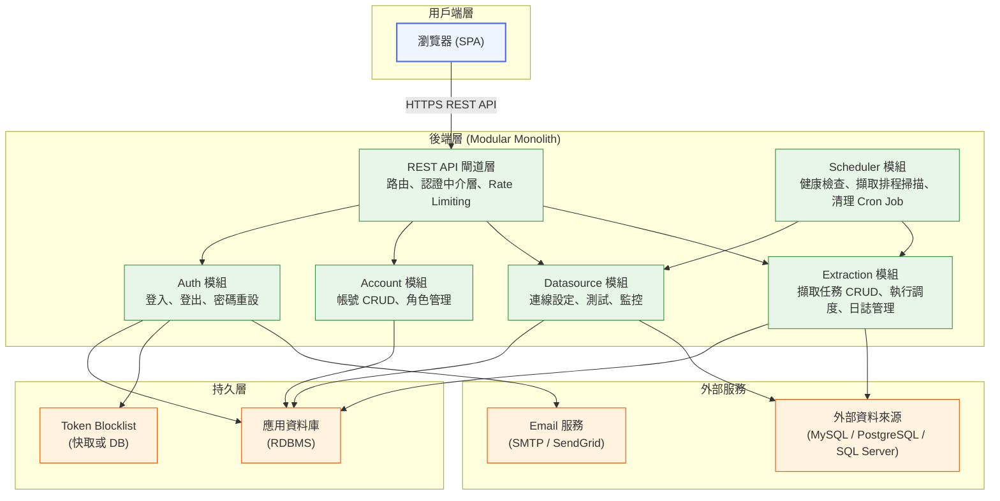

### 1.2 架構選擇理由

| 決策 | 選擇 | 理由 |
|------|------|------|
| 整體架構 | Modular Monolith | 使用者規模 500 人以下、開發團隊小、MVP 階段。Microservices 的操作複雜度在此規模不合理。 |
| 前端 | SPA | 規格書明確假設（A6）。Admin 後台需要豐富互動體驗（儀表板、即時狀態更新）。 |
| API 風格 | RESTful API | 標準、可預測，與 SPA 搭配成熟。規格書已定義所有端點路徑與 HTTP 方法。 |
| Session 管理 | JWT + Refresh Token | OQ-1 決議。支援無狀態水平擴展，短效 Access Token 降低洩漏風險。 |
| Token 失效 | Token Blocklist | NFR-001.1 明確要求。用於登出、帳號停用、密碼重設後強制失效。 |
| 排程 | 內建 Scheduler 模組 | MVP 排程需求包含靜態 Cron（健康檢查每 30 分鐘、清理每日）與動態 Cron 掃描（擷取排程每分鐘），引入獨立排程服務（如 BullMQ）過度複雜。 |
| 擷取執行模型 | Promise-based 非同步執行 | MVP 擷取為 I/O 密集（資料庫查詢），Node.js 非同步 I/O 足以應對；API 層回傳 `202 Accepted`，前端 Polling 取得進度。 |
| 技術棧 | Node.js + NestJS + React + PostgreSQL | 詳見第 10 節技術棧決策。 |

### 1.3 關鍵取捨

- **選擇 Modular Monolith 而非 Microservices**：犧牲部分服務獨立擴展能力，換取顯著較低的開發與運維複雜度。MVP 並發需求（100 人）可由單機處理。
- **JWT 短效 Access Token + Refresh Token**：比純 blocklist 方案複雜，但安全性更佳，且支援未來 SSO 整合（Phase 2）。
- **Polling 而非 WebSocket**（儀表板更新）：OQ-9 決議。降低後端實作複雜度，30 秒輪詢對監控場景可接受。擷取任務進度 Polling 採 3 秒間隔（F021/F024）。
- **Promise-based 非同步執行而非 BullMQ / Worker Thread**（擷取作業）：MVP 擷取任務為 I/O 密集（資料庫批次查詢），Node.js 事件循環可有效處理。BullMQ 引入 Redis 強依賴與額外運維複雜度，不符 MVP 規模。

---

## 2. 系統上下文

### 2.1 外部參與者與整合點

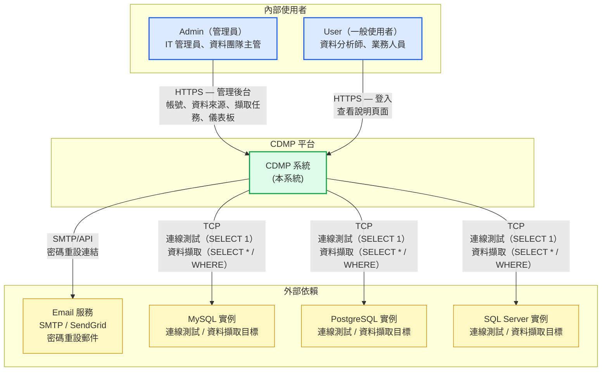

### 2.2 信任邊界

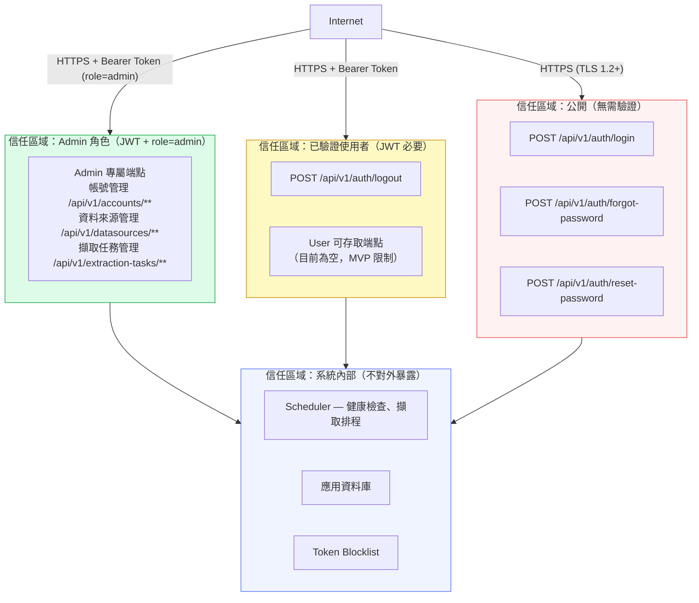

### 2.3 外部依賴摘要

| 外部依賴 | 通訊方式 | 用途 | 相關 Feature |
|---------|---------|------|-------------|
| Email 服務（SMTP / SendGrid） | SMTP 或 HTTPS API | 寄送密碼重設連結 | F009 |
| MySQL 實例 | TCP（Port 3306） | 連線測試（`SELECT 1`）、自動健康檢查、資料擷取（批次 SQL Query） | F015, F016, F021, F023 |
| PostgreSQL 實例 | TCP（Port 5432） | 連線測試（`SELECT 1`）、自動健康檢查、資料擷取（批次 SQL Query） | F015, F016, F021, F023 |
| SQL Server 實例 | TCP（Port 1433） | 連線測試（`SELECT 1`）、自動健康檢查、資料擷取（批次 SQL Query） | F015, F016, F021, F023 |
| 瀏覽器 | HTTPS | 使用者介面 | 全部 |

> **注意**：資料擷取（F021/F023）對目標資料庫的流量性質與連線測試（`SELECT 1`）顯著不同——擷取為批次資料讀取（`SELECT * FROM table` 或增量 `WHERE col > value`），可能涉及大量資料傳輸，對目標資料庫的負載影響需評估。

---

## 3. 邏輯架構

### 3.1 元件總覽

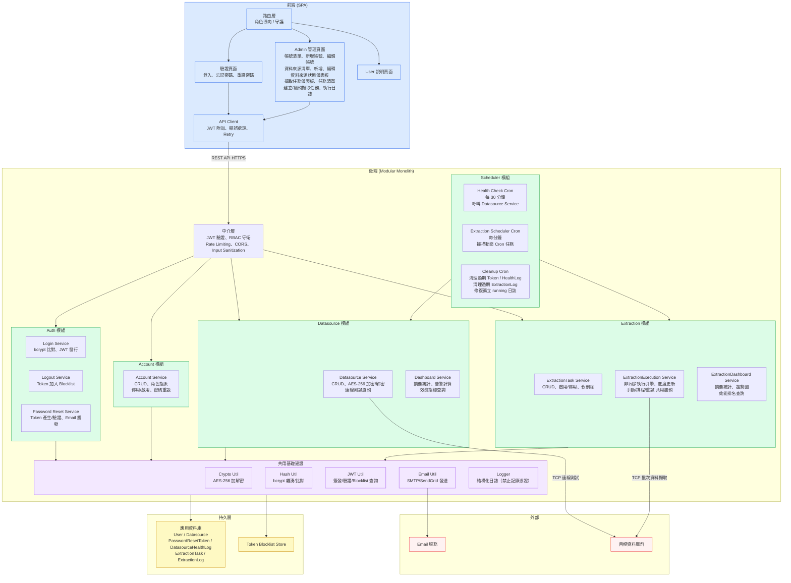

### 3.2 各元件職責說明

#### 前端 SPA

| 子模組 | 職責 | 輸入 / 輸出 |
|--------|------|------------|
| 路由層 | 依 JWT 中的 `role` 欄位導向對應頁面；未驗證時導回登入頁 | JWT（localStorage / cookie）→ 路由決策 |
| 驗證頁面（AuthPages） | 登入表單、忘記密碼、重設密碼頁面；前端欄位驗證 | 使用者輸入 → API 請求 |
| Admin 管理頁面 | 帳號管理（F004-F010）、資料來源管理（F011-F016）、擷取任務管理（F017-F025）所有 UI | API 回應 → 畫面渲染 |
| User 說明頁面 | 靜態說明內容，無可操作功能（MVP 限制） | — |
| API Client | 統一附加 `Authorization: Bearer {token}` header；處理 401/403 回應；提供 Loading 狀態管理；支援不同 Polling 頻率（儀表板 30 秒、擷取進度 3 秒） | 業務邏輯請求 → HTTP 請求 |

**重要設計決策**：Access Token 的儲存位置（`localStorage` vs `httpOnly Cookie`）由實作團隊決定，但需注意：`localStorage` 面臨 XSS 風險；`httpOnly Cookie` 需處理 CSRF 防護。建議使用 `httpOnly Cookie`。

#### 後端中介層（Middleware）

| 中介層 | 職責 | 執行順序 |
|--------|------|---------|
| CORS | 限制允許的 Origin（OQ-12 決議，需要 CORS 設定） | 1 |
| Rate Limiting | 登入端點：5 次/分鐘/IP（OQ-5 決議）；密碼重設端點：同樣限制 | 2 |
| JWT 驗證 | 驗證 Bearer Token 格式、簽章、有效期；查詢 Token Blocklist | 3 |
| RBAC 守衛 | 依端點定義的角色需求比對 JWT payload 中的 `role` | 4 |
| Input Sanitization | 清除 XSS 與 SQL Injection 惡意字元 | 5 |

#### Auth 模組

| 服務 | 職責 | 關鍵函式 | 相關 Feature |
|------|------|---------|-------------|
| Login Service | 驗證 Email/密碼；發行 Access Token + Refresh Token | `login(email, password, rememberMe)` | F001, F002 |
| Logout Service | 將 Access Token 加入 Blocklist；撤銷 Refresh Token | `logout(userId, token)` | F003 |
| Password Reset Service | 產生 `PasswordResetToken`；觸發 Email 發送；驗證 Token；更新密碼 Hash；失效所有現有 Token | `requestReset(email)`, `resetPassword(token, newPassword)` | F009 |

**Access Token 策略**（依 OQ-1 決議）：
- 短效 Access Token（預設 8 小時；記住我 30 天）
- Refresh Token 用於無停機 JWT Secret 輪替（OQ-11 決議）
- 登出時 Access Token 加入 Blocklist，Refresh Token 撤銷

#### Account 模組

| 服務 | 職責 | 關鍵業務規則 | 相關 Feature |
|------|------|-----------|-------------|
| Account Service | 帳號 CRUD；角色指派；停用/啟用；Admin 代為重設密碼 | 最後一位 Admin 保護（ACCOUNT_LAST_ADMIN）；Admin 不可停用自己（ACCOUNT_SELF_DISABLE）；Email 大小寫不敏感唯一性；停用時失效所有 Session | F004-F010 |

**樂觀鎖定**（OQ-6 決議）：帳號編輯與資料來源編輯均採用 Optimistic Locking，以版本號或 `updated_at` 時間戳記偵測並發衝突，回傳 HTTP 409。

#### Datasource 模組

| 服務 | 職責 | 關鍵業務規則 | 相關 Feature |
|------|------|-----------|-------------|
| Datasource Service | 資料來源 CRUD；AES-256 加密密碼；執行連線測試（`SELECT 1`，10 秒逾時）；更新狀態與 `last_tested_at`；寫入 `DatasourceHealthLog`；查詢外部資料來源的 schema 列表與 table 列表（透過 `IExtractionExecutor.listSchemas()` / `listTables()`） | 密碼 API 回應遮罩；編輯後重設狀態為 `unknown`；軟刪除使用 `deleted_at`；schema/table 查詢設定 10 秒逾時 | F011-F015, F017, F019 |
| Dashboard Service | 彙整儀表板摘要統計；計算告警（連續 >= 2 次失敗）；查詢效能趨勢資料 | 軟刪除資料來源排除；告警依 `consecutiveFailures` 降序 | F016 |

**連線測試隔離**：每次連線測試使用獨立的短期連線，不占用應用程式連線池（MVP 不使用連線池，OQ-R9 決議）。AES-256 解密後的密碼僅在記憶體中存在，測試完成後立即釋放。

**Schema / Table 查詢端點**（AD-E04-10）：Datasource Controller 提供兩個端點，供建立/編輯擷取任務時動態載入來源 schema 與 table 列表：

| 端點 | 說明 | 回應格式 |
|------|------|---------|
| `GET /api/v1/datasources/:id/schemas` | 查詢指定資料來源的可用 schema（或 database）列表 | `{ schemas: string[] }` |
| `GET /api/v1/datasources/:id/schemas/:schema/tables` | 查詢指定 schema 下的資料表列表 | `{ tables: string[] }` |

- 兩個端點均透過 `IExtractionExecutor` 介面的 `listSchemas()` 與 `listTables()` 方法連線外部資料庫查詢
- 設定 10 秒連線逾時；連線失敗時回傳 `503 Service Unavailable`
- 不使用快取機制，每次請求均即時查詢外部資料庫
- 僅 Admin 角色可存取

#### Extraction 模組

| 服務 | 職責 | 關鍵業務規則 | 相關 Feature |
|------|------|-----------|-------------|
| ExtractionTask Service | 擷取任務 CRUD；啟用/停用（toggle）；軟刪除；欄位驗證（cron 格式、增量模式必填欄位）；名稱唯一性（排除軟刪除） | Optimistic Locking；`status=running` 時禁止編輯/停用/刪除；cron 表達式以 `cron-parser` 驗證（UTC）；必須參考存在且未刪除的 Datasource | F017, F018, F019, F020, F025 |
| ExtractionExecution Service | 建立 ExtractionLog（`status=running`）；更新 ExtractionTask（`status=running`）；非同步執行擷取作業（含動態建表、批次讀取外部來源、批次寫入 AppDB raw data 表）；批次更新進度（`extracted_count`、`progress_percent`）；完成後更新統計（`avg_duration_ms`、`execution_count`）；增量模式成功後更新 `last_incremental_value` | 並發控制（`status=running` 時拒絕重複觸發，回傳 409）；執行失敗需捕捉例外並更新狀態為 `failed`；手動觸發可繞過 `enabled` 旗標；全量模式先 TRUNCATE 再寫入；增量模式追加寫入 | F021, F023 |
| ExtractionDashboard Service | 摘要統計（今日成功/失敗以 UTC+8 計算）；趨勢圖（7/14/30 天聚合查詢）；效能排名（Top 5 by `avg_duration_ms DESC`）；執行中任務列表 | 軟刪除任務排除；無執行紀錄時成功率回傳 `0.0`；今日起訖以 UTC+8 (Asia/Taipei) 為邊界 | F018（summary）, F024 |

**非同步執行模型**（AD-E04-1）：

`POST /api/v1/extraction-tasks/:id/run` 回傳 `202 Accepted`，擷取作業在背景非同步執行。

- **選擇方案**：Promise-based 背景作業。API 層建立 ExtractionLog 並更新 Task 狀態後，立即回傳 202；擷取邏輯在背景 Promise chain 中執行。
- **理由**：MVP 擷取為 I/O 密集（非 CPU 密集），Node.js 事件循環可有效處理。BullMQ 需要 Redis 依賴，超出 MVP 規模需求。
- **進度更新機制**：每批次（預設 `batch_size`，可配置 100-10000，預設 1000）更新 `ExtractionTask.extracted_count` 與 `progress_percent` 至資料庫；前端以 3 秒 Polling 讀取進度。
- **逾時機制**：擷取執行最長 2 小時（AQ-9 決議）。超時由 Cleanup Cron 偵測並標記為 `failed`。
- **共用設計**（AD-E04-3）：`ExtractionExecutionService` 為獨立可注入服務，同時被手動觸發 API 端點（F021）與排程 Cron Job（F023）呼叫，差異僅在 `triggered_by` 欄位值（`manual` / `schedule` / `retry`）。

**並發控制**（AD-E04-4）：採用資料庫樂觀檢查（執行前查詢 `status != 'running'`），而非分散式鎖。MVP 單機部署下此方案足夠；水平擴展時需升級為資料庫鎖或分散式鎖（詳見第 8 節）。

#### Scheduler 模組

| Cron Job | 執行頻率 | 職責 |
|---------|---------|------|
| Health Check Cron | 每 30 分鐘 | 平行測試所有未軟刪除的資料來源；呼叫 Datasource Service 的測試邏輯；寫入 `DatasourceHealthLog` |
| Extraction Scheduler Cron | 每分鐘 | 掃描 `enabled=true AND deleted_at IS NULL AND status != 'running'` 的擷取任務；以 `cron-parser` 比對 cron 表達式與當前 UTC 時間；觸發符合條件的任務（呼叫 ExtractionExecution Service，`triggered_by='schedule'`） |
| Cleanup Cron | 每日 | 清理超過 90 天的 `DatasourceHealthLog`（OQ-10 決議）；清理超過 30 天的 `ExtractionLog`（AQ-10 決議）；清理已過期的 `PasswordResetToken`；清理已過期的 Token Blocklist 記錄；修復孤立 running 日誌（AD-E04-7） |

**孤立 running 日誌修復**（AD-E04-7）：Cleanup Cron 每次執行時，將 `started_at < NOW() - 2 hours AND finished_at IS NULL` 的 ExtractionLog 標記為 `failed`（error_message: `'Execution timeout: exceeded 2 hour limit'`），並同步更新對應 ExtractionTask.status 為 `failed`。

**Raw Data 動態表管理**（AD-E04-8）：擷取任務首次執行時，系統自動於 AppDB 建立 raw data 表（`raw_{task_id_short}`）。表結構從外部來源表的 metadata（`INFORMATION_SCHEMA`）推斷。表名由系統自動生成（`raw_` + task_id 前 8 碼），僅包含 hex 字元，不接受使用者輸入，避免 SQL Injection 風險。欄位名稱經 sanitize 處理（僅允許字母、數字、底線）。

**Raw Data 寫入模式**（AD-E04-9）：
- **全量（full）**：每次執行前 `TRUNCATE TABLE raw_{task_id_short}`，再重新批次寫入全部資料
- **增量（incremental）**：根據 `incremental_column > last_incremental_value` 篩選新增資料，追加寫入
- **批次大小**：預設 1,000 筆/批次（可透過 `EXTRACTION_BATCH_SIZE` 環境變數配置，範圍 100-10,000）

**Raw Data 預覽 API**（AD-E04-10）：`GET /api/v1/extraction-tasks/:id/raw-data` 透過動態 SQL 查詢 raw data 表，支援分頁（`LIMIT` + `OFFSET`）與單欄位排序。不使用 ORM Entity，直接以 Raw SQL 操作動態表。百萬筆資料場景下，依賴 `_cdmp_id`（或主鍵）索引確保分頁效能。非索引欄位排序時附帶效能警告。

**架構挑戰**：多實例部署時，Scheduler 可能同時執行導致重複健康檢查與重複擷取觸發。MVP 單機部署不受影響；若未來水平擴展，需引入分散式鎖定機制（見第 8 節）。

#### 共用基礎建設（Shared Infrastructure）

| 工具 | 職責 | 安全性注意事項 |
|------|------|--------------|
| Crypto Util | AES-256-GCM 加密/解密資料庫連線密碼 | 金鑰從環境變數讀取（OQ-4 決議），禁止硬編碼 |
| Hash Util | bcrypt 密碼雜湊（cost factor >= 10）與比對 | 明文密碼不得出現在日誌 |
| JWT Util | 發行/驗證 JWT；支援多 Secret 並行驗證（OQ-11 決議） | 支援無停機 Secret 輪替 |
| Email Util | 封裝 SMTP / SendGrid 呼叫；Email 寄送為非同步操作（不阻塞 API 回應） | Email 內容不含密碼 |
| Logger | 結構化日誌輸出；自動遮罩敏感欄位（password、token、encrypted_password） | Stack trace 禁止出現在 API 回應 |

---

## 4. 資料架構

### 4.1 核心資料實體（ER 圖）

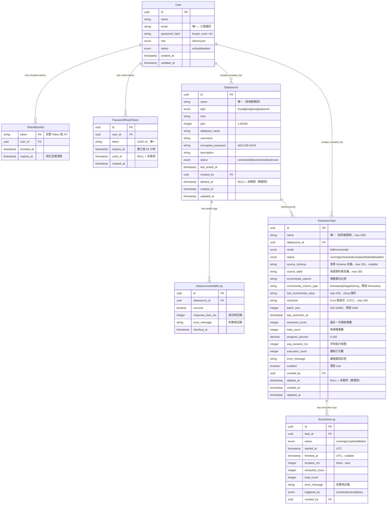

### 4.2 資料所有權

| 實體 | 擁有模組 | 其他模組存取方式 |
|------|---------|----------------|
| User | Account 模組 | Auth 模組讀取（驗證登入）；透過服務介面呼叫，不直接存取 Repository |
| TokenBlocklist | Auth 模組 | Middleware 查詢（驗證請求）；Account 模組透過 Auth Service 寫入（停用帳號） |
| PasswordResetToken | Auth 模組 | 不對其他模組開放 |
| Datasource | Datasource 模組 | Dashboard Service 讀取（彙整統計）；Extraction 模組透過 Datasource Service 介面查詢（驗證參照完整性） |
| DatasourceHealthLog | Datasource 模組 | Dashboard Service 讀取（趨勢圖、告警計算） |
| ExtractionTask | Extraction 模組 | Scheduler 模組透過 ExtractionExecution Service 介面呼叫 |
| ExtractionLog | Extraction 模組 | 不對其他模組開放 |

### 4.3 資料一致性模型

| 操作 | 一致性需求 | 實作方式 |
|------|----------|---------|
| 登入驗證 | 強一致性 | 同步讀取 User 與 TokenBlocklist |
| 帳號停用 + Token 失效 | 強一致性 | 單一 DB 交易：更新 User.status + 批次寫入 TokenBlocklist |
| 密碼重設 + Token 失效 | 強一致性 | 單一 DB 交易：更新 password_hash + 撤銷所有現有 Token |
| 連線測試結果更新 | 強一致性 | 同步更新 Datasource.status + 寫入 DatasourceHealthLog |
| Email 寄送（密碼重設） | 最終一致性 | 非同步操作；API 在 Email 寄出前即回應成功訊息 |
| 健康檢查歷史清理 | 最終一致性 | 背景 Cron Job，不影響前台操作 |
| 觸發擷取執行（建立 Log + 更新 Task status） | 強一致性 | 同一 DB 交易：INSERT ExtractionLog + UPDATE ExtractionTask.status = 'running' |
| 擷取進度更新（extracted_count） | 最終一致性 | 非交易性批次更新（每 batch_size 筆一次）；Polling 容忍短暫延遲 |
| 擷取完成（更新 Log + Task） | 強一致性 | 同一 DB 交易：UPDATE ExtractionLog（finished_at, duration_ms）+ UPDATE ExtractionTask（status, last_execution_at, avg_duration_ms, execution_count）；增量模式同時更新 `last_incremental_value` |
| 排程掃描執行 | 最終一致性 | 掃描失敗記錄日誌，下次掃描重試 |
| ExtractionLog 清理 | 最終一致性 | 背景 Cron Job，不影響前台操作 |

### 4.4 資料庫索引建議

| 表格 | 欄位 | 索引類型 | 理由 |
|------|------|---------|------|
| User | email | UNIQUE INDEX | 登入查詢；Email 唯一性檢查 |
| User | role, status | 複合 INDEX | 帳號清單篩選（F005） |
| TokenBlocklist | token | UNIQUE INDEX | Middleware 頻繁查詢 |
| TokenBlocklist | expires_at | INDEX | 定期清理查詢 |
| TokenBlocklist | user_id | INDEX | 帳號停用批次撤銷 |
| PasswordResetToken | token | UNIQUE INDEX | 重設流程查詢 |
| PasswordResetToken | expires_at | INDEX | 定期清理 |
| Datasource | name, deleted_at | 複合 INDEX | 名稱唯一性檢查（排除軟刪除） |
| Datasource | deleted_at | INDEX | 所有清單查詢的過濾條件 |
| DatasourceHealthLog | datasource_id, checked_at | 複合 INDEX | 趨勢圖查詢、告警計算（NFR-002.4） |
| DatasourceHealthLog | checked_at | INDEX | 清理超過 90 天紀錄 |
| ExtractionTask | name, deleted_at | 複合 INDEX | 名稱唯一性檢查（排除軟刪除） |
| ExtractionTask | status, deleted_at | 複合 INDEX | 排程掃描查詢（每分鐘執行） |
| ExtractionTask | datasource_id | INDEX | 外鍵查詢；資料來源刪除影響檢查 |
| ExtractionTask | deleted_at | INDEX | 清單查詢過濾條件 |
| ExtractionLog | task_id, started_at | 複合 INDEX | 日誌查詢（倒序分頁）、趨勢圖聚合 |
| ExtractionLog | started_at | INDEX | 今日統計計算、清理查詢 |
| ExtractionLog | status, started_at | 複合 INDEX | 今日成功/失敗計數（F018 summary, F024 dashboard） |
| raw_{task_id_short} | _cdmp_id（若存在） | PRIMARY KEY INDEX | Raw data 預覽分頁與排序（F026），動態建表時自動建立 |

### 4.5 資料生命週期

| 資料 | 保留策略 | 清理機制 |
|------|---------|---------|
| DatasourceHealthLog | 90 天（OQ-10 決議） | Cleanup Cron Job 每日執行 |
| PasswordResetToken | 永久保留記錄（已使用/過期不刪除，僅標記狀態），或由 Cron 清理過期未使用的 Token | Cleanup Cron Job |
| TokenBlocklist | 保留至 `expires_at` 之後，Cron 定期清理 | Cleanup Cron Job |
| Datasource（軟刪除） | 永久保留（`deleted_at` 非 NULL），不自動清理 | 手動 DBA 操作（如需復原） |
| ExtractionLog | 30 天（AQ-10 決議） | Cleanup Cron Job 每日執行，刪除 `started_at < NOW() - 30 days` 的記錄 |
| ExtractionTask（軟刪除） | 永久保留（`deleted_at` 非 NULL），不自動清理 | 手動 DBA 操作（如需復原） |

---

## 5. 整合與通訊

### 5.1 通訊模式總覽

| 整合點 | 方向 | 同步/非同步 | 協定 |
|--------|------|-----------|------|
| 瀏覽器 ↔ 後端 | 雙向 | 同步（Request/Response） | HTTPS REST API |
| 後端 → 應用資料庫 | 單向 | 同步 | ORM / SQL over TCP |
| 後端 → Token Blocklist | 雙向 | 同步 | 依實作（DB 或 Redis） |
| 後端 → Email 服務 | 單向 | 非同步（fire-and-forget） | SMTP / HTTPS |
| 後端 → 目標資料庫（連線測試） | 單向 | 同步（含 10 秒逾時） | TCP `SELECT 1` |
| 後端 → 目標資料庫（資料擷取） | 單向 | 非同步（背景執行，2 小時逾時） | TCP 批次 SQL Query |
| Scheduler → 後端邏輯 | 內部呼叫 | 同步 | 模組內部方法呼叫 |

### 5.2 驗證流程（Auth Flow）

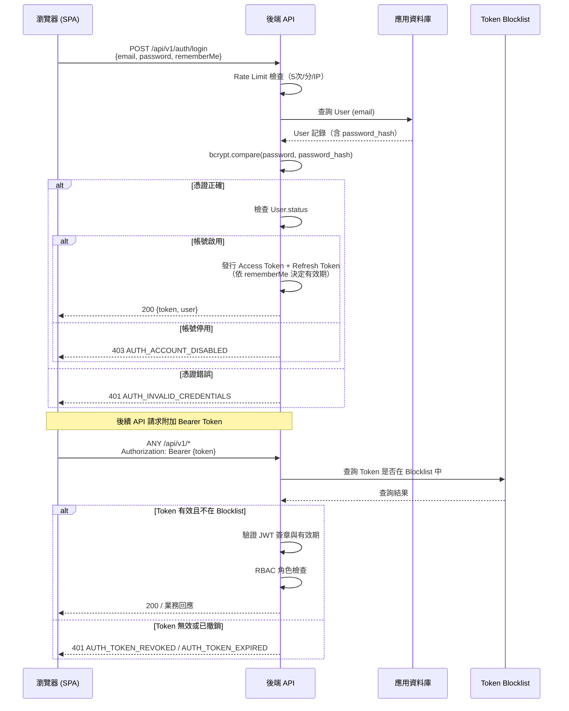

### 5.3 密碼重設流程

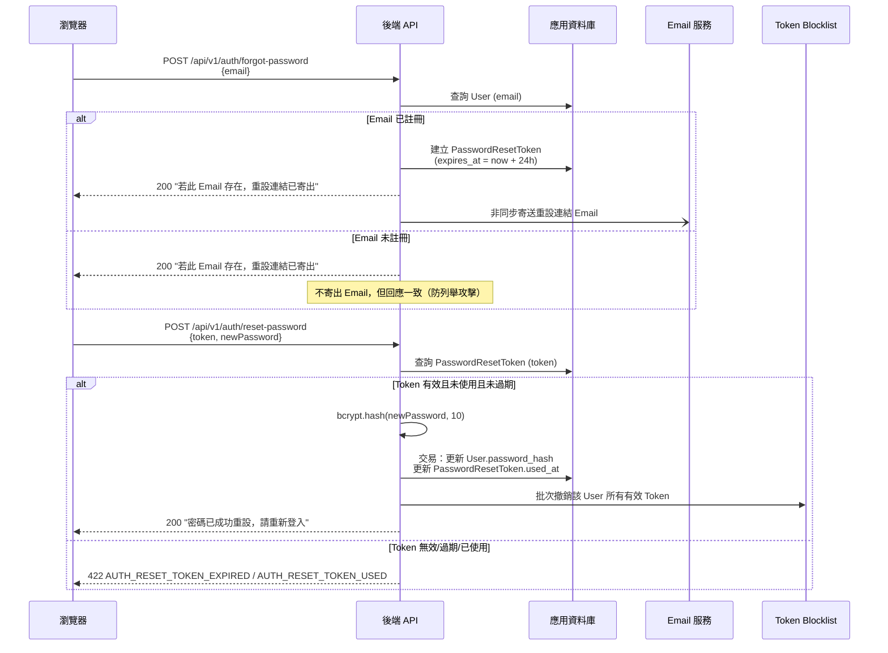

### 5.4 連線測試流程（F015）

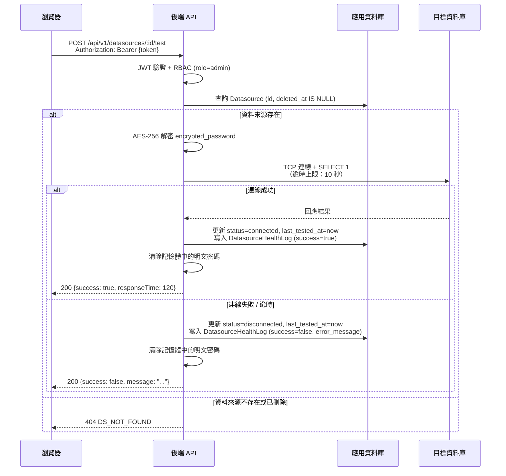

### 5.5 擷取任務執行流程（F021 / F023）

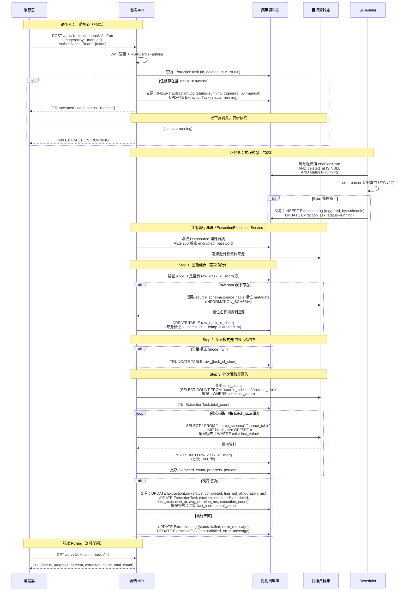

### 5.6 錯誤處理與韌性

| 整合點 | 失敗場景 | 處理策略 |
|--------|---------|---------|
| 目標資料庫連線測試 | 逾時 / 拒絕連線 | 10 秒強制 timeout；回傳 success=false；更新狀態為 disconnected |
| Email 服務不可用 | SMTP 連線失敗 | 回傳 SYSTEM_EMAIL_SEND_FAILED（500）；非同步寄送失敗不影響 Token 生成 |
| 應用資料庫連線失敗 | DB 不可達 | 回傳 SYSTEM_INTERNAL_ERROR（500）；錯誤記錄至 Logger（不含敏感資訊） |
| Token Blocklist 查詢失敗 | Cache/DB 不可達 | **架構挑戰**：Fail-Open（允許請求通過）vs Fail-Closed（拒絕請求）。建議 Fail-Closed 以優先安全性。詳見第 8 節。 |
| 健康檢查 Cron 失敗 | 單次執行異常 | 記錄錯誤至日誌；下次排程正常繼續；不影響前台 API |
| 目標資料庫（資料擷取） | 執行中連線斷開 / 查詢失敗 | 捕捉例外；更新 ExtractionTask.status = 'failed' 與 error_message；更新 ExtractionLog；不自動重試（AD-E04-6），須 Admin 手動重試 |
| 目標資料庫（Schema/Table 列表查詢） | 逾時 / 拒絕連線 | 10 秒逾時；回傳 503 DATASOURCE_SCHEMA_LOAD_FAILED 或 DATASOURCE_TABLE_LOAD_FAILED；前端顯示錯誤，下拉停用；不使用快取 |
| 擷取排程掃描（每分鐘） | DB 查詢失敗 | 記錄 ERROR 日誌；跳過本次掃描；下次掃描正常繼續 |

### 5.7 冪等性考量

| 端點 | 冪等性 | 說明 |
|------|-------|------|
| `POST /api/v1/auth/login` | 非冪等 | 每次呼叫產生新 Token |
| `POST /api/v1/auth/logout` | 冪等 | 重複呼叫結果相同（Token 已在 Blocklist） |
| `POST /api/v1/auth/forgot-password` | 冪等（行為一致） | 回應一致；多次呼叫產生多個 PasswordResetToken（舊的仍有效，但 24h 到期） |
| `POST /api/v1/datasources/:id/test` | 冪等（副作用重複） | 可重複呼叫；每次均產生新的 HealthLog 記錄 |
| `GET /api/v1/datasources/:id/schemas` | 冪等 | 唯讀查詢，即時查詢外部資料庫，不使用快取 |
| `GET /api/v1/datasources/:id/schemas/:schema/tables` | 冪等 | 唯讀查詢，即時查詢外部資料庫，不使用快取 |
| `DELETE /api/v1/datasources/:id` | 冪等 | 重複軟刪除結果相同 |
| `POST /api/v1/extraction-tasks/:id/run` | 非冪等 | 每次呼叫建立新的 ExtractionLog；`status=running` 時拒絕（409）避免重複觸發 |
| `PATCH /api/v1/extraction-tasks/:id/toggle` | 冪等 | 停用已停用的任務回傳成功，無額外副作用 |
| `DELETE /api/v1/extraction-tasks/:id` | 冪等 | 重複軟刪除結果相同 |

---

## 6. 非功能需求架構對應

### 6.1 安全性（NFR-001）

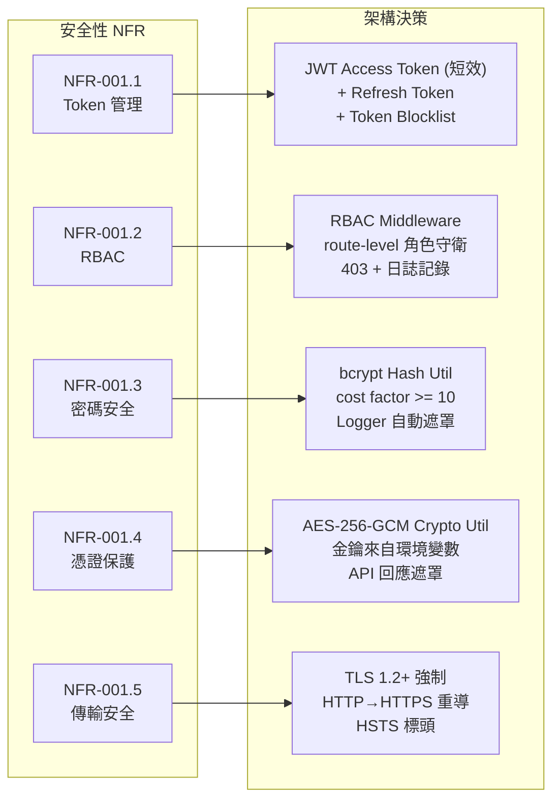

| NFR | 架構決策 | 實作位置 |
|-----|---------|---------|
| NFR-001.1 Token 管理 | JWT 短效 Access Token（8h/30d）+ Refresh Token；Token Blocklist 支援強制失效 | JWT Util、Auth 模組、Middleware |
| NFR-001.2 RBAC | 路由層級的角色守衛中介層；未授權回傳 403 並記錄至日誌 | RBAC Middleware |
| NFR-001.3 密碼安全 | bcrypt（cost >= 10）；Logger 自動遮罩密碼欄位；明文密碼絕不持久化 | Hash Util、Logger |
| NFR-001.4 憑證保護 | AES-256-GCM 加密儲存；金鑰從環境變數讀取；API 序列化層排除 `encrypted_password` 欄位；回傳遮罩字串 `****` | Crypto Util、Datasource Service、DTO 序列化層 |
| NFR-001.5 傳輸安全 | 強制 TLS 1.2+；HTTP 請求重導至 HTTPS；設定 HSTS 標頭；CORS 白名單（OQ-12） | 反向代理（Nginx/等）配置、後端中介層 |

**額外安全措施**（規格書中隱含）：
- API 路徑使用 `/api/v1/` 前綴（OQ-13 決議）
- Rate Limiting：登入端點 5 次/分鐘/IP（OQ-5 決議）
- 所有回應排除 Stack Trace；500 錯誤使用通用訊息
- 多 JWT Secret 並行支援無停機輪替（OQ-11 決議）

### 6.2 效能（NFR-002）

| NFR | 目標值 | 架構決策 |
|-----|--------|---------|
| NFR-002.1 API 回應時間 | p95 < 500ms | 資料庫索引（見 4.4）；避免 N+1 查詢；分頁強制執行 |
| NFR-002.2 並發使用者 | >= 100 人 | Modular Monolith 可於單機處理；JWT 無狀態驗證減少 DB 查詢；Token Blocklist 建議使用高效能存儲（Redis 或帶索引的 DB） |
| NFR-002.3 連線測試逾時 | <= 10 秒 | Datasource Service 強制 10 秒 TCP 連線 Timeout；每次測試使用獨立短期連線 |
| NFR-002.4 儀表板載入（資料來源） | < 2 秒（50 資料來源） | `datasource_health_logs` 上的複合索引（datasource_id, checked_at）；Dashboard Service 使用聚合查詢而非應用層計算；前端 Polling 間隔 30 秒（避免頻繁請求） |
| NFR-002.5 清單搜尋效能 | < 500ms（1,000 筆） | 分頁強制執行（預設 20 筆/頁）；搜尋欄位建立索引；`deleted_at IS NULL` 條件搭配索引 |
| NFR-002.6 擷取儀表板載入 | < 2 秒（50 任務） | ExtractionLog 上的 `(task_id, started_at)` 與 `(status, started_at)` 複合索引；今日統計使用 DB 聚合查詢（`DATE_TRUNC`）而非應用層計算；趨勢圖使用 `DATE_TRUNC` 聚合 |
| NFR-002.7 擷取任務清單 | < 500ms（1,000 筆） | 分頁強制執行（預設 10 筆/頁）；`(status, deleted_at)` 複合索引；搜尋欄位索引 |

**效能風險**：
- `DatasourceHealthLog` 隨時間增長（每 30 分鐘 × 資料來源數），90 天保留期需確保 Cleanup Cron 正常執行，否則查詢效能將逐漸下降。
- `ExtractionLog` 保留 30 天（AQ-10 決議），Cleanup Cron 確保不會無限增長。

### 6.3 可用性與可觀測性

| 面向 | 架構決策 |
|------|---------|
| 可用性 | MVP 單機部署；HTTPS 由反向代理（Nginx 等）終止；後端進程崩潰需 Process Manager（PM2 等）自動重啟 |
| 日誌（Logging） | 結構化日誌（JSON 格式建議）；敏感欄位自動遮罩；區分 INFO / WARN / ERROR 等級；錯誤包含 request ID 追蹤 |
| 健康端點 | 建議提供 `GET /api/health` 端點，供 Load Balancer / 部署平台健康檢查 |
| 監控 | MVP 階段最低需求：應用程式日誌集中收集；若部署雲端，利用雲端原生監控 |
| 擷取任務孤立狀態偵測 | 若後端 Process 在擷取執行中崩潰，ExtractionLog 將保持 `status=running`。Cleanup Cron 的孤立 running 修復邏輯（AD-E04-7）每日偵測並標記超過 2 小時的孤立記錄為 `failed` |

### 6.4 可維護性

| 面向 | 架構決策 |
|------|---------|
| 模組邊界 | 各模組透過服務介面互動，禁止跨模組直接存取資料庫 Repository |
| API 版本控制 | 路由使用 `/api/v1/` 前綴（OQ-13），為未來版本升級預留空間 |
| 設定管理 | 所有環境相關設定（DB 連線字串、JWT Secret、AES 金鑰）透過環境變數注入，不硬編碼 |
| Monorepo | 前後端同一 Repository（OQ-3 決議），統一 CI/CD 流程 |

---

## 7. 部署與執行時期視圖

### 7.1 部署單元

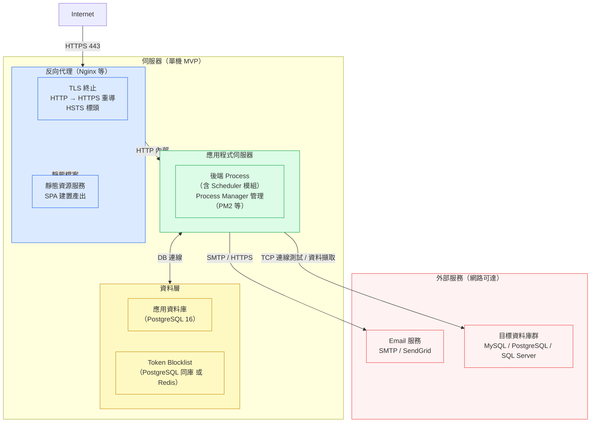

### 7.2 環境分離

| 環境 | 用途 | 建議配置 |
|------|------|---------|
| Development | 本地開發 | 本機 DB；Mock Email 服務（如 Mailhog）；Docker Compose 啟動相依服務 |
| Test / CI | 自動化測試 | 獨立測試 DB（每次 CI 重建）；Mock 外部服務；執行 Unit + Integration Test |
| Production | 正式環境 | 企業內網或私有雲；HTTPS 強制；真實 Email 服務；DB 備份策略 |

### 7.3 擴展模型

| 情境 | 擴展策略 |
|------|---------|
| MVP（並發 <= 100 人） | 單機部署，垂直擴展（升級硬體規格） |
| 未來水平擴展（Phase 2+） | 多後端實例需：Token Blocklist 使用 Redis（跨實例共享）；Scheduler 引入分散式鎖（避免重複健康檢查與重複擷取觸發）；Session 無狀態（JWT 已滿足）；擷取並發控制需升級為資料庫 row-level lock 或分散式鎖（避免 status 競爭條件） |

### 7.4 設定與密鑰管理

所有敏感設定必須透過環境變數注入，禁止出現在程式碼或版本控制中：

| 設定項目 | 說明 |
|---------|------|
| `DATABASE_URL` | 應用資料庫連線字串 |
| `JWT_SECRET` | JWT 簽章 Secret（支援多個以逗號分隔，供輪替用） |
| `AES_ENCRYPTION_KEY` | AES-256 加密金鑰（Base64 編碼，256-bit） |
| `EMAIL_SMTP_HOST/PORT/USER/PASS` 或 `SENDGRID_API_KEY` | Email 服務設定 |
| `TOKEN_BLOCKLIST_REDIS_URL` | Token Blocklist Redis 連線（若使用 Redis） |
| `APP_BASE_URL` | 前端應用 URL（用於產生密碼重設連結） |

**Secret 輪替流程**（JWT Secret，OQ-11 決議）：
1. 新增新 Secret 至環境變數（保留舊 Secret）
2. 部署後端（JWT Util 支援多 Secret 並行驗證）
3. 等待所有現有 Token 到期（最多 30 天）
4. 移除舊 Secret

### 7.5 資料庫初始化

系統部署時需透過 Seed 機制建立至少一個 Admin 帳號（規格書假設 A1）：

```
Seed 流程：
1. 執行 Schema Migration
2. 檢查是否存在任何 Admin 帳號
3. 若不存在，建立預設 Admin（帳號資訊透過環境變數注入，非硬編碼）
4. 記錄 Seed 執行結果至日誌
```

---

## 8. 風險、取捨與替代方案

### 8.1 架構風險

#### 風險 1：Token Blocklist 查詢失敗時的 Fail-Open 問題

**描述**：若 Token Blocklist 存儲（Redis 或 DB）暫時不可用，中介層需決定是允許請求通過（Fail-Open）或拒絕（Fail-Closed）。

**影響**：Fail-Open 可能讓已登出的 Token 短暫重新有效，造成安全漏洞。Fail-Closed 可能導致系統整體不可用（可用性問題）。

**建議**：採用 Fail-Closed 策略，優先保障安全性。監控 Blocklist 存儲的可用性，建立告警機制。

**替代方案**：使用短效 Access Token（8h）減少 Blocklist 查詢頻率；大多數請求的 Token 到期後自動失效，Blocklist 只需在 Token 未到期時強制失效。

---

#### 風險 2：Scheduler 多實例重複執行

**描述**：MVP 為單機部署，Scheduler 無問題。但若未來水平擴展，多個後端實例將各自啟動 Scheduler，導致每 30 分鐘對同一資料來源執行多次健康檢查，以及每分鐘重複觸發擷取任務（擷取排程掃描的 `status != 'running'` 檢查存在競爭條件）。

**影響**：DatasourceHealthLog 產生重複記錄；目標資料庫接受多餘連線；擷取任務可能被多實例同時觸發。

**建議**：MVP 階段忽略此問題。水平擴展前引入分散式鎖（Redis SET NX EX）或改用獨立排程服務（如 BullMQ、Celery）。

---

#### 風險 3：Email 服務可用性影響密碼重設流程

**描述**：密碼重設（F009）依賴外部 Email 服務，若 Email 服務不可用，使用者無法接收重設連結。

**影響**：使用者被鎖定，需聯絡 Admin 透過 F010 重設密碼。

**建議**：Email 寄送為非同步操作（不阻塞 API 回應）；記錄 Email 寄送失敗至日誌；考慮引入 Email 重試機制（指數退避）。

---

#### 風險 4：AES 加密金鑰遺失

**描述**：若 `AES_ENCRYPTION_KEY` 遺失，所有已儲存的資料來源密碼將無法解密，導致連線測試與資料擷取全數失敗。

**影響**：所有資料來源連線失效，需逐一重新輸入密碼。

**建議**：加密金鑰存放於安全的密鑰管理系統（企業內部可使用 HashiCorp Vault、AWS KMS 等），並建立金鑰備份程序。

---

#### 風險 5：非同步擷取執行的孤立 Running 狀態

**描述**：F021 採用 Promise-based 背景執行。若 Node.js Process 崩潰（OOM、硬體故障等），正在執行的擷取任務的 ExtractionLog 將永遠保持 `status=running`，`finished_at` 為 null。此孤立狀態會導致排程引擎跳過該任務（因為 `status=running`），且前端儀表板顯示永不完成的任務。

**影響**：受影響的任務無法被排程引擎自動重觸發；Admin 需手動識別並重新執行。

**建議**：Cleanup Cron 新增孤立 running 日誌修復邏輯（AD-E04-7）：將 `started_at < NOW() - 2 hours AND finished_at IS NULL` 的 ExtractionLog 標記為 `failed`，並同步更新對應 ExtractionTask.status。

---

#### 風險 6：目標資料庫大量資料擷取的負載影響

**描述**：擷取任務（全量模式）執行時，對外部資料來源執行全表查詢（`SELECT * FROM "{source_schema}"."{source_table}"`），並將資料批次寫入 AppDB raw data 表。對於大型表（數百萬筆），此查詢可能對外部資料來源造成顯著負載，甚至影響其正常業務查詢。同時，大量批次 INSERT 至 AppDB 也會佔用資料庫資源。

**影響**：目標資料庫效能下降；若目標資料庫為生產系統，可能影響業務連續性。

**建議**：
- 擷取使用可配置的 `batch_size`（預設 1000，範圍 100-10000）分批讀取（AQ-11 決議）
- 建議在低峰時段設定 cron 排程
- 增量模式可顯著降低此風險（規格書已提供 `incremental` 模式）
- 擷取連線使用獨立短期連線，不占用應用程式連線池

---

### 8.2 已評估但放棄的替代方案

| 方案 | 放棄理由 |
|------|---------|
| Microservices 架構 | 使用者規模 500 人、MVP 階段，Microservices 的網路複雜度、服務發現、分散式追蹤等成本遠超收益 |
| Server-Side Rendering（SSR）前端 | 規格書假設 A6 明確為 SPA；Admin 後台需豐富互動（儀表板、即時更新），SSR 不適合 |
| WebSocket（儀表板即時更新） | OQ-9 已決議採用 Polling（30 秒間隔）。WebSocket 需要持久連線管理，在監控場景中 Polling 的延遲可接受 |
| 不使用 Token Blocklist（純 JWT 到期） | NFR-001.1 明確要求 Token 可主動失效（登出、帳號停用、密碼重設）；純到期機制無法滿足 |
| 使用 Cookie Session（非 JWT） | 規格書 F001 明確定義 JWT Token 機制；Phase 2 SSO 整合（OQ-R3）需要 JWT 相容性 |
| Redis 作為主要 Token Blocklist | MVP 不強制引入 Redis（增加依賴），以應用資料庫的 TokenBlocklist 表替代；若效能不足可升級 |
| BullMQ + Redis 作為擷取任務佇列 | 引入 Redis 強依賴；MVP 擷取任務數量有限，Promise-based 非同步足夠；BullMQ 的持久化佇列與重試機制雖有益，但超出 MVP 複雜度預算 |
| 每個擷取任務使用獨立動態 Cron Job | 任務數量變動時維護複雜（需追蹤每個 Job 的 reference）；不如「每分鐘掃描 + cron-parser 比對」模式穩定；F023 BR-1 明確定義固定頻率掃描方案 |

### 8.3 需要驗證的領域

| 項目 | 風險等級 | 說明 |
|------|---------|------|
| Token Blocklist 查詢效能 | 中 | 每個 API 請求均查詢 Blocklist，需確認在 100 人並發下的查詢延遲（建議早期進行負載測試） |
| 連線測試並發安全性 | 中 | F016「Refresh All」觸發平行連線測試，50 個資料來源同時測試的資源消耗需驗證 |
| Email 非同步可靠性 | 低-中 | 非同步 Email 寄送的重試機制需定義（目前規格書未明確） |
| AES-256-GCM 實作正確性 | 高 | 加密金鑰管理與 IV（Initialization Vector）處理需要安全性審查 |
| 擷取任務並發數量 | 中 | 多個大型擷取任務同時執行時，Node.js Event Loop 的 I/O 吞吐量與記憶體使用需驗證 |

---

## 9. 待決事項

> 以下問題在撰寫本架構規格書時識別，需要在開發開始前確認。

### 9.1 架構層級待決事項

| # | 問題 | 影響範圍 | 建議方向 | 決策期限 |
|---|------|---------|---------|---------|
| AQ-1 | Access Token 儲存位置：`localStorage` 或 `httpOnly Cookie`？ | F001, F002, F003，前端整體安全性 | 建議 `httpOnly Cookie`（避免 XSS 風險），但需處理 CORS 和 CSRF 防護 | 開發前確認 |
| AQ-2 | Token Blocklist 實作：應用 DB 同庫 或 獨立 Redis？ | F003, F007, F009, F010，整體效能 | MVP 使用 DB 同庫；若並發測試顯示效能不足，升級至 Redis | 技術選型後確認 |
| AQ-3 | 健康端點（`GET /api/health`）的定義與回應格式 | DevOps、部署健康檢查 | 至少回傳 `{"status": "ok", "timestamp": "..."}` | 開發初期定義 |
| AQ-4 | Scheduler 的實作方式：框架內建 Cron 或 外部服務（BullMQ 等）？ | F016, F023, Cleanup 工作 | MVP 使用框架內建（`@nestjs/schedule`），降低依賴 | 技術選型後確認 |

### 9.2 功能層級待決事項

| # | 問題 | 影響範圍 | 建議方向 |
|---|------|---------|---------|
| AQ-5 | 「Refresh All」（F016）的平行測試是否有最大並行數限制（Concurrency Limit）？ | F016 效能與目標 DB 負載 | 建議設定上限（如最多 10 個並行連線），避免大量 TCP 連線同時建立 |
| AQ-6 | PasswordResetToken 過期後的保留策略：永久保留（僅標記）或 Cron 清理？ | 資料庫儲存空間 | 建議 Cron 清理超過 30 天且已使用/過期的記錄 |
| AQ-7 | Email 寄送失敗時是否需要重試機制？重試次數與退避策略？ | F009 可靠性 | 建議最多 3 次重試，指數退避 |
| AQ-8 | 帳號清單（F005）與資料來源清單（F012）的排序規則（預設排序欄位與方向）？ | F005, F012 | 建議預設依 `created_at DESC`，並支援前端指定排序欄位 |

### 9.3 已決議事項（E04 資料擷取）

> 以下為 E04 架構設計過程中提出並已決議的事項，記錄於此供實作參照。

| # | 問題 | 決議 | 決議日期 |
|---|------|------|---------|
| AQ-9 | 擷取執行是否有最長執行時間限制？ | **2 小時**。超時由 Cleanup Cron 偵測並標記為 `failed`（AD-E04-7） | 2026-03-17 |
| AQ-10 | ExtractionLog 保留策略 | **保留 30 天**。Cleanup Cron 每日清理 `started_at < NOW() - 30 days` 的記錄 | 2026-03-17 |
| AQ-11 | 批次讀取大小（Batch Size）是否可配置？ | **可配置**。ExtractionTask 新增 `batch_size` 欄位（integer, 預設 1000, 範圍 100-10000） | 2026-03-17 |
| AQ-12 | API 路徑前綴統一 | **使用 `/api/v1/extraction-tasks`**。依循現行程式碼慣例（`app.setGlobalPrefix('api/v1')`），Controller 宣告 `@Controller('extraction-tasks')` | 2026-03-17 |
| AQ-13 | `last_incremental_value` 資料型別處理 | **string 儲存 + `incremental_column_type` 欄位**。新增 `incremental_column_type`（enum: `timestamp`/`integer`/`string`，預設 `timestamp`），後端依型別決定 WHERE 比較方式與型別轉換，前端依型別決定顯示格式 | 2026-03-17 |

### 9.4 待確認假設

| 假設 | 風險 | 確認方式 |
|------|------|---------|
| 部署環境具備 HTTPS 支援（TLS 憑證已配置） | 若部署環境無 TLS，傳輸安全性 NFR 無法滿足 | 確認目標部署平台的 TLS 配置方式 |
| 目標資料庫（連線測試目標）從 CDMP 伺服器網路可達 | 若有防火牆隔離，連線測試將全數失敗 | 確認網路拓樸與防火牆規則 |
| 應用資料庫的選擇（RDBMS 類型：PostgreSQL / MySQL / SQL Server） | 影響 ORM 選擇與 SQL 語法 | 技術選型階段確認 |
| 初始 Admin 帳號的建立機制（Seed Script 或手動） | 若無初始 Admin，系統無法使用 | 定義 Seed 機制與 Admin 密碼設定方式 |

---

## 10. 技術棧決策

### 10.1 技術棧總覽

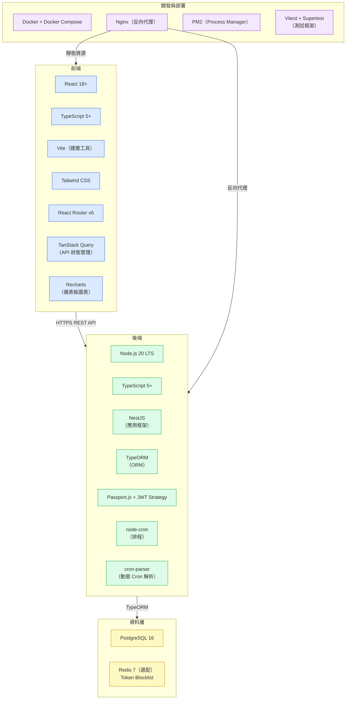

### 10.2 後端技術棧

| 層級 | 技術選擇 | 版本 | 選擇理由 |
|------|---------|------|---------|
| Runtime | Node.js | 20 LTS | 長期支援版本；非同步 I/O 模型適合 API 伺服器與並發連線測試；前後端統一語言降低認知負擔 |
| 語言 | TypeScript | 5+ | 型別安全降低執行時期錯誤；IDE 自動補全提升開發效率；與 NestJS 原生整合 |
| 框架 | NestJS | 10+ | 內建模組化架構，天然支援 Modular Monolith；內建 Guard、Middleware、Pipe 機制完整對應 RBAC、JWT 驗證、Input Validation 需求；內建 Scheduler 模組（`@nestjs/schedule`）；完善的 DI（Dependency Injection）容器便於測試 |
| ORM | TypeORM | 0.3+ | 支援 PostgreSQL；支援 Migration；Entity 定義與 TypeScript 整合良好；支援 Optimistic Locking（`@VersionColumn`） |
| 驗證 | Passport.js + `@nestjs/jwt` | — | JWT Strategy 成熟穩定；與 NestJS Guard 機制無縫整合 |
| 密碼雜湊 | bcrypt（`bcryptjs`） | — | 純 JavaScript 實作，避免原生編譯問題；滿足 NFR-001.3 cost factor >= 10 |
| 加密 | Node.js 原生 `crypto` 模組 | — | AES-256-GCM 原生支援，無需額外依賴；滿足 NFR-001.4 |
| 排程 | `@nestjs/schedule`（底層 `node-cron`） | — | NestJS 原生整合；宣告式 `@Cron()` 裝飾器；支援靜態 Cron（健康檢查、清理）與固定頻率掃描（擷取排程每分鐘） |
| Cron 解析 | `cron-parser` | 4+ | F017 BR-5 和 F023 BR-7 明確指定；用於驗證 cron 表達式格式與每分鐘排程掃描時比對觸發條件 |
| 驗證（Input） | `class-validator` + `class-transformer` | — | NestJS 內建 ValidationPipe 整合；宣告式 DTO 驗證；自動產生錯誤訊息 |
| Email | Nodemailer | — | SMTP 支援完整；可透過 adapter 切換至 SendGrid；非同步寄送 |
| 資料庫驅動 | `pg`（PostgreSQL）、`mysql2`、`mssql` | — | 連線測試與資料擷取需要三種驅動；`pg` 同時作為應用 DB 驅動 |

**NestJS 選擇理由補充**：

規格書定義了明確的模組邊界（Auth、Account、Datasource、Extraction、Scheduler），NestJS 的 `@Module()` 機制直接對應此設計。相較於 Express.js 需自行建立模組化架構，NestJS 內建結構減少架構決策成本，且強制模組間透過 exports/imports 互動，天然防止跨模組耦合。

**已評估但未採用的替代方案**：

| 替代方案 | 未採用理由 |
|---------|----------|
| Express.js | 缺乏內建結構，需自行實作模組化、DI、Guard 等機制，增加架構維護成本 |
| Fastify | 效能優異但生態系不如 Express/NestJS 成熟；NestJS 可在未來切換至 Fastify adapter |
| Python (Django / FastAPI) | 團隊需維護兩種語言棧（前端 TypeScript + 後端 Python）；Django 較重量，FastAPI 模組化需自行設計 |
| Go (Gin / Fiber) | 開發速度較慢；ORM 生態系不如 Node.js 成熟；團隊雙語言成本 |
| Prisma（替代 TypeORM） | Prisma 不原生支援 Optimistic Locking；Migration 機制較受限；TypeORM 的 Active Record / Data Mapper 雙模式更靈活 |

### 10.3 前端技術棧

| 層級 | 技術選擇 | 版本 | 選擇理由 |
|------|---------|------|---------|
| 框架 | React | 18+ | 生態系最成熟；元件化開發模式適合 Admin 後台；社群資源豐富 |
| 語言 | TypeScript | 5+ | 前後端統一語言；API 回應型別可共享（Monorepo 優勢） |
| 建置工具 | Vite | 5+ | 開發階段 HMR 極快；建置產出最佳化（Tree Shaking、Code Splitting）；ESM 原生支援 |
| CSS 方案 | Tailwind CSS | 3+ | Utility-first 減少 CSS 檔案膨脹；與元件化開發模式契合；內建 Responsive Design |
| 路由 | React Router | v6 | SPA 路由標準方案；支援巢狀路由與 Layout；守護路由（Protected Routes）實作直觀 |
| API 狀態管理 | TanStack Query（React Query） | v5 | 自動快取與失效管理；Loading / Error 狀態內建；儀表板 Polling（`refetchInterval: 30000`）與擷取進度 Polling（`refetchInterval: 3000`）原生支援 |
| 表單管理 | React Hook Form + Zod | — | 表單驗證效能優異（uncontrolled forms）；Zod schema 可與後端 DTO 驗證邏輯對齊 |
| 圖表 | Recharts | — | React 原生元件；支援圓餅圖（F016 狀態分佈）、折線圖（F016 趨勢圖、F024 擷取趨勢圖）；SVG 渲染效能良好 |
| HTTP Client | Axios | — | Interceptor 機制適合統一附加 JWT Token 與處理 401 回應；與 TanStack Query 整合良好 |
| UI 元件庫 | 不強制指定 | — | 由 UI/UX Designer 依設計稿決定（建議 shadcn/ui 或 Ant Design，兩者皆與 Tailwind 相容） |

**已評估但未採用的替代方案**：

| 替代方案 | 未採用理由 |
|---------|----------|
| Vue.js | React 生態系更豐富，團隊技術棧統一性考量 |
| Angular | 學習曲線較陡；對 MVP 規模而言過於重量級 |
| Next.js | MVP 為純 SPA，不需 SSR/SSG；引入 Next.js 增加不必要的複雜度 |
| Redux / Zustand | TanStack Query 已處理 Server State；MVP 無複雜 Client State 需求，不需額外狀態管理庫 |

### 10.4 資料層技術棧

| 層級 | 技術選擇 | 版本 | 選擇理由 |
|------|---------|------|---------|
| 應用資料庫 | PostgreSQL | 16 | 功能完整的開源 RDBMS；JSON 支援佳（未來擴展用）；UUID 原生支援；穩定的企業級選擇 |
| Token Blocklist | PostgreSQL 同庫（MVP）/ Redis 7（效能升級路徑） | — | MVP 避免引入額外依賴；TokenBlocklist 表加上索引可應對 100 並發；若負載測試顯示不足，切換至 Redis |
| Migration 工具 | TypeORM Migration | — | 與 ORM 整合；版本化 Schema 變更；支援 up/down 回滾 |

**PostgreSQL 選擇理由補充**：

規格書的目標資料庫為 MySQL、PostgreSQL、SQL Server（連線測試對象），應用資料庫需獨立選擇。PostgreSQL 在以下面向優於 MySQL：
- UUID 型別原生支援（無需 `CHAR(36)`）
- 更完善的 JSON/JSONB 操作（Phase 2 擴展用）
- 更嚴格的型別檢查與資料完整性
- 更活躍的開源社群與企業採用率

### 10.5 開發與部署工具

| 用途 | 技術選擇 | 說明 |
|------|---------|------|
| 容器化 | Docker + Docker Compose | 開發環境一鍵啟動（PostgreSQL、Redis、Mailhog）；CI 環境一致性 |
| 反向代理 | Nginx | TLS 終止、靜態資源服務、API 反向代理；滿足 NFR-001.5 |
| Process Manager | PM2 | Node.js 進程管理；自動重啟；日誌管理；滿足可用性需求 |
| 測試框架 | Vitest（Unit）+ Supertest（Integration） | Vitest 與 Vite 共享設定；速度優於 Jest；Supertest 用於 API Integration Test |
| E2E 測試 | Playwright | 跨瀏覽器測試（Chrome、Firefox、Edge）；滿足瀏覽器相容性假設 |
| Linter / Formatter | ESLint + Prettier | 程式碼風格統一；TypeScript 規則支援 |
| API 文件 | Swagger（`@nestjs/swagger`） | NestJS 裝飾器自動產生 OpenAPI 規格；便於前後端協作 |
| 負載測試 | k6 | 輕量級負載測試工具；驗證 NFR-002 效能指標（p95 < 500ms、100 並發） |
| Email 開發 | Mailhog | 本地 SMTP 攔截；開發環境不寄出真實 Email |

### 10.6 Monorepo 結構

依 OQ-3 決議，前後端同一 Repository。建議使用以下結構：

```
cdmp-mvp/
├── apps/
│   ├── api/                    # NestJS 後端
│   │   ├── src/
│   │   │   ├── modules/
│   │   │   │   ├── auth/       # Auth 模組
│   │   │   │   ├── account/    # Account 模組
│   │   │   │   ├── datasource/ # Datasource 模組
│   │   │   │   ├── extraction/ # Extraction 模組
│   │   │   │   │   ├── extraction-task.service.ts      # 任務 CRUD
│   │   │   │   │   ├── extraction-execution.service.ts # 執行邏輯（共用）
│   │   │   │   │   └── extraction-dashboard.service.ts # 儀表板統計
│   │   │   │   └── scheduler/  # Scheduler 模組
│   │   │   ├── common/         # 共用基礎建設
│   │   │   │   ├── crypto/     # AES-256 Util
│   │   │   │   ├── hash/       # bcrypt Util
│   │   │   │   ├── jwt/        # JWT Util
│   │   │   │   ├── email/      # Email Util
│   │   │   │   └── logger/     # Logger
│   │   │   └── main.ts
│   │   ├── test/               # Integration Tests
│   │   └── tsconfig.json
│   └── web/                    # React SPA 前端
│       ├── src/
│       │   ├── pages/
│       │   ├── components/
│       │   ├── hooks/
│       │   ├── api/            # API Client + TanStack Query hooks
│       │   └── App.tsx
│       ├── test/
│       └── vite.config.ts
├── packages/
│   └── shared/                 # 共享型別定義（DTO、API 回應型別）
│       └── src/
├── docker-compose.yml          # 開發環境（PostgreSQL、Redis、Mailhog）
├── docker-compose.prod.yml     # 生產環境
├── nginx.conf                  # Nginx 設定
├── .env.example                # 環境變數範本
├── package.json                # Workspace root
└── turbo.json                  # Turborepo 設定（選配）
```

### 10.7 技術棧版本相容性矩陣

| 技術 | 最低版本 | 建議版本 | 生命週期結束 |
|------|---------|---------|------------|
| Node.js | 20.0 | 20 LTS（最新 Patch） | 2026-04-30 |
| TypeScript | 5.0 | 5.4+ | 持續更新 |
| NestJS | 10.0 | 10.x（最新 Minor） | 持續更新 |
| React | 18.0 | 18.x（最新 Minor） | 持續更新 |
| PostgreSQL | 15 | 16 | 2028-11 |
| Redis（選配） | 7.0 | 7.2+ | 持續更新 |
| Docker | 24.0 | 最新 Stable | 持續更新 |
| Nginx | 1.24 | 最新 Stable | 持續更新 |

### 10.8 技術棧風險與緩解

| 風險 | 影響 | 緩解措施 |
|------|------|---------|
| TypeORM 維護活躍度下降 | ORM 層可能缺乏新功能或安全修補 | TypeORM 可逐步替換為 Prisma 或 MikroORM，模組化架構使 Repository 層替換成本可控 |
| Node.js 20 LTS 於 2026-04 到期 | 需升級至 Node.js 22 LTS | 提前規劃升級；NestJS 對 Node 版本相容性良好 |
| 前端 UI 元件庫未鎖定 | 各開發者風格不一致 | 在 UI/UX 設計階段確定元件庫選擇（建議 shadcn/ui） |
| Monorepo 工具選擇 | 建置效率與快取管理 | 初期可不使用 Turborepo，專案規模增長後再引入 |

---

*本文件版本 1.2，由 System Architect Agent 依據 CDMP MVP 規格書（spec-index v1.0，2026-03-06；E04 擷取管理規格，2026-03-17）產出。*
*如有規格變更，本文件應同步更新。*
