> **v2.11 / 2026-05-16 變更摘要（E07 合併重構 AD-E07 v3.0）**：(1) §3.10 Account Service 補登 `AccountsService.updateBusinessRole()` method（取代 v2.10 之 `updateE07Role()`），對應 [F006a](features/F006a-update-business-role.md) 新 PATCH `/business-role` 端點；(2) §3.10 新增 E07 後端 Guard 元件清單（`DirectorOrSectionChiefGuard` / `DirectorGuard` / `SectionChiefGuard` 三 Guard 體系，取代舊 `SalesManagerGuard`）；(3) AD-E02-1 / AD-E02-4 改採 `business_role` 單欄位設計（廢除 v1.x `is_sales_manager` + `e07_role` 雙欄位）；(4) covers 補登 F006a / F075~F089。

# 系統架構規格書

## Agent Loading Guide

| Agent 角色 | 建議閱讀章節 |
|-----------|------------|
| Test Designer | 2. 系統上下文、3. 邏輯架構（含 3.9 C360 模組、3.10 E07 Assignment Module）、5. 整合與通訊（5.6 Pipeline 執行流程、5.11 C360 查詢流程、5.12 E07 月跑執行流程）、10. 技術棧決策 |
| TDD Developer | 3. 邏輯架構（ETL Pipeline 模組 AD-E05-1~5、C360 模組 AD-E06-1~5、E07 Assignment Module AD-E07-1~7、**AD-E07-16（F072 應用層 Transaction）**、**前端路由與 Sidebar AD-E02-4**）、4. 資料架構（EtlPipeline/Version/Log 實體、customer_core 說明、ob_* 表、assignment_* 表）、5. 整合與通訊、6. NFR 對應、**E07-G M02 擴充 Migration 設計（D-CT-01/02/03 + D11 驗證 SQL）**、10. 技術棧決策 |
| UI/UX Designer | 2. 系統上下文、3. 邏輯架構（前端模組，含 C360 頁面、E07 面板、**AD-E02-4 Sidebar 元件架構**）、10. 技術棧決策（React Flow） |
| DevOps / CI/CD | 7. 部署與執行時期視圖、10. 技術棧決策 |
| Product Analyst | 8. 風險（風險 6-9 為 E05 新增、風險 12 為 E06 新增、**風險 13~16 為 E07 M02 擴充新增**）、9. 待決事項（9.4 E05 已決議、9.5 E05 假設、9.6 E07 已決議） |
| E07 TDD Developer | 3.10 E07 Assignment Module（AD-E07-1~7）、4. 資料架構（ob_* 表定義、assignment_run/snapshot/audit_log）、5.12 E07 月跑執行流程、**附錄 E07-A~F**（資料來源分層、Migration 設計、ETL 設計、月跑架構、PostgreSQL function 設計、開發前檢核）；**AD-E07-13（ob_pool_data 結構修正：PK 重設、list_no 移除）**；**AD-E07-10-L（fn_calc_tier_level customer_core / ob_arreturndf_min_cap LEFT JOIN 約定與 column_name 對應規則表）**；**AD-E07-15（HM 計分卡獨立化：不借用 M 設定；ob_levelcard_version 缺 HM 計分；E07-F P5 HM 驗收前置條件）**；**data-model.md `#ob-tier-entity` CARD_TYPE 覆蓋率表（M3/HC/C3 ob_tier seed 規範）** |

## 目錄

1. [架構總覽](#1-架構總覽)
2. [系統上下文](#2-系統上下文)
3. [邏輯架構](#3-邏輯架構)（含 3.10 E07 Assignment Module）
4. [資料架構](#4-資料架構)（含 ob_* 表、assignment_* 表）
5. [整合與通訊](#5-整合與通訊)（含 5.12 E07 月跑執行流程）
6. [非功能需求架構對應](#6-非功能需求架構對應)
7. [部署與執行時期視圖](#7-部署與執行時期視圖)
8. [風險、取捨與替代方案](#8-風險取捨與替代方案)
9. [待決事項](#9-待決事項)（含 9.6 E07 已決議）
10. [技術棧決策](#10-技術棧決策)

---

## 1. 架構總覽

### 1.1 架構風格

CDMP MVP 採用 **Modular Monolith** 架構搭配 **SPA（Single Page Application）前端**。後端為單一部署單元，但內部依業務能力切分模組邊界（Auth、Account、Datasource、Extraction、ETL Pipeline），各模組明確定義職責範圍，避免跨模組直接耦合。

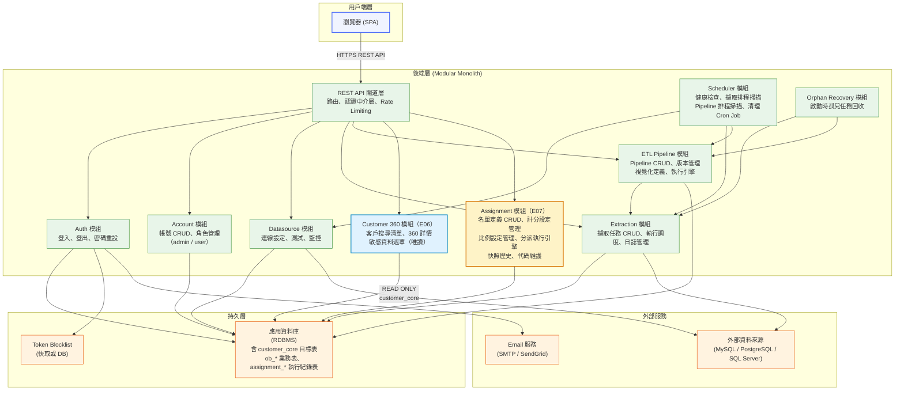
```mermaid
graph TD
    subgraph 用戶端["用戶端層"]
        Browser["瀏覽器 (SPA)"]
    end

    subgraph 後端["後端層 (Modular Monolith)"]
        API["REST API 閘道層<br/>路由、認證中介層、Rate Limiting"]
        AuthMod["Auth 模組<br/>登入、登出、密碼重設"]
        AccountMod["Account 模組<br/>帳號 CRUD、角色管理<br/>（admin / user）"]
        DatasourceMod["Datasource 模組<br/>連線設定、測試、監控"]
        ExtractionMod["Extraction 模組<br/>擷取任務 CRUD、執行調度、日誌管理"]
        ETLMod["ETL Pipeline 模組<br/>Pipeline CRUD、版本管理<br/>視覺化定義、執行引擎"]
        C360Mod["Customer 360 模組（E06）<br/>客戶搜尋清單、360 詳情<br/>敏感資料遮罩（唯讀）"]
        AssignmentMod["Assignment 模組（E07）<br/>名單定義 CRUD、計分設定管理<br/>比例設定管理、分派執行引擎<br/>快照歷史、代碼維護"]
        Scheduler["Scheduler 模組<br/>健康檢查、擷取排程掃描<br/>Pipeline 排程掃描、清理 Cron Job"]
        OrphanRecoveryMod["Orphan Recovery 模組<br/>啟動時孤兒任務回收"]
    end

    subgraph 持久層["持久層"]
        AppDB["應用資料庫<br/>(RDBMS)<br/>含 customer_core 目標表<br/>ob_* 業務表、assignment_* 執行紀錄表"]
        TokenStore["Token Blocklist<br/>(快取或 DB)"]
    end

    subgraph 外部["外部服務"]
        Email["Email 服務<br/>(SMTP / SendGrid)"]
        TargetDB["外部資料來源<br/>(MySQL / PostgreSQL / SQL Server)"]
    end

    Browser -->|"HTTPS REST API"| API
    API --> AuthMod
    API --> AccountMod
    API --> DatasourceMod
    API --> ExtractionMod
    API --> ETLMod
    API --> C360Mod
    API --> AssignmentMod
    AssignmentMod --> AppDB
    Scheduler --> DatasourceMod
    Scheduler --> ExtractionMod
    Scheduler --> ETLMod
    OrphanRecoveryMod --> ExtractionMod
    OrphanRecoveryMod --> ETLMod
    ETLMod --> ExtractionMod
    AuthMod --> AppDB
    AuthMod --> TokenStore
    AuthMod --> Email
    AccountMod --> AppDB
    DatasourceMod --> AppDB
    DatasourceMod --> TargetDB
    ExtractionMod --> AppDB
    ExtractionMod --> TargetDB
    ETLMod --> AppDB
    C360Mod -->|"READ ONLY<br/>customer_core"| AppDB

    classDef layer fill:#f0f4ff,stroke:#4f6ef7,stroke-width:2px
    classDef module fill:#e8f5e9,stroke:#388e3c,stroke-width:1px
    classDef c360module fill:#e0f2fe,stroke:#0284c7,stroke-width:2px
    classDef external fill:#fff3e0,stroke:#e65100,stroke-width:1px
    class Browser layer
    classDef assignmentmodule fill:#fef3c7,stroke:#d97706,stroke-width:2px
    class API,AuthMod,AccountMod,DatasourceMod,ExtractionMod,ETLMod,Scheduler,OrphanRecoveryMod module
    class C360Mod c360module
    class AssignmentMod assignmentmodule
    class Email,TargetDB,AppDB,TokenStore external
```

### 1.2 架構選擇理由

| 決策 | 選擇 | 理由 |
|------|------|------|
| 整體架構 | Modular Monolith | 使用者規模 500 人以下、開發團隊小、MVP 階段。Microservices 的操作複雜度在此規模不合理。 |
| 前端 | SPA | 規格書明確假設（A6）。Admin 後台需要豐富互動體驗（儀表板、即時狀態更新）。 |
| API 風格 | RESTful API | 標準、可預測，與 SPA 搭配成熟。規格書已定義所有端點路徑與 HTTP 方法。 |
| Session 管理 | JWT + Refresh Token | OQ-1 決議。支援無狀態水平擴展，短效 Access Token 降低洩漏風險。 |
| Token 失效 | Token Blocklist | NFR-001.1 明確要求。用於登出、帳號停用、密碼重設後強制失效。 |
| 排程 | 內建 Scheduler 模組 | MVP 排程需求包含靜態 Cron（健康檢查每 30 分鐘、清理每日）與動態 Cron 掃描（擷取排程每分鐘），引入獨立排程服務（如 BullMQ）過度複雜。 |
| 擷取執行模型 | Promise-based 非同步執行 | MVP 擷取為 I/O 密集（資料庫查詢），Node.js 非同步 I/O 足以應對；API 層回傳 `202 Accepted`，前端 Polling 取得進度。 |
| Pipeline 定義儲存 | JSONB 欄位 | Pipeline 節點與連線結構為非固定 schema，JSONB 提供靈活儲存並支援 PostgreSQL 原生 JSONB 查詢；版本 Diff 在應用層計算。 |
| Pipeline 執行引擎 | 同 Monolith 內的 Promise-based 循序執行 | MVP 規模下節點數量有限，I/O 密集型操作，Node.js 非同步 I/O 已足夠；BullMQ 等佇列系統引入 Redis 依賴，不符 MVP 複雜度預算。 |
| Pipeline 視覺化編輯器 | 前端 React Flow | 規格書 F029 明確建議；SPA 架構下純前端即可實現拖拉畫布；定義以 JSONB 序列化後傳送至後端儲存。 |
| 技術棧 | Node.js + NestJS + React + PostgreSQL | 詳見第 10 節技術棧決策。 |

### 1.3 關鍵取捨

- **選擇 Modular Monolith 而非 Microservices**：犧牲部分服務獨立擴展能力，換取顯著較低的開發與運維複雜度。MVP 並發需求（100 人）可由單機處理。
- **JWT 短效 Access Token + Refresh Token**：比純 blocklist 方案複雜，但安全性更佳，且支援未來 SSO 整合（Phase 2）。
- **Polling 而非 WebSocket**（儀表板更新）：OQ-9 決議。降低後端實作複雜度，30 秒輪詢對監控場景可接受。擷取任務進度 Polling 採 3 秒間隔（F021/F024）。
- **Promise-based 非同步執行而非 BullMQ / Worker Thread**（擷取作業與 Pipeline 執行）：MVP 任務為 I/O 密集（資料庫批次查詢），Node.js 事件循環可有效處理。BullMQ 引入 Redis 強依賴與額外運維複雜度，不符 MVP 規模。
- **Pipeline 定義以 JSONB 儲存而非正規化關聯表**：節點類型有 13 種（13 種 Transform + Extract + Load），各節點設定結構差異大，正規化設計需大量 JOIN 且擴展困難。JSONB 儲存允許應用層解析，版本 Diff 於後端計算後回傳 API。
- **Pipeline 排程複用 Extraction Scheduler 掃描模式**：每分鐘掃描符合排程條件的 Pipeline，避免引入動態 Cron Job 管理複雜度（每個 Pipeline 獨立 Cron 物件需追蹤生命週期）。

---

## 2. 系統上下文

### 2.1 外部參與者與整合點

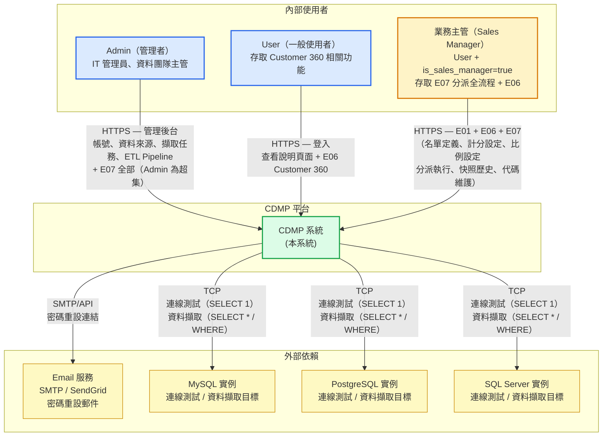
```mermaid
graph TB
    subgraph 內部使用者["內部使用者"]
        Admin["Admin（管理者）<br/>IT 管理員、資料團隊主管"]
        User["User（一般使用者）<br/>存取 Customer 360 相關功能"]
        SalesManager["業務主管（Sales Manager）<br/>User + is_sales_manager=true<br/>存取 E07 分派全流程 + E06"]
    end

    subgraph CDMP["CDMP 平台"]
        System["CDMP 系統<br/>(本系統)"]
    end

    subgraph 外部服務["外部依賴"]
        EmailSvc["Email 服務<br/>SMTP / SendGrid<br/>密碼重設郵件"]
        MySQL["MySQL 實例<br/>連線測試 / 資料擷取目標"]
        PostgreSQL["PostgreSQL 實例<br/>連線測試 / 資料擷取目標"]
        SQLServer["SQL Server 實例<br/>連線測試 / 資料擷取目標"]
    end

    Admin -->|"HTTPS — 管理後台<br/>帳號、資料來源、擷取任務、ETL Pipeline<br/>+ E07 全部（Admin 為超集）"| System
    User -->|"HTTPS — 登入<br/>查看說明頁面 + E06 Customer 360"| System
    SalesManager -->|"HTTPS — E01 + E06 + E07<br/>（名單定義、計分設定、比例設定<br/>分派執行、快照歷史、代碼維護）"| System
    System -->|"SMTP/API<br/>密碼重設連結"| EmailSvc
    System -->|"TCP<br/>連線測試（SELECT 1）<br/>資料擷取（SELECT * / WHERE）"| MySQL
    System -->|"TCP<br/>連線測試（SELECT 1）<br/>資料擷取（SELECT * / WHERE）"| PostgreSQL
    System -->|"TCP<br/>連線測試（SELECT 1）<br/>資料擷取（SELECT * / WHERE）"| SQLServer

    classDef actor fill:#dbeafe,stroke:#2563eb,stroke-width:2px
    classDef salesactor fill:#fef3c7,stroke:#d97706,stroke-width:2px
    classDef system fill:#dcfce7,stroke:#16a34a,stroke-width:2px
    classDef external fill:#fef9c3,stroke:#ca8a04,stroke-width:1px
    class Admin,User actor
    class SalesManager salesactor
    class System system
    class EmailSvc,MySQL,PostgreSQL,SQLServer external
```

### 2.2 信任邊界

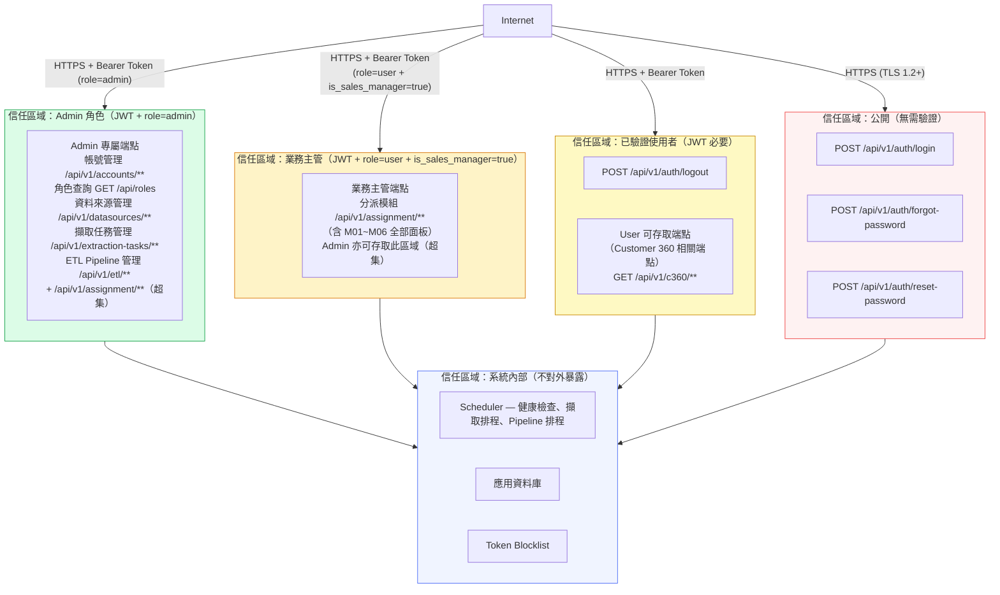
```mermaid
graph TB
    subgraph TZ_Public["信任區域：公開（無需驗證）"]
        Login["POST /api/v1/auth/login"]
        ForgotPw["POST /api/v1/auth/forgot-password"]
        ResetPw["POST /api/v1/auth/reset-password"]
    end

    subgraph TZ_Auth["信任區域：已驗證使用者（JWT 必要）"]
        Logout["POST /api/v1/auth/logout"]
        UserEndpoints["User 可存取端點<br/>（Customer 360 相關端點）<br/>GET /api/v1/c360/**"]
    end

    subgraph TZ_SalesManager["信任區域：業務主管（JWT + role=user + is_sales_manager=true）"]
        SalesEndpoints["業務主管端點<br/>分派模組 /api/v1/assignment/**<br/>（含 M01~M06 全部面板）<br/>Admin 亦可存取此區域（超集）"]
    end

    subgraph TZ_Admin["信任區域：Admin 角色（JWT + role=admin）"]
        AdminEndpoints["Admin 專屬端點<br/>帳號管理 /api/v1/accounts/**<br/>角色查詢 GET /api/roles<br/>資料來源管理 /api/v1/datasources/**<br/>擷取任務管理 /api/v1/extraction-tasks/**<br/>ETL Pipeline 管理 /api/v1/etl/**<br/>+ /api/v1/assignment/**（超集）"]
    end

    subgraph TZ_Internal["信任區域：系統內部（不對外暴露）"]
        Scheduler["Scheduler — 健康檢查、擷取排程、Pipeline 排程"]
        DB["應用資料庫"]
        TokenStore["Token Blocklist"]
    end

    Internet -->|"HTTPS (TLS 1.2+)"| TZ_Public
    Internet -->|"HTTPS + Bearer Token"| TZ_Auth
    Internet -->|"HTTPS + Bearer Token<br/>(role=user + is_sales_manager=true)"| TZ_SalesManager
    Internet -->|"HTTPS + Bearer Token (role=admin)"| TZ_Admin
    TZ_Admin --> TZ_Internal
    TZ_SalesManager --> TZ_Internal
    TZ_Auth --> TZ_Internal
    TZ_Public --> TZ_Internal

    classDef public fill:#fef2f2,stroke:#ef4444
    classDef auth fill:#fef9c3,stroke:#ca8a04
    classDef sales fill:#fef3c7,stroke:#d97706
    classDef admin fill:#dcfce7,stroke:#16a34a
    classDef internal fill:#f0f4ff,stroke:#4f6ef7
    class TZ_Public public
    class TZ_Auth auth
    class TZ_SalesManager sales
    class TZ_Admin admin
    class TZ_Internal internal
```

### 2.3 外部依賴摘要

| 外部依賴 | 通訊方式 | 用途 | 相關 Feature |
|---------|---------|------|-------------|
| Email 服務（SMTP / SendGrid） | SMTP 或 HTTPS API | 寄送密碼重設連結 | F009 |
| MySQL 實例 | TCP（Port 3306） | 連線測試（`SELECT 1`）、自動健康檢查、資料擷取（批次 SQL Query） | F015, F016, F021, F023 |
| PostgreSQL 實例 | TCP（Port 5432） | 連線測試（`SELECT 1`）、自動健康檢查、資料擷取（批次 SQL Query） | F015, F016, F021, F023 |
| SQL Server 實例 | TCP（Port 1433） | 連線測試（`SELECT 1`）、自動健康檢查、資料擷取（批次 SQL Query） | F015, F016, F021, F023 |
| 瀏覽器 | HTTPS | 使用者介面 | 全部 |

> **E05 新增說明**：ETL Pipeline 的 Extract 節點讀取 AppDB 內的 raw data 表（不直接連外部資料庫），Load 節點寫入 AppDB 內的目標表（Phase 1 MVP 為 `customer_core`，約 45 欄位，整合 ZZIP_BAMCUST_M 與 MLMCUSTOMER 兩個來源），因此 ETL Pipeline 執行不新增外部依賴，資料流閉合於 AppDB 內部。Target Table Registry 為 in-process 靜態定義，無額外依賴。

> **E07 新增說明**：E07 Assignment Module 不直連 OB 資料庫。OB 系統業務表（OBMLISTDF、OBPOOLDATA_LIST 等）已全數遷移至 AppDB（以 `ob_` 前綴 snake_case 命名），E07 所有讀寫操作均對 AppDB 執行。`ob_pool_data`（案件池）由 E04 擷取任務定期從 OB 原始系統匯入（建議月初執行一次）；E07 月跑 Stage 1 讀取的 `ob_pool_data` 資料新鮮度由 E04 任務頻率控制。E07 不引入新的外部系統依賴。

> **注意**：資料擷取（F021/F023）對目標資料庫的流量性質與連線測試（`SELECT 1`）顯著不同——擷取為批次資料讀取（`SELECT * FROM table` 或增量 `WHERE col > value`），可能涉及大量資料傳輸，對目標資料庫的負載影響需評估。

---

## 3. 邏輯架構

### 3.1 元件總覽


```mermaid
graph TB
    subgraph Frontend["前端 (SPA)"]
        Router["路由層<br/>角色導向 / 守護"]
        AuthPages["驗證頁面<br/>登入、忘記密碼、重設密碼"]
        AdminPages["Admin 管理頁面<br/>帳號清單、新增帳號、編輯帳號<br/>資料來源清單、新增、編輯<br/>資料來源狀態儀表板<br/>擷取任務儀表板、任務清單<br/>建立/編輯擷取任務、執行日誌<br/>Pipeline 列表、視覺化編輯器<br/>Pipeline 日誌、版本管理"]
        C360Pages["Customer 360 頁面（E06）<br/>客戶清單（搜尋 / 篩選 / 分頁）<br/>客戶 360 詳情（8 個資料分類）"]
        UserPage["User 說明頁面"]
        APIClient["API Client<br/>JWT 附加、錯誤處理、Retry"]
    end

    subgraph Backend["後端 (Modular Monolith)"]
        Middleware["中介層<br/>JWT 驗證、RBAC 守衛<br/>Rate Limiting、CORS、Input Sanitization"]

        subgraph AuthModule["Auth 模組"]
            LoginSvc["Login Service<br/>bcrypt 比對、JWT 發行"]
            LogoutSvc["Logout Service<br/>Token 加入 Blocklist"]
            PwResetSvc["Password Reset Service<br/>Token 產生/驗證、Email 觸發"]
        end

        subgraph AccountModule["Account 模組"]
            AccountSvc["Account Service<br/>CRUD、雙層角色指派<br/>停用/啟用、密碼重設"]
            RoleSvc["Role Service<br/>角色清單查詢（Seed Data）<br/>角色有效性驗證"]
        end

        subgraph DatasourceModule["Datasource 模組"]
            DsSvc["Datasource Service<br/>CRUD、AES-256 加密/解密<br/>連線測試邏輯"]
            DashboardSvc["Dashboard Service<br/>摘要統計、告警計算<br/>效能指標查詢"]
        end

        subgraph ExtractionModule["Extraction 模組"]
            ExtTaskSvc["ExtractionTask Service<br/>CRUD、啟用/停用、軟刪除"]
            ExtExecSvc["ExtractionExecution Service<br/>非同步執行引擎、進度更新<br/>手動/排程/重試 共用邏輯"]
            ExtDashSvc["ExtractionDashboard Service<br/>摘要統計、趨勢圖<br/>效能排名查詢"]
        end

        subgraph ETLModule["ETL Pipeline 模組"]
            PipelineSvc["Pipeline Service<br/>CRUD、啟用/停用、軟刪除<br/>版本管理（建立/回滾/發布）"]
            PipelineDefSvc["Pipeline Definition Service<br/>儲存/載入 JSONB definition<br/>連線規則驗證、step_count 更新"]
            PipelineExecSvc["Pipeline Execution Service<br/>非同步執行引擎（節點循序執行）<br/>Extract/Transform/Load 節點執行<br/>進度更新（5 秒 Polling）"]
            PipelineVersionSvc["Pipeline Version Service<br/>版本 Diff 計算<br/>發布前測試執行驗證"]
        end

        subgraph SchedulerModule["Scheduler 模組"]
            HealthCron["Health Check Cron<br/>每 30 分鐘<br/>呼叫 Datasource Service"]
            ExtractionCron["Extraction Scheduler Cron<br/>每分鐘<br/>掃描動態 Cron 任務"]
            PipelineCron["Pipeline Scheduler Cron<br/>每分鐘<br/>掃描 active + enabled Pipeline"]
            CleanupCron["Cleanup Cron<br/>清理過期 Token / HealthLog<br/>清理過期 ExtractionLog<br/>清理過期 EtlPipelineLog<br/>修復孤立 running 狀態"]
        end

        subgraph OrphanRecoveryModule["Orphan Recovery 模組（F038）"]
            OrphanSvc["OrphanRecovery Service<br/>OnApplicationBootstrap<br/>回收孤兒 ExtractionTask（E04）<br/>回收孤兒 EtlPipeline（E05）"]
        end

        subgraph C360Module["Customer 360 模組（E06）"]
            C360Controller["C360 Controller<br/>GET /api/v1/c360/customers/stats<br/>GET /api/v1/c360/customers<br/>GET /api/v1/c360/customers/:customerId"]
            C360Svc["C360 Service<br/>統計摘要、搜尋邏輯<br/>360 詳情組裝、敏感資料遮罩"]
            CustomerCoreRepo["CustomerCoreRepository<br/>Raw SQL / QueryBuilder<br/>FTS 查詢（tsvector/tsquery）<br/>customer_core 唯讀抽象層"]
        end

        subgraph AssignmentModule["Assignment 模組（E07）"]
            AssignmentListSvc["AssignmentList Service<br/>名單定義 CRUD（ob_list_definition）<br/>LIST_NO 自動產生（OB{YYYYMM}{NNN}）<br/>同月 999 筆上限 → 422"]
            AssignmentScoringSvc["AssignmentScoring Service<br/>計分卡版本管理（ob_levelcard_*）<br/>CARD_LEVEL 門檻 / TIER_LEVEL 對應<br/>複雜計分邏輯呼叫 PostgreSQL function"]
            AssignmentRatioSvc["AssignmentRatio Service<br/>per-LIST_NO 部門比例（ob_dept_pct）<br/>人員比例（ob_empl_set）<br/>CR 回分規則開關"]
            AssignmentCodeSvc["AssignmentCode Service<br/>代碼維護（ob_code_df）<br/>PROD_KIND / SPEC_TP / CASE_STATUS"]
            AssignmentRunSvc["AssignmentRun Service<br/>觸發月跑（202 非同步）<br/>Stage 0~4 執行引擎<br/>快照原子性寫入（Transaction）"]
            AssignmentSnapshotSvc["AssignmentSnapshot Service<br/>歷史清單、快照詳情<br/>兩次執行差異比對"]
            AssignmentAuditSvc["AssignmentAudit Service<br/>E07 所有 CRUD 操作稽核<br/>寫入 assignment_audit_log"]
        end

        subgraph SharedInfra["共用基礎建設"]
            CryptoUtil["Crypto Util<br/>AES-256 加解密"]
            HashUtil["Hash Util<br/>bcrypt 雜湊/比對"]
            JWTUtil["JWT Util<br/>簽發/驗證/Blocklist 查詢"]
            EmailUtil["Email Util<br/>SMTP/SendGrid 發送"]
            Logger["Logger<br/>結構化日誌（禁止記錄憑證）"]
        end
    end

    subgraph Persistence["持久層"]
        AppDB["應用資料庫<br/>User / Datasource / PasswordResetToken / DatasourceHealthLog<br/>ExtractionTask / ExtractionLog / raw_{task_id_short}<br/>EtlPipeline / EtlPipelineVersion / EtlPipelineLog<br/>customer_core（E05 目標表）<br/>ob_list_definition / ob_pool_data / ob_pool_data_list<br/>ob_dept_pct / ob_empl_set / ob_code_df<br/>ob_levelcard_version / ob_levelcard_column / ob_levelcard_score / ob_levelcard_level<br/>assignment_run / assignment_run_snapshot / assignment_audit_log"]
        TokenStore["Token Blocklist Store"]
    end

    subgraph External["外部"]
        EmailExt["Email 服務"]
        TargetDBs["目標資料庫群"]
    end

    Router --> AuthPages
    Router --> AdminPages
    Router --> C360Pages
    Router --> UserPage
    AuthPages --> APIClient
    AdminPages --> APIClient
    APIClient -->|"REST API HTTPS"| Middleware
    Middleware --> AuthModule
    Middleware --> AccountModule
    Middleware --> DatasourceModule
    Middleware --> ExtractionModule
    Middleware --> ETLModule
    Middleware --> C360Module
    SchedulerModule --> DatasourceModule
    SchedulerModule --> ExtractionModule
    SchedulerModule --> ETLModule
    OrphanRecoveryModule --> ExtractionModule
    OrphanRecoveryModule --> ETLModule
    ETLModule --> ExtractionModule
    AuthModule --> SharedInfra
    AccountModule --> SharedInfra
    DatasourceModule --> SharedInfra
    ExtractionModule --> SharedInfra
    ETLModule --> SharedInfra
    SharedInfra --> AppDB
    SharedInfra --> TokenStore
    EmailUtil --> EmailExt
    DsSvc -->|"TCP 連線測試"| TargetDBs
    ExtExecSvc -->|"TCP 批次資料擷取"| TargetDBs
    PipelineExecSvc -->|"讀取 raw_* 表<br/>寫入 customer_* 表"| AppDB
    C360Controller --> C360Svc
    C360Svc --> CustomerCoreRepo
    CustomerCoreRepo -->|"READ ONLY<br/>customer_core"| AppDB
    C360Pages --> APIClient
    Middleware --> AssignmentModule
    AssignmentModule --> SharedInfra
    AssignmentListSvc -->|"CRUD ob_list_definition"| AppDB
    AssignmentScoringSvc -->|"讀寫 ob_levelcard_*<br/>呼叫 PostgreSQL function"| AppDB
    AssignmentRatioSvc -->|"讀寫 ob_dept_pct / ob_empl_set"| AppDB
    AssignmentCodeSvc -->|"CRUD ob_code_df"| AppDB
    AssignmentRunSvc -->|"讀 ob_pool_data\n寫 ob_pool_data_list\n寫 assignment_run / snapshot"| AppDB
    AssignmentAuditSvc -->|"寫入 assignment_audit_log"| AppDB

    classDef frontend fill:#dbeafe,stroke:#2563eb
    classDef c360fe fill:#bfdbfe,stroke:#1d4ed8,stroke-width:2px
    classDef module fill:#dcfce7,stroke:#16a34a
    classDef etlmodule fill:#fce7f3,stroke:#db2777
    classDef c360module fill:#e0f2fe,stroke:#0284c7,stroke-width:2px
    classDef assignmentmodule fill:#fef3c7,stroke:#d97706,stroke-width:2px
    classDef orphan fill:#e8f4fd,stroke:#2196F3,stroke-width:1px
    classDef shared fill:#f3e8ff,stroke:#9333ea
    classDef persist fill:#fef9c3,stroke:#ca8a04
    classDef external fill:#fef2f2,stroke:#ef4444
    class Frontend,Router,AuthPages,AdminPages,UserPage,APIClient frontend
    class C360Pages c360fe
    class AuthModule,AccountModule,DatasourceModule,ExtractionModule,SchedulerModule module
    class ETLModule,PipelineSvc,PipelineDefSvc,PipelineExecSvc,PipelineVersionSvc etlmodule
    class C360Module,C360Controller,C360Svc,CustomerCoreRepo c360module
    class AssignmentModule,AssignmentListSvc,AssignmentScoringSvc,AssignmentRatioSvc,AssignmentCodeSvc,AssignmentRunSvc,AssignmentSnapshotSvc,AssignmentAuditSvc assignmentmodule
    class OrphanRecoveryModule,OrphanSvc orphan
    class SharedInfra,CryptoUtil,HashUtil,JWTUtil,EmailUtil,Logger shared
    class AppDB,TokenStore persist
    class EmailExt,TargetDBs external
```

### 3.2 各元件職責說明

#### 前端 SPA

| 子模組 | 職責 | 輸入 / 輸出 |
|--------|------|------------|
| 路由層 | 依 JWT 中的 `role` 欄位導向對應頁面；未驗證時導回登入頁 | JWT（localStorage / cookie）→ 路由決策 |
| 驗證頁面（AuthPages） | 登入表單、忘記密碼、重設密碼頁面；前端欄位驗證 | 使用者輸入 → API 請求 |
| Admin 管理頁面 | 帳號管理（F004-F010）、資料來源管理（F011-F016）、擷取任務管理（F017-F025）、ETL Pipeline 管理（F027-F034, F036）所有 UI | API 回應 → 畫面渲染 |
| Customer 360 頁面（E06） | 客戶清單頁（`/c360/customers`）：統計摘要卡片、搜尋框、類型篩選下拉、分頁列表；客戶 360 詳情頁（`/c360/customers/:customerId`）：8 個資料分類卡片、風控旗標高亮、ETL 資料新鮮度警告；Admin 與 User 兩種角色均可存取（F046, F047） | API 回應 → 畫面渲染；遮罩值由後端回傳，前端直接顯示 |
| User 說明頁面 | 靜態說明內容，無可操作功能（MVP 限制） | — |
| API Client | 統一附加 `Authorization: Bearer {token}` header；處理 401/403 回應；提供 Loading 狀態管理；支援不同 Polling 頻率（儀表板 30 秒、擷取進度 3 秒、Pipeline 執行進度 5 秒） | 業務邏輯請求 → HTTP 請求 |

**重要設計決策**：Access Token 的儲存位置（`localStorage` vs `httpOnly Cookie`）由實作團隊決定，但需注意：`localStorage` 面臨 XSS 風險；`httpOnly Cookie` 需處理 CSRF 防護。建議使用 `httpOnly Cookie`。

#### 後端中介層（Middleware）

| 中介層 | 職責 | 執行順序 |
|--------|------|---------|
| CORS | 限制允許的 Origin（OQ-12 決議，需要 CORS 設定） | 1 |
| Rate Limiting | 登入端點：5 次/分鐘/IP（OQ-5 決議）；密碼重設端點：同樣限制 | 2 |
| JWT 驗證 | 驗證 Bearer Token 格式、簽章、有效期；查詢 Token Blocklist | 3 |
| RBAC 守衛 | 依端點定義的角色需求比對 JWT payload 中的 `role`；支援 2 種角色（admin / user）；未授權存取回傳 403 | 4 |
| Input Sanitization | 清除 XSS 與 SQL Injection 惡意字元 | 5 |

#### Auth 模組

| 服務 | 職責 | 關鍵函式 | 相關 Feature |
|------|------|---------|-------------|
| Login Service | 驗證 Email/密碼；發行 Access Token + Refresh Token | `login(email, password, rememberMe)` | F001, F002 |
| Logout Service | 將 Access Token 加入 Blocklist；撤銷 Refresh Token | `logout(userId, token)` | F003 |
| Password Reset Service | 產生 `PasswordResetToken`；觸發 Email 發送；驗證 Token；更新密碼 Hash；失效所有現有 Token | `requestReset(email)`, `resetPassword(token, newPassword)` | F009 |

**Access Token 策略**（依 OQ-1 決議）：
- 短效 Access Token（預設 8 小時；記住我 30 天）
- Refresh Token 用於無停機 JWT Secret 輪替（OQ-11 決議）
- 登出時 Access Token 加入 Blocklist，Refresh Token 撤銷

#### Account 模組

| 服務 | 職責 | 關鍵業務規則 | 相關 Feature |
|------|------|-----------|-------------|
| Account Service | 帳號 CRUD；系統角色指派（admin / user）；**業務角色（`business_role`）變更**（v2.11 / 2026-05-16 / E07 合併重構 AD-E07 v3.0：`AccountsService.updateBusinessRole()`，見下方說明）；停用/啟用；Admin 代為重設密碼 | 最後一位 Admin 保護（ACCOUNT_LAST_ADMIN）；Admin 不可停用自己（ACCOUNT_SELF_DISABLE）；Email 大小寫不敏感唯一性；停用時失效所有 Session；指派系統角色前驗證 role_code 為有效的預設角色之一；**`business_role` 僅可由 Admin 透過 PATCH `/api/v1/accounts/:id/business-role` 變更（[F006a](features/F006a-update-business-role.md) 定義；v2.11 取代 v2.10 之 PATCH `/e07-role` 端點）** | F004-F010, F006a, F073, F074 |
| Role Service | 提供角色清單查詢（`GET /api/roles`）；角色 Seed Data 初始化（migration 自動執行）；角色 role_code 有效性驗證（供 Account Service 使用） | 不提供角色新增 / 刪除 API（AC-2，US-017）；角色資料為 Seed Data，不可由 API 修改 | F004, ~~F008（DEPRECATED v3.x）~~（US-017, US-014） |

**`AccountsService.updateBusinessRole()` 元件說明（v2.11 / 2026-05-16 / E07 合併重構）**：

| 項目 | 規格 |
|------|------|
| Method 簽名 | `updateBusinessRole(targetUserId: string, newRole: 'director' \| 'section_chief' \| null, actorId: string): Promise<UserResponseDto>` |
| 觸發來源 | PATCH `/api/v1/accounts/:id/business-role`（Admin only，見 [F006a](features/F006a-update-business-role.md)） |
| 同 transaction 寫入 | (a) UPDATE `users.business_role`；(b) UPDATE `users.password_changed_at = new Date(Date.now() + 1000)`；(c) INSERT `assignment_audit_log`（`action = 'ASSIGN_ROLE'` / `'REVOKE_ROLE'`、`entity_type = 'business_role'`、`entity_id = '{userId}\|{role}'`） |
| Token revoke 機制 | **沿用 F009 / F010 既有 `password_changed_at` 機制**（已上線並驗證）；不新建 token blocklist 表、**不新增 `AuthService.revokeAllUserTokens(userId)` method**（與下方 [RESOLVED] 註記對應） |
| 錯誤碼 | 404 `ACCOUNT_NOT_FOUND`（目標帳號不存在）；422 `ACCOUNT_BUSINESS_ROLE_INVALID`（值非允許列表）；403 `AUTH_FORBIDDEN`（呼叫者非 admin，由既有 RolesGuard 拋出） |
| ~~`AccountsService.updateE07Role()`~~ | **v2.10 / DEPRECATED v2.11**：舊 PATCH `/e07-role` 端點之 method 由 `updateBusinessRole()` 取代；行為與簽名相同（僅 method 名與 column 名變更） |
| ~~`AccountsService.updateSalesManagerFlag()`~~ | **F008 舊 method / DEPRECATED v2.11**：`users.is_sales_manager` 欄位於 m14 migration DROP；本 method 已無對應欄位可寫入 |

**E07 後端 Guard 元件清單（v2.11 / 2026-05-16 新增 / E07 合併重構）**：

| Guard 名稱 | 通過條件 | 失敗錯誤碼 | 適用範圍 |
|---|---|---|---|
| `DirectorOrSectionChiefGuard`（取代舊 `SalesManagerGuard`） | `req.user.role === 'admin'` OR `req.user.businessRole IN ('director', 'section_chief')` | 403 `E07_ROLE_NOT_ASSIGNED` | E07 全部 controller 入口（M02 除外） |
| `DirectorGuard` | `req.user.role === 'admin'` OR `req.user.businessRole === 'director'` | 403 `AUTH_FORBIDDEN` | 部長專屬功能（M02 全部端點含 GET、M06 寫入、月跑觸發、名單 CRUD、M03a / M03c / M03d Rollback） |
| `SectionChiefGuard` | `req.user.businessRole === 'section_chief'` | 403 `AUTH_FORBIDDEN` | 處長專用端點（少數明確標記） |

> **檢查順序**：JWT 驗證 → `DirectorOrSectionChiefGuard` → `DirectorGuard`（若功能為部長專屬）→ service 層 `scopeByCreator()`（處長轄區過濾）。詳見 [F002 v2.0 §4.6](features/F002-user-login.md#e07-角色矩陣)。

~~**SalesManagerGuard**~~ **（v2.11 廢除）**：v1.x 之 `SalesManagerGuard` 已由 `DirectorOrSectionChiefGuard`（一般入口）+ `DirectorGuard`（部長專屬）兩 Guard 取代；既有 `@RequireSalesManager()` decorator 一律改為 `@RequireDirector()` 或 `@RequireDirectorOrSectionChief()`。

**[RESOLVED] `AuthService.revokeAllUserTokens(userId)` 設計決策（v2.10 / v2.11 沿用）**：

E07 重構批次 1 階段（2026-05-15）system-architect 草案曾提及可新增顯式 method `AuthService.revokeAllUserTokens(userId)` 作為 token revoke 的統一入口。經 PO 決議（2026-05-16），採方案：

- **不新增此方法**。由 `AccountsService.updateBusinessRole()` 直接寫入 `users.password_changed_at`（最低跨模組耦合原則），AuthGuard 既有比對邏輯（`JWT.iat * 1000 < password_changed_at`）即可達成「批次 revoke 該 user 所有舊 token」效果
- **若未來確實需要顯式 method 名**（例如統一稽核 log 識別 token revoke 來源、或多處 service 需共用），可再加 thin wrapper 集中於 `AuthService`，本決策不阻擋未來擴充
- 此決策同步適用於：F006a / F007 / F009 / F010 / 任何未來需「批次 revoke 單一 user 所有 token」之場景


**樂觀鎖定**（OQ-6 決議）：帳號編輯與資料來源編輯均採用 Optimistic Locking，以版本號或 `updated_at` 時間戳記偵測並發衝突，回傳 HTTP 409。

**架構決策 AD-E02-1（更新 2026-04-24）：角色 + is_sales_manager 旗標 RBAC 模型**

CDMP 系統角色維持 2 種（admin / user），但新增 `is_sales_manager` 布林欄位擴充業務主管能力，實現角色與功能旗標的正交組合：

| 身份 | role | is_sales_manager | 可存取模組 |
|------|------|-----------------|-----------|
| 管理者 | `admin` | 任意（忽略） | 全部（E01~E07） |
| 業務主管 | `user` | `true` | E01 + E06 + E07 全部（M01~M06） |
| 一般使用者 | `user` | `false` | E01 + E06 |

**RBAC 中介層檢查順序**：
1. JWT 驗證（token 有效、未過期、未在 blocklist）
2. `role` 欄位檢查（admin 端點要求 `role=admin`）
3. 需要業務主管權限的端點（`/api/v1/assignment/**`）額外檢查 `is_sales_manager=true`（Admin 無需此檢查，已在步驟 2 通過）

**JWT Payload 更新**：新增 `is_sales_manager: boolean` 欄位，與 `role` 一同在登入時寫入 payload；帳號的 `is_sales_manager` 變更後，舊 JWT 仍有效直至過期（短效 8h/30d Access Token 機制提供自然過期），若需即時失效需將 Token 加入 Blocklist。

原有 role_code 說明：

| 角色 role_code | 用途 |
|--------------|------|
| `admin` | 完整平台管理權限（帳號、資料來源、擷取任務、ETL Pipeline、E07 分派） |
| `user` | 一般使用者；可存取 E06 Customer 360；若 `is_sales_manager=true` 額外存取 E07 分派全流程 |

**架構決策 AD-E02-2：角色為 Seed Data，不提供動態 CRUD**

**決策（2026-04-02 業務確認）**：2 種角色為系統預設，在 migration 時自動建立（Seed Data），不開放 Admin 自行新增或刪除。

**理由**：系統僅需 Admin / User 兩種固定角色。角色名稱為業務域的固定概念（來自組織設計），不需動態管理。

**實作約束**：
- 後端不提供 `POST /api/roles` 與 `DELETE /api/roles/:code` 端點；若透過 API 嘗試，回傳 `403 Forbidden`
- `GET /api/roles` 為唯一暴露的角色端點，僅限 Admin 存取
- Seed Data 透過 TypeORM Migration 執行，不透過 Seeder Script，確保部署流程原子性

**架構決策 AD-E02-3：User 表 role 欄位策略（Enum 擴充 vs 外鍵關聯）**

| 方案 | 說明 | 取捨 |
|------|------|------|
| **方案 A（採用）**：User.role 使用 Enum（2 種值） | `role` 欄位使用 Enum，值為 `admin` 與 `user` | 實作簡單；無需 JOIN；角色驗證在應用層完成。缺點：新增角色需 DB migration 修改 Enum 型別。 |
| 方案 B：User.role 改為外鍵 FK 指向 roles 表 | 建立 `roles` 參考表，`user.role_code` 為外鍵 | 資料正規化更完整；新增角色只需 INSERT。缺點：每次查詢 User 需 JOIN roles；角色 Seed Data 需在 FK 約束前建立，migration 順序複雜。 |

**選擇方案 A（Enum）的理由**：角色為固定 Seed Data（AD-E02-2），不支援動態新增；Enum 型別已充分表達「值集合固定」的語意。避免引入額外 JOIN 及 migration 順序複雜度。應用層的 `RoleService.validateRoleCode()` 負責業務層驗證，與 DB Enum 約束形成雙重防護。

**JWT Payload 中的 role 欄位**（影響 Auth 模組）：JWT payload 的 `role` 欄位承載角色值，結構為 `role: "admin" | "user"`。RBAC 中介層依此欄位判斷存取權限。

---

**架構決策 AD-E02-4（新增 2026-05-13）：前端路由 Guard 模型與共用 Sidebar 架構**

> **問題根因**：`manager@cdmp.test`（`role=user, is_sales_manager=true`）登入後被 redirect 至 `/user-info`，該頁無 sidebar，使用者完全無法導覽。現有三個 Guard（`ProtectedRoute` / `AdminRoute` / `UserRoute`）均不讀取 `is_sales_manager`，且 `AdminRoute` 在 `role !== 'admin'` 時一律 redirect 至 `/user-info`。此外，各 Page 各自渲染 sidebar 造成散落，E07 功能上線後維護困難。

##### AD-E02-4-A：Route Guard 模型

系統前端維護 **4 個** Route Guard，職責如下：

| Guard 名稱 | 放行條件 | 未通過時 redirect | 適用路由 |
|---|---|---|---|
| `ProtectedRoute` | `isAuthenticated() === true` | `/login` | 所有受保護路由的最外層（可單獨使用） |
| `AdminRoute` | `isAuthenticated() && role === 'admin'` | `/c360/customers` | `/`、`/datasources/**`、`/extraction-tasks/**`、`/etl-pipelines/**` |
| `SalesManagerRoute` | `isAuthenticated() && (role === 'admin' \|\| isSalesManager === true)` | `/c360/customers` | `/assignment/**`（E07 全部路由） |
| `UserRoute` | **廢棄**。原職責（保護 `/user-info`）由 `ProtectedRoute` 取代 | — | — |

**關鍵變更說明：**

1. `AdminRoute` redirect 目標由 `/user-info` 改為 `/c360/customers`。Customer 360 對所有已認證身份開放，是最合適的 fallback 著陸頁。
2. `SalesManagerRoute` 新增：採用 **嚴格布林比對** `isSalesManager === true`（非 truthy），防止舊 token 的 `undefined` 值誤放行。Admin 視為超集，無需持有 `is_sales_manager` 旗標即可通過。
3. `UserRoute` 廢棄：原設計限定 `role === 'user'` 才放行，會將 admin 擋在 `/user-info` 之外；且 `/user-info` 在 MVP 階段已無存在必要（見下方 AD-E02-4-C）。
4. `ProtectedRoute` 維持不變，僅檢查 `isAuthenticated()`。

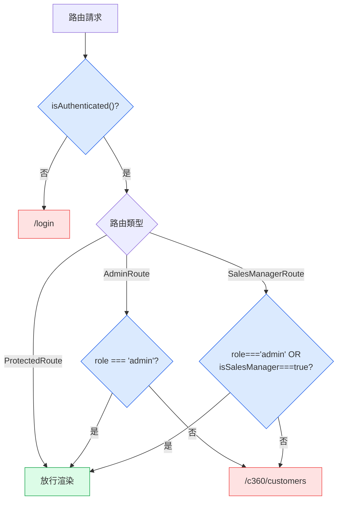
```mermaid
graph TD
    Request["路由請求"] --> IsAuth{"isAuthenticated()?"}
    IsAuth -->|否| Login["/login"]
    IsAuth -->|是| RouteType{"路由類型"}
    RouteType -->|AdminRoute| IsAdmin{"role === 'admin'?"}
    RouteType -->|SalesManagerRoute| IsSM{"role==='admin' OR<br/>isSalesManager===true?"}
    RouteType -->|ProtectedRoute| Allow["放行渲染"]
    IsAdmin -->|是| Allow
    IsAdmin -->|否| C360["/c360/customers"]
    IsSM -->|是| Allow
    IsSM -->|否| C360

    classDef guard fill:#dbeafe,stroke:#2563eb
    classDef redirect fill:#fee2e2,stroke:#ef4444
    classDef allow fill:#dcfce7,stroke:#16a34a
    class IsAuth,IsAdmin,IsSM guard
    class Login,C360 redirect
    class Allow allow
```

##### AD-E02-4-B：路由 Guard 對應表（完整）

| Route | 目前 Guard | 建議 Guard | 備註 |
|---|---|---|---|
| `/` | `AdminRoute` | `AdminRoute` | redirect 目標改為 `/c360/customers` |
| `/datasources/**` | `AdminRoute` | `AdminRoute` | 同上 |
| `/extraction-tasks/**` | `AdminRoute` | `AdminRoute` | 同上 |
| `/etl-pipelines/**` | `AdminRoute` | `AdminRoute` | 同上 |
| `/c360/customers` | `ProtectedRoute` | `ProtectedRoute` | 不變，全身份可用 |
| `/c360/customers/:id` | `ProtectedRoute` | `ProtectedRoute` | 不變 |
| `/user-info` | `UserRoute` | **移除或改 `ProtectedRoute`**（見 AD-E02-4-C） | `UserRoute` 廢棄 |
| `/assignment/**`（E07，待實作） | — | `SalesManagerRoute` | Admin + 業務主管可用 |

##### AD-E02-4-C：`/user-info` 存廢決策

**決策：保留路由，改為通用 Settings/Profile 頁面，套用 `ProtectedRoute`（全身份可用）。**

理由：
- MVP 階段 Customer 360 已對所有身份開放，「目前尚無可用功能」的說明訊息已無語意。
- 廢棄路由會造成已存在書籤失效。
- 改為簡易 Profile 頁（顯示姓名、Email、角色、`is_sales_manager` 狀態）仍具使用價值，且可作為未來帳號設定的進入點。
- `ProtectedRoute` 保護即可，無需角色限制。
- **Sidebar 處理**：`/user-info` 改版後應套用共用 `<AppLayout>`（見 AD-E02-4-D），讓使用者能在 Profile 頁看到 sidebar 並自由導覽。

**ASSUMPTION-AD-E02-4-C-1**：`/user-info` 頁面的「目前尚無可用功能」訊息更新為 Profile 顯示內容，由 TDD Developer 於實作時定案（不需 spec-writer 額外建立新 Feature spec，屬 UI 層調整）。

##### AD-E02-4-D：登入後導向策略

**決策：在 LoginPage 的 `onSuccess` callback 依 `user.role` + `user.isSalesManager` 決定 redirect 目標。**

| 實質身份 | 條件 | 登入後導向 |
|---|---|---|
| 管理者 | `role === 'admin'` | `/`（帳號管理頁） |
| 業務主管 | `role === 'user' && isSalesManager === true` | `/c360/customers` |
| 一般使用者 | `role === 'user' && isSalesManager !== true` | `/c360/customers` |

**選擇在 LoginPage 處理而非根 router 的理由**：根 router 的 redirect 邏輯難以讀取 `isSalesManager`（`AdminRoute` 只做 admin/非admin 二分），且在根 router 實作「依 isSalesManager 三向分岔」會導致 guard 邏輯與 redirect 邏輯分散在兩處，不易維護。LoginPage 已有 `onSuccess` 時機，集中處理最清晰。

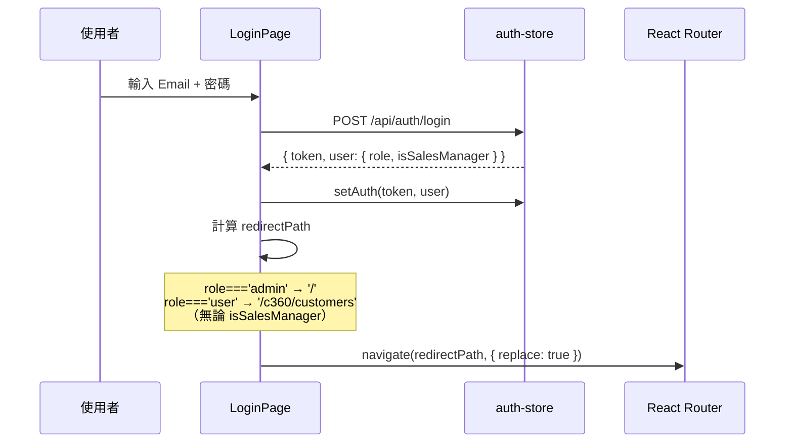
```mermaid
sequenceDiagram
    participant U as 使用者
    participant LP as LoginPage
    participant AS as auth-store
    participant R as React Router

    U->>LP: 輸入 Email + 密碼
    LP->>AS: POST /api/auth/login
    AS-->>LP: { token, user: { role, isSalesManager } }
    LP->>AS: setAuth(token, user)
    LP->>LP: 計算 redirectPath
    Note over LP: role==='admin' → '/'<br/>role==='user' → '/c360/customers'<br/>（無論 isSalesManager）
    LP->>R: navigate(redirectPath, { replace: true })
```

**注意**：業務主管與一般使用者均導向 `/c360/customers`，導向邏輯因此簡化為二分而非三分。兩者的功能差異由 sidebar 可見項目與 `SalesManagerRoute` 在執行時期控制，無需登入時分派至不同路徑。

##### AD-E02-4-E：共用 Sidebar 元件架構

**決策：抽出共用 `<AppLayout>` 元件，包含 `<AppSidebar>` 子元件，依 `role` + `isSalesManager` 動態 render menu items。取代各 Page 各自渲染 sidebar 的散落模式。**

**Menu 設定資料結構（宣告式）：**

```typescript
type MenuRequires = 'authenticated' | 'admin' | 'sales_manager';

interface MenuItem {
  to: string;
  label: string;
  icon: string;           // lucide-react icon name
  requires: MenuRequires;
}

interface MenuGroup {
  label: string;
  items: MenuItem[];
}

interface MenuSection {
  label: string;           // 分組標頭（如「資料治理」、「應用模組」）
  groups: MenuGroup[];     // 含可折疊子項的群組（如「客戶名單分派」）
  items?: MenuItem[];      // 直屬 item（無子群組）
}
```

**過濾邏輯規則：**

| `requires` 值 | 顯示條件 |
|---|---|
| `'authenticated'` | 永遠顯示（已通過 `ProtectedRoute`） |
| `'admin'` | `role === 'admin'` |
| `'sales_manager'` | `role === 'admin' \|\| isSalesManager === true` |

**`is_sales_manager` 讀取來源**：`auth-store.getUser().isSalesManager`，嚴格比對 `=== true`。舊 token 的 `undefined` 值視同 `false`。`isSalesManager` 為 `optional` 欄位（`UserInfo` 型別），實作時需以 `user?.isSalesManager === true` 模式防禦 `undefined`。

**Sidebar Menu 設定（依 prototype/27-list-definition.html 對齊）：**

```
── 資料治理（requires: admin）
│   ├── 帳號管理      /             admin
│   ├── 資料來源      /datasources   admin
│   ├── 資料擷取      /extraction-tasks  admin
│   └── ETL Pipeline  /etl-pipelines     admin
──（分隔線）
── 應用模組
│   ├── Customer 360  /c360/customers    authenticated
│   └── 客戶名單分派（可折疊群組，requires: sales_manager）
│       ├── 代碼維護   /assignment/base-codes    sales_manager
│       ├── 計分卡設定  /assignment/scoring        sales_manager
│       ├── 比例設定   /assignment/ratios         sales_manager
│       ├── 名單定義   /assignment/list-definitions  sales_manager
│       ├── Stage 0 試算  /assignment/estimate     sales_manager
│       ├── 觸發月跑   /assignment/run            sales_manager
│       ├── 執行進度   /assignment/run-progress   sales_manager
│       ├── 結果摘要   /assignment/run-summary    sales_manager
│       ├── 執行歷史   /assignment/history        sales_manager
│       ├── 快照詳情   /assignment/snapshots      sales_manager
│       └── 結果比對   /assignment/compare        sales_manager
```

**E07 子項顯示策略：**
- 「客戶名單分派」群組整體以 `requires: 'sales_manager'` 控制，一般使用者看不到此群組。
- E07 子項在 MVP 期間以 **路由 stub 方式實作**（回傳「施工中」畫面），**不使用 `[尚未實作]` 標籤或 disabled 樣式**。理由：業務主管登入後應能看到完整導覽結構，disabled 項目會造成困惑；stub 頁面保留可點擊性且不暴露技術細節。
- 「客戶名單分派」折疊群組預設展開（`defaultOpen: true`），以對齊 prototype 中的活躍狀態表示。

**實作順序建議：**
1. 建立 `apps/web/src/components/layout/app-sidebar.tsx`（宣告式 menu config + 過濾邏輯）
2. 建立 `apps/web/src/components/layout/app-layout.tsx`（包含 sidebar + header + 主內容 slot）
3. 在 `auth-store.ts` 新增 `getIsSalesManager(): boolean` helper（`user?.isSalesManager === true`）
4. 在 `protected-route.tsx` 新增 `SalesManagerRoute`；廢棄 `UserRoute`（保留空 export 避免編譯錯誤，標記 `@deprecated`）
5. 更新 `App.tsx`：調整 `AdminRoute` redirect 目標；所有 `/assignment/**` 路由套用 `SalesManagerRoute`；`/user-info` 改用 `ProtectedRoute`
6. 更新 LoginPage：在 `onSuccess` 依 `role` 決定 redirect 目標（admin → `/`，其他 → `/c360/customers`）
7. 逐一將各 page 的 sidebar 渲染移除，改為套用 `<AppLayout>`

**風險：RISK-AD-E02-4-1**（中等）：`UserInfo.isSalesManager` 為 `optional` 欄位（`isSalesManager?: boolean`），舊 token 可能為 `undefined`。所有判斷必須以 `=== true` 嚴格比對，不可使用 truthy 判斷式。影響：`SalesManagerRoute`、sidebar 過濾邏輯、`getIsSalesManager()` helper 均需遵循此規則。

---

#### Datasource 模組

| 服務 | 職責 | 關鍵業務規則 | 相關 Feature |
|------|------|-----------|-------------|
| Datasource Service | 資料來源 CRUD；AES-256 加密密碼；執行連線測試（`SELECT 1`，10 秒逾時）；更新狀態與 `last_tested_at`；寫入 `DatasourceHealthLog`；查詢外部資料來源的 schema 列表與 table 列表（透過 `IExtractionExecutor.listSchemas()` / `listTables()`） | 密碼 API 回應遮罩；編輯後重設狀態為 `unknown`；軟刪除使用 `deleted_at`；schema/table 查詢設定 10 秒逾時 | F011-F015, F017, F019 |
| Dashboard Service | 彙整儀表板摘要統計；計算告警（連續 >= 2 次失敗）；查詢效能趨勢資料 | 軟刪除資料來源排除；告警依 `consecutiveFailures` 降序 | F016 |

**連線測試隔離**：每次連線測試使用獨立的短期連線，不占用應用程式連線池（MVP 不使用連線池，OQ-R9 決議）。AES-256 解密後的密碼僅在記憶體中存在，測試完成後立即釋放。

**Schema / Table 查詢端點**（AD-E04-10）：Datasource Controller 提供兩個端點，供建立/編輯擷取任務時動態載入來源 schema 與 table 列表：

| 端點 | 說明 | 回應格式 |
|------|------|---------|
| `GET /api/v1/datasources/:id/schemas` | 查詢指定資料來源的可用 schema（或 database）列表 | `{ schemas: string[] }` |
| `GET /api/v1/datasources/:id/schemas/:schema/tables` | 查詢指定 schema 下的資料表列表 | `{ tables: string[] }` |

- 兩個端點均透過 `IExtractionExecutor` 介面的 `listSchemas()` 與 `listTables()` 方法連線外部資料庫查詢
- 設定 10 秒連線逾時；連線失敗時回傳 `503 Service Unavailable`
- 不使用快取機制，每次請求均即時查詢外部資料庫
- 僅 Admin 角色可存取

#### Extraction 模組

| 服務 | 職責 | 關鍵業務規則 | 相關 Feature |
|------|------|-----------|-------------|
| ExtractionTask Service | 擷取任務 CRUD；啟用/停用（toggle）；軟刪除；欄位驗證（cron 格式、增量模式必填欄位）；名稱唯一性（排除軟刪除） | Optimistic Locking；`status=running` 時禁止編輯/停用/刪除；cron 表達式以 `cron-parser` 驗證（UTC）；必須參考存在且未刪除的 Datasource | F017, F018, F019, F020, F025 |
| ExtractionExecution Service | 建立 ExtractionLog（`status=running`）；更新 ExtractionTask（`status=running`）；非同步執行擷取作業（含動態建表、批次讀取外部來源、批次寫入 AppDB raw data 表）；批次更新進度（`extracted_count`、`progress_percent`）；完成後更新統計（`avg_duration_ms`、`execution_count`）；增量模式成功後更新 `last_incremental_value` | 並發控制（`status=running` 時拒絕重複觸發，回傳 409）；執行失敗需捕捉例外並更新狀態為 `failed`；手動觸發可繞過 `enabled` 旗標；全量模式先 TRUNCATE 再寫入；增量模式追加寫入 | F021, F023 |
| ExtractionDashboard Service | 摘要統計（今日成功/失敗以 UTC+8 計算）；趨勢圖（7/14/30 天聚合查詢）；效能排名（Top 5 by `avg_duration_ms DESC`）；執行中任務列表 | 軟刪除任務排除；無執行紀錄時成功率回傳 `0.0`；今日起訖以 UTC+8 (Asia/Taipei) 為邊界 | F018（summary）, F024 |

**非同步執行模型**（AD-E04-1）：

`POST /api/v1/extraction-tasks/:id/run` 回傳 `202 Accepted`，擷取作業在背景非同步執行。

- **選擇方案**：Promise-based 背景作業。API 層建立 ExtractionLog 並更新 Task 狀態後，立即回傳 202；擷取邏輯在背景 Promise chain 中執行。
- **理由**：MVP 擷取為 I/O 密集（非 CPU 密集），Node.js 事件循環可有效處理。BullMQ 需要 Redis 依賴，超出 MVP 規模需求。
- **進度更新機制**：每批次（預設 `batch_size`，可配置 100-10000，預設 1000）更新 `ExtractionTask.extracted_count` 與 `progress_percent` 至資料庫；前端以 3 秒 Polling 讀取進度。
- **逾時機制**：擷取執行最長 2 小時（AQ-9 決議）。超時由 Cleanup Cron 偵測並標記為 `failed`。
- **共用設計**（AD-E04-3）：`ExtractionExecutionService` 為獨立可注入服務，同時被手動觸發 API 端點（F021）與排程 Cron Job（F023）呼叫，差異僅在 `triggered_by` 欄位值（`manual` / `schedule` / `retry`）。

**並發控制**（AD-E04-4）：採用資料庫樂觀檢查（執行前查詢 `status != 'running'`），而非分散式鎖。MVP 單機部署下此方案足夠；水平擴展時需升級為資料庫鎖或分散式鎖（詳見第 8 節）。

#### Scheduler 模組

| Cron Job | 執行頻率 | 職責 |
|---------|---------|------|
| Health Check Cron | 每 30 分鐘 | 平行測試所有未軟刪除的資料來源；呼叫 Datasource Service 的測試邏輯；寫入 `DatasourceHealthLog` |
| Extraction Scheduler Cron | 每分鐘 | 掃描 `enabled=true AND deleted_at IS NULL AND status != 'running'` 的擷取任務；以 `cron-parser` 比對 cron 表達式與當前 UTC 時間；觸發符合條件的任務（呼叫 ExtractionExecution Service，`triggered_by='schedule'`） |
| Pipeline Scheduler Cron | 每分鐘 | 掃描 `enabled=true AND deleted_at IS NULL AND status != 'running'` 且 `status = 'active'` 的 ETL Pipeline；以 `cron-parser` 比對 cron 表達式與當前 UTC 時間；觸發符合條件的 Pipeline（呼叫 Pipeline Execution Service，`triggered_by='schedule'`，使用最新 `published` 版本） |
| Cleanup Cron | 每日 | 清理超過 90 天的 `DatasourceHealthLog`（OQ-10 決議）；清理超過 30 天的 `ExtractionLog`（AQ-10 決議）；清理超過 30 天的 `EtlPipelineLog`（AQ-14 決議）；清理已過期的 `PasswordResetToken`；清理已過期的 Token Blocklist 記錄；修復孤立 running 日誌——ExtractionLog（AD-E04-7）與 EtlPipelineLog（AD-E05-2） |

**孤立 running 日誌修復**（AD-E04-7）：Cleanup Cron 每次執行時，將 `started_at < NOW() - 2 hours AND finished_at IS NULL` 的 ExtractionLog 標記為 `failed`（error_message: `'Execution timeout: exceeded 2 hour limit'`），並同步更新對應 ExtractionTask.status 為 `failed`。

**Raw Data 動態表管理**（AD-E04-8）：擷取任務首次執行時，系統自動於 AppDB 建立 raw data 表（`raw_{task_id_short}`）。表結構從外部來源表的 metadata（`INFORMATION_SCHEMA`）推斷。表名由系統自動生成（`raw_` + task_id 前 8 碼），僅包含 hex 字元，不接受使用者輸入，避免 SQL Injection 風險。欄位名稱經 sanitize 處理（僅允許字母、數字、底線）。

**Raw Data 寫入模式**（AD-E04-9）：
- **全量（full）**：每次執行前 `TRUNCATE TABLE raw_{task_id_short}`，再重新批次寫入全部資料
- **增量（incremental）**：根據 `incremental_column > last_incremental_value` 篩選新增資料，追加寫入
- **批次大小**：預設 1,000 筆/批次（可透過 `EXTRACTION_BATCH_SIZE` 環境變數配置，範圍 100-10,000）

**Raw Data 預覽 API**（AD-E04-10）：`GET /api/v1/extraction-tasks/:id/raw-data` 透過動態 SQL 查詢 raw data 表，支援分頁（`LIMIT` + `OFFSET`）與單欄位排序。不使用 ORM Entity，直接以 Raw SQL 操作動態表。百萬筆資料場景下，依賴 `_cdmp_id`（或主鍵）索引確保分頁效能。非索引欄位排序時附帶效能警告。

#### ETL Pipeline 模組（E05 新增）

| 服務 | 職責 | 關鍵業務規則 | 相關 Feature |
|------|------|-----------|-------------|
| Pipeline Service | Pipeline CRUD；啟用/停用（toggle）；軟刪除；名稱唯一性（排除軟刪除）；與 Version 服務協作完成建立與狀態管理 | 建立時同步建立初始 EtlPipelineVersion（version=1, status=draft）；啟用前驗證有 `published` 版本；`status=running` 時禁止刪除；軟刪除後排程自動排除 | F027, F028, F031, F034 |
| Pipeline Definition Service | 儲存/載入 Pipeline JSONB definition；連線規則驗證（Extract→Transform→Load 方向；禁止逆向循環連線）；更新 `step_count` | 草稿狀態允許不完整設定（節點未填完仍可儲存）；儲存成功後更新 EtlPipeline.step_count 為 nodes 數量 | F029 |
| Pipeline Execution Service | 建立 EtlPipelineLog（`status=running`）；更新 EtlPipeline.status；非同步節點循序執行（Extract→Transform→Load）；進度更新（`processed_count`）；完成後更新統計；測試執行（`is_test_run=true`）不計入正式統計 | 並發控制：`status=running` 時拒絕重複觸發（409）；手動/排程/測試/重試共用執行邏輯，差異僅在 `triggered_by` 與 `is_test_run`；測試執行成功後更新版本狀態 `draft→testing`；排程執行使用最新 `published` 版本 | F030, F033 |
| Pipeline Version Service | 版本歷史查詢；Diff 計算（節點增刪改）；回滾（建立新版本，複製舊版本內容）；發布（`testing→published`，驗證有成功測試執行記錄）；更新 EtlPipeline.version | 版本狀態單向流轉：`draft→testing→published`；發布前必須有 `is_test_run=true` 的成功執行記錄；回滾不修改舊版本，建立新版本（版本號遞增）；排程引擎僅使用最新 `published` 版本 | F033 |
| Target Table Service | 提供目標表清單與 schema 查詢；管理 Target Table Registry（in-process 靜態定義）；為 Load 節點提供欄位對應所需的 schema；標記 ETL 追蹤欄位（`isEtlTracking`）供前端介面識別 | Phase 1 MVP 僅含 `customer_core`（約 45 欄位，分 A~H 八類）；schema 定義為靜態，不支援 Admin 自訂（BR-4）；查詢不存在的表名回傳 404；ETL 追蹤欄位（`data_source`、`_etl_loaded_at`、`_etl_pipeline_id`）由系統自動填充，不可手動對應 | F036 |

**Pipeline 非同步執行模型**（AD-E05-1）：

`POST /api/v1/etl/pipelines/:id/execute` 與 `POST /api/v1/etl/pipelines/:id/test` 均回傳 `202 Accepted`，Pipeline 在背景非同步執行。

- **執行方式**：Promise-based 背景作業；API 層建立 EtlPipelineLog 並更新 Pipeline 狀態後立即回傳 202；節點執行邏輯在背景 Promise chain 中循序執行
- **節點執行順序**：依 definition 的 edges（有向無環圖 DAG）進行拓撲排序後循序執行
- **Extract 節點**：讀取 AppDB 內的 `raw_{task_id_short}` 動態表，以 Raw SQL 查詢（不使用 ORM Entity）
- **Transform 節點**：在應用記憶體中執行 13 種轉換邏輯（Merge/FieldMapping/Format/Conditional/NullHandler/TypeCast/Filter/Deduplicate/Lookup/String/Masking/Aggregate/DerivedColumn）
- **Load 節點**：以 UPSERT（主鍵衝突時 UPDATE，否則 INSERT）寫入目標表（`customer_core` 等）；自動填充 ETL 追蹤欄位（`data_source`、`_etl_loaded_at`、`_etl_pipeline_id`）
- **進度更新**：每個節點執行完成後更新 EtlPipelineLog.node_logs（JSONB）與 processed_count；前端以 5 秒 Polling 讀取進度
- **逾時機制**：Pipeline 執行最長 2 小時；超時由 Cleanup Cron 偵測並標記為 `failed`
- **孤立狀態修復**（AD-E05-2）：Cleanup Cron 每日執行時，將 `started_at < NOW() - 2 hours AND finished_at IS NULL` 的 EtlPipelineLog 標記為 `failed`，並同步更新對應 EtlPipeline.status

**Pipeline 版本管理設計**（AD-E05-3）：

版本狀態流轉（單向）：`draft` → `testing` → `published`

```
建立 Pipeline    → 同時建立 version=1, status=draft 的 EtlPipelineVersion
儲存 definition  → 更新當前 draft 版本的 definition（不建立新版本號）
測試執行成功     → 版本狀態 draft→testing
發布             → 版本狀態 testing→published；更新 EtlPipeline.version
回滾             → 複製舊版本內容，建立新的 draft 版本（版本號遞增）
```

**節點連線規則**（AD-E05-4）：

| 來源節點類型 | 可連接目標 | 禁止連接 |
|-------------|-----------|---------|
| Extract | Transform | Extract、Load、自身 |
| Transform | Transform、Load | Extract、自身（禁止循環） |
| Load | 無（終端節點） | Extract、Transform、Load |

**目標表 UPSERT 策略**（AD-E05-5）：Load 節點執行時以目標表的主鍵（Phase 1 MVP 僅 `customer_core.customer_id`）判斷 INSERT 或 UPDATE（PostgreSQL `ON CONFLICT DO UPDATE`）。目標表不透過 TypeORM Entity 管理，使用動態 SQL 執行寫入操作。Phase 2/3 新增目標表時，無需修改執行引擎，僅需在 Target Table Registry 中新增 schema 定義。

**Target Table Registry 設計**（AD-E05-6）：

目標表的 schema 定義採用「靜態程式碼內嵌（hardcoded in-process registry）」方式管理，而非資料庫表或外部設定檔。

| 設計元素 | 說明 |
|---------|------|
| 實作位置 | `target-table.service.ts` 內以 TypeScript 物件陣列定義 |
| 擴展機制 | 新增 Phase 2/3 目標表時，在 Registry 陣列中新增一個物件即可；符合開放封閉原則（Open/Closed Principle） |
| API 讀取 | `TargetTableService.listTables()` 與 `TargetTableService.getSchema(tableName)` 均從 in-process 陣列讀取，無 DB 查詢，回應速度極快 |
| 冪等性 | GET 端點完全冪等；schema 定義不隨執行狀態改變 |
| 欄位分類 | `customer_core` 的 45 個欄位依 A~H 八個語意分類組織（識別與分類、個人屬性、聯絡資訊、地址、職業與就業、財務與風控、企業客戶專屬、稽核與 ETL 追蹤） |
| ETL 追蹤欄位標記 | `isEtlTracking: true` 欄位（`data_source`、`_etl_loaded_at`、`_etl_pipeline_id`）在欄位對應介面以灰色標示，不可手動對應，由 Pipeline Execution Service 自動填充 |

**選擇靜態 Registry 而非資料庫表的理由**：目標表 schema 在 MVP 階段為靜態定義（BR-4），不支援 Admin 自訂；程式碼版本控制即為 schema 的唯一真實來源（single source of truth）；避免引入 `target_table_definitions` 管理表與對應 CRUD API 的額外複雜度。Phase 2/3 擴展時，透過程式碼變更（Git PR）新增 schema 定義，可享有程式碼審查與測試保護。

**來源資料表至目標表的資料流（F036 / US-049）**：

`customer_core` 整合兩個來源系統的資料，ETL 轉換規則在 Transform 節點中執行，Load 節點負責最終寫入。

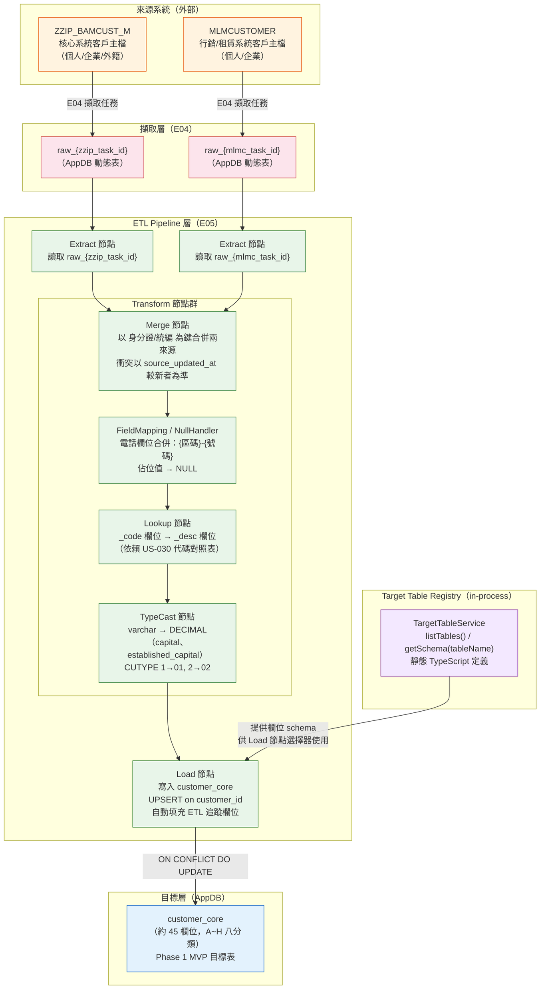
```mermaid
graph TD
    subgraph 來源系統["來源系統（外部）"]
        ZZIP["ZZIP_BAMCUST_M<br/>核心系統客戶主檔<br/>（個人/企業/外籍）"]
        MLMC["MLMCUSTOMER<br/>行銷/租賃系統客戶主檔<br/>（個人/企業）"]
    end

    subgraph ExtractionLayer["擷取層（E04）"]
        RawZZIP["raw_{zzip_task_id}<br/>（AppDB 動態表）"]
        RawMLMC["raw_{mlmc_task_id}<br/>（AppDB 動態表）"]
    end

    subgraph ETLLayer["ETL Pipeline 層（E05）"]
        ExtractNode1["Extract 節點<br/>讀取 raw_{zzip_task_id}"]
        ExtractNode2["Extract 節點<br/>讀取 raw_{mlmc_task_id}"]

        subgraph TransformNodes["Transform 節點群"]
            MergeNode["Merge 節點<br/>以 身分證/統編 為鍵合併兩來源<br/>衝突以 source_updated_at 較新者為準"]
            PhoneNode["FieldMapping / NullHandler<br/>電話欄位合併：{區碼}-{號碼}<br/>佔位值 → NULL"]
            CodeNode["Lookup 節點<br/>_code 欄位 → _desc 欄位<br/>（依賴 US-030 代碼對照表）"]
            TypeCastNode["TypeCast 節點<br/>varchar → DECIMAL<br/>（capital、established_capital）<br/>CUTYPE 1→01, 2→02"]
        end

        LoadNode["Load 節點<br/>寫入 customer_core<br/>UPSERT on customer_id<br/>自動填充 ETL 追蹤欄位"]
    end

    subgraph TargetLayer["目標層（AppDB）"]
        CustomerCore["customer_core<br/>（約 45 欄位，A~H 八分類）<br/>Phase 1 MVP 目標表"]
    end

    subgraph Registry["Target Table Registry（in-process）"]
        TargetSvc["TargetTableService<br/>listTables() / getSchema(tableName)<br/>靜態 TypeScript 定義"]
    end

    ZZIP -->|"E04 擷取任務"| RawZZIP
    MLMC -->|"E04 擷取任務"| RawMLMC
    RawZZIP --> ExtractNode1
    RawMLMC --> ExtractNode2
    ExtractNode1 --> MergeNode
    ExtractNode2 --> MergeNode
    MergeNode --> PhoneNode
    PhoneNode --> CodeNode
    CodeNode --> TypeCastNode
    TypeCastNode --> LoadNode
    LoadNode -->|"ON CONFLICT DO UPDATE"| CustomerCore
    TargetSvc -->|"提供欄位 schema<br/>供 Load 節點選擇器使用"| LoadNode

    classDef source fill:#fff3e0,stroke:#e65100
    classDef raw fill:#fce4ec,stroke:#c62828
    classDef etl fill:#e8f5e9,stroke:#2e7d32
    classDef target fill:#e3f2fd,stroke:#1565c0
    classDef registry fill:#f3e8ff,stroke:#7b1fa2
    class ZZIP,MLMC source
    class RawZZIP,RawMLMC raw
    class ExtractNode1,ExtractNode2,MergeNode,PhoneNode,CodeNode,TypeCastNode,LoadNode etl
    class CustomerCore target
    class TargetSvc registry
```

**Phase 2/3 擴展路徑**：

| Phase | 新增目標表 | 前提條件 | 擴展方式 |
|-------|---------|---------|---------|
| Phase 2 | `customer_financial` | 合約明細系統接入 | Target Table Registry 新增 schema 定義 + DB Migration 建表 |
| Phase 2 | `customer_interaction` | CRM / 行銷自動化接入 | 同上 |
| Phase 3 | `customer_service` | 客服工單系統接入 | 同上 |

擴展時執行引擎（Pipeline Execution Service）的 UPSERT 邏輯無需修改，僅需：①在 `target-table.service.ts` Registry 中新增 schema 物件、②執行 DB Migration 建立目標表、③新增對應的擷取任務（E04）。

**架構挑戰**：多實例部署時，Scheduler 可能同時執行導致重複健康檢查與重複擷取觸發。MVP 單機部署不受影響；若未來水平擴展，需引入分散式鎖定機制（見第 8 節）。

#### Orphan Recovery 模組（F038 新增）

**架構決策 AD-F038-1：獨立 Module 設計**

| 服務 | 職責 | 執行時機 | 相關 Feature |
|------|------|---------|-------------|
| OrphanRecovery Service | 在應用程式啟動時一次性回收孤兒任務；批次更新 `ExtractionTask`（E04）與 `EtlPipeline`（E05）的 `status=running` 記錄為 `failed`；同步更新對應的 Log 記錄 | `OnApplicationBootstrap`（HTTP Server 開始接受請求前執行） | F038 |

**為何建立獨立 Module 而非放入 Extraction 或 ETL Module**

- **職責分離**：回收邏輯是啟動時的系統行為，與 `ExtractionTaskModule`（業務 CRUD + 執行）和 `EtlModule`（Pipeline 管理）的業務職責無關。
- **跨模組依賴**：`OrphanRecoveryModule` 需同時注入 E04（`ExtractionTask`、`ExtractionLog`）與 E05（`EtlPipeline`、`EtlPipelineLog`）四個 Repository；若放入任一現有模組，另一方需被 import，產生不必要的模組耦合。
- **可測試性**：獨立 Module 可單獨進行整合測試，不需載入完整業務模組。
- **未來擴展性**：若需加入其他啟動時修復邏輯（如資料一致性檢查），可集中於此 Module。

**為何選擇 `OnApplicationBootstrap` 而非 `OnModuleInit`**

`OnApplicationBootstrap` 在**所有模組 DI 完成後**、HTTP Server 開始接受請求前觸發，確保 TypeORM Repository 均已就緒，且 HTTP 請求在回收完成前不被處理。`OnModuleInit` 在單一模組初始化完成後立即觸發，此時其他模組的 Repository 可能尚未就緒，不適用。

**Transaction 設計（AD-F038-2）**

E04（擷取任務）與 E05（ETL Pipeline）的回收在各自獨立的 Transaction 中執行：
- Transaction 1（E04）：批次更新 `extraction_tasks` + 批次更新對應 `extraction_logs`
- Transaction 2（E05）：批次更新 `etl_pipelines` + 批次更新對應 `etl_pipeline_logs`
- E04 Transaction 失敗不影響 E05 Transaction 的執行
- 兩組失敗均僅記錄 `Logger.error()`，不拋出例外，不中止應用程式啟動

**AppModule import 順序**

`OrphanRecoveryModule` 須在 `ExtractionTaskModule` 與 `EtlModule` 之後、`SchedulerModule` 之前 import，確保孤兒回收在排程引擎首次掃描前完成。

---

#### Customer 360 模組（E06 新增）

**架構決策 AD-E06-1：C360 模組直接查詢 customer_core 表，不建立 TypeORM Entity**

`customer_core` 目標表由 ETL Pipeline（E05）的 Load 節點以動態 SQL 管理，TypeORM 不持有其 Entity 定義。C360 模組採用 `DataSource.query()`（Raw SQL）或 `QueryBuilder` 存取 `customer_core`，透過 `CustomerCoreRepository` 抽象層封裝所有查詢邏輯。此決策避免在 TypeORM Entity 與 ETL 動態 Schema 之間產生雙重管理責任。

**架構決策 AD-E06-2：敏感資料遮罩硬編碼於 Service 層，依角色判斷**

遮罩邏輯（`maskIdNumber()`、`maskPhone()`）硬編碼於 `C360Service`，在 API 回應序列化前依 JWT payload 的 `role` 欄位決定是否套用遮罩，不使用 Middleware 或 Interceptor 攔截。規則：Admin 回傳完整明碼，User 回傳遮罩值。遮罩規則不支援動態設定（MVP 限制）。

**架構決策 AD-E06-3：全文搜尋使用 PostgreSQL 原生 FTS（tsvector/tsquery）**

C360 的姓名搜尋使用 PostgreSQL 原生全文搜尋（`tsvector` + `tsquery` + GIN 索引），不使用應用層 LIKE 查詢，亦不引入外部搜尋引擎（如 Elasticsearch）。MVP 資料量（≤ 1,000 筆）下，PostgreSQL FTS 加 GIN 索引已足以滿足 NFR-002 的 < 500ms 要求，避免引入額外系統依賴。

**架構決策 AD-E06-4：GIN 索引建立於獨立 Migration**

FTS 所需的 GIN 索引（`idx_customer_core_fulltext`）在獨立的 TypeORM Migration 中建立，不包含在 `customer_core` 建表 Migration 中。此設計使 C360 模組的前置依賴（GIN 索引）可獨立部署，並與 ETL Pipeline 的 Schema Migration 解耦。

```sql
-- Migration: AddCustomerCoreFullTextIndex
CREATE INDEX IF NOT EXISTS idx_customer_core_fulltext
  ON customer_core
  USING GIN (to_tsvector('simple', coalesce(name, '') || ' ' || coalesce(english_name, '')));
```

**架構決策 AD-E06-5：C360 模組在執行時期不依賴 Extraction 或 ETL Pipeline 模組**

C360 模組僅在執行時期依賴 Auth 模組（JWT 驗證）與應用資料庫（讀取 `customer_core`）。它不注入 ExtractionTaskService 或 PipelineService，只消費 ETL 產生的資料成果（`customer_core` 資料列）。模組邊界清晰，C360 為純粹的唯讀消費者。

| 服務 | 職責 | 關鍵業務規則 | 相關 Feature |
|------|------|-----------|-------------|
| C360 Controller | 提供 3 個 REST 端點；JWT 驗證強制（Admin / User 均可）；QueryString 驗證（keyword 最少 2 字元） | 所有端點需 Bearer Token；keyword < 2 字元回傳 422 | F046, F047 |
| C360 Service | 客戶統計摘要查詢；搜尋優先邏輯（idNumber 優先於 keyword）；類型篩選（AND 組合）；360 詳情 8 分類組裝；敏感資料遮罩 | BR-2（遮罩硬編碼）；BR-3（idNumber 優先）；BR-4（預設 name 升序）；BR-7（統計即時查詢，不快取） | F046, F047 |
| CustomerCoreRepository | 封裝所有 `customer_core` 查詢的 Raw SQL / QueryBuilder；分頁（LIMIT/OFFSET）；FTS 查詢（tsvector/tsquery）；精確比對（source_customer_no）；單筆詳情查詢（customer_id） | 不執行任何 INSERT / UPDATE / DELETE；所有查詢加上 `deleted_at IS NULL`（若 customer_core 有此欄位，否則無條件查詢） | F046, F047 |

**API 端點摘要**

| HTTP Method | 路徑 | 說明 | 角色 |
|-------------|------|------|------|
| GET | `/api/v1/c360/customers/stats` | 客戶統計摘要（總數、個人、企業、外籍） | Admin / User |
| GET | `/api/v1/c360/customers` | 客戶清單搜尋（keyword、idNumber、type、page、pageSize） | Admin / User |
| GET | `/api/v1/c360/customers/:customerId` | 單一客戶 360 詳情（85 欄位 / 8 分類） | Admin / User |

**搜尋優先邏輯**

```
若 idNumber 存在且非空 → 精確比對 source_customer_no（忽略 keyword）
若僅有 keyword（>= 2 字元）→ FTS：to_tsvector('simple', name || ' ' || english_name) @@ plainto_tsquery('simple', keyword)
兩者皆無 → 全部客戶（僅受 type 篩選影響）
type 篩選 → AND customer_type_code IN (...)
```

**Monorepo 結構（新增）**

```
apps/api/src/modules/
└── c360/                           # Customer 360 模組（E06）
    ├── c360.module.ts
    ├── c360.controller.ts          # 3 個端點
    ├── c360.service.ts             # 搜尋邏輯、遮罩、詳情組裝
    ├── customer-core.repository.ts # Raw SQL 查詢抽象層
    └── dto/
        ├── customer-list.dto.ts    # 回應 DTO（清單項目）
        ├── customer-detail.dto.ts  # 回應 DTO（360 詳情）
        └── customer-stats.dto.ts   # 回應 DTO（統計摘要）

apps/web/src/pages/
└── c360/
    ├── CustomerListPage.tsx        # 客戶清單（F046）
    └── CustomerDetailPage.tsx      # 客戶 360 詳情（F047）
```

---

#### E07 Assignment Module（客戶名單分派模組）

**架構決策 AD-E07-1：OB 業務資料完全遷移至 AppDB，Assignment Module 直接操作 ob_* 表**

OB 系統的業務表（OBMLISTDF 等 10 張表）已遷移至 AppDB，以 `ob_` 前綴 snake_case 命名。E07 不直連 OB 原始資料庫，所有讀寫操作均針對 AppDB，資料流閉合。`ob_pool_data`（案件池）由 E04 擷取任務定期從 OB 原始系統匯入（建議月初執行一次），E07 月跑 Stage 1 讀取此表。

**架構決策 AD-E07-2：月跑採非同步執行模型，三份快照原子性寫入**

`POST /api/v1/assignment/runs` 回傳 `202 Accepted`，月跑在背景 Promise chain 非同步執行 Stage 0~4。前端以 3 秒 Polling 讀取進度。同月僅允許一個 `pending` 或 `running` 狀態的月跑（重複觸發回傳 409）。月跑完成後，三份快照（config / input_list / result）在同一 DB Transaction 中原子性寫入 `assignment_run_snapshot`；任一失敗則整體 Rollback，`assignment_run.status` 改為 `failed`。

**架構決策 AD-E07-3：複雜計分邏輯保留為 PostgreSQL function**

TIER_LEVEL 對應計算、多維度加權計分等複雜邏輯由 PostgreSQL function 實作，`AssignmentScoringService` 作為呼叫層（Service 層發出 `SELECT fn_calc_tier_level(...)` 等 Raw SQL 呼叫）。此決策確保效能（在 DB 層減少資料傳輸），並與既有 Stored Procedure 邏輯對應，降低移植風險。PostgreSQL function 的命名規範與版本管理策略見 open-questions.md（A44）。

| 服務 | 職責 | 關鍵業務規則 | 相關 Stories |
|------|------|------------|------------|
| AssignmentList Service | `ob_list_definition` CRUD；LIST_NO 自動產生；停用（status='inactive'） | LIST_NO 格式 `OB{YYYYMM}{NNN}`；同月 > 999 筆回傳 422（LIST_NO_LIMIT_EXCEEDED）；停用不刪除記錄 | US-070, US-071, US-088, US-089, US-090 |
| AssignmentScoring Service | 計分維度（ob_levelcard_*）讀寫；版本管理（新版本遞增）；CARD_LEVEL 門檻；TIER_LEVEL 對應；**F056 v1.5 起：所有寫入端點加入 CARD_TYPE 範圍鎖（assertCardTypeActive）** | 寫入時建立新 CARD_VERSION（不覆蓋舊版本）；複雜計分呼叫 PostgreSQL function（AD-E07-3）；**F056 TIER_LEVEL 列舉驗證（T1~T10）；Fallback/Standard 互斥檢查**（應用層 Mutex）；**ob_tier fallback 紀錄刪除必須用 `repo.remove(entity)`（TypeORM NULL PK silent bug 防範）** | US-072, US-073, US-074, US-075 |
| CardType Service（**F069~F072 新增**） | `ob_card_type` CRUD；查詢清單（JOIN `ob_code_df` 取 prodKindName）；新增（同 transaction 自動建立 v1 `ob_levelcard_version`）；編輯（card_name / prod_kind 僅此兩欄）；刪除預覽（5 張下游表筆數統計 + ob_list_definition active 引用數）；級聯 hard delete（6 步驟 transaction）；審計日誌同 transaction 寫入 | **依賴 Repository**：`ObCardType`（新建 Entity）/ `ObLevelcardVersion` / `ObLevelcardColumn` / `ObLevelcardScore` / `ObLevelcardLevel` / `ObTier` / `ObCodeDf`（需新增 module import）/ `AssignmentRun` / `AssignmentAuditLog`；F070 同 transaction：INSERT ob_card_type + INSERT ob_levelcard_version（v1，sdate=今日 / edate=20991231 / status=active）；F072 採應用層 transaction（AD-E07-16，不使用 `ON DELETE CASCADE`） | US-093, US-094, US-095, US-096 |
| AssignmentRatio Service | per-LIST_NO 部門比例（ob_dept_pct）讀寫；人員比例（ob_empl_set）讀寫；CR 回分規則開關 | 比例總和驗證（各部門 RATION 總和需 = 100%）由應用層執行；`ob_dept_pct` 即為 per-LIST_NO 設定（無全域表） | US-078, US-079, US-080, US-091 |
| AssignmentCode Service | `ob_code_df` CRUD（PROD_KIND / SPEC_TP / CASE_STATUS **三類**代碼維護；**CASEYEAR 不納入**，因 CASEYEAR 為前端 hard-coded 的 11 個固定 enum 選項 0~10，不從 `ob_code_df` 動態載入，證據：`reference/Areas/OBZ/Views/OBZ020/edit.cshtml:174-235`）；`tbl_id` 使用英文常數（非原系統數字代碼），映射規則：`'01'→'PROD_KIND'`、`'02'→'SPEC_TP'`、`'22'→'CASE_STATUS'`（AD-E07-14；初版含 `'04'→'CASEYEAR'`，於 2026-05-12 OQ-E07-24 Resolved 後移除） | Admin 與業務主管均可存取；代碼用於名單定義表單選項；F050/F051 `case_status` 欄位多選選項來源為 `tbl_id='CASE_STATUS'`；F050/F051 `caseyear` 欄位為前端固定 11 個選項（0~10），非 ob_code_df 動態載入 | US-092 |
| AssignmentRun Service | 觸發月跑（202 非同步）；Stage 0~4 執行引擎；進度查詢；結果摘要；匯出 CSV | 同月僅一個 running/pending 月跑（409 拒絕重複）；快照 Transaction 原子性（AD-E07-2）；Stage 1 讀取 ob_pool_data（依賴 E04）；Stage 3/4 回寫 ob_pool_data_list.ob_dept / ob_emplid | US-081, US-082, US-083, US-084 |
| AssignmentSnapshot Service | 執行歷史清單；快照詳情；兩次執行差異比對 | 差異比對在應用層計算（比對兩份 result 快照 JSONB）；快照為不可變記錄 | US-085, US-086, US-087 |
| AssignmentAudit Service | E07 所有 CRUD 操作後寫入 `assignment_audit_log` | 不對外暴露 API；由各 Service 呼叫；保留 3 年，Cleanup Cron 每日清理 | 所有 E07 Stories |
| **AssignmentRunGuardService**（2026-05-16 新增 / 決議 #6） | 月跑並發守衛集中實作；提供 `assertNoRunningRun(workYm?)` method | 查詢 `assignment_run.status IN ('pending', 'running')`，若有則拋 `ConflictException` (409) + `ASSIGNMENT_RUN_ALREADY_RUNNING`；所有 E07 寫入 service method 最頂層呼叫；月跑結束（`status = 'completed'` / `'failed'`）後自動解除阻擋；位置：assignment 模組底下，與 `StageTransitionService` 同層 | F050 v2.0, F051, F052, F078, F079, F080, F081, F082 v1.3, F083（透過 F082 PUT）, F084, F085, F086, F087, F089 |
| **StageTransitionService**（2026-05-15 新增 / E07 重構批次 4 引入；2026-05-16 補登元件說明） | 五階段流程引擎共用 helper；提供 `advanceTo` / `rollbackTo` / `rejectTo` / `assertStageEquals` 4 個 method | `advanceTo(listNo, fromStage, toStage, preconditionFn, postActionFn?)` 用於 F078 / F080 / F084 / F086；`rollbackTo(listNo, fromStage, toStage, cleanupFn)` 用於 F081 / F085 / F089；`rejectTo(listNo, fromStage, toStage, rejectReason, cleanupFn?, postActionFn?)` 用於 F087；`assertStageEquals(listNo, expectedStage)` 由各 service 共用；所有寫入操作於同一 DB transaction 內完成（含稽核 INSERT，稽核失敗例外） | F078, F079, F080, F081, F082, F084, F085, F086, F087, F089 |
| **PersonnelRatioValidationService**（2026-05-15 新增 / E07 重構批次 5 引入；2026-05-16 補全員離職邊界） | per-DEPT 個別業務比例驗算 helper；提供 `assertDeptSumEquals100` / `assertAllDeptsSumEquals100` 2 個 method | `assertDeptSumEquals100(deptCode, ratios)` 用於 F082 PUT 寫入校驗（**v1.3 / 決議 #1**：若 `activeEmployeeCount === 0` **短路 return**，允許部門 sum = 0%、不阻擋儲存）；`assertAllDeptsSumEquals100(listNo)` 用於 F084 推進前置條件驗證（內部查詢 `ob_empl_set` GROUP BY deptid_m）；錯誤碼 `PERSONNEL_RATIO_SUM_NOT_100`（per-DEPT 語意，與 `RatioValidationService` 之 per-LIST_NO 語意區隔） | F082, F084 |
| **RatioValidationService**（2026-05-15 新增 / E07 重構批次 4 引入） | per-LIST_NO 部門比例驗算 helper；提供 `assertSumEquals100` / `assertEachInRange` 2 個 method | `assertSumEquals100(ratios)` 用於 F079 PUT + F080 推進前置條件驗證；`assertEachInRange(ratios, [0, 100])` 用於單欄位邊界校驗；錯誤碼 `RATIO_SUM_NOT_100` / `RATIO_OUT_OF_RANGE` | F079, F080 |
| **FeatureFlagGuard**（2026-05-16 補登 / 決議 #2） | Feature flag 控制 Guard；於 E07 重構批次 3~6 端點啟動 `ENABLE_E07_REFACTOR_PHASE3` 檢查 | flag = `false` 時統一回 **503 Service Unavailable** + `FEATURE_NOT_ENABLED`（沿用 F050 v2.0 §13.2 統一行為）；flag = `true` 時放行；實作機制（環境變數 vs config 表 vs LaunchDarkly）由 system-architect 於 batch 3 architecture 階段決議 | F050 v2.0, F051, F052, F078, F079, F080, F081, F082, F084, F085, F086, F087, F089 |
| **SectionChiefScopeGuard**（2026-05-15 新增 / E07 重構批次 5 引入；2026-05-16 補 method 分支） | 處長轄區隔離 Guard；於 F082 端點套用 | (1) admin / director 直接放行；(2) section_chief 依 HTTP method 分支：**GET 不攔截**（由 service 層 `scopeByCreator(currentUserId)` 統一過濾，越權回 200 + `departments = []`）；**PUT / POST 攔截**（從 request body / params 抽 `deptCode` + `empIds`，比對 `ob_empl_set.created_by`，不符回 403 `PERSONNEL_RATIO_OUT_OF_SCOPE`）；後續 M03d / 簽核流程可重用 | F082 v1.3 |

**E07 API Endpoints 摘要**

| HTTP Method | 路徑 | 說明 | 最低角色要求 |
|-------------|------|------|------------|
| GET | `/api/v1/assignment/list-definitions` | 本月名單定義清單 | user + is_sales_manager |
| POST | `/api/v1/assignment/list-definitions` | 新增名單定義 | user + is_sales_manager |
| PUT | `/api/v1/assignment/list-definitions/:listNo` | 編輯名單定義 | user + is_sales_manager |
| PUT | `/api/v1/assignment/list-definitions/:listNo/disable` | 停用名單定義 | user + is_sales_manager |
| GET | `/api/v1/assignment/list-definitions/:listNo/estimate` | Stage 0 案件估算 | user + is_sales_manager |
| GET | `/api/v1/assignment/scoring/card-types` | **[F069 新增]** 查看 CARD_TYPE 計分卡類型清單（含 prodKindName JOIN） | user + is_sales_manager |
| POST | `/api/v1/assignment/scoring/card-types` | **[F070 新增]** 新增 CARD_TYPE（同 transaction 自動建立 v1 版本） | user + is_sales_manager |
| PUT | `/api/v1/assignment/scoring/card-types/:cardType` | **[F071 新增]** 編輯 CARD_TYPE（card_name / prod_kind；代碼不可修改） | user + is_sales_manager |
| GET | `/api/v1/assignment/scoring/card-types/:cardType/delete-preview` | **[F072 新增]** 刪除預覽（5 張下游表筆數 + ob_list_definition 引用數） | user + is_sales_manager |
| DELETE | `/api/v1/assignment/scoring/card-types/:cardType` | **[F072 新增]** 級聯 hard delete（需 confirmCascade=true query） | user + is_sales_manager |
| GET | `/api/v1/assignment/scoring` | 查看計分維度設定（**F053 v1.2：需 cardType query param；加 CARD_TYPE 存在性驗證**） | user + is_sales_manager |
| PUT | `/api/v1/assignment/scoring/dimensions` | 編輯計分維度與分數（**F054 v1.2：加 CARD_TYPE 範圍鎖**） | user + is_sales_manager |
| PUT | `/api/v1/assignment/scoring/card-levels` | 編輯 CARD_LEVEL 門檻（**F055 v1.4：加 CARD_TYPE 範圍鎖**） | user + is_sales_manager |
| PUT | `/api/v1/assignment/scoring/tier-mapping` | 編輯 TIER_LEVEL 對應表（**F056 v1.5 breaking：CARD_TYPE 範圍鎖 + TIER_LEVEL 列舉 + Fallback/Standard 互斥**） | user + is_sales_manager |
| GET | `/api/v1/assignment/ratios/dept/:listNo` | 查看部門比例設定 | user + is_sales_manager |
| PUT | `/api/v1/assignment/ratios/dept/:listNo` | 設定 per-LIST_NO 部門比例 | user + is_sales_manager |
| GET | `/api/v1/assignment/ratios/personnel/:listNo` | 查看人員比例設定 | user + is_sales_manager |
| PUT | `/api/v1/assignment/ratios/personnel/:listNo` | 編輯人員比例設定 | user + is_sales_manager |
| PUT | `/api/v1/assignment/ratios/cr-rule` | 開關 CR 回分規則 | user + is_sales_manager |
| GET | `/api/v1/assignment/codes` | 查看代碼清單 | user + is_sales_manager |
| PUT | `/api/v1/assignment/codes` | 維護代碼 | user + is_sales_manager |
| POST | `/api/v1/assignment/runs` | 觸發分派月跑 | user + is_sales_manager |
| GET | `/api/v1/assignment/runs/:runId` | 查看月跑執行進度 | user + is_sales_manager |
| GET | `/api/v1/assignment/runs/:runId/summary` | 查看分派結果摘要 | user + is_sales_manager |
| GET | `/api/v1/assignment/runs/:runId/export` | 匯出分派結果 CSV | user + is_sales_manager |
| GET | `/api/v1/assignment/history` | 查看歷史執行清單 | user + is_sales_manager |
| GET | `/api/v1/assignment/history/:runId/snapshot` | 查看執行快照詳情 | user + is_sales_manager |
| GET | `/api/v1/assignment/history/compare` | 比對兩次執行差異（?runA=&runB=） | user + is_sales_manager |

**E07 與 E04 的依賴關係**

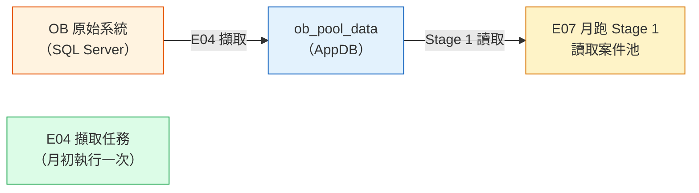
```mermaid
graph LR
    OB_Sys["OB 原始系統\n（SQL Server）"]
    E04["E04 擷取任務\n（月初執行一次）"]
    ob_pool["ob_pool_data\n（AppDB）"]
    E07["E07 月跑 Stage 1\n讀取案件池"]

    OB_Sys -->|"E04 擷取"| ob_pool
    ob_pool -->|"Stage 1 讀取"| E07

    classDef ob fill:#fff3e0,stroke:#e65100
    classDef extraction fill:#dcfce7,stroke:#16a34a
    classDef appdb fill:#e3f2fd,stroke:#1565c0
    classDef e07 fill:#fef3c7,stroke:#d97706
    class OB_Sys ob
    class E04 extraction
    class ob_pool appdb
    class E07 e07
```

---

#### 共用基礎建設（Shared Infrastructure）

| 工具 | 職責 | 安全性注意事項 |
|------|------|--------------|
| Crypto Util | AES-256-GCM 加密/解密資料庫連線密碼 | 金鑰從環境變數讀取（OQ-4 決議），禁止硬編碼 |
| Hash Util | bcrypt 密碼雜湊（cost factor >= 10）與比對 | 明文密碼不得出現在日誌 |
| JWT Util | 發行/驗證 JWT；支援多 Secret 並行驗證（OQ-11 決議） | 支援無停機 Secret 輪替 |
| Email Util | 封裝 SMTP / SendGrid 呼叫；Email 寄送為非同步操作（不阻塞 API 回應） | Email 內容不含密碼 |
| Logger | 結構化日誌輸出；自動遮罩敏感欄位（password、token、encrypted_password） | Stack trace 禁止出現在 API 回應 |

---

## 4. 資料架構

### 4.1 核心資料實體（ER 圖）


```mermaid
erDiagram
    User {
        uuid id PK
        string name
        string email "唯一，小寫儲存"
        string password_hash "bcrypt, cost>=10"
        enum role "admin|user"
        enum status "active|disabled"
        timestamp created_at
        timestamp updated_at
    }

    TokenBlocklist {
        string token PK "完整 Token 或 JTI"
        uuid user_id FK
        timestamp revoked_at
        timestamp expires_at "用於定期清理"
    }

    PasswordResetToken {
        uuid id PK
        uuid user_id FK
        string token "UUID v4，唯一"
        timestamp expires_at "建立後 24 小時"
        timestamp used_at "NULL = 未使用"
        timestamp created_at
    }

    Datasource {
        uuid id PK
        string name "唯一（排除軟刪除）"
        enum type "mysql|postgresql|sqlserver"
        string host
        integer port "1-65535"
        string database_name
        string username
        string encrypted_password "AES-256-GCM"
        string description
        enum status "connected|disconnected|unknown"
        timestamp last_tested_at
        uuid created_by FK
        timestamp deleted_at "NULL = 未刪除（軟刪除）"
        timestamp created_at
        timestamp updated_at
    }

    DatasourceHealthLog {
        uuid id PK
        uuid datasource_id FK
        boolean success
        integer response_time_ms "成功時記錄"
        string error_message "失敗時記錄"
        timestamp checked_at
    }

    ExtractionTask {
        uuid id PK
        string name "唯一（排除軟刪除，max 255）"
        uuid datasource_id FK
        enum mode "full|incremental"
        enum status "running|scheduled|completed|failed|disabled"
        string source_schema "來源 Schema 名稱，max 255，nullable"
        string source_table "來源資料表名稱，max 255"
        string incremental_column "增量模式必填"
        string incremental_column_type "timestamp|integer|string，預設 timestamp"
        string last_incremental_value "max 255，string 儲存"
        string schedule "Cron 表達式（UTC），max 100"
        integer batch_size "100-10000，預設 1000"
        timestamp last_execution_at
        integer extracted_count "最近一次擷取筆數"
        integer total_count "來源總筆數"
        decimal progress_percent "0-100"
        integer avg_duration_ms "平均執行時間"
        integer execution_count "總執行次數"
        string error_message "最後錯誤訊息"
        boolean enabled "預設 true"
        uuid created_by FK
        timestamp deleted_at "NULL = 未刪除（軟刪除）"
        timestamp created_at
        timestamp updated_at
    }

    ExtractionLog {
        uuid id PK
        uuid task_id FK
        enum status "running|completed|failed"
        timestamp started_at "UTC"
        timestamp finished_at "UTC，nullable"
        integer duration_ms "finish - start"
        integer extracted_count
        integer total_count
        string error_message "失敗時記錄"
        enum triggered_by "schedule|manual|retry"
        uuid created_by FK
    }

    EtlPipeline {
        uuid id PK
        string name "唯一（排除軟刪除，max 255）"
        string description "TEXT，選填"
        integer version "當前版本號，預設 1"
        integer step_count "節點數量，預設 0"
        enum status "draft|active|running|failed|disabled"
        string schedule "Cron（UTC），max 100，選填"
        timestamp last_execution_at "nullable"
        timestamp next_execution_at "nullable"
        integer processed_count "累計處理筆數，預設 0"
        integer avg_duration_ms "平均執行時間，預設 0"
        integer execution_count "累計執行次數，預設 0"
        boolean enabled "預設 false"
        uuid created_by FK
        timestamp deleted_at "NULL=未刪除（軟刪除）"
        timestamp created_at
        timestamp updated_at
    }

    EtlPipelineVersion {
        uuid id PK
        uuid pipeline_id FK
        integer version "同 Pipeline 下遞增"
        jsonb definition "nodes + edges JSONB 結構"
        enum status "draft|testing|published"
        string change_summary "max 500，選填"
        uuid created_by FK
        timestamp created_at
    }

    EtlPipelineLog {
        uuid id PK
        uuid pipeline_id FK
        integer version "執行時使用的版本號"
        enum status "running|completed|failed"
        timestamp started_at "UTC"
        timestamp finished_at "UTC，nullable"
        integer duration_ms "nullable"
        integer processed_count "預設 0"
        string error_message "TEXT，nullable"
        jsonb node_logs "各節點執行記錄 JSONB，nullable"
        enum triggered_by "schedule|manual|test|retry"
        boolean is_test_run "預設 false"
        uuid created_by FK
    }

    User ||--o{ TokenBlocklist : "has revoked tokens"
    User ||--o{ PasswordResetToken : "has reset tokens"
    User ||--o{ Datasource : "creates (created_by)"
    User ||--o{ ExtractionTask : "creates (created_by)"
    User ||--o{ EtlPipeline : "creates (created_by)"
    User ||--o{ AssignmentRun : "triggers (triggered_by)"
    User ||--o{ AssignmentAuditLog : "operates (operator_id)"
    Datasource ||--o{ DatasourceHealthLog : "has health logs"
    Datasource ||--o{ ExtractionTask : "referenced by"
    ExtractionTask ||--o{ ExtractionLog : "has execution logs"
    EtlPipeline ||--o{ EtlPipelineVersion : "has versions"
    EtlPipeline ||--o{ EtlPipelineLog : "has execution logs"
    AssignmentRun ||--o{ AssignmentRunSnapshot : "has snapshots"
    ObListDefinition {
        varchar list_no PK "OB{YYYYMM}{NNN}"
        text list_nm
        varchar status "active|inactive"
        varchar card_type "新欄位（獨立輸入）"
        timestamp created_at
        timestamp updated_at
    }
    AssignmentRun {
        uuid run_id PK
        varchar ym "YYYYMM"
        enum status "pending|running|completed|failed"
        uuid triggered_by FK
        timestamp triggered_at
        timestamp completed_at
        integer total_count
        text error_message
    }
    AssignmentRunSnapshot {
        uuid run_id FK
        enum snapshot_type "config|input_list|result"
        jsonb payload
        timestamp created_at
    }
    AssignmentAuditLog {
        bigint id PK
        varchar action "CREATE|UPDATE|DISABLE|SET_RATIO|TRIGGER_RUN"
        varchar entity_type
        varchar entity_id
        uuid operator_id FK
        timestamp operated_at
        jsonb before_payload
        jsonb after_payload
        varchar ip_address
    }
```

### 4.2 資料所有權

| 實體 | 擁有模組 | 其他模組存取方式 |
|------|---------|----------------|
| User（含 role / is_sales_manager 欄位） | Account 模組 | Auth 模組讀取（驗證登入，JWT payload 攜帶 role 與 is_sales_manager）；RBAC Middleware 使用 is_sales_manager 判斷 E07 存取權；透過服務介面呼叫，不直接存取 Repository |
| 角色 Seed Data（Enum 定義） | Account 模組（RoleService） | Auth 模組使用（JWT payload 中 role 的有效值集合）；RBAC Middleware 使用（判斷角色） |
| TokenBlocklist | Auth 模組 | Middleware 查詢（驗證請求）；Account 模組透過 Auth Service 寫入（停用帳號） |
| PasswordResetToken | Auth 模組 | 不對其他模組開放 |
| Datasource | Datasource 模組 | Dashboard Service 讀取（彙整統計）；Extraction 模組透過 Datasource Service 介面查詢（驗證參照完整性） |
| DatasourceHealthLog | Datasource 模組 | Dashboard Service 讀取（趨勢圖、告警計算） |
| ExtractionTask | Extraction 模組 | Scheduler 模組透過 ExtractionExecution Service 介面呼叫；ETL Pipeline 模組透過 Extraction 模組介面查詢可用 raw data 表（Extract 節點來源選擇，F029 AC-6） |
| ExtractionLog | Extraction 模組 | 不對其他模組開放 |
| EtlPipeline | ETL Pipeline 模組 | Scheduler 模組透過 Pipeline Execution Service 介面呼叫 |
| EtlPipelineVersion | ETL Pipeline 模組 | 不對其他模組開放；Pipeline Execution Service 讀取最新 published 版本的 definition |
| EtlPipelineLog | ETL Pipeline 模組 | 不對其他模組開放 |
| 目標表（`customer_core` 等） | ETL Pipeline 模組（寫入）/ C360 模組（唯讀） | ETL Pipeline 以動態 SQL 執行 UPSERT；C360 模組以 Raw SQL / QueryBuilder 唯讀查詢；兩者均不透過 TypeORM Entity 管理此表；Phase 1 MVP 僅含 `customer_core`（85 欄位）；Phase 2/3 擴展時新增目標表至 Registry |
| ob_* 表（ob_list_definition 等 10 張） | Assignment 模組（讀寫）/ E04 Extraction 模組（ob_pool_data 寫入） | Assignment Module 負責 CRUD；ob_pool_data 例外：由 E04 ExtractionExecution Service 從 OB 原始系統匯入寫入，E07 僅讀取 |
| assignment_run / assignment_run_snapshot | Assignment 模組（讀寫） | 不對其他模組開放；月跑紀錄與快照完整由 AssignmentRun Service 管理 |
| assignment_audit_log | Assignment 模組（只寫）/ DBA（唯讀） | 由 AssignmentAudit Service 寫入；不提供 API 查詢（稽核用途，由 DBA 直接查詢）；Cleanup Cron 負責 3 年清理 |

### 4.3 資料一致性模型

| 操作 | 一致性需求 | 實作方式 |
|------|----------|---------|
| 登入驗證 | 強一致性 | 同步讀取 User 與 TokenBlocklist |
| 帳號停用 + Token 失效 | 強一致性 | 單一 DB 交易：更新 User.status + 批次寫入 TokenBlocklist |
| 密碼重設 + Token 失效 | 強一致性 | 單一 DB 交易：更新 password_hash + 撤銷所有現有 Token |
| 連線測試結果更新 | 強一致性 | 同步更新 Datasource.status + 寫入 DatasourceHealthLog |
| Email 寄送（密碼重設） | 最終一致性 | 非同步操作；API 在 Email 寄出前即回應成功訊息 |
| 健康檢查歷史清理 | 最終一致性 | 背景 Cron Job，不影響前台操作 |
| 觸發擷取執行（建立 Log + 更新 Task status） | 強一致性 | 同一 DB 交易：INSERT ExtractionLog + UPDATE ExtractionTask.status = 'running' |
| 擷取進度更新（extracted_count） | 最終一致性 | 非交易性批次更新（每 batch_size 筆一次）；Polling 容忍短暫延遲 |
| 擷取完成（更新 Log + Task） | 強一致性 | 同一 DB 交易：UPDATE ExtractionLog（finished_at, duration_ms）+ UPDATE ExtractionTask（status, last_execution_at, avg_duration_ms, execution_count）；增量模式同時更新 `last_incremental_value` |
| 排程掃描執行 | 最終一致性 | 掃描失敗記錄日誌，下次掃描重試 |
| ExtractionLog 清理 | 最終一致性 | 背景 Cron Job，不影響前台操作 |
| 觸發 Pipeline 執行（建立 Log + 更新狀態） | 強一致性 | 同一 DB 交易：INSERT EtlPipelineLog + UPDATE EtlPipeline.status = 'running' |
| Pipeline 進度更新（node_logs、processed_count） | 最終一致性 | 每個節點完成後以非交易性更新；前端 5 秒 Polling 容忍短暫延遲 |
| Pipeline 執行完成（更新 Log + Pipeline） | 強一致性 | 同一 DB 交易：UPDATE EtlPipelineLog（finished_at, duration_ms）+ UPDATE EtlPipeline（status, last_execution_at, processed_count, avg_duration_ms, execution_count）；測試執行同時更新 EtlPipelineVersion.status = 'testing' |
| Pipeline 版本發布 | 強一致性 | 同一 DB 交易：UPDATE EtlPipelineVersion.status = 'published' + UPDATE EtlPipeline.version |
| EtlPipelineLog 清理 | 最終一致性 | 背景 Cron Job，不影響前台操作 |
| 觸發月跑（建立 AssignmentRun + 更新狀態） | 強一致性 | 同一 DB 交易：INSERT AssignmentRun（status=pending）+ 驗證同月無 pending/running 紀錄（並發控制） |
| 月跑三份快照寫入 | 強一致性 | 同一 DB Transaction 原子性寫入三份 AssignmentRunSnapshot；任一失敗整體 Rollback，AssignmentRun.status 改為 failed（AD-E07-2） |
| 月跑回寫 ob_pool_data_list（OB_DEPT / OB_EMPLID） | 強一致性 | Stage 3/4 完成後同步更新；失敗時 AssignmentRun.status 改為 failed |
| E07 CRUD 稽核日誌寫入 | 最終一致性 | AssignmentAudit Service 在業務操作成功後寫入；若稽核寫入失敗僅記錄 Logger.error，不 Rollback 業務操作 |
| AssignmentAuditLog 清理 | 最終一致性 | Cleanup Cron Job 每日清理超過 3 年記錄 |

### 4.4 資料庫索引建議

| 表格 | 欄位 | 索引類型 | 理由 |
|------|------|---------|------|
| User | email | UNIQUE INDEX | 登入查詢；Email 唯一性檢查 |
| User | role, status | 複合 INDEX | 帳號清單篩選（F005）；角色值的清單過濾 |
| TokenBlocklist | token | UNIQUE INDEX | Middleware 頻繁查詢 |
| TokenBlocklist | expires_at | INDEX | 定期清理查詢 |
| TokenBlocklist | user_id | INDEX | 帳號停用批次撤銷 |
| PasswordResetToken | token | UNIQUE INDEX | 重設流程查詢 |
| PasswordResetToken | expires_at | INDEX | 定期清理 |
| Datasource | name, database_name, deleted_at | 複合 INDEX | 名稱＋資料庫名稱複合唯一性檢查（排除軟刪除） |
| Datasource | deleted_at | INDEX | 所有清單查詢的過濾條件 |
| DatasourceHealthLog | datasource_id, checked_at | 複合 INDEX | 趨勢圖查詢、告警計算（NFR-002.4） |
| DatasourceHealthLog | checked_at | INDEX | 清理超過 90 天紀錄 |
| ExtractionTask | name, deleted_at | 複合 INDEX | 名稱唯一性檢查（排除軟刪除） |
| ExtractionTask | status, deleted_at | 複合 INDEX | 排程掃描查詢（每分鐘執行） |
| ExtractionTask | datasource_id | INDEX | 外鍵查詢；資料來源刪除影響檢查 |
| ExtractionTask | deleted_at | INDEX | 清單查詢過濾條件 |
| ExtractionLog | task_id, started_at | 複合 INDEX | 日誌查詢（倒序分頁）、趨勢圖聚合 |
| ExtractionLog | started_at | INDEX | 今日統計計算、清理查詢 |
| ExtractionLog | status, started_at | 複合 INDEX | 今日成功/失敗計數（F018 summary, F024 dashboard） |
| raw_{task_id_short} | _cdmp_id（若存在） | PRIMARY KEY INDEX | Raw data 預覽分頁與排序（F026），動態建表時自動建立 |
| etl_pipeline | name, deleted_at | 複合 INDEX | 名稱唯一性檢查（排除軟刪除） |
| etl_pipeline | status, deleted_at | 複合 INDEX | 排程掃描查詢（每分鐘執行，掃描 active + enabled + not running） |
| etl_pipeline | deleted_at | INDEX | 清單查詢過濾條件 |
| etl_pipeline | enabled, deleted_at | 複合 INDEX | 排程掃描輔助條件 |
| etl_pipeline_version | pipeline_id, version | 複合 INDEX | 版本清單查詢（倒序）；查詢最新 published 版本 |
| etl_pipeline_version | pipeline_id, status | 複合 INDEX | 查詢最新 published 版本（排程執行）；啟用前驗證是否有 published 版本 |
| etl_pipeline_log | pipeline_id, started_at | 複合 INDEX | 日誌查詢（倒序分頁）；趨勢圖聚合 |
| etl_pipeline_log | started_at | INDEX | 今日統計計算；清理查詢（30 天保留） |
| etl_pipeline_log | status, started_at | 複合 INDEX | 今日成功/失敗計數（F035 dashboard） |
| etl_pipeline_log | is_test_run, pipeline_id | 複合 INDEX | 版本發布前查詢是否有成功測試執行記錄 |
| customer_core | customer_id | PRIMARY KEY | UPSERT 主鍵衝突判斷（`ON CONFLICT(customer_id) DO UPDATE`）；C360 詳情查詢主鍵 |
| customer_core | source_customer_no | UNIQUE INDEX | 身分證/統編唯一性保護；C360 精確搜尋（`WHERE source_customer_no = :idNumber`） |
| customer_core | _etl_pipeline_id | INDEX | 追溯特定 Pipeline 執行載入的客戶筆數；Load 後稽核查詢 |
| customer_core | customer_type_code | INDEX | C360 客戶類型篩選（`WHERE customer_type_code IN (...)`）效能 |
| customer_core | name | INDEX | C360 預設排序（`ORDER BY name ASC`）效能 |
| customer_core | idx_customer_core_fulltext（GIN） | GIN INDEX | C360 全文搜尋（`to_tsvector('simple', coalesce(name,'') \|\| ' ' \|\| coalesce(english_name,''))`）；F046 前置依賴 |
| ob_list_definition | list_no | PRIMARY KEY | 名單定義查詢主鍵 |
| ob_list_definition | status, project_workym | 複合 INDEX | 查詢本月 active 名單清單（US-070）；月跑 Stage 1 篩選條件 |
| ob_pool_data_list | list_no, orgno, appl_no | PRIMARY KEY（複合） | 月跑 Stage 3/4 更新 ob_dept / ob_emplid |
| ob_dept_pct | project_workym, list_no, obdeptid | PRIMARY KEY（複合） | 部門比例讀取（Stage 2）；per-LIST_NO 查詢 |
| ob_empl_set | list_no, deptid_m, emplid | PRIMARY KEY（複合） | 人員比例讀取（Stage 4） |
| ob_levelcard_version | card_type, card_version | 複合 INDEX | 最新計分版本查詢；版本管理 |
| ob_levelcard_score | card_type, card_version | 複合 INDEX | 計分分數批次讀取 |
| ob_levelcard_level | card_type, card_version | 複合 INDEX | CARD_LEVEL 門檻讀取 |
| assignment_run | ym | INDEX | 同月唯一性檢查（防止重複月跑）；歷史清單年月篩選 |
| assignment_run | status | INDEX | 排程或查詢 running/pending 月跑 |
| assignment_run | triggered_at DESC | INDEX | 歷史清單倒序排列（US-085） |
| assignment_run_snapshot | run_id, snapshot_type | 複合 INDEX | 快速載入指定執行的特定快照類型 |
| assignment_audit_log | entity_type, entity_id | 複合 INDEX | 查詢特定實體操作歷史 |
| assignment_audit_log | operator_id | INDEX | 查詢特定使用者操作歷史 |
| assignment_audit_log | operated_at DESC | INDEX | 時間範圍查詢；Cleanup Cron 清理（3 年） |

### 4.5 資料生命週期

| 資料 | 保留策略 | 清理機制 |
|------|---------|---------|
| DatasourceHealthLog | 90 天（OQ-10 決議） | Cleanup Cron Job 每日執行 |
| PasswordResetToken | 永久保留記錄（已使用/過期不刪除，僅標記狀態），或由 Cron 清理過期未使用的 Token | Cleanup Cron Job |
| TokenBlocklist | 保留至 `expires_at` 之後，Cron 定期清理 | Cleanup Cron Job |
| Datasource（軟刪除） | 永久保留（`deleted_at` 非 NULL），不自動清理 | 手動 DBA 操作（如需復原） |
| ExtractionLog | 30 天（AQ-10 決議） | Cleanup Cron Job 每日執行，刪除 `started_at < NOW() - 30 days` 的記錄 |
| ExtractionTask（軟刪除） | 永久保留（`deleted_at` 非 NULL），不自動清理 | 手動 DBA 操作（如需復原） |
| EtlPipelineLog | 30 天（AQ-14 決議）| Cleanup Cron Job 每日執行，刪除 `started_at < NOW() - 30 days` 的記錄 |
| EtlPipeline（軟刪除） | 永久保留（`deleted_at` 非 NULL），不自動清理 | 手動 DBA 操作（如需復原） |
| EtlPipelineVersion | 永久保留（隨 Pipeline 保留，不自動清理） | 版本紀錄為審計軌跡，不可自動清除 |
| 目標表資料（`customer_core` 等） | 永久保留（UPSERT 寫入，同一 `customer_id` 會被覆蓋更新），不自動清理 | 由 DBA 或下游系統管理；ETL 追蹤欄位（`_etl_loaded_at`、`_etl_pipeline_id`）記錄最近一次 Load 的時間與 Pipeline |

---

## 5. 整合與通訊

### 5.1 通訊模式總覽

| 整合點 | 方向 | 同步/非同步 | 協定 |
|--------|------|-----------|------|
| 瀏覽器 ↔ 後端 | 雙向 | 同步（Request/Response） | HTTPS REST API |
| 後端 → 應用資料庫 | 單向 | 同步 | ORM / SQL over TCP |
| 後端 → Token Blocklist | 雙向 | 同步 | 依實作（DB 或 Redis） |
| 後端 → Email 服務 | 單向 | 非同步（fire-and-forget） | SMTP / HTTPS |
| 後端 → 目標資料庫（連線測試） | 單向 | 同步（含 10 秒逾時） | TCP `SELECT 1` |
| 後端 → 目標資料庫（資料擷取） | 單向 | 非同步（背景執行，2 小時逾時） | TCP 批次 SQL Query |
| 後端 → AppDB raw data 表（ETL Extract） | 單向 | 非同步（Pipeline 執行中讀取） | Raw SQL（`SELECT`，Dynamic table name） |
| 後端 → AppDB target 表（ETL Load） | 單向 | 非同步（Pipeline 執行中寫入） | Raw SQL（`INSERT ON CONFLICT DO UPDATE`） |
| 後端（C360）← AppDB customer_core 表 | 單向（唯讀） | 同步（API 請求驅動） | Raw SQL / QueryBuilder（`SELECT`，含 FTS） |
| Scheduler → 後端邏輯 | 內部呼叫 | 同步 | 模組內部方法呼叫 |

### 5.2 驗證流程（Auth Flow）

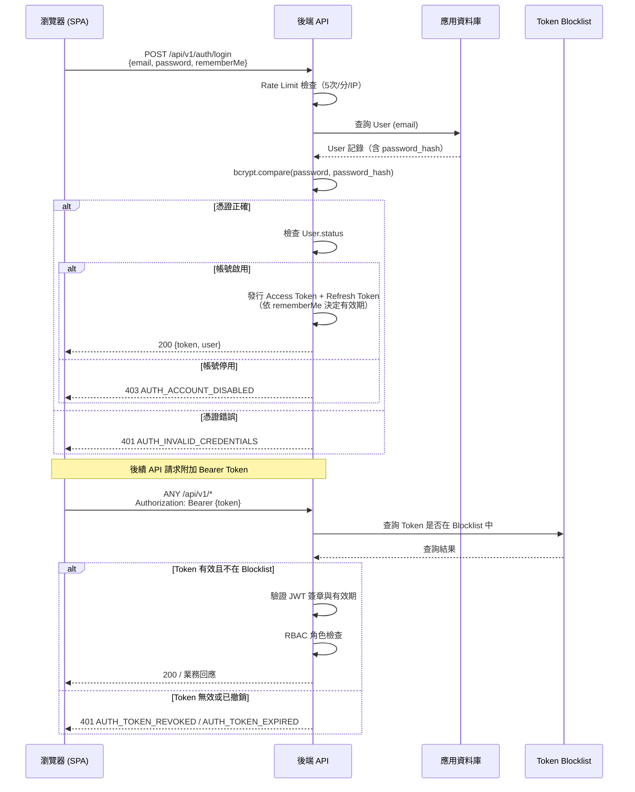
```mermaid
sequenceDiagram
    participant Browser as 瀏覽器 (SPA)
    participant API as 後端 API
    participant DB as 應用資料庫
    participant Blocklist as Token Blocklist

    Browser->>API: POST /api/v1/auth/login<br/>{email, password, rememberMe}
    API->>API: Rate Limit 檢查（5次/分/IP）
    API->>DB: 查詢 User (email)
    DB-->>API: User 記錄（含 password_hash）
    API->>API: bcrypt.compare(password, password_hash)
    alt 憑證正確
        API->>API: 檢查 User.status
        alt 帳號啟用
            API->>API: 發行 Access Token + Refresh Token<br/>（依 rememberMe 決定有效期）
            API-->>Browser: 200 {token, user}
        else 帳號停用
            API-->>Browser: 403 AUTH_ACCOUNT_DISABLED
        end
    else 憑證錯誤
        API-->>Browser: 401 AUTH_INVALID_CREDENTIALS
    end

    Note over Browser,API: 後續 API 請求附加 Bearer Token

    Browser->>API: ANY /api/v1/*<br/>Authorization: Bearer {token}
    API->>Blocklist: 查詢 Token 是否在 Blocklist 中
    Blocklist-->>API: 查詢結果
    alt Token 有效且不在 Blocklist
        API->>API: 驗證 JWT 簽章與有效期
        API->>API: RBAC 角色檢查
        API-->>Browser: 200 / 業務回應
    else Token 無效或已撤銷
        API-->>Browser: 401 AUTH_TOKEN_REVOKED / AUTH_TOKEN_EXPIRED
    end
```

### 5.3 密碼重設流程

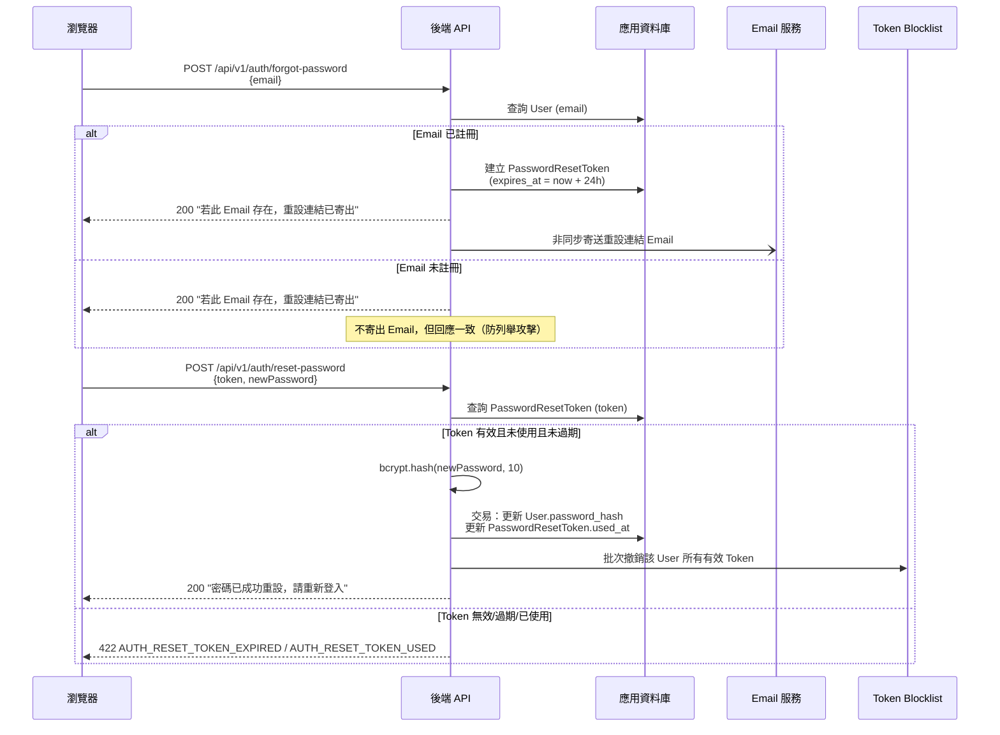
```mermaid
sequenceDiagram
    participant Browser as 瀏覽器
    participant API as 後端 API
    participant DB as 應用資料庫
    participant Email as Email 服務
    participant Blocklist as Token Blocklist

    Browser->>API: POST /api/v1/auth/forgot-password<br/>{email}
    API->>DB: 查詢 User (email)
    alt Email 已註冊
        API->>DB: 建立 PasswordResetToken<br/>(expires_at = now + 24h)
        API-->>Browser: 200 "若此 Email 存在，重設連結已寄出"
        API-)Email: 非同步寄送重設連結 Email
    else Email 未註冊
        API-->>Browser: 200 "若此 Email 存在，重設連結已寄出"
        Note over API: 不寄出 Email，但回應一致（防列舉攻擊）
    end

    Browser->>API: POST /api/v1/auth/reset-password<br/>{token, newPassword}
    API->>DB: 查詢 PasswordResetToken (token)
    alt Token 有效且未使用且未過期
        API->>API: bcrypt.hash(newPassword, 10)
        API->>DB: 交易：更新 User.password_hash<br/>更新 PasswordResetToken.used_at
        API->>Blocklist: 批次撤銷該 User 所有有效 Token
        API-->>Browser: 200 "密碼已成功重設，請重新登入"
    else Token 無效/過期/已使用
        API-->>Browser: 422 AUTH_RESET_TOKEN_EXPIRED / AUTH_RESET_TOKEN_USED
    end
```

### 5.4 連線測試流程（F015）

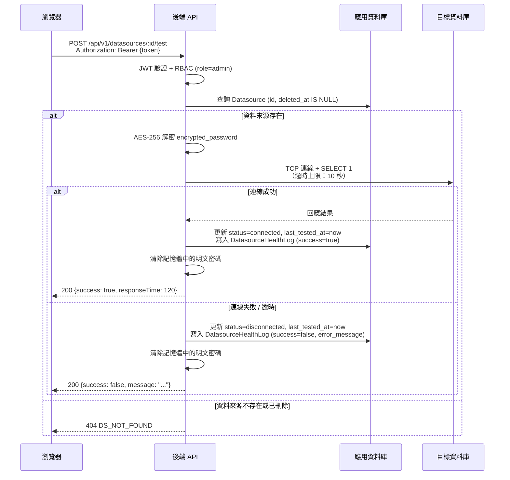
```mermaid
sequenceDiagram
    participant Browser as 瀏覽器
    participant API as 後端 API
    participant DB as 應用資料庫
    participant TargetDB as 目標資料庫

    Browser->>API: POST /api/v1/datasources/:id/test<br/>Authorization: Bearer {token}
    API->>API: JWT 驗證 + RBAC (role=admin)
    API->>DB: 查詢 Datasource (id, deleted_at IS NULL)
    alt 資料來源存在
        API->>API: AES-256 解密 encrypted_password
        API->>TargetDB: TCP 連線 + SELECT 1<br/>（逾時上限：10 秒）
        alt 連線成功
            TargetDB-->>API: 回應結果
            API->>DB: 更新 status=connected, last_tested_at=now<br/>寫入 DatasourceHealthLog (success=true)
            API->>API: 清除記憶體中的明文密碼
            API-->>Browser: 200 {success: true, responseTime: 120}
        else 連線失敗 / 逾時
            API->>DB: 更新 status=disconnected, last_tested_at=now<br/>寫入 DatasourceHealthLog (success=false, error_message)
            API->>API: 清除記憶體中的明文密碼
            API-->>Browser: 200 {success: false, message: "..."}
        end
    else 資料來源不存在或已刪除
        API-->>Browser: 404 DS_NOT_FOUND
    end
```

### 5.5 擷取任務執行流程（F021 / F023）

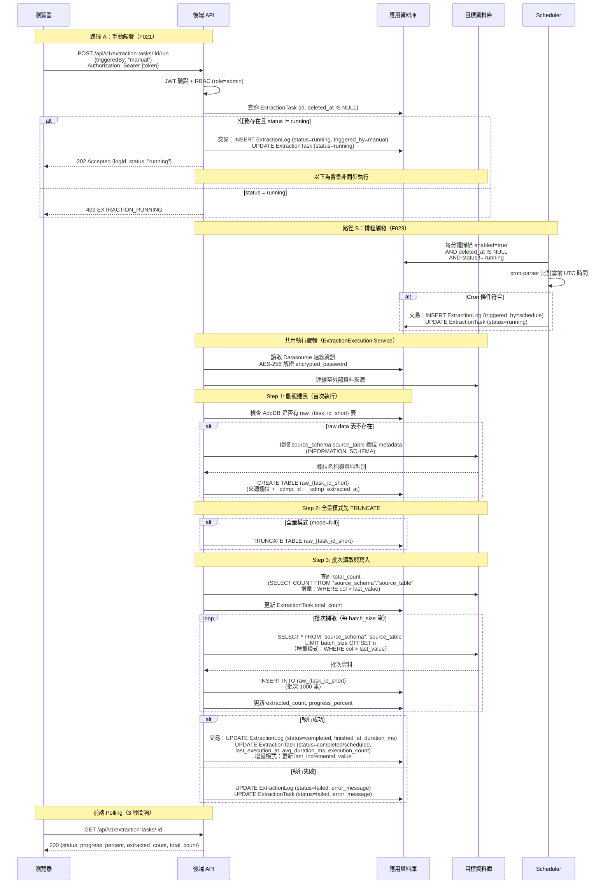
```mermaid
sequenceDiagram
    participant Browser as 瀏覽器
    participant API as 後端 API
    participant DB as 應用資料庫
    participant TargetDB as 目標資料庫
    participant Scheduler as Scheduler

    Note over Browser,API: 路徑 A：手動觸發（F021）
    Browser->>API: POST /api/v1/extraction-tasks/:id/run<br/>{triggeredBy: "manual"}<br/>Authorization: Bearer {token}
    API->>API: JWT 驗證 + RBAC (role=admin)
    API->>DB: 查詢 ExtractionTask (id, deleted_at IS NULL)
    alt 任務存在且 status != running
        API->>DB: 交易：INSERT ExtractionLog (status=running, triggered_by=manual)<br/>UPDATE ExtractionTask (status=running)
        API-->>Browser: 202 Accepted {logId, status: "running"}
        Note over API,TargetDB: 以下為背景非同步執行
    else status = running
        API-->>Browser: 409 EXTRACTION_RUNNING
    end

    Note over Scheduler,API: 路徑 B：排程觸發（F023）
    Scheduler->>DB: 每分鐘掃描 enabled=true<br/>AND deleted_at IS NULL<br/>AND status != running
    Scheduler->>Scheduler: cron-parser 比對當前 UTC 時間
    alt Cron 條件符合
        Scheduler->>DB: 交易：INSERT ExtractionLog (triggered_by=schedule)<br/>UPDATE ExtractionTask (status=running)
    end

    Note over API,TargetDB: 共用執行邏輯（ExtractionExecution Service）
    API->>DB: 讀取 Datasource 連線資訊<br/>AES-256 解密 encrypted_password
    API->>TargetDB: 連線至外部資料來源

    Note over API,DB: Step 1: 動態建表（首次執行）
    API->>DB: 檢查 AppDB 是否有 raw_{task_id_short} 表
    alt raw data 表不存在
        API->>TargetDB: 讀取 source_schema.source_table 欄位 metadata<br/>(INFORMATION_SCHEMA)
        TargetDB-->>API: 欄位名稱與資料型別
        API->>DB: CREATE TABLE raw_{task_id_short}<br/>(來源欄位 + _cdmp_id + _cdmp_extracted_at)
    end

    Note over API,TargetDB: Step 2: 全量模式先 TRUNCATE
    alt 全量模式 (mode=full)
        API->>DB: TRUNCATE TABLE raw_{task_id_short}
    end

    Note over API,TargetDB: Step 3: 批次讀取與寫入
    API->>TargetDB: 查詢 total_count<br/>(SELECT COUNT FROM "source_schema"."source_table"<br/>增量：WHERE col > last_value)
    API->>DB: 更新 ExtractionTask.total_count

    loop 批次擷取（每 batch_size 筆）
        API->>TargetDB: SELECT * FROM "source_schema"."source_table"<br/>LIMIT batch_size OFFSET n<br/>（增量模式：WHERE col > last_value）
        TargetDB-->>API: 批次資料
        API->>DB: INSERT INTO raw_{task_id_short}<br/>(批次 1000 筆)
        API->>DB: 更新 extracted_count, progress_percent
    end

    alt 執行成功
        API->>DB: 交易：UPDATE ExtractionLog (status=completed, finished_at, duration_ms)<br/>UPDATE ExtractionTask (status=completed/scheduled,<br/>last_execution_at, avg_duration_ms, execution_count)<br/>增量模式：更新 last_incremental_value
    else 執行失敗
        API->>DB: UPDATE ExtractionLog (status=failed, error_message)<br/>UPDATE ExtractionTask (status=failed, error_message)
    end

    Note over Browser,API: 前端 Polling（3 秒間隔）
    Browser->>API: GET /api/v1/extraction-tasks/:id
    API-->>Browser: 200 {status, progress_percent, extracted_count, total_count}
```

### 5.6 Pipeline 執行流程（F030 / F033）

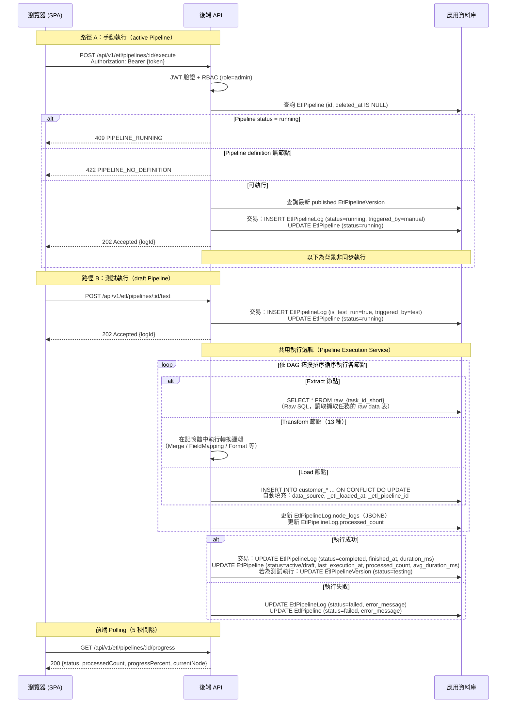
```mermaid
sequenceDiagram
    participant Browser as 瀏覽器 (SPA)
    participant API as 後端 API
    participant DB as 應用資料庫

    Note over Browser,API: 路徑 A：手動執行（active Pipeline）
    Browser->>API: POST /api/v1/etl/pipelines/:id/execute<br/>Authorization: Bearer {token}
    API->>API: JWT 驗證 + RBAC (role=admin)
    API->>DB: 查詢 EtlPipeline (id, deleted_at IS NULL)
    alt Pipeline status = running
        API-->>Browser: 409 PIPELINE_RUNNING
    else Pipeline definition 無節點
        API-->>Browser: 422 PIPELINE_NO_DEFINITION
    else 可執行
        API->>DB: 查詢最新 published EtlPipelineVersion
        API->>DB: 交易：INSERT EtlPipelineLog (status=running, triggered_by=manual)<br/>UPDATE EtlPipeline (status=running)
        API-->>Browser: 202 Accepted {logId}
        Note over API,DB: 以下為背景非同步執行
    end

    Note over Browser,API: 路徑 B：測試執行（draft Pipeline）
    Browser->>API: POST /api/v1/etl/pipelines/:id/test
    API->>DB: 交易：INSERT EtlPipelineLog (is_test_run=true, triggered_by=test)<br/>UPDATE EtlPipeline (status=running)
    API-->>Browser: 202 Accepted {logId}

    Note over API,DB: 共用執行邏輯（Pipeline Execution Service）
    loop 依 DAG 拓撲排序循序執行各節點
        alt Extract 節點
            API->>DB: SELECT * FROM raw_{task_id_short}<br/>（Raw SQL，讀取擷取任務的 raw data 表）
        else Transform 節點（13 種）
            API->>API: 在記憶體中執行轉換邏輯<br/>（Merge / FieldMapping / Format 等）
        else Load 節點
            API->>DB: INSERT INTO customer_* ... ON CONFLICT DO UPDATE<br/>自動填充：data_source, _etl_loaded_at, _etl_pipeline_id
        end
        API->>DB: 更新 EtlPipelineLog.node_logs（JSONB）<br/>更新 EtlPipelineLog.processed_count
    end

    alt 執行成功
        API->>DB: 交易：UPDATE EtlPipelineLog (status=completed, finished_at, duration_ms)<br/>UPDATE EtlPipeline (status=active/draft, last_execution_at, processed_count, avg_duration_ms)<br/>若為測試執行：UPDATE EtlPipelineVersion (status=testing)
    else 執行失敗
        API->>DB: UPDATE EtlPipelineLog (status=failed, error_message)<br/>UPDATE EtlPipeline (status=failed, error_message)
    end

    Note over Browser,API: 前端 Polling（5 秒間隔）
    Browser->>API: GET /api/v1/etl/pipelines/:id/progress
    API-->>Browser: 200 {status, processedCount, progressPercent, currentNode}
```

### 5.7 應用程式啟動生命週期（F038 新增）

F038 `OrphanRecoveryModule` 透過 NestJS `OnApplicationBootstrap` 生命週期鉤子在啟動時執行孤兒回收，並在 HTTP Server 開始接受請求前完成。

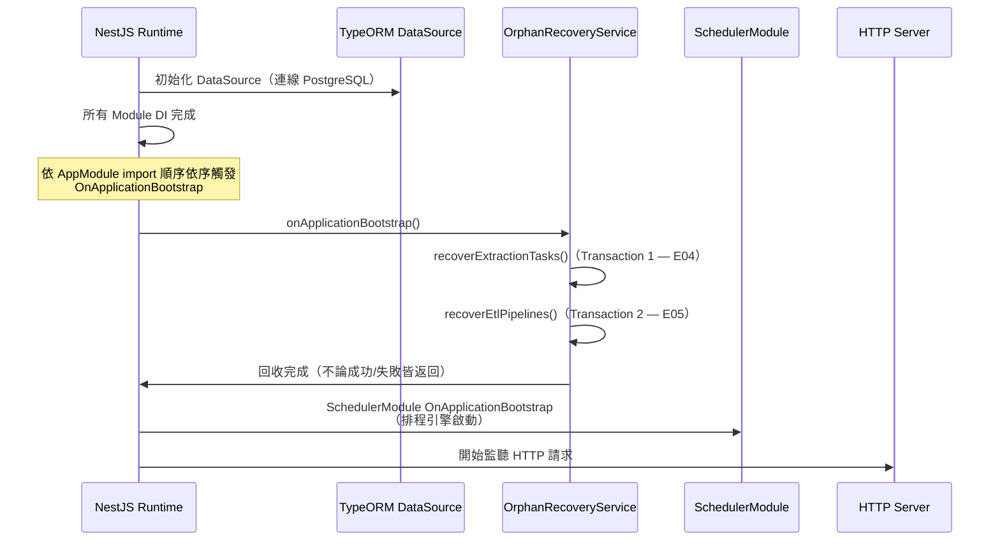
```mermaid
sequenceDiagram
    participant NestJS as NestJS Runtime
    participant ORM as TypeORM DataSource
    participant ORS as OrphanRecoveryService
    participant Sched as SchedulerModule
    participant HTTP as HTTP Server

    NestJS->>ORM: 初始化 DataSource（連線 PostgreSQL）
    NestJS->>NestJS: 所有 Module DI 完成
    Note over NestJS: 依 AppModule import 順序依序觸發<br/>OnApplicationBootstrap
    NestJS->>ORS: onApplicationBootstrap()
    ORS->>ORS: recoverExtractionTasks()（Transaction 1 — E04）
    ORS->>ORS: recoverEtlPipelines()（Transaction 2 — E05）
    ORS->>NestJS: 回收完成（不論成功/失敗皆返回）
    NestJS->>Sched: SchedulerModule OnApplicationBootstrap<br/>（排程引擎啟動）
    NestJS->>HTTP: 開始監聽 HTTP 請求
```

**關鍵設計約束**：
- `OrphanRecoveryModule` 必須在 `SchedulerModule` **之前** import，確保排程引擎首次掃描時，孤兒狀態已被修復，不會發生「孤兒任務因 `status=running` 被排程器跳過」的問題。
- `OnApplicationBootstrap` 為同步阻塞執行，回收未完成前 HTTP Server 不會啟動；若回收耗時過長（NFR-002.12 要求 < 5 秒），應記錄警告。

### 5.8 錯誤處理與韌性

| 整合點 | 失敗場景 | 處理策略 |
|--------|---------|---------|
| 目標資料庫連線測試 | 逾時 / 拒絕連線 | 10 秒強制 timeout；回傳 success=false；更新狀態為 disconnected |
| Email 服務不可用 | SMTP 連線失敗 | 回傳 SYSTEM_EMAIL_SEND_FAILED（500）；非同步寄送失敗不影響 Token 生成 |
| 應用資料庫連線失敗 | DB 不可達 | 回傳 SYSTEM_INTERNAL_ERROR（500）；錯誤記錄至 Logger（不含敏感資訊） |
| Token Blocklist 查詢失敗 | Cache/DB 不可達 | **架構挑戰**：Fail-Open（允許請求通過）vs Fail-Closed（拒絕請求）。建議 Fail-Closed 以優先安全性。詳見第 8 節。 |
| 健康檢查 Cron 失敗 | 單次執行異常 | 記錄錯誤至日誌；下次排程正常繼續；不影響前台 API |
| 目標資料庫（資料擷取） | 執行中連線斷開 / 查詢失敗 | 捕捉例外；更新 ExtractionTask.status = 'failed' 與 error_message；更新 ExtractionLog；不自動重試（AD-E04-6），須 Admin 手動重試 |
| 目標資料庫（Schema/Table 列表查詢） | 逾時 / 拒絕連線 | 10 秒逾時；回傳 503 DATASOURCE_SCHEMA_LOAD_FAILED 或 DATASOURCE_TABLE_LOAD_FAILED；前端顯示錯誤，下拉停用；不使用快取 |
| 擷取排程掃描（每分鐘） | DB 查詢失敗 | 記錄 ERROR 日誌；跳過本次掃描；下次掃描正常繼續 |
| Pipeline 執行（節點執行失敗） | Transform 邏輯錯誤 / Load 寫入失敗 | 捕捉例外；更新失敗節點的 node_logs；更新 EtlPipelineLog.status = 'failed'；更新 EtlPipeline.status = 'failed'；不自動重試，須 Admin 手動重新執行 |
| Pipeline 排程掃描（每分鐘） | DB 查詢失敗 | 記錄 ERROR 日誌；跳過本次掃描；下次掃描正常繼續 |
| 版本發布驗證（無測試執行記錄） | 前置條件不滿足 | 回傳 422 PIPELINE_PUBLISH_REQUIRES_TEST；不執行發布操作 |

### 5.9 冪等性考量

| 端點 | 冪等性 | 說明 |
|------|-------|------|
| `POST /api/v1/auth/login` | 非冪等 | 每次呼叫產生新 Token |
| `POST /api/v1/auth/logout` | 冪等 | 重複呼叫結果相同（Token 已在 Blocklist） |
| `POST /api/v1/auth/forgot-password` | 冪等（行為一致） | 回應一致；多次呼叫產生多個 PasswordResetToken（舊的仍有效，但 24h 到期） |
| `POST /api/v1/datasources/:id/test` | 冪等（副作用重複） | 可重複呼叫；每次均產生新的 HealthLog 記錄 |
| `GET /api/v1/datasources/:id/schemas` | 冪等 | 唯讀查詢，即時查詢外部資料庫，不使用快取 |
| `GET /api/v1/datasources/:id/schemas/:schema/tables` | 冪等 | 唯讀查詢，即時查詢外部資料庫，不使用快取 |
| `DELETE /api/v1/datasources/:id` | 冪等 | 重複軟刪除結果相同 |
| `POST /api/v1/extraction-tasks/:id/run` | 非冪等 | 每次呼叫建立新的 ExtractionLog；`status=running` 時拒絕（409）避免重複觸發 |
| `PATCH /api/v1/extraction-tasks/:id/toggle` | 冪等 | 停用已停用的任務回傳成功，無額外副作用 |
| `DELETE /api/v1/extraction-tasks/:id` | 冪等 | 重複軟刪除結果相同 |
| `GET /api/v1/etl/pipelines` | 冪等 | 唯讀查詢 |
| `POST /api/v1/etl/pipelines` | 非冪等 | 每次呼叫建立新 Pipeline；名稱重複時回傳 409 |
| `POST /api/v1/etl/pipelines/:id/execute` | 非冪等 | 每次呼叫建立新的 EtlPipelineLog；`status=running` 時拒絕（409）|
| `POST /api/v1/etl/pipelines/:id/test` | 非冪等 | 每次呼叫建立新的測試 EtlPipelineLog；`status=running` 時拒絕（409）|
| `PATCH /api/v1/etl/pipelines/:id/toggle` | 冪等 | 停用已停用的 Pipeline 回傳成功，無額外副作用 |
| `DELETE /api/v1/etl/pipelines/:id` | 冪等 | 重複軟刪除結果相同 |
| `PUT /api/v1/etl/pipelines/:id/definition` | 冪等 | 相同 definition 重複儲存結果相同（覆寫） |
| `PATCH /api/v1/etl/pipelines/:id/versions/:versionId/publish` | 冪等（重複發布相同版本結果相同） | 已 published 的版本重複發布無副作用 |
| `POST /api/v1/etl/pipelines/:id/versions/:versionId/rollback` | 非冪等 | 每次呼叫建立新版本 |
| `GET /api/v1/etl/target-tables` | 冪等 | 唯讀查詢，回傳靜態 Registry 資料，無 DB 查詢 |
| `GET /api/v1/etl/target-tables/:tableName/schema` | 冪等 | 唯讀查詢，回傳靜態 Registry 資料；不存在的 tableName 回傳 404 |

### 5.10 Target Table Registry API 流程（F036）

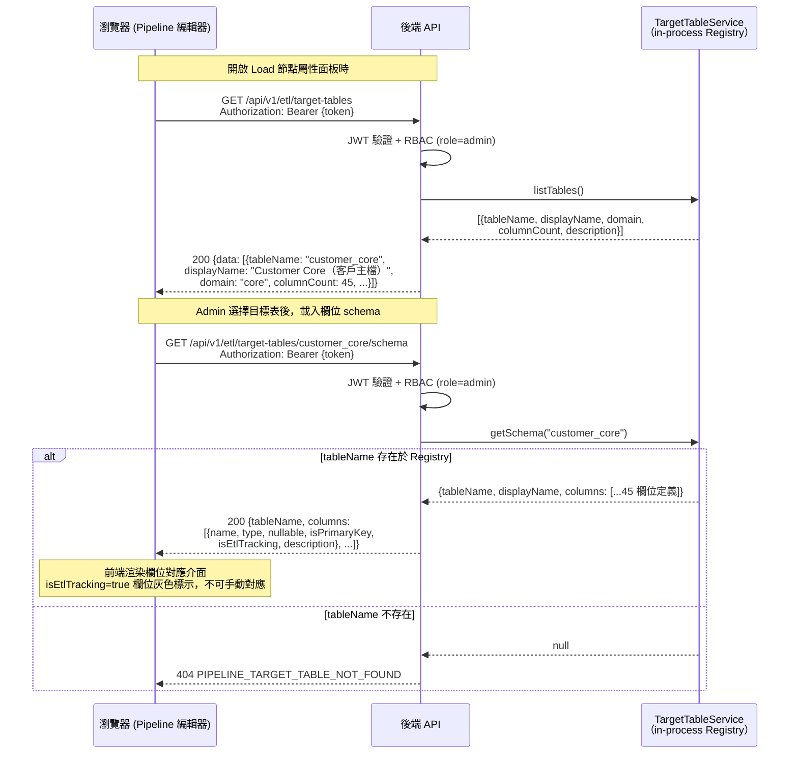
```mermaid
sequenceDiagram
    participant Browser as 瀏覽器 (Pipeline 編輯器)
    participant API as 後端 API
    participant Registry as TargetTableService<br/>（in-process Registry）

    Note over Browser,API: 開啟 Load 節點屬性面板時

    Browser->>API: GET /api/v1/etl/target-tables<br/>Authorization: Bearer {token}
    API->>API: JWT 驗證 + RBAC (role=admin)
    API->>Registry: listTables()
    Registry-->>API: [{tableName, displayName, domain,<br/>columnCount, description}]
    API-->>Browser: 200 {data: [{tableName: "customer_core",<br/>displayName: "Customer Core（客戶主檔）",<br/>domain: "core", columnCount: 45, ...}]}

    Note over Browser,API: Admin 選擇目標表後，載入欄位 schema

    Browser->>API: GET /api/v1/etl/target-tables/customer_core/schema<br/>Authorization: Bearer {token}
    API->>API: JWT 驗證 + RBAC (role=admin)
    API->>Registry: getSchema("customer_core")
    alt tableName 存在於 Registry
        Registry-->>API: {tableName, displayName, columns: [...45 欄位定義]}
        API-->>Browser: 200 {tableName, columns:<br/>[{name, type, nullable, isPrimaryKey,<br/>isEtlTracking, description}, ...]}
        Note over Browser: 前端渲染欄位對應介面<br/>isEtlTracking=true 欄位灰色標示，不可手動對應
    else tableName 不存在
        Registry-->>API: null
        API-->>Browser: 404 PIPELINE_TARGET_TABLE_NOT_FOUND
    end
```

**Load 節點執行時的 ETL 追蹤欄位自動填充**（AC-5）：

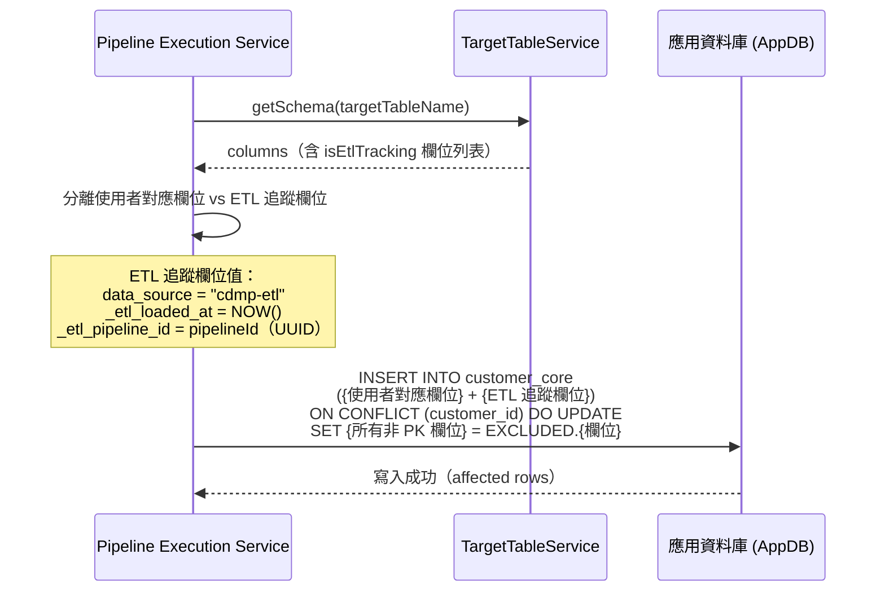
```mermaid
sequenceDiagram
    participant ExecSvc as Pipeline Execution Service
    participant Registry as TargetTableService
    participant DB as 應用資料庫 (AppDB)

    ExecSvc->>Registry: getSchema(targetTableName)
    Registry-->>ExecSvc: columns（含 isEtlTracking 欄位列表）

    ExecSvc->>ExecSvc: 分離使用者對應欄位 vs ETL 追蹤欄位
    Note over ExecSvc: ETL 追蹤欄位值：<br/>data_source = "cdmp-etl"<br/>_etl_loaded_at = NOW()<br/>_etl_pipeline_id = pipelineId（UUID）

    ExecSvc->>DB: INSERT INTO customer_core<br/>({使用者對應欄位} + {ETL 追蹤欄位})<br/>ON CONFLICT (customer_id) DO UPDATE<br/>SET {所有非 PK 欄位} = EXCLUDED.{欄位}
    DB-->>ExecSvc: 寫入成功（affected rows）
```

### 5.11 Customer 360 查詢流程（F046 / F047）

C360 模組為純唯讀消費者，不產生任何寫入操作。以下時序圖涵蓋客戶清單搜尋與 360 詳情查詢的完整流程。

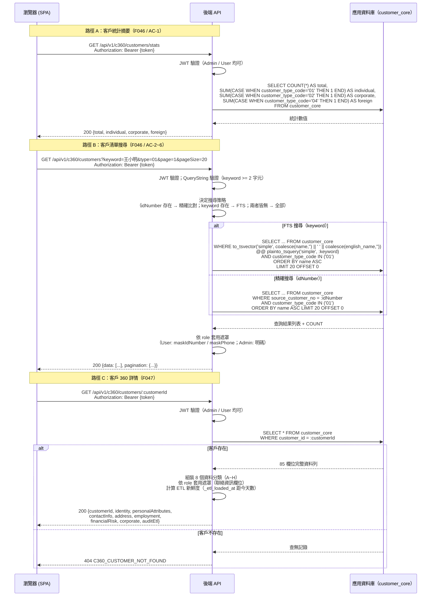
```mermaid
sequenceDiagram
    participant Browser as 瀏覽器 (SPA)
    participant API as 後端 API
    participant DB as 應用資料庫（customer_core）

    Note over Browser,API: 路徑 A：客戶統計摘要（F046 / AC-1）
    Browser->>API: GET /api/v1/c360/customers/stats<br/>Authorization: Bearer {token}
    API->>API: JWT 驗證（Admin / User 均可）
    API->>DB: SELECT COUNT(*) AS total,<br/>SUM(CASE WHEN customer_type_code='01' THEN 1 END) AS individual,<br/>SUM(CASE WHEN customer_type_code='02' THEN 1 END) AS corporate,<br/>SUM(CASE WHEN customer_type_code='04' THEN 1 END) AS foreign<br/>FROM customer_core
    DB-->>API: 統計數值
    API-->>Browser: 200 {total, individual, corporate, foreign}

    Note over Browser,API: 路徑 B：客戶清單搜尋（F046 / AC-2~6）
    Browser->>API: GET /api/v1/c360/customers?keyword=王小明&type=01&page=1&pageSize=20<br/>Authorization: Bearer {token}
    API->>API: JWT 驗證；QueryString 驗證（keyword >= 2 字元）
    API->>API: 決定搜尋策略<br/>（idNumber 存在 → 精確比對；keyword 存在 → FTS；兩者皆無 → 全部）

    alt FTS 搜尋（keyword）
        API->>DB: SELECT ... FROM customer_core<br/>WHERE to_tsvector('simple', coalesce(name,'') || ' ' || coalesce(english_name,''))<br/>@@ plainto_tsquery('simple', :keyword)<br/>AND customer_type_code IN ('01')<br/>ORDER BY name ASC<br/>LIMIT 20 OFFSET 0
    else 精確搜尋（idNumber）
        API->>DB: SELECT ... FROM customer_core<br/>WHERE source_customer_no = :idNumber<br/>AND customer_type_code IN ('01')<br/>ORDER BY name ASC LIMIT 20 OFFSET 0
    end

    DB-->>API: 查詢結果列表 + COUNT
    API->>API: 依 role 套用遮罩<br/>（User: maskIdNumber / maskPhone；Admin: 明碼）
    API-->>Browser: 200 {data: [...], pagination: {...}}

    Note over Browser,API: 路徑 C：客戶 360 詳情（F047）
    Browser->>API: GET /api/v1/c360/customers/:customerId<br/>Authorization: Bearer {token}
    API->>API: JWT 驗證（Admin / User 均可）
    API->>DB: SELECT * FROM customer_core<br/>WHERE customer_id = :customerId
    alt 客戶存在
        DB-->>API: 85 欄位完整資料列
        API->>API: 組裝 8 個資料分類（A~H）<br/>依 role 套用遮罩（聯絡資訊欄位）<br/>計算 ETL 新鮮度（_etl_loaded_at 距今天數）
        API-->>Browser: 200 {customerId, identity, personalAttributes,<br/>contactInfo, address, employment,<br/>financialRisk, corporate, auditEtl}
    else 客戶不存在
        DB-->>API: 查無記錄
        API-->>Browser: 404 C360_CUSTOMER_NOT_FOUND
    end
```

**C360 模組冪等性**

| 端點 | 冪等性 | 說明 |
|------|-------|------|
| `GET /api/v1/c360/customers/stats` | 冪等 | 唯讀查詢；結果隨 customer_core 資料而定 |
| `GET /api/v1/c360/customers` | 冪等 | 唯讀查詢；相同參數回傳相同結果 |
| `GET /api/v1/c360/customers/:customerId` | 冪等 | 唯讀查詢；不存在時固定回傳 404 |

**C360 與其他模組的執行時期關係**

C360 模組在執行時期**不依賴** Extraction 模組或 ETL Pipeline 模組。它只消費 ETL 執行後留存於 AppDB 的 `customer_core` 資料，屬於資料消費者（Read Consumer），而非資料生產者（Data Producer）。若 ETL Pipeline 尚未執行，`customer_core` 無資料，C360 的統計摘要將顯示全零，清單顯示空狀態——此為預期行為，不構成錯誤。

---

## 6. 非功能需求架構對應

### 6.1 安全性（NFR-001）

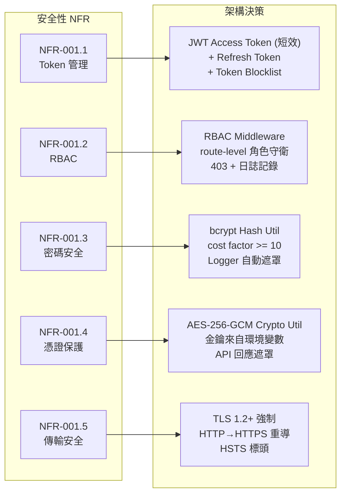
```mermaid
graph LR
    subgraph NFR["安全性 NFR"]
        N1["NFR-001.1<br/>Token 管理"]
        N2["NFR-001.2<br/>RBAC"]
        N3["NFR-001.3<br/>密碼安全"]
        N4["NFR-001.4<br/>憑證保護"]
        N5["NFR-001.5<br/>傳輸安全"]
    end

    subgraph ARCH["架構決策"]
        A1["JWT Access Token (短效)<br/>+ Refresh Token<br/>+ Token Blocklist"]
        A2["RBAC Middleware<br/>route-level 角色守衛<br/>403 + 日誌記錄"]
        A3["bcrypt Hash Util<br/>cost factor >= 10<br/>Logger 自動遮罩"]
        A4["AES-256-GCM Crypto Util<br/>金鑰來自環境變數<br/>API 回應遮罩"]
        A5["TLS 1.2+ 強制<br/>HTTP→HTTPS 重導<br/>HSTS 標頭"]
    end

    N1 --> A1
    N2 --> A2
    N3 --> A3
    N4 --> A4
    N5 --> A5
```

| NFR | 架構決策 | 實作位置 |
|-----|---------|---------|
| NFR-001.1 Token 管理 | JWT 短效 Access Token（8h/30d）+ Refresh Token；Token Blocklist 支援強制失效 | JWT Util、Auth 模組、Middleware |
| NFR-001.2 RBAC | 路由層級的角色守衛中介層；支援 2 種角色（admin / user）；未授權回傳 403 並記錄至日誌 | RBAC Middleware |
| NFR-001.3 密碼安全 | bcrypt（cost >= 10）；Logger 自動遮罩密碼欄位；明文密碼絕不持久化 | Hash Util、Logger |
| NFR-001.4 憑證保護 | AES-256-GCM 加密儲存；金鑰從環境變數讀取；API 序列化層排除 `encrypted_password` 欄位；回傳遮罩字串 `****` | Crypto Util、Datasource Service、DTO 序列化層 |
| NFR-001.5 傳輸安全 | 強制 TLS 1.2+；HTTP 請求重導至 HTTPS；設定 HSTS 標頭；CORS 白名單（OQ-12） | 反向代理（Nginx/等）配置、後端中介層 |

**額外安全措施**（規格書中隱含）：
- API 路徑使用 `/api/v1/` 前綴（OQ-13 決議）
- Rate Limiting：登入端點 5 次/分鐘/IP（OQ-5 決議）
- 所有回應排除 Stack Trace；500 錯誤使用通用訊息
- 多 JWT Secret 並行支援無停機輪替（OQ-11 決議）

### 6.2 效能（NFR-002）

| NFR | 目標值 | 架構決策 |
|-----|--------|---------|
| NFR-002.1 API 回應時間 | p95 < 500ms | 資料庫索引（見 4.4）；避免 N+1 查詢；分頁強制執行 |
| NFR-002.2 並發使用者 | >= 100 人 | Modular Monolith 可於單機處理；JWT 無狀態驗證減少 DB 查詢；Token Blocklist 建議使用高效能存儲（Redis 或帶索引的 DB） |
| NFR-002.3 連線測試逾時 | <= 10 秒 | Datasource Service 強制 10 秒 TCP 連線 Timeout；每次測試使用獨立短期連線 |
| NFR-002.4 儀表板載入（資料來源） | < 2 秒（50 資料來源） | `datasource_health_logs` 上的複合索引（datasource_id, checked_at）；Dashboard Service 使用聚合查詢而非應用層計算；前端 Polling 間隔 30 秒（避免頻繁請求） |
| NFR-002.5 清單搜尋效能 | < 500ms（1,000 筆） | 分頁強制執行（預設 20 筆/頁）；搜尋欄位建立索引；`deleted_at IS NULL` 條件搭配索引 |
| NFR-002.6 擷取儀表板載入 | < 2 秒（50 任務） | ExtractionLog 上的 `(task_id, started_at)` 與 `(status, started_at)` 複合索引；今日統計使用 DB 聚合查詢（`DATE_TRUNC`）而非應用層計算；趨勢圖使用 `DATE_TRUNC` 聚合 |
| NFR-002.7 擷取任務清單 | < 500ms（1,000 筆） | 分頁強制執行（預設 10 筆/頁）；`(status, deleted_at)` 複合索引；搜尋欄位索引 |
| NFR-002.8 Pipeline 列表載入 | < 2 秒（F027） | `(status, deleted_at)` 複合索引；分頁強制執行（預設 10 筆/頁）；統計查詢（today processed）使用 DB 聚合（`DATE_TRUNC`，UTC+8 邊界換算） |
| NFR-002.9 Pipeline 執行進度查詢 | p95 < 500ms | EtlPipelineLog 主鍵查詢；`(pipeline_id, started_at)` 複合索引；前端 5 秒 Polling |
| NFR-002.10 Pipeline 版本 Diff | < 2 秒 | Diff 在應用層計算（比對兩個 JSONB definition）；版本數量有限（典型 < 50 版），應用層計算可接受 |
| NFR-002.12 孤兒回收耗時（F038） | < 5 秒 | `OrphanRecoveryService` 使用批次 QueryBuilder（`WHERE id IN (...)`）取代逐筆更新；典型場景（0 ~ 數筆孤兒）耗時可忽略不計；若耗時超過 5 秒，Logger 應記錄警告供後續調查 |
| NFR-002.13 C360 清單查詢（F046） | < 500ms（1,000 筆以內） | GIN 索引加速 FTS；`customer_type_code` INDEX 加速類型篩選；`source_customer_no` UNIQUE INDEX 加速精確搜尋；分頁強制執行（預設 20 筆/頁，最大 100 筆） |
| NFR-002.14 C360 統計摘要（F046） | < 500ms | `customer_core` 全表 COUNT + 條件 SUM；資料量 MVP 規模（≤ 1,000 筆）可於索引掃描完成 |
| NFR-002.15 C360 客戶詳情（F047） | < 1 秒 | `customer_id` PRIMARY KEY 點查詢；無 JOIN；85 欄位序列化為 JSON 為主要耗時 |

**效能風險**：
- `DatasourceHealthLog` 隨時間增長（每 30 分鐘 × 資料來源數），90 天保留期需確保 Cleanup Cron 正常執行，否則查詢效能將逐漸下降。
- `ExtractionLog` 保留 30 天（AQ-10 決議），Cleanup Cron 確保不會無限增長。
- `EtlPipelineLog` 保留 30 天（AQ-14 決議），若 Pipeline 執行頻繁（多個排程 Pipeline 每小時執行），Log 數量增長需 Cleanup Cron 正常運行。
- Pipeline Transform 節點在記憶體中執行，大型資料集（數百萬筆）的 Transform 可能導致記憶體壓力。MVP 規模下建議設定合理的 Extract 節點查詢上限。

### 6.3 可用性與可觀測性

| 面向 | 架構決策 |
|------|---------|
| 可用性 | MVP 單機部署；HTTPS 由反向代理（Nginx 等）終止；後端進程崩潰需 Process Manager（PM2 等）自動重啟 |
| 日誌（Logging） | 結構化日誌（JSON 格式建議）；敏感欄位自動遮罩；區分 INFO / WARN / ERROR 等級；錯誤包含 request ID 追蹤 |
| 健康端點 | 建議提供 `GET /api/health` 端點，供 Load Balancer / 部署平台健康檢查 |
| 監控 | MVP 階段最低需求：應用程式日誌集中收集；若部署雲端，利用雲端原生監控 |
| 擷取任務孤立狀態偵測 | 若後端 Process 在擷取執行中崩潰，ExtractionLog 將保持 `status=running`。Cleanup Cron 的孤立 running 修復邏輯（AD-E04-7）每日偵測並標記超過 2 小時的孤立記錄為 `failed` |

### 6.4 可維護性

| 面向 | 架構決策 |
|------|---------|
| 模組邊界 | 各模組透過服務介面互動，禁止跨模組直接存取資料庫 Repository |
| API 版本控制 | 路由使用 `/api/v1/` 前綴（OQ-13），為未來版本升級預留空間 |
| 設定管理 | 所有環境相關設定（DB 連線字串、JWT Secret、AES 金鑰）透過環境變數注入，不硬編碼 |
| Monorepo | 前後端同一 Repository（OQ-3 決議），統一 CI/CD 流程 |

---

## 7. 部署與執行時期視圖

### 7.1 部署單元

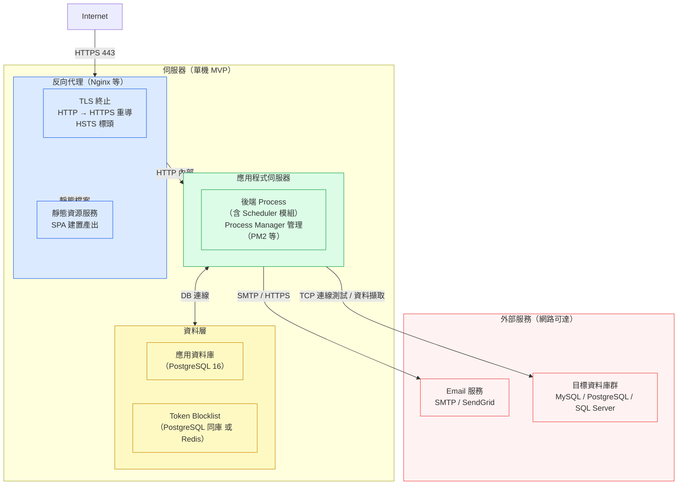
```mermaid
graph TB
    subgraph Server["伺服器（單機 MVP）"]
        subgraph ReverseProxy["反向代理（Nginx 等）"]
            TLSTermination["TLS 終止<br/>HTTP → HTTPS 重導<br/>HSTS 標頭"]
            StaticServe["靜態資源服務<br/>SPA 建置產出"]
        end

        subgraph AppServer["應用程式伺服器"]
            BackendProcess["後端 Process<br/>（含 Scheduler 模組）<br/>Process Manager 管理（PM2 等）"]
        end

        subgraph DataLayer["資料層"]
            AppDatabase["應用資料庫<br/>（PostgreSQL 16）"]
            TokenStore["Token Blocklist<br/>（PostgreSQL 同庫 或 Redis）"]
        end
    end

    subgraph External["外部服務（網路可達）"]
        EmailService["Email 服務<br/>SMTP / SendGrid"]
        TargetDatabases["目標資料庫群<br/>MySQL / PostgreSQL / SQL Server"]
    end

    Internet -->|"HTTPS 443"| ReverseProxy
    ReverseProxy -->|"HTTP 內部"| AppServer
    ReverseProxy -->|"靜態檔案"| StaticServe
    AppServer <-->|"DB 連線"| DataLayer
    AppServer -->|"SMTP / HTTPS"| EmailService
    AppServer -->|"TCP 連線測試 / 資料擷取"| TargetDatabases

    classDef proxy fill:#dbeafe,stroke:#2563eb
    classDef app fill:#dcfce7,stroke:#16a34a
    classDef data fill:#fef9c3,stroke:#ca8a04
    classDef external fill:#fef2f2,stroke:#ef4444
    class ReverseProxy,TLSTermination,StaticServe proxy
    class AppServer,BackendProcess app
    class DataLayer,AppDatabase,TokenStore data
    class External,EmailService,TargetDatabases external
```

### 7.2 環境分離

| 環境 | 用途 | 建議配置 |
|------|------|---------|
| Development | 本地開發 | 本機 DB；Mock Email 服務（如 Mailhog）；Docker Compose 啟動相依服務 |
| Test / CI | 自動化測試 | 獨立測試 DB（每次 CI 重建）；Mock 外部服務；執行 Unit + Integration Test |
| Production | 正式環境 | 企業內網或私有雲；HTTPS 強制；真實 Email 服務；DB 備份策略 |

### 7.3 擴展模型

| 情境 | 擴展策略 |
|------|---------|
| MVP（並發 <= 100 人） | 單機部署，垂直擴展（升級硬體規格） |
| 未來水平擴展（Phase 2+） | 多後端實例需：Token Blocklist 使用 Redis（跨實例共享）；Scheduler 引入分散式鎖（避免重複健康檢查與重複擷取觸發）；Session 無狀態（JWT 已滿足）；擷取並發控制需升級為資料庫 row-level lock 或分散式鎖（避免 status 競爭條件） |

### 7.4 設定與密鑰管理

所有敏感設定必須透過環境變數注入，禁止出現在程式碼或版本控制中：

| 設定項目 | 說明 |
|---------|------|
| `DATABASE_URL` | 應用資料庫連線字串 |
| `JWT_SECRET` | JWT 簽章 Secret（支援多個以逗號分隔，供輪替用） |
| `AES_ENCRYPTION_KEY` | AES-256 加密金鑰（Base64 編碼，256-bit） |
| `EMAIL_SMTP_HOST/PORT/USER/PASS` 或 `SENDGRID_API_KEY` | Email 服務設定 |
| `TOKEN_BLOCKLIST_REDIS_URL` | Token Blocklist Redis 連線（若使用 Redis） |
| `APP_BASE_URL` | 前端應用 URL（用於產生密碼重設連結） |

**Secret 輪替流程**（JWT Secret，OQ-11 決議）：
1. 新增新 Secret 至環境變數（保留舊 Secret）
2. 部署後端（JWT Util 支援多 Secret 並行驗證）
3. 等待所有現有 Token 到期（最多 30 天）
4. 移除舊 Secret

### 7.5 資料庫初始化

系統部署時需透過 Seed 機制建立至少一個 Admin 帳號（規格書假設 A1）：

```
Seed 流程：
1. 執行 Schema Migration
2. 檢查是否存在任何 Admin 帳號
3. 若不存在，建立預設 Admin（帳號資訊透過環境變數注入，非硬編碼）
4. 記錄 Seed 執行結果至日誌
```

---

## 8. 風險、取捨與替代方案

### 8.1 架構風險

#### 風險 1：Token Blocklist 查詢失敗時的 Fail-Open 問題

**描述**：若 Token Blocklist 存儲（Redis 或 DB）暫時不可用，中介層需決定是允許請求通過（Fail-Open）或拒絕（Fail-Closed）。

**影響**：Fail-Open 可能讓已登出的 Token 短暫重新有效，造成安全漏洞。Fail-Closed 可能導致系統整體不可用（可用性問題）。

**建議**：採用 Fail-Closed 策略，優先保障安全性。監控 Blocklist 存儲的可用性，建立告警機制。

**替代方案**：使用短效 Access Token（8h）減少 Blocklist 查詢頻率；大多數請求的 Token 到期後自動失效，Blocklist 只需在 Token 未到期時強制失效。

---

#### 風險 2：Scheduler 多實例重複執行

**描述**：MVP 為單機部署，Scheduler 無問題。但若未來水平擴展，多個後端實例將各自啟動 Scheduler，導致每 30 分鐘對同一資料來源執行多次健康檢查，以及每分鐘重複觸發擷取任務（擷取排程掃描的 `status != 'running'` 檢查存在競爭條件）。

**影響**：DatasourceHealthLog 產生重複記錄；目標資料庫接受多餘連線；擷取任務可能被多實例同時觸發。

**建議**：MVP 階段忽略此問題。水平擴展前引入分散式鎖（Redis SET NX EX）或改用獨立排程服務（如 BullMQ、Celery）。

**F038 的部分緩解**：F038 `OrphanRecoveryModule` 在單機架構下能有效處理進程崩潰後遺留的孤兒任務，確保重啟後排程器不會因 `status=running` 而跳過已中斷的任務。然而，F038 本身依賴單一進程假設（啟動時無其他執行中進程），在多副本部署時無法提供保護，反而可能造成多個實例同時執行回收邏輯（詳見風險 10）。

---

#### 風險 3：Email 服務可用性影響密碼重設流程

**描述**：密碼重設（F009）依賴外部 Email 服務，若 Email 服務不可用，使用者無法接收重設連結。

**影響**：使用者被鎖定，需聯絡 Admin 透過 F010 重設密碼。

**建議**：Email 寄送為非同步操作（不阻塞 API 回應）；記錄 Email 寄送失敗至日誌；考慮引入 Email 重試機制（指數退避）。

---

#### 風險 4：AES 加密金鑰遺失

**描述**：若 `AES_ENCRYPTION_KEY` 遺失，所有已儲存的資料來源密碼將無法解密，導致連線測試與資料擷取全數失敗。

**影響**：所有資料來源連線失效，需逐一重新輸入密碼。

**建議**：加密金鑰存放於安全的密鑰管理系統（企業內部可使用 HashiCorp Vault、AWS KMS 等），並建立金鑰備份程序。

---

#### 風險 5：非同步擷取執行的孤立 Running 狀態

**描述**：F021 採用 Promise-based 背景執行。若 Node.js Process 崩潰（OOM、硬體故障等），正在執行的擷取任務的 ExtractionLog 將永遠保持 `status=running`，`finished_at` 為 null。此孤立狀態會導致排程引擎跳過該任務（因為 `status=running`），且前端儀表板顯示永不完成的任務。

**影響**：受影響的任務無法被排程引擎自動重觸發；Admin 需手動識別並重新執行。

**建議**：Cleanup Cron 新增孤立 running 日誌修復邏輯（AD-E04-7）：將 `started_at < NOW() - 2 hours AND finished_at IS NULL` 的 ExtractionLog 標記為 `failed`，並同步更新對應 ExtractionTask.status。

---

#### 風險 6（E05 新增）：Pipeline Transform 記憶體消耗

**描述**：Pipeline Execution Service 在 Node.js 記憶體中執行所有 Transform 節點（Merge、Aggregate、Deduplicate 等）。若 Extract 節點載入數十萬筆 raw data，應用伺服器的 Heap 記憶體可能急遽上升，導致 OOM（Out of Memory）崩潰。

**影響**：Pipeline 執行失敗；若 Process 崩潰（OOM Kill），EtlPipelineLog 留下孤立 `status=running` 狀態，需 Cleanup Cron 修復。

**建議**：
- MVP 階段建立 Extract 節點的查詢筆數上限（建議 100,000 筆，可透過環境變數 `PIPELINE_MAX_EXTRACT_ROWS` 配置）
- 監控 Node.js Heap 使用量（PM2 metrics 或 cloud monitoring）
- 若未來需處理百萬筆資料，考慮升級為 Worker Thread 或獨立 Worker Process（Phase 2）

---

#### 風險 7（E05 新增）：Pipeline 排程與 Extraction 排程的競爭條件

**描述**：Pipeline Scheduler Cron 與 Extraction Scheduler Cron 均每分鐘執行，若兩個 Cron Job 在同一分鐘同時觸發大量任務，可能造成 DB 連線池壓力與 Node.js Event Loop 擁塞。

**影響**：API 請求延遲增加；Cron Job 本身執行時間超過一分鐘導致下次觸發重疊。

**建議**：MVP 階段不使用連線池（OQ-R9 決議），短暫高峰可接受。水平擴展前需評估引入 `pg-pool` 或 Prisma 連線池管理。

---

#### 風險 8（E05 新增）：Pipeline 孤立 running 狀態（Process 崩潰）

**描述**：與擷取任務孤立問題類似（風險 5），若 Node.js Process 在 Pipeline 執行中崩潰，EtlPipelineLog 將保持 `status=running`，導致排程無法再次觸發（掃描條件 `status != 'running'`）。

**影響**：受影響的 Pipeline 無法被排程觸發；Admin 需手動識別並重新執行。

**建議**：Cleanup Cron 的孤立修復邏輯（AD-E05-2）：每日偵測 `started_at < NOW() - 2 hours AND finished_at IS NULL` 的 EtlPipelineLog 並標記為 `failed`，同步更新 EtlPipeline.status。

---

#### 風險 10（F038 新增）：孤兒回收機制的單進程架構假設

**描述**：`OrphanRecoveryModule.onApplicationBootstrap()` 假設執行時系統中不存在其他正在運行的任務進程（即啟動即表示前一個進程已完全終止）。若未來採用多副本部署（水平擴展），多個實例同時啟動時將各自執行回收邏輯，對同一批孤兒任務進行重複更新（雖然結果冪等，不會造成資料錯誤，但存在不必要的競爭寫入）；更嚴重的是，若某個副本在另一個副本仍在執行任務時崩潰並重啟，回收邏輯可能錯誤地將仍在執行中（由其他副本負責）的任務標記為 `failed`。

**影響**：多副本部署下，孤兒回收可能誤傷正在執行中的任務，造成任務執行中斷與狀態不一致。

**建議**：MVP 單機部署不受影響。水平擴展前需將 `OrphanRecoveryModule` 改為基於**超時判斷**（`started_at < NOW() - 2 hours`，與 Cleanup Cron 的邏輯一致）或引入**分散式鎖**（Redis SET NX EX）確保只有一個實例執行回收。

---

#### 風險 12（E06 新增）：customer_core Schema Drift 影響 C360 查詢

**描述**：`customer_core` 目標表由 ETL Pipeline（E05）的 Migration 與 Load 節點管理。若 ETL 團隊在未通知 C360 模組維護者的情況下，對 `customer_core` 執行欄位改名、型別變更或刪除欄位，`CustomerCoreRepository` 中的 Raw SQL / QueryBuilder 查詢將在執行時期報錯（PostgreSQL column does not exist），導致 C360 API 回傳 500 錯誤。

**影響**：C360 清單與詳情 API 全面失效；使用者無法查詢客戶資料；需緊急修復 `CustomerCoreRepository` 查詢語法。

**建議**：
- 在開發初期建立 `customer_core` Schema 的文件化 Contract（欄位名稱、型別、nullable 狀態），C360 模組依此 Contract 撰寫查詢
- ETL Pipeline 的任何 Schema Migration 在合併前，需由 C360 模組維護者 Review（跨模組 PR 審查規則）
- 考慮在 CI Pipeline 中加入 C360 Integration Test，在測試環境執行真實查詢，當 `customer_core` Schema 變更時即早發現查詢失效

**替代方案**：若 Schema Drift 風險被評估為高，可建立 `customer_core_schema_version` 設定值，C360 啟動時驗證 Schema 版本是否符合預期。

---

#### 風險 13（E07 M02 計分設定擴充新增）：ob_tier UNIQUE INDEX 未建立導致 Fallback/Standard 互斥失效

**描述**：`ob_tier` 複合唯一鍵 `UNIQUE INDEX ON ob_tier (card_type, COALESCE(card_level, ''))` 由 migration 以 raw SQL 建立（entity 檔案 line 9 說明：TypeORM `@Index` 不支援 `COALESCE` 表達式）。若此索引未在實際執行的 migration 中建立，則同一 `(card_type, card_level)` 組合可重複寫入，導致 F056 `TIER_LEVEL_DUPLICATE` 保護失效，且 Stage 2 `ob_tier` join 查詢可能取得多筆結果（非確定性）。

**影響**：`ob_tier` 寫入重複紀錄；月跑 Stage 2 TIER_LEVEL 對應結果非確定性；資料一致性受損。

**建議**：TDD Developer 在實作前必須確認現有 `ob_tier` migration 是否已包含 raw SQL `UNIQUE INDEX` 語句（非透過 `@Index` 裝飾器）；若未建立，需在 D-CT-01 附近的 migration 中補建。

---

#### 風險 14（E07 M02 計分設定擴充新增）：D-CT-03 CHECK constraint 早於 TIER_LEVEL 轉換 UPDATE 執行

**描述**：Migration D-CT-03（為 `ob_tier.tier_level` 加 CHECK constraint）依賴 D3 migration（OBTIER → ob_tier 遷移）與 TIER_LEVEL 後綴值轉換 UPDATE 全部完成後才能執行。若 TypeORM migration 執行順序因時間戳記設定錯誤導致 D-CT-03 早於 D3 執行，則 D3 INSERT 時舊後綴值（如 `T1M`、`T1HM`）將違反 CHECK constraint，整批 migration 失敗。

**影響**：Production 環境 migration 失敗；需手動 rollback 並修正 migration 順序後重新執行。

**建議**：D-CT-03 migration 的時間戳記必須晚於 D3（OBTIER 遷移）+ TIER_LEVEL UPDATE + M3/HC/C3 seed 三個 migration 的時間戳記；建議在 D-CT-03 migration 開頭加入 pre-condition guard（執行 D11 驗證 SQL，若有違規行直接 throw Error 中止 migration）。

---

#### 風險 15（E07 M02 計分設定擴充新增）：CHECK constraint 語法在 SQLite E2E 環境不相容

**描述**：`ob_card_type.card_type` 的 regex CHECK（`card_type ~ '^[A-Z0-9]{1,5}$'`）使用 PostgreSQL 專有 `~` 運算子，SQLite 不支援。若 TypeORM migration 未以 `process.env.DB_TYPE` 條件分支，E2E 測試（SQLite）執行 migration 時將拋出語法錯誤。

**影響**：所有 F069~F072 相關的 E2E 測試無法建表，導致整個 E2E 測試套件失敗。

**建議**：TypeORM migration 中所有 PostgreSQL 專有語法（regex CHECK、`NULLS NOT DISTINCT` 等）必須以 `process.env.DB_TYPE === 'sqlite'` 判斷條件分支；SQLite 版本省略該 constraint，由應用層保證格式正確性。

---

#### 風險 16（E07 M02 計分設定擴充新增）：ob_list_definition 無 card_type 索引導致 F072 preview 查詢效能問題

**描述**：F072 刪除預覽端點需執行 `SELECT COUNT(*) FROM ob_list_definition WHERE card_type = :ct AND status = 'active'`。若 `ob_list_definition.card_type` 無索引，此查詢需 full table scan。

**影響**：MVP 資料量（`ob_list_definition` 數百筆）下影響可忽略（< 5ms）；若未來資料量增長至數萬筆，preview 端點回應時間可能超過 500ms。

**建議**：MVP 可接受；若 `ob_list_definition` entity 目前無 `card_type` 索引，P2 階段補建。

---

#### 風險 11（F036 新增）：來源欄位結構假設與實際不符

**描述**：`customer_core` 的 45 個欄位定義（US-049）基於對 ZZIP_BAMCUST_M 與 MLMCUSTOMER 兩個來源表的欄位假設（如欄位名稱、資料型別、佔位值格式）。若實際來源表的欄位與假設不符（如欄位改名、型別不同、佔位值格式差異），ETL Transform 節點的轉換規則將產生錯誤或無效輸出。

具體高風險點包括：
- `MLMC.CUSTNOWCAPTIAL` / `CUSTCREATECAPTIAL` 的 varchar 值是否都能合法轉為 DECIMAL（可能含文字說明如「未填寫」）
- 電話欄位佔位值格式：假設為 `00-0000000000`，實際格式需以真實資料確認
- `ZZIP.CUSTO_NO` 與 `MLMC.CUSTID` 的值格式是否一致（Merge 鍵的準確性）

**影響**：TypeCast 節點執行時拋出型別轉換例外，導致 Pipeline 執行失敗；或 Merge 節點因鍵格式不一致產生重複客戶記錄。

**建議**：
- 開發前執行來源表欄位 Profile（`INFORMATION_SCHEMA` 查詢）確認欄位存在性與型別
- 對 varchar→DECIMAL 欄位執行資料品質掃描（`COUNT(*) WHERE column NOT REGEXP '^[0-9.]+$'`）
- 以實際資料樣本確認電話佔位值格式與 Merge 鍵格式
- TypeCast 節點加入錯誤容忍機制（無效值轉換為 NULL 而非拋出例外，可透過 `NullHandler` 節點前置處理）

---

#### 風險 9（E05 原有）：目標資料庫大量資料擷取的負載影響

**描述**：擷取任務（全量模式）執行時，對外部資料來源執行全表查詢（`SELECT * FROM "{source_schema}"."{source_table}"`），並將資料批次寫入 AppDB raw data 表。對於大型表（數百萬筆），此查詢可能對外部資料來源造成顯著負載，甚至影響其正常業務查詢。同時，大量批次 INSERT 至 AppDB 也會佔用資料庫資源。

**影響**：目標資料庫效能下降；若目標資料庫為生產系統，可能影響業務連續性。

**建議**：
- 擷取使用可配置的 `batch_size`（預設 1000，範圍 100-10000）分批讀取（AQ-11 決議）
- 建議在低峰時段設定 cron 排程
- 增量模式可顯著降低此風險（規格書已提供 `incremental` 模式）
- 擷取連線使用獨立短期連線，不占用應用程式連線池

---

### 8.2 已評估但放棄的替代方案

| 方案 | 放棄理由 |
|------|---------|
| Microservices 架構 | 使用者規模 500 人、MVP 階段，Microservices 的網路複雜度、服務發現、分散式追蹤等成本遠超收益 |
| Server-Side Rendering（SSR）前端 | 規格書假設 A6 明確為 SPA；Admin 後台需豐富互動（儀表板、即時更新），SSR 不適合 |
| WebSocket（儀表板即時更新） | OQ-9 已決議採用 Polling（30 秒間隔）。WebSocket 需要持久連線管理，在監控場景中 Polling 的延遲可接受 |
| 不使用 Token Blocklist（純 JWT 到期） | NFR-001.1 明確要求 Token 可主動失效（登出、帳號停用、密碼重設）；純到期機制無法滿足 |
| 使用 Cookie Session（非 JWT） | 規格書 F001 明確定義 JWT Token 機制；Phase 2 SSO 整合（OQ-R3）需要 JWT 相容性 |
| Redis 作為主要 Token Blocklist | MVP 不強制引入 Redis（增加依賴），以應用資料庫的 TokenBlocklist 表替代；若效能不足可升級 |
| BullMQ + Redis 作為擷取任務佇列 | 引入 Redis 強依賴；MVP 擷取任務數量有限，Promise-based 非同步足夠；BullMQ 的持久化佇列與重試機制雖有益，但超出 MVP 複雜度預算 |
| 每個擷取任務使用獨立動態 Cron Job | 任務數量變動時維護複雜（需追蹤每個 Job 的 reference）；不如「每分鐘掃描 + cron-parser 比對」模式穩定；F023 BR-1 明確定義固定頻率掃描方案 |
| Pipeline 定義使用正規化關聯表（節點表 + 連線表） | 13 種節點類型各有不同設定欄位，正規化需大量 JOIN 且擴展困難；JSONB 儲存允許彈性結構，版本 Diff 在應用層計算即可 |
| Pipeline 執行使用 Worker Thread / Worker Process | 對 I/O 密集的 Transform 操作不必要（CPU 密集才需要 Worker Thread）；增加 IPC（Inter-Process Communication）複雜度；MVP 規模不合理 |
| Pipeline 視覺化編輯器使用後端渲染 | 拖拉畫布需要豐富的前端互動，規格書 F029 明確建議 React Flow（前端庫）；後端無法實現拖拉式 UX |
| Pipeline 版本 Diff 使用資料庫層計算 | PostgreSQL JSONB Diff 需複雜 SQL 函數；應用層 JSON 比對更直觀且可維護；版本數有限，應用層計算效能可接受 |
| C360 搜尋使用 Elasticsearch | MVP 資料量（≤ 1,000 筆）遠低於 Elasticsearch 的適用門檻（通常百萬筆以上）；引入額外系統依賴（部署、維運、記憶體）完全不合理；PostgreSQL FTS + GIN 索引已足以滿足 NFR |
| C360 使用 TypeORM Entity 管理 customer_core | `customer_core` 由 ETL Pipeline 以動態 SQL 管理，若同時建立 TypeORM Entity，將產生雙重管理責任，Schema Migration 與 Entity 定義容易失去同步；選擇 Raw SQL 抽象層（CustomerCoreRepository）更符合單一職責原則 |
| C360 遮罩邏輯實作為 Middleware / Interceptor | Interceptor 需要攔截所有 API 回應，難以針對特定欄位（sourceCustomerNo、mobilePhone）和特定角色精確套用規則；Service 層硬編碼更直觀，且遮罩邏輯可獨立測試 |

### 8.3 需要驗證的領域

| 項目 | 風險等級 | 說明 |
|------|---------|------|
| Token Blocklist 查詢效能 | 中 | 每個 API 請求均查詢 Blocklist，需確認在 100 人並發下的查詢延遲（建議早期進行負載測試） |
| 連線測試並發安全性 | 中 | F016「Refresh All」觸發平行連線測試，50 個資料來源同時測試的資源消耗需驗證 |
| Email 非同步可靠性 | 低-中 | 非同步 Email 寄送的重試機制需定義（目前規格書未明確） |
| AES-256-GCM 實作正確性 | 高 | 加密金鑰管理與 IV（Initialization Vector）處理需要安全性審查 |
| 擷取任務並發數量 | 中 | 多個大型擷取任務同時執行時，Node.js Event Loop 的 I/O 吞吐量與記憶體使用需驗證 |
| Pipeline Transform 記憶體上限 | 高 | Transform 節點在記憶體中執行，100,000 筆資料的 Merge/Aggregate 操作的記憶體峰值需在開發初期量測，並設定合理上限 |
| Pipeline + Extraction 排程同時觸發 | 中 | 兩個每分鐘 Cron Job 同時觸發大量任務的 DB 連線壓力與 Event Loop 影響需驗證 |
| JSONB definition Diff 效能 | 低 | 版本 Diff 在應用層計算，典型 Pipeline 節點數量（< 20）效能可預期；若版本差異極大需確認回應時間 |

---

## 9. 待決事項

> 以下問題在撰寫本架構規格書時識別，需要在開發開始前確認。

### 9.1 架構層級待決事項

| # | 問題 | 影響範圍 | 建議方向 | 決策期限 |
|---|------|---------|---------|---------|
| AQ-1 | Access Token 儲存位置：`localStorage` 或 `httpOnly Cookie`？ | F001, F002, F003，前端整體安全性 | 建議 `httpOnly Cookie`（避免 XSS 風險），但需處理 CORS 和 CSRF 防護 | 開發前確認 |
| AQ-2 | Token Blocklist 實作：應用 DB 同庫 或 獨立 Redis？ | F003, F007, F009, F010，整體效能 | MVP 使用 DB 同庫；若並發測試顯示效能不足，升級至 Redis | 技術選型後確認 |
| AQ-3 | 健康端點（`GET /api/health`）的定義與回應格式 | DevOps、部署健康檢查 | 至少回傳 `{"status": "ok", "timestamp": "..."}` | 開發初期定義 |
| AQ-4 | Scheduler 的實作方式：框架內建 Cron 或 外部服務（BullMQ 等）？ | F016, F023, Cleanup 工作 | MVP 使用框架內建（`@nestjs/schedule`），降低依賴 | 技術選型後確認 |

### 9.2 功能層級待決事項

| # | 問題 | 影響範圍 | 建議方向 |
|---|------|---------|---------|
| AQ-5 | 「Refresh All」（F016）的平行測試是否有最大並行數限制（Concurrency Limit）？ | F016 效能與目標 DB 負載 | 建議設定上限（如最多 10 個並行連線），避免大量 TCP 連線同時建立 |
| AQ-6 | PasswordResetToken 過期後的保留策略：永久保留（僅標記）或 Cron 清理？ | 資料庫儲存空間 | 建議 Cron 清理超過 30 天且已使用/過期的記錄 |
| AQ-7 | Email 寄送失敗時是否需要重試機制？重試次數與退避策略？ | F009 可靠性 | 建議最多 3 次重試，指數退避 |
| AQ-8 | 帳號清單（F005）與資料來源清單（F012）的排序規則（預設排序欄位與方向）？ | F005, F012 | 建議預設依 `created_at DESC`，並支援前端指定排序欄位 |

### 9.3 已決議事項（E04 資料擷取）

> 以下為 E04 架構設計過程中提出並已決議的事項，記錄於此供實作參照。

| # | 問題 | 決議 | 決議日期 |
|---|------|------|---------|
| AQ-9 | 擷取執行是否有最長執行時間限制？ | **2 小時**。超時由 Cleanup Cron 偵測並標記為 `failed`（AD-E04-7） | 2026-03-17 |
| AQ-10 | ExtractionLog 保留策略 | **保留 30 天**。Cleanup Cron 每日清理 `started_at < NOW() - 30 days` 的記錄 | 2026-03-17 |
| AQ-11 | 批次讀取大小（Batch Size）是否可配置？ | **可配置**。ExtractionTask 新增 `batch_size` 欄位（integer, 預設 1000, 範圍 100-10000） | 2026-03-17 |
| AQ-12 | API 路徑前綴統一 | **使用 `/api/v1/extraction-tasks`**。依循現行程式碼慣例（`app.setGlobalPrefix('api/v1')`），Controller 宣告 `@Controller('extraction-tasks')` | 2026-03-17 |
| AQ-13 | `last_incremental_value` 資料型別處理 | **string 儲存 + `incremental_column_type` 欄位**。新增 `incremental_column_type`（enum: `timestamp`/`integer`/`string`，預設 `timestamp`），後端依型別決定 WHERE 比較方式與型別轉換，前端依型別決定顯示格式 | 2026-03-17 |

### 9.4 已決議事項（E05 ETL Pipeline）

> 以下為 E05 架構設計過程中提出並已決議的事項，記錄於此供實作參照。

| # | 問題 | 決議 | 決議日期 |
|---|------|------|---------|
| AQ-14 | EtlPipelineLog 保留策略 | **保留 30 天**。與 ExtractionLog 一致；Cleanup Cron 每日清理 `started_at < NOW() - 30 days` 的記錄 | 2026-03-20 |
| AQ-15 | Pipeline 執行最長時間限制 | **2 小時**。與擷取任務一致；超時由 Cleanup Cron 偵測（AD-E05-2） | 2026-03-20 |
| AQ-16 | ETL Pipeline API 路徑前綴 | **使用 `/api/v1/etl/`**。與擷取任務（`/api/v1/extraction-tasks/`）區隔；Controller 宣告 `@Controller('etl')`；子路由：`/etl/pipelines/**`、`/etl/target-tables/**`、`/etl/logs/**` | 2026-03-20 |
| AQ-17 | Pipeline Transform 執行位置 | **在 Node.js 主 Process 記憶體中執行**。MVP 規模（資料量 < 100,000 筆）可接受；需設定 `PIPELINE_MAX_EXTRACT_ROWS` 上限環境變數（建議預設 100,000）防止 OOM | 2026-03-20 |
| AQ-18 | Merge 節點（多輸入）的執行順序 | **左右兩個 Extract/Transform 輸入節點先並行執行，兩者完成後再執行 Merge**。DAG 拓撲排序時偵測多輸入節點，執行引擎使用 `Promise.all()` 等待所有輸入完成 | 2026-03-20 |
| AQ-19 | Pipeline 版本 Diff 的計算層 | **應用層計算**。後端讀取兩個版本的 JSONB definition，以 JavaScript 比對 nodes（id、type、data 差異）與 edges（source/target 差異），回傳結構化 diff 結果 | 2026-03-20 |

### 9.5 待確認假設（E05 新增）

| 假設 | 風險 | 確認方式 |
|------|------|---------|
| Pipeline Transform 節點在記憶體中執行的最大資料筆數（建議 100,000）足以滿足 MVP 業務需求 | 若業務資料量超過此限制，Pipeline 執行將受限或 OOM | 與業務部門確認典型資料量級（ZZIP_BAMCUST_M 與 MLMCUSTOMER 的客戶總筆數），並進行記憶體壓力測試 |
| `customer_core` 的約 45 欄位定義（US-049 A~H 分類）與實際來源欄位完全對應 | 若來源系統的欄位名稱或型別與假設不符，ETL 轉換規則需調整 | 在開發前確認 ZZIP_BAMCUST_M 與 MLMCUSTOMER 的實際欄位清單（`INFORMATION_SCHEMA` 驗證）；電話佔位值格式（如 `00-0000000000`）需以實際資料樣本確認 |
| 目標表 Schema 在 MVP 期間固定不變（Admin 無法自訂欄位）| 若業務需求變更，需透過 DB Migration 修改目標表 Schema 與 Registry 程式碼 | 確認 F036 BR-4（目標表 schema 為靜態定義）在 MVP 範圍內是否有例外 |
| `ZZIP.CUSTO_NO` 與 `MLMCUSTOMER.CUSTID` 在兩系統中均為身分證字號或統一編號，值格式一致可直接作為 Merge 鍵 | 若兩系統的客戶編號格式不一致（大小寫、空白、前綴差異），Merge 節點會產生重複客戶記錄 | 以實際資料樣本驗證兩欄位值的格式一致性；若有差異，需在 Merge 前加入 String 節點做格式正規化 |
| Pipeline 執行中，所有被 Extract 節點參照的 raw data 表均存在（ExtractionTask 已至少執行一次） | 若 raw data 表不存在，Extract 節點執行時將報錯 | 在 Pipeline 執行前加入前置檢查：驗證所有 Extract 節點參照的 raw data 表存在 |

### 9.6 待確認假設（原有）

| 假設 | 風險 | 確認方式 |
|------|------|---------|
| 部署環境具備 HTTPS 支援（TLS 憑證已配置） | 若部署環境無 TLS，傳輸安全性 NFR 無法滿足 | 確認目標部署平台的 TLS 配置方式 |
| 目標資料庫（連線測試目標）從 CDMP 伺服器網路可達 | 若有防火牆隔離，連線測試將全數失敗 | 確認網路拓樸與防火牆規則 |
| 應用資料庫的選擇（RDBMS 類型：PostgreSQL / MySQL / SQL Server） | 影響 ORM 選擇與 SQL 語法 | 技術選型階段確認 |
| 初始 Admin 帳號的建立機制（Seed Script 或手動） | 若無初始 Admin，系統無法使用 | 定義 Seed 機制與 Admin 密碼設定方式 |
| 系統角色採用 Admin / User 兩種（**已確認，AQ-20 決議**） | — | — |

### 9.8 已決議事項（E06 Customer 360）

> 以下為 E06 架構設計過程中提出並已決議的事項，記錄於此供實作參照。

| # | 問題 | 決議 | 決議日期 |
|---|------|------|---------|
| AQ-23 | C360 搜尋引擎選擇：PostgreSQL FTS 或 Elasticsearch？ | **PostgreSQL FTS**。MVP 資料量（≤ 1,000 筆）不需外部搜尋引擎；GIN 索引 + tsvector/tsquery 滿足 < 500ms NFR；詳見 AD-E06-3 | 2026-04-13 |
| AQ-24 | customer_core 是否建立 TypeORM Entity？ | **否**。以 Raw SQL / QueryBuilder 透過 `CustomerCoreRepository` 存取；避免 ETL Schema 管理與 ORM Entity 雙重責任衝突；詳見 AD-E06-1 | 2026-04-13 |
| AQ-25 | 敏感資料遮罩實作位置：Middleware / Interceptor / Service？ | **Service 層硬編碼**。遮罩函式（maskIdNumber、maskPhone）於 C360Service 依 JWT role 欄位套用；規則固定不支援動態設定（MVP 限制）；詳見 AD-E06-2 | 2026-04-13 |
| AQ-26 | FTS 語言設定：`simple` 或 `chinese`？ | **`simple`**。PostgreSQL 預設不含中文詞幹處理器；`simple` 設定對中文姓名逐字元索引，適合短字串前綴搜尋；`english_name` 英文姓名亦不需詞幹處理（人名搜尋） | 2026-04-13 |
| AQ-27 | C360 API 路徑前綴 | **`/api/v1/c360/`**。與現有模組路徑（`/api/v1/etl/`、`/api/v1/extraction-tasks/`）一致的 v1 前綴；子路由：`/c360/customers/stats`、`/c360/customers`、`/c360/customers/:customerId` | 2026-04-13 |

### 9.7 已決議事項（E02 角色管理）

> 以下為 E02 帳號與角色管理架構設計過程中提出並已決議的事項，記錄於此供實作參照。

| # | 問題 | 決議 | 決議日期 |
|---|------|------|---------|
| AQ-20 | 系統角色數量是否從 2 種擴充為 8 種？ | **否**。回歸為 Admin / User 兩種角色。原先擴充至 8 種的計畫已取消，E06 Customer 360 僅保留 US-060 與 US-061，不需業務角色細化。詳見 AD-E02-1 | 2026-04-13 |
| AQ-21 | 角色是否開放 Admin 自行新增/刪除？ | **否**。角色為系統預設 Seed Data，不提供 POST/DELETE 端點（AC-2，US-017），詳見 AD-E02-2 | 2026-04-02 |
| AQ-22 | User.role 欄位採用 Enum 或新增 roles 外鍵表？ | **Enum**（方案 A）。2 種值（admin / user）；角色固定不支援動態增刪，Enum 足以表達此語意。詳見 AD-E02-3 | 2026-04-02 |

---

## 10. 技術棧決策

### 10.1 技術棧總覽

```mermaid
graph TB
    subgraph Frontend["前端"]
        React["React 18+"]
        TypeScript_FE["TypeScript 5+"]
        Vite["Vite（建置工具）"]
        TailwindCSS["Tailwind CSS"]
        ReactRouter["React Router v6"]
        TanStack["TanStack Query<br/>（API 狀態管理）"]
        Recharts["Recharts<br/>（儀表板圖表）"]
        ReactFlow["React Flow<br/>（Pipeline 視覺化編輯器）"]
    end

    subgraph Backend["後端"]
        Node["Node.js 20 LTS"]
        TypeScript_BE["TypeScript 5+"]
        NestJS["NestJS<br/>（應用框架）"]
        TypeORM["TypeORM<br/>（ORM）"]
        Passport["Passport.js + JWT Strategy"]
        NodeCron["node-cron<br/>（排程）"]
        CronParser["cron-parser<br/>（動態 Cron 解析）"]
    end

    subgraph Database["資料層"]
        PostgreSQL["PostgreSQL 16"]
        Redis["Redis 7（選配）<br/>Token Blocklist"]
    end

    subgraph DevOps["開發與部署"]
        Docker["Docker + Docker Compose"]
        Nginx["Nginx（反向代理）"]
        PM2["PM2（Process Manager）"]
        Vitest["Vitest + Supertest<br/>（測試框架）"]
    end

    Frontend -->|"HTTPS REST API"| Backend
    Backend -->|"TypeORM"| Database
    Nginx -->|"反向代理"| Backend
    Nginx -->|"靜態資源"| Frontend

    classDef fe fill:#dbeafe,stroke:#2563eb
    classDef be fill:#dcfce7,stroke:#16a34a
    classDef db fill:#fef9c3,stroke:#ca8a04
    classDef ops fill:#f3e8ff,stroke:#9333ea
    class React,TypeScript_FE,Vite,TailwindCSS,ReactRouter,TanStack,Recharts fe
    class Node,TypeScript_BE,NestJS,TypeORM,Passport,NodeCron,CronParser be
    class PostgreSQL,Redis db
    class Docker,Nginx,PM2,Vitest ops
```

### 10.2 後端技術棧

| 層級 | 技術選擇 | 版本 | 選擇理由 |
|------|---------|------|---------|
| Runtime | Node.js | 20 LTS | 長期支援版本；非同步 I/O 模型適合 API 伺服器與並發連線測試；前後端統一語言降低認知負擔 |
| 語言 | TypeScript | 5+ | 型別安全降低執行時期錯誤；IDE 自動補全提升開發效率；與 NestJS 原生整合 |
| 框架 | NestJS | 10+ | 內建模組化架構，天然支援 Modular Monolith；內建 Guard、Middleware、Pipe 機制完整對應 RBAC、JWT 驗證、Input Validation 需求；內建 Scheduler 模組（`@nestjs/schedule`）；完善的 DI（Dependency Injection）容器便於測試 |
| ORM | TypeORM | 0.3+ | 支援 PostgreSQL；支援 Migration；Entity 定義與 TypeScript 整合良好；支援 Optimistic Locking（`@VersionColumn`） |
| 驗證 | Passport.js + `@nestjs/jwt` | — | JWT Strategy 成熟穩定；與 NestJS Guard 機制無縫整合 |
| 密碼雜湊 | bcrypt（`bcryptjs`） | — | 純 JavaScript 實作，避免原生編譯問題；滿足 NFR-001.3 cost factor >= 10 |
| 加密 | Node.js 原生 `crypto` 模組 | — | AES-256-GCM 原生支援，無需額外依賴；滿足 NFR-001.4 |
| 排程 | `@nestjs/schedule`（底層 `node-cron`） | — | NestJS 原生整合；宣告式 `@Cron()` 裝飾器；支援靜態 Cron（健康檢查、清理）與固定頻率掃描（擷取排程每分鐘） |
| Cron 解析 | `cron-parser` | 4+ | F017 BR-5 和 F023 BR-7 明確指定；用於驗證 cron 表達式格式與每分鐘排程掃描時比對觸發條件 |
| 驗證（Input） | `class-validator` + `class-transformer` | — | NestJS 內建 ValidationPipe 整合；宣告式 DTO 驗證；自動產生錯誤訊息 |
| Email | Nodemailer | — | SMTP 支援完整；可透過 adapter 切換至 SendGrid；非同步寄送 |
| 資料庫驅動 | `pg`（PostgreSQL）、`mysql2`、`mssql` | — | 連線測試與資料擷取需要三種驅動；`pg` 同時作為應用 DB 驅動 |

**NestJS 選擇理由補充**：

規格書定義了明確的模組邊界（Auth、Account、Datasource、Extraction、Scheduler），NestJS 的 `@Module()` 機制直接對應此設計。相較於 Express.js 需自行建立模組化架構，NestJS 內建結構減少架構決策成本，且強制模組間透過 exports/imports 互動，天然防止跨模組耦合。

**已評估但未採用的替代方案**：

| 替代方案 | 未採用理由 |
|---------|----------|
| Express.js | 缺乏內建結構，需自行實作模組化、DI、Guard 等機制，增加架構維護成本 |
| Fastify | 效能優異但生態系不如 Express/NestJS 成熟；NestJS 可在未來切換至 Fastify adapter |
| Python (Django / FastAPI) | 團隊需維護兩種語言棧（前端 TypeScript + 後端 Python）；Django 較重量，FastAPI 模組化需自行設計 |
| Go (Gin / Fiber) | 開發速度較慢；ORM 生態系不如 Node.js 成熟；團隊雙語言成本 |
| Prisma（替代 TypeORM） | Prisma 不原生支援 Optimistic Locking；Migration 機制較受限；TypeORM 的 Active Record / Data Mapper 雙模式更靈活 |

### 10.3 前端技術棧

| 層級 | 技術選擇 | 版本 | 選擇理由 |
|------|---------|------|---------|
| 框架 | React | 18+ | 生態系最成熟；元件化開發模式適合 Admin 後台；社群資源豐富 |
| 語言 | TypeScript | 5+ | 前後端統一語言；API 回應型別可共享（Monorepo 優勢） |
| 建置工具 | Vite | 5+ | 開發階段 HMR 極快；建置產出最佳化（Tree Shaking、Code Splitting）；ESM 原生支援 |
| CSS 方案 | Tailwind CSS | 3+ | Utility-first 減少 CSS 檔案膨脹；與元件化開發模式契合；內建 Responsive Design |
| 路由 | React Router | v6 | SPA 路由標準方案；支援巢狀路由與 Layout；守護路由（Protected Routes）實作直觀 |
| API 狀態管理 | TanStack Query（React Query） | v5 | 自動快取與失效管理；Loading / Error 狀態內建；儀表板 Polling（`refetchInterval: 30000`）與擷取進度 Polling（`refetchInterval: 3000`）原生支援 |
| 表單管理 | React Hook Form + Zod | — | 表單驗證效能優異（uncontrolled forms）；Zod schema 可與後端 DTO 驗證邏輯對齊 |
| 圖表 | Recharts | — | React 原生元件；支援圓餅圖（F016 狀態分佈）、折線圖（F016 趨勢圖、F024 擷取趨勢圖）；SVG 渲染效能良好 |
| HTTP Client | Axios | — | Interceptor 機制適合統一附加 JWT Token 與處理 401 回應；與 TanStack Query 整合良好 |
| 視覺化流程圖 | React Flow | 11+ | F029 規格書明確建議；支援拖拉節點、自訂節點類型、箭頭連線、縮放平移；處理 DAG 渲染與互動邏輯；MIT License |
| UI 元件庫 | 不強制指定 | — | 由 UI/UX Designer 依設計稿決定（建議 shadcn/ui 或 Ant Design，兩者皆與 Tailwind 相容） |

**已評估但未採用的替代方案**：

| 替代方案 | 未採用理由 |
|---------|----------|
| Vue.js | React 生態系更豐富，團隊技術棧統一性考量 |
| Angular | 學習曲線較陡；對 MVP 規模而言過於重量級 |
| Next.js | MVP 為純 SPA，不需 SSR/SSG；引入 Next.js 增加不必要的複雜度 |
| Redux / Zustand | TanStack Query 已處理 Server State；MVP 無複雜 Client State 需求，不需額外狀態管理庫 |

### 10.4 資料層技術棧

| 層級 | 技術選擇 | 版本 | 選擇理由 |
|------|---------|------|---------|
| 應用資料庫 | PostgreSQL | 16 | 功能完整的開源 RDBMS；JSON 支援佳（未來擴展用）；UUID 原生支援；穩定的企業級選擇 |
| Token Blocklist | PostgreSQL 同庫（MVP）/ Redis 7（效能升級路徑） | — | MVP 避免引入額外依賴；TokenBlocklist 表加上索引可應對 100 並發；若負載測試顯示不足，切換至 Redis |
| Migration 工具 | TypeORM Migration | — | 與 ORM 整合；版本化 Schema 變更；支援 up/down 回滾 |

**PostgreSQL 選擇理由補充**：

規格書的目標資料庫為 MySQL、PostgreSQL、SQL Server（連線測試對象），應用資料庫需獨立選擇。PostgreSQL 在以下面向優於 MySQL：
- UUID 型別原生支援（無需 `CHAR(36)`）
- 更完善的 JSON/JSONB 操作（Phase 2 擴展用；Pipeline definition 儲存）
- 更嚴格的型別檢查與資料完整性
- 更活躍的開源社群與企業採用率
- **原生全文搜尋（FTS）支援**：`tsvector`、`tsquery`、GIN 索引，C360 模組（E06）的客戶姓名搜尋直接使用 PostgreSQL FTS，無需引入 Elasticsearch 等外部搜尋引擎（MVP 資料量下充分）

### 10.5 開發與部署工具

| 用途 | 技術選擇 | 說明 |
|------|---------|------|
| 容器化 | Docker + Docker Compose | 開發環境一鍵啟動（PostgreSQL、Redis、Mailhog）；CI 環境一致性 |
| 反向代理 | Nginx | TLS 終止、靜態資源服務、API 反向代理；滿足 NFR-001.5 |
| Process Manager | PM2 | Node.js 進程管理；自動重啟；日誌管理；滿足可用性需求 |
| 測試框架 | Vitest（Unit）+ Supertest（Integration） | Vitest 與 Vite 共享設定；速度優於 Jest；Supertest 用於 API Integration Test |
| E2E 測試 | Playwright | 跨瀏覽器測試（Chrome、Firefox、Edge）；滿足瀏覽器相容性假設 |
| Linter / Formatter | ESLint + Prettier | 程式碼風格統一；TypeScript 規則支援 |
| API 文件 | Swagger（`@nestjs/swagger`） | NestJS 裝飾器自動產生 OpenAPI 規格；便於前後端協作 |
| 負載測試 | k6 | 輕量級負載測試工具；驗證 NFR-002 效能指標（p95 < 500ms、100 並發） |
| Email 開發 | Mailhog | 本地 SMTP 攔截；開發環境不寄出真實 Email |

### 10.6 Monorepo 結構

依 OQ-3 決議，前後端同一 Repository。建議使用以下結構：

```
cdmp-mvp/
├── apps/
│   ├── api/                    # NestJS 後端
│   │   ├── src/
│   │   │   ├── modules/
│   │   │   │   ├── auth/       # Auth 模組
│   │   │   │   ├── account/    # Account 模組（帳號 CRUD + 雙層角色管理）
│   │   │   │   │   ├── account.service.ts    # 帳號 CRUD、停用/啟用、角色指派
│   │   │   │   │   └── role.service.ts       # 角色 Seed Data、GET /api/roles（US-017）
│   │   │   │   ├── datasource/ # Datasource 模組
│   │   │   │   ├── extraction/ # Extraction 模組
│   │   │   │   │   ├── extraction-task.service.ts      # 任務 CRUD
│   │   │   │   │   ├── extraction-execution.service.ts # 執行邏輯（共用）
│   │   │   │   │   └── extraction-dashboard.service.ts # 儀表板統計
│   │   │   │   ├── etl/        # ETL Pipeline 模組（E05）
│   │   │   │   │   ├── pipeline.service.ts             # Pipeline CRUD、啟用/停用、軟刪除
│   │   │   │   │   ├── pipeline-definition.service.ts  # JSONB definition 儲存/載入/驗證
│   │   │   │   │   ├── pipeline-execution.service.ts   # 非同步執行引擎（節點循序執行）
│   │   │   │   │   ├── pipeline-version.service.ts     # 版本管理、Diff、回滾、發布
│   │   │   │   │   ├── target-table.service.ts         # Target Table Registry（listTables / getSchema）
│   │   │   │   │   ├── target-table.controller.ts      # GET /api/v1/etl/target-tables（F036）
│   │   │   │   │   ├── target-tables/                  # Target Table Registry 靜態定義
│   │   │   │   │   │   ├── index.ts                    # Registry 入口（匯出 ALL_TARGET_TABLES 陣列）
│   │   │   │   │   │   └── customer-core.definition.ts # customer_core 約 45 欄位定義（A~H 分類）
│   │   │   │   │   │   # Phase 2/3: customer-financial.definition.ts 等
│   │   │   │   │   └── transforms/                     # 13 種 Transform 節點實作
│   │   │   │   │       ├── merge.transform.ts
│   │   │   │   │       ├── field-mapping.transform.ts
│   │   │   │   │       └── ...（其餘 11 種）
│   │   │   │   ├── scheduler/  # Scheduler 模組
│   │   │   │   └── c360/       # Customer 360 模組（E06）
│   │   │   │       ├── c360.module.ts
│   │   │   │       ├── c360.controller.ts          # 3 個端點（stats / list / detail）
│   │   │   │       ├── c360.service.ts             # 搜尋邏輯、遮罩、詳情組裝
│   │   │   │       ├── customer-core.repository.ts # Raw SQL 查詢抽象層
│   │   │   │       └── dto/                        # 回應 DTO
│   │   │   ├── common/         # 共用基礎建設
│   │   │   │   ├── crypto/     # AES-256 Util
│   │   │   │   ├── hash/       # bcrypt Util
│   │   │   │   ├── jwt/        # JWT Util
│   │   │   │   ├── email/      # Email Util
│   │   │   │   └── logger/     # Logger
│   │   │   └── main.ts
│   │   ├── test/               # Integration Tests
│   │   └── tsconfig.json
│   └── web/                    # React SPA 前端
│       ├── src/
│       │   ├── pages/
│       │   ├── components/
│       │   ├── hooks/
│       │   ├── api/            # API Client + TanStack Query hooks
│       │   └── App.tsx
│       ├── test/
│       └── vite.config.ts
├── packages/
│   └── shared/                 # 共享型別定義（DTO、API 回應型別）
│       └── src/
├── docker-compose.yml          # 開發環境（PostgreSQL、Redis、Mailhog）
├── docker-compose.prod.yml     # 生產環境
├── nginx.conf                  # Nginx 設定
├── .env.example                # 環境變數範本
├── package.json                # Workspace root
└── turbo.json                  # Turborepo 設定（選配）
```

### 10.7 技術棧版本相容性矩陣

| 技術 | 最低版本 | 建議版本 | 生命週期結束 |
|------|---------|---------|------------|
| Node.js | 20.0 | 20 LTS（最新 Patch） | 2026-04-30 |
| TypeScript | 5.0 | 5.4+ | 持續更新 |
| NestJS | 10.0 | 10.x（最新 Minor） | 持續更新 |
| React | 18.0 | 18.x（最新 Minor） | 持續更新 |
| PostgreSQL | 15 | 16 | 2028-11 |
| Redis（選配） | 7.0 | 7.2+ | 持續更新 |
| Docker | 24.0 | 最新 Stable | 持續更新 |
| Nginx | 1.24 | 最新 Stable | 持續更新 |

### 10.8 技術棧風險與緩解

| 風險 | 影響 | 緩解措施 |
|------|------|---------|
| TypeORM 維護活躍度下降 | ORM 層可能缺乏新功能或安全修補 | TypeORM 可逐步替換為 Prisma 或 MikroORM，模組化架構使 Repository 層替換成本可控 |
| Node.js 20 LTS 於 2026-04 到期 | 需升級至 Node.js 22 LTS | 提前規劃升級；NestJS 對 Node 版本相容性良好 |
| 前端 UI 元件庫未鎖定 | 各開發者風格不一致 | 在 UI/UX 設計階段確定元件庫選擇（建議 shadcn/ui） |
| Monorepo 工具選擇 | 建置效率與快取管理 | 初期可不使用 Turborepo，專案規模增長後再引入 |

---

*本文件版本 1.3，由 System Architect Agent 依據 CDMP MVP 規格書（spec-index v1.4，2026-03-19；E05 ETL Pipeline 管理規格 F027-F036，2026-03-19）更新。*

*本文件版本 1.4，由 System Architect Agent 依據 F038 孤兒任務回收規格（2026-03-25）更新。新增 `OrphanRecoveryModule` 模組架構、啟動生命週期時序（5.7 節）、NFR-002.12 效能對應、風險 2 緩解補充及風險 10。*

*本文件版本 1.5，由 System Architect Agent 依據 US-049 目標表 Domain-Oriented 規劃重大修訂（2026-03-25）更新。主要變更：*
- *F036 目標表由 4 個縮減為 1 個（Phase 1 MVP 僅 `customer_core`，約 45 欄位），`customer_financial`、`customer_interaction`、`customer_service` 移至 Phase 2/3*
- *新增 Target Table Registry 架構設計（AD-E05-6）：in-process 靜態定義方式，擴展機制說明*
- *新增來源系統整合架構圖（ZZIP_BAMCUST_M + MLMCUSTOMER → customer_core 資料流）*
- *新增 ETL 轉換規則說明（電話合併、衝突解決、代碼描述轉換、型別轉換）*
- *新增 5.10 節 Target Table Registry API 流程與 ETL 追蹤欄位自動填充時序圖*
- *新增 customer_core 資料庫索引建議（source_customer_no UNIQUE、_etl_pipeline_id INDEX）*
- *新增風險 11：來源欄位結構假設與實際不符的風險與緩解措施*
- *更新 9.5 待確認假設（新增兩項 F036 特有假設：欄位對應確認、Merge 鍵格式一致性）*
- *更新 Monorepo 結構：新增 `target-tables/` 子目錄與 `customer-core.definition.ts` 定義檔架構*

*本文件版本 1.7，由 System Architect Agent 依據 E06 Customer 360 規格（F046 / F047，2026-04-13）更新。主要變更：*
- *新增 Customer 360 模組（C360Module）至架構圖（第 1 節總覽圖、第 3 節邏輯架構圖）*
- *新增 3.x Customer 360 模組詳細說明，含架構決策 AD-E06-1 ~ AD-E06-5*
- *新增 Customer 360 前端頁面（CustomerListPage、CustomerDetailPage）至前端模組說明*
- *新增 5.11 節 C360 查詢流程時序圖（stats / list / detail 三路徑）*
- *新增 C360 相關資料庫索引建議（customer_type_code、name、GIN FTS 索引）*
- *更新 4.2 資料所有權：customer_core 由 ETL Pipeline（寫入）與 C360（唯讀）共享存取*
- *新增 5.1 通訊模式：C360 ← AppDB customer_core（唯讀同步）*
- *新增 NFR-002.13 / 002.14 / 002.15 效能目標對應（清單 < 500ms、統計 < 500ms、詳情 < 1s）*
- *新增風險 12：customer_core Schema Drift 影響 C360 查詢的風險與緩解措施*
- *新增已評估替代方案：Elasticsearch、TypeORM Entity 管理 customer_core、Interceptor 遮罩*
- *新增 9.8 已決議事項（E06）：AQ-23 ~ AQ-27*
- *更新 Monorepo 結構：新增 `c360/` 模組目錄*
- *更新 PostgreSQL 選擇理由：強調原生 FTS 支援為 C360 模組的重要基礎*
- *更新 covers 清單：新增 F046、F047*

*如有規格變更，本文件應同步更新。*

---

## 附錄 E07：客戶名單分派模組完整架構決策

> 本附錄為 2026-05-05 System Architect Agent 針對 E07 Epic 進入開發前所補入的架構決策章節，採追加方式擴充，**不修改**現有第 3.10 節之已決議內容（AD-E07-1~3）。

### 附錄目錄

- [E07-A　資料來源分層架構](#e07-a-資料來源分層架構)
- [E07-B　Migration 設計（L1 一次性遷移）](#e07-b-migration-設計l1-一次性遷移)
- [E07-C　ETL 設計（L2 定期同步）](#e07-c-etl-設計l2-定期同步)
- [E07-D　月跑執行架構（L3 系統產出）](#e07-d-月跑執行架構l3-系統產出)
- [E07-E　PostgreSQL Function 設計（fn_calc_tier_level）](#e07-e-postgresql-function-設計fn_calc_tier_level)
- [E07-F　開發前準備檢核清單](#e07-f-開發前準備檢核清單)

---

### E07-A　資料來源分層架構

#### AD-E07-13　ob_pool_data 表結構修正（PK 重設 + list_no 移除）

**決策**：

1. **Primary Key**：`ob_pool_data` 的 PK 採用 **`(orgno, appl_no)` 複合主鍵**（對應 OBPOOLDATA 中唯一的 NOT NULL 業務鍵）。
2. **移除 list_no**：`ob_pool_data` 不含 `list_no` 欄位。`list_no` 屬於分派結果層（`ob_pool_data_list`），不屬於案件池本身。

**背景**：

OBPOOLDATA 為舊 OB 系統的共享案件池主檔（120 欄，原表無 PK 約束）。驗證 `reference/TableSchema/OB/OBPOOLDATA.sql` 後確認：

- OBPOOLDATA **完全沒有 LIST_NO 欄位**
- NOT NULL 欄位僅 `ORGNO` / `APPL_NO` / `CUSTO_NO`
- Stage 1 SP（`SP_INFOT_ASSIGNEXPORTNAMELIST_st1_list.sql`）為：

```sql
FROM OBPOOLDATA o
JOIN (SELECT * FROM OBMLISTDF WHERE LIST_NO=@LIST_NO) AS A2
  ON <PROD_KIND / SPEC_TP 等篩選條件>
```

即：**OBPOOLDATA 是純粹的案件池**，Stage 1 透過 JOIN OBMLISTDF（AppDB 端：`ob_list_definition`）的篩選條件決定哪些案件進入特定 LIST_NO，分派結果（含 list_no）寫入 **`ob_pool_data_list`**，而非回寫至 `ob_pool_data`。

**PK 選擇理由**：

| 方案 | 評估 |
|------|------|
| `(orgno, appl_no)` ✅ 採用 | ORGNO + APPL_NO 為 SP join 鍵，語意上構成案件唯一識別。CUSTO_NO 雖 NOT NULL，但客戶號不是案件鍵（一客戶可對應多案件） |
| `(orgno, appl_no, custo_no)` | 過度包含：引入 CUSTO_NO 至 PK 後，若資料中同一案件的 CUSTO_NO 不一致會導致重複行，語意比 (orgno, appl_no) 更寬鬆而非更嚴謹 |
| 無 PK，僅唯一索引 | 與 OBPOOLDATA 原表一致，但放棄 PK 語意保證；Stage 1 LATERAL JOIN 在 `(orgno, appl_no)` 無 B-tree PK 索引時效能下降；ETL full replace（TRUNCATE + COPY）期間無法保護資料完整性 |

**Stage 1 演算法正確描述**（修正既有 spec 中的誤解）：

```
Stage 1 — ob_pool_data 候選篩選 → ob_pool_data_list 建立

FOR EACH active list_no IN ob_list_definition（本月有效名單）:
  1. 讀取 ob_list_definition 的篩選條件欄位：
     prod_kind（$$分隔多值）、spec_tp（$$分隔多值）、settle_src、caseyear 等
  2. 以上述條件 JOIN ob_pool_data，取出符合條件的案件：
     SELECT pd.orgno, pd.appl_no, ...
     FROM ob_pool_data pd
     WHERE <篩選條件子句（LIKE '%$$VALUE$$%' 三段比對）>
  3. 將符合條件的案件 INSERT INTO ob_pool_data_list（含 list_no 欄位）
     ob_pool_data_list.list_no = :list_no
     ob_pool_data_list.orgno   = pd.orgno
     ob_pool_data_list.appl_no = pd.appl_no
     ... （其他分派欄位初始為 NULL）
END FOR

注意：ob_pool_data 本身不含 list_no；
      list_no 首次出現於 ob_pool_data_list（分派結果表）。
```

**ob_pool_data 在 E07-A 分層架構中的定位**：

- 層級：**L2（E04 定期 ETL 同步）**
- 語意：案件池（共享，不分名單）；案件本身無 list_no
- 與 `ob_pool_data_list` 的關係：**「池 / 結果」分離**——`ob_pool_data` 為原始案件資料，`ob_pool_data_list` 為月跑 Stage 1 篩選後的 per-list 分派結果（含 list_no、tier_level、dept_id、emplid 等計算欄位）

**影響範圍**：

| 項目 | 影響說明 | 處理方 |
|------|---------|--------|
| `data-model.md` ob_pool_data 定義 | 移除 `list_no` 欄位；PK 修正為 `(orgno, appl_no)` | spec-writer 並行處理 |
| `scripts/e07-etl-config.json` | `OBPOOLDATA-Load` pipeline fieldMappings 含「LIST_NO → list_no」映射必須移除（來源無此欄位，ETL 會報錯） | 實作端部署前修正 |
| F049 Stage 0 估算 API | 若查詢 `WHERE list_no = ?` 直打 `ob_pool_data`，需修正為 JOIN `ob_list_definition` 篩選邏輯 | spec-writer 確認 F049 SQL 描述 |
| F061 Stage 1 描述 | 強調 Stage 1 讀取 `ob_pool_data`（無 list_no），以 JOIN `ob_list_definition` 篩選條件建立 `ob_pool_data_list` | spec-writer 確認 F061 AC 文字 |
| ETL Pipeline Field Mapping | E07-OBPOOLDATA-Load Pipeline 的 Field Mapping 節點不包含 LIST_NO 欄位（來源 OBPOOLDATA 無此欄） | E05 Pipeline 設定確認 |

**開發前影響（已加入 E07-F 檢核清單）**：

- **D11**（已有）：執行遷移驗證查詢，確認 0 異常列 — **補充**：驗證 `ob_pool_data` 中 `(orgno, appl_no)` 唯一性（dump 後執行唯一性查詢，預期 0 重複）

```sql
-- 驗證 ob_pool_data (orgno, appl_no) 唯一性
SELECT orgno, appl_no, COUNT(*)
  FROM ob_pool_data
 GROUP BY orgno, appl_no
HAVING COUNT(*) > 1;
-- 預期：0 列（若有重複列，需回查 OBPOOLDATA 原始資料判斷去重策略）
```

**關聯 OQ**：OQ-E07-18（本次新增，schema 落差盤點）→ 此決策為其第 1 項處置。

---

#### AD-E07-14　LIST_TYPE 欄位語意拆分：list_type + case_status

**背景**：

原系統 `OBMLISTDF.LIST_TYPE` 欄位在語意上存在混淆：在 dump 資料中，`LIST_TYPE` 的實際值為案件結清期別代碼（`'01'`、`'02'`、`'02$$03$$04'` 等，對應 OBMCODEDF TBL_ID='22'），並非名單分類的系統常數。此混淆源自舊系統設計，新系統於 E07 正名並拆分。

**決策**：

將原 `OBMLISTDF.LIST_TYPE` 的語意拆分為兩個欄位：

| 欄位 | 型別 | 語意 | 填值方式 | 表單顯示 |
|------|------|------|---------|---------|
| `list_type` | `VARCHAR(255) NOT NULL` | 系統內部名單分類常數，固定值 `'01'`（分派名單）| 後端 API 寫入時固定填入 `'01'`，不接受前端傳值 | 否 |
| `case_status` | `VARCHAR(14) NOT NULL` | 業務語意：案件結清期別篩選範圍（多值 `$$` 分隔，對應 OBMCODEDF `TBL_ID='22'` 的 4 個有效代碼）| F050/F051 表單必填多選，由業務主管選擇 | 是（F050/F051 必填） |

**ob_code_df tbl_id 英文常數映射決策**：

新系統 `ob_code_df.tbl_id` 採英文常數命名（取代原系統數字代碼），理由：
- 程式碼可讀性：應用層查詢 `WHERE tbl_id = 'CASE_STATUS'` 比 `WHERE tbl_id = '22'` 語意清晰
- 避免混淆：原系統 TBL_ID 使用純數字（`'01'`、`'02'`⋯`'A2'`），與 `tbl_cd` 值相似，容易誤讀
- 擴展性：英文常數允許未來新增代碼類別時使用更具描述性的識別符

**TBL_ID 映射表**（Migration script 白名單，僅 E07 使用的 3 類）：

| 原 OBMCODEDF TBL_ID | AppDB ob_code_df tbl_id | 說明 |
|---------------------|------------------------|------|
| `'01'` | `'PROD_KIND'` | 產品類別（汽車 / 機車 / 一般商品） |
| `'02'` | `'SPEC_TP'` | 專案類別（新車 / 中古車 / 原融⋯等） |
| `'22'` | `'CASE_STATUS'` | 案件結清期別（dump 驗證 4 筆生效：01/02/03/04） |

> **CASEYEAR 不納入 ob_code_df 範圍（2026-05-12 修訂）**：本 AD 初版（2026-05-12 早版）含 `'04'→'CASEYEAR'` 映射列，後於同日舊系統前端探查（`reference/Areas/OBZ/Views/OBZ020/edit.cshtml:174-235`）確認 CASEYEAR 為前端 hard-coded 的 11 個 CheckBox（value `0`~`10`，第 12 個 `99 = 10年以上` 被 Razor 註解掉未啟用），**不從 OBMCODEDF / ob_code_df 動態載入**。OBMCODEDF dump 中 `TBL_ID='04'` 僅 1 筆 `TBL_CD='01', TBL_DESC1='0'` 屬其他模組殘留，與 E07 名單定義 CASEYEAR 無關。因此本 AD 自映射表移除 `'04'→'CASEYEAR'` 該列（OQ-E07-24 ✅ Resolved 2026-05-12）。`ob_code_df.tbl_id` 仍維持 `VARCHAR(11)`（容納 `CASE_STATUS` 11 字元上限）。

**ob_code_df.tbl_id 欄位型別修正**：

原 data-model.md 定義 `tbl_id VARCHAR(2)`，但英文常數最長為 `'CASE_STATUS'`（11 字元）。**必須擴充為 `VARCHAR(11)`**。此修改影響：
1. TypeORM Migration DDL：`CREATE TABLE ob_code_df` 中 `tbl_id VARCHAR(11) NOT NULL`
2. Migration script：寫入英文常數前確認欄寬足夠
3. `ob_code_df` 複合唯一索引 `(system_id, tbl_id, tbl_cd)` 不受影響（索引可包含任意長度字串欄位）

> **註**：CASEYEAR（8 字元）雖已移出映射表，但 `'CASE_STATUS'` 仍為當前最長常數（11 字元），VARCHAR(11) 容量無需調整。

**ob_list_definition.case_status Migration 兩階段策略**：

`ob_list_definition` 從 OBMLISTDF 遷移時，原表無 `case_status` 欄位，但 `LIST_TYPE` 欄位的實際資料即為期別代碼（dump 驗證值：`'01'`、`'02'`、`'02$$03$$04'` 等）。採兩階段 migration 以安全補值：

```
Phase 1（Schema Migration）：
  ALTER TABLE ob_list_definition ADD COLUMN case_status VARCHAR(14) NULL;

Phase 1b（資料補值，Migration Script）：
  UPDATE ob_list_definition
     SET case_status = list_type  -- 原 LIST_TYPE 存的是期別值
   WHERE case_status IS NULL;
  -- 注意：此時 list_type 已在 Schema 中定義，但尚未強制為 '01'

Phase 2（補 NOT NULL，驗證後執行）：
  -- 前置驗證：確認無 NULL 餘留
  SELECT COUNT(*) FROM ob_list_definition WHERE case_status IS NULL;
  -- 預期：0
  ALTER TABLE ob_list_definition ALTER COLUMN case_status SET NOT NULL;
  -- 同步：將 list_type 全數更新為常數 '01'
  UPDATE ob_list_definition SET list_type = '01';
```

> **Phase 2 前置條件**：dump 資料中 `LIST_TYPE` 值是否 100% 為 `ob_code_df` TBL_ID='22' 的有效代碼需驗證（目前 dump 僅見 `'01'`/`'02'`/`'03'`/`'04'` 及其組合，符合預期，但應執行正式驗證查詢再加 NOT NULL）。

**遷移驗證 SQL**（補入 E07-B 驗證清單）：

```sql
-- 驗證 ob_list_definition.case_status 無 NULL
SELECT COUNT(*) FROM ob_list_definition WHERE case_status IS NULL;
-- 預期：0（Phase 2 前執行，應為 0 方可 SET NOT NULL）

-- 驗證 case_status 值均為有效代碼（對應 ob_code_df tbl_id='CASE_STATUS'）
SELECT DISTINCT unnest(string_to_array(case_status, '$$')) AS code
  FROM ob_list_definition
 WHERE case_status IS NOT NULL
   AND unnest(string_to_array(case_status, '$$'))
       NOT IN (SELECT tbl_cd FROM ob_code_df WHERE tbl_id = 'CASE_STATUS');
-- 預期：0 列（所有 case_status 代碼均為 ob_code_df 已知代碼）
```

**Consequences**：
- E07 F050/F051（新增/編輯名單定義）表單必須加入 `case_status` 多選欄位，`list_type` 欄位不顯示於表單
- Stage 1 需加入 `case_status` 篩選條件（OR 邏輯，BR-7，見 E07-D）
- `ob_code_df` tbl_id VARCHAR 欄位型別需在 Schema Migration 中確認為 VARCHAR(11)
- Migration script D2（OBMCODEDF → ob_code_df）需實作 tbl_id 白名單映射（**3 類**：`'01'`/`'02'`/`'22'`）
- F068 代碼維護 scope 限定為 **3 類**（PROD_KIND / SPEC_TP / CASE_STATUS）；CASEYEAR 不納入動態維護（前端 hard-coded 11 個固定選項 0~10）
- F050/F051 `caseyear` 欄位之 11 個選項由前端直接渲染，不調用 `GET /api/v1/assignment/codes?tblId=CASEYEAR`（該 endpoint 對 CASEYEAR 直接回 `CODE_TYPE_INVALID`）
- **case_status 4 個選項的業務語意已於 OQ-E07-23 結案時確認**（2026-05-12，依 `reference/SP/USP_OB_OBPOOLDATA.sql:189-216` 計算邏輯 + DB 1.49M 筆驗證），詳見 [F050 §5.1.1 case_status 4 個值業務語意對照表](features/F050-create-list-definition.md#511-case_status-4-個值業務語意對照表)。`03`（仍 active 即將到期）與 `04`（STA_CODE 90 已結清完成）為兩種不同案件實況，前端 tooltip 採該對照表文字

---

#### AD-E07-4　ob_levelcard_column 停用維度機制

**決策**：新增 `status VARCHAR(10) NOT NULL DEFAULT 'active'` 欄位至 `ob_levelcard_column`，以支援計分維度的停用操作。停用後欄位值改為 `'disabled'`，月跑 Stage 2 執行時過濾 `status = 'active'` 的維度，不刪除資料列。

**理由**：
- 與 `ob_list_definition.status`、`ob_levelcard_version.status` 的命名語意一致，降低認知負擔
- `card_version` 遞增方案代價過高：每次停用一個維度就需要產生新版本號，導致版本號膨脹且無直覺語意
- Soft disable 保留歷史資料，月跑 config 快照仍可回溯停用前的設定

**放棄替代方案**：`card_version` 遞增區分新舊維度 — 版本號膨脹且與現有版本管理語意（`ob_levelcard_version` 代表計分體系版本）混淆。

**對應假設**：A45（F054） → 已解決，採 `status` 欄位方案。

**影響範圍**：F054、data-model.md `#ob-levelcard-column-entity`、Migration 腳本 L1。

---

#### AD-E07-5　CR 回分全域開關儲存位置

**決策**：在 AppDB 新建獨立設定表 `ob_assign_config`，以 key-value 方式儲存全域設定，包含 CR 回分開關。初始紀錄由 Migration 腳本從 OBASSIGNSET 對應值填入（若原系統有對應欄位）或以 `FALSE` 作為 MVP 初始值。

| 欄位 | 型別 | 說明 |
|------|------|------|
| `config_key` | `VARCHAR(50) PK` | 設定鍵（如 `cr_reassignment_enabled`） |
| `config_value` | `TEXT NOT NULL` | 設定值（序列化字串，布林用 `'true'/'false'`） |
| `updated_at` | `TIMESTAMP NOT NULL` | 最後更新時間 |
| `updated_by` | `UUID FK → users.id` | 最後修改者 |
| `description` | `TEXT` | 說明（選填） |

初始 Seed 紀錄：
```sql
INSERT INTO ob_assign_config (config_key, config_value, updated_at, description)
VALUES ('cr_reassignment_enabled', 'false', NOW(), 'CR 回分全域開關（F059）');
```

**理由**：
- `ob_assign_set` 表（映射自 OBASSIGNSET）屬於 Stage 0 **每日比例係數**的輸出表（L3 系統產出），寫入欄位為 `list_no`, `workdt`, `casedt`, `ratio_rate`，**並非**全域設定的適合儲存位置
- 將 CR 開關混入 `ob_assign_set` 會造成設定語意污染：`ob_assign_set` 每月每 LIST_NO 均有多列，無法對應「全域唯一」的開關語意
- 獨立 `ob_assign_config` Key-value 表擴展性佳，未來如需新增其他全域設定（如月跑觸發閾值等），無需 ALTER TABLE

**放棄替代方案**：將 CR 開關存入 `ob_assign_set` — 語意不清，且該表為 Stage 0 寫出的每日比例記錄，行語意與全域開關不符。

**對應假設**：A48（F059） → 已解決，採獨立 `ob_assign_config` 表。

**影響範圍**：F059、data-model.md（新增 `ob_assign_config` 表定義）、Migration 腳本（初始 Seed）。

---

#### AD-E07-6　ob_empl_set 員工停用機制

**決策**：以 `ob_emphire.resign_date IS NULL` 作為在職員工的判斷條件，**不在** `ob_empl_set` 新增 `status` 欄位。`ob_empl_set` 為比例設定表，其 `ration` 欄位代表分配比例，不承載員工在職狀態語意。

月跑 Stage 4 在讀取 `ob_empl_set` 人員比例時，JOIN `ob_emphire` 並過濾 `resign_date IS NULL`，自動排除已離職員工。F057 查詢人員比例清單時，API 提供 `includeInactive=false`（預設）/`true` 參數，以 `ob_emphire.resign_date IS NULL` 為過濾條件。

**理由**：
- `ob_emphire` 由 E04 每日 ETL 從 OBEMPHIRE 同步，`resign_date` 為 OBEMPHIRE 原生欄位，已能準確反映在職狀態（OQ-E07-15 已決議）
- 在 `ob_empl_set` 增加 `status` 欄位須額外維護同步邏輯（誰負責更新？何時更新？），產生不必要的雙重真實來源（Single Source of Truth 原則違反）
- `ration = 0` 慣例不適用：ratio 為零可能是業務上的真實設定（暫時不分配），不等同於員工離職

**對應假設**：A49（F057） → 已解決，採 `ob_emphire.resign_date IS NULL` 方案。

**影響範圍**：F057、F058、F061 Stage 4。

---

#### AD-E07-7　月跑 Stage 進度儲存方式

**決策**：新建獨立表 `assignment_run_stage_log`，每個 Stage 啟動與完成時各寫入一列，支援結構化查詢，並能在月跑執行中提供 F062 進度輪詢所需的每 Stage 狀態。

| 欄位 | 型別 | 說明 |
|------|------|------|
| `id` | `BIGSERIAL PK` | 自增主鍵 |
| `run_id` | `UUID NOT NULL FK → assignment_run.run_id` | 所屬月跑 |
| `stage_no` | `SMALLINT NOT NULL` | Stage 編號（0~4） |
| `status` | `VARCHAR(10) NOT NULL` | `running` / `completed` / `failed` |
| `started_at` | `TIMESTAMP NOT NULL` | Stage 開始時間 |
| `finished_at` | `TIMESTAMP` | Stage 完成時間（nullable） |
| `processed_count` | `INTEGER` | 本 Stage 處理筆數（nullable） |
| `error_message` | `TEXT` | 失敗原因（nullable） |

F062 Polling 查詢：`SELECT * FROM assignment_run_stage_log WHERE run_id = :runId ORDER BY stage_no ASC`。

**理由**：
- JSONB 欄位方案（在 `assignment_run` 新增 `stage_log JSONB`）無法在月跑執行中途原子性更新單一 Stage：PostgreSQL JSONB 更新需整欄覆寫，並發風險高
- 獨立表支援精確的每 Stage `started_at` / `finished_at` 時間戳記，`processed_count` 等結構化欄位，可直接在 DB 層過濾/聚合，無需應用層解析 JSONB
- F062 進度 API 需要「每 Stage 最新狀態」，獨立表 `ORDER BY stage_no` 直接滿足，不需解析嵌套 JSON

**放棄替代方案**：JSONB 存入 `assignment_run.stage_log` — 月跑執行中即時更新 JSONB 需讀取→修改→回寫整個欄位，並發競爭條件下有寫入遺漏風險；結構化查詢（如「哪個 Stage 耗時最長」）需在應用層解析，無法利用 DB 索引。

**對應假設**：OQ-E07-13（F062） → 已解決，採獨立 `assignment_run_stage_log` 表。

**影響範圍**：F062、data-model.md（新增 `assignment_run_stage_log` 表定義）。

---

#### AD-E07-8　Stage 0 日分派比例演算法

**決策**：確認 Stage 0 日分派比例演算法為「整除基礎 + 餘數補到最近日期」：

```
base_ratio  = FLOOR(1000 / working_days)
remainder   = 1000 % working_days
per_date    = base_ratio
最後 remainder 個工作日（以 calendar_date DESC 排序最前的 N 日）: per_date = base_ratio + 1
```

實作參考：
1. 從 `ob_calendar` 讀取本月工作日清單（`rest_flg = '0'`）
2. 以 `calendar_date DESC` 排列，前 `remainder` 個日期 `ratio_rate = base_ratio + 1`，其餘 `ratio_rate = base_ratio`
3. 批次 INSERT `ob_assign_set`（`list_no, workdt, casedt, ratio_rate`），每個 LIST_NO × 每個工作日一列

此演算法移植自 `reference/SP/Stage0_估算每日分派案件數量.sql`（T-SQL ROW_NUMBER OVER ORDER BY CALENDAR_DATE DESC）。

**注意**：Stage 0 在 F049「每日估算」功能中僅為**試算預覽**（不寫入 `ob_assign_set`），正式月跑（F061）前置條件 Stage 0 才執行正式寫入。

**對應假設**：F049 A-2 → 已解決，確認演算法為 FLOOR + 餘數補最近日期。

---

#### AD-E07-9　ob_assign_set 資料分層歸屬

**決策**：`ob_assign_set` 歸屬於 **L3（系統產出）**，而非 L1 Migration 範疇。

| 層級 | 資料來源 | 代表表 |
|------|---------|------|
| L1（一次性遷移） | OB 舊系統歷史資料 | ob_list_definition / ob_dept_pct / ob_empl_set / ob_levelcard_* / ob_tier / ob_code_df |
| L2（E04 定期 ETL） | OBPOOLDATA / OBEMPHIRE / OBCALENDAR / OB_ARRETURNDF_MIN_CAP 每日/每月 ETL | ob_pool_data / ob_emphire / ob_calendar / ob_arreturndf_min_cap |
| L3（月跑系統產出） | E07 月跑計算結果 | ob_assign_set / ob_pool_data_list（欄位回寫）/ assignment_run / assignment_run_snapshot / assignment_run_stage_log / assignment_audit_log |

**理由**：`ob_assign_set` 存放的是月跑 Stage 0 計算得出的「當月各工作日分派量係數」，每月月跑前重新計算，不是歷史遷移資料。舊系統的 OBASSIGNSET 歷史資料無需遷移，直接由新系統月跑重新產出。

---

#### E07 資料來源分層架構圖

```mermaid
graph TD
    subgraph 舊OB系統["舊 OB 系統（SQL Server）"]
        OBMLISTDF["OBMLISTDF\n名單定義"]
        OBMDEPTPCT["OBMDEPTPCT\n部門比例"]
        OBEMPLSETMF["OBEMPLSETMF\n人員比例"]
        OBLEVELCARD_V["OBLEVELCARD_VERSION\n計分版本"]
        OBLEVELCARD_COL["OBLEVELCARD_COLUMN\n計分維度"]
        OBLEVELCARD_SCO["OBLEVELCARD_SCORE\n計分分數"]
        OBLEVELCARD_LEV["OBLEVELCARD_LEVEL\n CARD_LEVEL 門檻"]
        OBTIER["OBTIER\nTIER_LEVEL 對應"]
        OBMCODEDF["OBMCODEDF\n代碼定義"]
        OBPOOLDATA["OBPOOLDATA\n案件池主檔"]
        OBEMPHIRE["OBEMPHIRE\n員工主檔"]
        OBCALENDAR["OBCALENDAR\n工作日表"]
    end

    subgraph L1["L1：一次性 Migration（部署前）"]
        MIG_SCRIPT["Migration 腳本\n（Node.js + psql COPY）"]
    end

    subgraph L2["L2：E04 ETL 定期同步"]
        ETL_POOL["E04 擷取任務\nOBPOOLDATA → ob_pool_data\n月跑前手動/排程執行"]
        ETL_EMP["E04 擷取任務\nOBEMPHIRE → ob_emphire\n每日 ETL"]
        ETL_CAL["E04 擷取任務\nOBCALENDAR → ob_calendar\n每年 ETL（年初一次）"]
    end

    subgraph AppDB["AppDB（PostgreSQL 16）"]
        subgraph ob_migrated["ob_* 遷移表（L1 產出）"]
            ob_list["ob_list_definition"]
            ob_dept["ob_dept_pct"]
            ob_empl["ob_empl_set"]
            ob_lv["ob_levelcard_version / column / score / level"]
            ob_tier_pg["ob_tier"]
            ob_code["ob_code_df"]
        end
        subgraph ob_etl["ob_* ETL 表（L2 產出）"]
            ob_pool["ob_pool_data"]
            ob_emphire_pg["ob_emphire"]
            ob_cal_pg["ob_calendar"]
        end
        subgraph ob_l3["L3 月跑產出"]
            ob_assign_set["ob_assign_set\n日比例係數"]
            ob_pool_list["ob_pool_data_list\n分派結果"]
            assign_run["assignment_run\nassignment_run_snapshot\nassignment_run_stage_log\nassignment_audit_log"]
            ob_assign_cfg["ob_assign_config\n全域設定"]
        end
    end

    subgraph E07月跑["E07 月跑引擎（F061）"]
        Stage0["Stage 0\n前置條件 + 日比例計算"]
        Stage1["Stage 1\n名單建立（ob_pool_data 篩選）"]
        Stage2["Stage 2\n計分（fn_calc_tier_level）"]
        Stage3["Stage 3\n部門分配（ob_dept_pct）"]
        Stage4["Stage 4\n人員分配（ob_empl_set）"]
        Snapshot["快照原子性寫入\n（DB Transaction）"]
    end

    OBMLISTDF -->|一次性| MIG_SCRIPT
    OBMDEPTPCT -->|一次性| MIG_SCRIPT
    OBEMPLSETMF -->|一次性| MIG_SCRIPT
    OBLEVELCARD_V -->|一次性| MIG_SCRIPT
    OBLEVELCARD_COL -->|一次性| MIG_SCRIPT
    OBLEVELCARD_SCO -->|一次性| MIG_SCRIPT
    OBLEVELCARD_LEV -->|一次性| MIG_SCRIPT
    OBTIER -->|一次性| MIG_SCRIPT
    OBMCODEDF -->|一次性| MIG_SCRIPT

    MIG_SCRIPT -->|"psql COPY\n+ 轉換 + 補建 PK"| ob_migrated

    OBPOOLDATA -->|"E04 ETL（月跑前）"| ETL_POOL
    OBEMPHIRE -->|"E04 ETL（每日）"| ETL_EMP
    OBCALENDAR -->|"E04 ETL（每年）"| ETL_CAL

    ETL_POOL --> ob_pool
    ETL_EMP --> ob_emphire_pg
    ETL_CAL --> ob_cal_pg

    ob_list -->|Stage 1 篩選條件| Stage1
    ob_pool -->|Stage 1 讀取| Stage1
    ob_lv -->|Stage 2 計分設定| Stage2
    ob_tier_pg -->|Stage 2 TIER 對應| Stage2
    ob_dept -->|Stage 3 部門比例| Stage3
    ob_empl -->|Stage 4 人員比例| Stage4
    ob_emphire_pg -->|Stage 4 在職判斷 + 員工資料| Stage4
    ob_cal_pg -->|Stage 0 工作日計算| Stage0
    ob_assign_cfg -->|Stage 3 CR 開關| Stage3

    Stage0 -->|"寫 ob_assign_set"| ob_assign_set
    Stage1 --> Stage2
    Stage2 --> Stage3
    Stage3 -->|"回寫 ob_pool_data_list.dept_id"| ob_pool_list
    Stage4 -->|"回寫 ob_pool_data_list.emplid"| ob_pool_list
    Stage3 --> Stage4
    Stage4 --> Snapshot
    Snapshot -->|"原子性寫入"| assign_run

    classDef l1 fill:#dbeafe,stroke:#2563eb
    classDef l2 fill:#dcfce7,stroke:#16a34a
    classDef l3 fill:#fef9c3,stroke:#ca8a04
    classDef src fill:#fef2f2,stroke:#ef4444
    classDef engine fill:#f3e8ff,stroke:#9333ea
    class MIG_SCRIPT l1
    class ETL_POOL,ETL_EMP,ETL_CAL l2
    class ob_l3,ob_assign_set,ob_pool_list,assign_run,ob_assign_cfg l3
    class 舊OB系統,OBMLISTDF,OBMDEPTPCT,OBEMPLSETMF,OBLEVELCARD_V,OBLEVELCARD_COL,OBLEVELCARD_SCO,OBLEVELCARD_LEV,OBTIER,OBMCODEDF,OBPOOLDATA,OBEMPHIRE,OBCALENDAR src
    class E07月跑,Stage0,Stage1,Stage2,Stage3,Stage4,Snapshot engine
```

#### 資料來源分層表（含 ob_pool_data 定位說明）

| 層級 | 資料表 | 來源 | 語意說明 |
|------|--------|------|---------|
| L1（一次性遷移） | ob_list_definition, ob_dept_pct, ob_empl_set, ob_levelcard_*, ob_tier, ob_code_df | OB 歷史設定表 | 靜態設定，月跑前置條件 |
| L2（E04 定期 ETL） | **ob_pool_data**（PK: orgno+appl_no，**不含 list_no**）, ob_emphire, ob_calendar, **ob_arreturndf_min_cap** | OBPOOLDATA / OBEMPHIRE / OBCALENDAR / OB_ARRETURNDF_MIN_CAP | **ob_pool_data 為共享案件池，案件本身無 list_no 概念**；list_no 由 Stage 1 JOIN ob_list_definition 篩選後首次出現於 ob_pool_data_list（AD-E07-13）；**ob_arreturndf_min_cap**：ARRETURNDF 累積未償本金彙總（per APPL_NO），月跑 Stage 2 計分使用 |
| L3（月跑系統產出） | ob_assign_set, **ob_pool_data_list**（含 list_no）, assignment_run, assignment_run_snapshot, assignment_run_stage_log, assignment_audit_log | E07 月跑計算結果 | ob_pool_data_list 為 Stage 1 篩選後的 per-list 分派結果表；ob_pool_data（L2）與 ob_pool_data_list（L3）構成「池 / 結果」分離關係 |

> **ob_pool_data vs ob_pool_data_list 區別（AD-E07-13 決議）**：
> - `ob_pool_data`（L2）：案件池，全量 ETL 同步，不含 list_no，PK = `(orgno, appl_no)`
> - `ob_pool_data_list`（L3）：月跑 Stage 1 產出，per-list 分派結果，含 list_no，PK = `(list_no, orgno, appl_no)`

---

### E07-B　Migration 設計（L1 一次性遷移）

#### 遷移範圍與匯入順序

L1 Migration 包含 9 張 OB 歷史設定表，需依 FK 相依順序匯入：

| 順序 | 來源表（SQL Server） | AppDB 目標表 | 關鍵轉換規則 |
|------|---------------------|-------------|-------------|
| 1 | `OBMCODEDF` | `ob_code_df` | `tbl_id` 欄位由數字代碼映射為英文常數（AD-E07-14）：`'01'→'PROD_KIND'`、`'02'→'SPEC_TP'`、`'22'→'CASE_STATUS'`；**`'04'`（原推測對應 CASEYEAR）已自映射表移除**（OQ-E07-24 Resolved 2026-05-12：CASEYEAR 為前端 hard-coded 11 個固定選項 0~10，不從 ob_code_df 動態載入，證據 `reference/Areas/OBZ/Views/OBZ020/edit.cshtml:174-235`）；其餘 `tbl_id` 值不在 E07 代碼維護範圍者保留原值或略過（由 Migration script 白名單控制）；`ob_code_df.tbl_id` 型別須擴充為 `VARCHAR(11)` 以容納最長英文常數（`CASE_STATUS` = 11 字元） |
| 2 | `OBTIER` | `ob_tier` | 補建複合 PK `(card_type, COALESCE(card_level, ''))`；`card_type` / `tier_level` 補 NOT NULL |
| 3 | `OBLEVELCARD_VERSION` | `ob_levelcard_version` | 補建 `status VARCHAR(10) NOT NULL DEFAULT 'active'`，初值由 `(SDATE <= NOW() < EDATE)` 計算；稽核欄位統一重命名 `A_*/U_* → created_*/updated_*` |
| 4 | `OBLEVELCARD_COLUMN` | `ob_levelcard_column` | 補建 `status VARCHAR(10) NOT NULL DEFAULT 'active'`（AD-E07-4）；稽核欄位重命名 |
| 5 | `OBLEVELCARD_SCORE` | `ob_levelcard_score` | 稽核欄位重命名 |
| 6 | `OBLEVELCARD_LEVEL` | `ob_levelcard_level` | 稽核欄位重命名 |
| 7 | `OBMLISTDF` | `ob_list_definition` | 補建 `status VARCHAR(10) NOT NULL DEFAULT 'active'`；多值欄位（`prod_kind` / `spec_tp` / `settle_src` / `caseyear`）維持 `$$` 分隔字串原樣；**補建 `case_status VARCHAR(14)`**（AD-E07-14 兩階段 migration：Phase 1 `NULL` 允許並從 `LIST_TYPE` 複製原值，Phase 2 補 NOT NULL 約束）；`list_type` 固定寫入常數 `'01'`（分派名單），不再對應舊 `LIST_TYPE` 的期別語意 |
| 8 | `OBMDEPTPCT` | `ob_dept_pct` | `DEPTID_M` RTRIM（padded to 50 chars，實際 4 chars） |
| 9 | `OBEMPLSETMF` | `ob_empl_set` | `DEPTID_M` RTRIM；`ration` 欄位名稱對應（`RATION` → `ration`） |

並行初始化（無 FK 相依）：
- `ob_assign_config` 初始 Seed（AD-E07-5）

#### 轉換規則彙整

| 規則 | 說明 |
|------|------|
| 欄位重命名（稽核欄位） | `A_PRGID → created_by_prgid`, `A_USERID → created_by_userid`, `A_SYSDT → created_at`, `U_PRGID → updated_by_prgid`, `U_USERID → updated_by_userid`, `U_SYSDT → updated_at`（部分表不存在稽核欄位則略過） |
| NVARCHAR → TEXT/VARCHAR | SQL Server `nvarchar(MAX)` → PostgreSQL `TEXT`；`nvarchar(N)` → `VARCHAR(N)` |
| DATETIME → TIMESTAMP | `DATETIME` → `TIMESTAMP WITHOUT TIME ZONE`（資料假設為 UTC+8，遷移時保留原值，不做時區轉換） |
| RTRIM DEPTID_M | `ob_dept_pct` 與 `ob_empl_set` 的 `deptid_m` 欄位在 CSV 中為 50 字元 padded，寫入前執行 RTRIM |
| ob_tier PK 補建 | `card_level` 可為 NULL（M5 fallback），PK 使用 UNIQUE INDEX ON `ob_tier (card_type, COALESCE(card_level, ''))`（PostgreSQL 不支援 COALESCE in Primary Key，改以 UNIQUE INDEX 等效表達） |
| ob_levelcard_version status 初值 | `CASE WHEN SDATE <= NOW() AND (EDATE IS NULL OR NOW() < EDATE) THEN 'active' ELSE 'inactive' END` |
| $$ 多值欄位 | `prod_kind`, `spec_tp`, `settle_src`, `caseyear` 維持原始 `$$` 分隔字串，不拆解；遷移腳本直接原樣複製。**註**：`caseyear` 欄位於 `ob_list_definition` 之多選值由 F050/F051 前端 11 個固定 CheckBox（value 0~10）序列化寫入（OQ-E07-24 Resolved），與 `ob_code_df` 無關 |
| ob_code_df tbl_id 映射 | Migration script 執行時，將 OBMCODEDF.TBL_ID 以白名單映射為英文常數後寫入 `ob_code_df.tbl_id`：`'01'→'PROD_KIND'`、`'02'→'SPEC_TP'`、`'22'→'CASE_STATUS'`（共 3 類）；白名單外的 TBL_ID 值（含 `'04'`（CASEYEAR 屬前端 hard-coded，不入庫，OQ-E07-24 Resolved）、`'03'`、`'06'`⋯`'A4'` 等）不匯入（E07 不使用）。`ob_code_df.tbl_id` 欄位型別由遷移前 DDL 設定為 `VARCHAR(11)`（AD-E07-14） |
| ob_list_definition case_status 補值 | Migration 時 OBMLISTDF 無 `case_status` 欄位；需從 `LIST_TYPE` 欄位原值作為初始填入值（原系統 LIST_TYPE 即為期別代碼），並以兩階段 migration 處理（AD-E07-14）：Phase 1 新增 `case_status VARCHAR(14) NULL`，複製 LIST_TYPE 值；Phase 2 驗證無 NULL 後加 NOT NULL 約束 |

#### 工具選型

| 工具 | 用途 |
|------|------|
| `pg_dump` / `bcp` | 從 SQL Server 匯出 CSV（DBA 執行，已有 dump 樣本於 `reference/DumpData/`） |
| Node.js Migration Script | 讀取 CSV，執行轉換規則（RTRIM、欄位重命名、status 初值計算），批次 `COPY ... FROM STDIN`（`pg` driver） |
| PostgreSQL `COPY` | 高效大量匯入（優於逐列 INSERT） |
| TypeORM Migration | Schema 建立（`CREATE TABLE ob_*`）；Migration 腳本在 Schema 建立後執行 |

#### 遷移驗證

部署後執行以下驗證查詢（對應 OQ-E07-17 決議）：

```sql
-- 1. ob_tier：驗證 PK 唯一性（含 NULL card_level fallback）
SELECT card_type, COALESCE(card_level, '') AS ck, COUNT(*)
  FROM ob_tier
 GROUP BY 1, 2
HAVING COUNT(*) > 1;
-- 預期：0 列

-- 2. ob_levelcard_version：驗證 status 初值計算正確
SELECT status, COUNT(*) FROM ob_levelcard_version GROUP BY status;
-- 預期：active 筆數 >= 1（至少有一個當前生效版本）

-- 3. ob_dept_pct：驗證 DEPTID_M 無尾隨空白
SELECT COUNT(*) FROM ob_dept_pct WHERE deptid_m != RTRIM(deptid_m);
-- 預期：0

-- 4. ob_list_definition：驗證多值欄位格式
SELECT COUNT(*) FROM ob_list_definition WHERE prod_kind LIKE '%$$%';
-- 預期：>= 0（符合多值欄位儲存規範）

-- 5. 各表筆數與舊系統匯出 CSV 一致（由 DBA 對照 reference/DumpData/ 驗證）
```

---

### E07-C　ETL 設計（L2 定期同步）

> **架構修正（2026-05-05，AD-E07-12）**：本節依據使用者決議（方案 B）改為 **E04 raw 擷取 + E05 Pipeline TargetLoad 雙層架構**。E04 既有規格（F021）自動產生 `raw_{task_id_short}` 中介表，不支援 `targetTable` 自訂；E05 F044 TargetLoad 以 `fullMode: true` 完成最終寫入。所有「INSERT ON CONFLICT DO UPDATE」與「TRUNCATE + COPY」描述已移除，改以正確的雙層機制取代。

#### L2 ETL 雙層流程配置

依 OQ-E07-15 決議並補充 AD-E07-12 雙層設計，以下**四張表**採「E04 通用擷取 → raw 中介表 → E05 Pipeline TargetLoad → AppDB 目標表」雙層流程同步：

| 流程 | 來源（SQL Server） | E04 任務名稱 | E04 中介表 | E05 Pipeline 名稱 | AppDB 目標表 | 同步策略 | 頻率 |
|------|-----------------|------------|----------|-----------------|------------|---------|------|
| OBPOOLDATA 同步 | `dbo.OBPOOLDATA` | E07-OBPOOLDATA-Extract | `raw_{obpooldata_id}`（短）| E07-OBPOOLDATA-Load | `ob_pool_data` | E04 full + E05 replace | 月跑前手動 |
| OBEMPHIRE 同步 | `dbo.OBEMPHIRE` | E07-OBEMPHIRE-Extract | `raw_{obemphire_id}`（短）| E07-OBEMPHIRE-Load | `ob_emphire` | E04 full + E05 replace | 每日 03:00 |
| OBCALENDAR 同步 | `dbo.OBCALENDAR` | E07-OBCALENDAR-Extract | `raw_{obcalendar_id}`（短）| E07-OBCALENDAR-Load | `ob_calendar` | E04 full + E05 replace | 每年初一次 |
| OB_ARRETURNDF_MIN_CAP 同步 | `dbo.OB_ARRETURNDF_MIN_CAP` | E07-OBARRETURNDF_MIN_CAP-Extract | `raw_{obarreturndf_min_cap_id}`（短）| E07-OBARRETURNDF_MIN_CAP-Load | `ob_arreturndf_min_cap` | E04 full + E05 replace | 月跑前手動 |

> **說明**：E04 中介表名稱由引擎自動產生（F021 §5.6c：`raw_{task_id_short}`），不可由使用者自訂。每次 ETL 全量重抓即覆寫，中介表為**短期持有**，不需長期保留。

#### E04→E05 銜接方式：排程時間錯開（方案 B）

E05 既有規格（F030 AC-6）中，Pipeline 觸發機制僅支援**定時 cron 排程**（每分鐘掃描 cron 表達式），**不具備事件驅動鏈式觸發能力**（即 E04 完成後無法直接回呼 E05）。因此採方案 B：

| ETL 層 | 排程時間 | 說明 |
|--------|---------|------|
| E04 OBEMPHIRE-Extract | 每日 **03:00** | 從 OB DB 擷取全量至 `raw_{id}` |
| E05 OBEMPHIRE-Load | 每日 **03:30** | Pipeline 讀取 `raw_{id}` → TargetLoad `ob_emphire` |
| E04 E05 OBPOOLDATA | 月跑前**手動**依序觸發 | E04 Execute → 等待完成 → E05 Execute |
| E04 E05 OBCALENDAR | 每年初**手動**依序觸發 | E04 Execute → 等待完成 → E05 Execute |
| E04 E05 OB_ARRETURNDF_MIN_CAP | 月跑前**手動**依序觸發（同 OBPOOLDATA）| E04 Execute → 等待完成 → E05 Execute；Stage 2 計分依賴此表 |

> **風險 E07-C-1（已接受）**：若 E04 在 03:00~03:30 之間未完成（資料量超預期），E05 Pipeline 於 03:30 執行時讀取的 `raw_{id}` 為上一批資料（或空表）。員工數 < 1 萬筆，實際 E04 執行時間預估 < 10 分鐘，30 分鐘緩衝足夠。若未來資料量增加，需重新評估時間間隔或引入 E04 完成回呼機制。

#### 同步策略說明

**OBPOOLDATA（E04 full + E05 replace）**
- 案件池每月由舊系統 Stored Procedure 重建，增量欄位不可靠，採全量重抓
- E04 任務 `mode: full`（F021）：`TRUNCATE raw_{id}` 後批次 INSERT 1000 筆/批
- E05 Pipeline TargetLoad `fullMode: true`（F044）：`TRUNCATE ob_pool_data` + 批次 INSERT，確保目標表完全反映本次 ETL 結果
- 月跑前由業務主管手動依序執行 E04→E05，確保 `ob_pool_data` 就緒（F061 前置條件 AC-1 第 6 點）

**OBEMPHIRE（E04 full + E05 replace，每日全量重抓）**
- 員工數 < 1 萬筆，全量重抓無效能壓力；避免增量同步所需的 UPSERT 複雜性
- E04 任務 `mode: full`：每日全量 SELECT OBEMPHIRE → TRUNCATE raw_{id} → 批次 INSERT
- E05 Pipeline TargetLoad `fullMode: true`：TRUNCATE `ob_emphire` → 批次 INSERT
- **不採增量同步**：OBEMPHIRE 原表無 PK constraint，增量鍵（`U_SYSDT`）可靠性未驗證；全量 replace 語意清晰，無歷史髒資料殘留風險

**OBCALENDAR（E04 full + E05 replace，每年初一次）**
- 工作日行事曆由舊 OB Admin 每年初手動維護下年度資料
- 資料量小（~365 列/年），全量 E04 + E05 replace 無效能問題
- 由 DBA 每年初手動依序觸發 E04→E05

**OB_ARRETURNDF_MIN_CAP（E04 full + E05 replace，月跑前手動）**
- OB 端 `OB_ARRETURNDF_MIN_CAP` 為 `ARRETURNDF` 還款明細的預先彙總表（`MIN(ADD_UN_CAPITAL) GROUP BY APPL_NO`），OB 端每月月跑前由其 SP 重建
- 資料量與案件池規模相當（預計與 OBPOOLDATA 筆數接近），全量 E04 + E05 replace，每月月跑前手動依序觸發
- E04 任務 `mode: full`：全量 SELECT → TRUNCATE raw_{id} → 批次 INSERT；E05 TargetLoad `fullMode: true`：TRUNCATE ob_arreturndf_min_cap → 批次 INSERT
- [ASSUMPTION] 原表 `APPL_NO` 無 PK constraint；ETL 同步後需驗證 `appl_no` 唯一性（見 E07-F F-2 D 列）

#### E05 Pipeline 節點結構概要

以下**四條** Pipeline 均採最簡節點結構（參考 F044 TargetLoad 機制）：

**E07-OBPOOLDATA-Load Pipeline**

```
[Extract] 讀取來源節點 → 輸入：raw_{obpooldata_id}
   ↓
[Field Mapping] 欄位 snake_case 轉換
   （OBPOOLDATA 欄位映射至 ob_pool_data 欄位名稱）
   ↓
[TargetLoad] ob_pool_data（fullMode: true）
   TRUNCATE ob_pool_data → 批次 INSERT（5000 筆/批）
```

**E07-OBEMPHIRE-Load Pipeline**

```
[Extract] 讀取來源節點 → 輸入：raw_{obemphire_id}
   ↓
[Field Mapping] 欄位 snake_case 轉換 + RTRIM(deptid_m)
   （DEPTID_M 在 OBEMPLSETMF 中有尾隨空白問題，OQ-E07-17 驗證；
     OBEMPHIRE 同理，遷移腳本 RTRIM 後 ob_emphire.deptid_m 無尾隨空白）
   ↓
[TargetLoad] ob_emphire（fullMode: true）
   TRUNCATE ob_emphire → 批次 INSERT（5000 筆/批）
```

**E07-OBCALENDAR-Load Pipeline**

```
[Extract] 讀取來源節點 → 輸入：raw_{obcalendar_id}
   ↓
[Field Mapping] 欄位 snake_case 轉換
   （CALENDAR_DATE → calendar_date、REST_FLG → rest_flg）
   ↓
[TargetLoad] ob_calendar（fullMode: true）
   TRUNCATE ob_calendar → 批次 INSERT（5000 筆/批）
```

**E07-OBARRETURNDF_MIN_CAP-Load Pipeline**

```
[Extract] 讀取來源節點 → 輸入：raw_{obarreturndf_min_cap_id}
   ↓
[Field Mapping] 欄位 snake_case 轉換
   （APPL_NO → appl_no、ADD_UN_CAPITAL → add_un_capital）
   ↓
[TargetLoad] ob_arreturndf_min_cap（fullMode: true）
   TRUNCATE ob_arreturndf_min_cap → 批次 INSERT（5000 筆/批）
```

> **共同設定**：四條 Pipeline 均需先通過 F030 測試執行（`is_test_run: true`）與 F037 版本發布後，才可啟用排程執行。

#### AppDB ETL 目標表補充設計

**ob_emphire**（來源：OBEMPHIRE，每日全量 replace）：

| 欄位 | 型別 | 說明 |
|------|------|------|
| `emp_id` | `VARCHAR(10) PK` | 員工工號（補建 PK，原表無） |
| `emp_nm` | `VARCHAR(50)` | 員工姓名（F064 分派結果匯出用） |
| `deptid_m` | `VARCHAR(4)` | 部門代碼（RTRIM，E05 Field Mapping 處理）|
| `resign_date` | `DATE` | 離職日期，`NULL` = 在職（AD-E07-6） |
| `...` | | 其他 OBEMPHIRE 欄位（完整映射由 E05 Pipeline Field Mapping 設定） |
| `created_at` | `TIMESTAMP` | 首次同步時間（E05 TargetLoad 追蹤欄位）|
| `updated_at` | `TIMESTAMP` | 最後同步時間（E05 TargetLoad 追蹤欄位）|

**ob_calendar**（來源：OBCALENDAR，每年全量 replace）：

| 欄位 | 型別 | 說明 |
|------|------|------|
| `calendar_date` | `DATE PK` | 日期 |
| `rest_flg` | `VARCHAR(1) NOT NULL` | `'0'` = 工作日；`'1'` = 假日 |
| `list_no` | `VARCHAR(10)` | 適用名單（若 OBCALENDAR 有 LIST_NO 欄位）|

#### ETL 同步流程圖

```mermaid
sequenceDiagram
    participant OB_DB as 舊 OB DB（SQL Server）
    participant E04 as E04 擷取引擎（Scheduler）
    participant RAW as AppDB raw_{id}（中介表）
    participant E05 as E05 Pipeline（Scheduler）
    participant TARGET as AppDB ob_* 目標表
    participant E07 as E07 月跑引擎

    Note over OB_DB,TARGET: 每日 ETL（OBEMPHIRE → ob_emphire）排程時間錯開
    Note over E04: 每日 03:00 觸發
    E04->>OB_DB: SELECT * FROM OBEMPHIRE（全量，mode: full）
    OB_DB-->>E04: 全量員工資料
    E04->>RAW: TRUNCATE raw_{obemphire_id}
    E04->>RAW: 批次 INSERT（1000 筆/批）

    Note over E05: 每日 03:30 觸發（E04 完成預留 30 分鐘緩衝）
    E05->>RAW: 讀取 raw_{obemphire_id}
    E05->>E05: Field Mapping（snake_case + RTRIM deptid_m）
    E05->>TARGET: TRUNCATE ob_emphire
    E05->>TARGET: 批次 INSERT ob_emphire（5000 筆/批，fullMode）

    Note over OB_DB,TARGET: 月跑前 ETL（OBPOOLDATA → ob_pool_data）手動觸發
    E04->>OB_DB: SELECT * FROM OBPOOLDATA（全量，mode: full）
    OB_DB-->>E04: 當月案件池資料
    E04->>RAW: TRUNCATE raw_{obpooldata_id}
    E04->>RAW: 批次 INSERT（1000 筆/批）
    Note over E05: E04 完成後手動觸發 E05
    E05->>RAW: 讀取 raw_{obpooldata_id}
    E05->>E05: Field Mapping（snake_case 轉換）
    E05->>TARGET: TRUNCATE ob_pool_data
    E05->>TARGET: 批次 INSERT ob_pool_data（5000 筆/批，fullMode）

    Note over OB_DB,TARGET: 每年初 ETL（OBCALENDAR → ob_calendar）手動觸發
    E04->>OB_DB: SELECT * FROM OBCALENDAR（全量，mode: full）
    OB_DB-->>E04: 下年度工作日資料
    E04->>RAW: TRUNCATE raw_{obcalendar_id}
    E04->>RAW: 批次 INSERT（1000 筆/批）
    Note over E05: E04 完成後手動觸發 E05
    E05->>RAW: 讀取 raw_{obcalendar_id}
    E05->>E05: Field Mapping（snake_case 轉換）
    E05->>TARGET: TRUNCATE ob_calendar
    E05->>TARGET: 批次 INSERT ob_calendar（5000 筆/批，fullMode）

    Note over TARGET,E07: 月跑觸發（ob_* 資料已就緒）
    E07->>TARGET: 讀 ob_calendar（工作日計算）
    E07->>TARGET: 讀 ob_pool_data（當月案件）
    E07->>TARGET: 讀 ob_emphire（在職員工，resign_date IS NULL）
```

---

### E07-D　月跑執行架構（L3 系統產出）

#### 月跑整體流程

```mermaid
graph TD
    A["業務主管\n點擊「執行月跑」"] --> B["POST /api/v1/assignment/runs"]
    B --> C{前置條件檢查\n AC-1}
    C -->|失敗| D["422 ASSIGNMENT_RUN_PRECHECK_FAILED\n回傳失敗清單"]
    C -->|通過| E["確認對話框\n顯示 YM / 名單數 / 計分版本"]
    E --> F["INSERT assignment_run\nstatus=pending\n202 Accepted 回傳 runId"]
    F --> G["前端跳轉 F062 進度頁\n3 秒 Polling 開始"]
    F --> H["背景 Promise Chain 啟動"]

    H --> I["Stage 0\n工作日計算 + ob_assign_set 寫入"]
    I --> J["INSERT assignment_run_stage_log\nstage_no=0, status=completed"]
    J --> K["Stage 1\n篩選 ob_pool_data\n→ ob_pool_data_list 建立"]
    K --> L["INSERT assignment_run_stage_log\nstage_no=1, status=completed"]
    L --> M["Stage 2\nfn_calc_tier_level() 計分\n→ 回寫 tier_level"]
    M --> N["INSERT assignment_run_stage_log\nstage_no=2, status=completed"]
    N --> O["Stage 3\n部門分配（ob_dept_pct）\n＋ CR 回分（F059 開關）\n→ 回寫 ob_pool_data_list.dept_id"]
    O --> P["INSERT assignment_run_stage_log\nstage_no=3, status=completed"]
    P --> Q["Stage 4\n人員分配（ob_empl_set）\n＋ st4_exchange（T1/T2/T3 新件 10%）\n→ 回寫 ob_pool_data_list.emplid"]
    Q --> R["INSERT assignment_run_stage_log\nstage_no=4, status=completed"]

    R --> S{"DB Transaction\n快照原子性寫入"}
    S -->|成功| T["INSERT assignment_run_snapshot\nconfig / input_list / result\n（3 列，同一 Transaction）"]
    T --> U["UPDATE assignment_run\nstatus=completed\nfinished_at=NOW()\ntotal_cases=N"]
    S -->|失敗| V["Transaction Rollback\nUPDATE assignment_run\nstatus=failed\nerror_message=Snapshot_failed"]

    style D fill:#fef2f2,stroke:#ef4444
    style V fill:#fef2f2,stroke:#ef4444
    style T fill:#dcfce7,stroke:#16a34a
    style U fill:#dcfce7,stroke:#16a34a
```

#### Stage 進度狀態機

```mermaid
stateDiagram-v2
    [*] --> pending: POST /runs（INSERT assignment_run）
    pending --> running: Stage 0 開始
    running --> completed: 快照 Transaction commit
    running --> failed: 任一 Stage 失敗 或 快照 Rollback
    completed --> [*]
    failed --> [*]

    state running {
        [*] --> Stage0_running
        Stage0_running --> Stage0_done
        Stage0_done --> Stage1_running
        Stage1_running --> Stage1_done
        Stage1_done --> Stage2_running
        Stage2_running --> Stage2_done
        Stage2_done --> Stage3_running
        Stage3_running --> Stage3_done
        Stage3_done --> Stage4_running
        Stage4_running --> Stage4_done
        Stage4_done --> Snapshot_writing
        Snapshot_writing --> Snapshot_done
    }
```

#### Stage 1 演算法說明（ob_pool_data 為共享池，per-list 篩選邏輯）

> **重要架構澄清（AD-E07-13）**：`ob_pool_data` 是**共享案件池**，案件本身不含 `list_no`。Stage 1 透過 JOIN `ob_list_definition` 的篩選條件欄位（`prod_kind` / `spec_tp` / `caseyear` 等 `$$` 分隔多值欄位）決定每個 LIST_NO 收納哪些案件，分派結果（含 `list_no`）寫入 `ob_pool_data_list`。

Stage 1 核心流程（偽 SQL）：

```sql
-- 對每個本月 active 的 list_no 執行：
FOR EACH list_no IN (SELECT list_no FROM ob_list_definition WHERE status = 'active' AND project_workym = :ym):

  INSERT INTO ob_pool_data_list (list_no, orgno, appl_no, ...)
  SELECT :list_no, pd.orgno, pd.appl_no, ...
  FROM ob_pool_data pd
  WHERE
    -- $$ 分隔多值比對（ob_list_definition 的篩選條件）
    ('$$' || ld.prod_kind || '$$') LIKE ('%$$' || pd.prod_kind || '$$%')
    AND ('$$' || ld.spec_tp || '$$') LIKE ('%$$' || pd.spec_tp || '$$%')
    -- case_status 篩選（見下方 BR-7 說明）
    -- ... 其他篩選條件
  -- ob_pool_data 無 list_no 欄位；list_no 在此為外部輸入，首次寫入 ob_pool_data_list
```

此邏輯忠實移植自 SP `reference/SP/SP_INFOT_ASSIGNEXPORTNAMELIST_st1_list.sql` 的 `FROM OBPOOLDATA o JOIN (SELECT * FROM OBMLISTDF WHERE LIST_NO=@LIST_NO) AS A2 ON ...` 結構。

**BR-7：`case_status` 篩選邏輯（Stage 1）**

`ob_list_definition.case_status` 儲存業務主管選擇的案件結清期別（多值 `$$` 分隔），Stage 1 需將此值與 `ob_pool_data.list_type` 比對，以篩選符合期別的案件。

> **✅ OQ-E07-20 Resolved（2026-05-12）**：`ob_pool_data` 中對應「案件結清期別」的欄位確認為 **`list_type`**（AppDB snake_case，對應 OBPOOLDATA.LIST_TYPE）。證據：(1) `USP_OB_OBPOOLDATA.sql` 第 189-216 行 CASE WHEN 以 STA_CODE / MATURITY_DT 計算後賦值 `'01'`/`'02'`/`'03'`/`'04'` 至 `LIST_TYPE`；(2) `SP_INFOT_ASSIGNEXPORTNAMELIST_st1_list.sql` 第 54 行篩選語法 `AND o.LIST_TYPE IN (SELECT field FROM [fn_SplitString_cte] (OBMLISTDF.LIST_TYPE, '$$'))`；(3) DB 驗證 `ob_pool_data.list_type` 僅含 `'01'`/`'02'`/`'03'`/`'04'` 四個值（共 1,487,695 筆）。

> **✅ OQ-E07-21 Resolved（2026-05-12）**：Stage 1 `case_status` 多選篩選邏輯為 **OR**（符合任一期別即納入）。SP 直接證據：`fn_SplitString_cte` 拆分 `$$` 分隔值後以 `IN` 比對（`IN` 語義即 OR），非 `AND` 鏈接；SP 未有任何「同時滿足多個期別」的邏輯。

Stage 1 `case_status` 篩選 SQL：

```sql
  -- OQ-E07-20 Resolved：ob_pool_data 對應欄位確認為 list_type
  -- OQ-E07-21 Resolved：OR 語意（IN 即 OR），由 SP fn_SplitString_cte + IN 確認
  AND pd.list_type IN (
    SELECT unnest(string_to_array(ld.case_status, '$$'))
  )
```

> **架構備註**：`ob_list_definition.list_type`（固定常數 `'01'`，表系統分類）與 `ob_pool_data.list_type`（案件結清期別代碼 `'01'`/`'02'`/`'03'`/`'04'`）同名但語意不同。AppDB 設計中 `ob_list_definition.list_type` 已由 AD-E07-14 確定為常數 `'01'`（分派名單），業務期別篩選條件改由 `ob_list_definition.case_status` 承載；`ob_pool_data.list_type` 保留原始 OBPOOLDATA.LIST_TYPE 語意（案件結清期別）。Stage 1 篩選須以 `ob_list_definition.case_status` 對比 `ob_pool_data.list_type`，而非兩個 `list_type` 互比。

#### 並發控制

| 情境 | 控制方式 |
|------|---------|
| 同月重複觸發（pending/running 存在） | 前置條件 AC-1 第 5 點：查詢 `assignment_run WHERE ym = :currentYm AND status IN ('pending','running')`，存在則回傳 409 `ASSIGNMENT_RUN_ALREADY_RUNNING` |
| 月跑執行中 CRUD 操作 | F048/F050~F052/F054~F060/F068 API 在寫入前檢查 `assignment_run.status IN ('pending','running')`，存在則回傳 409 `*_LOCKED`（月跑鎖） |
| 重跑（completed 狀態） | 允許；前次快照保留（BR-4，F061） |

#### 月跑環境變數清單

| 變數名稱 | 預設值 | 說明 |
|---------|-------|------|
| `ASSIGNMENT_PROGRESS_POLL_INTERVAL_MS` | `3000` | F062 前端 Polling 間隔（毫秒） |
| `STAGE0_ESTIMATE_TIMEOUT_MS` | `10000` | F049 估算 API 逾時（毫秒） |
| `STAGE0_POOL_WARN_THRESHOLD` | `1000` | F049 案件池數量警告門檻 |
| `EXPORT_FILE_EXPIRE_MS` | `300000` | F064 匯出逾時（毫秒，預設 5 分鐘） |
| `ASSIGNMENT_RUN_TIMEOUT_MS` | `1800000` | 月跑最大執行時間（毫秒，預設 30 分鐘，對應 NFR-003） |

---

### E07-E　PostgreSQL Function 設計（fn_calc_tier_level）

#### AD-E07-10　計分函式介面定義

**決策**：將 Stage 2 計分邏輯以 PostgreSQL function `fn_calc_tier_level` 實作，移植自 SQL Server `SP_OBLEVELCARD_*` 系列 Stored Procedure 群組（AD-E07-3）。

**Function 簽章**：

```sql
CREATE OR REPLACE FUNCTION fn_calc_tier_level(
    p_card_type     VARCHAR(5),   -- 計分卡類型（對應 ob_levelcard_version.card_type）
    p_card_version  INTEGER,      -- 計分卡版本（對應 ob_levelcard_version.card_version）
    p_pool_data_row ob_pool_data  -- 單筆案件資料（複合型別，讀取計分維度所需欄位）
)
RETURNS TABLE (
    score       INTEGER,          -- 總分
    card_level  VARCHAR(5),       -- CARD_LEVEL（對應 ob_levelcard_level 門檻）
    tier_level  VARCHAR(5)        -- TIER_LEVEL（對應 ob_tier）
)
LANGUAGE plpgsql
AS $$
-- 實作：
-- 1. 讀 ob_levelcard_column（status='active', card_type=p_card_type, card_version=p_card_version）
-- 2. 依各維度 column_name 從 p_pool_data_row 取值，JOIN ob_levelcard_score 計算分數
-- 3. 累加 score → 總分
-- 4. JOIN ob_levelcard_level 取得對應 card_level（依門檻區間）
-- 5. JOIN ob_tier（card_type=p_card_type, card_level=card_level）取得 tier_level
--    若無精確匹配（card_level IS NOT NULL），fallback 查 ob_tier WHERE card_type=p_card_type AND card_level IS NULL
-- 6. RETURN NEXT (score, card_level, tier_level)
$$;
```

**呼叫方式**（Stage 2 批次執行）：

```sql
-- 批次更新 ob_pool_data_list 的 score / card_level / tier_level
UPDATE ob_pool_data_list pdl
   SET score      = calc.score,
       card_level = calc.card_level,
       tier_level = calc.tier_level
  FROM ob_pool_data pd
  CROSS JOIN LATERAL fn_calc_tier_level(
      :p_card_type,       -- 由月跑 Stage 1 依 list_no → ob_list_definition.card_type 決定
      :p_card_version,    -- 取 ob_levelcard_version WHERE card_type = :p_card_type AND status = 'active'
      pd.*
  ) AS calc
 WHERE pdl.list_no  = :list_no
   AND pd.appl_no   = pdl.appl_no
   AND pd.orgno     = pdl.orgno;
```

**ob_tier Fallback 邏輯**（Stage 2）：

```sql
-- 精確匹配：card_level 有值
SELECT tier_level FROM ob_tier
 WHERE card_type = :card_type AND card_level = :card_level;

-- Fallback：card_level IS NULL（如 M5 → T5M）
SELECT tier_level FROM ob_tier
 WHERE card_type = :card_type AND card_level IS NULL;
```

> **與舊 SP 的行為差異（AD-E07-10 行為改善說明）**：舊系統 `Stage2_依照CardType分類TierLevel.sql` L88 採 `LEFT JOIN OBTIER C ON A.CARD_LEVEL=C.CARD_LEVEL`，SQL Server 三值邏輯下 `NULL = NULL` 不 match，因此 M5（CARD_LEVEL 為空字串）的 fallback 在舊系統**從未實際生效**（結果為空字串）。`fn_calc_tier_level` migration 141 以兩階段 `IS NULL` 顯式分支修正此行為：先精確比對，若 `v_tier_level IS NULL` 再查 `card_level IS NULL` 的 fallback 紀錄。此為有意識的行為改善，確保 M5 名單在新系統能正確取得 `T5M`。

**效能考量**：
- 批次呼叫（LATERAL JOIN）優於逐列 Python/Node.js 應用層計算，充分利用 PostgreSQL 執行計畫與緩衝
- ob_levelcard_column / ob_levelcard_score / ob_levelcard_level 在 Stage 2 執行前已快取於 PostgreSQL shared_buffers
- 若 10 萬筆案件 Stage 2 耗時超過 10 分鐘（NFR-003 Stage 2 門檻），考慮分批（每 1 萬筆一 batch）以避免長事務鎖定

**注意事項**：
- Function 為純計算函式，不直接寫入任何表（副作用由呼叫方 UPDATE 負責）
- function 參數 `p_pool_data_row ob_pool_data` 使用 PostgreSQL row type，需確保 `ob_pool_data` 表結構穩定；若 ETL 重建 `ob_pool_data`（TRUNCATE + COPY），row type 不受影響（schema 定義不變）

#### AD-E07-10-L　客戶屬性與 loan 屬性 lookup 約定

**決策**：`fn_calc_tier_level` 函式簽章**保持不變**（僅接受 `p_pool_data_row ob_pool_data`），但函式內部以 LEFT JOIN 方式從 `customer_core` 取客戶屬性、從 `ob_arreturndf_min_cap` 取 `ADD_UN_CAPITAL`，以等價移植 SP 中各 join 邏輯，確保計分結果與 SQL Server 行為一致。

**設計原則**：
- 外部 lookup 為 function **內部行為**，對呼叫方（`AssignmentScoringService`）完全透明
- join key：`customer_core.source_customer_no = (p_pool_data).custo_no`；`ob_arreturndf_min_cap.appl_no = (p_pool_data).appl_no`
- 所有欄位缺值行為以 `COALESCE` 處理，等價 SP 的 `ISNULL(...)` 語意

**column_name 對應規則表**（供 fn_calc_tier_level 實作參考）：

| column_name（ob_levelcard_column） | 取值來源 | 缺值 default |
|-----------------------------------|---------|-------------|
| `CUS_SEX` | `customer_core.gender` | `'3'` |
| `CAREA_NO1` | `(customer_core.home_phone IS NOT NULL)::int` | `0` |
| `CAREA_NO2` | `(customer_core.contact_phone IS NOT NULL)::int` | `0` |
| `CELLULAR` | `(customer_core.mobile_phone IS NOT NULL)::int` | `0` |
| `AGE` | `EXTRACT(YEAR FROM age(customer_core.date_of_birth))` | `0` |
| `EDUCAT_BACK` | `customer_core.education_code` | `''` |
| `HPOST_NUM_NM` | `customer_core.residential_zip` | `''` |
| `CPOST_NUM_NM` | `customer_core.mailing_zip` | `''` |
| `CO_NUM_NM` | `customer_core.company_zip` | `''` |
| `ADD_UN_CAPITAL` | `ob_arreturndf_min_cap.add_un_capital` | `0` |
| `CAR_YEAR` | `EXTRACT(YEAR FROM CURRENT_DATE) - (p_pool_data).year_produ::int` | `0` |
| `LIST_MONTH` | `(p_pool_data).month_cnt` | `25` |
| `PROJECT_TP` | `(p_pool_data).spec_tp`；若 `spec_name LIKE '%專案%'` 則衍生 `LEVEL1='A'` | `spec_tp '01'`、`spec_name ''` |
| `SALES_STS` | `CASE (p_pool_data).sales_sts_na WHEN 'AGENT' THEN 'AGENT' WHEN '經銷商' THEN 'UCD' ELSE 'HFC' END`，比對 `LEVEL1` | `'HFC'` |
| `LOAN_RATE` | `(p_pool_data).loan_rate` | `0` |
| （其餘維度） | 通用引擎：`to_jsonb(p_pool_data)->>lower(column_name)` cast to numeric，BETWEEN `level2_s` / `level2_e` | `0` |

> **注意**：`ADD_UN_CAPITAL` 維度僅在 `ob_arreturndf_min_cap` ETL 同步資料就緒的情況下才有意義。若月跑前未完成 OB_ARRETURNDF_MIN_CAP ETL 同步，該表為空，所有案件 `ADD_UN_CAPITAL` 將 fallback 為 0，導致計分結果偏差。月跑前置條件應將此 ETL 同步納入必要檢核。

**效能補述**：
- `customer_core` 已建 unique index on `source_customer_no`（dev 環境 2,167,620 筆已驗證查詢效能）
- `ob_arreturndf_min_cap` 遷移時補建 PK on `appl_no`（index scan 查詢）
- LATERAL JOIN 100K 案件 → 100K 次 `customer_core` lookup + 100K 次 `ob_arreturndf_min_cap` lookup（均走 index scan），預期 Stage 2 整體執行時間 < 30 秒（dev 環境基準）
- 如 Stage 2 超出 10 分鐘 NFR 門檻，考慮以 `WITH cte AS (SELECT ... FROM customer_core WHERE source_customer_no IN (...))` 批次預取後 join，減少逐列 lookup 次數

---

#### AD-E07-15　HM 計分卡獨立化決策

**決策**：`HM`（機車期中）計分卡**不延續**舊系統 `SP_OBLEVELCARD_HM` 借用 `CARD_TYPE='M'` 計分設定的隱性耦合設計。HM 應在 `ob_levelcard_version` / `ob_levelcard_column` / `ob_levelcard_score` 補建為**獨立計分卡**，並維持 `ob_tier` 中現有的 HM 完整 4 級對應（A→T1HM、B→T2HM、C→T3HM、D→T3HM）。

**背景（舊 SP 行為）**：
`SP_OBLEVELCARD_HM` L80–82 雖以 `CARD_TYPE='HM'` 調用，但在查詢 `OBLEVELCARD_VERSION` / `OBLEVELCARD_COLUNM` / `OBLEVELCARD_SCORE` 時強制使用 `A.CARD_TYPE = 'M'`，即借用 M 的計分維度與分數設定進行計分。TIER_LEVEL 查詢則使用 HM 自身在 OBTIER 的對應紀錄。結果：`OBLEVELCARD_VERSION` dump 中無 HM 版本，但 OBTIER dump 有完整 HM 四級對應。

**OBMLISTDF 現況證據**（`reference/DumpData/OBMLISTDF_*.csv`）：
HM 名單共 63 筆，仍在業務使用。

**決策理由**：
1. 消除跨 `CARD_TYPE` 借用造成的隱性耦合——業務調整 M 計分設定時不應波及 HM
2. `fn_calc_tier_level` 函式簽章與邏輯**保持不變**（無需修改 migration 141）
3. `AssignmentRunService` Stage 2 呼叫端**無需加入 card_type 映射層**，計分流程統一
4. F053–F056 計分卡設定 UI 可對 HM 進行標準 CRUD 維護，不需特殊處理路徑

**過渡安排與風險**：
- `ob_tier` 中 HM 的 A/B/C/D 四筆對應（dump 遷移後保留）可正常服務 TIER_LEVEL lookup
- **遷移阻斷點**：`ob_levelcard_version` / `ob_levelcard_column` / `ob_levelcard_score` 目前**缺 HM 計分設定**。在業務主管透過 F053/F054 建立 HM 計分設定或由遷移腳本補入前，月跑 HM 名單的計分結果將為 `score=0`、`card_level=NULL`，tier_level 走 fallback（`card_level IS NULL`）——但 `ob_tier` 中 HM 並無 `card_level IS NULL` 的 fallback 紀錄，最終 `tier_level` 為 NULL
- **建議處置**：遷移腳本執行後，業務方需透過 F054（計分維度編輯）補建 HM 計分設定；在設定完成前，月跑驗收應排除 HM 名單，或由月跑引擎對「score=0 且 tier_level=NULL」案件輸出警告標記

**影響範圍**：
- `fn_calc_tier_level`（migration 141）：**不修改**
- `AssignmentRunService` Stage 2 呼叫端：**不修改**
- `ob_tier` 遷移腳本：HM 四筆對應**正常遷移**（dump 28 筆全部遷移）
- `ob_levelcard_version` / `ob_levelcard_column` / `ob_levelcard_score` 遷移腳本：**無 HM 資料可遷移**，需業務補建
- E07-F 開發前檢核清單：新增 P5 項（HM 計分設定補建確認）

**替代方案考量**：
- **方案 A（Stage 2 呼叫端加 HM→M 映射）**：Stage 2 若 `card_type='HM'` 改傳 `p_card_type='M'`，但 `ob_tier` lookup 保留 `'HM'`。可立即消除月跑 HM 名單為空的風險，但在 Service 層引入 CARD_TYPE 映射表，造成計分邏輯不透明；業務若調整 M 設定，HM 計分隨之改變，缺乏控制——**不採**
- **方案 B（在 ob_levelcard_* 複製 M 的資料為 HM 版本）**：等同本決策（補建獨立設定），但以資料複製而非業務輸入實作初值——資料來源不透明且雙向維護問題存在——可作為**臨時救急手段**，由 DBA 執行，但長期應以業務主管透過 F054 維護為準

---

#### AD-E07-16　F072 CARD_TYPE 級聯刪除採應用層 Transaction，不使用 ON DELETE CASCADE

**決策**：F072 停用 CARD_TYPE 的 6 步驟級聯 hard delete 採**應用層 Transaction 控制**，不在 `ob_card_type` 與下游 5 張表之間建立 DB-level `ON DELETE CASCADE` FK constraint。

**刪除執行順序**（由子表至父表，同一 `READ COMMITTED` transaction）：

```
step 1: DELETE ob_tier                WHERE card_type = :cardType
step 2: DELETE ob_levelcard_score     WHERE card_type = :cardType
step 3: DELETE ob_levelcard_level     WHERE card_type = :cardType
step 4: DELETE ob_levelcard_column    WHERE card_type = :cardType
step 5: DELETE ob_levelcard_version   WHERE card_type = :cardType
step 6: DELETE ob_card_type           WHERE card_type = :cardType
step 7: INSERT assignment_audit_log   (action='DELETE', before_value=刪除筆數摘要, ...)
```

**決策理由**：

| 考量 | 說明 |
|------|------|
| SQLite E2E 相容性 | 補 FK 後需調整 E2E 測試 `PRAGMA foreign_keys = ON`，影響測試套件穩定性 |
| audit log 同 transaction | `ON DELETE CASCADE` 無法在 cascade 過程中插入 `assignment_audit_log`，違反 F072 BR-8 |
| 遷移時序風險 | D3 migration 期間存在過渡型 CARD_TYPE 值（HM/M5），補 FK 後 INSERT 違反 constraint |
| MVP 效能 | 每次刪除量 < 300 筆，應用層 transaction 無效能疑慮 |

**否決方案**：`ON DELETE CASCADE`（DB 層）——audit log 無法插入 cascade 過程中。

**影響範圍**：
- `CardTypeService.deleteCardTypeCascade()` 需使用 `QueryRunner.startTransaction()` 執行 7 步驟
- `ob_tier` fallback 紀錄的單筆刪除（F056 AC-7）需使用 `repo.remove(entity)`（TypeORM NULL PK silent bug 防範）
- `ob_card_type` Migration（D-CT-01）不加 FK constraint 至 `ob_code_df`；下游 5 張表不加 FK constraint 至 `ob_card_type`

**相關**：[data-model.md #ob-card-type-entity](data-model.md#ob-card-type-entity)，風險 13~16（E07 M02 計分設定擴充）

---

#### AD-E07-17　Schema 修補三議題決議（2026-05-16，TDD P0 完成後）

> **背景**：TDD P0 階段（70/70 tests PASS）發現 3 個 spec/schema 不一致，由 system-architect 統一決議後交 TDD P1 B1 啟動前修補。

**議題 1 決議：`assignment_audit_log.action` VARCHAR(10) → VARCHAR(30)**

| 項目 | 決議 |
|------|------|
| **選定方案** | 選項 A：直接擴欄至 `VARCHAR(30)`，同時擴充合法 action 值 union |
| **理由** | Stage 系列 action（`STAGE_ADVANCE`、`STAGE_ROLLBACK`、`STAGE_REJECT`，最長 14 字元）超出 VARCHAR(10)；VARCHAR(30) 留有未來擴充空間（最長業務 action 預估 ≤ 20 字元）；PostgreSQL ALTER COLUMN 不涉及資料遷移，執行安全 |
| **否決選項 B** | PostgreSQL native ENUM 強型別但 SQLite E2E 不支援；TypeScript union 已在 service 層提供等效型別安全，無需 DB ENUM |
| **否決選項 C** | 另設 `stage_transition_audit_log` 為過度設計；`assignment_audit_log` 已定義為統一稽核日誌（AD-E07-3），拆分違反設計原則 |
| **實作指引** | 新建 migration `AddAuditLogActionVarchar30`（timestamp 接在 m170 之後）；migration 內 `ALTER TABLE assignment_audit_log ALTER COLUMN action TYPE VARCHAR(30)`；Entity 同步修正 `length: 30`；`AssignmentAuditLog.action` TypeScript union 擴充加入 `'STAGE_ADVANCE' \| 'STAGE_ROLLBACK' \| 'STAGE_REJECT'` |

**議題 2 決議：`ob_empl_set.created_at/updated_at` 改用 `dateColumnType()` helper**

| 項目 | 決議 |
|------|------|
| **根本原因** | `ob-empl-set.entity.ts` 使用 `type: 'timestamp'`（固定字串），TypeORM 在 SQLite E2E 模式下不識別此型別（SQLite 對應型別為 `datetime`）；migration 層 `type: 'timestamp'` 在 PostgreSQL 正確，無需修改 |
| **決議** | 僅修改 entity 檔案（`ob-empl-set.entity.ts`）：`created_at` / `updated_at` 的 `@Column` 改用 `dateColumnType()` helper（`import { dateColumnType } from '../helpers/column-types'`）；**不需新增 migration**（migration 中 `'timestamp'` 在 PostgreSQL 下與 `dateColumnType()` 產出結果相同，無 DDL 差異） |
| **影響確認** | 既有 PostgreSQL production 資料不受影響；SQLite E2E schema sync 可恢復正常；pattern 與 `ob_card_type` entity 一致 |

**議題 3 決議：`ObListDefinition.stage` column migration 歸屬明示**

| 項目 | 決議 |
|------|------|
| **歸屬 migration** | `1711360000100-CreateE07ObSettingsTables`（系統稱「m100」）—— `stage VARCHAR(20) NOT NULL DEFAULT 'draft'` 已作為 `ob_list_definition` CREATE TABLE 的組成欄位存在 |
| **m12 data backfill 仍有效** | m12 migration 腳本（`UPDATE ob_list_definition SET stage = 'ready' WHERE ...`）為 **data backfill**，不建欄、僅寫資料；現行規則（2026-05-16 system-architect 決議 #3）完全有效 |
| **TDD entity 新增 stage 欄位** | TDD P0 於 entity 新增 `stage` 欄位供 service 引用，此為正確的 code-first 補齊；migration 已存在欄位定義，**無衝突** |
| **不需新增 migration** | stage column DDL 已在 m100；m12 backfill UPDATE 保持原位；TDD P1 無需額外 migration 處理此議題 |

---

### E07-G　M02 計分設定擴充 Migration 設計（F069~F072，2026-05-14）

> **範圍**：本節定義 F069~F072（CARD_TYPE CRUD）新增的 3 個 migration 設計草案。實際 TypeORM migration 程式碼由 TDD Developer 實作。

#### D-CT-01：建立 ob_card_type 表

**依賴**：無（可與 M1~M6 平行執行，但建議在 D-CT-02 / D3 之前完成）

**DDL 設計草案**：

```sql
-- ob_card_type 表建立
-- 注意：以下為設計草案，TypeORM migration 實作時需依 DB_TYPE 條件分支
CREATE TABLE ob_card_type (
  card_type    VARCHAR(5)   NOT NULL,
  card_name    VARCHAR(20)  NOT NULL,
  prod_kind    VARCHAR(4)   NOT NULL,
  status       VARCHAR(10)  NOT NULL DEFAULT 'active',
  created_at   TIMESTAMP    NOT NULL DEFAULT CURRENT_TIMESTAMP,
  created_by   VARCHAR(50)  NOT NULL,
  updated_at   TIMESTAMP    NOT NULL DEFAULT CURRENT_TIMESTAMP,
  updated_by   VARCHAR(50)  NOT NULL,

  CONSTRAINT pk_ob_card_type     PRIMARY KEY (card_type),
  CONSTRAINT chk_ob_card_type_status
    CHECK (status IN ('active','inactive')),
  -- 以下 CHECK 僅 PostgreSQL 版本（SQLite 不支援 ~ 運算子，由應用層保證格式）
  CONSTRAINT chk_ob_card_type_code_format
    CHECK (card_type ~ '^[A-Z0-9]{1,5}$')
);

-- status 查詢索引
CREATE INDEX idx_ob_card_type_status ON ob_card_type (status);
```

**TypeORM 實作注意**：
- `created_at` / `updated_at` 欄位使用 `dateColumnType` helper（`'timestamp'` for PostgreSQL，`'datetime'` for SQLite）
- regex CHECK constraint 以 `process.env.DB_TYPE !== 'sqlite'` 條件分支加入
- `created_by` / `updated_by` 為 `VARCHAR(50) NOT NULL`（儲存 users.id 字串，無 FK constraint）

#### D-CT-02：Seed 6 個正規 CARD_TYPE

**依賴**：D-CT-01（ob_card_type 表存在）

**執行前驗證**（TDD Developer 須先確認）：
```sql
SELECT tbl_cd, tbl_desc1 FROM ob_code_df WHERE tbl_id = 'PROD_KIND';
-- 預期：至少含 tbl_cd='01' 與 tbl_cd='02' 兩筆
```

**Seed 對照表（✅ OQ-E07-33 Resolved，依 OBMLISTDF dump 實證）**：

| card_type | card_name | prod_kind | 驗證來源 |
|-----------|-----------|-----------|---------|
| H | 期中 | 01 | OBMLISTDF dump 第 2、7、8 行 |
| S | 中結 | 01 | OBMLISTDF dump 第 4、5 行 |
| E | 滿期 | 01 | OBMLISTDF dump 第 6 行 |
| S5 | 中結5年 | 01 | OBMLISTDF dump 第 53 行 |
| E5 | 滿期5年 | 01 | OBMLISTDF dump 第 54 行 |
| M | 機車 | 02 | OBMLISTDF dump 第 3 行 |

**Seed SQL 設計原則（冪等，安全重複執行）**：

```sql
-- 設計草案（TypeORM migration queryRunner.query() 呼叫）
INSERT INTO ob_card_type (card_type, card_name, prod_kind, status,
                          created_at, created_by, updated_at, updated_by)
VALUES
  ('H',  '期中',   '01', 'active', CURRENT_TIMESTAMP, 'SYSTEM', CURRENT_TIMESTAMP, 'SYSTEM'),
  ('S',  '中結',   '01', 'active', CURRENT_TIMESTAMP, 'SYSTEM', CURRENT_TIMESTAMP, 'SYSTEM'),
  ('E',  '滿期',   '01', 'active', CURRENT_TIMESTAMP, 'SYSTEM', CURRENT_TIMESTAMP, 'SYSTEM'),
  ('S5', '中結5年', '01', 'active', CURRENT_TIMESTAMP, 'SYSTEM', CURRENT_TIMESTAMP, 'SYSTEM'),
  ('E5', '滿期5年', '01', 'active', CURRENT_TIMESTAMP, 'SYSTEM', CURRENT_TIMESTAMP, 'SYSTEM'),
  ('M',  '機車',   '02', 'active', CURRENT_TIMESTAMP, 'SYSTEM', CURRENT_TIMESTAMP, 'SYSTEM')
ON CONFLICT (card_type) DO NOTHING;
```

#### D-CT-03：ob_tier chk_ob_tier_tier_level CHECK constraint

**依賴**（執行時序嚴格依序）：

```
D3 migration（OBTIER → ob_tier）
  ↓
TIER_LEVEL 後綴值轉換 UPDATE（^T(\d+) 取前綴 + THC → T1）
  ↓
M3 / HC / C3 ob_tier seed INSERT（card_level IS NULL fallback）
  ↓
D11 驗證 SQL 確認 0 筆違規
  ↓
D-CT-03：加 CHECK constraint（PostgreSQL 環境）
```

**D11 驗證 SQL（必須全部通過後才執行 D-CT-03）**：

```sql
-- 1. 驗證 ob_tier.tier_level 全部在 T1~T10
SELECT tier_level, COUNT(*)
  FROM ob_tier
 WHERE tier_level NOT IN ('T1','T2','T3','T4','T5','T6','T7','T8','T9','T10')
 GROUP BY tier_level;
-- 預期：0 列

-- 2. 驗證 6 個正規 CARD_TYPE 均存在於 ob_card_type
SELECT card_type FROM ob_card_type ORDER BY card_type;
-- 預期：E / E5 / H / M / S / S5（至少這 6 筆）

-- 3. 驗證 M3 / HC / C3 各有 1 筆 card_level IS NULL 的 fallback 紀錄
SELECT card_type, COUNT(*) FROM ob_tier
 WHERE card_type IN ('M3','HC','C3') AND card_level IS NULL
 GROUP BY card_type;
-- 預期：M3=1 / HC=1 / C3=1

-- 4. 驗證過渡型 CARD_TYPE 未混入 ob_card_type（遷移範圍之外不應自動 seed）
SELECT card_type FROM ob_card_type
 WHERE card_type NOT IN ('H','S','E','S5','E5','M');
-- 預期：0 列（或只有業務主管透過 F070 手動新增的合法紀錄）
```

**CHECK constraint DDL 設計草案（PostgreSQL 環境，D-CT-03）**：

```sql
-- 執行前確認 D11 驗證 SQL 全部通過（0 違規列）
ALTER TABLE ob_tier
  ADD CONSTRAINT chk_ob_tier_tier_level
    CHECK (tier_level IN ('T1','T2','T3','T4','T5','T6','T7','T8','T9','T10'));
```

> **SQLite E2E 環境**：SQLite 版本省略此 CHECK constraint（由應用層 F056 `TIER_LEVEL_ENUM` 常數陣列保護）。TypeORM migration 以 `process.env.DB_TYPE !== 'sqlite'` 條件分支控制是否執行 DDL。

---

### E07-F　開發前準備檢核清單

以下清單為 E07 TDD 實作開始前的必要準備項目，任一 **[BLOCKER]** 項目未完成則不得進入實作階段。

#### F-1　資料庫 Schema 準備（L1 Migration）

| # | 項目 | 狀態 | 備注 |
|---|------|------|------|
| M1 | TypeORM Migration 檔案：建立所有 `ob_*` 表（含補建欄位） | ⬜ 待建立 | **[BLOCKER]** |
| M2 | TypeORM Migration 檔案：建立 `assignment_run` / `assignment_run_snapshot` / `assignment_run_stage_log` / `assignment_audit_log` | ⬜ 待建立 | **[BLOCKER]** |
| M3 | TypeORM Migration 檔案：建立 `ob_assign_config`（AD-E07-5，含初始 Seed） | ⬜ 待建立 | **[BLOCKER]** |
| M4 | TypeORM Migration 檔案：`ob_assign_set` 表建立 | ⬜ 待建立 | **[BLOCKER]** |
| M5 | 確認 `ob_tier` UNIQUE INDEX `(card_type, COALESCE(card_level, ''))` 在 PostgreSQL 16 語法正確 | ⬜ 待驗證 | 參考：PostgreSQL 不支援 COALESCE in PK，改用 UNIQUE INDEX + WHERE — 驗證可行性 |
| M6 | `users` 表 `is_sales_manager BOOLEAN NOT NULL DEFAULT FALSE` 欄位 Migration | ⬜ 待確認 | 檢查是否已在 E02 Migration 中建立 |

#### F-2　Migration 腳本執行（L1 資料匯入）

| # | 項目 | 狀態 | 備注 |
|---|------|------|------|
| D1 | 從 SQL Server dump 9 表 CSV（已有樣本：`reference/DumpData/*_20260505.csv`） | ✅ 樣本已取得 | 正式 dump 前確認與樣本一致 |
| D2 | Migration 腳本：OBMCODEDF → `ob_code_df`；**需實作 tbl_id 白名單映射**（AD-E07-14，**3 類**）：`'01'→'PROD_KIND'`、`'02'→'SPEC_TP'`、`'22'→'CASE_STATUS'`；白名單外 TBL_ID（含 `'04'`，CASEYEAR 屬前端 hard-coded 不入庫，OQ-E07-24 Resolved）略過不匯入；`tbl_id` DDL 確認為 VARCHAR(11) | ⬜ 待撰寫 | **[BLOCKER]**（AD-E07-14） |
| D3 | Migration 腳本：OBTIER → `ob_tier`（含 NULL card_level 處理） | ⬜ 待撰寫 | **[BLOCKER]** |
| D4 | Migration 腳本：OBLEVELCARD_VERSION → `ob_levelcard_version`（含 status 初值） | ⬜ 待撰寫 | **[BLOCKER]** |
| D5 | Migration 腳本：OBLEVELCARD_COLUMN → `ob_levelcard_column`（補建 status='active'） | ⬜ 待撰寫 | **[BLOCKER]** |
| D6 | Migration 腳本：OBLEVELCARD_SCORE → `ob_levelcard_score` | ⬜ 待撰寫 | |
| D7 | Migration 腳本：OBLEVELCARD_LEVEL → `ob_levelcard_level` | ⬜ 待撰寫 | |
| D8 | Migration 腳本：OBMLISTDF → `ob_list_definition`（含 $$ 多值欄位保留）；**需實作 case_status 兩階段 migration**（AD-E07-14）：Phase 1 新增 case_status NULL 欄位並從 LIST_TYPE 複製初值；Phase 2 驗證無 NULL 後加 NOT NULL 約束 + 更新 list_type 全數為 `'01'` | ⬜ 待撰寫 | **[BLOCKER]** |
| D9 | Migration 腳本：OBMDEPTPCT → `ob_dept_pct`（含 RTRIM DEPTID_M） | ⬜ 待撰寫 | |
| D10 | Migration 腳本：OBEMPLSETMF → `ob_empl_set`（含 RTRIM DEPTID_M） | ⬜ 待撰寫 | |
| D11 | 執行遷移驗證查詢（E07-B 節驗證 SQL）並確認 0 異常列；**補充**：驗證 `ob_pool_data (orgno, appl_no)` 唯一性（AD-E07-13）；**補充**：驗證 `ob_list_definition.case_status` 無 NULL（AD-E07-14 Phase 2 前執行）；**補充**：驗證 `ob_code_df` tbl_id 僅含白名單英文常數（AD-E07-14） | ⬜ 待執行 | **[BLOCKER]** |
| D12 | [ASSUMPTION] 首次執行 OB_ARRETURNDF_MIN_CAP ETL 同步後，驗證 `ob_arreturndf_min_cap.appl_no` 唯一性（OB 端 SP 以 `GROUP BY APPL_NO` 預彙總，預期 0 重複；若有重複，E05 Pipeline 需在 Field Mapping 加 DISTINCT ON appl_no 去重邏輯）：SQL：`SELECT appl_no, COUNT(*) FROM ob_arreturndf_min_cap GROUP BY appl_no HAVING COUNT(*) > 1` | ⬜ 待執行（ETL 同步後） | [ASSUMPTION] |

#### F-3　E04 + E05 雙層 ETL 任務設定（L2 同步，AD-E07-12）

| # | 項目 | 狀態 | 備注 |
|---|------|------|------|
| E1 | 建立 E04 擷取任務：E07-OBPOOLDATA-Extract（來源 `dbo.OBPOOLDATA`，`mode: full`） | ⬜ 待設定 | **[BLOCKER]** |
| E2 | 建立 E04 擷取任務：E07-OBEMPHIRE-Extract（來源 `dbo.OBEMPHIRE`，`mode: full`，每日全量重抓） | ⬜ 待設定 | **[BLOCKER]** |
| E3 | 建立 E04 擷取任務：E07-OBCALENDAR-Extract（來源 `dbo.OBCALENDAR`，`mode: full`） | ⬜ 待設定 | |
| E4 | 建立 E05 Pipeline：E07-OBPOOLDATA-Load（`raw_{obpooldata_id}` → Field Mapping → TargetLoad `ob_pool_data`，`fullMode: true`） | ⬜ 待建立 | **[BLOCKER]** |
| E5 | 建立 E05 Pipeline：E07-OBEMPHIRE-Load（`raw_{obemphire_id}` → Field Mapping + RTRIM(deptid_m) → TargetLoad `ob_emphire`，`fullMode: true`） | ⬜ 待建立 | **[BLOCKER]** |
| E6 | 建立 E05 Pipeline：E07-OBCALENDAR-Load（`raw_{obcalendar_id}` → Field Mapping → TargetLoad `ob_calendar`，`fullMode: true`） | ⬜ 待建立 | |
| E7 | 確認排程錯開設定：E04 OBEMPHIRE-Extract 03:00、E05 OBEMPHIRE-Load 03:30；E04 E05 其餘管道手動依序觸發 | ⬜ 待確認 | **[BLOCKER]** |
| E8 | 首次執行 OBEMPHIRE 全鏈路 ETL（E04 → 等待 → E05），確認 `ob_emphire` 有資料（月跑 Stage 4 依賴） | ⬜ 待執行 | **[BLOCKER]** |
| E9 | 首次執行 OBCALENDAR 全鏈路 ETL（E04 → 等待 → E05），確認 `ob_calendar` 當年度工作日資料完整 | ⬜ 待執行 | **[BLOCKER]** |
| E10 | 建立 E04 擷取任務：E07-OBARRETURNDF_MIN_CAP-Extract（來源 `dbo.OB_ARRETURNDF_MIN_CAP`，`mode: full`） | ⬜ 待設定 | **[BLOCKER]**（Stage 2 ADD_UN_CAPITAL 維度依賴） |
| E11 | 建立 E05 Pipeline：E07-OBARRETURNDF_MIN_CAP-Load（`raw_{obarreturndf_min_cap_id}` → Field Mapping：`APPL_NO → appl_no`、`ADD_UN_CAPITAL → add_un_capital` → TargetLoad `ob_arreturndf_min_cap`，`fullMode: true`）；首次執行後驗證資料（見 F-2 D12） | ⬜ 待建立 | **[BLOCKER]**（Stage 2 ADD_UN_CAPITAL 維度依賴） |

#### F-4　PostgreSQL Function 建立（計分引擎）

| # | 項目 | 狀態 | 備注 |
|---|------|------|------|
| P1 | 撰寫 `fn_calc_tier_level` PostgreSQL function（plpgsql）；實作含 LEFT JOIN `customer_core`（取客戶屬性）與 LEFT JOIN `ob_arreturndf_min_cap`（取 ADD_UN_CAPITAL），依 AD-E07-10-L 規則表對應各 column_name 取值；缺值以 COALESCE 補預設值 | ⬜ 待撰寫 | **[BLOCKER]**（月跑 Stage 2 依賴） |
| P2 | Function 單元測試：以 `reference/DumpData/` 已知資料驗證計分結果 | ⬜ 待撰寫 | **[BLOCKER]** |
| P3 | ob_tier fallback 邏輯測試（M5 → T5M，card_level IS NULL 案例） | ⬜ 待撰寫 | |
| P4 | 效能測試：10 萬筆 LATERAL JOIN 耗時 < 10 分鐘（NFR-003 Stage 2 門檻）| ⬜ 待執行 | 建議在 Staging 環境以真實資料量測試 |
| P5 | **HM 計分設定補建確認**（AD-E07-15）：遷移腳本執行後確認 `ob_levelcard_version` 中是否已有 HM 版本；若無，由業務主管透過 F054 補建 HM 計分維度與分數設定後方可進行 HM 名單的月跑驗收 | ⬜ 待確認 | **[BLOCKER for HM 名單月跑]**（未補建前月跑 HM 名單 score=0 / tier_level=NULL） |

#### F-5　開放問題最終確認

| # | 項目 | 狀態 | 備注 |
|---|------|------|------|
| Q1 | ob_tier UNIQUE INDEX 語法驗證（`COALESCE(card_level, '')` in index key） | ⬜ 待驗證 | 詳見 A54 |
| Q2 | ob_levelcard_column.status 欄位：確認是否需要 `index(status)` 加速 Stage 2 篩選 | ⬜ 待確認 | 建議加 `INDEX (card_type, card_version, status)` |
| Q3 | F062 `assignment_run_stage_log` 表：確認 `stage_no` 是否需要 `UNIQUE (run_id, stage_no, status)` 約束，防止重複插入同一 Stage 狀態 | ⬜ 待確認 | 建議 `UNIQUE (run_id, stage_no)` + 以 UPDATE 取代 INSERT（若同一 Stage 重跑） |
| Q4 | OBPOOLDATA 全量替換期間（TRUNCATE 中）月跑若被觸發，需確認鎖定順序（建議 E04 ETL 執行中加 advisory lock 或直接在前置條件禁止月跑觸發） | ⬜ 待確認 | 架構風險：ETL 與月跑並發 |

#### F-6　規格最終對齊

| # | 項目 | 狀態 | 備注 |
|---|------|------|------|
| S1 | F049 試算 API 與正式月跑 Stage 0 確認共用同一日比例演算法（AD-E07-8） | ✅ 確認 | F049 試算不寫入 ob_assign_set；月跑 Stage 0 正式寫入 |
| S2 | F059 CR 回分開關：確認 `ob_assign_config.config_key = 'cr_reassignment_enabled'` 為唯一真實來源 | ✅ 確認（AD-E07-5） | |
| S3 | F054/F057 月跑鎖：確認所有 E07 CRUD API 在寫入前查詢 `assignment_run WHERE status IN ('pending','running')` | ⬜ 待 TDD 實作驗證 | |
| S4 | F064 匯出：確認使用 exceljs streaming mode（非全量 buffer），避免大資料集 OOM | ⬜ 待 TDD 實作驗證 | AD-E07-11（參考技術選型） |
| S5 | 確認 `ob_emphire.resign_date IS NULL` 為在職判斷唯一條件（AD-E07-6），無其他停用欄位 | ✅ 確認 | |

---

#### AD-E07-11　F064 匯出技術選型

**決策**：F064 分派結果匯出使用 **exceljs** 套件的 Streaming Writer 模式，不使用一次性全量 buffer 模式。

```
exceljs WorkbookWriter（streaming）
  → 逐列 addRow()
  → 直接 pipe 至 HTTP Response stream
  → 避免 N 萬列資料全部載入 Node.js Heap
```

**理由**：分派結果可能達 10 萬筆，全量 buffer（`const wb = new ExcelJS.Workbook()`）模式將所有列保存於 Heap，有 OOM 風險（參考風險 6）。Streaming Writer 逐列輸出，Heap 使用量固定（與資料量無關）。

**影響範圍**：F064。

---

#### AD-E07-12　E07 ETL 採 E04 + E05 雙層架構

**決策**：E07 涉及的 OB 系統表（OBPOOLDATA / OBEMPHIRE / OBCALENDAR）採「E04 通用擷取至 `raw_{id}` 中介表 + E05 Pipeline TargetLoad 至 `ob_*` 目標表」雙層流程，不修改 E04 / E05 既有規格。

**雙層流程**：

```
OB SQL Server（OBPOOLDATA / OBEMPHIRE / OBCALENDAR）
  → E04 擷取任務（mode: full，F021 既有機制）
  → raw_{task_id_short}（AppDB 中介表，短期持有，每次 full 覆寫）
  → E05 Pipeline TargetLoad（fullMode: true，F044 既有機制）
  → ob_pool_data / ob_emphire / ob_calendar（AppDB 最終目標表）
  → E07 月跑引擎讀取
```

**理由**：
1. E04 既有規格（F021 §5.6c）自動建立 `raw_{task_id_short}` 表，**不支援 `targetTable` 自訂**，且 `mode` 僅有 `full | incremental`，**無 UPSERT 模式**；直接寫入 `ob_*` 目標表須修改 E04 規格，成本 +3~5 天
2. E05 F044 TargetLoad 已支援 `fullMode: true`（TRUNCATE + 批次 INSERT），功能完整，可直接複用
3. OBEMPHIRE 員工數 < 1 萬筆，全量 E04 full + E05 replace 無效能壓力，避免增量同步所需 UPSERT 複雜性（原 `U_SYSDT` 增量鍵可靠性未驗證）
4. 方案 B 不改 E04 / E05 spec，符合 MVP 速度優先原則

**影響範圍**：E07-C ETL 設計、E07-F 開發前檢核清單 E 類項目重組（E1~E9）。

> **下游 ETL 配置修正提示**：`scripts/e07-etl-config.json` 中 OBPOOLDATA-Load pipeline 的 `fieldMappings` 含 `"LIST_NO" → "list_no"` 映射。**此映射必須在部署前移除**——OBPOOLDATA 原表無 LIST_NO 欄位，ETL 執行時該映射會導致欄位不存在錯誤（`column "LIST_NO" does not exist`）。此為 AD-E07-13 的直接下游影響，實作端部署前確認。

**替代方案考量**：
- **方案 A（擴充 E04 支援 UPSERT + targetTable）**：需修改 F017 / F021 spec + 實作 + 測試，額外 +3~5 天，MVP 不採
- **方案 C（直連 OB DB cron job，繞過 E04 / E05）**：違反 AD-E07-1（統一架構，所有 OB 資料透過 E04 擷取任務進入 AppDB），引入維護孤島，不採

---

*本文件版本 2.2，由 System Architect Agent 依據 ob_pool_data schema 落差分析（2026-05-06）更新。主要變更：*

- *新增架構決策 AD-E07-13（ob_pool_data 結構修正：PK 設為 (orgno, appl_no)、移除 list_no）*
- *E07-A 補充資料來源分層表，明確標註 ob_pool_data 不含 list_no、與 ob_pool_data_list 的池/結果分離關係*
- *E07-D 月跑執行架構補充「Stage 1 演算法說明」節——強調 ob_pool_data 為共享池，per-list 透過 JOIN ob_list_definition 篩選條件取得候選，list_no 首次出現於 ob_pool_data_list*
- *E07-F 開發前檢核清單 D11 補充：驗證 ob_pool_data (orgno, appl_no) 唯一性*
- *AD-E07-12 補充下游 ETL 配置修正提示（scripts/e07-etl-config.json LIST_NO fieldMapping 須移除）*
- *新增 OQ-E07-18（open-questions.md）：schema 落差盤點，4 項處置*

*本文件版本 2.1，由 System Architect Agent 依據架構修正需求（2026-05-05）更新。主要變更：*

- *修正 E07-C ETL 設計：改為 E04 raw 擷取 + E05 Pipeline TargetLoad 雙層架構（AD-E07-12）*
- *OBEMPHIRE 同步策略改為 full 全量（移除增量同步描述）*
- *移除 INSERT ON CONFLICT DO UPDATE 描述，改為 E05 TargetLoad fullMode*
- *移除 TRUNCATE + COPY 描述，改為 E04 full TRUNCATE + 批次 INSERT + E05 Pipeline replace target*
- *重畫 ETL 同步流程圖（sequenceDiagram），加入 raw_{id} 中介層與 E05 Pipeline 節點*
- *新增三條 E05 Pipeline 節點結構概要（OBPOOLDATA / OBEMPHIRE / OBCALENDAR）*
- *新增 E04→E05 銜接機制說明（排程時間錯開，方案 B）*
- *E07-F 開發前檢核清單 E 類項目重組為 9 項（E1~E9，其中 E1/E2/E4/E5/E7/E8 為 BLOCKER）*
- *新增架構決策 AD-E07-12（E07 ETL 採 E04 + E05 雙層架構）*

*v2.0 原有變更（2026-05-05）：*

- *新增架構決策 AD-E07-4（ob_levelcard_column 停用機制：status 欄位）*
- *新增架構決策 AD-E07-5（CR 回分開關：ob_assign_config 獨立表）*
- *新增架構決策 AD-E07-6（員工停用：ob_emphire.resign_date IS NULL）*
- *新增架構決策 AD-E07-7（Stage 進度：assignment_run_stage_log 獨立表）*
- *新增架構決策 AD-E07-8（Stage 0 日比例演算法：FLOOR + 餘數補最近日期）*
- *新增架構決策 AD-E07-9（ob_assign_set 歸屬 L3 系統產出）*
- *新增架構決策 AD-E07-10（fn_calc_tier_level function 簽章與呼叫方式）*
- *新增架構決策 AD-E07-11（F064 exceljs streaming mode）*
- *新增 E07-A 資料來源分層架構（含 L1/L2/L3 分層圖）*
- *新增 E07-B Migration 設計（匯入順序、轉換規則、驗證 SQL）*
- *新增 E07-C ETL 設計（OBPOOLDATA/OBEMPHIRE/OBCALENDAR 三任務配置）*
- *新增 E07-D 月跑執行架構（流程圖、狀態機、並發控制、環境變數）*
- *新增 E07-E PostgreSQL Function 設計（fn_calc_tier_level 簽章、LATERAL JOIN 呼叫、ob_tier fallback）*
- *新增 E07-F 開發前準備檢核清單（M/D/E/P/Q/S 六類共 28 項，其中 9 項為 BLOCKER）*
- *解決 OQ-E07-6/8/9/13 開放問題；更新 covers 清單至 F048~F068 全覆蓋*

*本文件版本 2.4，由 System Architect Agent 依據 LIST_TYPE 語意拆分決議（2026-05-12）更新。主要變更：*

- *新增架構決策 AD-E07-14（LIST_TYPE 語意拆分：list_type 固定常數 '01' + case_status 業務主管必填期別欄位）*
- *§3.10 AssignmentCode Service 補入 CASE_STATUS 代碼類別；表格描述補述 tbl_id 英文常數映射規則（AD-E07-14）*
- *E07-B Migration 設計：OBMCODEDF 遷移列補入 tbl_id 映射規則；OBMLISTDF 遷移列補入 case_status 兩階段 migration 說明；轉換規則彙整表新增 ob_code_df tbl_id 映射規則與 ob_list_definition case_status 補值規則*
- *E07-D Stage 1 演算法補述 BR-7 case_status 篩選邏輯（OR 語意 [ASSUMPTION]）；於 architecture-spec 內部追蹤 case_status 相關開放問題 OQ-E07-20（ob_pool_data 對應欄位名稱待確認）與 OQ-E07-21（case_status 篩選 OR/AND 邏輯待業務確認）*
- *前端 Diagram（§3.10 component box）更新 AssignmentCode Service 節點文字加入 CASE_STATUS*

---

*本文件版本 2.4.1，由 Spec Writer Agent 依據 OQ 編號衝突修正（2026-05-12）更新。主要變更：*

- *修正 OQ 編號衝突：原 v2.4 誤編之 OQ-E07-19（ob_pool_data 案件結清期別欄位）改為 OQ-E07-20，避免與既有 OQ-E07-19（is_sales_manager 旗標實作缺漏，記錄於 open-questions.md）衝突*
- *新增 case_status 多選篩選邏輯 OR/AND 之追蹤項目 OQ-E07-21（原僅於 [ASSUMPTION] 文字標記，未登錄中央 open-questions.md）*
- *case_status 相關開放問題已全數於 open-questions.md 登錄，本文件內 OQ-E07-20 / OQ-E07-21 引用文字補上指向中央清單之提示*

---

*本文件版本 2.5，由 System Architect Agent 依據 SP 原始碼分析 + DB 驗證（2026-05-12）更新。主要變更：*

- *✅ OQ-E07-20 Resolved：`ob_pool_data` 中「案件結清期別」對應欄位確認為 `list_type`（原 OBPOOLDATA.LIST_TYPE）。證據：USP_OB_OBPOOLDATA.sql CASE WHEN 賦值邏輯（行 189-216）+ SP_INFOT_ASSIGNEXPORTNAMELIST_st1_list.sql 篩選語法（行 54）+ DB 驗證 ob_pool_data.list_type 僅含 '01'/'02'/'03'/'04'（共 1,487,695 筆）*
- *✅ OQ-E07-21 Resolved：case_status 多選篩選邏輯確認為 OR（fn_SplitString_cte + IN 語義）。SP 直接證據，無需業務確認*
- *E07-D BR-7 section 更新：移除 [ASSUMPTION] 與 [待確認] 標記，placeholder `<ob_pool_data_case_status_field>` 替換為實際欄位 `list_type`；SQL 片段改用 PostgreSQL `string_to_array` + `unnest` 等效表達；補入架構備註說明 ob_list_definition.list_type（常數 '01'）與 ob_pool_data.list_type（期別代碼）同名異義*
- *OQ-E07-22 分析：DB 驗證 ob_list_definition.list_type 既有值全在合法代碼集（'01'/'02'/'03'/'04' 及其 $$ 組合），Phase 1b 可直接複製 list_type → case_status，無雜質風險；結論詳見 open-questions.md*
- *OQ-E07-23 SQL 反推：USP_OB_OBPOOLDATA.sql STA_CODE 邏輯對應 4 個期別，完整反推假設登入 open-questions.md，業務細微語意仍需業務確認*
- *OQ-E07-24 DB 確認：ob_code_df tbl_id='04'（CASEYEAR）確認仍只有 1 筆；CASEYEAR 在 SP 中以 year_cnt 數值直接比對，不從 ob_code_df 查表；ob_pool_data.caseyear 實為 4 位年份字串；詳見 open-questions.md*

---

*本文件版本 2.6，由 Spec Writer Agent 依據舊系統前端 CASEYEAR 設計探查（2026-05-12）更新。主要變更：*

- *✅ OQ-E07-24 Resolved：舊系統前端探查確認 CASEYEAR 為 cshtml hard-coded 11 個 CheckBox（value `0`~`10`，第 12 個 `99=10年以上` 被 Razor 註解掉未啟用），證據：`reference/Areas/OBZ/Views/OBZ020/edit.cshtml:174-235`。無 AJAX 載入動作，與 PROD_KIND/SPEC_TP/CASE_STATUS 不同模式。OBMCODEDF dump TBL_ID='04' 該 1 筆紀錄為其他模組殘留，與 E07 名單定義 CASEYEAR 無關*
- *AD-E07-14 TBL_ID 映射表縮減為 3 類：`'01'→'PROD_KIND'`、`'02'→'SPEC_TP'`、`'22'→'CASE_STATUS'`（移除 `'04'→'CASEYEAR'`），AD 仍有效但範圍縮小；補入「CASEYEAR 不納入 ob_code_df 範圍」之決議說明*
- *AD-E07-14 Consequences 補入：F068 scope 限定 3 類（CASEYEAR 移除）；F050/F051 `caseyear` 欄位 11 個選項由前端直接渲染，不調用代碼查詢 API*
- *§3.10 AssignmentCode Service 服務職責由「4 類」改為「3 類」；補入 CASEYEAR 證據引用*
- *E07-B Migration（OBMCODEDF → ob_code_df）白名單與 §3290 轉換規則更新為 3 類；D2 BLOCKER 項目同步*
- *E07-B 轉換規則「$$ 多值欄位」補註：`ob_list_definition.caseyear` 來源為 F050/F051 前端 hard-coded 11 個固定 CheckBox，與 `ob_code_df` 無關*
- *`ob_code_df.tbl_id` VARCHAR(11) 維持不變（CASE_STATUS 仍為 11 字元最長值）*

---

*本文件版本 2.7，由 Spec Writer Agent 依據 OQ-E07-23 結案（2026-05-12）更新。主要變更：*

- *✅ OQ-E07-23 Resolved：`case_status` 4 個選項的業務語意已由 System Architect Agent SP 分析（`reference/SP/USP_OB_OBPOOLDATA.sql:189-216` CASE WHEN 邏輯）+ DB 實證（`ob_pool_data` 1,487,695 筆 sta_code 分布查詢）合力確認，**無需業務主管確認即可結案**。`03` 滿期(含當月) vs `04` 滿期之根本差異釐清：`03` 為 STA_CODE 05~89（**仍 active 處理中**，即將到期未結清），`04` 為 STA_CODE 90（**已完成結清**）*
- *AD-E07-14 Consequences 補一行：case_status 4 個選項業務語意已於 OQ-E07-23 結案時確認，指向 F050 §5.1.1 之業務語意對照表（含 STA_CODE 對應、案件實況、業務目標建議）*
- *無新增 AD：本次變更為既有 AD-E07-14 之補充說明，且為 spec/feature 層業務語意確認，非架構決策變更*

---

*本文件版本 2.8，由 System Architect Agent 依據 test-designer 比對 dump / SP 後識別之架構問題（2026-05-13）更新。主要變更：*

- *新增架構決策 AD-E07-15（HM 計分卡獨立化：不延續舊 SP_OBLEVELCARD_HM 借用 M 計分設定的設計；HM 應補建為獨立計分卡；fn_calc_tier_level / Stage 2 呼叫端均不修改；過渡期月跑 HM 名單 score=0 / tier_level=NULL 屬已知風險）*
- *AD-E07-10 ob_tier Fallback 邏輯段落新增備註：說明新系統 IS NULL 顯式分支修正舊 SP NULL=NULL 不 match 的行為（M5 fallback 在舊系統從未實際生效）*
- *E07-F F-4 PostgreSQL Function 清單新增 P5 項（HM 計分設定補建確認，[BLOCKER for HM 名單月跑]）*
- *OQ-E07-27（HM 借用行為）標為 ✅ Resolved（AD-E07-15）；OQ-E07-28（M3/HC/C3）標為 ✅ Resolved（OBMLISTDF dump 實證，data-model.md 補 seed 規範）；新增 OQ-E07-29（HB/SEB/SEC 邊緣 CARD_TYPE，Open，待業務確認）*
- *covers 清單維持 F068 不變（本次無新增 Feature 涵蓋）*

---

*本文件版本 2.12，由 System Architect Agent 依據 TDD P0 完成後識別之 3 個 schema/spec 議題（2026-05-16）更新。主要變更：*

- *新增架構決策 AD-E07-17（Schema 修補三議題決議：議題 1 `assignment_audit_log.action` VARCHAR(10)→VARCHAR(30)；議題 2 `ob_empl_set` 時間欄位 entity 改用 `dateColumnType()` helper；議題 3 `ObListDefinition.stage` 確認歸屬 m100 migration，m12 data backfill 仍有效）*
- *data-model.md 同步更新：`assignment_audit_log.action` 欄位說明更新 VARCHAR(30) + stage 系列 action 值；`ob_empl_set.created_at/updated_at` 補入 dateColumnType helper 強制說明；`ob_list_definition.stage` 欄位補入 migration 歸屬明示*
