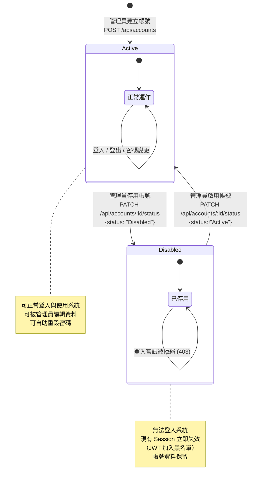

# 帳號狀態轉換圖

本圖呈現 User 帳號的生命週期狀態與轉換條件。

## 狀態說明

| 狀態 | 描述 | 允許的操作 |
|------|------|-----------|
| Active | 帳號正常啟用，可登入使用系統 | 登入、登出、檢視/編輯個人資訊、密碼重設 |
| Disabled | 帳號已被停用，無法登入 | 僅管理員可重新啟用 |

## 轉換規則

| 轉換 | 觸發動作 | API | 前置條件 | 副作用 |
|------|---------|-----|---------|--------|
| [建立] → Active | 管理員建立新帳號 | `POST /api/accounts` | 操作者為 Admin | 無 |
| Active → Disabled | 管理員停用帳號 | `PATCH /api/accounts/:id/status` | 操作者為 Admin | 強制登出：將目標使用者的 JWT 加入黑名單 |
| Disabled → Active | 管理員啟用帳號 | `PATCH /api/accounts/:id/status` | 操作者為 Admin | 使用者可再次登入 |

## 業務規則與限制

| 規則 | 說明 |
|------|------|
| 禁止自我停用 | 管理員不可停用自己的帳號，API 回傳 400 錯誤 |
| 最後管理員保護 | 系統中最後一位 Active Admin 不可被停用，API 回傳 400 錯誤 |
| 停用時強制登出 | 帳號被停用時，該使用者所有有效 JWT 立即加入黑名單 |
| 停用不刪除資料 | 帳號停用僅變更狀態，不刪除任何關聯資料 |
