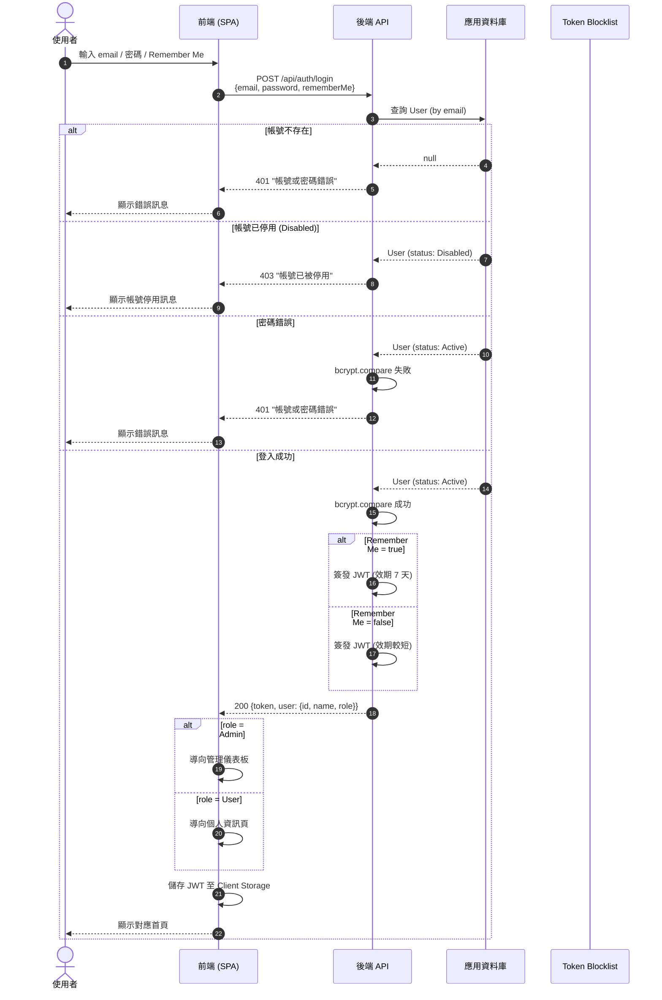
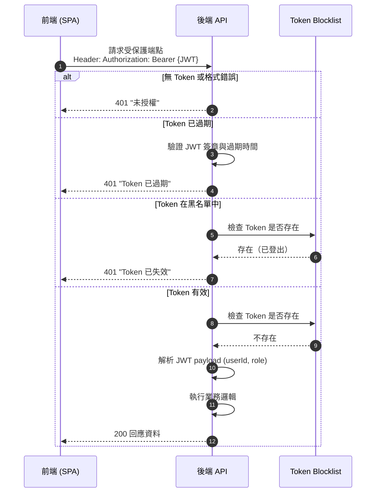
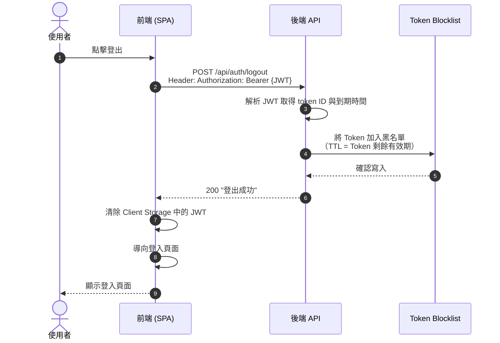

# 身份驗證流程圖

本圖呈現登入、Token 驗證、登出的完整互動流程，涵蓋成功與失敗情境。

## 登入流程

## Token 驗證流程（受保護端點）

## 登出流程

## 流程說明

### 登入安全考量

| 項目 | 說明 |
|------|------|
| 密碼驗證 | 使用 bcrypt 比對密碼雜湊 |
| 錯誤訊息 | 帳號不存在與密碼錯誤回傳相同訊息，防止帳號列舉攻擊 |
| 停用帳號 | 獨立錯誤碼 403，明確告知帳號已停用 |
| Remember Me | 影響 JWT 有效期長度 |
| 角色路由 | Admin 導向儀表板，User 導向個人資訊頁 |

### Token 管理

| 項目 | 說明 |
|------|------|
| Token 格式 | JWT，包含 userId、role、到期時間 |
| 黑名單機制 | 登出時將 Token 加入 Blocklist，TTL 與 Token 剩餘有效期一致 |
| 驗證順序 | 簽章 → 過期 → 黑名單 → 解析 payload |
