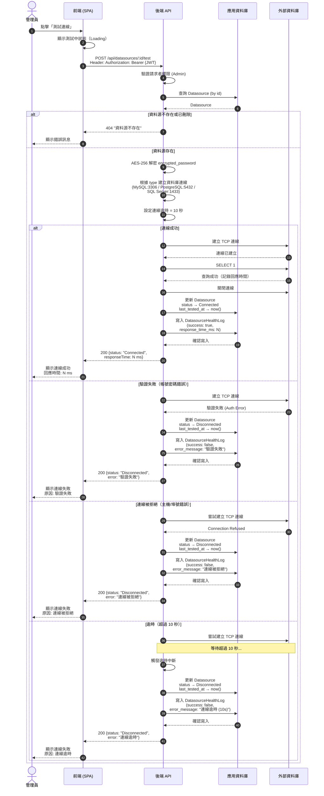
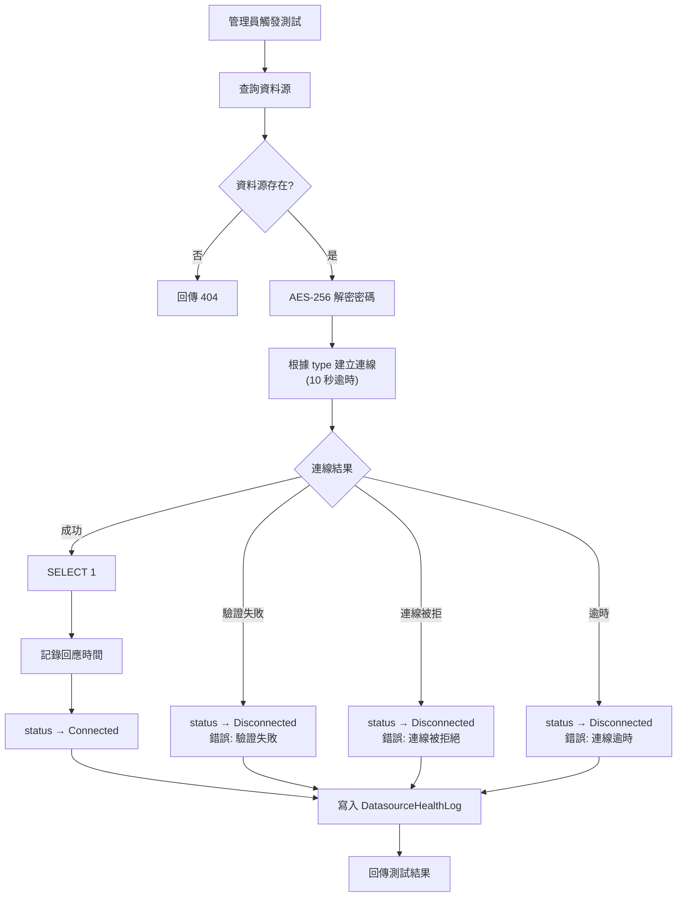

# 連線測試流程圖

本圖呈現管理員手動觸發資料源連線測試的完整流程，涵蓋成功、失敗與逾時情境。

## 連線測試邏輯摘要

## 技術細節

| 項目 | 說明 |
|------|------|
| 逾時限制 | 10 秒，超時即判定為 Disconnected |
| 測試指令 | `SELECT 1`，驗證連線可正常執行查詢 |
| 密碼處理 | 從 DB 讀取 `encrypted_password`，AES-256 解密後用於連線 |
| 連線關閉 | 測試完成後必須關閉連線，避免連線洩漏 |
| 紀錄保存 | 每次測試結果（成功/失敗）皆寫入 DatasourceHealthLog |
| 狀態更新 | 同步更新 Datasource 的 `status` 與 `last_tested_at` |

## 失敗類型對照

| 失敗類型 | 可能原因 | 錯誤訊息 |
|---------|---------|---------|
| 驗證失敗 | 帳號或密碼錯誤 | "資料庫驗證失敗，請確認帳號密碼" |
| 連線被拒絕 | 主機位址或埠號錯誤、防火牆阻擋、資料庫未啟動 | "無法連線至目標資料庫" |
| 連線逾時 | 網路不通、主機無回應 | "連線逾時（超過 10 秒）" |
