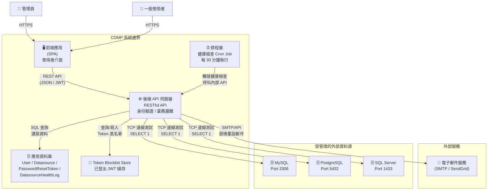

# 容器架構圖

本圖呈現 CDMP 系統內部的主要容器（元件）及其互動關係。

## 容器說明

| 容器 | 職責 | 備註 |
|------|------|------|
| 前端應用 (SPA) | 提供使用者介面，處理路由與角色導向 | Admin 登入後導向儀表板；User 導向個人資訊頁 |
| 後端 API 伺服器 | 處理所有業務邏輯、身份驗證、API 端點 | JWT 驗證、bcrypt 密碼雜湊、AES-256 憑證加密 |
| 應用資料庫 | 儲存 CDMP 自身資料 | 包含 User、Datasource、PasswordResetToken、DatasourceHealthLog 實體 |
| Token Blocklist Store | 儲存已登出的 JWT token | 用於 Logout 時將 token 加入黑名單 |
| 排程器 | 定時觸發資料源健康檢查 | 每 30 分鐘執行一次，10 秒逾時限制 |
| 電子郵件服務 | 發送密碼重設通知郵件 | 外部服務，透過 SMTP 或 SendGrid API |
| 外部資料源 | CDMP 管理的目標資料庫實例 | 支援 MySQL、PostgreSQL、SQL Server |
