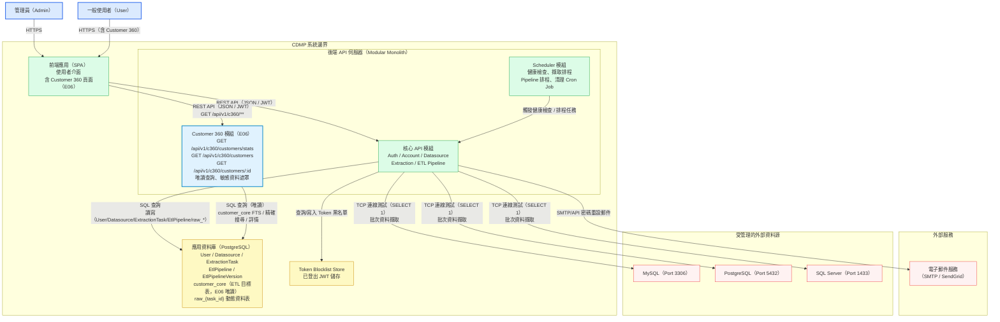

# 容器架構圖

本圖呈現 CDMP 系統內部的主要容器（元件）及其互動關係。

## 容器說明

| 容器 | 職責 | 備註 |
|------|------|------|
| 前端應用（SPA） | 提供使用者介面，處理路由與角色導向；含 Customer 360 客戶清單與詳情頁（E06） | Admin 登入後導向管理儀表板；User 可存取 Customer 360 功能 |
| 核心 API 模組 | 處理 Auth、Account、Datasource、Extraction、ETL Pipeline 等業務邏輯與 API 端點 | JWT 驗證、bcrypt 密碼雜湊、AES-256 憑證加密 |
| Customer 360 模組（E06） | 提供客戶搜尋清單（含 FTS / 精確搜尋 / 類型篩選）與 360 詳情查詢；唯讀存取 `customer_core`；依角色遮罩敏感欄位 | Admin / User 均可存取；不寫入任何資料表 |
| Scheduler 模組 | 定時觸發資料源健康檢查（30 分鐘）、擷取排程掃描（1 分鐘）、Pipeline 排程掃描（1 分鐘）、Cron 清理工作 | 模組內部方法呼叫，不對外暴露 API |
| 應用資料庫（PostgreSQL） | 儲存 CDMP 所有持久資料，包含 ETL 目標表 `customer_core`（E06 唯讀查詢來源） | `customer_core` 由 ETL Pipeline 寫入，由 C360 模組唯讀查詢 |
| Token Blocklist Store | 儲存已登出的 JWT token | 用於 Logout 時將 token 加入黑名單 |
| 電子郵件服務 | 發送密碼重設通知郵件 | 外部服務，透過 SMTP 或 SendGrid API |
| 外部資料源 | CDMP 管理的目標資料庫實例 | 支援 MySQL、PostgreSQL、SQL Server；僅 CoreAPI 連線（C360 不連線外部資料源） |

## 版本說明

- v1.0（2026-03-06）：初始版本，包含核心模組（Auth / Account / Datasource / Extraction）
- v1.1（2026-04-13）：新增 Customer 360 模組（E06），更新圖表區分 CoreAPI 與 C360API，更新應用資料庫說明（含 customer_core E06 唯讀），標示 User 角色可存取 Customer 360 功能
