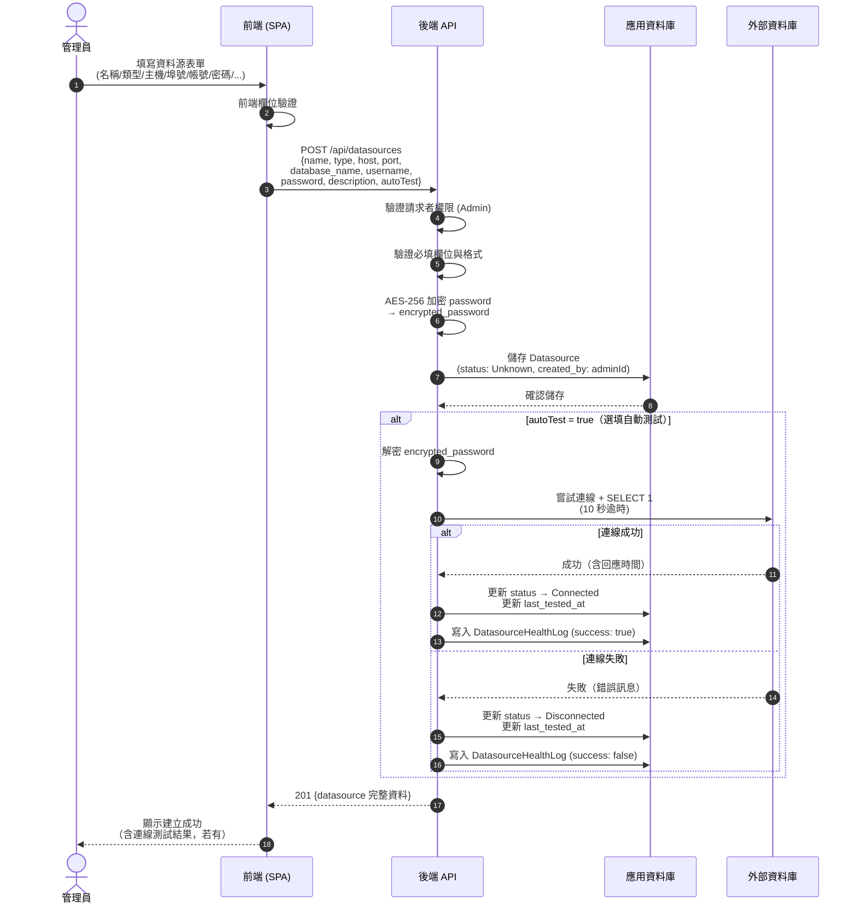
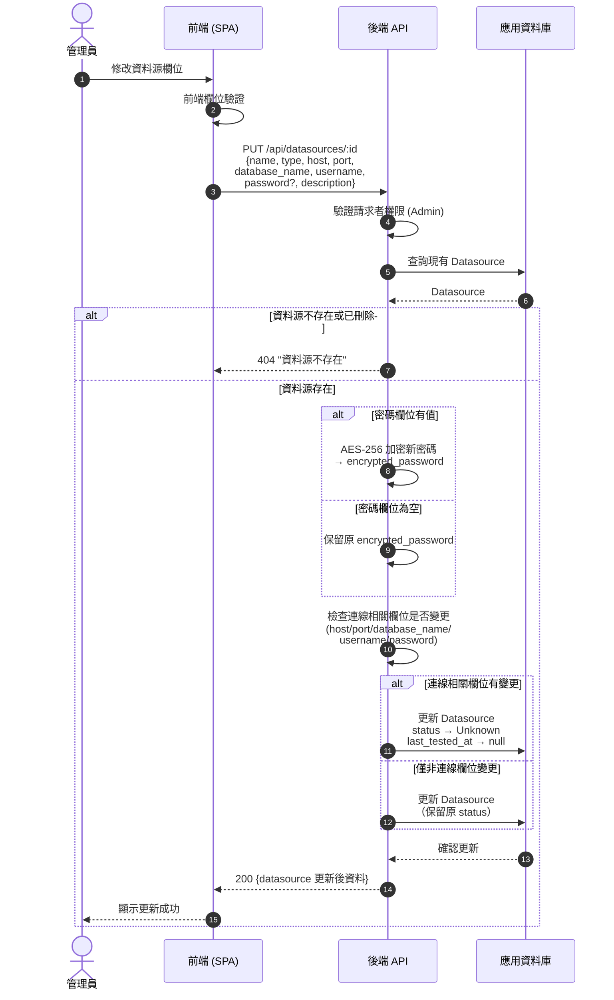
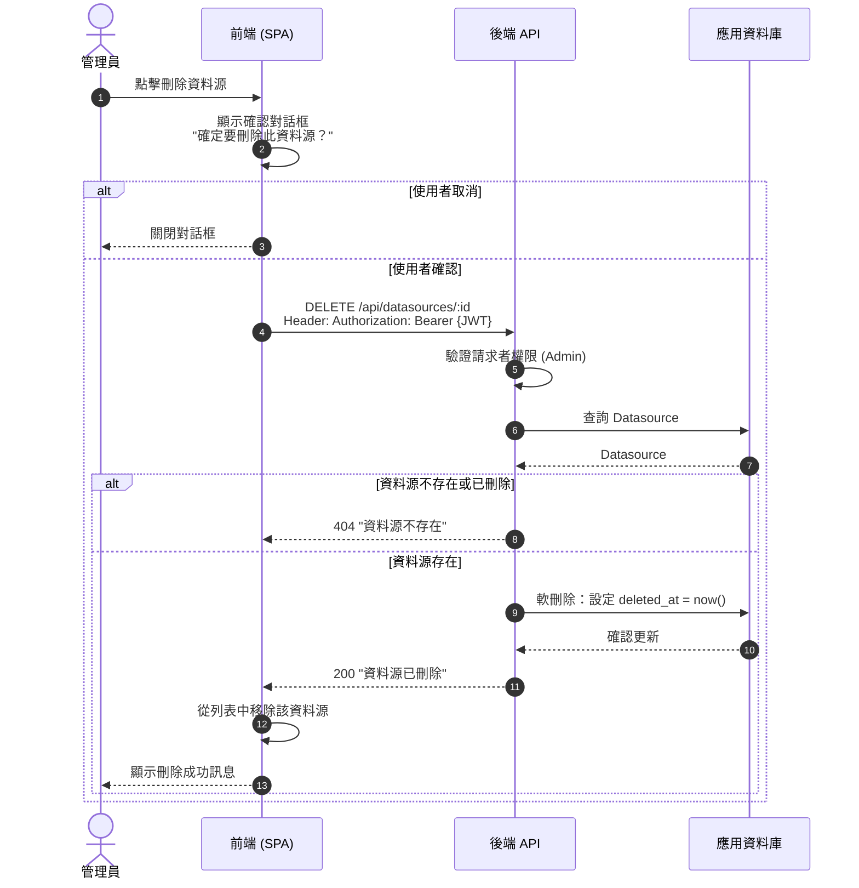

# 資料源 CRUD 流程圖

本圖呈現資料源的建立、編輯、刪除操作流程。

## 建立資料源

## 編輯資料源

## 刪除資料源（軟刪除）

## 操作摘要

| 操作 | API | 方法 | 關鍵行為 |
|------|-----|------|---------|
| 建立 | `/api/datasources` | POST | 加密密碼，初始 status = Unknown，可選自動測試 |
| 查詢列表 | `/api/datasources` | GET | 僅回傳 `deleted_at IS NULL` 的資料源 |
| 查詢單筆 | `/api/datasources/:id` | GET | 已刪除的資料源回傳 404 |
| 編輯 | `/api/datasources/:id` | PUT | 連線欄位變更時重置 status → Unknown；密碼欄位為空時保留原值 |
| 刪除 | `/api/datasources/:id` | DELETE | 軟刪除（設定 `deleted_at`），歷史紀錄保留 |
