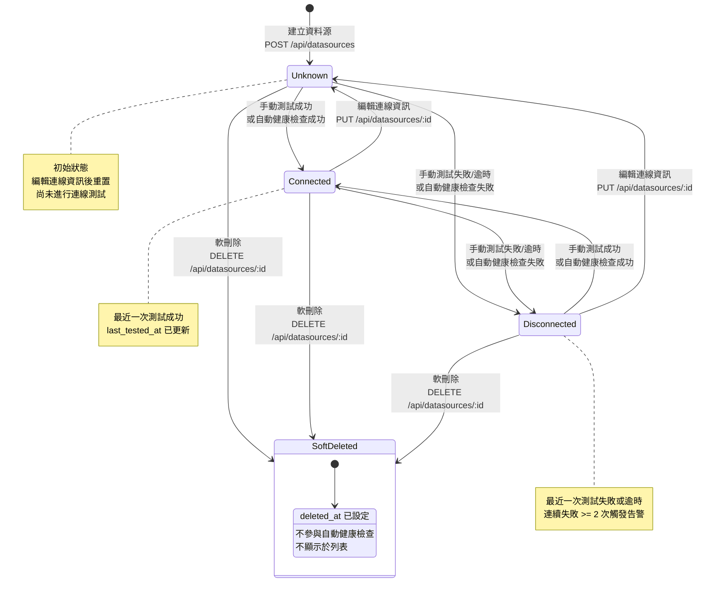

# 資料源狀態轉換圖

本圖呈現 Datasource 的生命週期狀態與轉換條件。

## 狀態說明

| 狀態 | 描述 | 儀表板顯示 |
|------|------|-----------|
| Unknown | 初始狀態，尚未測試或連線資訊已變更 | 未知 |
| Connected | 最近一次連線測試成功 | 正常 |
| Disconnected | 最近一次連線測試失敗或逾時 | 異常 |
| SoftDeleted | 已軟刪除（`deleted_at` 不為 null） | 不顯示 |

## 轉換觸發條件

| 轉換 | 觸發方式 | API / 機制 | 備註 |
|------|---------|-----------|------|
| [建立] → Unknown | 管理員建立資料源 | `POST /api/datasources` | 建立後可選擇立即測試 |
| Unknown → Connected | 測試成功 | `POST /api/datasources/:id/test` 或排程器 | 更新 `last_tested_at` |
| Unknown → Disconnected | 測試失敗/逾時 | `POST /api/datasources/:id/test` 或排程器 | 記錄 error_message |
| Connected → Disconnected | 測試失敗/逾時 | 排程器自動健康檢查或手動測試 | 連續 2 次失敗觸發告警 |
| Disconnected → Connected | 測試成功 | 排程器自動健康檢查或手動測試 | 告警自動解除 |
| Connected/Disconnected → Unknown | 編輯連線資訊 | `PUT /api/datasources/:id` | 僅當連線相關欄位變更時重置 |
| 任意 → SoftDeleted | 管理員刪除資料源 | `DELETE /api/datasources/:id` | 設定 `deleted_at`，保留歷史紀錄 |

## 自動健康檢查與狀態更新

| 項目 | 說明 |
|------|------|
| 檢查頻率 | 每 30 分鐘執行一次 |
| 檢查範圍 | 所有 `deleted_at IS NULL` 的資料源 |
| 逾時限制 | 單一連線測試 10 秒逾時 |
| 狀態更新 | 每次檢查後更新 `status` 與 `last_tested_at` |
| 告警條件 | 連續失敗次數 >= 2 時產生告警 |
| 紀錄保存 | 每次檢查結果寫入 DatasourceHealthLog |
