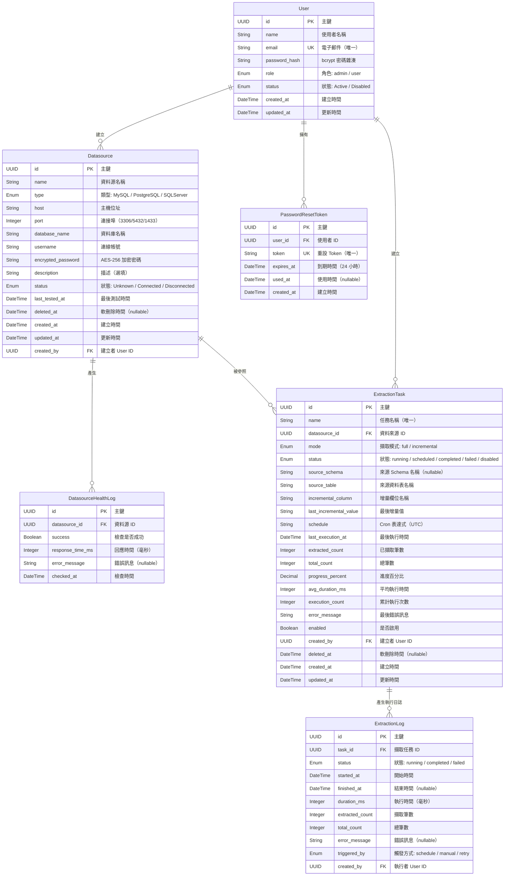

# 實體關聯圖

本圖呈現 CDMP 系統的核心資料模型及實體間的關聯關係。

## 實體說明

### User（使用者）

系統使用者帳號，支援 2 種預設角色（admin / user）。詳見 AD-E02-1（architecture-spec.md）。

| 欄位 | 類型 | 必填 | 說明 |
|------|------|------|------|
| id | UUID | 是 | 主鍵 |
| name | String | 是 | 使用者顯示名稱 |
| email | String | 是 | 唯一，用於登入與密碼重設 |
| password_hash | String | 是 | bcrypt 雜湊後的密碼 |
| role | Enum | 是 | `admin`（管理者）/ `user`（一般使用者） |
| status | Enum | 是 | `Active` 或 `Disabled` |
| created_at | DateTime | 是 | 自動產生 |
| updated_at | DateTime | 是 | 自動更新 |

> **角色 Seed Data**：2 種角色的顯示名稱定義由 `RoleService` 管理，以程式碼常數維護（不建立獨立 roles 資料表）。角色對應關係：`admin`→管理者（Admin）、`user`→使用者（User）。

### Datasource（資料源）

CDMP 管理的外部資料庫連線設定。

| 欄位 | 類型 | 必填 | 說明 |
|------|------|------|------|
| id | UUID | 是 | 主鍵 |
| name | String | 是 | 資料源顯示名稱 |
| type | Enum | 是 | `MySQL` / `PostgreSQL` / `SQLServer` |
| host | String | 是 | 資料庫主機位址 |
| port | Integer | 是 | 預設依類型：3306 / 5432 / 1433 |
| database_name | String | 是 | 目標資料庫名稱 |
| username | String | 是 | 連線帳號 |
| encrypted_password | String | 是 | AES-256 加密後的連線密碼 |
| description | String | 否 | 選填描述 |
| status | Enum | 是 | `Unknown` / `Connected` / `Disconnected` |
| last_tested_at | DateTime | 否 | 最近一次測試時間 |
| deleted_at | DateTime | 否 | 軟刪除時間戳（null 表示未刪除） |
| created_at | DateTime | 是 | 自動產生 |
| updated_at | DateTime | 是 | 自動更新 |
| created_by | UUID (FK) | 是 | 建立此資料源的 User ID |

### PasswordResetToken（密碼重設 Token）

密碼重設流程中產生的一次性 Token。

| 欄位 | 類型 | 必填 | 說明 |
|------|------|------|------|
| id | UUID | 是 | 主鍵 |
| user_id | UUID (FK) | 是 | 對應的使用者 |
| token | String | 是 | 唯一 Token 值 |
| expires_at | DateTime | 是 | 到期時間（建立後 24 小時） |
| used_at | DateTime | 否 | 使用時間（null 表示未使用） |
| created_at | DateTime | 是 | 自動產生 |

### DatasourceHealthLog（資料源健康檢查紀錄）

每次健康檢查或手動測試的結果紀錄。

| 欄位 | 類型 | 必填 | 說明 |
|------|------|------|------|
| id | UUID | 是 | 主鍵 |
| datasource_id | UUID (FK) | 是 | 對應的資料源 |
| success | Boolean | 是 | 檢查是否成功 |
| response_time_ms | Integer | 否 | 回應時間（毫秒），失敗時可能為 null |
| error_message | String | 否 | 失敗時的錯誤訊息 |
| checked_at | DateTime | 是 | 檢查執行時間 |

### ExtractionTask（擷取任務）

擷取任務設定，定義從外部資料來源擷取資料至 AppDB 的執行計畫。

| 欄位 | 類型 | 必填 | 說明 |
|------|------|------|------|
| id | UUID | 是 | 主鍵 |
| name | String | 是 | 任務名稱（唯一，排除軟刪除） |
| datasource_id | UUID (FK) | 是 | 關聯資料來源 |
| mode | Enum | 是 | `full`（全量）/ `incremental`（增量） |
| status | Enum | 是 | `running` / `scheduled` / `completed` / `failed` / `disabled` |
| source_schema | String | 否 | 來源 Schema 名稱（PostgreSQL=schema, MySQL=database, SQL Server=schema） |
| source_table | String | 是 | 外部資料來源中要讀取的來源資料表名稱 |
| incremental_column | String | 條件 | 增量欄位名稱（增量模式必填） |
| last_incremental_value | String | 否 | 最後增量值 |
| schedule | String | 是 | Cron 表達式（UTC 解析） |
| enabled | Boolean | 是 | 是否啟用（預設 true） |
| created_by | UUID (FK) | 是 | 建立者 User ID |

### ExtractionLog（擷取執行日誌）

擷取任務每次執行的詳細記錄。

| 欄位 | 類型 | 必填 | 說明 |
|------|------|------|------|
| id | UUID | 是 | 主鍵 |
| task_id | UUID (FK) | 是 | 關聯擷取任務 |
| status | Enum | 是 | `running` / `completed` / `failed` |
| started_at | DateTime | 是 | 開始時間 |
| finished_at | DateTime | 否 | 結束時間 |
| duration_ms | Integer | 否 | 執行時間（毫秒） |
| extracted_count | Integer | 是 | 本次擷取筆數 |
| total_count | Integer | 是 | 來源總筆數 |
| error_message | String | 否 | 失敗時的錯誤訊息 |
| triggered_by | Enum | 是 | `schedule` / `manual` / `retry` |

### Raw Data 動態表

擷取任務首次執行時於 AppDB 動態建立的 raw data 表。表名格式為 `raw_{task_id 前 8 碼}`，結構從來源表 metadata 推斷。詳見 [data-model.md#raw-data-table](../data-model.md#raw-data-table)。

## 關聯關係

| 關聯 | 基數 | 說明 |
|------|------|------|
| User → Datasource | 1:N | 一個使用者可建立多個資料源 |
| User → PasswordResetToken | 1:N | 一個使用者可擁有多個重設 Token（歷史紀錄） |
| User → ExtractionTask | 1:N | 一個使用者可建立多個擷取任務 |
| Datasource → DatasourceHealthLog | 1:N | 一個資料源可有多筆健康檢查紀錄 |
| Datasource → ExtractionTask | 1:N | 一個資料來源可被多個擷取任務參照 |
| ExtractionTask → ExtractionLog | 1:N | 一個擷取任務可有多筆執行日誌 |
| ExtractionTask → Raw Data Table | 1:1 | 一個擷取任務對應一張 raw data 動態表 |
