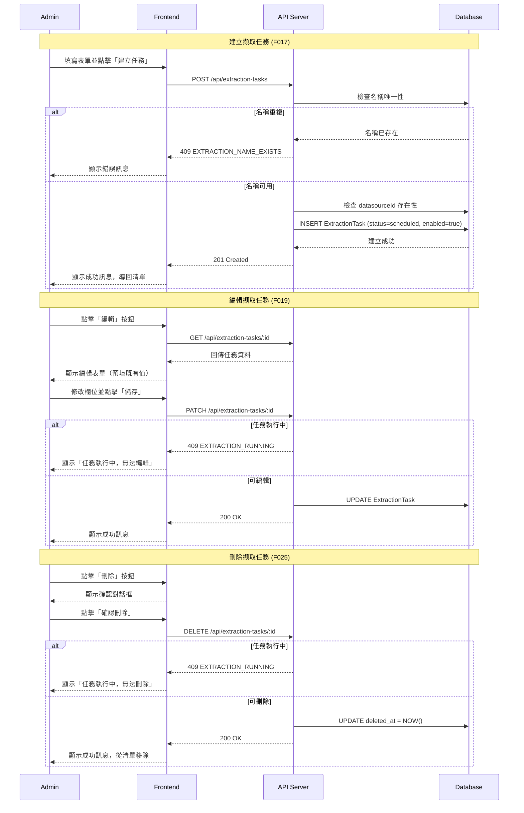

```mermaid
%% 擷取任務 CRUD 流程 — 建立、編輯、刪除
sequenceDiagram
    participant Admin
    participant Frontend
    participant API as API Server
    participant DB as Database

    Note over Admin, DB: 建立擷取任務 (F017)
    Admin->>Frontend: 填寫表單並點擊「建立任務」
    Frontend->>API: POST /api/extraction-tasks
    API->>DB: 檢查名稱唯一性
    alt 名稱重複
        DB-->>API: 名稱已存在
        API-->>Frontend: 409 EXTRACTION_NAME_EXISTS
        Frontend-->>Admin: 顯示錯誤訊息
    else 名稱可用
        API->>DB: 檢查 datasourceId 存在性
        API->>DB: INSERT ExtractionTask (status=scheduled, enabled=true)
        DB-->>API: 建立成功
        API-->>Frontend: 201 Created
        Frontend-->>Admin: 顯示成功訊息，導回清單
    end

    Note over Admin, DB: 編輯擷取任務 (F019)
    Admin->>Frontend: 點擊「編輯」按鈕
    Frontend->>API: GET /api/extraction-tasks/:id
    API-->>Frontend: 回傳任務資料
    Frontend-->>Admin: 顯示編輯表單（預填既有值）
    Admin->>Frontend: 修改欄位並點擊「儲存」
    Frontend->>API: PATCH /api/extraction-tasks/:id
    alt 任務執行中
        API-->>Frontend: 409 EXTRACTION_RUNNING
        Frontend-->>Admin: 顯示「任務執行中，無法編輯」
    else 可編輯
        API->>DB: UPDATE ExtractionTask
        API-->>Frontend: 200 OK
        Frontend-->>Admin: 顯示成功訊息
    end

    Note over Admin, DB: 刪除擷取任務 (F025)
    Admin->>Frontend: 點擊「刪除」按鈕
    Frontend-->>Admin: 顯示確認對話框
    Admin->>Frontend: 點擊「確認刪除」
    Frontend->>API: DELETE /api/extraction-tasks/:id
    alt 任務執行中
        API-->>Frontend: 409 EXTRACTION_RUNNING
        Frontend-->>Admin: 顯示「任務執行中，無法刪除」
    else 可刪除
        API->>DB: UPDATE deleted_at = NOW()
        API-->>Frontend: 200 OK
        Frontend-->>Admin: 顯示成功訊息，從清單移除
    end
```
