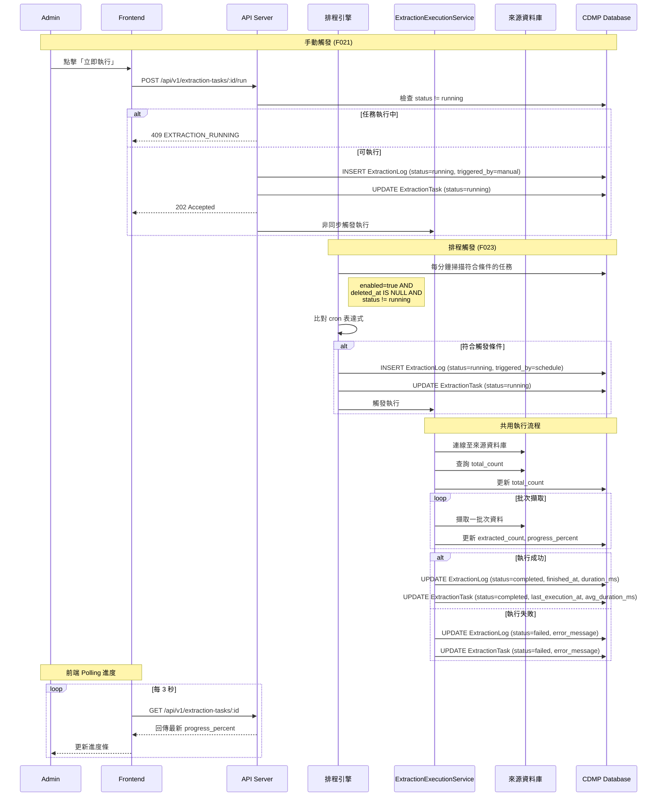

```mermaid
%% 擷取任務執行流程 — 手動觸發與排程觸發
sequenceDiagram
    participant Admin
    participant Frontend
    participant API as API Server
    participant Scheduler as 排程引擎
    participant Executor as ExtractionExecutionService
    participant SourceDB as 來源資料庫
    participant DB as CDMP Database

    Note over Admin, DB: 手動觸發 (F021)
    Admin->>Frontend: 點擊「立即執行」
    Frontend->>API: POST /api/v1/extraction-tasks/:id/run
    API->>DB: 檢查 status != running
    alt 任務執行中
        API-->>Frontend: 409 EXTRACTION_RUNNING
    else 可執行
        API->>DB: INSERT ExtractionLog (status=running, triggered_by=manual)
        API->>DB: UPDATE ExtractionTask (status=running)
        API-->>Frontend: 202 Accepted
        API->>Executor: 非同步觸發執行
    end

    Note over Scheduler, DB: 排程觸發 (F023)
    Scheduler->>DB: 每分鐘掃描符合條件的任務
    Note right of Scheduler: enabled=true AND<br/>deleted_at IS NULL AND<br/>status != running
    Scheduler->>Scheduler: 比對 cron 表達式
    alt 符合觸發條件
        Scheduler->>DB: INSERT ExtractionLog (status=running, triggered_by=schedule)
        Scheduler->>DB: UPDATE ExtractionTask (status=running)
        Scheduler->>Executor: 觸發執行
    end

    Note over Executor, DB: 共用執行流程
    Executor->>SourceDB: 連線至來源資料庫
    Executor->>SourceDB: 查詢 total_count
    Executor->>DB: 更新 total_count
    loop 批次擷取
        Executor->>SourceDB: 擷取一批次資料
        Executor->>DB: 更新 extracted_count, progress_percent
    end
    alt 執行成功
        Executor->>DB: UPDATE ExtractionLog (status=completed, finished_at, duration_ms)
        Executor->>DB: UPDATE ExtractionTask (status=completed, last_execution_at, avg_duration_ms)
    else 執行失敗
        Executor->>DB: UPDATE ExtractionLog (status=failed, error_message)
        Executor->>DB: UPDATE ExtractionTask (status=failed, error_message)
    end

    Note over Admin, Frontend: 前端 Polling 進度
    loop 每 3 秒
        Frontend->>API: GET /api/v1/extraction-tasks/:id
        API-->>Frontend: 回傳最新 progress_percent
        Frontend-->>Admin: 更新進度條
    end
```
