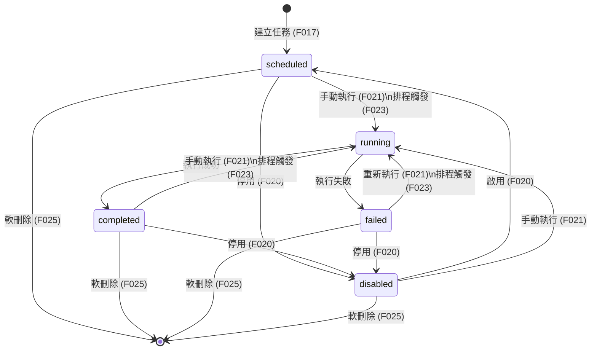

```mermaid
%% ExtractionTask 狀態轉換圖
stateDiagram-v2
    [*] --> scheduled : 建立任務 (F017)

    scheduled --> running : 手動執行 (F021)\n排程觸發 (F023)
    scheduled --> disabled : 停用 (F020)

    running --> completed : 執行成功
    running --> failed : 執行失敗

    completed --> running : 手動執行 (F021)\n排程觸發 (F023)
    completed --> disabled : 停用 (F020)

    failed --> running : 重新執行 (F021)\n排程觸發 (F023)
    failed --> disabled : 停用 (F020)

    disabled --> scheduled : 啟用 (F020)
    disabled --> running : 手動執行 (F021)

    scheduled --> [*] : 軟刪除 (F025)
    completed --> [*] : 軟刪除 (F025)
    failed --> [*] : 軟刪除 (F025)
    disabled --> [*] : 軟刪除 (F025)
```
