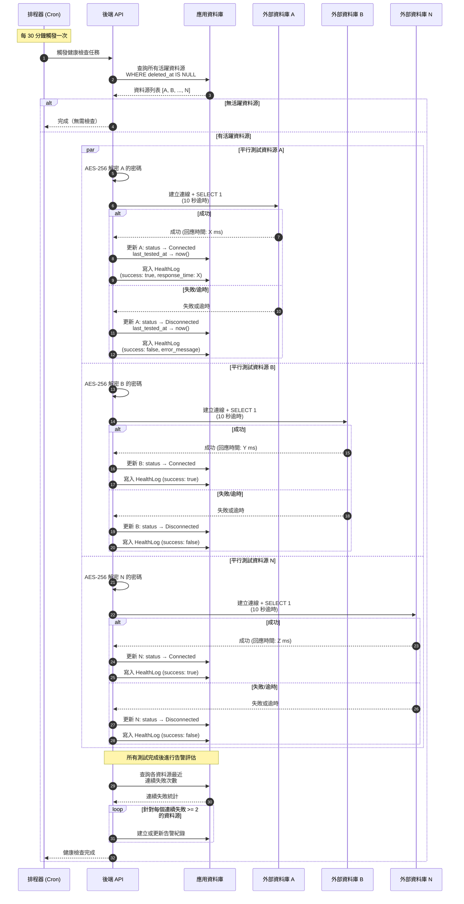
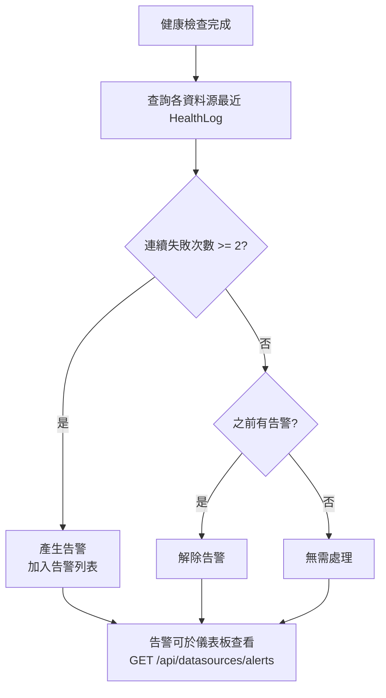
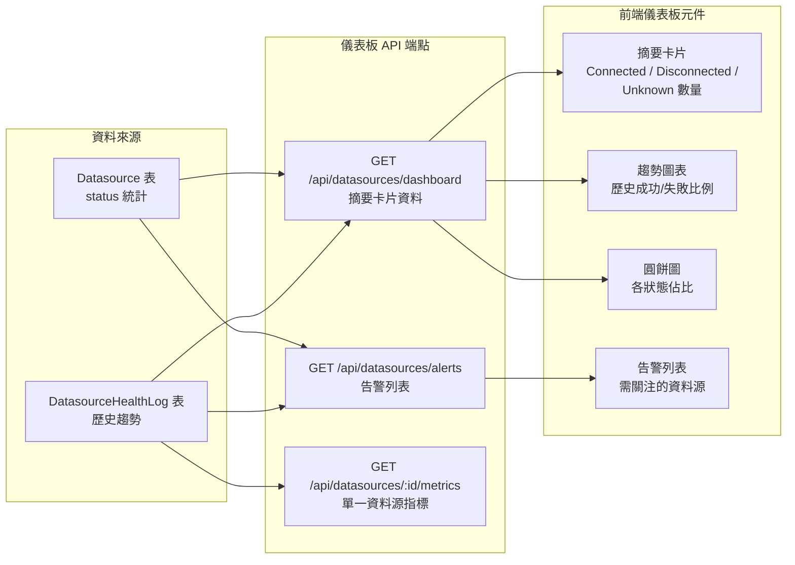

# 自動健康檢查流程圖

本圖呈現排程器自動執行資料源健康檢查的完整流程，包含平行測試、紀錄寫入、告警評估與儀表板更新。

## 主要流程

## 告警評估邏輯

## 儀表板資料來源

## 排程器規格

| 項目 | 說明 |
|------|------|
| 執行頻率 | 每 30 分鐘 |
| 檢查範圍 | 所有 `deleted_at IS NULL` 的 Datasource |
| 執行方式 | 平行測試所有資料源 |
| 單一逾時 | 10 秒 |
| 紀錄寫入 | 每筆測試結果寫入 DatasourceHealthLog |
| 狀態更新 | 每筆測試後更新對應 Datasource 的 status 與 last_tested_at |

## 告警規則

| 項目 | 說明 |
|------|------|
| 觸發條件 | 同一資料源連續失敗次數 >= 2 |
| 告警內容 | 資料源名稱、類型、最後錯誤訊息、連續失敗次數 |
| 解除條件 | 資料源重新測試成功（連續失敗歸零） |
| 查看方式 | `GET /api/datasources/alerts` |

## 儀表板元件

| 元件 | API 端點 | 資料來源 | 說明 |
|------|---------|---------|------|
| 摘要卡片 | `GET /api/datasources/dashboard` | Datasource.status 統計 | 顯示 Connected / Disconnected / Unknown 數量 |
| 趨勢圖表 | `GET /api/datasources/dashboard` | DatasourceHealthLog 歷史 | 顯示一段時間內的成功/失敗趨勢 |
| 圓餅圖 | `GET /api/datasources/dashboard` | Datasource.status 統計 | 各狀態佔比視覺化 |
| 告警列表 | `GET /api/datasources/alerts` | HealthLog 連續失敗統計 | 列出所有需關注的資料源 |
| 單一指標 | `GET /api/datasources/:id/metrics` | DatasourceHealthLog | 單一資料源的歷史回應時間與成功率 |
