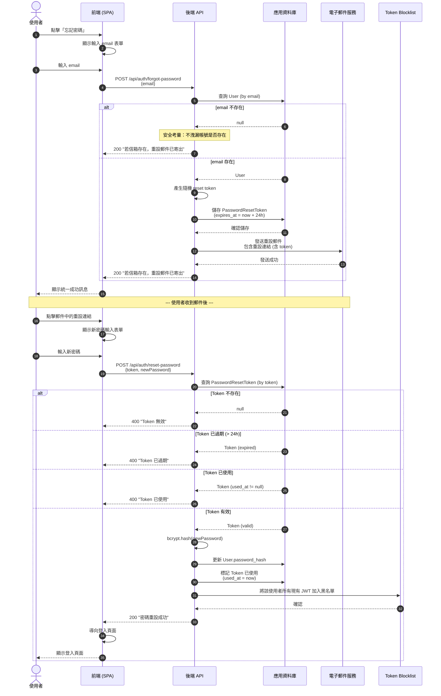
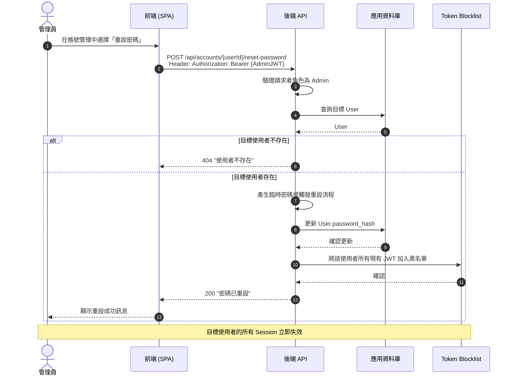

# 密碼重設流程圖

本圖呈現兩種密碼重設途徑：使用者自助重設與管理員重設。

## 使用者自助密碼重設

## 管理員重設使用者密碼

## 安全設計要點

| 項目 | 說明 |
|------|------|
| 統一回應訊息 | `forgot-password` 無論 email 是否存在，皆回傳相同訊息，防止帳號列舉 |
| Token 有效期 | 24 小時，過期後不可使用 |
| Token 一次性 | 使用後標記 `used_at`，不可重複使用 |
| Session 失效 | 密碼重設成功後，該使用者所有現有 JWT 加入黑名單，強制重新登入 |
| 密碼雜湊 | 新密碼使用 bcrypt 雜湊後儲存 |
| 管理員權限 | 管理員重設密碼端點需驗證 Admin 角色 |
