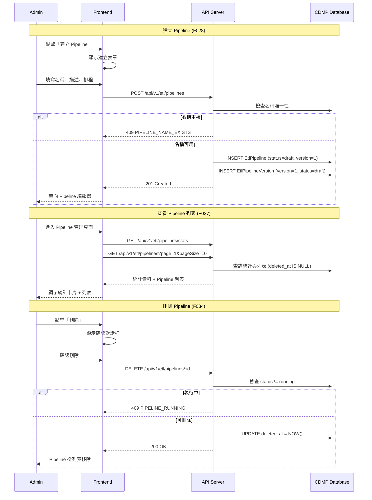

```mermaid
%% Pipeline CRUD 流程 — 建立、列表、編輯、刪除
sequenceDiagram
    participant Admin
    participant Frontend
    participant API as API Server
    participant DB as CDMP Database

    Note over Admin, DB: 建立 Pipeline (F028)
    Admin->>Frontend: 點擊「建立 Pipeline」
    Frontend->>Frontend: 顯示建立表單
    Admin->>Frontend: 填寫名稱、描述、排程
    Frontend->>API: POST /api/v1/etl/pipelines
    API->>DB: 檢查名稱唯一性
    alt 名稱重複
        API-->>Frontend: 409 PIPELINE_NAME_EXISTS
    else 名稱可用
        API->>DB: INSERT EtlPipeline (status=draft, version=1)
        API->>DB: INSERT EtlPipelineVersion (version=1, status=draft)
        API-->>Frontend: 201 Created
        Frontend-->>Admin: 導向 Pipeline 編輯器
    end

    Note over Admin, DB: 查看 Pipeline 列表 (F027)
    Admin->>Frontend: 進入 Pipeline 管理頁面
    Frontend->>API: GET /api/v1/etl/pipelines/stats
    Frontend->>API: GET /api/v1/etl/pipelines?page=1&pageSize=10
    API->>DB: 查詢統計與列表 (deleted_at IS NULL)
    API-->>Frontend: 統計資料 + Pipeline 列表
    Frontend-->>Admin: 顯示統計卡片 + 列表

    Note over Admin, DB: 刪除 Pipeline (F034)
    Admin->>Frontend: 點擊「刪除」
    Frontend->>Frontend: 顯示確認對話框
    Admin->>Frontend: 確認刪除
    Frontend->>API: DELETE /api/v1/etl/pipelines/:id
    API->>DB: 檢查 status != running
    alt 執行中
        API-->>Frontend: 409 PIPELINE_RUNNING
    else 可刪除
        API->>DB: UPDATE deleted_at = NOW()
        API-->>Frontend: 200 OK
        Frontend-->>Admin: Pipeline 從列表移除
    end
```
