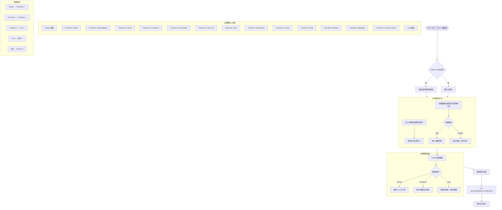

```mermaid
%% Pipeline 編輯器流程 — 節點工具箱、畫布操作、屬性設定
flowchart TD
    Start([Admin 進入 Pipeline 編輯器]) --> Load{Pipeline 已有定義?}
    Load -->|是| Restore[還原畫布節點與連線]
    Load -->|否| Empty[顯示空畫布]

    Restore --> Canvas
    Empty --> Canvas

    subgraph Canvas[中央畫布操作]
        direction TB
        Drag[從工具箱拖拉節點至畫布] --> NodeAdded[節點出現在畫布上]
        Connect[從節點輸出端拖拉至目標輸入端] --> Validate{連線驗證}
        Validate -->|合法| EdgeCreated[建立連線箭頭]
        Validate -->|不合法| Reject[阻止連線 + 顯示提示]
    end

    subgraph Toolbox[左側節點工具箱]
        direction TB
        E[Extract 節點]
        T1[Transform: Merge]
        T2[Transform: Field Mapping]
        T3[Transform: Format]
        T4[Transform: Conditional]
        T5[Transform: Null Handler]
        T6[Transform: Type Cast]
        T7[Transform: Filter]
        T8[Transform: Deduplicate]
        T9[Transform: Lookup]
        T10[Transform: String]
        T11[Transform: Masking]
        T12[Transform: Aggregate]
        T13[Transform: Derived Column]
        L[Load 節點]
    end

    Canvas --> Click[Admin 點擊節點]

    subgraph Properties[右側屬性面板]
        direction TB
        Click --> NodeType{節點類型?}
        NodeType -->|Extract| ExtractForm[選擇 raw data 表]
        NodeType -->|Transform| TransformForm[顯示對應設定表單]
        NodeType -->|Load| LoadForm[選擇目標表 + 欄位對應]
    end

    Properties --> Save[點擊儲存按鈕]
    Save --> API[PUT /api/v1/etl/pipelines/:id/definition]
    API --> Success[儲存成功提示]

    subgraph ConnectionRules[連線規則]
        direction LR
        R1[Extract → Transform ✓]
        R2[Transform → Transform ✓]
        R3[Transform → Load ✓]
        R4[Load → 任何 ✗]
        R5[任何 → Extract ✗]
    end
```
