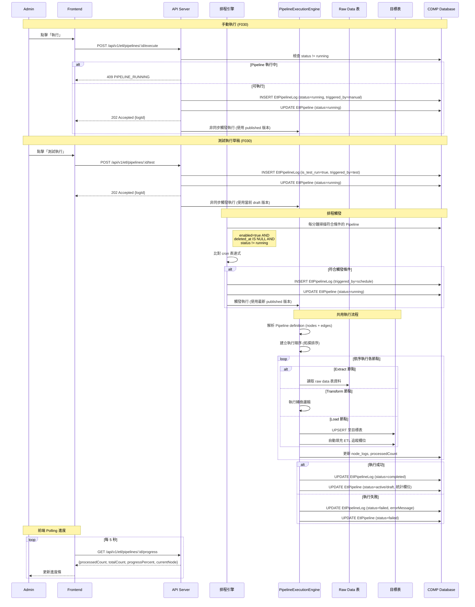

```mermaid
%% Pipeline 執行流程 — 手動觸發、測試執行與排程觸發
sequenceDiagram
    participant Admin
    participant Frontend
    participant API as API Server
    participant Scheduler as 排程引擎
    participant Engine as PipelineExecutionEngine
    participant RawDB as Raw Data 表
    participant TargetDB as 目標表
    participant DB as CDMP Database

    Note over Admin, DB: 手動執行 (F030)
    Admin->>Frontend: 點擊「執行」
    Frontend->>API: POST /api/v1/etl/pipelines/:id/execute
    API->>DB: 檢查 status != running
    alt Pipeline 執行中
        API-->>Frontend: 409 PIPELINE_RUNNING
    else 可執行
        API->>DB: INSERT EtlPipelineLog (status=running, triggered_by=manual)
        API->>DB: UPDATE EtlPipeline (status=running)
        API-->>Frontend: 202 Accepted {logId}
        API->>Engine: 非同步觸發執行 (使用 published 版本)
    end

    Note over Admin, DB: 測試執行草稿 (F030)
    Admin->>Frontend: 點擊「測試執行」
    Frontend->>API: POST /api/v1/etl/pipelines/:id/test
    API->>DB: INSERT EtlPipelineLog (is_test_run=true, triggered_by=test)
    API->>DB: UPDATE EtlPipeline (status=running)
    API-->>Frontend: 202 Accepted {logId}
    API->>Engine: 非同步觸發執行 (使用當前 draft 版本)

    Note over Scheduler, DB: 排程觸發
    Scheduler->>DB: 每分鐘掃描符合條件的 Pipeline
    Note right of Scheduler: enabled=true AND<br/>deleted_at IS NULL AND<br/>status != running
    Scheduler->>Scheduler: 比對 cron 表達式
    alt 符合觸發條件
        Scheduler->>DB: INSERT EtlPipelineLog (triggered_by=schedule)
        Scheduler->>DB: UPDATE EtlPipeline (status=running)
        Scheduler->>Engine: 觸發執行 (使用最新 published 版本)
    end

    Note over Engine, TargetDB: 共用執行流程
    Engine->>Engine: 解析 Pipeline definition (nodes + edges)
    Engine->>Engine: 建立執行順序 (拓撲排序)
    loop 依序執行各節點
        alt Extract 節點
            Engine->>RawDB: 讀取 raw data 表資料
        else Transform 節點
            Engine->>Engine: 執行轉換邏輯
        else Load 節點
            Engine->>TargetDB: UPSERT 至目標表
            Engine->>TargetDB: 自動填充 ETL 追蹤欄位
        end
        Engine->>DB: 更新 node_logs, processedCount
    end

    alt 執行成功
        Engine->>DB: UPDATE EtlPipelineLog (status=completed)
        Engine->>DB: UPDATE EtlPipeline (status=active/draft, 統計欄位)
    else 執行失敗
        Engine->>DB: UPDATE EtlPipelineLog (status=failed, errorMessage)
        Engine->>DB: UPDATE EtlPipeline (status=failed)
    end

    Note over Admin, Frontend: 前端 Polling 進度
    loop 每 5 秒
        Frontend->>API: GET /api/v1/etl/pipelines/:id/progress
        API-->>Frontend: {processedCount, totalCount, progressPercent, currentNode}
        Frontend-->>Admin: 更新進度條
    end
```
