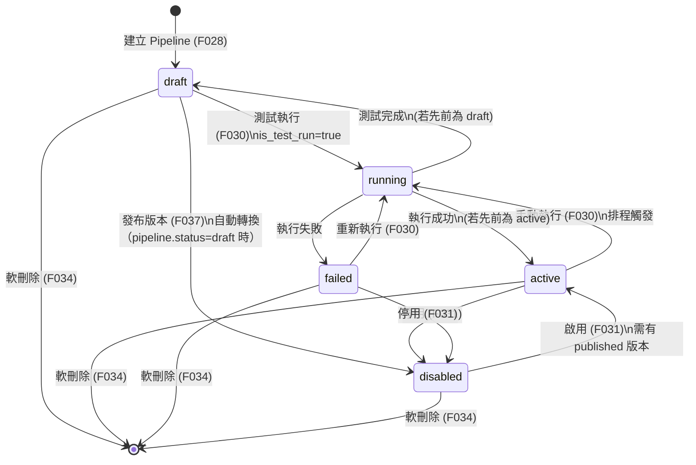

```mermaid
%% EtlPipeline 狀態轉換圖
stateDiagram-v2
    [*] --> draft : 建立 Pipeline (F028)

    draft --> running : 測試執行 (F030)\nis_test_run=true
    draft --> disabled : 發布版本 (F037)\n自動轉換（pipeline.status=draft 時）

    active --> running : 手動執行 (F030)\n排程觸發
    active --> disabled : 停用 (F031)

    running --> active : 執行成功\n(若先前為 active)
    running --> draft : 測試完成\n(若先前為 draft)
    running --> failed : 執行失敗

    failed --> running : 重新執行 (F030)
    failed --> disabled : 停用 (F031)

    disabled --> active : 啟用 (F031)\n需有 published 版本

    draft --> [*] : 軟刪除 (F034)
    active --> [*] : 軟刪除 (F034)
    failed --> [*] : 軟刪除 (F034)
    disabled --> [*] : 軟刪除 (F034)
```
