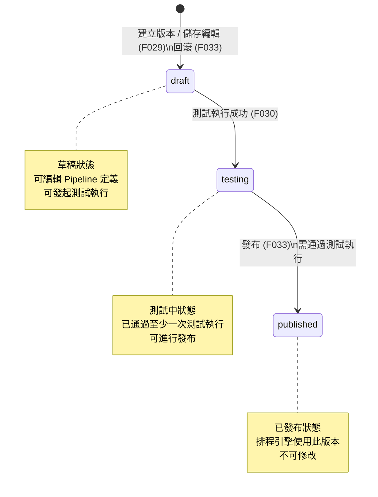

```mermaid
%% EtlPipelineVersion 版本狀態轉換圖
stateDiagram-v2
    [*] --> draft : 建立版本 / 儲存編輯 (F029)\n回滾 (F033)

    draft --> testing : 測試執行成功 (F030)

    testing --> published : 發布 (F033)\n需通過測試執行

    note right of draft
        草稿狀態
        可編輯 Pipeline 定義
        可發起測試執行
    end note

    note right of testing
        測試中狀態
        已通過至少一次測試執行
        可進行發布
    end note

    note right of published
        已發布狀態
        排程引擎使用此版本
        不可修改
    end note
```
