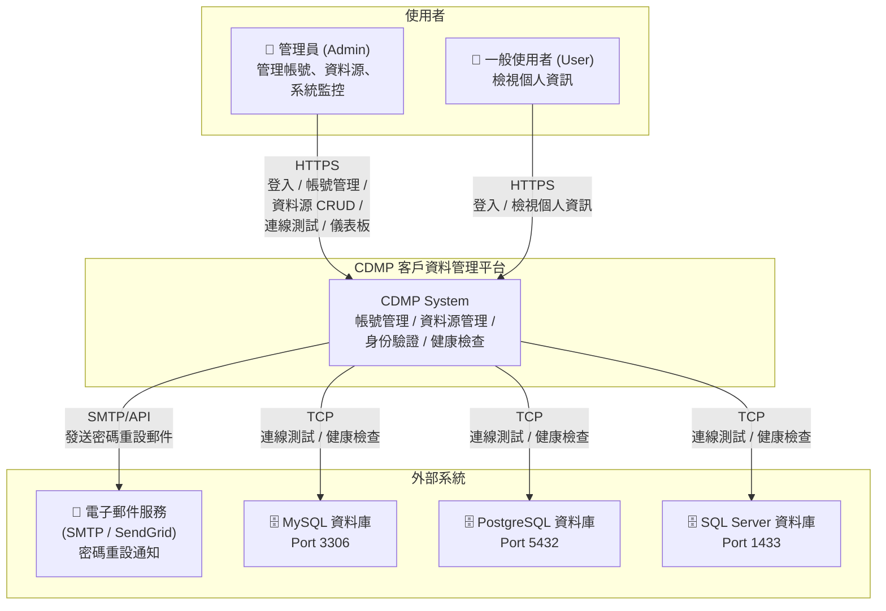

# 系統上下文圖 (C4 Level 1)

本圖呈現 CDMP 系統與外部角色、外部系統之間的互動關係。

## 說明

| 元素 | 類型 | 描述 |
|------|------|------|
| 管理員 (Admin) | 使用者角色 | 具備完整系統管理權限，可管理帳號、資料源、檢視儀表板 |
| 一般使用者 (User) | 使用者角色 | 僅可登入並檢視個人相關資訊 |
| CDMP System | 系統邊界 | 核心平台，涵蓋身份驗證、帳號管理、資料源管理、自動健康檢查 |
| 電子郵件服務 | 外部服務 | 透過 SMTP 或 SendGrid API 發送密碼重設郵件 |
| MySQL / PostgreSQL / SQL Server | 外部資料庫 | 由 CDMP 管理的外部資料源，系統透過 TCP 進行連線測試與定期健康檢查 |
