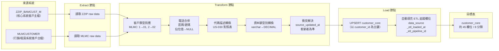

# 目標表 ETL 轉換流程

> 說明：customer_core 目標表的 ETL 資料流，展示從兩個來源系統經過轉換規則後載入目標表的流程。

## 來源關聯

兩系統以身分證字號/統一編號作為共同鍵：

- ZZIP.CUSTO_NO = MLMC.CUSTID

## 欄位分類

| 分類 | 欄位數 | 主要來源 |
|------|--------|---------|
| A. 識別與分類 | 5 | ZZIP + MLMC |
| B. 個人屬性 | 5 | ZZIP |
| C. 聯絡資訊 | 6 | ZZIP + MLMC |
| D. 地址 | 6 | ZZIP + MLMC |
| E. 職業與就業 | 10 | ZZIP + MLMC |
| F. 財務與風控 | 10 | ZZIP + MLMC |
| G. 企業客戶專屬 | 7 | MLMC |
| H. 稽核與 ETL 追蹤 | 5 | ZZIP + MLMC + ETL 自動 |

**相關功能**：[F036](../features/F036-target-tables.md)
