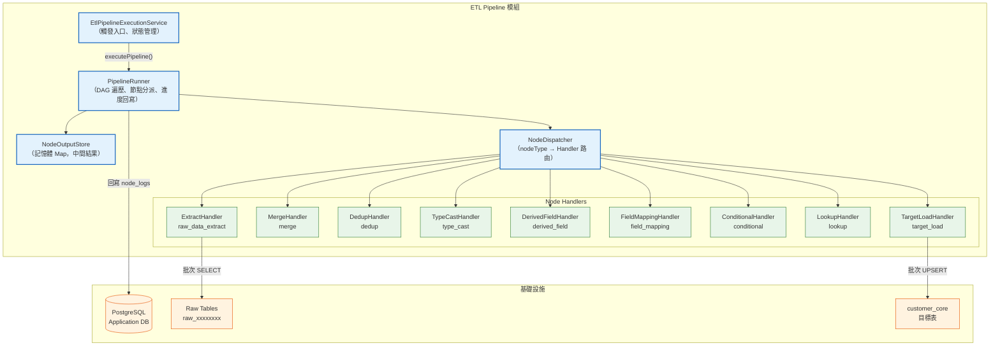
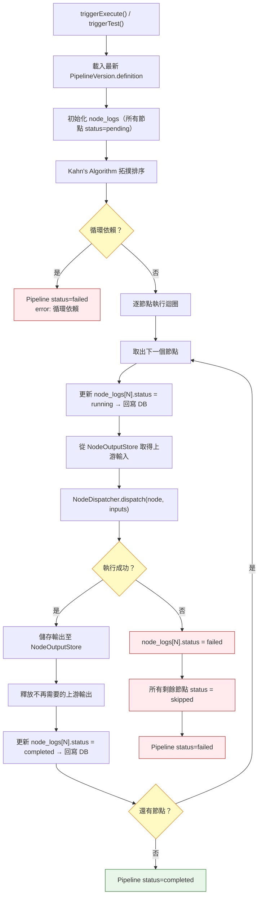
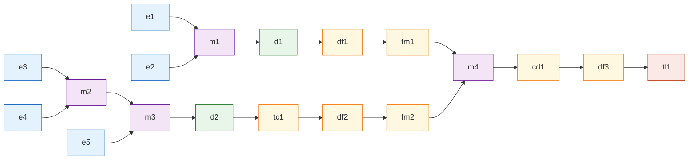
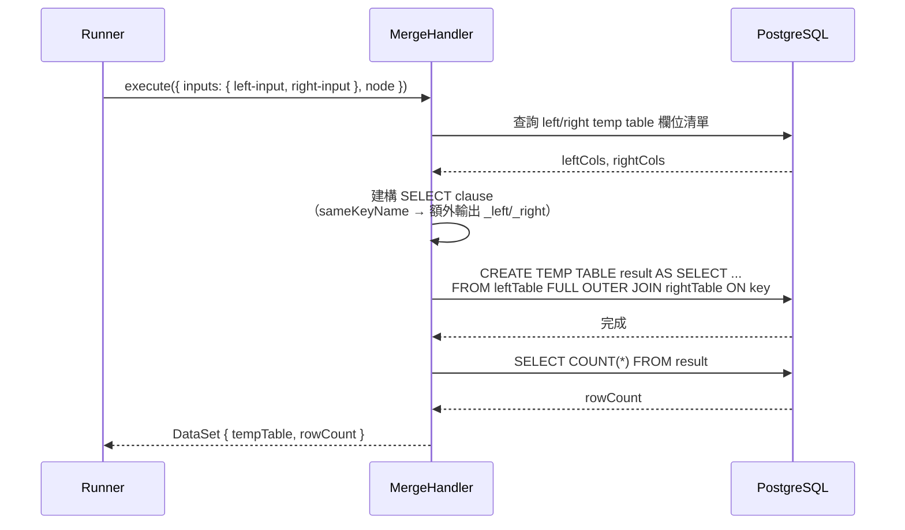
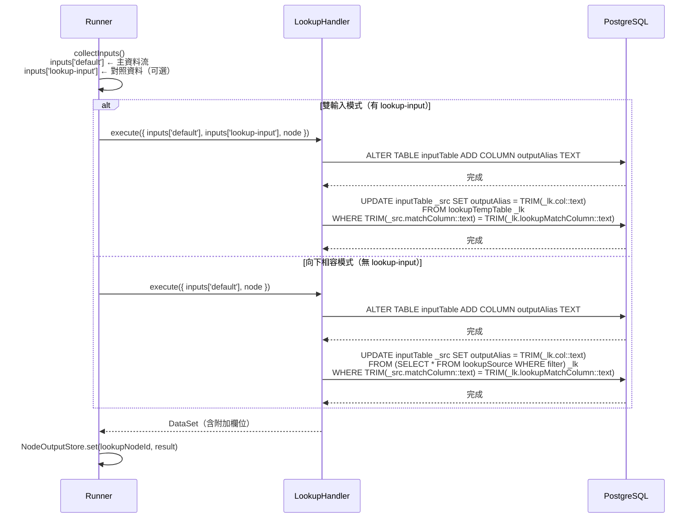
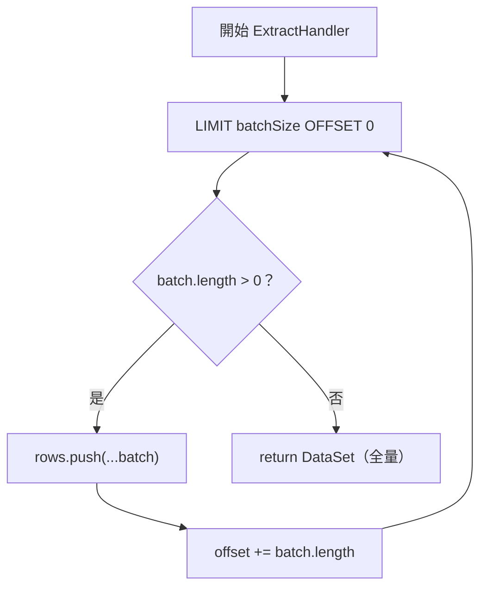
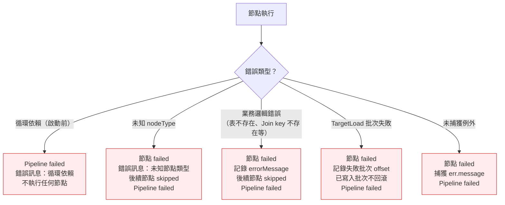
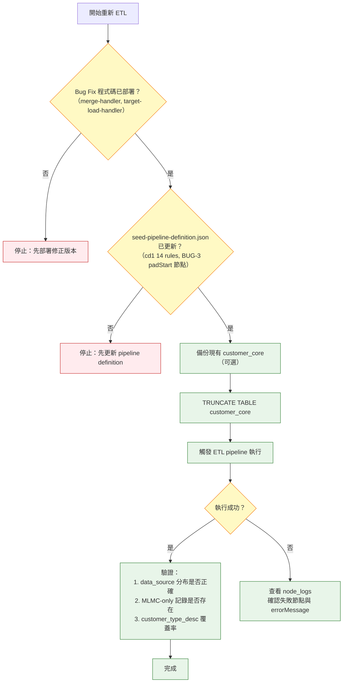

# ETL 執行引擎架構規格書

## Agent Loading Guide

| Agent 角色 | 建議閱讀章節 |
|-----------|------------|
| TDD Developer | 3. 元件設計、4. 資料流策略、5. 記憶體管理、6. 錯誤處理 |
| Test Designer | 2. 執行流程、3. 元件設計（介面定義）、6. 錯誤處理、7. 效能考量 |
| Spec Writer | 4. 資料流策略（架構決策摘要）、3.2 NodeExecutor 介面 |
| DevOps / CI/CD | 7. 效能考量（批次參數、記憶體上限） |

## 目錄

1. [架構概覽](#1-架構概覽)
2. [執行流程](#2-執行流程)
3. [元件設計](#3-元件設計)
4. [資料流策略](#4-資料流策略)
5. [記憶體管理](#5-記憶體管理)
6. [錯誤處理與回滾策略](#6-錯誤處理與回滾策略)
7. [效能考量](#7-效能考量)
8. [開放決策與風險](#8-開放決策與風險)

---

## 1. 架構概覽

### 1.1 定位

ETL 執行引擎是 `ETL Pipeline 模組` 內的執行子系統，負責將 Pipeline 定義（nodes + edges）轉換為真正的資料處理流程。它運行於現有的 `Modular Monolith` 後端之內，不另起獨立服務。

### 1.2 架構概覽圖



### 1.3 關鍵設計決策摘要

| 決策點 | 選擇 | 理由 |
|--------|------|------|
| 所有節點執行位置 | **In-DB（PostgreSQL temp table）** | 見 4.1 節詳述；所有節點均採 `CREATE TEMP TABLE AS SELECT ...` 策略，零 JS 記憶體佔用 |
| DAG 執行策略 | **Kahn's algorithm 拓撲排序 + 循序執行** | 見 2.1 節詳述 |
| 中間結果儲存 | **temp table 名稱引用（NodeOutputStore）** | DataSet 儲存 temp table 名稱而非記憶體資料陣列；見 4.2 節詳述 |
| Extract 讀取方式 | **批次分頁讀取，累積至單一 DataSet** | 見 5.2 節詳述 |
| Target Load 策略 | **雙模式：UPSERT（預設）或 fullMode（TRUNCATE + INSERT）** | 見 3.4 節詳述；fullMode 由 pipeline node data `fullMode: true` 靜態設定 |
| fullMode Transaction 策略 | **TRUNCATE + 全部 INSERT 批次在同一 queryRunner transaction 中** | TRUNCATE 後若 INSERT 失敗目標表已清空，部分寫入語意上為災難性，必須原子化；與 UPSERT 批次提交策略不同（見 6.3 節） |
| fullMode 觸發機制 | **pipeline definition 靜態屬性（`node.data.fullMode`）** | fullMode 描述「此 pipeline 的行為模式」而非「此次執行的臨時參數」，故設定於 node data 而非執行時 context |
| Lookup 雙輸入路由 | **泛化 Handle key 機制（`lookup-input`）** | 與 Merge 的 `left-input`/`right-input` 相同模式；`collectInputs()` 已泛化支援任意 targetHandle key |
| Lookup JOIN 執行位置 | **In-DB（ALTER TABLE + UPDATE 原地修改）** | 對照資料已為 temp table，ALTER+UPDATE 零記憶體佔用且不需複製整張表；TRIM() 處理 MSSQL CHAR 欄位尾隨空白 |
| **BUG-1 修正** — Merge same-name JOIN key 輸出策略 | **額外輸出 `{key}_left`、`{key}_right` 欄位** | 原僅輸出 `COALESCE(l.key, r.key)` 導致下游無法區分左右來源；修正後同時輸出三欄：COALESCE 主 key、`_left`（左側原始值）、`_right`（右側原始值）。下游 `field_mapping`（dropUnmapped=true）自然過濾多餘欄位，無影響 |
| **BUG-2 修正** — cd1 衝突解決欄位覆蓋策略 | **pipeline definition 層擴充 rules，Handler 程式碼不變** | `conditional-handler.ts` 的 `buildCaseSql` NULL-guard 邏輯已可正確處理 MLMC-only/ZZIP-only 記錄；只需在 seed-pipeline-definition.json 的 cd1 節點擴充 rules 從 5 個到 14 個 |
| **BUG-2 修正** — TargetLoadHandler ghost record 過濾策略 | **顯式 `source_customer_no` 長度閘門（< 5 字元）** | 原採 `information_schema.columns WHERE is_nullable='NO'` 動態查詢過濾，導致 MLMC-only 記錄因 name/customer_type_code 為 null 被隱性排除；修正後移除動態 NOT NULL 過濾，改為只過濾 ghost records |
| **BUG-3 修正** — ZZIP CUSTOM_MK 格式標準化策略 | **pipeline definition 層新增 `derived_field` 節點，Handler 程式碼不變** | 在 ZZIP 路線 `lk_ctype1` 之前插入 `padStart(CUSTOM_MK, 2, '0')`，將 `"1"` 補零為 `"01"`，統一與 Lookup 對照表格式一致 |

---

## 2. 執行流程

### 2.1 DAG 排序與節點執行



**Kahn's Algorithm 實作說明：**

1. 計算每個節點的 in-degree（入度 = 被指向的 edges 數量）
2. 將所有 in-degree = 0 的節點加入佇列
3. 從佇列取出節點，加入執行序列，並將其所有下游節點的 in-degree 減 1
4. 重複步驟 3 直到佇列為空
5. 若執行序列長度 < 總節點數 → 代表存在循環依賴，拋出錯誤

**循序執行理由：** seed-pipeline 的 19 個節點呈線性鏈狀（兩條支線最終匯流），同一時間可並行的節點有限。循序執行大幅降低記憶體同時駐留量，且錯誤邊界更清晰。MVP 階段不實作並行執行。

### 2.2 seed-pipeline 執行順序（期望）



拓撲排序後，兩條獨立路線（e1→...→fm1 和 e3→...→fm2）的內部順序有保證，兩條路線之間的交替順序由演算法決定但不影響正確性（因為 m4 等待兩者皆完成）。

---

## 3. 元件設計

### 3.1 PipelineRunner

**職責：** DAG 遍歷、節點分派協調、node_logs 狀態回寫、nodeOutputMap 生命週期管理。

**關鍵介面：**

```typescript
interface PipelineRunnerConfig {
  batchSize: number;         // Extract 批次讀取大小（預設 10,000）
  upsertBatchSize: number;   // Load 批次 UPSERT 大小（預設 500）
  isTestRun: boolean;
  pipelineId: string;
}

class PipelineRunner {
  async run(
    definition: PipelineDefinition,   // { nodes, edges }
    config: PipelineRunnerConfig,
    log: EtlPipelineLog,
  ): Promise<void>
}
```

**依賴：** `NodeDispatcher`、`NodeOutputStore`、`EtlPipelineLog` Repository、`DataSource`

### 3.2 NodeDispatcher

**職責：** 根據 `nodeType` 路由至對應 Handler，傳遞正確的輸入 DataSet。

**關鍵介面：**

```typescript
interface NodeExecutionContext {
  node: PipelineNode;
  inputs: NodeInputs;           // { [targetHandle: string]: DataSet }
  dataSource: DataSource;       // 用於 ExtractHandler 和 TargetLoadHandler
  config: PipelineRunnerConfig;
}

interface NodeHandler {
  execute(ctx: NodeExecutionContext): Promise<DataSet>;
}

// 輸入解析規則（依 edge.targetHandle，已泛化為任意 key）：
// - targetHandle = "left-input"   → inputs['left-input']
// - targetHandle = "right-input"  → inputs['right-input']
// - targetHandle = "lookup-input" → inputs['lookup-input']
// - 無 targetHandle / 其他        → inputs['default']（單一上游）
//
// collectInputs() 統一處理：edge.targetHandle ?? 'default' → inputs key
// Merge 節點使用：inputs['left-input']、inputs['right-input']
// Lookup 節點使用：inputs['default']（主流）、inputs['lookup-input']（對照資料）
```

**支援的 nodeType 清單（共 9 種）：**
`raw_data_extract` | `merge` | `dedup` | `type_cast` | `derived_field` | `field_mapping` | `conditional` | `lookup` | `target_load`

### 3.3 NodeOutputStore

**職責：** 以 nodeId 為 key 的記憶體 Map，儲存每個節點的輸出 DataSet；支援引用計數以便及時釋放。

```typescript
class NodeOutputStore {
  set(nodeId: string, dataset: DataSet): void
  get(nodeId: string): DataSet | undefined
  release(nodeId: string): void    // 刪除 Map 中的 entry，GC 可回收
}
```

**釋放時機：** 當一個節點的所有下游節點皆已完成（或被 skipped），該節點的輸出即可從 Store 中移除。PipelineRunner 在拓撲排序後計算每個節點的「被引用次數」，每次下游節點完成後遞減，計數歸零則呼叫 `release()`。

### 3.4 Node Handlers

#### ExtractHandler（raw_data_extract）

- 透過 `DataSource.query()` 以分頁批次讀取 raw table
- 批次大小：`config.batchSize`（預設 10,000 筆）
- 將所有批次累積成單一 `DataSet` 後輸出
- 執行前驗證表是否存在（`information_schema.tables`）

```typescript
// 批次讀取偽碼
const rows: Record<string, unknown>[] = [];
let offset = 0;
while (true) {
  const batch = await dataSource.query(
    `SELECT * FROM "${rawTable}" LIMIT $1 OFFSET $2`,
    [batchSize, offset]
  );
  if (batch.length === 0) break;
  rows.push(...batch);
  offset += batch.length;
}
return { rows, rowCount: rows.length };
```

#### MergeHandler（merge）

- 採 In-DB SQL 策略：`CREATE TEMP TABLE AS SELECT ... FROM left FULL OUTER JOIN right ON ...`
- 欄位命名規則：左側欄位保留原名；右側欄位若與左側衝突加 `_right` 後綴
- Join key 欄位採 `COALESCE(l.key, r.key)`（left 優先）

**BUG-1 修正 — same-name JOIN key 輸出規則（v1.2 新增）：**

當 `conditions[0].leftColumn === conditions[0].rightColumn`（如 m4 的 `source_customer_no = source_customer_no`）時，合併後輸出三個欄位：

| 欄位名稱 | SQL | 用途 |
|---------|-----|------|
| `{key}` | `COALESCE(l."{key}", r."{key}")` | 主 key，取非 null 者（left 優先） |
| `{key}_left` | `l."{key}"` | 左側原始值（可為 NULL） |
| `{key}_right` | `r."{key}"` | 右側原始值（可為 NULL） |

下游節點可用 `{key}_left IS NOT NULL` / `{key}_right IS NOT NULL` 正確判斷記錄來源歸屬（如 df3 的 `data_source` CASE WHEN）。`field_mapping`（`dropUnmapped=true`）會自然過濾這兩個額外欄位，不影響 fm1/fm2 輸出。



#### DedupHandler（dedup）

- 在記憶體內以 `keyColumns` 分組
- `keepStrategy: "latest_timestamp"`：每組保留 `timestampColumn` 最大值的列
- null timestamp 視為最舊
- 同值時保留 index 最小者

#### TypeCastHandler（type_cast）

- 逐列逐欄套用 `castRules`
- 支援：`VARCHAR→DECIMAL`（parseFloat）、`VARCHAR→INTEGER`（parseInt）、`VARCHAR→DATE`（new Date）
- 轉換失敗設為 null，不拋錯

#### DerivedFieldHandler（derived_field）

- 支援四種表達式函數：`mergePhone`、`padStart`、`gen_random_uuid`、`CASE WHEN`
- `mergePhone` 支援選用第三參數（分機欄位）：`mergePhone(areaCol, telCol)` 或 `mergePhone(areaCol, telCol, extenCol)`；有分機時輸出 `{area}-{tel}#{exten}`，分機為 null/空/全零時不附加 `#exten`
- 直接呼叫 `etl-transforms.ts` 中已存在的 `mergePhone` 函數
- `CASE WHEN` 解析 `left.{col}` / `right.{col}` 前綴為列中的實際欄位名

#### FieldMappingHandler（field_mapping）

- 依 `mappings` 陣列重新命名欄位
- `dropUnmapped: true` 時，輸出列只含 `targetColumn` 欄位
- `sourceColumn` 不存在時，以 `defaultValue` 填入（defaultValue 為 null 則設 null）

#### ConditionalHandler（conditional）

- 逐列逐 rule 評估 `when` 表達式
- `left.{col}` 解析為列中的 `{col}` 欄位（無前綴的實際欄位名）
- `right.{col}` 解析為列中的 `{col}_right` 欄位（_right 後綴）
- 支援：`>=`、`IS NOT NULL` 運算子；null 安全（任一為 null 則條件不成立）

#### LookupHandler（lookup）

**職責：** 將主資料流（`inputs['default']`）與對照資料（`inputs['lookup-input']` 或 `lookupSource` 文字欄位）進行 LEFT JOIN，將對照欄位附加至輸出。

**雙輸入模式（有 `lookup-input` 連線時）：**

- `inputs['default']`：主資料流（來自上游節點的 DataSet）
- `inputs['lookup-input']`：對照資料（另一上游節點的 DataSet，已物化為 PostgreSQL 臨時表）
- SQL 策略：ALTER TABLE ADD COLUMN + UPDATE ... FROM ... WHERE TRIM()，原地修改主表不複製
- `lookupFilter` 若有設定仍會套用（作為對照資料的 WHERE 子句）

**向下相容模式（無 `lookup-input` 連線時）：**

- 直接查詢節點屬性 `lookupSource` 所指定的 raw table
- 支援 `lookupFilter` 欄位作為 WHERE 子句對對照資料預先篩選

> **TRIM() 說明：** 比對欄位使用 `TRIM(col::text)` 避免 MSSQL CHAR 型別欄位因尾隨空白導致匹配失敗。

**Handle 路由機制（與 Merge 類比）：**

```
edge.targetHandle → inputs key
─────────────────────────────────────────
"default"（或無 targetHandle） → inputs['default']     ← 主資料流
"lookup-input"                → inputs['lookup-input'] ← 對照資料
```

**SQL 執行策略（ALTER TABLE + UPDATE 原地修改）：**

```sql
-- 步驟 1：為每個 outputColumn 新增欄位
ALTER TABLE "${inputTable}" ADD COLUMN IF NOT EXISTS "${outputAlias}" TEXT;

-- 步驟 2：UPDATE 匹配列（lookupSubQuery 在兩種模式中皆套用 lookupFilter）
UPDATE "${inputTable}" _src
SET "${outputAlias}" = TRIM(_lk."${lookupColumn}"::text)
FROM (SELECT * FROM "${lookupTable}" [WHERE ${lookupFilter}]) _lk
WHERE TRIM(_src."${matchColumn}"::text) = TRIM(_lk."${lookupMatchColumn}"::text);

-- 步驟 3（noMatchStrategy = 'skip_row' 時）：刪除無匹配列
DELETE FROM "${inputTable}" _src
WHERE NOT EXISTS (
  SELECT 1 FROM (SELECT * FROM "${lookupTable}" [WHERE ${lookupFilter}]) _lk
  WHERE TRIM(_src."${matchColumn}"::text) = TRIM(_lk."${lookupMatchColumn}"::text)
);

-- 步驟 3（noMatchStrategy = 'default_value' 時）：填充預設值
UPDATE "${inputTable}" SET "${outputAlias}" = '${defaultValue}' WHERE "${outputAlias}" IS NULL;
```

> **注意：** 不再建立新的 temp table（無 CREATE TEMP TABLE），而是原地修改 `inputTable`，回傳相同的 temp table 引用。

**關鍵屬性（來自節點 data 欄位）：**

| 屬性 | 說明 | 適用模式 |
|------|------|---------|
| `matchColumn` | 主資料流的比對欄位 | 兩者 |
| `lookupMatchColumn` | 對照資料的比對欄位 | 兩者 |
| `outputColumns` | 輸出欄位陣列，每項含 `{lookupColumn, outputAlias}` | 兩者 |
| `lookupSource` | 對照 raw table 名稱 | 向下相容模式 |
| `lookupFilter` | 對照資料 WHERE 子句 | 兩者（有設定時皆套用） |
| `noMatchStrategy` | 無匹配策略：`null`（預設）/ `default_value` / `skip_row` | 兩者 |



#### TargetLoadHandler（target_load）

- `isTestRun = true`：跳過所有寫入（**即使 `fullMode: true` 也不執行 TRUNCATE**，安全防護），記錄 `outputRowCount = inputDataSet.rowCount`
- `isTestRun = false`：依 `node.data.fullMode` 決定寫入策略

**資料品質閘門（兩種模式皆生效）：**
- 跳過 `source_customer_no` 長度 < 5 的記錄（ghost record 過濾）
- 對所有 VARCHAR 欄位執行 `NULLIF(TRIM(col), '')` 空字串正規化
- 跳過筆數記錄於節點日誌中

**模式 A — UPSERT（`fullMode: false` 或未設定，預設）：**

```sql
INSERT INTO customer_core ({columns})
SELECT {columns} FROM "{dedupTable}" LIMIT {batchSize} OFFSET {offset}
ON CONFLICT (source_customer_no)
DO UPDATE SET
  {非主鍵欄位} = EXCLUDED.{非主鍵欄位},
  _etl_loaded_at = EXCLUDED._etl_loaded_at,
  _etl_pipeline_id = EXCLUDED._etl_pipeline_id
-- customer_id 不在 DO UPDATE SET 中（保留原值）
```

Transaction 策略：批次提交（每批次獨立 commit），接受部分寫入，依賴 UPSERT 冪等性保障 retry 安全性。見第 6.3 節詳述。

**模式 B — fullMode 全量重寫（`fullMode: true`）：**

在同一 queryRunner transaction 中依序執行：

```sql
-- Step 1: 清空目標表
TRUNCATE TABLE "customer_core";

-- Step 2: 批次 INSERT（無 ON CONFLICT，目標表已清空）
INSERT INTO "customer_core" ({columns})
SELECT {columns} FROM "{dedupTable}" LIMIT {batchSize} OFFSET {offset};
```

Transaction 策略：TRUNCATE + 全部 INSERT 批次在同一 transaction 中，確保原子性。TRUNCATE 後若任一 INSERT 批次失敗，整個 transaction ROLLBACK，目標表恢復 TRUNCATE 前的狀態。詳見第 6.4 節。

**共同行為：**
- 執行前驗證目標表存在（`information_schema.tables`）；表不存在則節點立即 failed
- 自動附加 ETL 追蹤欄位：`_etl_loaded_at`（執行時間）、`_etl_pipeline_id`（pipeline.id）
- `data_source` 欄位取自輸入資料列（由上游 derived_field 節點產生）
- 批次大小：預設 5000 筆，受 PostgreSQL 65535 參數上限自動約束（45 欄位時實際 max 為 1456）

---

## 4. 資料流策略

### 4.1 In-DB（SQL）temp table 策略

> **v1.2 更新**：原文件記載「採用 In-Memory（JS）策略」，但實際實作已全面採用 **In-DB（PostgreSQL temp table）** 策略。本節修正以反映實際程式碼行為。

**結論：所有節點均採用 In-DB temp table 策略。**

每個 Node Handler 執行 `CREATE TEMP TABLE AS SELECT ...`，輸出 `DataSet { tempTable: string, rowCount: number }`。節點間透過 temp table 名稱傳遞資料，不在 JS 記憶體中持有資料列。

| 評估維度 | In-Memory（JS）— 原設計 | In-DB（temp table）— 實際實作 |
|---------|------------------------|------------------------------|
| 210 萬筆 FULL OUTER JOIN 記憶體需求 | ~2-4 GB | 幾乎為零（由 PostgreSQL 管理） |
| 實作複雜度 | 低 | 中（需動態建構 SQL SELECT clause） |
| 除錯難度 | 低 | 中（需查 DB temp table） |
| 欄位命名規則靈活性 | 高 | 高（動態 SQL alias，DB 層處理） |
| SQL injection 風險 | 無 | 存在（節點 id、欄位名來自設定檔）；風險緩解：temp table 名稱採 hash 生成，欄位名以雙引號包裹 |

**採用 In-DB 的關鍵優勢：**

1. **零 JS 記憶體佔用**：210 萬筆資料在 PostgreSQL 中處理，Node.js heap 不持有大型陣列。
2. **天然利用 DB 最佳化**：FULL OUTER JOIN、GROUP BY、LIMIT/OFFSET 均由 PostgreSQL 的查詢最佳化器處理。
3. **temp table 自動清理**：session 結束（或 `DROP TABLE`）後自動釋放，無需手動 GC。

**NodeOutputStore 角色調整：**

`NodeOutputStore` 儲存的是 `DataSet`（`{ tempTable: string, rowCount: number }`），而非 JS 記憶體中的資料陣列。`release()` 呼叫 `DROP TABLE IF EXISTS` 顯式清理 temp table。

**風險標記：** 若未來多個 ETL pipeline 並行執行，temp table 命名衝突風險需評估。目前 temp table 名稱採 `etl_tmp_{nodeId}_{logId.substr(0,8)}` 格式，logId 為 UUID，衝突概率極低。

### 4.2 DataSet 介面定義

```typescript
/**
 * DataSet 代表一個 temp table 引用，而非記憶體中的資料陣列。
 * 節點之間透過 temp table 名稱傳遞資料，所有轉換用 SQL 完成。
 */
interface DataSet {
  tempTable: string;   // e.g. "etl_tmp_e1_abc12345"
  rowCount: number;
}
```

每個 Node Handler 的輸入與輸出皆為 `DataSet`。`DataSet` 為 temp table 引用而非記憶體中的資料陣列，所有節點透過 SQL 在資料庫端完成轉換，避免大量資料載入 JS 記憶體。`rowCount` 在節點執行完成後寫入 `node_logs[N].outputRowCount`。

**Temp table 命名規範：** `etl_tmp_{nodeId}_{logId.substr(0,8)}`（如 `etl_tmp_m4_abc12345`）。`makeTempTableName(nodeId, logId)` 函數統一生成，確保同一 pipeline log 執行中的唯一性。

---

## 5. 記憶體管理

### 5.1 記憶體估算（seed-pipeline）

> **v1.2 更新**：採用 In-DB temp table 策略後，Node.js heap 不再持有大型資料陣列。所有 210 萬筆資料在 PostgreSQL 的 temp table 中處理，JS 記憶體中只有 `DataSet`（temp table 名稱字串 + rowCount 整數）。

| 階段 | JS Heap 中的物件 | PostgreSQL 端（temp table） |
|------|----------------|---------------------------|
| e1 執行後 | DataSet（~100 bytes） | e1 temp table（~210萬列） |
| m1 執行後 | DataSet（~100 bytes） | m1 temp table；e1/e2 temp table 釋放 |
| d1 執行後 | DataSet（~100 bytes） | d1 temp table；m1 釋放 |
| fm1 執行後 | DataSet（~100 bytes） | fm1 temp table（48欄位映射後） |
| m4 執行後 | DataSet（~100 bytes） | m4 temp table（BUG-1 修正後含 `_left`/`_right` 欄位） |
| tl1 執行中 | DataSet + 批次計數器 | df3 temp table |

**JS Heap 峰值估算：< 50 MB**（主要為 Node.js 運行時、框架、連線池開銷）。
**PostgreSQL temp table 峰值：** 兩條路線不同時存在最大 temp table，峰值為 m4 temp table（含 `_left`/`_right` 額外兩欄，對 `source_customer_no VARCHAR(20)` 而言約多 80 MB）。

建議部署時仍設定 `--max-old-space-size=512` 作為保守上限（無需 2048 MB）。

### 5.2 批次讀取策略（Extract）



批次讀取僅是分批從 DB 拉資料以避免單次 query 佔用過多 DB 資源，最終仍累積為完整 DataSet 供下游處理。這是 MVP 的務實選擇，而非 streaming 架構。

**注意：** 批次大小（`batchSize = 10,000`）可透過環境變數 `ETL_EXTRACT_BATCH_SIZE` 覆蓋。

### 5.3 中間結果釋放策略

PipelineRunner 在執行前預先計算「下游引用計數」：

```typescript
// 建立每個節點被引用的次數
const refCount = new Map<string, number>();
for (const edge of edges) {
  refCount.set(edge.source, (refCount.get(edge.source) ?? 0) + 1);
}

// 節點 N 執行完成後，減少其上游的引用計數
for (const upstreamId of getUpstreamIds(node)) {
  const remaining = refCount.get(upstreamId)! - 1;
  refCount.set(upstreamId, remaining);
  if (remaining === 0) {
    outputStore.release(upstreamId);  // 釋放記憶體
  }
}
```

---

## 6. 錯誤處理與回滾策略

### 6.1 錯誤分類與處置



### 6.2 node_logs 狀態轉移

```
pending → running → completed
                 └→ failed
pending → skipped（當上游節點 failed 或未執行）
```

**回寫時機：**
- `running`：節點開始執行前立即回寫（確保進度 API 可見）
- `completed`：節點執行完成後回寫（含 durationMs、inputRowCount、outputRowCount）
- `failed`：節點拋出例外後回寫（含 errorMessage）
- `skipped`：PipelineRunner 檢測到失敗後批量回寫所有剩餘節點

### 6.3 TargetLoad 部分寫入（UPSERT 模式）

UPSERT 模式（`fullMode: false`）不使用單一 transaction 包覆所有批次（因為 210 萬筆的 transaction 會造成 DB 鎖定時間過長）。採用「批次提交，失敗記錄」策略：

- 每批次獨立 commit
- 某批次失敗時，記錄 `failedAtOffset`、`errorMessage` 並停止後續批次
- Pipeline 標記為 failed，但已寫入的資料保留
- 下次執行（retry）時，UPSERT 策略確保冪等性（重複寫入同 `source_customer_no` 只更新不重複 INSERT）

**此決策的接受理由：** ETL 的目標是「最終一致」，部分寫入後 retry 可補全。強一致性 rollback 在大批量場景代價過高。

### 6.4 TargetLoad fullMode Transaction 策略

fullMode（`fullMode: true`）採用**單一 transaction 原子化**策略，與 UPSERT 批次提交策略不同：

```
TRUNCATE → [INSERT batch 1] → [INSERT batch 2] → ... → COMMIT
                                                      ↑ 全部成功才 commit
若任一步驟失敗 → ROLLBACK → 目標表恢復 TRUNCATE 前狀態
```

**策略差異理由：**

| | UPSERT 模式 | fullMode |
|---|---|---|
| Transaction 範圍 | 每批次獨立 | 全部批次 + TRUNCATE 在同一 transaction |
| 部分寫入後果 | 可接受（UPSERT 冪等，retry 可補全） | 不可接受（TRUNCATE 已清空，部分寫入導致資料集不完整） |
| Retry 策略 | 直接重跑（UPSERT 冪等） | ROLLBACK 後重跑（目標表已還原，重跑安全） |
| 鎖定風險 | 低（批次短 transaction） | 中（大批量單一長 transaction；MVP 單 pipeline 可接受） |

**ROLLBACK 覆蓋範圍：** PostgreSQL 的 `TRUNCATE` 是 transactional 的，ROLLBACK 可還原被清空的資料。這是選擇此策略的前提條件。

**風險標記：** 若 `customer_core` 未來資料量極大（>500 萬列），單一長 transaction 的鎖定時間需重新評估。MVP 階段資料量在可接受範圍內。

### 6.5 Pipeline 層級狀態回寫

```typescript
// 成功路徑
log.status = 'completed';
pipeline.status = 'active';  // 或 test run 時恢復 previousStatus
pipeline.execution_count += 1;
pipeline.processed_count += outputRowCount;

// 失敗路徑
log.status = 'failed';
log.error_message = `節點 ${failedNodeId} 失敗：${errorMessage}`;
pipeline.status = 'failed';
```

---

## 7. 效能考量

### 7.1 關鍵路徑瓶頸

| 瓶頸點 | 預估時間 | 緩解策略 |
|-------|---------|---------|
| ExtractHandler 讀取 210 萬筆 | 30-120 秒（取決於 raw table 索引與 DB I/O） | 批次分頁讀取，避免單次 query 逾時 |
| MergeHandler FULL JOIN | 5-15 秒（純 JS Map 操作） | 使用 Map 而非巢狀迴圈（O(n) vs O(n²)） |
| DedupHandler | 3-8 秒 | 使用 Map 分組，避免排序（O(n)） |
| TargetLoad UPSERT 210 萬筆 | 60-300 秒（批次 500 筆，約 4,200 次 DB round-trip） | 批次大小可調，未來可改 COPY 策略 |

**預估總執行時間：2-8 分鐘**（視伺服器規格與 DB I/O 效能）。

### 7.2 node_logs 回寫頻率

每個節點執行時回寫 2 次（running + completed/failed）。19 個節點共約 38 次 DB 寫入，對 PostgreSQL 而言負擔可接受。不使用 transaction 包覆（確保進度即時可見）。

### 7.3 啟動參數建議

```
NODE_OPTIONS="--max-old-space-size=512"    # 512 MB heap（In-DB 策略後 JS 記憶體需求大幅降低）
ETL_EXTRACT_BATCH_SIZE=10000               # Extract 批次大小
ETL_UPSERT_BATCH_SIZE=500                  # UPSERT 批次大小（受 PostgreSQL 65535 參數上限自動約束）
```

### 7.4 可觀測性

- 每個節點記錄 `durationMs`（節點耗時）
- PipelineLog 記錄總 `duration_ms`
- `processed_count` 追蹤實際處理筆數（即 TargetLoad 的 outputRowCount）
- Logger 記錄每個節點的執行開始/結束與輸出筆數（`this.logger.log()`）

---

## 8. 開放決策與風險

### 8.1 已決議事項

| 決策 | 結論 |
|------|------|
| 所有節點執行位置 | In-DB（PostgreSQL temp table），全部採 `CREATE TEMP TABLE AS SELECT ...` |
| DAG 執行方式 | Kahn's algorithm 循序執行 |
| 中間結果儲存 | temp table 名稱引用（NodeOutputStore），節點完成後 DROP TABLE 釋放 |
| Extract 讀取方式 | 批次累積，全量 DataSet |
| UPSERT 策略 | INSERT ON CONFLICT（PostgreSQL 原生支援） |
| TargetLoad 事務策略 | 批次提交，接受部分寫入，依賴 UPSERT 冪等性 |
| 測試執行行為 | TargetLoad 節點跳過寫入，其餘節點正常執行 |
| Lookup 多輸入路由 | 泛化 Handle key（`collectInputs()` 使用 `targetHandle ?? 'default'`） |
| Lookup 向下相容 | 無 `lookup-input` 連線時退回 `lookupSource` 文字欄位查 raw table |
| **BUG-1 修正**（2026-04-14）— Merge same-name key 輸出 | 額外輸出 `{key}_left`、`{key}_right`；下游 `dropUnmapped=true` 自然過濾 |
| **BUG-2 修正**（2026-04-14）— cd1 衝突解決擴充 | pipeline definition 層修改（14 rules），Handler 程式碼不變 |
| **BUG-2 修正**（2026-04-14）— TargetLoad ghost record 過濾 | 顯式 `source_customer_no` 長度 < 5 閘門取代動態 NOT NULL 過濾 |
| **BUG-3 修正**（2026-04-14）— CUSTOM_MK 補零 | pipeline definition 層新增 `derived_field` 節點，Handler 程式碼不變 |
| **Bug Fix 重新 ETL 策略**（2026-04-14） | `TRUNCATE customer_core` 後全量重跑；UPSERT 冪等性確保安全；見第 9 節 |
| **fullMode 全量重寫**（2026-04-15，US-057） | `node.data.fullMode: true` 啟用；TRUNCATE + INSERT 在同一 transaction 原子化執行；test_run 時不執行 TRUNCATE；見 3.4 節、6.4 節 |
| **fullMode 觸發機制**（2026-04-15，US-057） | 靜態 pipeline node data 屬性，非執行時參數；前端 pipeline editor 可視化此設定（本次不實作 UI，預留擴充點） |

### 8.2 風險

| 風險 | 嚴重度 | 緩解 |
|------|--------|------|
| PostgreSQL temp table 空間不足（大量並行 pipeline） | 中 | MVP 為單一 pipeline，無並行競爭；未來需評估 temp tablespace 容量 |
| UPSERT 批次造成 TargetLoad 過慢（>10 分鐘） | 中 | 可調整 `ETL_UPSERT_BATCH_SIZE`；目前 batch size 自動受 65535 參數上限約束（最大 1456 列/批） |
| raw table 缺少索引導致批次 SELECT 逾時 | 中 | 確認 raw table 是否有 `_cdmp_id` 主鍵（已有 SERIAL） |
| BUG-1 修正後 m4 temp table 額外 2 欄的 Lookup 影響 | 低 | `source_customer_no_left`/`_right` 欄位不在 field_mapping targets 中，`dropUnmapped=true` 確保不進入後續節點 |
| 多個 pipeline 並行執行時 temp table 命名衝突 | 低 | temp table 名稱含 logId UUID 前 8 碼，衝突概率 < 1/2^32 |

### 8.3 US-058 批次策略依賴

本架構文件對 US-058（批次處理策略）留有擴充點：

- `config.batchSize` 和 `config.upsertBatchSize` 已作為設定參數
- US-058 可以覆蓋這些參數，或引入更複雜的自適應批次策略
- 若 US-058 決定採用 streaming DataSet（而非全量累積），需修改 `NodeOutputStore` 和各 Handler 的介面

---

## 9. Bug Fix 重新 ETL 策略（v1.2 新增）

### 9.1 背景

BUG-1、BUG-2、BUG-3 的修正導致以下資料品質問題無法透過增量更新修復：

| Bug | 對現有資料的影響 | 可增量修復？ |
|-----|--------------|------------|
| BUG-1（data_source 標記錯誤） | 現有所有記錄的 `data_source` 均為 `"ZZIP_BAMCUST_M+MLMCUSTOMER"`（不正確） | 否（需重新計算 CASE WHEN） |
| BUG-2（MLMC-only 記錄遺漏） | MLMC-only 記錄被 NOT NULL 過濾，根本不在 `customer_core` 中 | 否（缺漏記錄無法增量補充） |
| BUG-3（35,445 筆 customer_type_desc 為 null） | 受影響記錄可識別，但批量 UPDATE 複雜度高 | 理論可行但不推薦 |

### 9.2 決策：TRUNCATE + 全量重跑

**結論：執行 `TRUNCATE customer_core` 後重跑完整 ETL pipeline。**

```sql
-- 執行前確認 ETL pipeline 修正版本已部署
TRUNCATE TABLE customer_core;

-- 重新執行 ETL pipeline（透過 API 或管理介面觸發）
```

**理由：**

1. **UPSERT 冪等性**：`INSERT ... ON CONFLICT (source_customer_no) DO UPDATE` 確保重跑安全，不會產生重複資料
2. **完整性**：TRUNCATE 確保不保留任何 BUG-1 產生的錯誤 `data_source` 標記
3. **MLMC-only 記錄補全**：全量重跑是唯一能補回遺漏記錄的方式
4. **簡單可靠**：相比複雜的增量修正 SQL，全量重跑邏輯更清晰，驗證更容易

### 9.3 重跑前檢查清單



### 9.4 驗證查詢

重跑完成後，執行以下驗證查詢確認修正效果：

```sql
-- BUG-1 驗證：data_source 分布
SELECT data_source, COUNT(*) AS cnt
FROM customer_core
GROUP BY data_source
ORDER BY cnt DESC;
-- 預期：三種值（'ZZIP_BAMCUST_M', 'MLMCUSTOMER', 'ZZIP_BAMCUST_M+MLMCUSTOMER'）皆有記錄

-- BUG-2 驗證：MLMC-only 記錄存在
SELECT COUNT(*) FROM customer_core WHERE data_source = 'MLMCUSTOMER';
-- 預期：> 0

-- BUG-3 驗證：customer_type_desc 覆蓋率
SELECT
  COUNT(*) AS total,
  COUNT(customer_type_desc) AS with_desc,
  ROUND(COUNT(customer_type_desc)::numeric / COUNT(*) * 100, 2) AS coverage_pct
FROM customer_core;
-- 預期：coverage_pct 顯著提升（原 35,445 筆 ZZIP 記錄的 null 被修復）
```

---

*本文件版本 1.2，涵蓋 US-055、US-056、US-057 的架構設計，以及 BUG-1/2/3 修正的架構影響分析與重新 ETL 策略。US-058 批次策略待定，介面已預留擴充點。*
