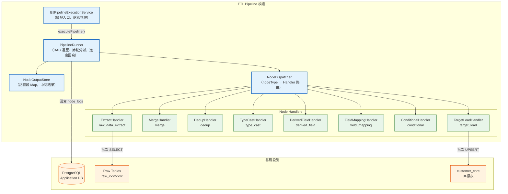
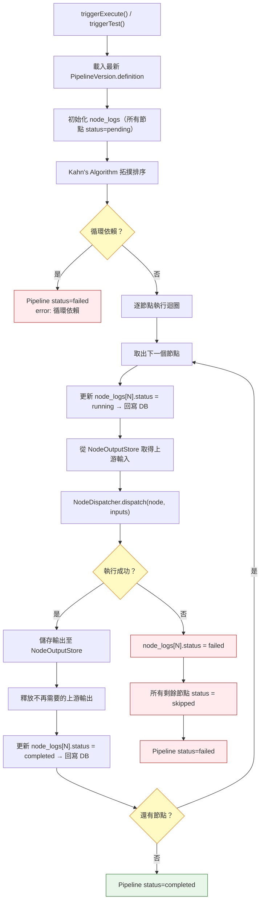
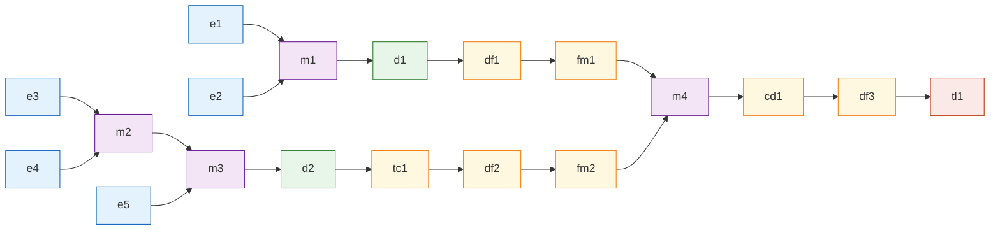
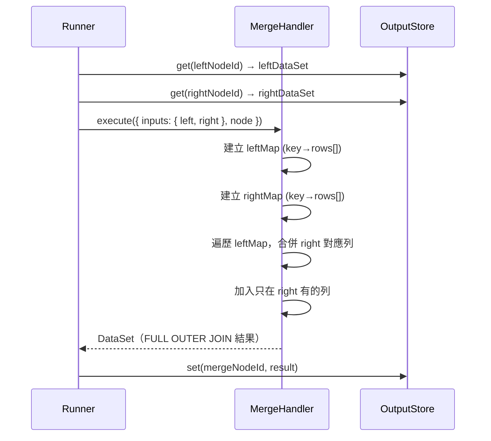
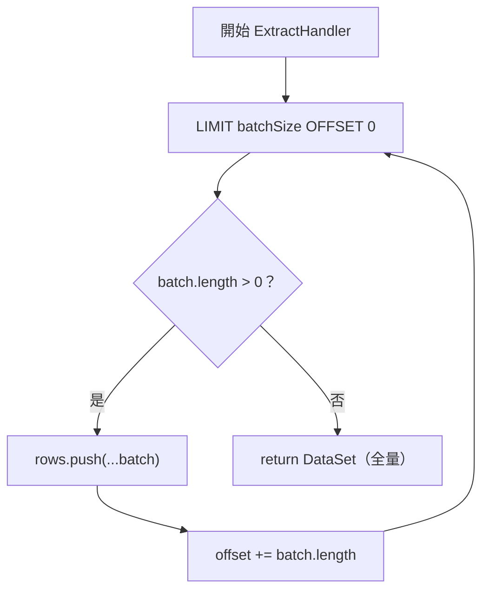
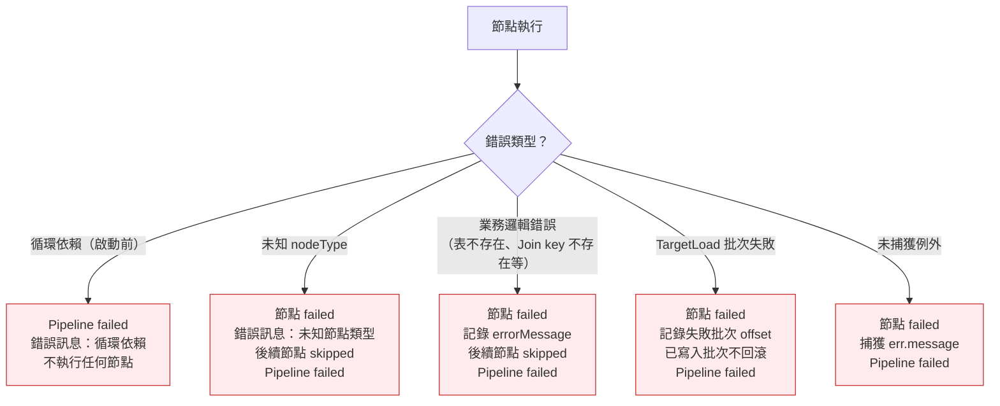

# ETL 執行引擎架構規格書

## Agent Loading Guide

| Agent 角色 | 建議閱讀章節 |
|-----------|------------|
| TDD Developer | 3. 元件設計、4. 資料流策略、5. 記憶體管理、6. 錯誤處理 |
| Test Designer | 2. 執行流程、3. 元件設計（介面定義）、6. 錯誤處理、7. 效能考量 |
| Spec Writer | 4. 資料流策略（架構決策摘要）、3.2 NodeExecutor 介面 |
| DevOps / CI/CD | 7. 效能考量（批次參數、記憶體上限） |

## 目錄

1. [架構概覽](#1-架構概覽)
2. [執行流程](#2-執行流程)
3. [元件設計](#3-元件設計)
4. [資料流策略](#4-資料流策略)
5. [記憶體管理](#5-記憶體管理)
6. [錯誤處理與回滾策略](#6-錯誤處理與回滾策略)
7. [效能考量](#7-效能考量)
8. [開放決策與風險](#8-開放決策與風險)

---

## 1. 架構概覽

### 1.1 定位

ETL 執行引擎是 `ETL Pipeline 模組` 內的執行子系統，負責將 Pipeline 定義（nodes + edges）轉換為真正的資料處理流程。它運行於現有的 `Modular Monolith` 後端之內，不另起獨立服務。

### 1.2 架構概覽圖



### 1.3 關鍵設計決策摘要

| 決策點 | 選擇 | 理由 |
|--------|------|------|
| Merge/Dedup 執行位置 | **In-Memory（JS）** | 見 4.1 節詳述 |
| DAG 執行策略 | **Kahn's algorithm 拓撲排序 + 循序執行** | 見 2.1 節詳述 |
| 中間結果儲存 | **記憶體 Map（NodeOutputStore）** | 見 5.1 節詳述 |
| Extract 讀取方式 | **批次分頁讀取，累積至單一 DataSet** | 見 5.2 節詳述 |
| Target Load 策略 | **批次 UPSERT（INSERT ... ON CONFLICT）** | 見 3.5 節詳述 |

---

## 2. 執行流程

### 2.1 DAG 排序與節點執行



**Kahn's Algorithm 實作說明：**

1. 計算每個節點的 in-degree（入度 = 被指向的 edges 數量）
2. 將所有 in-degree = 0 的節點加入佇列
3. 從佇列取出節點，加入執行序列，並將其所有下游節點的 in-degree 減 1
4. 重複步驟 3 直到佇列為空
5. 若執行序列長度 < 總節點數 → 代表存在循環依賴，拋出錯誤

**循序執行理由：** seed-pipeline 的 19 個節點呈線性鏈狀（兩條支線最終匯流），同一時間可並行的節點有限。循序執行大幅降低記憶體同時駐留量，且錯誤邊界更清晰。MVP 階段不實作並行執行。

### 2.2 seed-pipeline 執行順序（期望）



拓撲排序後，兩條獨立路線（e1→...→fm1 和 e3→...→fm2）的內部順序有保證，兩條路線之間的交替順序由演算法決定但不影響正確性（因為 m4 等待兩者皆完成）。

---

## 3. 元件設計

### 3.1 PipelineRunner

**職責：** DAG 遍歷、節點分派協調、node_logs 狀態回寫、nodeOutputMap 生命週期管理。

**關鍵介面：**

```typescript
interface PipelineRunnerConfig {
  batchSize: number;         // Extract 批次讀取大小（預設 10,000）
  upsertBatchSize: number;   // Load 批次 UPSERT 大小（預設 500）
  isTestRun: boolean;
  pipelineId: string;
}

class PipelineRunner {
  async run(
    definition: PipelineDefinition,   // { nodes, edges }
    config: PipelineRunnerConfig,
    log: EtlPipelineLog,
  ): Promise<void>
}
```

**依賴：** `NodeDispatcher`、`NodeOutputStore`、`EtlPipelineLog` Repository、`DataSource`

### 3.2 NodeDispatcher

**職責：** 根據 `nodeType` 路由至對應 Handler，傳遞正確的輸入 DataSet。

**關鍵介面：**

```typescript
interface NodeExecutionContext {
  node: PipelineNode;
  inputs: NodeInputs;           // { default?: DataSet, left?: DataSet, right?: DataSet }
  dataSource: DataSource;       // 用於 ExtractHandler 和 TargetLoadHandler
  config: PipelineRunnerConfig;
}

interface NodeHandler {
  execute(ctx: NodeExecutionContext): Promise<DataSet>;
}

// 輸入解析規則（依 edge.targetHandle）：
// - targetHandle = "left-input"  → inputs.left
// - targetHandle = "right-input" → inputs.right
// - 無 targetHandle             → inputs.default（單一上游）
```

**支援的 nodeType 清單：**
`raw_data_extract` | `merge` | `dedup` | `type_cast` | `derived_field` | `field_mapping` | `conditional` | `target_load`

### 3.3 NodeOutputStore

**職責：** 以 nodeId 為 key 的記憶體 Map，儲存每個節點的輸出 DataSet；支援引用計數以便及時釋放。

```typescript
class NodeOutputStore {
  set(nodeId: string, dataset: DataSet): void
  get(nodeId: string): DataSet | undefined
  release(nodeId: string): void    // 刪除 Map 中的 entry，GC 可回收
}
```

**釋放時機：** 當一個節點的所有下游節點皆已完成（或被 skipped），該節點的輸出即可從 Store 中移除。PipelineRunner 在拓撲排序後計算每個節點的「被引用次數」，每次下游節點完成後遞減，計數歸零則呼叫 `release()`。

### 3.4 Node Handlers

#### ExtractHandler（raw_data_extract）

- 透過 `DataSource.query()` 以分頁批次讀取 raw table
- 批次大小：`config.batchSize`（預設 10,000 筆）
- 將所有批次累積成單一 `DataSet` 後輸出
- 執行前驗證表是否存在（`information_schema.tables`）

```typescript
// 批次讀取偽碼
const rows: Record<string, unknown>[] = [];
let offset = 0;
while (true) {
  const batch = await dataSource.query(
    `SELECT * FROM "${rawTable}" LIMIT $1 OFFSET $2`,
    [batchSize, offset]
  );
  if (batch.length === 0) break;
  rows.push(...batch);
  offset += batch.length;
}
return { rows, rowCount: rows.length };
```

#### MergeHandler（merge）

- 在記憶體內執行 FULL OUTER JOIN
- 以 join key 建立兩個 lookup Map（`Map<string, Record[]>`）
- 欄位命名規則：左側欄位保留原名；右側欄位若與左側衝突加 `_right` 後綴
- Join key 欄位取非 null 者（left 優先）



#### DedupHandler（dedup）

- 在記憶體內以 `keyColumns` 分組
- `keepStrategy: "latest_timestamp"`：每組保留 `timestampColumn` 最大值的列
- null timestamp 視為最舊
- 同值時保留 index 最小者

#### TypeCastHandler（type_cast）

- 逐列逐欄套用 `castRules`
- 支援：`VARCHAR→DECIMAL`（parseFloat）、`VARCHAR→INTEGER`（parseInt）、`VARCHAR→DATE`（new Date）
- 轉換失敗設為 null，不拋錯

#### DerivedFieldHandler（derived_field）

- 支援四種表達式函數：`mergePhone`、`padStart`、`gen_random_uuid`、`CASE WHEN`
- `mergePhone` 支援選用第三參數（分機欄位）：`mergePhone(areaCol, telCol)` 或 `mergePhone(areaCol, telCol, extenCol)`；有分機時輸出 `{area}-{tel}#{exten}`，分機為 null/空/全零時不附加 `#exten`
- 直接呼叫 `etl-transforms.ts` 中已存在的 `mergePhone` 函數
- `CASE WHEN` 解析 `left.{col}` / `right.{col}` 前綴為列中的實際欄位名

#### FieldMappingHandler（field_mapping）

- 依 `mappings` 陣列重新命名欄位
- `dropUnmapped: true` 時，輸出列只含 `targetColumn` 欄位
- `sourceColumn` 不存在時，以 `defaultValue` 填入（defaultValue 為 null 則設 null）

#### ConditionalHandler（conditional）

- 逐列逐 rule 評估 `when` 表達式
- `left.{col}` 解析為列中的 `{col}` 欄位（無前綴的實際欄位名）
- `right.{col}` 解析為列中的 `{col}_right` 欄位（_right 後綴）
- 支援：`>=`、`IS NOT NULL` 運算子；null 安全（任一為 null 則條件不成立）

#### TargetLoadHandler（target_load）

- `isTestRun = true`：跳過寫入，記錄 `outputRowCount = inputDataSet.rowCount`
- `isTestRun = false`：批次 UPSERT 寫入目標表

**UPSERT 策略：**

```sql
INSERT INTO customer_core ({columns})
VALUES ({values})
ON CONFLICT (source_customer_no)
DO UPDATE SET
  {非主鍵欄位} = EXCLUDED.{非主鍵欄位},
  _etl_loaded_at = EXCLUDED._etl_loaded_at,
  _etl_pipeline_id = EXCLUDED._etl_pipeline_id
-- customer_id 不在 DO UPDATE SET 中（保留原值）
```

自動附加 ETL 追蹤欄位：`_etl_loaded_at`（執行時間）、`_etl_pipeline_id`（pipeline.id）、`data_source`（來自輸入列）。

執行前驗證目標表存在（`information_schema.tables`）；表不存在則節點立即 failed。

批次大小：`config.upsertBatchSize`（預設 500 筆）。部分寫入失敗時，已完成批次不回滾，記錄失敗批次的起始 offset 與錯誤訊息。

---

## 4. 資料流策略

### 4.1 In-Memory（JS）vs In-DB（SQL）決策

**結論：採用 In-Memory（JS）策略。**

| 評估維度 | In-Memory（JS） | In-DB（SQL） |
|---------|-----------------|-------------|
| 210 萬筆 FULL OUTER JOIN 記憶體需求 | ~2-4 GB（視欄位寬度） | 幾乎為零 |
| 實作複雜度 | 低（純 JS Map 操作） | 高（需要動態建立臨時表、管理 session） |
| 除錯難度 | 低（可加入 console log） | 高（需查 DB 臨時表） |
| 單元測試能力 | 高（純函數，無 DB 依賴） | 低（需要 DB 環境） |
| 調整欄位命名規則的靈活性 | 高（JS 字串操作） | 低（SQL 動態 alias） |
| Pipeline 定義是任意的（非固定 schema） | 好配合 | 不好配合 |

**選擇 In-Memory 的關鍵理由：**

1. **Pipeline 定義是動態的**：節點連結、join key、欄位映射皆為執行時讀取的設定，In-DB SQL 需要動態 SQL 字串拼接，既難維護又有 SQL injection 風險。
2. **單元測試隔離性**：In-Memory 處理函數可以不依賴 DB 環境進行單元測試（US-055~057 DoD 要求高覆蓋率）。
3. **記憶體可管控**：210 萬筆 × ~200 bytes/列 ≈ 420 MB（只有 ZZIP 路線）；兩條路線不同時在記憶體中（dedup 完成後立即釋放上游）。詳見第 5 節。
4. **MVP 規模**：1,000 用戶、單一 pipeline，不存在多 pipeline 並行執行的記憶體競爭問題。

**風險標記：** 若未來 raw table 規模超過 1,000 萬筆，In-Memory 策略需重新評估，屆時可引入 PostgreSQL 臨時表或 streaming 方案。

### 4.2 DataSet 介面定義

```typescript
interface DataSet {
  rows: Record<string, unknown>[];  // 記憶體內資料列
  rowCount: number;                  // = rows.length（冗餘但方便 logging）
}
```

每個 Node Handler 的輸入與輸出皆為 `DataSet`。`rowCount` 直接等於 `rows.length`，在節點執行完成後寫入 `node_logs[N].outputRowCount`。

---

## 5. 記憶體管理

### 5.1 記憶體估算（seed-pipeline）

| 階段 | 駐留的 DataSet | 估算記憶體 |
|------|---------------|-----------|
| e1 執行後 | e1 輸出（raw_101f6b3e，210萬筆） | ~420 MB |
| m1 執行後 | m1 輸出（e1+e2 FULL JOIN，~210萬筆） | ~420 MB，e1/e2 釋放 |
| d1 執行後 | d1 輸出（去重後，≤210萬筆） | ~420 MB，m1 釋放 |
| fm1 執行後 | fm1 輸出（48欄位，~210萬筆） | ~300 MB，d1/df1 釋放 |
| MLMC 路線最大點 | m3 輸出（三來源合併） | ~200 MB |
| m4 執行前 | fm1 + fm2 同時駐留 | ~500 MB |
| m4 執行後 | m4 輸出（最終合併） | ~500 MB，fm1/fm2 釋放 |
| tl1 執行中 | cd1→df3 輸出 + 批次緩衝 | ~500 MB |

**峰值記憶體估算：約 600-800 MB**（含 Node.js 運行時開銷）。Node.js heap 預設上限為 ~1.5 GB，建議部署時設定 `--max-old-space-size=2048`。

### 5.2 批次讀取策略（Extract）



批次讀取僅是分批從 DB 拉資料以避免單次 query 佔用過多 DB 資源，最終仍累積為完整 DataSet 供下游處理。這是 MVP 的務實選擇，而非 streaming 架構。

**注意：** 批次大小（`batchSize = 10,000`）可透過環境變數 `ETL_EXTRACT_BATCH_SIZE` 覆蓋。

### 5.3 中間結果釋放策略

PipelineRunner 在執行前預先計算「下游引用計數」：

```typescript
// 建立每個節點被引用的次數
const refCount = new Map<string, number>();
for (const edge of edges) {
  refCount.set(edge.source, (refCount.get(edge.source) ?? 0) + 1);
}

// 節點 N 執行完成後，減少其上游的引用計數
for (const upstreamId of getUpstreamIds(node)) {
  const remaining = refCount.get(upstreamId)! - 1;
  refCount.set(upstreamId, remaining);
  if (remaining === 0) {
    outputStore.release(upstreamId);  // 釋放記憶體
  }
}
```

---

## 6. 錯誤處理與回滾策略

### 6.1 錯誤分類與處置



### 6.2 node_logs 狀態轉移

```
pending → running → completed
                 └→ failed
pending → skipped（當上游節點 failed 或未執行）
```

**回寫時機：**
- `running`：節點開始執行前立即回寫（確保進度 API 可見）
- `completed`：節點執行完成後回寫（含 durationMs、inputRowCount、outputRowCount）
- `failed`：節點拋出例外後回寫（含 errorMessage）
- `skipped`：PipelineRunner 檢測到失敗後批量回寫所有剩餘節點

### 6.3 TargetLoad 部分寫入

TargetLoad 節點不使用單一 transaction 包覆所有批次（因為 210 萬筆的 transaction 會造成 DB 鎖定時間過長）。採用「批次提交，失敗記錄」策略：

- 每批次獨立 commit
- 某批次失敗時，記錄 `failedAtOffset`、`errorMessage` 並停止後續批次
- Pipeline 標記為 failed，但已寫入的資料保留
- 下次執行（retry）時，UPSERT 策略確保冪等性（重複寫入同 `source_customer_no` 只更新不重複 INSERT）

**此決策的接受理由：** ETL 的目標是「最終一致」，部分寫入後 retry 可補全。強一致性 rollback 在大批量場景代價過高。

### 6.4 Pipeline 層級狀態回寫

```typescript
// 成功路徑
log.status = 'completed';
pipeline.status = 'active';  // 或 test run 時恢復 previousStatus
pipeline.execution_count += 1;
pipeline.processed_count += outputRowCount;

// 失敗路徑
log.status = 'failed';
log.error_message = `節點 ${failedNodeId} 失敗：${errorMessage}`;
pipeline.status = 'failed';
```

---

## 7. 效能考量

### 7.1 關鍵路徑瓶頸

| 瓶頸點 | 預估時間 | 緩解策略 |
|-------|---------|---------|
| ExtractHandler 讀取 210 萬筆 | 30-120 秒（取決於 raw table 索引與 DB I/O） | 批次分頁讀取，避免單次 query 逾時 |
| MergeHandler FULL JOIN | 5-15 秒（純 JS Map 操作） | 使用 Map 而非巢狀迴圈（O(n) vs O(n²)） |
| DedupHandler | 3-8 秒 | 使用 Map 分組，避免排序（O(n)） |
| TargetLoad UPSERT 210 萬筆 | 60-300 秒（批次 500 筆，約 4,200 次 DB round-trip） | 批次大小可調，未來可改 COPY 策略 |

**預估總執行時間：2-8 分鐘**（視伺服器規格與 DB I/O 效能）。

### 7.2 node_logs 回寫頻率

每個節點執行時回寫 2 次（running + completed/failed）。19 個節點共約 38 次 DB 寫入，對 PostgreSQL 而言負擔可接受。不使用 transaction 包覆（確保進度即時可見）。

### 7.3 啟動參數建議

```
NODE_OPTIONS="--max-old-space-size=2048"   # 2 GB heap
ETL_EXTRACT_BATCH_SIZE=10000               # Extract 批次大小
ETL_UPSERT_BATCH_SIZE=500                  # UPSERT 批次大小
```

### 7.4 可觀測性

- 每個節點記錄 `durationMs`（節點耗時）
- PipelineLog 記錄總 `duration_ms`
- `processed_count` 追蹤實際處理筆數（即 TargetLoad 的 outputRowCount）
- Logger 記錄每個節點的執行開始/結束與輸出筆數（`this.logger.log()`）

---

## 8. 開放決策與風險

### 8.1 已決議事項

| 決策 | 結論 |
|------|------|
| In-DB vs In-Memory | In-Memory（JS）|
| DAG 執行方式 | Kahn's algorithm 循序執行 |
| 中間結果儲存 | 記憶體 Map，完成後釋放 |
| Extract 讀取方式 | 批次累積，全量 DataSet |
| UPSERT 策略 | INSERT ON CONFLICT（PostgreSQL 原生支援） |
| TargetLoad 事務策略 | 批次提交，接受部分寫入，依賴 UPSERT 冪等性 |
| 測試執行行為 | TargetLoad 節點跳過寫入，其餘節點正常執行 |

### 8.2 風險

| 風險 | 嚴重度 | 緩解 |
|------|--------|------|
| 210 萬筆同時駐留記憶體超過 2 GB | 高 | 確認 raw_101f6b3e 欄位數量與列寬；部署時設定 heap 上限 |
| UPSERT 500 筆批次造成 TargetLoad 過慢（>10 分鐘） | 中 | 可調整 `ETL_UPSERT_BATCH_SIZE` 至 1,000-5,000 |
| raw table 缺少索引導致批次 SELECT 逾時 | 中 | 確認 raw table 是否有 `_cdmp_id` 主鍵（已有 SERIAL） |
| 多個欄位的 CASE WHEN 表達式解析錯誤 | 中 | 測試 df3 的 `data_source` 表達式；明確定義 `left.` / `right.` 解析規則 |

### 8.3 US-058 批次策略依賴

本架構文件對 US-058（批次處理策略）留有擴充點：

- `config.batchSize` 和 `config.upsertBatchSize` 已作為設定參數
- US-058 可以覆蓋這些參數，或引入更複雜的自適應批次策略
- 若 US-058 決定採用 streaming DataSet（而非全量累積），需修改 `NodeOutputStore` 和各 Handler 的介面

---

*本文件版本 1.0，涵蓋 US-055、US-056、US-057 的架構設計。US-058 批次策略待定，介面已預留擴充點。*
