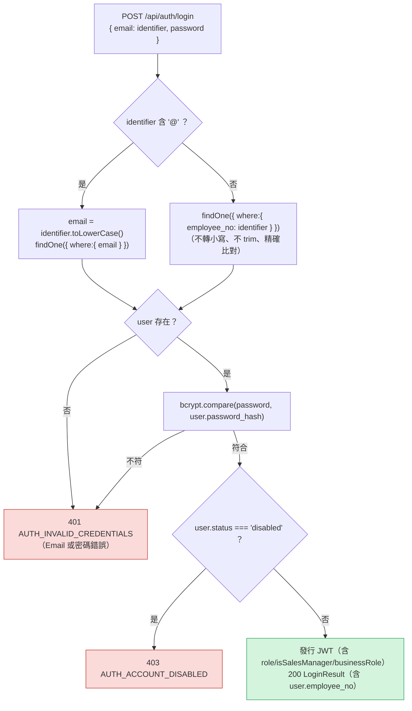
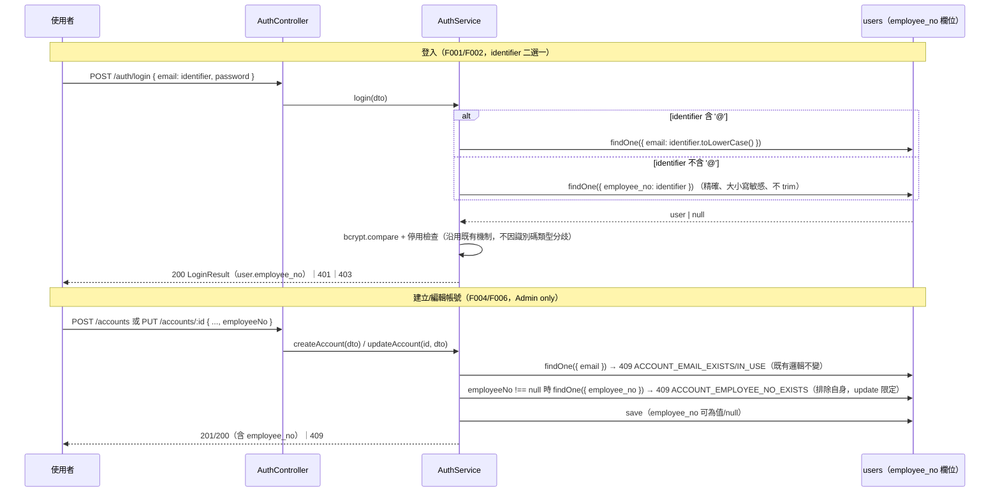

# AD-E02-5：F113 員工編號作為登入識別碼架構設計

## Agent Loading Guide

| Agent 角色 | 需載入章節 |
|-----------|-----------|
| TDD Developer | §2（既有事實）+ §3（全部裁定，含程式碼契約）+ §4（migration 全文）+ §5（端點契約）+ §7（不變式）+ §8（測試邊界）+ §9（檔案異動清單） |
| Test Designer | §3.2（collation / 唯一性雙軌 + P1b2 測試衝擊）+ §3.3（登入分支，含 trim 修正）+ §7 + §8 |
| UI/UX Designer | §3.4（表單欄位契約 / 錯誤訊息優先序）+ §6（前端架構） |
| Product Analyst | §1（AD 編號說明）+ §10（風險）+ §11（待裁決） |

---

## 1. 背景與問題定義

[F113](../features/F113-employee-no-login-identifier.md)（US-179）為 `users` 新增選填、可為 NULL 的 `employee_no`（員工編號），供 Admin 於帳號管理設定；設定後該帳號可於登入頁以 Email 或員工編號擇一登入。F113 spec §17（更新紀錄）已凍結欄位契約、格式規則、識別碼比對規則、驗收標準；本 AD **不重議**這些業務規則，只裁定**如何實作**，並裁定 spec §11 交本 AD 的三個架構 Open Question：

| OQ | 問題 |
|----|------|
| OQ-F113-01 | Filtered unique index migration 之檔名／編號、`Chinese_Taiwan_Stroke_BIN` collation 下大小寫敏感語意是否與 service 層 JS 精確比對一致、backfill 是否需前置去重掃描 |
| OQ-F113-02 | forgot-password 輸入純員工編號時，維持現況 400 格式錯誤，或放寬為與登入一致並回 200 通用成功 |
| OQ-F113-03 | `@cdmp/shared`（web）與 api-local 型別副本之 `employee_no` 同步落點 |

### 1.1 AD 編號裁定（非 spec 範圍，架構自主裁定）

任務指示原建議本檔命名為 `AD-E02-1`。但實際 grep 全庫發現 **`AD-E02-1`～`AD-E02-4`（含子決策 `4-A`～`4-F`）已被大量使用**，只是以「內嵌決策」形式存在於 `docs/specs/architecture-spec.md`（§591～§882，例如 `**架構決策 AD-E02-1（更新 2026-04-24）：角色 + is_sales_manager 旗標 RBAC 模型**`、`**架構決策 AD-E02-4（新增 2026-05-13）：前端路由 Guard 模型與共用 Sidebar 架構**`），並廣泛反向引用於程式碼註解（`apps/api/src/database/entities/user.entity.ts:40`、`apps/api/src/modules/auth/auth.service.ts:91/97`、`apps/api/src/database/seeds/seed.ts:35`、`apps/api/src/common/jwt/jwt.util.ts:7`、`packages/shared/src/index.ts:88`）與多份 feature spec（F004/F008/F073/F074）。這與任務指示本身预告的情境完全吻合（「若程式碼註解中有 AD-E02 編號提示，取不衝突的編號」）。

**裁定：本檔取號 `AD-E02-5`**——延續既有 `AD-E02-1`～`4` 的編號序列，作為 E02 epic **首個獨立檔案化**的 AD（`AD-E02-1`～`4` 仍留在 `architecture-spec.md` 內嵌，不追溯遷移，避免無謂大改既有文件）。`AD-E02-5` 為系列中第一個依照 `docs/specs/implementation-log/AD-E##-N-*.md` 標準檔案格式產出的 E02 AD，後續 E02 相關架構決策應延續此檔案化慣例（`AD-E02-6` 起）。

---

## 2. 既有架構基礎（不分叉，不得修改語意）

| 元件 | 檔案 | 角色 |
|---|---|---|
| `User` entity | `apps/api/src/database/entities/user.entity.ts` | `email` 為 `@Column({unique:true, length:255})`；`business_role` 為 `@Column({type:'varchar', length:20, nullable:true, default:null})`（無 unique，最近的「nullable varchar」欄位範本） |
| `QueueJob` entity + `1751884800002-MssqlQueueJobSchema.ts` | `apps/api/src/database/entities/queue-job.entity.ts` | **兩軌唯一性索引之既有先例**（AD-E07-40 P2a）：entity 之 `@Index` 為一般索引（synchronize 可攜，dev 用）；真正 `WHERE state=...` 的 filtered index **僅存在於手寫 baseline migration**，不透過 decorator 表達。本 AD §3.1 直接沿用此設計精神 |
| `mssql-p1b2.mssql.spec.ts` | `apps/api/src/database/__tests__/mssql-p1b2.mssql.spec.ts` | **關鍵既有事實**：(a) `COLLATE-BASELINE-001` 斷言 dbo 全欄 collation 唯一 = `Chinese_Taiwan_Stroke_BIN`；(b) `FILTER-001`/`FILTER-002` 斷言 baseline 路徑（dbo／p1b2_sync）filtered index 計數皆為 **0**；(c) `PARITY-004`/`PARITY-005` 斷言 Path A（synchronize→`p1b2_sync`）與 Path B（migration→`dbo`）索引集合 diff 為空（`I-MSSQL-BASELINE-PARITY-01`）；(d) `BASELINE-003` 硬編碼斷言 `typeorm_migrations` 恰 **3** 筆；(e) `STATIC-004` 硬編碼 `for (let i=1;i<=3;i++)` 逆轉 3 支 migration；(f) `EXCLUDED_TABLES = ('typeorm_migrations','queue_job','customer_core')` 為既有「整表排除」機制，僅在新表兩軌索引形狀本質不同時使用。本 AD §3.2.4／§10 詳述新增第 4 支 mssql migration 對 (b)(c)(d)(e) 四項既有硬編碼斷言之衝擊 |
| `LoginDto` | `apps/api/src/modules/auth/dto/login.dto.ts` | 現況 `@IsEmail({},{message:'請輸入有效的 Email 地址'})` + `@IsNotEmpty()`；無 `MaxLength` |
| `AuthService.login()` | `apps/api/src/modules/auth/auth.service.ts:52-117` | 現況 `const email = dto.email.toLowerCase(); findOne({where:{email}})`（**無 trim**，僅 lowercase）；BR-002/BR-003 順序（密碼驗證 → 停用檢查）本 AD 不變動 |
| `ForgotPasswordDto` / `AuthService.forgotPassword()` | `apps/api/src/modules/auth/dto/forgot-password.dto.ts` / `auth.service.ts:152-176` | 現況 `@IsEmail` 嚴格驗證；BR-4「無論 Email 是否存在，回應一律相同」。本 AD §3.7 裁定**完全不動** |
| `AccountsService.createAccount()` / `updateAccount()` | `apps/api/src/modules/accounts/accounts.service.ts:182-265` | Email 唯一性檢查範本：`findOne({where:{email}})`（create）／`existing.id !== id`（update，BR-3 排除自身）；本 AD §3.4 之 `employee_no` 檢查逐字比照此範本，於 email 檢查**之後**執行 |
| `AccountsService.findAll()` | `accounts.service.ts:124-180` | QueryBuilder `.select([...])` + `LOWER(user.name) LIKE :search OR LOWER(user.email) LIKE :search` + `.map()` 映射至 `AccountListItem` |
| `CreateAccountDto` / `UpdateAccountDto` | `apps/api/src/modules/accounts/dto/*.ts` | `CreateAccountDto` 含選填 `isSalesManager?`（`@IsOptional()` 範本）；`UpdateAccountDto` 現僅 `name`/`email`（皆必填，PUT 全量替換語意，非 PATCH） |
| `ERROR_CODES` / `ERROR_MESSAGES` | `apps/api/src/common/errors/error-codes.ts` | 既有 `ACCOUNT_EMAIL_EXISTS`（create 重複，409）/ `ACCOUNT_EMAIL_IN_USE`（update 重複排除自身，409）為 `employee_no` 對應碼之直接範本；末端已有 `// F112 / AD-E07-47 §3.6：...` 之「新碼 + 引用 AD」註解慣例可沿用 |
| `packages/shared/src/index.ts` | 單一扁平檔案 | `UserInfo`（L83-94）／`CreateAccountRequest`（L105-112）／`CreateAccountResponse`（L114-125）／`UpdateAccountRequest`（L128-131）／`UpdateAccountResponse`（L133-144）／`AccountListItem`（L225-237）皆為既有 interface，本次為**修改既有欄位**而非新增區塊，不套用「`// F0xx: 功能名` 整塊 append」慣例 |
| `seed.ts` | `apps/api/src/database/seeds/seed.ts` | `SEED_ACCOUNTS` 陣列 + drift-check（`existing.role !== account.role \|\| ...`）+ create-if-absent 兩段式冪等 seeding；4 筆既有帳號（admin/disabled-admin/user/sales-manager） |
| 全域 `ValidationPipe` | （由 `assignment-overview.controller.spec.ts:95` 等既有測試證實其設定） | `{whitelist:true, forbidNonWhitelisted:true, transform:true}`——**修正 spec 措辭**：spec §7.1 稱「`employeeNo` 未加入 DTO 會被 strip」，但 `forbidNonWhitelisted:true` 之實際行為是**整個請求 400 拒絕**（非靜默剝除），論點方向相同（未宣告=不可用）但後果更嚴重，DTO 宣告是硬性前提 |
| `nvarcharColumnType` | `apps/api/src/common/database/column-types.ts:92-112` | 為「中文顯示欄位」在 `Chinese_Taiwan_Stroke_BIN` 下避免 byte-length 截斷而生的 helper。`employee_no` 格式（`^[A-Za-z0-9_-]{1,32}$`）為 **ASCII-only**，不落入此 helper 的適用場景（§3.1 Auto-Challenge） |
| `@Transform` 正規化範本 | `apps/api/src/modules/assignment-scoring/dto/delete-card-type-query.dto.ts:14-18` | 既有「先 `@IsOptional()`、次 `@Transform(...)`、後驗證裝飾器」宣告順序範本，本 AD §3.4 DTO 設計沿用 |

---

## 3. 核心設計決策

### 3.1 Entity 與兩軌唯一性設計（OQ-F113-01 之一）

**裁定**：`User.employee_no` 為 plain nullable column，**不宣告** `unique:true`；filtered unique index **僅存在於**新的手寫 MSSQL migration，比照 `queue_job`（AD-E07-40）之兩軌精神。

```typescript
// apps/api/src/database/entities/user.entity.ts（新增欄位）
// F113 / US-179 / AD-E02-5：員工編號（登入識別碼二選一，選填、有值時唯一）。
// 唯一性雙軌：本欄位為 plain column（不宣告 unique）——MSSQL 之 plain UNIQUE 僅允許
// 單一 NULL，與「多個未設定員工編號的帳號需並存」需求衝突（不同於 email，email 為
// NOT NULL 必填，plain unique 不受此限）。真正的 filtered unique index 僅存在於手寫
// migration（§3.2，比照 AD-E07-40 queue_job 兩軌策略），dev/sqlite synchronize 僅產生
// 欄位本身，不產生該 filtered index。
// Migration: 1751884800004-MssqlAddUsersEmployeeNo.ts
@Column({ type: 'varchar', length: 32, nullable: true, default: null })
employee_no: string | null;
```

**型別選擇（Auto-Challenge：是否該用 `nvarcharColumnType`）**：`nvarcharColumnType` helper（`column-types.ts:92-112`）是為「中文顯示欄位在 `Chinese_Taiwan_Stroke_BIN` 下以 byte 計長而遭截斷」問題而生（P5i 修復家族）。`employee_no` 之格式白名單（FMT-1：`^[A-Za-z0-9_-]{1,32}$`）**恆為 ASCII**，不存在中文截斷風險，套用該 helper 只會增加不必要的間接層。裁定：維持任務指示之字面 `type:'varchar'`，與 `email` 欄位（同樣 ASCII、同樣裸 `varchar`）之既有慣例一致。

**是否需要伴隨的一般（非唯一）`@Index`（Auto-Challenge：是否該比照 queue_job 補一般索引）**：**不需要**。`queue_job` 之所以需要「entity 一般索引 + migration filtered index」雙形狀並存，是因為 queue_job 為佇列熱路徑表，dev/test 環境也需要體感一致的查詢效能驗證。`users` 表基數受限於員工人數（數十至數百列，非交易量表），登入 `WHERE employee_no = ?`、service 層重複檢查、清單 `LIKE` 搜尋在此表規模下全表掃描成本可忽略；而 MSSQL 生產環境的 filtered unique index（§3.2）本身即是一個真實 B-tree 索引，天然涵蓋登入查詢的效能需求，無需額外疊加一個形狀不同的一般索引。裁定：**不新增 `@Index` decorator**，維持 entity 為裸 `@Column`。

### 3.2 Migration（軌道 B：DB 防線）

#### 3.2.1 檔名與時間戳（OQ-F113-01 之一）

既有 `migrations/mssql/*` 序列：`1751884800000`（baseline schema）／`1751884800001`（reference data）／`1751884800002`（queue_job）／`1751884800003`（customer_core code-decode data-update）。裁定：新增第 5 支，時間戳 `1751884800004`（> 既有全部，於 `users` 表已由 baseline 建立完畢之後才 `ALTER`）：

```
apps/api/src/database/migrations/mssql/1751884800004-MssqlAddUsersEmployeeNo.ts
```

#### 3.2.2 DDL

```typescript
import { MigrationInterface, QueryRunner } from 'typeorm';

/**
 * AD-E02-5 — F113/US-179：users 新增選填 employee_no（員工編號，登入識別碼二選一）。
 *
 * 角色：employee_no「有值時唯一」雙軌唯一性設計之軌道 B（DB 防線）——手寫 filtered
 *   unique index，比照 AD-E07-40 queue_job 兩軌策略（entity 維持 plain @Column，
 *   不宣告 unique；真正的 filtered unique index 只存在於本 migration）。
 *
 * 與 queue_job 的關鍵差異：queue_job 是全新表，兩軌索引形狀本就注定不同（不同欄位
 *   組成），對 mssql-p1b2 parity 測試套件而言用整表排除即可處理。employee_no 是對
 *   「既有 36 表 baseline 之一」（users）的追加欄位＋索引：Path A（synchronize）與
 *   Path B（本 migration）之「欄位定義」完全一致（皆為 plain nullable varchar(32)），
 *   僅「是否具備 filtered unique index」不同——此為刻意的、僅限索引層級的兩軌分歧，
 *   不應／不需要整表排除（會誤傷 users 既有 PK / email unique index 的 parity 覆蓋）。
 *   對既有 mssql-p1b2.mssql.spec.ts 之精確衝擊分析見 AD-E02-5 §3.2.4 / §10。
 *
 * Backfill：新增當下所有既有 users 列 employee_no 恆為 NULL（全新欄位，不存在任何
 *   舊列可能已有值的情境），filtered unique index 建立時比對母體（WHERE employee_no
 *   IS NOT NULL）為空集合，無重複風險，無需前置去重掃描（OQ-F113-01 裁定）。
 *
 * Collation：不宣告任何欄位層級 COLLATE（比照 baseline 慣例，COLLATE-BASELINE-003
 *   靜態守門），新欄位繼承資料庫層級 Chinese_Taiwan_Stroke_BIN（二進位定序、大小寫
 *   敏感）——與登入分支之 JS 精確比對（不轉小寫）、filtered unique index 之大小寫
 *   敏感唯一性語意完全一致（OQ-F113-01 裁定，理由詳 §3.2.3）。
 *
 * 索引命名：`uq_users_employee_no`（小寫 `uq_` 前綴 + snake_case），比照本專案唯一
 *   既有 UNIQUE INDEX 範例 `uq_assignment_run_stage_log_run_stage`
 *   （1751884800000-MssqlBaselineSchema.ts:63），非 queue_job 的 `idx_`（一般索引）
 *   前綴。
 */
export class MssqlAddUsersEmployeeNo1751884800004 implements MigrationInterface {
  name = 'MssqlAddUsersEmployeeNo1751884800004';

  public async up(queryRunner: QueryRunner): Promise<void> {
    await queryRunner.query(`ALTER TABLE "users" ADD "employee_no" varchar(32) NULL`);
    await queryRunner.query(
      `CREATE UNIQUE INDEX "uq_users_employee_no" ON "users" ("employee_no") WHERE "employee_no" IS NOT NULL`,
    );
  }

  public async down(queryRunner: QueryRunner): Promise<void> {
    // MSSQL 不允許在欄位仍持有索引時直接 DROP COLUMN，須先 DROP INDEX。
    await queryRunner.query(`DROP INDEX "uq_users_employee_no" ON "users"`);
    await queryRunner.query(`ALTER TABLE "users" DROP COLUMN "employee_no"`);
  }
}
```

**索引命名修正（Auto-Challenge：任務指示 `"UX_users_employee_no"` vs 既有慣例）**：任務指示字面建議索引名 `UX_users_employee_no`（大寫 `UX_` 前綴）。但 grep 全庫發現本專案**唯一**既有 UNIQUE INDEX 前例為 `uq_assignment_run_stage_log_run_stage`（baseline schema，小寫 `uq_` 前綴、snake_case）。`UX_`（大寫、非既有詞彙）在本庫沒有任何先例。裁定：**改用 `uq_users_employee_no`**，與既有唯一慣例一致；雖然 `mssql-p1b2.mssql.spec.ts` 之 `CASE-BASELINE-001/002` 僅斷言**表名／欄名**小寫，未涵蓋索引名，此改動不影響既有測試通過與否，純粹是與既有命名慣例對齊的架構一致性修正。

#### 3.2.3 Collation 與大小寫敏感語意（OQ-F113-01 核心裁定）

**裁定：確認 `Chinese_Taiwan_Stroke_BIN`（DB 層級）之大小寫敏感語意與 service 層 JS 精確比對、登入分支之期望完全一致，無需任何額外處理。**

- `Chinese_Taiwan_Stroke_BIN` 為**二進位（`_BIN`）定序**：SQL Server 二進位定序之字串比較（含 `=`、`UNIQUE INDEX` 鍵值比對）為**逐 byte** 比較，天生大小寫敏感、腔調敏感。已由 `mssql-p1b2.mssql.spec.ts` 之 `TS-MSSQL-P1B2-COLLATE-BASELINE-001` 實測確認 dbo 全欄 collation 唯一值即為此定序；本 migration 之 `ALTER TABLE ADD` 不宣告任何欄位層級 `COLLATE`（§3.2.2 已明載），新欄位自動繼承此 DB 層級定序（比照 `COLLATE-BASELINE-002`「無任何欄位層級 COLLATE 覆寫」之既有慣例）。
- 三個消費點的大小寫語意因此**天然一致**，不需任何 driver-conditional 或應用層額外比對邏輯：
  1. **DB filtered unique index**（軌道 B）：`"E12345"` 與 `"e12345"` 於 `_BIN` 定序下為不同鍵值，兩者可並存不違反唯一性——精確對應 spec §4「唯一性比對……大小寫敏感（精確比對）」。
  2. **Service 層重複檢查**（軌道 A，`findOne({where:{employee_no}})`）：TypeORM 產生參數化 `WHERE "employee_no" = @0`，比較語意完全交由欄位 collation 決定；MSSQL 下天然大小寫敏感，**sqlite 下亦然**（sqlite 之 `TEXT` 欄位預設定序為 `BINARY`，`=` 比較同樣大小寫敏感，除非顯式宣告 `COLLATE NOCASE`，本欄位未宣告）——兩個 driver 在此議題上**無需任何分歧程式碼**即已一致（I-EMPNO-CASE-SENSITIVE-UNIQUE-01）。
  3. **登入分支精確比對**（`findOne({where:{employee_no: identifier}})`，§3.3）：同一組查詢語意，MSSQL/sqlite 皆天然大小寫敏感，與 spec BR-6「精確、大小寫敏感（不轉小寫）」一致。
- **與清單搜尋（§3.5）刻意不同的機制**：清單搜尋之「大小寫不敏感」並非透過 collation 達成，而是透過 SQL `LOWER(...)` 函式將**兩側**值都先轉小寫再比較（`LOWER(user.employee_no) LIKE :search`，`:search` 於 JS 端已 `.toLowerCase()`）。`LOWER()` 是純值轉換函式，其行為不受欄位定序之大小寫敏感性影響（不論 `_BIN` 或 `_CI`，`LOWER('E12345')` 恆為 `'e12345'`）——此為與既有 email 清單搜尋完全相同、已驗證多年的既有機制，套用至 `employee_no` 無新風險。

**PostgreSQL 不在本次分析範圍**：專案已於 2026-07-11 完成 PG 全面移除（`main` 分支，104 commit），現行僅 sqlite（dev/CI）與 MSSQL（dev-mssql/prod）兩個 driver，本節分析已完整覆蓋兩者。

**Backfill / 去重掃描（OQ-F113-01 之三）**：**不需要**。本欄位為全新欄位，`ALTER TABLE ADD` 完成瞬間所有既有列之 `employee_no` 恆為 `NULL`（無法有任何非 NULL 舊值），`CREATE UNIQUE INDEX ... WHERE employee_no IS NOT NULL` 建立時比對之候選列集合為空集合，不可能觸發唯一性違反，無需任何前置 `SELECT ... GROUP BY ... HAVING COUNT(*)>1` 去重掃描。

#### 3.2.4 對既有 `mssql-p1b2.mssql.spec.ts` 之衝擊（風險，交 test-designer／tdd-implementation）

新增第 5 支 mssql migration 後，該套件之 `runTypeormCli('migration:run')` 會依 glob 掃描 `migrations/mssql/*` 執行**全部**待處理 migration（非僅 baseline 三支），因此本 migration 會被一併套用於該套件之 dbo 建置流程，對其中 **4 項現行硬編碼斷言**產生真實衝擊：

| 測試 | 現行斷言 | 衝擊 | 建議修法 |
|---|---|---|---|
| `BASELINE-003`（L346-360） | `typeorm_migrations` 恰 **3** 筆 | 新增第 4 支後將變為 4 筆，斷言失敗 | 機械式調整：`toBe(3)` → `toBe(4)`，並更新緊鄰註解（`schema + reference-data + queue_job baseline` → `+ users employee_no`） |
| `STATIC-004`（L875-890） | `for (let i=1;i<=3;i++)` 逆轉 3 支 baseline | 逆轉迴圈少跑一次，本 migration 之 `DROP INDEX`/`DROP COLUMN` 不會被驗證逆轉，且遺留最後 1 筆 `typeorm_migrations` 記錄使後續斷言（`Number(migRows[0].n)).toBe(0)`）失敗 | 機械式調整：迴圈上限 3 → 4；更新逆轉順序註解（LIFO：本 migration 因時間戳最新，`migration:revert` 第 1 次即優先逆轉之，其餘三支序位順延） |
| `FILTER-001`（L559-561） | Path B（dbo）filtered index 計數 = **0** | 本 migration 之 `uq_users_employee_no` 為刻意的 filtered index，計數將變為 1，斷言失敗 | **非機械式**：需將計數查詢排除本索引，但**不可**沿用 `EXCLUDED_TABLES` 整表排除（會連帶排除 `users` 表既有 PK／email unique index 的覆蓋，見下） |
| `PARITY-004`/`PARITY-005`（L418-441） | Path A（`p1b2_sync`，純 synchronize）與 Path B（`dbo`）索引集合 diff 為空 | entity 未宣告 `@Index`，Path A 不會產生 `uq_users_employee_no`；Path B 因本 migration 而有——`onlyB` 集合差異，違反 `I-MSSQL-BASELINE-PARITY-01`，斷言失敗 | **非機械式**：同上，需要「僅排除單一具名索引」而非整表排除 |

**裁定（架構建議，非本 AD 直接實作）**：`FILTER-001`／`PARITY-004`／`PARITY-005` 三者不可比照 `queue_job` 之 `EXCLUDED_TABLES` 整表排除機制——`queue_job` 是全新表，整表排除不損失既有覆蓋；`users` 是既有 36 表 baseline 之一，若整表排除將意外停止驗證其 PK（`id`）與 `email` unique index 之 parity（既有覆蓋範圍不應因本次新增而倒退）。建議新增一個**索引層級**（而非表層級）的「已知刻意分歧」白名單，套用於 `countFiltered()` 之查詢述詞與 `fetchIndexRows()` 之查詢述詞，例如：

```sql
-- countFiltered() 與 fetchIndexRows() 皆追加：
AND NOT (t.name = 'users' AND i.name = 'uq_users_employee_no')
```

或等價地在既有 `EXCLUDED_TABLES` 常數旁新增一個 `KNOWN_FILTERED_INDEX_EXCEPTIONS: Array<{table:string; index:string}>` 常數，於 SQL 組裝或後製過濾階段套用。此為 **CI 阻斷風險**：本 migration 一旦合併但測試套件未同步調整，`mssql-p1b2.mssql.spec.ts` 的 `FILTER-001`／`PARITY-004`／`PARITY-005`／`BASELINE-003`／`STATIC-004` 五項既有測試會全部轉紅（非本 migration 邏輯錯誤，而是既有測試假設過時）。本 AD 僅裁定架構方向（索引層級白名單，非表層級排除），實際測試檔修改屬 test-designer／tdd-implementation 職責範圍（CLAUDE.md「各 agent 角色不可越界」），已於 §9／§10 明確 flag。

### 3.3 登入識別碼分支邏輯（軌道 A 的登入端消費點）

#### 3.3.1 `LoginDto` 放寬

```typescript
// apps/api/src/modules/auth/dto/login.dto.ts
import { IsNotEmpty, IsOptional, IsBoolean, IsString, MaxLength } from 'class-validator';

export class LoginDto {
  // F113 §5.2：由 @IsEmail 放寬為 @IsNotEmpty + @IsString，使員工編號（不含 '@'）
  // 可通過 DTO 層、進入 service 分支判斷。MaxLength(255) 為寬鬆防禦性上限——沿用
  // email 欄位長度（255），非 employee_no 之 32 字元格式邊界；employee_no 之格式
  // 驗證（^[A-Za-z0-9_-]{1,32}$）僅於帳號建立/編輯時執行（§3.4），登入端刻意不做
  // 格式檢查（避免以 400 vs 401 之差異洩漏「輸入值是否長得像合法員工編號」）。
  @IsString({ message: '請輸入 Email 或員工編號' })
  @IsNotEmpty({ message: '請輸入 Email 或員工編號' })
  @MaxLength(255, { message: '長度不可超過 255 字元' })
  email: string;

  @IsNotEmpty({ message: '請輸入密碼' })
  password: string;

  @IsOptional()
  @IsBoolean()
  rememberMe?: boolean;
}
```

文案為架構草案，最終文案交 ui-ux-designer（比照 spec §3.2 慣例）。

#### 3.3.2 `AuthService.login()` 分支（含對任務指示的必要修正）

```typescript
// apps/api/src/modules/auth/auth.service.ts
async login(dto: LoginDto): Promise<LoginResult> {
  // F113 §5.3 / I-EMPNO-LOGIN-EXACT-NO-TRIM-01：identifier 不 trim、不預先小寫化。
  // 僅於判定為 Email 分支（含 '@'）時才 toLowerCase()；員工編號分支精確比對原始
  // 提交值。使用者輸入含首尾空白或大小寫不符 → user 查無 → 統一 401（不洩漏，
  // 屬 spec §5.3 明文之預期行為，非 bug）。
  const identifier = dto.email;
  const user = identifier.includes('@')
    ? await this.userRepository.findOne({ where: { email: identifier.toLowerCase() } })
    : await this.userRepository.findOne({ where: { employee_no: identifier } });

  // BR-002: 不存在的識別碼回傳統一錯誤訊息（沿用既有邏輯，不因識別碼類型而分歧）
  if (!user) {
    throw new UnauthorizedException({
      error: ERROR_CODES.INVALID_CREDENTIALS,
      message: ERROR_MESSAGES.INVALID_CREDENTIALS,
    });
  }

  // BR-001/BR-002/BR-003（bcrypt 比對 → 停用檢查）逐字沿用既有程式碼，不動。
  ...

  return {
    token,
    user: {
      id: user.id,
      name: user.name,
      email: user.email,
      role: user.role,
      isSalesManager,
      businessRole,
      employee_no: user.employee_no ?? null, // F113 §3.4 回應曝露
    },
  };
}
```

`LoginResult.user` interface（同檔 `auth.service.ts:21-32`）同步新增 `employee_no: string | null;`。

**Auto-Challenge：修正任務指示建議之 `trim()`（重要偏離，以 spec 為準）**——任務指示原文建議 `const raw = dto.email.trim(); if (raw.includes('@')) ...`。但 F113 spec §5.3 明文：「**員工編號比對不做小寫化；因儲存值已於寫入時 trim，登入時以提交值精確比對**（若使用者輸入含首尾空白或大小寫不符，將比對不到 → 回統一 `INVALID_CREDENTIALS`，**屬預期行為**、不洩漏帳號存在）」——這是 spec 明確裁定「登入端刻意不 trim」（trim 僅發生於帳號建立/編輯的儲存前置正規化，FMT-4，見 §3.4），與任務指示的建議實作片段直接矛盾。依本角色「不得覆寫 spec 需求」之強制規則，**本 AD 不採納任務指示之 `trim()` 建議**，登入分支之 `identifier` 為 `dto.email` 原始值（僅 DTO 層 `@IsNotEmpty` 已排除空字串，未做任何字元轉換）。此修正同時也維持與**現行程式碼**之最小差異——現行 `auth.service.ts:54` 本就只有 `.toLowerCase()`、從未 `.trim()`，加入登入端 trim 屬於本次改動範圍外的既有行為變更，不應在本次一併引入。



### 3.4 帳號建立／編輯：DTO 正規化 + Service 唯一性檢查（軌道 A）

#### 3.4.1 共用驗證器（同模組內共用，不比照 F112 之跨模組拆分先例）

`CreateAccountDto` 與 `UpdateAccountDto` 同屬 `accounts` 模組（非跨模組情境，不同於 AD-E07-47 §3.3 之 `SAFE_COLUMN_NAME_RE` 因跨 `pooldata-field`／`assignment/stage1` 兩個無關 bounded context 而刻意各自維護一份）。裁定：新增一個模組內共用小檔，兩個 DTO 皆 import，避免同一份正則／訊息邏輯在同模組內重複兩份：

```typescript
// apps/api/src/modules/accounts/dto/employee-no.validator.ts
import type { ValidationArguments } from 'class-validator';

// F113 §3.2 FMT-1：英數字 + '-'/'_'，長度 1~32（trim 後）。
export const EMPLOYEE_NO_RE = /^[A-Za-z0-9_-]{1,32}$/;

// F113 §3.2：多重違規之錯誤訊息優先序——1) 含 '@' 2) 長度 > 32 3) 其他不合法字元。
// 三種情境皆會使同一個 EMPLOYEE_NO_RE 失敗（'@' 與中文/空格皆不在字元集內），
// 故需一個依 args.value 動態判斷違規類別的訊息函式，而非讓多個獨立驗證器各自
// 產生訊息（那樣會失去 spec 指定的優先序、且 class-validator 預設回傳所有失敗
// 訊息的陣列，無法保證僅顯示最優先的一則）。
export function employeeNoErrorMessage(args: ValidationArguments): string {
  const value = typeof args.value === 'string' ? args.value : '';
  if (value.includes('@')) return '員工編號不可包含 @';
  if (value.length > 32) return '員工編號長度不可超過 32 字元';
  return '員工編號僅允許英數字、- 與 _';
}

// F113 FMT-4/FMT-6：trim 首尾空白；trim 後為空字串 → undefined（等同未提供，
// 使 @IsOptional() 跳過驗證）。undefined 於 create/update 兩端點皆統一映射為
// employee_no = null（§3.4.2/§3.4.3，PUT 全量替換語意，無「維持原值」第三態）。
export function normalizeEmployeeNo(value: unknown): unknown {
  if (typeof value !== 'string') return value;
  const trimmed = value.trim();
  return trimmed === '' ? undefined : trimmed;
}
```

```typescript
// apps/api/src/modules/accounts/dto/create-account.dto.ts（新增欄位，其餘不變）
import { Transform } from 'class-transformer';
import { IsOptional, Matches, /* 既有 imports 不變 */ } from 'class-validator';
import { EMPLOYEE_NO_RE, employeeNoErrorMessage, normalizeEmployeeNo } from './employee-no.validator';

export class CreateAccountDto {
  // ...既有 name/email/password/role/isSalesManager 不變...

  // F113 AC-1/AC-2/AC-7/AC-8
  @IsOptional()
  @Transform(({ value }) => normalizeEmployeeNo(value))
  @Matches(EMPLOYEE_NO_RE, { message: employeeNoErrorMessage })
  employeeNo?: string;
}
```

`UpdateAccountDto` 新增同一組三個裝飾器（逐字相同）。裝飾器順序（`@IsOptional()` → `@Transform` → `@Matches`）比照既有 `delete-card-type-query.dto.ts:13-19` 範本。

#### 3.4.2 `AccountsService.createAccount()`

```typescript
async createAccount(dto: CreateAccountDto): Promise<CreateAccountResult> {
  const email = dto.email.toLowerCase();
  const existingEmail = await this.userRepository.findOne({ where: { email } });
  if (existingEmail) {
    throw new ConflictException({ error: ERROR_CODES.ACCOUNT_EMAIL_EXISTS, message: ERROR_MESSAGES.ACCOUNT_EMAIL_EXISTS });
  }

  // F113 §7.1：email 唯一性檢查之後、儲存之前，新增 employee_no 重複檢查（僅值非 null 時）。
  // Transform 已將空字串/純空白正規化為 undefined → 此處 ?? null 統一收斂為 null。
  const employeeNo = dto.employeeNo ?? null;
  if (employeeNo !== null) {
    const existingEmployeeNo = await this.userRepository.findOne({ where: { employee_no: employeeNo } });
    if (existingEmployeeNo) {
      throw new ConflictException({
        error: ERROR_CODES.ACCOUNT_EMPLOYEE_NO_EXISTS,
        message: ERROR_MESSAGES.ACCOUNT_EMPLOYEE_NO_EXISTS,
      });
    }
  }

  const passwordHash = await HashUtil.hash(dto.password);
  const isSalesManager = dto.role === 'user' ? (dto.isSalesManager ?? false) : false;

  const user = this.userRepository.create({
    name: dto.name,
    email,
    password_hash: passwordHash,
    role: dto.role,
    status: 'active',
    is_sales_manager: isSalesManager,
    employee_no: employeeNo,
  });

  const saved = await this.userRepository.save(user);

  return {
    id: saved.id,
    name: saved.name,
    email: saved.email,
    role: saved.role,
    is_sales_manager: saved.is_sales_manager ?? false,
    business_role: toBusinessRole(saved.business_role),
    employee_no: saved.employee_no ?? null,
    status: saved.status,
    created_at: saved.created_at,
  };
}
```

#### 3.4.3 `AccountsService.updateAccount()`

```typescript
async updateAccount(id: string, dto: UpdateAccountDto): Promise<UpdateAccountResult> {
  const user = await this.userRepository.findOne({ where: { id } });
  if (!user) {
    throw new NotFoundException({ error: ERROR_CODES.ACCOUNT_NOT_FOUND, message: ERROR_MESSAGES.ACCOUNT_NOT_FOUND });
  }

  const email = dto.email.toLowerCase();
  const existingEmail = await this.userRepository.findOne({ where: { email } });
  if (existingEmail && existingEmail.id !== id) {
    throw new ConflictException({ error: ERROR_CODES.ACCOUNT_EMAIL_IN_USE, message: ERROR_MESSAGES.ACCOUNT_EMAIL_IN_USE });
  }

  // F113 §7.2：email 唯一性檢查後，新增 employee_no 唯一性檢查（排除自身，BR-3 同構）。
  const employeeNo = dto.employeeNo ?? null;
  if (employeeNo !== null) {
    const existingEmployeeNo = await this.userRepository.findOne({ where: { employee_no: employeeNo } });
    if (existingEmployeeNo && existingEmployeeNo.id !== id) {
      throw new ConflictException({
        error: ERROR_CODES.ACCOUNT_EMPLOYEE_NO_EXISTS,
        message: ERROR_MESSAGES.ACCOUNT_EMPLOYEE_NO_EXISTS,
      });
    }
  }

  // F006 BR-1 擴充：姓名、Email 與員工編號（原僅姓名/Email）。
  user.name = dto.name;
  user.email = email;
  user.employee_no = employeeNo; // 可設值/變更/清空為 null（FMT-6，AC-4）

  const saved = await this.userRepository.save(user);

  return {
    id: saved.id,
    name: saved.name,
    email: saved.email,
    role: saved.role,
    is_sales_manager: saved.is_sales_manager ?? false,
    business_role: toBusinessRole(saved.business_role),
    employee_no: saved.employee_no ?? null,
    status: saved.status,
    created_at: saved.created_at,
    updated_at: saved.updated_at,
  };
}
```

**Auto-Challenge：create/update 是否需要區分「未提供」與「顯式清空」兩種語意（PATCH 式第三態）**——不需要。`UpdateAccountDto` 現況為 **PUT 全量替換**語意（`name`/`email` 皆 `@IsNotEmpty()` 必填，FE 每次提交完整表單狀態），非 `PATCH` 局部更新；`employeeNo` 加入後維持同一語意——FE 表單欄位若被清空，送出的是空字串（而非省略該 key），經 DTO `Transform` 正規化為 `undefined`，service 端 `dto.employeeNo ?? null` 統一收斂為 `null` 並寫入。故「省略此欄位」與「明確清空」兩種前端情境在本設計下產生**相同**結果（`employee_no = null`），與 PUT 語意一致，不需要額外的「保留原值」旗標或 `ValidateIf` 分支。這與 create 端點的處理完全對稱，兩處程式碼結構刻意一致（同一個 `dto.employeeNo ?? null` 慣用式）。

`CreateAccountResult` / `UpdateAccountResult` interface（`accounts.service.ts:17-38`）同步新增 `employee_no: string | null;`。

### 3.5 帳號清單：顯示欄 + 搜尋擴充

```typescript
// AccountsService.findAll()
const qb = this.userRepository
  .createQueryBuilder('user')
  .select([
    'user.id', 'user.name', 'user.email', 'user.role', 'user.status', 'user.created_at',
    'user.is_sales_manager', 'user.business_role',
    'user.employee_no', // F113 AC-14
  ]);

if (query.search) {
  const searchTerm = `%${query.search.toLowerCase()}%`;
  qb.andWhere(
    // F113 AC-15：LOWER(...) 兩側皆先轉小寫，達成大小寫不敏感、部分匹配——
    // 與 collation 無關（§3.2.3 已述 LOWER() 之行為不受欄位定序影響），與登入之
    // 精確比對（§3.3）為刻意不同的獨立機制，不可互相套用。
    '(LOWER(user.name) LIKE :search OR LOWER(user.email) LIKE :search OR LOWER(user.employee_no) LIKE :search)',
    { search: searchTerm },
  );
}
```

`NULL employee_no`：MSSQL/sqlite 之 `LOWER(NULL)` 恆為 `NULL`，`NULL LIKE ...` 恆為 `NULL`（視為假），未設定員工編號的帳號在 `employee_no` 這個 OR 子句上自然不匹配，不需要額外的 `COALESCE` 或 `IS NOT NULL` 守門（沿用既有 email 搜尋的相同零特殊處理慣例）。

`.map()` 映射新增 `employee_no: user.employee_no ?? null`；`AccountListItem` interface（`accounts.service.ts:40-49`）同步新增 `employee_no: string | null;`。

**範圍邊界（防止範圍蔓延）**：F113 spec §3.4 回應曝露表僅列 4 個端點（`POST /accounts`／`PUT /accounts/:id`／`GET /accounts`／`POST /auth/login`）。`toggleStatus`／`changeRole`／`updateSalesManagerFlag`／`updateBusinessRole` 四個既有端點之 result interface（`ToggleStatusResult`／`ChangeRoleResult`／`UpdateSalesManagerFlagResult`／`UpdateBusinessRoleResult`）**不在本次曝露範圍內，不新增 `employee_no` 欄位**——這些端點的回應形狀本次不變。

### 3.6 錯誤碼

```typescript
// apps/api/src/common/errors/error-codes.ts（ERROR_CODES 末端新增）
// F113 / AD-E02-5：員工編號作為登入識別碼
ACCOUNT_EMPLOYEE_NO_EXISTS: 'ACCOUNT_EMPLOYEE_NO_EXISTS',
```
```typescript
// ERROR_MESSAGES 末端新增
ACCOUNT_EMPLOYEE_NO_EXISTS: '此員工編號已被使用',
```

HTTP 409，透過 `ConflictException({error,message})` 拋出（逐字比照既有 `ACCOUNT_EMAIL_EXISTS`／`ACCOUNT_EMAIL_IN_USE` 之 Exception 類別與自訂 body 形狀），無需新增 HttpExceptionFilter 分支（自訂 `{error,message}` 形狀之 409 原樣透傳，比照 AD-E07-47 §2 已查證之 filter 規則）。

### 3.7 忘記密碼（OQ-F113-02 最終裁定）

**裁定：`forgot-password.dto.ts` 與 `AuthService.forgotPassword()` 完全不修改。**

理由：
1. **範圍最小化**：F113 之全部價值主張是「新增一種登入識別碼」，不是「新增一種密碼重設識別碼」；忘記密碼流程本非任何 AC 之核心目標（AC-13 本身即標註「此為建議預設行為，非業務明確拍板」）。
2. **兩種結果皆不洩漏帳號存在**：現況（`@IsEmail` 攔截 → 400 格式錯誤）與 spec AC-13 字面期望（200 通用成功）皆不透露「此員工編號是否對應真實帳號」——因為 400 是針對「輸入值不是合法 Email 格式」而非「查無此帳號」，兩者對安全性目標（BR-4「無論 Email 是否存在，回應一律相同」）而言等效。BR-4 之保護對象是「Email 是否存在」，不是「輸入的識別碼類型」，故 400 格式錯誤不構成對 BR-4 的破壞。
3. spec §11 OQ-F113-02 本身已將「維持現況（400 格式錯誤）」列為建議預設，並明文交由 system-architect 定案。

裁定閉環，無殘留待辦。

### 3.8 型別雙維護（OQ-F113-03 最終裁定）

**裁定：`packages/shared/src/index.ts` 與 api-local 型別副本兩處皆須同步新增 `employee_no`，逐一對照如下（單一事實來源為 F113 spec §3.4 回應曝露表）：**

| 檔案 | Interface | 新增欄位 |
|---|---|---|
| `packages/shared/src/index.ts:83-94` | `UserInfo` | `employee_no?: string \| null;`（緊鄰既有 `businessRole?` 之後；`?` 因應舊 JWT／舊 token 場景，比照 `businessRole?` 之既有 optional 慣例） |
| `packages/shared/src/index.ts:105-112` | `CreateAccountRequest` | `employeeNo?: string;`（camelCase，請求體慣例） |
| `packages/shared/src/index.ts:114-125` | `CreateAccountResponse` | `employee_no: string \| null;`（snake_case，回應體慣例） |
| `packages/shared/src/index.ts:128-131` | `UpdateAccountRequest` | `employeeNo?: string;` |
| `packages/shared/src/index.ts:133-144` | `UpdateAccountResponse` | `employee_no: string \| null;` |
| `packages/shared/src/index.ts:225-237` | `AccountListItem` | `employee_no: string \| null;` |
| `apps/api/src/modules/auth/auth.service.ts:21-32` | `LoginResult`（api-local） | `user.employee_no: string \| null;` |
| `apps/api/src/modules/accounts/accounts.service.ts:17-38` | `CreateAccountResult`／`UpdateAccountResult`（api-local） | 各自新增 `employee_no: string \| null;` |
| `apps/api/src/modules/accounts/accounts.service.ts:40-49` | `AccountListItem`（api-local） | `employee_no: string \| null;` |

**明確不變更**：`LoginRequest`（`packages/shared/src/index.ts:72-76`）欄位形狀不變——請求體仍為 `{email, password, rememberMe}`，`email` 欄位語意擴充（承載 Email 或員工編號）但**不**重新命名為 `identifier`（使用者決策，spec §5.1 已載明），型別層面零異動。`apps/api` 不 import `@cdmp/shared`（既有工程約束，見 `feedback_api_no_cdmp_shared_import` 記憶），兩處型別副本各自獨立維護，無單一事實來源機制——此為既有的、本 AD 不改變的專案慣例（I-EMPNO-SHARED-DUAL-MAINTAIN-01）。

### 3.9 種子資料建議（非強制，比照 spec §15）

`apps/api/src/database/seeds/seed.ts` 之 `SEED_ACCOUNTS` 陣列建議新增 `employee_no` 欄位，供手動驗證「以員工編號登入」與清單顯示／搜尋：

```typescript
const SEED_ACCOUNTS = [
  { id: 'a1b2...', name: 'Admin User', email: 'admin@cdmp.test', ..., employee_no: 'A0001' as string | null },
  { id: 'b2c3...', name: 'Disabled Admin', email: 'disabled@cdmp.test', ..., employee_no: null as string | null },
  { id: 'c3d4...', name: 'Normal User', email: 'user@cdmp.test', ..., employee_no: 'E10001' as string | null },
  { id: 'd4e5...', name: 'Sales Manager User', email: 'manager@cdmp.test', ..., employee_no: null as string | null },
];
```

既有 drift-check（`seed.ts:78-94`）須同步擴充比對與寫入 `employee_no`（否則既有 dev DB 已存在的種子帳號不會被回填新欄位）：

```typescript
const drifted =
  existing.role !== account.role ||
  existing.status !== account.status ||
  existing.is_sales_manager !== account.is_sales_manager ||
  existing.employee_no !== account.employee_no; // 新增
if (drifted) {
  existing.role = account.role;
  existing.status = account.status;
  existing.is_sales_manager = account.is_sales_manager;
  existing.employee_no = account.employee_no; // 新增
  ...
}
```

create 分支（`userRepo.create({...})`）同步新增 `employee_no: account.employee_no`。**非強制**（比照 spec §15 明文），亦可延伸至 prod-data-seed JSON／UPDATE 欄位清單（`project_deploy_seed_sync_dev_mssql_ground_truth` 記憶所述之帳號 seed 腳本），由 tdd-implementation／DevOps 依實際部署節奏斟酌。

---

## 4. Schema 變更

**新增 1 支 MSSQL migration**（§3.2.2 全文）：`apps/api/src/database/migrations/mssql/1751884800004-MssqlAddUsersEmployeeNo.ts`。`ALTER TABLE users ADD employee_no varchar(32) NULL` + `CREATE UNIQUE INDEX uq_users_employee_no ON users(employee_no) WHERE employee_no IS NOT NULL`。**不修改**任何既有 migration、不新增其他資料表。dev/sqlite/dev-mssql（`synchronize:true`）僅由 entity 變更（§3.1）產生欄位本身；prod MSSQL（`synchronize:false`）由本 migration 產生欄位＋filtered unique index。

---

## 5. 端點契約總覽



| 屬性 | `POST /auth/login` | `POST /accounts` | `PUT /accounts/:id` | `GET /accounts` |
|---|---|---|---|---|
| Guard 變更 | 無（本為公開端點） | 無（沿用 `AuthGuard+RolesGuard(admin)`） | 同左 | 同左 |
| DTO 變更 | `LoginDto` 放寬（§3.3.1） | `CreateAccountDto` 新增 `employeeNo?`（§3.4.1） | `UpdateAccountDto` 新增 `employeeNo?`（§3.4.1） | 無 DTO 變更（`ListAccountsQueryDto` 不變，`search` 語意擴充於 service 層） |
| 新錯誤碼 | 無（沿用 `AUTH_INVALID_CREDENTIALS`） | `ACCOUNT_EMPLOYEE_NO_EXISTS`（409） | 同左 | 無 |
| Controller 變更 | 無（body binding 自動涵蓋新 DTO 欄位） | 無 | 無 | 無 |

---

## 6. 前端架構（brief；元件實作交 tdd-implementation / ui-ux-designer）

- **登入頁**（F001/F002）：識別碼欄位 label 由「Email」relabel 為「Email / 員工編號」；輸入框型別由 `type="email"` 改為 `type="text"`（HTML5 email 型別的瀏覽器原生格式驗證會擋下非 Email 格式輸入，與本 Feature 目標直接衝突，**必須**同步調整，否則員工編號永遠無法送出）；文案與版面由 ui-ux-designer 定案。
- **帳號建立/編輯表單**（F004/F006）：新增「員工編號」選填輸入框，即時格式驗證錯誤訊息比照 §3.4.1 之三段優先序（含 '@' → 長度 → 字元集）；編輯表單支援清空（送出空字串，§3.4.3 已述其正規化路徑）。
- **帳號清單**（F005）：新增「員工編號」欄，未設定者顯示空白；既有搜尋框 placeholder／說明文案視需要同步標註「亦可搜尋員工編號」。
- **型別**：`apps/web` 消費 `@cdmp/shared` 之 `UserInfo`／`CreateAccountRequest`／`UpdateAccountRequest`／`CreateAccountResponse`／`UpdateAccountResponse`／`AccountListItem`（§3.8），無需 web 端本地重複宣告。

---

## 7. 不變式（Invariants）

| ID | 說明 |
|---|---|
| **I-EMPNO-TWO-TRACK-01** | `User.employee_no` entity 定義恆為 plain `@Column`（不宣告 `unique:true`）；真正的 filtered unique index 僅存在於 `1751884800004-MssqlAddUsersEmployeeNo.ts`，不由 synchronize 產生 |
| **I-EMPNO-NO-COLLATE-OVERRIDE-01** | migration 之 `ALTER TABLE ADD` 不得宣告任何欄位層級 `COLLATE`；新欄位須繼承資料庫層級 `Chinese_Taiwan_Stroke_BIN`，比照 baseline 慣例 |
| **I-EMPNO-LOGIN-EXACT-NO-TRIM-01** | 登入分支之 `identifier` 恆為 `dto.email` 原始值；`'@'` 判斷與 `employee_no` 查詢皆不得先行 `.trim()`；僅 Email 分支執行 `.toLowerCase()` |
| **I-EMPNO-CREATE-NORMALIZE-01** | trim（FMT-4）與空字串正規化為 `null`（FMT-6）僅發生於帳號建立/編輯之 DTO 層（`normalizeEmployeeNo`），登入端與 DB 層皆不重複執行此正規化 |
| **I-EMPNO-CASE-SENSITIVE-UNIQUE-01** | Service 層重複檢查（軌道 A）與 DB filtered unique index（軌道 B）皆為大小寫敏感（byte-exact）比對，兩 driver（sqlite/mssql）行為一致，無需 driver-conditional 分支；清單搜尋之大小寫不敏感（`LOWER()`）為刻意不同的獨立機制 |
| **I-EMPNO-FORGOT-PW-UNCHANGED-01** | `forgot-password.dto.ts` 與 `AuthService.forgotPassword()` 不因本 Feature 修改；純員工編號輸入維持現況 400 格式錯誤路徑 |
| **I-EMPNO-RBAC-UNCHANGED-01** | 不新增任何 Guard；`POST /auth/login` 維持公開端點；帳號管理端點維持 `AuthGuard+RolesGuard(admin)` |
| **I-EMPNO-SHARED-DUAL-MAINTAIN-01** | `packages/shared/src/index.ts` 與 api-local 型別副本（`auth.service.ts`／`accounts.service.ts`）之 `employee_no` 相關欄位須同批次一併新增，`apps/api` 不得 import `@cdmp/shared` |

---

## 8. 測試邊界建議（交 test-designer）

- **兩軌唯一性分層測試**：sqlite/PG（無 PG，僅 sqlite）單元測試僅能驗證**軌道 A**（service 層重複檢查）——mock/真實 repo 對 `create`/`update` 之 409 `ACCOUNT_EMPLOYEE_NO_EXISTS` 路徑（含排除自身）。**軌道 B**（DB filtered unique index 之真實併發防護）**僅能於 `.mssql.spec.ts` 驗證**（比照既有 `customer_core`／`queue_job` 之 driver 邊界慣例），且需併發寫入情境（兩個近乎同時的 INSERT/UPDATE 競態）才能觸發，非一般序列化測試可覆蓋——若 MVP 階段未特別設計併發測試，至少應驗證「migration 執行後 filtered index 確實存在」（`sys.indexes.has_filter=1` + `sys.indexes.filter_definition` 含 `employee_no`）之靜態結構斷言。
- **登入分支 regression**（AC-9/10/11/12/T-21/T-22）：務必包含「員工編號完全比對成功」「大小寫不符 → 401（T-21，regression guard 防止未來誤加 `.toLowerCase()`）」「含 '@' 但不存在的字串 → 走 Email 分支查無 → 401（T-22，驗證分支判斷本身而非誤入 employee_no 分支）」三類。
- **§3.2.4 之 P1b2 測試套件衝擊必須同步處理**：本 migration 合併前後，`mssql-p1b2.mssql.spec.ts` 之 `BASELINE-003`／`STATIC-004`／`FILTER-001`／`PARITY-004`／`PARITY-005` 五項既有測試需同步調整（機械式數字調整 2 項 + 索引層級白名單新增機制 1 項，套用於 2 項斷言），詳見 §3.2.4 表格，**此為必要的配套變更，非選擇性**——否則本 migration 合併後 CI 立即轉紅。
- **DTO 正規化邊界**（AC-2/4/7/8/T-08~T-11）：空字串／純空白 → `undefined`（`@IsOptional` 跳過）；trim 邊界（前後空白）；三段優先序訊息（含 '@' 優先於長度優先於字元集，需各自獨立測案而非合併驗證，確保優先序不因未來重構而漂移）。
- **清單搜尋 NULL 安全**（T-18/T-19）：`employee_no IS NULL` 之列於 `LOWER(user.employee_no) LIKE :search` 子句下確實不匹配（非拋錯、非誤配對所有列）。
- **RBAC regression**（AC-16/T-20）：非 Admin 呼叫建立/編輯 API 帶 `employeeNo` 仍為既有 403（本 Feature 未新增 Guard，此為既有 Guard 之延伸覆蓋，非新邏輯）。
- **PG-only 邊界**：不適用（PG 已全面移除，本 Feature 僅 sqlite + mssql 兩個 driver 邊界）。

---

## 9. 檔案異動清單

### 後端（新增）

| 檔案 | 內容 |
|---|---|
| `apps/api/src/database/migrations/mssql/1751884800004-MssqlAddUsersEmployeeNo.ts` | 新 migration（§3.2.2） |
| `apps/api/src/modules/accounts/dto/employee-no.validator.ts` | `EMPLOYEE_NO_RE`／`employeeNoErrorMessage`／`normalizeEmployeeNo`（§3.4.1） |

### 後端（修改）

| 檔案 | 變更 |
|---|---|
| `apps/api/src/database/entities/user.entity.ts` | 新增 `employee_no` plain column（§3.1） |
| `apps/api/src/modules/auth/dto/login.dto.ts` | `@IsEmail` → `@IsNotEmpty+@IsString+@MaxLength(255)`（§3.3.1） |
| `apps/api/src/modules/auth/auth.service.ts` | `login()` 分支邏輯 + `LoginResult.user.employee_no`（§3.3.2） |
| `apps/api/src/modules/accounts/dto/create-account.dto.ts` | 新增 `employeeNo?`（§3.4.1） |
| `apps/api/src/modules/accounts/dto/update-account.dto.ts` | 新增 `employeeNo?`（§3.4.1） |
| `apps/api/src/modules/accounts/accounts.service.ts` | `createAccount`/`updateAccount` 唯一性檢查 + `findAll` select/search/map + 4 個 result interface（§3.4.2/§3.4.3/§3.5） |
| `apps/api/src/common/errors/error-codes.ts` | 新增 `ACCOUNT_EMPLOYEE_NO_EXISTS`（409，§3.6） |
| `apps/api/src/database/seeds/seed.ts` | 建議新增 `employee_no` 種子值 + drift-check 擴充（§3.9，非強制） |

### 測試（需同步，非本 AD 直接編輯範圍，flag 予 test-designer／tdd-implementation）

| 檔案 | 變更 |
|---|---|
| `apps/api/src/database/__tests__/mssql-p1b2.mssql.spec.ts` | `BASELINE-003`（3→4）／`STATIC-004`（迴圈 3→4）機械式調整；`FILTER-001`／`PARITY-004`／`PARITY-005` 需新增索引層級白名單機制（§3.2.4，**CI 阻斷風險，非選擇性**） |

### 共用（修改）

| 檔案 | 變更 |
|---|---|
| `packages/shared/src/index.ts` | `UserInfo`／`CreateAccountRequest`／`CreateAccountResponse`／`UpdateAccountRequest`／`UpdateAccountResponse`／`AccountListItem` 六個既有 interface 各自新增 `employee_no`/`employeeNo` 欄位（§3.8，逐一插入既有欄位群組，非整塊 append） |

### 前端（修改，brief；§6）

| 檔案 | 變更 |
|---|---|
| 登入頁元件（F001/F002） | label relabel + `type="text"`（§6） |
| 帳號建立/編輯表單元件（F004/F006） | 新增員工編號欄位 + 前端格式驗證訊息 |
| 帳號清單元件（F005） | 新增員工編號欄 |

### 文件（需同步，非本 AD 直接編輯範圍，flag 予 spec-writer，屬 F113 spec §14 既有已知清單）

| 檔案 | 變更 |
|---|---|
| `docs/specs/data-model.md`（User 實體） | 新增 `employee_no` 欄位描述（F113 spec §14 已列出，非本 AD 重複裁定） |
| `docs/specs/error-handling.md#account-errors` | 登錄 `ACCOUNT_EMPLOYEE_NO_EXISTS`（409，F113 spec §14 已列出） |

---

## 10. 風險與殘留議題

1. **`mssql-p1b2.mssql.spec.ts` 五項既有測試將因本 migration 合併而轉紅**（§3.2.4）：`BASELINE-003`／`STATIC-004` 為機械式數字調整（低風險）；`FILTER-001`／`PARITY-004`／`PARITY-005` 需要一個新的「索引層級已知分歧白名單」機制（中風險，需要設計判斷，非純數字替換）。此為本 AD 提出兩軌設計後**必然**產生的既有測試套件維護債，建議與本 migration 於**同一 PR** 內一併處理，避免留下一段 CI 紅燈的中間狀態。
2. **`DROP INDEX ... ON "users"` 語法正確性依賴 MSSQL 版本**：`down()` 之 `DROP INDEX "uq_users_employee_no" ON "users"` 為標準 T-SQL 語法（SQL Server 2008+），與本專案 SQL Server 2022 目標相容；未在 dev-mssql 容器實測 `migration:revert`（比照既有 `1751884800002`/`1751884800003` migration，皆有 `STATIC-004` 迴圈涵蓋真實 revert 驗證），待 §3.2.4 之 P1b2 測試套件調整完成後方能獲得同等驗證覆蓋，屬前項風險的直接後果，非獨立新風險。
3. **`employee_no` 之 email-login 平行防線缺席（低風險，刻意接受）**：Email 唯一性由 DB `email` 欄位 `unique:true`（plain UNIQUE，非 filtered）+ service 層檢查雙重防護；`employee_no` 之 DB 防線為 filtered unique index（軌道 B），在 dev/sqlite 環境完全不存在（§3.1 已述，`synchronize` 不產生此索引）。這代表 dev/sqlite 環境下之唯一性 100% 依賴軌道 A（service 層 check-then-write），存在與 `queue_job`/其餘 F1xx 系列相同等級的競態窗口（同時提交兩個相同 `employeeNo` 的建立請求，理論上可在 sqlite 下皆通過檢查後雙寫成功）。此風險等級與現有 `email` 唯一性在生產環境外的既有防護水準一致（生產 MSSQL 環境不受影響，有軌道 B 兜底），非本 Feature 特有之新風險，僅因 §3.2.3 之分析而被明確浮現。
4. **`nvarcharColumnType` 未來若格式規則放寬（如允許中文別名）需重新評估**：本 AD §3.1 之「不需要 nvarchar」判斷完全基於 FMT-1 之 ASCII-only 白名單；若未來 F113 之後續版本放寬格式允許非 ASCII 字元，本欄位型別與 collation 分析（§3.2.3）須整體重新審視，屬 out-of-scope 的假設性風險，僅記錄以利未來追溯。

---

## 11. 待裁決（Open Decisions）

| 項目 | 說明 | 負責方 | 延遲之影響 |
|---|---|---|---|
| `mssql-p1b2.mssql.spec.ts` 索引層級白名單機制之具體實作 | §3.2.4 已定架構方向（索引層級而非表層級排除），實際 SQL/常數修改留待落地 | test-designer／tdd-implementation | **高**：若與本 migration 同批次落地時遺漏此項，CI 立即轉紅（5 項既有測試），阻擋合併 |
| `data-model.md`／`error-handling.md` 文件同步 | F113 spec §14 已列出待辦，非本 AD 新增裁定 | spec-writer | 低：不阻擋 tdd-implementation（本 AD 已是實作依據） |
| prod-data-seed（JSON/UPDATE 欄位清單）是否納入 `employee_no` | §3.9 為 dev `seed.ts` 之建議，prod 部署腳本是否同步比照办理未定案 | tdd-implementation／DevOps | 低：不影響功能正確性，僅影響 prod 首次部署後之可測試性 |

---

## 12. 變更紀錄

| 版本 | 日期 | 變更內容 |
|---|---|---|
| v1.0 | 2026-07-13 | 初版（F113/US-179）。裁定本檔取號 `AD-E02-5`（非任務指示原建議之 `AD-E02-1`——`AD-E02-1`～`4` 已作為內嵌決策存在於 `architecture-spec.md` 並廣泛見於程式碼註解，§1.1 已列 grep 證據）。`employee_no` 兩軌唯一性設計（entity plain column + 新 MSSQL migration `1751884800004` 之 filtered unique index，比照 `queue_job`/AD-E07-40 精神，但索引命名修正為既有 `uq_` 慣例、且明確不比照整表排除機制）。確認 `Chinese_Taiwan_Stroke_BIN` collation 之大小寫敏感語意與登入精確比對／DB 唯一性一致（OQ-F113-01）。**修正任務指示建議之登入端 `trim()`**——依 spec §5.3 明文裁定登入分支不 trim、不小寫化員工編號（僅 Email 分支 lowercase）。帳號建立/編輯之 DTO 正規化（trim + 空字串→`undefined`→`null`，PUT 全量替換語意下 create/update 對稱處理，無需第三態）。OQ-F113-02 裁定 forgot-password 完全不修改（維持現況 400 格式錯誤）。OQ-F113-03 裁定 shared + api-local 六/四個 interface 之精確插入點。**發現並記錄新 migration 對既有 `mssql-p1b2.mssql.spec.ts` 五項硬編碼測試斷言之衝擊**（§3.2.4/§10/§11，需與本 migration 同批次配套修改，否則 CI 轉紅）。 |
