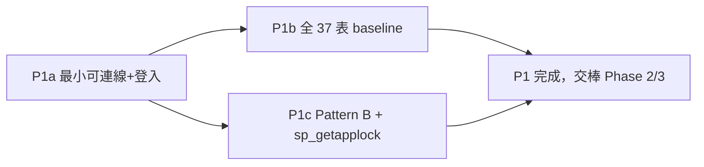

# AD-E07-38：MSSQL 全面遷移 P1（Driver / Entity / Schema 基礎層）架構設計

## Agent Loading Guide

| Agent 角色 | 需載入章節 |
|-----------|-----------|
| Test Designer | §3（D-1~D-7 決策）、§6（P1a/P1b/P1c 切片與 DoD）、§7（不變式）、§8（測試邊界／PG-only→MSSQL-only 對應） |
| TDD Developer | §3（D-1 dialect 分支、D-2 型別對照、D-4 schema 兩軌、D-5 Pattern B + sp_getapplock）、§4（column-types.ts 契約程式碼）、§5（entity 型別逐項清單）、§7（不變式） |
| DevOps / CI/CD | §4.3（schema 兩軌建置流程）、§6（P1b DoD 之 dev/prod 一致性驗證腳本要求） |
| Product Analyst | §9（風險與殘留議題） |

---

## 0. 範圍說明（為何本 AD 不掛在單一 F-number 之下）

本 AD 固化 **MSSQL 全面遷移計畫 Phase 1（P1：Driver / Entity / Schema 基礎層）** 的架構設計。此遷移為使用者直接拍板之三項硬約束驅動（見 §1），非由 product-analyst story 流程產出，故本文件無對應 `feature-id`/`source-stories`。內容涵蓋全專案（`apps/api` 全部 entity、三個 TypeORM 設定點），非單一 E07 業務模組，掛在 `epic: cross-cutting` 下，並在 `depends-on` 交叉引用既有 E07 raw SQL 架構決策（AD-E07-28/29/30/37）作為型別與 SQL 慣例的既有先例來源。

**前置狀態**：P0（Spike + CI 骨架）已完成並 commit 於 `feat/mssql-migration` 分支（`7e78e4f`）——本機 SQL Server 2022 dev 容器（collation `Chinese_Taiwan_Stroke_BIN`）+ 連線 smoke 全綠（`OPENJSON`、佇列 hint `UPDLOCK`/`READPAST`/`ROWLOCK`/`OUTPUT` 皆已驗證可用）。已定案三項硬約束：
1. **目標 = SQL Server 2022**（不做 2016 相容改寫，`STRING_AGG`/`OPENJSON`/`JSON_VALUE`/filtered index/`OFFSET-FETCH` 全部可用）。
2. **Collation `Chinese_Taiwan_Stroke_BIN` 為硬性**（見 §3 D-3）。
3. **佇列自建 T-SQL**（P2 範圍，非本 AD）；**`fn_calc_tier_level` 視為死碼，P1 不建立此函式**（見 §4.2）。

本 AD 僅涵蓋 P1；佇列自建設計（P2）、Raw SQL 引擎移植（P3）、ETL/Bulk-load（P4）為獨立後續 AD，不在本文件範圍內。

---

## 1. 背景與問題定義

現行系統 `apps/api` 為 NestJS + TypeORM，資料庫為 PostgreSQL，三個 TypeORM 設定點（`data-source.ts`／`app.module.ts`／`worker-app.module.ts`）皆硬寫 `type:'postgres'`（`sqlite` 僅作測試備援分支）。P1 目標：在**不引入任何業務行為變更**的前提下，讓這三個設定點與全部 37 個 entity 在 `DB_TYPE=mssql` 下可正確連線、建表、通過基本 CRUD，作為後續 P2（佇列）/P3（raw SQL 引擎）/P4（ETL）的地基。

---

## 2. 既有架構基礎（查證事實，不得誤判為需修正的問題）

| 元件 | 檔案 | 現況 |
|---|---|---|
| CLI migration datasource | `apps/api/src/database/data-source.ts` | 硬寫 `type:'postgres'`；entities 以 glob 載入（`entities/*.entity.{ts,js}`） |
| API 主模組 | `apps/api/src/app.module.ts` | `TypeOrmModule.forRootAsync`；`dbType==='sqlite'` 分支 vs else（隱式假設 postgres）；entities 以**顯式陣列**載入（`E07_ENTITIES` + 主表，共 ~30 個 import） |
| Worker 模組 | `apps/api/src/worker-app.module.ts` | 同上模式，但 entities 以 glob 載入（與 data-source.ts 一致，避免與 app.module 的顯式清單漂移） |
| 型別 helper | `apps/api/src/common/database/column-types.ts` | 既有 3 個 driver-conditional helper：`dateColumnType`（**29 個 entity 檔**已用，覆蓋面遠大於預期）、`jsonColumnType`（3 個 entity）、`surrogatePkType`（~5 個 entity） |
| Advisory lock gate | `apps/api/src/modules/assignment-stage/personnel-ratio.service.ts` | 既有 `isPostgres()`（`process.env.DB_TYPE` 字串比對）/`isPgLockNotAvailable(err)`（`err.code==='55P03'`）driver-conditional 模式，可直接比照擴充 mssql 分支 |
| Driver-type 動態判斷 | `apps/api/src/modules/extraction-task/raw-data.service.ts` | `this.isPostgres = (dataSource.options as any).type === 'postgres'`——**讀 `dataSource.options.type` 而非重複解析 env**，比 `process.env.DB_TYPE` 字串比對更穩健，建議作為未來收斂方向（非 P1 阻擋項，列技術債） |
| **新發現：第 5 個 PG-only 機制** | `apps/api/src/modules/assignment/services/assignment-run-report.service.ts:637-654` | F064 匯出使用 **PostgreSQL native server-side cursor**（`DECLARE export_cursor NO SCROLL CURSOR FOR ...` + 批次 `FETCH n`），MSSQL cursor 無法一次 `FETCH n` 批次取得——**明確排除於 P1 範圍外，移交 Phase 3/4**（見 §9.2） |

---

## 3. 架構決策彙總（D-1 ~ D-7）

### D-1　Dialect 整合策略（RESOLVED）

**決策**：三個 TypeORM 設定點一律改為**顯式三分支**（`sqlite` / `mssql` / `postgres`），不可再用「if sqlite ... else 假設 postgres」的隱式 fallback：

```ts
const dbType = configService.get<string>('DB_TYPE', 'sqlite');
if (dbType === 'sqlite') { /* 不變 */ }
if (dbType === 'mssql') {
  return {
    type: 'mssql',
    host: configService.get<string>('DB_HOST', 'localhost'),
    port: configService.get<number>('DB_PORT', 1433),
    username: configService.get<string>('DB_USERNAME', 'sa'),
    password: configService.get<string>('DB_PASSWORD'),
    database: configService.get<string>('DB_NAME', 'cdmp_dev'),
    options: {
      encrypt: configService.get<string>('DB_MSSQL_ENCRYPT', 'true') === 'true',
      trustServerCertificate: configService.get<string>('DB_MSSQL_TRUST_CERT', 'true') === 'true',
    },
    entities: [...],
    synchronize: configService.get<string>('NODE_ENV') !== 'production',
  };
}
return { type: 'postgres', ... }; // 過渡期保留至 Phase 6 cutover 才移除
```

`encrypt`/`trustServerCertificate` 兩個環境變數獨立可調（dev 自簽憑證 `trustServerCertificate=true`；正式環境須 `false` + 正確憑證鏈）。`data-source.ts`（CLI-only，不吃 sqlite 分支）直接依 `DB_TYPE` 切 `'postgres'|'mssql'` 即可。

**`column-types.ts` 三個既有 helper 各加 mssql 分支**：

```ts
export const dateColumnType: ColumnType =
  process.env.DB_TYPE === 'sqlite' ? 'datetime'
  : process.env.DB_TYPE === 'mssql' ? 'datetime2'
  : 'timestamp';

export const jsonColumnType: ColumnType =
  process.env.DB_TYPE === 'sqlite' ? 'simple-json'
  : process.env.DB_TYPE === 'mssql' ? 'simple-json'   // MSSQL 無原生 json 型別，走 nvarchar(max)+app 層序列化
  : 'jsonb';

export const surrogatePkType: PrimaryGeneratedColumnType =
  process.env.DB_TYPE === 'sqlite' ? 'integer'
  : process.env.DB_TYPE === 'mssql' ? 'bigint'
  : 'bigint';
```

**新增兩個 helper**（收斂目前散落的硬寫字面值）：

```ts
/** uuid 型別：postgres=uuid（原生）／sqlite=既有相容值／mssql=uniqueidentifier */
export const uuidColumnType: ColumnType =
  process.env.DB_TYPE === 'mssql' ? 'uniqueidentifier' : 'uuid';

/** 長文字型別：postgres=text／mssql 明確指定 nvarchar+MAX（避免落入已棄用的 SQL Server TEXT 型別）／sqlite=text */
export const longTextColumnType: ColumnType =
  process.env.DB_TYPE === 'mssql' ? 'nvarchar' : 'text';
export const longTextColumnLength = process.env.DB_TYPE === 'mssql' ? 'MAX' : undefined;
```

**兩個「不可假設」的 P1a 實測點**（見 §6 P1a DoD，必須以真實 MSSQL 容器驗證，不可憑文件推斷）：
1. TypeORM 是否對裸 `'uuid'` 字面值本身就有跨 driver 別名處理（postgres/sqlite 現況能同吃 `'uuid'`，**不代表 mssql driver 也接受同一字面值**）——若不支援，`uuidColumnType` helper 為必要而非美化。
2. 裸 `'text'` 字面值是否被 mssql driver 映射到**已棄用的原生 `TEXT` 型別**（而非 `NVARCHAR(MAX)`）——若是，必須強制走 `longTextColumnType`+`length:'MAX'`，不可信任裸字面值。

---

### D-2　Entity 型別逐項對照（RESOLVED）

先前粗估「41 處」為四種型別合計 grep 計數；本次逐型別精確查證：

| PG 型別（entity 字面值） | 出現次數／檔案數 | MSSQL 2022 對應 | 難度 | 備註 |
|---|---|---|---|---|
| `type:'uuid'` | **18 處／14 檔** | `uniqueidentifier` | 低 | 經 `uuidColumnType` helper 收斂；需過 D-1 之 P1a smoke check |
| `type:'bigint'` | **2 處／2 檔**（`ob-assign-set.entity.ts`、`assignment-run-stage-log.entity.ts`） | `bigint`（原生同名） | 低 | 需驗證 tedious driver 是否也將 bigint 序列化為 string（與 pg driver 一致，避免精度流失） |
| `type:'text'` | **17 處／13 檔** | `nvarchar`+`length:'MAX'`（**不可用裸 `'text'`**） | 中 | 需逐檔手動加 `length:'MAX'`，非純 helper 替換可打包（需同時加兩個 property） |
| `type:'bytea'` | **0 處** | 不適用 | — | 全庫查無使用，自關注清單移除 |
| `dateColumnType` helper（`timestamp`/`datetime`） | **29 檔**已用 helper | `datetime2(3)`（3 位毫秒精度；若既有測試斷言更細精度需求，可升 `datetime2(7)`） | 低 | helper 已收斂，一行改完 |
| `jsonColumnType` helper（`jsonb`/`simple-json`） | 3 entity（`ob-list-definition`、`assignment-audit-log`、`assignment-run-snapshot`） | `simple-json`（沿用 sqlite 分支值——這些欄位皆為 app 層不透明 blob，未見任何 SQL jsonb operator 查詢） | 低 | |
| `surrogatePkType` helper（`bigint`/`integer`） | ~5 entity | `bigint`（沿用 postgres 分支值） | 低 | |
| `boolean` | 廣泛用於 flag 欄位 | `bit`（driver 層通常自動轉換 true/false↔1/0） | 低（entity 層）／中（raw SQL 層，Phase 3/4 範圍） | 任何 raw SQL 字面寫死 `true`/`false`（非參數化）需改 `1`/`0`，屬 Phase 3/4，非 P1 entity 層 |

**P1b 範圍確認**：entity 層字面值改動 = 18(uuid) + 2(bigint) + 17(text) = **37 處**逐檔替換 + 3 個既有 helper 各加一行分支（覆蓋 29+3+5 檔）。helper 模式已吸收七成以上型別分歧點，工作量遠小於「41 處全部逐檔手動判斷」的原始印象。

---

### D-3　BIN Collation（`Chinese_Taiwan_Stroke_BIN`）約束（RESOLVED）

1. **字串比較語意不回歸（正確決策，非新增風險）**：`_BIN` 尾碼使所有字串比較（`=`/`LIKE`/`IN`/`BETWEEN`/`ORDER BY`）退化為逐 byte 比較——這與現行 PostgreSQL 行為**一致**：PG 的 `=` 運算子本來就是 byte-exact 比較、不受 collation 影響；PG 預設 collation 也從未提供中文筆畫排序。選擇 BIN collation **正確保留**現行業務規則語意（如 `LIKE '%白牌%'`、`spec_name LIKE '%借新還舊%'`），屬「維持現狀」，不需視為待修正項。
2. **識別碼（identifier）大小寫敏感 → 全小寫 + 守門測試（唯一需要新設計約束之處）**：資料庫層級 collation 為 `_BIN`（非 `_CI_`）時，物件名稱解析也變成大小寫敏感。現行 raw SQL 與 entity 命名皆已是全小寫 snake_case，只要 MSSQL baseline DDL 每個 `CREATE TABLE`/欄位名一律採完全相同小寫拼法即可維持一致。**強制要求**：P1b DoD 須含一個「大小寫一致性守門測試」，對 `sys.columns`/`sys.tables` 全表全欄掃描，斷言無任何大寫字元殘留（見不變式 **I-MSSQL-CASE-01**）。
3. **Collation 設定層級 = CREATE DATABASE，非逐欄 COLLATE**：於資料庫建立時指定 `Chinese_Taiwan_Stroke_BIN` 一次，所有新建欄位自動繼承，降低逐欄漏設風險；baseline migration 的 `CREATE TABLE` 陳述式**不需要**額外欄位級 `COLLATE` 子句（見不變式 **I-MSSQL-COLLATE-01**）。
4. **跨欄位 collation 衝突**：因整個資料庫單一 collation、無外部連結資料表，理論上不會出現「Cannot resolve collation conflict」；P1b DoD 加一個輕量斷言測試（查 `sys.columns.collation_name` 全表一致）作為早期防線。

---

### D-4　Schema 建立策略（dev synchronize vs prod baseline migration，RESOLVED）

**決策：兩軌並行，以「dev synchronize 產出草稿 → 人工稽核清單 → 定案為 prod baseline」為生成流程**（非全手寫、非全自動）。

**流程**：
1. P1a/P1b entity 型別改動完成後，對全新空的 MSSQL 2022 容器（BIN collation）跑 `synchronize:true`，讓 TypeORM 依 37 個 entity 產生實際 DDL。
2. 對已建好 schema 的容器執行 `migration:generate`，取得 TypeORM 自動生成的草稿 migration。
3. **人工稽核清單**（草稿必然遺漏或需修正的項目）：
   - Collation 是否正確繼承（草稿通常不含逐欄 `COLLATE`，需確認資料庫層級設定已生效）。
   - **Filtered index**（如既有 PG baseline 的 `idx_ob_pool_data_list_score_notnull`）——若原本只存在於 PG 手寫/pg_dump baseline、未反映在任何 entity `@Index()` decorator，`migration:generate` **不會**產生它，須人工從舊 PG baseline 逐一核對、手動補寫等價 T-SQL filtered index。
   - **`fn_calc_tier_level`：確認視為死碼，P1b 不建立此函式**（範圍縮減，已由使用者拍板；若日後有新證據翻案需回頭補此項）。
4. 產出一支手工稽核過的 MSSQL baseline migration，供 prod（`NODE_ENV=production` 關 synchronize）走 `migration:run` 建置。
5. **dev/prod 一致性驗證**（**I-MSSQL-BASELINE-PARITY-01**）：對兩個全新容器分別走 (a) synchronize (b) baseline migration，比對 `INFORMATION_SCHEMA.COLUMNS`/`sys.indexes`/`sys.check_constraints` 輸出應結構等價，作為 P1b DoD 驗收工具，並可重複用於未來每次 entity 變更後的漂移檢查。

Bootstrap/seed 四支腳本（`seed.ts`/`seed-datasource.ts`/`prod-data-seed.ts`/`bootstrap` npm script）需對 MSSQL 可執行；已知需關注點：`seed.ts`／`prod-data-seed.ts` 若用 `ON CONFLICT` 需比照 D-5 之 `MERGE`/兩段式改寫（不逐行 diff，列為 P1b tdd-implementation 執行時的稽核項）。

---

### D-5　Pattern B（`$n` → Named Param）+ `sp_getapplock`（RESOLVED）

**範圍界定**：核心 4 檔 6 處由 **P1c** 負責（阻擋性最小修復，屬驅動邊界層級）；其餘 ~40 個站點**不在 P1**，分流至 Phase 3a（Stage 1/assignment-list）與 Phase 4（ETL handler）。

| # | 檔案:行 | 現行 SQL | 難度 | 轉換方式 |
|---|---|---|---|---|
| 1 | `assignment-run-pipeline.service.ts:1361` | `WHERE source_customer_no = ANY($1)` | 低 | 改用專案既有慣例 `IN (:...custoNos)` + `escapeQueryWithParameters`（與 `stage1-sql-builder.ts` 等處已用的 `:...arr` 展開一致） |
| 2 | `assignment-run-pipeline.service.ts:1376` | `WHERE appl_no = ANY($1)` | 低 | 同上，`IN (:...applNos)` |
| 3 | `personnel-ratio.service.ts:492` | `SELECT pg_advisory_xact_lock(hashtext($1)::bigint)` | **高** | 見下方 `sp_getapplock` 對應表 |
| 4 | `assignment-run-report.service.ts:617` | `WHERE r.run_id = $1${scopeClause}` | 低-中 | 改 `:runId`；需檢查 `scopeClause` 內部是否內嵌其他 `$n`（P1c 稽核項） |
| 5 | `assignment-run-report.service.ts:642` | `DECLARE export_cursor NO SCROLL CURSOR FOR ${query.sql}`（消費同組 `query.params`） | 中-高，**機制本身不屬 P1** | PostgreSQL native server-side cursor 匯出串流機制，MSSQL cursor 語意不同（無法一次 `FETCH n` 批次取得）；正式歸入 Phase 3/4（F064 匯出），P1c 僅記錄不改動 |

**`pg_advisory_xact_lock` → `sp_getapplock` 對應表**：

現行：
```ts
if (this.isPostgres()) {
  await mgr.query(`SET LOCAL lock_timeout = '5000ms'`);
  await mgr.query('SELECT pg_advisory_xact_lock(hashtext($1)::bigint)', [listNo]);
  // catch: code==='55P03' → 降級 no-op；其餘 rethrow
}
```

T-SQL 對應：
```sql
DECLARE @lockResult INT;
EXEC @lockResult = sp_getapplock
  @Resource    = @lockResourceName,   -- 直接用字串（如 'personnel-ratio:' + @listNo），免 hashtext 雜湊步驟
  @LockMode    = 'Exclusive',
  @LockOwner   = 'Transaction',       -- 綁定目前交易，COMMIT/ROLLBACK 時自動釋放，對齊 xact_lock 的 auto-release
  @LockTimeout = 5000;                -- 毫秒，對齊現行 lock_timeout='5000ms'
```

回傳碼對應：`0`=立即取得、`1`=等待後取得（皆視為成功）；**`-1`=逾時，直接對應 PG `55P03`**，走現行降級 no-op 分支；`-2`（cancelled）/`-3`（deadlock victim）/`-999`（參數或其他錯誤）→ 視為非預期錯誤，維持現行「其餘一律 rethrow」語意。

**簡化點**：不需 `hashtext()` 雜湊——`sp_getapplock` 的 `@Resource` 直接接受字串（上限 255 字元），`listNo` 本身很短，可直接使用或加前綴避免撞名，比 PG 版本更直觀。

**前置條件（不變式 I-MSSQL-LOCK-01）**：`@LockOwner='Transaction'` 要求呼叫當下必須已在顯式交易內——現行程式碼註解已載明「於 setPersonnelRatios tx 內呼叫」，P1c 須明確斷言傳入的 `EntityManager` 確實來自 `dataSource.transaction(async manager => ...)`，否則 `sp_getapplock` 直接報錯（可視為額外安全網）。

**其餘 ~40 站點分流建議**：

| 分類 | 代表檔案 | 歸屬 phase |
|---|---|---|
| Stage 1 / assignment-list raw SQL | `stage1-sql-executor.ts`、`stage0-estimate.service.ts`、`create/update-list-v2.1` 相關 service | Phase 3a |
| ETL pipeline node handler | `extract-handler.ts`、`lookup-handler.ts`、`merge-handler.ts`、`dedup-handler.ts`、`type-cast-handler.ts`、`derived-field-handler.ts`、`conditional-handler.ts`、`field-mapping-handler.ts`、`resolve-raw-table.ts` | Phase 4 |
| Extraction executor（來源端） | `postgresql-executor.ts` | Phase 6 cutover 前考慮直接刪除（清理項非改寫項） |
| c360 服務 | `c360.service.ts` | 待 Phase 3a 一併盤點 |

P1c 交付物：一份「Pattern B 完整站點清單」（檔案路徑+行號+建議歸屬 phase），供 test-designer 在 Phase 3/4 啟動時直接引用。

---

### D-6　P1 實作切片與 DoD（RESOLVED）



**P1a — 最小可連線＋登入（smoke slice，優先度最高）**
- 範圍：三處 TypeORM 設定點加 mssql 分支；僅載入 auth 最小 entity 子集（`User`/`Role`/`TokenBlocklist`/`PasswordResetToken`）+ `column-types.ts` 三個既有 helper 擴充分支；驗證 D-1 兩個「不可假設」實測點。
- DoD：
  1. `DB_TYPE=mssql` 啟動 NestJS API 成功，`synchronize:true` 建出 4 張 auth 表，欄位型別經 `sys.columns` 查詢確認為預期的 `uniqueidentifier`/`bigint`/`nvarchar(max)`/`datetime2`/`bit`。
  2. 種子一個 admin 帳號，`POST /api/v1/auth/login` 回傳合法 JWT。
  3. 單元測試：對真實 MSSQL 容器做一次 entity round-trip，確認 uuid PK 序列化/反序列化正確、密碼欄位存取正常。
  4. 大小寫一致性守門測試（I-MSSQL-CASE-01）：查 `sys.columns`/`sys.tables` 確認全部物件名稱為小寫。
  5. 確認 `uuidColumnType`/`longTextColumnType` 兩個新 helper 是否真的需要（以實測結果為準，不預先斷定）。

**P1b — 全 37 表 Baseline（schema 全量 + dev/prod 雙軌）**
- 範圍：其餘 33 個 entity 全部載入；完成 D-4 兩軌流程；bootstrap/seed 四支腳本對 MSSQL 跑通。
- DoD：
  1. 全新 MSSQL 容器分別走 synchronize 與 baseline migration 兩條路徑，`INFORMATION_SCHEMA`/`sys.indexes` 結構化比對一致（I-MSSQL-BASELINE-PARITY-01）。
  2. Filtered index 正確建立（逐一核對 PG 舊 baseline 完整索引清單，非僅一例）。
  3. `fn_calc_tier_level` 確認不建立。
  4. Bootstrap 全流程對 MSSQL 跑通，參考資料筆數與 PG 版本一致。
  5. 全 37 entity 基本 CRUD 皆有對應單元測試通過。

**P1c — Pattern B（6 處核心站點）＋ `sp_getapplock`**
- 範圍：見 D-5；含站點 1/2/3/4 轉換（站點 5 明確排除）；產出「其餘 ~40 站點」分流清單。
- DoD：
  1. 站點 1/2：對 MSSQL 執行等價查詢，回傳列數與現行 PG 版本一致。
  2. 站點 3：至少 3 個行為測試——(a) 單次呼叫成功取鎖並於交易結束自動釋放；(b) 兩個並發呼叫模擬序列化（第二個等待或依 `@LockTimeout` 逾時降級 no-op）；(c) 非鎖相關錯誤仍正確 rethrow。
  3. 站點 4：改寫為 `:runId`，確認 `scopeClause` 無巢狀 `$n`。
  4. 交付「Pattern B 完整站點清單」文件。

---

### D-7　是否需要 spec-writer（RESOLVED）

**決策：P1 全範圍（P1a/P1b/P1c）不需要 spec-writer。**

理由：P1 的核心不變式是「行為不變、僅置換底層儲存/驅動實作」——沒有新業務規則、沒有新使用者可見行為、沒有新 acceptance criteria 需要從產品角度定義。這與 F098（佇列抽離）、F099-F105（SQL 下推）等「架構/基礎設施等級」變更向來由 system-architect 產出 AD 文件、直接交 test-designer 設計等價測試、tdd-implementation 落地的既有專案慣例一致，不需要 product-analyst/spec-writer 這條「定義新業務行為」的路徑。唯一語意有微妙差異的項目（`sp_getapplock` 逾時碼 vs `55P03`）也只是同一鎖原語的跨資料庫實作對應，已由本 AD §3 D-5 明確裁定，test-designer 可直接依此設計測試。

**建議動作**：本 AD 即為該「精簡固化」文件，test-designer 可直接依 §3/§6/§7 產出測試設計，跳過 spec-writer 這一棒。

---

## 4. Schema 變更與 Migration 策略摘要

不同於一般 F-numbered feature（新增/修改既有 PG schema 的小顆粒 migration），P1 產出的是**全新的 MSSQL baseline migration**（非既有 `1711360000xxx` PG migration 序號的延伸），具體檔名與序號由 tdd-implementation 依專案 timestamp-prefix 慣例命名，於實作時定案。本 AD 只固化**策略**（見 D-4），不預先指定檔名。

**明確排除項**：`fn_calc_tier_level`（PL/pgSQL 函式，`apps/api/src/database/functions/fn_calc_tier_level.sql`）依使用者拍板視為死碼，**P1（及其後 baseline migration）不建立此函式**，範圍縮減。

---

## 5. 不變式（Invariants）

| ID | 說明 |
|---|---|
| **I-MSSQL-CASE-01** | BIN collation 前提下，資料庫全部物件名稱（table/column）一律小寫 snake_case，與現行 raw SQL 字面值完全一致；P1b 須有守門測試掃描 `sys.columns`/`sys.tables` 斷言無大寫殘留 |
| **I-MSSQL-COLLATE-01** | Collation 於 `CREATE DATABASE` 層級設定一次（`Chinese_Taiwan_Stroke_BIN`），不對個別欄位另加 `COLLATE` 子句；P1b 驗證 `sys.columns.collation_name` 全表一致 |
| **I-MSSQL-LOCK-01** | 呼叫 `sp_getapplock @LockOwner='Transaction'` 前，呼叫端必須已處於顯式交易（`EntityManager` 來自 `dataSource.transaction()`），否則視為設計違反 |
| **I-MSSQL-PARAM-01** | Pattern B 轉換一律採用專案既有 `:param`/`:...arr` 命名參數慣例（`escapeQueryWithParameters`），不得另行發明新的參數風格（如自行拼接字串） |
| **I-MSSQL-BASELINE-PARITY-01** | Dev（synchronize）與 prod（baseline migration）兩條建表路徑產出之 schema，經 `INFORMATION_SCHEMA`/`sys.indexes`/`sys.check_constraints` 比對須結構等價 |
| **I-MSSQL-HELPER-SCOPE-01** | 型別分歧一律優先收斂進 `column-types.ts` 共用 helper（`dateColumnType`/`jsonColumnType`/`surrogatePkType`/`uuidColumnType`/`longTextColumnType`），不得在個別 entity 內重複寫 `process.env.DB_TYPE` 條件判斷 |

---

## 6. 測試邊界（供 test-designer 參考）

- P1a/P1b/P1c 的 DoD（§3 D-6）即為主要測試邊界依據，逐項可直接轉為測試案例。
- **PG-only → MSSQL-only 測試邊界轉換**：現行 `customer_core` 等僅存在於 PostgreSQL 的表，比照既有 `.pg.spec.ts` 慣例（AD-E07-37 §9 已建立此模式），P1 的 MSSQL 對應測試應类似地限定在需要真實 MSSQL 連線的測試檔中執行，不應污染 SQLite-backed 單元測試。
- `sp_getapplock` 併發測試（D-6 P1c DoD #2）需要真實 MSSQL 連線（無法用 SQLite 模擬鎖語意），測試檔命名建議延續專案慣例另立分類（例如比照 `.pg.spec.ts` 命名習慣，未來可能是 `.mssql.spec.ts`，但此為 Phase 3/4 才會大量出現的命名慣例，P1c 可視需要提前採用）。

---

## 7. 風險與殘留議題

### 7.1 第 5 個 PG-only 機制（F064 native cursor）——已移入 Phase 3/4

`assignment-run-report.service.ts` 的 F064 匯出功能使用 PostgreSQL native server-side cursor（`DECLARE...CURSOR`+批次 `FETCH n`），MSSQL cursor 語意不同（無法一次 `FETCH n` 批次取得，需逐列或改用 `OFFSET/FETCH` 分頁替代整個串流策略）。**已明確排除於 P1 範圍外**，正式列入 Phase 3/4（F064 匯出）待辦，避免遺漏。

### 7.2 `uuidColumnType`/`longTextColumnType` 是否真的需要新增 helper（P1a 待實測）

D-1 提出的兩個新 helper 是否必要，取決於 TypeORM mssql driver 對裸 `'uuid'`/`'text'` 字面值的實際行為，**不可憑文件推斷**，須在 P1a 以真實容器驗證後定案（若裸字面值即可正確運作，可簡化設計、不必新增 helper）。

### 7.3 Driver-conditional 判斷風格不統一（技術債，非 P1 阻擋項）

現有至少兩種 driver-conditional 判斷風格並存：`process.env.DB_TYPE` 字串比對（`personnel-ratio.service.ts`）vs 讀取 `dataSource.options.type`（`raw-data.service.ts`）。後者更穩健（不需重複解析 env、直接反映實際連線 driver）。建議長期收斂至後者，但不阻擋 P1 進度，列為技術債備註。

### 7.4 Bootstrap/seed 腳本 PG-specific 邏輯未逐行 diff

`seed.ts`/`seed-datasource.ts`/`prod-data-seed.ts` 是否含 `ON CONFLICT`/`information_schema` 等 PG-specific 語法，本 AD 僅列為 P1b 稽核範圍，未逐行查證（超出 architect 職責，屬 tdd-implementation 執行細節）；要求 P1b DoD 以「四支腳本對 MSSQL 全部跑通且產出與 PG 版本等值的參考資料筆數」作為驗收，讓實作過程自然發現並修正殘留的 PG-only 語法。

**已於 [AD-E07-39](AD-E07-39-mssql-p1b-full-baseline.md) §7 查明具體證據**：`seed-datasource.ts`/`prod-data-seed.ts` 確實含大量 `$1` positional param + `LIMIT` 子句（未見 `ON CONFLICT`，不需 `MERGE` 改寫）；`seed.ts` 已用 TypeORM repo 方法、風險低。

---

## 11. Errata（2026-07-07，P1b 查證後更新，v1.0→v1.1）

P1a 型別探針與 P1b 全 entity 掃描（詳見 [AD-E07-39](AD-E07-39-mssql-p1b-full-baseline.md)）發現以下 3 點推翻/更新本文件 v1.0 的假設。**後續讀者請以本節 + AD-E07-39 為準，不要沿用下列已過時的原始描述**：

### Errata-1（對應 §2 D-2 型別對照表）：遺漏 `type:'timestamp'` 裸字面值類別，風險等級應為「高」非「低」

原 §2 D-2 表格只列出 `uuid`/`bigint`/`text`/`bytea`/`dateColumnType`/`jsonColumnType`/`surrogatePkType`/`boolean` 幾類，**未涵蓋「entity 直接寫 `type:'timestamp'` 字面值、繞過 `dateColumnType` helper」這個獨立類別**。P1b 全 entity 掃描發現 3 個檔案共 4 處此問題（`ob-assign-config.entity.ts`、`ob-arreturndf-min-cap.entity.ts`、`assignment-run-stage-log.entity.ts`）。

**風險等級修正**：這**不是**單純「型別不支援、會拋錯」的低風險項（如原文對 boolean 的預期）。MSSQL 的字面值 `timestamp` 是 `rowversion` 的舊式同義詞——一種 8-byte 自動遞增二進位版本戳記，唯讀、無法寫入 Date 值，**且不保證會拋錯**（可能靜默建出語意完全錯誤的欄位，事後才在寫入/讀取時才出錯或更糟——資料被靜默寫壞）。此風險等級應歸類為「高」，詳細清單與修法見 AD-E07-39 §0 F-1 / §1。

### Errata-2（對應 §4.2 Migration 檔案/§4 schema 兩軌人工稽核清單）：filtered index 遷移前提已失效

原文假設「舊 PG baseline 需要人工逐一核對、補寫等價 filtered index」。**此假設已於 2026-07-07 失效**：`ob_pool_data_list` 的唯一 filtered index（`idx_ob_pool_data_list_score_notnull`，m298）因 `score` 欄位已成死欄（F055 preview 改查 `ob_pool_data` 後不再需要）而被移除——entity、`BaselineSchema.ts`、dev DB 三方已同步移除。P1b 全文掃描 `BaselineSchema.ts` 確認目前**零** filtered/partial index。**Schema 兩軌流程之人工稽核清單可省略此步驟**，詳見 AD-E07-39 §0 F-2 / §6。

### Errata-3（對應 §2 D-2）：varchar + 中文字元編碼是完全未涵蓋的新風險維度

原 §2 D-2 型別對照表未討論 `varchar` 欄位本身（僅討論 `uuid`/`text`/`boolean`/`bigint` 等「型別名稱不相容」的問題）。P1b 盤點發現一個更根本的風險：全庫大量 `varchar` 欄位承載中文資料，SQL Server `VARCHAR`（非 Unicode）依 collation 對應 code page 儲存，其編碼轉換路徑（tedious driver 如何處理 Big5 碼頁）**從未在本專案驗證過**，有潛在 mojibake 風險，且若真的需要全面改 `nvarchar`，波及面可能是本次 P1（P1a+P1b）中最大的單一改動項（大於 uuid/text/boolean/timestamp 47 處的總和）。此風險已定調為「實驗先行」（先跑 smoke test 才決定是否需要系統性轉換），完整設計見 AD-E07-39 §0 F-4 / §4.4。

**交叉引用**：本 errata 對應的完整分析、掃描證據與修法設計，一律以 [AD-E07-39-mssql-p1b-full-baseline.md](AD-E07-39-mssql-p1b-full-baseline.md) 為權威來源。
