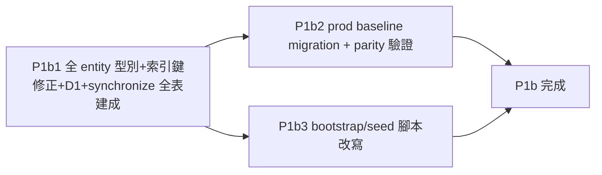

# AD-E07-39：MSSQL 全面遷移 P1b（全 37 Entity Baseline）架構設計

## Agent Loading Guide

| Agent 角色 | 需載入章節 |
|-----------|-----------|
| Test Designer | §0（新查證事實 F-1~F-5）、§2（900-byte 掃描結論）、§3（B1 hash 裁定 + 測試影響）、§4.4（varchar 編碼 test-first 設計）、§8（P1b1/b2/b3 DoD）、§9（不變式） |
| TDD Developer | §1（entity 型別轉換清單）、§3（`hashColumnType` + `TokenBlocklistService` 契約）、§4（其他不相容盤點與對應方案）、§5（D1 `ALL_ENTITIES` 統一寫法）、§6（schema 兩軌流程）、§7（seed 腳本改動清單） |
| DevOps / CI/CD | §6.5（dev/prod parity 驗證腳本要求）、§8（P1b2 DoD） |
| Product Analyst | §10（風險與殘留議題） |

---

## 0. 前情提要與本輪新查證事實（F-1 ~ F-5）

延續 [AD-E07-38](AD-E07-38-mssql-p1-driver-entity-schema.md)（P1：Driver/Entity/Schema 基礎層）。P1a 已完成並 commit（`b495cd8`），型別探針將 AD-E07-38 標記「不可假設」的兩點證實為事實，並多抓到兩個未預期的問題；本文件（P1b）在此基礎上，對**全 37 entity**（P1a 僅驗證 auth 最小 4 entity 子集）進行完整型別轉換、索引鍵安全性掃描、B1 正式裁定，以及 schema 建置兩軌流程的具體化。

P1a 實測確認/新增的 4 個 helper（已建於 `apps/api/src/common/database/column-types.ts`，本文件沿用不重複定義）：`dateColumnType`（`datetime2`，預設精度 7）、`jsonColumnType`、`surrogatePkType`、`uuidColumnType`（`uniqueidentifier`；`@PrimaryGeneratedColumn('uuid')` 產生策略本身已相容不需改，僅裸 `@Column({type:'uuid'})` 需要）、`longTextColumnType`（`nvarchar`+`length:'MAX'`；裸 `'text'` 會落入已棄用原生 `TEXT` 型別）、`boolColumnType`（`bit`；顯式 `type:'boolean'` 會拋 `DataTypeNotSupportedError`，僅「反射式」boolean 自動映射）。`bigint` 經 tedious 讀回為字串（與 pg driver 行為一致）。

本輪（P1b）對全 37 entity 掃描後新查證的事實：

| # | 發現 | 影響範圍 |
|---|---|---|
| **F-1** | **`type:'timestamp'` 裸字面值**存在於 3 檔共 4 處（`ob-assign-config.entity.ts:25`、`ob-arreturndf-min-cap.entity.ts:16`、`assignment-run-stage-log.entity.ts:27,30`），繞過既有 `dateColumnType` helper | **危險等級高於 AD-E07-38 D-2 原先假設**：MSSQL 的字面值 `timestamp` **不是日期型別**，是 `rowversion` 的舊式同義詞（8-byte 自動遞增二進位版本戳記，唯讀、無法寫入 Date 值，且不一定會像 boolean 那樣拋錯——可能靜默建出完全錯誤的欄位）。列為 P1b1 最高優先修正項 |
| **F-2** | **舊 PG baseline 唯一的 filtered/partial index（`idx_ob_pool_data_list_score_notnull`）已於 2026-07-07 被移除**（`ob-pool-data-list.entity.ts` 註解確認：score 死欄 + F055 preview 改查 `ob_pool_data` 後該索引不再被任何查詢使用，entity/migration/dev DB 已同步移除） | **AD-E07-38 §4「filtered index 需從舊 baseline 逐一補」的假設已失效**——目前 `BaselineSchema.ts` 全文掃描（`CREATE INDEX...WHERE`）零命中，schema 兩軌流程可簡化（§6） |
| **F-3** | `prod-data-seed.ts`／`seed-datasource.ts` 大量使用 `qr.query()` raw SQL，含 PG `$1` positional param + `INSERT INTO ... VALUES (...)` + `LIMIT` 子句；`seed.ts`（帳號種子）則乾淨使用 TypeORM `repo.findOne()` | 需要一輪比照 AD-E07-38 D-5 Pattern B 的站點清單處理；**未見 `ON CONFLICT`**（冪等靠「先 SELECT 檢查存在→條件式 INSERT」模式，不需要 `MERGE` 改寫），見 §7 |
| **F-4** | 🆕 **varchar + 中文字元編碼風險**：全庫大量 `varchar` 欄位承載中文（客戶姓名、部門名稱、名單名稱等）。SQL Server `VARCHAR` 依 collation 對應 code page 儲存（`Chinese_Taiwan_Stroke_BIN`→Big5 碼頁 950 DBCS），tedious driver 轉譯路徑未經本專案驗證，有潛在 mojibake 風險（本專案曾有 `feedback_sp_utf16le_decode` 慘痛前例） | AD-E07-38 D-2 完全未涵蓋此風險維度；**採實驗先行**，見 §4.4 |
| **F-5** | `app.module.ts` mssql 分支 entities 陣列硬寫 `[User, Role, TokenBlocklist, PasswordResetToken]`，sqlite/postgres 分支則是完整清單；`worker-app.module.ts` 用 glob 載入、三分支共用同一份 glob、**不受此問題影響** | 純陣列統一即可修復（D1，見 §5） |

---

## 1. 全 37 Entity 型別轉換清單

沿用 P1a 已建立之 4 個 helper + 既有 `jsonColumnType`／`surrogatePkType`。下表列出**需要動手改動**的 entity（未列出者代表現有型別在 mssql 分支下已相容）：

| Entity 檔 | 需要的 helper 替換 | 具體欄位 |
|---|---|---|
| `assignment-run-snapshot.entity.ts` | uuid | `run_id` |
| `assignment-approval.entity.ts` | uuid | `approver_id` |
| `assignment-audit-log.entity.ts` | uuid | `actor_id` |
| `assignment-run.entity.ts` | uuid, longText | `triggered_by`；`error_message` |
| `assignment-run-stage-log.entity.ts` | uuid, longText, **timestamp（F-1）** | `run_id`；`error_message`；`started_at`/`finished_at`（**改 `dateColumnType`，不可留 `'timestamp'` 字面值**） |
| `datasource-health-log.entity.ts` | uuid, longText, bool | uuid 欄；`success`；訊息欄 |
| `datasource.entity.ts` | uuid, longText | 連線相關 uuid 欄；描述欄 |
| `etl-pipeline-log.entity.ts` | uuid（×2）, longText（×2）, bool | 兩個 uuid 欄；兩個 text 欄；`is_test_run` |
| `etl-pipeline-version.entity.ts` | uuid（×2） | 兩個 uuid 欄（本檔無裸 text 欄需處理） |
| `extraction-log.entity.ts` | uuid（×2）, longText | 兩個 uuid 欄；一個 text 欄 |
| `etl-pipeline.entity.ts` | uuid, longText, bool | uuid 欄；描述欄；`enabled` |
| `extraction-task.entity.ts` | uuid（×2）, longText, bool | 兩個 uuid 欄；一個 text 欄；`enabled` |
| `ob-assign-config.entity.ts` | uuid, longText（×2）, **timestamp（F-1）** | `updated_by`；`config_value`/`description`；`updated_at`（**改 `dateColumnType`**） |
| `ob-list-definition.entity.ts` | bool | `cr_enabled` |
| `pooldata-field-whitelist.entity.ts` | bool（×2） | `is_active`／`is_system_fixed` |
| `pooldata-field-option.entity.ts` | bool | `is_active` |
| `ob-levelcard-version.entity.ts` | longText | `card_type`（順手觀察：語意上為短碼，建議可另評估改 `varchar(5)`，非必須，見 §4.5） |
| `ob-pool-data.entity.ts` | longText（×2） | `apmacc_memo`／`settle_src` |
| `ob-pool-data-list.entity.ts` | longText（×2） | `apmacc_memo`／`settle_src` |
| `ob-monthly-run-result.entity.ts` | **uuid（PK 欄，見 §2）**, longText | `run_id`（`@PrimaryColumn`，同時過 §2 900-byte 檢查，結果安全）；`settle_src` |
| `ob-arreturndf-min-cap.entity.ts` | **timestamp（F-1）** | `_cdmp_extracted_at`（**改 `dateColumnType`**） |
| `token-blocklist.entity.ts` | **見 §3，非 helper 替換而是結構重設計** | `token`→`token_hash` |

**未列出、確認無需改動**：`password-reset-token`、`user`（P1a 已處理）、`role`、`ob-emphire`、`ob-calendar`、`ob-assign-set`、`ob-code-df`、`ob-levelcard-score`、`ob-levelcard-level`、`ob-tier`、`ob-card-type`、`ob-levelcard-column`、`ob-dept-pct`、`ob-empl-set`。

**統計**：uuid 18 處（含 1 處 PK）、text 17 處、boolean 8 處、**timestamp bare 4 處（F-1，AD-E07-38 未計入）**，合計 **47 處**需逐行套用 helper。

---

## 2. 900-byte 索引鍵全面掃描

SQL Server 規則：clustered index（PK 預設即是）鍵長上限 **900 bytes**；nonclustered index 上限 1,700 bytes（SQL Server 2016+）。全庫掃描所有 `@PrimaryColumn`（含複合鍵）與 `@Index(...,{unique:true})`：

| Entity | PK / Unique Index 組成 | 位元組估算（varchar，1 byte/字元） | 若轉 nvarchar（2 bytes/字元） | 結論 |
|---|---|---|---|---|
| **`token_blocklist`** | PK `token`（無 `type`，反射 string，length 2048） | 2048 | **4096** | **🔴 遠超 900，即 B1，見 §3** |
| `ob-dept-pct` | (project_workym 6, list_no 11, obdeptid 6, ration numeric(9,2)≈5) | ≈28 | ≈51 | 安全 |
| `ob-empl-set` | (list_no 11, deptid_m 50, emplid 6, ration numeric(10,2)≈6) | ≈73 | ≈140 | 安全 |
| `ob-pool-data` | (orgno 2, appl_no 10) | 12 | 24 | 安全 |
| `ob-pool-data-list` | (list_no 100, orgno 2, appl_no 10) | 112 | 224 | 安全 |
| `ob-monthly-run-result` | (run_id uniqueidentifier=16固定, list_no 100, orgno 2, appl_no 10) | 128 | 240 | 安全（uuid 固定 16 bytes，不受 varchar/nvarchar 影響） |
| `ob-code-df` | (system_id 4, tbl_id 11, tbl_cd 4) | 19 | 38 | 安全 |
| `pooldata-field-whitelist` | (column_name 64) | 64 | 128 | 安全 |
| `pooldata-field-option` | (column_name 64, option_value 64) | 128 | 256 | 安全 |
| `ob-list-definition` | (list_no 11) | 11 | 22 | 安全 |
| `ob-card-type` | (card_type 5) | 5 | 10 | 安全 |
| `role` | (role_code 30) | 30 | 60 | 安全 |
| `ob-emphire` | (emp_id 10) | 10 | 20 | 安全 |
| `ob-arreturndf-min-cap` | (appl_no 20) | 20 | 40 | 安全 |
| `ob-assign-config` | (config_key 50) | 50 | 100 | 安全 |
| `ob-calendar` | (calendar_date, `date` 型別) | 3 | 3 | 安全 |
| `assignment_run_stage_log`（unique index，nonclustered） | (run_id uuid=16, stage_no smallint=2) | 18 | 18 | 安全（1700 上限） |

**結論**：全 37 entity 中，**唯一超過 900-byte 上限者為 `token_blocklist.token`（B1）**；即使 §4.4 的 varchar→nvarchar 轉換全面套用（欄寬翻倍），其餘所有鍵仍遠低於 900 bytes 上限，本掃描結果不因 F-4 的實驗結果而改變結論。

---

## 3. B1 正式裁定：`token_blocklist` 改用 Hash(Token) 作為 PK

### 3.1 型別選擇：`binary(32)`（優於 `char(64)`）

| 方案 | 儲存空間 | 索引鍵大小 | 比較效能 | 決定 |
|---|---|---|---|---|
| `binary(32)`（SHA-256 原始位元組） | 32 bytes | 32 bytes（遠低於 900） | 二進位比較，最快 | **採用** |
| `char(64)`（SHA-256 hex 字串） | 64~128 bytes | 64~128 bytes | 字串比較，較慢 | 不採用 |

**新增第 5 個 helper**（`column-types.ts`）：

```ts
/** Hash-based PK 型別（B1，token_blocklist 專用）。
 * - PostgreSQL: 'bytea'
 * - better-sqlite3: 'blob'
 * - MSSQL: 'binary'（固定長度 32 bytes，SHA-256 摘要）
 */
export const hashColumnType: ColumnType =
  process.env.DB_TYPE === 'mssql' ? 'binary'
  : process.env.DB_TYPE === 'sqlite' ? 'blob'
  : 'bytea';
export const hashColumnLength = process.env.DB_TYPE === 'mssql' ? 32 : undefined;
```

### 3.2 跨 Driver 統一（RESOLVED：三個 driver 一致改 hash，不做 driver-conditional 分岔）

**理由**：
1. Blocklist 語意純粹是「成員檢查」（`WHERE token = ?` 存在性判斷），從不需要對 `token` 做範圍查詢、排序、或子字串比對——hash 化對業務邏輯零損失。
2. 若只在 mssql 分支 hash、pg/sqlite 維持明文，會產生三套寫入/查詢邏輯（driver-conditional 判斷 + 兩套程式碼路徑），違反本次遷移「儘量收斂、不製造新分岔」原則，且 PG 完全淘汰後這段 conditional 邏輯還要再刪一次。
3. 附帶效益（非本次目的）：明文 JWT 存進資料庫本身並非最佳實踐，改存 hash 提前解決此疑慮。

### 3.3 `TokenBlocklistService` 契約變更

```ts
// 新增純函式
function hashToken(token: string): Buffer {
  return crypto.createHash('sha256').update(token, 'utf8').digest(); // 32 bytes
}
```

- **寫入**：`INSERT token_blocklist(token, ...)` → `INSERT token_blocklist(token_hash, ...)`，`token_hash = hashToken(rawToken)`。
- **查詢**：`WHERE token = :rawToken` → `WHERE token_hash = :hash`；呼叫端在傳入前先算 hash，service 層單一入口點做轉換，其餘呼叫端不需知道底層已改 hash。
- **Entity**：

```ts
@Entity('token_blocklist')
export class TokenBlocklist {
  @PrimaryColumn({ name: 'token_hash', type: hashColumnType, length: hashColumnLength })
  token_hash: Buffer;
  // 其餘欄位不變
}
```

**欄位改名 `token`→`token_hash`**（刻意，非沿用舊名）：避免任何殘留程式碼誤以為欄位仍存明文，fail-loud 優於 silent 型別改變。

### 3.4 測試影響

- 既有測試若直接斷言 `token_blocklist.token` 等於原始 JWT 字串，改為斷言 `token_hash` 等於 `hashToken(原始JWT)` 結果——屬**既有測試遷移**，非新設計。
- 新增：`hashToken` 決定性測試（相同輸入永遠相同輸出，跨呼叫/跨程序一致，見不變式 **I-MSSQL-HASH-DETERMINISM-01**）。
- 不需要 hash 碰撞測試（SHA-256 碰撞機率視為業務可接受風險，比照業界慣例）。

---

## 4. 其他 MSSQL Entity 層不相容盤點

全 37 entity 掃描 `@Check`、`type:'jsonb'` 裸值、`array:true`、`citext`、`inet`、`interval`、`point`、`geometry`、`money`：**全部零命中**。

### 4.1~4.3 CHECK constraint／Array 欄位／PG 專屬型別 — 皆零命中

盤點結果良好，entity 層沒有比 §1/§2/F-1 更複雜的隱藏地雷。

### 4.4 🆕 varchar + 中文字元編碼風險（F-4，採實驗先行，RESOLVED 決策流程）

**問題**：全庫大量 `@Column({type:'varchar', length:N})` 欄位承載中文資料（客戶姓名、部門名稱、名單名稱等）。SQL Server `VARCHAR`（非 Unicode）依 collation 對應之 code page 儲存；`Chinese_Taiwan_Stroke_BIN` 對應 Big5（碼頁 950）DBCS，理論上可承載繁體中文，但 tedious driver 對 `VARCHAR` 欄位的編碼轉換路徑未經本專案驗證，有潛在 mojibake 風險。

**裁定：實驗先行，不預先假設結果**：

1. **P1b1 smoke test**：對真實 mssql 容器（`Chinese_Taiwan_Stroke_BIN`）建一個 `type:'varchar'` 測試欄位，寫入已知繁體中文字串（建議直接用本專案計分引擎的關鍵衍生碼字面值，如「借新還舊」「中古車商」——一魚兩吃，同時作為未來 raw SQL 引擎 `LIKE '%借新還舊%'` 等比對邏輯的先行編碼驗證），讀回逐字元比對。
2. **若相符**：現行 `varchar` 宣告維持不變，不需額外改動（**I-MSSQL-VARCHAR-ENCODING-01** 記錄此結論為已驗證事實，非假設）。
3. **若不符（mojibake）**：裁定預設方案＝**全面將 entity 的 `type:'varchar'` 在 mssql 分支導向 `nvarchar`**。因 varchar 出現次數遠大於 uuid/text/boolean 三者總和，逐檔手改成本高，建議寫一次性 codemod 腳本（非本 AD 阻擋項，但需追加列入 P1b1 工作量與 DoD）。此路徑下需新增對應 helper（例如 `varcharColumnType(length)`，postgres/sqlite 回傳 `'varchar'`，mssql 回傳 `'nvarchar'`，length 透傳不變）。

**此為本設計中唯一「答案未知、需要先做實驗」的項目**，比照 P1a 對 uuid/text/boolean 的處理方式（先實測、後定案），不得憑空假設，兩種實驗結果皆已在本 AD 定義好對應行動，不會因結果而卡住後續進度。

### 4.5 順手觀察（非阻擋）

`ob-levelcard-version.entity.ts` 的 `card_type` 欄位型別為 `text`（語意上是短碼），與其他 entity 的 `card_type varchar(5)` 用法不一致——此為既有 PG 版本就存在的型別不一致（非本次遷移引入）。P1b 套用 `longTextColumnType` 後會變成 `nvarchar(MAX)`，語意浪費但不影響正確性。建議（非必須）可考慮同時修正為 `varchar(5)`，若擔心範圍蔓延則維持現狀亦可接受。

---

## 5. D1 解法：mssql 分支載入全 37 Entity

**現況（P1a 過渡態）**：`app.module.ts` mssql 分支硬寫 `entities: [User, Role, TokenBlocklist, PasswordResetToken]`（僅 4 個），sqlite/postgres 分支則是完整清單；`worker-app.module.ts` 為 glob 載入、三分支共用同一份 glob、不受影響。

**P1b 修法（純陣列統一，三分支共用同一清單，防止未來新增 entity 時漏改其中一支）**：

```ts
const ALL_ENTITIES = [User, TokenBlocklist, PasswordResetToken, Datasource, DatasourceHealthLog,
  ExtractionTask, ExtractionLog, EtlPipeline, EtlPipelineLog, EtlPipelineVersion, Role, ...E07_ENTITIES];

if (dbType === 'sqlite') { return { ..., entities: ALL_ENTITIES, synchronize: true }; }
if (dbType === 'mssql')  { return { ..., entities: ALL_ENTITIES, ... }; }
return { type: 'postgres', ..., entities: ALL_ENTITIES, ... };
```

此設計亦收斂為新不變式 **I-MSSQL-ENTITY-LIST-PARITY-01**（見 §9），防止未來任何一個 TypeORM 設定點的 entity 清單與其他分支/設定點漂移。

**驗收方式**：
1. `DB_TYPE=mssql` 啟動完整 `AppModule`（非 P1a 的 auth-only slice），所有業務模組（`AssignmentModule`／`EtlModule`／`ExtractionTaskModule` 等）之 `TypeOrmModule.forFeature([...])` 皆能成功解析對應 entity。
2. `DB_TYPE=mssql` 啟動 `WorkerAppModule`，`AssignmentWorkerModule`（依賴 `AssignmentRun` 等 entity）成功注入。
3. 兩個 module 各自 `synchronize:true` 跑一次，37 entity 全數建表成功（銜接 §6）。

---

## 6. Schema 兩軌具體流程（反映 F-2 簡化）

1. 完成 §1/§2/§3/§4/§5 全部 entity 層改動後，對全新 MSSQL 2022 容器（`Chinese_Taiwan_Stroke_BIN`）跑 `synchronize:true`，37 entity 全部建表。
2. 對已建好 schema 的容器跑 `migration:generate`，取得草稿 migration。
3. **人工稽核清單（本次已具體化）**：
   - ~~Filtered index 逐一從舊 PG baseline 補寫~~ **（F-2：已確認舊 baseline 目前零 filtered index，此步驟省略）**。
   - `fn_calc_tier_level`：確認不建立（維持 AD-E07-38 原裁定）。
   - Collation 繼承驗證：草稿 DDL 不應含逐欄 `COLLATE`，資料庫層級設定生效即可（I-MSSQL-COLLATE-01）。
   - `default: () => 'CURRENT_TIMESTAMP'`（6 處：`ob-assign-config`、`ob-monthly-run-result`×2、`assignment-run-snapshot`、`assignment-approval`×2、`assignment-audit-log`、`assignment-run`）：T-SQL 原生支援 `CURRENT_TIMESTAMP` 作為 ODBC/ANSI 相容關鍵字（等同 `GETDATE()`），預期免改，列入 P1b1 smoke test 一併驗證。
   - `assignment_run_stage_log` unique composite index（`run_id`+`stage_no`）：確認草稿正確產生為 mssql unique nonclustered index。
   - 大小寫一致性守門（I-MSSQL-CASE-01）+ collation 一致性掃描（`sys.columns.collation_name`）。
4. 定案為 prod 手寫 T-SQL baseline migration。
5. **Dev/Prod 結構等價比對腳本（I-MSSQL-BASELINE-PARITY-01）**：對兩個全新容器（synchronize 路徑 vs baseline migration 路徑）分別查詢 `INFORMATION_SCHEMA.COLUMNS`（型別/長度/precision/scale/nullable/default）、`sys.indexes`+`sys.index_columns`、`sys.check_constraints`（本次盤點為零，驗證腳本應斷言兩路徑皆為零）。兩路徑輸出需結構化 diff 為空，作為 P1b2 DoD 硬性驗收工具，並可保留供未來每次 entity 變更後的漂移檢查複用。

---

## 7. Bootstrap / Seed 改動

| 腳本 | 風險等級 | 需要的改動 |
|---|---|---|
| `seed.ts` | 低（已用 TypeORM `repo.findOne()`/`repo.save()`） | 預期免改或極小改動，P1b3 仍需實際跑一次確認 |
| `seed-datasource.ts` | 中（≥2 處 `qr.query()` 含 `$1` + `LIMIT`；1 處 `INSERT INTO`） | `$n`→`:param`（named param）；純存在性檢查之 `LIMIT 1`→`SELECT TOP(1) ...`（免 ORDER BY） |
| `prod-data-seed.ts` | 中高（≥15 處 `qr.query()`，含多個 `$1` 存在性檢查 + 多個 `INSERT INTO`：`etl_pipelines`／`etl_pipeline_versions`／`extraction_tasks` 等） | 同上模式；建議產出「seed raw SQL 站點清單」（比照 AD-E07-38 D-5 做法），逐一轉換；「先 SELECT 存在性→條件式 INSERT」冪等邏輯本身可攜，僅需改語法 |
| `bootstrap` npm script | 無風險（純腳本編排順序） | 不需改動 |

**未發現 `ON CONFLICT`/`information_schema`**——不需要 `MERGE` 改寫，純粹是 Pattern B 類型的語法轉換，難度與 AD-E07-38 D-5 一致。

---

## 8. P1b 子切片與 DoD



### P1b1 — 全 Entity 型別修正 + 索引鍵修正 + D1 + Synchronize 全表建成（優先度最高，其餘兩片前提）

**範圍**：§1 全部 47 處 helper 替換（含 F-1 之 4 處 timestamp）；§3 B1 hash(token) 重設計；§4.4 varchar 中文編碼 smoke test（決定是否需系統性 varchar→nvarchar 轉換）；§5 D1 修法。

**DoD**：
1. `DB_TYPE=mssql` 啟動完整 `AppModule`/`WorkerAppModule` 成功。
2. `synchronize:true` 建出全 37 entity 對應表，零錯誤。
3. `sys.columns` 查詢確認全部欄位型別符合 §1 預期（uuid→uniqueidentifier、text→nvarchar(max)、boolean→bit、timestamp bare→正確變 datetime2 而非 rowversion、hash token_hash→binary(32)）。
4. 中文編碼 smoke test 結果明確記錄（相符或不符皆需記錄，若不符則追加 varchar→nvarchar 轉換工作並更新本 DoD）。
5. `token_blocklist` 新結構通過至少一次真實 JWT 撤銷流程端對端測試（login→logout→撤銷後該 token 再次請求應被拒）。
6. I-MSSQL-CASE-01（大小寫）+ collation 一致性守門測試通過。

### P1b2 — Prod Baseline Migration + Dev/Prod Parity 驗證

**範圍**：§6 步驟 2-5；產出手寫 T-SQL baseline migration；產出 parity 驗證腳本。

**DoD**：
1. Baseline migration 對全新 MSSQL 容器建表成功，`NODE_ENV=production`（synchronize 關閉）下驗證。
2. Parity 驗證腳本執行，synchronize 路徑與 baseline migration 路徑結構化 diff 為空。
3. `fn_calc_tier_level` 確認未被建立（`OBJECT_ID('dbo.fn_calc_tier_level')` 應回 NULL）。

### P1b3 — Bootstrap/Seed 腳本改寫

**範圍**：§7 三支腳本改寫（`seed-datasource.ts`／`prod-data-seed.ts` 為主，`seed.ts` 驗證為輔）。

**DoD**：
1. `npm run bootstrap` 全流程對 MSSQL 跑通。
2. 參考資料筆數與 PG 版本一致（roles、users、datasource 空殼、whitelist/option、計分卡表、etl_pipelines、extraction_tasks）。
3. 冪等性驗證：同一 MSSQL 容器重複執行 bootstrap 兩次，第二次不產生重複列。
4. 產出「seed raw SQL 站點清單」文件（檔案路徑+行號+轉換前後對照）。

---

## 9. 不變式（新增，補充 AD-E07-38 既有清單）

| ID | 說明 |
|---|---|
| **I-MSSQL-PK-BYTELIMIT-01** | 任何新增/修改的 PRIMARY KEY 或 unique index，其鍵欄位總位元組數（varchar=1 byte/字元、nvarchar=2 bytes/字元、其餘型別依固定寬度）須低於 900 bytes（clustered/PK）或 1,700 bytes（nonclustered unique）；新增欄位時須重新計算，不得假設「以前沒事就一直沒事」 |
| **I-MSSQL-HASH-DETERMINISM-01** | `hashToken`（或任何未來新增之 hash-based PK 產生函式）必須是決定性函式：相同輸入永遠產生相同輸出，跨呼叫/跨程序/跨 driver 一致 |
| **I-MSSQL-VARCHAR-ENCODING-01** | `varchar` 欄位對中文字元的編碼正確性，一律以 P1b1 smoke test 的**實測結果**為準，不得於文件中假設；若後續發現與已記錄結論不符，須重新執行驗證並更新本不變式所引用的結論 |
| **I-MSSQL-ENTITY-LIST-PARITY-01** | 三個 TypeORM 設定點（`data-source.ts`／`app.module.ts`／`worker-app.module.ts`）之全部 dialect 分支，必須引用同一份 entity 清單來源（顯式陣列則共用同一變數；glob 則天然共用），不得任一分支單獨維護部分清單 |

---

## 10. 風險與殘留議題

### 10.1 varchar→nvarchar 若需全面轉換，波及面為本次 P1 最大單項（風險，取決於 §4.4 實驗結果）

若 F-4 smoke test 結果為「不符」，全庫大量 varchar 欄位（尤其 `ob_pool_data`／`ob_pool_data_list` 等寬表，單表可達百餘欄）需要系統性轉換，建議走一次性 codemod 而非逐檔手改；此為本次 P1（含 P1a/P1b）中唯一「規模可能大幅超出目前估算」的風險項，取決於實驗結果，無法在此提前定案，需列為 P1b1 完成後的即時決策點。

### 10.2 `prod-data-seed.ts` raw SQL 站點數量偏多，建議獨立小型盤點任務

§7 已確認至少 15+ 處 `qr.query()`，實際數字待 P1b3 逐一確認；建議 tdd-implementation 起手先產出完整清單（比照 AD-E07-38 D-5 的 Pattern B 站點清單模式）再動手改寫，避免邊改邊漏。

### 10.3 `ob-levelcard-version.card_type` 型別不一致為既有技術債（非本次引入，非阻擋）

見 §4.5，記錄供未來清理，非 P1b 範圍。
