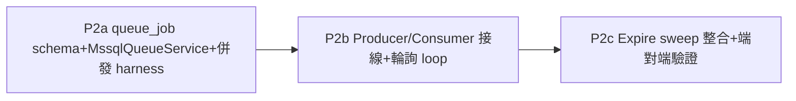

# AD-E07-40：MSSQL 全面遷移 P2（自建 T-SQL 佇列，取代 pg-boss）架構設計

## Agent Loading Guide

| Agent 角色 | 需載入章節 |
|-----------|-----------|
| Test Designer | §0（前提差異，決定測試可在本機完整跑）、§6（併發驗證 harness + pool.max 假陽性陷阱）、§7（P2a/b/c DoD）、§8（不變式） |
| TDD Developer | §1（queue_job entity + filtered index 兩軌）、§2（五個原子操作 T-SQL）、§3（pg-boss 契約對齊表）、§4（輪詢 loop + processPayload 共用設計 + 檔案改動清單）、§5（driver-conditional 策略） |
| DevOps / CI/CD | §4.2（`docker-compose.yml` env 變數）、§7（P2c DoD） |
| Product Analyst | §9（風險與殘留議題） |

---

## 0. 關鍵前提差異（本 AD 開頭必讀，決定測試策略）

延續 [AD-E07-38](AD-E07-38-mssql-p1-driver-entity-schema.md)（P1）與 [AD-E07-39](AD-E07-39-mssql-p1b-full-baseline.md)（P1b），P1（P1a/P1b1/P1b2/P1b3/P1c）已全數 commit，CI 骨架已建立。P2 是全遷移計畫**風險最高、無逃生門**的階段：**佇列必須完全自建於 T-SQL**（硬約束②，不得新增 Redis/BullMQ），取代 PostgreSQL-only 的 pg-boss，且此子系統是先前 F098/AD-E07-28 用來解決「月跑卡死整站」生產事故的關鍵修復，替換若做壞有回歸該事故的風險。

**P0 已用 `apps/api/scripts/mssql-smoke.mjs` 對本機 Linux 容器實測驗證佇列核心語法**：

```sql
;WITH candidate AS (
  SELECT TOP (1) id, state FROM #q WITH (READPAST, ROWLOCK, UPDLOCK)
  WHERE state = 'created' ORDER BY created_at ASC
)
UPDATE candidate SET state = 'active'
OUTPUT inserted.id, inserted.state;
```
結果：`✅ UPDLOCK/READPAST/ROWLOCK/OUTPUT 全部被接受（自建佇列方案可行）`。

**與 P1c 的 `sp_getapplock` 之關鍵差異**：`sp_getapplock` 是呼叫系統預存程序，依賴伺服器端元件註冊，P1c 曾踩 17750 DLL 缺失、需等 Windows 環境才能完整驗證。佇列 claim 用的是**純 T-SQL DML 語法**（hint + CTE + `OUTPUT`），**不經過任何額外系統元件**，不受 17750 影響。

**結論（決定本 AD §6/§7 測試策略的關鍵前提）**：P2 的核心機制**可以在本機 Linux 容器完整測試到底**，不像 `sp_getapplock` 有環境缺口需要等待 Windows 才能收尾。test-designer 規劃 P2 測試時，不需要預留「等 Windows 環境」的緩衝，這是本計畫少數已提前拆彈的風險項。

---

## 1. `dbo.queue_job` Schema

TypeORM entity（比照 AD-E07-39 慣例：uuid 採 `@PrimaryGeneratedColumn('uuid')` **產生策略**——P1a 已證實此形式於 mssql driver 正確映射 `uniqueidentifier`，**不需要** `uuidColumnType` helper（那是給裸 `@Column({type:'uuid'})` 字面值用的）；日期欄一律 `dateColumnType`；長文字一律 `longTextColumnType`+`longTextColumnLength`）：

```ts
@Entity('queue_job')
@Index('idx_queue_job_pending', ['queue_name', 'state'])       // 一般索引（synchronize 可攜，dev 用）
@Index('idx_queue_job_active_expiry', ['state', 'expire_at'])
export class QueueJob {
  @PrimaryGeneratedColumn('uuid')
  id: string;

  @Column({ name: 'queue_name', type: 'varchar', length: 100 })
  queue_name: string;

  @Column({ name: 'payload', type: longTextColumnType, length: longTextColumnLength })
  payload: string; // JSON.stringify(RunJobPayload)

  @Column({ name: 'state', type: 'varchar', length: 20, default: 'created' })
  state: 'created' | 'active' | 'completed' | 'cancelled' | 'expired';

  @Column({ name: 'retry_limit', type: 'int', default: 0 })
  retry_limit: number;

  @Column({ name: 'created_at', type: dateColumnType, default: () => 'CURRENT_TIMESTAMP' })
  created_at: Date;

  @Column({ name: 'started_at', type: dateColumnType, nullable: true })
  started_at: Date | null;

  @Column({ name: 'expire_at', type: dateColumnType, nullable: true })
  expire_at: Date | null;

  @Column({ name: 'completed_at', type: dateColumnType, nullable: true })
  completed_at: Date | null;
}
```

**Filtered index 兩軌策略（沿用 AD-E07-39 §6 schema 兩軌精神，RESOLVED）**：entity 上的 `@Index` 是**一般索引**（portable、synchronize 可產生，dev 用）；真正 `WHERE state='created'`／`WHERE state='active'` 的 filtered index **不透過 entity decorator 表達**（沿用 AD-E07-39 教訓：不可假設 TypeORM 的 `@Index({where})` 跨 driver 行為一致，未經驗證不可信任），改於**手寫 baseline migration**（比照 AD-E07-39 §6 的 baseline 產生流程）補上：

```sql
CREATE INDEX idx_queue_job_pending ON dbo.queue_job (queue_name, created_at) WHERE state = 'created';
CREATE INDEX idx_queue_job_active_expiry ON dbo.queue_job (expire_at) WHERE state = 'active';
```

**設計選擇（RESOLVED）：`queue_job` 表在所有 driver 上通用建立**（entity/migration 不做 mssql-only 條件式 schema）——postgres 分支在 cutover 前完全使用 pg-boss 自己的 `pgboss` schema（見 §5），`queue_job` 在 PG 上會是一張建了但未使用的空表，屬無害的簡化選擇，換取 schema 層不需要 driver 條件邏輯，且 Phase 6 cutover 移除 PG 時不會有 schema 意外。

**Entity 清冊收斂**：`app.module.ts` 之 `ALL_ENTITIES`（AD-E07-39 D1 統一陣列）須加入 `QueueJob`；`worker-app.module.ts`／`data-source.ts` 為 glob 載入，新檔案自動納入，不需改動（呼應 **I-MSSQL-ENTITY-LIST-PARITY-01**，AD-E07-39）。

---

## 2. 五個原子操作 T-SQL

### 2.1 原子領取（claim，模擬 SKIP LOCKED；§0 已驗證核心語法）

```sql
;WITH candidate AS (
  SELECT TOP (1) id, payload, retry_limit
  FROM dbo.queue_job WITH (READPAST, ROWLOCK, UPDLOCK)
  WHERE queue_name = @queueName AND state = 'created'
  ORDER BY created_at ASC
)
UPDATE candidate
SET state = 'active',
    started_at = SYSUTCDATETIME(),
    expire_at  = DATEADD(SECOND, @expireSeconds, SYSUTCDATETIME())
OUTPUT inserted.id, inserted.payload, inserted.retry_limit;
```
與 P0 驗證版本結構完全相同，僅加業務所需欄位（`queue_name`/`ORDER BY`/`payload`/`expire_at`），語法骨架不變。此陳述式的正確性即 **I-MSSQL-QUEUE-CLAIM-01**（見 §8）。

### 2.2 完成（retry=0，無論業務成功/失敗一律 completed）

```sql
UPDATE dbo.queue_job SET state = 'completed', completed_at = SYSUTCDATETIME() WHERE id = @jobId;
```

### 2.3 逾時回收 sweep（佇列層衛生性清理，與 OrphanReaper 業務層回收各自獨立，見 §3/§4.3）

```sql
UPDATE dbo.queue_job WITH (ROWLOCK)
SET state = 'expired'
WHERE state = 'active' AND expire_at <= SYSUTCDATETIME();
```

### 2.4 取消（pending 快路徑）

```sql
UPDATE dbo.queue_job SET state = 'cancelled' WHERE id = @jobId AND state = 'created';
-- 影響列數 0 → 已被消費或不存在，對齊現行 producer.cancel() 吞錯語意
```

### 2.5 入列（send）

```sql
INSERT INTO dbo.queue_job (id, queue_name, payload, state, retry_limit, created_at)
OUTPUT inserted.id
VALUES (NEWID(), @queueName, @payloadJson, 'created', @retryLimit, SYSUTCDATETIME());
```

---

## 3. 對齊現行 pg-boss 契約

本輪重新查證 `queue/` 目錄下全部現行檔案，內容與先前查證版本一致，P1 期間未被改動：

| 契約項 | 現況 | P2 是否改動 |
|---|---|---|
| `RUN_QUEUE_NAME`='assignment-run' | `run-queue.constants.ts` | **不變** |
| `RunJobPayload {runId, ym}` | 同上 | **不變** |
| `RUN_QUEUE_RETRY_LIMIT=0` | 同上 | **不變**（mssql 路徑：claim 後無論成功/失敗一律 `complete`，不重派，語意對齊） |
| `RUN_QUEUE_BATCH_SIZE=1` | 同上 | **語意保留**：mssql 輪詢每 tick 只 `TOP(1)` 領一筆 + reentrancy guard（§4），效果等同 |
| `RunQueueProducer.send(payload): Promise<string\|null>` | `run-queue.producer.ts` | **簽章不變**，內部新增 mssql 分支 |
| `RunQueueProducer.cancel(jobId): Promise<void>` | 同上 | **簽章不變**，內部新增 mssql 分支 |
| `RunQueueConsumer` 對外行為（`onModuleInit` 註冊、業務邏輯：查 run→檢查已取消→呼叫 pipeline→try/catch 不 rethrow） | `run-queue.consumer.ts` | **行為契約不變**，內部改為輪詢 loop 觸發（§4），業務邏輯抽出共用 |
| **`OrphanReaper`** | `orphan-reaper.ts` | **零改動（重新確認）**。本輪重讀完整原始檔驗證：`reap()` 純粹查 `AssignmentRun` repo（`status`/`started_at`/`created_at`），從未觸碰 pg-boss 或任何佇列內部狀態。P1 設計階段的判斷在 P2 依然成立 |
| **`CancellationPoller`** | `cancellation-poller.ts` | **零改動（重新確認）**。純粹查 `AssignmentRun.status==='failed'`，同上結論 |
| `RunQueueTuning`（`jobExpireInSeconds`/`reaperIntervalMs`/`orphanThresholdMs`/`cancelPollIntervalMs`） | `pg-boss.provider.ts` | 既有 4 個欄位不變；**新增** `pollIntervalMs`（見 §4） |

**內部重寫範圍**：`pg-boss.provider.ts` 的 postgres 建構邏輯（`createPgBoss`）**保留不動**（postgres 路徑在 cutover 前完全不碰，零風險）；新增一個平行的 mssql 佇列操作封裝（新檔 `mssql-queue.service.ts`），`run-queue.producer.ts`／`run-queue.consumer.ts` 內部新增 driver 分支呼叫新封裝。

---

## 4. 單一 Worker 序列化 + Worker 生命週期改動

### 4.1 輪詢 Loop 設計（取代 `boss.work()`）

```ts
// RunQueueConsumer 新增（僅 mssql 路徑啟用）
private pollTimer: NodeJS.Timeout | null = null;
private polling = false; // reentrancy guard：避免上一輪 tick 還沒跑完，下一輪計時器又觸發

private startMssqlPolling(): void {
  const intervalMs = this.tuning.pollIntervalMs ?? 2000;
  this.pollTimer = setInterval(() => {
    if (this.polling) return;
    this.polling = true;
    this.pollOnce().catch((err) => this.logger.error(`poll tick 例外：${err?.message ?? err}`))
      .finally(() => { this.polling = false; });
  }, intervalMs);
  this.pollTimer.unref?.(); // 不阻擋程序退出，比照 OrphanReaper 既有慣例
}

private async pollOnce(): Promise<void> {
  const claimed = await this.mssqlQueue.claimNext(RUN_QUEUE_NAME, this.tuning.jobExpireInSeconds);
  if (!claimed) return; // 本輪無待處理 job
  try {
    await this.processPayload(claimed.jobId, claimed.payload); // 共用業務邏輯
  } finally {
    await this.mssqlQueue.complete(claimed.jobId); // 無論成功/失敗一律 completed（retry=0 語意）
  }
}
```

**業務邏輯去重（`processPayload`，即 I-MSSQL-QUEUE-PAYLOAD-UNITY-01）**：現行 `handleOne(job: PgBoss.Job)` 內含「查 run→檢查是否已取消→呼叫 pipeline→try/catch」的完整業務邏輯。P2 抽出一個**driver-agnostic 的共用私有方法** `processPayload(jobId: string, payload: RunJobPayload)`，pg-boss 路徑的 `handleOne` 與 mssql 路徑的 `pollOnce` 都呼叫**同一份**邏輯，只是各自負責從各自的 job 表示形式（`PgBoss.Job.data` vs `claimed.payload`）取出 `payload` 再傳入——避免兩份幾乎一樣但分別維護的業務邏輯產生語意漂移（本專案已有先例：F109 `buildCustomerCoreClause` 靠「單一函式兩處呼叫」而非「兩份實作」保等價，此處比照）。

**單一 worker 序列化保證（I-MSSQL-QUEUE-SERIAL-01）**：`TOP(1)` 每輪只領一筆 + `polling` reentrancy guard（同一程序內不重疊）+ 只跑一個 `cdmp-worker` 容器程序 = 與現行 `batchSize:1` 效果等同。**額外優點**（非本次目標但值得記錄）：因為 claim 本身在 DB 層是原子的（I-MSSQL-QUEUE-CLAIM-01），此設計天生支援未來若要開多個 worker 副本也不會雙重消費，不像現行「僅靠只跑一個程序」的假設脆弱。

### 4.2 檔案改動清單

| 檔案 | 改動 |
|---|---|
| `run-queue.consumer.ts` | `onModuleInit()` 加 driver 分支：mssql → `startMssqlPolling()`；postgres → 現行 `boss.work()` 不變；新增 `pollOnce`/`processPayload`；`OnModuleDestroy` 補 `clearInterval(this.pollTimer)` |
| `run-queue.producer.ts` | `send`/`cancel` 各加 driver 分支 |
| `pg-boss.provider.ts` | postgres 建構邏輯不變；`RunQueueTuning` interface 新增 `pollIntervalMs: number`；`DEFAULT_RUN_QUEUE_TUNING` 補預設值（建議 2000ms，可 env `RUN_QUEUE_POLL_INTERVAL_MS` 調整） |
| **新檔** `queue/mssql-queue.service.ts` | 封裝 §2 五個 T-SQL 操作，`@Injectable()`，注入 `DataSource`，方法：`send`/`cancel`/`claimNext`/`complete`/`expireSweep` |
| `assignment-worker.module.ts` | `providers` 加入 `MssqlQueueService`；`RunQueueConsumer`/`OrphanReaper` 不變 |
| `worker-main.ts` | **不變**——`createApplicationContext` 啟動模式與佇列實作無關，輪詢啟動已由 `RunQueueConsumer.onModuleInit`（既有 lifecycle hook）涵蓋 |
| `worker-app.module.ts` | **不變**（glob 載入自動納入 `QueueJob` entity） |
| `app.module.ts` | `ALL_ENTITIES` 加入 `QueueJob`（API process 的 `RunQueueProducer.send`/`cancel` 需要 DataSource 存取此表） |

### 4.3 逾時回收 sweep 的掛載點

§2.3 的 expire sweep 建議搭 `OrphanReaper` 既有的 `reaperIntervalMs` 定時器一起跑（同一個 `setInterval` 內多執行一句 SQL，不需另開 timer），但**邏輯上仍是獨立的兩件事**：`OrphanReaper.reap()` 操作業務表 `assignment_run`（已確認零改動）；佇列層 expire sweep 操作 `queue_job` 表（純衛生性清理，避免 `active` 殭屍列無限累積，不影響業務正確性——`assignment_run` 層的孤兒回收本來就不依賴佇列表狀態）。實作方式（新增一個仿 `OrphanReaper` 模式的極簡 reaper，或讓 `MssqlQueueService` 自行內部啟動 timer）交 tdd-implementation 依現行程式碼風格擇一，架構上不強制統一。

---

## 5. 跨 Driver 策略：Driver-Conditional（RESOLVED，不統一介面）

**決策：postgres 分支在 cutover 前維持 pg-boss 不變，不提前一併替換。**

理由：
1. 現行 pg-boss 路徑是**唯一真正在跑生產流量**的實作（本次遷移尚未 cutover），提前改動一個已穩定運作、且即將被整體淘汰的子系統，是零效益、高風險的工作——若改壞，會同時破壞「目前唯一能上線的路徑」與「正在建置的新路徑」，且沒有 fallback。
2. 與整個遷移案已確立的模式完全一致：`DB_TYPE` gate 貫穿全專案（`stage1-sql-executor` 的 `DB_TYPE==='postgres'` gate、`personnel-ratio.service.ts` 的 `isPostgres()`、`raw-data.service.ts` 的 `this.isPostgres`）——佇列子系統延用同一慣例，不需要發明新的統一抽象層。
3. **不強行統一介面**：pg-boss 是 push 模型（`boss.work()` 內部自行輪詢並回呼 handler），自建佇列是 pull 模型（呼叫端主動 `claimNext()`）。硬套一個共用 interface（如 `QueueStore.claimNext()`/`.complete()`）會讓 pg-boss 的實作變成一個彆扭的介面卡合層（需要自己包一層 poll 邏輯去模擬 pull 語意，但 pg-boss 根本不是這樣設計的），反而增加複雜度、沒有實質好處。維持兩條分開、各自地道的實作路徑，僅在 `RunQueueProducer`/`RunQueueConsumer` 這層做「呼叫哪一條路徑」的簡單 if/else 分支，比引入抽象層更簡單、更符合本專案既有風格。

**sqlite 測試路徑**：不變。現行測試以 `overrideProvider(PG_BOSS)` 注入 fake boss（`f098-consumer.spec.ts` 等既有測試已建立此模式）；mssql 路徑同理可用 `overrideProvider` 注入 fake `MssqlQueueService`。**需要真實 DB 併發驗證的測試**（§6）無法用 sqlite/fake 模擬鎖語意，必須連真實 mssql（比照 AD-E07-38 §6 已預告的 `.mssql.spec.ts` 命名慣例）。

---

## 6. 併發正確性驗證方案（本專案首次自寫此類測試）

### 6.1 為何需要新設計（過去從未需要）

pg-boss 的 `SKIP LOCKED` 正確性是套件自己的責任，本專案從未驗證過、也不需要驗證。改自建後，這個保證變成本專案自己的程式碼要撐，必須有測試直接證明「兩個並發 claim 呼叫，恰好一個成功」，否則 P2 是在無實測基礎上假設 UPDLOCK/READPAST/ROWLOCK 組合正確——這正是「無逃生門」風險評級的核心。

### 6.2 Harness 設計

**核心原則：併發正確性的保證來源是 SQL Server 的列鎖行為，不是 Node.js 的行程/執行緒模型**——測試不需要真的開多個 OS 行程或多個 worker 容器，只需要在單一測試程序內，透過連線池的多個並發連線，同時發出多個 claim 請求，即可產生真實的 SQL Server 並發 session，足以驗證 `READPAST`/`UPDLOCK` 是否如預期互斥。

```ts
// 概念示意（test-designer 依此細化為正式測試案例）
it('K 個並發 claim 對 M 個 created job，恰好 M 次成功、無重複、無遺漏', async () => {
  const M = 5;
  await seedJobs(M); // 預先塞 5 筆 state='created'
  const K = 10;       // 併發嘗試數 > 實際 job 數，模擬「僧多粥少」與「粥多僧少」兩種邊界
  const results = await Promise.all(
    Array.from({ length: K }, () => mssqlQueue.claimNext(RUN_QUEUE_NAME, 14400)),
  );
  const claimed = results.filter((r) => r !== null);
  const claimedIds = claimed.map((r) => r.jobId);
  expect(claimed.length).toBe(M);                          // 恰好 M 次成功
  expect(new Set(claimedIds).size).toBe(M);                 // 無重複 claim
});
```

**🔴 測試設計陷阱（`I-MSSQL-QUEUE-TEST-CONCURRENCY-01`，必須在測試建置階段就避免，否則「測試綠燈」是假陽性）**：TypeORM/mssql（tedious）的連線池若**未設定足夠的 pool size**，`Promise.all` 送出的 K 個請求可能被連線池排隊、變相序列化執行——這樣測試即使通過，也**沒有真正驗證到並發場景**，只是測了「依序執行」。**test-designer 必須在測試環境的 DataSource 設定中明確將 `pool.max` 調到 ≥ K**，並建議額外斷言/記錄「這些 claim 呼叫確實是並發送出」（例如比對每個請求的起始時間戳記在誤差範圍內重疊），避免日後有人誤刪這個 pool 設定導致測試靜默退化為非併發驗證。

### 6.3 其餘必要測試場景

1. **Expire + 不自動重派**：claim 一筆 job 後不 complete，人為將 `expire_at` 撥到過去（或注入極短 `expireSeconds`），跑 `expireSweep()`，斷言 `state='expired'` 且**不會**被後續 `claimNext()` 撈到（claim 只選 `state='created'`，`expired` 不在範圍內——對齊 retry=0「不自動重派」的既有業務決策）。
2. **Cancel-before-claim**：`send()` 後立刻 `cancel()`，之後 `claimNext()` 對該筆應回傳 null（不可被領走）。
3. **Claim-after-claim**：對同一筆已 `active` 的 job 再次呼叫 claim 邏輯，應回傳 null（非重複配發）。
4. **FIFO 順序**（非強制但建議驗證）：多筆 `created` job 依 `created_at ASC` 依序被領取，確認 `ORDER BY` 生效。

---

## 7. P2 子切片與 DoD



### P2a — Schema + `MssqlQueueService`（獨立驗證層，不碰 Producer/Consumer）

**範圍**：§1 entity+migration；§2 五個 T-SQL 操作封裝為 `MssqlQueueService`；§6 併發 harness。

**DoD**：
1. `queue_job` 表對 mssql 容器建表成功（synchronize + baseline migration 兩軌皆過，比照 I-MSSQL-BASELINE-PARITY-01）。
2. §6.2 併發測試（M/K 組合，含連線池陷阱防範，I-MSSQL-QUEUE-TEST-CONCURRENCY-01）通過。
3. §6.3 四個場景測試通過。
4. `MssqlQueueService` 五個方法皆有對應單元/整合測試，**不依賴** `RunQueueProducer`/`RunQueueConsumer`（完全獨立驗證）。

### P2b — 接線 Producer/Consumer + 輪詢 Loop

**範圍**：§3/§4 全部檔案改動；§5 driver 分支邏輯。

**DoD**：
1. 現行 `f098-producer.spec.ts`/`f098-consumer.spec.ts`/`f098-static-guards.spec.ts` 對應行為在 mssql 分支下重新驗證（新增 `.mssql.spec.ts` 或擴充既有測試矩陣，視 test-designer 判斷）：`send` 回傳 jobId、`cancel` 對已消費 job 吞錯、`processPayload` 對 `status==='failed'` 略過、pipeline 拋錯不使 worker 崩潰。
2. `OrphanReaper`／`CancellationPoller` 既有測試**原樣通過**（零改動的驗證）。
3. 端對端：`DB_TYPE=mssql` 下觸發一次月跑（`POST /api/v1/assignment/runs`），worker 輪詢 loop 撿到 job、呼叫 `pipeline.runPipeline`、`assignment_run.status` 正確推進至 `completed`/`failed`。
4. Worker 程序 SIGTERM 優雅關閉：`pollTimer` 正確 clear，不留孤兒 interval。

### P2c — Expire Sweep 整合 + 完整回歸

**範圍**：§4.3 sweep 掛載；全流程回歸。

**DoD**：
1. Sweep 定時掃描正確運作（可用短週期注入測試，比照 `OrphanReaper.reap(now)` 既有的「注入時鐘」測試慣例）。
2. 模擬 worker 崩潰（claim 後程序中斷）情境：`queue_job` 該筆逾時後被 sweep 標為 `expired`；**同時**驗證業務層 `OrphanReaper` 依然正確將對應 `assignment_run` 標為 `failed`（兩層回收各自獨立運作，互不依賴，但結果一致）。
3. 全 F098 既有測試套件（producer/consumer/orphan-reaper/cancellation/static-guards）在 mssql 分支下整體重跑一次，零回歸。
4. `docker-compose.yml` 的 `cdmp-worker` service 環境變數補上 `RUN_QUEUE_POLL_INTERVAL_MS`（若需要 prod 可調）。

### 是否需要 spec-writer（RESOLVED：不需要）

理由與 AD-E07-38 §3 D-7 完全一致——P2 的不變式仍是「行為不變、僅置換底層佇列實作」：`RUN_QUEUE_NAME`/`RunJobPayload`/`RETRY_LIMIT=0`/`BATCH_SIZE=1` 語意/`send`/`cancel`/業務邏輯全部維持不變，沒有新業務規則、沒有新使用者可見行為。唯一「語意有微妙差異」的地方（expire 判定時機、輪詢間隔精度 vs pg-boss 內部排程精度）已在本 AD 明確裁定，屬架構師 HOW 層級決策，不涉及產品需求定義。P2 比照 F098/AD-E07-28 P1 與 AD-E07-38/39 的既有模式，直接 system-architect → test-designer → tdd-implementation。

---

## 8. 不變式（新增，補充 AD-E07-38/39 既有清單）

| ID | 說明 |
|---|---|
| **I-MSSQL-QUEUE-CLAIM-01** | 任何佇列 job 領取操作必須使用 §2.1 之 `WITH (READPAST, ROWLOCK, UPDLOCK)` + CTE + `OUTPUT` 模式，不得以「先 SELECT 再另一句 UPDATE」的兩段式操作模擬（會有 TOCTOU 競態窗口）；此為佇列正確性的唯一保證來源 |
| **I-MSSQL-QUEUE-SERIAL-01** | mssql 佇列路徑之單一 worker 序列化，由「`TOP(1)` 每輪只領一筆」+「`polling` reentrancy guard（同程序內不重疊 tick）」+「僅一個 worker 程序」三者共同保證，三者缺一即不成立，未來若調整任一項需重新驗證序列化語意 |
| **I-MSSQL-QUEUE-PAYLOAD-UNITY-01** | pg-boss 路徑與 mssql 輪詢路徑的 job 業務處理邏輯（查 run 狀態→取消檢查→呼叫 pipeline→錯誤處理）必須共用同一個 `processPayload` 實作，不得為兩條路徑各自維護一份相似邏輯 |
| **I-MSSQL-QUEUE-TEST-CONCURRENCY-01** | 佇列併發正確性測試必須確保連線池 `pool.max` ≥ 併發測試呼叫數 `K`，否則測試對「依序執行」與「真正並發」無鑑別力，屬假陽性；此設定不得被靜默移除或調低 |

---

## 9. 風險與殘留議題

### 9.1 `pollIntervalMs` 預設值（2000ms）尚未實測對月跑觸發延遲的實際影響

輪詢間隔越短，job 從入列到被領取的延遲越低，但輪詢頻率越高對 DB 負擔越大（即使空轉查詢成本很低）。建議 P2b 端對端測試順便量測「trigger → worker 開始執行」的實際延遲分佈，作為是否需要調整預設值的依據，非阻擋項。

### 9.2 Expire sweep 與 OrphanReaper 雙層回收機制的可觀測性

佇列層（`queue_job.state='expired'`）與業務層（`assignment_run.status='failed'`）是兩個獨立回收機制，正常情況下結果一致，但若未來任一層邏輯有 bug 導致兩者不一致（如業務層已標 failed 但佇列層該筆仍卡在 active），目前設計沒有告警機制偵測此不一致。建議列為 P2c 之後的可選強化項（非本次阻擋），例如定期比對兩表狀態一致性的健康檢查。

### 9.3 postgres 分支 `queue_job` 空表的長期存在

§1 決策讓 `queue_job` 表在 PG 上建立但不使用，直到 Phase 6 cutover 移除 PG 為止都會是一張空表。這是刻意的簡化選擇（見 §1 說明），非遺漏，記錄於此避免未來被誤判為「為什麼 PG 上有一張沒人用的表」的疑惑。
