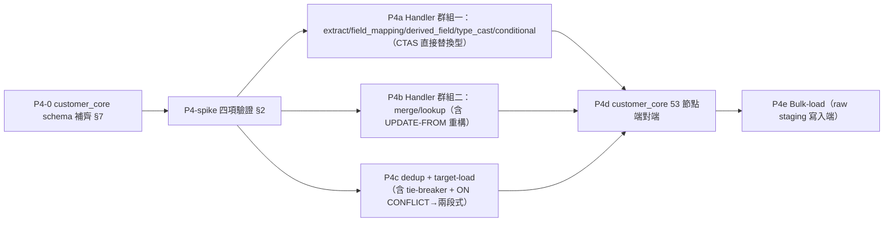

# AD-E07-41：MSSQL 全面遷移 P4（ETL 引擎 MSSQL 化，含 customer_core 真實資料）架構設計

## Agent Loading Guide

| Agent 角色 | 需載入章節 |
|-----------|-----------|
| Test Designer | §2（P4-spike 四項驗證 DoD）、§8（EQ/端對端測試策略）、§9（P4 子切片與 DoD）、§10（不變式） |
| TDD Developer | §1（driver 組織方式）、§3（CTAS→SELECT INTO + 共用 helper）、§4（dedup tie-breaker 改寫）、§5（ON CONFLICT/Pattern B/cast/正則逐項轉換）、§6（bulk-load）、§7（customer_core schema） |
| DevOps / CI/CD | §6（bulk-load 部署面）、§9（P4 子切片 DoD） |
| Product Analyst | §11（風險與需使用者留意的點） |

---

## 0. 背景：為何 P4 拉到 P3 之前

原六階段遷移計畫中，Phase 4（ETL 引擎 MSSQL 化）排在 Raw SQL 引擎移植（P3）之後。P3 設計階段查證 Stage 2 計分有 9/15 個對照欄位依賴 `customer_core`（`CUS_SEX`/`AGE`/`EDUCAT_BACK`/`CAREA_NO1`/`CAREA_NO2`/`CELLULAR`/三縣市欄），而 `customer_core` 資料完全由「ETL for Customer Core」pipeline（53 節點）灌入，該表本身雖已規劃補入 MSSQL baseline（空表 schema），但**真實資料**需要 ETL 引擎本身可在 MSSQL 上執行。

架構師先前對「customer_core-only 最小子集」是否可行做過逐 handler 實地盤點（讀取 `apps/api/src/database/seeds/data/etl-pipelines.json` 之 53 節點 nodeType 分布、`apps/api/src/modules/etl/engine/handlers/*.ts` 全部 9 個 handler 原始碼），結論：**不存在可控最小子集**——customer_core pipeline 用盡全部 9 種 handler 類型，且全部 9 個 handler 共用同一套「`CREATE TEMP TABLE AS SELECT`」PG-only 架構骨幹，改一個等於要動全部。工作量估算 27–46 人天。使用者已核准接受此量體，拉前執行。本 AD 即為此工作之正式架構設計。

---

## 1. 整體策略：Driver 組織方式

### 1.1 既有架構事實（已查證）

- 每個 handler 是實作 `NodeExecutor` 介面（`nodeType: string; execute(context): Promise<DataSet>`）的 class，經 `NodeDispatcher.register(executor)` 以 `nodeType` 字串註冊，執行期依 `nodeType` 動態取用（`node-dispatcher.ts`）。
- `NodeExecutionContext` 內含 `queryRunner: QueryRunner`——**已確認全程單一 QueryRunner 貫穿整條 pipeline 執行**（`pipeline-runner.ts` 簽章持有單一 `QueryRunner` 參數並逐節點傳遞），MSSQL 區域暫存表（`#temp`，session-scoped）在此架構下可正確存活跨節點，不需要重新設計連線管理（此點已於前次盤點確認，非本次新風險）。
- 資料傳遞介面 `DataSet { tempTable: string; rowCount: number }`——節點間只傳「暫存表名稱」，不傳實際資料列，此抽象本身是 driver-agnostic，**不需要改**。
- 組裝點（handler 實例化＋註冊進 `NodeDispatcher`）位於 `etl-pipeline-execution.service.ts`（已查證為 `new ExtractHandler(...)`/`dispatcher.register(...)` 等呼叫的所在檔案）。

### 1.2 決策：平行 mssql Handler 檔案，於組裝點依 `DB_TYPE` 切換註冊哪一組（RESOLVED）

沿用 P3（Raw SQL 引擎）已確立的「PG 檔不動、mssql 平行檔」精神，延伸至 handler 層級：

- **每個 handler 對應一個平行的 `*-mssql.ts` 新檔**（例如 `extract-handler.ts` → `extract-handler-mssql.ts`），與 P3 的 `stage1-sql-builder-mssql.ts` 命名慣例一致，**不在同一 class 內用 if/else 切出兩種 SQL 產生邏輯**。
- 理由與 P3 §1.2 相同：這些 handler 的核心內容就是 SQL 字串產生邏輯本身（非附帶邏輯），且 CTAS→SELECT INTO 是**架構性**差異（非關鍵字替換），混在同一 class 內會讓兩種完全不同的暫存表存取策略（PG 用 `information_schema.columns` 對真實表名查詢；MSSQL 用 `tempdb.sys.columns`+`OBJECT_ID` 對系統附碼後的實體名稱查詢，見 §3）交錯在一起，提高 PG 路徑（cutover 前必須零風險）被誤改的機率。
- **唯一組裝點改動**：`etl-pipeline-execution.service.ts` 內建立 `NodeDispatcher` 並註冊 handler 的邏輯，依 `DB_TYPE` 分支選擇註冊 PG 版或 MSSQL 版 handler 實例（9 個 handler 各自二選一，`NodeDispatcher` 本身、`node-dispatcher.ts`、`types.ts`、`pipeline-runner.ts` **完全不動**——因為 `NodeExecutor` 介面本身是 driver-agnostic 的抽象，driver 差異完全被封裝在個別 handler 實作內）。

```ts
// etl-pipeline-execution.service.ts 組裝點示意
const useMssql = configService.get('DB_TYPE') === 'mssql';
dispatcher.register(useMssql ? new ExtractHandlerMssql(...) : new ExtractHandler(...));
dispatcher.register(useMssql ? new LookupHandlerMssql(...) : new LookupHandler(...));
// ... 其餘 7 個 handler 比照
```

postgres 分支（現行 9 個 `*.ts` 原始檔）**完全不動**，cutover 前零風險。

---

## 2. 🔴 P4-Spike（第一切片，De-risk，在真實 TypeORM QueryRunner 環境驗證）

### 2.0 背景：為何是獨立切片、且必須在真實 QueryRunner 環境

先前一次以 standalone `mssql` 套件腳本驗證 tempdb 暫存表方案，因**非引擎真實環境**（引擎跑 TypeORM `QueryRunner`，standalone 腳本用套件原生連線，兩者對 session/暫存表生命週期的處理可能不同）且腳本掛住而放棄。**P4-spike 必須直接在 TypeORM `QueryRunner`（比照 `pipeline-runner.ts` 實際用法）環境下驗證**，避免驗證結果與實際引擎行為脫節。

### 2.1 四項驗證項目

**(a) `SELECT ... INTO #temp` 於 QueryRunner 可行**
驗證：透過 `queryRunner.query('SELECT col1, col2 INTO #temp FROM sourceTable')`，同一 `queryRunner` 之後續 `queryRunner.query('SELECT * FROM #temp')` 能正確讀到剛建立的暫存表。

**(b) `information_schema.columns WHERE table_name='#temp'` 抓不到（確認地雷）→ `tempdb.sys.columns`+`OBJECT_ID('tempdb..#temp')` 可靠解析**
驗證兩件事：① 先確認地雷本身存在（`information_schema.columns WHERE table_name='#temp'` 對同一 `queryRunner` 建立的暫存表確實回傳空集合或不可靠結果，因 MSSQL 對區域暫存表在 `tempdb` 內部會附加系統隨機尾碼）；② 確認替代方案可靠：
```sql
SELECT c.name AS column_name, c.column_id
FROM tempdb.sys.columns c
WHERE c.object_id = OBJECT_ID('tempdb..#temp')
ORDER BY c.column_id;
```
在同一 `queryRunner` session 內能正確解析出剛建立暫存表的欄位清單，且欄位順序（`column_id`）與建表時的欄位順序一致。

**(c) 單一 QueryRunner 全程 `#temp` 存活**
驗證：模擬 pipeline-runner 的多步驟模式（同一 `queryRunner` 依序執行「建 `#temp_a`」→「由 `#temp_a` 建 `#temp_b`」→「查詢 `#temp_b`」三個步驟，中間不重新 `connect()`），確認暫存表鏈可正確存活到最後一步（此點理論上應成立，因為 §1.1 已確認架構上是單一 QueryRunner，但仍需以真實驅動實測排除任何 tedious/TypeORM 層面的連線重用細節意外）。

**(d) `DISTINCT ON`+`ctid`→`ROW_NUMBER() OVER(...)`+確定性 tie-breaker 改寫可行**
驗證：對一組含重複鍵值、部分時間戳記相同的測試資料，比較 PG `DISTINCT ON (key) ... ORDER BY key, ts DESC NULLS LAST, ctid ASC` 與 MSSQL 改寫版（見 §4）在**時間戳記不同**與**時間戳記相同**兩種情境下，是否選出邏輯上一致的「保留列」（見 §4 的 tie-breaker 語意討論——「一致」的判定標準是兩者都能決定性地選出恰好一列，而非要求選出「同一實體列」，因為 ctid 與新 identity 序列本質上是兩套不同的實體排序基準，見 §4.3）。

### 2.2 Spike DoD

以上 (a)(b)(c)(d) 四點在真實 MSSQL 容器、經 TypeORM `QueryRunner`（非 standalone `mssql` 套件腳本）實測，全部通過，方可進入 §9 P4 後續子切片。若 (b) 的 `tempdb.sys.columns` 方案驗證失敗（不可靠），需回頭重新設計欄位內省機制（列為 spike 失敗的 fallback 觸發點，不預先假設一定成功）。

---

## 3. CTAS → `SELECT INTO` 轉換（9 Handler 共通）

### 3.1 決策：抽共用 Helper，避免 9 份重複邏輯（RESOLVED）

新增 `apps/api/src/modules/etl/engine/handlers/mssql/temp-table.util.ts`（或同等位置，供全部 9 個 mssql handler 共用）：

```ts
export interface MssqlTempTableColumn {
  name: string;
  columnId: number;
}

/** 建立區域暫存表（SELECT INTO #temp），沿用 makeTempTableName 加 '#' 前綴（I-MSSQL-TEMPTABLE-PREFIX-01）。 */
export async function createMssqlTempTable(
  queryRunner: QueryRunner,
  tempTableName: string, // 呼叫端已含 '#' 前綴
  selectSql: string, // 'SELECT ... FROM ...'（不含 INTO 子句本身，由本函式插入）
): Promise<void> {
  // SELECT INTO 語法：SELECT <cols> INTO #temp FROM ...
  // 插入點＝第一個頂層 FROM 之前（呼叫端以片段組裝，非字串搜尋替換，避免誤判巢狀查詢的 FROM）
  await queryRunner.query(buildSelectIntoSql(tempTableName, selectSql));
}

/** 內省暫存表欄位（tempdb.sys.columns 方案，I-MSSQL-TEMP-METADATA-01）。 */
export async function getMssqlTempTableColumns(
  queryRunner: QueryRunner,
  tempTableName: string,
): Promise<MssqlTempTableColumn[]> {
  const rows = await queryRunner.query(
    `SELECT c.name AS column_name, c.column_id
       FROM tempdb.sys.columns c
      WHERE c.object_id = OBJECT_ID('tempdb..' + @0)
      ORDER BY c.column_id`,
    [tempTableName],
  );
  return rows.map((r: any) => ({ name: r.column_name, columnId: r.column_id }));
}

/** 列數查詢（各 handler 共用，取代 PG 版 SELECT COUNT(*)::int）。 */
export async function countMssqlTempTableRows(queryRunner: QueryRunner, tempTableName: string): Promise<number> {
  const rows = await queryRunner.query(`SELECT COUNT(*) AS cnt FROM ${tempTableName}`);
  return Number(rows[0].cnt);
}
```

**理由**：§2 已確認 9 個 handler 全部需要「建暫存表」+「查暫存表欄位」+「查暫存表列數」三件事，且 §2 的 `tempdb.sys.columns` 方案是本次遷移中**技術上最不直覺、最容易寫錯**的一段——若讓 9 個 handler 各自實作一份，任何一處寫錯都要單獨除錯；集中一個 helper，正確性只需驗證一次（P4-spike 已驗證），其餘 9 個 handler 只需正確呼叫。

### 3.2 各 Handler 改寫要點

| Handler | PG 核心陳述式 | MSSQL 改寫要點 |
|---|---|---|
| `extract-handler.ts` | `CREATE TEMP TABLE "..." AS SELECT * FROM "raw_xxx"${whereClause}` | `createMssqlTempTable` 包 `SELECT * FROM raw_xxx${whereClause}`；`information_schema.tables WHERE table_name=$1`（判斷來源 raw 表是否存在）— MSSQL 可用標準 `INFORMATION_SCHEMA.TABLES`（**非暫存表**，是一般實體表，不受 §2(b) 地雷影響，`table_name = @0` 具名參數即可，屬 Pattern B 範疇非架構問題） |
| `field-mapping-handler.ts` | `CREATE TEMP TABLE "..." AS SELECT src AS target, ... FROM input` | `createMssqlTempTable` 包對應 SELECT；欄位清單改用 `getMssqlTempTableColumns` |
| `derived-field-handler.ts` | `CREATE TEMP TABLE "..." AS SELECT *, expression AS new_col FROM input`；`LPAD("${col}"::TEXT, n, char)` | `createMssqlTempTable` 包裝；`LPAD` → MSSQL 無原生 `LPAD`，改 `RIGHT(REPLICATE(char,n) + col, n)`（標準 T-SQL LPAD 等價寫法） |
| `type-cast-handler.ts` | `CREATE TEMP TABLE "..." AS SELECT *, CAST(col AS type) FROM input`；`"${col}"::TEXT ~ regex` | `createMssqlTempTable` 包裝；cast 改 `TRY_CAST`；正則見 §5.4 |
| `conditional-handler.ts` | `CREATE TEMP TABLE "..." AS SELECT *, CASE WHEN ... END FROM input` | `createMssqlTempTable` 包裝；`CASE WHEN` 本身 ANSI 相容不需改 |
| `merge-handler.ts` | `CREATE TEMP TABLE "..." AS SELECT ... FROM left FULL OUTER JOIN right ON ...` | `createMssqlTempTable` 包裝；`FULL OUTER JOIN` MSSQL 原生支援不需改 |
| `dedup-handler.ts` | `CREATE TEMP TABLE "..." AS SELECT DISTINCT ON (key) * FROM input ORDER BY key, ts DESC NULLS LAST, ctid ASC` | 見 §4（獨立章節，非純 CTAS 替換） |
| `lookup-handler.ts` | `UPDATE "${inputTable}" _src SET ... FROM (${lookupSubQuery}) _lk WHERE TRIM(_src.col::text)=TRIM(_lk.col::text)`；`DELETE FROM ... WHERE NOT EXISTS (...)` | `UPDATE...FROM` 重構（比照 P3 已建立之轉換模式）；`::text` → `CAST(...AS NVARCHAR(...))`；`DELETE...WHERE NOT EXISTS` ANSI 相容不需改 |
| `target-load-handler.ts` | 見 §5.1（customer_core UPSERT 專節） | |

**暫存表命名**（**I-MSSQL-TEMPTABLE-PREFIX-01**）：沿用既有 `makeTempTableName(nodeId, logId)` 邏輯不變，僅呼叫端在 MSSQL 分支組出實際 SQL 時於名稱前加 `#`（區域暫存表前綴）——`makeTempTableName` 本身（`types.ts`）**不動**，前綴只在 mssql handler 內組 SQL 字串時添加，維持該函式 driver-agnostic。

---

## 4. `DISTINCT ON` + `ctid` → `ROW_NUMBER()` 改寫（Dedup-Handler + Customer_core 去重）

### 4.1 PG 現行語意

```sql
CREATE TEMP TABLE "..." AS SELECT DISTINCT ON (key) * FROM input
  ORDER BY key, timestamp DESC NULLS LAST, ctid ASC
```
逐鍵值分組，時間戳記新者優先；時間戳記完全相同時，以 `ctid`（實體列位置）作最終決勝——**這個 `ctid` 決勝本身並非刻意設計的業務規則，而是「查詢執行時資料實際落入暫存表的物理順序」的副產品**（`CREATE TEMP TABLE AS SELECT` 本身若無自身 `ORDER BY`，通常依上游查詢執行計畫的自然輸出順序寫入頁面）。

### 4.2 MSSQL 改寫（RESOLVED）

```sql
SELECT IDENTITY(INT,1,1) AS _seq, * INTO #raw FROM (<原始 SELECT，不含 DISTINCT ON>) src;
-- _seq：SELECT INTO 專用 IDENTITY 語法，捕捉列寫入暫存表的順序（等同 ctid 扮演的角色）

WITH ranked AS (
  SELECT *, ROW_NUMBER() OVER (
    PARTITION BY <key>
    ORDER BY <timestamp> DESC, /* NULL 最後 */ CASE WHEN <timestamp> IS NULL THEN 1 ELSE 0 END, _seq ASC
  ) AS rn
  FROM #raw
)
SELECT * INTO #dedup FROM ranked WHERE rn = 1;
```
`_seq`（`IDENTITY(INT,1,1)`，`SELECT INTO` 專用語法，非欄位屬性宣告）扮演與 `ctid` 相同的角色：捕捉「列寫入本次暫存表的順序」，作為時間戳記完全相同時的決定性決勝依據。`NULLS LAST` 於 MSSQL 需改用 `CASE WHEN ... IS NULL THEN 1 ELSE 0 END` 排在 `ORDER BY` 次要鍵補齊（MSSQL `ORDER BY` 預設 NULL 排最前，需額外一個排序鍵手動補上「NULL 最後」語意）。

### 4.3 Tie-Breaker 語意變更說明（**已由架構師決定，非阻擋，但明確記錄供留意**）

`ctid` 與 `_seq` 兩者都是「捕捉資料寫入暫存表當下的物理/邏輯順序」，**語意上是同一角色的忠實翻譯**，非重新定義業務規則。但兩者並非數學上保證選出「同一實體列」——因為 PG 與 MSSQL 對同一段 SQL 的查詢執行計畫（join 順序、掃描方式等）可能不同，導致「資料寫入暫存表的順序」本身在兩個引擎上可能不同，即使邏輯上都是「決定性、非隨機」的。

**實務影響範圍**：僅在「同一 `key` 分組內，`timestamp` 完全相同」的邊界情況才會觸發這個決勝層——多數真實資料的時間戳記不會恰好相同（本身有分秒精度），此為低機率邊界案例，而非常態行為。

**架構師判斷（不需使用者事先核准即可開始 P4 設計/實作，但建議明確告知使用者此邊界案例存在）**：這是「忠實翻譯一個本來就不具業務含義的隱性排序」，不是「重新定義一條業務規則」——`ctid` 從未被任何 story/spec 賦予過業務語意（它甚至不是使用者或設計者刻意選擇的排序鍵，是實作細節的副產品）。因此不將其列為「需使用者裁示」的阻擋項，但**建議在 P4 端對端驗證（§9 P4-c）時，若真實 customer_core 資料中發現有「同鍵同時間戳記」的重複列，個別核對 MSSQL 版本選出的「勝出列」與 PG 版本是否確實一致；若不一致，屬於已知、可解釋的低機率邊界差異，不視為 bug，但需記錄進 F067 式差異報告供業務知悉（而非視為需要立即修正的錯誤）**。

---

## 5. 其餘方言轉換

### 5.1 `ON CONFLICT` → MERGE（`target-load-handler.ts`，Customer_core UPSERT 專節）

現行：
```sql
INSERT INTO "customer_core" (...) SELECT ... FROM temp_table
ON CONFLICT ("source_customer_no") DO UPDATE SET ...
```

**決策：採兩段式（UPDATE-then-INSERT-WHERE-NOT-EXISTS），不採 `MERGE`**（沿用 P1 遷移總體評估已有的判斷：`MERGE` 陳述式有官方文件記載的已知併發/觸發器邊界案例，本情境是單一 pipeline 循序寫入、無並發寫者，兩段式更易除錯、與本專案「顯式優於隱式」的既有風格〔如 `clearStage3Fields` 先於 CR 步驟的設計哲學〕一致）：

```sql
UPDATE tgt SET col1 = src.col1, ...
FROM customer_core tgt
JOIN #dedup src ON tgt.source_customer_no = src.source_customer_no
WHERE <ghost gate 條件>;

INSERT INTO customer_core (...)
SELECT ... FROM #dedup src
WHERE <ghost gate 條件>
  AND NOT EXISTS (SELECT 1 FROM customer_core tgt WHERE tgt.source_customer_no = src.source_customer_no);
```

### 5.2 Pattern B（`$n` → Named Param）

沿用 AD-E07-38 D-5 既有慣例（`escapeQueryWithParameters` + `:param`），全部 9 handler 內的 `$1`/`$2` 站點（`information_schema` 查詢、`lookup-handler.ts` 的 `UPDATE ... SET x = $1`、`resolve-raw-table.ts` 的 `WHERE ds.name=$1 AND et.source_table=$2` 等）逐一轉換，屬機械式工作，已有明確前例可循（AD-E07-38 Pattern B 站點清單同批列出的站點）。

### 5.3 `::cast` → `CAST`/`TRY_CAST`

`::text`/`::TIMESTAMP`/`::UUID`/`::int` 等，依 §4.4（AD-E07-38）既有原則：**資料來源不可信（可能有髒值）之處用 `TRY_CAST`**（如 `lookup-handler.ts` 對來源系統資料的 cast）；**內部產生、型別已知必然合法之處可用 `CAST`**（如 `_etl_loaded_at`/`_etl_pipeline_id` 這類系統時間戳記/UUID 字面值）。

### 5.4 `~` 正則驗證（`type-cast-handler.ts` `getValidationRegex`）

**需 tdd-implementation 於實作前先攤開 `getValidationRegex(targetType)` 全部目標型別分支**（本次架構設計未逐一列舉每個 pattern，因原始碼未在本次查證範圍內完整展開）。**設計原則**（比照 P3 已確立之原則）：若全部 pattern 皆為簡單字元類別型（如 `^[0-9]+$`／`^-?[0-9]+(\.[0-9]+)?$` 這類數字格式驗證），可用 MSSQL `LIKE`/`PATINDEX` 字元類別 wildcard 達成；**若任一 pattern 含真正的複雜 regex 語法**（如 lookahead、非字元類別的分支 alternation `|`、量詞組合），需個別評估改寫方案（多數情況下數字/日期格式驗證仍可用字元類別窮舉達成，僅在少數情況需要拆成多個 `LIKE`/`PATINDEX` 條件的 AND/OR 組合）。**此為 P4 執行期間的一個待確認細節，非架構層級阻擋項**，但列入 §9 P4 子切片的稽核清單。

---

## 6. Bulk-Load：5 個來源表 raw Staging 寫入端

**來源端讀取**（`mssql-executor.ts` 之 `streamBatches`）：**已相容，不需改**——5 個來源（`ZZIP_BAMCUST_M` ×2、MLMC ×3）皆為 MSSQL 來源，讀取端已透過 P0/現行 `mssql-executor.ts` 的 streaming 機制運作。

**寫入端**（`raw-data.service.ts` 之 `openCopyWriter`/`formatCopyValue`/`supportsCopy`，用 `pg-copy-streams`）：**需改用 tedious `Request.bulk`（`mssql` 套件的 `Table` bulk API）**，比照 AD-E07-38 §C 原始總體評估的既有結論：
- 新增 `openMssqlBulkWriter`（封裝 `mssql` 套件的 `sql.Table` 物件 + `request.bulk(table)`），型別化欄位需與 raw 表 DDL 對齊。
- `supportsCopy()`/`supportsBulk()` capability-detection 模式沿用既有架構（`extraction-executor.provider.ts` 的 `streamBatches?`/`supportsStreaming?` 可選介面已預留此擴充點），新增 `supportsBulk`/`openBulkWriter` 對稱介面。
- 此為**固定成本**（bulk-load 機制本身要建置一次），不因只服務 5 張來源表而等比例縮小，已反映於 §「工作量估算」（見 P4 前次盤點的 27–46 人天區間，bulk-load 佔其中 3–5 人天）。

---

## 7. `customer_core` Schema 進 MSSQL Baseline

比照 P1b 既有的 PG DDL 型別對照表機械翻譯（沿用 AD-E07-39 established 型別對照）：

```sql
CREATE TABLE dbo.customer_core (
  customer_id UNIQUEIDENTIFIER NOT NULL CONSTRAINT DF_customer_core_id DEFAULT NEWID(),
  source_customer_no VARCHAR(20) NOT NULL,
  -- 其餘欄位依 PG BaselineSchema.ts 之 customer_core 定義逐一翻譯（gender/date_of_birth/education_code/
  -- residential_zip/mailing_zip/company_zip/cus_sex/carea_no1/carea_no2/cellular/hpost_city/cpost_city/co_city 等）
  CONSTRAINT PK_customer_core PRIMARY KEY (customer_id),
  CONSTRAINT UQ_customer_core_source_customer_no UNIQUE (source_customer_no)
);
```
此步驟**先於 P4 其餘工作獨立完成**（機械、低風險，解除「表不存在→硬錯誤」的問題，供 §9 P4-spike 之後的各切片可以先對著一張存在的空表開發，不需等 ETL 全部打通才能測試 schema 本身）。

---

## 8. EQ / 端對端測試策略

| 測試層級 | 現行 | MSSQL 版 | 備註 |
|---|---|---|---|
| 單一 handler 單元測試 | `engine-node-executors.spec.ts` 等 | 新增對應 `.mssql.spec.ts` 或擴充既有矩陣（比照 P1/P2/P3 慣例） | 逐 handler 驗證 CTAS→SELECT INTO 改寫後行為等價（含 §2 spike 驗證過的 metadata 內省機制） |
| Pipeline 引擎核心 | `engine-core.spec.ts` | 對應 mssql 分支測試 | `NodeDispatcher`/`pipeline-runner` 本身不變（§1.1），主要驗證組裝點的 driver 分支正確 |
| customer_core 53 節點端對端 | 無（現行僅 PG 上跑過） | **新增**：對真實 MSSQL 容器完整跑一次 53 節點 pipeline，比對輸出與 PG 版本結果 | 這是 P4 唯一的「大型端對端」測試，建議比照 F067 模式：兩邊各跑一次，逐欄逐列比對 `customer_core` 最終落地資料（**§4.3 已知的 tie-breaker 邊界案例**若真實觸發，個別核對後記錄，不視為 bug） |
| Dedup tie-breaker 專項 | 無 | §2(d) spike + 獨立測試案例（含時間戳記相同的合成測試資料） | 驗證 §4 改寫的確定性與 §4.3 討論的「低機率邊界差異」 |

---

## 9. P4 子切片與 DoD



### P4-0 — customer_core Schema 補齊

**範圍**：§7。**DoD**：`OBJECT_ID('dbo.customer_core')` 非 NULL；空表 LEFT JOIN 查詢正確執行不報錯（比照 P3 §3.4 第一層驗證）。

### P4-spike — 四項技術驗證（**必須先過，才可進入其餘子切片**）

**範圍**：§2 全部四項。**DoD**：§2.2（四項在真實 QueryRunner 環境全數通過）。

### P4a — Handler 群組一（CTAS 直接替換型：extract/field_mapping/derived_field/type_cast/conditional）

**範圍**：§3.1 共用 helper + §3.2 對應 5 個 handler；§5.2/5.3（各自的 Pattern B/cast 站點）；§5.4（type_cast 正則覆核）。

**DoD**：5 個 handler 各自對應 `.mssql.spec.ts` 通過；`tsc --noEmit` 乾淨。

### P4b — Handler 群組二（merge + lookup，含 UPDATE-FROM 重構）

**範圍**：§3.2 對應 2 個 handler；`lookup-handler.ts` 之 `UPDATE...FROM`/`DELETE...NOT EXISTS` 重構（比照 P3 已建立轉換模式）。

**DoD**：`lookup`（31 個節點實際使用，本 pipeline 最高頻 handler，建議測試覆蓋率高於一般 handler）+ `merge` 對應測試通過。

### P4c — dedup + target-load（含 Tie-Breaker + Customer_core UPSERT）

**範圍**：§4 全部（tie-breaker 改寫）；§5.1（兩段式 UPDATE+INSERT）。

**DoD**：§2(d) spike 結論落地為正式測試；customer_core UPSERT 兩段式陳述式測試（新增列、既有列更新、ghost gate 條件）通過。

### P4d — customer_core 53 節點端對端

**範圍**：§8 端對端測試。

**DoD**：53 節點 pipeline 對真實 MSSQL 容器完整跑通，`customer_core` 落地資料與 PG 版本逐欄逐列比對；§4.3 邊界案例若觸發則記錄（非阻擋）。

### P4e — Bulk-Load（raw Staging 寫入端）

**範圍**：§6。

**DoD**：5 個來源表透過 tedious bulk API 完整匯入對應 `raw_*` 表，列數與 PG COPY 版本一致；吞吐量做 POC 量測記錄（不要求達到與 PG COPY 相同數字，僅記錄供未來優化參考）。

### 是否需要 spec-writer（RESOLVED：不需要）

理由與 P1/P2/P3 一致——P4 的不變式仍是「行為不變、僅置換底層 ETL 執行機制」，customer_core 的欄位定義、業務轉換規則（`padStart`/`LPAD` 等衍生欄位邏輯、lookup 對照表、conditional 分流條件）**完全不變**，P4 只是讓同一組已生產運作的 ETL pipeline 定義能在 MSSQL 上以等價 SQL 執行。§4.3 的 tie-breaker 邊界案例雖然是本 AD 中唯一「不是 100% 數學等價保證」的角落，但架構師已判斷其屬於「忠實翻譯一個原本就無業務含義的隱性排序」，不構成新業務規則，不需要 spec-writer 定義新 acceptance criteria。P4 比照既有模式，直接 system-architect → test-designer → tdd-implementation。

---

## 10. 不變式（新增，補充既有清單）

| ID | 說明 |
|---|---|
| **I-MSSQL-TEMP-METADATA-01** | 任何對 MSSQL 區域暫存表（`#temp`）的欄位內省，一律使用 `tempdb.sys.columns` + `OBJECT_ID('tempdb..#tableName')`，**禁止**使用 `INFORMATION_SCHEMA.COLUMNS WHERE table_name='#tableName'` 做精確比對（後者因 MSSQL 對區域暫存表在 tempdb 內部自動附加系統隨機尾碼而不可靠） |
| **I-MSSQL-TEMPTABLE-PREFIX-01** | MSSQL 版 ETL handler 產生之暫存表名稱，一律沿用既有 `makeTempTableName(nodeId, logId)` 命名邏輯本身不變，僅在組裝實際 SQL 字串時額外加 `#` 前綴（區域暫存表），命名規則本身不得為 mssql 分支另行設計 |
| **I-MSSQL-DEDUP-TIEBREAK-01** | Dedup 邏輯之 tie-breaker（原 PG `ctid`）一律以 `SELECT INTO` 之 `IDENTITY(INT,1,1)` 語法捕捉列寫入暫存表順序取代，語意為「忠實翻譯物理/邏輯寫入順序」而非「重新定義業務優先權」；若端對端測試（P4d）發現真實資料中因此產生與 PG 版本不同的「勝出列」，須記錄為已知邊界案例（非 bug），並反映於上線前的差異報告 |
| **I-MSSQL-ETL-EQ-01** | 每個 ETL handler 的 mssql 版本，以及 customer_core 端對端 pipeline，必須有對應測試與 PG 版本（或其產出結果）比對，比照 P3 之 I-MSSQL-ENGINE-EQ-01 精神；不得僅憑語法轉換表核對即宣稱完成 |

---

## 11. 風險與需使用者留意的點

### 11.1 需使用者留意（不阻擋 P4 啟動，但應告知）

**§4.3 Tie-Breaker 邊界案例**：`ctid`→`IDENTITY` 序列的改寫是忠實語意翻譯而非業務規則重新定義，但無法在改寫當下用數學方式 100% 保證兩引擎在「同鍵同時間戳記」的重複資料上選出完全相同的「勝出列」。此為低機率邊界情況（多數時間戳記不會恰好相同），架構師判斷不需要使用者事前核准即可開始設計/實作，但建議 P4d 端對端測試若真實觸發此案例，應明確記錄並知會使用者（比照本專案一貫的 F067 差異報告揭露慣例），而非要求現在就先決定「萬一不一致該怎麼辦」——因為在看到真實資料觸發機率與觸發後的實際差異程度之前，無法給出有意義的裁示基礎。

### 11.2 其餘技術風險（架構師已有因應設計，非需使用者裁示，記錄供 test-designer/tdd-implementation 留意）

- §5.4 `type-cast-handler.ts` 的 `getValidationRegex` 逐目標型別複雜度尚未完整攤開核實，可能在 P4a 執行時發現超出簡單字元類別可處理的 pattern，屬執行期細節風險非架構層級阻擋。
- P4-spike（§2）若任一項驗證失敗（尤其 (b) `tempdb.sys.columns` 方案），需要回頭重新設計，屬本 AD 中風險密度最高的單一切片，建議優先執行、儘早暴露問題。
- Bulk-load（§6）吞吐量未知，需 POC 量測，不預先承諾效能數字。
