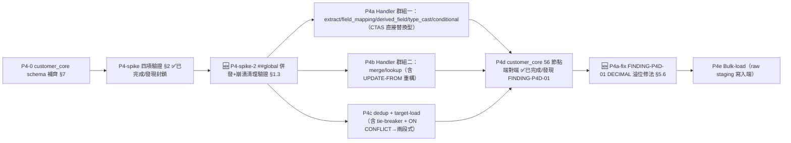

> **🔴 v1.1 修訂通知（2026-07-08）**：P4-spike 實測推翻本文件原 §1.1「單一 QueryRunner ⇒ `#local temp` 可跨節點存活」之核心前提（封鎖級發現，完整記錄見 `docs/specs/implementation-log/AD-E07-41-P4-spike-impl.md`）。架構師已裁示補救路線（§1.3：改用 `##global temp`），本文件已就地修訂 §1.1/§2/§3/§4/§5/§9/§10 反映新設計，**不另立獨立 errata 章節**（因原設計尚未有任何下游程式碼實作，直接修訂內文對讀者更有效）。新增 §12 時程影響評估。
>
> **🔴 v1.2 修訂通知（2026-07-08）**：P4d 端對端驗證抓到 **FINDING-P4D-01**（真實 MSSQL 實測佐證，記錄於 `docs/specs/implementation-log/AD-E07-41-P4d-impl.md`）——`type_cast` 之 `DECIMAL` 目標型別固定映射 `DECIMAL(38,10)`，數字型輸入（如所得級距碼 `'3'`）強制補 10 位小數 → 流入下游窄 `varchar` 目標欄時 MSSQL 算術溢位（PG `NUMERIC` 無此問題）。屬純技術缺陷（非業務決策），架構師已裁定修法，見新增 §5.6，新增不變式 I-MSSQL-DECIMAL-NORMALIZE-01。另同步修正文件內「53 節點」為 P4d 實測確認之**「56 節點」**（55 邊；非阻擋性數字修正）。

# AD-E07-41：MSSQL 全面遷移 P4（ETL 引擎 MSSQL 化，含 customer_core 真實資料）架構設計

## Agent Loading Guide

| Agent 角色 | 需載入章節 |
|-----------|-----------|
| Test Designer | §2（P4-spike 四項驗證 DoD）、§8（EQ/端對端測試策略）、§9（P4 子切片與 DoD）、§10（不變式） |
| TDD Developer | §1（driver 組織方式）、§3（CTAS→SELECT INTO + 共用 helper）、§4（dedup tie-breaker 改寫）、§5（ON CONFLICT/Pattern B/cast/正則逐項轉換）、§6（bulk-load）、§7（customer_core schema） |
| DevOps / CI/CD | §6（bulk-load 部署面）、§9（P4 子切片 DoD） |
| Product Analyst | §11（風險與需使用者留意的點） |

---

## 0. 背景：為何 P4 拉到 P3 之前

原六階段遷移計畫中，Phase 4（ETL 引擎 MSSQL 化）排在 Raw SQL 引擎移植（P3）之後。P3 設計階段查證 Stage 2 計分有 9/15 個對照欄位依賴 `customer_core`（`CUS_SEX`/`AGE`/`EDUCAT_BACK`/`CAREA_NO1`/`CAREA_NO2`/`CELLULAR`/三縣市欄），而 `customer_core` 資料完全由「ETL for Customer Core」pipeline（**56 節點**，v1.2 修正：原估 53，P4d 端對端實測確認為 56 節點/55 邊，見 §0 尾註）灌入，該表本身雖已規劃補入 MSSQL baseline（空表 schema），但**真實資料**需要 ETL 引擎本身可在 MSSQL 上執行。

架構師先前對「customer_core-only 最小子集」是否可行做過逐 handler 實地盤點（讀取 `apps/api/src/database/seeds/data/etl-pipelines.json` 之節點 nodeType 分布、`apps/api/src/modules/etl/engine/handlers/*.ts` 全部 9 個 handler 原始碼），結論：**不存在可控最小子集**——customer_core pipeline 用盡全部 9 種 handler 類型，且全部 9 個 handler 共用同一套「`CREATE TEMP TABLE AS SELECT`」PG-only 架構骨幹，改一個等於要動全部。工作量估算 27–46 人天。使用者已核准接受此量體，拉前執行。本 AD 即為此工作之正式架構設計。

> **節點數修正**：本 AD v1.0/v1.1 沿用架構師盤點階段之估算「53 節點」；P4d 端對端測試（`_p4d-fixtures.ts::deriveExtractSchemas`）程式化掃描 `etl-pipelines.json` 實際 DAG 得 `{raw_data_extract:5, derived_field:7, lookup:31, merge:4, dedup:3, type_cast:2, field_mapping:2, conditional:1, target_load:1}`＝**56 節點**。本文件其餘章節之「53 節點」字樣（§8/§9）已同步修正為 56，純數字校正、不影響任何設計決策。

---

## 1. 整體策略：Driver 組織方式

### 1.1 既有架構事實（已查證；🔴 v1.1：temp table 存活性假設已被 P4-spike 推翻，見 §1.3）

- 每個 handler 是實作 `NodeExecutor` 介面（`nodeType: string; execute(context): Promise<DataSet>`）的 class，經 `NodeDispatcher.register(executor)` 以 `nodeType` 字串註冊，執行期依 `nodeType` 動態取用（`node-dispatcher.ts`）。**（v1.1：不受 spike 影響，維持成立）**
- `NodeExecutionContext` 內含 `queryRunner: QueryRunner`——**已確認全程單一 QueryRunner 貫穿整條 pipeline 執行**（`pipeline-runner.ts` 簽章持有單一 `QueryRunner` 參數並逐節點傳遞，`@@SPID` 全程恆定，P4-spike 已驗證此點成立、非連線池切換問題）。**（v1.1 修正）**：原設計據此推論「同一 QueryRunner ⇒ 區域暫存表（`#temp`，session-scoped）可正確存活跨節點」，**P4-spike 實測推翻此推論**——TypeORM+node-mssql(tedious) 於每次 `queryRunner.query()` 之間會 reset session 狀態，`#local temp` 於下一次呼叫即消失（即使包在同一 `startTransaction()` 內亦然）。單一 QueryRunner 貫穿執行本身仍然成立，只是「單一 QueryRunner ⇒ session-scoped 物件存活」這條推論不成立。裁示與補救見 §1.3。
- 資料傳遞介面 `DataSet { tempTable: string; rowCount: number }`——節點間只傳「暫存表名稱」，不傳實際資料列，此抽象本身是 driver-agnostic，**不需要改**（v1.1：抽象本身維持不變，僅 `tempTable` 字串所指向的實際 MSSQL 物件類型由 §1.3 裁示調整）。
- 組裝點（handler 實例化＋註冊進 `NodeDispatcher`）位於 `etl-pipeline-execution.service.ts`（已查證為 `new ExtractHandler(...)`/`dispatcher.register(...)` 等呼叫的所在檔案）。

### 1.2 決策：平行 mssql Handler 檔案，於組裝點依 `DB_TYPE` 切換註冊哪一組（RESOLVED，v1.1：不受 spike 影響，維持有效）

沿用 P3（Raw SQL 引擎）已確立的「PG 檔不動、mssql 平行檔」精神，延伸至 handler 層級：

- **每個 handler 對應一個平行的 `*-mssql.ts` 新檔**（例如 `extract-handler.ts` → `extract-handler-mssql.ts`），與 P3 的 `stage1-sql-builder-mssql.ts` 命名慣例一致，**不在同一 class 內用 if/else 切出兩種 SQL 產生邏輯**。
- 理由與 P3 §1.2 相同：這些 handler 的核心內容就是 SQL 字串產生邏輯本身（非附帶邏輯），且 CTAS→SELECT INTO 是**架構性**差異（非關鍵字替換），混在同一 class 內會讓兩種完全不同的暫存表存取策略（PG 用 `information_schema.columns` 對真實表名查詢；MSSQL 用 `tempdb.sys.columns`+`OBJECT_ID` 對系統附碼後的實體名稱查詢，見 §3）交錯在一起，提高 PG 路徑（cutover 前必須零風險）被誤改的機率。
- **唯一組裝點改動**：`etl-pipeline-execution.service.ts` 內建立 `NodeDispatcher` 並註冊 handler 的邏輯，依 `DB_TYPE` 分支選擇註冊 PG 版或 MSSQL 版 handler 實例（9 個 handler 各自二選一，`NodeDispatcher` 本身、`node-dispatcher.ts`、`types.ts`、`pipeline-runner.ts` **完全不動**——因為 `NodeExecutor` 介面本身是 driver-agnostic 的抽象，driver 差異完全被封裝在個別 handler 實作內）。

```ts
// etl-pipeline-execution.service.ts 組裝點示意
const useMssql = configService.get('DB_TYPE') === 'mssql';
dispatcher.register(useMssql ? new ExtractHandlerMssql(...) : new ExtractHandler(...));
dispatcher.register(useMssql ? new LookupHandlerMssql(...) : new LookupHandler(...));
// ... 其餘 7 個 handler 比照
```

postgres 分支（現行 9 個 `*.ts` 原始檔）**完全不動**，cutover 前零風險。

### 1.3 🔴 P4-Spike 封鎖發現與資料介質裁示（RESOLVED，2026-07-08，推翻 v1.0 之 §1.1/§3/§4 核心前提）

**P4-spike 結論**（完整記錄見 `docs/specs/implementation-log/AD-E07-41-P4-spike-impl.md`，真實 MSSQL 容器＋TypeORM `DataSource.createQueryRunner()` 實測，9 個測試全綠）：

- 🔴 **封鎖**：`#local temp` 無法跨 `queryRunner.query()` 存活。`SELECT INTO #foo` 成功（CTAS 語法本身可行），但緊接的下一次 `.query()` 對 `#foo` 拋 `Invalid object name '#foo'`。單一 batch（同一次 `.query()` 內多語句）可存活，但 CTAS 架構的本質是「每個 handler 各自一次獨立 `.query()` 呼叫」，因此無法照原設計運作。
- ✅ `tempdb.sys.columns` + `OBJECT_ID('tempdb..' + @0)` 內省機制正確可靠，對 `#` 與 `##` 皆適用（I-MSSQL-TEMP-METADATA-01 成立不變）。
- ✅ `DISTINCT ON`+`ctid` → `ROW_NUMBER()`+`IDENTITY` tie-breaker 改寫之 SQL 邏輯正確（§4 設計不變，僅承載媒介由 `#`→`##`）。
- ✅ 中文（Big5/BIN）於暫存表 round-trip 正確。
- ✅ **`##global temp` 已實測可跨多次 `.query()` 存活**（`##a→##b→查詢` 全程存活鏈），且 `tempdb.sys.columns` 內省與中文 round-trip 對 `##` 同樣正確。
- 附帶發現：`INFORMATION_SCHEMA`（大寫）於 BIN collation 下對小寫 `information_schema` 拋 `Invalid object name`——見 §5.5。

**候選補救方案**（spike 已取得可行性證據，交架構師裁示）：

| 選項 | 證據狀態 | 改動幅度 |
|---|---|---|
| A. `##global temp` | 已端到端實測（存活/內省/中文/去重全套） | 最小——維持 CTAS→SELECT INTO 架構，僅 `#`→`##` + 補顯式清理 |
| B. 具名實體 staging 表（專屬 schema，engine 顯式 CREATE/DROP，以 logId 為鍵） | 未實測，理論上最穩健（完全不依賴 driver session 語意） | 較大——需設計 staging schema、命名、生命週期、失敗清理（含類似 `OrphanReaper` 的孤兒清理機制） |
| C. 停用 node-mssql 連線 reset | 未找到乾淨開關，可行性未證 | 已排除（風險高，不採用） |

**架構師裁示：採 A（`##global temp`），附加強制性驗證與顯式清理要求，並將 B 保留為已預先設計好的 fallback（若 A 的補充驗證發現問題，可直接切換不需從零設計）。**

**裁示理由**：
1. **證據品質不對稱**：A 已被 spike 用與 production 完全相同的路徑（TypeORM `QueryRunner`、真實 MSSQL 容器、多節點鏈）端到端證實可行；B 目前只有「理論上更穩健」的論證，未經任何實測。兩者都要投入驗證成本的前提下，優先採用已有實證的選項。
2. **改動幅度**：A 維持 CTAS→SELECT INTO 這個既有 P4 設計的核心骨架（§3 全部 9 個 handler 的改寫要點僅需 `#`→`##` 字面置換 + 補清理呼叫），B 需要重新設計一整套具名表 schema/命名/生命週期/清理機制。對照 §0 已經是「拉前執行、時程已經吃緊」的背景，A 對時程衝擊較小（量化評估見 §12）。
3. **殘留風險有界且可針對性驗證**：A 的殘留未知（連線池於真實併發下的行為、worker 崩潰後 `tempdb` 是否確實被 SQL Server 自動回收）是**具體、可用一個小型 spike 驗證清楚的技術問題**，不是「整個機制原理上不確定」——這與這次已踩雷的 `#local` 不同：`#local` 的問題是 driver 行為本身（session reset）直接推翻假設；`##global` 的殘留問題是「已驗證機制在更大壓力情境下是否依然穩固」，屬加固驗證而非重新開一個未知賭注。
4. **不採 B 的理由，非「B 不好」，而是「A 若驗證通過，用不到 B 的額外成本；A 若驗證失敗，B 已在本 AD 完整記錄設計方向，可直接接手，沒有從零開始的損失」**——這是風險對沖，不是賭一把。

**強制性後續驗證**（見 §9 新增之 P4-spike-2 子切片，**必須通過才可進入 P4a 大規模改寫**）：
- **(i) 連線池＋併發**：模擬同一 `DB_TYPE=mssql` worker 程序內，兩個不同 `logId`（不同 pipeline run）之 `##` 暫存表**同時**存在，確認彼此不互相干擾——`##` 本質上是 instance-wide 可見，此為選項 A 的已知取捨，需要至少確認「可見」不等於「被誤用」（各自查詢只看到自己 `logId` 對應的表，因命名已含 `logId` 理論上不會撞名，但需要實測 correction）。
- **(ii) Worker 崩潰清理**：模擬 pipeline 執行到一半、持有 `##` 暫存表的連線被強制中斷，確認：① SQL Server 依官方文件行為（建立 session 結束＋無其他 session 引用時自動 drop）確實在合理時間內清掉該 `##` 表，不會無限期殘留於 `tempdb`；② 即使自動清理有延遲，後續同 `logId` 的重跑不會因表名衝突而失敗。
- **(iii) 顯式清理作為安全網（不完全依賴 SQL Server 自動回收）**：`pipeline-runner.ts` 或個別 handler 於**成功與失敗兩條路徑**皆需有 `DROP TABLE IF EXISTS ##xxx` 的顯式清理，不得只依賴驅動/引擎的隱性生命週期管理——這是「假設驅動生命週期的機制已經咬過一次人」後的直接教訓，即使 SQL Server 官方文件保證 `##` 的自動回收行為，仍額外加一層應用層顯式清理作為防禦（見不變式 I-MSSQL-TEMPTABLE-CLEANUP-01）。

若 P4-spike-2 發現 (i)(ii) 有實質問題無法排除，觸發切換至選項 B（本 AD 屆時需再次更新，但方向已在此記錄，非從零開始）。

---

## 2. 🔴 P4-Spike（第一切片，De-risk，在真實 TypeORM QueryRunner 環境驗證）

> **狀態：已執行完成（2026-07-08），結果＝(b)(d) 通過、(a)(c) 失敗，觸發 §1.3 架構裁示**。本節保留原始驗證項目定義（供追溯 spike 設計意圖），完整結果記錄於 `docs/specs/implementation-log/AD-E07-41-P4-spike-impl.md` 與本文件 §1.3。

### 2.0 背景：為何是獨立切片、且必須在真實 QueryRunner 環境

先前一次以 standalone `mssql` 套件腳本驗證 tempdb 暫存表方案，因**非引擎真實環境**（引擎跑 TypeORM `QueryRunner`，standalone 腳本用套件原生連線，兩者對 session/暫存表生命週期的處理可能不同）且腳本掛住而放棄。**P4-spike 必須直接在 TypeORM `QueryRunner`（比照 `pipeline-runner.ts` 實際用法）環境下驗證**，避免驗證結果與實際引擎行為脫節。

### 2.1 四項驗證項目

**(a) `SELECT ... INTO #temp` 於 QueryRunner 可行**
驗證：透過 `queryRunner.query('SELECT col1, col2 INTO #temp FROM sourceTable')`，同一 `queryRunner` 之後續 `queryRunner.query('SELECT * FROM #temp')` 能正確讀到剛建立的暫存表。

**(b) `information_schema.columns WHERE table_name='#temp'` 抓不到（確認地雷）→ `tempdb.sys.columns`+`OBJECT_ID('tempdb..#temp')` 可靠解析**
驗證兩件事：① 先確認地雷本身存在（`information_schema.columns WHERE table_name='#temp'` 對同一 `queryRunner` 建立的暫存表確實回傳空集合或不可靠結果，因 MSSQL 對區域暫存表在 `tempdb` 內部會附加系統隨機尾碼）；② 確認替代方案可靠：
```sql
SELECT c.name AS column_name, c.column_id
FROM tempdb.sys.columns c
WHERE c.object_id = OBJECT_ID('tempdb..#temp')
ORDER BY c.column_id;
```
在同一 `queryRunner` session 內能正確解析出剛建立暫存表的欄位清單，且欄位順序（`column_id`）與建表時的欄位順序一致。

**(c) 單一 QueryRunner 全程 `#temp` 存活**
驗證：模擬 pipeline-runner 的多步驟模式（同一 `queryRunner` 依序執行「建 `#temp_a`」→「由 `#temp_a` 建 `#temp_b`」→「查詢 `#temp_b`」三個步驟，中間不重新 `connect()`），確認暫存表鏈可正確存活到最後一步（此點理論上應成立，因為 §1.1 已確認架構上是單一 QueryRunner，但仍需以真實驅動實測排除任何 tedious/TypeORM 層面的連線重用細節意外）。

**(d) `DISTINCT ON`+`ctid`→`ROW_NUMBER() OVER(...)`+確定性 tie-breaker 改寫可行**
驗證：對一組含重複鍵值、部分時間戳記相同的測試資料，比較 PG `DISTINCT ON (key) ... ORDER BY key, ts DESC NULLS LAST, ctid ASC` 與 MSSQL 改寫版（見 §4）在**時間戳記不同**與**時間戳記相同**兩種情境下，是否選出邏輯上一致的「保留列」（見 §4 的 tie-breaker 語意討論——「一致」的判定標準是兩者都能決定性地選出恰好一列，而非要求選出「同一實體列」，因為 ctid 與新 identity 序列本質上是兩套不同的實體排序基準，見 §4.3）。

### 2.2 Spike DoD（實際結果，v1.1 更新）

原 DoD 要求四點全數通過。**實際結果**：(b)(d) 通過；(a) 失敗（`#local temp` 不存活，封鎖級）；(c) 因依賴 (a) 一併視為未達成（暫存表鏈本身跑不起來，無從驗證是否「存活到最後一步」）。**此為 spike 存在的目的之一**（及早暴露此類問題，而非保證一定通過）——已依 §1.3 裁示補救路線，新增 P4-spike-2（§9）驗證 `##global temp` 方案的殘留風險後，方可進入 P4a。

---

## 3. CTAS → `SELECT INTO` 轉換（9 Handler 共通）

### 3.1 決策：抽共用 Helper，避免 9 份重複邏輯（RESOLVED）

新增 `apps/api/src/modules/etl/engine/handlers/mssql/temp-table.util.ts`（或同等位置，供全部 9 個 mssql handler 共用）：

```ts
export interface MssqlTempTableColumn {
  name: string;
  columnId: number;
}

/**
 * 建立全域暫存表（SELECT INTO ##temp，I-MSSQL-TEMPTABLE-GLOBAL-01）。
 * v1.1：P4-spike 發現 #local temp 不跨 queryRunner.query() 存活（封鎖級，見 §1.3），
 *   改用 ##global temp（已實測跨多次 .query() 存活）。
 */
export async function createMssqlTempTable(
  queryRunner: QueryRunner,
  tempTableName: string, // 呼叫端已含 '##' 前綴
  selectSql: string, // 'SELECT ... FROM ...'（不含 INTO 子句本身，由本函式插入）
): Promise<void> {
  // SELECT INTO 語法：SELECT <cols> INTO ##temp FROM ...
  // 插入點＝第一個頂層 FROM 之前（呼叫端以片段組裝，非字串搜尋替換，避免誤判巢狀查詢的 FROM）
  await queryRunner.query(buildSelectIntoSql(tempTableName, selectSql));
}

/** 內省暫存表欄位（tempdb.sys.columns 方案，I-MSSQL-TEMP-METADATA-01；對 # 與 ## 皆適用）。 */
export async function getMssqlTempTableColumns(
  queryRunner: QueryRunner,
  tempTableName: string,
): Promise<MssqlTempTableColumn[]> {
  const rows = await queryRunner.query(
    `SELECT c.name AS column_name, c.column_id
       FROM tempdb.sys.columns c
      WHERE c.object_id = OBJECT_ID('tempdb..' + @0)
      ORDER BY c.column_id`,
    [tempTableName],
  );
  return rows.map((r: any) => ({ name: r.column_name, columnId: r.column_id }));
}

/** 列數查詢（各 handler 共用，取代 PG 版 SELECT COUNT(*)::int）。 */
export async function countMssqlTempTableRows(queryRunner: QueryRunner, tempTableName: string): Promise<number> {
  const rows = await queryRunner.query(`SELECT COUNT(*) AS cnt FROM ${tempTableName}`);
  return Number(rows[0].cnt);
}

/**
 * 🆕 v1.1：顯式清理（I-MSSQL-TEMPTABLE-CLEANUP-01）。`##global temp` 雖有 SQL Server 隱性生命週期
 * 管理（session 結束＋無引用時自動 drop），仍須於成功與失敗兩條路徑顯式呼叫，不完全依賴隱性回收
 * （`#local` 存活性假設已被推翻一次，不應對 `##global` 的隱性回收行為做同等無驗證的信任）。
 * IF EXISTS 防禦：已被自動回收或從未成功建立時，呼叫不報錯。
 */
export async function dropMssqlTempTableIfExists(queryRunner: QueryRunner, tempTableName: string): Promise<void> {
  await queryRunner.query(
    `IF OBJECT_ID('tempdb..' + @0) IS NOT NULL DROP TABLE ${tempTableName}`,
    [tempTableName],
  );
}
```

**理由**：§2 已確認 9 個 handler 全部需要「建暫存表」+「查暫存表欄位」+「查暫存表列數」+（v1.1 新增）「顯式清理暫存表」四件事，且 `tempdb.sys.columns` 方案是本次遷移中**技術上最不直覺、最容易寫錯**的一段——若讓 9 個 handler 各自實作一份，任何一處寫錯都要單獨除錯；集中一個 helper，正確性只需驗證一次（P4-spike 已驗證），其餘 9 個 handler 只需正確呼叫。

### 3.2 各 Handler 改寫要點

| Handler | PG 核心陳述式 | MSSQL 改寫要點 |
|---|---|---|
| `extract-handler.ts` | `CREATE TEMP TABLE "..." AS SELECT * FROM "raw_xxx"${whereClause}` | `createMssqlTempTable` 包 `SELECT * FROM raw_xxx${whereClause}`；`information_schema.tables WHERE table_name=$1`（判斷來源 raw 表是否存在）— MSSQL 可用標準 `INFORMATION_SCHEMA.TABLES`（**非暫存表**，是一般實體表，不受 §2(b) 地雷影響，`table_name = @0` 具名參數即可，屬 Pattern B 範疇非架構問題） |
| `field-mapping-handler.ts` | `CREATE TEMP TABLE "..." AS SELECT src AS target, ... FROM input` | `createMssqlTempTable` 包對應 SELECT；欄位清單改用 `getMssqlTempTableColumns` |
| `derived-field-handler.ts` | `CREATE TEMP TABLE "..." AS SELECT *, expression AS new_col FROM input`；`LPAD("${col}"::TEXT, n, char)` | `createMssqlTempTable` 包裝；`LPAD` → MSSQL 無原生 `LPAD`，改 `RIGHT(REPLICATE(char,n) + col, n)`（標準 T-SQL LPAD 等價寫法） |
| `type-cast-handler.ts` | `CREATE TEMP TABLE "..." AS SELECT *, CAST(col AS type) FROM input`；`"${col}"::TEXT ~ regex` | `createMssqlTempTable` 包裝；cast 改 `TRY_CAST`；正則見 §5.4 |
| `conditional-handler.ts` | `CREATE TEMP TABLE "..." AS SELECT *, CASE WHEN ... END FROM input` | `createMssqlTempTable` 包裝；`CASE WHEN` 本身 ANSI 相容不需改 |
| `merge-handler.ts` | `CREATE TEMP TABLE "..." AS SELECT ... FROM left FULL OUTER JOIN right ON ...` | `createMssqlTempTable` 包裝；`FULL OUTER JOIN` MSSQL 原生支援不需改 |
| `dedup-handler.ts` | `CREATE TEMP TABLE "..." AS SELECT DISTINCT ON (key) * FROM input ORDER BY key, ts DESC NULLS LAST, ctid ASC` | 見 §4（獨立章節，非純 CTAS 替換） |
| `lookup-handler.ts` | `UPDATE "${inputTable}" _src SET ... FROM (${lookupSubQuery}) _lk WHERE TRIM(_src.col::text)=TRIM(_lk.col::text)`；`DELETE FROM ... WHERE NOT EXISTS (...)` | `UPDATE...FROM` 重構（比照 P3 已建立之轉換模式）；`::text` → `CAST(...AS NVARCHAR(...))`；`DELETE...WHERE NOT EXISTS` ANSI 相容不需改 |
| `target-load-handler.ts` | 見 §5.1（customer_core UPSERT 專節） | |

**暫存表命名**（**I-MSSQL-TEMPTABLE-GLOBAL-01**，v1.1 取代原 I-MSSQL-TEMPTABLE-PREFIX-01）：沿用既有 `makeTempTableName(nodeId, logId)` 邏輯不變，僅呼叫端在 MSSQL 分支組出實際 SQL 時於名稱前加 `##`（**全域**暫存表前綴，v1.1 由 `#` 改為 `##`，見 §1.3 裁示）——`makeTempTableName` 本身（`types.ts`）**不動**，前綴只在 mssql handler 內組 SQL 字串時添加，維持該函式 driver-agnostic。既有 `logId` 已保證跨 pipeline run 不撞名，此性質延續至 `##` 全域命名空間下依然成立（併發下的實測驗證見 §9 P4-spike-2）。

---

## 4. `DISTINCT ON` + `ctid` → `ROW_NUMBER()` 改寫（Dedup-Handler + Customer_core 去重）

### 4.1 PG 現行語意

```sql
CREATE TEMP TABLE "..." AS SELECT DISTINCT ON (key) * FROM input
  ORDER BY key, timestamp DESC NULLS LAST, ctid ASC
```
逐鍵值分組，時間戳記新者優先；時間戳記完全相同時，以 `ctid`（實體列位置）作最終決勝——**這個 `ctid` 決勝本身並非刻意設計的業務規則，而是「查詢執行時資料實際落入暫存表的物理順序」的副產品**（`CREATE TEMP TABLE AS SELECT` 本身若無自身 `ORDER BY`，通常依上游查詢執行計畫的自然輸出順序寫入頁面）。

### 4.2 MSSQL 改寫（RESOLVED）

```sql
SELECT IDENTITY(INT,1,1) AS _seq, * INTO ##raw_<nodeId>_<logId8> FROM (<原始 SELECT，不含 DISTINCT ON>) src;
-- _seq：SELECT INTO 專用 IDENTITY 語法，捕捉列寫入暫存表的順序（等同 ctid 扮演的角色）
-- v1.1：## 非 #（P4-spike 發現 #local 不存活，見 §1.3）；全域命名空間，靠既有 makeTempTableName
--   之 logId 保證跨 run 不撞名（I-MSSQL-TEMPTABLE-GLOBAL-01）

WITH ranked AS (
  SELECT *, ROW_NUMBER() OVER (
    PARTITION BY <key>
    ORDER BY <timestamp> DESC, /* NULL 最後 */ CASE WHEN <timestamp> IS NULL THEN 1 ELSE 0 END, _seq ASC
  ) AS rn
  FROM ##raw_<nodeId>_<logId8>
)
SELECT * INTO ##dedup_<nodeId>_<logId8> FROM ranked WHERE rn = 1;
-- 完成後兩張暫存表皆須經 dropMssqlTempTableIfExists 顯式清理（I-MSSQL-TEMPTABLE-CLEANUP-01）
```
`_seq`（`IDENTITY(INT,1,1)`，`SELECT INTO` 專用語法，非欄位屬性宣告）扮演與 `ctid` 相同的角色：捕捉「列寫入本次暫存表的順序」，作為時間戳記完全相同時的決定性決勝依據。`NULLS LAST` 於 MSSQL 需改用 `CASE WHEN ... IS NULL THEN 1 ELSE 0 END` 排在 `ORDER BY` 次要鍵補齊（MSSQL `ORDER BY` 預設 NULL 排最前，需額外一個排序鍵手動補上「NULL 最後」語意）。

### 4.3 Tie-Breaker 語意變更說明（**已由架構師決定，非阻擋，但明確記錄供留意**）

`ctid` 與 `_seq` 兩者都是「捕捉資料寫入暫存表當下的物理/邏輯順序」，**語意上是同一角色的忠實翻譯**，非重新定義業務規則。但兩者並非數學上保證選出「同一實體列」——因為 PG 與 MSSQL 對同一段 SQL 的查詢執行計畫（join 順序、掃描方式等）可能不同，導致「資料寫入暫存表的順序」本身在兩個引擎上可能不同，即使邏輯上都是「決定性、非隨機」的。

**實務影響範圍**：僅在「同一 `key` 分組內，`timestamp` 完全相同」的邊界情況才會觸發這個決勝層——多數真實資料的時間戳記不會恰好相同（本身有分秒精度），此為低機率邊界案例，而非常態行為。

**架構師判斷（不需使用者事先核准即可開始 P4 設計/實作，但建議明確告知使用者此邊界案例存在）**：這是「忠實翻譯一個本來就不具業務含義的隱性排序」，不是「重新定義一條業務規則」——`ctid` 從未被任何 story/spec 賦予過業務語意（它甚至不是使用者或設計者刻意選擇的排序鍵，是實作細節的副產品）。因此不將其列為「需使用者裁示」的阻擋項，但**建議在 P4 端對端驗證（§9 P4-c）時，若真實 customer_core 資料中發現有「同鍵同時間戳記」的重複列，個別核對 MSSQL 版本選出的「勝出列」與 PG 版本是否確實一致；若不一致，屬於已知、可解釋的低機率邊界差異，不視為 bug，但需記錄進 F067 式差異報告供業務知悉（而非視為需要立即修正的錯誤）**。

---

## 5. 其餘方言轉換

### 5.1 `ON CONFLICT` → MERGE（`target-load-handler.ts`，Customer_core UPSERT 專節）

現行：
```sql
INSERT INTO "customer_core" (...) SELECT ... FROM temp_table
ON CONFLICT ("source_customer_no") DO UPDATE SET ...
```

**決策：採兩段式（UPDATE-then-INSERT-WHERE-NOT-EXISTS），不採 `MERGE`**（沿用 P1 遷移總體評估已有的判斷：`MERGE` 陳述式有官方文件記載的已知併發/觸發器邊界案例，本情境是單一 pipeline 循序寫入、無並發寫者，兩段式更易除錯、與本專案「顯式優於隱式」的既有風格〔如 `clearStage3Fields` 先於 CR 步驟的設計哲學〕一致）：

```sql
UPDATE tgt SET col1 = src.col1, ...
FROM customer_core tgt
JOIN #dedup src ON tgt.source_customer_no = src.source_customer_no
WHERE <ghost gate 條件>;

INSERT INTO customer_core (...)
SELECT ... FROM #dedup src
WHERE <ghost gate 條件>
  AND NOT EXISTS (SELECT 1 FROM customer_core tgt WHERE tgt.source_customer_no = src.source_customer_no);
```

### 5.2 Pattern B（`$n` → Named Param）

沿用 AD-E07-38 D-5 既有慣例（`escapeQueryWithParameters` + `:param`），全部 9 handler 內的 `$1`/`$2` 站點（`information_schema` 查詢、`lookup-handler.ts` 的 `UPDATE ... SET x = $1`、`resolve-raw-table.ts` 的 `WHERE ds.name=$1 AND et.source_table=$2` 等）逐一轉換，屬機械式工作，已有明確前例可循（AD-E07-38 Pattern B 站點清單同批列出的站點）。

### 5.3 `::cast` → `CAST`/`TRY_CAST`

`::text`/`::TIMESTAMP`/`::UUID`/`::int` 等，依 §4.4（AD-E07-38）既有原則：**資料來源不可信（可能有髒值）之處用 `TRY_CAST`**（如 `lookup-handler.ts` 對來源系統資料的 cast）；**內部產生、型別已知必然合法之處可用 `CAST`**（如 `_etl_loaded_at`/`_etl_pipeline_id` 這類系統時間戳記/UUID 字面值）。

### 5.4 `~` 正則驗證（`type-cast-handler.ts` `getValidationRegex`）

**需 tdd-implementation 於實作前先攤開 `getValidationRegex(targetType)` 全部目標型別分支**（本次架構設計未逐一列舉每個 pattern，因原始碼未在本次查證範圍內完整展開）。**設計原則**（比照 P3 已確立之原則）：若全部 pattern 皆為簡單字元類別型（如 `^[0-9]+$`／`^-?[0-9]+(\.[0-9]+)?$` 這類數字格式驗證），可用 MSSQL `LIKE`/`PATINDEX` 字元類別 wildcard 達成；**若任一 pattern 含真正的複雜 regex 語法**（如 lookahead、非字元類別的分支 alternation `|`、量詞組合），需個別評估改寫方案（多數情況下數字/日期格式驗證仍可用字元類別窮舉達成，僅在少數情況需要拆成多個 `LIKE`/`PATINDEX` 條件的 AND/OR 組合）。**此為 P4 執行期間的一個待確認細節，非架構層級阻擋項**，但列入 §9 P4 子切片的稽核清單。

### 5.5 🆕 `INFORMATION_SCHEMA` 大小寫（BIN Collation 下的額外方言點，P4-spike 附帶發現）

P4-spike 實測：BIN collation 下，小寫 `information_schema.columns`/`information_schema.tables` 直接拋 `Invalid object name`——**必須改大寫 `INFORMATION_SCHEMA.COLUMNS`/`INFORMATION_SCHEMA.TABLES`**。此為現行 PG 碼（全部小寫，符合 I-MSSQL-CASE-01 之使用者物件小寫慣例）在**系統目錄視圖**這個特例上的例外：`INFORMATION_SCHEMA` 是 MSSQL 內建 schema 名稱，非使用者建立物件，不受 I-MSSQL-CASE-01（使用者物件一律小寫）約束，需另立不變式 **I-MSSQL-CATALOG-CASE-01**（見 §10）。P4a 各 handler 之 `information_schema.tables`/`information_schema.columns` 查詢站點（見 §3.2 表格與 Pattern B 站點清單）於轉換時須一併修正大小寫，非只轉具名參數。

### 5.6 🆕 v1.2　FINDING-P4D-01：`type_cast` DECIMAL 目標型別溢位修法

**缺陷**（P4d 端對端真庫實測佐證，記錄於 `docs/specs/implementation-log/AD-E07-41-P4d-impl.md`）：`type-cast-handler-mssql.ts` 之 `toMssqlType('DECIMAL')` 固定回傳 `DECIMAL(38, 10)`。`TRY_CAST('3' AS DECIMAL(38,10))` 得 `3.0000000000`（強制補 10 位小數）；此值若流入下游窄 `varchar` 目標欄（如 `customer_core.monthly_income_code varchar(5)`），MSSQL 隱式轉換時拋 `Arithmetic overflow error converting numeric to data type varchar`，導致 `target_load` 節點失敗、整條 pipeline 失敗。**PG 不受影響**（`CAST('3' AS NUMERIC)` 保留輸入 scale → `'3'`，轉 `varchar(5)` 不溢位）。真實 legacy 所得級距碼為數字，故 MSSQL 正式遷移時任何具數字所得碼之客戶皆會使 customer_core ETL 失敗——**P4a/P4c 孤立單元測試測不到，僅 P4d 端對端（type_cast→field_mapping→target_load 三節點組合流入短 varchar）才暴露**，正是端對端測試存在的價值。

**裁定修法：於 `type_cast`（非 `target_load`）修正，改用「合法性驗證＋去尾零正規化字串」，不再直接輸出定值 `DECIMAL(38,10)`。**

```ts
// type-cast-handler-mssql.ts 新增私有方法，取代 execute() 內原本直接使用
// `TRY_CAST(${sv} AS ${mssqlType})` 之處（DECIMAL 分支專用，INTEGER/DATE 不受影響）
private castExpression(targetType: string, sv: string, mssqlType: string): string {
  if (targetType === 'DECIMAL') {
    // FINDING-P4D-01 修法：TRY_CAST(...AS DECIMAL(38,10)) 僅作合法性驗證關卡（NULL-on-invalid
    // 語意不變，沿用既有 toMssqlType 回傳值），實際輸出改為去尾零正規化字串，忠實還原 PG NUMERIC
    // 之自然（最小）表示法——不強制補零、不四捨五入、不溢位窄 varchar 目標。
    return `NULLIF(RTRIM(RTRIM(CONVERT(VARCHAR(50), TRY_CAST(${sv} AS ${mssqlType})), '0'), '.'), '')`;
  }
  return `TRY_CAST(${sv} AS ${mssqlType})`;
}
```
`execute()` 內 `TRY_CAST(${sv} AS ${mssqlType})`（原第 65 行）改呼叫 `this.castExpression(rule.targetType, sv, mssqlType)`。

**為何在 type_cast 修（非 target-load）——裁定理由**：
1. **改動完全封閉於單一檔案**：`toMssqlType('DECIMAL')` 僅被 `type-cast-handler-mssql.ts` 內部使用（已 Grep 全庫確認，無其他 handler 或 production 檔案呼叫此函式），修法不需要讓 `target-load-handler-mssql.ts` 變成「target-schema 欄寬感知」——後者現行對任何欄位皆是通用、型別無關的 INSERT/UPDATE，維持這個通用性可讀性更高、風險更低。
2. **數學上精確、非近似**：`DECIMAL(38,10)` 的補零是右側補零（尾數補 0），去尾零字串化是其精確反運算——只要原始輸入的小數位數 ≤10（此為使用 `DECIMAL(38,10)` 作為驗證關卡的既有前提，非本次修法新增的限制），trailing-zero-strip 可 100% 精確還原原始值的自然表示法，不是近似或有損轉換。
3. **架構上更正確**：把「這個值最終要以什麼精度/寬度呈現」的決定，從 type_cast（此時尚不知道最終目標欄是誰）延後到 target-load 的隱式/顯式轉換（此時目標欄型別已由 `target-table-schemas.ts` 明確定義）——這與 PG `NUMERIC` 本身「延遲精度決定」的行為完全對齊，而非引入新語意。
4. **`TRY_CAST(...AS DECIMAL(38,10))` 合法性驗證關卡不變**：無效輸入（如 `'abc'`）仍然 `TRY_CAST` 回 `NULL`，`CONVERT`/`RTRIM` 對 `NULL` 自然傳播為 `NULL`（T-SQL 標準行為），既有「不合法→NULL」語意零改變。

**影響面確認（Grep 已查證，供 tdd-implementation 核對）**：
- `toMssqlType('DECIMAL')` 僅一處呼叫點（`type-cast-handler-mssql.ts:58`），修法不擴及 `INTEGER`/`DATE` 分支。
- `target-table-schemas.ts` 之 `DECIMAL(8,2)`/`DECIMAL(8,0)`/`DECIMAL(12,0)` 等欄位定義屬**另一套**目標表 schema 契約（非 `type_cast` 節點使用），不受本修法影響；型別正規化字串寫入這類真正的 DECIMAL 目標欄時，MSSQL 對「合法數字字串→DECIMAL(p,s)」之隱式/顯式轉換行為與 PG 對「NUMERIC 值→NUMERIC(p,s)」一致（依目標欄自身精度四捨五入/截斷，屬預期行為、非本缺陷範圍）。
- 既有測試需同步更新（非新增缺陷，是必要的測試維護）：`p4a-type-cast-handler.mssql.spec.ts`（`CAST-EQ-010` 等斷言之「保留小數」預期值，由「讀回 DECIMAL 型別再比較」改為「讀回正規化字串比較」）；`p4a-mssql-unit.spec.ts`（`CAST-UNIT-002` 對生成 SQL 含 `'AS DECIMAL(38, 10)'` 子字串之斷言，預期仍成立——修法後該子字串仍存在於 `castExpression` 內層，僅外層多包一層正規化，但**須實測確認**不可假設）。
- `_p4d-fixtures.ts:202` 之 `MONTH_INCOME: 'B3'`（P4d 為規避此缺陷而暫採之非數字繞過值）修法後應改回**數字 `'3'`**，作為 FINDING-P4D-01 缺陷已解之回歸證明（PG 側同一值需同步驗證 EQ：`'3'`→`monthly_income_code='3'`，兩引擎一致）。

**是否需要 spec-writer 判斷**：不需要——此為技術缺陷修正（type_cast 內部型別轉換機制），業務規則（所得級距碼對照、customer_core 欄位定義）完全不變，比照 §9「是否需要 spec-writer」既有理由。

---

## 6. Bulk-Load：5 個來源表 raw Staging 寫入端

**來源端讀取**（`mssql-executor.ts` 之 `streamBatches`）：**已相容，不需改**——5 個來源（`ZZIP_BAMCUST_M` ×2、MLMC ×3）皆為 MSSQL 來源，讀取端已透過 P0/現行 `mssql-executor.ts` 的 streaming 機制運作。

**寫入端**（`raw-data.service.ts` 之 `openCopyWriter`/`formatCopyValue`/`supportsCopy`，用 `pg-copy-streams`）：**需改用 tedious `Request.bulk`（`mssql` 套件的 `Table` bulk API）**，比照 AD-E07-38 §C 原始總體評估的既有結論：
- 新增 `openMssqlBulkWriter`（封裝 `mssql` 套件的 `sql.Table` 物件 + `request.bulk(table)`），型別化欄位需與 raw 表 DDL 對齊。
- `supportsCopy()`/`supportsBulk()` capability-detection 模式沿用既有架構（`extraction-executor.provider.ts` 的 `streamBatches?`/`supportsStreaming?` 可選介面已預留此擴充點），新增 `supportsBulk`/`openBulkWriter` 對稱介面。
- 此為**固定成本**（bulk-load 機制本身要建置一次），不因只服務 5 張來源表而等比例縮小，已反映於 §「工作量估算」（見 P4 前次盤點的 27–46 人天區間，bulk-load 佔其中 3–5 人天）。

---

## 7. `customer_core` Schema 進 MSSQL Baseline

比照 P1b 既有的 PG DDL 型別對照表機械翻譯（沿用 AD-E07-39 established 型別對照）：

```sql
CREATE TABLE dbo.customer_core (
  customer_id UNIQUEIDENTIFIER NOT NULL CONSTRAINT DF_customer_core_id DEFAULT NEWID(),
  source_customer_no VARCHAR(20) NOT NULL,
  -- 其餘欄位依 PG BaselineSchema.ts 之 customer_core 定義逐一翻譯（gender/date_of_birth/education_code/
  -- residential_zip/mailing_zip/company_zip/cus_sex/carea_no1/carea_no2/cellular/hpost_city/cpost_city/co_city 等）
  CONSTRAINT PK_customer_core PRIMARY KEY (customer_id),
  CONSTRAINT UQ_customer_core_source_customer_no UNIQUE (source_customer_no)
);
```
此步驟**先於 P4 其餘工作獨立完成**（機械、低風險，解除「表不存在→硬錯誤」的問題，供 §9 P4-spike 之後的各切片可以先對著一張存在的空表開發，不需等 ETL 全部打通才能測試 schema 本身）。

---

## 8. EQ / 端對端測試策略

| 測試層級 | 現行 | MSSQL 版 | 備註 |
|---|---|---|---|
| 單一 handler 單元測試 | `engine-node-executors.spec.ts` 等 | 新增對應 `.mssql.spec.ts` 或擴充既有矩陣（比照 P1/P2/P3 慣例） | 逐 handler 驗證 CTAS→SELECT INTO 改寫後行為等價（含 §2 spike 驗證過的 metadata 內省機制） |
| Pipeline 引擎核心 | `engine-core.spec.ts` | 對應 mssql 分支測試 | `NodeDispatcher`/`pipeline-runner` 本身不變（§1.1），主要驗證組裝點的 driver 分支正確 |
| customer_core 56 節點端對端（v1.2 修正節點數，見 §0） | 無（現行僅 PG 上跑過） | **新增**：對真實 MSSQL 容器完整跑一次 56 節點 pipeline，比對輸出與 PG 版本結果 | 這是 P4 唯一的「大型端對端」測試，建議比照 F067 模式：兩邊各跑一次，逐欄逐列比對 `customer_core` 最終落地資料（**§4.3 已知的 tie-breaker 邊界案例**若真實觸發，個別核對後記錄，不視為 bug；**v1.2**：實際執行已發現並解決 FINDING-P4D-01，見 §5.6，證明此測試層級之必要性——P4a/P4c 孤立測試無法暴露的整合缺陷） |
| Dedup tie-breaker 專項 | 無 | §2(d) spike + 獨立測試案例（含時間戳記相同的合成測試資料） | 驗證 §4 改寫的確定性與 §4.3 討論的「低機率邊界差異」 |

---

## 9. P4 子切片與 DoD



### P4-0 — customer_core Schema 補齊

**範圍**：§7。**DoD**：`OBJECT_ID('dbo.customer_core')` 非 NULL；空表 LEFT JOIN 查詢正確執行不報錯（比照 P3 §3.4 第一層驗證）。

### P4-spike — 四項技術驗證（**✅ 已完成，2026-07-08**）

**範圍**：§2 全部四項。**結果**：(b)(d) 通過、(a)(c) 失敗（封鎖級，見 §1.3），已觸發架構裁示，補救路線見下方 P4-spike-2。

### 🆕 P4-spike-2 — `##global temp` 併發＋崩潰清理驗證（**新增子切片，必須先過才可進入 P4a/b/c**）

**範圍**：§1.3「強制性後續驗證」(i)(ii)(iii) 三項。

**DoD**：
1. (i) 併發：模擬同一 worker 程序內兩個不同 `logId` 的 `##` 暫存表同時存在，確認彼此資料不互相污染（各自查詢只看到自己 `logId` 對應的表）。
2. (ii) 崩潰清理：模擬持有 `##` 表的連線被強制中斷，確認 SQL Server 在合理時間內自動清理，或至少不導致後續同鍵重跑失敗。
3. (iii) 顯式清理：`dropMssqlTempTableIfExists`（§3.1）於成功/失敗兩條路徑皆確實被呼叫到，比照 `try/finally` 或 pipeline-runner 層級的統一收尾。
4. 若 (i)(ii) 發現無法排除之實質問題，觸發切換至 §1.3 選項 B（具名 staging 表），並回頭更新本 AD。

**測試環境要求**：比照 AD-E07-40（P2）§6.2 之連線池陷阱教訓——若要驗證「兩個 logId 並發」，須確保測試連線池 size 足夠讓兩者真正並發執行，而非被連線池排隊變相序列化（同一類假陽性風險，此處一併提醒）。

### P4a — Handler 群組一（CTAS 直接替換型：extract/field_mapping/derived_field/type_cast/conditional）

**範圍**：§3.1 共用 helper + §3.2 對應 5 個 handler；§5.2/5.3（各自的 Pattern B/cast 站點）；§5.4（type_cast 正則覆核）。

**DoD**：5 個 handler 各自對應 `.mssql.spec.ts` 通過；`tsc --noEmit` 乾淨。

### P4b — Handler 群組二（merge + lookup，含 UPDATE-FROM 重構）

**範圍**：§3.2 對應 2 個 handler；`lookup-handler.ts` 之 `UPDATE...FROM`/`DELETE...NOT EXISTS` 重構（比照 P3 已建立轉換模式）。

**DoD**：`lookup`（31 個節點實際使用，本 pipeline 最高頻 handler，建議測試覆蓋率高於一般 handler）+ `merge` 對應測試通過。

### P4c — dedup + target-load（含 Tie-Breaker + Customer_core UPSERT）

**範圍**：§4 全部（tie-breaker 改寫）；§5.1（兩段式 UPDATE+INSERT）。

**DoD**：§2(d) spike 結論落地為正式測試；customer_core UPSERT 兩段式陳述式測試（新增列、既有列更新、ghost gate 條件）通過。

### P4d — customer_core 56 節點端對端（✅ 已完成，2026-07-08，發現 FINDING-P4D-01）

**範圍**：§8 端對端測試。

**DoD**：56 節點 pipeline 對真實 MSSQL 容器完整跑通，`customer_core` 落地資料與 PG 版本逐欄逐列比對；§4.3 邊界案例若觸發則記錄（非阻擋）。**結果**：端對端機制本身達成 DoD（56 節點全數 completed，`##global temp` 全程貫穿驗證，tie-breaker 決定性驗證通過）；過程中發現 FINDING-P4D-01（DECIMAL 溢位缺陷，見 §5.6），本輪以非數字 fixture 值規避、鎖定測試證明缺陷存在，修法另立 P4a-fix 子切片。

### 🆕 P4a-fix — FINDING-P4D-01 修法（P4d 後的 P4a 收尾小切片）

**範圍**：§5.6 全部（`type-cast-handler-mssql.ts` 之 `castExpression` 新增 + `execute()` 呼叫點改寫）。

**DoD**：
1. 生產碼修法落地（§5.6 程式碼區塊）。
2. `p4a-type-cast-handler.mssql.spec.ts` 之 `CAST-EQ-010` 等既有測試更新為正規化字串預期值，通過。
3. `p4a-mssql-unit.spec.ts` 之 `CAST-UNIT-002`（生成 SQL 含 `DECIMAL(38, 10)` 子字串斷言）實測確認是否仍成立，不成立則同步更新。
4. `_p4d-fixtures.ts` 之 `MONTH_INCOME` 改回數字 `'3'`，P4d 端對端重跑，`monthly_income_code` 正確寫入 `'3'`（不再溢位），PG 側同一 fixture 值同步驗證 EQ 一致。
5. P4a 既有全套件（9 個 handler 之 mssql 版單元/整合測試）回歸不破。
6. `tsc --noEmit -p tsconfig.build.json` 乾淨。

### P4e — Bulk-Load（raw Staging 寫入端）

**範圍**：§6。

**DoD**：5 個來源表透過 tedious bulk API 完整匯入對應 `raw_*` 表，列數與 PG COPY 版本一致；吞吐量做 POC 量測記錄（不要求達到與 PG COPY 相同數字，僅記錄供未來優化參考）。

### 是否需要 spec-writer（RESOLVED：不需要）

理由與 P1/P2/P3 一致——P4 的不變式仍是「行為不變、僅置換底層 ETL 執行機制」，customer_core 的欄位定義、業務轉換規則（`padStart`/`LPAD` 等衍生欄位邏輯、lookup 對照表、conditional 分流條件）**完全不變**，P4 只是讓同一組已生產運作的 ETL pipeline 定義能在 MSSQL 上以等價 SQL 執行。§4.3 的 tie-breaker 邊界案例雖然是本 AD 中唯一「不是 100% 數學等價保證」的角落，但架構師已判斷其屬於「忠實翻譯一個原本就無業務含義的隱性排序」，不構成新業務規則，不需要 spec-writer 定義新 acceptance criteria。P4 比照既有模式，直接 system-architect → test-designer → tdd-implementation。

---

## 10. 不變式（新增，補充既有清單）

| ID | 說明 |
|---|---|
| **I-MSSQL-TEMP-METADATA-01** | 任何對 MSSQL 暫存表（`#`／`##`）的欄位內省，一律使用 `tempdb.sys.columns` + `OBJECT_ID('tempdb..' + @0)`，**禁止**使用 `INFORMATION_SCHEMA.COLUMNS WHERE table_name=...` 做精確比對（後者因 MSSQL 對暫存表在 tempdb 內部之命名規則而不可靠）；v1.1 確認此機制對 `#` 與 `##` 皆適用 |
| **I-MSSQL-TEMPTABLE-GLOBAL-01**（v1.1 取代 I-MSSQL-TEMPTABLE-PREFIX-01） | MSSQL 版 ETL handler 之節點間資料傳遞介質一律使用**全域暫存表（`##`）**，不得使用區域暫存表（`#`）——P4-spike 實測 `#local` 不跨 `queryRunner.query()` 存活（封鎖級發現，見 §1.3）。暫存表名稱沿用既有 `makeTempTableName(nodeId, logId)` 命名邏輯本身不變，僅組裝 SQL 字串時前綴改 `##`；`makeTempTableName` 函式本身（`types.ts`）不動 |
| **I-MSSQL-TEMPTABLE-CLEANUP-01**（新增，v1.1） | `##global temp` 雖有 SQL Server 隱性生命週期管理（session 結束＋無引用時自動 drop），但 pipeline-runner／handler 仍須於**成功與失敗兩條路徑**顯式呼叫 `dropMssqlTempTableIfExists`（`IF OBJECT_ID(...) IS NOT NULL DROP TABLE ...`）作為安全網，不得只依賴驅動/引擎的隱性行為（`#local` 存活性假設已被推翻一次，不應對 `##global` 的隱性回收行為做同等無驗證的信任） |
| **I-MSSQL-CATALOG-CASE-01**（新增，v1.1） | `INFORMATION_SCHEMA`（及其下 `TABLES`/`COLUMNS` 等視圖）於 BIN collation 下須以**大寫**引用，不受 I-MSSQL-CASE-01（使用者物件一律小寫）約束——兩者是不同層級的命名慣例，不可混用同一條規則 |
| **I-MSSQL-DEDUP-TIEBREAK-01** | Dedup 邏輯之 tie-breaker（原 PG `ctid`）一律以 `SELECT INTO` 之 `IDENTITY(INT,1,1)` 語法捕捉列寫入暫存表順序取代（v1.1：暫存表本身已改為 `##`，語法/邏輯不變，僅承載媒介改變），語意為「忠實翻譯物理/邏輯寫入順序」而非「重新定義業務優先權」；若端對端測試（P4d）發現真實資料中因此產生與 PG 版本不同的「勝出列」，須記錄為已知邊界案例（非 bug），並反映於上線前的差異報告 |
| **I-MSSQL-ETL-EQ-01** | 每個 ETL handler 的 mssql 版本，以及 customer_core 端對端 pipeline，必須有對應測試與 PG 版本（或其產出結果）比對，比照 P3 之 I-MSSQL-ENGINE-EQ-01 精神；不得僅憑語法轉換表核對即宣稱完成 |
| **I-MSSQL-DECIMAL-NORMALIZE-01**（新增，v1.2，FINDING-P4D-01） | `type_cast` 節點之 `DECIMAL` 目標型別，MSSQL 版輸出一律為「合法性驗證通過後之去尾零正規化字串」（`NULLIF(RTRIM(RTRIM(CONVERT(VARCHAR(50), TRY_CAST(...AS DECIMAL(38,10))),'0'),'.'),'')`），**不得**直接輸出固定 scale 之 `DECIMAL(38,10)` 定值本身——後者對流入窄 `varchar` 目標欄之場景會因強制補零而溢位，且無法在數學上等價於 PG 無界 `NUMERIC` 的自然（最小）表示法。未來任何新增之 `DECIMAL` type_cast 使用場景皆須遵循此規則，不得為求方便還原舊有定值輸出 |

---

## 11. 風險與需使用者留意的點

> **v1.1**：P4-spike 封鎖發現（`#local temp` 不存活）與架構師裁示（改用 `##global temp`）已完整記錄於 §1.3，此處不重複；§12 為新增之時程影響評估。

### 11.1 需使用者留意（不阻擋 P4 啟動，但應告知）

**§4.3 Tie-Breaker 邊界案例**：`ctid`→`IDENTITY` 序列的改寫是忠實語意翻譯而非業務規則重新定義，但無法在改寫當下用數學方式 100% 保證兩引擎在「同鍵同時間戳記」的重複資料上選出完全相同的「勝出列」。此為低機率邊界情況（多數時間戳記不會恰好相同），架構師判斷不需要使用者事前核准即可開始設計/實作，但建議 P4d 端對端測試若真實觸發此案例，應明確記錄並知會使用者（比照本專案一貫的 F067 差異報告揭露慣例），而非要求現在就先決定「萬一不一致該怎麼辦」——因為在看到真實資料觸發機率與觸發後的實際差異程度之前，無法給出有意義的裁示基礎。

### 11.2 其餘技術風險（架構師已有因應設計，非需使用者裁示，記錄供 test-designer/tdd-implementation 留意）

- §5.4 `type-cast-handler.ts` 的 `getValidationRegex` 逐目標型別複雜度尚未完整攤開核實，可能在 P4a 執行時發現超出簡單字元類別可處理的 pattern，屬執行期細節風險非架構層級阻擋。
- ~~P4-spike（§2）若任一項驗證失敗...~~（v1.1：已發生，見 §1.3，已裁示補救路線）。
- Bulk-load（§6）吞吐量未知，需 POC 量測，不預先承諾效能數字。
- 🆕 v1.1：P4-spike-2（§9）若發現 `##global temp` 在真實併發/崩潰情境下有實質問題，須切換至 §1.3 選項 B（具名 staging 表），屆時時程衝擊需重新評估並告知使用者（見 §12 對照組數字）。
- 🆕 v1.2：**FINDING-P4D-01**（`type_cast` DECIMAL 溢位，§5.6）——**純技術缺陷（非業務決策），不需使用者事前知情或裁示**，已由架構師直接裁定修法（P4a-fix 子切片）。與 §11.1 tie-breaker 邊界案例的性質不同：tie-breaker 是「無法事先窮盡驗證、需觀察真實資料後才有意義」的低機率語意議題；FINDING-P4D-01 是「有明確技術修法、修完即完全解決、無殘留業務含糊地帶」的一般缺陷修正，比照專案內其餘工程缺陷（如 P1a/P1b 型別探針發現的問題）處理慣例，不升級為需使用者裁示事項。

---

## 12. 🆕 時程影響評估（P4-Spike 封鎖發現後，v1.1）

**結論：時程影響小，非顯著超支。**

原 27–46 人天估算（§0）建立在「CTAS→SELECT INTO」架構可直接搬遷的假設上。P4-spike 推翻此假設的部分，僅是「承載媒介由 `#`→`##`」，**不是整個資料傳遞策略的重新設計**——選擇方案 A（`##global temp`）而非方案 B（具名 staging 表）正是為了把時程衝擊壓到最低：

| 額外工作項 | 估算（人天） | 說明 |
|---|---|---|
| P4-spike-2（併發＋崩潰清理驗證） | 1–2 | 新增子切片，範圍明確、有具體驗證項目 |
| 9 個 handler 之 `#`→`##` + 顯式清理呼叫 | 0.5–1 | 純字面置換 + 每個 handler 加一次清理呼叫，非架構重寫 |
| `INFORMATION_SCHEMA` 大小寫修正（§5.5） | 0（已計入原 P4a Pattern B 轉換工作量） | 屬於原本就要做的轉換工作範圍內，只是多發現一個必須修正的細節 |
| **總計新增** | **1.5–3 人天** | |

修正後估算區間：**28.5–49 人天**（原 27–46 人天 + 1.5–3 人天），**相對原估算變動幅度約 5–7%，不構成需要重新與使用者討論時程的顯著變化**。

**對照組（若改選方案 B）**：具名 staging 表需額外 5–10 人天（設計 staging schema、命名、生命週期、失敗清理機制，比照 `OrphanReaper` 新建孤兒清理服務），總計約 32–56 人天，相對原估算變動幅度達 15–20%，屬於「顯著」等級——**這是本次選擇方案 A 而非方案 B 的量化理由之一**（§1.3 已敘述定性理由，此處補充定量佐證）。

**建議**：不需要因本次裁示重新與使用者討論時程，可直接依更新後設計推進 P4-spike-2。若 P4-spike-2 觸發 §1.3 所述「切換至方案 B」的 fallback，屆時的時程衝擊才需要重新告知使用者（因為那時才會真的產生上表「對照組」的較大增量）。
