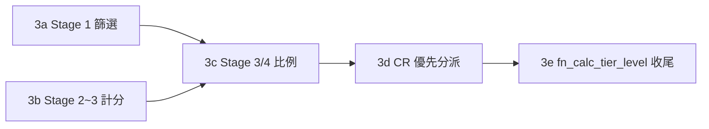

# AD-E07-42：MSSQL 全面遷移 P3（Raw SQL 引擎移植）架構設計

## Agent Loading Guide

| Agent 角色 | 需載入章節 |
|-----------|-----------|
| Test Designer | §0（customer_core 缺口已解）、§4（EQ 等價測試策略）、§5（P3a~3e 子切片與 DoD）、§7（不變式） |
| TDD Developer | §1（driver 組織方式）、§2（逐 Stage 方言轉換清單，含 §2.2 Stage 2 高風險區）、§3（fn_calc_tier_level 收尾） |
| DevOps / CI/CD | §5（P3 子切片 DoD） |
| Product Analyst | §6（風險與備註） |

---

## 0. 背景與前置狀態

延續 [AD-E07-38](AD-E07-38-mssql-p1-driver-entity-schema.md)（P1）、[AD-E07-39](AD-E07-39-mssql-p1b-full-baseline.md)（P1b）、[AD-E07-40](AD-E07-40-mssql-p2-self-built-queue.md)（P2 自建佇列）、[AD-E07-41](AD-E07-41-mssql-p4-etl-engine.md)（P4 ETL 引擎，含 customer_core 真實資料）。P4 已全數完成：9 個 ETL handler 全 MSSQL 化、customer_core 56 節點 pipeline 端對端跑通並發現+修復 FINDING-P4D-01、bulk-load 完成。

**customer_core 缺口已解除**：P3 設計階段原查出 Stage 2 計分 9/15 個對照欄位（`CUS_SEX`/`AGE`/`EDUCAT_BACK`/`CAREA_NO1`/`CAREA_NO2`/`CELLULAR`/三縣市欄）依賴 `customer_core`，而該表當時不在 MSSQL baseline 且無真實資料，曾是 P3 Stage 2 能否完整驗證的封鎖性缺口（詳見架構師先前之「customer_core-only 最小子集是否可行」逐 handler 盤點，結論不存在可控最小子集，工作量 27–46 人天，經使用者核准拉前為 P4 執行）。**此缺口現已由 P4 完全解除**：`customer_core` 已存在於 MSSQL baseline（P4-0）且經 56 節點 pipeline 端對端灌入真實資料（P4d）。**本輪 P3 之 Stage 2 EQ 測試不再受限於「僅能用測試自建 throwaway fixture」的過渡態，可直接對真實 `customer_core` 資料執行完整 JS↔MSSQL 逐列等價驗證**（見 §4）。

本 AD 涵蓋 P3 全部範圍：3a（Stage 1 篩選）、3b（Stage 2~3 計分）、3c（Stage 3/4 比例分派）、3d（CR 優先分派）、3e（`fn_calc_tier_level` 收尾）。

---

## 1. 整體策略：Driver 組織方式

### 1.1 沿用 P4 已確立之組織原則（RESOLVED，不再重新論證）

P4（AD-E07-41 §1.2）已確立「PG 檔不動、平行 `*-mssql.ts` 新檔、組裝點薄分支」的組織模式，並在 9 個 ETL handler 上驗證可行。P3 完全沿用同一原則，延伸至 Stage 1-4 raw SQL builder/executor 層：

- **每個 PG builder/executor 檔對應一個平行的 `*-mssql.ts` 新檔**：
  - `stage1-sql-builder.ts` → `stage1-sql-builder-mssql.ts`
  - `stage1-customer-core-clause.ts` → `stage1-customer-core-clause-mssql.ts`
  - `stage2to4-sql-builder.ts` → `stage2to4-sql-builder-mssql.ts`
  - `stage3to4-ration-sql.ts` → `stage3to4-ration-sql-mssql.ts`
  - `cr-priority-sql.ts` → `cr-priority-sql-mssql.ts`
- **PG 檔（現行 5 個核心檔案）完全不動**，cutover 前零風險——這些檔案目前是唯一在跑生產流量的實作。
- **Executor 層（`stage1-sql-executor.ts`／`stage2to4-sql-executor.ts`）薄分支**：這兩個檔案本身就是「組裝外殼」（`INSERT…SELECT`/`UPDATE…FROM` 骨架 + 呼叫 `escapeQueryWithParameters`），且**現行程式碼已預留分支點**（既有註解「本路徑一律 PG（呼叫端以 `DB_TYPE='postgres'` gate...)」），只需在呼叫端（`AssignmentRunPipelineService`／`Stage0EstimateService` 等現有 `DB_TYPE` gate 所在處）新增 `DB_TYPE==='mssql'` 分支呼叫對應之 `-mssql` 版本 builder，經同一組 `-mssql` 版 executor 外殼組裝，**不需要重新設計 executor 層架構**。
- **純 TypeScript 資料結構/業務判定邏輯不重複**：`stage2to4-sql-builder.ts` 內 `cardDefault()`/`CARD_DEFAULTS`/`resolveColumnSource()` 之 `kind`/per-card default 判定等**純 TS 邏輯**（無 SQL 字面值本身）不需要為 MSSQL 另寫一份——僅在「輸出 SQL 表達式字串」的分支上產生方言差異，可考慮讓 `-mssql.ts` 版本重用同一組 `cardDefault`/`CARD_DEFAULTS` 常數（import 自 PG 檔案），只有 `resolveColumnSource()` 這類回傳 SQL 片段字串的函式需要平行 MSSQL 版本。tdd-implementation 可視實作便利性決定是否進一步拆分「純資料表」與「SQL 產生邏輯」為獨立子模組供兩版共用，架構層級不強制。
- `special-rules.ts`（`matchesSpecialRule`，純 JS 字串比對，與 SQL 方言無關）**不動，兩路徑共用**。

---

## 2. 逐 Stage 方言轉換清單

以下沿用 P4（AD-E07-41）已在真實 MSSQL 環境驗證確立的方言基礎，不重新論證：`TRY_CAST` 防禦性轉型、`~` 正則運算子 → `NOT LIKE '%[^0-9]%'`（+ 空字串以 `LEN(x)>0` 或等價守門，因空字串於 `NOT LIKE '%[^0-9]%'` 求值為 TRUE 之陷阱已於 P4a `type-cast-handler-mssql.ts` 查證並修正）、`INFORMATION_SCHEMA`（大寫）於 BIN collation 下之大小寫要求（I-MSSQL-CATALOG-CASE-01）、`DECIMAL` 型別正規化原則（I-MSSQL-DECIMAL-NORMALIZE-01，FINDING-P4D-01 教訓：任何「validate-then-emit」的數值轉型皆優先採用「TRY_CAST 驗證關卡 + 正規化輸出」模式，不直接輸出固定 scale 定值）。

### 2.1　Stage 1（3a）—— `stage1-sql-builder.ts` + `stage1-customer-core-clause.ts`

| 站點 | 現行 PG | MSSQL 轉換 | 風險 |
|---|---|---|---|
| `AGE(:ccWorkdt::date, cc.date_of_birth)` + `EXTRACT(YEAR FROM ...)`（customer_core AGE 條件） | `stage1-customer-core-clause.ts:141` | `DATEDIFF(YEAR,@ccWorkdt,cc.date_of_birth) - CASE WHEN (MONTH(cc.date_of_birth)>MONTH(@ccWorkdt)) OR (MONTH(cc.date_of_birth)=MONTH(@ccWorkdt) AND DAY(cc.date_of_birth)>DAY(@ccWorkdt)) THEN 1 ELSE 0 END` | 中-高（NULL 傳播需保留：`cc.date_of_birth IS NULL`→整式 NULL→`BETWEEN` 求值 NULL→天然排除，語意須逐一驗證） |
| `LEFT(cc.cpost_city, 3)` | `stage1-customer-core-clause.ts:118` | **不變**——MSSQL `LEFT()` 原生支援 | 低 |
| `SUBSTRING(o.year_produ FROM '^[0-9]+')`（year-above 特例） | `stage1-sql-builder.ts:225` | `PATINDEX`/`LIKE` 字元類別（前導數字擷取，比照 P4a 已驗證之 `~ '^[0-9]+$'`→`NOT LIKE '%[^0-9]%'` 手法延伸） | 中 |
| `NOT EXISTS (SELECT 1 FROM ob_pool_data_list pdl WHERE ...)`（去重 anti-join） | `stage1-sql-builder.ts:166` | **不變**——ANSI `NOT EXISTS` | 低 |
| `LIKE '%白牌%'` / `LIKE '%借新還舊%'` 等字面比對 | 多處 | **不變**——BIN collation 已確認保留現行 byte-exact 語意 | 低 |
| `CAST(o.payt_term AS numeric)` 等既有 ANSI CAST | `stage1-sql-builder.ts:182` | **不變**——已是 ANSI 形式 | 低 |
| `:param`/`:...arr` 具名參數展開 | 全檔 | 沿用 P1~P4 已多次驗證之 `escapeQueryWithParameters` 機制，MSSQL driver 對 `:param`→`@param`/`:...arr`→多個 `@arrN` 之展開已於 P1c/P2/P4 反覆驗證成立 | 低（已非未知風險） |
| `buildStage1WhereConditions`（`stage1-query-composer.ts`）欄位篩選片段 | Path A/B | 主要為 `IN (:...arr)`/`BETWEEN`，ANSI 相容，**P3a 第一步先核實無 PG-only 語法後，可能不需要 mssql 專版**（省一個檔案） | 低（待核實） |

**customer_core JOIN 本身**（`LEFT JOIN customer_core cc ON cc.source_customer_no = o.custo_no`）：SQL 語法無方言問題，**表已存在於 MSSQL baseline 且有真實資料（P4 完成）**，不再有 §0 所述之過渡態限制。

### 2.2　Stage 2~3 計分（3b）—— `stage2to4-sql-builder.ts` + `stage2to4-sql-executor.ts`（**本 AD 風險最高單一區塊，維持前次盤點判斷**）

| 站點 | 現行 PG | MSSQL 轉換 | 風險 |
|---|---|---|---|
| `SAFE_INT_CUS_SEX`：`cc.cus_sex ~ '^[0-9]+$'` | `stage2to4-sql-builder.ts:116` | `cc.cus_sex NOT LIKE '%[^0-9]%'`（P4a 已驗證之字元類別 wildcard 手法）+ `TRY_CAST(cc.cus_sex AS INT)` | **高**——計分正確性核心（BR-F104-13 NULL-safe cast 紅線） |
| `IS_PERSONAL_GATING`：同一 `~ '^[0-9]+$'` pattern 內嵌 2 次 | `stage2to4-sql-builder.ts:124-126` | 同上手法，套用 2 次（五欄分流 gating，CAREA_NO1/NO2/CELLULAR/AGE/EDUCAT_BACK 皆依賴此判定） | **高**——五個計分維度共用此 gating，任何轉換誤差連帶波及全部五欄 |
| EDUCAT_BACK 數值化：`(${valStr}) ~ '^[0-9]+$'` | `stage2to4-sql-builder.ts:236` | 同上手法 | 高 |
| `age(cc.date_of_birth)` + `EXTRACT(YEAR FROM...)`（AGE 欄位計分，非 Stage1 篩選，**與 §2.1 是兩個獨立站點**） | `stage2to4-sql-builder.ts:219-221` | 同 §2.1 AGE 轉換公式，**須各自轉換與各自驗證，不可假設改一處兩處都對** | 高 |
| `EXTRACT(YEAR FROM CURRENT_DATE)`（CAR_YEAR） | `stage2to4-sql-builder.ts:207` | `YEAR(SYSDATETIME())` 或 `DATEPART(YEAR, SYSDATETIME())` | 低 |
| `SUBSTRING(o.year_produ FROM '^[0-9]+')`（CAR_YEAR，與 Stage1 同 pattern 但獨立站點） | `stage2to4-sql-builder.ts:206-207` | 同 §2.1 PATINDEX 轉換 | 中 |
| `TRIM(CAST(${src.codeExpr} AS text))` / `TRIM(CAST(${src.keywordExpr} AS text))`（PROJECT_TP composite，F105） | `stage2to4-sql-builder.ts:414-415` | `TRIM(CAST(... AS NVARCHAR(4000)))`——`TRIM()` MSSQL 2017+ 原生支援；此站點在**每個 PROJECT_TP score row** 迴圈內動態展開，須確保轉換不遺漏任何一次展開 | 中 |
| 🔴 **`to_jsonb(o)->>'${columnName.toLowerCase()}'`**（通用 fallback，未 hardcode 欄位走此路，**live production path，非死碼**） | `stage2to4-sql-builder.ts:290` | **非純語法替換，需架構調整（I-MSSQL-DYNAMIC-FALLBACK-01）**：MSSQL 無單一 SQL 表達式可做「動態欄名讀取、欄位不存在則優雅回 NULL」。改為 **SQL 生成前的 TypeScript 端 schema 檢查**：SQL builder 呼叫前先查 `INFORMATION_SCHEMA.COLUMNS`（大寫，I-MSSQL-CATALOG-CASE-01；一次性查詢、非逐列）取得 `ob_pool_data` 實際欄位集合，若 `columnName.toLowerCase()` 存在→產生直接欄位參照 `TRY_CAST(o.[colname] AS NUMERIC)`；不存在（幽靈欄位）→直接產生字面值 `0`（**SQL 生成時就解掉，不留到執行期**，語意仍等價 BR-F103-08「靜默 +0、不阻擋月名單分派」，且效能更好——不需要每列 JSON 序列化，此點與 P4 FINDING-P4D-01 教訓一致：優先在建構期解決,而非依賴執行期的動態機制模擬 PG 特性） | **高**——本 stage 中唯一「非純語法轉換而是設計調整」的站點，且是通用 fallback（覆蓋任何未來新增之計分卡欄位），轉換錯誤影響面不可預期 |
| `CROSS JOIN LATERAL (SELECT ... AS score) sub`（`stage2to4-sql-executor.ts`） | 既有盤點記錄 | `CROSS APPLY (...)` | 中低 |
| `ti.card_level IS NOT DISTINCT FROM lv.card_level`（NULL-aware tier join） | 既有盤點記錄 | `(ti.card_level = lv.card_level OR (ti.card_level IS NULL AND lv.card_level IS NULL))` | 中（F100 OQ-T2 拍板項，需高覆蓋率測試） |
| `UPDATE r SET ... FROM ob_pool_data o ...`（PG UPDATE-FROM） | 既有盤點記錄 | T-SQL `UPDATE alias SET ... FROM ob_monthly_run_result alias JOIN ... ON ...`（target 併入 FROM 子句，比照 P4 §5.1 已建立之轉換模式） | 中 |

**customer_core 9 個依賴維度現況（v.s. §0）**：`CUS_SEX`/`AGE`/`EDUCAT_BACK`/`CAREA_NO1`/`CAREA_NO2`/`CELLULAR`/`HPOST_NUM_NM`/`CPOST_NUM_NM`/`CO_NUM_NM` 全數可對真實 `customer_core` 資料驗證（P4 完成），**不再是本 AD 的範圍缺口**，僅為 SQL 方言轉換工作（如上表）。

### 2.3　Stage 3/4 比例分派（3c）—— `stage3to4-ration-sql.ts`

| 站點 | 現行 PG | MSSQL 轉換 | 風險 |
|---|---|---|---|
| `WITH dept_pct(obdeptid,ration,dept_seq) AS (VALUES (...),(...))`（3 處：dept_pct/empl_set/cal） | 全檔 | `WITH x(cols) AS (SELECT * FROM (VALUES (...),(...)) AS v(cols))` derived table 包裝 | 中（機械式但 3 處都要改） |
| `ROW_NUMBER() OVER (...)`、`SUM(...) OVER (...ROWS BETWEEN UNBOUNDED PRECEDING AND 1 PRECEDING)` | 全檔多處 | **不變**——SQL Server 2012+ 原生支援含 frame clause（P4 dedup tie-breaker 已多次驗證此類視窗函式語法 1:1 可攜） | **低**——本 stage 複雜度主要來自業務邏輯而非方言差異 |
| `UPDATE ob_monthly_run_result r SET ... FROM assigned a WHERE ...`（3 道：dept/empl/assignday） | 全檔 | 同 §2.2 UPDATE-FROM 重構 | 中 |
| `FLOOR(...)`、`COUNT(*)::int` | 全檔 | `FLOOR` 不變；`::int` → `CAST(...AS INT)` | 低 |
| `LIMIT 1`（存在性檢查，`hasEmplRows`） | `runAssignDaySql` | `SELECT TOP(1) 1 FROM ...` | 低 |

### 2.4　CR 優先分派（3d）—— `cr-priority-sql.ts`

| 站點 | 現行 PG | MSSQL 轉換 | 風險 |
|---|---|---|---|
| `appl_date < :twoYearsAgo::date`、`resign_date < :sysDate::date` | 全檔 | `CAST(:twoYearsAgo AS DATE)`／`CAST(:sysDate AS DATE)` | 低 |
| `UPDATE ob_monthly_run_result r SET ... FROM ob_emphire e WHERE ...`（步驟 2 離職清空） | 全檔 | 同 UPDATE-FROM 重構 | 中 |
| `WITH empl_set_ranked AS (... ROW_NUMBER() OVER (PARTITION BY emplid ORDER BY deptid_m ASC) ...) UPDATE ... FROM first_dept fd`（步驟 3） | 全檔 | 視窗函式不變 + UPDATE-FROM 重構（雙重轉換疊加） | 中-高（唯一同時疊加視窗函式+UPDATE-FROM+CTE 三種轉換的單一陳述式，建議此站點安排最高覆蓋率測試） |

### 2.5　`fn_calc_tier_level` 收尾（3e）

**非轉換，是清理收尾**（Spike 1 已判死碼，P1b2 已實測斷言 MSSQL baseline 不建立此函式——`mssql-p1b2.mssql.spec.ts` 之 `OBJECT_ID('dbo.fn_calc_tier_level')` 斷言 NULL 已通過）：
- 剩餘工作：`apps/api/src/database/functions/fn_calc_tier_level.sql`（原始檔）刪除或標記淘汰；`fn-calc-tier-level.spec.ts`（既有直測該函式的 PG 測試）妥善處理（刪除或標記 PG-only、待 Phase 6 cutover 隨整批 PG 測試移除）；PG `1711360000000-BaselineSchema.ts` 內 `CREATE FUNCTION` 陳述式**不動**（PG 路徑在 cutover 前零風險原則，即使函式是死碼）。
- 此為 P3 範圍中工作量最小、風險最低的子切片。

---

## 3. `fn_calc_tier_level` 死碼確認（承接 §2.5，獨立小節供快速查閱）

**狀態：已確認死碼，非本輪需重新調查項**。依 Spike 1（P1 期間）判定＋P1b2 端對端斷言驗證（`OBJECT_ID` 回 NULL）雙重確認。P3e 僅需處理原始檔/測試檔的收尾清理，不涉及任何業務邏輯風險。

---

## 4. 🔴 EQ 等價測試策略

### 4.1 核心轉變（延續 F099-F105 既有模式，比較基準由 PG 換為 MSSQL）

現行：**JS oracle ↔ PG pushdown** 逐列等價（F099-F105 全部沿用此模式，`.pg.spec.ts` 對真 Postgres 執行）。P3 後：**JS oracle ↔ MSSQL pushdown** 逐列等價，PG 路徑保留但不再是「目標」，只是 cutover 前既有安全網的延續（不需要對其重新驗證）。

### 4.2 每 Stage 測試設計

| Stage | 測試檔命名 | 是否需要 customer_core | 對真 MSSQL 容器可完整跑 |
|---|---|---|---|
| 3a Stage 1 | `stage1-sql-pushdown.mssql.spec.ts`、`stage1-customer-core-clause.mssql.spec.ts` | 是（AGE/城市/gender 條件測試） | ✅ **可對真實 customer_core 資料驗證（P4 完成，非 §0 過渡態）** |
| 3b Stage 2~3 | `stage2to4-sql-pushdown.mssql.spec.ts`、`stage2to4-score-source-f103/f104.mssql.spec.ts` | 是（9 個計分維度大量依賴） | ✅ **可對真實 customer_core 資料驗證**；`~` 正則轉換三站點、`to_jsonb` fallback 之 TS 端 schema 檢查改寫，建議高於一般站點的測試覆蓋密度（多組邊界值：空字串/NULL/純數字/含字母混合字串/前導零） |
| 3c Stage 3/4 | `stage3to4-ration-pushdown.mssql.spec.ts` | 否 | ✅ 可完整跑 |
| 3d CR | `cr-priority-pushdown.mssql.spec.ts` | 否 | ✅ 可完整跑 |
| 3e | `fn-calc-tier-level.spec.ts` 收尾 | 不適用 | 不適用（刪除/收斂項，非等價測試） |

**新增建議（因 customer_core 現有真實資料）**：3b 除既有 `.pg.spec.ts` 覆蓋範圍之逐列等價外，建議比照 P4d 之「56 節點端對端」精神，安排一次**對真實 customer_core 資料的 202606（或最新月）計分結果重跑**，與 PG 版本逐欄逐列比對（F067 式），作為 3b 子切片 DoD 的補充驗收——這是先前過渡態下無法做到、現在可以做到的更高信心驗證，應予以利用。

### 4.3 測試設計上的既有慣例延續

沿用現行「呼叫 SQL builder 產生字串 + 用 driver 的 `escapeQueryWithParameters` 轉換 + 對真資料庫執行 + 與 JS oracle 逐案件比對」既有模式（F099-F105 皆此模式）。§2.2 之 `~` 正則轉換與 `to_jsonb` fallback 兩類轉換**建議給予高於一般站點的測試覆蓋密度**，因為不是純語法替換而是需要重新驗證邊界語意（PG regex `^[0-9]+$` 與 MSSQL `NOT LIKE '%[^0-9]%'` 在**空字串**邊界上的差異，P4a 已於 `type-cast-handler-mssql.ts` 查證並修正——**3b 需比照同一手法**，不得重新踩一次已知的坑）。

---

## 5. P3a~3e 子切片與 DoD

### P3a — Stage 1 篩選

**範圍**：§2.1 全部站點；`stage1-sql-builder-mssql.ts`／`stage1-customer-core-clause-mssql.ts` 新檔；`stage1-sql-executor.ts` 加 driver 分支。

**DoD**：`.mssql.spec.ts` 對應現行 `stage1-sql-pushdown.pg.spec.ts`/`stage1-customer-core-clause.pg.spec.ts` 覆蓋範圍，對**真實 customer_core 資料**JS↔MSSQL 逐案件等價；`tsc --noEmit` 乾淨。

### P3b — Stage 2~3 計分（風險最高子切片，建議獨立排定較長時程）

**範圍**：§2.2 全部站點，**特別是 `~` 正則轉換三站點 + `to_jsonb` fallback 架構調整（I-MSSQL-DYNAMIC-FALLBACK-01）**；`stage2to4-sql-builder-mssql.ts`／`stage2to4-sql-executor.ts` 加分支。

**DoD**：
1. 對照現行 `stage2to4-sql-pushdown.pg.spec.ts`/`stage2to4-score-source-f103.pg.spec.ts`/`stage2to4-score-source-f104.pg.spec.ts` 全部案例，對**真實 customer_core 資料** JS↔MSSQL 逐列等價。
2. `~` 正則轉換的空字串/NULL/髒值邊界有專屬測試通過（比照 P4a `type-cast-handler-mssql.ts` 空字串陷阱教訓）。
3. `to_jsonb` fallback 改為 TypeScript 端 `INFORMATION_SCHEMA` 檢查後，幽靈欄位（`ob_pool_data` 無此欄）仍正確產生 `+0`（不報錯、不中斷月名單分派，BR-F103-08 語意保留）之測試通過。
4. 202606（或最新月）於 MSSQL 環境對真實 customer_core 資料重跑一次計分，與 PG 版本結果逐欄逐列比對（見 §4.2 新增建議），確認完全一致（因 customer_core 已非過渡態，此比對應為完全等價，非「已知系統性偏低」）。

### P3c — Stage 3/4 比例分派

**範圍**：§2.3 全部站點；`stage3to4-ration-sql-mssql.ts` 新檔。

**DoD**：對照 `stage3to4-ration-pushdown.pg.spec.ts` 全案例 JS↔MSSQL 逐列等價；VALUES-CTE 三處 derived table 改寫皆驗證。

### P3d — CR 優先分派

**範圍**：§2.4 全部站點；`cr-priority-sql-mssql.ts` 新檔。

**DoD**：對照 `cr-priority-pushdown.pg.spec.ts` 全案例 JS↔MSSQL 逐列等價；步驟 3（視窗函式+UPDATE-FROM+CTE 三重疊加站點）額外高覆蓋率測試。

### P3e — `fn_calc_tier_level` 收尾

**範圍**：§2.5/§3。

**DoD**：確認 MSSQL 上此函式不存在（P1b2 既有斷言持續通過，非本輪新驗證）；原始 `.sql` 檔按裁定刪除或標記淘汰；`fn-calc-tier-level.spec.ts` 妥善處理。

### 是否需要 spec-writer（RESOLVED：不需要）

理由與 P1/P2/P4 一致——P3 的不變式仍是「行為不變、僅置換底層 SQL 方言」：JS oracle 定義的業務規則（BR-F102/F103/F104/F105 等）**完全不變**，P3 只是讓同一組已核可的業務規則能在 MSSQL 上以等價 SQL 執行，沒有新業務規則、沒有新使用者可見行為。**唯一非純語法替換的項目**（§2.2 `to_jsonb` fallback 改為 TS 端 schema 檢查）業務語意結果（幽靈欄位→+0、不阻擋月名單分派）完全不變，仍屬架構師 HOW 層級決策。P3 比照 F099-F105 與 P1/P2/P4 既有模式，直接 system-architect → test-designer → tdd-implementation。

---

## 6. 風險與備註

### 6.1 §2.2 高風險區塊需優先排程

Stage 2 計分（3b）是全 P3 範圍中方言密度最高、業務影響最大的區塊（比照 P4 之 ETL lookup handler 高頻使用的經驗，計分正確性直接影響案件分派結果），建議 test-designer/tdd-implementation 排程時給予比其餘子切片更長的時間預算與更高的測試密度，比照 P4b（lookup，31 節點高頻 handler）當時「測試覆蓋率高於一般 handler」的處理原則。

### 6.2 `to_jsonb` fallback 改寫需與 P4 FINDING-P4D-01 教訓對齊

§2.2 之 TS 端 schema 檢查設計（I-MSSQL-DYNAMIC-FALLBACK-01）延續 P4 的核心教訓：**任何試圖在 SQL 執行期動態模擬 PG 特有機制（JSONB 動態存取、DECIMAL 無界精度）的做法，優先改為在 SQL 生成期（TypeScript 端）解決**，而非尋找 SQL 執行期的「等價魔法」。此為跨 P3/P4 一致的架構原則，非本 AD 獨創。

### 6.3 customer_core 缺口解除對本 AD 的簡化效果

因 customer_core 已於 P4 完整就緒，本 AD 相較於架構師先前設計階段的草案，**移除了「是否接受 customer_core 空表過渡態」的使用者裁示需求**——3b 的 EQ 測試可直接達到與 F067 式「完全對齊」同等信心水準，不再有「已知系統性偏低、待 Phase 4 補完」的但書。這是 P4 提前執行帶來的直接效益。

---

## 7. 不變式（沿用與新增）

| ID | 來源 | 說明 |
|---|---|---|
| **I-MSSQL-CASE-01** | AD-E07-38 | 使用者物件一律小寫 |
| **I-MSSQL-COLLATE-01** | AD-E07-38 | Collation 於資料庫層級設定 |
| **I-MSSQL-BASELINE-PARITY-01** | AD-E07-38 | Dev/prod 建表路徑結構等價 |
| **I-MSSQL-PARAM-01** | AD-E07-38 | 具名參數慣例 |
| **I-MSSQL-CATALOG-CASE-01** | AD-E07-41 | `INFORMATION_SCHEMA` 系統目錄視圖於 BIN collation 下須大寫，P3 之 §2.2 TS 端 schema 檢查直接適用 |
| **I-MSSQL-DECIMAL-NORMALIZE-01** | AD-E07-41 | 型別正規化原則（TRY_CAST 驗證關卡+正規化輸出，不直接輸出固定 scale 定值），P3 若有類似數值轉型情境比照適用 |
| **I-MSSQL-ENGINE-EQ-01**（新增） | 本 AD | 每個 Stage 1-4／CR raw SQL 下推函式的 mssql 版本，必須有對應 `.mssql.spec.ts` 與 JS oracle 逐列/逐案件等價測試，比照現行 F099-F105 `.pg.spec.ts` 覆蓋範圍；不得只憑語法轉換表核對即宣稱完成 |
| **I-MSSQL-REGEX-CHARCLASS-01**（新增） | 本 AD | 全庫 PG 正則運算子（`~`/`SUBSTRING...FROM`）僅使用簡單字元類別 pattern（如 `^[0-9]+$`），一律以 MSSQL `LIKE`/`PATINDEX` 字元類別 wildcard（`[0-9]`/`[^0-9]`）達成，不引入 CLR 或第三方正則函式；轉換時必須額外核對空字串邊界語意（PG `+` 量詞要求至少一字元 vs MSSQL `NOT LIKE` 對空字串為 vacuously true 的差異，P4a 已示範正確處理手法） |
| **I-MSSQL-DYNAMIC-FALLBACK-01**（新增） | 本 AD | 任何「動態欄位讀取、欄位不存在則優雅降級」的邏輯（如 Stage 2 通用 fallback），MSSQL 版本一律在 SQL 生成前（TypeScript 端）以 schema 內省（`INFORMATION_SCHEMA.COLUMNS`，大寫，I-MSSQL-CATALOG-CASE-01）完成欄位存在性判斷，不得在 SQL 執行期依賴動態 JSON 存取模擬「安全欄位讀取」；生成後的 SQL 對每筆資料應為靜態直接欄位參照，不含逐列 JSON 序列化開銷 |
