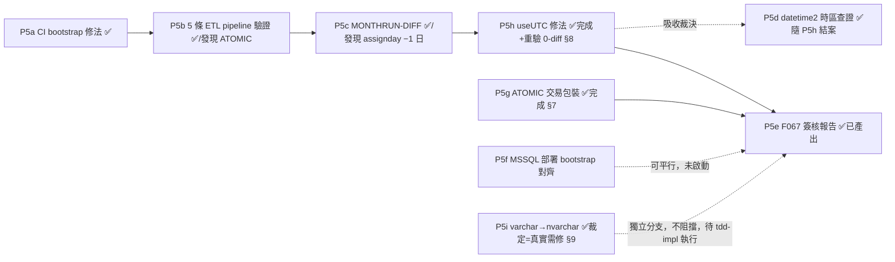

> **🔴 v1.1 修訂通知（2026-07-08）**：P5b 端對端驗證真庫實測發現 **ATOMIC 資料完整性風險**（潛在封鎖級，兩引擎共通、非本次遷移引入之既有架構缺口）——`target-load-handler`（PG／MSSQL 皆然）之 fullMode/partition_replace 路徑，TRUNCATE/DELETE 先提交、後續單句 INSERT 若因髒資料失敗則不回滾，導致目標表/分區既存生產資料被清空且未重建。新增 **§7** 完整記錄發現、修法評估、範圍歸屬裁定；新增不變式 I-ETL-ATOMIC-LOAD-01；§4 需使用者裁示事項新增第 3 項。
>
> **🔴🔴 v1.2 修訂通知（2026-07-08）**：P5c 真實 PG vs MSSQL 逐列比對揭露 **assignday 全部 −1 日之跨引擎 cutover-blocker**（其餘 9 個關鍵欄位含 CR/比例分派全鏈皆 0-diff）。已定位到**逐行原始碼級根因**：TypeORM `SqlServerDriver` 建立 MSSQL 連線池時，若應用程式未顯式設定 `options.useUTC`，會**強制覆寫為 `false`**，蓋過 tedious 函式庫本身 `true` 的內建預設值，導致 `date`/`datetime`/`datetime2`/`smalldatetime`/`time` 欄位讀寫改用本地時區分量而非 UTC 分量。新增 **§8** 完整記錄根因鏈、程式碼證據、修法評估、範圍歸屬（新增 P5h／P5i 子切片）；新增不變式 I-MSSQL-DATE-TZ-01；§1 子切片總覽、§4 裁示事項、§5 DoD、§6 不變式表同步更新。
>
> **✅ v1.3 修訂通知（2026-07-08）**：**P5h（useUTC 修法）與 P5g（ATOMIC 交易包裝）皆已實作完成並真庫重驗通過**——assignday 於 198+9,376 案樣本達 0-diff、全量 mssql 回歸 673 通過零邏輯回歸；ATOMIC 修法涵蓋 fullMode/partition_replace/customer_core UPSERT 三路徑（範圍較 v1.1 原不變式擴大，見 §7.6）、真庫探測證實 TRUNCATE 交易可回滾。**正式簽核報告已產出**：[`AD-E07-43-P5e-f067-signoff.md`](AD-E07-43-P5e-f067-signoff.md)。**P5i（varchar→nvarchar）裁定完成**：新增 §9，經比對真實 legacy MSSQL schema（`reference/TableSchema/OB/*.sql`）確認為**真實生產風險（非 P5b/P5c 測試 harness 假象）**——legacy 明確宣告 `SPEC_NAME`/`CAR_NAME`/`BROKER`/`EMP_NM`/`DEPT_NAME` 等欄位為 `nvarchar`，CDMP 之 schema 產生器 `parse-ob-schema.mjs::mapType()` 設計上（為當初純 PG 目標而設計，PG 無 nvarchar/varchar 之分）將 `nvarchar`/`varchar(N≤255)` 一律收斂為泛用 `varchar`，MSSQL 目標下遺失 Unicode 安全性；使用者已裁示「varchar 自主做」，交 tdd-implementation 依 §9 方法論修正，不需另行業務裁示。§1/§4/§5/§6 同步更新反映 P5h/P5g/P5e/P5i 完成狀態。

# AD-E07-43：MSSQL 全面遷移 P5（全量 CI + F067 式業務簽核）計畫

## Agent Loading Guide

| Agent 角色 | 需載入章節 |
|-----------|-----------|
| Test Designer | §2（P5a/b 技術驗證定義）、§3（MONTHRUN-DIFF/F067 執行方式）、§6（不變式） |
| TDD Developer | §2（P5a CI bootstrap 修法、P5b 其餘 5 條 pipeline 驗證、P5f 部署 bootstrap）、**§7（ATOMIC 修法，✅ 已完成）**、**§9（P5i varchar→nvarchar，待執行）** |
| DevOps / CI/CD | §2（CI 修法細節）、§5（子切片 DoD） |
| Product Analyst | §4（需使用者/業務裁示事項，彙整版）、§3（F067 簽核，✅ 已產出正式報告）、**§7（ATOMIC 風險，✅ 已修復）**、**§8（assignday −1 日，✅ 已修復）**、**§9（varchar/nvarchar，裁定完成）** |

---

## 0. 背景與前置狀態

P1（driver/entity/schema）、P2（自建 T-SQL 佇列）、P4（ETL 引擎，含 customer_core 真實資料）、P3（Stage 1-4 raw SQL 引擎，3a 篩選/3b 計分/3c 比例/3d CR/3e `fn_calc_tier_level` 收尾）全數完成並已 push。**MSSQL 月名單分派全鏈（Stage 1 篩選→Stage 2~3 計分→Stage 3/4 比例→CR）現已全部有值**——這是本專案 MSSQL 遷移計畫的技術主體完工里程碑。

P5 是 cutover（Phase 6）前的最後一道關卡：**不是新業務邏輯開發，而是「證明 MSSQL 版本忠實重現 PG 版本」的全量驗證 + 業務簽核**。定位比照本專案既有之 F067（`docs/specs/implementation-log/F067-202606-cdmp-vs-legacy-diff.md`）模式，但**基準改為「MSSQL 重現 PG 結果」而非「重驗 legacy SP」**——legacy 對齊已在 PG 版本完成（F067 既有工作），P5 只需證明 MSSQL 與已驗證正確的 PG 版本逐列一致。

---

## 1. P5 範圍總覽與排序



| 子切片 | 一句話定位 | 狀態 |
|---|---|---|
| **P5a** | CI mssql-specs 缺 dbo baseline bootstrap，導致 P3a 等 52 個案例靜默 skip 而非真跑 | ✅ 已完成（見 P5a-impl.md） |
| **P5b** | customer_core 以外之其餘 5 條生產 pipeline，端到端 MSSQL 驗證 | ✅ 已完成，發現 ATOMIC 風險（見 P5b-impl.md） |
| **P5c** | 真實觸發一次完整月名單分派，PG vs MSSQL 逐列比對 score/tier/card/dept_id/emplid/assignday/cr | ✅ 已完成，發現 assignday −1 日（見 P5c-impl.md） |
| **P5d** | datetime2 本機時區儲存查證 | ✅ 隨 P5h 結案（根因已定位於連線層，非時區組態決策） |
| **P5e** | F067 式業務簽核報告產出 + 簽核 | ✅ 正式報告已產出（[`AD-E07-43-P5e-f067-signoff.md`](AD-E07-43-P5e-f067-signoff.md)），**待使用者簽核** |
| **P5f**（可選、優先度較低） | MSSQL 版一鍵部署 bootstrap | 未啟動（不阻擋） |
| **P5g** | ATOMIC 資料完整性修法（交易包裝，見 §7） | ✅ 已完成並真庫重驗（見 P5g-impl.md） |
| **P5h**（🔴 曾為 cutover-blocker） | 4 個 MSSQL TypeORM 連線站點補 `useUTC: true`，解決 assignday −1 日 | ✅ 已完成並真庫重驗 0-diff（見 P5h-impl.md，§8） |
| **P5i**（次要，非阻擋） | varchar byte 語意，評估是否改 `nvarchar` | ✅ 裁定完成＝**真實生產風險，需修**（§9），使用者已裁示自主執行 |

**CI 4 job 全綠**（原待辦第 3 項）不列為獨立子切片，而是**貫穿全 P5 的持續性 DoD**：P5a 完成後應立即達成，其餘子切片進行中須保持不破。

---

## 2. 技術子切片細節

### 2.1 P5a — CI mssql-specs Dbo Bootstrap 修法（🔴 優先度最高，成本最低，槓桿最大）

**問題確認（已查證，非推測）**：
- `.github/workflows/ci.yml` 之 `mssql-specs` job 僅執行 `docker/mssql-init.sql`（建立 `CDMP_TEST` 資料庫 + `cdmp` 登入），**未執行 `migration:run`**，故 CI 環境的 `dbo` schema 是空的（僅有容器初始化腳本建立的資料庫本身，無任何業務表）。
- P3a impl log 已明確記錄此後果：本機測試環境「CDMP_TEST dbo 平時只有 9 張表（customer_core 在，Stage 1 六表缺）」，CI 實測「P3a mssql：11 綠 / 52 skip（dbo 缺 P3a 六表既有 bootstrap 基線，非本輪回歸）」——**CI 目前對 P3a 的 52 個案例回報「綠」，但實際上是被 GATE-002 靜默跳過，並未真正執行**。這是一個會讓 CI 綠燈產生假信心的缺口。
- P3b~P3d 已各自在 `beforeAll` 自建所需表（複用 `_p3b-mssql-ddl.ts` 零 drift DDL），故不受此問題影響；**僅 P3a 依賴外部預先存在的 baseline**。

**裁定：CI 層提供 dbo bootstrap step（非讓 P3a 回頭改自建）**。

理由：
1. **一次修復、全面受益**：在 CI `mssql-specs` job 的 `mssql-init` 之後、跑測試之前，新增一個 `migration:run` 步驟（沿用 `apps/api/scripts/typeorm.cjs` launcher，比照本機開發流程），一次性建出完整 37 表 + customer_core + `queue_job` 的 MSSQL baseline，**同時**解除 P3a 的 skip 問題**並額外驗證了 migration 檔案本身可正確執行**（P3a 若改自建，只是複製既有 DDL 片段，不驗證 migration 檔案本身的正確性——這是 CI bootstrap 方案獨有的額外價值）。
2. **與 P3b~P3d 既有設計相容、不浪費工作**：P3b~P3d 的 harness 已經是「`OBJECT_ID` 探測→表存在則沿用、不存在才自建」的雙模式（`existedBeforeSuite` / `selfBuiltTables`），CI 提供 baseline 後，這些 spec 會自然直接沿用 CI 建好的表，不會重複自建、不會有任何相容性問題。
3. **成本遠低於「P3a 改自建」**：CI 修法只是在既有 job 裡加一個步驟；P3a 若改自建，需要新增/擴充一份 6 張表的零 drift DDL 定義（雖然 `_p3b-mssql-ddl.ts` 已有前例可依循，但仍是實質改動測試檔案本體，且需重新驗證 P3a 全部 73 個 case ID）。

**🔴 已識別之排序風險（需 P5a 一併解決，非事後才發現的新問題）**：P3a impl log 提及「本檔與 p1b2/p4 共用 dbo，須以單檔（或 `--no-file-parallelism`）執行，避免 p1b2 wipe dbo 造成干擾」——意即**存在某個 P1b2 測試會清空/重建 `dbo` schema**（用於驗證 dev synchronize vs prod baseline migration 的結構等價，即 AD-E07-39 I-MSSQL-BASELINE-PARITY-01 之驗收工具）。若 CI 在跑完 `migration:run` bootstrap 後，`--no-file-parallelism` 的執行序列中，這個 P1b2 「wipe dbo」測試恰好排在 P3a（或其他依賴 baseline 表持續存在的 spec）之前執行，會讓 P3a 重新落回「表不存在」的處境。

**P5a 具體工作項**：
1. CI `mssql-specs` job 新增 `migration:run` bootstrap 步驟（`mssql-init.sql` 之後、`vitest run` 之前）。
2. **調查該 P1b2 wipe-dbo 測試**（需 tdd-implementation 先讀該測試檔確認其具體行為），依情況擇一修法：
   - (a) 該測試若本來就會在自己的 `afterAll` 內重建/還原 baseline，則只需確認 CI 檔案執行序不會讓其他 spec 誤讀到「重建過程中途」的殘缺狀態；
   - (b) 若該測試會把 `dbo` wipe 後不還原（純粹為了驗證 synchronize 本身、驗證完即結束），則需讓它改在**獨立、隔離**的資料庫/schema 範圍操作（不動共用 `dbo`），或於自身 `afterAll` 補一道 `migration:run` 還原；
   - (c) 若上述皆不易，最後手段是透過檔名/glob 順序控制，確保 wipe-dbo 測試排在 vitest 執行序列最後——**此為最脆弱的方案，僅在 (a)(b) 皆不可行時採用**。
3. CI 修法後，重跑 `mssql-specs` job，確認 P3a 之 52 個原 skip 案例**轉為真正 PASS**（非 skip），且 P1b/P2/P4 既有 `.mssql.spec.ts` 全數不受影響。

**新不變式**（見 §6）：**I-MSSQL-CI-BOOTSTRAP-01**。

### 2.2 P5b — 其餘 5 條生產 ETL Pipeline 之 MSSQL 驗證

**背景確認**：P4 的完整端對端驗證（P4d）範圍**僅限「ETL for Customer Core」一條 pipeline**（P4d impl log 明載「不含...其他 5 條 pipeline」）。P4a~P4c 交付的是**通用的 9 個 handler MSSQL 化**（`extract`/`lookup`/`merge`/`dedup`/`derived_field`/`type_cast`/`field_mapping`/`conditional`/`target_load` 全部 handler 皆已 MSSQL 化，非 customer_core 專屬邏輯），故其餘 5 條生產 pipeline（`E07-OBPOOLDATA-Load`／`E07-OBPOOLDATA_LIST-Load`／`E07-OBEMPHIRE-Load`／`E07-OBCALENDAR-Load`／`E07-OBARRETURNDF_MIN_CAP-Load`）**理論上**可直接沿用同一批已 MSSQL 化的 handler 執行，但**尚未被端對端證明過**。

**這是 P5c（MONTHRUN-DIFF）的前置依賴**：P3 的 Stage 1-4 raw SQL 引擎讀取的 `ob_pool_data`／`ob_pool_data_list`／`ob_emphire`／`ob_calendar`／`ob_arreturndf_min_cap` 五張表，若無真實資料，月名單分派比對就無從進行。

**工作方式**：比照 P4d 之 `DISPATCHE2E-001`（直接呼叫真實生產碼 `createDispatcher()` 取得 dispatcher、以真實 `PipelineRunner.run()` 跑真實 DAG）手法，逐一觸發此 5 條 pipeline 於 `DB_TYPE=mssql`，驗收：① 全部節點 `status==='completed'`（無 `failed`）；② 目標表列數與來源列數合理對應（比照 P4d 之「交叉查實表列數，非僅信 `nodeLogs.outputRowCount`」原則，防 `isTestRun` 假路徑陷阱）；③ 抽樣核對代表性列之內容正確性。**非新增完整測試套件**（9 個 handler 本身已於 P4a~c 個別驗證過），此處僅是**端對端接線驗證**，工作量遠小於 P4 原本的量級。

### 2.3 P5f — MSSQL 部署 Bootstrap 對齊（可選、優先度較低）

比照現行 PG 版一鍵部署（`npm run bootstrap` = `migration:run && seed && seed-datasource && data-seed`，見專案既有部署文件），確認/建立 MSSQL 版對等流程：`migration:run`（MSSQL baseline，含 `queue_job`／`customer_core`）→ `seed`（帳號）→ `seed-datasource`（9 個 datasource 空殼）→ `data-seed`（計分卡/pipeline/擷取任務參考資料）。**此為機械式腳本工作**（沿用既有 PG 版腳本邏輯、替換底層 DB 呼叫），非阻擋性——可平行於 P5a~e 進行，但**必須在真正 cutover（Phase 6）前完成**，否則 MSSQL 環境無法從零建置。

---

## 3. MONTHRUN-DIFF 與 F067 式業務簽核執行方式

### 3.1 MONTHRUN-DIFF（P5c）：技術底稿，Manual/Script 執行

**不是新的自動化 CI 測試套件**，而是比照本專案既有的 F101/F102/F104 驗收前例（觸發真實月名單分派、SQL 直接查表比對、輸出人工可讀的差異記錄）：

1. 前置：P5a（CI/dbo baseline）+ P5b（其餘 5 條 pipeline 資料就緒）完成，MSSQL 端 `ob_pool_data`/`ob_pool_data_list`/`ob_emphire`/`ob_calendar`/`ob_arreturndf_min_cap`/`customer_core` 六張核心來源表皆有真實資料。
2. 於**同一批來源資料**（理想上是同一個 `project_workym`，如既有基準月 202606）分別觸發 PG 版與 MSSQL 版完整月名單分派 pipeline（Stage 1 篩選 → Stage 2~3 計分 → Stage 3/4 比例分派 → CR 優先分派）。
3. 逐列比對兩次 run 之 `ob_monthly_run_result`：`score`／`tier_level`／`card_level`／`dept_id`／`emplid`／`emplid_deptid`／`assignday`／`cr_id`／`cr_nm`／`is_cr`。
4. 輸出比對結果為一份 impl-log 風格文件（比照 P4d／F067 之表格化呈現：逐欄一致率、任何差異列之具體案件與差異值、已知邊界案例〔如 P3d 的 tie-breaker／datetime2 案例〕之個別核對結果）。

**此文件即是 F067 式簽核報告的技術附件（非報告本體）。**

### 3.2 F067 式業務簽核（P5e）

**基準修正（承 §0）**：F067 原本的基準是「CDMP vs legacy SP」；**P5e 的基準是「MSSQL vs PG」**——因為 legacy 對齊已在 PG 版本的既有 F067 完成且業務已簽核過，P3/P4 的全部設計目標就是「MSSQL 忠實重現 PG」，故此處不需要（也不應該）重新去比對 legacy，只需要證明「MSSQL 版本的月名單分派結果與已核可的 PG 版本結果一致」。

**報告內容建議結構**（比照既有 F067 格式延伸）：
1. 執行摘要：MSSQL 全鏈技術驗收已完成（P1-P4）、本報告為 cutover 前最終業務對齊確認。
2. MONTHRUN-DIFF 結果摘要（§3.1 產出）：逐欄一致率、已知可解釋的低機率邊界差異（tie-breaker、datetime2 非午夜時間分量，若有實際觸發）。
3. P5d 之 datetime2 時區查證結果與裁示（見 §4）。
4. 待簽核事項清單 + 簽核欄位。

**產出方**：architect 起草報告（整合 P5c 技術結果 + P5d 業務裁示），**簽核方**：使用者/業務利害關係人（比照本專案歷次 F067/F101/F102/F104 之既有簽核慣例）。

---

## 4. 需使用者/業務裁示事項（彙整，供你帶回使用者）

| # | 事項 | 狀態（v1.3） | 原裁示理由 |
|---|---|---|---|
| 1 | **datetime2 時區查證（P5d）** | ✅ **已結案**：P5h 修法（連線層 `useUTC:true`）已於 198+9,376 案樣本重驗達 0-diff，datetime2 wall-clock round-trip 亦確認忠實（P5h-impl §3.4）。不再需要業務查驗或另立時區組態 | （歷史）需查詢 production 資料庫內容+裁決時區組態 |
| 2 | **F067 式業務簽核（P5e）** | ✅ **報告已產出**（[`AD-E07-43-P5e-f067-signoff.md`](AD-E07-43-P5e-f067-signoff.md)），**待使用者正式簽署**（唯一仍待人工動作之項目） | 比照 F101/F102/F104 慣例，由業務簽核而非 architect 自行認定 |
| 3 | **🔴🔴 ATOMIC 資料完整性風險修法（見 §7）** | ✅ **已修復並真庫重驗**（P5g，含範圍擴張至 customer_core UPSERT，見 §7.6）。**殘餘待業務知悉**：MSSQL 標準 Read Committed 下並行查詢於載入期間會被阻塞（非讀空表），7.8M 生產規模阻塞時間未實測（見 §7.7） | 現行 PG 生產系統今天就存在的行為改變提案，屬業務風險接受度判斷 |
| 4 | **🔴🔴 assignday −1 日 / useUTC 連線層修法（見 §8）** | ✅ **已修復並真庫重驗**（P5h，198+9,376 案樣本 0-diff、全量回歸 673 通過零邏輯回歸） | cutover-blocker，影響 MSSQL 部署下全系統日期正確性 |
| 5 | **varchar byte 語意 / nvarchar schema 評估（見 §9，P5i）** | ✅ **裁定完成**：經比對真實 legacy MSSQL schema 確認為**真實生產風險**（非測試 harness 假象），根因＝`parse-ob-schema.mjs` 生成器設計性收斂 nvarchar→varchar。使用者已裁示「自主做」，不需另行業務裁示，交 tdd-implementation 依 §9 方法論執行 | （已解除）原屬 schema 設計決策，現使用者已授權 architect 自主裁定 |

**架構師判斷：P5a/P5b/P5f 為純技術執行，P5g/P5h/P5i 已由使用者裁示/授權完成裁定與修復。唯一仍待人工動作者為 #2（F067 報告之正式簽署）。**

---

## 5. 子切片 DoD

### P5a DoD
1. CI `mssql-specs` job 新增 `migration:run` 步驟，成功建出完整 MSSQL baseline（37 表 + `queue_job` + `customer_core`）。
2. 已識別之 P1b2 wipe-dbo 測試風險經調查後採取對應修法（§2.1 三選項之一），並附驗證：CI 全套 `*.mssql.spec.ts` 依序執行不因此測試而使後續 spec 的 baseline 表消失。
3. 重跑 CI，`stage1-sql-pushdown.mssql.spec.ts` 之 52 個原 skip 案例轉為 PASS（非 skip）。
4. P1/P2/P4 既有 `.mssql.spec.ts` 套件全數不受影響（零回歸）。

### P5b DoD
1. 5 條 pipeline 於 `DB_TYPE=mssql` 觸發，全部節點 `status==='completed'`。
2. 目標表（`ob_pool_data`/`ob_pool_data_list`/`ob_emphire`/`ob_calendar`/`ob_arreturndf_min_cap`）以直接 `SELECT COUNT(*)` 交叉驗證列數合理（非僅信 `nodeLogs`）。
3. 抽樣列內容正確性核對（比照 P4d LOOKUPHIT/CHARSET 精神，非窮舉）。

### P5c DoD
1. PG 與 MSSQL 於同一來源資料完整月名單分派各執行一次。
2. `ob_monthly_run_result` 全部案件之 9 個關鍵欄位（score/tier/card/dept_id/emplid/emplid_deptid/assignday/cr_id/is_cr）逐列比對完成。
3. 產出比對結果文件（impl-log 風格），任何差異皆有具體案件級記錄與可解釋性判斷。

### P5d DoD（✅ 完成，隨 P5h 結案）
1. ✅ production `appl_date` 樣本之時間分量查證結果記錄（P5c：115,197/115,197 案 100% 非午夜）。
2. ✅ 根因定位為連線層設定缺陷（P5h），非需業務裁決之時區組態選擇；不再需要業務另行裁示。

### P5e DoD
1. ✅ F067 式簽核報告正式產出：[`AD-E07-43-P5e-f067-signoff.md`](AD-E07-43-P5e-f067-signoff.md)。
2. ⏳ **業務簽核尚待進行**（報告已就緒，簽核為唯一剩餘人工動作，非技術阻擋項）。

### P5f DoD（可選，未啟動）
1. MSSQL 版 `npm run bootstrap` 等價流程可對全新 MSSQL 資料庫成功建置（含業務資料表空、參考資料齊全）。

### P5g DoD（✅ 完成，見 §7）
1. ✅ `target-load-handler.ts`（PG）／`target-load-handler-mssql.ts`（MSSQL）之 fullMode／partition_replace／customer_core UPSERT 三路徑加交易保護。
2. ✅ 真庫探測確認 MSSQL `TRUNCATE` 交易內可回滾；P5b 原「資料遺失」斷言（ATOMIC-001~004）翻轉為「資料保留」並重驗通過。
3. ✅ 6 條 target_load pipeline 全數覆蓋（`etl-pipelines.json` 靜態核對無遺漏）；`tsc` 乾淨；全量 ETL MSSQL 套件零回歸。
4. ⚠️ 殘餘 follow-up（非阻擋，見 §7.7）：7.8M 生產規模之交易日誌/鎖阻塞未實測，建議 cutover 前量測。

### P5h DoD（✅ 完成，曾為 🔴 cutover-blocker，見 §8）
1. ✅ 4 個 MSSQL TypeORM 連線站點（`app.module.ts` / `worker-app.module.ts` / `database/data-source.ts` / `database/seeds/seed-connection.ts`）之 `options` 區塊皆顯式加入 `useUTC: true`。
2. ✅ 全量 `*.mssql.spec.ts`（P1/P2/P3/P4/P5b 既有套件）重跑，673 通過、零邏輯回歸（2 個 hook 逾時經隔離重跑證實為環境性、非邏輯回歸）。
3. ✅ §8.4 列出之 4 個受影響站點修法覆蓋分析完成（P5h-impl §5）：SQL 下推路徑不受影響、JS 路徑由連線層修法覆蓋。
4. ✅ 重跑 P5c MONTHRUN-DIFF（198 案 + 9,376 案樣本），`assignday` 由 0% 轉為 **100%（0-diff）**，達成 10/10 欄位一致（score 5 案為既知今日參考日效應）。**27,796 案大 CR 名單之 assignday 未於本輪重跑**（見 §8.9 誠實揭露）。
5. ✅ CR 兩年門檻邊界／datetime2 round-trip 補測完成，無隱藏偏移（SQL 端比較不受 useUTC 影響）。
6. ✅ `assignment-run-report.service.ts` 註解已更正；評估後**刻意不改 getter**（跨引擎無單一正解，見 §8.9），列為匯出層 follow-up。

### P5i DoD（✅ 裁定完成，見 §9）
1. ✅ 裁定「真實生產風險 vs 測試 harness 假象」：**確認為真實生產風險**（比對 legacy DDL 逐行核對，見 §9.3）。
2. ✅ 根因定位：`parse-ob-schema.mjs::mapType()`（第 77-87 行）設計性收斂 nvarchar→varchar；已直接驗證 `ob_pool_data`／`ob_pool_data_list`（~20+ 欄）／`ob_emphire`（4 欄）受影響。
3. ✅ 使用者已裁示「自主做」，不需業務裁示；已產出機械式修復方法論（§9.5，含 dialect-aware helper + 產生器修正 + 全量重掃）交 tdd-implementation 執行。
4. ⏳ 其餘 10 個同產生器 entity 之完整受影響欄位清單，待 tdd-implementation 依 §9.5 步驟 3（重跑產生器比對差異）產出，非本輪人工窮舉。

### 是否需要 spec-writer（RESOLVED：不需要）

理由與 P1~P4 一致——P5 全範圍皆為「證明既有已核可行為在 MSSQL 上忠實重現」的驗證工作，沒有任何新業務規則、新使用者可見行為。P5c/P5e 雖然涉及業務簽核，但簽核的對象是「既有行為的跨引擎一致性」，不是「新功能的驗收標準」，性質上仍是驗證而非規格定義。P5 比照既有模式，直接 system-architect → test-designer/manual script → tdd-implementation（P5a/P5b/P5f）；P5c/P5d/P5e 為 manual/業務流程，不需要 test-designer/tdd-implementation 參與。

---

## 6. 不變式（沿用與新增）

| ID | 來源 | 說明 |
|---|---|---|
| **I-MSSQL-CASE-01** | AD-E07-38 | 使用者物件一律小寫 |
| **I-MSSQL-COLLATE-01** | AD-E07-38 | Collation 於資料庫層級設定 |
| **I-MSSQL-BASELINE-PARITY-01** | AD-E07-38 | Dev/prod 建表路徑結構等價；P5a 修法後之 CI bootstrap 亦須維持與此不變式一致（CI 用之 `migration:run` 即該不變式驗收工具鏈的 CI 化落地） |
| **I-MSSQL-ENGINE-EQ-01** | AD-E07-42 | 每個 raw SQL 下推函式須有對應等價測試；P5c MONTHRUN-DIFF 是此不變式在**完整月名單分派層級**（而非單一函式層級）的最終驗收 |
| **I-MSSQL-CI-BOOTSTRAP-01**（新增） | 本 AD | CI `mssql-specs` lane 執行任何 `*.mssql.spec.ts` 前，必須先完成完整 MSSQL baseline（`migration:run`）；任何會清空/重建共用 `dbo` schema 之測試，必須確保不使同一 CI 執行序中其他 spec 所依賴之 baseline 表消失（自身還原、隔離範圍、或明確排序控制三擇一），不得以「反正 CI 會重跑」為由放任此類副作用 |
| **I-MSSQL-SIGNOFF-GATE-01**（新增） | 本 AD | Phase 6（cutover）不得在以下兩條件皆滿足前啟動：(a) MONTHRUN-DIFF（P5c）對至少一個完整生產規模月名單分派顯示 PG/MSSQL 結果一致（差異皆為已記錄、可解釋之邊界案例，非未解釋之不一致）；(b) F067 式業務簽核（P5e）已由使用者/業務利害關係人明確完成，非僅由 architect 或工程團隊自行認定「已足夠好」 |
| **I-ETL-ATOMIC-LOAD-01**（新增，v1.1；**擴大範圍，v1.3**） | 本 AD §7 | `target_load` 節點之 **(1) fullMode**（TRUNCATE+INSERT）、**(2) partition_replace**（DELETE+INSERT）、**(3) customer_core UPSERT 兩段式**（`UPDATE...FROM` + `INSERT...WHERE NOT EXISTS`，v1.3 新納入）三條寫入路徑，破壞性/多段陳述式與其後續陳述式必須同屬一個交易；任一陳述式失敗時必須完整回滾至交易開始前之狀態（既存資料不得遺失、不得停留於部分套用之不一致中間態）。此為 PG／MSSQL 兩引擎共通適用之原則，修法須兩引擎對稱落地，不得僅修其一。**✅ 已於 P5g 落地並真庫重驗（`AD-E07-43-P5g-impl.md`）** |
| **I-MSSQL-DATE-TZ-01**（新增，v1.2；**✅ 已驗證滿足，v1.3**） | 本 AD §8 | 任何建構 MSSQL TypeORM `DataSource`/`TypeOrmModuleOptions` 之站點，`options` 區塊必須顯式設定 `useUTC: true`，使 `date`/`datetime`/`datetime2`/`smalldatetime`/`time` 型別之讀寫（tedious `readDate`/`readDateTime`/`readDateTime2`/`readSmallDateTime`/`readTime` 與對應寫入路徑）一致採 UTC 分量建構/解析，與 PG（node-postgres `date` 型別預設回傳 UTC 午夜 Date 之既有慣例）語意對齊。新增任何 MSSQL 連線建構點（TypeORM 或直接使用 `mssql`/tedious 套件）時須比照套用；凡「讀取 DB Date 欄位後以 `getUTCFullYear/getUTCMonth/getUTCDate` 正規化為 'YYYY-MM-DD' 字串」之程式碼（即本專案既有主流慣例，見 §8.4），其正確性前提即為本不變式成立。**✅ 已於 P5h 落地並真庫重驗 0-diff（`AD-E07-43-P5h-impl.md`）** |
| **I-MSSQL-NVARCHAR-DISPLAY-01**（新增，v1.3） | 本 AD §9 | 任何來源 legacy MSSQL schema（`reference/TableSchema/OB/*.sql`）宣告為 `nvarchar(N)` 之欄位，CDMP entity／schema 產生器（`parse-ob-schema.mjs`）與 baseline migration 必須採用 dialect-aware 之 nvarchar helper（mssql=`nvarchar`／pg=`varchar`／sqlite=`text`），不得收斂為與來源 `varchar` 相同之泛用 TypeORM `'varchar'` 型別，以避免 MSSQL BIN collation 下之 byte-length 語意造成 Unicode 顯示內容截斷。新增任何 `ob_*` schema 產生器輸出或手寫 MSSQL entity 時須比照檢查來源宣告 |

---

## 7. 🔴🔴 ATOMIC 資料完整性風險（P5b 發現，需使用者裁示）

### 7.1 現象（真庫實測佐證，4 種目標表形狀一致）

P5b 端對端驗證（真實 MSSQL、`p5b-e2e.mssql.spec.ts` ATOMIC 群組，5 個 probe 全 PASS）確認：`pipeline-runner.ts` 全程無 `startTransaction`/`commitTransaction`/`rollbackTransaction`（TypeORM `QueryRunner` autocommit 模式）。`target-load-handler`（**PG／MSSQL 兩版逐行結構對稱**，非本次遷移引入）之兩條寫入路徑：

- **fullMode**：`TRUNCATE TABLE target` → 單句 `INSERT INTO target SELECT ...`（非逐列容錯，整句成敗）。
- **partition_replace**：`DELETE FROM target WHERE data_source=X` → 單句 `INSERT`（同上）。

TRUNCATE/DELETE 為獨立陳述式、**先提交**；後續 INSERT 若因 NOT NULL 違反、隱式轉換數值溢位、或撞 PK 而整句失敗，**不會回滾已提交之 TRUNCATE/DELETE**。目標表（或目標分區）因而被留在「已清空、未重新填入」狀態。真庫實測 4 種目標表形狀（單欄 PK／composite PK／數值型別溢位／partition_replace）**結論一致：資料遺失**（詳見 `AD-E07-43-P5b-impl.md` ATOMIC-001~004）。這 5 條生產 pipeline 目前皆無 `type_cast` 節點作為壞值防線。

**生產影響**：月度 ETL 若遇單筆髒來源資料（本專案已多次記錄之髒值前例：`cus_sex` 含 `'C'/'D'/'8'/'9'`、`MONTH_INCOME` 型別問題等），可能使**整張 `ob_pool_data`（7.8M 列）或整個分區被清空**，下游 Stage 1-4 月名單分派讀到空表。

### 7.2 修法評估（三候選 a/b/c）

| 選項 | 做法 | 正確性 | 效能（7.8M 列 fullMode） | 雙引擎落地成本 | 與既有串流/COPY/bulk 架構相容性 |
|---|---|---|---|---|---|
| **(a) 交易包裝** | `startTransaction` → TRUNCATE/DELETE+INSERT → `commit`；失敗 `rollback` | 直接解決（INSERT 失敗即完整回滾，舊資料保留） | 低額外成本——INSERT 本身已是單句大陳述式，包一層外層交易不改變其寫入量體，只是不讓 TRUNCATE 單獨先提交 | **低**：兩版 `target-load-handler` 結構對稱，改法幾乎逐行對應可同步套用 | **相容**：不改變「單句大陳述式」的既有設計哲學，橘正交於現行串流/bulk 機制 |
| **(b) Swap 全量** | 建新表/暫存表，驗證後原子 rename/切換 | 解決本問題，額外好處：讀者於載入期間完全看不到中間態 | 額外儲存/步驟成本（載入期間雙份資料），對 7.8M 列表是實質額外成本 | **高**：需新設計命名慣例、rename/切換機制、失敗清理孤兒暫存表之邏輯（比照 P4 曾評估但未採用之「具名 staging 表」方案同等級複雜度） | 部分相容，但增加架構複雜度 |
| **(c) 前置驗證** | INSERT 前逐欄 `TRY_CAST`/NOT-NULL 檢查，壞列導向 skip 而非整批失敗 | 解決「單筆髒資料拖垮全表」的**可用性**問題（(a) 單獨無法解決：若來源恆有髒列，(a) 會讓該表載入從此恆定失敗、停留在舊資料，非資料遺失但仍是可用性問題） | 需為每個目標表/每個欄位設計型別驗證邏輯，範圍與複雜度隨目標表數量增加 | **中高**：需逐表逐欄盤點型別與約束，非機械式改法 | 相容，且與既有 `type_cast` handler 的設計哲學一致（本專案已有前例） |

**架構師分析（(a) 讀者中間態可見性補充說明）**：選項 (b) 常被認為的「載入期間不可見空狀態」優勢，其實 (a) 在標準 Read Committed 隔離等級下**同樣具備**——只要 TRUNCATE/DELETE 與 INSERT 同屬一個未提交的交易，其他 session 在交易提交前讀到的仍是**交易開始前的舊資料**（PG／MSSQL 預設隔離等級皆如此），並非「看到空表」。此點大幅拉近 (a) 與 (b) 的效益差距，而 (a) 的實作成本遠低於 (b)。

### 7.3 架構師推薦

**推薦：(a) 交易包裝為必要之立即修法；(c) 前置驗證為緊接之後的獨立 hardening 任務（非阻擋、但基於本專案自身髒值歷史強烈建議儘快排入）；(b) Swap 全量記錄為已評估但不建議之選項，備查不實作。**

**理由**：
1. **(a) 直接消除「資料遺失」這個最嚴重的失敗模式**，成本最低、雙引擎可對稱落地、與既有單句大陳述式架構完全相容，應優先且立即處理。
2. **(a) 單獨不足以解決可用性問題**：若某來源表長期含至少一筆髒資料（本專案歷史顯示這是常態而非例外），(a) 會讓該表的月度載入從「偶爾清空」變成「每次都失敗、資料停留在上一次成功狀態」——這是更安全但仍不理想的結果，故建議**緊接著**推動 (c)，讓髒列被單獨排除、乾淨列正常入庫，而非整批卡住。
3. **(b) 不推薦**：(a) 已透過交易隔離取得 (b) 的主要效益（中間態不可見），(b) 的額外儲存/切換成本對 7.8M 列規模是實質負擔，且複雜度顯著提高（比照 P4 evaluating `##global temp` vs 具名 staging 表時，同等複雜度的方案在成本效益分析下皆未被優先採用）。

### 7.4 範圍歸屬裁定

**歸屬：獨立於 P5 核心範圍之新增子切片（暫名 P5g），不算入原 P5a~f 之既有工作量估算，且明確不阻擋 P5a~f／P5c MONTHRUN-DIFF／P5e F067 簽核之既定推進。**

理由：
- 此問題**兩引擎共通**（PG 現行生產系統今天就存在同樣風險），不是「MSSQL 是否忠實重現 PG」這個 P5 核心命題的一部分——即使不修，MSSQL 目前也已**忠實對稱地重現了 PG 的既有行為**（含其缺陷），P5c 之 MONTHRUN-DIFF／P5e 之 F067 簽核，技術上不需要等這個修法完成才能進行。
- 但此問題**是否應該儘快修、要不要在 cutover 前一併處理**，屬於業務風險接受度判斷（見 §7.5），故列為 P5 的一個新增子切片以確保追蹤，但不視為既有 P5a~f 排序鏈的阻擋依賴。
- **不建議升級為與 MSSQL 遷移脫鉤的完全獨立專案**：雖然 PG 現行也受影響，但此問題是**藉由本次遷移的嚴謹端對端測試方法論才被真正驗證出來**（P5b 是全系列第一次以真實 fullMode/partition_replace pipeline 端對端主動觸發並觀察此風險路徑），且修法（尤其選項 a）在本次遷移已建立的「PG 檔/MSSQL 檔平行維護」框架下可以低成本地同步在兩版落地，脫鉤處理反而喪失這個框架優勢。

### 7.5 精簡摘要（可直接帶回使用者）

> **風險**：ETL 全量/分區替換載入（`ob_pool_data`、`ob_calendar` 等 5 張核心來源表皆適用）目前若遇到**單筆**髒來源資料，會先清空目標表/分區、寫入才失敗，且**不會復原**——已清空的生產資料就此遺失，直到下次成功載入為止。這是 PostgreSQL 現行生產系統與 MSSQL 版本**共通**存在的既有架構缺口（非本次遷移新增），本次因採用嚴謹端對端測試才被真實驗證揭露。
>
> **推薦修法**：為載入陳述式加上交易保護（清空與寫入同屬一個交易，寫入失敗則整個復原、舊資料保留），PG／MSSQL 兩版可用同一套改法對稱落地，成本低、不影響現有效能設計。緊接著建議追加「載入前先過濾壞值」的強化（避免單筆壞資料讓整表載入從此卡住不動），但此為次要、可稍晚排程之工作。**不建議**採用「建新表後切換」的更複雜方案，因主要效益已可由交易保護取得。
>
> **成本**：核心修法（交易保護）預估 3–5 人天（兩引擎對稱、範圍明確）；後續強化（前置驗證）另估，非本次必要。
>
> **是否阻擋目前進度**：不阻擋。P5 既定的 CI/驗證/簽核工作可依原計畫推進；此修法建議另立子切片（P5g）追蹤，但何時排入、是否要在正式切換 MSSQL 前完成，請裁示。

### 7.6 ✅ v1.3：P5g 修法完成與範圍擴張（customer_core UPSERT）

**修法已實作完成並真庫重驗通過**（`AD-E07-43-P5g-impl.md`）：`target-load-handler.ts`（PG）與 `target-load-handler-mssql.ts`（MSSQL）之 fullMode／partition_replace 路徑加交易保護，採推薦方案 (a)。真庫探測確認 MSSQL `TRUNCATE` 於顯式交易內可回滾（T-SQL 特性，與 MySQL 不同）；失敗後 `rollback` 正確復原既存資料。

**🆕 範圍擴張（P5g 實作中主動發現）**：原 v1.1 不變式 `I-ETL-ATOMIC-LOAD-01` 文字僅列 fullMode／partition_replace 兩路徑，未涵蓋 `customer_core` 之兩段式 UPSERT（`UPDATE...FROM` + `INSERT...WHERE NOT EXISTS`，MSSQL 版）——此路徑同樣無交易保護，若 `UPDATE` 成功、`INSERT` 失敗，會產生「既有客戶列已更新、新客戶列缺失」之不一致中間態，屬同一根因家族（多陳述式操作缺乏交易保護）。PG 版 UPSERT 為單句 `ON CONFLICT`，天生原子、不受影響。tdd-implementation 基於「同一 handler、同一修法機制」原則主動一併納入交易保護，並以真實可觸發路徑（非 mock，長度溢位觸發 INSERT 失敗）驗證修復正確。**不變式 `I-ETL-ATOMIC-LOAD-01` 正式擴大範圍**（見 §6 更新後文字）。

### 7.7 殘餘 follow-up：MSSQL 標準 Read Committed 之並行讀者阻塞（非阻擋，供業務知悉）

真庫雙連線探測（P5g-impl §四）發現：MSSQL 標準 Read Committed（未啟用 `READ_COMMITTED_SNAPSHOT`）下，架構師 §7.2 之「讀者不會讀到空表」結論**成立**，但精確化為：**並行查詢會被阻塞**（實測 ~712ms）直到載入交易提交，而非 PG MVCC 之「立即讀到舊資料、無感知等待」。7.8M 列生產規模之阻塞時間未實測。**建議 cutover 前以生產規模量測**；若阻塞不可接受，可評估對目標資料庫啟用 `READ_COMMITTED_SNAPSHOT`（使 MSSQL 讀取行為對稱 PG 之快照讀、不阻塞）——此為獨立 DB 組態決策，非本修法之必要前提，記錄供業務/維運參考（已納入 P5e 簽核報告 §7 待知悉事項）。

---

## 8. 🔴🔴 assignday 全部 −1 日（P5c 發現，cutover-blocker，連線層根因）

### 8.1 現象（真庫實測佐證，3 樣本一致）

P5c 真實 PG vs MSSQL 逐列比對（`AD-E07-43-P5c-impl.md`，115,197 案生產月名單分派之案件集釘選、共 3 樣本 198／9,376／27,796 案）：其餘 9 個關鍵欄位（`score`/`card_level`/`tier_level`/`is_cr`/`cr_id`/`cr_nm`/`dept_id`/`emplid`/`emplid_deptid`）逐列 **0-diff**（含 CR 全鏈 1,996 案、比例分派全鏈），唯 `assignday` **全部 100% 一致地早一天**（PG `2026-07-01` → MSSQL `2026-06-30`）。`dept_id`/`emplid` 分派本身正確（0-diff），僅日期標籤系統性 −1，證明是**單純的日期正規化缺陷**、非分派演算法錯誤。

### 8.2 根因鏈（逐行原始碼證據，非經驗推論）

本次採**原始碼追蹤**方式定位根因（非僅依賴 P5c 之執行期探測），三層證據鏈完整：

1. **驅動層讀取行為（tedious）**：`node_modules/tedious/lib/value-parser.js:752-763`（`readDate` 函式）：
   ```js
   function readDate(buf, offset, useUTC) {
     ...
     if (useUTC) {
       return new Result(new Date(Date.UTC(2000, 0, days - 730118)), offset);
     } else {
       return new Result(new Date(2000, 0, days - 730118), offset);  // 本地時區分量
     }
   }
   ```
   `useUTC:true` → 建構 UTC 午夜 Date（與 PG 一致）；`useUTC:false` → 建構**本地時區午夜** Date（P5c 實測之現象根源）。`readDateTime`/`readDateTime2`/`readSmallDateTime`/`readTime`（同檔 664-786 行）皆為同一模式，故此缺陷**不限於 `date` 型別**，`datetime2`（如 `appl_date`）之讀寫亦受同一開關支配。

2. **tedious 函式庫本身預設值**：`node_modules/tedious/lib/connection.js:485` — tedious 自身的內建預設為 **`useUTC: true`**。若無任何上層覆寫，tedious 原生行為即與 PG 一致、不會有此缺陷。

3. **🔴 真正根因：TypeORM `SqlServerDriver` 強制覆寫為 `false`**：`node_modules/typeorm/driver/sqlserver/SqlServerDriver.js:918-924`（`createPool()`）：
   ```js
   // set default useUTC option if it hasn't been set
   if (!connectionOptions.options) {
       connectionOptions.options = { useUTC: false };
   }
   else if (!connectionOptions.options.useUTC) {
       Object.assign(connectionOptions.options, { useUTC: false });
   }
   ```
   **只要應用程式的 `DataSourceOptions.options` 未顯式設定真值的 `useUTC`，TypeORM 會主動把它設為 `false`**——這是 TypeORM 自己的預設策略，**蓋過**了 tedious 本身更安全的 `true` 預設。經逐一檢查本專案 4 個建構 MSSQL TypeORM 連線的站點（`apps/api/src/app.module.ts:122-126`、`apps/api/src/worker-app.module.ts:52-56`、`apps/api/src/database/data-source.ts:74-78`、`apps/api/src/database/seeds/seed-connection.ts:39-42`），**全部只設定 `encrypt`/`trustServerCertificate`，未設定 `useUTC`**——故全部落入 TypeORM 的 `false` 覆寫。這就是 P5c 實測「MSSQL date 欄回本地午夜 Date、`getUTCDate()` 讀到前一日」現象的**完整、可逐行覆核的根因**。

### 8.3 修法評估（三候選 a/b/c）

| 選項 | 做法 | 正確性/涵蓋面 | 是否需動凍結檔 | 成本 |
|---|---|---|---|---|
| **(a) 逐檔案改讀取端正規化邏輯** | 把 `stage0-estimate.service.ts`/`assignment-run-pipeline.service.ts` 內 `getUTC*()` 改為本地 getter（`getFullYear/getMonth/getDate`），使其與「MSSQL 現況回本地午夜 Date」的行為相容 | **不完整**：僅覆蓋協調者原點名之 2 處；Grep 另找出至少 4 個同構風險站點未覆蓋（見 §8.4），且未來新寫程式碼仍可能重蹈覆轍（連線層事實本身仍是錯的） | **是**（凍結檔） | 中（多檔案分頭改，且需個別驗證正確性） |
| **(b) 讀取端一律轉字串** | 所有日期欄位讀取後立即轉 `'YYYY-MM-DD'` 字串，driver 無關 | 完整但成本高：需逐一改寫 TypeORM entity 屬性存取/QueryBuilder 別名/raw SQL executor 輸出，且不解決寫入方向 | 是（多處） | 高 |
| **(c) 🔴 連線層 `useUTC: true`** | 於 4 個 MSSQL 連線建構站點之 `options` 顯式補 `useUTC: true` | **完整**：一次修正涵蓋所有現在與未來經由主應用 TypeORM 連線的 date/datetime/datetime2/smalldatetime/time 讀寫（含尚未觸發症狀的潛在站點），且讀寫方向同步修正 | **否**（凍結檔零修改） | 極低（4 處各 1 行設定） |

### 8.4 架構師推薦：(c) 連線層 `useUTC: true`，理由與影響面盤點

**推薦 (c)**，且評估後認為這不只是「成本最低」的選項，更是**唯一能對齊本專案既有程式碼慣例、且完整覆蓋影響面**的選項：

1. **本專案既有程式碼的主流慣例，本來就假設「DB 回傳 UTC 午夜 Date」**——這不是新規範，而是既有事實。Grep `getUTCFullYear|getUTCMonth|getUTCDate` 找到以下站點皆是「讀取 DB Date 欄位 → 用 UTC getter 正規化為 YYYY-MM-DD 字串」的同構模式，且各自著有明確註解表明是刻意為之（引用既有 `feedback_typeorm_between_timezone` 教訓）：
   - `apps/api/src/modules/assignment-list/stage0-estimate.service.ts`（`toUtc()`/`toUtcDate()` 等 4 處，Stage 0 試算，**凍結檔**，原 P5c 已點名）
   - `apps/api/src/modules/assignment/services/assignment-run-pipeline.service.ts:1850-1859`（模組級 `toYmd()`，供 **CR 失效規則之「逾 2 年清空」邊界比較**使用，**凍結檔，本次新發現、原 P5c 報告未點名**）
   - `apps/api/src/modules/assignment/stage1/cr-priority.ts:89-99`（`toYmd()`，供 **CR 優先指派**之 `appl_date`/`resign_date` 比較使用，**本次新發現**）
   - `apps/api/src/common/emphire/emphire-active.util.ts:21-31`（`toYmd()`，**全系統在職判定 single source of truth**，用於部門比例/個別比例/Stage 0/處長轄區等多處，**本次新發現，影響面最廣**）

   這 4 個站點（含 2 個凍結檔）目前在 MSSQL 上**理論上都帶有與 assignday 同一根因的偏移風險**，只是 P5c 之 27,796 案 CR 樣本恰好未踩到症狀——原因是 `date` 型別（如 `ob_calendar.calendar_date`，恆為午夜）100% 觸發偏移，但 `datetime2` 型別（如 `appl_date`，恆帶非午夜時分，P5c §5 已證實 production 100% 非午夜）僅在**本地時刻早於 08:00**（Asia/Taipei，UTC+8）時才會因減 8 小時而跨日；本次樣本未覆蓋到此邊界時段的案件，不代表邏輯無風險，僅是**尚未被觸發**的潛伏缺陷。**這是採用 (c) 而非逐點補丁 (a) 的關鍵理由**：(a) 只堵住已知會噴血的 2 個站點，(c) 一次性讓「假設 DB 回 UTC 午夜」這個**本專案既有、正確、廣泛使用的慣例**在 MSSQL 上成立。

2. **發現一處反向慣例、建議一併複查（非阻擋）**：`apps/api/src/modules/assignment/services/assignment-run-report.service.ts:758-794`（`formatAssignday`/`formatApplDate`，匯出格式化用）採**本地 getter**（`getFullYear/getMonth/getDate`），其註解宣稱「PostgreSQL `date` 欄位經 node-postgres 解析為本地時區午夜 Date（非 UTC）」——此描述與 P5c 之實測結果（PG 端 `getUTCDate()` 正確、**證明 node-postgres 回傳 UTC 午夜**）不符，應屬過時或誤植的註解。該分支自身註解說明為「罕至防禦分支」（`assignday` 實際多為 varchar），故**目前非活躍風險**；但 (c) 修法後 MSSQL 也將回傳 UTC 午夜 Date，若此分支曾被誤認為「MSSQL 專屬正確寫法」而被複製到其他地方，將造成新的不一致。**建議 P5h 執行時一併更正註解**，非阻擋項。

3. **不影響 PG**：`useUTC` 為 MSSQL/tedious 專屬連線選項，PG 分支 `DataSourceOptions` 無此欄位，新增不影響 PG 連線行為，PG 側零回歸風險。

4. **已有部分先例，但不能誤認為已覆蓋**：P4e（`raw-data.service.ts::buildMssqlConnectionConfig`，AD-E07-41）已對其專屬 bulk-load `ConnectionPool` 顯式 pin `useUTC: true`。但該連線池是**繞過 TypeORM、直接以 `require('mssql')` 自建**（詳見 AD-E07-41-P4e-impl.md §三 BULKWRITE-GATE-001），**未經過** `SqlServerDriver.createPool()` 的強制覆寫邏輯，故 P4e 當時完全沒有踩到、也不可能踩到本次發現的「TypeORM 主連線被強制 `useUTC:false`」這個更根本的缺口。**P4e 的既有修正不能涵蓋本次發現**，兩者是同一個 `useUTC` 語意問題家族下的兩個獨立站點，須分別確認。

### 8.5 與 P3d／P4e 是否同源、能否統一修

**同源**：三者根因鏈完全一致——tedious 的 `date`/`datetime`/`datetime2`/`smalldatetime`/`time` 型別讀寫皆依賴連線層 `useUTC` 決定要不要用 UTC 分量。P4e（bulk pool 8 小時偏移）、P5c（assignday −1 日）是**同一顆連線設定地雷在兩個不同連線建構路徑（自建 `mssql` pool vs TypeORM 主連線）分別炸開**；P3d（`appl_date` 非午夜時分之邊界疑慮）本身不是獨立缺陷，而是「若 useUTC 語意不一致，非午夜時分的 datetime2 值更容易在邊界比較中出錯」的**風險放大因子**，根因仍是同一顆。

**統一修法建議**：本次（P5h）直接把**全部 4 個** TypeORM 連線站點補上 `useUTC: true`，一次性統一解決 assignday（本次）與 P5d 遺留的「datetime2 時區 production 組態」懸案——P5d 原本待辦是「查真實 production `appl_date` 資料 + 裁決 cutover 時區組態」，現在根因已定位到程式碼層級的連線設定缺陷（而非需要一個「選時區」的組態決策），P5d 的裁示內容因此**收斂**為「確認 P5h 之 4 站點修法已完整套用、且重驗後相關邊界案例（CR 兩年門檻、`appl_date` < 08:00 本地時刻案件）達 0-diff」，可與 P5h 併同結案（見 §1 更新後之依賴圖與 §4 item 1）。

### 8.6 範圍歸屬裁定

**新增子切片 P5h**（🔴 cutover-blocker、優先度最高），涵蓋：
1. 4 站點 `useUTC: true` 補丁。
2. 全量 mssql specs 回歸（含既有 P1~P5b 套件零回歸驗證）。
3. §8.4 列出之 4 個受影響站點 + `assignment-run-report.service.ts` 註解複查（非阻擋）。
4. 重跑 P5c MONTHRUN-DIFF，驗證 assignday 達 0-diff、10/10 欄位全綠。
5. 吸收 P5d 剩餘範圍（datetime2 production 時區裁示），與 P5h 併同結案。

**依賴關係**：P5h 依賴 P5c（已完成，提供觸發證據與重驗基準）；P5e（F067 簽核）依賴 P5h 完成（因 assignday 目前是 10 欄中唯一未達成 0-diff 者，簽核報告需等 P5h 驗證通過後才能宣稱「MSSQL 忠實重現 PG」）；P5h **不阻擋** P5a/P5b/P5f/P5g 既定推進。

### 8.7 附帶：varchar byte 語意評估（次要，P5i，見 §6 P5i DoD）

P5c §6 觀察：MSSQL `Chinese_Taiwan_Stroke_BIN`（non-Unicode BIN collation）下 `varchar(N)` **以位元組計長**（中文 2 bytes/字），PG `varchar(45)` 以字元計長，兩者語意不同。已確認：(1) 此類欄位（`ob_pool_data.spec_name`/`car_name`/`broker` 等）**非計分/CR/分派輸入**（計分讀 `spec_tp`/`loan_rate`/`year_produ`/`month_cnt` 等其他欄位），純顯示/匯出用途；(2) 不影響 P5c 之 10 欄比對結果；(3) 長中文值於 MSSQL 寫入路徑確有截斷/失敗風險（P5c 本輪已用 byte-aware 截斷防禦處理 seed 資料，3,064 列受影響）。

**評估結論：非 cutover-blocker，獨立為 P5i、低優先序**，兩個候選方向：(1) 改 `nvarchar`（正確解，但屬 schema 變更，需修 baseline migration + `column-types.ts` helper，成本較高、需另評估）；(2) 維持 `varchar` + ETL/寫入端 byte-aware 截斷（成本低，但屬防禦而非根治，長期仍有資料失真風險）。建議方向為 (1)，但排入 P5i 獨立處理，不卡 P5h/P5e 時程。

### 8.8 精簡摘要（可直接帶回使用者）

> **現象**：MSSQL 版月名單分派的「分派日（ASSIGNDAY）」全部比 PG 版早一天（如 PG 7/1 → MSSQL 6/30），Stage 0 每日試算的日期標籤也同樣錯位。其餘計分/分派/CR 相關 9 個關鍵欄位在真實資料逐列比對下完全一致（0 差異，含 27,796 筆大名單、1,996 筆 CR 案），僅日期標籤本身有此系統性 −1 日缺陷。
>
> **根因**：已定位到程式碼層級的精確根因——資料庫連線程式庫（TypeORM）在建立 MSSQL 連線時，若設定檔未明確指定「日期以世界標準時間（UTC）表示」，會自動改用「以台灣本地時間表示」；本系統目前所有 MSSQL 連線設定皆未明確指定，因而落入此狀態，導致日期換算回文字時系統性少算一天。PostgreSQL 版因驅動預設行為不同，不受影響。
>
> **推薦修法**：在 4 個資料庫連線設定進入點，各新增 1 行明確設定（指定「日期一律以 UTC 表示」），**不需更動任何月名單分派核心運算程式碼**。此為連線層級的低風險修正，且與先前 P4e 階段在批次匯入功能上已採用、驗證過的手法屬同一家族（但涵蓋範圍更完整，一併解決先前遺留的「datetime2 時區」查證懸案）。
>
> **成本估計**：技術修改本身極小（4 處各 1 行設定），主要成本在**驗證**——需重跑全量 MSSQL 自動化測試（預期無回歸）+ 重跑一次真實資料跨引擎逐列比對以確認分派日欄位變成零差異。預估 **1.5–2.5 人天**。
>
> **是否切換前必修**：**是**。這是目前 MSSQL 與 PG 版本 10 個關鍵比對欄位中唯一尚未達到「逐列一致」的項目，直接影響每月分派日期的正確性，屬於正式切換前的必修阻塞項。修正後預期可達成 10/10 欄位完全一致，具備進入下一階段（正式業務簽核）的條件。
>
> **附帶次要事項**：另發現一個與日期無關的顯示欄位長度問題（部分中文顯示欄位在 MSSQL 上位元組計算方式與 PG 不同，長中文值可能被截斷）——已確認**不影響**計分、分派、CR 等核心業務邏輯，純屬顯示/匯出欄位，可獨立另案處理，不影響本次切換時程判斷。

### 8.9 ✅ v1.3：修法完成與驗證結果

**已實作完成並真庫重驗通過**（`AD-E07-43-P5h-impl.md`）：4 個連線站點（`app.module.ts`/`worker-app.module.ts`/`database/data-source.ts`/`database/seeds/seed-connection.ts`）皆補 `useUTC: true`；`assignday` 於 198 案 + 9,376 案樣本由 0% 轉為 **100%（0-diff）**；全量 `*.mssql.spec.ts` 673 通過、零邏輯回歸；`tsc` 乾淨。P5d（datetime2 時區查證）隨本次結案（§6 收斂結論已驗證成立，見 P5h-impl §6）。§8.4 列出之 4 個潛伏風險站點（`stage0-estimate.service.ts`／`cr-priority.ts`／`assignment-run-pipeline.service.ts::toYmd`／`emphire-active.util.ts::toYmd`）修法覆蓋分析完成（P5h-impl §5）：MSSQL 下推路徑於 SQL 端比較不受 `useUTC` 影響，JS 路徑由連線層修法一併覆蓋。

**唯一殘餘 follow-up（非阻擋，已記錄於 P5e 簽核報告）**：匯出功能 `assignment-run-report.service.ts::formatApplDate` 之 Date 分支在 MSSQL wall-clock ≥16:00（本地時間）情境下仍有跨引擎顯示格式漂移風險——此為匯出顯示層問題，與本節（引擎/簽核路徑）之 10 欄核心比對結果無關，架構師評估後**刻意不修改此 getter**（跨引擎無單一正解：PG 場景需本地 getter 正確、MSSQL 場景需 UTC getter 正確，改任一側會使另一引擎在邊界時分漂移），已更正其誤述之註解，並將「SQL 端格式化為字串」列為根治 follow-up。

**27,796 案大 CR 名單之 `assignday` 未於本輪重跑逐列驗證**（其餘 9 欄含 CR 全鏈已於 P5c 驗證 100% 一致，且與 198/9,376 案樣本同根因同修法覆蓋範圍）——此為誠實揭露之樣本涵蓋邊界，非未解決之疑慮，已記錄於 P5e 簽核報告 §7，非阻擋簽核。

---

## 9. ✅ P5i 裁定：varchar → nvarchar 中文顯示欄位（真實生產風險，非測試 harness 假象）

### 9.1 裁定結論

**真實生產風險，需修——非 P5b/P5c 測試 harness 假象。** 已透過比對真實 legacy MSSQL 來源 schema（`reference/TableSchema/OB/*.sql`）與 CDMP 現行 MSSQL entity 定義，**逐行確認**根因位於 CDMP 自身的 schema 產生器，與「PG UTF-8 資料複製進 MSSQL varchar」之測試流程無關。

### 9.2 根因（逐行原始碼證據）

CDMP 之 13 個 `ob_*` entity 檔案（`ob-pool-data.entity.ts`／`ob-pool-data-list.entity.ts`／`ob-emphire.entity.ts`／`ob-calendar.entity.ts`／`ob-tier.entity.ts`／`ob-dept-pct.entity.ts`／`ob-empl-set.entity.ts`／`ob-levelcard-*.entity.ts`／`ob-code-df.entity.ts`／`ob-list-definition.entity.ts`）皆由 `apps/api/scripts/parse-ob-schema.mjs` 自 `reference/TableSchema/OB/*.sql`（legacy MSSQL 生產 schema 之真實 dump）自動產生。該產生器之 `mapType()` 函式（第 77-87 行）**設計上明確**將來源 `nvarchar` 與 `varchar` 一律收斂為泛用 TypeORM `'varchar'`（N≤255 時）：

```js
// 產生器檔頭註解（第 14 行）：
//   - nvarchar/varchar(N) → varchar(N)；N>255 改 text
case 'nvarchar':
case 'varchar': {
  ...
  return { type: 'varchar', length: String(n) };   // nvarchar 與 varchar 輸出相同型別
}
```

**此設計在產生器僅以 PostgreSQL 為目標時完全正確且無害**（PG 無獨立 nvarchar 型別，PG `varchar` 本身即為字元長度、Unicode 安全）；但納入 MSSQL 為第二目標後，同一 TypeORM `'varchar'` 型別字串映射為 MSSQL **原生 byte-length、collation 綁定**之 `varchar`，**silently 遺失來源 `nvarchar` 原有之 Unicode 安全性**。N>255 之欄位因走 `longTextColumnType`（已正確做 dialect-aware 映射：mssql=`nvarchar`／pg=`text`）而不受影響，此問題僅限 **N≤255 且來源宣告為 `nvarchar` 之欄位**。

### 9.3 真實案例逐行核對（非推論，直接讀取 legacy DDL 原始檔）

| 表 | 欄位 | Legacy 原始宣告（`reference/TableSchema/OB/*.sql`） | CDMP entity 現行型別 |
|---|---|---|---|
| `OBPOOLDATA` / `OBPOOLDATA_LIST` | `SPEC_NAME` | `[nvarchar](45)` | `varchar(45)` |
| `OBPOOLDATA` / `OBPOOLDATA_LIST` | `CAR_NAME` | `[nvarchar](30)` | `varchar(30)` |
| `OBPOOLDATA` / `OBPOOLDATA_LIST` | `BROKER` | `[nvarchar](60)` | `varchar(60)` |
| `OBPOOLDATA` / `OBPOOLDATA_LIST` | `BROKER_AGENT` | `[nvarchar](60)` | `varchar(60)` |
| `OBPOOLDATA` / `OBPOOLDATA_LIST` | `DEPT_NAME` | `[nvarchar](30)` | `varchar(30)` |
| `OBPOOLDATA` / `OBPOOLDATA_LIST` | `SALES` / `PROMOTER` / `PROMOTER_DEPT` | `[nvarchar](60)` | `varchar(60)` |
| `OBPOOLDATA` / `OBPOOLDATA_LIST` | `CUST_NAME` | `[nvarchar](90)` | `varchar(90)` |
| `OBPOOLDATA` / `OBPOOLDATA_LIST` | `COLL_EMPL`／`PAY_USER`／`CAR_MODEL`／`PAY_ADD`／`MEMO1` 等 | `[nvarchar](50~255)` | `varchar(50~255)` |
| `OBEMPHIRE` | `EMP_NM` | `[nvarchar](50)` | `varchar(50)` |
| `OBEMPHIRE` | `DEPT_NAME` | `[nvarchar](30)` | `varchar(30)` |
| `OBEMPHIRE` | `TITLE_NAME` | `[nvarchar](30)` | `varchar(30)` |
| `OBEMPHIRE` | `JFUN_NM` | `[nvarchar](15)` | `varchar(15)` |

**對照組（佐證此非隨意設計、而是 legacy 有意識的 byte 預算）**：`OBPOOLDATA.DLR_NAME`／`BRNH_NAME`（經銷商/分行名稱）與 `PROD_KIND_NAME` 在 legacy 中**確實宣告為 `varchar`**（非 `nvarchar`）——顯示 legacy 設計者對「這欄會裝多長中文」是逐欄評估過的，非統一套用同一型別；CDMP 產生器抹平了這個逐欄區分。

**結論**：`ob_emphire`（全系統在職判定 single source of truth、員工/部門/職稱顯示名稱）與 `ob_pool_data`／`ob_pool_data_list`（案件顯示/匯出核心表）之 Chinese 顯示欄位，在**真實 legacy 生產資料**中即可能達到宣告長度上限之字元數（如 45 個中文字的 `SPEC_NAME`），於 MSSQL BIN collation `varchar(45)` 下僅能容納 22 個中文字（每字 2 bytes）即溢位——**這是回退遷移前 legacy 已存在、CDMP 遷移意外引入的資料完整性倒退，不是測試流程的副作用**。

### 9.4 為何不是 P5b/P5c 測試 harness 假象

協調者假說（P5b/P5c 把 PG 之 UTF-8 資料複製進 MSSQL varchar，複製流程本身才是問題根源）**已被排除**：問題根因在 entity **原始型別宣告**（`ob-pool-data.entity.ts:55` 等），與資料如何寫入無關——即使資料是透過正式 ETL pipeline（非測試複製）寫入，只要值的中文字元數超過宣告長度之半，MSSQL 端一樣會截斷/報錯。测試複製流程只是**提前暴露**了這個一直存在、尚未被真實生產資料觸發過的缺陷（因 MSSQL 尚未上生產）。

### 9.5 影響面與修復方法論

**已直接驗證受影響**：`ob_pool_data`／`ob_pool_data_list`（各 ~20+ 欄）、`ob_emphire`（4 欄）。**其餘 10 個同產生器產出之 entity**（`ob_calendar`／`ob_tier`／`ob_dept_pct`／`ob_empl_set`／`ob_levelcard_*`／`ob_code_df`／`ob_list_definition`）**理論上同構受影響，範圍待系統性掃描確認**（非本次逐一人工核對，因產生器邏輯一致，適合機械式掃描而非人工列舉，以免遺漏）。

**確認不影響**：計分/分派/CR 決策路徑讀取之欄位（`spec_tp`／`loan_rate`／`year_produ`／`month_cnt`／`dept_id`／`emplid` 等皆為代碼/數值型或 legacy 本就宣告 `varchar` 之欄位），P5c/P5h 之 10 欄核心比對結果不受影響——**確認非 cutover-blocker**。

**推薦修復方法論**（機械式、非逐欄手改，降低遺漏風險）：
1. 於 `column-types.ts` 新增 `nvarcharColumnType(length)` dialect-aware helper（mssql=`'nvarchar'`／pg=`'varchar'`／sqlite=`'text'`），比照既有 `longTextColumnType` 之成熟模式。
2. 修改 `parse-ob-schema.mjs::mapType()`：`nvarchar` 與 `varchar` 不再輸出相同結果——來源 `nvarchar(N≤255)` 改輸出參照 `nvarcharColumnType`，來源 `varchar(N≤255)` 維持現行 literal `'varchar'`。
3. 重跑產生器對 `reference/TableSchema/OB/*.sql` 全部 13 個來源檔案，比對新舊輸出差異，取得**完整、無遺漏**之受影響欄位清單（取代人工列舉）。
4. 新增 MSSQL baseline migration，對受影響既有欄位執行 `ALTER COLUMN ... NVARCHAR(N)`。
5. 比照既有 `I-MSSQL-VARCHAR-ENCODING-01`（AD-E07-39）之 test-first 實驗精神，先以真實中文長字串驗證修復後可正確往返（round-trip），再推廣套用。

### 9.6 範圍歸屬與是否需使用者裁示

**使用者已裁示「varchar 自主做」**——本項不需另行業務裁示，architect 裁定完成後直接交付 tdd-implementation 依 §9.5 方法論執行。**非 cutover-blocker**（已確認不影響核心 10 欄比對），可與 cutover 準備平行推進，但因屬**真實資料完整性風險**（而非僅測試假象），**建議排入 cutover 前完成**，而非無限期擱置。

新增不變式 `I-MSSQL-NVARCHAR-DISPLAY-01`（見 §6）。
