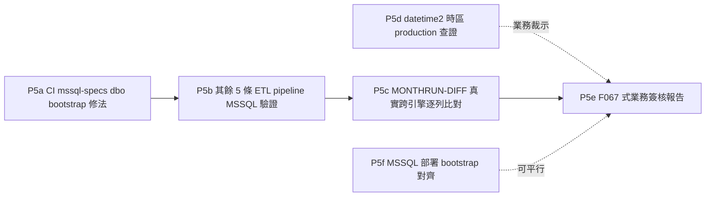

# AD-E07-43：MSSQL 全面遷移 P5（全量 CI + F067 式業務簽核）計畫

## Agent Loading Guide

| Agent 角色 | 需載入章節 |
|-----------|-----------|
| Test Designer | §2（P5a/b 技術驗證定義）、§3（MONTHRUN-DIFF/F067 執行方式）、§6（不變式） |
| TDD Developer | §2（P5a CI bootstrap 修法、P5b 其餘 5 條 pipeline 驗證、P5f 部署 bootstrap） |
| DevOps / CI/CD | §2（CI 修法細節）、§5（子切片 DoD） |
| Product Analyst | §4（需使用者/業務裁示事項，彙整版）、§3（F067 簽核） |

---

## 0. 背景與前置狀態

P1（driver/entity/schema）、P2（自建 T-SQL 佇列）、P4（ETL 引擎，含 customer_core 真實資料）、P3（Stage 1-4 raw SQL 引擎，3a 篩選/3b 計分/3c 比例/3d CR/3e `fn_calc_tier_level` 收尾）全數完成並已 push。**MSSQL 月跑全鏈（Stage 1 篩選→Stage 2~3 計分→Stage 3/4 比例→CR）現已全部有值**——這是本專案 MSSQL 遷移計畫的技術主體完工里程碑。

P5 是 cutover（Phase 6）前的最後一道關卡：**不是新業務邏輯開發，而是「證明 MSSQL 版本忠實重現 PG 版本」的全量驗證 + 業務簽核**。定位比照本專案既有之 F067（`docs/specs/implementation-log/F067-202606-cdmp-vs-legacy-diff.md`）模式，但**基準改為「MSSQL 重現 PG 結果」而非「重驗 legacy SP」**——legacy 對齊已在 PG 版本完成（F067 既有工作），P5 只需證明 MSSQL 與已驗證正確的 PG 版本逐列一致。

---

## 1. P5 範圍總覽與排序

| 子切片 | 一句話定位 | 依賴 | 執行方式 |
|---|---|---|---|
| **P5a** | CI mssql-specs 缺 dbo baseline bootstrap，導致 P3a 等 52 個案例靜默 skip 而非真跑 | 無（可立即開始） | test-designer 定義驗收標準 → tdd-implementation 執行（CI 設定 + 一份測試檔調查） |
| **P5b** | customer_core 以外之其餘 5 條生產 pipeline，尚未證明能在 MSSQL 端到端跑通 | P5a（需 dbo 有完整 baseline 才能跑） | script/manual（比照 P4d `DISPATCHE2E-001` 手法重用） |
| **P5c** | 真實觸發一次完整月跑，PG vs MSSQL 逐列比對 score/tier/card/dept_id/emplid/assignday/cr | P5b（月跑需要 `ob_pool_data` 等來源表先有真實資料） | **manual/script**（比照 F101/F102/F104 前例，非新 CI 測試） |
| **P5d** | tedious datetime2 本機時區儲存，非午夜 `appl_date` 可能使「逾2年清空」邊界與 JS oracle 分歧 | 可與 P5b/P5c 平行進行資料查證 | **manual 查證 + 使用者/業務裁示**（見 §4） |
| **P5e** | F067 式業務簽核報告產出 + 簽核 | P5c 結果 + P5d 裁示 | architect 產出報告草稿 → **使用者/業務簽核**（見 §4） |
| **P5f**（可選、優先度較低） | MSSQL 版一鍵部署 bootstrap，比照 PG 版（`migration:run && seed && seed-datasource && data-seed`） | 無（可平行） | tdd-implementation（機械式腳本工作） |

**CI 4 job 全綠**（原待辦第 3 項）不列為獨立子切片，而是**貫穿全 P5 的持續性 DoD**：P5a 完成後應立即達成，其餘子切片進行中須保持不破。

---

## 2. 技術子切片細節

### 2.1 P5a — CI mssql-specs Dbo Bootstrap 修法（🔴 優先度最高，成本最低，槓桿最大）

**問題確認（已查證，非推測）**：
- `.github/workflows/ci.yml` 之 `mssql-specs` job 僅執行 `docker/mssql-init.sql`（建立 `CDMP_TEST` 資料庫 + `cdmp` 登入），**未執行 `migration:run`**，故 CI 環境的 `dbo` schema 是空的（僅有容器初始化腳本建立的資料庫本身，無任何業務表）。
- P3a impl log 已明確記錄此後果：本機測試環境「CDMP_TEST dbo 平時只有 9 張表（customer_core 在，Stage 1 六表缺）」，CI 實測「P3a mssql：11 綠 / 52 skip（dbo 缺 P3a 六表既有 bootstrap 基線，非本輪回歸）」——**CI 目前對 P3a 的 52 個案例回報「綠」，但實際上是被 GATE-002 靜默跳過，並未真正執行**。這是一個會讓 CI 綠燈產生假信心的缺口。
- P3b~P3d 已各自在 `beforeAll` 自建所需表（複用 `_p3b-mssql-ddl.ts` 零 drift DDL），故不受此問題影響；**僅 P3a 依賴外部預先存在的 baseline**。

**裁定：CI 層提供 dbo bootstrap step（非讓 P3a 回頭改自建）**。

理由：
1. **一次修復、全面受益**：在 CI `mssql-specs` job 的 `mssql-init` 之後、跑測試之前，新增一個 `migration:run` 步驟（沿用 `apps/api/scripts/typeorm.cjs` launcher，比照本機開發流程），一次性建出完整 37 表 + customer_core + `queue_job` 的 MSSQL baseline，**同時**解除 P3a 的 skip 問題**並額外驗證了 migration 檔案本身可正確執行**（P3a 若改自建，只是複製既有 DDL 片段，不驗證 migration 檔案本身的正確性——這是 CI bootstrap 方案獨有的額外價值）。
2. **與 P3b~P3d 既有設計相容、不浪費工作**：P3b~P3d 的 harness 已經是「`OBJECT_ID` 探測→表存在則沿用、不存在才自建」的雙模式（`existedBeforeSuite` / `selfBuiltTables`），CI 提供 baseline 後，這些 spec 會自然直接沿用 CI 建好的表，不會重複自建、不會有任何相容性問題。
3. **成本遠低於「P3a 改自建」**：CI 修法只是在既有 job 裡加一個步驟；P3a 若改自建，需要新增/擴充一份 6 張表的零 drift DDL 定義（雖然 `_p3b-mssql-ddl.ts` 已有前例可依循，但仍是實質改動測試檔案本體，且需重新驗證 P3a 全部 73 個 case ID）。

**🔴 已識別之排序風險（需 P5a 一併解決，非事後才發現的新問題）**：P3a impl log 提及「本檔與 p1b2/p4 共用 dbo，須以單檔（或 `--no-file-parallelism`）執行，避免 p1b2 wipe dbo 造成干擾」——意即**存在某個 P1b2 測試會清空/重建 `dbo` schema**（用於驗證 dev synchronize vs prod baseline migration 的結構等價，即 AD-E07-39 I-MSSQL-BASELINE-PARITY-01 之驗收工具）。若 CI 在跑完 `migration:run` bootstrap 後，`--no-file-parallelism` 的執行序列中，這個 P1b2 「wipe dbo」測試恰好排在 P3a（或其他依賴 baseline 表持續存在的 spec）之前執行，會讓 P3a 重新落回「表不存在」的處境。

**P5a 具體工作項**：
1. CI `mssql-specs` job 新增 `migration:run` bootstrap 步驟（`mssql-init.sql` 之後、`vitest run` 之前）。
2. **調查該 P1b2 wipe-dbo 測試**（需 tdd-implementation 先讀該測試檔確認其具體行為），依情況擇一修法：
   - (a) 該測試若本來就會在自己的 `afterAll` 內重建/還原 baseline，則只需確認 CI 檔案執行序不會讓其他 spec 誤讀到「重建過程中途」的殘缺狀態；
   - (b) 若該測試會把 `dbo` wipe 後不還原（純粹為了驗證 synchronize 本身、驗證完即結束），則需讓它改在**獨立、隔離**的資料庫/schema 範圍操作（不動共用 `dbo`），或於自身 `afterAll` 補一道 `migration:run` 還原；
   - (c) 若上述皆不易，最後手段是透過檔名/glob 順序控制，確保 wipe-dbo 測試排在 vitest 執行序列最後——**此為最脆弱的方案，僅在 (a)(b) 皆不可行時採用**。
3. CI 修法後，重跑 `mssql-specs` job，確認 P3a 之 52 個原 skip 案例**轉為真正 PASS**（非 skip），且 P1b/P2/P4 既有 `.mssql.spec.ts` 全數不受影響。

**新不變式**（見 §6）：**I-MSSQL-CI-BOOTSTRAP-01**。

### 2.2 P5b — 其餘 5 條生產 ETL Pipeline 之 MSSQL 驗證

**背景確認**：P4 的完整端對端驗證（P4d）範圍**僅限「ETL for Customer Core」一條 pipeline**（P4d impl log 明載「不含...其他 5 條 pipeline」）。P4a~P4c 交付的是**通用的 9 個 handler MSSQL 化**（`extract`/`lookup`/`merge`/`dedup`/`derived_field`/`type_cast`/`field_mapping`/`conditional`/`target_load` 全部 handler 皆已 MSSQL 化，非 customer_core 專屬邏輯），故其餘 5 條生產 pipeline（`E07-OBPOOLDATA-Load`／`E07-OBPOOLDATA_LIST-Load`／`E07-OBEMPHIRE-Load`／`E07-OBCALENDAR-Load`／`E07-OBARRETURNDF_MIN_CAP-Load`）**理論上**可直接沿用同一批已 MSSQL 化的 handler 執行，但**尚未被端對端證明過**。

**這是 P5c（MONTHRUN-DIFF）的前置依賴**：P3 的 Stage 1-4 raw SQL 引擎讀取的 `ob_pool_data`／`ob_pool_data_list`／`ob_emphire`／`ob_calendar`／`ob_arreturndf_min_cap` 五張表，若無真實資料，月跑比對就無從進行。

**工作方式**：比照 P4d 之 `DISPATCHE2E-001`（直接呼叫真實生產碼 `createDispatcher()` 取得 dispatcher、以真實 `PipelineRunner.run()` 跑真實 DAG）手法，逐一觸發此 5 條 pipeline 於 `DB_TYPE=mssql`，驗收：① 全部節點 `status==='completed'`（無 `failed`）；② 目標表列數與來源列數合理對應（比照 P4d 之「交叉查實表列數，非僅信 `nodeLogs.outputRowCount`」原則，防 `isTestRun` 假路徑陷阱）；③ 抽樣核對代表性列之內容正確性。**非新增完整測試套件**（9 個 handler 本身已於 P4a~c 個別驗證過），此處僅是**端對端接線驗證**，工作量遠小於 P4 原本的量級。

### 2.3 P5f — MSSQL 部署 Bootstrap 對齊（可選、優先度較低）

比照現行 PG 版一鍵部署（`npm run bootstrap` = `migration:run && seed && seed-datasource && data-seed`，見專案既有部署文件），確認/建立 MSSQL 版對等流程：`migration:run`（MSSQL baseline，含 `queue_job`／`customer_core`）→ `seed`（帳號）→ `seed-datasource`（9 個 datasource 空殼）→ `data-seed`（計分卡/pipeline/擷取任務參考資料）。**此為機械式腳本工作**（沿用既有 PG 版腳本邏輯、替換底層 DB 呼叫），非阻擋性——可平行於 P5a~e 進行，但**必須在真正 cutover（Phase 6）前完成**，否則 MSSQL 環境無法從零建置。

---

## 3. MONTHRUN-DIFF 與 F067 式業務簽核執行方式

### 3.1 MONTHRUN-DIFF（P5c）：技術底稿，Manual/Script 執行

**不是新的自動化 CI 測試套件**，而是比照本專案既有的 F101/F102/F104 驗收前例（觸發真實月跑、SQL 直接查表比對、輸出人工可讀的差異記錄）：

1. 前置：P5a（CI/dbo baseline）+ P5b（其餘 5 條 pipeline 資料就緒）完成，MSSQL 端 `ob_pool_data`/`ob_pool_data_list`/`ob_emphire`/`ob_calendar`/`ob_arreturndf_min_cap`/`customer_core` 六張核心來源表皆有真實資料。
2. 於**同一批來源資料**（理想上是同一個 `project_workym`，如既有基準月 202606）分別觸發 PG 版與 MSSQL 版完整月跑 pipeline（Stage 1 篩選 → Stage 2~3 計分 → Stage 3/4 比例分派 → CR 優先分派）。
3. 逐列比對兩次 run 之 `ob_monthly_run_result`：`score`／`tier_level`／`card_level`／`dept_id`／`emplid`／`emplid_deptid`／`assignday`／`cr_id`／`cr_nm`／`is_cr`。
4. 輸出比對結果為一份 impl-log 風格文件（比照 P4d／F067 之表格化呈現：逐欄一致率、任何差異列之具體案件與差異值、已知邊界案例〔如 P3d 的 tie-breaker／datetime2 案例〕之個別核對結果）。

**此文件即是 F067 式簽核報告的技術附件（非報告本體）。**

### 3.2 F067 式業務簽核（P5e）

**基準修正（承 §0）**：F067 原本的基準是「CDMP vs legacy SP」；**P5e 的基準是「MSSQL vs PG」**——因為 legacy 對齊已在 PG 版本的既有 F067 完成且業務已簽核過，P3/P4 的全部設計目標就是「MSSQL 忠實重現 PG」，故此處不需要（也不應該）重新去比對 legacy，只需要證明「MSSQL 版本的月跑結果與已核可的 PG 版本結果一致」。

**報告內容建議結構**（比照既有 F067 格式延伸）：
1. 執行摘要：MSSQL 全鏈技術驗收已完成（P1-P4）、本報告為 cutover 前最終業務對齊確認。
2. MONTHRUN-DIFF 結果摘要（§3.1 產出）：逐欄一致率、已知可解釋的低機率邊界差異（tie-breaker、datetime2 非午夜時間分量，若有實際觸發）。
3. P5d 之 datetime2 時區查證結果與裁示（見 §4）。
4. 待簽核事項清單 + 簽核欄位。

**產出方**：architect 起草報告（整合 P5c 技術結果 + P5d 業務裁示），**簽核方**：使用者/業務利害關係人（比照本專案歷次 F067/F101/F102/F104 之既有簽核慣例）。

---

## 4. 需使用者/業務裁示事項（彙整，供你帶回使用者）

| # | 事項 | 為何非 architect 可獨立裁定 | 建議行動 |
|---|---|---|---|
| 1 | **datetime2 時區查證（P5d）**：production `ob_pool_data_list.appl_date`（及其他餵入日期邊界判斷之來源欄位）是否帶有非午夜時間分量？MSSQL cutover 後之伺服器/連線時區組態如何設定？ | 需要實際查詢 production 資料庫內容（architect 唯讀評估權限下無法直接存取生產環境資料，且時區組態屬維運/基礎設施決策範疇），且若查證結果為「確有非午夜時間分量」，「逾 2 年清空」邊界的 JS oracle vs MSSQL 分歧影響範圍需業務判斷是否可接受 | 請業務/維運協助查詢一筆或多筆真實 `appl_date` 樣本；若確認皆為午夜（如整批匯入時統一補值），此項可直接結案；若否，需評估分歧筆數規模，決定是否需要調整判定邏輯或接受此已知落差 |
| 2 | **F067 式業務簽核（P5e）**：MSSQL vs PG 月跑結果比對報告之最終簽核 | 比照本專案一貫做法（F067/F101/F102/F104 皆由業務簽核，非 architect 自行認定「夠好了」） | P5c 完成後由 architect 產出報告草稿，交付簽核 |

**架構師判斷：其餘 P5 子切片（P5a/P5b/P5f）皆為純技術執行，不需要使用者裁示，可直接推進。**

---

## 5. 子切片 DoD

### P5a DoD
1. CI `mssql-specs` job 新增 `migration:run` 步驟，成功建出完整 MSSQL baseline（37 表 + `queue_job` + `customer_core`）。
2. 已識別之 P1b2 wipe-dbo 測試風險經調查後採取對應修法（§2.1 三選項之一），並附驗證：CI 全套 `*.mssql.spec.ts` 依序執行不因此測試而使後續 spec 的 baseline 表消失。
3. 重跑 CI，`stage1-sql-pushdown.mssql.spec.ts` 之 52 個原 skip 案例轉為 PASS（非 skip）。
4. P1/P2/P4 既有 `.mssql.spec.ts` 套件全數不受影響（零回歸）。

### P5b DoD
1. 5 條 pipeline 於 `DB_TYPE=mssql` 觸發，全部節點 `status==='completed'`。
2. 目標表（`ob_pool_data`/`ob_pool_data_list`/`ob_emphire`/`ob_calendar`/`ob_arreturndf_min_cap`）以直接 `SELECT COUNT(*)` 交叉驗證列數合理（非僅信 `nodeLogs`）。
3. 抽樣列內容正確性核對（比照 P4d LOOKUPHIT/CHARSET 精神，非窮舉）。

### P5c DoD
1. PG 與 MSSQL 於同一來源資料完整月跑各執行一次。
2. `ob_monthly_run_result` 全部案件之 9 個關鍵欄位（score/tier/card/dept_id/emplid/emplid_deptid/assignday/cr_id/is_cr）逐列比對完成。
3. 產出比對結果文件（impl-log 風格），任何差異皆有具體案件級記錄與可解釋性判斷。

### P5d DoD
1. 至少一筆 production（或 production-like）`appl_date` 樣本之時間分量查證結果記錄。
2. 使用者/業務對「是否接受此差異／時區組態如何設定」給出裁示。

### P5e DoD
1. F067 式簽核報告產出（含 §3.2 結構）。
2. 業務簽核完成（或明確記錄尚待簽核，作為 cutover 前置阻擋項）。

### P5f DoD（可選）
1. MSSQL 版 `npm run bootstrap` 等價流程可對全新 MSSQL 資料庫成功建置（含業務資料表空、參考資料齊全）。

### 是否需要 spec-writer（RESOLVED：不需要）

理由與 P1~P4 一致——P5 全範圍皆為「證明既有已核可行為在 MSSQL 上忠實重現」的驗證工作，沒有任何新業務規則、新使用者可見行為。P5c/P5e 雖然涉及業務簽核，但簽核的對象是「既有行為的跨引擎一致性」，不是「新功能的驗收標準」，性質上仍是驗證而非規格定義。P5 比照既有模式，直接 system-architect → test-designer/manual script → tdd-implementation（P5a/P5b/P5f）；P5c/P5d/P5e 為 manual/業務流程，不需要 test-designer/tdd-implementation 參與。

---

## 6. 不變式（沿用與新增）

| ID | 來源 | 說明 |
|---|---|---|
| **I-MSSQL-CASE-01** | AD-E07-38 | 使用者物件一律小寫 |
| **I-MSSQL-COLLATE-01** | AD-E07-38 | Collation 於資料庫層級設定 |
| **I-MSSQL-BASELINE-PARITY-01** | AD-E07-38 | Dev/prod 建表路徑結構等價；P5a 修法後之 CI bootstrap 亦須維持與此不變式一致（CI 用之 `migration:run` 即該不變式驗收工具鏈的 CI 化落地） |
| **I-MSSQL-ENGINE-EQ-01** | AD-E07-42 | 每個 raw SQL 下推函式須有對應等價測試；P5c MONTHRUN-DIFF 是此不變式在**完整月跑層級**（而非單一函式層級）的最終驗收 |
| **I-MSSQL-CI-BOOTSTRAP-01**（新增） | 本 AD | CI `mssql-specs` lane 執行任何 `*.mssql.spec.ts` 前，必須先完成完整 MSSQL baseline（`migration:run`）；任何會清空/重建共用 `dbo` schema 之測試，必須確保不使同一 CI 執行序中其他 spec 所依賴之 baseline 表消失（自身還原、隔離範圍、或明確排序控制三擇一），不得以「反正 CI 會重跑」為由放任此類副作用 |
| **I-MSSQL-SIGNOFF-GATE-01**（新增） | 本 AD | Phase 6（cutover）不得在以下兩條件皆滿足前啟動：(a) MONTHRUN-DIFF（P5c）對至少一個完整生產規模月跑顯示 PG/MSSQL 結果一致（差異皆為已記錄、可解釋之邊界案例，非未解釋之不一致）；(b) F067 式業務簽核（P5e）已由使用者/業務利害關係人明確完成，非僅由 architect 或工程團隊自行認定「已足夠好」 |
