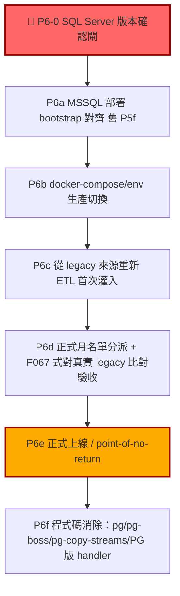

# AD-E07-44：MSSQL 全面遷移 P6（生產切換 cutover）計畫

## Agent Loading Guide

| Agent 角色 | 需載入章節 |
|-----------|-----------|
| Test Designer | §2（P6-0 版本確認閘驗收標準）、§5（子切片驗證閘） |
| TDD Developer | §3（部署切換 vs 程式碼消除範圍界定）、§4（檔案處置清單）、§5（子切片執行順序） |
| DevOps / CI/CD | §2（P6-0）、§4.4（docker-compose 改動）、§6（部署 bootstrap） |
| Product Analyst | §7（需使用者裁示事項）、§8（風險與估算） |

---

## 0. 背景與 P6 之定位修正（重要，影響整份文件的風險評估基準）

P1-P5 已全數完成：MSSQL 全鏈技術驗收通過，真實 PG 逐列 0-diff（P5c/P5h），資料完整性風險已修復（P5g），
F067 式簽核報告已產出待簽署（P5e），varchar/nvarchar 已裁定並處置中（P5i）。使用者已裁定進入 P6。

**關鍵定位修正**：依 project memory 記載「無 prod 資料」——**PostgreSQL 從未是本系統的正式生產資料庫**，
CDMP 至今尚未有過正式上線之生產資料。這意味著 **P6 不是「把一個運作中的生產系統從 PG 切到 MSSQL」的傳統
熱切換**，而是 **「以 MSSQL 作為地基，執行本系統第一次正式生產上線」**，資料來源是**從 legacy 來源系統
重新 ETL**（`E07-OBPOOLDATA-Load` 等既有 pipeline，實際觸發對象為 legacy OB 資料庫，經 `MSSQLExecutor`
擷取），**不是把 PG 裡的資料搬到 MSSQL**（PG 裡本來就只有開發/測試資料，非生產資料，不具搬遷價值）。

此修正大幅降低本次 cutover 的風險輪廓：不存在「資料遺失」或「雙寫不一致」之熱切換風險，因為切換前
MSSQL 生產庫是**空的**，切換動作本質上是「部署 + 首次資料灌入 + 驗證 + 正式對外服務」，而非「兩個既有
資料集之間的遷移」。真正的「不可逆」風險在於：**業務一旦開始依賴 MSSQL 版之正式月名單分派結果做實際派案決策
後，才是真正的 point-of-no-return**（見 §5.4）。

---

## 1. P6 範圍總覽

| 子切片 | 一句話定位 | 依賴 | 可回退？ |
|---|---|---|---|
| **P6-0** | 🔴 確認真實生產 SQL Server 版本，排除 P1-P5 驗證基準（2022 容器）與實機不符之風險 | 無，**全 P6 之硬性前置閘** | N/A（純查證，無變更） |
| **P6a** | MSSQL 版一鍵部署 bootstrap（舊 P5f，併入 P6 執行） | P6-0 通過 | 是（僅新建，不動既有） |
| **P6b** | docker-compose / 環境變數切換至 mssql（部署切換，非刪碼） | P6a 完成 | 是（改回 env 即可還原） |
| **P6c** | 觸發真實 ETL pipeline，從 legacy 來源系統重新灌入 MSSQL 生產庫 | P6b 完成 | 是（`bootstrap` 冪等，可重跑） |
| **P6d** | 正式月名單分派一次，比照 F067 對真實 legacy SP 輸出做業務驗收 | P6c 完成 | 是（結果不滿意可重跑 P6c/P6d，尚未對外服務） |
| **P6e** | 正式上線（業務開始依賴 MSSQL 版結果做實際派案決策） | P6d 業務簽核通過 | **否，point-of-no-return（見 §5.4）** |
| **P6f** | 程式碼消除：移除 `pg`/`pg-boss`/`pg-copy-streams` 內部使用與 PG 版 handler/builder | P6e 穩定運行一段觀察期後 | 是（P6e 後仍可回退，見 §3.3） |

---

## 2. 🔴 P6-0：SQL Server 版本確認閘（本次規劃新發現，最高優先序）

### 2.1 問題（已交叉核對，非臆測）

`AD-E07-38`（P1 driver/entity/schema 設計，front matter 明載）之硬性前提：

> 「**目標 = SQL Server 2022**（不做 2016 相容改寫，`STRING_AGG`/`OPENJSON`/`JSON_VALUE`/filtered index/
> `OFFSET-FETCH` 全部可用）。」

但 project memory（`project_mssql_full_migration`）記載一項**時間上更晚、來源更接近真實環境**的發現：

> 「原定 SQL2019-2022 但**實機是 2016 SP3 Standard**/collation BIN 待決」
> 「2026-07-07 連線 smoke OK（帳號 CDMPT／OPENJSON 可用／**2016 缺 TRIM 需改 LTRIM+RTRIM ~20 站點**）」

即：P1 設計階段之「目標 2022」為**假設**，其後對接近真實環境的連線 smoke test 發現**真正機器可能是
SQL Server 2016 SP3**，且已具體驗證 `TRIM()`（單引數簡化語法，**SQL Server 2017 才引入**）在該環境不可用。
**這項發現發生後，P1~P5 之後續設計與實作皆持續以 2022 容器為驗證基準，未見任何一份 AD 或 impl-log 回頭
處理此落差**——這是本次 P6 規劃過程中主動追查、確認**尚未解決**的缺口。

### 2.2 本次直接查證：`TRIM()` 已確認被廣泛用於 MSSQL SQL 產生層（非猜測）

Grep `TRIM\(` 於實際生成 T-SQL 之來源檔案，確認至少下列 **6 個核心檔案**內嵌 `TRIM(...)` 於 SQL 字串樣板：

| 檔案 | 用途 | 範例 |
|---|---|---|
| `stage2to4-sql-builder-mssql.ts` | Stage 2 計分比對條件 | `` `TRIM(CAST(${src.codeExpr} AS ...))` `` |
| `stage1-sql-executor-mssql.ts` | Stage 1 篩選 agent 代碼 join | `` `TRIM(id_no) AS agent_ref` ``、`` `TRIM(o.agent_id)` `` |
| `lookup-handler-mssql.ts` | ETL lookup handler join key 正規化 | `` `TRIM(TRY_CAST(${expr} AS NVARCHAR(4000)))` ``（核心共用 helper，非單一站點） |
| `type-cast-handler-mssql.ts` | ETL type_cast handler | 同構用法 |
| `target-load-handler-mssql.ts` | ETL target_load handler | 同構用法 |
| `temp-table.util.ts` | 暫存表共用工具 | 同構用法 |

`lookup-handler-mssql.ts` 之 `TRIM(...)` 為**共用 helper 函式**（非單一呼叫點），意味著實際執行期展開的 SQL
語句站點數遠超過 6 個檔案本身——與 project memory「~20 站點」之量級相符甚至可能更多（本次未逐一展開計數，
理由見 §2.4）。

### 2.3 影響評估

若真實生產 SQL Server 版本確為 2016（SP3 或更早）：
- 上述 **Stage 1 篩選、Stage 2 計分、ETL lookup/type_cast/target_load 全數會在真實生產環境對 `TRIM()`
  語法報錯**（`'TRIM' is not a recognized built-in function name` 或等義錯誤），即使 P1-P5 全部測試
  皆綠——因為**所有測試皆針對 2022 容器執行**，從未針對 2016 驗證過。
- 這代表 **P1-P5 之「MSSQL 忠實重現 PG」結論，其驗證基準（2022 容器）可能與真實生產環境不一致**，
  P5e 簽核報告之有效性需重新界定範圍（技術上仍成立於「2022 環境」，但若生產是 2016，簽核基準需註記
  或整組重驗）。

### 2.4 裁定：本項**不由 architect 自行假設或修復**，列為 P6 之硬性前置閘

**理由**：
1. 真實生產伺服器版本是**基礎設施事實**，architect 唯讀評估權限下無法自行連線確認，必須由使用者/維運
   團隊以權威來源核實（如向 DBA 索取 `SELECT @@VERSION` 之真實輸出，或確認採購/建置文件之版本規格）。
2. 若確認為 2016，修復範圍（TRIM 全站點 + 是否還有其他被忽略的 2017+/2019+/2022+ 語法）需要系統性掃描
   （非本次架構規劃之逐一列舉，避免遺漏；建議工作項見下）與**針對真實 2016 環境**的完整重驗（現有 P1-P5
   測試全數僅驗證過 2022），工作量顯著，需要使用者知情並排入時程。
3. 若確認仍為 2019/2022（即先前 memory 記載之「待決」後來已澄清為誤判或環境已升級），則此閘可快速通過、
   不影響既定 P6a 起之時程。

**P6-0 具體工作項**（依確認結果二擇一）：
1. **版本核實**：向維運/DBA 取得真實生產 SQL Server 版本之權威確認（非本次臆測、非僅憑 memory）。
2. **若確認 ≥2017**（含 2019/2022）：記錄確認來源與版本號，P6-0 關閉，**直接進入 P6a**。
3. **若確認為 2016（含 SP3）**：
   a. 系統性 Grep 全部 `apps/api/src/**/*-mssql.ts` 與 `apps/api/src/**/mssql/**` 之 `TRIM(` 站點，
      逐一改為 `LTRIM(RTRIM(...))`（語意等價，2008+ 即支援，不受版本限制）。
   b. 系統性掃描是否有其他 2017+/2019+/2022+ 專屬語法被使用（`STRING_AGG` 本次查證**未發現**使用，
      `CONCAT_WS`/`GENERATE_SERIES`/`APPROX_COUNT_DISTINCT`/`STRING_SPLIT`（2016 即有，非疑慮項）等
      亦查無使用，但仍建議正式列一份检查清单逐項覆核，不可只憑本次抽樣結論）。
   c. **本機建立真實 SQL Server 2016 SP3 測試容器或連線**（`mcr.microsoft.com/mssql/server:2016-latest`
      若無官方 2016 映像則需以其他方式取得等價驗證環境），將 P1-P5 全部 `*.mssql.spec.ts` 針對此環境
      重新執行，確認零回歸。
   d. 更新 `AD-E07-38` 之版本前提（Errata），並回頭檢視 P1-P5 是否有其他隱性依賴 2017+ 語法特性之假設。

**此為 P6 全流程的硬性前置閘：P6a 及其後所有步驟，必須等 P6-0 確認結果為「無需修復」或「修復完成並重驗
通過」後才可開始。**

---

## 3. 移除範圍界定：部署切換 vs 程式碼消除

### 3.1 兩層次定義

| 層次 | 定義 | 對應「完全消除 PostgreSQL」之滿足方式 |
|---|---|---|
| **(a) 部署切換** | 生產環境之 `DB_TYPE`/連線目標由 postgres 改為 mssql；`docker-compose` 之 `api`/`worker`/`bootstrap` 服務指向 `mssql` 服務；PG 服務容器可停用/移除於生產環境 | 滿足「no hybrid architecture」——生產環境**運行時**不存在雙引擎並存、不存在對 PG 之任何生產期依賴 |
| **(b) 程式碼消除** | 移除原始碼庫中 `pg`/`pg-boss`/`pg-copy-streams` 之**內部使用**（CDMP 自身 DB 引擎相關程式碼）、PG 版 SQL builder/handler 檔案、相關測試 | 滿足「完全消除 PostgreSQL」之**字面/程式碼庫層次**語意——repo 內不再存在可執行的 PG 內部引擎路徑 |

### 3.2 架構師建議：**分階段，(a) 先行、(b) 待穩定觀察期後執行**

**建議 P6e（正式上線）與 P6f（程式碼消除）之間保留一段觀察期（建議至少 1-2 個完整月名單分派週期），不在同一
批次內完成兩者。**

**理由**：
1. **「no hybrid architecture」之硬約束語意是「生產不得雙引擎並存」，不是「原始碼庫不得包含 PG 相關字元」**。
   部署切換（a）已完整滿足使用者原始拍板的三項硬約束（消除 PG 依賴、佇列自建 T-SQL、目標 SQL Server）；
   保留 byte-identical 的 PG 版檔案在 repo 中、暫不刪除，對生產運行**零影響**（已由 P5h/P2 之既有證據
   證實：`pgBossProvider`/`createPgBoss()` 於 `DB_TYPE≠postgres` 時直接回傳 `null`，不嘗試連線，「建立
   但不使用（無害）」——這是本專案自 P2 起即刻意設計、已在生產路徑驗證過的安全模式）。
2. **保留 PG 版程式碼在初期上線觀察期具有實質除錯價值**：若 MSSQL 生產環境於真實資料規模下出現與 P1-P5
   測試環境不同的行為（如 §2 P6-0 可能發現的版本落差、或其他未預見的真實資料邊界案例），PG 版程式碼
   （已知正確、有真實 F067 對齊歷史）是**唯一可快速比對、定位「MSSQL 是否忠實重現預期行為」的參考基準**。
   一旦刪除，若後續發現疑似回歸，只能從 git 歷史還原比對，增加除錯摩擦與風險視窗。
3. **不可逆操作應盡量延後、聚合執行**：P6f 屬於「刪除」性質的變更（移除依賴、刪除檔案），一旦執行、
   且後續多輪 commit 疊加其上，回退成本顯著上升。相對地，P6a-e 全部是「新增/切換設定」性質，**在 P6e
   之前的任一步都可透過改回環境變數還原**（見 §5.4 point-of-no-return 定義），風險層級明顯較低。
   將高風險（不可逆刪除）動作與已充分驗證之附加價值（觀察期除錯）解耦，是更保守、更符合本專案一貫
   「先証據、後刪除」風格（比照 F050/F101 等既有重構皆先行為對齊驗證、再移除舊碼）之做法。
4. **成本極低**：保留不用的 PG 相關檔案於 repo 中，除了少量磁碟空間與 IDE 索引成本外，無其他負擔；
   `package.json` 之 `pg-boss`/`pg-copy-streams` 若暫不移除，僅增加 `npm install` 體積，不影響執行期
   行為（未被 import 的路徑不會被載入執行）。

**若使用者傾向「一次做完、不留尾巴」**：可接受，但**強烈建議至少完成一次真實正式月名單分派並經業務簽核後
才刪碼**（即 P6f 不得早於 P6d 業務驗收通過），不建議把「部署切換」與「程式碼消除」壓縮進同一個
不可回頭的批次——這是本文件唯一**明確要求使用者裁示**的範圍問題（見 §7 事項 1）。

### 3.3 P6f 之可回退性（若已完成，如何評估回退成本）

P6f 執行後（真刪除 PG 版程式碼），若仍需回退至 PG：需從 git 歷史還原被刪除之檔案（`git revert`
對應之 P6f commit，技術上可行，但需注意期間若有對 mssql 版檔案的後續修改，回退時需人工合併判斷）。
**這是 P6f 之所以建議延後、且與 P6e 之間保留觀察期的核心理由**——observation window 越長，P6f 執行時
「MSSQL 版本身已充分證明穩定」的信心越高，回退需求發生的機率也隨之降低。

---

## 4. 檔案層級處置清單（依 (a)/(b) 分類）

### 4.1 屬於「內部 DB 引擎」（P6f 程式碼消除範圍）

| 類別 | 檔案 | 處置 |
|---|---|---|
| 佇列 pg-boss 分支 | `queue/pg-boss.provider.ts` | 移除（`createPgBoss`/`PG_BOSS` token 全部使用點皆需同步清理） |
| 佇列 consumer/producer 之 boss 分支 | `queue/run-queue.consumer.ts`／`queue/run-queue.producer.ts` | 移除 pg-boss 分支邏輯，僅留 mssql 輪詢路徑（`isMssqlDriver()` 判斷式與相關 `@Optional` 注入亦可簡化為必要注入） |
| worker 佇列註冊 | `assignment-worker.module.ts`／`worker-app.module.ts` | 移除 `pgBossProvider` 註冊與相關 wiring |
| bulk-load COPY 路徑 | `raw-data.service.ts::openCopyWriter`（第 470 行起）＋頂部 `import { from as copyFrom } from 'pg-copy-streams'` | 移除（MSSQL 版 tedious bulk-load，P4e 已完整替代） |
| 型別宣告 | `src/types/pg-copy-streams.d.ts` | 移除 |
| package deps | `package.json`：`pg-boss`／`pg-copy-streams` | 移除（**`pg` 本身不可移除，見 §4.2**） |
| F098 pg-boss 專屬測試 | `f098-pg-integration.spec.ts` | 移除（純 PG/pg-boss 整合測試，程式碼消除後無對應生產路徑可測） |
| F098 其餘測試 | `f098-consumer.spec.ts`／`f098-producer.spec.ts`／`f098-orphan-reaper.spec.ts`／`f098-static-guards.spec.ts`／`f098-trigger-run.spec.ts`／`f098-cancellation.spec.ts` | **需逐檔核對**（非一律刪除）：這些檔案很可能混合測試「共用邏輯」（`processPayload`／`OrphanReaper`／`CancellationPoller`，driver-agnostic）與「pg-boss 專屬分支」，程式碼消除時僅移除 pg-boss 專屬斷言/fixture，保留 driver-agnostic 與 mssql 分支之既有覆蓋 |
| PG 版 SQL builder | `stage1-sql-executor.ts`／`stage2to4-sql-builder.ts`／`stage3to4-ration-sql.ts`／`cr-priority-sql.ts`／`stage1-customer-core-clause.ts` 等 P3 期間建立之 PG 原版 | 移除（`*-mssql.ts` 平行版已為生產唯一路徑） |
| PG 版 ETL handler | 9 個 handler 之 PG 版（`extract`/`lookup`/`merge`/`dedup`/`derived_field`/`type_cast`/`field_mapping`/`conditional`/`target_load` 之非 `-mssql` 檔） | 移除 |
| PG migrations | `database/migrations/*.ts`（PG baseline，非 `migrations/mssql/` 子目錄） | **建議保留**（歷史記錄性質，非執行期依賴；`data-source.ts`／`app.module.ts` 之 postgres 分支若移除，這些 migration 檔案本就不會被任何 CLI glob 撿到，保留無害，且刪除 migration 歷史檔案較無必要性與價值） |
| Driver 分支本身 | `app.module.ts`／`worker-app.module.ts`／`database/data-source.ts`／`database/seeds/seed-connection.ts` 之 `postgres` 分支 | 移除（**sqlite 分支必須保留**，見 §4.3） |

### 4.2 🔴 不屬於「內部 DB 引擎」，不可因「消除 PG」而移除

| 檔案 | 真實用途 | 為何不可移除 |
|---|---|---|
| `extraction-task/executors/postgresql-executor.ts` | `ExecutorFactory` 之一員，服務**使用者於「資料來源」功能自行設定之外部 Datasource**（`datasourceType==='postgresql'` 時使用），與 CDMP 自身資料庫引擎完全無關 | 外部來源系統理論上可以是任何資料庫類型；「完全消除 PostgreSQL」之硬約束**語意上是指 CDMP 自身的內部應用資料庫**，不是「本系統永遠不能連線到任何 PostgreSQL 資料庫」——後者會不合理地限制一個與本次遷移目標無關的既有功能 |
| `datasource/connection-tester.provider.ts::testPostgresql` | 同上，「測試連線」功能之 postgresql 分支，服務同一個外部 Datasource 設定情境 | 同上 |
| `package.json` 之 `pg` 依賴 | `postgresql-executor.ts` 於執行期 `require('pg')` | 只要保留上述外部來源功能，`pg` 套件**必須留在 dependencies**，即使 `pg-boss`/`pg-copy-streams` 皆已移除 |

**此為本次規劃對協調者原始問題 3 之範圍修正**：`postgresql-executor.ts`／`connection-tester.provider.ts`
**不是**「來源端是否支援 PG」的問題（協調者原始問題框架），而是「**CDMP 作為 ETL 平台，是否仍要支援使用者
設定任意外部 PostgreSQL 資料來源**」的**獨立產品功能**問題，與本次資料庫引擎遷移之硬約束無關，**建議維持
現狀、不列入本次任何階段之移除範圍**。若使用者確實希望連這個功能也一併移除（即產品範圍決策：本系統
未來不再支援連線至 PostgreSQL 類型的外部資料來源），這是**與本次遷移完全獨立的產品範圍決策**，需另行
確認，不應因「遷移我方資料庫引擎」而順帶移除一個仍有potential 使用情境的既有功能。

### 4.3 三分支 → 二分支之機械改動（sqlite 必留）

`app.module.ts`／`worker-app.module.ts`／`database/data-source.ts`／`database/seeds/seed-connection.ts`
現行皆為 `postgres`/`mssql`/`sqlite` 三分支判斷式（`if (dbType==='mssql') {...} else if (isTest) sqlite
else postgres` 等形式，各檔案實際順序略有差異）。P6f 之改動為**機械式**移除 `postgres` 分支，`sqlite`
分支**完全保留不動**（sqlite 為 vitest 單元測試主力、覆蓋大量 spec，非本次遷移目標，不受影響）。改動後
成為 `mssql`/`sqlite` 二分支，`DB_TYPE` 環境變數之合法值集合由 `{postgres, mssql, sqlite}` 收斂為
`{mssql, sqlite}`（`sqlite` 通常由測試環境變數如 `NODE_ENV=test` 自動判定，非使用者手動指定，實際上
生產/開發環境使用者可見的合法值僅 `mssql`）。

### 4.4 docker-compose.yml 改動（屬 P6b 部署切換範圍，非 P6f）

現況（已查證）：`postgres`/`api`/`worker`/`web`/`bootstrap` 服務為預設啟動集合，`api`/`worker`/`bootstrap`
三者之 `DB_TYPE`/`DB_HOST` 皆硬編碼 `postgres`；`mssql`/`mssql-init` 服務**已存在**但以 `profiles: [mssql]`
方式設為選用（目前僅供本機 smoke/schema 開發，尚未接上 `api`/`worker`）。

**P6b 具體改動**：
1. `api`/`worker`/`bootstrap` 三服務之環境變數改為指向 `mssql`（`DB_TYPE: mssql`／`DB_HOST: mssql`／
   `DB_PORT: 1433`／補上 `DB_MSSQL_ENCRYPT`/`DB_MSSQL_TRUST_CERT`）；`depends_on` 由 `postgres` 改為 `mssql`
   （`condition: service_healthy`，惟現行 `mssql`/`mssql-init` 服務**無 healthcheck**，只有 `mssql-init`
   之 retry-loop entrypoint——**需補上 `mssql` 服務之 healthcheck** 或將 `depends_on` 條件改為依賴
   `mssql-init` 完成，避免 `api`/`worker` 於 MSSQL 尚未就緒時搶跑）。
2. `mssql`/`mssql-init` 服務移除 `profiles: [mssql]`（改為預設集合之一員，與 `postgres` 目前地位對調）。
3. **P6a-P6e 期間，建議 `postgres` 服務暫時保留於 compose 檔中**（可加 `profiles: [legacy-pg]` 使其變為
   選用、預設不啟動，而非直接刪除服務定義）——與 §3.2 之「保留觀察期」理由一致，若 P6-0/P6c/P6d 任一步
   驟發現需要回退比對，仍可 `docker compose --profile legacy-pg up postgres` 快速取得 PG 對照環境。
   P6f 執行時再正式移除 `postgres` 服務定義與 `pgdata` volume。
4. `bootstrap` 服務之 `command: npm run bootstrap` 沿用（見 §6，`bootstrap` npm script 本身依 `DB_TYPE`
   讀取對應之 migration/seed 邏輯，改的是 compose 傳入的環境變數，非 script 本身）。

---

## 5. 子切片執行順序、驗證閘、Point-of-No-Return

### 5.1 驗證閘標準（每一步皆須通過，比照 P5a CI 基線）

- MSSQL 全套件（`*.mssql.spec.ts`）：零邏輯失敗（比照 P5a 基線 630 通過/0 失敗/17 skip 之既知環境性 skip，
  或 P5h 之全量 673 通過基線）。
- sqlite 分支全套件：零回歸（P6 全程不動 sqlite 分支，此為**持續性守門**，非一次性檢查）。
- `npx tsc --noEmit -p tsconfig.build.json`：EXIT 0。
- 每一步驟結束後方可進行下一步驟；任一步驟失敗則**停在該步**，不得跳步。

### 5.2 順序（承 §1 mermaid 圖）

1. **P6-0**（§2）：版本確認閘，通過才可繼續。
2. **P6a**：MSSQL bootstrap（§6），於**非生產**環境（如 CI 或獨立 staging MSSQL 實例）先驗證一次「全新
   空 MSSQL 資料庫 → `bootstrap` script → 業務可登入、參考資料齊全」全鏈路可行。
3. **P6b**：docker-compose/env 切換（§4.4）。此步驟**可先於 staging 環境執行**，不必直接動生產。
4. **P6c**：於**生產 MSSQL 環境**執行 P6a 已驗證過的 bootstrap 流程（空庫→建表→種子資料），再觸發真實
   ETL pipeline 對 legacy 來源系統重新擷取，首次灌入生產 MSSQL。
5. **P6d**：以 P6c 灌入之真實資料觸發一次正式月名單分派，比照 F067 既有方法論，將結果與 legacy SP 之真實輸出
   做業務級比對，產出簽核文件，**業務簽核**。
6. **P6e**：業務簽核通過後，正式對外/對內開放本系統，業務開始依賴月名單分派結果進行實際派案。**Point-of-no-return
   自此刻起算**（見 §5.4）。
7. **P6f**：觀察期滿（建議至少 1-2 個完整月名單分派週期，且期間無需回退至 PG 對照之情事）後，執行程式碼消除
   （§4.1）。

### 5.3 每步之回退方式

| 步驟 | 若需回退 |
|---|---|
| P6-0 | 純查證，無變更可回退 |
| P6a | 刪除/重建 staging MSSQL 資料庫即可，不影響任何既有環境 |
| P6b | 改回 `docker-compose` 環境變數（`DB_TYPE: postgres`／`DB_HOST: postgres`），因 PG 服務與程式碼皆保留（§3.2），數分鐘內可恢復舊狀態 |
| P6c | 生產 MSSQL 資料庫尚未對外服務，可直接清空重跑 `bootstrap`+ETL（冪等設計） |
| P6d | 若簽核不通過，回到 P6c 重新查證/修正後再次執行，MSSQL 生產庫尚未正式服務，無外部依賴需要保護 |
| P6e 之後 | **不可簡單回退**（見 §5.4） |
| P6f | 需 git revert 還原被刪除檔案，技術可行但有合併成本（見 §3.3） |

### 5.4 🔴 Point-of-No-Return 之明確定義

**定義：業務開始依據 MSSQL 版正式月名單分派結果，實際對外／對下游派案（即結果被業務流程真實採用、產生實際
派案動作），且不再有並行之 legacy 人工/既有流程作為備援退路的那一刻。**

在此之前（P6-0 至 P6d），無論任何一步發現問題，皆可透過重跑 bootstrap（冪等）、重新 ETL、或（若涉及
P6-0 版本問題）暫緩並回頭處理，**沒有任何一步是不可逆的**，因為：(1) MSSQL 生產庫在此之前尚未真正
承載「業務依賴」的資料與決策；(2) PG 版程式碼與服務定義依 §3.2/§4.4 建議暫時保留，理論上仍可作為
緊急對照或（雖不建議但技術可行）暫時退回之基礎。

**P6e 是本次遷移全流程唯一真正的 point-of-no-return**：一旦業務開始採信並執行 MSSQL 版之派案結果，
若之後才發現問題，处理方式不再是「回退資料庫引擎」，而是「在 MSSQL 上修復問題」（因為業務決策已基於
該次結果發生，無法透過切回 PG 來撤銷已發生的業務行為）。**這與傳統「雙寫/熱切換」cutover 的 point-of-
no-return 定義不同**（傳統定義通常是「舊系統停止接受寫入」之時刻），本專案因無既有生產資料，point-of-
no-return 改以「業務決策依賴」為判準，更貼近本專案「首次上線」而非「引擎熱切換」的實際性質（見 §0）。

---

## 6. P6a：MSSQL 部署 Bootstrap（原 P5f，併入 P6 執行）

比照現行 PG 版一鍵部署（`npm run bootstrap` = `migration:run && seed && seed-datasource && data-seed`，
docker-compose 現有 `bootstrap` profile 服務），對 MSSQL 目標建立對等流程：

1. `migration:run`：MSSQL baseline migration（`migrations/mssql/*`，含 `queue_job`／`customer_core`／
   全 37+ entity 表），需確認 `data-source.ts` 之 CLI DataSource 於 `DB_TYPE=mssql` 時能正確跑此路徑
   （P1b2 既有驗證過此路徑本身可行，此處是**首次串進完整 bootstrap 腳本**的端對端確認）。
2. `seed`：帳號（users）。
3. `seed-datasource`：9 個 datasource 空殼（密碼留空，部署後手動於 UI 補齊並測試連線——此步驟即會用到
   `connection-tester.provider.ts`／`ExecutorFactory`，**與 §4.2 之外部來源功能直接相關**，佐證該功能
   確實是獨立於本次引擎遷移之外的必要能力）。
4. `data-seed`：計分卡/pipeline/擷取任務參考資料（`prod-data-seed.ts`）。

**DoD**：對一個全新、空的 MSSQL 資料庫（建議先於 CI 或獨立 staging 實例驗證），執行上述 4 步後可正常
登入、業務資料表為空但結構完整、參考資料（計分卡設定/ETL pipeline 定義/datasource 空殼）齊全——與現行
PG 版 `bootstrap` 之 DoD 完全對等。

---

## 7. 需使用者裁示事項

| # | 事項 | 為何非 architect 可獨立裁定 | 建議行動 |
|---|---|---|---|
| 1 | **🔴🔴 P6-0 真實 SQL Server 版本確認**：production 目標是 2016 SP3 還是 2019+/2022？ | 這是基礎設施事實，architect 唯讀評估權限下無法自行連線確認；若確認為 2016，將觸發顯著的額外修復與重驗工作量（TRIM 全站點改寫 + 針對真實 2016 環境重跑 P1-P5 全套件），屬時程與資源層級的業務決策範疇 | 請維運/DBA 提供真實生產 SQL Server 之 `SELECT @@VERSION` 輸出或權威版本文件；若為 2016，請裁示是否核准所需之額外修復時程（見 §2.4／§8 估算） |
| 2 | **部署切換 (a) 與程式碼消除 (b) 是否分階段**：architect 建議分階段（P6e 上線後保留觀察期、P6f 延後執行），但這是風險偏好的取捨，非純技術對錯 | 「盡快徹底消除 PG」與「保留除錯安全網」是兩種合理但互斥的風險偏好，屬業務對「乾淨俐落」vs「穩健保守」的價值判斷 | 若接受 architect 建議（分階段），P6 依 §5.2 順序執行；若希望一次做完，至少需接受「P6f 不得早於 P6d 業務簽核通過」之底線（見 §3.2 末段） |
| 3 | **P6e 正式上線時機**：確切日期／是否配合特定月結週期 | 涉及業務營運排程（月結時點、人力安排等），非技術決策 | 業務排定 P6d 簽核完成後之正式啟用日 |
| 4 | **`postgresql-executor.ts` 外部來源功能之產品範圍**（§4.2）：是否仍要支援使用者設定 PostgreSQL 類型之外部資料來源？ | 這是與本次資料庫引擎遷移**無關**的獨立產品功能範圍決策 | architect 建議維持現狀（不移除），除非業務另有明確產品範圍決定 |

---

## 8. 風險與估算

| 項目 | 估算 | 備註 |
|---|---|---|
| P6-0 版本確認（若確認 ≥2017） | 0.5 人天 | 純查證，快速關閉 |
| P6-0 修復（若確認為 2016，含 TRIM 全站點改寫 + 真實 2016 環境重驗 P1-P5 全套件） | **5-10 人天** | 最大不確定性來源；`TRIM` 站點精確計數與是否有其他隱性 2017+ 依賴，需系統性掃描後才能精確估算，此為區間估計上界之主要風險 |
| P6a bootstrap 對齊 | 1-2 人天 | 機械式腳本工作，沿用 PG 版邏輯 |
| P6b docker-compose 切換 | 0.5-1 人天 | 含補 `mssql` healthcheck |
| P6c 生產首次 ETL 灌入 | 0.5-1 人天（執行+驗證，不含 pipeline 執行本身之等待時間） | 沿用既有 pipeline，非新開發 |
| P6d 正式月名單分派 + F067 式驗收 | 2-3 人天 | 比照既有 F067/P5c/P5e 方法論，含報告撰寫 |
| P6e 上線 | 依業務排程 | 非工程工作量 |
| P6f 程式碼消除 | 3-5 人天 | 含 §4.1 全部檔案 + F098 測試逐檔核對（非簡單全刪）+ 全套件回歸 |
| **合計（不含 P6-0 修復分支）** | **約 8-13 人天** | |
| **合計（含 P6-0 修復分支，若確認為 2016）** | **約 13-23 人天** | |

---

## 9. 不變式（新增）

| ID | 說明 |
|---|---|
| **I-MSSQL-VERSION-CONFIRMED-01** | 任何生產切換動作（P6a 之後）不得在「真實生產 SQL Server 版本」未經權威來源確認前執行；若確認版本 <2017，所有已使用 2017+ 語法（已知：`TRIM()` 簡化語法）之 MSSQL SQL 產生層須改寫為相容語法並針對真實版本環境重驗，方可解除本閘 |
| **I-MSSQL-NOHYBRID-PROD-01** | 生產環境不得同時存在 PG 與 MSSQL 兩條皆處於「使用中」狀態的資料庫引擎路徑；`docker-compose` 之生產環境設定，`api`/`worker`/`bootstrap` 服務任一時刻只能指向單一引擎（P6b 之後為 mssql） |
| **I-MSSQL-SOURCE-EXECUTOR-SCOPE-01** | 「完全消除 PostgreSQL」之硬約束範圍限於 CDMP 自身內部應用資料庫引擎（driver/entity/queue/bulk-load），不包含 `extraction-task` 模組之外部 Datasource 來源型別支援（`postgresql-executor.ts`／`connection-tester.provider.ts` 之 postgresql 分支）；後者之移除與否屬獨立產品範圍決策，不隨本次遷移自動連帶處置 |
| **I-MSSQL-CUTOVER-REVERSIBLE-01** | P6e（業務開始依賴 MSSQL 版正式月名單分派結果做實際派案決策）之前，P6 全部步驟必須維持可回退（改回環境變數即可還原，或資料庫可安全清空重建）；P6f（程式碼消除）不得早於 P6d 業務簽核通過 |
