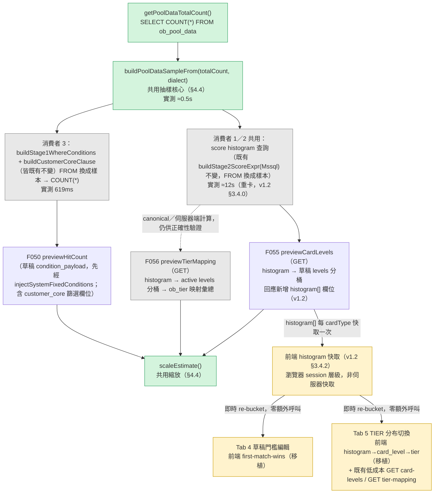

# AD-E07-45：抽樣估算共用元件架構設計

## Agent Loading Guide

| Agent 角色 | 需載入章節 |
|-----------|-----------|
| Test Designer | §3（核心設計決策）+ §6（讀鎖豁免裁決）+ §7（不變式）+ §8（測試邊界） |
| TDD Developer | §2（既有架構基礎）+ §3 + §4（`sampling-estimator.ts` 契約）+ §5（三個消費者 SQL 契約）+ §6 + §7 |
| UI/UX Designer | §3.5（`isEstimate`/`sampleSize`/`totalCount` 呈現原則）；具體文案不在本 AD 範圍 |
| Product Analyst | §9（風險與殘留議題）+ §10（需 PO / spec-writer 後續處理事項） |

---

## 1. 背景與問題定義

`GET /api/v1/assignment/scoring/card-levels/preview`（F055 §5.2）現行實作對 `ob_pool_data` 全表
（生產環境 1,679,489 列）即時套用完整 Stage 2 計分表達式（`buildStage2ScoreExpr` / `buildStage2ScoreExprMssql`）
重新計分後才分桶統計，實測 CARD_TYPE=E 情境耗時 **224.6 秒**，遠超前端請求逾時；前端並以
`catch { setPreview(null) }` 靜默吞噬逾時／錯誤，導致面板直接顯示空白（US-174 背景）。

同一批 spec 修訂（US-174 / US-175 / US-176）另外新增兩個同性質需求：F056 Tab 5 新增「預估各 TIER 分布」
唯讀面板（現行完全沒有）、F050 建立草稿頁「預估命中筆數」現行為**與真實資料完全無關的前端假公式**
（`n = 12500 * (0.85 - i*0.08)`），必須改為真實估算。team lead 已就三者共用之產品邏輯拍板（D1）：
**`ob_pool_data` 固定筆數隨機樣本 + 可重現種子 + 放大推算至母體 + 估算標示 + 次秒級**，抽樣機制本身
（演算法、樣本大小、種子產生、放大公式、SQL 下推、是否快取）明確授權本 AD 決定。

本 AD 之核心架構主張：**三個消費者共用同一個抽樣核心元件，而非三套獨立實作**——三者的差異僅在於
「對抽樣後的列做什麼聚合」（F055／F056 算分後依 score 分桶；F050 套欄位篩選 WHERE 後 COUNT），
抽樣本身（如何從 `ob_pool_data` 取出一組固定、可重現的子集合）是完全共用的正交關注點。

---

## 2. 既有架構基礎（不分叉，不得修改語意）

| 元件 | 檔案 | 角色 |
|---|---|---|
| `buildStage2ScoreExpr` / `buildStage2ScoreExprMssql` | `apps/api/src/modules/assignment/stage1/stage2to4-sql-builder(-mssql).ts` | 單一真源之 Stage 2 計分純量表達式產生器（F104 已對齊 legacy SP）；本 AD **完全不修改**其簽名與邏輯，僅改變其執行對象的 FROM 來源 |
| `buildStage1WhereConditions` | `apps/api/src/modules/assignment/stage1/stage1-query-composer.ts` | `condition_payload` 欄位篩選子步驟純函式（F050 v2.1 whitelist-driven，AD-E07-18）；本 AD 同樣不修改其簽名與邏輯 |
| `buildCustomerCoreClause` | `apps/api/src/modules/assignment/stage1/stage1-customer-core-clause.ts` | F109 客戶來源篩選欄位之條件式 `LEFT JOIN customer_core` + WHERE fragment 產生器（AD-E07-37）；composer 對 customer_core 來源條件靜默 skip，皆由本函式產生。本 AD 消費者 3（F050，§5.3）v1.1 起直接呼叫此既有函式，簽名與邏輯**不修改** |
| `previewCardLevels` | `apps/api/src/modules/assignment-scoring/assignment-scoring.service.ts:951-1146` | F055 §5.2 既有實作。**已查證**：本方法目前**不呼叫 `assertNotLocked()`**（僅呼叫 `assertCardTypeActive`）——F055 §5.2 錯誤表現行標註之 409 `SCORING_VERSION_LOCKED` 為文件與程式碼不一致，見 §6 |
| `injectSystemFixedConditions` | `apps/api/src/modules/assignment-list/assignment-list.service.ts`（private） | US-144 系統固定條件（`best_case`）注入，F050 BR-14；本 AD 之草稿估算依 BR-15 契約要求呼叫端先執行本步驟才進入抽樣 |
| `ObTier` | `apps/api/src/database/entities/ob-tier.entity.ts` | Standard（`card_level` 非 null）/ Fallback（`card_level IS NULL`）對應規則來源，F056 既有 `tierRepo` |
| `ObLevelcardLevel` / `levelRepo` | `assignment-scoring.service.ts` 既有注入 | F055 CARD_LEVEL 門檻（active 版本），F056 §5.5 分桶所需之 active 門檻來源（非草稿值） |

**關鍵既有事實（決定本 AD 設計）**：

- `ob_pool_data` **無 `card_type` 欄位**（已查證 entity，`apps/api/src/database/entities/ob-pool-data.entity.ts`）。計分卡類型是「名單／計分設定」的屬性，不是案件列的屬性——`buildStage2ScoreExpr` 對*全部* `ob_pool_data` 列套用選中 CARD_TYPE 的計分公式，不存在依 CARD_TYPE 篩選列的 WHERE 子句。因此**三個消費者的母體（population）皆為同一份 `ob_pool_data` 全表**，`totalCount` 是單一、與 CARD_TYPE／篩選條件無關的量，可共用同一支查詢取得。
- F055 §5.2 現行有一組「BR-2 應用層快取」（`cardLevelHistogramCache`，60 秒 TTL，鍵為 `${cardType}:${cardVersion}`），快取的是「分數 histogram」（score → 列數），因為 histogram 只取決於 `(cardType, cardVersion)`，門檻分桶（levels）純粹是記憶體重新分桶。本 AD 對此快取之處置見 §3.4（**移除，不保留**）。
- `ob_pool_data` 主鍵為複合鍵 `(orgno, appl_no)`（`@PrimaryColumn`），為兩個穩定欄位，可作為決定性排序之 tie-break key。
- `ob_pool_data` 為**批次 ETL 全表 truncate + reload**之表（`E07-OBPOOLDATA-Load`），非交易期間持續寫入之表；月結週期間該表內容視為靜態。本 AD 之可重現性設計（§3.2 / §3.3）建立在此既有假設之上（與 F049 Stage 0 試算等既有功能相同假設）。
- 專案現行為 **MSSQL-only 生產部署**（`DB_TYPE=mssql`），但程式碼庫仍維持 PG/MSSQL 雙方言 builder 慣例（`buildStage2ScoreExpr` / `buildStage2ScoreExprMssql` 已是先例）。本 AD 之抽樣核心比照此慣例，MSSQL 為主要驗證目標，PG 維持語意對等（parity），SQLite 不支援 `TABLESAMPLE`，維持既有「PG/MSSQL-only、SQLite 不測」認定（§8）。

---

## 3. 核心設計決策

### 3.1 樣本大小：固定常數 **50,000**

**裁定**：`POOL_DATA_SAMPLE_SIZE = 50_000`，跨三個消費者共用同一常數，不依 CARD_TYPE / 篩選條件 / 當下母體筆數而異。

**理由**：
- 生產母體 N ≈ 1,679,489；50,000 ≈ 母體之 3.0%。
- 統計精度：對任一比例型估計（如「A 級佔比 X%」），95% 信賴區間之最大誤差（最保守 p=0.5 情境）
  ≈ `1.96 × √(0.25 / 50000) ≈ 0.44 個百分點`。對「約略分布」用途已足夠精確，業務決策不會因抽樣誤差而誤判。
- 效能：224.6 秒之瓶頸主要是**對全表 1,679,489 列逐列求值計分表達式的 CPU 成本** + I/O；縮小到 50,000 列
  （降至約 1/33）使逐列計分之 CPU 成本等比例下降，再疊加 `TABLESAMPLE` 頁級跳讀（§3.2）帶來的 I/O 降低，
  預期落在次秒級（實測驗證屬 tdd-implementation／test-designer 職責，非本 AD 保證值）。
- 整數常數，易於推理與未來調整（單一常數修改即可影響全部三個消費者，無需分散調參）。

**明確拒絕「依母體動態調整之抽樣比例」**（如「固定抽 3%」）：違反 US-174 AC-1 / BR-8 明文之「樣本筆數為固定值
（非動態依當下總筆數變動）」——若改用固定比例，母體隨月結成長時樣本筆數會漂移，使不同時間點的估算精度不可比較，
且與 AC-2「相同輸入 → 相同輸出」的直覺（業務預期「樣本」是一個穩定的量）不符。

### 3.2 抽樣機制：`TABLESAMPLE` 頁級抽樣 + 決定性修剪至精確筆數

**裁定**：兩階段抽樣，缺一不可：

1. **粗抽樣（I/O 層級縮減）**：以 `TABLESAMPLE`（MSSQL：`TABLESAMPLE (n PERCENT) REPEATABLE (seed)`；PG：
   `TABLESAMPLE SYSTEM (n) REPEATABLE (seed)`）對 `ob_pool_data` 取樣，百分比 `n` 由
   `targetSampleSize × 過抽係數 / totalCount × 100` 動態算出（過抽係數見下）。`TABLESAMPLE` 為**頁級**
   （page-level）抽樣，透過跳過大部分實體頁面達成 I/O 降低，這是效能提升的**主要來源**（純粹縮小列數但仍全表
   掃描並不能重現 224.6 秒瓶頸中的 I/O 成本）。
2. **精確修剪（決定性層級）**：`TABLESAMPLE` 之 `n_ROWS` / 百分比引數依官方文件皆為**近似值**（實際回傳列數
   非保證精確），無法單靠 `TABLESAMPLE` 達成「固定筆數」；故在其結果上疊加
   `ORDER BY <決定性 hash 排序鍵> [, orgno, appl_no] {TOP (n) | LIMIT n}`，將近似樣本修剪為精確
   `targetSampleSize` 筆（或當粗抽樣意外回傳不足時，取實際可得筆數，見 §3.3 邊界情境）。此步驟只對**已縮小之
   候選集合**（過抽係數後約 targetSampleSize×1.3 筆）排序，非對全表排序，成本低廉。

**過抽係數（oversample factor）＝ 1.3**：緩衝 `TABLESAMPLE` 近似回傳量之隨機波動，降低粗抽樣結果少於
`targetSampleSize`（導致修剪步驟無列可裁、樣本筆數不足額）的機率。此為經驗性安全係數，非精確保證；
`sampleSize` 回應欄位（§3.5）誠實回報**實際**修剪後筆數，供前端／營運端偵測異常。

**決定性排序鍵（hash-based，非原始欄位值排序）**：`ORDER BY` 使用**列穩定鍵之 hash**（MSSQL：
`ABS(CHECKSUM(o.orgno, o.appl_no, :seed))`；PG：`hashtext(o.orgno || o.appl_no || '<seed>')`），
而非直接 `ORDER BY orgno, appl_no`。理由：`ob_pool_data` 為批次 ETL 載入，實體頁面配置很可能與
`orgno`/`appl_no` 之插入順序相關；若修剪排序鍵與物理排序鍵相同，會系統性偏好「同一批 `TABLESAMPLE`
選中頁面內、`appl_no` 較小」的列，引入非隨機的系統性偏誤。Hash 排序鍵可去相關，使修剪後子集合在
統計上仍近似均勻隨機，同時維持決定性（相同 seed + 相同列 → 相同 hash → 相同順序）。

**MSSQL 語法位置**（易誤植之細節，明確標註）：`TABLESAMPLE` 子句須緊接資料表名稱、**先於**別名
（`FROM ob_pool_data TABLESAMPLE (n PERCENT) REPEATABLE (seed) AS o`），與 PG 相反（PG 別名在前：
`FROM ob_pool_data AS o TABLESAMPLE SYSTEM (n) REPEATABLE (seed)`）。

### 3.3 邊界情境：小母體 fallback（`totalCount ≤ targetSampleSize`）

**裁定**：當 `totalCount ≤ POOL_DATA_SAMPLE_SIZE` 時，**完全略過 `TABLESAMPLE`**，直接對全表求值
（`FROM ob_pool_data o`，無 CTE、無 hash 排序修剪），回應中 `sampleSize = totalCount`（即為精確全量，
非近似）。

**理由**：
- `TABLESAMPLE` 對小表之近似行為不穩定（可能因頁面粒度回傳 0 列或全部列），在母體本身已小於樣本目標時，
  直接全量掃描比强行套用抽樣更快、更正確、無近似誤差。
- 涵蓋開發 / 測試 / 小型部署環境（母體遠小於 50,000）之優雅降級，避免 `TABLESAMPLE` 邊界行為造成不穩定
  測試結果。
- 回應契約不變（`isEstimate` 仍固定 `true`，見 §3.5 之理由），下游前端無需分支處理。

### 3.4 與既有 BR-2（60 秒應用層快取）之取捨 + 互動式回應策略（v1.2 修訂：實測結果與前端 histogram 快取）

#### 3.4.0 v1.2 實測結果——推翻 v1.0「抽樣後單次查詢即達次秒級」之假設（僅限 histogram 消費者）

實測（team lead 提供，2026-07-12）：`TABLESAMPLE` 抽樣本身（I/O 縮減）耗時 **≈0.5 秒**，證實 §3.2 抽樣核心
設計本身有效；但 F055/F056 所依賴之 score histogram 查詢（`CROSS APPLY`/`LATERAL` 套用
`buildStage2ScoreExpr` / `buildStage2ScoreExprMssql`，§2）對 50,000 列樣本重卡（如 CARD_TYPE=E）實測
**≈12 秒**——遠超 v1.0 §3.1 之次秒級目標。F050（消費者 3，§5.3，純 WHERE 篩選 COUNT、不涉及計分表達式）
實測 **619ms**，證實抽樣核心與 F050 之查詢設計本身無問題。

**根因**：`buildStage2ScoreExpr` / `buildStage2ScoreExprMssql`（§2 已列為**不得分叉／修改語意**之單一真源，
F104 對齊 legacy SP 之計分引擎）於產生的 SQL 中，對 `AGE` 等衍生欄位（`resolveColumnSourceMssql` case
`'AGE'`／`mssqlAgeTodayExpr`，已查證 `apps/api/src/modules/assignment/stage1/stage2to4-sql-builder-mssql.ts`）
**未將衍生子表達式計算一次後重用**，而是逐處字串內嵌（inline）——單一 AGE 判斷即內嵌 6 次
`CAST(SYSDATETIME() AS DATE)` 呼叫（`mssqlAgeTodayExpr` 本身 3 次 × 該表達式於 AGE CASE 中被引用 2 次），
`cus_sex` 分流 gating（`IS_PERSONAL_GATING_MSSQL`）等衍生判斷式同樣以模組層級字串常數之姿於**每個引用點**
重複展開為完整 SQL 文字，而非以 SQL 變數或子查詢計算一次。對每個計分維度、每個分數帶（score band）皆重複
求值這些非平凡表達式，使單列計分之 CPU 成本隨計分卡的維度數／帶數增加而增加——這正是「重卡」（CARD_TYPE=E
等維度數較多之卡別）耗時遠高於輕卡的原因。50,000 列的抽樣雖已比全表少 33 倍，仍不足以抵銷此逐列重複求值
成本。

**本 AD 不修改 `buildStage2ScoreExpr(Mssql)`**：修改其表達式產生策略（如子表達式預先計算、`CROSS APPLY`
拆解共用子查詢等）屬於**改變單一真源之 SQL 產生邏輯**，有與 F104/AD-E07-10-L 之 legacy SP 逐列對齊結論
產生 drift 之風險，需要重新走完整驗證（真實 PG/MSSQL 逐列比對），代價與風險皆遠超本 AD 範圍；且該函式明確
標註為「不得分叉」（§2）。本 AD 之對策因此不是「讓 SQL 更快」，而是「讓 SQL 被呼叫的次數趨近最少」。

#### 3.4.1 伺服器端：仍然**不**保留任何跨請求快取（v1.0 裁定不變）

移除 F055 現行 `cardLevelHistogramCache`（`Map` + 60 秒 TTL 應用層快取）與相關常數
`CARD_LEVEL_HISTOGRAM_TTL_MS`，**不**將此快取機制沿用或擴展至 F056 / F050，**且不因 v1.2 之 ~12 秒實測
結果而重新引入任何伺服器端快取**（原因見下）：

1. 快取為**單一 process 記憶體內 `Map`**，非跨 instance 共享；隱性技術債（多 instance 時各自快取不同步）。
2. 該類快取**沒有資料變動時的主動失效機制**（僅靠 TTL 被動過期），存在回傳過期 histogram 之視窗風險。
3. §3.4.2 之前端 histogram 快取策略已從**呼叫次數**根本解決互動延遲問題（同一 cardType 只需成功呼叫一次
   伺服器），伺服器端快取即使重新引入也只服務「不同使用者短時間內查詢同一 cardType」這個邊際情境，效益遠低於
   風險（過期資料 + 多 instance 不同步），不值得為此重新承擔第 1/2 點之技術債。
4. 精簡程式碼：三個消費者各自的查詢皆為獨立、無狀態，每次請求皆重新計算 `totalCount` + 樣本，維持單一類
   「快取失效正確性」推理負擔的豁免。

**明確不做**：不新增任何伺服器端跨請求快取（histogram 快取、`totalCount` 快取皆不做）。

（F055 spec BR-2 已於 v1.7 明文「是否保留任何短期快取由 system-architect 於 AD-E07-45 決定」，§3.4.1 即為該
裁定——**維持 v1.0 之「不保留」結論**，僅重新框定其理由：不是因為「查詢已經很快不需要快取」，而是「快取解決
不了 CPU 成本問題，且真正的解法在更上層（§3.4.2）」。）

#### 3.4.2 前端：per-cardType histogram 快取（v1.2 新增，team-lead 裁示）

**裁定**：F055 `GET card-levels/preview`（§5.1）之回應**新增** `histogram: [{score, count}]` 欄位（**原始、
未分桶**之樣本 score 分布），與既有 `distribution` / `isEstimate` / `sampleSize` / `totalCount` 並存
（純附加欄位，不改變既有欄位語意，向下相容）。

前端對同一 `cardType` **僅需成功呼叫本端點一次**（進入 Tab 4 或切換 CARD_TYPE 時觸發），取得的
`histogram` 陣列由前端快取（session/瀏覽器記憶體層級，非本 AD 之伺服器端快取範疇）。後續兩種互動情境
**皆為前端純函式對已快取 `histogram` 之重新分桶，零額外伺服器呼叫**：

1. **Tab 4 草稿門檻即時編輯**（US-174）：前端以目前編輯中（尚未儲存）之門檻值，對快取的 `histogram` 執行
   與後端 `previewCardLevels`（§5.1）完全相同之 first-match-wins 分桶演算法，移植為前端 TS 純函式，逐次
   編輯即時（instant）重新計算，無 debounce 等待伺服器延遲之必要。
2. **Tab 5 TIER 分布切換**（US-175）：前端以（a）該 CARD_TYPE 之 **active** CARD_LEVEL 門檻（來自既有、
   查詢成本低廉之 `GET card-levels`，§5.1.1，非 histogram 端點）+（b）該 CARD_TYPE 之 `ob_tier` 對應規則
   （來自既有、同樣低成本之 `GET tier-mapping`，F056 §5.1），對同一份快取 `histogram` 執行與後端
   `previewTierMapping`（§5.2）完全相同之「histogram→card_level→tier」彙總演算法，同樣移植為前端 TS 純
   函式，即時完成，不需呼叫 §5.2 端點。

**淨效果**：≈12 秒等級的 histogram 掃描每個 cardType 只發生一次（使用者切換 CARD_TYPE 時），**不**因每次
門檻編輯、**不**因 Tab 4 / Tab 5 切換而重複觸發。此為 §3.1「次秒級」目標在 v1.2 之精確化重述：F050（消費者
3）與**所有前端 re-bucketing 情境**達成次秒級（甚至零延遲），但**首次**取得某 cardType 之 histogram（伺服器
端 `GET card-levels/preview` 呼叫本身）之延遲**不**受抽樣機制保證為次秒級，重卡（如 CARD_TYPE=E）之接受
成本為 ≈12 秒，此為根因（§3.4.0）不由本 AD 修復所致之**已知、已接受之限制**，非設計缺陷。

**F056 `previewTierMapping`（§5.2）與 F055 `distribution` 欄位之伺服器端計算邏輯維持不變、不因此棄用**——
兩者仍是**正確性之 canonical 來源**（既有測試持續驗證伺服器端計算結果），供：(a) 前端尚未持有該 cardType
histogram 快取時之直接查詢（如透過 API 之非互動式呼叫）；(b) 契約測試 / 迴歸測試比對前端 re-bucketing 邏輯
是否與伺服器端邏輯保持等價（§8 / I-SAMPLE-BUCKET-PARITY-01）。**這是刻意的效能分工（perf split），不是
邏輯重複（duplication）**——分桶演算法本身簡單、穩定、資料驅動（first-match-wins + 邊界含端點），移植至前端
之風險遠低於「讓每次互動都付出 12 秒」之使用者體驗代價；兩端共用**同一份** histogram 原始資料（前端的
`histogram` 陣列即是伺服器實際計算出的結果，不是前端自行重新抽樣或猜測），僅分桶/彙總這一層邏輯在兩端各自
實作一次，且以 I-SAMPLE-BUCKET-PARITY-01 要求兩者保持可驗證之等價性。

### 3.5 回應契約與「不誤導」原則

三個消費者之回應皆含 `isEstimate` / `sampleSize` / `totalCount`（各 spec 已定義，本 AD 不重複定義 API
schema，僅定義**產生規則**）：

| 欄位 | 產生規則 |
|---|---|
| `isEstimate` | 恆為 `true`（含 §3.3 小母體 fallback 情境——理由：API 契約單一化，前端不需分支處理「這次是不是真的估算」；且即便是全量掃描，相對於「名單真正執行分派時的完整 Stage 1/2/3/4 鏈」，仍是一個簡化視圖，稱為 estimate 語意上並無不當） |
| `sampleSize` | **實際**用於本次計算的列數（§3.2 修剪後之實際筆數，或 §3.3 fallback 之 `totalCount`），**不是**配置常數 `50000` 本身——供前端／營運端偵測抽樣異常（如長期回傳遠低於 50000，暗示過抽係數需調高） |
| `totalCount` | 每次請求即時查詢（`SELECT COUNT(*) FROM ob_pool_data`，§4.3），絕不快取，確保母體基數顯示永遠反映當下真實筆數，即使樣本本身有抽樣誤差 |
| 各計數欄位（`distribution[cardLevel]` / `distribution[].count` / `estimatedHitCount`） | 一律 `Math.round`（四捨五入至整數，不得無條件捨去或進位造成系統性偏差）；分母固定為 `effectiveSampleSize`（見 §4.4 `scaleEstimate`），不因某些列 `score IS NULL` 而縮小分母（NULL-score 列被視為母體中「本次設定下不可計分」之列，比例上仍應稀釋各分桶，而非從分母移除，避免各分桶佔比虛高） |
| `ratio`（F056 專屬） | `scaledCount / totalCount`，與 `sampleMatchCount / effectiveSampleSize` 代數等價（純量縮放不影響比例），四捨五入至小數點後 4 位；不額外呈現信賴區間數字——「約」字樣（AC-3／UI 措辭）已足以傳達近似語意，量化誤差區間留待未來如有需求再擴充（不在本輪範圍） |
| `histogram`（F055 §5.1 專屬，v1.2 新增） | `[{score: number, count: number}]`，`computeScoreHistogram`（§5.2）之**原始**輸出（未依任何門檻分桶）；`count` 為樣本中該 score 之列數（**未經** `scaleEstimate` 放大——前端分桶後才對彙總結果放大，避免整數捨入誤差在分桶前先行累積失真）；依 `score` 遞增排序，供前端快取並重複利用（§3.4.2） |

不新增任何「信賴區間」「誤差範圍」欄位於 API 回應——與 D1「結果標示為估算值」之產品決策一致，用文字標示
（前端／spec-writer／ui-ux-designer owns 措辞）取代統計術語，避免業務主管誤解或過度解讀數字精度。

---

## 4. 抽樣核心元件：`sampling-estimator.ts` 契約

### 4.1 檔案位置與慣例選擇（Auto-Challenge：為何不採兩檔雙方言慣例）

新檔案：`apps/api/src/modules/assignment/stage1/sampling-estimator.ts`，與 `stage1-query-composer.ts` /
`stage2to4-sql-builder.ts` / `stage1-customer-core-clause.ts` 同目錄——此目錄已是「跨 module 共用之
Stage 1/2 SQL 組裝原語」慣例位置（`buildStage2ScoreExpr` 已被 `assignment-scoring.service.ts` 跨 module
匯入之先例）。F050 消費者（位於 `assignment-list` module）與 F055/F056 消費者（位於 `assignment-scoring`
module）皆可匯入本檔案，避免任一 feature module 相依另一 feature module 之內部實作。

**採單一檔案 + `dialect` 參數 if/else 分支，不採 ETL handler 慣例之「PG／MSSQL 兩檔並行」模式**
（該模式見 AD-E05-7c）。理由：抽樣核心之方言差異僅為 `TABLESAMPLE` 語法順序、hash 函式名稱、
`TOP`/`LIMIT` 位置三處局部差異（不到 10 行），複雜度遠低於 ETL handler 或 `stage2to4-sql-builder` 等
需要兩份平行完整實作的場景；且本檔案唯一呼叫入口（`previewCardLevels` 既有程式碼）已採用相同的
`isMssql` 布林分支慣例（`CROSS APPLY` vs `LATERAL`、`CAST AS INT` vs `::int`），維持與直接呼叫端一致的
局部慣例優於套用另一個不同顆粒度場景的既有慣例。

### 4.2 常數

```typescript
/** 固定樣本筆數，跨 F050/F055/F056 三個消費者共用同一常數（AD-E07-45 §3.1） */
export const POOL_DATA_SAMPLE_SIZE = 50_000;

/** 固定 repeatable 種子，恆定不變（不隨 cardType / 條件 / 時間變動，AD-E07-45 §3.2） */
export const POOL_DATA_SAMPLE_SEED = 42;

/** 過抽係數，緩衝 TABLESAMPLE 近似回傳量之隨機波動（AD-E07-45 §3.2） */
const OVERSAMPLE_FACTOR = 1.3;
```

`POOL_DATA_SAMPLE_SIZE` / `POOL_DATA_SAMPLE_SEED` 為**應用程式常數**，不得成為 API request 之可調參數
（三個 spec 之 request schema 均未開放此類參數，維持一致）。

### 4.3 母體總筆數

```typescript
/** SELECT COUNT(*) FROM ob_pool_data；不快取，每次請求即時查詢（AD-E07-45 §3.4） */
export async function getPoolDataTotalCount(
  poolDataRepo: Repository<ObPoolData>,
): Promise<number>
```

### 4.4 抽樣 FROM 來源 + 縮放函式

```typescript
export interface PoolDataSampleFrom {
  /** 可直接接在消費者查詢前的 CTE 前綴（含結尾換行）；小母體 fallback 時為空字串 */
  ctePrefix: string;
  /** 消費者查詢應使用的 FROM 目標，別名固定為 'o'（見 I-SAMPLE-ALIAS-PRESERVE-01） */
  fromClause: string; // 'sampled_pool o'（PG 額外接受 'sampled_pool AS o'）或 'ob_pool_data o' / 'ob_pool_data AS o'
  /** 本次實際使用之樣本筆數（修剪後實際列數，或 fallback 之 totalCount） */
  effectiveSampleSize: number;
}

/**
 * 建構抽樣 FROM 來源（AD-E07-45 §3.2 / §3.3）。totalCount <= POOL_DATA_SAMPLE_SIZE 時回傳
 * 無 CTE 之全表直連（小母體 fallback）；否則回傳 TABLESAMPLE + 決定性修剪 CTE。
 * samplePercent / seed / targetSampleSize 皆為驗證過之數值字面量，直接嵌入 SQL 文字
 * （不透過具名參數傳遞，見 I-SAMPLE-LITERAL-01）。
 */
export function buildPoolDataSampleFrom(
  totalCount: number,
  dialect: 'mssql' | 'postgres',
): PoolDataSampleFrom

/**
 * 樣本 → 母體放大推算（AD-E07-45 §3.1 / §3.5）。分母恆為 effectiveSampleSize
 * （實際使用之樣本列數，非配置常數），四捨五入至整數。
 */
export function scaleEstimate(
  sampleMatchCount: number,
  effectiveSampleSize: number,
  totalCount: number,
): number {
  if (effectiveSampleSize <= 0) return 0;
  return Math.round((sampleMatchCount / effectiveSampleSize) * totalCount);
}
```

`buildPoolDataSampleFrom` 內部之 `samplePercent` 計算：

```
samplePercentRaw = (POOL_DATA_SAMPLE_SIZE * OVERSAMPLE_FACTOR / totalCount) * 100
samplePercent     = Math.min(100, Math.round(samplePercentRaw * 100) / 100)   // 兩位小數
```

範例（生產規模）：`totalCount = 1,679,489` → `samplePercent ≈ 3.87`；MSSQL SQL 形狀：

```sql
WITH sampled_pool AS (
  SELECT TOP (50000) o.*
  FROM ob_pool_data TABLESAMPLE (3.87 PERCENT) REPEATABLE (42) AS o
  ORDER BY ABS(CHECKSUM(o.orgno, o.appl_no, 42)), o.orgno, o.appl_no
)
```

PG 對等形狀：

```sql
WITH sampled_pool AS (
  SELECT o.*
  FROM ob_pool_data AS o TABLESAMPLE SYSTEM (3.87) REPEATABLE (42)
  ORDER BY hashtext(o.orgno || o.appl_no || '42'), o.orgno, o.appl_no
  LIMIT 50000
)
```

小母體 fallback（`totalCount <= 50000`）：`ctePrefix = ''`，`fromClause = 'ob_pool_data o'`（MSSQL）/
`'ob_pool_data AS o'`（PG），`effectiveSampleSize = totalCount`。

---

## 5. 三個消費者之整合契約



### 5.1 消費者 1：F055 `previewCardLevels`（既有方法改寫）

`assignment-scoring.service.ts:951-1146` 改寫重點：

1. 移除 §3.4 之 `cardLevelHistogramCache` / `CARD_LEVEL_HISTOGRAM_TTL_MS`。
2. 呼叫 `getPoolDataTotalCount()` 取得 `totalCount`。
3. 呼叫 `buildPoolDataSampleFrom(totalCount, dialect)` 取得抽樣 FROM 來源。
4. 既有 histogram SQL（`buildStage2ScoreExpr` / `buildStage2ScoreExprMssql` 產生之 `scoreExpr` +
   `CROSS APPLY`/`LATERAL` + `GROUP BY s.score`）**邏輯完全不變**，唯一改動是 `FROM ob_pool_data o` 換成
   `${ctePrefix}FROM ${fromClause}`（`customerCoreJoin` / `arCapitalJoin` 沿用既有條件式注入，JOIN 對象
   自動變為抽樣後之較小集合，無需改動 JOIN 語句本身）。
5. 既有「histogram → 草稿 `levels` in-memory 分桶」迴圈（first-match-wins，§2 已列）**逐字不變**——本 AD
   刻意不修改此段，因其本身已是與門檻無關（threshold-agnostic）之純函式邏輯，僅資料來源改變。
6. `PreviewCardLevelsResult` 新增欄位：`isEstimate: true`、`sampleSize: number`（`effectiveSampleSize`）、
   `totalCount: number`、**`histogram: Array<{ score: number; cnt: number }>`（v1.2 新增，即
   `computeScoreHistogram` 之原始輸出，未放大、未分桶，見 §3.4.2 / §3.5）**；`distribution` 各值改為
   `scaleEstimate(bucketedSampleCount, effectiveSampleSize, totalCount)`（現行為抽樣前之直接計數，改為
   抽樣後之放大推算值）。
7. **效能備註（v1.2）**：本端點對重卡（如 CARD_TYPE=E）實測 ≈12 秒（§3.4.0），此為**已知、已接受之單次
   per-cardType 成本**——前端預期每個 cardType session 僅呼叫本端點一次並快取 `histogram`（§3.4.2），
   不應被解讀為本端點本身效能不合格；若前端未依 §3.4.2 快取策略、每次門檻編輯皆重新呼叫本端點，則會
   重現 v1.0 假設失效前的延遲問題——**呼叫頻率控制的責任在前端**，本 AD 僅保證「單次呼叫」之查詢設計
   已是目前架構下（不修改 `buildStage2ScoreExpr(Mssql)` 之前提下）之最佳可行方案。

### 5.2 消費者 2：F056 新端點 `previewTierMapping`（新方法，同一 controller/service；v1.2 起為 canonical／冷路徑）

新增於 `assignment-scoring.controller.ts`（`GET tier-mapping/preview`，`DirectorOrSectionChiefGuard`）+
`assignment-scoring.service.ts`（新 method `previewTierMapping`）——**與 F055 同一檔案**，因此可直接以
private method 共用，不需跨 module 邊界處理。**本端點之後端契約與行為自 v1.1 起不變**（仍呼叫
`computeScoreHistogram`，仍需承擔重卡 ≈12 秒之成本，§3.4.0）；v1.2 之變化純粹是**前端優先呼叫路徑**的
調整（§3.4.2）——Tab 5 互動情境下，前端優先使用已快取之 F055 `histogram` + 既有 `GET card-levels` /
`GET tier-mapping` 於瀏覽器端重新計算，而非呼叫本端點。本端點作為 canonical／測試基準與「前端尚無快取
histogram 時」之 fallback 路徑保留，**不因此棄用、不從契約移除**。

**"重用 F055 抽樣 histogram、不重掃"之精確語意（v1.1 既有說明，v1.2 起需與前端快取策略分開理解）**：
本節原意指的是**同一次伺服器端請求內部**只查一次 DB 取得 histogram（供 F055／F056 兩處伺服器端呼叫點共用
同一段查詢邏輯，見下方 `computeScoreHistogram`），F056 之伺服器端呼叫本身仍是獨立、無跨請求快取的一次查詢
（§3.4.1 已裁定不快取）。v1.2 新增的「不重掃」則是**前端層級**的（§3.4.2）：使用者於同一 cardType session
內從 Tab 4 切到 Tab 5，前端不需要（也不應該）為此再呼叫一次任何伺服器端點（不論是本端點或 F055 端點）——
兩層「不重掃」分屬伺服器內部與前端快取兩個不同層次，互不取代：

```typescript
/** 抽出既有 previewCardLevels 之 histogram 查詢邏輯，供 F055 / F056 共用（AD-E07-45 §5） */
private async computeScoreHistogram(
  cardType: string,
  cardVersion: number,
  activeColumns: ObLevelcardColumn[],
  scoreRows: ObLevelcardScore[],
): Promise<{
  histogram: Array<{ score: number; cnt: number }>;
  effectiveSampleSize: number;
  totalCount: number;
}>
```

F056 `previewTierMapping` 流程：

1. `assertCardTypeActive`（既有，不變）。
2. 取該 CARD_TYPE 之 active `cardVersion`；若無 → `hasMapping: false, ruleType: 'none', distribution: []`
   （與「無 `ob_tier` 對應規則」相同優雅降級路徑，不特判）。
3. 取 active `activeColumns` / `scoreRows`（`columnRepo` / `scoreRepo`，同 F055）+ 呼叫
   `computeScoreHistogram(...)` 取得 histogram（**與 F055 完全相同之查詢邏輯與 SQL 產生路徑**，差異僅在
   呼叫時機／呼叫者不同）。
4. 取該 CARD_TYPE 之 **active** `ob_levelcard_level`（`levelRepo`，與 F055 §5.1.1 GET 相同資料來源；
   **非**草稿門檻——Tab 5 無門檻草稿輸入，AC-10 明文「先套用該 CARD_TYPE 之 active CARD_LEVEL 門檻」）。
5. histogram → card_level 分桶：與 F055 完全相同之 first-match-wins 迴圈，僅輸入 levels 陣列換成 active
   版本（非草稿 `parsedLevels`）。
6. 取該 CARD_TYPE 之 `ob_tier` 列（`tierRepo`，與 F056 §5.1 GET 相同資料來源）：
   - 若 0 筆 → `hasMapping: false, ruleType: 'none', distribution: []`（AC-12）。
   - 若存在 `card_level IS NULL` 之 fallback 列（依 BR-13 互斥規則，Standard 與 Fallback 不共存於同
     CARD_TYPE）→ `ruleType: 'fallback'`；**不**套用 card_level 分桶，直接以 `scoredSampleCount`
     （histogram 全部 `cnt` 加總，即所有可計分之樣本列）作為該唯一 `tier_level` 之樣本命中數，
     `ratio` 恆為與 `effectiveSampleSize` 之比值（非精確 1.0，因 NULL-score 列仍計入分母，見 §3.5）（AC-11）。
   - 否則 → `ruleType: 'standard'`：逐 `card_level` 分桶樣本數，依 `ob_tier` 之 `(card_type, card_level) →
     tier_level` 映射**累加**至對應 tier（多個 CARD_LEVEL 映射同一 TIER 時自然於累加階段合併，AC-10 之
     多對一加總需求無需額外程式碼——純粹是 `Map<tierLevel, number>` 累加語意）。
7. 每個 tier 之樣本命中數各自呼叫 `scaleEstimate(...)` 放大推算為 `count`，`ratio = count / totalCount`。
8. `distribution[]` 依 `tierLevel` 字串遞增排序（`T1 < T10 < T2` 之字典序 vs `T1 < T2 < ... < T10` 之數值序
   需注意——採**數值序**：對 `T{n}` 之 `n` 部分轉數字排序，避免 `T10` 排在 `T2` 之前，此為既有 F056 §5.1
   `GET tier-mapping` 若有排序需求時之既定慣例，本 AD 沿用相同排序邏輯以保持兩端點一致）。

### 5.3 消費者 3：F050 新端點 `previewHitCount`（v1.1 起含 customer_core 篩選欄位）

`assignment-list.service.ts` 新增 method（對應 §6.3 `POST list-definitions/preview-hit-count`）：

```typescript
async previewHitCount(
  conditionPayload: ObListDefinitionConditionPayload,
  workdt: Date,
): Promise<{ estimatedHitCount: number; isEstimate: true; sampleSize: number; totalCount: number }> {
  // BR-15：先經既有私有 injectSystemFixedConditions 正規化（best_case 強制注入，與 createList 同步驟）
  const normalized = this.injectSystemFixedConditions(conditionPayload, systemFixedFields);

  // 欄位篩選子步驟：既有 composer，邏輯完全不變（D2 明確限定範圍，不含 MONTH_CNT／去重／特殊 DELETE）
  const fieldFragment = buildStage1WhereConditions({ condition_payload: normalized } as any);

  // v1.1（本次修訂）：F109 customer_core 來源篩選欄位（AD-E07-37 既有 buildCustomerCoreClause，邏輯完全
  //   不變）納入草稿估算範圍——composer 對 customer_core 條件靜默 skip（AD-E07-37 OQ-F109-02），故需與
  //   buildStage1Sql（§5.4）/ executeStage1Chain 相同之既有整合方式，另呼叫本函式取得 fragment + JOIN。
  //   workdt：沿用既有 AssignmentWorkYmContext 之 target_work_ym 首日（與 §6.1 POST 建立名單流程之基準
  //   一致，供 AGE 衍生欄位計算；draft 尚未儲存，無 list 自身 workdt，取用此系統既有 context 即可）。
  const ccConditions = normalized.conditions ?? [];
  const warnings: Stage1ComposerWarning[] = [...fieldFragment.warnings];
  const customerCoreClause = buildCustomerCoreClause(ccConditions, workdt, 'o', warnings);

  const totalCount = await getPoolDataTotalCount(this.poolDataRepo);
  const { ctePrefix, fromClause, effectiveSampleSize } =
    buildPoolDataSampleFrom(totalCount, dialect);

  // I-SAMPLE-ALIAS-PRESERVE-01：customerCoreClause 之 baseAlias 固定傳入 'o'，與抽樣來源別名一致——
  //   customer_core LEFT JOIN 因此直接掛在抽樣後的 sampled_pool o（或小母體 fallback 之全表 o）之上，
  //   buildCustomerCoreClause 本身完全不需要知道自己接在抽樣子集合還是全表之上，零修改即可重用。
  const whereClauses: string[] = [];
  if (fieldFragment.where) whereClauses.push(`(${fieldFragment.where})`);
  for (const f of customerCoreClause.whereFragments) whereClauses.push(f);
  // fieldFragment.where 與 customerCoreClause 皆為空（EMPTY_CONDITIONS）理論上不會發生：best_case
  // 注入後 conditions 恆非空（§5.4 已排除此情境，前端亦不在零使用者條件時呼叫本端點）

  const countSql =
    `${ctePrefix}SELECT COUNT(*) AS cnt FROM ${fromClause} ` +
    `${customerCoreClause.join ? customerCoreClause.join + ' ' : ''}` +
    `WHERE ${whereClauses.join(' AND ')}`;
  // ... 執行 + escapeQueryWithParameters（沿用 fieldFragment.params + customerCoreClause.params 既有
  //     具名參數機制；兩者參數前綴互斥見 AD-E07-37 I-CC-PARAM-NS-01，不受抽樣影響）

  const estimatedHitCount = scaleEstimate(sampleMatchCount, effectiveSampleSize, totalCount);
  return { estimatedHitCount, isEstimate: true, sampleSize: effectiveSampleSize, totalCount };
}
```

**與消費者 1/2 的關鍵差異**：消費者 3 不涉及 `buildStage2ScoreExpr`（不計分），也不注入
`ob_arreturndf_min_cap` JOIN（該 JOIN 僅服務 Stage 2 計分之 ADD_UN_CAPITAL 欄位，與 Stage 1 欄位篩選
無關）；但**會**視 `condition_payload` 是否含 customer_core 來源條件而條件式注入 `LEFT JOIN customer_core`
（與消費者 1/2 之 `needsCustomerCore` 注入是兩套獨立機制——消費者 1/2 的 customer_core JOIN 來自
`buildStage2ScoreExpr` 內部之計分維度判斷，消費者 3 的 customer_core JOIN 來自 `buildCustomerCoreClause`
之 Stage 1 條件判斷，兩者恰好使用相同的 `customer_core` 表與相同的 join key，但觸發條件與程式路徑不同，
不可混用）。抽樣 CTE 本身與 §4.4 完全共用，無需為此消費者另建一份抽樣邏輯——**這正是「共用一個抽樣核心
元件」設計主張的直接體現**：抽樣關注「從 `ob_pool_data` 選出哪些列」，与「選出後對這些列做什麼查詢」
完全正交，customer_core JOIN 掛在抽樣後的 `o` 之上與掛在全表 `o` 之上，對 `buildCustomerCoreClause` 而言
沒有任何差異。

---

## 6. 讀鎖豁免裁決（解決 F056 A-8 標記之不一致）

**背景**：F056 spec §11 A-8 標記為待 system-architect / PO 裁示之開放問題——F056 §5.5（新端點）依 US-175
AC-6 明文「不回 409」，但 F055 §5.2 現行錯誤表仍列 `409 SCORING_VERSION_LOCKED`，兩個同性質（唯讀估算）
端點之月名單分派執行中可讀性策略不一致。

**裁定：三個估算端點（F055 §5.2 / F056 §5.5 / F050 §6.3）一律不受寫入鎖影響**——`GET
.../card-levels/preview`、`GET .../tier-mapping/preview`、`POST .../preview-hit-count` 皆不呼叫
`assertNotLocked()`（不回 409 `SCORING_VERSION_LOCKED`），亦不呼叫月名單分派執行鎖等價檢查（不回
`ASSIGNMENT_RUN_ALREADY_RUNNING`）。

**理由**：
1. **程式碼現狀佐證**：直接查證 `assignment-scoring.service.ts:951-1146`（`previewCardLevels` 現行實作）
   確認**本來就沒有呼叫 `assertNotLocked()`**——F055 §5.2 錯誤表之 409 列是文件層級之舊版遺留描述（可能是
   v1.6 之前某版設計但從未真正落地，或編寫時複製其他寫入端點錯誤表未同步刪除），**不是**現行實際行為。
   本裁定因此**不需要變更任何現行程式碼**，只需要 F055 spec 文件（§5.2 錯誤表移除 409 列）與程式碼對齊，
   零回歸風險。
2. **鎖的語意邊界**：`SCORING_VERSION_LOCKED` / `ASSIGNMENT_RUN_ALREADY_RUNNING` 之設計目的是保護**寫入**
   操作（`ob_levelcard_level` / `ob_tier` / `ob_list_definition` 等設定表之 UPDATE/INSERT/DELETE）不與
   月名單分派執行中之 snapshot 產生競態或不一致。三個估算端點皆為**純讀取、零寫入**操作，對任何表都沒有
   mutation，天然不落在此鎖保護的問題範疇內。
3. **業務價值方向相反**：鎖存在的目的是防止「執行中途設定被改動」造成誤配置；而唯讀估算端點恰恰是**業務主管
   在下一輪設定前，於本輪分派仍在執行時預先檢視/評估潛在影響**的工具——阻擋它反而妨礙鎖原本想促成的
   「先想清楚、再动手」使用情境。US-175 AC-6 已明確體現此業務直覺（處長希望在分派執行中仍能查看 TIER 分布）。
4. **一致性與可維護性**：F050 §6.3 已明文「不攔截 `ASSIGNMENT_RUN_ALREADY_RUNNING`」，F056 §5.5 已明文
   「不回 409」；若唯獨 F055 §5.2 維持鎖定，形成同一批（D1）估算端點中無原則的例外，增加前端錯誤處理邏輯
   之心智負擔（需記住「這三個看起來一樣的估算面板，有一個行為不同」），且未來新增第四個類似估算端點時，
   沒有單一規則可依循。

**影響**：本裁定**變更 F055 v1.7 之既有文件**（§5.2 錯誤表 409 `SCORING_VERSION_LOCKED` 列應移除）——
依本 AD 分工邊界（system-architect 不編輯 feature spec），**交 PO / spec-writer 於下一輪 F055 修訂
（v1.8）採納本裁定並更新文件**，見 §10。程式碼本身無需变更（見理由 1）。

---

## 7. 不變式（Invariants）

| ID | 說明 |
|---|---|
| **I-SAMPLE-FIXED-SIZE-01** | `POOL_DATA_SAMPLE_SIZE`（50,000）與 `POOL_DATA_SAMPLE_SEED`（42）為應用程式常數，跨 F050/F055/F056 三個消費者共用同一值；不得成為 API 可調參數，不得依 cardType／條件／當下母體筆數動態改變 |
| **I-SAMPLE-LITERAL-01** | `samplePercent` / `seed` / `targetSampleSize` 出現於 `TABLESAMPLE` / `TOP` / `LIMIT` 子句時，一律為應用層驗證過之數值字面量並直接嵌入 SQL 文字，不得以具名／位置繫結參數傳遞（`TABLESAMPLE` 引數在兩種資料庫皆要求常數表達式）；純數值 + 固定常數不構成注入風險 |
| **I-SAMPLE-ALIAS-PRESERVE-01** | 抽樣來源（CTE 或 fallback 全表）之別名恆為 `o`，與既有 `ob_pool_data o` 慣例一致；`buildStage2ScoreExpr(Mssql)` / `buildStage1WhereConditions` / `buildCustomerCoreClause` 之 `o.` 欄位引用因此零修改即可運作於抽樣或全量兩種來源 |
| **I-SAMPLE-SINGLE-REF-01** | 抽樣 CTE 於單一查詢中只能被引用一次（不得自我 JOIN 或重複引用）；CTE 不保證跨引用之 materialize，重複引用可能導致 `TABLESAMPLE` 被重新求值而產生不同子集合 |
| **I-SAMPLE-SMALLPOOL-FALLBACK-01** | `totalCount <= POOL_DATA_SAMPLE_SIZE` 時完全略過 `TABLESAMPLE`，直接查詢全表；`sampleSize` 回應值等於 `totalCount`（精確值，非近似） |
| **I-SAMPLE-SCALE-DENOM-01** | `scaleEstimate` 之分母恆為 `effectiveSampleSize`（實際樣本列數，非配置常數 50000）；`totalCount` 每次請求即時查詢，絕不快取 |
| **I-SAMPLE-NO-CACHE-01** | 三個估算端點之**伺服器端**皆不做任何跨請求層級之應用層快取（含 F055 既有 `cardLevelHistogramCache` 已移除）；每次 HTTP 請求各自獨立計算，不因 v1.2 之前端快取策略而重新引入伺服器端快取（§3.4.1）。本不變式範疇限於伺服器端，**不禁止**前端持有已取得之回應內容（§3.4.2 之前端 histogram 快取為不同層次的機制，見 I-SAMPLE-CLIENT-HISTOGRAM-01） |
| **I-SAMPLE-LOCK-EXEMPT-01** | F055 §5.2 / F056 §5.5 / F050 §6.3 三個估算端點皆為讀鎖豁免（不呼叫 `assertNotLocked()` 或等價執行鎖檢查），月名單分派執行中／計分設定鎖定期間仍可正常讀取 |
| **I-SAMPLE-CC-INCLUDE-01** | F050 消費者（§5.3）之欄位篩選子步驟包含 customer_core（F109）來源條件——經既有 `buildCustomerCoreClause`（AD-E07-37，邏輯不修改）條件式 `LEFT JOIN customer_core` 至抽樣後之 `o`；composer 對 customer_core 條件之既有 skip 行為（AD-E07-37 OQ-F109-02）不代表草稿估算可忽略這類條件，呼叫端必須同時整合兩者，比照 `buildStage1Sql` / `executeStage1Chain` 之既有整合方式 |
| **I-SAMPLE-CLIENT-HISTOGRAM-01**（v1.2 新增） | F055 `card-levels/preview`（§5.1）回應之 `histogram` 欄位為前端 per-cardType 快取之權威資料來源；前端對同一 cardType 於同一 session 內僅需成功呼叫本端點一次，Tab 4 草稿門檻編輯與 Tab 5 TIER 分布切換皆須為對已快取 `histogram` 之前端純函式重新計算，**不得**為每次門檻編輯或分頁切換重新呼叫 `card-levels/preview` 或 `tier-mapping/preview` 伺服器端點 |
| **I-SAMPLE-BUCKET-PARITY-01**（v1.2 新增） | 前端「histogram→card_level 分桶」與「histogram→card_level→tier 彙總」之演算法（first-match-wins、邊界含端點、多對一加總）須與後端 `previewCardLevels` / `previewTierMapping` 之既有演算法保持邏輯等價（移植，非重新設計）；此為刻意的效能分工（§3.4.2），非邏輯重複——建議以共享 histogram fixture 驗證前後端輸出一致（§8），防止任一端未來修改時 silently drift |

---

## 8. 測試邊界

- `TABLESAMPLE` 語法**不存在於 SQLite**，本 AD 引入之 SQL（`buildPoolDataSampleFrom` 之 CTE 分支）
  只能於 `.pg.spec.ts` / `.mssql.spec.ts` 驗證（沿用既有 `buildStage2ScoreExpr` 之 PG/MSSQL-only 認定，
  見 `previewCardLevels` 既有註解）。
- 小母體 fallback 分支（§3.3）**不含** `TABLESAMPLE`，可於 SQLite 單元測試中驗證（斷言小母體時
  `ctePrefix === ''` 且查詢邏輯與抽樣前之既有全表查詢等價）。
- 純函式部分（`scaleEstimate`、samplePercent 計算公式、F056 之 histogram→card_level→tier 彙總邏輯、
  F055 既有 first-match-wins 分桶邏輯）為 driver-agnostic 純函式，應以一般單元測試（無需真實 DB 連線）
  覆蓋，不依賴 `.pg.spec.ts` / `.mssql.spec.ts`。
- 可重現性測試（AC-2 / TC-174-02 / TC-175-06）之真實驗證僅能在 PG／MSSQL 環境進行（需要真實
  `TABLESAMPLE REPEATABLE` 行為）；SQLite fallback 分支之可重現性由邏輯本身保證（無隨機成分），無需
  額外測試案例特別驗證。
- **效能量測（v1.2 修正，已有實測數據，不再是「若顯著偏離預期」之假設情境）**：`GET card-levels/preview`
  （§5.1）／`GET tier-mapping/preview`（§5.2）之**單次伺服器端呼叫**對重卡（CARD_TYPE=E）實測 ≈12 秒，**不**
  符合 AC-1 / TC-174-01 字面之「1 秒內回應」；`POST preview-hit-count`（§5.3，F050）實測 619ms，符合。
  test-designer 撰寫效能測試案例時，**不應**對 §5.1 / §5.2 端點本身斷言 <1 秒（會產生假失敗），而應：
  (1) 對 §5.3（F050）維持 <1 秒斷言；(2) 對 §5.1 / §5.2 之**首次**（per-cardType）呼叫，斷言於合理的個位數秒
  上界內完成（如 <20 秒，具體門檻由 test-designer 依實測分布訂定，非本 AD 保證值）；(3) 針對 §3.4.2 之前端
  histogram 快取行為，新增**前端**測試（非本 AD 之後端測試邊界）驗證「同一 cardType 之後續門檻編輯／分頁
  切換不觸發新的 HTTP 請求」，這才是 AC-1「次秒級」之產品意圖於 v1.2 架構下的真正驗收點。
- **前端分桶邏輯之測試邊界（v1.2 新增）**：I-SAMPLE-BUCKET-PARITY-01 之等價性驗證屬前端 test-designer /
  tdd-implementation 職責（後端不需涵蓋前端分桶演算法本身）；建議以一組固定 `histogram` fixture（含
  邊界值：score 落在門檻邊界、fallback tier、多 card_level 對應同一 tier）分別餵給前端 TS 分桶函式與後端
  `previewCardLevels` / `previewTierMapping`（可用既有 `.pg.spec.ts` / `.mssql.spec.ts` 取得的真實回應
  作為 golden fixture），比對兩者分桶／彙總結果逐項相等。

---

## 9. 風險與殘留議題

### 9.1 F050 草稿估算之 `customer_core`（F109）來源欄位篩選——已解決（v1.1）

F109（AD-E07-37）為白名單新增第二個資料來源 `customer_core`（性別／年齡／職業別等 8 欄）。`condition_payload`
若含 customer_core 來源之條件，`buildStage1WhereConditions`（composer）依 AD-E07-37 OQ-F109-02 之既定設計
會**靜默 skip** 這類條件（改由 `buildCustomerCoreClause` 產生對應 fragment）——composer 單獨呼叫不足以覆蓋
customer_core 條件。

**裁定（v1.1，team lead 確認）**：F050 消費者（§5.3）**必須**同時呼叫既有 `buildCustomerCoreClause`
（AD-E07-37，邏輯不修改），將其條件式 `LEFT JOIN customer_core` 掛在抽樣後之 `o` 之上，與
`buildStage1WhereConditions` 之 WHERE fragment 一併組成最終 COUNT 查詢（見 §5.3 / I-SAMPLE-CC-INCLUDE-01）。
草稿估算因此與 F055/F056 消費者一樣，皆座落於「既有 AD-E07-37 customer_core 家族」之上，只是觸發路徑不同
（Stage 1 條件判斷 vs Stage 2 計分維度判斷，見 §5.3 差異說明）。

**與 §5.3 抽樣核心之相容性**：`buildCustomerCoreClause` 之 `baseAlias` 參數固定傳入 `'o'`
（I-SAMPLE-ALIAS-PRESERVE-01），與抽樣來源別名一致，函式本身完全不需感知自己是接在抽樣子集合或全表之上，
零修改即可重用——這正是本 AD §4.1 起「共用一個抽樣核心元件」設計主張刻意保留的擴充性：任何既有 `o.`-前綴
SQL 片段產生器（`buildStage2ScoreExpr(Mssql)` / `buildStage1WhereConditions` / `buildCustomerCoreClause`）
皆可原樣掛接於抽樣來源之上，無需為每個新整合點各自設計相容層。

**範圍界線仍維持 US-176 D2**：本裁定僅將 customer_core 篩選欄位（來源判定屬 `buildStage1WhereConditions` /
`buildCustomerCoreClause` 之共同管轄範圍——「欄位篩選子步驟」）納入估算，**不**擴大至 MONTH_CNT 期別過濾／
近 3 個月去重／特殊業務 DELETE（此三者仍為 F049 / US-071 精確試算 `executeStage1Chain` 專屬，D2 之其餘排除
維持不變，不因本次修訂而重新開放）。

### 9.2 固定全域種子之單一樣本代表性

§3.2 採**單一固定全域種子**（不因 cardType／條件而異），意味著「哪些 `ob_pool_data` 列被抽中」在同一批
`ob_pool_data` 快照下對三個消費者、所有 CARD_TYPE、所有篩選條件皆是**同一組實體列**（僅其上計算之 score
／WHERE 結果不同）。此設計之代價是：若該固定樣本恰好在某個統計維度上非隨機代表（純機率巧合），此偏誤會
持續存在於**所有**估算結果中，不會隨時間 / 不同請求自然平均消除（因為 `REPEATABLE` 的設計意圖正是「固定
下來、不重新隨機」）。

**緩解**：50,000 之樣本量（§3.1）在多數業務維度上使此類巧合機率極低；若未來業務發現特定 CARD_TYPE 或
特定篩選條件下之估算數字持續與精確值（如 F049 Stage 0 試算之全量結果）有系統性落差，屬**種子重新選定**
之營運課題（更換 `POOL_DATA_SAMPLE_SEED` 常數值即可，屬程式碼層級之小改動，不需要架構變更），不代表本
抽樣機制設計錯誤。本 AD **不**建議自動定期輪替種子（會與 AC-2「相同輸入結果一致」之產品決策衝突），
種子變更應是明確的、人工觸發的營運決策。

### 9.3 `TABLESAMPLE SYSTEM` 之叢集偏誤（clustering bias）為既知限制、非本 AD 引入之新風險

PG 之 `TABLESAMPLE SYSTEM`／MSSQL 預設頁級抽樣皆為**頁級**而非**列級**均勻抽樣——同一實體頁內的列會
被整批抽中或整批跳過。若 `ob_pool_data` 之實體頁配置與計分／篩選相關的欄位值存在強相關（例如同一批 ETL
載入的列剛好都來自同一分處、同一產品類型），會使樣本產生輕微結構性偏誤。本專案之 `ob_pool_data` 為全表
truncate + reload（無主鍵區段化載入邏輯已知會刻意依評分維度排序），此風險評估為**低**，但未經實測資料
驗證。**待實測**（tdd-implementation / test-designer 於真實 MSSQL 環境比對抽樣估算 vs 精確全量計算之
落差是否落在 §3.1 理論誤差範圍內）；若實測發現顯著偏誤，替代方案為改用列級抽樣（MSSQL 無原生列級選項，
需改為「先小比例過抽 + hash 排序修剪」策略中提高 hash 修剪之相對占比，或 PG 改用 `BERNOULLI` 取代
`SYSTEM`），屬局部參數調整，不影響本 AD 之整體架構。

### 9.4 v1.2 新增風險：AC-1 措辭字面失效、前端快取過期、直接進入 Tab 5 情境

**(a) US-174 AC-1 / TC-174-01「API 回應 <1 秒」字面上不再對 §5.1 端點本身成立**：§3.4.0 實測顯示重卡
（CARD_TYPE=E）之 `card-levels/preview` 單次伺服器呼叫 ≈12 秒。v1.2 架構下 AC-1 之產品意圖（「互動編輯
時使用者感受到的回應是即時的」）改由**前端 histogram 快取 + 純函式 re-bucket** 達成，而非端點本身之絕對
回應時間保證。此為**本 AD 對 AC-1 之字面文字產生偏離**，需 PO / spec-writer 審視是否調整 AC-1 / TC-174-01
措辭（見 §10），本 AD 不擅自修改 spec，僅明確揭露此落差（Auto-Challenge：NFR 無法依現行 spec 字面達成，
已提出替代方案並記錄）。

**(b) 前端快取過期風險（與 §3.4.1 第 2 點同源，但影響面因快取生命週期拉長而不同）**：前端 histogram 快取
若跨越月結 ETL reload `ob_pool_data` 之時間窗，使用者手上的 histogram 會反映**舊**資料（ETL reload 前的
Pool 快照）。因單次快取有效期是「使用者未切換 cardType 前」，理論上可能持續數分鐘到數小時（視使用者操作
節奏），比伺服器端原本 60 秒 TTL 快取的曝險窗口更長。**緩解**：(1) `ob_pool_data` 為批次 truncate+reload
（非持續性寫入），實務上 ETL reload 與業務主管於 Tab 4/5 互動編輯視窗重疊的機率低（月結排程通常在非尖峰
時段執行，§2 既有假設）；(2) 前端可選擇性地在**切換 CARD_TYPE**（本就會重新呼叫端點）或**使用者手動重整
頁面**時自然刷新快取，不需要額外的過期偵測機制；(3) 若業務認為此風險不可接受，可由前端另加一個輕量
「快取年齡提示」或「手動重新整理」按鈕（UI/UX 決策，非本 AD 範圍，交 ui-ux-designer / spec-writer 評估
是否有此需求）。

**(c) 使用者未經 Tab 4 直接進入 Tab 5 之情境**：§3.4.2 之前端快取策略假設 histogram 已因某次 Tab 4 造訪
而被快取；若使用者對某 CARD_TYPE**從未**造訪過 Tab 4（例如直接切換 CARD_TYPE 後即跳至 Tab 5），前端手上
沒有該 cardType 的 histogram 可用。此時前端有兩種選擇：(i) 背景觸發與 Tab 4 相同的 `card-levels/preview`
呼叫以取得並快取 histogram（使用者於 Tab 5 仍需等待一次 ≈12 秒之首次載入，但之後與從 Tab 4 進入路徑
行為一致）；(ii) 直接呼叫 canonical 之 `tier-mapping/preview`（§5.2）端點取得結果，不特別快取 histogram
供 Tab 4 之後使用（該次 ≈12 秒之伺服器成本改記在 F056 端點上，若使用者之後切回 Tab 4 仍需再付一次相同
成本，因兩端點各自獨立呼叫、不共享彼此已計算之 histogram）。**兩者皆為合理設計，屬前端狀態管理範疇，
本 AD 不擅自决定**——僅指出：無論何種選擇，「每個 CARD_TYPE 至少要有一次 ≈12 秒等級的伺服器端 histogram
計算」是架構上無法迴避之基本成本（§3.4.0 根因所致），差異只在於這次成本記在哪個端點、快取範圍多大；
建議選項 (i)（統一入口）以簡化前端快取管理心智模型，避免同一 cardType 因「進入路徑不同」而觸發兩次獨立
的 ≈12 秒查詢。

---

## 10. 需 PO / spec-writer 後續處理事項

| # | 事項 | 涉及文件 | 說明 |
|---|---|---|---|
| 1 | **F055 §5.2 錯誤表移除 409 `SCORING_VERSION_LOCKED` 列** | `F055-edit-card-level-thresholds.md`（建議 v1.8） | 依 §6 裁定，該端點現行程式碼本就不呼叫 `assertNotLocked()`；此為**文件對齊程式碼**之修訂，非行為變更，零回歸風險 |
| 2 | **F056 A-8 標記為已解決** | `F056-edit-tier-mapping.md` | §11 A-8 之開放問題可標記為 `✅ Resolved（AD-E07-45 §6，2026-07-11）`：三估算端點統一為讀鎖豁免 |
| 3 | **F050 §9.2 / F055 相依段落引用本 AD 之樣本大小 / 種子最終值** | `F050-create-list-definition.md` / `F055` / `F056` | 三個 spec 現行皆以「範例值僅示意」描述 `sampleSize: 50000`；本 AD 已將 50,000 定為**實際**決定值（非僅示意），spec-writer 可視需要於下一輪修訂移除「僅示意」措辭，改為明確數值（非阻擋，現行措辭技術上仍不衝突） |
| 4 | **F055 §5.2 回應 schema 補 `histogram` 欄位（v1.2 新增）** | `F055-edit-card-level-thresholds.md` | §3.4.2／§5.1 新增之 `histogram: [{score, count}]` 為對既有回應 schema 的附加欄位（不影響既有 `distribution`/`isEstimate`/`sampleSize`/`totalCount`），spec-writer 應於下一輪修訂正式收錄此欄位定義 |
| 5 | **US-174 AC-1 / TC-174-01「1 秒內回應」措辭需釐清（v1.2 新增，🔴 較高優先）** | `US-174-*.md` / `F055-edit-card-level-thresholds.md` | §9.4(a) 已揭露：實測重卡（CARD_TYPE=E）之 `card-levels/preview` 單次伺服器呼叫 ≈12 秒，字面上不符合 AC-1；v1.2 架構下「次秒級」改由前端 histogram 快取後之互動重新計算達成，而非端點本身之絕對回應時間。需 PO / spec-writer 裁示：(a) 修訂 AC-1 / TC-174-01 措辭以區分「首次 per-cardType 載入」與「後續互動編輯」兩種情境；或 (b) 明確接受此為端點層級之已知例外並於 spec 中註記，改以前端行為驗收 |

---

*本 AD 版本 1.2（2026-07-12）。*
*v1.2（team lead 提供實測數據後修訂）：§3.4 大幅改寫（原「移除，不保留」標題擴充為「無伺服器端快取 +
前端 histogram 快取」）——實測推翻 v1.0「抽樣後單次查詢即達次秒級」之假設：TABLESAMPLE 抽樣本身 ≈0.5s
（設計有效），但 score histogram 查詢對重卡（CARD_TYPE=E）實測 ≈12s，根因為 `buildStage2ScoreExprMssql`
（§2 不得修改）對 AGE／gender 等衍生欄位逐處字串內嵌（非計算一次重用），已查證程式碼佐證（`SYSDATETIME()`
於單一 AGE 判斷式中內嵌 6 次）；F050 實測 619ms 確認抽樣核心本身無問題。伺服器端**維持 v1.0/v1.1 之「不
快取」結論不變**（§3.4.1，重新框定理由）；新增 §3.4.2 前端 per-cardType histogram 快取策略（F055
`card-levels/preview` 回應新增 `histogram: [{score, count}]` 原始欄位，前端快取後以純函式 re-bucket
兩種視圖，零額外伺服器呼叫），F056 `previewTierMapping` 與 F055 `distribution` 之伺服器端計算維持不變、
作為 canonical／測試基準（deliberate perf split，非邏輯重複）。新增不變式 `I-SAMPLE-CLIENT-HISTOGRAM-01`
/ `I-SAMPLE-BUCKET-PARITY-01`；`I-SAMPLE-NO-CACHE-01` 措辭澄清為僅限伺服器端範疇。§3.5 回應契約表新增
`histogram` 欄位定義；§5 mermaid 圖、§5.1/§5.2 消費者說明同步更新；§7/§8/§9（新增 §9.4：AC-1 措辭字面
失效／前端快取過期／直接進入 Tab 5 情境三項風險）/§10（新增 2 項 PO/spec-writer 待辦，含 AC-1 措辭釐清）
同步更新。§4（抽樣核心元件契約）、§6（讀鎖豁免裁決）未受影響、不變。*
*v1.1（2026-07-11，同日修訂，team lead 裁示）：§5.3 F050 消費者納入 customer_core（F109）篩選欄位——
新增呼叫既有 `buildCustomerCoreClause`（AD-E07-37，邏輯不變），條件式 `LEFT JOIN customer_core` 掛在
抽樣後之 `o` 之上；§9.1 由「已知殘留風險（刻意不處理）」改列為「已解決」；新增不變式
`I-SAMPLE-CC-INCLUDE-01`；§2 既有架構基礎表新增 `buildCustomerCoreClause` 列；§5 mermaid 圖同步更新
消費者 3 節點。D2 之其餘排除範圍（MONTH_CNT／去重／特殊 DELETE）不變。*
*v1.0（2026-07-11）：首版。*
