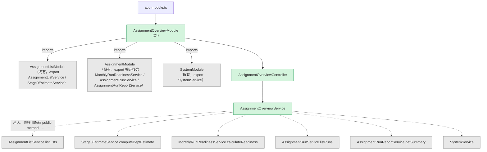
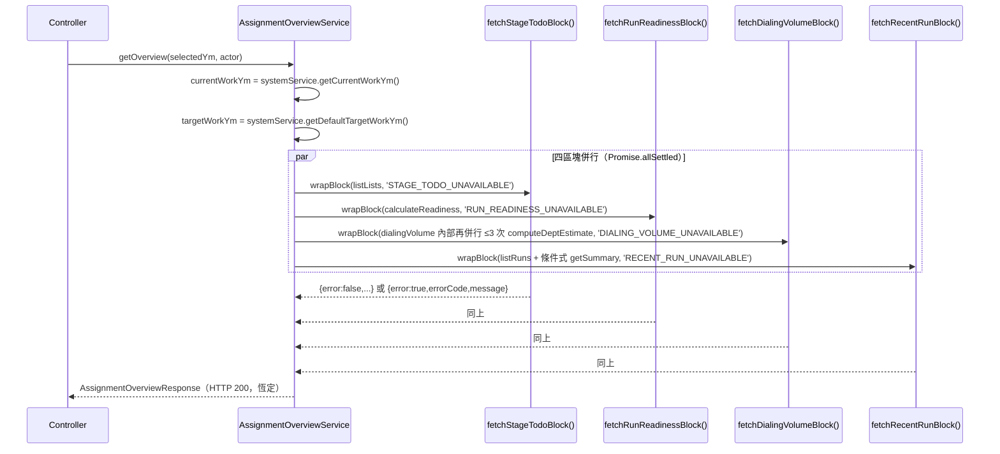

# AD-E07-46：分派總覽儀表板唯讀聚合端點架構設計

## Agent Loading Guide

| Agent 角色 | 需載入章節 |
|-----------|-----------|
| Test Designer | §3.4（區塊獨立失敗策略）+ §3.7（區塊三 dedup / hasActiveLists 裁定）+ §3.8（區塊四空狀態判定）+ §7（不變式）+ §9（測試邊界） |
| TDD Developer | §2（既有契約）+ §3（全部）+ §4（DTO 放置）+ §5（端點契約 sequence）+ §7 + §9 + §10（檔案異動清單） |
| UI/UX Designer | §6（前端架構）+ §4（`AssignmentOverviewResponse` 形狀，供元件綁定） |
| Product Analyst | §11（風險與殘留議題） |

---

## 1. 背景與問題定義

[F111](../features/F111-assignment-overview-dashboard.md)（US-177）要求新增「分派總覽」頁面作為「客戶名單分派」模組新首頁，以單一唯讀聚合端點 `GET /api/v1/assignment/overview?ym=<YYYYMM>` 一次回傳四大區塊資料。Response DTO `AssignmentOverviewResponse`（F111 §5.2）已凍結，四個區塊皆為 discriminated union（`{error:false,...} | {error:true,errorCode,message}`），本 AD **不重議** DTO 欄位形狀，只決定**如何產生**這些欄位。

F111 spec 明確授權四個架構 Open Question 交本 AD 裁定（F111 §12.3）：

| OQ | 問題 |
|----|------|
| OQ-F111-01 | `MonthTotal.hasActiveLists` 精確推導機制 |
| OQ-F111-02 | 聚合 service 落點 + 併行呼叫策略 + headline 3 次 `computeDeptEstimate` 去重機制 |
| OQ-F111-03 | 區塊二 `calculateReadiness(ym)` 是否需要 actor scope 限縮 |
| OQ-F111-04 | 端點是否掛 `FeatureFlagGuard` |

本 AD 之核心架構主張：**本端點是一個純組合層（composition-only layer）**——它不擁有任何資料表、不執行任何 SQL、僅呼叫既有四組服務並將回應重新塑形。這個定位直接決定了模組落點（§3.1）、guard 選擇（§3.3）與效能預期（§8）。

---

## 2. 既有架構基礎（不分叉，不得修改語意）

| 元件 | 檔案 | 角色 |
|---|---|---|
| `AssignmentListService.listLists` | `apps/api/src/modules/assignment-list/assignment-list.service.ts:596` | 名單清單 + `stageCounts`（6 鍵：draft/dept_ratio/personnel_ratio/approval/ready/disabled）+ section_chief scope 過濾（`EXISTS ob_dept_pct`） |
| `MonthlyRunReadinessService.calculateReadiness` | `apps/api/src/modules/assignment/services/monthly-run-readiness.service.ts:99` | 就緒狀態 + ETL 前置 + 計分卡狀態；**不吃 actor 參數**（現況即全域視角） |
| `Stage0EstimateService.computeDeptEstimate` | `apps/api/src/modules/assignment-list/stage0-estimate.service.ts:466` | 部門維度每日估算；已內建 `scope: Stage0DeptScope` + `actor` 參數（`ActorLike`） |
| `AssignmentRunService.listRuns` | `apps/api/src/modules/assignment/services/assignment-run.service.ts:210` | 依 `project_workym` 過濾，依 `created_at DESC` 排序（**非** `finishedAt`） |
| `AssignmentRunReportService.getSummary` | `apps/api/src/modules/assignment/services/assignment-run-report.service.ts:290` | 單一 run 之部門落差 / CARD_LEVEL / TIER 分布；已內建 `actor` 參數，`requireCompletedRun` 對非 completed run 拋例外 |
| `SystemService.getCurrentWorkYm` / `getDefaultTargetWorkYm` | `apps/api/src/modules/system/system.service.ts` | 作業月份收斂（F097） |
| `SectionChiefScopeService` | `apps/api/src/modules/assignment/services/section-chief-scope.service.ts` | `getScopeDeptCode` / `getScopeEmplIds`；已由上述四組服務各自呼叫，本 AD **不直接呼叫** |
| `Stage0EstimateController` | `apps/api/src/modules/assignment-list/stage0-estimate.controller.ts` | 本 AD 之 controller 樣板（class 級 3-guard 組合 + `@RequireDirectorOrSectionChief()`，純讀 method 無 `@RequireDirector()`） |

**關鍵既有事實（決定本 AD 設計）**：

1. **`AssignmentModule` 目前不 export `AssignmentRunService` / `AssignmentRunReportService`**（已查證 `assignment.module.ts:112-124`，`exports` 僅含 `AssignmentRunGuardService` / `MonthlyRunReadinessService` / `StageTransitionService` / `SectionChiefScopeService` / `AssignmentRunPipelineService` / `RunQueueProducer` / `CancellationPoller` / `MssqlQueueService` / `runQueueTuningProvider`）。這是一個**必須修補的 wiring 缺口**（§3.2），否則任何跨模組消費者（含本 AD 新模組）無法注入這兩個服務。
2. **`AssignmentListModule` 與 `AssignmentModule` 現況為互不 import 的手足模組**，各自獨立 `provide` 一份 `SectionChiefScopeService`（無狀態 service，兩份實例並存無害，已是既有先例）。兩者皆已各自 export 所需服務（`AssignmentListModule` export `AssignmentListService` + `Stage0EstimateService`；`AssignmentModule` export 見上）。
3. **`Stage0EstimateController`（純讀端點）不掛 `FeatureFlagGuard`**（已查證，`stage0-estimate.controller.ts` 全檔無 `FeatureFlagGuard` 匯入）；`AssignmentListController` / `AssignmentRunController`（含寫入 method）**才**掛 `FeatureFlagGuard(ENABLE_E07_REFACTOR_PHASE3)`（已查證兩檔皆有匯入）。此為 OQ-F111-04 之直接答案（§3.3）。
4. **`Stage0DeptEstimateResult` 目前無 `hasActiveLists` 或任何等價旗標**（已查證 `stage0-estimate.service.ts` 全檔），但已有 `departments: Stage0Department[]` 欄位——此陣列在函式內部（`stage0-estimate.service.ts:690-717`）**已被「整期 0 件部門隱藏」邏輯過濾**（`keptDeptCodes`，只保留整期 `Σcases>0` 之部門）且**已自然套用 section_chief scope**（`deptCodes` 於 scope 過濾後之 `deptPctRows` 推導，見 `stage0-estimate.service.ts:582-601`）。這是 OQ-F111-01 裁定的關鍵既有事實（§3.7）。
5. **`listLists` 之 `lists[]` 已含 `listNo` / `listNm` / `status` / `stage`**（`assignment-list.service.ts:741-757`），呼叫時傳入 `includeDisabled: true` 可一次取得含 `disabled` 的完整清單，無需二次查詢即可同時滿足區塊一 `hasAnyList`（含 disabled）與 `notReadyLists`（僅 active）兩種不同母體（§3.5）。
6. **`packages/shared/src/index.ts` 為單一扁平檔案**，既有 DTO 一律以 `// F0xx: <功能名>` 註解區塊 append（如 `// F016: Dashboard`、`// F024: Extraction Dashboard`、`// F035: Pipeline Dashboard`），無 per-feature 檔案拆分慣例（§4）。

---

## 3. 核心設計決策

### 3.1 模組落點：新建獨立 `AssignmentOverviewModule`（OQ-F111-02 之一）

**裁定**：新建 `apps/api/src/modules/assignment-overview/`（`AssignmentOverviewModule` + `AssignmentOverviewController` + `AssignmentOverviewService`），**不**塞進 `AssignmentListModule` 或 `AssignmentModule`。



**理由**：

- `AssignmentListModule`（M01 CRUD 邊界）與 `AssignmentModule`（M04/M05 執行 + 就緒邊界）現況為手足模組、互不相依。若將聚合 service 塞進其中一個，該模組就必須反向 import 另一個，這是**目前程式碼庫不存在的耦合方向**，且會讓一個原本邊界清楚的 feature 模組（CRUD 或執行）額外背負「跨模組彙總」這個與其自身職責無關的關注點。
- `AssignmentOverviewService` 之定位是**純組合層**——它不注入任何 `Repository<T>`，只注入四個既有 service。這個「零 repository 依賴」的約束本身就是 BR-1（完全唯讀）/ BR-2（不新增重查詢）最直接的架構層強制手段：程式碼審查時只要看 constructor 注入清單沒有任何 `@InjectRepository`，就能確認本模組沒有繞開既有服務自建查詢。獨立模組使這個約束在檔案邊界上一望即知；塞進既有模組則會讓這個約束淹沒在該模組既有的大量 repository 注入之中。
- 與既有先例一致：`packages/shared/src/index.ts` 已有 `// F016: Dashboard`、`// F024: Extraction Dashboard`、`// F035: Pipeline Dashboard` 三組「彙總視圖」DTO，對應後端亦皆為專屬的 dashboard controller/service（非塞進其資料來源模組），本 AD 之設計與此既有慣例一致。

**Auto-Challenge（是否為 MVP 過度設計）**：新增一個模組（2 個新檔 + 1 個 DTO 檔）是否對「純彙總頁面」而言過重？——不是：本端點存在的唯一理由就是跨模組組合，2 個新檔已是能表達此邊界的最小成本；相對地，把它硬塞進任一既有 feature 模組才是把一個橫切關注點藏進一個原本語意單純的模組之中，是更貴的選項（該模組往後任何人閱讀時都要多想一層「這個 controller/service 跟這個模組的其他東西什麼關係」）。

### 3.2 Wiring 缺口修補：`AssignmentModule` exports 擴充（前置條件）

`AssignmentOverviewModule` 需要注入 `AssignmentRunService` 與 `AssignmentRunReportService`，但兩者目前未列在 `AssignmentModule` 的 `exports`（§2 事實 1）。此為**本 AD 的前置修改**，非本 AD 範圍外：

```typescript
// apps/api/src/modules/assignment/assignment.module.ts
@Module({
  // ... imports / controllers / providers 不變 ...
  exports: [
    AssignmentRunGuardService,
    MonthlyRunReadinessService,
    StageTransitionService,
    SectionChiefScopeService,
    AssignmentRunPipelineService,
    RunQueueProducer,
    CancellationPoller,
    MssqlQueueService,
    runQueueTuningProvider,
    // AD-E07-46：F111 分派總覽聚合端點需要注入這兩個既有 service。
    AssignmentRunService,
    AssignmentRunReportService,
  ],
})
export class AssignmentModule {}
```

此變更**只新增 exports 陣列項目**，不改變 `providers` / `imports` / 既有行為，零風險破壞 `AssignmentRunController` 既有測試。

### 3.3 Controller 契約：guard / decorator / query DTO（OQ-F111-04 裁定）

**裁定**：完全比照 `Stage0EstimateController` 之 class 級 guard 組合，**不掛 `FeatureFlagGuard`**。

```typescript
// apps/api/src/modules/assignment-overview/assignment-overview.controller.ts
@Controller('assignment')
@UseGuards(AuthGuard, DirectorOrSectionChiefGuard, DirectorGuard)
@RequireDirectorOrSectionChief()
export class AssignmentOverviewController {
  constructor(
    private readonly service: AssignmentOverviewService,
    private readonly systemService: SystemService,
  ) {}

  @Get('overview')
  async getOverview(
    @Request() req: { user?: ActorLike | null },
    @Query() query: OverviewQueryDto,
  ): Promise<AssignmentOverviewResponse> {
    const selectedYm = query.ym ?? this.systemService.getCurrentWorkYm();
    return this.service.getOverview(selectedYm, req.user ?? null);
  }
}
```

```typescript
// apps/api/src/modules/assignment-overview/dto/overview-query.dto.ts
import { IsOptional, IsString, Matches } from 'class-validator';

export class OverviewQueryDto {
  @IsOptional()
  @IsString()
  @Matches(/^\d{6}$/, { message: 'INVALID_YM_FORMAT' })
  ym?: string;
}
```

**理由（OQ-F111-04 裁定：無 `FeatureFlagGuard`）**：`FeatureFlagGuard(ENABLE_E07_REFACTOR_PHASE3)` 在既有程式碼庫中的掛載對象**一律是寫入端點**（`AssignmentListController` 的 create/update method、`AssignmentRunController` 的觸發 method）；`Stage0EstimateController` 三個既有 GET 端點（含處長可存取之 `dept-estimate`）皆未掛此 guard。`GET /assignment/overview` 是純讀端點（BR-1），與 `Stage0EstimateController` 屬同一類別（讀取既有已上線之聚合資料，非「Phase 3 重構中、尚待逐步開放」之寫入功能），依既有慣例不應掛 `FeatureFlagGuard`。

`ym` 格式驗證沿用既有 `ListListsQueryDto` 之 `@Matches(/^\d{6}$/, {message:'INVALID_YM_FORMAT'})` 慣例（`list-lists-query.dto.ts:16`），錯誤訊息由全域 `ValidationPipe` 轉換為既有 400 `VALIDATION_ERROR`（F111 §5.4，無新錯誤碼）。

### 3.4 區塊獨立失敗策略（AC-15 / BR-9）

**裁定**：`getOverview` 對四個區塊各自呼叫一個**永不 reject**（內部自行 try/catch）的 wrapper 函式，再以 `Promise.allSettled` 併行執行（defense-in-depth：即使 wrapper 內部邏輯有未預期的例外漏網，`allSettled` 仍保證不會使整個請求失敗）。



**`wrapBlock` 契約**：

```typescript
// apps/api/src/modules/assignment-overview/assignment-overview.util.ts
type OverviewBlock<T> = ({ error: false } & T) | OverviewBlockError;

async function wrapBlock<T>(
  fn: () => Promise<T>,
  errorCode: OverviewBlockError['errorCode'],
  logger: Logger,
): Promise<OverviewBlock<T>> {
  try {
    const data = await fn();
    return { error: false, ...data };
  } catch (e) {
    logger.error(`[AssignmentOverview] ${errorCode}: ${(e as Error).message}`, (e as Error).stack);
    return {
      error: true,
      errorCode,
      message: '本區塊資料暫時無法取得，請稍後重試。',
    };
  }
}
```

`getOverview` 呼叫四次 `wrapBlock`，以 `Promise.allSettled` 包裹（因 `wrapBlock` 自身不 reject，`allSettled` 每個 entry 恆為 `status:'fulfilled'`；仍選用 `allSettled` 而非 `Promise.all` 是刻意的防禦性寫法——若未來任何一個 wrapper 實作被改動而不慎讓例外逃逸，`allSettled` 仍不會讓整個端點 500，只是該 entry 的 `status` 會是 `'rejected'`，此時額外補一層 fallback 映射為通用錯誤區塊，見下方程式碼）：

```typescript
async getOverview(selectedYm: string, actor: ActorLike | null): Promise<AssignmentOverviewResponse> {
  const currentWorkYm = this.systemService.getCurrentWorkYm();
  const targetWorkYm = this.systemService.getDefaultTargetWorkYm();
  const scope = this.resolveScope(actor); // §3.9，純函式，不呼叫任何 service

  const [stageTodo, runReadiness, dialingVolume, recentRun] = await Promise.allSettled([
    wrapBlock(() => this.fetchStageTodoBlock(selectedYm, actor), 'STAGE_TODO_UNAVAILABLE', this.logger),
    wrapBlock(() => this.fetchRunReadinessBlock(selectedYm, scope), 'RUN_READINESS_UNAVAILABLE', this.logger),
    wrapBlock(() => this.fetchDialingVolumeBlock(selectedYm, currentWorkYm, targetWorkYm, actor, scope), 'DIALING_VOLUME_UNAVAILABLE', this.logger),
    wrapBlock(() => this.fetchRecentRunBlock(selectedYm, actor), 'RECENT_RUN_UNAVAILABLE', this.logger),
  ]).then((results) => results.map((r, i) => (r.status === 'fulfilled' ? r.value : FALLBACK_ERROR_BLOCKS[i])));

  return { selectedYm, currentWorkYm, targetWorkYm, scope, stageTodo, runReadiness, dialingVolume, recentRun };
}
```

（`FALLBACK_ERROR_BLOCKS[i]` 為對應 4 個 `errorCode` 之靜態常數陣列，僅在 `wrapBlock` 本身邏輯錯誤導致 reject 時才會被用到，正常路徑不會觸發。）

**區塊邊界為「整塊」而非「子呼叫」granularity**：區塊三內部最多呼叫 3 次 `computeDeptEstimate`（§3.7），區塊四內部呼叫 `listRuns` + 條件式 `getSummary`（§3.8）——這些內部子呼叫**共用同一個 try/catch 邊界**（即 `fetchDialingVolumeBlock` / `fetchRecentRunBlock` 函式本體），任一子呼叫失敗即讓整個區塊回 `{error:true}`，不做「部分子呼叫成功、部分失敗」的欄位級降級（DTO 本身也不支援這種粒度——`OverviewBlock<T>` 是區塊級 all-or-nothing 的判別聯集）。這與任務描述「~6 個子來源」的計數對應如下：4 個 DTO 區塊 ↔ 最多 7 個底層 service 呼叫（區塊一 1 次 + 區塊二 1 次 + 區塊三至多 3 次 + 區塊四至多 2 次），但**對外只暴露 4 個獨立失敗單元**，這是刻意的簡化（若要做到子呼叫級的部分降級，DTO 需要更複雜的巢狀 error 結構，且業務上「dialingVolume 三個月份中only次月失敗」對使用者而言仍是「這個區塊有問題」，細分沒有實質 UX 價值）。

**Guard 例外不受本機制影響（I-OVW-GUARD-PROPAGATE-01）**：`AuthGuard` / `DirectorOrSectionChiefGuard` / `DirectorGuard` 在 Nest 的請求生命週期中於 controller method **執行前**運作（guard 階段），本節之 `wrapBlock` 邊界只包覆 controller method **內部**（`service.getOverview` 之後）的邏輯。403 `E07_ROLE_NOT_ASSIGNED` / 401 token 相關例外由 guard 直接拋出，Nest exception filter 正常轉換為 HTTP 錯誤回應，**不會**進入 `getOverview`、更不會被任何 `wrapBlock` 捕捉。兩者是正交的管線階段，無需額外程式碼保證此行為——這是 Nest guard 機制本身的既有語意，只需在測試中對此邊界做 regression guard（§9）即可。

**錯誤來源 → `errorCode` 對照表**：

| 失敗來源 | `errorCode` |
|---|---|
| `AssignmentListService.listLists` 拋例外 | `STAGE_TODO_UNAVAILABLE` |
| `MonthlyRunReadinessService.calculateReadiness` 拋例外 | `RUN_READINESS_UNAVAILABLE` |
| 任一次 `Stage0EstimateService.computeDeptEstimate`（headline 或 selected）拋例外 | `DIALING_VOLUME_UNAVAILABLE` |
| `AssignmentRunService.listRuns` 或 `AssignmentRunReportService.getSummary` 拋例外 | `RECENT_RUN_UNAVAILABLE` |

**空狀態 ≠ 錯誤狀態（重要區分，避免下游誤植）**：`{error:true}` 只在底層呼叫**拋出例外**時產生；「查無資料」（如 `hasAnyList=false`、`hasCompletedRun=false`）是底層呼叫**成功回傳**後由業務邏輯判定的合法空值，走 `{error:false,...}` 路徑。這兩類狀態在程式碼中是完全不同的分支（前者在 `catch` 區塊、後者在 `try` 區塊的正常回傳值中），tdd-implementation 落地時**不得**將「查無 completed run」誤實作為 throw 後被 `wrapBlock` 捕捉（那會把 BR-8 的合法空狀態誤標為 `RECENT_RUN_UNAVAILABLE` 錯誤）。

### 3.5 區塊一組裝：`StageTodoBlock`

```typescript
private async fetchStageTodoBlock(ym: string, actor: ActorLike | null): Promise<StageTodoBlock> {
  const { lists, stageCounts } = await this.listService.listLists({
    ym,
    includeDisabled: true, // hasAnyList 定義含 disabled（F111 §5.2.1）
    actor: actor as any,
  });
  const notReadyLists = lists
    .filter((l: any) => l.status === 'active' && l.stage !== 'ready')
    .map((l: any) => ({ listNo: l.listNo, listNm: l.listNm, stage: l.stage }));
  return {
    stageCounts: stageCounts as StageTodoBlock['stageCounts'],
    notReadyLists,
    notReadyCount: notReadyLists.length,
    hasAnyList: lists.length > 0,
  };
}
```

`listLists` 一次呼叫即同時滿足兩種不同母體（`hasAnyList` 含 disabled；`notReadyLists` 僅 active）：因為 `includeDisabled:true` 已把所有列（含 disabled）撈進 `lists[]`，`stageCounts.disabled` 也隨之正確填值（§2 事實 5）；`notReadyLists` 在記憶體中以 `status==='active'` 二次過濾，零額外查詢。`stageCounts` 之 6 個鍵（`draft`/`dept_ratio`/`personnel_ratio`/`approval`/`ready`/`disabled`）與凍結 DTO 完全同形，直接 cast 傳遞。

Section_chief scope 由 `listLists` 內部既有 `EXISTS ob_dept_pct` 過濾自動生效（§2 事實 1），`AssignmentOverviewService` 僅透傳 `actor`，不重新實作過濾邏輯（I-OVW-SCOPE-PASSTHROUGH-01）。

### 3.6 區塊二組裝：`RunReadinessBlock`（OQ-F111-03 裁定）

**裁定**：`calculateReadiness(ym)` **維持現況不吃 actor**，處長視角下區塊二**不做**額外的 dept scope 限縮（回應對處長與部長回傳相同內容，僅 `canNavigateToTrigger` 依 `scope.role` 差異化）。

```typescript
private async fetchRunReadinessBlock(ym: string, scope: OverviewScope): Promise<RunReadinessBlock> {
  const r = await this.readinessService.calculateReadiness(ym);
  return {
    totalActiveLists: r.totalActiveLists,
    readyCount: r.readyCount,
    allReady: r.allReady,
    notReadyLists: r.notReadyLists,
    monthlyRunStatus: r.monthlyRunStatus,
    scoringActive: r.scoringActive,
    etlStatus: r.etlStatus,
    sourcesAllHaveData: r.sourcesAllHaveData,
    emptySourceTables: r.emptySourceTables,
    canNavigateToTrigger: scope.role !== 'section_chief', // AC-8：director/admin=true
  };
}
```

**理由**：

- `totalActiveLists` / `readyCount` / `notReadyLists` 反映**是否可以觸發本月月名單分派**這個全域營運事實——月名單分派一旦觸發即對全公司所有部門執行，「本月是否所有名單都 ready」不是一個可以被部門切割的問題（即使處長只看得到自己部門的名單定義頁，「能不能觸發」仍是全月維度的是非題）。
- `etlStatus` / `scoringActive` 是 ETL pipeline 與計分卡版本的全域狀態，物理上與部門無關（同一份 `ob_pool_data` / `ob_levelcard_version` 服務全公司）。
- `monthlyRunStatus` 反映 `assignment_run` 表當月最新一筆執行狀態，執行本身是全域事件。
- **`canNavigateToTrigger` 是本區塊唯一的角色差異化欄位**，且它不需要 `calculateReadiness` 內部支援 scope——純粹依 `scope.role`（已由 §3.9 算出）判定，零額外邏輯。
- **Auto-Challenge（是否應該收斂 `notReadyLists` 至處長轄區）**：F111 spec 本身在 §5.2.2 註解中已標註此為「非本 spec 硬性要求」的開放彈性，且若要做，需要幫 `calculateReadiness` 新增 `actor` 參數並改動其既有 SQL（違反 §2「不分叉既有服務」的既定分工，且會使 `calculateReadiness` 對其他呼叫端——如觸發頁 pre-check——之既有無 scope 行為產生分歧，需要額外重載或旗標）。裁定為**不改動 `calculateReadiness` 簽名**，維持全月視角，風險可控（處長看到全公司的「未就緒清單」列表，比起看不到任何未就緒清單、誤以為全部就緒，資訊過多好過資訊過少或誤導）。此為需與業務確認的殘留議題（§11）。

### 3.7 區塊三組裝：`DialingVolumeBlock`（OQ-F111-01 + OQ-F111-02 之核心）

#### 3.7.1 去重機制（I-OVW-DEDUP-01）

`currentWorkYm` 與 `targetWorkYm` 因 `getDefaultTargetWorkYm = current + 1` 恆不相等；但 `selectedYm` 可能等於兩者之一（或為第三個相異月份）。裁定：以 `Map<string, Promise<Stage0DeptEstimateResult>>` 對唯一 `ym` 集合去重後併發呼叫：

```typescript
private async fetchDialingVolumeBlock(
  selectedYm: string,
  currentWorkYm: string,
  targetWorkYm: string,
  actor: ActorLike | null,
  scope: OverviewScope,
): Promise<DialingVolumeBlock> {
  const uniqueYms = Array.from(new Set([currentWorkYm, targetWorkYm, selectedYm]));
  const resultByYm = new Map<string, Stage0DeptEstimateResult>();
  await Promise.all(
    uniqueYms.map(async (ym) => {
      resultByYm.set(ym, await this.stage0Service.computeDeptEstimate(ym, { actor }));
    }),
  );

  const toMonthTotal = (ym: string): MonthTotal => {
    const r = resultByYm.get(ym)!;
    const hasActiveLists = r.departments.length > 0; // §3.7.2
    return {
      ym,
      total: hasActiveLists ? sumWorkdayCases(r) : null,
      hasActiveLists,
      scopedToDept: scope.scoped,
    };
  };

  const selected = resultByYm.get(selectedYm)!;
  return {
    headline: { currentMonth: toMonthTotal(currentWorkYm), nextMonth: toMonthTotal(targetWorkYm) },
    selected: {
      ym: selected.ym,
      mode: selected.mode,
      calendarSource: selected.calendarSource,
      startDate: selected.startDate,
      endDate: selected.endDate,
      departments: selected.departments,
      days: selected.days,
      threshold: selected.threshold,
      deptDistribution: deriveDeptDistribution(selected), // §3.7.3
      warnings: selected.warnings,
      poolCount: selected.poolCount,
      poolWarning: selected.poolWarning,
    },
  };
}
```

`computeDeptEstimate` 每個唯一 `ym` **恰好呼叫一次**（`Promise.all` 併行，`uniqueYms.length` ∈ {2,3}），`selectedYm===currentWorkYm` 或 `selectedYm===targetWorkYm` 時三個消費點（`headline.currentMonth` / `headline.nextMonth` / `selected`）之間自然共用同一份結果物件，不需要額外的「是否相等」if/else 分支——`Set` 去重 + `Map` 查表本身就是最簡潔的去重實作，較「先判斷 selectedYm===currentWorkYm 再決定要不要重打」的顯式分支更不易出錯（不會漏判 `selectedYm===targetWorkYm` 這個對稱情境）。

#### 3.7.2 `hasActiveLists` 推導（OQ-F111-01 裁定）

**裁定**：`hasActiveLists = result.departments.length > 0`，**完全不修改 `Stage0EstimateService` / `Stage0DeptEstimateResult`**，純粹在聚合層讀取既有回應欄位。

**理由（Auto-Challenge：這是否違背 OQ-F111-01 原文字面「≥1 active 名單」的字面意思）**：

- F111 spec OQ-F111-01 之建議預設措辭是「由 `computeDeptEstimate` 暴露 active-list 存在旗標」，但 AC-9 之驗收語言是「若其中一個月份**查無任何 active 名單或估算資料**」——`或估算資料`（OR estimate data）這個子句才是真正的行為權威來源，字面上就涵蓋了「有 active 名單，但因尚未設定部門比例、算不出任何估算資料」這個情境。
- `departments[]`（`Stage0DeptEstimateResult` 既有欄位）已經是「該月（依 scope）整期至少有 1 件案量的部門」清單——它的空集合精確對應「這個月沒有任何可展示的撥打量預估」，無論根因是（a）本月完全沒有 active 名單，或（b）本月有 active 名單但尚未設定 `ob_dept_pct` 比例（此時 `deptCells` 對所有部門恆為 0，`keptDeptCodes` 為空）。這兩種根因在 AC-9 的 UX 意圖下應該得到**相同**的處理（顯示「—」而非誤導性的 0），因為兩者對使用者而言都是「這個月看不出有意義的撥打量」。
- 相較於新增一個獨立旗標（如在 `computeDeptEstimate` 內部另計 `lists.length>0` 並放進回應），重用既有 `departments` 欄位：(a) **零修改** `Stage0EstimateService`（該服務另有 Stage 0 試算頁這個既有消費者，任何改動都要重新過一次該頁既有測試，重用既有欄位完全不觸碰其契約）；(b) **天然套用 scope**（`departments` 本身已依 `deptCodes` 之 scope 過濾結果推導，不需要聚合層另外判斷 `isSectionChief`）；(c) **零額外查詢**，滿足 BR-2。
- **殘留邊界情境**（列入 §11 風險）：若本月有 active 名單、`ob_dept_pct` 也已設定比例，但因**所有**部門整期估算捨入後皆為 0（理論上需要極端小的比例值），`departments` 會意外為空，`hasActiveLists` 因而誤判為 `false`。此情境機率極低（需要所有部門比例同時接近 0）且後果溫和（顯示「—」而非「0」，仍是保守、不誤導的方向），不視為阻擋項。

#### 3.7.3 `deptDistribution` 衍生彙總

**裁定**：`deptDistribution` 作為 F111 專屬的 view-projection，由 `AssignmentOverviewService`（`assignment-overview.util.ts` 之純函式）在既有 `selected.days[].deptCells` 上彙總計算，**不**加入 `Stage0DeptEstimateResult` 契約本身（理由與 §3.7.2 相同：`Stage0DeptEstimateResult` 是 Stage 0 試算頁與本端點的共用契約，`deptDistribution` 只有本端點需要，不應該讓另一個既有消費者的回應形狀因為本端點而膨脹）。

```typescript
// apps/api/src/modules/assignment-overview/assignment-overview.util.ts
export function sumWorkdayCases(r: Stage0DeptEstimateResult): number {
  let total = 0;
  for (const day of r.days) {
    if (!day.isWorkday) continue;
    for (const cell of day.deptCells) total += cell.cases;
  }
  return total;
}

export function deriveDeptDistribution(r: Stage0DeptEstimateResult): DeptDistributionItem[] {
  const totals = new Map<string, number>();
  for (const day of r.days) {
    if (!day.isWorkday) continue;
    for (const cell of day.deptCells) {
      totals.set(cell.deptCode, (totals.get(cell.deptCode) ?? 0) + cell.cases);
    }
  }
  const grandTotal = Array.from(totals.values()).reduce((a, b) => a + b, 0);
  const nameByCode = new Map(r.departments.map((d) => [d.deptCode, d.deptName]));
  return r.departments.map((d) => {
    const totalCases = totals.get(d.deptCode) ?? 0;
    return {
      deptCode: d.deptCode,
      deptName: nameByCode.get(d.deptCode) ?? d.deptCode,
      totalCases,
      ratio: r.scope.scoped ? null : (grandTotal > 0 ? Math.round((totalCases / grandTotal) * 1000) / 10 : 0),
    };
  });
}
```

`ratio` 在 scoped（section_chief）模式下恆為 `null`（AC-2「組織級加總 / 缺口 / 佔比在處長視角為 null」），直接讀取 `r.scope.scoped`（`computeDeptEstimate` 既有回應欄位）判定，聚合層不需要另外持有一份 `isSectionChief` 判斷邏輯（I-OVW-SCOPE-PASSTHROUGH-01）。

### 3.8 區塊四組裝：`RecentRunBlock`（BR-5 / BR-8）

```typescript
private async fetchRecentRunBlock(ym: string, actor: ActorLike | null): Promise<RecentRunBlock> {
  const runs = await this.runService.listRuns({ ym }); // created_at DESC
  const completed = runs
    .filter((r) => r.status === 'completed')
    .sort((a, b) => {
      const at = a.finishedAt ?? a.triggeredAt;
      const bt = b.finishedAt ?? b.triggeredAt;
      return bt.getTime() - at.getTime(); // finishedAt desc、缺值退回 triggeredAt（BR-5）
    });

  if (completed.length === 0) {
    // BR-8 兩態：noRun（runs 全空）vs noCompletedRun（有 run 但無 completed）
    return runs.length === 0
      ? { hasCompletedRun: false, emptyReason: 'noRun', latestRunStatus: null, latestRunId: null }
      : {
          hasCompletedRun: false,
          emptyReason: 'noCompletedRun',
          latestRunStatus: runs[0].status as 'failed' | 'running' | 'pending',
          latestRunId: runs[0].runId,
        };
  }

  const latest = completed[0];
  const summary = await this.reportService.getSummary(latest.runId, actor as any);
  return {
    hasCompletedRun: true,
    runId: summary.runId,
    projectWorkym: summary.projectWorkym,
    finishedAt: summary.finishedAt ? summary.finishedAt.toISOString() : null,
    totalCases: summary.totalCases,
    coverageRate: summary.coverageRate,
    emplCount: summary.emplCount,
    deptSummary: summary.deptSummary,
    levelDistribution: summary.levelDistribution,
    tierDistribution: summary.tierDistribution,
  };
}
```

`listRuns({ym})` 本身已依 `created_at DESC` 排序（§2 事實），故 `runs[0]`（未過濾 completed 前之首筆）即為「該月最新一筆 run（不分狀態）」，直接可用作 `noCompletedRun` 情境之 `latestRunStatus` / `latestRunId` 來源，無需另外查詢。`deptSummary` 之 section_chief scope 由 `getSummary(runId, actor)` 既有實作（F063 AC-5）自動套用（I-OVW-SCOPE-PASSTHROUGH-01）。

### 3.9 Scope 回顯（`OverviewScope`）

`scope` 為頂層欄位、四個區塊共用之角色/轄區回顯，由**純函式**（無 I/O）於 `getOverview` 開頭算出，供 §3.6/§3.7 各區塊讀取（避免每個區塊各自判斷一次 `actor.businessRole`）：

```typescript
private resolveScope(actor: ActorLike | null): OverviewScope {
  const role: OverviewScope['role'] =
    actor?.role === 'admin' ? 'admin' : actor?.businessRole === 'section_chief' ? 'section_chief' : 'director';
  return { role, deptCode: null, scoped: role === 'section_chief' };
}
```

> `deptCode` 刻意留 `null`：處長的實際轄區代號由 `computeDeptEstimate` 內部（`scope.deptCode`）解析（需要非同步查 `ob_emphire`），本頂層 `scope` 只負責角色分類的同步判定；`AssignmentOverviewService` 若要在 response 頂層 `scope.deptCode` 回顯真實代號，可在 `fetchDialingVolumeBlock` 完成後，從 `resultByYm` 任一筆結果的 `.scope.deptCode` 回填（該欄位已經是 `computeDeptEstimate` 算好的值，零額外查詢）。tdd-implementation 落地時應確認此欄位確實有回填（見 §10 checklist），否則處長視角下前端「轄區檢視」徽章會顯示不出部門名稱。

---

## 4. DTO 契約與放置位置

`AssignmentOverviewResponse` 與其所有巢狀 interface（`OverviewBlockError` / `OverviewBlock<T>` / `OverviewScope` / `StageTodoBlock` / `NotReadyListItem` / `RunReadinessBlock` / `EtlSourceStatus` / `DialingVolumeBlock` / `MonthTotal` / `DeptEstimateProjection` / `DialingDay` / `DeptDistributionItem` / `RecentRunBlock` / `RecentRunPresent` / `RecentRunEmpty`）依 F111 §5.2 之逐字定義，**append** 至 `packages/shared/src/index.ts`（單一扁平檔案慣例，§2 事實 6），以 `// F111: Assignment Overview Dashboard` 註解區塊標示，緊接在既有 dashboard 類 DTO 群組（`// F035: Pipeline Dashboard` 之後）之後。

後端 `AssignmentOverviewController` 之回傳型別、前端 `assignment-overview.ts` API module 之回應型別，**皆從 `@cdmp/shared` import 同一份 interface**（沿用 `DashboardResponse` / `EtlDashboardStatsResponse` 等既有 DTO 之跨端共用慣例），不在 `apps/api` 或 `apps/web` 各自重複宣告。

---

## 5. 端點契約總覽

| 屬性 | 值 |
|---|---|
| Method / Path | `GET /api/v1/assignment/overview` |
| Guard | `AuthGuard` + `DirectorOrSectionChiefGuard` + `DirectorGuard`（class 級）+ `@RequireDirectorOrSectionChief()`；**無** `FeatureFlagGuard`、**無** `@RequireDirector()` |
| Query | `ym?: string`（`OverviewQueryDto`，`@Matches(/^\d{6}$/)`，缺省 = `SystemService.getCurrentWorkYm()`） |
| 回應 | `AssignmentOverviewResponse`（HTTP 200 恆定，除非 guard 層 401/403 或 DTO 驗證 400） |
| 寫入 | 無（I-OVW-NO-WRITE-01：`AssignmentOverviewService` 全部呼叫皆為既有服務之唯讀 method——`listLists`/`calculateReadiness`/`computeDeptEstimate`/`listRuns`/`getSummary` 五者皆不寫入） |

---

## 6. 前端架構（brief；元件實作交 tdd-implementation / ui-ux-designer）

- **路由**：`/assignment/overview` 新增於 `App.tsx` 既有 `AssignmentWorkYmProvider` layout route 區塊內（`App.tsx:208-251`，與 `list-definitions` / `ready-summary` / `estimate` / `run` 同層），共用「分派作業月份」狀態（預設 `target_work_ym`，F111 AC-3）。Guard 沿用既有 `DirectorOrSectionChiefRoute`（與 `field-base` / `list-definitions` 等既有頁面同一元件）。
- **query key**：TanStack Query `['assignment', 'overview', ym]`（單一端點、單一 key，四區塊共用同一次 fetch 結果，不需四個獨立 query）。
- **API module**：`apps/web/src/api/assignment-overview.ts`，回應型別 `import type { AssignmentOverviewResponse } from '@cdmp/shared'`。
- **頁面**：`apps/web/src/pages/assignment/assignment-overview-page.tsx`，四個子區塊元件各自讀取 `response.stageTodo` / `.runReadiness` / `.dialingVolume` / `.recentRun`，各自依 `error` 欄位分流 loading（query 本身 pending）/ error（`block.error===true`）/ 內容三態（AC-15），元件邊界對齊 DTO 邊界，不需要四個獨立 API 請求即可達成「四區塊各自獨立顯示狀態」的使用者感知（F111 spec 已明確此為架構自由度，見 F111 技術備註）。
- **圖表**：recharts（沿用 F049 Stage 0 試算頁 / F056 既有慣例），每日撥打量圖表資料源 `dialingVolume.selected.days[]`。
- **Sidebar**：`app-sidebar.tsx` 「客戶名單分派」群組 `items[]` 陣列首位插入「分派總覽」（`to:'/assignment/overview'`，`requires:'director_or_section_chief'`，建議 icon `LayoutDashboard`），現有「篩選欄位」（`field-base`）等既有 7 項**相對順序不變**，整體順序變為：分派總覽 → 篩選欄位 → 計分卡設定 → 名單定義 → 準備完成摘要 → Stage 0 試算 → 觸發月名單分派 → 執行歷史（對齊 F111 BR-13）。

---

## 7. 不變式（Invariants）

| ID | 說明 |
|---|---|
| **I-OVW-COMPOSE-ONLY-01** | `AssignmentOverviewService` 建構子**不得**注入任何 `Repository<T>` / `DataSource`；一律只呼叫既有四組 service 之 public method。任何需要新 SQL 的需求視為超出本 AD 範圍，須另開 spec |
| **I-OVW-BLOCK-ISOLATE-01** | 四個區塊各自的 fetch 函式（`fetchStageTodoBlock` / `fetchRunReadinessBlock` / `fetchDialingVolumeBlock` / `fetchRecentRunBlock`）之間**不得**共享會相互影響失敗結果的狀態；任一函式拋出的例外只影響該函式對應的單一區塊，端點整體恆回 HTTP 200（guard 層例外除外，見 I-OVW-GUARD-PROPAGATE-01） |
| **I-OVW-GUARD-PROPAGATE-01** | Guard 管線（`AuthGuard`/`DirectorOrSectionChiefGuard`/`DirectorGuard`）之例外（401/403）發生於 controller method 執行前，**不得**被任何區塊級 `wrapBlock` 捕捉或轉換；此類例外一律以既有 Nest exception filter 機制正常傳播為 HTTP 錯誤回應 |
| **I-OVW-DEDUP-01** | 單次請求內，`Stage0EstimateService.computeDeptEstimate` 針對每個相異 `ym`（`currentWorkYm`/`targetWorkYm`/`selectedYm` 去重後）**至多呼叫一次** |
| **I-OVW-EMPTY-NEQ-ZERO-01** | `hasAnyList` / `hasActiveLists` / `hasCompletedRun` 為 `false` 時，對應數值欄位（`total`/`stageCounts` 之聚合值等）**不得**以 `0` 表達「無資料」；`hasActiveLists=false ⇒ MonthTotal.total` 恆為 `null`（非 `0`） |
| **I-OVW-SCOPE-PASSTHROUGH-01** | `AssignmentOverviewService` 僅將 `actor` 透傳給已支援 scope 的既有服務（`listLists`/`computeDeptEstimate`/`getSummary`），**不得**在聚合層自行實作任何 `deptCode` 比對 / 資料列過濾邏輯；`readonly` 衍生欄位（如 `deptDistribution.ratio`）之 scope 判定一律讀取下游服務已回傳的 `scope.scoped` 欄位，不重新推導 `isSectionChief` |
| **I-OVW-NO-WRITE-01** | `AssignmentOverviewService` 呼叫之既有服務 method 一律為唯讀（`listLists`/`calculateReadiness`/`computeDeptEstimate`/`listRuns`/`getSummary`）；不得呼叫任何 create/update/delete 語意之既有 method（如 `createList`/`updateList`/`triggerRun`） |

---

## 8. 效能備註

最壞情境下單次請求觸發：`listLists`×1 + `calculateReadiness`×1 + `computeDeptEstimate`×2~3（§3.7.1 去重後）+ `listRuns`×1 + `getSummary`×0~1（僅選定月份存在 completed run 時）。

- `computeDeptEstimate` 為 F049 之 in-memory 部門投影（建於物化欄位 `ob_list_definition.stage0_estimate_count` 之上，非對 `ob_pool_data` 全表即時計分——與 AD-E07-45 所解決的「即時計分」瓶頸是完全不同的呼叫路徑），單次呼叫成本可控；本端點在最壞情境下呼叫至多 3 次，成本線性疊加但仍屬「輕量投影」等級，非本 AD 預期的效能瓶頸來源。
- `getSummary` 已是 F063 效能修復後之版本（SQL `GROUP BY` 下推，非讀取巨大 JSON snapshot blob）——`project_monthly_run_inprocess_execution` / `summary_endpoint_load_snapshot_slow_mssql` 兩個既有事故（讀取 115K 筆 JSON blob 導致 ~45s 逾時）已在該服務內部修復，本端點重用的正是修復後的版本，不會重現該瓶頸。
- 四區塊以 `Promise.allSettled` 併行執行（§3.4），端點總延遲 ≈ max(四區塊各自耗時)，而非四者相加；區塊三內部 2~3 次 `computeDeptEstimate` 亦以 `Promise.all` 併行（§3.7.1）。
- **v1 不引入任何快取**（sessionless、per-request 全部重新查詢）：與 AD-E07-45 §3.4.1 之「不保留伺服器端跨請求快取」裁定一致的理由（單一 process 記憶體快取無跨 instance 一致性、無主動失效機制）；本端點呼叫頻率預期遠低於 F055/F056 之互動式門檻編輯情境（使用者進入總覽頁 / 切換月份才觸發，非逐欄位編輯），快取的邊際效益更低，不值得引入。若未來實測發現效能瓶頸，優化方向應先檢視是否為 `computeDeptEstimate` 本身（F049 既有服務）之既有效能特性，而非本端點之聚合邏輯。

---

## 9. 測試邊界建議（交 test-designer）

- **區塊獨立失敗**（AC-15/TC-177-12）：對 `fetchDialingVolumeBlock`（或其呼叫之 `computeDeptEstimate`）mock 拋出例外，斷言：(a) HTTP 仍 200，(b) `dialingVolume.error===true` 且 `errorCode==='DIALING_VOLUME_UNAVAILABLE'`，(c) 其餘三區塊 `error===false` 且資料完整。
- **Guard 例外不受影響 regression guard**（I-OVW-GUARD-PROPAGATE-01）：`role='user'` 呼叫端點，斷言回應為 403 `E07_ROLE_NOT_ASSIGNED`（HTTP body 非 `AssignmentOverviewResponse` 形狀），而非「200 + 四區塊皆 error」——這是本 AD 特別容易被誤實作之處（若把 guard 判斷也塞進 `wrapBlock` 邊界內就會產生此 bug），建議明確寫一支測試斷言 HTTP status。
- **去重 regression guard**（I-OVW-DEDUP-01）：`selectedYm === currentWorkYm` 情境下 spy `Stage0EstimateService.computeDeptEstimate`，斷言呼叫次數為 2（非 3）；`selectedYm` 為第三個相異月份時斷言呼叫次數為 3。
- **`hasActiveLists` 邊界**（§3.7.2）：(a) 完全無 active 名單 → `departments=[]` → `hasActiveLists=false`／`total=null`；(b) 有 active 名單但無 `ob_dept_pct` 設定 → 同樣 `departments=[]` → `hasActiveLists=false`（驗證此為刻意行為，非 bug）；(c) 有 active 名單且已設定比例 → `departments.length>0` → `hasActiveLists=true`。
- **BR-8 兩態空狀態**（TC-177-11）：分別 mock `listRuns` 回傳空陣列（→ `emptyReason='noRun'`）與回傳僅 `failed`/`running`/`pending` 狀態（→ `emptyReason='noCompletedRun'` + 對應 `latestRunStatus`）。
- **空狀態 vs 錯誤狀態不得混淆**（§3.4 末段）：`hasCompletedRun=false` 情境下斷言 `recentRun.error===false`（非 `true`）——這是驗證「合法空值」與「例外捕捉」兩條分支未被誤合併的關鍵測試。
- **PG-only 邊界**：本端點本身不含任何新 SQL，四個底層服務各自既有的 PG/SQLite 測試邊界（`computeDeptEstimate` 的 F109 customer_core 依賴、`getSummary` 的 SQL 聚合等）維持既有邊界不變，本 AD 不新增 PG-only 測試需求；聚合層測試（`assignment-overview.service.spec.ts`）可全數以 mock service 進行，不需要真實 DB 連線。
- **Sidebar 排序**（TC-177-14）：`app-sidebar.test.tsx` 既有測試檔新增斷言「客戶名單分派」群組 `items[0].to === '/assignment/overview'`、`items[1].to === '/assignment/field-base'`。

---

## 10. 檔案異動清單

### 後端（新增）

| 檔案 | 內容 |
|---|---|
| `apps/api/src/modules/assignment-overview/assignment-overview.module.ts` | 新模組；imports `AssignmentListModule` / `AssignmentModule` / `SystemModule` |
| `apps/api/src/modules/assignment-overview/assignment-overview.controller.ts` | `GET overview`；guard 對齊 `Stage0EstimateController`（§3.3） |
| `apps/api/src/modules/assignment-overview/assignment-overview.service.ts` | `getOverview` + 四個 `fetchXBlock` private method（§3.4~§3.8） |
| `apps/api/src/modules/assignment-overview/assignment-overview.util.ts` | 純函式：`wrapBlock` / `sumWorkdayCases` / `deriveDeptDistribution`（§3.4/§3.7.3） |
| `apps/api/src/modules/assignment-overview/dto/overview-query.dto.ts` | `OverviewQueryDto`（§3.3） |

### 後端（修改）

| 檔案 | 變更 |
|---|---|
| `apps/api/src/modules/assignment/assignment.module.ts` | `exports` 新增 `AssignmentRunService` / `AssignmentRunReportService`（§3.2） |
| `apps/api/src/app.module.ts` | `imports` 新增 `AssignmentOverviewModule` |

### 共用（修改）

| 檔案 | 變更 |
|---|---|
| `packages/shared/src/index.ts` | append `// F111: Assignment Overview Dashboard` 區塊，含 `AssignmentOverviewResponse` 全部巢狀 interface（§4，逐字取自 F111 §5.2） |

### 前端（新增）

| 檔案 | 內容 |
|---|---|
| `apps/web/src/api/assignment-overview.ts` | `getAssignmentOverview(ym)` axios 呼叫，回應型別 import 自 `@cdmp/shared` |
| `apps/web/src/pages/assignment/assignment-overview-page.tsx` | 頁面骨架：月份選擇器 + 轄區徽章 + 重新整理 + 四區塊排列 |
| `apps/web/src/pages/assignment/_components/overview/stage-todo-panel.tsx` | 區塊一：五張 KPI 卡 + 未完成名單清單 |
| `apps/web/src/pages/assignment/_components/overview/run-readiness-panel.tsx` | 區塊二：就緒燈號 + ETL 前置檢查 + 觸發連結 |
| `apps/web/src/pages/assignment/_components/overview/dialing-volume-panel.tsx` | 區塊三：本月/次月 headline + 每日圖表 + 部門分佈 + 可行性 |
| `apps/web/src/pages/assignment/_components/overview/recent-run-panel.tsx` | 區塊四：部門落差 + CARD_LEVEL/TIER 分布 + 連結 |
| `apps/web/src/pages/assignment/_components/overview/overview-block-status.tsx` | 共用 loading/empty/error 三態 wrapper（AC-15） |

### 前端（修改）

| 檔案 | 變更 |
|---|---|
| `apps/web/src/App.tsx` | `AssignmentWorkYmProvider` layout route 內新增 `/assignment/overview`（`DirectorOrSectionChiefRoute` 包覆） |
| `apps/web/src/components/layout/app-sidebar.tsx` | 「客戶名單分派」群組 `items[]` 插入「分派總覽」為首項（BR-13） |

---

## 11. 風險與殘留議題

1. **`hasActiveLists` 之極端邊界**（§3.7.2）：所有部門整期估算捨入為 0 時會誤判為 `false`。機率極低、方向保守（顯示「—」而非誤導性 0），不阻擋實作，列為已知限制。
2. **區塊二處長 scope 未收斂**（§3.6）：`calculateReadiness` 維持全月視角，處長會看到全公司之 `notReadyLists` 明細（非僅轄區）。此為刻意裁定而非疏漏，但建議上線前與業務確認此行為是否可接受；若業務要求收斂，需另開後續變更為 `calculateReadiness` 增加可選 `actor` 參數（非本 AD 範圍）。
3. **`scope.deptCode` 回填時機**（§3.9 附註）：需在 `fetchDialingVolumeBlock` 完成後才能取得真實轄區代號，若該區塊本身失敗（`{error:true}`），`scope.deptCode` 將無法回填、退回 `null`。此邊界情境（處長 + 區塊三剛好失敗）下前端「轄區檢視」徽章會缺少部門名稱文字，僅能顯示通用「轄區檢視」文案而無法標示具體部門——影響範圍小（僅同時符合「處長」+「區塊三失敗」兩條件時發生），tdd-implementation 落地時應在 `assignment-overview.service.spec.ts` 明確測試此邊界並確認前端有合理 fallback 文案。
4. **`listLists` 回應payload 較重**（§3.5 末段提及）：`listLists` 除 `listNo`/`listNm`/`status`/`stage` 外還回傳 `conditionPayload`/`deptCount`/`empCount` 等本端點用不到的欄位（BR-2 強制重用既有服務之必然代價）；若未來實測此端點延遲有感，優化方向應是替 `AssignmentListService` 新增一個更輕量的 projection method（如 `listStageSummary`），而非讓 `AssignmentOverviewService` 繞過既有服務自建查詢——此為明確排除於 v1 範圍之效能優化選項。

---

## 12. 變更紀錄

| 版本 | 日期 | 變更內容 |
|---|---|---|
| v1.0 | 2026-07-12 | 初版（F111/US-177）：裁定新建獨立 `AssignmentOverviewModule`（不塞入既有 M01/M04 模組）；修補 `AssignmentModule` exports 缺口（補 `AssignmentRunService`/`AssignmentRunReportService`）；區塊獨立失敗採 `Promise.allSettled` + per-block `wrapBlock`（4 個外部區塊、內部至多 7 次底層呼叫）；OQ-F111-01 裁定重用既有 `Stage0DeptEstimateResult.departments` 欄位推導 `hasActiveLists`（零修改 Stage0EstimateService）；OQ-F111-02 裁定 `Map`-based dedup（至多 3 次 `computeDeptEstimate`）；OQ-F111-03 裁定 `calculateReadiness` 維持全月視角、不收斂處長 scope；OQ-F111-04 裁定比照 `Stage0EstimateController` 不掛 `FeatureFlagGuard`。DTO 依單一扁平檔案慣例 append 至 `packages/shared/src/index.ts`。 |
