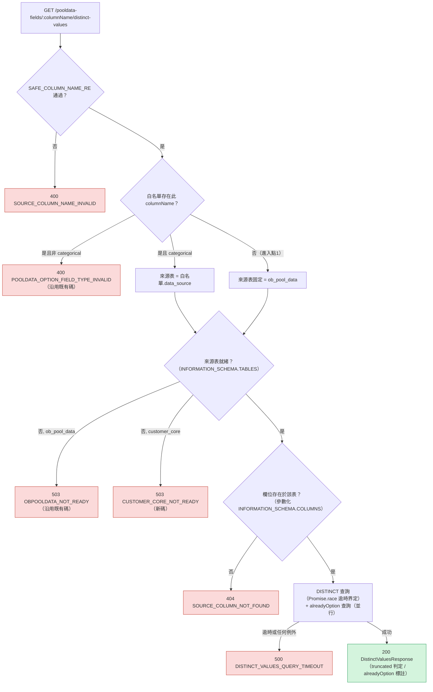
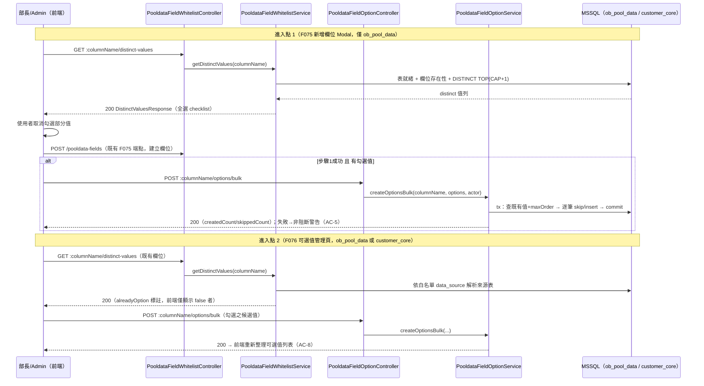

# AD-E07-47：F112 類別型篩選欄位可選值自動建議架構設計

## Agent Loading Guide

| Agent 角色 | 需載入章節 |
|-----------|-----------|
| TDD Developer | §2（既有事實）+ §3（全部裁定，含程式碼契約）+ §4（無 schema 變更）+ §5（端點契約）+ §7（不變式）+ §8（測試邊界）+ §9（檔案異動清單） |
| Test Designer | §3.5（timeout / exact vs sampled 裁定）+ §3.6（HTTP code 裁定）+ §7 + §8 |
| UI/UX Designer | §6（前端架構）+ §5（回應形狀，供 checklist / modal 綁定） |
| Product Analyst | §10（風險與殘留議題）+ §11（待裁決） |

---

## 1. 背景與問題定義

[F112](../features/F112-auto-suggest-categorical-options.md)（US-178）在既有 M06 篩選欄位管理（F075 白名單 / F076 可選值）基礎上，新增「從實際資料表偵測 distinct 值、批次帶入為可選值」之輔助功能。Feature spec §5 已凍結兩個新端點之 request/response 形狀（`DistinctValuesResponse` / `BulkCreateOptionsDto` / bulk response），本 AD **不重議**這些欄位形狀，只決定**如何實作**，並裁定 spec §12.3 留給本 AD 的 3 個架構 Open Question：

| OQ | 問題 |
|----|------|
| OQ-F112-01 | distinct 查詢對巨表（ob_pool_data 168万–780万列 / customer_core 約360万列）之效能：TOP cap + requestTimeout 是否足夠？是否需索引或抽樣？ |
| OQ-F112-02 | 逾時 504 / 未就緒 503 是否與既有慣例（`STAGE0_ESTIMATE_TIMEOUT` = 500）統一？ |
| OQ-F112-03 | 是否提供單一 transactional「建立欄位＋可選值」端點取代進入點 1 之兩次呼叫編排？ |

本 AD 之核心發現（決定整體設計方向）：**spec §5.0 對 OQ-178-02「沿用既有 tedious driver requestTimeout（約 15s）」之假設已過時**——P6c MSSQL 全面遷移效能修復（2026-07-10 前後）已將應用程式 DataSource 之全域 `requestTimeout` 由 15s 調高為 **3,600,000ms（1 小時）**（`data-source.ts:62-64` 註解 `I-MSSQL-REQ-TIMEOUT-01` 明載）。若本功能真的「沿用」該全域逾時，一個緩慢的 DISTINCT 查詢可能讓部長端 HTTP 請求掛起長達 1 小時才報錯，這對一個同步互動的管理 UI 動作是不可接受的。本 AD 因此**不採用**「沿用全域 driver timeout」之字面建議，改為**獨立於全域 driver timeout 之 app-level 逾時**（§3.5），此為本 AD 對 OQ-178-02 / OQ-F112-01 / OQ-F112-02 三者的共同技術前提。

---

## 2. 既有架構基礎（不分叉，不得修改語意）

| 元件 | 檔案 | 角色 |
|---|---|---|
| `PooldataFieldWhitelistService.getAvailableColumns` | `pooldata-field-whitelist.service.ts:372-470` | 既有 dialect-branch raw SQL 範本：Step1 `INFORMATION_SCHEMA.TABLES` 表存在性檢查（catch→503 `OBPOOLDATA_NOT_READY`）→ Step2 `INFORMATION_SCHEMA.COLUMNS` 查詢；MSSQL 用大寫 `INFORMATION_SCHEMA` + `dbo` schema + `TOP`，SQLite 用小寫 + `public` + `LIMIT`（**PG 分支已於 2026-07-11 全面移除**，見 `project_mssql_full_migration` 記憶） |
| `PooldataFieldOptionService.createOption` | `pooldata-field-option.service.ts:127-180` | `display_order` append 範本：查現有最大 `display_order` → `+1`；唯一性違反 → 409（單筆情境） |
| `PooldataFieldWhitelistService.updateField` | `pooldata-field-whitelist.service.ts:208-277` | 既有 `this.dataSource.transaction(async (manager) => {...})` 範本（同 tx 內 `manager.save` 兩張表） |
| `PooldataFieldWhitelistService.assertCategorical` | `pooldata-field-whitelist.service.ts:327-336` | 既有守門 method：`findOneOrFail`（未找到 → 404 `POOLDATA_FIELD_NOT_FOUND`）+ `field_type!=='categorical'` → 400 `POOLDATA_OPTION_FIELD_TYPE_INVALID`；`createOption` 既有呼叫此 method 於任何寫入之前（tx 外） |
| `Stage0EstimateService.estimateListCount` | `stage0-estimate.service.ts:399-451` | **本專案唯一之查詢逾時前例**：`Promise.race([queryPromise, timeoutPromise])`，`timeoutPromise` 以 `setTimeout` reject 一個 `InternalServerErrorException({error:STAGE0_ESTIMATE_TIMEOUT,...})`；catch 區塊對**任何**非 `InternalServerErrorException`/`NotFoundException` 之例外，一律 log 後重新包裝為同一個 `STAGE0_ESTIMATE_TIMEOUT`（不洩漏原始 SQL 錯誤訊息給前端）。`error-handling.md` 登錄此碼為 **500**，非 504 |
| `HttpExceptionFilter` | `common/filters/http-exception.filter.ts` | 全域 filter：僅在 `status===400 && (message 為 Array 或 exceptionResponse.error==='Bad Request')`（即 class-validator 預設框架格式）才重映為 422 `VALIDATION_ERROR`；任何自訂 `{error,message}` 形狀之 `HttpException`（含 400/404/500/503）**原樣透傳其原始 HTTP status**，不重映射 |
| `data-source.ts:62-64` | `apps/api/src/database/data-source.ts` | **關鍵事實**：`requestTimeout: Number(process.env.DB_MSSQL_REQUEST_TIMEOUT ?? 3600000)`；註解明載「tedious requestTimeout 預設 15s，對長 migration / 大批資料操作不足」而將預設調為 1 小時。此為應用程式主 DataSource（`this.dataSource.query(...)` 依附之連線池）之全域設定，套用於**所有**經由該 DataSource 發出的查詢，非本功能可獨立覆寫 |
| `sampling-estimator.ts` | `apps/api/src/modules/assignment/stage1/sampling-estimator.ts` | AD-E07-45 之 TABLESAMPLE 抽樣核心，供 F050/F055/F056 三個**估算類**端點共用；本 AD 評估後**不採用**（§3.5 理由） |
| `MSSQLExecutor` | `extraction-task/executors/mssql-executor.ts` | 既有 `PooldataFieldWhitelistService` 建構子已注入之元件，但用途是透過 `extraction_task.datasource_id` 連線至**外部來源系統**查 `sys.extended_properties`（`getColumnDescriptions`，供 `columnDescription` 用）；`ob_pool_data` / `customer_core` 為 CDMP 應用程式**自身**資料庫之表，本 AD 兩個新方法一律經由已注入之 `this.dataSource`（同 `getAvailableColumns` 既有查詢路徑），**不使用** `MSSQLExecutor` |
| `AssignmentAuditLog` entity | `database/entities/assignment-audit-log.entity.ts` | **關鍵事實**：欄位僅 `entity_type` / `entity_id` / `action` / `actor_id` / `actor_name` / `before_value` / `after_value`（jsonb）/ `ip_address` / `created_at`，**無獨立 `details` 欄位**。spec §5.2 / §6 / BR-13 所述之 `details = {...}` 須對應到既有 `after_value` 欄位，非新增欄位 |
| `PooldataFieldOption` entity | `database/entities/pooldata-field-option.entity.ts` | 複合 PK `(column_name, option_value)`；`option_value` VARCHAR(64)、`option_label` VARCHAR(100)；與 `BulkCreateOptionsDto` 之 `optionValue`/`optionLabel` 長度限制一一對應 |
| `PooldataFieldModule` | `pooldata-field/pooldata-field.module.ts` | 既有模組，`PooldataFieldWhitelistController` + `PooldataFieldOptionController` 兩個 controller、兩個 service 互相注入（`PooldataFieldOptionService` 建構子注入 `PooldataFieldWhitelistService` 供 `assertCategorical` 復用） |

**路由結構事實**（決定新端點掛載位置，§3.1）：
- `PooldataFieldWhitelistController`：`@Controller('pooldata-fields')`，既有靜態路由 `available-columns` 必須先於 `:columnName` 動態路由註冊（既有 TS-F075-E2E-008 regression guard）。
- `PooldataFieldOptionController`：`@Controller('pooldata-fields/:columnName/options')`，既有寫入路由僅 `@Post()`（base）+ `@Patch('reorder')` + `@Patch(':optionValue/deactivate')` + `@Patch(':optionValue')`，**無任何動態 POST 路由**。

---

## 3. 核心設計決策



**執行順序之關鍵修正（相對 spec §5.1 條列順序）**：spec 將「欄位存在性確認」列為步驟 3、「來源表就緒確認」列為步驟 4，但**實作執行順序必須相反**——若來源表本身不存在，對該表發出的 `INFORMATION_SCHEMA.COLUMNS` 欄位存在性查詢天然回傳 0 列（`INFORMATION_SCHEMA` 本身是系統目錄視圖，永遠存在，即使目標表不存在），無法與「表存在但欄位不存在」區分。若不先做表就緒檢查，一個 ETL 尚未載入 `customer_core` 的環境會被誤判為 404 `SOURCE_COLUMN_NOT_FOUND`（欄位找不到），而非正確的 503 `CUSTOMER_CORE_NOT_READY`（表未就緒）——這正是 spec BR-11 明確要禁止的「未就緒被誤判」情境的一個變體。本 AD 裁定：**表就緒檢查必須先於欄位存在性檢查執行**（I-DVAL-READY-BEFORE-EXIST-01），此為對 spec 條列順序的必要澄清，非行為變更（spec 之驗收標準 AC-12 本身要求未就緒須回 503，此裁定是確保該 AC 在「表不存在」情境下不會被欄位存在性檢查搶先攔截為錯誤的 404）。

### 3.1 端點掛載位置

- `GET :columnName/distinct-values` → `PooldataFieldWhitelistController`（新方法呼叫 `PooldataFieldWhitelistService.getDistinctValues`）。路徑為 `:columnName` 之下第二段靜態字面量（與既有 `:columnName/active-options-count` 同一層級但不同字面量），NestJS 依「完整路徑段匹配」而非前綴匹配路由，兩者互不影響、無需特別排序（不同於 `available-columns` 對 `:columnName` 單段動態路由之遮蔽風險，本路由是兩段路徑，不受任何既有單段動態路由遮蔽）。
- `POST bulk` → `PooldataFieldOptionController`（新方法呼叫 `PooldataFieldOptionService.createOptionsBulk`）。該 controller **無任何動態 POST 路由**（僅 `@Post()` 一個靜態 base 路由），故 `@Post('bulk')` 不論註冊順序皆無遮蔽風險；為與檔案既有「靜態子路由群聚」慣例一致（`reorder` / `:optionValue/deactivate` 皆群聚於 `:optionValue` 動態路由之前），仍建議將 `@Post('bulk')` 緊接在既有 `@Post()`（單筆新增）之後宣告。

### 3.2 來源表解析

```typescript
// pooldata-field-whitelist.service.ts（新增私有方法）
private async _resolveDistinctValueSource(
  columnName: string,
): Promise<{ table: 'ob_pool_data' | 'customer_core' }> {
  const row = await this.fieldRepo.findOne({ where: { column_name: columnName } });
  if (row) {
    // 不論 is_active（PK 為 column_name，停用不刪列；沿用 findOneOrFail 之「不過濾 active」慣例）
    if (row.field_type !== 'categorical') {
      throw new BadRequestException({
        error: ERROR_CODES.POOLDATA_OPTION_FIELD_TYPE_INVALID,
        message: ERROR_MESSAGES.POOLDATA_OPTION_FIELD_TYPE_INVALID,
      });
    }
    return { table: row.dataSource };
  }
  // 進入點 1：欄位尚未列入白名單 → 固定 ob_pool_data（spec BR-12）
  return { table: 'ob_pool_data' };
}
```

此步驟**重用既有 `POOLDATA_OPTION_FIELD_TYPE_INVALID` 錯誤碼**（F076 既有碼），不需要新錯誤碼——spec §9 交叉參照亦已將此碼列為「沿用」而非「新增」，與本裁定一致。刻意**不重用 `assertCategorical()`**（其 `findOneOrFail` 對「不存在」情境會拋 404，但進入點 1 需要的是「不存在 → 靜默視為 ob_pool_data」，語意不同，不可共用）。

### 3.3 欄位名稱安全驗證與 INFORMATION_SCHEMA 存在性確認

**`SAFE_COLUMN_NAME_RE` 獨立維護，不跨模組 import**：F109/AD-E07-37 已將此正則 export 自 `stage1-query-composer.ts`（供同模組家族 `assignment/stage1` 內新檔重用），F075 `CreatePooldataFieldDto` 則另有一份字面量正則（`/^[a-z][a-z0-9_]{0,63}$/`）。兩處已是各自獨立維護、值相同但不共用單一常數的既有先例。`pooldata-field` 模組與 `assignment/stage1` 模組現況互不相依；為此功能跨模組 import 一個正則常數，會在兩個原本無關的 bounded context 之間新增一條耦合邊，成本高於直接複製一份（維護成本僅是「若正則規則變動，需同步兩處」，而這正是既有 F075/F109 之間已經接受的現況）。裁定：新增 `pooldata-field.constants.ts`，於 `pooldata-field` 模組內部獨立宣告同值正則。

**表存在性檢查重構為共用私有方法**（DRY，零行為變更）：

```typescript
// pooldata-field-whitelist.service.ts
private async _checkTableExists(tableName: 'ob_pool_data' | 'customer_core'): Promise<boolean> {
  const isMssql = this.dataSource.options.type === 'mssql';
  const sql = isMssql
    ? `SELECT TOP 1 1 AS x FROM INFORMATION_SCHEMA.TABLES WHERE TABLE_SCHEMA = 'dbo' AND TABLE_NAME = @0`
    : `SELECT 1 FROM information_schema.tables WHERE table_schema = 'public' AND table_name = ? LIMIT 1`;
  const rows = await this.dataSource.query(sql, [tableName]).catch(() => null);
  return !!rows && rows.length > 0;
}

private async _checkColumnExists(
  tableName: 'ob_pool_data' | 'customer_core',
  columnName: string,
): Promise<boolean> {
  const isMssql = this.dataSource.options.type === 'mssql';
  const sql = isMssql
    ? `SELECT TOP 1 1 AS x FROM INFORMATION_SCHEMA.COLUMNS WHERE TABLE_SCHEMA = 'dbo' AND TABLE_NAME = @0 AND COLUMN_NAME = @1`
    : `SELECT 1 FROM information_schema.columns WHERE table_schema = 'public' AND table_name = ? AND column_name = ? LIMIT 1`;
  const rows = await this.dataSource.query(sql, [tableName, columnName]).catch(() => null);
  return !!rows && rows.length > 0;
}
```

`getAvailableColumns()` 既有 Step 1（`tableExistsSql`，目前對 `'ob_pool_data'` 字面量硬編碼）**同步改為呼叫 `this._checkTableExists('ob_pool_data')`**——此為零行為變更之重構（SQL 形狀不變，僅由字面量改為參數化傳入同值字串），既有 `OBPOOLDATA_NOT_READY` 相關測試不需修改斷言，僅需確認呼叫路徑仍正確。**兩查詢皆用值參數化**（`@0`/`@1` MSSQL 0-based positional、`?` SQLite），`tableName`/`columnName` 皆不做字串插值（`columnName` 此階段尚未通過完整驗證，禁止插入 SQL 文字；`tableName` 恆為程式碼常數 `'ob_pool_data'|'customer_core'` 兩者之一，非使用者輸入，但仍以參數化方式傳遞以保持一致風格）。

### 3.4 `getDistinctValues` 主邏輯

```typescript
async getDistinctValues(columnName: string): Promise<DistinctValuesResult> {
  if (!SAFE_COLUMN_NAME_RE.test(columnName)) {
    throw new BadRequestException({
      error: ERROR_CODES.SOURCE_COLUMN_NAME_INVALID,
      message: ERROR_MESSAGES.SOURCE_COLUMN_NAME_INVALID,
    });
  }

  const { table } = await this._resolveDistinctValueSource(columnName);

  // I-DVAL-READY-BEFORE-EXIST-01：表就緒檢查優先於欄位存在性檢查
  if (!(await this._checkTableExists(table))) {
    const code = table === 'customer_core'
      ? ERROR_CODES.CUSTOMER_CORE_NOT_READY
      : ERROR_CODES.OBPOOLDATA_NOT_READY;
    throw new ServiceUnavailableException({ error: code, message: ERROR_MESSAGES[code] });
  }

  if (!(await this._checkColumnExists(table, columnName))) {
    throw new NotFoundException({
      error: ERROR_CODES.SOURCE_COLUMN_NOT_FOUND,
      message: ERROR_MESSAGES.SOURCE_COLUMN_NOT_FOUND,
    });
  }

  // alreadyOption 查詢與 DISTINCT 查詢互不相依 → 並行（既有 getAvailableColumns 已有先例：
  // v1.4.7 對 Step2 欄位查詢與 ExtractionTask 查詢即以 Promise.all 平行化）
  const [existingOptionRows, distinctValues] = await Promise.all([
    this.optionRepo.find({ where: { column_name: columnName }, select: ['option_value'] }),
    this._queryDistinctWithTimeout(table, columnName),
  ]);

  const existingSet = new Set(existingOptionRows.map((r) => r.option_value));
  const truncated = distinctValues.length > DISTINCT_VALUES_CAP;
  const sliced = truncated ? distinctValues.slice(0, DISTINCT_VALUES_CAP) : distinctValues;

  return {
    columnName,
    dataSource: table,
    values: sliced.map((v) => ({ value: String(v), alreadyOption: existingSet.has(String(v)) })),
    totalReturned: sliced.length,
    truncated,
    cap: DISTINCT_VALUES_CAP,
  };
}
```

`WHERE [col] IS NOT NULL` 天然滿足 AC-14（全 NULL 欄位 → `values:[]`／`totalReturned:0`／`truncated:false`，與 503/500 錯誤路徑走完全不同分支，不會混淆）。`String(v)` 涵蓋 spec 「`value` 一律為字串」要求（distinct 值可能來自 numeric/date 型別但已被步驟 3.2 之 categorical 守門排除，此轉換主要處理 driver 回傳型別非字串字面量之邊界情況，如布林/數字字面量）。

### 3.5 效能與逾時裁定（OQ-F112-01 + OQ-F112-02 核心，含 OQ-178-02 修正）

**裁定：精確 DISTINCT（非抽樣），以「TOP cap 限制回傳量」+「獨立 app-level 逾時」雙重界定，不依賴全域 driver `requestTimeout`。**

```typescript
// pooldata-field.constants.ts
export const DISTINCT_VALUES_CAP = Number(process.env.POOLDATA_DISTINCT_VALUES_CAP ?? 200);
export const DISTINCT_VALUES_TIMEOUT_MS = Number(process.env.POOLDATA_DISTINCT_VALUES_TIMEOUT_MS ?? 15_000);
export const SAFE_COLUMN_NAME_RE = /^[a-z][a-z0-9_]{0,63}$/;
```

```typescript
// pooldata-field-whitelist.service.ts
private async _queryDistinctWithTimeout(
  table: 'ob_pool_data' | 'customer_core',
  columnName: string,
): Promise<unknown[]> {
  const queryPromise = this._runDistinctQuery(table, columnName);
  const timeoutPromise = new Promise<never>((_, reject) =>
    setTimeout(
      () => reject(new InternalServerErrorException({
        error: ERROR_CODES.DISTINCT_VALUES_QUERY_TIMEOUT,
        message: ERROR_MESSAGES.DISTINCT_VALUES_QUERY_TIMEOUT,
      })),
      DISTINCT_VALUES_TIMEOUT_MS,
    ),
  );
  try {
    return await Promise.race([queryPromise, timeoutPromise]);
  } catch (e) {
    if (e instanceof InternalServerErrorException) throw e;
    // 忠實比照 Stage0EstimateService.estimateListCount 既有 catch 語意：
    // 任何非預期例外（含真實 SQL 錯誤）一律不外洩原始訊息，統一包裝為同一使用者可讀錯誤。
    this.logger.error(`getDistinctValues query failed: ${(e as Error).message}`);
    throw new InternalServerErrorException({
      error: ERROR_CODES.DISTINCT_VALUES_QUERY_TIMEOUT,
      message: ERROR_MESSAGES.DISTINCT_VALUES_QUERY_TIMEOUT,
    });
  }
}

private async _runDistinctQuery(
  table: 'ob_pool_data' | 'customer_core',
  columnName: string,
): Promise<unknown[]> {
  // columnName 已通過 §3.3 之 regex + INFORMATION_SCHEMA 存在性驗證，此處可安全內插（I-DVAL-SAFE-INTERP-01）
  const isMssql = this.dataSource.options.type === 'mssql';
  const cap1 = DISTINCT_VALUES_CAP + 1;
  const sql = isMssql
    ? `SELECT DISTINCT TOP (${cap1}) [${columnName}] AS v FROM ${table} WHERE [${columnName}] IS NOT NULL ORDER BY [${columnName}]`
    : `SELECT DISTINCT "${columnName}" AS v FROM ${table} WHERE "${columnName}" IS NOT NULL ORDER BY "${columnName}" LIMIT ${cap1}`;
  const rows = await this.dataSource.query(sql);
  return rows.map((r: any) => r.v);
}
```

**理由（為何不沿用全域 `requestTimeout`）**：§1 已述全域 driver `requestTimeout` 現為 1 小時，若整個 `SELECT DISTINCT` 查詢單純依附主 DataSource 連線池，唯一的「保底」逾時是 1 小時——對一個由部長於 UI 上同步觸發、等待回應的動作而言完全不可接受。`Stage0EstimateService.estimateListCount` 早已面對相同問題並建立了解法：以 `Promise.race` 在應用層實作一個獨立於 driver 設定的逾時視窗。本 AD 直接沿用此已驗證模式，僅將預設值定為 `DISTINCT_VALUES_TIMEOUT_MS=15000`（延續 spec OQ-178-02 原本假設的「約 15s」使用體驗預算，即使該值不再是 driver 的實際預設值），並比照 `DISTINCT_VALUES_CAP` 同樣開放 env 覆寫（`POOLDATA_DISTINCT_VALUES_TIMEOUT_MS`）。

**已知且接受之限制（與既有 precedent 一致，非本 AD 新增之缺陷）**：`Promise.race` 只是讓 **HTTP 回應**提前逾時，並不會實際取消 SQL Server 端已送出之查詢——該查詢仍會在資料庫端繼續執行至完成或撞上全域 1 小時逾時（orphaned query）。這與 `estimateListCount` 現有行為完全相同，非本 AD 引入的新風險。可接受理由：(a) 此為部長低頻手動觸發動作，非高頻熱路徑；(b) `TOP (CAP+1)` 已限制最終結果傳輸量，即使掃描本身慢，真正的網路/序列化成本有界；(c) 真正的查詢中止需要持有專屬 `QueryRunner` 並呼叫 driver 層級 cancel，對本 MVP 功能而言工程成本與效益不成比例，列為 §10 殘留風險而非阻擋項。

**精確 DISTINCT vs 抽樣（`sampling-estimator.ts`）—— Auto-Challenge：為何不比照 AD-E07-45 抽樣**：

`sampling-estimator.ts`（AD-E07-45）是為 F050/F055/F056 三個**估算類**端點設計，其產品語意本身就標示為「估計值」，使用者預期存在統計誤差。distinct-values 端點的產品語意完全不同——它是在建構「這個欄位的可選值宇宙」這件事的**完整性來源**，US-178 背景明確指出本功能存在的理由就是解決「逐筆手動輸入容易遺漏部分真實存在的值」的問題。若改用 `TABLESAMPLE` 抽樣 50,000 列再取 distinct，一個只出現在極少數列（例如 3.6M 列中僅 3 列）的稀有類別值有很高機率**完全不會出現在樣本中**，導致 checklist 漏掉一個真實存在的選項——這正是本功能存在的目的所要消除的那種「遺漏」，用抽樣實作反而重新引入同一個 bug，只是換了個技術外衣。裁定：**本端點一律精確 DISTINCT**（I-DVAL-NO-SAMPLE-01），不重用 `sampling-estimator.ts`。

**索引 / 未來優化**：v1 **不新增索引**（比照 spec 建議之預設）。`TOP (CAP+1)` 限制結果列數但不限制掃描成本（若欄位無索引，DB 仍須全表掃描 + hash aggregate 才能算出 distinct 集合）；15s app-level 逾時是這個成本的安全網，而非效能優化本身。若上線後對特定大型欄位（如 `customer_core.occupation_desc`，55 種 distinct 值分布於 360 萬列）實測頻繁觸發逾時，後續應為該欄位新增單欄索引（`CREATE INDEX ... ON customer_core (occupation_desc)`），非本 AD 範圍，列為 §11 待裁決追蹤項。

### 3.6 HTTP 狀態碼裁定（OQ-F112-02 最終裁定）

| 錯誤碼 | spec §5.1/§5.2 建議 | 本 AD 裁定 | 依據 |
|---|---|---|---|
| `SOURCE_COLUMN_NAME_INVALID` | 400 | **400**（不變） | `BadRequestException({error,message})` 自訂形狀，filter 原樣透傳，非 class-validator 預設陣列格式，不落入 422 重映射分支；比照既有 `POOLDATA_OPTION_FIELD_TYPE_INVALID` 同樣走 400 |
| `SOURCE_COLUMN_NOT_FOUND` | 404 | **404**（不變） | `NotFoundException({error,message})`，比照既有 `POOLDATA_FIELD_NOT_FOUND` / `ASSIGNMENT_LIST_NOT_FOUND` |
| `CUSTOMER_CORE_NOT_READY` | 503 | **503**（不變） | `ServiceUnavailableException({error,message})`，直接比照既有姊妹碼 `OBPOOLDATA_NOT_READY`（同一 Exception 類別、同一語意） |
| `DISTINCT_VALUES_QUERY_TIMEOUT` | **504** | **500**（改） | 全域對齊本專案唯一之查詢逾時前例 `STAGE0_ESTIMATE_TIMEOUT`（`InternalServerErrorException` → 500，`error-handling.md` 登錄為 500） |

**`DISTINCT_VALUES_QUERY_TIMEOUT` 改判 500（非 spec 建議之 504）之理由**：

1. **本專案程式碼庫全域搜尋確認：無任何一處使用 504 / `GatewayTimeoutException`**（含 `error-handling.md` 全文）。504 語意上對應「上游閘道 / 反向代理逾時」，而本應用為單體 NestJS 服務，並無反向代理逾時鏈路的場景在起作用；引入 504 會是本專案獨一無二、僅服務單一端點的新慣例。
2. `STAGE0_ESTIMATE_TIMEOUT` 是本專案**唯一**既有的「查詢逾時」錯誤碼前例，且明確定調為 500（`error-handling.md#assignment-misc-errors`）。`DISTINCT_VALUES_QUERY_TIMEOUT` 與其為同一類事件（app-level `Promise.race` 逾時保護），沿用相同 HTTP 語意可讓前端錯誤處理 / 測試斷言維持單一慣例，不需要為「這一個端點」的逾時另開一條 504 分支。
3. class-validator 422 重映射邏輯只認 `status===400`；500/503/404/400 四者皆以自訂 `{error,message}` 形狀直接落地，前端本就是依 body 內的 `error` **代碼字串**分流顯示邏輯（AC-13「顯示明確逾時錯誤訊息並提供重試」），而非依賴原始 HTTP status 數值本身——比照 F075/F076 既有前端消費 `{error,message}` 之慣例，HTTP status 由 500 改為與 spec 建議的 504 不同，不影響前端可實作性。

**待辦（flag，非本 AD 直接編輯範圍）**：F112 spec §5.1 錯誤碼表、§9 交叉參照、§12.3 OQ-F112-02 建議欄，以及 `error-handling.md#assignment-code-errors`（新增 4 碼登錄）皆需同步此裁定（`DISTINCT_VALUES_QUERY_TIMEOUT` = 500，非 504）。依 CLAUDE.md「各 agent 角色不可越界」原則，此文件同步應由 **spec-writer** 執行，本 AD 僅裁定並記錄於此（§11）。

### 3.7 `options/bulk` 交易設計

```typescript
// pooldata-field-option.service.ts
async createOptionsBulk(
  columnName: string,
  options: Array<{ optionValue: string; optionLabel: string }>,
  actor: ActorContext,
): Promise<BulkCreateOptionsResult> {
  // 沿用既有守門（tx 外，與 createOption 既有呼叫順序一致）：
  //   不存在 → 404 POOLDATA_FIELD_NOT_FOUND；非 categorical → 400 POOLDATA_OPTION_FIELD_TYPE_INVALID
  await this.whitelistService.assertCategorical(columnName);

  const created = await this.optionRepo.manager.transaction(async (manager) => {
    // I-DVAL-BULK-TX-01：existing-value 判定與 max display_order 推導共用同一次查詢結果
    const existingRows = await manager.find(PooldataFieldOption, {
      where: { column_name: columnName },
    });
    const existingValues = new Set(existingRows.map((r) => r.option_value));
    let maxOrder = existingRows.reduce((max, r) => Math.max(max, r.display_order), -1);

    const seenInBatch = new Set<string>();
    const toInsert: PooldataFieldOption[] = [];
    const now = new Date();

    for (const opt of options) {
      // 略過：DB 既有值（含 inactive）或批次內重複（首次為準）——BR-3
      if (existingValues.has(opt.optionValue) || seenInBatch.has(opt.optionValue)) continue;
      seenInBatch.add(opt.optionValue);
      maxOrder += 1;
      toInsert.push(
        manager.create(PooldataFieldOption, {
          column_name: columnName,
          option_value: opt.optionValue,
          option_label: opt.optionLabel,
          display_order: maxOrder,
          is_active: true,
          deactivation_reason: null,
          created_at: now,
          updated_at: now,
        }),
      );
    }

    if (toInsert.length > 0) await manager.save(PooldataFieldOption, toInsert);
    return toInsert;
  });

  // 稽核於 tx 外寫入（沿用既有「稽核失敗不 rollback」BR-7）
  await this._writeBulkAudit(actor, columnName, created, options.length - created.length);

  return {
    columnName,
    createdCount: created.length,
    skippedCount: options.length - created.length,
    options: created.map((r) => ({
      optionValue: r.option_value,
      optionLabel: r.option_label,
      isActive: true as const,
    })),
  };
}
```

**與單筆 `createOption` 之差異（刻意，非疏漏）**：`createOption` 對重複值直接查 1 筆 → 409；bulk 端點對重複值**跳過而非報錯**（spec AC-15 / BR-3 明確要求冪等略過，故此處不可重用 `createOption` 之單筆邏輯，是兩條有意分歧的路徑）。`toInsert.length===0`（全數略過）時 `manager.save` 呼叫被跳過（避免對空陣列呼叫 save 產生的無謂 round-trip），函式仍正常回傳 `createdCount:0`（200 OK，非錯誤，AC-15）。

### 3.8 稽核：`_writeAudit` 之最小擴充

既有 `_writeAudit(actor, action, columnName, optionValue, before, after)` 之 `entity_id` 恆組成 `${columnName}.${optionValue}`（單筆情境，`optionValue` 必填）。Bulk 情境依 spec OQ-178-04/BR-13 需要 `entity_id = columnName`（不含 `.optionValue` 後綴）之**單筆彙總**紀錄。裁定：新增一個小型私有變體 `_writeBulkAudit`，**不**修改既有 `_writeAudit` 簽名（避免任何既有呼叫點行為漂移）：

```typescript
private async _writeBulkAudit(
  actor: ActorContext,
  columnName: string,
  created: PooldataFieldOption[],
  skippedCount: number,
): Promise<void> {
  try {
    const actorName = await this._resolveActorName(actor.userId);
    const log = this.auditRepo.create({
      entity_type: 'pooldata_field_option',
      entity_id: columnName, // 彙總一筆：entity_id = columnName（非 columnName.optionValue）
      action: 'CREATE',
      actor_id: actor.userId,
      actor_name: actorName,
      before_value: null,
      // spec §5.2/BR-13 之 "details" 對應至既有 after_value 欄位（entity 無獨立 details 欄）
      after_value: {
        createdValues: created.map((r) => r.option_value),
        createdCount: created.length,
        skippedCount,
        source: 'bulk_auto_suggest',
      },
      ip_address: actor.ipAddress ?? null,
    });
    await this.auditRepo.save(log);
  } catch (_err) {
    // BR-7：稽核失敗不 rollback
  }
}
```

### 3.9 OQ-F112-03：是否新增單一 transactional「建立欄位＋可選值」端點

**裁定：不新增，維持 spec §5.3 之兩次呼叫編排（建立欄位 → bulk 帶入）。**

**理由（Auto-Challenge：是否為圖方便而放棄原子性）**：
- AC-5 / BR-9 已明文將「欄位建立成功、bulk 失敗」定義為**合法穩定狀態**（categorical 欄位允許零可選值），而非「因缺乏原子性而不得已的降級」——這與 F109 上線前任何一個新建 categorical 欄位（零可選值直到 F076 逐筆補上）的既有穩態完全相同。業務需求本身**沒有**要求原子性，若為此新增一個合併端點，是在解決一個業務未提出的問題（本角色 Auto-Challenge Logic 明確列出「MVP 範圍過度架構」為需挑戰項）。
- `options/bulk` 端點必須**獨立**於欄位建立而可被呼叫（進入點 2：既有欄位、無建立欄位動作），因此無論是否新增合併端點，`options/bulk` 這支獨立端點都必須存在；合併端點只是在既有兩支獨立端點之外再疊加第三支端點，徒增維護面（三份錯誤處理邏輯需要彼此一致）而非減少。
- 若真要做合併端點，勢必要擴充 `CreatePooldataFieldDto`（加入可選 `options?: [...]`），這會讓一個目前語意單純（只描述「一個篩選欄位」）的 DTO 承載第二個資源（可選值批次）的建立語意，且該 DTO 目前只有唯一一個呼叫點（F075 建立欄位 Modal），變更成本與效益不成比例。

### 3.10 RBAC / Feature Flag Guard

兩端點逐字比照同 controller 內既有寫入 / 偵測端點之 guard 組合（I-DVAL-GUARD-PARITY-01），不新增任何 guard 邏輯：

```typescript
// PooldataFieldWhitelistController（class 級 guard 已含 AuthGuard/FeatureFlagGuard/
//   DirectorOrSectionChiefGuard/DirectorGuard + class 級 @RequireDirectorOrSectionChief()）
@Get(':columnName/distinct-values')
@RequireDirector()
@RequireFeatureFlag('ENABLE_E07_REFACTOR_PHASE3')
async getDistinctValues(@Param('columnName') columnName: string) {
  return this.service.getDistinctValues(columnName);
}
```

```typescript
// PooldataFieldOptionController（同一組 class 級 guard）
@Post('bulk')
@RequireDirector()
@RequireFeatureFlag('ENABLE_E07_REFACTOR_PHASE3')
async createOptionsBulk(
  @Param('columnName') columnName: string,
  @Body() dto: BulkCreateOptionsDto,
  @Req() req: any,
) {
  const actor = { userId: req.user.userId, ipAddress: req.ip ?? null };
  return this.service.createOptionsBulk(columnName, dto.options, actor);
}
```

`distinct-values` 雖是 GET，但如同既有 `getAvailableColumns`（同樣是 GET 卻掛 `@RequireDirector()+@RequireFeatureFlag()`）——兩者共同理由：這是「驅動寫入流程的偵測查詢」，而非單純資料展示查詢（`listFields`/`listOptions` 兩個純展示 GET 皆無此兩個 decorator）。`getAvailableColumns` 是本端點存取層級的直接先例。

### 3.11 `BulkCreateOptionsDto`

```typescript
// dto/bulk-create-options.dto.ts
import { ArrayMaxSize, ArrayMinSize, IsArray, IsNotEmpty, IsString, MaxLength, ValidateNested } from 'class-validator';
import { Type } from 'class-transformer';
import { DISTINCT_VALUES_CAP } from '../pooldata-field.constants';

class BulkOptionItemDto {
  @IsString({ message: 'optionValue 必須為字串' })
  @IsNotEmpty({ message: '請提供 optionValue' })
  @MaxLength(64, { message: 'optionValue 不得超過 64 字元' })
  optionValue: string;

  @IsString({ message: 'optionLabel 必須為字串' })
  @IsNotEmpty({ message: '請提供 optionLabel' })
  @MaxLength(100, { message: 'optionLabel 不得超過 100 字元' })
  optionLabel: string;
}

export class BulkCreateOptionsDto {
  @IsArray()
  @ArrayMinSize(1, { message: 'options 至少需 1 筆' })
  @ArrayMaxSize(DISTINCT_VALUES_CAP, { message: `options 不得超過 ${DISTINCT_VALUES_CAP} 筆` })
  @ValidateNested({ each: true })
  @Type(() => BulkOptionItemDto)
  options: BulkOptionItemDto[];
}
```

單項欄位驗證規則逐字複製既有 `CreatePooldataOptionDto`（避免單筆／批次兩條路徑之驗證規則漂移）。`ArrayMaxSize` 直接 import `DISTINCT_VALUES_CAP` 同一常數（而非另一個字面量 `200`），確保 GET 端點回傳上限與 POST 端點接受上限在 env 覆寫情境下（`POOLDATA_DISTINCT_VALUES_CAP`）恆一致，不會因兩處各自寫死字面量而在未來 env 覆寫時產生落差。此驗證失敗案例走 class-validator 預設格式 → 全域 filter 既有邏輯重映為 422 `VALIDATION_ERROR`（無需額外程式碼，§2 filter 事實已涵蓋）。

---

## 4. Schema 變更

**無**。本 AD 不新增資料表、欄位、索引或 migration——兩個新端點完全操作既有 `pooldata_field_whitelist` / `pooldata_field_option` / `ob_pool_data` / `customer_core` / `assignment_audit_log` 五張既有表。`DISTINCT_VALUES_CAP` / `DISTINCT_VALUES_TIMEOUT_MS` 為程式碼常數（env 可覆寫），非資料庫設定。（Auto-Challenge 自檢：是否對 MVP 過度設計？——本 AD 刻意避免任何新 schema 面向，索引留待實測後再評估，§3.5 / §11。）

---

## 5. 端點契約總覽



| 屬性 | `GET :columnName/distinct-values` | `POST :columnName/options/bulk` |
|---|---|---|
| Guard | `AuthGuard`+`FeatureFlagGuard`+`DirectorOrSectionChiefGuard`+`DirectorGuard`（class）+`@RequireDirector()`+`@RequireFeatureFlag('ENABLE_E07_REFACTOR_PHASE3')`（method） | 同左 |
| 寫入 | 無（唯讀） | 有（單一 transaction，§3.7） |
| 逾時 | `DISTINCT_VALUES_QUERY_TIMEOUT`（500，§3.6） | 無專屬逾時（沿用全域 driver requestTimeout；bulk 為有界寫入，`options.length<=200`） |
| 稽核 | 無 | 單一彙總 `assignment_audit_log`（§3.8） |

---

## 6. 前端架構（brief；元件實作交 tdd-implementation / ui-ux-designer）

- **API client**：`apps/web/src/api/pooldata-fields.ts` 新增 `getDistinctValues(columnName)` / `createOptionsBulk(columnName, options)`，回應型別 **LOCAL** 定義於同檔（`DistinctValuesResponse` / `DistinctValueItem` / `BulkCreateOptionsResponse`），比照既有 `PooldataField` / `ListFieldsResponse` 等型別之 LOCAL 慣例，**不**進 `@cdmp/shared`（spec §7.1 已明定，且此決定與 F111/AD-E07-46 之「跨端共用 DTO 進 shared」情境不同——F112 兩型別僅單一前端頁面消費，無跨端共用需求，不構成 shared 化理由）。
- **進入點 1**（`fields-tab.tsx`）：`field_type` 確定為 categorical 時呼叫 `getDistinctValues`，checklist 全選；切回 numeric/date 隱藏並清除（不呼叫 API，AC-2）；儲存依 §3 sequence 編排（建立欄位 → 有勾選才呼叫 bulk）；bulk 失敗顯示非阻斷 toast/banner（AC-5），欄位建立結果不受影響。
- **進入點 2**（`options-tab.tsx`）：既有 categorical 欄位 accordion 內新增「從實際資料帶入可選值」按鈕（`numeric`/`date` 不顯示；處長不渲染，比照既有唯讀規則）；點擊開啟批次帶入 Modal，僅列 `alreadyOption===false` 候選、全選、確認後呼叫 `createOptionsBulk` → 成功後重新呼叫既有 `listOptions` 刷新列表（AC-8）。
- **五種狀態顯隱**（兩進入點共用邏輯，AC-9/11/12/13/14）：loading / 一般清單 / `truncated` 警告（AC-11）/ 503 未就緒錯誤（AC-12）/ 500 逾時錯誤＋重試（AC-13，前端依 `error===DISTINCT_VALUES_QUERY_TIMEOUT` 字串判定，**非**依賴 HTTP status 5xx 前綴分流，§3.6）/ 空狀態「未偵測到任何可選值」（AC-14，`values.length===0` 且無 error）。BR-11 要求任何非「合法空清單」之異常路徑**禁止**以無提示空白清單呈現。
- **不變更範圍**：F076 逐筆新增 Modal（`options-tab.tsx` 既有邏輯）、`numeric`/`date` 欄位表單元件、既有可選值編輯/停用/啟用機制，皆維持原樣（spec §7.4）。

---

## 7. 不變式（Invariants）

| ID | 說明 |
|---|---|
| **I-DVAL-SAFE-INTERP-01** | `columnName` 唯有依序通過 `SAFE_COLUMN_NAME_RE` 正則 + 參數化 `INFORMATION_SCHEMA.COLUMNS` 存在性確認**兩關**，方可安全內插進 raw SQL 文字；任一關卡不得省略或調換順序 |
| **I-DVAL-READY-BEFORE-EXIST-01** | 表就緒檢查（`_checkTableExists`）必須先於欄位存在性檢查（`_checkColumnExists`）執行；不得因表不存在而誤判為 404（應為 503） |
| **I-DVAL-SCAN-BOUND-01** | DISTINCT 查詢恆同時受 `TOP(CAP+1)` 列數上限與獨立 `Promise.race` app-level 逾時（`DISTINCT_VALUES_TIMEOUT_MS`）雙重界定；不得單獨依賴全域 DataSource `requestTimeout` 作為唯一保護 |
| **I-DVAL-NO-SAMPLE-01** | `getDistinctValues` 一律為精確 DISTINCT 查詢，禁止改用 `sampling-estimator.ts` 之 TABLESAMPLE 抽樣路徑（完整性優先於延遲，§3.5） |
| **I-DVAL-TIMEOUT-EXPLICIT-01** | 來源表未就緒 / DISTINCT 查詢逾時 / 任何非預期例外，一律轉為明確例外（503/500）拋出；永不吞為 200 空清單（BR-11） |
| **I-DVAL-BULK-TX-01** | `createOptionsBulk` 為單一 DB transaction；「既有值判定」與「max display_order 推導」共用同一次 `manager.find` 查詢結果，不得對每個候選值各自查詢一次是否存在 |
| **I-DVAL-AUDIT-SUMMARY-01** | bulk 稽核為單一彙總 `assignment_audit_log` 紀錄（`entity_id=columnName`），內容寫入既有 `after_value` 欄位；不得逐筆各寫一筆、不得新增 `details` 欄位 |
| **I-DVAL-GUARD-PARITY-01** | 兩端點之 guard/decorator 組合須與同 controller 內既有寫入 / 偵測端點（`createField`/`getAvailableColumns`/`createOption` 等）逐字一致 |

---

## 8. 測試邊界建議（交 test-designer）

- **表就緒優先於欄位存在性**（I-DVAL-READY-BEFORE-EXIST-01 regression guard）：mock `_checkTableExists` 回 false 且欄位確實不存在於該表時，斷言回應為 503（未就緒碼），而非 404——防止未來重構意外調換兩檢查順序。
- **`customer_core` 邊界**：`customer_core` 現況**只存在於 MSSQL**（SQLite 測試 DB 無此表，同 AD-E07-37 §9 之既有邊界，PG 已移除後此邊界僅剩 SQLite vs MSSQL 兩側）。涉及 `customer_core` 之 distinct-values 測試（TC-178-07）須寫在 `.mssql.spec.ts`；`ob_pool_data` 路徑（含進入點 1 全流程）可於 SQLite 單元測試驗證。
- **逾時路徑**（TC-178-11）：以可控制 resolve 時機的 mock 查詢 promise + 縮短 `DISTINCT_VALUES_TIMEOUT_MS`（測試注入極小值，比照 F049 `timeoutMs=0` 慣例）驗證 500 `DISTINCT_VALUES_QUERY_TIMEOUT` 被拋出，而非等待真實 15s。
- **truncation 邊界**（TC-178-09）：來源 distinct = CAP+5 → 斷言 `truncated=true`、`values.length===CAP`、`totalReturned===CAP`（非 CAP+5）。
- **alreadyOption 去重**（TC-178-05）：既有 3 筆（含 1 筆 inactive）、來源 8 distinct → 斷言 `alreadyOption` 對該 inactive 值仍標 `true`（BR-2「含已停用」）。
- **bulk 冪等 + 批次內重複**（TC-178-13）：DB 既有 1 筆 + 輸入陣列含 1 筆重複 optionValue（首尾各一）→ 斷言僅第一次出現者計入 `createdCount`，其餘計入 `skippedCount`，且不拋 409。
- **bulk transaction 原子性**：於 `toInsert` 迴圈中途注入 DB 失敗 → 斷言整批 rollback（既有列數不變），比照 spec §10 後端測試案例要求。
- **稽核彙總單筆**：斷言 bulk 呼叫後 `assignment_audit_log` **恰好新增 1 筆**（非 N 筆），且 `entity_id===columnName`（不含 `.optionValue` 後綴）、`after_value.createdCount`/`skippedCount` 正確。
- **RBAC regression**（TC-178-14）：處長呼叫兩端點皆回 403 `AUTH_FORBIDDEN`；`flag=false` 時皆回 503 `FEATURE_NOT_ENABLED`。
- **路由不遮蔽 regression**：新增 `:columnName/distinct-values` 後，既有 `available-columns`（含 TS-F075-E2E-008）與 `:columnName/active-options-count` 之既有測試仍需綠燈，作為路由註冊未產生副作用之直接證據。

---

## 9. 檔案異動清單

### 後端（新增）

| 檔案 | 內容 |
|---|---|
| `apps/api/src/modules/pooldata-field/pooldata-field.constants.ts` | `DISTINCT_VALUES_CAP` / `DISTINCT_VALUES_TIMEOUT_MS` / `SAFE_COLUMN_NAME_RE`（§3.3/§3.5） |
| `apps/api/src/modules/pooldata-field/dto/bulk-create-options.dto.ts` | `BulkCreateOptionsDto` + 內部 `BulkOptionItemDto`（§3.11） |

### 後端（修改）

| 檔案 | 變更 |
|---|---|
| `apps/api/src/modules/pooldata-field/services/pooldata-field-whitelist.service.ts` | 新增 `getDistinctValues` + `_resolveDistinctValueSource` + `_checkTableExists`（重構自既有 Step1，供 `getAvailableColumns` 復用）+ `_checkColumnExists` + `_queryDistinctWithTimeout` + `_runDistinctQuery`；新增 `DistinctValueItem`/`DistinctValuesResult` 介面（§3.2~§3.5） |
| `apps/api/src/modules/pooldata-field/services/pooldata-field-option.service.ts` | 新增 `createOptionsBulk` + `_writeBulkAudit`；新增 `BulkCreateOptionsResult` 介面（§3.7~§3.8） |
| `apps/api/src/modules/pooldata-field/controllers/pooldata-field-whitelist.controller.ts` | 新增 `GET :columnName/distinct-values`（§3.10） |
| `apps/api/src/modules/pooldata-field/controllers/pooldata-field-option.controller.ts` | 新增 `POST bulk`（§3.10） |
| `apps/api/src/common/errors/error-codes.ts` | 新增 4 碼：`SOURCE_COLUMN_NAME_INVALID`（400）/ `SOURCE_COLUMN_NOT_FOUND`（404）/ `CUSTOMER_CORE_NOT_READY`（503）/ `DISTINCT_VALUES_QUERY_TIMEOUT`（**500**，§3.6）—— tdd-implementation 落地時依標準流程新增，非本 AD 直接編輯範圍 |

### 文件（需同步，非本 AD 直接編輯，flag 予 spec-writer）

| 檔案 | 變更 |
|---|---|
| `docs/specs/features/F112-auto-suggest-categorical-options.md` | §5.1 錯誤碼表 `DISTINCT_VALUES_QUERY_TIMEOUT` 504→500；§12.3 OQ-F112-01~03 標記為已由 AD-E07-47 裁定 |
| `docs/specs/error-handling.md#assignment-code-errors` | 登錄 4 新碼，`DISTINCT_VALUES_QUERY_TIMEOUT` 登錄為 500 |

### 前端（修改）

| 檔案 | 變更 |
|---|---|
| `apps/web/src/api/pooldata-fields.ts` | 新增 `getDistinctValues` / `createOptionsBulk` + LOCAL 型別（§6） |
| `apps/web/src/pages/assignment/_components/fields-tab.tsx` | 進入點 1：categorical 偵測 checklist + 儲存編排 + bulk 失敗非阻斷警告（§6） |
| `apps/web/src/pages/assignment/_components/options-tab.tsx` | 進入點 2：「從實際資料帶入可選值」按鈕 + 批次帶入 Modal + 五態呈現（§6） |

---

## 10. 風險與殘留議題

1. **`Promise.race` 不取消資料庫端查詢**（§3.5）：逾時後 orphaned 查詢仍在 DB 端執行至完成或撞上全域 1 小時逾時。與 `Stage0EstimateService` 既有行為一致，非本 AD 新增風險，但若未來此類「app-level race 但不真正 cancel」的模式在系統中大量堆疊（多個逾時查詢同時 orphan），可能對 DB 連線池造成壓力，建議列入未來效能監控項，非本 AD 阻擋項。
2. **`DISTINCT_VALUES_TIMEOUT_MS=15000` 為架構判斷值，非實測值**：此預設值延續 spec 原始（已過時）15s 假設，未針對 `customer_core` 實際欄位（如 `occupation_desc`，55 種 distinct 值散佈於 360 萬列、無索引）做過真實 MSSQL 計時驗證。建議 tdd-implementation 落地時於 dev CDMP 對此類欄位手動計時一次，確認 15s 預算是否寬裕；若經常貼近逾時邊界，應調整常數或評估追加索引（§3.5 已預留此後續路徑）。
3. **`error-handling.md` / F112 spec 未同步 500/504 裁定**（§3.6/§9）：在 spec-writer 完成同步前，若有其他 agent 或人員僅讀 F112 spec 原文，會看到過時的 504 建議；本 AD 為權威裁定來源，實作以本文件 §3.6 為準。
4. **`SAFE_COLUMN_NAME_RE` 三處獨立維護**（F075 DTO 字面量 / F109 `stage1-query-composer.ts` export / 本 AD `pooldata-field.constants.ts`）：三者現值相同，但若日後任一處變更未同步其餘兩處，可能出現「同一個欄位名稱在不同端點被不同嚴格程度接受」的不一致。此為刻意的低耦合設計選擇（§3.3 已述理由），非疏漏；後續若正則需要變更，需人工檢查三處。

---

## 11. 待裁決（Open Decisions）

| 項目 | 說明 | 負責方 | 延遲之影響 |
|---|---|---|---|
| F112 spec / error-handling.md 文件同步 | §3.6 之 500（非 504）裁定、4 新錯誤碼登錄 | spec-writer | 低：不阻擋 tdd-implementation（本 AD 已是實作依據），但文件與程式碼行為暫時不一致，需及早排入下一輪文件維護 |
| `customer_core` 大型欄位是否需索引 | 待 dev/prod 實測後決定（§3.5/§10.2） | system-architect（後續 AD）或依 telemetry 觸發 | 低：v1 無索引不阻擋上線，僅可能在特定欄位遇到接近 15s 逾時邊界 |
| `DISTINCT_VALUES_TIMEOUT_MS` 預設值是否需調整 | 待 dev CDMP 實測 `customer_core` 最大 categorical 欄位計時（§10.2） | tdd-implementation（落地時一併驗證）→ 回報 system-architect 是否需修正常數 | 低：目前為保守但未經驗證之預算，過緊會誤傷正常查詢、過鬆則延遲 UX 反饋 |

---

## 12. 變更紀錄

| 版本 | 日期 | 變更內容 |
|---|---|---|
| v1.0 | 2026-07-12 | 初版（F112/US-178）：裁定 `GET :columnName/distinct-values` 掛載於 `PooldataFieldWhitelistController`、`POST :columnName/options/bulk` 掛載於 `PooldataFieldOptionController`，兩者皆重用既有模組零新增 controller/module。OQ-F112-01 裁定精確 DISTINCT（不採 sampling-estimator 抽樣）+ `TOP(CAP+1)` + 獨立 `Promise.race` app-level 逾時（不依賴全域 driver requestTimeout，因該值已由 P6c 效能修復調高至 1 小時，非 spec 假設之 15s）。OQ-F112-02 裁定 `DISTINCT_VALUES_QUERY_TIMEOUT` 統一為 500（比照 `STAGE0_ESTIMATE_TIMEOUT` 前例），非 spec 建議之 504；其餘 3 碼（400/404/503）維持 spec 原建議。OQ-F112-03 裁定維持 spec 兩次呼叫編排，不新增合併端點。修正 spec 條列順序：表就緒檢查必須先於欄位存在性檢查執行。bulk 交易設計：單一 tx 內共用一次查詢同時推導既有值集合與 max display_order；稽核彙總寫入既有 `after_value`（entity 無獨立 `details` 欄）。 |
