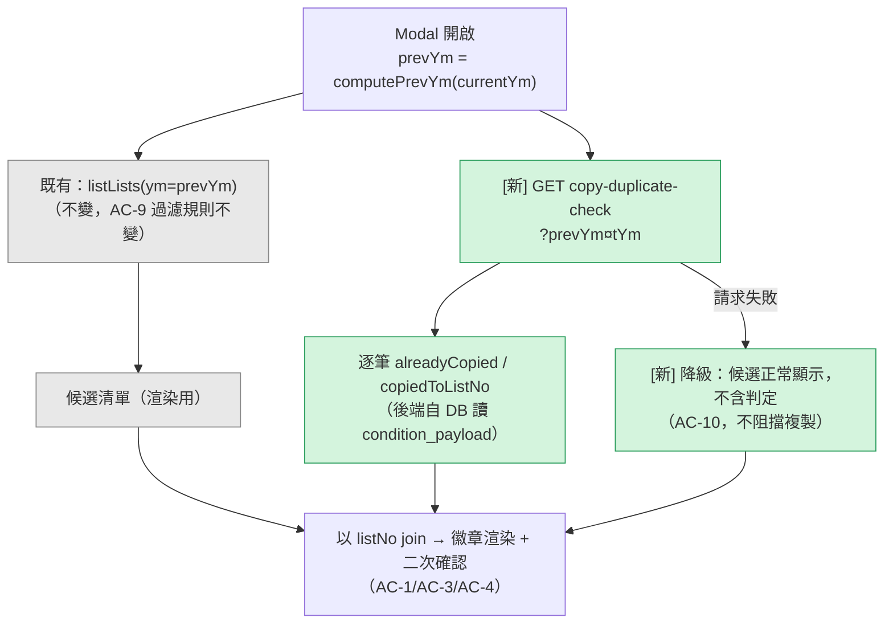

# AD-E07-48：F117 部門比例「有處長」過濾 + F118 從上月複製「已複製過」提示 — 架構設計

> **✅ 本 AD 已核可（v1.1 / 2026-08-04 人工審閱閘），可作為 TDD 實作依據。** F117 v1.1 / F118 v1.1 兩份 feature spec 均為 Approved，原業務阻塞事項（OQ-F117-B1 / OQ-F118-B2 / OQ-F118-B3）全數裁決完畢（§10.1）。
>
> **v1.1 主要修訂**：F118 判定端點由 `POST`（前端傳候選）改為 **`GET ?prevYm&currentYm`**（後端自載候選）——OQ-F118-B3 裁決使候選過濾規則唯一明確，原解耦動機消失，而 GET 讓判定所用之 `condition_payload` 與儲存端**同源**，強化 AC-2「依建構即一致」。詳見 §5.1。

## Agent Loading Guide

| Agent 角色 | 需載入章節 |
|-----------|-----------|
| TDD Developer（F117） | §3.1 + §4（GET/PUT 完整契約、`computeActiveDirectorMap` 抽取、孤兒保留演算法）+ §8 不變式 |
| TDD Developer（F118） | §3.2 + §5（新端點契約、`checkCopyDuplicates` 方法、`findActiveConditionDuplicate` 的最小修改）+ §8 不變式 |
| Test Designer | §3（裁定摘要）+ §8（不變式/邊界案例）+ §9（測試邊界，兩者皆 SQLite 可測，無 PG-only 限制） |
| UI/UX Designer | §4.2（GET response 形狀）+ §5.2（判定端點 response 形狀）；prototype 落差另見 [F117 §7](../features/F117-dept-ratio-director-required-filter.md) / [F118 §7](../features/F118-copy-from-prev-month-duplicate-indicator.md) |
| Product Analyst | §10（風險與待決事項，含既有落差之延伸判斷） |

---

## 1. 背景與問題定義

F117（US-180）與 F118（US-181）為同批次交付之 E07 UX 精煉 feature，皆為對既有已上線流程（F079 部門比例設定、F050 從上月複製）疊加**不改變資料模型**之限縮 / 提示邏輯。two features 因下列共通性合併於同一 AD：

- 兩者皆為既有 service（`DeptRatioService` / `AssignmentListService`）之**增量擴充**，不需新模組、不需 migration。
- 兩者 spec（[F117 §12.2](../features/F117-dept-ratio-director-required-filter.md) / [F118 §12.3](../features/F118-copy-from-prev-month-duplicate-indicator.md)）皆明確將 1 項 HOW 決策留給 system-architect：F117 的 flag 命名與併發語意（A-1/A-2）、F118 的端點拓樸與選取決定性（OQ-F118-01/02）。
- 兩者皆不影響對方之元件邊界（F117 觸及 `assignment-stage` 模組、F118 觸及 `assignment-list` 模組），**可獨立部署、獨立進入 TDD、順序無關**。

---

## 2. 既有架構基礎（不修改語意，本 AD 僅疊加）

| 元件 | 檔案 | 角色 |
|---|---|---|
| `DeptRatioService.getDeptRatios` / `setDeptRatios` | `apps/api/src/modules/assignment-stage/dept-ratio.service.ts` | F079 GET/PUT 主邏輯；**GET 現行已計算 `directorMap`**（`jfun_nm='處長'` + 在職 + 同部門取最早到職）並回傳 `directorName` 逐列——F117 所需之處長判定資料**已存在於現行查詢中**，非新查詢 |
| `activeEmphireCondition(alias)` / `todayYmd()` | `apps/api/src/common/emphire/emphire-active.util.ts` | 全系統唯一在職判定（`resign_date IS NULL OR >= 系統日`，哨兵 `9999-12-31`）；F117 BR-1/AC-2 之處長在職判定**必須**沿用此 util，不得另立 |
| `AssignmentListService.findActiveConditionDuplicate` | `apps/api/src/modules/assignment-list/assignment-list.service.ts:1328` | 名單建立/編輯時之重複偵測（422 `LIST_NO_DUPLICATE`）；單一 `cardType` 參數 → 一次查詢候選 → 逐筆 `normalizeConditionPayload` 比對 |
| `AssignmentListService.normalizeConditionPayload`（private） | 同上 `:525` | 排除 system-fixed 欄位後之簽章正規化；F118 BR-1「單一判定來源」之**唯一**合法呼叫對象 |
| `AssignmentListService.loadSystemFixedFields`（private） | 同上 `:206` | 查詢 `is_system_fixed=true` 欄位集合，供 `normalizeConditionPayload` 排除 |
| `AssignmentListController`（`assignment/lists`） | `apps/api/src/modules/assignment-list/assignment-list.controller.ts` | class 級 `DirectorOrSectionChiefGuard`（讀）+ `DirectorGuard`（寫，method 級 `@RequireDirector`） |
| `CopyFromPrevMonthModal` + `computePrevYm` | `apps/web/src/pages/assignment/_components/copy-from-prev-month-modal.tsx` | 現行呼叫 `listLists({ ym: prevYm })` 取得候選（`AssignmentListItem` 已含 `conditionPayload` / `cardType`），前端過濾 `conditionPayload != null` |

**關鍵既有事實（決定本 AD 設計）**：

1. **F117 無新查詢成本**：`getDeptRatios` 現行已為每個部門計算 `directorMap.get(code)` 並回傳 `directorName`。`hasActiveDirector` 僅是該既有欄位的布林投影，`isRatioEditable` 是其直接推論。真正的新工作是（a）依此分類過濾/標記陣列、（b）將同一套判定邏輯**搬進 PUT 路徑**（現行 PUT 完全不查 `ob_emphire`）。
2. **F118 之候選資料已在前端**：`AssignmentListItem`（`apps/web/src/api/assignment-list.ts:64,88`）已含 `cardType` 與 `conditionPayload`，即 Modal 現有的 `listLists(prevYm)` 呼叫已把判定所需的「上月候選」資料完整送到前端。因此判定端點**不需要重新查詢上月候選**，只需要「本月 active 名單」一份資料 + 記憶體比對。這是本 AD 選擇 §5.1 端點拓樸的關鍵依據。
3. **`copy-source-options` 端點路徑本身即為虛構**：[data-model.md](../data-model.md) 與 [F050 §6.1](../features/F050-create-list-definition.md) 描述的路徑為 `/api/v1/assignment/list-definitions/copy-source-options`，但實際 controller 路由前綴為 `assignment/lists`（非 `assignment/list-definitions`）——`list-definitions` 前綴在目前程式碼中**完全不存在**。此為佐證「該端點從未依現行路由慣例被實作、規格與實作徹底脫節」的額外證據（超出 spec-writer 已查證之「grep 命中 0」），強化本 AD 選擇不透過補完該殭屍端點來實作 F118（§5.1 D-1）。
4. `findActiveConditionDuplicate` 目前查詢候選集合**無顯式 `ORDER BY`**（`qb.getMany()` 依 DB 隱式順序），多筆同簽章候選時的選取結果理論上非決定性。F118 BR-4 要求「選取結果須與 `findActiveConditionDuplicate` 之選取一致」，此為本 AD 必須修正的既有小缺口（§5.3）。

---

## 3. 架構師裁定彙總

### 3.1 F117 裁定

| # | 議題 | 裁定 |
|---|---|---|
| A-1 | GET query flag 命名 | 採 spec 建議 `requireDirector`，比照既有 `excludeZeroRatio` 之 API 層 flag 慣例 |
| A-2 | 孤兒判定併發語意 | **不引入樂觀鎖 / advisory lock**。GET 與 PUT 皆為「呼叫當下即時查詢 `ob_emphire`」；PUT 之判定時點在 §4.3 步驟 2（進入 DB transaction 之前，與現行 `ratioValidation.assertEachInRange/assertSumEquals100` 之呼叫時機一致，非新模式）。理由：處長人事異動為低頻 admin 操作，與 PUT 操作視窗重疊機率極低；即使重疊，最差結果僅為「多保留一列孤兒」或「少保留一列」，兩者皆非資料損壞（前者下次載入即修正、後者觸發 BR-6 422 由使用者重試），不構成需要鎖定機制的資料完整性風險 |
| A-2' | 元件邊界 | **不新增 service / module**。三分類邏輯 + PUT 孤兒保留邏輯直接擴充 `DeptRatioService`，透過抽取共用 private method `computeActiveDirectorMap()`（見 §4.1）避免 GET/PUT 出現第二套判定實作（呼應 spec BR-1「禁止新增第二套在職/職稱判定」） |
| — | 端點拓樸 | **不新增端點**。沿用既有 `GET/PUT /api/v1/assignment/ratios/dept/:listNo`，回應/請求皆為增量欄位（§4.2/§4.3），對未帶 `requireDirector` 之既有呼叫端零 breaking change |

### 3.2 F118 裁定

| # | 議題 | 裁定 |
|---|---|---|
| OQ-F118-01 | 判定端點拓樸 | **不採 spec 建議之選項 (A)（補完 `copy-source-options`）**，改採獨立最小端點（§5.1）。理由見 §5.1「決策說明」。**v1.1 修訂**：該端點由 `POST`（前端傳候選）調整為 **`GET ?prevYm&currentYm`**（後端自載候選）——OQ-F118-B3 裁決後解耦動機消失，且 GET 使判定與儲存端讀取同源，強化 AC-2；副作用：需注意 NestJS 字面路由須前置於 `:listNo` 動態路由 |
| OQ-F118-02 | 多筆等價之選取決定性 | 明訂 `ORDER BY list_no ASC`，先出現者（字典序最小 `list_no`）勝出；**同步修正** `findActiveConditionDuplicate` 之既有查詢加上同一排序，確保兩條路徑決定性一致（AC-2/AC-4 依建構一致的前提） |
| — | `normalizeConditionPayload` 重用方式 | **不抽取新檔案**。新方法與 `findActiveConditionDuplicate` 同屬 `AssignmentListService`，直接呼叫既有 private method，零重構風險 |
| — | 端點命名前綴 | 沿用 `AssignmentListController` 實際路由前綴 `assignment/lists`（**非**兩份既有文件誤植的 `assignment/list-definitions`，見 §2 事實 3） |

---

## 4. F117 詳細設計

### 4.1 共用 helper：`computeActiveDirectorMap`

自現行 `getDeptRatios`（`dept-ratio.service.ts:104-120`）抽取為 private method，GET／PUT 共用：

```typescript
// DeptRatioService 內新增 private method（自 getDeptRatios 既有邏輯抽取，邏輯零變更）
private async computeActiveDirectorMap(): Promise<Map<string, string>> {
  const sysDate = todayYmd();
  const directorRows = await this.emphireRepo
    .createQueryBuilder('e')
    .select('TRIM(e.dept_code)', 'dept_code')
    .addSelect('TRIM(e.emp_nm)', 'emp_nm')
    .where(activeEmphireCondition('e'), { sysDate })
    .andWhere(`TRIM(e.jfun_nm) = '處長'`)
    .orderBy('TRIM(e.dept_code)', 'ASC')
    .addOrderBy('CASE WHEN e.hire_date IS NULL THEN 1 ELSE 0 END', 'ASC')
    .addOrderBy('e.hire_date', 'ASC')
    .getRawMany<{ dept_code: string; emp_nm: string }>();
  const map = new Map<string, string>();
  for (const row of directorRows) {
    if (row.dept_code && !map.has(row.dept_code)) map.set(row.dept_code, row.emp_nm || '');
  }
  return map;
}
```

`getDeptRatios` 之既有 inline 邏輯（現行第 104-120 行）改為呼叫此方法，行為零變更（純重構）。

### 4.2 GET 契約增量

```typescript
// getDeptRatios 回傳型別新增欄位（deptRatios[] 逐列）
{
  hasActiveDirector: boolean;   // directorMap.has(code) 之投影
  isRatioEditable: boolean;     // === hasActiveDirector
}
// 回應層新增
{
  hiddenNoDirectorCount: number; // requireDirector=true 時：本次因「無關部門」被過濾掉的列數；否則恆 0
}
```

**過濾規則**（僅 `requireDirector=true` 生效）：`allDeptIds` 依既有邏輯合併「在職部門」∪「既有 ration 紀錄部門」後，逐列依 `hasActiveDirector` 與 `ration > 0` 分類：

| hasActiveDirector | ration > 0 | 分類 | GET 行為（`requireDirector=true`） |
|---|---|---|---|
| true | — | 有處長部門 | 保留，`isRatioEditable=true` |
| false | true | 孤兒部門 | 保留，`isRatioEditable=false` |
| false | false（或無紀錄） | 無關部門 | **自陣列移除**，計入 `hiddenNoDirectorCount` |

`hasActiveDirector` / `isRatioEditable` 兩欄**恆計算並回傳**（無論 flag 是否帶入）——對既有消費端（AC-10：準備完成摘要 `excludeZeroRatio=true`、Detail Drawer）為**新增欄位、零行為變更**（兩者皆不讀取這兩個新欄位；`deptRatios` 陣列內容 / `total` 計算方式不受影響，因為未帶 `requireDirector` 時不套用過濾）。

### 4.3 PUT 流程增量（BR-4/5/6/7）

```
1) runGuard.assertNoRunningRun()                              // 既有，不變
2) findListOrThrow + assertNotHistorical + assertListActive   // 既有，不變
3) stageTransition.assertStageEquals(listNo, 'dept_ratio')    // 既有，不變
4) [新] directorMap = await computeActiveDirectorMap()
5) [新] beforeRows = await deptPctRepo.find({ project_workym, list_no })  // 既有查詢，前移至此並重用
6) [新] orphanRows = beforeRows.filter(r => !directorMap.has(r.obdeptid.trim()) && Number(r.ration) > 0)
7) [新] orphanIds = new Set(orphanRows.map(r => r.obdeptid.trim()))
8) [新] BR-6 防呆：payload 中若有 deptId ∉ orphanIds 且 !directorMap.has(deptId) 且 ration > 0
        → 422 RATIO_DEPT_DIRECTOR_REQUIRED（帶 deptCode）
9) [新] finalRows = payload.filter(r => !orphanIds.has(r.obdeptId))       // BR-5：孤兒列以 payload 中的值一律忽略
              ∪ orphanRows（原樣，含原 ration/obdeptnm/created_by 等）     // BR-4：孤兒列強制保留
10) ratioValidation.assertEachInRange(finalRows.map(r => ration))
    ratioValidation.assertSumEquals100(finalRows.map(r => ration))        // BR-7：驗證對象改為 finalRows
11) Tx：DELETE 既有 + INSERT finalRows + audit（before=beforeRows, after=finalRows）  // BR-9
```

**與現行程式碼的差異範圍**：步驟 1-3 完全不變；步驟 4/6/7/8/9 為新增；步驟 5（`beforeRows` 查詢）從「僅供 audit before_value」擴大為「同時作為孤兒判定輸入」，查詢本身不變只是提前並重用；步驟 10/11 之驗證與寫入對象從 `dto.deptRatios` 改為 `finalRows`。**不改變 transaction 邊界**（步驟 11 仍是唯一的 `dataSource.transaction`），孤兒判定（步驟 4-9）維持在 transaction 之外執行，與 A-2 裁定一致。

---

## 5. F118 詳細設計

### 5.1 新端點：`GET /api/v1/assignment/lists/copy-duplicate-check`

> **🔄 v1.1 修訂（2026-08-04 人工審閱閘）**：本節原設計為 `POST`，由前端把已持有之候選資料（含 `conditionPayload`）送回後端判定；**改為 `GET /api/v1/assignment/lists/copy-duplicate-check?prevYm=YYYYMM&currentYm=YYYYMM`**，候選由後端自行載入。
>
> **修訂理由**：原 POST 設計唯一的動機是「與候選過濾規則解耦」，以免 F118 被 OQ-F118-B3（複製範圍四方不一致）阻塞——**該 OQ 已於人工審閱閘裁決**（以實作為準：`status='active'` AND `condition_payload IS NOT NULL`），候選規則自此唯一且明確，解耦動機消失。改 GET 另有一項**實質強化**：判定所用之 `condition_payload` 直接由後端自 DB 讀取，與儲存端 `findActiveConditionDuplicate` **同源**；POST 設計則使 AC-2 之一致性額外依賴「前端忠實往返 payload」——一旦 `listLists` 日後對 payload 做任何裁剪或正規化，判定即與 422 靜默分歧，而 AC-2 正是本 feature 的核心不變式。代價為查詢次數 2 → 3（多一次上月候選查詢），仍為常數，不影響 AC-7。
>
> 下方「決策說明」之論點 1（不補完 `copy-source-options`）與論點 3（查詢次數為常數）**仍然成立**；論點 2（由前端傳入候選）已由本次修訂取代。

**決策說明（取代 spec 原建議之選項 A）**：

spec §5.1 建議擴充 `copy-source-options`（因其語意「可複製來源選項」與判定同屬一事、避免兩次請求）。architect 改採獨立最小端點，理由：

1. `copy-source-options` 目前是**完全不存在**的端點（§2 事實 2/3），補完它意味著同時要對齊 [F050 §4 AC-5](../features/F050-create-list-definition.md) 與 [data-model.md](../data-model.md) 互相矛盾的候選過濾規則（`stage='ready'` vs 實際的無此過濾），而這正是 [OQ-F118-B3](../open-questions.md) 待業務裁示之範圍——選項 A 會讓 F118（一個獨立、範圍明確的 UX 提示 feature）的可實作性**被綁定**在一個無關的、更大範圍的業務決策上。
2. 前端 Modal 現行的 `listLists(prevYm)` 呼叫已回傳判定所需的**全部**上月候選資料（`conditionPayload` + `cardType`，見 §2 事實 2）。判定端點因此**不需要知道「候選過濾規則」是什麼**——由前端把它已經合法持有的候選資料（listNo/conditionPayload/cardType）傳入，端點只需查詢「本月 active 名單集合」一次，回傳逐筆判定。此設計與候選集合的定義**完全解耦**，OQ-F118-B3 未來無論如何裁示都不影響本端點。
3. 查詢次數不劣於選項 A：本設計僅 2 次查詢（`loadSystemFixedFields` + 本月 active 名單），且完全不重跑上月候選查詢（該查詢已由既有 `listLists` 完成）。

**Request（v1.1：query params）**：

| 參數 | 型別 | 必填 | 說明 |
|---|---|---|---|
| `prevYm` | `YYYYMM` | ✅ | 上月（候選來源月）。由呼叫端帶入，非後端推導 |
| `currentYm` | `YYYYMM` | ✅ | 本作業月（判定目標月）。AC-5：F097 作業月語意，非後端系統當月 |

**Response**：

```typescript
interface CheckCopyDuplicateResult {
  prevYm: string;
  currentYm: string;
  items: Array<{
    listNo: string;             // prevYm 之候選 listNo（涵蓋全部符合 BR-9 過濾者）
    alreadyCopied: boolean;
    copiedToListNo: string | null;
  }>;
}
```

前端以 `listNo` 對既有 Modal 清單（來自 `listLists({ ym: prevYm })`）做 join；`items` 未涵蓋之 `listNo` 一律視為未標示（AC-10 降級語意）。

**Guard**：class 級既有 `DirectorOrSectionChiefGuard`（讀），method **不**加 `@RequireDirector`（比照 `getFullSnapshot` 之唯讀端點慣例）；**不**套用 `FeatureFlagGuard` / `LIST_HISTORICAL_READONLY` / `ASSIGNMENT_RUN_ALREADY_RUNNING`（純唯讀提示，不影響任何寫入路徑，呼應 I-F118-READONLY-JUDGE-01）。

**路由宣告位置**：`assignment/lists` controller 下新增 `@Get('copy-duplicate-check')`。⚠️ **必須宣告於任何 `@Get(':listNo...')` 動態路由之前**，否則 NestJS 會將字面路徑 `copy-duplicate-check` 誤匹配為 `:listNo`（此為 GET 化後**新引入**之排序限制，POST 設計時不存在）。

### 5.2 `AssignmentListService.checkCopyDuplicates`（新增 public method）

```typescript
/**
 * F118 — 從上月複製「已複製過」判定（唯讀，不落表）。
 *
 * v1.1（人工審閱閘）：候選改由後端自 prevYm 載入，不再由前端傳入 —— 判定所用之
 * condition_payload 與儲存端 findActiveConditionDuplicate 同源（AC-2 之結構性保證）。
 *
 * 查詢次數固定為 3（loadSystemFixedFields + 上月候選 + 本月 active 名單），
 * 與候選筆數無關（AC-7 / BR-3 / I-F118-CONST-QUERY-01）。
 * 正規化與比對邏輯 100% 重用 normalizeConditionPayload（BR-1 / I-F118-SINGLE-NORMALIZE-01）。
 */
async checkCopyDuplicates(
  prevYm: string,
  currentYm: string,
): Promise<Array<{ listNo: string; alreadyCopied: boolean; copiedToListNo: string | null }>> {
  const systemFixedColumnNames = new Set(
    (await this.loadSystemFixedFields()).map((f) => f.columnName),
  );

  // 上月候選：與 Modal 之候選過濾一致（BR-9；OQ-F118-B3 裁決後之權威定義）
  //   status='active' AND condition_payload IS NOT NULL —— 無 stage='ready'
  const candidates = (
    await this.listRepo.find({
      where: { project_workym: prevYm, status: 'active' },
      order: { list_no: 'ASC' },
    })
  )
    .filter((l) => l.condition_payload != null)
    .map((l) => ({
      listNo: l.list_no,
      conditionPayload: l.condition_payload,
      cardType: l.card_type ?? null,
    }));

  // 單一查詢：本月 active 名單（含 condition_payload + card_type），
  // ORDER BY list_no ASC → 與 findActiveConditionDuplicate 選取邏輯一致（OQ-F118-02 / I-F118-CONFLICT-ORDER-01）
  const currentActive = await this.listRepo.find({
    where: { project_workym: currentYm, status: 'active' },
    order: { list_no: 'ASC' },
  });

  const index = new Map<string, string>(); // key = `${cardType ?? ''}::${signature}` -> listNo（先到先贏）
  for (const l of currentActive) {
    const payload = l.condition_payload ?? this.legacyEntityToConditionPayload(l);
    const sig = this.normalizeConditionPayload(payload, systemFixedColumnNames);
    if (sig === '') continue; // AC-10：無可比對條件恆不標示
    const key = `${l.card_type ?? ''}::${sig}`;
    if (!index.has(key)) index.set(key, l.list_no);
  }

  return candidates.map((c) => {
    const sig = this.normalizeConditionPayload(c.conditionPayload, systemFixedColumnNames);
    if (sig === '') return { listNo: c.listNo, alreadyCopied: false, copiedToListNo: null };
    const match = index.get(`${c.cardType ?? ''}::${sig}`);
    return match
      ? { listNo: c.listNo, alreadyCopied: true, copiedToListNo: match }
      : { listNo: c.listNo, alreadyCopied: false, copiedToListNo: null };
  });
}
```

### 5.3 對既有 `findActiveConditionDuplicate` 的最小修改（決定性對齊）

現行查詢（`assignment-list.service.ts:1344-1359`）無顯式排序。新增一行：

```typescript
const qb = this.listRepo
  .createQueryBuilder('l')
  .where("l.status = 'active'")
  .andWhere('l.project_workym = :ym', { ym })
  .orderBy('l.list_no', 'ASC'); // [AD-E07-48 新增] 決定性：多筆同簽章候選時取 list_no 最小者
```

**影響評估**：此為既有、已上線之 F050/F051 建立/編輯流程的**唯一修改點**。在「同一 `(project_workym, status='active', card_type)` 下存在 ≥2 筆完全等價 condition_payload 之名單」的既有異常狀態下（正常流程本應被 422 擋下，只可能因歷史資料或該檢查上線前建立的名單而存在），此修改會使 `conflictListNo` 從「隱式 DB 順序」改為「決定性 list_no 最小者」，屬於行為收斂而非邏輯變更，但**技術上是對既有測試通過路徑的修改**，建議 TDD 階段對此加一則回歸測試（多筆歷史等價名單情境下 `conflictListNo` 穩定）。

### 5.4 前端整合流程（Modal 端，不改變既有候選查詢）



---

## 6. Schema / Migration

**F117：無**。「有無在職處長」為查詢時衍生狀態（[data-model.md v1.19](../data-model.md) 已載明），`ob_dept_pct` / `ob_emphire` 皆不新增欄位。

**F118：無**。「已複製過」為查詢時衍生結果，不新增 `ob_list_definition` 欄位、不新增資料表。

兩者皆無需 dev MSSQL migration-managed 流程（見專案記憶 `feedback_dev_mssql_migration_managed`）。

---

## 7. 錯誤碼

沿用 [error-handling.md](../error-handling.md) 既有登錄：F117 新增 `RATIO_DEPT_DIRECTOR_REQUIRED`（422，已於 v1.18 登錄，DRAFT 狀態隨母 spec）。F118 不新增錯誤碼。

---

## 8. 不變式

| 不變式 | 說明 |
|---|---|
| **I-F117-DIRECTOR-SINGLE-SOURCE-01** | 「部門是否有在職處長」之判定僅有 `computeActiveDirectorMap` 一份實作，GET／PUT 皆呼叫此方法，禁止平行實作 |
| **I-F117-ORPHAN-PRESERVE-01** | PUT 之覆寫式寫入（DELETE+INSERT）必須先計算孤兒列並強制併入最終寫入集合，不論其是否出現於 payload |
| **I-F117-SUM-SCOPE-01** | 加總驗證（`RATIO_SUM_NOT_100`）之對象為「最終持久化集合」（payload 扣除孤兒覆寫 ∪ 保留之孤兒列），非原始 payload |
| **I-F117-HIDDEN-ZERO-01** | 「無關部門」（隱藏）之既有 `ration` 恆為 0 或無紀錄；此為三分類演算法之分類條件本身保證（`ration > 0` 才歸孤兒），非外部斷言，維持此條件是 AC-1/AC-3 可並存的根據，修改分類邏輯時須連帶重新論證 |
| **I-F118-SINGLE-NORMALIZE-01** | `checkCopyDuplicates` 與 `findActiveConditionDuplicate` 共用同一 private method `normalizeConditionPayload`，禁止平行實作 |
| **I-F118-CONST-QUERY-01** | `checkCopyDuplicates` 執行固定 2 次查詢（system-fixed 欄位 + 本月 active 名單），與 `candidates.length` 無關 |
| **I-F118-CONFLICT-ORDER-01** | `findActiveConditionDuplicate` 與 `checkCopyDuplicates` 皆以 `list_no ASC` 為決定性排序，多筆同簽章候選時選取結果須一致 |
| **I-F118-READONLY-JUDGE-01** | 判定端點不寫入任何資料表，且不影響 `createList`/`updateList` 既有 422 檢查路徑；判定結果為建議性提示，真正攔截仍在儲存時發生 |
| ~~I-F118-CLIENT-PAYLOAD-TRUST-01~~ | **v1.1 移除**：端點 GET 化後不再接受前端傳入之候選，`condition_payload` 一律由後端自 DB 讀取（與 `findActiveConditionDuplicate` 同源），原「信任前端 payload」之信任模型已不適用。此變更同時消除了「前端往返 payload 失真 → 判定與 422 靜默分歧」之風險 |

---

## 9. 非功能需求對應與測試邊界

- **效能**（[nfr.md NFR-002.1](../nfr.md)）：F117 GET/PUT 之查詢數與現行完全相同（`computeActiveDirectorMap` 為既有查詢的抽取，非新增）；F118 判定端點固定 2 次查詢，候選數 N 可達 20+ 時仍為常數，符合一般 API 回應時間目標。
- **測試邊界**：F117／F118 皆**無 PG-only 依賴**（不涉及 `customer_core`、不涉及 `TABLESAMPLE`），完整邏輯可於 SQLite unit test 覆蓋，`.pg.spec.ts` / `.mssql.spec.ts` 僅需驗證既有 dialect 差異（如 `emphire-active.util` 的既有兩軌測試模式），無需新增 dialect-only 測試分支——這是本 AD 兩個 feature 相對於近期多數 E07 AD（P3~P6 系列、F109、F110）的顯著簡化點。
- **安全性**：兩端點皆沿用既有 Guard 鏈（`DirectorOrSectionChiefGuard`／`DirectorGuard`），無新信任邊界；F118 判定端點為純唯讀且不接受前端候選資料（v1.1），無新信任邊界。

---

## 10. 風險、殘留議題與待人工確認事項

### 10.1 業務阻塞事項 — ✅ 已於 2026-08-04 人工審閱閘全數解除

| 事項 | 裁決 |
|---|---|
| **OQ-F117-B1** | ✅ 採「顯示但鎖定 ＋ 後端強制保留」；**不**提供「強制歸零」操作（出場機制沿用既有 F081「退回草稿」，其 DELETE 全部 `ob_dept_pct` 列）。**連帶使 §10.2 R-1 風險消滅**——BR-5 之絕對鎖定語意不需開例外通道 |
| **OQ-F118-B2** | ✅ 業務接受「編輯條件後即不再標記」；方案 (b) 語意等價為最終選型 |
| **OQ-F118-B3** | ✅ 以現行實作為準修正三處 spec（F050 / data-model / US-106 已同輪修正）。**連帶影響本 AD**：候選過濾規則自此唯一明確，§5.1 之解耦動機消失，端點已改為 GET（見 §5.1 v1.1 修訂） |

### 10.2 架構層級風險（低，供人工審閱確認）

| # | 風險 | 評估 |
|---|---|---|
| ~~R-1~~ | ~~F117 BR-5「孤兒列一律忽略 payload 值」與可能之「強制歸零」操作互相牴觸~~ | ✅ **已消滅**（2026-08-04）：OQ-F117-B1 裁定**不做**強制歸零，BR-5 之絕對鎖定語意成立，無需例外通道 |
| R-2 | §5.3 對 `findActiveConditionDuplicate` 加入 `ORDER BY` 屬於對既有已上線程式碼的修改 | 低；純粹將既有非決定性行為收斂為決定性，建議 TDD 階段補一則回歸測試（見 §5.3 說明） |
| R-3 | F118 §5.1 選擇的端點設計使 Modal 開啟時仍為兩次請求（`listLists` + `copy-duplicate-check`） | 低；兩次請求皆為輕量查詢，不影響 NFR-002.1。**v1.1 補充**：改 GET 後兩者已無先後相依（判定不再需要先取得候選），前端可**並行發出**，實際延遲不劣於單次請求 |
| R-4 | `copy-source-options` 殭屍端點（spec 已規格、從未實作）在本 AD 之後**依然存在**，未被清除或補完 | 低但需追蹤；建議由 product-analyst / spec-writer 於 OQ-F118-B3 裁示時一併決定其去留（清除文件描述，或日後若確實需要「可複製來源」之獨立查詢語意時才補實作），本 AD 不代為決定 |

### 10.3 需人工確認之架構決策 — ✅ 已於 2026-08-04 人工審閱閘確認

1. ✅ F118 端點拓樸採獨立端點（非補完 `copy-source-options`）——已確認；殭屍端點之清理轉為獨立技術債（[open-questions.md](../open-questions.md) OQ-F118-06），並已於 data-model.md 標註「不得作為實作依據」。端點本身於本次審閱另調整為 GET（§5.1 v1.1）。
2. ✅ F117 不引入樂觀鎖（A-2）——已確認可接受該極小競態視窗。
3. ✅ §5.3 對既有 `findActiveConditionDuplicate` 加入 `ORDER BY list_no ASC`——已確認無已知流程依賴其非決定性順序；TDD 階段仍須補一則回歸測試（多筆歷史等價名單下 `conflictListNo` 穩定）。

---

## 11. 變更紀錄

| 版本 | 日期 | 變更內容 |
|---|---|---|
| v1.1 | 2026-08-04 | **人工審閱閘通過，DRAFT → Approved**。三項業務阻塞全數解除（§10.1）；F118 判定端點由 `POST`（前端傳候選）改為 **`GET ?prevYm&currentYm`**（後端自載候選，判定與儲存端讀取同源以強化 AC-2；新增 NestJS 字面路由須前置之注意事項）；`checkCopyDuplicates` 簽章與查詢次數同步更新（2 → 3，仍為常數）；R-1 風險消滅（不做強制歸零）；R-3 補述兩請求可並行；§10.3 三項架構決策全數確認 |
| v1.0 | 2026-08-04 | 初版（DRAFT，已由 v1.1 取代其 F118 端點裁定）。裁定 F117 flag 命名（`requireDirector`）、併發語意（不引入樂觀鎖）、元件邊界（擴充既有 `DeptRatioService`，抽取 `computeActiveDirectorMap` 共用）；裁定 F118 端點拓樸（獨立最小端點 `POST copy-duplicate-check`，取代 spec 建議之 `copy-source-options` 補完方案）、選取決定性（`ORDER BY list_no ASC`，同步修正既有 `findActiveConditionDuplicate`）。新增 9 個不變式。**本 AD 隨母 spec 為 DRAFT，OQ-F117-B1 / OQ-F118-B2 業務裁示前不可進入 TDD** |
