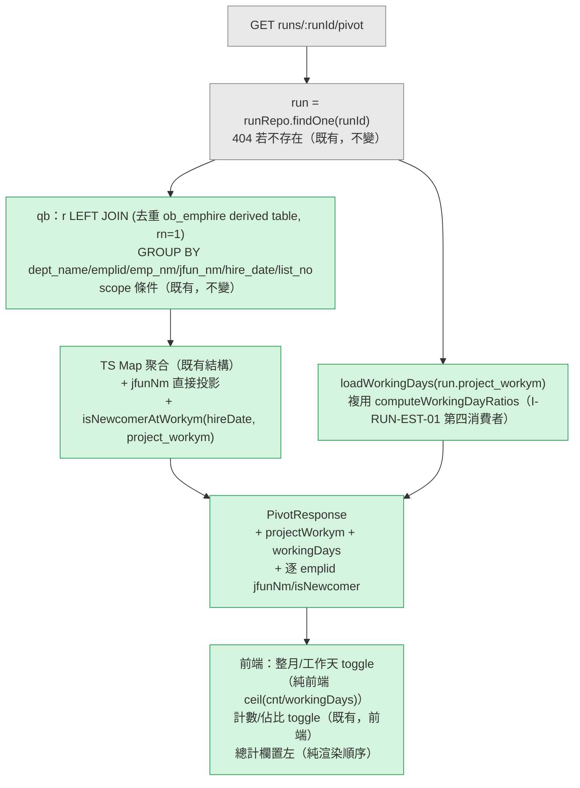

# AD-E07-49：F116 v1.1 樞紐分析頁籤 — 職稱／新人標註／總計欄置前／工作天模式架構設計

> **✅ 本 AD 可作為 TDD 實作依據。** F116 v1.1 spec（[features/F116-snapshot-pivot-analysis.md](../features/F116-snapshot-pivot-analysis.md)）§12 列出 A-1 ~ A-5 五項 HOW 層級待確認事項，本 AD 逐項裁定（§3）。其中 **A-4 推翻 spec 對現行程式碼行為的樂觀假設**（詳見 §2 事實 4 / §4.2）；其餘四項確認 spec 預設立場，不需回頭修訂 spec 契約。

## Agent Loading Guide

| Agent 角色 | 需載入章節 |
|-----------|-----------|
| TDD Developer | §3（裁定彙總）+ §4（`getPivot` SQL 重構、`workingDays` 共用 helper、`isNewcomerAtWorkym` 純函式）+ §7 不變式 |
| Test Designer | §3 + §7（不變式/邊界案例）+ §8（測試邊界，SQLite 全可測，無 dialect-only 分支） |
| UI/UX Designer | §4.3（response 契約增量形狀）；視覺細節 authority 仍為 `prototypes/35-snapshot-detail.html`（本 AD 不涉及） |
| Product Analyst | §9（風險與殘留議題） |

---

## 1. 背景與問題定義

F116 v1.0（2026-07-14 上線）於快照詳情新增「樞紐分析」頁籤，`AssignmentRunReportService.getPivot()` 以 `ob_monthly_run_result LEFT JOIN ob_emphire` 聚合部門 × 員編 × 名單代號計數。US-182（2026-08-13 人工閘門裁定）要求三項 UX 精修：員編列補職稱＋新人標註、總計欄移至最左（純前端渲染順序，不涉架構）、新增「整月／工作天」第二維度。spec-writer 已產出 F116 v1.1（§12 列 A-1~A-5 五項待 architect 確認事項）。本 AD 逐項裁定並提供具體實作設計，供 TDD Developer 直接銜接。

---

## 2. 既有架構基礎（不修改語意，本 AD 僅疊加）

| 元件 | 檔案 | 角色 |
|---|---|---|
| `AssignmentRunReportService.getPivot` | `apps/api/src/modules/assignment/services/assignment-run-report.service.ts:497` | F116 v1.0 主邏輯；LEFT JOIN `ob_emphire` 後於 TS 端以巢狀 `Map` 聚合為 `PivotResponse`（不 join `ob_pool_data`） |
| `resolveCalendarDay` / `computeWorkingDayRatios` | `apps/api/src/modules/assignment-list/stage0-estimate.service.ts:169,204` | **匯出之純函式**（非 class method），F049 Stage0 試算與 F101 ASSIGNDAY 共用之唯一工作日判準來源（`CalendarSource='weekday'` = `rest_flg='0'`）；`computeWorkingDayRatios` 內部已呼叫 `resolveCalendarDay` 過濾非工作日，回傳陣列**僅含工作日** |
| `AssignmentRunPipelineService.loadWorkingDayRatios(ym)` | `apps/api/src/modules/assignment/services/assignment-run-pipeline.service.ts:988-1001` | **F101 既有 private method**，F116 A-2 之直接可複用範本：以 `'YYYY-MM-DD'` 字串邊界（非 `Date` 物件，符合 T-3）查 `ob_calendar`，呼叫 `computeWorkingDayRatios(rows)` |
| `ObCalendar` entity | 已列於 `AssignmentModule`（`assignment.module.ts:65`）`TypeOrmModule.forFeature` | pivot 所在模組**已具備** `ObCalendar` repository 存取權，無需新增模組相依 |
| `AssignmentRunReportService` constructor | 同上 `:345-358` | 已注入 `DataSource`（`getPivot` 現行即以 `this.dataSource.getRepository(ObMonthlyRunResult)` 取得 repo）；`getResultPage` 等既有方法同構 |
| `ObEmphire` entity | `apps/api/src/database/entities/ob-emphire.entity.ts:11` | `emp_id` 為 `@PrimaryColumn`（PK） |

**關鍵既有事實（決定本 AD 設計）**：

1. **A-2 已有現成同構前例**：`assignment-run-pipeline.service.ts` 早已建立「`assignment` 模組直接 import `assignment-list/stage0-estimate.service.ts` 之匯出純函式」的慣例（`import { computeWorkingDayRatios } from '@/modules/assignment-list/stage0-estimate.service';`，第 53 行），且該慣例**只匯入 pure function，不匯入/不注入 `Stage0EstimateService` class**，因此**不需要**在 `assignment.module.ts` 加入 `imports: [AssignmentListModule]`——不構成 NestJS Module 級相依，遑論循環相依。F116 A-2 應完全比照此既有慣例，而非另立新模式。
2. **A-2 查詢邏輯已有現成範本**：`loadWorkingDayRatios(ym)`（同檔案 988-1001 行）已完整實作「YYYYMM → 月份頭尾 `'YYYY-MM-DD'` 字串邊界 → 查 `ob_calendar` → `computeWorkingDayRatios`」全流程，且與 `AssignmentRunReportService`（pivot 所在）同屬 `AssignmentModule`。`workingDays` 數值本身即 `computeWorkingDayRatios(rows).length`（該函式已在內部濾除非工作日，回傳陣列僅含工作日列，見事實表列 2），**不需要**額外呼叫 `resolveCalendarDay` 逐日判斷。
3. **A-1 現行 `getPivot` 之計數欄位（`byList`/`total`/`grandByList`/`grandTotal`）皆為單純整數 Map**，前端已對同一批數字做「佔比」換算（BR-3 既有慣例）；「工作天」換算與「佔比」換算屬同一類別的**純前端展示轉換**（`Math.ceil(cnt / workingDays)`），無需查詢、無需狀態，是對已在前端記憶體中的整數做 O(1) 轉換。
4. **A-4 spec 對現行程式碼的假設有誤，需要修正**：F116 spec §12 A-4 備註「現行 `getPivot` 已在 TS 端以 `Map` 聚合，天然具備收斂能力」——這個說法**只解決「輸出節點不重複」，不解決「COUNT(*) 計數被 join fan-out 重複計入」**。現行 SQL 為 `LEFT JOIN ob_emphire e ON e.emp_id = r.emplid` 直接 join 原表；若 `ob_emphire`（ETL full-replace 同步表，T-4 已註記）在某次同步中對同一 `emp_id` 產生兩列（即使違反 PK，ETL bulk load 存在繞過 PK 檢查的操作方式，例如先 DROP 約束再重建），LEFT JOIN 會對該 `emplid` 之每一筆 `ob_monthly_run_result` 列**各自 fan-out 成兩列**，外層 `GROUP BY ... COUNT(*)` 對這兩種 `(dept_name, jfun_nm, hire_date)` 組合各自產生一列，兩列的 `cnt` **各自等於真實計數**（而非各半）；TS 端 `Map` 聚合此時會把兩筆 `cnt` 相加寫入同一 `emplid` 節點的 `total`/`byList`，**結果是計數變成 2 倍**，並非 spec 假設的「天然收斂」。TS 端 Map 只保證「同一 key 只出現一個輸出節點」，對「該 key 對應的加總數值是否正確」不提供保護。修正方案見 §4.2。

---

## 3. 架構師裁定彙總

| # | 議題 | spec 預設 | 裁定 | 是否推翻 spec |
|---|---|---|---|---|
| A-1 | `ceil(cnt/workingDays)` 運算歸屬 | 前端換算 | **確認採前端換算**。理由：與既有「佔比」換算（BR-3）同構——後端只需多回 2 個純量（`projectWorkym`/`workingDays`），若改後端下推需在 `depts[]`/`emplids[]`/`grandByList` 每一層都新增一份平行的 workday 版數值（欄位數翻倍），對一個 O(1) 純數學轉換而言是不必要的 payload 膨脹，且違反「單一數據源」原則（BR-3 精神延伸）——前端只需在既有整數上做一次 `ceil` 即可對齊「整月」與「工作天」兩種視圖，不引入第二份數字 | 否 |
| A-2 | `workingDays` 查詢複用策略 | 語意需與 weekday 判準一致，複用方式交 architect | **複用 `computeWorkingDayRatios`（匯出純函式），比照 `assignment-run-pipeline.service.ts:53` 既有 import 慣例**；查詢邏輯比照同檔案 `loadWorkingDayRatios(ym)`（988-1001 行）之既有模式（字串邊界 + `dataSource.getRepository(ObCalendar)`）。**不**注入 `Stage0EstimateService`、**不**在 `assignment.module.ts` 加 `imports: [AssignmentListModule]`——維持「跨模組只共用 pure function，不共用 injectable class」的既有邊界（見 §2 事實 1）。`I-RUN-EST-01` 延伸為第四消費者（Stage0 daily-estimate／Stage0 dept-estimate／Stage4 ASSIGNDAY／**F116 pivot workingDays**） | 否（僅將「交 architect」具體化） |
| A-3 | 是否回傳 `hireDate` | 不回傳 | **確認不回傳**。AC-7/AC-8 僅需布林 `isNewcomer`；prototype（OQ-3 RESOLVED）未要求到職日 tooltip；沿用最小曝光面原則 | 否 |
| A-4 | `ob_emphire` 同 `emp_id` 重複列防禦 | TS 端 Map 聚合天然收斂（實作手段交 architect） | **推翻 spec 對現行機制的假設**（見 §2 事實 4）。裁定：SQL 層改為 LEFT JOIN 一個以 `ROW_NUMBER() OVER (PARTITION BY emp_id ORDER BY emp_id) = 1` 去重之 derived table，取代直接 `LEFT JOIN ob_emphire e`，確保 join 為嚴格 1:1、不 fan-out，使外層 `COUNT(*)` 天然正確；TS 端 `Map` 聚合維持不變（仍為必要——因同一 `emplid` 仍會因 `list_no` 不同而有多筆 GROUP BY 列，需要跨 `list_no` 加總），但不再是「計數正確性」的唯一防線。設計見 §4.2 | **是（HOW 層級，不影響 spec 契約，不需回頭修訂 spec）** |
| A-5 | 前端維度狀態持久化 | 不需要 | **確認不需要**。純 UI state，v1.1 未提出持久化需求，維持最小變更範圍 | 否 |

---

## 4. 詳細設計

### 4.1 `workingDays` 計算（A-1 / A-2）

新增 `AssignmentRunReportService` private method（或同檔案內模組級 helper，二擇一，行為等價；下方以 private method 示意）：

```typescript
// assignment-run-report.service.ts 內新增（複用 computeWorkingDayRatios，I-RUN-EST-01 第四消費者）
import { computeWorkingDayRatios } from '@/modules/assignment-list/stage0-estimate.service';
import { ObCalendar } from '@/database/entities/ob-calendar.entity';

/**
 * F116 v1.1 BR-12：查 project_workym 當月工作日數。
 * 查詢邊界與判準完全比照既有 AssignmentRunPipelineService.loadWorkingDayRatios(ym)
 * （assignment-run-pipeline.service.ts:988-1001，I-RUN-EST-01 第四消費者，不另立第二套判準）。
 */
private async loadWorkingDays(ym: string): Promise<number> {
  const y = parseInt(ym.slice(0, 4), 10);
  const m = parseInt(ym.slice(4, 6), 10);
  const startYmd = `${ym.slice(0, 4)}-${ym.slice(4, 6)}-01`;
  const endDate = new Date(Date.UTC(y, m, 0));
  const endYmd = `${endDate.getUTCFullYear()}-${String(endDate.getUTCMonth() + 1).padStart(2, '0')}-${String(endDate.getUTCDate()).padStart(2, '0')}`;
  const rows = await this.dataSource
    .getRepository(ObCalendar)
    .createQueryBuilder('c')
    .select(['c.calendar_date AS calendar_date', 'c.rest_flg AS rest_flg'])
    .where('c.calendar_date BETWEEN :s AND :e', { s: startYmd, e: endYmd })
    .getRawMany<{ calendar_date: Date | string; rest_flg: string }>();
  return computeWorkingDayRatios(rows).length; // BR-12：陣列僅含工作日，length 即工作日數；ob_calendar 無資料 → []
}
```

`getPivot` 於組裝 response 時呼叫 `await this.loadWorkingDays(run.project_workym)`，寫入 `workingDays` 與 `projectWorkym`（直接取自 `run.project_workym`，AssignmentRun entity 既有欄位，無需另查）。

**與 `AssignmentRunPipelineService.loadWorkingDayRatios` 的關係**：兩者查詢邏輯完全同構但物理上為兩份程式碼（一份在 pipeline service、一份在 report service）。本 AD **不要求**本輪 TDD 一併重構既有已上線的 `loadWorkingDayRatios` 為共用 exported 函式——理由：(a) 純視覺變更 `private → exported` 風險趨近於零，但仍屬「觸碰既有已上線程式碼」，本輪維持最小異動範圍（比照 AD-E07-48 §5.3 對「觸碰既有程式碼」的謹慎態度）；(b) 兩份程式碼共同呼叫的判準邏輯（`computeWorkingDayRatios`）已經是唯一真實來源，重複的只是「查詢邊界字串組裝」這 6 行純算術，非業務判準本身，drift 風險低。**列為技術債**（§9 R-1）：下次觸及任一方時，建議抽出共用 `resolveMonthBoundary(ym)` / `loadWorkingDayCountForMonth(dataSource, ym)` helper。

### 4.2 `getPivot` 查詢重構（A-4）

現行（v1.0）：

```typescript
.leftJoin('ob_emphire', 'e', 'e.emp_id = r.emplid')
.select('e.dept_name', 'deptName')
.addSelect('r.emplid', 'emplid')
.addSelect('e.emp_nm', 'empNm')
.addSelect('r.list_no', 'listNo')
.addSelect('COUNT(*)', 'cnt')
...
.groupBy('e.dept_name').addGroupBy('r.emplid').addGroupBy('e.emp_nm').addGroupBy('r.list_no')
```

v1.1 裁定改為 LEFT JOIN 一個 `emp_id` 去重 derived table，新增 `jfun_nm` / `hire_date` 至 SELECT + GROUP BY（T-4 要求）：

```typescript
const qb = repo
  .createQueryBuilder('r')
  .leftJoin(
    (subQb) =>
      subQb
        .subQuery()
        .select('emp.emp_id', 'emp_id')
        .addSelect('emp.dept_name', 'dept_name')
        .addSelect('emp.emp_nm', 'emp_nm')
        .addSelect('emp.jfun_nm', 'jfun_nm')
        .addSelect('emp.hire_date', 'hire_date')
        .addSelect('ROW_NUMBER() OVER (PARTITION BY emp.emp_id ORDER BY emp.emp_id)', 'rn')
        .from('ob_emphire', 'emp'),
    'e',
    'e.emp_id = r.emplid AND e.rn = 1',
  )
  .select('e.dept_name', 'deptName')
  .addSelect('r.emplid', 'emplid')
  .addSelect('e.emp_nm', 'empNm')
  .addSelect('e.jfun_nm', 'jfunNm')       // v1.1 新增（AC-6）
  .addSelect('e.hire_date', 'hireDate')   // v1.1 新增（AC-7，僅供 TS 端計算 isNewcomer，不回傳至 API，A-3）
  .addSelect('r.list_no', 'listNo')
  .addSelect('COUNT(*)', 'cnt')
  .where('r.run_id = :runId', { runId })
  .groupBy('e.dept_name')
  .addGroupBy('r.emplid')
  .addGroupBy('e.emp_nm')
  .addGroupBy('e.jfun_nm')
  .addGroupBy('e.hire_date')
  .addGroupBy('r.list_no');
```

`e.rn = 1` 使 join 嚴格 1:1（每個 `emp_id` 至多一列進入 join 結果），GROUP BY 因此不可能因 `ob_emphire` 側重複而 fan-out。**即使 `emp_id` PK 約束在任何時刻都完整生效、理論上 derived table 恆為 no-op**，此 derived table 之查詢成本可忽略（`ob_emphire` 為員工主檔量級，遠小於分派結果表），視為零成本保險（I-F116-EMPHIRE-DEDUP-01）。

TS 端聚合迴圈（Map 累加）維持 v1.0 既有結構不變，僅新增：

```typescript
// dept.emplids.get(emplid) 節點內新增
jfunNm: row.jfunNm ?? null,
isNewcomer: isNewcomerAtWorkym(row.hireDate, run.project_workym),
```

（`Map` 聚合仍是必要的——同一 `emplid` 因 `list_no` 不同本就會有多筆 GROUP BY 列需要跨 `list_no` 加總；v1.1 修正的是「`ob_emphire` 側不再可能 fan-out」，並非移除既有 Map 聚合本身。）

### 4.3 `isNewcomerAtWorkym` 純函式（AC-7/AC-8，T-2）

新增匯出純函式（建議與 `PivotResponse` 等既有型別同檔案，供 unit test 直接匯入，不依賴 DB/DI，比照 `resolveCalendarDay`/`computeWorkingDayRatios` 的可測性慣例）：

```typescript
/**
 * F116 v1.1 BR-6/BR-7：新人判定。T-2 強制要求月份位移與日期比較一律在 TS 端計算
 * （date-only、UTC，不下推 SQL DATEADD/DATEDIFF，避免 MSSQL/SQLite 語意分岐）。
 */
export function isNewcomerAtWorkym(
  hireDate: Date | string | null,
  projectWorkym: string,
): boolean {
  if (!hireDate) return false; // BR-8：NULL 不臆測資歷
  const y = parseInt(projectWorkym.slice(0, 4), 10);
  const m = parseInt(projectWorkym.slice(4, 6), 10);
  const baseline = new Date(Date.UTC(y, m - 1, 1)); // BR-6：project_workym 當月 1 日
  const threshold = new Date(baseline);
  threshold.setUTCMonth(threshold.getUTCMonth() - 3); // BR-7：曆月位移 3 個月
  const hire =
    typeof hireDate === 'string'
      ? new Date(`${hireDate.slice(0, 10)}T00:00:00Z`)
      : new Date(Date.UTC(hireDate.getUTCFullYear(), hireDate.getUTCMonth(), hireDate.getUTCDate()));
  return hire.getTime() > threshold.getTime(); // BR-7：嚴格大於，恰滿 3 個月不算新人
}
```

「(空白)」節點（`e.emp_id IS NULL`）：`row.jfunNm`/`row.hireDate` 皆為 `null` → `jfunNm: null`、`isNewcomerAtWorkym(null, ...) = false`，自動滿足 AC-8 / BR-10，無需特殊分支。

### 4.4 Response 契約增量

```typescript
export interface PivotResponse {
  runId: string;
  projectWorkym: string;   // v1.1 新增
  workingDays: number;     // v1.1 新增
  listNos: string[];
  depts: PivotDeptNode[];
  grandByList: Record<string, number>;
  grandTotal: number;
}
export interface PivotEmplidNode {
  emplid: string;
  empNm: string | null;
  jfunNm: string | null;   // v1.1 新增
  isNewcomer: boolean;     // v1.1 新增
  total: number;
  byList: Record<string, number>;
}
// PivotDeptNode 不變
```

---

## 5. 資料流



---

## 6. Schema / Migration

**無**。`jfun_nm`／`hire_date` 為 `ob_emphire` 既有欄位（T-7）；`workingDays` 為查詢時衍生值，不新增任何資料表或欄位。

---

## 7. 不變式

| 不變式 | 說明 |
|---|---|
| **I-F116-CALENDAR-SHARE-01** | `workingDays` 必須透過 `computeWorkingDayRatios`（`CalendarSource='weekday'`）取得，禁止在 pivot 路徑另立第二套週末/假日判斷邏輯；`I-RUN-EST-01` 第四消費者 |
| **I-F116-EMPHIRE-DEDUP-01** | pivot 查詢對 `ob_emphire` 之 join 必須經過 `emp_id` 去重（`ROW_NUMBER() PARTITION BY emp_id = 1`）之 derived table，禁止直接 `LEFT JOIN ob_emphire` 原表，避免潛在重複列造成 join fan-out 使 `COUNT(*)` 被重複計入 |
| **I-F116-CEIL-PER-CELL-01** | 工作天換算 `ceil(cnt / workingDays)` 必須逐格獨立計算（前端），不得先加總再 ceil、亦不得先 ceil 再加總（對齊 BR-14，「總計欄/列不必然等於加總」為預期行為） |
| **I-F116-NO-ACTIVE-FILTER-01** | pivot 查詢與 `workingDays` 計算皆不得引入 `emphire-active.util` 或 `resign_date` 條件（BR-9／T-6，本 feature 呈現歷史 run 快照事實，刻意排除在職過濾，與一般在職判斷慣例不同，勿誤套用） |
| **I-F116-CLIENT-STATE-01** | 整月/工作天與計數/佔比之 UI 狀態純前端記憶體 state，不落地、不進 URL query、不進 session（A-5） |

---

## 8. 非功能需求對應與測試邊界

- **查詢次數**：v1.0 為 1 次（+ scope 1 次，若處長）；v1.1 增為 2 次（+ scope 1 次），新增之 `ob_calendar` 查詢為單月固定筆數（≤ 31 列），非隨結果集規模增長，不構成 F055/getSummary 類逾時風險。
- **回應體積**：新增 `projectWorkym`（6 字元字串）+ `workingDays`（數字）於 top-level（可忽略）；`jfunNm`/`isNewcomer` 僅新增於 `emplids[]` 層級（人力規模，數十至數百節點），非 `depts[]`/`byList` 逐名單重複，增量可忽略，遠低於 F055 OOM／getSummary 45s 案例之量級。
- **既有索引**：`ob_calendar` 查詢與既有 `loadWorkingDayRatios` 完全同構，已於生產環境驗證無需新索引；`ob_emphire` 去重 derived table 之 `ROW_NUMBER() OVER (PARTITION BY emp_id ...)` 僅需 `emp_id`（PK，天然有索引）。
- **測試邊界**：全數邏輯無 PG/MSSQL-only 依賴（`ROW_NUMBER() OVER (PARTITION BY ...)` 為 ANSI SQL，SQLite/MSSQL/PG 皆支援；日期運算全在 TS 端），可於 SQLite unit test 完整覆蓋，無需新增 dialect-only 測試分支。

---

## 9. 風險、殘留議題

| # | 議題 | 評估 |
|---|---|---|
| R-1 | `loadWorkingDays`（report service）與既有 `loadWorkingDayRatios`（pipeline service）為兩份物理上獨立但邏輯同構的程式碼（§4.1） | 低；共同判準邏輯已收斂於 `computeWorkingDayRatios`，重複的僅為查詢邊界組裝算術。列為技術債，下次觸及任一方時建議抽出共用 helper，本輪不強制 |
| R-2 | `ROW_NUMBER() OVER (PARTITION BY ...)` 為新引入至 `getPivot` 查詢之語法元素（v1.0 原查詢未使用視窗函式） | 低；ANSI SQL 標準語法，MSSQL/PG/SQLite（≥3.25）皆原生支援，TypeORM `subQuery()` 可承載，測試邊界不受影響（見 §8） |
| R-3 | A-4 之修正（derived table 去重）為對 v1.0 已上線 `getPivot` 查詢的修改（非純新增） | 低；`emp_id` 為 PK，理論上 derived table 對現有資料為 no-op（`rn` 恆為 1），行為對現有正確資料**零改變**，僅在理論上的重複列情境下才產生差異（收斂為正確計數，屬 bug 修正方向）；建議 TDD 階段對 v1.0 既有 pivot 回歸測試（無重複 emp_id 情境）保持綠燈作為驗收條件之一 |

---

## 10. 變更紀錄

| 版本 | 日期 | 變更內容 |
|---|---|---|
| v1.0 | 2026-08-13 | 初版。裁定 F116 v1.1 spec §12 A-1~A-5：確認 A-1（前端換算）/A-3（不回傳 hireDate）/A-5（不持久化）；具體化 A-2（複用 `computeWorkingDayRatios` + 比照 `loadWorkingDayRatios` 查詢範本，`I-RUN-EST-01` 第四消費者）；**推翻** A-4 之 spec 假設（TS Map 聚合不足以防止 join fan-out 重複計數），改為 `ROW_NUMBER()` 去重 derived table。新增 5 個不變式。無 schema/migration 變更 |
