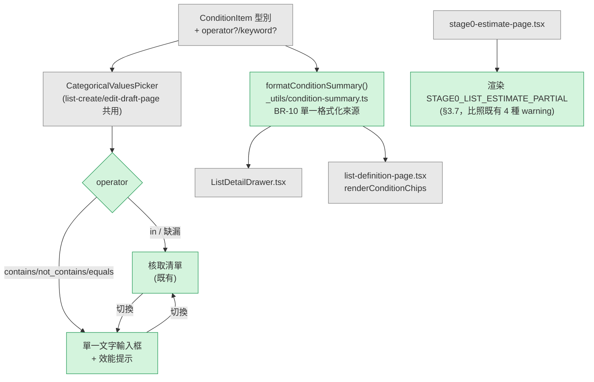

# AD-E07-50：F119 類別型篩選欄位文字比對運算子架構設計

> **✅ 本 AD 可作為 TDD 實作依據，全數項目已無待裁決阻塞。**
>
> 本 AD 逐項裁定 [F119 §12.1](../features/F119-categorical-text-match-operators.md#121-需要-system-architect-決定--撰寫之事項) SA-1 ~ SA-7。其中 **SA-4 推翻 spec 建議之預設值**（不抽出獨立檔案），**SA-2/SA-3 之裁定使「單一 SQL 落點」原則（BR-4）從 composer 一處擴大為涵蓋全部三個資料來源建構器**，屬本 AD 對 spec 未明確要求之額外結構性強化。§11-A 另發現一項 spec 對既有程式碼行為的**錯誤假設**（AC-15「快照條件顯示」實際不存在）——已停下、未自行打補丁，經 team lead 複驗後由使用者裁決 **descope**（2026-08-18，v1.1），F119/US-183 對應條文已另指派 spec-writer/product-analyst 同步修訂；後續補齊之技術盤點與設計方向另存 §11-C 供未來開票直接引用。

## Agent Loading Guide

| Agent 角色 | 需載入章節 |
|-----------|-----------|
| TDD Developer | §3（SA-1~SA-9 裁定）+ §4（Schema）+ §7（不變式）+ §9（檔案異動清單） |
| Test Designer | §3 + §7（不變式/邊界案例）+ §8（測試邊界） |
| UI/UX Designer | §6（前端架構）；視覺細節 authority 仍為 `prototypes/27a-list-create-draft.html` / `27b-list-edit-draft.html` / `30-stage0-estimate.html`（本 AD 不涉及） |
| Product Analyst / team lead | §11（待裁決，含 AC-15 範圍衝突）+ §10（風險） |

---

## 1. 背景與問題定義

[F119](../features/F119-categorical-text-match-operators.md)（US-183 v1.2，已通過人工審閱閘）要求 categorical 篩選條件在既有 `IN` 之外，新增 `contains` / `not_contains` / `equals` 三種文字比對運算子，`ob_pool_data` / `customer_core` / `customer_financial` 三來源全支援。spec §12.1 留 SA-1~SA-7 七項 HOW 層級事項交本 AD 裁定；spec 已完成 D-1~D-7 業務層級裁決（categorical 子屬性而非新 fieldType、運算子命名、關鍵字長度上限、後端互斥防呆、零可選值可用性、五路徑範圍、`:catop:` 簽章格式），本 AD 不重複裁決，僅在需要時引用。

---

## 2. 既有架構基礎（查證彙總，不得修改語意）

### 2.1 五條執行路徑之真實拓樸（BR-4 查證結果）

逐檔追蹤後確認 F119 BR-4「五條路徑共用同一函式」為**已驗證的程式碼事實**，且拓樸比 spec 描述更集中：

| # | 呼叫端 | 檔案:行 | 內部呼叫 |
|---|---|---|---|
| 1 | 月名單分派 MSSQL 下推 | `stage1-sql-builder-mssql.ts:73` | `buildStage1WhereConditions(list)` |
| 2 | 月名單分派 PG 下推 | `stage1-sql-builder.ts:99` | `buildStage1WhereConditions(list)` |
| 3 | JS 篩選鏈（月名單分派 legacy 路徑 + F092 dry-run） | `stage1-filter-chain.ts:373`（`executeStage1Chain`） | `buildStage1WhereConditions(list)`，經 `qb.where(...)` 送入 SQL，**非**應用層陣列 filter（"JS filter chain" 之名僅指特例 DELETE 步驟，categorical 比對本身仍是 SQL） |
| 4 | Stage 0 部門/每日估算 | `stage0-estimate.service.ts:817`（`dryRunChainCount`） | 呼叫路徑 3（`executeStage1Chain`），非獨立實作 |
| 5 | 草稿抽樣估算 | `assignment-list.service.ts:357`（`previewHitCount`） | `buildStage1WhereConditions(...)` 直接呼叫 |

`buildCategoricalFragment()`（`stage1-query-composer.ts:358`）為 **ANSI SQL、無 dialect 分支**的單一函式，MSSQL/PG 兩份 builder 皆呼叫同一支（並非各自一份）；`customer_core`/`customer_financial` 之 `IN` 分支則因不同原因，現況為**兩份物理檔案但邏輯相同的重複程式碼**（見 §2.2）。本 AD §3.3 將此重複點一併收斂。

### 2.2 customer_core / customer_financial 建構器現況

- `stage1-customer-core-clause.ts`（PG）與 `stage1-customer-core-clause-mssql.ts`（MSSQL）為**兩份平行檔案**（AD-E07-42 P3a 既有設計），差異僅在 `date_of_birth` 之 AGE 衍生（PG `EXTRACT(YEAR FROM AGE(...))` vs MSSQL `DATEDIFF`）；`DIRECT_MATCH_COLUMNS`（`gender` + 5 個 `_desc`）與 `cpost_city` LEFT3 兩個 categorical 分支在兩檔案中**逐字重複**（皆為 ANSI，無方言差異）。
- `stage1-customer-financial-clause.ts` 為 PG/MSSQL **共用單一檔案**（`stage1-customer-financial-clause-mssql.ts` 直接 `re-export` 本檔案，因 customer_financial 全部欄位方言無關）。
- 兩者之 `I-CC-NULL-EXCLUDE-01` / `I-CF-NULL-EXCLUDE-01`：客戶欄一律不得 `COALESCE`，NULL 經 SQL 三值邏輯天然排除，兩種 NULL 情境（查無客戶 / 客戶欄本身為 NULL）共用同一運算式，不得另立 if/else 特判——本 AD 之 `not_contains` 設計**沿用不變更**（見 §3.4）。

### 2.3 `normalizeConditionPayload` 現況（SA-4 查證依據）

`grep` 全 `apps/api/src` 確認 `normalizeConditionPayload`（`assignment-list.service.ts:525`，`private` method）僅有 **4 處呼叫，且全部在同一 class（`AssignmentListService`）內**：`findActiveConditionDuplicate`（L1338、L1370）、`checkCopyDuplicates`（L1402、L1466）。既有 `I-F118-SINGLE-NORMALIZE-01`（[AD-E07-48](AD-E07-48-f117-f118-ux-refinements.md)）已明文裁定「同屬 `AssignmentListService`，不抽取新檔案」。F119 未新增任何跨模組呼叫端。

### 2.4 ⚠️ AC-15「快照條件顯示」與現況程式碼不符（新發現，見 §11-A）

`GET runs/:runId/*` 系列端點之月名單分派快照（`assignment_run_snapshot`，`snapshot_type='config'`）由 `AssignmentRunPipelineService.buildConfigPayload()`（L1790）產生，其 `listDefinitions[]` 逐筆映射僅含 `{ listNo, listNm, cardType, crEnabled, caseStatus }`——**不含 `condition_payload`／`conditions[]`**。對應前端 `snapshot-config-view.tsx`（F066 快照詳情「設定」頁籤）之 `SnapshotConfigPayload`/`ListDefinitionRow` 型別與渲染邏輯**同樣不含任何 columnName/condition 顯示**。

即：F119 AC-15／§5.2 所稱「快照條件檢視須依 AC-15 呈現」之**該顯示介面現況並不存在**，並非「顯示格式需要修正」而是「整個顯示能力尚未建置」。此與 BR-10 之「名單詳情 Drawer」（`ListDetailDrawer.tsx`，走 F050 §6.2 `full-snapshot` 端點，**即時讀取** `ob_list_definition.condition_payload`，非月跑凍結快照）及「名單定義列表」（`list-definition-page.tsx` Kanban `renderConditionChips`）兩個真實存在的顯示端不同——後兩者確為「格式需要擴充」的正常 SA 範疇，已於 §3.6 一併設計；快照顯示則需 team lead 裁決範圍（§11-A），本 AD **不**逕自新增快照 payload 欄位或新前端區塊。

---

## 3. 核心設計決策

### 3.1 SA-1：`data-model.md` 補述（必辦）

已依 F119 §5.1 欄位契約表補入 `condition_payload` 欄位說明；同步登記「不需 migration、既有列不回填」。詳見本次已提交之 `data-model.md` v1.22 差異（§4 / 本 AD 檔案異動清單）。

### 3.2 SA-2：LIKE 跳脫技術手段（本 AD 技術含量最高項）

**裁定：單一共用跳脫 helper + 應用層組裝樣式字串 + 顯式 `ESCAPE` 子句 + 兩方言共用同一函式（無 dialect 分支）。**

**跳脫字元**：`\`（反斜線）。**跳脫字元集**：`\` `%` `_` `[` `]` `^`（跳脫字元本身必須排在集合最前處理，避免雙重跳脫）。

**關鍵論證（PG/MSSQL 等價保證，SA-3 之依據）**：
- MSSQL `LIKE` 之 `[`/`]`/`^` 具「字元類」語意（如 `[abc]` 比對任一字元）；PG 之 `LIKE` **無**字元類語意，`[`/`]`/`^` 本為一般字元。
- 但 ANSI SQL `ESCAPE` 子句之語意為「跳脫字元 + 下一字元 = 該字元之字面值」，**與該字元在無跳脫時是否原本特殊無關**。對 PG 而言，跳脫一個本來就不特殊的字元（如 `\[`）是**安全的 no-op**——結果仍是字面值 `[`，與不跳脫時的結果相同。
- 因此「跳脫超集」（固定跳脫 `%``_``[``]``^` 及跳脫字元本身，不依 dialect 增減）在兩個資料庫上**產生逐字元相同的比對結果**，不需要任何 dialect 分支，亦不需要在 AD 或程式碼中維護「MSSQL 專屬跳脫字元表」。此為比 F119 spec §12.1 SA-2 建議預設（「跳脫落點置於共用 helper，兩方言共用」）更明確、更可證明的版本。

**樣式字串組裝**：關鍵字先經跳脫 helper 處理，再由應用層組裝為 `%escaped%`（`contains`/`not_contains`）或原樣（`equals`，見下），整段以**具名參數綁定**（`:paramName`），SQL 文字中僅含固定字面 `ESCAPE '\'`（反斜線在標準相容字串字面值中，PG `standard_conforming_strings=on`〔預設〕與 MSSQL 皆為普通字元，非跳脫觸發字元，無雙重跳脫風險）。

**`equals` 不經過本跳脫機制**（BR-7）：`=` 比對天然無萬用字元語意，關鍵字原樣綁定，不做任何跳脫（跳脫一個不會被解讀為萬用字元的比對運算子毫無意義，且會使 `=` 語意複雜化）。此點確認 F119 A-6（BR-7 委由 architect 決定是否改用 `LIKE`）——**維持 spec 預設，`equals` 使用 `=`**。

**程式碼契約**（新增於 `stage1-query-composer.ts`，供 TDD 直接落地，非最終產品碼）：

```typescript
export type CategoricalOperator = 'in' | 'contains' | 'not_contains' | 'equals';
const TEXT_OPERATORS: ReadonlySet<CategoricalOperator> = new Set(['contains', 'not_contains', 'equals']);

/** BR-11 唯一 fallback 落點：任何消費端（SQL 建構 / 簽章 / 顯示）皆須透過本函式取得 operator。 */
export function resolveCategoricalOperator(raw: unknown): CategoricalOperator {
  return raw === 'contains' || raw === 'not_contains' || raw === 'equals' ? raw : 'in';
}

const LIKE_ESCAPE_CHAR = '\\';
/** BR-7 唯一跳脫實作：跳脫字元本身 + % _ [ ] ^（MSSQL 專用字元類字元對 PG 為安全 no-op，見 §3.2 論證）。 */
export function escapeLikeKeyword(raw: string): string {
  return raw.replace(/[\\%_[\]^]/g, (ch) => `${LIKE_ESCAPE_CHAR}${ch}`);
}
```

### 3.3 SA-3：PG 路徑同步擴充 + 三來源共用單一 fragment 建構器（超出 spec 建議範圍）

**裁定：同步擴充（確認 spec 建議）；並進一步將 IN/contains/not_contains/equals 四運算子之 SQL 產生收斂為單一共用函式，供 composer、customer_core（PG+MSSQL 兩檔）、customer_financial 四處呼叫**，而非各自在既有 IN 分支旁加四個 if/else（後者會使 BR-4 之「單一 SQL 落點」原則在客戶來源側破功——目前 customer_core 已是 PG/MSSQL 兩份重複檔案，若不收斂，一次擴充需要正確改動並保持四處邏輯完全同步，測試與 review 成本顯著增加，且是本專案已多次踩雷的「重複實作靠測試守住等價」反模式（如 AD-E07-42 P3a 引入時特別強調「等價由同一程式碼保證」）。

**共用函式契約**（新增於 `stage1-query-composer.ts`）：

```typescript
export interface CategoricalOperatorFragmentInput {
  /** 完整欄位引用表達式，如 `"prod_kind"`（composer）或 `cc.gender` / `LEFT(cc.cpost_city, 3)`（customer_core）。 */
  colExpr: string;
  operator: CategoricalOperator;
  values?: string[];
  /** 已由呼叫端（validateConditionPayload 等）保證：文字運算子時非空、trim 後 1~100 字元。 */
  keyword?: string;
  paramName: string;
  /** BR-6 八格矩陣中唯一顯式格：僅 ob_pool_data 來源之 not_contains 為 true。 */
  nullKeptOnNotContains: boolean;
}

export function buildCategoricalOperatorFragment(
  input: CategoricalOperatorFragmentInput,
): { fragment: string; params: Record<string, unknown> } | null {
  const { colExpr, operator, values, keyword, paramName, nullKeptOnNotContains } = input;

  if (operator === 'in') {
    if (!Array.isArray(values) || values.length === 0) return null;
    return { fragment: `${colExpr} IN (:...${paramName})`, params: { [paramName]: values } };
  }
  if (operator === 'equals') {
    return { fragment: `${colExpr} = :${paramName}`, params: { [paramName]: keyword } };
  }

  const likeParam = `%${escapeLikeKeyword(keyword ?? '')}%`;
  if (operator === 'contains') {
    return { fragment: `${colExpr} LIKE :${paramName} ESCAPE '\\'`, params: { [paramName]: likeParam } };
  }
  // not_contains（BR-6 唯一顯式格：ob_pool_data 保留 NULL，客戶來源沿用既有天然排除，不加 IS NULL）
  const notLike = `${colExpr} NOT LIKE :${paramName} ESCAPE '\\'`;
  const fragment = nullKeptOnNotContains ? `(${colExpr} IS NULL OR ${notLike})` : notLike;
  return { fragment, params: { [paramName]: likeParam } };
}
```

**四個呼叫端改動**（皆為既有 `IN` 分支旁改用本函式，簽名/回傳形狀不變）：
1. `buildCategoricalFragment()`（composer，`ob_pool_data`）：`colExpr` 沿用既有 `"${poolDataCol}"` 引號欄名；`nullKeptOnNotContains: true`。**`caseyear` 特殊映射欄位排除在外**，見 §3.8。
2. `buildCustomerCoreClause`（PG）：`DIRECT_MATCH_COLUMNS` 分支 `colExpr = cc.${cond.columnName}`；`cpost_city` 分支 `colExpr = LEFT(cc.cpost_city, 3)`（沿用 F119 assumption A-3 建議：四運算子套用同一衍生後運算式，維持同欄位跨運算子比對對象一致）；兩者 `nullKeptOnNotContains: false`。
3. `buildCustomerCoreClauseMssql`：與 2 逐字相同（`LEFT()` 為 ANSI，MSSQL 原生支援）。
4. `buildCustomerFinancialClause`（PG/MSSQL 共用單一檔案）：`categorical` 分支 `colExpr = cf.${cond.columnName}`；`nullKeptOnNotContains: false`。

**PG/MSSQL 等價驗證方式**：因 `buildCategoricalOperatorFragment` 本身 dialect-neutral、且四個呼叫端皆傳入相同的 ANSI `colExpr` 樣式，等價由「同一程式碼」結構保證（比照 BR-4 精神），測試邊界僅需：(a) SQLite 可跑全部四運算子之邏輯正確性；(b) `.mssql.spec.ts` 針對 `Chinese_Taiwan_Stroke_BIN` collation 之大小寫/全半形敏感度做一組回歸（T-18）；(c) **不需要** `.pg.spec.ts` 對 `[`/`]`/`^` 另立字元類測試——PG 無此語意，§3.2 論證已涵蓋。

### 3.4 BR-6 NULL 矩陣之實作落點

八格中僅「`ob_pool_data` × `not_contains`」為顯式 `IS NULL OR ...`（`nullKeptOnNotContains: true`），其餘七格（含 `customer_core`/`customer_financial` 之 `not_contains`）皆**不得**新增任何 `IS NULL`/`COALESCE` 特判——三值邏輯天然排除已是唯一實作，`buildCategoricalOperatorFragment` 之 `nullKeptOnNotContains: false` 分支即為此七格之單一共用程式碼路徑（無需七個各自的 if）。

### 3.5 SA-4：`normalizeConditionPayload` 維持現況（推翻 spec 建議）

**裁定：不抽出獨立檔案，維持 `AssignmentListService` 之 private method，僅擴充其內部邏輯。**

**推翻理由**（§2.3 查證）：
1. `grep` 確認全部 4 個呼叫端皆在同一 class 內，F119 不新增任何跨模組呼叫需求（SQL 比對邏輯由 §3.3 之獨立 SQL fragment 函式承擔，與簽章函式為正交關注點）。
2. 既有 `I-F118-SINGLE-NORMALIZE-01`（AD-E07-48）已就近乎相同情境（F118 新增 `checkCopyDuplicates` 呼叫端）做出「不抽取」之明文裁定，抽取違反本專案剛建立的一致慣例，且缺乏第二個外部消費者佐證其必要性（YAGNI）。
3. 若未來確有跨模組需求（如某 SQL 建構端需要簽章比對），屆時再抽取為 `normalize-condition-payload.ts` 不遲——現在抽取是投機性重構，增加無收益的檔案間接層。

**內部邏輯擴充**（BR-9 `:catop:` 區段；BR-11 透過 §3.2 之 `resolveCategoricalOperator` 取得單一 fallback）：

```typescript
// normalizeConditionPayload categorical 分支（assignment-list.service.ts:525 內部改寫）
if (c.fieldType === 'categorical') {
  const operator = resolveCategoricalOperator(c.operator); // 從 stage1-query-composer.ts import，BR-11
  if (operator === 'in') {
    if (!Array.isArray(c.values)) continue;
    const vals = [...new Set(c.values.filter((v): v is string => typeof v === 'string' && v.length > 0))].sort();
    if (vals.length === 0) continue;
    parts.push(`${c.columnName}:cat:${vals.join(',')}`); // 與現行逐字元相同（AC-17 硬性要求）
  } else {
    const kw = typeof c.keyword === 'string' ? c.keyword.trim() : '';
    if (kw.length === 0) continue; // defensive；DTO/service 層已擋非法組合
    parts.push(`${c.columnName}:catop:${operator}:${kw}`); // BR-9 新區段
  }
}
```

**跨模組 import 慣例確認**：`assignment-list.service.ts` 已既存匯入 `stage1-query-composer.ts` 之 `buildStage1WhereConditions`（純函式，非 injectable），本次新增 `resolveCategoricalOperator` import 屬同一既有慣例延伸，不構成新的模組相依風險。

**BR-11 之「單一落點」範圍界定**：本不變式之範圍為**單一 runtime**（Node.js 後端）；前端（獨立 bundle）不可能 import 後端模組，故前端需要**自己的**單一 fallback 落點（見 §3.6），兩者是各自 runtime 內的單一來源，非要求前後端共用同一份 TS 檔案。

### 3.6 前端顯示層（BR-10）與運算子預設值

- **運算子中文標籤 + 單一 fallback**：新增 `apps/web/src/pages/assignment/_utils/labels.ts` 之 `OPERATOR_LABEL` 對照表 + `operatorLabel(operator)` 函式（比照既有 `FIELD_DISPLAY`/`fieldDisplayName` 慣例），內部即前端側之 `resolveCategoricalOperator`（`operator ?? 'in'` 僅在此一處出現）。
- **BR-10 共用格式化函式**：新增 `apps/web/src/pages/assignment/_utils/condition-summary.ts`，匯出 `formatConditionSummary(condition, decoder: ConditionDecoder): string`（`ConditionDecoder` 型別沿用 `_hooks/use-condition-decoder.ts` 既有介面），依 `fieldType`/`operator` 分支輸出：`in` → 沿用既有「欄位：值1、值2」格式；文字運算子 → `「${欄位}」${運算子標籤}「${keyword}」`（AC-15 範例格式「主約專案名稱 包含「勁便利」」）。
- **消費端改為呼叫本函式**（取代各自 inline 邏輯，§9 列為修改檔案）：`ListDetailDrawer.tsx`（詳情 Drawer 條件頁籤）、`list-definition-page.tsx`（`renderConditionChips`，Kanban chip）。**快照顯示端**因 §2.4 之發現暫不在此範圍（見 §11-A）。
- **`ConditionItem`（`apps/web/src/api/assignment-list.ts:35`）型別擴充**：新增 `operator?: 'in' | 'contains' | 'not_contains' | 'equals'` 與 `keyword?: string` 兩個 optional 欄位（純加性，比照後端 `ConditionItemDto`）。
- **`CategoricalValuesPicker` 元件**（`list-create-draft-page.tsx:1532`，建立/編輯兩頁共用）之運算子四選一控制項、互斥切換（AC-5）、效能提示（AC-12）具體視覺與互動設計**交 ui-ux-designer**（prototype 更新後定案），本 AD 僅界定：元件必須是建立頁與編輯頁的**同一元件實例**（AC-18 既有前提，未變更）。

### 3.7 SA-5：AC-13 修正範圍（＝ US-183 OQ-183-03）

**裁定：確認 spec 建議——不分觸發原因，一律渲染 `STAGE0_LIST_ESTIMATE_PARTIAL`。**

理由：`stage0-estimate.service.ts:557-570` 產生此 warning 之邏輯不區分「是文字運算子的 `LIKE` 全表掃描逾時、還是既有 `IN` 條件在寬鬆篩選下逾時」——**同一 warning code、同一產生路徑**，技術上無法在後端標記觸發原因（若要標記需新增欄位並修改既有已上線的 `estimateListCount` 呼叫端，成本遠高於單純渲染既有資料）。前端渲染邏輯天然無分流依據，限縮渲染範圍反而需要額外的「觸發原因」欄位與判斷分支，成本更高、且無業務價值（使用者只需要知道「這張名單的估算數字不完整」，不需要知道逾時是哪種條件造成）。

**實作要求**（AC-13 / T-27）：`stage0-estimate-page.tsx` 新增 `STAGE0_LIST_ESTIMATE_PARTIAL` 分支渲染，比照既有 `SCOPE_UNRESOLVED`/`CALENDAR_EMPTY`/`POOL_COUNT_LOW`/`HEADCOUNT_ZERO` 四種既有 warning 之渲染機制（沿用既有 warning 陣列迭代管道，不另建平行機制，BR-13）；`warnings[]` 中每筆 `STAGE0_LIST_ESTIMATE_PARTIAL` 含 `listNo`/`message`，須逐筆渲染（多名單同時逾時時不得只顯示一則泛用訊息）。確切呈現位置/樣式（列內 inline / 頁首彙總）交 ui-ux-designer。

**連帶登記**：`error-handling.md#assignment-run-warnings` 現僅登錄 `RUN_REPORT_SKIPPED_CASES`/`WHITELIST_OPTION_INACTIVE`/`SCORING_INTEGRITY_WARN` 三碼，缺 `STAGE0_LIST_ESTIMATE_PARTIAL`。此文件不在本 AD 輸出範圍內（非本輪交付檔案清單），**建議** team lead 另案指派補登，本 AD 僅記錄此登錄落差供追蹤。

### 3.8 新增裁定：`caseyear` 排除於文字運算子（本 AD 自行發現之邊界，非 spec 交辦項）

**問題**：`caseyear` 為 categorical 欄位，但其 SQL 對應為 `ob_pool_data.year_cnt`（**INTEGER**，`stage1-query-composer.ts` `PATH_A_COLUMN_MAPPING`/`buildCategoricalFragment` 既有映射），且既有 `'99'`（不限年數 wildcard）之 skip-fragment 規則僅對 `IN` 語意有定義。若允許 `caseyear` 使用文字運算子：
1. **PG 端型別錯誤**：PG 之 `LIKE`/`~~` 運算子不接受 `integer` 運算元、亦無隱式轉型，`year_cnt LIKE '%1%'` 會在 PG 上直接拋型別錯誤（`operator does not exist: integer ~~ unknown`），破壞 SA-3 之「兩方言等價」保證；MSSQL 端雖可能因隱式轉型而不報錯，但行為未定義且未經測試，兩方言結果會分歧。
2. **`'99'` wildcard 規則無定義**：`equals '99'` 是否應觸發「不限年數」skip？spec（F119 §6 BR-1~BR-9 / US-183 AC-1~AC-9）全篇未討論此欄位，AC-9 之 T-6（`%`/`_`/`[` 字面值測試）亦未涵蓋 `caseyear`。
3. **業務動機不相容**：US-183 背景動機明確為「值域極廣、無法窮舉可選值」之欄位（如 `spec_name`）；`caseyear` 恰是**已有界、已由白名單管理選項**（0~6 + 99，[F076](../features/F076-manage-categorical-field-values.md) 維護）之欄位，文字比對對此欄位無業務價值。

**裁定**：`caseyear` **排除**於文字運算子適用範圍之外，於**驗證層**（非 SQL 建構層）攔截，回 422 `VALIDATION_ERROR`（沿用 BR-12 不新增錯誤碼），訊息「caseyear 欄位不支援文字比對運算子（對應 year_cnt 為整數欄位）」。`buildCategoricalFragment` 內既有 `caseyear` wildcard 分支**保持現狀完全不變**（僅服務 `operator='in'`），額外於分支開頭加一道 defense-in-depth 防線（`operator` 非 `'in'` 時 push warning + 回 null，而非嘗試建構 SQL），但此非主要防線——主要防線在驗證層（見 §3.9），確保使用者在儲存/預覽當下即被明確攔截，而非讓條件靜默失效。

此項為 spec 未觸及、本 AD 自行發現並裁定之邊界，**非**「推翻 spec 假設」（spec 未對此欄位做出任何主張），而是補一個 spec 遺漏的欄位層級限制。若 team lead / spec-writer 認為 `caseyear` 應支援文字運算子（例如未來業務需求變化），需回頭修訂 F119 spec 明確定義其與 wildcard 規則的互動，本 AD 不預先設計該情境。

### 3.9 新增裁定：跨欄位互斥驗證置於 service 層而非 DTO 層

**問題**：AC-6「後端互斥防呆」與 BR-1「僅 categorical 可帶 operator」需要「跨屬性」條件判斷（如「`fieldType !== 'categorical'` 且 `operator` 有值 → 拒絕」「`operator` 為文字運算子但 `values` 非空 → 拒絕」）。`class-validator` 之 `@ValidateIf` 若在**同一屬性**上重複套用多組互斥條件（例如 `values` 屬性同時掛「`operator='in'` 時必填」與「`operator` 為文字時必須為空」兩組獨立 `@ValidateIf`），其組合語意在 `class-validator` 內部為同一屬性之條件式驗證中繼資料合併，**不保證**兩組獨立、互補的 `ValidateIf` 條件會被個別正確求值——此為框架层級的組合限制，非本專案程式碼可控。

**裁定**：`ConditionItemDto`（DTO 層）僅負責**單屬性內**的型別/格式/列舉檢查（`operator` 列舉值、`keyword` 型別+長度、既有 `values`/`min`/`max`/`dateStart`/`dateEnd` 之 `fieldType`-gated 檢查沿用現況寫法）；**跨屬性互斥檢查**（AC-6：`operator` 與 `fieldType` 之關係、`operator` 與 `values`/`keyword` 之互斥）**新增於 `AssignmentListService.validateConditionPayload` / `validateConditionsForPreview`**（`assignment-list.service.ts:136` / `:282`），緊接既有「reserved 欄位 → 同名重複 → whitelist active」三步驟之後（新增第 4 步）。此與該檔案現況已建立的「DTO 做型別、service 做跨欄位/跨資料業務規則」分工完全一致（reserved-field/whitelist-active 檢查現況已是 service 層職責，非 DTO），不是新引入的分工模式。

**DTO 層改動**（`condition-item.dto.ts`）：
- 新增 `operator?: CategoricalOperator`：`@ValidateIf(o => o.operator !== undefined) @IsIn([...4值])`。
- 新增 `keyword?: string`：`@ValidateIf(o => isTextOperator(o.operator)) @IsString() @Length(1, 100)`（`@Length` 對 trim 前字串驗證；trim 後落庫由 service 層 `injectSystemFixedConditions` 同層級之正規化步驟處理，BR-2）。
- **既有** `values` 之 `@ValidateIf` 條件由 `o.fieldType === 'categorical'` **收斂為** `o.fieldType === 'categorical' && !isTextOperator(o.operator)`（此為對既有裝饰器條件的**修改**，非純加性，需在 §9 標記為「修改」而非「新增」）。

**Service 層新增檢查**（第 4 步，`validateConditionPayload`/`validateConditionsForPreview` 共用邏輯，建議抽為同 class 內 private helper 避免兩處重複）：
1. `fieldType !== 'categorical'` 且（`operator !== undefined` 或 `keyword !== undefined`）→ 422，訊息「operator / keyword 僅適用於 categorical 篩選條件」。
2. `operator` 為文字運算子且 `values` 非空陣列 → 422，訊息「{columnName} 之比對方式與設定值不相符，請重新設定」。
3. （`operator === 'in'` 或缺漏）且 `keyword` 非空字串 → 422，同上訊息。
4. `columnName === 'caseyear'` 且 `operator` 為文字運算子 → 422（§3.8）。

---

## 4. Schema 變更

**無 migration。** `condition_payload` 為既有 JSONB/NVARCHAR(MAX) 欄位，`ObListDefinitionConditionItem` interface 具 index signature（已於 F119 assumption A-2 查證），純加性擴充 `operator?`/`keyword?` 兩個 optional TypeScript 屬性即可，無需 DB 層變更。`data-model.md` 之欄位契約補述見 §3.1（SA-1，已於本輪一併提交）。

---

## 5. 端點契約總覽

**無新增端點**（F119 §5.2 已確認）。既有端點之 request/response 影響：

| 端點 | 影響 |
|---|---|
| `POST/PUT assignment/lists[/:listNo]` | Request 接受新 key；§3.9 新增第 4 步驗證；重複判定簽章依 §3.5 新格式 |
| `POST assignment/list-definitions/preview-hit-count` | 同上驗證 + §3.3 新 SQL 分支自動生效（呼叫 `buildStage1WhereConditions` 沿用既有呼叫點，`previewHitCount` 本身不需改動呼叫方式） |
| `GET assignment/lists` / `:listNo/full-snapshot` | Response 含新 key（passthrough，型別擴充後自動生效）；顯示端依 §3.6 |
| `GET assignment/stage0/dept-estimate` | Response schema 不變；前端依 §3.7 渲染既有 `warnings[]` |
| `GET assignment/lists/copy-duplicate-check` | 判定邏輯依 §3.5 自動繼承（F118 既有慣例） |

---

## 6. 前端架構（brief；元件實作交 tdd-implementation / ui-ux-designer）



---

## 7. 不變式（Invariants）

| 不變式 | 說明 |
|---|---|
| **I-CATOP-SINGLE-FRAGMENT-01** | 全部四運算子（`in`/`contains`/`not_contains`/`equals`）之 SQL 產生僅得經 `buildCategoricalOperatorFragment()`（`stage1-query-composer.ts`）此**唯一**函式；composer（`ob_pool_data`）、`buildCustomerCoreClause`（PG+MSSQL 兩檔）、`buildCustomerFinancialClause` 四個呼叫端**禁止**各自實作關鍵字比對或 NULL 判斷邏輯（BR-4/BR-5 之擴大範圍版） |
| **I-CATOP-OPERATOR-FALLBACK-01** | 缺漏 `operator` 之預設值解讀，後端**僅**經 `resolveCategoricalOperator()`（`stage1-query-composer.ts`），前端**僅**經 `_utils/labels.ts` 之對等實作；禁止任何消費點各自寫 `cond.operator ?? 'in'`（BR-11） |
| **I-CATOP-SIG-BACKCOMPAT-01** | `normalizeConditionPayload` 之 `in`/缺漏形態簽章輸出（`:cat:` 前綴）與擴充前**逐字元相同**；文字形態一律 `:catop:` 前綴，兩者前綴互斥、不可碰撞（BR-9）。任何既有無 `operator` 之 payload 跑新版函式，輸出必須與跑舊版函式**位元完全相同**——此為 AC-17 之硬性回歸要求，非「相容」而是「相等」 |
| **I-CATOP-NULL-MATRIX-01** | BR-6 八格矩陣中僅「`ob_pool_data` × `not_contains`」（`nullKeptOnNotContains: true`）需要顯式 `IS NULL OR ...`；其餘七格（含 `customer_core`/`customer_financial` 之 `not_contains`）**禁止**新增任何 `IS NULL`/`COALESCE` 特判，一律依賴既有 SQL 三值邏輯天然排除 |
| **I-CATOP-ESCAPE-SINGLE-01** | LIKE 樣式跳脫僅得經 `escapeLikeKeyword()`（`stage1-query-composer.ts`）此**唯一**實作；跳脫字元集固定為 `\` `%` `_` `[` `]` `^`，**不依 dialect 增減**（PG 對 `[`/`]`/`^` 之跳脫為安全 no-op，理由見 §3.2） |
| **I-CATOP-CASEYEAR-EXCLUDE-01** | `columnName === 'caseyear'` 之條件**禁止**帶文字運算子；此限制實作於**驗證層**（`validateConditionPayload`/`validateConditionsForPreview`）而非 SQL 建構層，違反回 422 `VALIDATION_ERROR`（§3.8） |
| **I-CATOP-DISPLAY-SINGLE-01** | 條件顯示字串（含運算子中文標籤）僅得經 `formatConditionSummary()`（`apps/web/.../_utils/condition-summary.ts`）此**唯一**函式產生；**現階段消費端範圍明確限定為** `ListDetailDrawer.tsx`／`list-definition-page.tsx` 兩者，禁止各自組字串（BR-10）。「快照條件顯示」（`snapshot-config-view.tsx`）**不在**本次消費端範圍內——依 §11-A 裁決（descope），該顯示能力本輪不建置；若日後依 §11-C 另開票補齊，屆時消費端清單應追加 `snapshot-config-view.tsx`，核心約束（單一格式化來源、禁止各頁自拼字串）不變 |
| **I-CATOP-VALIDATION-LAYER-01** | AC-6 之互斥檢查（`operator`↔`fieldType`、`operator`↔`values`/`keyword`）一律於 **service 層**（`validateConditionPayload`/`validateConditionsForPreview`）實作，**禁止**嘗試以多組 `class-validator` `@ValidateIf` 在同一 DTO 屬性上表達互斥條件（框架組合語意不保證正確求值，見 §3.9） |

---

## 8. 測試邊界建議（交 test-designer）

- **SQLite unit**：`buildCategoricalOperatorFragment` 純函式邏輯（四運算子 × 三來源 × NULL 案例）、`escapeLikeKeyword` 特殊字元字面值測試（T-6）、`resolveCategoricalOperator` fallback、`normalizeConditionPayload` 新舊輸出逐字元相同回歸（T-11/T-12）、DTO 層型別驗證（T-8/T-10）、service 層互斥驗證（T-9）——**全數可 SQLite 驗證**，`buildCategoricalOperatorFragment` 本身 dialect-neutral。
- **`.mssql.spec.ts`**：`Chinese_Taiwan_Stroke_BIN` collation 下之大小寫/全半形敏感度（T-7/T-18）；`customer_core`/`customer_financial` 之 LEFT JOIN + 文字運算子整合案例（T-3/T-4/T-8/T-9 對應 AC-3 分流）；真實 MSSQL 上 `LIKE ... ESCAPE '\'` 語法驗證（避免僅靠 SQLite 字串比對掩蓋語法錯誤）。
- **`.pg.spec.ts`**：依 §3.3 論證，**不需要**針對 `[`/`]`/`^` 另立字元類專屬案例；僅需一組基本 `contains`/`not_contains`/`equals` 冒煙測試確認 PG 語法可執行（`buildStage1Sql` 路徑），佐證「無 dialect 分支仍正確」之論證成立。
- **五路徑一致性（T-17/AC-14）**：因 §3.3 已將 SQL 產生收斂至單一函式，此測試之角色從「驗證五處各自實作是否碰巧一致」轉為「驗證五個呼叫端確實都路由到同一函式」（結構性斷言，如檢查呼叫堆疊或以 spy 驗證），比對純輸出結果更能防止未來有人在某呼叫端「抄一份改一改」繞過共用函式。
- **快照往返（SA-7）**：僅需針對 F050 §6.2 `full-snapshot` 端點（`list-snapshot-response.dto.ts`）驗證 `operator`/`keyword` 於讀取端不遺失（型別 passthrough，預期為 no-op 通過）；**不需要**（也不可能，因功能不存在）針對月名單分派 `assignment_run_snapshot` 撰寫條件往返測試，見 §11-A。

---

## 9. 檔案異動清單

### 後端（修改）

- `apps/api/src/modules/assignment/stage1/stage1-query-composer.ts` —— 新增 `CategoricalOperator` / `resolveCategoricalOperator` / `escapeLikeKeyword` / `buildCategoricalOperatorFragment`（§3.2/§3.3）；`buildCategoricalFragment()` 改為呼叫新函式（`caseyear` 分支保留現狀 + defense-in-depth，§3.8）
- `apps/api/src/modules/assignment/stage1/stage1-customer-core-clause.ts` —— `DIRECT_MATCH_COLUMNS`/`cpost_city` 分支改用 `buildCategoricalOperatorFragment`
- `apps/api/src/modules/assignment/stage1/stage1-customer-core-clause-mssql.ts` —— 同上（PG/MSSQL 兩檔同步改動）
- `apps/api/src/modules/assignment/stage1/stage1-customer-financial-clause.ts` —— `categorical` 分支改用 `buildCategoricalOperatorFragment`
- `apps/api/src/modules/assignment-list/dto/condition-item.dto.ts` —— 新增 `operator`/`keyword` 欄位；**修改**既有 `values` 之 `@ValidateIf` 條件（§3.9）
- `apps/api/src/modules/assignment-list/assignment-list.service.ts` —— `normalizeConditionPayload` categorical 分支擴充（§3.5）；`validateConditionPayload`/`validateConditionsForPreview` 新增第 4 步互斥驗證（§3.9）；import `resolveCategoricalOperator`
- `apps/api/src/modules/assignment-list/stage0-estimate.service.ts` —— **無需改動**（`STAGE0_LIST_ESTIMATE_PARTIAL` 產生邏輯已存在；本 feature 僅前端渲染，§3.7）
- `apps/api/src/database/entities/ob-list-definition.entity.ts` —— `ObListDefinitionConditionItem` interface 新增 `operator?`/`keyword?` 型別屬性（無 migration，§4）

### 前端（修改）

- `apps/web/src/api/assignment-list.ts` —— `ConditionItem` interface 新增 `operator?`/`keyword?`
- `apps/web/src/pages/assignment/_utils/labels.ts` —— 新增 `OPERATOR_LABEL`/`operatorLabel()`
- `apps/web/src/pages/assignment/_utils/condition-summary.ts`（**新檔**）—— `formatConditionSummary()`（§3.6，BR-10）
- `apps/web/src/pages/assignment/_components/ListDetailDrawer.tsx` —— 條件頁籤改呼叫 `formatConditionSummary`
- `apps/web/src/pages/assignment/list-definition-page.tsx` —— `renderConditionChips` 改呼叫 `formatConditionSummary`
- `apps/web/src/pages/assignment/list-create-draft-page.tsx` / `list-edit-draft-page.tsx` —— `CategoricalValuesPicker` 元件運算子感知擴充（AC-1/AC-5/AC-12/AC-18；視覺細節交 ui-ux-designer）
- `apps/web/src/pages/assignment/stage0-estimate-page.tsx` —— 新增 `STAGE0_LIST_ESTIMATE_PARTIAL` 渲染分支（§3.7）

### 文件（本輪已由 system-architect 直接提交，非交辦）

- `docs/specs/data-model.md` —— v1.22，`condition_payload` 欄位契約補述（SA-1）
- `docs/specs/architecture-spec.md` —— 新增 §5.20 摘要小節（指向本 AD）+ §18.5 補一句指標註記

### 文件（需同步，非本 AD 直接編輯，flag 予相關 agent）

- `docs/specs/error-handling.md#assignment-run-warnings` —— 缺 `STAGE0_LIST_ESTIMATE_PARTIAL` 登錄（§3.7 連帶發現），建議 team lead 另案指派
- `docs/specs/features/F050-create-list-definition.md` §5.4 / BR-6 / BR-7 —— F119 §12.2 已列建議加性補述文字，**本 AD 依 F119 spec 之刻意留白慣例，同樣不逕自改寫**，維持交由 team lead 核可後另發 F050 v2.5
- `docs/stories/epics/E07-app-customer-list-assignment/US-183-M01-categorical-text-match-operators.md` —— OQ-183-02（非阻塞，§10 風險 R-1）/ OQ-183-03（已裁定，§3.7）狀態指引，依團隊分工由 team lead 回填，本 AD 不直接編輯

---

## 10. 風險與殘留議題

| # | 議題 | 評估 |
|---|---|---|
| R-1 | OQ-183-02（是否延伸抽樣估算基礎架構至文字運算子命中預估）——US-183 明列非阻塞 | 低；本 AD 未設計此延伸，維持 spec 裁定之「本輪不引入」。若未來需要，`sampling-estimator.ts` 之 `buildPoolDataSampleFrom` 與本 AD 之 `buildCategoricalOperatorFragment` 為正交關注點，屆時可直接組合，無架構衝突 |
| R-2 | `caseyear` 排除文字運算子（§3.8）為本 AD 新增之驗證規則，屬對「AC-1 僅要求 fieldType='categorical' 即可用四運算子」字面文意的**限縮** | 中；已附完整技術論證（PG 型別錯誤 + wildcard 規則未定義 + 業務動機不相容）。若 team lead / spec-writer 認為業務上仍需支援，需回頭修訂 F119 spec 明確定義 `caseyear` 與 `'99'` wildcard 之互動語意，本 AD 不預先假設該情境的設計 |
| R-3 | `stage1-customer-core-clause.ts`/`-mssql.ts` 之 `DIRECT_MATCH_COLUMNS`/`cpost_city` 分支改動屬對 AD-E07-37/AD-E07-42 已上線程式碼的修改（非純新增） | 低；改動僅將既有 `cc.col IN (...)` 樣式替換為呼叫共用函式之等價輸出（`operator` 缺漏/`'in'` 時之輸出字串逐字元相同），建議 TDD 階段對現有 F109/F114 回歸測試保持綠燈作為驗收條件之一（比照 AD-E07-49 R-3 之先例） |
| R-4 | `escapeLikeKeyword` 之跳脫超集策略（§3.2）未經真實 MSSQL/PG 雙資料庫之交叉驗證，僅基於 SQL 標準行為推論 | 低；`.mssql.spec.ts` 已排入（§8），建議另加一組 `.pg.spec.ts` 冒煙測試（非窮舉字元類案例，僅驗證語法可執行）作為論證的實證佐證，而非僅依賴本 AD 之書面推論 |

---

## 11. 待裁決（Open Decisions）

### 11-A ⚠️ AC-15「快照條件顯示」範圍衝突 —— ✅ **已裁決（選項 2 / descope）**

> **裁決**：選項 2（回頭修訂 spec，descope）。**裁決者**：使用者（經 team lead 轉達）。**裁決日期**：2026-08-18。team lead 已複驗本節之衝突宣稱屬實（`assignment-run-pipeline.service.ts:1802-1806` 的 `listDefinitions[]` 確為五欄位；6 個 snapshot 元件 grep `conditionPayload`/`columnName` 零命中），並已指派 spec-writer 同步 descope F119 spec（AC-15 / §5.2 / BR-10）、product-analyst 同步 descope US-183 AC-13。本 AD 之 §3.6／§7／§9 於初版撰寫時即**已預先排除**快照顯示端（僅設計「名單詳情 Drawer」與「名單定義列表」兩個真實存在的顯示端），故本次裁決**不需回頭修改**這三節之內容或範圍——以下保留原始三個選項與論證作為決策軌跡。

**發現**（§2.4）：F119 AC-15／§5.2／§9 交叉引用之「快照條件顯示」（`GET runs/:runId/*`，F066 快照詳情頁「設定」頁籤）**現況並不存在此顯示能力**——後端 `AssignmentRunPipelineService.buildConfigPayload()` 之 `listDefinitions[]` 快照 payload 從未包含 `condition_payload`/`conditions[]`，前端 `snapshot-config-view.tsx` 亦無對應渲染邏輯。F119 spec 將此列為「既有顯示端、僅需格式擴充」（比照 BR-10 之其餘兩個顯示端），但實際上是**尚未建置的新功能**。

**選項**（決策軌跡，供未來回顧；已選定選項 2，見上方裁決框）：
1. **納入本 feature 範圍**：新增 `buildConfigPayload()` 之 `listDefinitions[]` 欄位（含 `conditionPayload`）+ 新增 `snapshot-config-view.tsx` 條件顯示區塊。屬新增資料流與新增 UI 區塊，工作量超出 F119 spec 原先描述的「格式擴充」定性，建議另計工作量並經 ui-ux-designer 規劃視覺（prototype `35-snapshot-detail.html` 需同步更新）。
2. **本輪不做，回頭修訂 F119 spec**：移除 AC-15 對「快照條件顯示」之要求，僅保留「名單詳情 Drawer」與「名單定義列表」兩個真實存在的顯示端（§3.6 已完整設計，可直接實作）。理由：`ob_list_definition.condition_payload` 於名單推進至 `dept_ratio` 階段後即鎖定唯讀（`data-model.md` 既有規則表），月名單分派執行時該名單必已達 `ready` 階段，此時 `condition_payload` 事實上已凍結——使用者仍可透過「名單詳情 Drawer」（F050 §6.2 `full-snapshot`，即時讀取）查得該次執行實際使用之條件，效果等同「快照」，僅是資料來源為即時查詢而非獨立凍結副本，對已鎖定名單而言無實質差異。
3. **折衷**：本輪僅新增 `buildConfigPayload()` 之欄位（純資料層擴充，低成本），前端顯示留待後續 feature——使資料不遺失但延後 UI 投資。

**本 AD 建議**（採納）：選項 2（回頭修訂 spec，descope）——理由同選項 2 之技術論證；選項 1 之工作量與 F119 定性為「純加性擴充、無 migration、無新端點」之整體基調不符，選項 3 則產生「資料存在但無人看得到」的半吊子狀態，不建議。

### 11-B 效能防護長期方案（非阻塞，對應 SA-6 / OQ-183-02）

本輪確認不引入新機制（§F119 §12.1 SA-6）。若監控觀察到月名單分派 Stage 1 因 `LIKE '%keyword%'` 全表掃描（`ob_pool_data` 約 167 萬列）實際發生逾時，後續可評估選項（本 AD 不預先設計，僅記錄方向）：(a) MSSQL Full-Text Search（`CONTAINS`/`FREETEXT`，需額外全文檢索索引與 catalog）；(b) PG `pg_trgm` extension + GIN trigram index（若未來 PG 路徑重新啟用）；兩者皆為對現有查詢模型的重大擴充，非本輪範圍。

### 11-C 建議另開票：月跑快照未記錄 `condition_payload` 之稽核完整性缺口

> 承接 §11-A 裁決（descope）之後續：本節將原本列於 §11-A 選項 1 的技術盤點固化為獨立的開票建議，供日後若要補齊此能力時直接引用，不必重查。

**現況技術盤點**（已查證，開票時可直接引用，不需重查）：

- **缺口本體**：`assignment_run_snapshot`（`snapshot_type='config'`）之 `payload.listDefinitions[]` 由 `AssignmentRunPipelineService.buildConfigPayload()`（`apps/api/src/modules/assignment/services/assignment-run-pipeline.service.ts:1790-1832`）逐筆映射產生，欄位固定為 `{ listNo, listNm, cardType, crEnabled, caseStatus }`，**從未包含** `condition_payload`／`conditions[]`。其餘兩份快照（`input_list`：案件層級 `{listNo, applNo, orgno, cardType}`；`result`：分派結果）同樣不含篩選條件。
- **前端對應缺口**：F066 快照詳情頁「設定」頁籤（`apps/web/src/pages/assignment/_components/snapshot-config-view.tsx`）之 `SnapshotConfigPayload`/`ListDefinitionRow` 型別與渲染邏輯**零** columnName/condition 相關內容；`grep conditionPayload|columnName` 於全部 6 個 snapshot 相關元件（`snapshot-array-view.tsx` / `snapshot-config-view.tsx` / `snapshot-input-summary.tsx` / `snapshot-pivot-view.tsx` / `snapshot-result-table.tsx` / `snapshot-detail-page.tsx`）零命中。
- **業務影響邊界**：由於 `ob_list_definition.condition_payload` 於名單推進至 `dept_ratio` 階段後即鎖定唯讀（月跑執行時名單必已達 `ready` 階段），**目前**可透過「名單詳情 Drawer」（F050 §6.2 `full-snapshot`，即時讀取 `ob_list_definition`）查得任一名單「當下」的條件設定，效果等同快照——**唯一風險**是若該名單日後被允許以其他機制修改條件（現況規則不允許，但屬未來規則變更才會出現的風險，非現況缺口），屆時「名單詳情 Drawer」讀到的會是修改後的條件，與該次月跑實際套用的條件不一致，而 `assignment_run_snapshot` 若未捕捉條件即無法追溯真實歷史值——這是「稽核完整性」而非「當下可用性」的缺口。
- **若要補齊之設計方向**（供開票時直接規劃，本 AD 不代為決定是否要做）：
  1. **後端**：`buildConfigPayload()` 之 `listDefinitions[]` 逐筆映射新增 `conditionPayload: l.condition_payload`（`ObListDefinition` entity 既有欄位，取值即為當下值，無需額外查詢）；純加性，不影響既有 3 個消費 `listDefinitions[]` 之欄位（`listNo`/`listNm`/`cardType`/`crEnabled`/`caseStatus`）。
  2. **前端**：`SnapshotConfigPayload`/`ListDefinitionRow` 型別新增 `conditionPayload` 欄位；`snapshot-config-view.tsx` 新增條件顯示區塊，**可直接重用本 AD §3.6 之 `formatConditionSummary()`**（`_utils/condition-summary.ts`）——若此追加工作與本 AD 同期或稍後執行，`I-CATOP-DISPLAY-SINGLE-01` 之消費端清單屆時應追加 `snapshot-config-view.tsx`，維持「單一格式化來源」不變式之完整覆蓋。
  3. **文件**：需 F066 spec（`docs/specs/features/F066-view-run-snapshot-detail.md`）新增對應 AC + `prototypes/35-snapshot-detail.html` 更新視覺（ui-ux-designer）。
  4. **範圍評估**：屬獨立小型 feature（無 migration、無新端點，與 F119 本身定性相似），建議獨立編號（如 F120）而非併入既有 feature，避免與已 descope 的 F119 AC-15 產生文件上的混淆。

---

## 12. 變更紀錄

| 版本 | 日期 | 變更內容 |
|---|---|---|
| v1.1 | 2026-08-18 | **§11-A 裁決落地**：team lead 複驗 §2.4/§11-A 之衝突宣稱屬實後，使用者裁決採**選項 2（descope）**——F119 AC-15／§5.2／BR-10、US-183 AC-13 對「快照條件顯示」之要求移除，已另指派 spec-writer / product-analyst 同步修訂對應 spec/story（本 AD 不觸碰那兩份檔案）。查證確認 §3.6／§7／§9 於 v1.0 撰寫時即已預先排除快照顯示端，故 v1.1 **不需**回頭修改這三節之範圍；僅小幅調整 `I-CATOP-DISPLAY-SINGLE-01` 措辭以明文限定現階段消費端為 `ListDetailDrawer.tsx`／`list-definition-page.tsx` 兩者。**新增 §11-C**：將原 §11-A 選項 1 之技術盤點與設計方向固化為獨立「建議另開票」段落（後端 `buildConfigPayload()` 加欄位 + 前端 `snapshot-config-view.tsx` 新增區塊 + F066 spec/prototype 35 更新 + 建議獨立編號 F120），供未來若要補齊此稽核完整性缺口時直接引用，不必重查。狀態由「待裁決」改為「已核可，可直接進 TDD」 |
| v1.0 | 2026-08-18 | 初版。裁定 F119 §12.1 SA-1~SA-7：SA-1 採 spec §5.1 欄位契約表（已提交 data-model.md v1.22）；SA-2 定案跳脫超集策略（`\`/`%`/`_`/`[`/`]`/`^`，兩方言共用單一函式，PG 對字元類字元跳脫為安全 no-op）；SA-3 確認 PG 同步擴充，並**額外**將 SQL 產生收斂為 `buildCategoricalOperatorFragment` 單一共用函式（composer + customer_core PG/MSSQL 兩檔 + customer_financial 共四處呼叫）；SA-4 **推翻 spec 建議**，維持 `normalizeConditionPayload` 為 `AssignmentListService` private method（沿用 `I-F118-SINGLE-NORMALIZE-01` 既有慣例，無新增跨模組呼叫端佐證抽取必要性）；SA-5 確認不分觸發原因一律渲染；SA-6 確認本輪不引入新效能機制，記錄未來方案於 §11-B；SA-7 確認 F050 §6.2 full-snapshot 端點型別 passthrough 安全。**自行發現並裁定**：`caseyear`（→`year_cnt` INTEGER）排除文字運算子（§3.8，新不變式 `I-CATOP-CASEYEAR-EXCLUDE-01`）；AC-6 互斥驗證置於 service 層而非 DTO 層（§3.9，因 `class-validator` `@ValidateIf` 同屬性多條件組合限制，新不變式 `I-CATOP-VALIDATION-LAYER-01`）。**發現並停下未打補丁**：AC-15「快照條件顯示」與現況程式碼不符——`assignment_run_snapshot` 從未捕捉 `condition_payload`，`snapshot-config-view.tsx` 無對應渲染，列為 §11-A 待 team lead 裁決事項。新增 8 個不變式。無 schema/migration 變更（純加性 TypeScript 型別擴充） |
