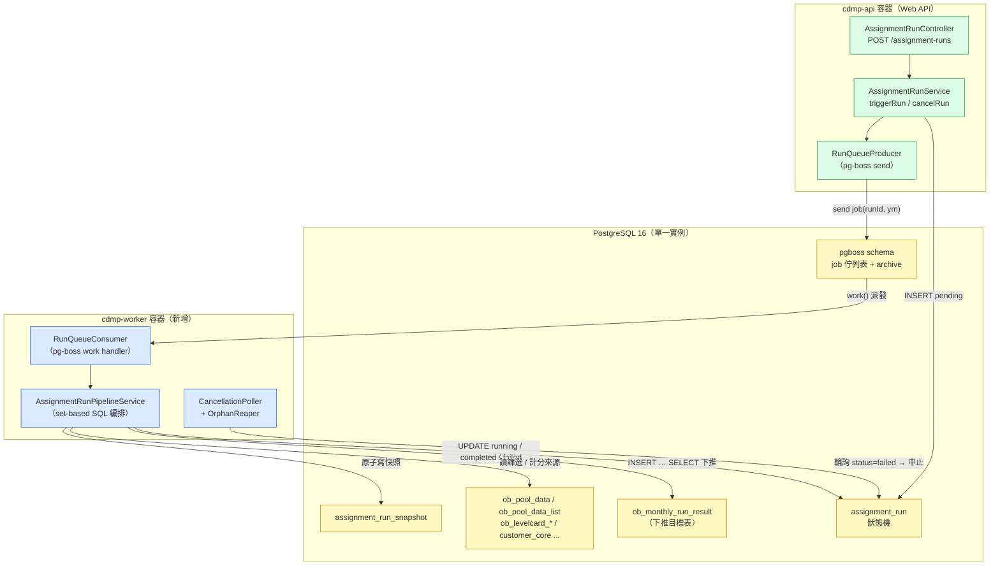
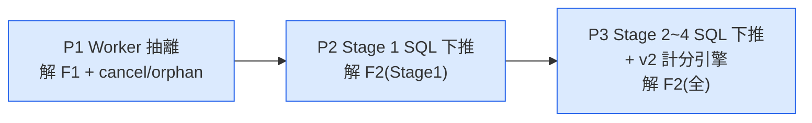
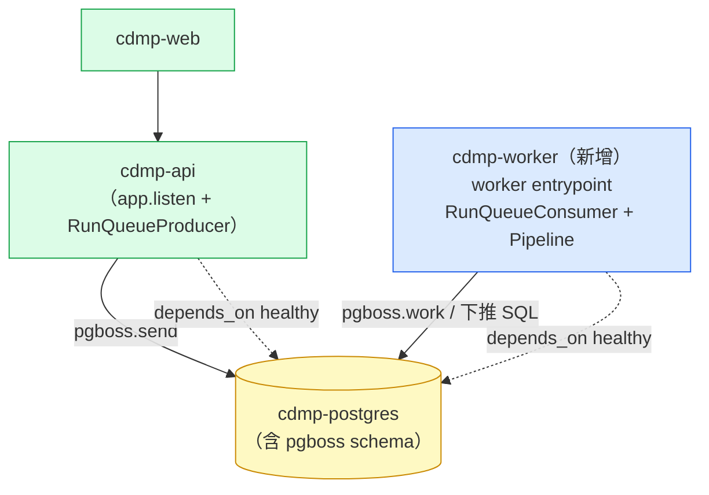
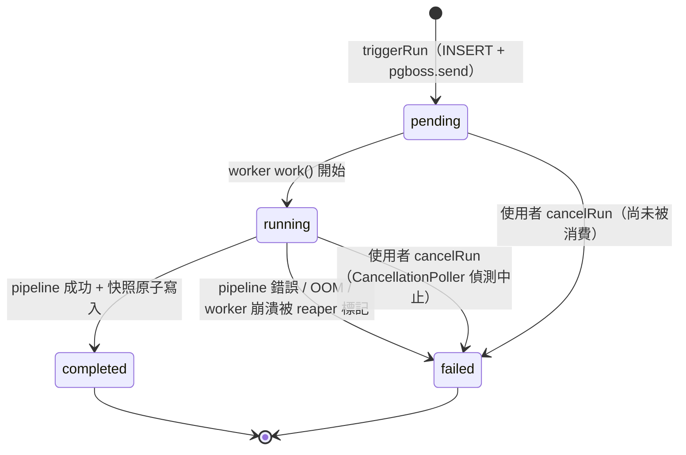

# AD-E07-28　月名單分派執行模型重構（Worker 抽離 + Stage 1~4 SQL 下推）

> 本決策記錄為架構設計產出，**不含 production / test 程式碼**。落地由 spec-writer（feature spec）、
> test-designer（測試策略）、tdd-implementation（實作）後續承接。所有 P1/P2/P3 階段之邊界、相依、
> 風險與驗證策略於本文件定義。

## 1. 問題陳述（Problem Statement）

月名單分派 pipeline 目前**與 Web API 跑在同一個 Node.js 程序、同一條 event loop、同一個 V8 heap**。
觸發點為 `AssignmentRunService.kickoffPipeline()`（`assignment-run.service.ts` L257），以
`setImmediate(() => this.pipeline.runPipeline(...))` 於**同程序背景**啟動 Stage 1~4。

此模型有兩個獨立失效面：

| 失效面 | 機制 | 觀測證據 | 影響 |
|--------|------|---------|------|
| **F1：event loop 阻塞（CPU）** | `executeStage1Chain` / `executeV2` 為同步 JS 迴圈，無 `await` 讓出點；`pool.filter(...)`、`computeScore(...)` 全部在 event loop 上同步跑 | 202606（dev、僅 3 份名單）CPU 卡滿一核 **>25 分鐘、全程 0 DB query**；期間 `127.0.0.1:3000` 任意真實路由**逾時無回應** | 月名單分派期間整站 API 不可用（含登入、查詢、其他 E07 寫入） |
| **F2：記憶體 / OOM** | `stage1-filter-chain.ts` L408 `qb.getMany()` 全載符合條件 `ob_pool_data` 進 heap；`queryRecentAssignedCustoNos` 全載近 3 月 DISTINCT custo_no Set；`executeV2` 又把整個 pool map 成 scoredPool | F055 同類前例：`poolDataListRepo.find()` 全載 ob_pool_data_list（7.8M 列 / 14GB）→ API OOM → 整頁 500 | prod 量級 heap OOM → 程序崩潰 → 整站 500 |

兩者同源於「重運算與 API 共用執行資源」。本決策從**執行模型**層級根治，而非局部優化。

## 2. 已拍板方向（2026-06-02，不需再確認）

- **軸①：抽離獨立 worker** — `triggerRun` 由「同程序 setImmediate」改為「入列 job queue」，新增獨立
  `cdmp-worker` 容器消費並執行 pipeline。佇列技術 = **pg-boss**（靠現有 Postgres，**免引入 Redis**）。
- **軸②：Stage 1~4 全面 SQL 下推** — pipeline 改寫為 set-based
  `INSERT INTO ob_monthly_run_result SELECT … FROM ob_pool_data WHERE …`，記憶體交給 DB streaming。
- **下推範圍 = 全範圍** — 連 v2 真實計分引擎（`ASSIGNMENT_PIPELINE_V2`）也一併用 SQL 補完：
  `ob_levelcard_*` 區間 / 類別權重計分、`customer_core` join、`st4_exchange`（T1/T2→T3 10% 轉資深）。

## 3. 為何此刻值得做（vs 2026-06-01 否決 Stage 1 SQL 下推）

2026-06-01 否決 Stage 1 SQL 下推時，效益門檻是「省 1 秒」（純效能微優化），不足以抵銷
estimate≡run drift 與 guard 移轉成本。**現在情境已根本改變**：

1. 效益不再是「省 N 秒」，而是**「月名單分派期間網頁可用」+「防 prod 整站 OOM」**——量級從「優化」升為「可用性 / 穩定性」。
2. F1（event loop 阻塞）**單靠 worker 抽離即可解決**（軸①），SQL 下推（軸②）解決 F2（OOM）。
   兩軸正交，可分階段交付、各自獨立驗證。
3. estimate≡run 不分叉、guard 移轉、portability 三個前例**仍須正面處理**（見 §6），但放在
   「換取整站穩定」的脈絡下，其成本是合理且必要的投資，而非為微優化承擔的風險。

## 4. 目標架構（Target Architecture）

### 4.1 一句話

月名單分派由「API 同程序 `setImmediate` 背景跑」改為「`triggerRun` 入列 pg-boss job → 獨立
`cdmp-worker` 容器消費 → Stage 1~4 以 set-based SQL `INSERT … SELECT` 在 Postgres 內完成」，
使 API event loop 與 heap 完全脫離月名單分派負載。

### 4.2 元件圖

### 4.3 關鍵設計原則

| 原則 | 內容 |
|------|------|
| **單一 Postgres** | pg-boss 自帶之 `pgboss` schema 與既有 `cdmp_dev` 同庫；不引入 Redis / 第二資料庫 |
| **狀態雙寫但不衝突** | pg-boss job 狀態（created/active/completed/failed/cancelled）為**佇列傳輸層**狀態；`assignment_run.status`（pending/running/completed/failed）為**業務領域**狀態。兩者各自權威：使用者 / 前端只看 `assignment_run.status`；佇列重試 / orphan 偵測看 job 狀態 |
| **worker 共用既有 NestJS module** | `cdmp-worker` 以同一份 `apps/api` 程式碼啟動，但 bootstrap 為 worker entrypoint（非 `app.listen()`），只註冊 pipeline + queue consumer 所需 provider，不掛 HTTP server。避免程式碼重複與 entity drift |
| **set-based SQL 為主，應用層為例外** | Stage 1~4 預設 `INSERT … SELECT`；無法可移植下推之規則（見 §6.3 portability）保留於應用層，但仍在 worker 程序執行，不回到 API |
| **estimate≡run 仍共用單一 SQL** | Stage 0 試算（dryRun）與月名單分派（run）共用同一組 SQL builder，只差 `INSERT … SELECT`（run）vs `SELECT COUNT(*)`（estimate）的外層包裝（見 §6.1） |

## 5. 階段邊界與相依（P1 / P2 / P3）

> 順序確立理由：**先抽離 worker（P1）再下推 SQL（P2/P3）**。worker 抽離單獨即解 F1（event loop
> 阻塞，最嚴重的可用性問題），且為 SQL 下推提供「不影響 API」的安全執行容器；若先做 SQL 下推、後抽
> worker，下推期間若有 bug 仍在 API 程序炸 heap。故 worker 先行。

### P1 — Worker 抽離（解 F1 + 建立可取消 / 可回收的執行容器）

**範圍**：
1. 引入 pg-boss，於既有 Postgres 建立 `pgboss` schema（migration，見 §7）。
2. 新增 `cdmp-worker` 容器（docker-compose service，見 §8），以 worker entrypoint 啟動。
3. `triggerRun` 改為：`INSERT assignment_run(status=pending)` → `pgboss.send('assignment-run', {runId, ym})`，
   立即回 202（不再 `setImmediate`）。
4. worker 端 `work('assignment-run', handler)` 消費 → 呼叫**現有** `runPipeline(runId, ym)`（P1 不改 pipeline 內部演算法，仍為 JS 版；只是換執行容器）。
5. **補 cancellation**：worker 內 `CancellationPoller` 定期（如每 N 秒）查 `assignment_run.status`，若已被
   `cancelRun` 標為 `failed`（使用者取消），則中止當前 pipeline（解決 `cancelRun` 註解自承「背景不會真停」）。
6. **補 orphan 回收**：worker 啟動時 / 定期掃描 `status='running'` 但對應 job 已不存在或逾時（worker
   崩潰遺留）之 run，標為 `failed`（error_message='worker 中斷，請重新觸發'）。pg-boss 內建
   job expiration / archive 可輔助偵測。

**P1 完成後狀態**：F1 解除（API event loop 不再被月名單分派卡死）；F2（OOM）**尚未解**（pipeline 仍 JS 全載，
但 OOM 現在炸的是 worker 程序，不再炸 API → 整站不再 500，僅該次月名單分派失敗）。此即「先止血」價值。

**相依**：無前置；可獨立交付。

### P2 — Stage 1 SQL 下推

**範圍**：將 `executeStage1Chain` 的全載 + 應用層 filter 改寫為 set-based SQL：
- ① 欄位篩選（`buildStage1WhereConditions`）→ 已是 SQL fragment，沿用。
- ② MONTH_CNT 期別過濾 → 已是 SQL fragment（`buildMonthCntFragment`），沿用。
- ③ 撈 pool → 不再 `getMany()`；改為 CTE / 子查詢。
- ④ 詐騙白牌 DELETE → SQL `WHERE NOT (list_type='01' AND spec_name LIKE '%白牌%')`（可移植）。
- ⑤ 近 3 月去重 → SQL `WHERE custo_no NOT IN (SELECT DISTINCT custo_no FROM ob_pool_data_list WHERE assignday BETWEEN … )` 或 `NOT EXISTS` / anti-join（DB 內完成，不載 Set 進 heap）。
- ⑥ 特例 DELETE 機車期中 / 期中小資 → SQL `WHERE NOT (...)`（數值比較用 `CAST(... AS numeric)`；integration test 一律 PG 真庫，見 §6.3 OQ-AD28-03 RESOLVED）。
- ⑥ **年以上規則** → PG 專屬 SQL（CI 強制 PG 跑，見 §6.3 OQ-AD28-03 RESOLVED = 選項 A）；**精確 SQL 由 tdd 在 PG 等價測試下滿足，golden oracle = 現行 JS**：`parseInt(year_produ ?? '1900', 10) < cutoff`（NULL→1900、非數字→NaN→false 保留、前導數字 `'1980abc'`→1980）。初版示範寫法 `NULLIF(REGEXP_REPLACE(...))` 對 `''`/`'N/A'` 會誤排，**不可直接採用**；tdd 須以 JS oracle 的邊界案例驗收 SQL 實作。

run 路徑：外層包 `INSERT INTO ob_monthly_run_result (run_id, list_no, orgno, appl_no, custo_no, settle_src, assignday, created_at, updated_at) SELECT :runId, :listNo, o.orgno, o.appl_no, o.custo_no, o.settle_src, NULL, NOW(), NOW() FROM ob_pool_data o WHERE <②③④⑤⑥ 合成>`。

> **Schema 注意（測試設計揪出，2026-06-02）**：`ob_pool_data` **無** `assignday` 欄；現行 JS pipeline 從不寫 assignday（月名單分派結果該欄恆 NULL；entity 標 `forward-compat` 業務回填，見 `ob-monthly-run-result.entity.ts`）。下推 SELECT 須明確寫 `NULL`，不可嘗試從 `ob_pool_data` 取值。

estimate 路徑：外層包 `SELECT COUNT(*) FROM ob_pool_data o WHERE <同一份 WHERE>`。

**P2 完成後狀態**：Stage 1 不再全載；F2 在 Stage 1 範圍內解除。Stage 2~4 仍 JS（讀 Stage 1 已寫入
`ob_monthly_run_result` 的列回 heap 做計分）。

**相依**：P1（需 worker 容器與其執行環境）。

### P3 — Stage 2~4 SQL 下推 + v2 真實計分引擎

**範圍**：把計分 / 分派也下推為 SQL，消除「Stage 1 寫表後又讀回 heap 計分」的往返：
- **Stage 2 計分**：`ob_levelcard_score` 的區間型（`level2_s`/`level2_e`）與類別型（`level1`）權重，
  以 `JOIN` + `SUM(CASE WHEN …)` 在 SQL 累加；`customer_core` 客戶屬性欄位（`computeScore`
  的 `resolveColumnValue` default 分支標註「需 join customer_core，v2.1 補完」）以 `LEFT JOIN customer_core` 補齊。
- score → `ob_levelcard_level`（區間）→ card_level → `ob_tier` → tier_level：以 `LEFT JOIN` 完成。
- **Stage 3 CR 動態回分**：`is_cr` 標記改以 `EXISTS`（查歷史 `ob_monthly_run_result` 未成交
  `result_status='PENDING'` 案件）下推。
- **Stage 4 st4_exchange**：T1/T2 案件 10%（向上取整、保底 1）轉該部門 T3 員工。此為**有序 +
  比例**邏輯，以 `ROW_NUMBER() OVER (PARTITION BY list_no ORDER BY …)` + `CEIL(count * 0.1)` 視窗
  函式表達；員工 tier 來源 `ob_empl_set.prod_type='TIER:T*'`（現況）→ 視窗函式分配 senior / default。

**P3 完成後狀態**：Stage 1~4 全程 set-based，heap 僅承載 SQL 參數與少量編排狀態；F2 全解。
v2 計分引擎以 SQL 補完（取代 `executeV2` 的 JS 簡化版）。

**相依**：P2（Stage 1 已寫入 `ob_monthly_run_result`，P3 在其上 `UPDATE … FROM` 補計分 / 分派欄位，
或重構為單一大 `INSERT … SELECT` 含 join）。

### 階段相依圖

## 6. 四個踩雷前例的調和方案（STRICT）

### 6.1 estimate≡run 不可分叉

**前例**：`executeStage1Chain` 是月名單分派（run, dryRun:false）與 Stage 0 試算（dry-run, dryRun:true）
**共用單一實作**，刻意不分叉——這正是 F049 原 bug 根因。

**調和方案**：下推後**仍維持單一 SQL builder**。設計一個 `buildStage1Sql(list, workdt)` 純函式，回傳
「WHERE 子句 + params + FROM/JOIN 片段」，run 與 estimate 共用此同一份輸出：

| 路徑 | 外層包裝 | 共用核心 |
|------|---------|---------|
| run（dryRun:false） | `INSERT INTO ob_monthly_run_result (…) SELECT … FROM ob_pool_data o WHERE <core>` | `buildStage1Sql` 回傳的 `<core>` |
| estimate（dryRun:true） | `SELECT COUNT(*) FROM ob_pool_data o WHERE <core>` | 同一份 `<core>` |

**不變式 I-RUN-EST-01**：run 與 estimate 的 `WHERE / JOIN / FROM` 子句必須來自同一函式輸出，
分叉點僅限最外層 `INSERT…SELECT` vs `SELECT COUNT(*)`。test-designer 須有一條測試直接斷言兩路徑
產出的 SQL core 字串相等（或以同一 list 跑 run 後的列數 == estimate 的 count）。

### 6.2 regression guard 衝突（測試策略移轉）

**前例**：現有 `RGv2-005` 刻意 pin 住 JS 原始碼保留 `includes('小資')` / `includes('白牌')`，加上整套
`SDv2-*` 測試。改 SQL 後這些 JS-pin guard 失去意義（原始碼不再有那些 `includes`）。

**調和方案（點名給 test-designer，本架構文件不寫測試案例細節）**：
1. **廢除 JS-pin guard**：`RGv2-005` 等「grep 原始碼字串」型 guard 隨 SQL 化一併移除（其保護目標
   ——特例 trigger 關鍵字正確——改由 §6.1 的等價比對 + `special-rules.ts` 既有單元測試守住；
   `matchesSpecialRule` 仍是 JS，trigger 判斷未 SQL 化，仍受既有測試保護）。
2. **新增 PG 真庫 integration test**：以 Postgres 真實資料庫，逐 list 做「JS 版 vs SQL 版」結果等價
   比對（apply 相同輸入名單，斷言 run 產出的 `ob_monthly_run_result` 列集合與舊 JS pipeline 一致）。
3. **等價比對為 P2/P3 的驗收門檻**：SQL 版上線前，必須對一組代表性名單（含觸發各特例規則者）通過
   JS↔SQL 等價測試。此為「結果可證等價」要求（CLAUDE.md：改機制但結果須可證等價）的具體落地。

**測試移轉表**：

| 既有 guard / 測試 | SQL 化後處置 | 替代保護 |
|------------------|------------|---------|
| `RGv2-005`（grep `includes('小資')`/`includes('白牌')`） | 移除 | special-rules.ts 單元測試（trigger 仍 JS） + JS↔SQL 等價測試 |
| `SDv2-*`（JS 特例 DELETE 行為） | 改寫為 PG integration | 同名語意斷言改跑真庫 SQL 結果 |
| estimate≡run 共用測試 | 保留並加強 | 新增 SQL core 等價斷言（I-RUN-EST-01） |

### 6.3 portability（SQLite 測試 vs PG prod）

**前例**：特例 DELETE 的 `year-above` 規則用 `parseInt(c.year_produ ?? '1900', 10)`，SQLite 與 PG
`CAST` 行為不同 → 純 SQL 不可移植。可移植者：fraud / motorcycle / xiaozi；不可移植者：year-above。

**調和方案（三選項評估，✅ 2026-06-02 使用者裁定 = 選項 A）**：

| 選項 | 內容 | 取捨 |
|------|------|------|
| **A：整合測試只跑 PG（✅ 裁定採用）** | 特例 DELETE 全 SQL 化（含 year-above 用 PG `CAST`/`regexp` 數值化），integration test 一律對真 Postgres 跑，不靠 SQLite | 最簡單；JS↔SQL 等價測試 harness 已建置，CI 強制起 Postgres 的成本可接受 |
| B：year-above 用可移植 SQL | 改用 PG/SQLite 皆支援的寫法（如先 `WHERE year_produ ~ '^[0-9]+$'` 過濾非數字，再比較）；但 SQLite 無 POSIX regex，仍有落差 | 寫法綁手，且 SQLite regexp 需擴充，實務上仍難真正可移植 |
| ~~C：year-above 保留應用層~~ | ~~fraud / motorcycle / xiaozi 下推 SQL；year-above 規則保留為 worker 應用層 filter~~ | ~~混合模式；year-above 名單 pipeline 回退為「materialize 後 filter」，破壞 set-based 記憶體有界目標~~ |

> **✅ OQ-AD28-03 RESOLVED（2026-06-02）**：裁定選項 A。理由：(1) 本重構已建置 PG 真庫 JS↔SQL
> 等價測試 harness，SQLite/PG `CAST` 差異的原顧慮因「等價測試一律跑 PG」而消解；(2) 選項 C 會讓
> year-above 名單的 pipeline 回退為「materialize 後 filter」，破壞 set-based 記憶體有界目標（F2
> 部分未解）；(3) 選項 A 最簡潔：四條特例規則一律 SQL 化，去掉混合模式的額外維護成本。
>
> **裁定內容**：**四條特例規則（R-FRAUD-WHITEBOARD / R-PERIOD-MOTORCYCLE / R-PERIOD-XIAOZI /
> R-YEAR-ABOVE）全部 SQL 下推**；JS↔SQL 等價測試及 integration test 一律對 Postgres 真庫執行，
> 不靠 SQLite。CI 須確保 Postgres 容器可起（與 P2 驗收門檻綁定）。

**不變式 I-PORT-01**（強化後，OQ-AD28-03 RESOLVED）：所有特例 DELETE 規則（含 year-above）一律以
PG integration test 驗收；SQLite 型 unit test 不可替代。year-above 不再保留應用層——純 SQL 化。

### 6.4 效益門檻已改變（記錄用）

見 §3。本節僅記錄：2026-06-01 的否決基於「省 1s」門檻，**該決策在當時情境正確**；本決策因
effort 對應之效益已由「微優化」升為「整站可用性 + 防 OOM」，故重新評估並推翻，不視為前決策錯誤。

## 7. dev synchronize vs prod migration 處理

專案慣例：dev DB 靠 `synchronize:true` 建表、`typeorm_migrations` 全空、`migration:run` 不可用於 dev；
**但 prod / 新 DB 走 migration runner** → 任何新表 / 新欄位都要同時提供 migration。

本重構的 schema 變更與處理：

| 變更項 | dev（synchronize） | prod / 新 DB（migration） |
|--------|-------------------|--------------------------|
| pg-boss `pgboss` schema（job / archive 等表） | pg-boss 啟動時 `boss.start()` 會自建（其內建 schema 自舉），synchronize 不涉入（非 TypeORM entity） | **✅ OQ-AD28-01 RESOLVED（2026-06-02）**：以 TypeORM migration 包 pg-boss DDL 固定版本，納入版本控制，避免 prod 多 worker 首啟 race。Migration 編號 `1711360000299+`。 |
| `ob_monthly_run_result` 既有欄位 | 已存在（migration `1711360000292`） | 已存在 |
| 若 P3 需新增 result 欄位（如計分中間欄） | synchronize 生效 | 須補 migration（沿用 `1711360000300+` 編號序） |
| cancellation / orphan 所需欄位 | 不新增欄位 | **✅ OQ-AD28-02 RESOLVED（2026-06-02）**：orphan 偵測靠 pg-boss job expiration + 逾時 threshold，**不新增** `worker_id` / `heartbeat_at` 欄位，免改 schema。 |

**原則**：任何 entity 變更同時改 entity + migration（CLAUDE.md / `ob-monthly-run-result.entity.ts` 註解
「Entity 必須與 migration 保持一致」）。pg-boss 的 schema 非 TypeORM entity，須以「migration 包裝其
DDL」或「部署腳本明確初始化」二擇一固定，不可僅依賴 worker 首啟自建（prod 多 worker 首啟 race）。

## 8. docker-compose 變更概要

新增 service 概要（**概念層，非最終 yaml**）：
- `worker`：`build.context: ./apps/api`、`target: dev`；`command` 改為 worker entrypoint（如
  `npx ts-node -r tsconfig-paths/register src/worker-main.ts`，實際檔名由 tdd-implementation 定）；
  共用與 `api` 相同的 DB_* / AES / feature-flag 環境變數；`depends_on: postgres (healthy)`；
  **不 expose port**（無 HTTP）。
- `api`：移除「同程序跑 pipeline」職責；新增 pg-boss producer 初始化。`ASSIGNMENT_PIPELINE_V2` 等
  flag 需同時供 worker（worker 才是真正執行 pipeline 者）。
- 不新增 Redis、不新增第二資料庫。

## 9. 狀態機與失敗 / 取消 / orphan 處理

### 9.1 run 狀態機（業務層，不變語意，新增轉移來源）

### 9.2 失敗處理

| 失敗來源 | 偵測 | 處置 |
|---------|------|------|
| pipeline 內部錯誤 | `runPipeline` try/catch（已存在） | `UPDATE assignment_run SET status='failed', error_message=…` |
| worker 程序崩潰（OOM 等） | OrphanReaper 掃 `status='running'` 但 job 已 expire / worker 不存活 | 標 `failed`，error_message='worker 中斷，請重新觸發' |
| pg-boss job 重試 | pg-boss 內建 retry | **✅ OQ-AD28-04 RESOLVED（2026-06-02）**：`retryLimit=0`，**不允許自動重試**。冪等機制（I-IDEM-01）未完備前防雙寫；失敗一律人工重觸發。 |

### 9.3 取消處理（補齊 cancelRun 自承缺陷）

現況 `cancelRun`（`assignment-run.service.ts` L160~216）註解自承：「背景 pipeline 不會立即中斷
（Stage 1~4 尚未實作 cancellation token），但 status 已標記」。

新設計：
- `cancelRun` 維持「標 `assignment_run.status='failed'` + audit CANCEL」（API 側，不變）。
- worker 內 `CancellationPoller`：pipeline 執行期間，於**每個可中斷邊界**（每處理完一份 list、每個
  Stage 之間）查一次 `assignment_run.status`；若已被標 `failed`（取消），則拋 `RunCancelledException`
  讓 pipeline 提早結束，不再寫快照 / result。
- SQL 下推後（P2/P3），單一 `INSERT … SELECT` 為原子大查詢，期間無法插入 poll；故可中斷邊界為
  「list 與 list 之間」「Stage 與 Stage 之間」。長單 list 的下推一旦開始即跑完該 list——可接受
  （DB 內單查詢，秒級～分鐘級，遠優於現況 25 分鐘卡 event loop）。
- 額外：pg-boss 提供 `cancel(jobId)` 可取消**尚未被消費**的 job（pending 階段取消的快路徑）。

### 9.4 冪等性（重試 / orphan 重觸發前提）

`ob_monthly_run_result` PK = `(run_id, list_no, orgno, appl_no)`，FK → `assignment_run`
ON DELETE CASCADE。故同一 `run_id` 重跑前，須先 `DELETE FROM ob_monthly_run_result WHERE run_id=:runId`
（或整 run 刪除由 CASCADE 清）以保證冪等。snapshot 同理。**不變式 I-IDEM-01**：pipeline 開始實質
寫入前，必須清除該 run_id 既有 result / snapshot，使重試 / 重觸發產出一致。

## 10. 風險與驗證策略

| 風險 | 等級 | 驗證 / 緩解 |
|------|------|------------|
| SQL 版與 JS 版結果不等價（特例 DELETE / 去重邊界 / NULL 處理） | 高 | §6.2 JS↔SQL 等價 integration test（PG 真庫），P2/P3 驗收門檻；逐 list 比對列集合 |
| portability：year-above CAST 行為 PG≠SQLite | ~~中~~ **已解** | §6.3 OQ-AD28-03 RESOLVED = 選項 A；year-above 全 SQL 化；等價測試一律 PG 真庫；I-PORT-01 |
| pg-boss schema 在 prod 首啟 race / 未納 migration | ~~中~~ **已解** | §7 OQ-AD28-01 RESOLVED = migration 包 DDL 固定版本 |
| worker 崩潰遺留 orphan running run | 中 | §9.2 OrphanReaper；冪等清理 I-IDEM-01 |
| 取消無法即時中斷長單 list 的 SQL 下推 | 低 | §9.3 可中斷邊界為 list/stage 之間；單查詢秒～分鐘級，可接受 |
| estimate≡run 在 SQL 化過程再度分叉 | 高 | §6.1 I-RUN-EST-01 共用 SQL core + 等價斷言 |
| customer_core join 後計分 SQL 複雜度 / 效能 | 中 | P3 先以 `EXPLAIN ANALYZE` 驗證計畫；必要時加索引（沿用 m297/m298 partial index 模式） |
| dev synchronize 與 prod migration drift（新欄位） | 中 | §7 原則：entity 改動同步補 migration |

## 11. 需 spec / 測試覆蓋點名（不在此寫細節）

| 項目 | 承接 agent |
|------|-----------|
| `triggerRun` 改入列、新增 producer / consumer 行為 spec | spec-writer |
| cancellation / orphan 回收行為 spec（狀態轉移、error_message 文案） | spec-writer |
| JS↔SQL 等價測試矩陣（代表性名單 + 各特例規則觸發樣本） | test-designer |
| I-RUN-EST-01 / I-PORT-01 / I-IDEM-01 不變式測試 | test-designer |
| PG integration test 環境（CI 是否起 Postgres）決策落地 | test-designer + DevOps |
| worker entrypoint / docker-compose worker service 實作 | tdd-implementation |
| pg-boss schema migration（§7） | tdd-implementation |

## 12. Open Questions

| ID | 狀態 | 問題 / 裁定 | 影響 |
|----|------|------------|------|
| **OQ-AD28-01** | ✅ **RESOLVED 2026-06-02** | 裁定：TypeORM migration 包 pg-boss DDL，納版本控制，Migration `1711360000299+`。 | prod 部署流程；多 worker 首啟 race → 已解 |
| **OQ-AD28-02** | ✅ **RESOLVED 2026-06-02** | 裁定：orphan 靠 pg-boss job expiration + 逾時 threshold，**不新增** schema 欄位。 | 免改 entity + migration |
| **OQ-AD28-03** | ✅ **RESOLVED 2026-06-02** | 裁定：選項 A（全 SQL + CI 強制 Postgres）。四條特例規則全部 SQL 下推；等價測試一律 PG 真庫。 | Stage 1 100% 純 SQL；CI 須起 Postgres |
| **OQ-AD28-04** | ✅ **RESOLVED 2026-06-02** | 裁定：`retryLimit=0`，不允許自動重試；失敗一律人工重觸發。 | 冪等實作範圍確定；防雙寫 |
| **OQ-AD28-05** | ✅ **RESOLVED 2026-06-02** | 裁定：單一 worker（`teamConcurrency=1`）序列化，MVP 階段足夠。 | worker scaling 固定；DB 連線池壓力最小 |
| **OQ-AD28-06** | ✅ **RESOLVED 2026-06-02** | spec-writer 從 legacy SP（UTF-16LE 解碼 `SP_INFOT_ASSIGNEXPORTNAMELIST_st4_exchange.sql`）確認選案鍵 = `NEWID()`（隨機、無業務優先序）。下推改用 deterministic `ROW_NUMBER() OVER (PARTITION BY list_no ORDER BY orgno, appl_no)`，業務等價於隨機且可等價測試。 | Stage 4 排序鍵確定 |
| **OQ-F100-01** | ✅ **RESOLVED 2026-06-02** | 裁定：對齊現行 JS 簡化版——`PARTITION BY list_no` + 單一 senior + deterministic 排序（`ORDER BY orgno, appl_no`）。legacy SP 的主管↔專員等量配對交換、寄信告警、整批回滾等副作用明確 **out-of-scope**。 | Stage 4 P3 實作範圍確定；不復刻 SP 配對語意 |
| **OQ-F099-02** | ✅ **RESOLVED（測試設計階段，2026-06-02）** | assignday 下推寫 NULL（`ob_pool_data` 無此欄；月名單分派結果 assignday 恆 NULL，業務日後回填）。JS↔SQL 等價測試須斷言 `assignday IS NULL`。 | 下推 SELECT 欄位清單已更正（§5 P2）；無 schema 變更 |
| **OQ-F099-03** | ✅ **RESOLVED（測試設計階段，2026-06-02）** | year-above SQL 之 golden oracle = 現行 JS（`parseInt(year_produ ?? '1900') < cutoff`；NULL→1900、非數字→NaN→保留、前導數字正確解析）；初版示範 SQL 對 `''`/`'N/A'` 有誤排，精確實作由 tdd 以 PG 等價測試滿足。 | year-above SQL 實作方式已在 §5 P2 補充說明；tdd 負責邊界驗收 |

## 13. 與既有 AD 的關係

- **修訂 AD-E07-22 / AD-E07-23**：Stage 1 由「欄位篩選 SQL + 應用層 month_cnt/去重/特例」改為
  「全步驟 set-based SQL（含 year-above，OQ-AD28-03 RESOLVED = 選項 A）」。
  `executeStage1Chain` 的設計原則（estimate≡run 共用）**保留並強化**（§6.1）。
- **修訂 AD-E07-25**：月名單分派寫入 `ob_monthly_run_result` 不變；但寫入方式由「JS 組 `Partial[]` 後
  `save()`」改為「`INSERT … SELECT` 下推」。
- **不影響 AD-E07-26**：特例 trigger 判斷（`matchesSpecialRule`）仍為 JS 純函式，未 SQL 化；
  SQL 只接收「此 list 觸發哪些規則」的布林結果來決定是否加對應 `WHERE NOT (...)` 子句。
- **不影響 AD-E07-27**：`workdt = parseWorkdt(project_workym)`、去重視窗 `[workdt−3月, workdt−1日]`
  語意不變，只是計算位置由 JS 移入 SQL（去重 anti-join 的 assignday 範圍參數）。
</content>
</invoke>
