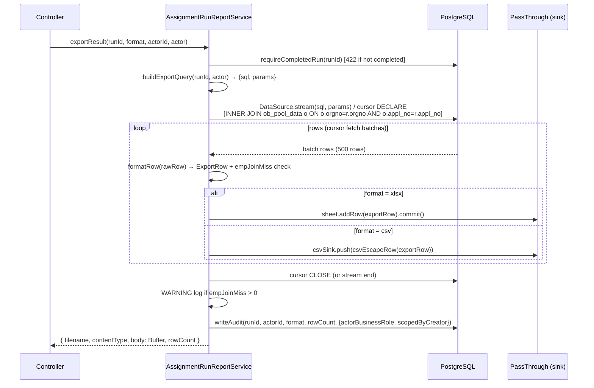

# AD-E07-31　F064 v2.0 匯出分派結果（23 欄對齊 legacy）

> 本決策記錄為架構設計產出，**不含 production / test 程式碼**。落地由 test-designer（測試策略）、
> tdd-implementation（實作）後續承接。
>
> **前置 AD**：本 AD 直接延伸 AD-E07-30（F102 CR 優先分派）與 AD-E07-11（F064 exceljs streaming 技術選型）。
> AD-E07-11 的 exceljs streaming 選型決策於本 AD 繼續有效；本 AD 補充 CSV streaming 設計與多表 join 路徑。

## 1. 問題陳述（Problem Statement）

F064 v1.1 匯出功能存在三項嚴重 schema gap（US-155 §背景說明，已由使用者裁定）：

| Gap | 現況問題 | 裁定處置 |
|-----|---------|---------|
| **GAP-1**：AC-2 誤列 `custo_no` / `cust_name` | legacy 工作表 1 根本無此兩欄；v1.1 誤列 9 欄（含 `card_level` / `score`）| 移除 `custo_no` / `cust_name` / `card_level` / `score`；案號改 `appl_no`；欄位數從 8 → 23 |
| **GAP-2**：BR-1 資料來源錯誤 | v1.1 從 `assignment_run_snapshot.payload`（8 欄瘦投影 JSONB）讀取，無法提供 23 欄所需欄位 | 改從 `ob_monthly_run_result`（by `run_id`）多表 join 讀取 |
| **GAP-3**：進件日 source 確認 | `ob_monthly_run_result.appl_date`（F102 m300 補）vs `ob_pool_data.appl_date` | **裁定**：取 `ob_pool_data.appl_date`（見 §3.5 OQ-F064-4 裁示；⚠️ ob_pool_data.appl_date 型別為 timestamp，格式化只取日期部分）|

此外，v1.1 CSV 路徑使用 in-memory 全量字串拼接（`lines.join('\n')`），50k+ 筆時有 OOM 風險（BR-F064-09 補回）。

F102（AD-E07-30）已於 main 上 commit，`ob_monthly_run_result.cr_id` / `cr_nm` / `is_cr` / `emplid` / `assignday` / `appl_date` 全部有值，join 條件全齊，F064 v2.0 可直接消費。

> **⚠️ BUG-F064-POOL-JOIN-01（2026-06-17 修正）**：初版 AD 誤選 `ob_pool_data_list` 作為 pool 屬性來源，
> 實測 run e3c839b7 發現 INNER JOIN 遺漏 11.5%（6,438 筆）。**正確表為 `ob_pool_data`**（Stage 1 血緣源，
> PK=orgno+appl_no，100% 覆蓋 result 表，實測 55,863/55,863 全對）。本 AD 下方所有 join 路徑已修正。

---

## 2. 目標架構設計

### 2.1 OQ-F064-1 裁示：多表 join 下推 SQL + 索引

**問題**：`exportResult()` 現從 snapshot JSONB 讀 8 欄，需改為單一 SQL 多表 join 取 23 欄資料。

**裁定：單一 SQL 多表 join + server-side cursor 逐批 fetch**

> **⚠️ BUG-F064-POOL-JOIN-01 修正（2026-06-17）**：Pool 屬性來源表從初版誤用的 `ob_pool_data_list` 改為
> `ob_pool_data`（Stage 1 血緣源，PK=orgno+appl_no）。理由：月跑 Stage 1 是
> `INSERT INTO ob_monthly_run_result SELECT … FROM ob_pool_data o JOIN ob_list_definition ld …`，
> `ob_monthly_run_result` 的每一列血緣都對應 `ob_pool_data` 的一筆（orgno, appl_no），
> INNER JOIN `ob_pool_data` by (orgno, appl_no) 保證 100% 匹配，不掉列。
> `ob_pool_data_list` 是 legacy ETL 載入的 per-list 去重結果表（PK=list_no+orgno+appl_no），
> 非所有 result 列均有對應紀錄，INNER JOIN 會遺漏。

JOIN 路徑如下（以 PostgreSQL 具名參數形式表示 join 形狀，非完整 SQL）：

```sql
SELECT
  -- 23 欄（欄序對齊 BR-F064-03 表）
  o.dept_name,                            -- 欄 1  分處
  r.appl_no,                              -- 欄 2  案號
  r.assignday,                            -- 欄 3  指派日（format in TS: YYYYMMDD string）
  r.list_no,                              -- 欄 4  名單代號
  d.list_nm,                              -- 欄 5  名單名稱（LEFT JOIN）
  o.appl_date,                            -- 欄 6  進件日（ob_pool_data.appl_date，timestamp→取日期部分；GAP-3）
  r.cr_id,                                -- 欄 7  CR_ID
  r.cr_nm,                                -- 欄 8  CR_NM
  r.is_cr,                                -- 欄 9  是否分配CR
  r.tier_level,                           -- 欄 10 TIER
  r.dept_id,                              -- 欄 11 部門代號
  e.dept_name    AS emphire_dept_name,    -- 欄 12 部門名稱（LEFT JOIN，join-miss→NULL）
  r.emplid,                               -- 欄 13 員編
  e.emp_nm,                               -- 欄 14 姓名（LEFT JOIN，join-miss→NULL）
  e.title_name,                           -- 欄 15 職級（LEFT JOIN，join-miss→NULL）
  o.project_tp,                           -- 欄 16 專案類別
  o.spec_name,                            -- 欄 17 專案名稱
  o.overdue_day,                          -- 欄 18 逾期天數（legacy 恆 NULL，保留欄）
  o.pro_rate,                             -- 欄 19 客戶利率
  o.sta_code,                             -- 欄 20 STA_CODE
  o.sta_code_na,                          -- 欄 21 案件狀態
  o.brand_name,                           -- 欄 22 廠牌名稱
  o.month_cnt                             -- 欄 23 名單週期月數

FROM ob_monthly_run_result r

-- ✅ 修正：INNER JOIN ob_pool_data（Stage 1 血緣源，PK=orgno+appl_no）
-- 血緣保證 result 每列必有對應 pool 紀錄，INNER JOIN 安全，不掉列（BUG-F064-POOL-JOIN-01 修正）
INNER JOIN ob_pool_data o
        ON o.orgno   = r.orgno
       AND o.appl_no = r.appl_no

LEFT JOIN ob_emphire e
       ON e.emp_id = r.emplid

LEFT JOIN ob_list_definition d
       ON d.list_no = r.list_no

WHERE r.run_id = :runId
  -- 處長 scope filter（BR-F064-13）由 WHERE 動態追加：
  -- AND r.emplid IN (SELECT emplid FROM ob_empl_set WHERE created_by = :actorId)
  -- director / admin bypass（不追加）
ORDER BY r.list_no, r.orgno, r.appl_no   -- 確定性排序（I-EXP-DET-01）
```

**不變式 I-EXP-COLSRC-01**（修正）：F064 v2.0 匯出所有 23 欄資料來源皆由上述單一 join SQL 提供；
pool 屬性（欄 1/6/16~23）來自 `ob_pool_data`（`o`，Stage 1 血緣源，PK=orgno+appl_no），
**不讀** `ob_pool_data_list`（BUG-F064-POOL-JOIN-01 修正）；
不讀 `assignment_run_snapshot.payload` JSONB（GAP-2 修正）；
不 SELECT `custo_no` / `cust_name` / `card_level` / `score`（GAP-1 修正，BR-F064-04）。

**不變式 I-EXP-LINEAGE-01**（新增）：匯出 pool 屬性 join 對象必須是 `ob_pool_data`（Stage 1 血緣源，
PK=orgno+appl_no），不得使用 `ob_pool_data_list`（legacy per-list ETL 去重表，PK=list_no+orgno+appl_no）。
Stage 1 以 `ob_pool_data` 為 INSERT…SELECT 來源，保證每筆 `ob_monthly_run_result` 在 `ob_pool_data`
有且僅有一筆對應紀錄（by orgno+appl_no），INNER JOIN 不掉列（實測 run e3c839b7：55,863/55,863 全對）。

**GAP-3 最終裁定（I-EXP-APLDATE-01，修正）**：欄 6「進件日」取 `ob_pool_data.appl_date`（`o.appl_date`），
不取 `ob_monthly_run_result.appl_date`（F102 m300 補欄）。
⚠️ **型別注意**：`ob_pool_data.appl_date` 在 TypeORM entity 宣告為 `Date | null`（PostgreSQL timestamp with
或 without timezone），格式化時需以 `toISOString().slice(0, 10)` 取出 `YYYY-MM-DD` 日期部分，
再 replace `-` 為 `/`，輸出 `YYYY/MM/DD`（BR-F064-05）。不可直接對 `Date` 物件呼叫 `.toLocaleDateString()`
（locale 差異）。

#### 2.1.1 索引確認

| 表 | 現有索引 | 是否足夠支援 join |
|----|---------|-----------------|
| `ob_monthly_run_result` | PK `(run_id, list_no, orgno, appl_no)` + `idx_omrr_run_id(run_id)` | ✅ `WHERE run_id = :runId` 走 `idx_omrr_run_id` |
| `ob_pool_data` | PK `(orgno, appl_no)` | ✅ INNER JOIN 雙欄 PK lookup（血緣保證全匹配） |
| `ob_emphire` | PK `emp_id` | ✅ LEFT JOIN `WHERE emp_id = r.emplid` 走 PK |
| `ob_list_definition` | PK `list_no`（由 m100 建立）| ✅ LEFT JOIN `WHERE list_no = r.list_no` 走 PK |

**結論**：所有 join 鍵均有既有索引覆蓋，**無需補新索引**（不需類似 m297/m298 的補索引 migration）。
若實際 prod 逾時（> 5 min），評估於 `ob_monthly_run_result(run_id, list_no)` 上補 covering index，
但此屬 post-deploy 觀察項，不在本 feature 範圍。

---

### 2.2 OQ-F064-2 裁示：CSV streaming 機制 + xlsx/CSV 共用 row-producer

**問題**：v1.1 CSV 為 `lines.push(...)` + `lines.join('\n')` 全量 in-memory 字串拼接，OOM 風險。

**裁定：單一 row-producer（server-side cursor 逐批 fetch）餵 format-specific writer**

```
┌─────────────────────────────────────────────┐
│         exportResult()（v2.0 重構後）          │
│                                             │
│  [1] TypeORM QueryRunner.cursor()           │
│       (run_id + scope filter)               │
│       → 逐批 fetch（FETCH 500 rows/batch）    │
│            │                                │
│            ▼                                │
│  [2] Row-producer loop（format-agnostic）    │
│       formatRow(rawRow) → ExportRow[23]     │
│            │                                │
│       ┌────┴────┐                           │
│       ▼         ▼                           │
│   xlsx writer  CSV writer                   │
│   (exceljs    (Node.js PassThrough +        │
│    stream      csvEscapeRow() 逐列 write)    │
│    WorkbookW.)                              │
│            │                                │
│            ▼                                │
│  [3] PassThrough sink → Buffer collect      │
│       (controller 回傳 body)                │
└─────────────────────────────────────────────┘
```

**不變式 I-EXP-STREAM-01**：xlsx 與 CSV 共用同一 row-producer（server-side cursor loop），
兩者均採 streaming 寫入，不將全部查詢結果載入記憶體。

#### 2.2.1 CSV streaming 實作機制

CSV path 改用 `PassThrough` stream + 逐列 escape + `push()`，取代 `lines.push()` 全量拼接：

```typescript
// 偽碼（供 tdd-implementation 參考，非 production code）
const csvSink = new PassThrough();
const chunks: Buffer[] = [];
csvSink.on('data', (chunk) => chunks.push(chunk));

// header row
csvSink.push(EXPORT_HEADER_V2.join(',') + '\n', 'utf8');

// row-producer loop（同 xlsx）
for await (const batch of cursorIterator(queryRunner, runId, scopeWhere)) {
  for (const rawRow of batch) {
    const row = formatRow(rawRow);
    csvSink.push(
      row.map(csvEscape).join(',') + '\n',
      'utf8',
    );
  }
}
csvSink.end();
await once(csvSink, 'finish');
body = Buffer.concat(chunks);
```

取代既有 `const lines: string[] = [...]; body = lines.join('\n')`。

#### 2.2.2 TypeORM cursor 方案

在 service 層使用 `DataSource.query()` 搭配 PostgreSQL `DECLARE cursor / FETCH batch` 原生 cursor，
或改用 TypeORM `QueryRunner.stream()` 取決於 tdd-implementation 對 TypeORM API 的確認。

**備選（較簡單）**：直接 `DataSource.createQueryBuilder()` + `getMany()` 分批（以 `LIMIT / OFFSET` 逐批），
但 OFFSET 方案在大資料集下效能退化（O(n²)，參考 project_e07_etl_perf_followup 教訓）。

**建議（tdd-implementation 採用）**：

```typescript
// 方案 A：TypeORM stream()（推薦，無 OFFSET）
const stream = await queryRunner.manager.createQueryBuilder(...)
  .stream();  // 回傳 Node.js Readable

// 方案 B：PostgreSQL native cursor（若 stream() 不符合）
await queryRunner.query(`DECLARE export_cursor CURSOR FOR ${sql}`, params);
// 迴圈: FETCH 500 FROM export_cursor → process → repeat until 0 rows
await queryRunner.query(`CLOSE export_cursor`);
```

**不變式 I-EXP-NOOFFSET-01**：CSV 與 xlsx 共用 producer 不得使用 `OFFSET n` 分頁策略，
必須採 server-side cursor 或 stream()，以避免大資料集 O(n²) 退化（參照 AD-E07-21 ETL 串流+COPY 教訓）。

---

### 2.3 OQ-F064-3 裁示：200k+ 背景 job 方案

**裁定：維持同步 streaming（5 min timeout），背景 job 為另案**

具體如下：

- 本 feature 維持 `EXPORT_TIMEOUT_MS_DEFAULT = 5 * 60 * 1000`（BR-F064-10）。
- 200k+ 筆是否足夠 5 分鐘：**不在本 feature 實測**，deploy 後觀察 prod 實際執行時間。
- 若 prod 實測逾時頻繁，另開 story 走 pg-boss worker + 202 Accepted 下載 URL 模式
  （參照 AD-E07-28 月跑 worker 抽離設計，非本 feature 範疇）。

**不變式 I-EXP-SYNC-01**：F064 v2.0 匯出為同步 streaming（HTTP response streaming）；
不採 202 Accepted 背景 job 模式。超過 5 min → 500 `EXPORT_FILE_EXPIRED`（BR-F064-10）。

---

### 2.4 OQ-F064-4 裁示：data-model.md 補述匯出 join 路徑

**裁定**：補述於 `docs/specs/data-model.md` 之 `ob_monthly_run_result` entity 章節末尾，
新增「F064 匯出 join 路徑」段落（詳見 §4 data-model 修改規格）。

---

### 2.5 scopeByCreator 套入 join SQL（BR-F064-13）

**處長 scope filter 實作**：沿用 `SectionChiefScopeService`，但從「post-query in-memory 過濾」
改為「query 時 WHERE 條件注入」（streaming 路徑不支援 post-fetch 過濾）。

```
section_chief → scope WHERE 條件追加：
  AND r.emplid IN (
    SELECT emplid FROM ob_empl_set
     WHERE created_by = :actorId
       AND list_no = r.list_no
  )

director / admin → 無追加（bypass filter）
```

**注意**：`created_by` 為 `ob_empl_set` 的欄位（人員比例設定者 UUID），對應 `SectionChiefScopeService`
現行邏輯（`filterByEmplId` 依 `emplid` 比對轄區員工清單）。

tdd-implementation 需確認 `SectionChiefScopeService` 是否提供 SQL WHERE 注入版本，
或需新增 `buildScopeWhereClause(actorUser): { sql: string; params: object } | null`。

**不變式 I-EXP-SCOPE-01**：處長 scope filter 必須在 query 階段以 SQL WHERE 條件注入，
不得在 streaming fetch 後 in-memory 過濾（後者破壞 streaming 記憶體 invariant，且 exportedRowCount 不可信）。

---

### 2.6 日期格式轉換層（BR-F064-05）

**不變式 I-EXP-FMT-01**：日期格式轉換在 `formatRow()` helper 中集中處理，規則如下：

| 欄 | 來源型別 | 輸出格式 | 轉換邏輯 |
|----|---------|---------|---------|
| 3 指派日 `assignday` | `VARCHAR(100)`（可能為 `'20260601'` 字串或 `'2026-06-01'` ISO 格式）| `YYYYMMDD`（8位數字字串） | 移除所有 `-`，取前 8 碼，不足 8 碼補零 / 記警告 |
| 6 進件日 `appl_date` | `DATE`（TypeORM 傳入為 `Date` 物件或 `'YYYY-MM-DD'` 字串） | `YYYY/MM/DD` | 字串取 `YYYY-MM-DD` → replace `-` with `/`；Date 物件用 `toISOString().slice(0,10)` |

**防 Excel 解析**：兩欄輸出為純字串（`''` 包圍在 xlsx addRow 以字串型別寫入）。
不以數值型別傳入，避免 Excel 將 `20260601` 誤判為整數序號。

---

### 2.7 ob_emphire join-miss 處理（BR-F064-06）

**架構決策**：

1. SQL 採 `LEFT JOIN ob_emphire`（已定案於 join SQL 形狀）。
2. join-miss 時 `e.emp_nm` / `e.title_name` / `e.dept_name` 為 `NULL`，`formatRow()` 轉為空字串（`''`）輸出。
3. 欄 13「員編」仍取 `r.emplid`（不受 join 失敗影響）。
4. **WARNING log 策略**：採「串流中偵測 + 批次彙總」方式：
   - `formatRow()` 回傳 `{ row: ExportRow; empJoinMiss: boolean; emplid?: string }`。
   - row-producer loop 結束後，若 `missCount > 0`，呼叫一次 `this.logger.warn(...)` 附帶 miss 的 `emplid[]`（最多記 100 個），避免 per-row 大量 log 影響效能。
   - 若 miss 筆數 > 100，log 訊息補 `(truncated to 100 of {total} misses)`。

**不變式 I-EXP-JOINMISS-01**：`ob_emphire` join-miss 不中斷匯出；欄 12/14/15 輸出空值；
匯出完成後記一筆 WARNING log 彙總 miss 的 `emplid` 與 `run_id`（BR-F064-06）。

---

### 2.8 稽核 log 更新（BR-F064-15）

v2.0 稽核 `after_value` 需新增 `scopedByCreator` 欄位（BR-F064-15 / AC-9）：

```typescript
// v2.0 after_value（取代 v1.1 writeAudit 呼叫）
{
  format: 'xlsx' | 'csv',
  actorBusinessRole: actor?.businessRole ?? 'unknown',
  scopedByCreator: this.scope.shouldFilter(actor),
  exportedRowCount: rowCount,
}
```

現行 `writeAudit()` 需新增 `extra` 欄位傳入 `actorBusinessRole` 與 `scopedByCreator`。

---

### 2.9 422 阻擋維持（BR-F064-12）

`requireCompletedRun()` 邏輯不變，v2.0 沿用。

---

## 3. exportResult() 精確改法

### 3.1 現行函式分析

```
exportResult(runId, format, actorId, actor, options)
  → requireCompletedRun(runId)          ← 保留
  → loadAllPayloads(runId)              ← 刪除（不再讀 snapshot）
  → scope.filterByEmplId(allAsgn, actor) ← 改為 SQL WHERE scope
  → buildXlsxStreaming(assignments, ...)  ← 大改（新 SQL-based producer）
  → CSV in-memory join + lines.join()   ← 大改（新 streaming CSV）
  → writeAudit(...)                     ← 小改（新增 scopedByCreator）
```

### 3.2 新增/修改的 function 清單

| 函式名 | 動作 | 說明 |
|--------|------|------|
| `exportResult()` | **重構**（主要修改點）| 移除 `loadAllPayloads`；改呼叫 `buildExportQuery`；兩格式改用 streaming producer |
| `buildExportQuery(runId, actor)` | **新增** private | 建構 join SQL（`INNER JOIN ob_pool_data o ON o.orgno=r.orgno AND o.appl_no=r.appl_no`，alias `o`）+ 處長 scope WHERE；回傳 `{ sql, params }`。**⚠️ 不得使用 `ob_pool_data_list`（BUG-F064-POOL-JOIN-01 修正）** |
| `buildExportXlsxStreaming(cursor, timeoutMs)` | **重構**（取代現有 `buildXlsxStreaming`）| 接受 cursor / AsyncIterable，改由外部 producer 餵資料 |
| `buildExportCsvStreaming(cursor, timeoutMs)` | **新增** private | CSV 的 PassThrough streaming 版本（對應現有 in-memory lines） |
| `formatRow(rawRow)` | **新增** private pure function | 23 欄格式轉換（日期格式 / NULL→空字串 / join-miss 偵測）；回傳 `{ row, empJoinMiss, emplid }` |
| `writeAudit()` | **小改** | `after_value` 增加 `actorBusinessRole` / `scopedByCreator` 欄位 |
| `EXPORT_HEADER` | **重寫** | 8 欄常數改為 23 欄（`EXPORT_HEADER_V2`，見 §3.3）|
| `ResultAssignment` interface | **廢除** | 不再使用（改用 join SQL rawRow 型別）|
| `loadAllPayloads()` | **不改，但 exportResult 路徑不呼叫** | `getSummary()` 與 `compareRuns()` 仍讀 snapshot；F064 路徑完全繞過 |

**⚠️ 注意**：`getSummary()` / `compareRuns()` / `compareRunsExport()` 繼續讀 snapshot，
**不受本次重構影響**。tdd-implementation 不得修改這三個函式的資料來源。

### 3.3 EXPORT_HEADER_V2（23 欄常數）

```typescript
export const EXPORT_HEADER_V2 = [
  '分處',
  '案號',
  '指派日',
  '名單代號',
  '名單名稱',
  '進件日',
  'CR_ID',
  'CR_NM',
  '是否分配CR',
  'TIER',
  '部門代號',
  '部門名稱',
  '員編',
  '姓名',
  '職級',
  '專案類別',
  '專案名稱',
  '逾期天數',
  '客戶利率',
  'STA_CODE',
  '案件狀態',
  '廠牌名稱',
  '名單週期月數',
] as const;
```

**舊** `EXPORT_HEADER`（8 欄）可保留或標 `@deprecated`，
因 `compareRunsExport()` 的 sheet 格式為英文欄名（不使用此常數）。

---

## 4. data-model.md 修改規格（OQ-F064-4 落地）

於 `docs/specs/data-model.md` 的 `#### ob_monthly_run_result` 章節末尾（`---` 分隔線之前），
新增以下段落：

```markdown
**F064 v2.0 匯出 join 路徑**（AD-E07-31 / US-155，2026-06-17）：

F064 匯出端點（`GET /api/v1/assignment/runs/:runId/export`）採單一 SQL 多表 join 取 23 欄：

```
ob_monthly_run_result r  (WHERE run_id = :runId)
  → INNER JOIN ob_pool_data o
              ON o.orgno = r.orgno AND o.appl_no = r.appl_no
              [⚠️ BUG-F064-POOL-JOIN-01 修正後：Stage 1 血緣源為 ob_pool_data（PK=orgno+appl_no），非 ob_pool_data_list；pool 端提供分處/進件日/專案/利率/STA/廠牌/月數等欄位]
  → LEFT JOIN ob_emphire e
              ON e.emp_id = r.emplid
              [join-miss → 部門名稱/姓名/職級三欄空值 + WARNING log；BR-F064-06]
  → LEFT JOIN ob_list_definition d
              ON d.list_no = r.list_no
              [join-miss → 名單名稱空值；列 join_key 為 list_no 單鍵]
```

關鍵設計決策（AD-E07-31）：
- **進件日（欄 6）取 `ob_pool_data.appl_date`**（GAP-3 裁定 + BUG-F064-POOL-JOIN-01 修正，不取 `ob_monthly_run_result.appl_date`）；`ob_pool_data.appl_date` 為 timestamp 型別，須 `toISOString().slice(0,10)` 取日期部分。
- **INNER JOIN ob_pool_data**（非 LEFT JOIN、非 ob_pool_data_list）：月跑 Stage 1 INSERT 來源即為 ob_pool_data，血緣保證 100% 匹配（I-EXP-LINEAGE-01）；改用 ob_pool_data_list 會遺漏 11.5%（BUG-F064-POOL-JOIN-01 實測 6,438/55,863 筆）。
- **LEFT JOIN emphire / list_def**：ETL 延遲或員工不存在時不中斷匯出。
- `ob_emphire` join-miss 後端記 WARNING log（彙總方式，非 per-row，BR-F064-06）。
- 23 欄欄序以 `reference/202606 分派名單.xlsx` 工作表 1 為 authority（BR-F064-03）。
- 不含 `custo_no` / `cust_name` / `card_level` / `score`（BR-F064-04）。
```

---

## 5. architecture-spec.md 修改規格

### 5.1 §3.10 AssignmentRun Service 描述更新

將 `§3.10` 服務表中 AssignmentRun Service 的「匯出 CSV」描述更新為：

```
匯出分派結果（23 欄，xlsx / CSV 雙格式 streaming；v2.0 改多表 join；BR-F064-01~15）
```

### 5.2 F-6 S4 稽核點更新

將 F-6 S4 項目更新為：

```
| S4 | F064 v2.0 匯出：(1) 資料來源改 ob_monthly_run_result 多表 join（23 欄，AD-E07-31 OQ-1 裁定）；
      (2) CSV streaming 改 PassThrough 逐列寫（取代 in-memory 拼接）；(3) xlsx streaming 沿用 exceljs WorkbookWriter。
      雙格式共用 row-producer（cursor-based）。F102 已補齊 cr_id/cr_nm/emplid/assignday 前置依賴。 |
      ✅ 架構設計完成（AD-E07-31）；待 TDD 實作驗證 |
```

### 5.3 F-6 open item 新增（post-deploy）

F-6 追蹤表新增：

```
| S6 | F064 v2.0 200k+ 筆 prod 實測：5 min timeout 是否足夠；若不足另開 pg-boss worker story（OQ-F064-3 裁定）| ⬜ post-deploy 觀察 |
```

### 5.4 covers 補登 F064 v2.0

`architecture-spec.md` YAML front matter `covers:` 清單已含 F064；版本號更新至含本 AD 裁定（無需修改 covers list）。

---

## 6. 新檔規劃與既有檔修改

### 6.1 不新增獨立 module 檔案

F064 v2.0 重構範圍侷限於 `assignment-run-report.service.ts` 內部，
不新增 `stage1/` 系列等獨立 module（CR 邏輯有獨立 module 是因其為月跑 pipeline 步驟；
匯出為 read-only GET 路徑，複雜度不需拆分）。

### 6.2 修改既有檔案

| 檔案路徑 | 修改說明 |
|---------|---------|
| `apps/api/src/modules/assignment/services/assignment-run-report.service.ts` | `exportResult()`：移除 `loadAllPayloads` 呼叫；新增 `buildExportQuery` / `formatRow` / `buildExportCsvStreaming`；重構 `buildExportXlsxStreaming`；更新 `writeAudit` 呼叫；`EXPORT_HEADER` → `EXPORT_HEADER_V2`（23 欄） |
| `apps/api/src/modules/assignment/services/__tests__/assignment-run-report.service.spec.ts` | 新增 TC-155-01~09 對應測試；更新 mock 策略（改 mock queryRunner / DataSource.query，不再 mock snapshot）；標 `@deprecated` 舊 EXPORT_HEADER 8 欄測試或移除 |
| `apps/api/src/modules/assignment/services/__tests__/assignment-run-report.scope.spec.ts` | 更新 scope filter 測試：從 in-memory filterByEmplId 改為 SQL WHERE 注入驗證 |
| `docs/specs/data-model.md` | `ob_monthly_run_result` entity 末尾補「F064 v2.0 匯出 join 路徑」段落（§4 規格）|
| `docs/specs/architecture-spec.md` | §3.10 服務表 + F-6 S4 + F-6 S6 更新（§5 規格）|

**不修改**：
- `F064-export-assignment-result.md`（已是 v2.0 定稿，system-architect 不改 spec）
- `stage1/` 任何檔案（月跑 pipeline，與匯出無關）
- `compareRuns()` / `compareRunsExport()` / `getSummary()`（繼續讀 snapshot）

---

## 7. 不變式彙總（F064 v2.0 新增）

| ID | 內容 | 來源 |
|----|------|------|
| **I-EXP-COLSRC-01**（修正）| 23 欄資料來源為單一 join SQL；pool 屬性來自 `ob_pool_data`（Stage 1 血緣源，PK=orgno+appl_no），**不讀 `ob_pool_data_list`**（BUG-F064-POOL-JOIN-01 修正）；不讀 snapshot JSONB；不 SELECT `custo_no`/`cust_name`/`card_level`/`score` | OQ-F064-1 裁示 / GAP-1 / GAP-2 |
| **I-EXP-LINEAGE-01**（新增）| 匯出 pool 屬性 join 對象必須是 `ob_pool_data`（PK=orgno+appl_no）；INNER JOIN 保證不掉列（血緣保證）；實測 run e3c839b7：55,863/55,863 全對 | BUG-F064-POOL-JOIN-01 根因修正 |
| **I-EXP-APLDATE-01**（修正）| 欄 6「進件日」取 `ob_pool_data.appl_date`（GAP-3 裁定）；型別為 timestamp，格式化須以 `toISOString().slice(0,10)` 取日期部分再斜線分隔；不取 `ob_monthly_run_result.appl_date` | OQ-F064-4 / GAP-3 裁示 |
| **I-EXP-STREAM-01** | xlsx 與 CSV 共用同一 row-producer（server-side cursor / stream）；不全量讀入記憶體 | OQ-F064-2 裁示 / BR-F064-09 |
| **I-EXP-NOOFFSET-01** | row-producer 不使用 `OFFSET n` 分頁；採 server-side cursor 或 TypeORM stream() | OQ-F064-2 裁示 |
| **I-EXP-FMT-01** | 指派日 → `YYYYMMDD` 字串；進件日 → `YYYY/MM/DD` 字串；兩欄以字串型別寫入 xlsx 防 Excel locale 解析 | BR-F064-05 |
| **I-EXP-SYNC-01** | 匯出為同步 streaming；不採背景 job；timeout 5 min → 500 `EXPORT_FILE_EXPIRED` | OQ-F064-3 裁示 / BR-F064-10 |
| **I-EXP-SCOPE-01** | 處長 scope filter 以 SQL WHERE 條件注入，不在 streaming fetch 後 in-memory 過濾 | BR-F064-13 |
| **I-EXP-JOINMISS-01** | `ob_emphire` join-miss：欄 12/14/15 空值；欄 13 員編仍輸出；匯出完成後記 WARNING log 彙總 | BR-F064-06 |
| **I-EXP-DET-01** | 匯出排序 `ORDER BY r.list_no, r.orgno, r.appl_no`（確定性輸出，同 run_id 多次匯出結果相同）| —（新增）|

---

## 8. Schema 影響評估

| Schema 項目 | 動作 | 理由 |
|------------|------|------|
| `ob_monthly_run_result` | 無需變更（F102 m300 已補 `appl_date` 欄）| join 路徑所需欄位全部已存在 |
| `ob_pool_data` | 無需變更（PK `(orgno,appl_no)` + 所有 pool 業務欄位已存在；entity `ob-pool-data.entity.ts` 已含 `dept_name`/`appl_date`/`pro_rate`/`sta_code`/`sta_code_na`/`spec_name`/`brand_name`/`month_cnt`/`project_tp`/`overdue_day`）| ✅ BUG-F064-POOL-JOIN-01 修正後改用此表 |
| `ob_pool_data_list` | **不在匯出 join 路徑中**（改用 `ob_pool_data`，BUG-F064-POOL-JOIN-01 修正）| — |
| `ob_emphire` | 無需變更（PK `emp_id` + `emp_nm` / `title_name` / `dept_name` 已存在）| — |
| `ob_list_definition` | 無需變更（PK `list_no` + `list_nm` 已存在）| — |
| `ob_monthly_run_result` 補索引 | **暫不執行**（post-deploy 觀察）| 現有 `idx_omrr_run_id(run_id)` 已覆蓋主查詢；200k+ 實測後再評估 |

**不需新增 migration**（與 F102 m300 相比，本次無任何 schema 變更）。

---

## 9. 風險與緩解

| 風險 | 等級 | 緩解 |
|------|------|------|
| `ob_pool_data` INNER JOIN miss | **不存在**（血緣保證）| Stage 1 `INSERT INTO ob_monthly_run_result SELECT … FROM ob_pool_data o …`，result 每列必有對應 ob_pool_data 紀錄，INNER JOIN 永遠安全。實測 run e3c839b7：55,863/55,863（BUG-F064-POOL-JOIN-01 根因）。 |
| ~~`ob_pool_data_list` INNER JOIN miss（已修正）~~ | ~~高~~（已修正）| 初版 AD 誤選表，導致 11.5% 掉列。已修正為 `ob_pool_data`（I-EXP-LINEAGE-01）。 |
| CSV streaming PassThrough + collect 至 Buffer 仍在記憶體累積 | 中 | 目前架構（ExportResult.body = Buffer）無法改為真正 pipe-to-response；200k × 23 欄估算 CSV ~100MB，在 Node.js Heap 可接受；若需改 pipe 需修改 controller 介面（非本 feature 範疇）|
| `SectionChiefScopeService.buildScopeWhereClause()` 不存在 | 中 | tdd-implementation 需確認現行 scope service 介面，若不提供 SQL WHERE 版本需新增此 method；或於 `buildExportQuery` 中內聯 scope 邏輯 |
| TypeORM `queryRunner.stream()` 在 SQLite（單元測試環境）不可用 | 中 | 單元測試 mock DataSource；PG integration test 才跑真實 cursor；對齊 AD-E07-29 dual-path 測試策略 |
| ob_emphire join-miss 大量 WARNING log 效能影響 | 低 | 採批次彙總策略（§2.7），一次匯出最多 1 條 WARNING；不影響匯出效能 |

---

## 10. 與既有 AD 的關係

- **延伸 AD-E07-11（F064 exceljs streaming 技術選型）**：本 AD 確認 xlsx 繼續使用 exceljs WorkbookWriter；補充 CSV streaming 設計（AD-E07-11 未涵蓋 CSV）。
- **依賴 AD-E07-30（F102）**：`ob_monthly_run_result.cr_id` / `cr_nm` / `is_cr` / `emplid` / `assignday` / `appl_date` 均由 F102 填值；本 AD 假設 F102 已 commit（confirmed on main `1ac93da`）。
- **不影響 AD-E07-29（F101）**：Stage 3/4 pipeline 邏輯無變動。
- **不影響 AD-E07-28（月跑 worker 抽離）**：匯出為獨立 GET 端點，不在 pg-boss job 內執行。

---

## 11. 測試策略點名（test-designer / tdd-implementation）

| 測試項目 | 承接 | 核心要求 |
|---------|------|---------|
| **23 欄表頭與欄序驗證（TC-155-01）** | test-designer | 第一列恰好 23 欄；不含 `custo_no`/`cust_name`/`CARD_LEVEL`/`score`；欄序對齊 F064 BR-F064-03 表 |
| **指派日 `YYYYMMDD` 格式（TC-155-02）** | test-designer | `assignday` 原始整數 / ISO 字串 → 8 位數字字串；無分隔符 |
| **進件日 `YYYY/MM/DD` 格式（TC-155-03）** | test-designer | `appl_date` DATE → 斜線分隔字串；防 Excel locale 解析（以字串型別寫入）|
| **CR 三欄正確輸出（TC-155-04）** | test-designer | `is_cr='Y'` 列 `CR_ID` / `CR_NM` 非空；`is_cr='N'` 列空值 |
| **ob_emphire join-miss fallback（TC-155-05）** | test-designer | emplid='X999' join-miss → 欄 12/14/15 空；欄 13 仍輸出 'X999'；後端 WARNING log |
| **streaming 大資料量不 OOM（TC-155-06）** | test-designer | 50k+ 筆 xlsx / CSV 皆不 OOM；記憶體峰值 < 2x（可用 memory monitor 斷言） |
| **月跑未完成阻擋（TC-155-07）** | test-designer | status='running' → 422 `ASSIGNMENT_RUN_NOT_COMPLETED` |
| **處長 scope filter（TC-155-08）** | test-designer | `section_chief` 匯出檔只含轄區內資料列；audit `scopedByCreator=true` |
| **regression：不含舊 custo_no/cust_name（TC-155-09）** | test-designer | CSV / xlsx 表頭均無此四欄 |
| **join SQL 正確性**（非 TC-155 系列）| test-designer | mock DB 驗證 SQL 含正確 INNER JOIN pool + LEFT JOIN emphire + LEFT JOIN list_def；ORDER BY 確定性 |
| **scopeByCreator WHERE 注入** | test-designer | `section_chief` actor → SQL 含 scope WHERE；`director` actor → 不含 |
| **稽核 after_value 欄位** | test-designer | `exportedRowCount` / `actorBusinessRole` / `scopedByCreator` 三欄存在 |
| **CSV streaming 取代 in-memory** | tdd-implementation | 確認 CSV path 不使用 `lines.push() + join('\n')`；改用 PassThrough streaming |
| **tsc --noEmit 乾淨** | tdd-implementation | `tsc --noEmit -p tsconfig.build.json` 無 TS 型別錯誤（F064 v1.1 US-144 教訓）|

---

## 12. 關鍵時序摘要



---

*本文件由 System Architect Agent 於 2026-06-17 依據 F064 v2.0 spec（US-155）、現行 `assignment-run-report.service.ts` 實作分析、及 AD-E07-30（F102）背景撰寫。*
