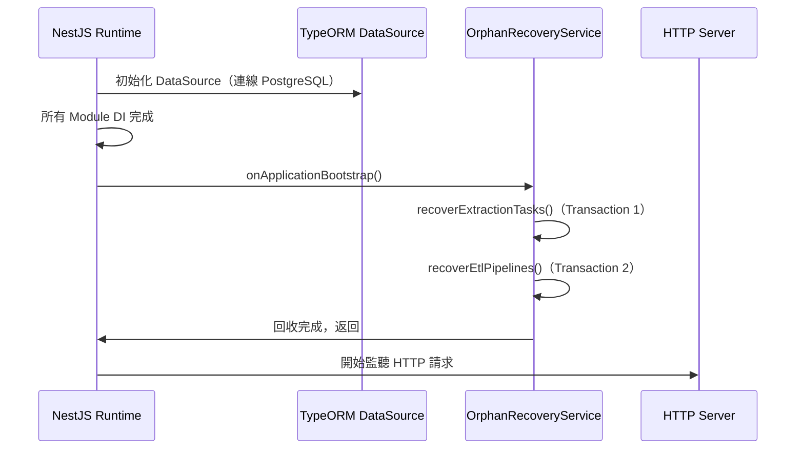
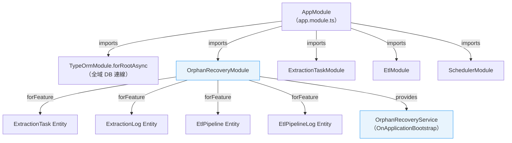
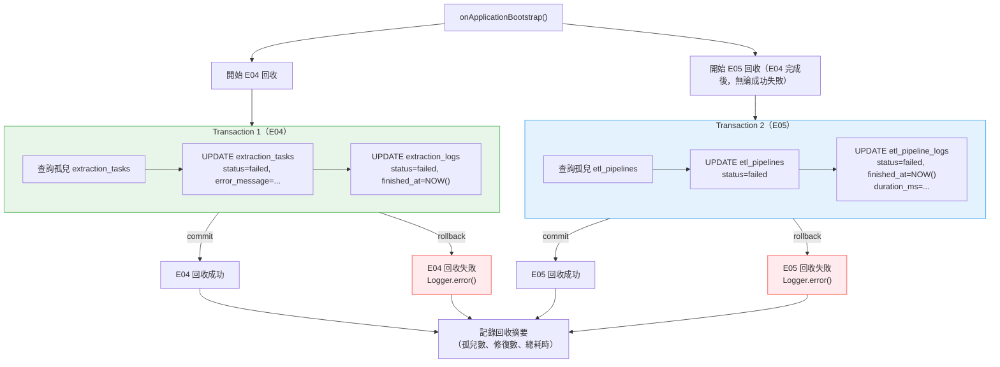
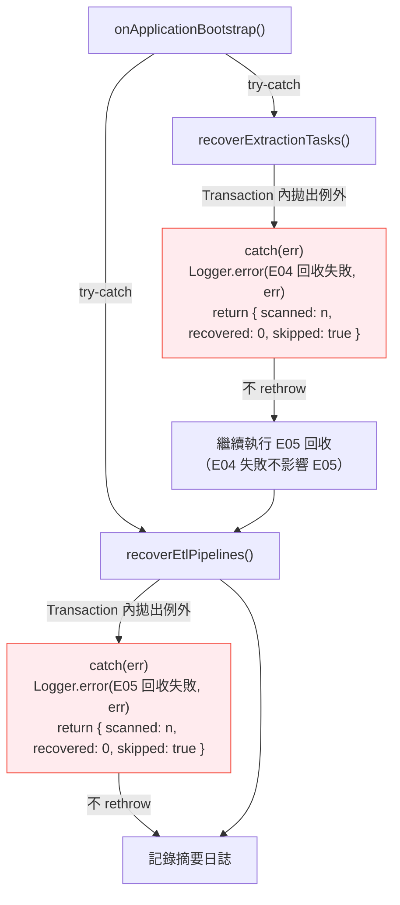

# F038 孤兒任務回收 — 架構設計規格

## Agent Loading Guide

| Agent 角色 | 建議閱讀章節 |
|-----------|------------|
| TDD Developer | 2. 模組設計、3. 類別結構與方法簽名、4. SQL/QueryBuilder 策略、5. Transaction 設計 |
| Test Designer | 3. 類別結構與方法簽名、5. Transaction 設計、6. 錯誤處理策略、8. 測試策略建議 |
| DevOps / CI/CD | 2. 模組設計（Module 註冊順序）、7. 與現有模組整合 |
| Product Analyst | 1. 架構概覽、6. 錯誤處理策略、9. 風險與約束 |

## 目錄

1. 架構概覽
2. 模組設計
3. 類別結構與方法簽名
4. SQL / QueryBuilder 策略
5. Transaction 設計
6. 錯誤處理策略
7. 與現有模組的整合
8. 測試策略建議
9. 風險與約束

---

## 1. 架構概覽

### 1.1 設計決策摘要

F038 採用 **獨立 NestJS Module（`OrphanRecoveryModule`）** 的設計方式，在應用程式啟動的 `OnApplicationBootstrap` 生命週期鉤子中執行孤兒任務回收邏輯。

核心設計原則：

- **啟動即完成，不佔用運行期資源**：回收邏輯僅在 Bootstrap 階段執行一次，完成後 Service 不再被呼叫，無定時器、無事件監聽器。
- **雙獨立 Transaction**：E04（擷取任務）與 E05（ETL Pipeline）的回收在各自獨立的 Transaction 中執行，互不阻斷。
- **不修改任何現有 Service / Entity**：完全以新建 Module 的方式加入，對現有程式碼零侵入。
- **失敗容忍**：單組回收失敗僅記錄 `Logger.error()`，不拋出例外，不中止應用程式啟動。

### 1.2 為何選擇獨立 Module 而非注入現有 Module

| 考量 | 選擇獨立 Module 的理由 |
|-----|---------------------|
| 職責分離 | 回收邏輯是啟動時的系統行為，與 `ExtractionTaskModule`（CRUD + 執行）和 `EtlModule`（Pipeline 管理）的業務職責無關 |
| 跨模組依賴 | 需要同時注入 E04 和 E05 的 Repository；若放入任一現有 Module，另一方需要被 import，產生不必要的模組耦合 |
| 可測試性 | 獨立 Module 可單獨做整合測試，不需載入完整的業務模組 |
| 未來擴展性 | 若未來需要加入其他啟動時修復邏輯（如資料一致性檢查），可集中於此 Module |

### 1.3 為何選擇 `OnApplicationBootstrap` 而非 `OnModuleInit`

| 鉤子 | 執行時機 | 選擇理由 |
|-----|---------|---------|
| `OnModuleInit` | 單一模組初始化完成後立即觸發，此時其他模組的 DI 可能尚未就緒 | 不選用：TypeORM Repository 注入尚未確認完全就緒 |
| `OnApplicationBootstrap` | **所有模組** DI 完成後、HTTP Server 開始接受請求前觸發 | **選用**：確保資料庫連線與所有 Repository 均已就緒，且 HTTP 請求在回收完成前不被處理（AC-9） |



---

## 2. 模組設計

### 2.1 目錄結構

```
apps/api/src/modules/
└── orphan-recovery/
    ├── orphan-recovery.module.ts      # NestJS Module 定義
    └── orphan-recovery.service.ts     # 回收邏輯 Service（含 OnApplicationBootstrap）
```

### 2.2 Module 定義

`OrphanRecoveryModule` 需要從 TypeORM 注入四個 Repository，這些 Entity 已在 `AppModule` 的 `TypeOrmModule.forRootAsync` 中全域註冊，因此只需在本 Module 中使用 `TypeOrmModule.forFeature()` 宣告所需 Repository。



**`orphan-recovery.module.ts` 概念定義：**

```typescript
@Module({
  imports: [
    TypeOrmModule.forFeature([
      ExtractionTask,
      ExtractionLog,
      EtlPipeline,
      EtlPipelineLog,
    ]),
  ],
  providers: [OrphanRecoveryService],
})
export class OrphanRecoveryModule {}
```

### 2.3 AppModule 中的 Module 註冊順序

`OrphanRecoveryModule` 應在 `ExtractionTaskModule` 和 `EtlModule` **之後**、`SchedulerModule` **之前**加入 `AppModule.imports` 陣列。

**理由**：NestJS `OnApplicationBootstrap` 按照模組 import 順序依序觸發。確保孤兒回收在排程引擎啟動前完成，避免排程引擎在第一次掃描時讀到仍處於 `running` 狀態的孤兒任務。

```
imports: [
  // ... 基礎設施模組（ConfigModule、TypeOrmModule、ThrottlerModule）
  AuthModule,
  AccountsModule,
  DatasourceModule,
  ExtractionTaskModule,   // E04
  EtlModule,              // E05
  OrphanRecoveryModule,   // F038：在 E04/E05 之後，Scheduler 之前
  SchedulerModule,        // 排程引擎（F023）
]
```

---

## 3. 類別結構與方法簽名

### 3.1 `OrphanRecoveryService` 完整類別結構

```typescript
@Injectable()
export class OrphanRecoveryService implements OnApplicationBootstrap {
  private readonly logger = new Logger(OrphanRecoveryService.name);

  constructor(
    @InjectRepository(ExtractionTask)
    private readonly taskRepository: Repository<ExtractionTask>,
    @InjectRepository(ExtractionLog)
    private readonly logRepository: Repository<ExtractionLog>,
    @InjectRepository(EtlPipeline)
    private readonly pipelineRepository: Repository<EtlPipeline>,
    @InjectRepository(EtlPipelineLog)
    private readonly pipelineLogRepository: Repository<EtlPipelineLog>,
    private readonly dataSource: DataSource,
  ) {}

  // ── 生命週期鉤子（入口點）─────────────────────────────────
  async onApplicationBootstrap(): Promise<void>

  // ── E04 回收（私有）──────────────────────────────────────
  private async recoverExtractionTasks(recoveryTime: Date): Promise<RecoveryResult>

  // ── E05 回收（私有）──────────────────────────────────────
  private async recoverEtlPipelines(recoveryTime: Date): Promise<RecoveryResult>
}
```

### 3.2 輔助型別定義

```typescript
interface RecoveryResult {
  scanned: number;   // 掃描到的孤兒數量
  recovered: number; // 成功修復的數量（通常等於 scanned，Transaction 全成功或全失敗）
  skipped: boolean;  // true = 因 Transaction 失敗而跳過
}
```

### 3.3 各方法職責說明

#### `onApplicationBootstrap()`

- 記錄回收開始的 `Logger.log()`
- 呼叫 `recoverExtractionTasks(recoveryTime)`，捕獲例外
- 呼叫 `recoverEtlPipelines(recoveryTime)`，捕獲例外
- 計算總耗時，記錄回收摘要至 `Logger.log()`（AC-8）
- **不拋出任何例外**（AC-10）

#### `recoverExtractionTasks(recoveryTime: Date): Promise<RecoveryResult>`

1. 查詢孤兒擷取任務（`status = 'running' AND deleted_at IS NULL`）
2. 若無孤兒，記錄日誌並回傳 `{ scanned: 0, recovered: 0, skipped: false }`
3. 提取孤兒任務 ID 陣列
4. 在單一 Transaction 中：
   - 批次更新 `extraction_tasks`
   - 批次更新對應的 `extraction_logs`
5. 回傳 `RecoveryResult`

#### `recoverEtlPipelines(recoveryTime: Date): Promise<RecoveryResult>`

1. 查詢孤兒 ETL Pipeline（`status = 'running' AND deleted_at IS NULL`）
2. 若無孤兒，記錄日誌並回傳 `{ scanned: 0, recovered: 0, skipped: false }`
3. 提取孤兒 Pipeline ID 陣列
4. 在單一 Transaction 中：
   - 批次更新 `etl_pipelines`（僅 `status`，無 `error_message` 欄位）
   - 批次更新對應的 `etl_pipeline_logs`
5. 回傳 `RecoveryResult`

---

## 4. SQL / QueryBuilder 策略

### 4.1 設計選擇：使用 TypeORM QueryBuilder（`createQueryBuilder`）

**決策**：使用 TypeORM `createQueryBuilder` 的 `.update()` 語法執行批次更新，而非逐筆 `repository.save()`。

**理由**：

| 方式 | 優點 | 缺點 | 結論 |
|-----|------|------|------|
| 逐筆 `repository.save()` | 程式碼直觀 | N 筆孤兒 = N 次 DB roundtrip；啟動時效能差 | 不採用 |
| Raw SQL（`query()`） | 最高效能 | 無型別安全；與專案慣例不一致 | 不採用 |
| QueryBuilder `.update()` | 單次 SQL；有型別輔助；與專案現有 QueryBuilder 慣例一致 | 略複雜 | **採用** |

### 4.2 E04 回收的 QueryBuilder 策略

#### 步驟 1：查詢孤兒擷取任務

```typescript
// 目標：取得所有 status='running' 且未軟刪除的擷取任務 ID 與數量
const orphanTasks = await this.taskRepository
  .createQueryBuilder('task')
  .select(['task.id'])
  .where('task.status = :status', { status: 'running' })
  .andWhere('task.deleted_at IS NULL')
  .getMany();

// orphanTaskIds: string[]
const orphanTaskIds = orphanTasks.map(t => t.id);
```

#### 步驟 2：批次更新 `extraction_tasks`（在 Transaction 內）

```typescript
// SQL 等效：
// UPDATE extraction_tasks
// SET status = 'failed', error_message = '系統重啟，任務執行中斷，請重新觸發執行', updated_at = NOW()
// WHERE id IN (...orphanTaskIds)

await manager
  .createQueryBuilder()
  .update(ExtractionTask)
  .set({
    status: 'failed',
    error_message: '系統重啟，任務執行中斷，請重新觸發執行',
  })
  .whereInIds(orphanTaskIds)
  .execute();
```

**注意**：TypeORM 的 `.whereInIds()` 接受 UUID 陣列，會自動產生 `WHERE id IN (...)` 子句。`UpdateDateColumn`（`updated_at`）在 `.update().set()` 操作時不會自動更新，需要明確在 `.set()` 中加入 `updated_at: () => 'NOW()'`，或改用 `repository.save()` 逐筆更新（但後者效能差）。

**建議實作**：在 `.set()` 中明確指定：

```typescript
.set({
  status: 'failed',
  error_message: '系統重啟，任務執行中斷，請重新觸發執行',
  updated_at: () => 'NOW()',
})
```

#### 步驟 3：批次更新 `extraction_logs`（在同一 Transaction 內）

```typescript
// SQL 等效：
// UPDATE extraction_logs
// SET status = 'failed',
//     finished_at = NOW(),
//     error_message = '系統重啟，執行進程被中斷'
// WHERE task_id IN (...orphanTaskIds)
//   AND status = 'running'
//   AND finished_at IS NULL

await manager
  .createQueryBuilder()
  .update(ExtractionLog)
  .set({
    status: 'failed',
    finished_at: () => 'NOW()',
    error_message: '系統重啟，執行進程被中斷',
  })
  .where('task_id IN (:...taskIds)', { taskIds: orphanTaskIds })
  .andWhere('status = :status', { status: 'running' })
  .andWhere('finished_at IS NULL')
  .execute();
```

**注意**：`duration_ms` 欄位在 `ExtractionLog` 中未在 AC-2 要求計算（不同於 ETL Pipeline Log），AC-2 規格僅要求更新 `status`、`finished_at`、`error_message`，故不計算 `duration_ms`。

### 4.3 E05 回收的 QueryBuilder 策略

#### 步驟 1：查詢孤兒 ETL Pipeline

```typescript
const orphanPipelines = await this.pipelineRepository
  .createQueryBuilder('p')
  .select(['p.id'])
  .where('p.status = :status', { status: 'running' })
  .andWhere('p.deleted_at IS NULL')
  .getMany();

const orphanPipelineIds = orphanPipelines.map(p => p.id);
```

#### 步驟 2：批次更新 `etl_pipelines`（在 Transaction 內）

```typescript
// SQL 等效：
// UPDATE etl_pipelines
// SET status = 'failed', updated_at = NOW()
// WHERE id IN (...orphanPipelineIds)
//
// 注意：etl_pipelines 無 error_message 欄位（BR-10）

await manager
  .createQueryBuilder()
  .update(EtlPipeline)
  .set({
    status: 'failed',
    updated_at: () => 'NOW()',
  })
  .whereInIds(orphanPipelineIds)
  .execute();
```

#### 步驟 3：批次更新 `etl_pipeline_logs`（在同一 Transaction 內）

```typescript
// SQL 等效：
// UPDATE etl_pipeline_logs
// SET status = 'failed',
//     finished_at = NOW(),
//     duration_ms = EXTRACT(EPOCH FROM (NOW() - started_at)) * 1000,
//     error_message = '系統重啟，Pipeline 執行進程被中斷'
// WHERE pipeline_id IN (...orphanPipelineIds)
//   AND status = 'running'
//   AND finished_at IS NULL

await manager
  .createQueryBuilder()
  .update(EtlPipelineLog)
  .set({
    status: 'failed',
    finished_at: () => 'NOW()',
    duration_ms: () => "EXTRACT(EPOCH FROM (NOW() - started_at)) * 1000",
    error_message: '系統重啟，Pipeline 執行進程被中斷',
  })
  .where('pipeline_id IN (:...pipelineIds)', { pipelineIds: orphanPipelineIds })
  .andWhere('status = :status', { status: 'running' })
  .andWhere('finished_at IS NULL')
  .execute();
```

**`duration_ms` 計算說明**：
- 使用資料庫端計算（`EXTRACT(EPOCH FROM ...)`) 而非 JavaScript 端計算，確保時間精準性與 NULL 安全性。
- `EXTRACT(EPOCH FROM (NOW() - started_at)) * 1000` 在 PostgreSQL 中計算兩個 timestamp 的毫秒差，結果型別為 `double precision`；TypeORM 的 `duration_ms INT` 欄位會自動做數值轉換（truncate）。
- 測試環境使用 SQLite（`better-sqlite3`）時，此語法不相容。測試策略章節（第 8 節）將說明如何處理。

---

## 5. Transaction 設計

### 5.1 Transaction 邊界圖



### 5.2 Transaction 實作方式

使用 TypeORM 的 `DataSource.transaction()` 方法，通過注入 `DataSource` 取得 `EntityManager`，在 callback 中執行所有 QueryBuilder 操作。

```typescript
// E04 Transaction 範例（概念）
await this.dataSource.transaction(async (manager) => {
  // 步驟 2：更新 extraction_tasks
  await manager.createQueryBuilder()
    .update(ExtractionTask)
    .set({ ... })
    .whereInIds(orphanTaskIds)
    .execute();

  // 步驟 3：更新 extraction_logs
  await manager.createQueryBuilder()
    .update(ExtractionLog)
    .set({ ... })
    .where('task_id IN (:...taskIds)', { taskIds: orphanTaskIds })
    .andWhere(...)
    .execute();
});
// 若任何步驟拋出例外，TypeORM 自動 rollback
```

**注意**：`DataSource` 需要在 `OrphanRecoveryService` 的建構子中透過 NestJS DI 注入，`DataSource` 由 `TypeOrmModule.forRootAsync` 全域提供，無需額外 import。

### 5.3 查詢在 Transaction 外執行的設計決策

步驟 1（查詢孤兒任務 ID）**刻意在 Transaction 外執行**，因為：

1. 查詢本身是 READ 操作，不需要在寫入 Transaction 中
2. 如果查詢結果為空（無孤兒），可以提早返回，完全避免開啟 Transaction 的 overhead
3. 邊界情況：如果查詢後、Transaction 執行前，另一個孤兒任務恰好從 `running` 變更為其他狀態（在正常 MVP 單進程架構下不可能發生，因啟動時不存在其他執行進程）

---

## 6. 錯誤處理策略

### 6.1 錯誤分層



### 6.2 Log 訊息規範

| 情境 | Log Level | 訊息格式範例 |
|-----|-----------|------------|
| 回收開始 | `log` | `[OrphanRecoveryService] 孤兒任務回收開始...` |
| E04 無孤兒 | `log` | `[OrphanRecoveryService] 擷取任務：無需修復（0 筆孤兒）` |
| E04 回收成功 | `log` | `[OrphanRecoveryService] 擷取任務回收完成：修復 3 筆孤兒任務及其日誌` |
| E05 無孤兒 | `log` | `[OrphanRecoveryService] ETL Pipeline：無需修復（0 筆孤兒）` |
| E05 回收成功 | `log` | `[OrphanRecoveryService] ETL Pipeline 回收完成：修復 1 筆孤兒 Pipeline 及其日誌` |
| E04 回收失敗 | `error` | `[OrphanRecoveryService] 擷取任務回收失敗，孤兒任務未修復。原因：<error message>` |
| E05 回收失敗 | `error` | `[OrphanRecoveryService] ETL Pipeline 回收失敗，孤兒 Pipeline 未修復。原因：<error message>` |
| 回收摘要 | `log` | `[OrphanRecoveryService] 孤兒任務回收完成。擷取任務：修復 3/3；ETL Pipeline：修復 1/1；總耗時：42ms` |

### 6.3 關鍵設計約束

- `onApplicationBootstrap()` 中的最外層 try-catch **絕對不能 rethrow**，否則 NestJS 會拒絕啟動。
- 每個私有方法（`recoverExtractionTasks`、`recoverEtlPipelines`）內部的 catch 也不 rethrow，直接回傳帶有 `skipped: true` 的 `RecoveryResult`。
- `Logger.error()` 接受第二個參數為 error stack trace，建議傳入 `err.stack ?? err`。

---

## 7. 與現有模組的整合

### 7.1 不修改任何現有程式碼

F038 採用完全非侵入式設計：

| 現有檔案 | 是否修改 | 說明 |
|---------|---------|------|
| `extraction-task.service.ts` | 否 | 無需修改 |
| `extraction-execution.service.ts` | 否 | 無需修改 |
| `etl-pipeline-execution.service.ts` | 否 | 無需修改 |
| `extraction-task.module.ts` | 否 | 無需匯出 Repository |
| `etl.module.ts` | 否 | 無需匯出 Repository |
| `app.module.ts` | **是** | 僅加入 `OrphanRecoveryModule` 到 imports 陣列 |
| 所有 Entity 檔案 | 否 | 無新欄位 |

**`app.module.ts` 的唯一修改**：

```typescript
// 新增 import
import { OrphanRecoveryModule } from './modules/orphan-recovery/orphan-recovery.module';

// 在 imports 陣列中加入（位置：EtlModule 後、SchedulerModule 前）
imports: [
  // ...現有模組不變...
  ExtractionTaskModule,
  EtlModule,
  OrphanRecoveryModule,  // 新增這一行
  SchedulerModule,
]
```

### 7.2 與 F023 排程引擎的相容性

回收後，孤兒任務的 `status` 從 `'running'` 變為 `'failed'`。

F023 排程引擎（`SchedulerModule`）在掃描待執行任務時，篩選條件為 `status != 'running'`（或等效邏輯）。因此回收後的 `'failed'` 狀態任務：
- 若 `enabled = true`：排程引擎將按照 cron 設定在下一個時間點正常觸發（**符合預期**）
- 若 `enabled = false`：排程引擎不觸發（**符合預期**）

回收不影響排程引擎的正常運作。

### 7.3 Repository 共用無衝突分析

`OrphanRecoveryService` 直接注入四個 Entity 的 Repository，與 `ExtractionTaskModule` / `EtlModule` 中的 Service 使用相同的 TypeORM Repository 實體。

潛在衝突分析：

- **並發衝突**：`OnApplicationBootstrap` 在 HTTP Server 啟動前執行，此時無 HTTP 請求可觸發業務 Service，故不存在並發衝突。
- **TypeORM Repository 共用**：NestJS + TypeORM 的 Repository 是 stateless 的，多個 Service 共用同一 Repository 實例是標準做法，無衝突。

---

## 8. 測試策略建議

### 8.1 測試類型建議

| 測試類型 | 目的 | 建議框架 |
|---------|------|---------|
| 單元測試 | 測試查詢邏輯、日誌訊息、錯誤捕獲行為 | Jest + Mock Repository |
| 整合測試 | 測試完整回收流程（資料庫端到端） | Jest + SQLite in-memory（`better-sqlite3`） |

### 8.2 單元測試建議場景

| 測試案例 | 對應 AC |
|---------|--------|
| 無孤兒任務時靜默通過（log 正確，無 DB 更新） | AC-7 |
| 有 N 筆孤兒擷取任務時，mock update 被呼叫 N 次（或 1 次批次呼叫） | AC-1 |
| E04 Transaction 失敗時，Logger.error() 被呼叫，不拋出例外，繼續執行 E05 | AC-10 |
| E05 Transaction 失敗時，Logger.error() 被呼叫，不拋出例外，完成啟動 | AC-10 |
| 回收摘要 log 包含孤兒數量與耗時 | AC-8 |

### 8.3 整合測試建議場景

| 測試案例 | 對應 AC |
|---------|--------|
| 預置 2 筆 `status='running'` 的擷取任務 + 3 筆對應 `running` log，執行 `onApplicationBootstrap()` 後驗證 DB 狀態 | AC-1, AC-2 |
| 回收後擷取任務 `status='failed'`、`error_message` 符合規格 | AC-1 |
| 回收後擷取日誌 `status='failed'`、`finished_at` 非 null、`error_message` 符合規格 | AC-2 |
| 預置 1 筆孤兒 Pipeline + 1 筆對應 `running` log，回收後驗證 Pipeline `status='failed'`、log `duration_ms` 非 null | AC-4, AC-5 |
| `etl_pipelines` 無 `error_message` 欄位（不應拋出例外） | AC-4, BR-10 |
| 已軟刪除（`deleted_at IS NOT NULL`）的 `running` 任務不被回收 | BR-8 |
| 快速重啟：第一次回收後再次執行 `onApplicationBootstrap()`，無任何更新、無例外 | AC-7, BR-1 |
| 孤兒任務無對應日誌時（`extraction_logs` 零筆），不報錯、任務仍更新為 `failed` | 邊界情況 |

### 8.4 SQLite 測試環境的 `duration_ms` 相容性

測試環境使用 SQLite（`better-sqlite3`），但 `EXTRACT(EPOCH FROM ...)` 是 PostgreSQL 專屬語法。

**建議**：整合測試驗證 `duration_ms` 時，只驗證值為 **非 null 的 number**，不驗證精確值。若測試環境需要精確計算，可改用 SQLite 相容的 `CAST((julianday('now') - julianday(started_at)) * 86400000 AS INTEGER)` 語法，但這會使程式碼複雜化。

**更簡潔的解決方案**：將 `duration_ms` 計算邏輯提取為私有方法，允許子類別或測試替換計算 SQL expression，或在測試中僅驗證非 null 即可。

---

## 9. 風險與約束

### 9.1 已知技術約束

| 約束 | 說明 | 因應方式 |
|-----|------|---------|
| 單進程假設 | F038 的正確性依賴單一 Node.js 進程（BR-2：啟動時不存在真正執行中的背景任務） | MVP 架構為單進程，此約束成立。若未來多副本部署，需改為分散式鎖或 `started_at` 超時判斷（已記錄於 F038 spec 第 11 節） |
| `UpdateDateColumn` 不自動更新 | TypeORM QueryBuilder `.update().set()` 不觸發 `@UpdateDateColumn()` 的自動更新 | 在 `.set()` 中明確加入 `updated_at: () => 'NOW()'` |
| SQLite `EXTRACT(EPOCH FROM ...)` 不相容 | 測試環境使用 SQLite，PostgreSQL 專屬語法無法執行 | 整合測試中 `duration_ms` 只驗證非 null，或抽象化 duration 計算 |
| `etl_pipeline_logs.duration_ms` 型別精度 | PostgreSQL 計算結果為 `double precision`，欄位定義為 `INT`，可能有截斷 | 截斷行為在此場景（孤兒回收，非精確計時）為可接受的近似值 |

### 9.2 架構風險

| 風險 | 影響 | 緩解策略 |
|-----|------|---------|
| `OnApplicationBootstrap` 執行時間超過 5 秒（NFR-002.12） | 延遲 HTTP Server 啟動，影響部署時間 | 孤兒數量在正常情況下為個位數，批次更新為單次 SQL，不應超過 100ms。若資料庫連線異常，超時後應落入錯誤處理，不阻塞啟動 |
| 回收期間資料庫不可用 | 孤兒未修復，下次重啟才能回收 | AC-10 已明確定義此行為為可接受的降級：記錄 error log，繼續啟動 |

### 9.3 未來擴展注意事項

若未來需要加入其他啟動時修復邏輯（例如 ETL Pipeline Version 狀態一致性修復），建議直接在 `OrphanRecoveryModule` 中擴展，而非分散於各業務模組，保持啟動修復邏輯的集中管理。

---

*本文件由 System Architect Agent 於 2026-03-25 產出，基於 F038 spec v1.1 設計。*
