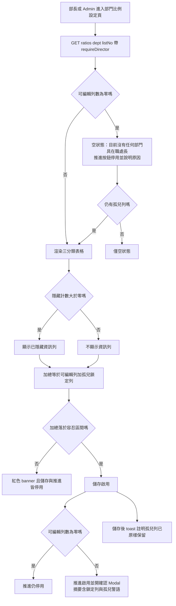
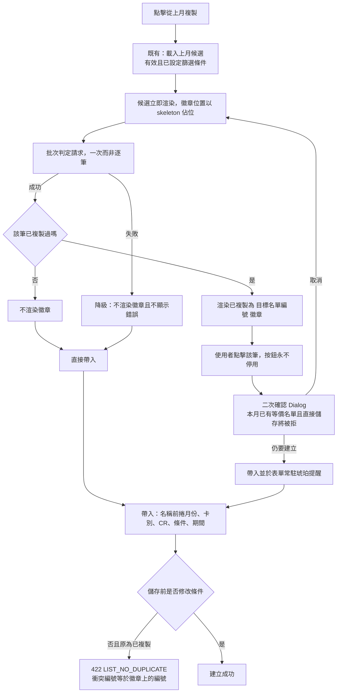

# CDMP MVP — UI/UX 原型設計執行計畫

## Context

CDMP（企業客戶資料治理平台）MVP 已完成產品需求與系統架構規格。本計畫根據 `specs/features/F001-F036` 中的 UI/UX 需求，產出完整的互動式 HTML 原型，作為前端開發的設計基準。E01-E03 涵蓋認證、帳號管理與資料來源（F001-F016），E04 涵蓋資料擷取管理（F017-F026），E05 涵蓋 ETL Pipeline 管理（F027-F036）。

---

## 設計決策

| 決策 | 選擇 | 理由 |
|------|------|------|
| 色彩模式 | Light mode only | 企業後台優先可讀性；規格無 dark mode 需求 |
| 元件風格 | shadcn/ui 風格 | 與 React + Tailwind 技術棧最佳搭配 |
| 圖示 | Lucide Icons (CDN) | shadcn/ui 原生圖示集 |
| 語言 | 繁體中文 | 規格書要求 |
| 視窗 | 主要 1440px 桌面，基本支援 1024px | 企業內部使用 |
| 角色體系 | 2 種角色（Admin / User） | 系統僅兩種角色：管理者（Admin）與使用者（User）。角色為系統 Seed Data 不可自訂。角色下拉選單為簡單 select。角色 Badge 色彩：管理者=藍、使用者=灰。變更角色含二步驟確認對話框（目前角色→新角色） |
| 帳號表單 | Modal Dialog | 帳號欄位少（2-4 個），Modal 操作流暢 |
| 資料來源表單 | 獨立頁面 | 欄位多（8 個），獨立頁面空間充裕 |
| 擷取任務表單 | 獨立頁面（13, 14） | 6-7 個欄位含條件邏輯（增量模式）+ cron 預覽，複雜度近似資料來源表單 |
| 擷取儀表板+清單 | 單頁雙頁籤（12），儀表板為預設 | 仿照 08-datasource-list.html 模式，F024 規格明確要求 |
| 日誌檢視 | 右側 Drawer（480px） | 優於 Modal：保留任務清單上下文，適合表格式日誌資料 |
| Sidebar 圖示 | `arrow-down-to-line` | 視覺表達「擷取/下載」，與 `users`、`database` 區隔 |
| 擷取狀態 Badge 色彩 | running=#3B82F6, scheduled=#6B7280, completed=#22C55E, failed=#EF4444, disabled=#9CA3AF | 依 F018 規格 |
| 擷取任務分頁 | 10 筆/頁 | 依 F018/F022 規格（不同於帳號的 20 筆/頁） |
| 欄位更名 | `sourceTable`（來源資料表） | F017/F019 原 `targetTable`（目標資料表）更名，反映實際語意：指定外部資料庫中要讀取的表 |
| 來源資料表選擇 | 連鎖下拉（Datasource → Schema → Table） | F017 v1.2 / F019 v1.2：從手動文字輸入改為動態載入下拉選單，避免人為輸入錯誤；連線失敗時停用下拉、不提供手動 fallback |
| 來源資料表顯示格式 | `schema.table`（如 `dbo.customers`） | 統一在清單、預覽頁使用此格式顯示，語意更明確 |
| 變更來源表警告 | 紅色 Destructive Modal | F019：已執行過的任務變更 schema/table 時可能導致 raw data 表重建，需明確警告使用者 |
| Raw data 預覽分頁 | 預設 50 筆/頁，可切 100/200 | F026 規格；大量資料不提供全量下載（Phase 2） |
| 系統欄位區分 | 灰色背景列 `cdmp-sys-col` | `_cdmp_id`、`_cdmp_extracted_at` 以淺灰背景與一般欄位視覺區分 |
| Pipeline 管理頁面策略 | 單頁雙頁籤（17），儀表板為預設 | 沿用 08/12 的雙頁籤模式；F035 儀表板已納入範圍，儀表板為預設頁籤（與 E03/E04 一致） |
| Pipeline 監控儀表板 | 整合於 17 的儀表板頁籤（預設） | F035 規格：5 張統計小卡 + 執行趨勢雙色長條圖（7/14/30 天切換）+ 執行中 Pipeline 進度條 + 今日失敗清單 + 效能最差 Top 5，佈局與 E04 擷取儀表板一致 |
| 目標表管理 | 整合於 18 的 Load 節點屬性面板 + 獨立頁面（22） | F036/US-049 目標表選擇與欄位對應整合於 Pipeline 編輯器 Load 節點屬性面板；MVP 僅 1 個目標表 `customer_core`（約 45 欄位，8 個分類 A~H），選擇器設計為可擴展下拉。欄位對應面板以分類折疊/展開呈現，每個分類顯示已對應數/總數統計。3 個 ETL 追蹤欄位（data_source、_etl_loaded_at、_etl_pipeline_id）標示為「自動填充」灰色鎖定。目標表 Schema 瀏覽使用獨立頁面（22），展示 customer_core 完整 8 分類欄位定義，Phase 2/3 目標表以灰色佔位卡片預示 |
| Pipeline 建立表單 | Modal Dialog | 欄位少（名稱+描述+排程，共 3 個），F028 明確要求「對話框或表單」，Modal 操作流暢，建立後直接導向編輯器 |
| Pipeline 視覺化編輯器 | 全頁三欄式佈局（18） | F029 核心功能，左側工具箱+中央畫布+右側屬性面板，需最大化畫布空間。原型以靜態 HTML 模擬 React Flow 畫布佈局 |
| Pipeline 日誌檢視 | 獨立頁面 + 右側 Drawer（19, 17 內嵌） | 日誌列表為獨立頁面（從列表行操作進入），日誌詳情使用右側 Drawer 展示節點執行記錄 |
| Pipeline 版本管理 | 獨立頁面（20） | F033 包含版本清單、Diff 比對、回滾/發布操作，內容較多適合獨立頁面 |
| Pipeline 版本 Diff | 左右對照面板 | F033 規格明確要求左右對照方式，新增節點綠色、刪除紅色、修改黃色 |
| Pipeline 狀態 Badge 色彩 | draft=#6B7280, active=#22C55E, running=#3B82F6, failed=#EF4444, disabled=#9CA3AF | 依 F027 規格定義，與擷取任務狀態色彩體系一致 |
| Pipeline 版本狀態 Badge 色彩 | draft=#6B7280, testing=#F59E0B, published=#22C55E | 依 F033 規格定義 |
| Pipeline 編輯器節點色彩 | Extract=#3B82F6(藍), Transform=#F59E0B(橘), Load=#22C55E(綠) | 依 F029 規格定義，三種類型以色彩區分 |
| Sidebar 新增項目 | ETL Pipeline（`workflow` 圖示） | 新增第四個 Sidebar 項目，`workflow` 圖示表達「流程/管線」語意 |
| Sidebar 新增項目 | Customer 360（`contact` 圖示） | 新增第五個 Sidebar 項目，`contact` 圖示表達「客戶資料」語意 |
| Customer 360 清單 | 統計卡片 + 搜尋篩選 + 表格分頁 | 沿用 07/08/12/17 的卡片+表格模式；4 張統計卡片（總/個人/企業/外籍），搜尋框+類型下拉+搜尋按鈕 |
| Customer 360 詳情 | Accordion 分類卡片 | 85 個欄位組織為 8 個分類 Accordion，前 3 個預設展開，適合大量欄位瀏覽 |
| 敏感資料遮罩展示 | Admin/User 角色切換器（Header 右上） | 原型以 Toggle 按鈕模擬角色切換，展示遮罩前後差異（前端直接渲染 API 已處理的遮罩值） |
| 風控旗標高亮 | 琥珀色 Badge（#F59E0B） | debt_flag/fine_flag='Y' 時顯示警告 Badge，與系統 Warning 色一致 |
| 客戶類型 Badge | 個人=藍、企業=綠、外籍=紫 | 三色區分客戶類型，與系統色彩體系一致 |
| 企業客戶 G 分類 | 「本分類不適用」灰色提示 | 個人/外籍客戶的 G.企業客戶專屬分類顯示不適用提示，而非空白欄位 |
| ETL 新鮮度警告 | 琥珀色 Banner（>7 天觸發） | 條件式顯示，提醒使用者資料可能非最新 |
| 個人/企業客戶切換 | Demo 切換器（Header 右上） | 原型提供個人/企業客戶範例資料切換，展示 G 分類適應顯示 |
| Cron UI 選擇器 | 頻率選擇+時間選擇+Cron 預覽 | F028 要求 Cron UI 選擇器，複用 F017 的 cron 輸入模式（頻率下拉+時間+人類可讀說明） |
| Pipeline 執行進度 | 行內進度條 + Polling 5s | F030 要求即時進度更新，列表行內顯示進度條，與擷取任務的進度條模式一致 |

## 色彩系統

| Token | Hex | 用途 |
|-------|-----|------|
| Primary | #2563EB | 主按鈕、連結、active 狀態 |
| Danger | #EF4444 | 刪除/停用、錯誤、disconnected 狀態 |
| Success | #22C55E | 成功提示、connected 狀態 |
| Warning | #F59E0B | 警告、逾時提示 |
| Unknown | #9CA3AF | unknown 狀態 |
| Background | #F9FAFB | 頁面背景 |
| Surface | #FFFFFF | 卡片背景 |
| Border | #E5E7EB | 邊框 |

---

## 檔案結構

```
prototypes/
├── 00-design-system.html           # 設計系統：色彩、字型、元件庫
├── 01-login.html                   # 登入頁 (F001, F002)
├── 02-user-info-page.html          # User 說明頁 (F002)
├── 03-forgot-password.html         # 忘記密碼 (F009)
├── 04-forgot-password-sent.html    # 重設連結已寄出 (F009)
├── 05-reset-password.html          # 重設密碼表單 (F009)
├── 06-reset-password-success.html  # 重設成功 (F009)
├── 07-account-list.html            # 帳號清單 + 所有 Modal (F004-F008, F010)
├── 08-datasource-list.html         # 資料來源管理（頁籤：儀表板(預設) + 清單）(F012, F014, F015, F016)
├── 09-add-datasource.html          # 新增資料來源 - 獨立頁面 (F011)
├── 10-edit-datasource.html         # 編輯資料來源 - 獨立頁面 (F013)
├── 11-states-and-interactions.html # 錯誤頁面、載入狀態、通用互動
├── 12-extraction-management.html   # 擷取管理（頁籤：監控儀表板(預設) + 任務清單）(F018, F020-F022, F024, F025)
├── 13-add-extraction-task.html     # 新增擷取任務 - 獨立頁面 (F017)
├── 14-edit-extraction-task.html    # 編輯擷取任務 - 獨立頁面 (F019)
├── 15-extraction-interactions.html # 擷取互動狀態展示
├── 16-raw-data-preview.html       # 擷取資料預覽 - 獨立頁面 (F026)
├── 17-pipeline-management.html    # Pipeline 管理（頁籤：監控儀表板(預設) + Pipeline 清單）(F027, F028, F030, F031, F034, F035)
├── 18-pipeline-editor.html        # Pipeline 視覺化編輯器 - 三欄式佈局 (F029)
├── 19-pipeline-logs.html          # Pipeline 日誌列表 + 日誌詳情 Drawer (F032)
├── 20-pipeline-versions.html      # Pipeline 版本管理 - Diff/回滾/發布 (F033)
├── 21-pipeline-interactions.html  # Pipeline 互動狀態展示（進度條/執行中/各 Transform 節點屬性面板）
├── 22-target-tables.html          # 目標表 Schema 瀏覽 - customer_core 約45欄位8分類 + Phase 2/3 佔位 (F036/US-049)
├── 25-customer-360-list.html      # Customer 360 客戶清單 — 統計卡片 + 搜尋篩選 + 表格分頁 + 遮罩切換 (F046/US-060)
└── 26-customer-360-detail.html    # Customer 360 客戶詳情 — 8 分類 Accordion + 風控旗標 + 新鮮度警告 + 遮罩切換 (F047/US-061)
```

共 **25 個 HTML 檔案**，每個檔案獨立可開啟（Tailwind CDN + Lucide CDN）。

---

## 執行順序與內容

### Phase 0：設計系統基礎
**檔案：** `00-design-system.html`

內容：
- 色彩色票展示
- 字型層級（h1-h3、body、label）
- 按鈕變體（Primary / Secondary / Danger / Ghost / Disabled / Loading）
- 表單元件（Text / Email / Password+可見切換 / Select / Checkbox / Textarea）
- 表單驗證狀態（紅邊框 + 錯誤文字）
- 表格樣式（header、hover row、pagination bar）
- 卡片樣式（白底 + rounded-lg + shadow-sm）
- Badge（狀態：connected/disconnected/unknown、角色：管理者=藍、使用者=灰）
- Modal/Dialog 模板（標題 + 內容 + 動作按鈕）
- Toast 通知（success/error/warning/info，右下角固定）
- Sidebar 導航 + Header 佈局
- Empty State 模板

### Phase 1：認證頁面 (F001-F003, F009)
**檔案：** `01-login.html` ~ `06-reset-password-success.html`

| 檔案 | 涵蓋 Feature | 關鍵元素 |
|------|-------------|---------|
| `01-login.html` | F001, F002 | Email/密碼輸入、記住我、登入按鈕（含 loading）、錯誤提示、忘記密碼連結 |
| `02-user-info-page.html` | F002 | Header+登出、「目前尚無可用功能」訊息 |
| `03-forgot-password.html` | F009 | Email 輸入、發送重設連結按鈕、返回登入 |
| `04-forgot-password-sent.html` | F009 | 「若此 Email 存在，重設連結已寄出」 |
| `05-reset-password.html` | F009 | 新密碼+確認密碼、規則提示、過期連結狀態 |
| `06-reset-password-success.html` | F009 | 成功訊息、導回登入 |

### Phase 2：帳號管理 (F004-F008, F010)
**檔案：** `07-account-list.html`（含所有 Modal）

帳號管理的建立/編輯均使用 **Modal Dialog**，整合於帳號清單頁面內。

| 檔案 | 涵蓋 Feature | 關鍵元素 |
|------|-------------|---------|
| `07-account-list.html` | F004, F005, F006, F003, F007, F008, F010 | Admin 完整佈局（Sidebar+Header+登出）、搜尋欄、角色篩選（Admin/User）/狀態篩選、分頁表格（角色欄顯示中文名稱+ Badge 色彩：管理者=藍、使用者=灰）、操作按鈕。內嵌 Modal：**建立帳號(F004，角色選單含 Admin/User)**、**編輯帳號(F006)**、停用確認(F007)、**角色變更(F008/US-014，二步驟：選擇新角色→確認對話框顯示「目前角色→新角色」)**、重設密碼(F010) |

### Phase 3：資料來源管理 (F011-F016)
**檔案：** `08-datasource-list.html` ~ `10-edit-datasource.html`

資料來源管理整合為**單一頁面雙頁籤**設計，儀表板（F016）與清單（F012）透過頁籤切換，**預設顯示儀表板頁籤**。新增/編輯使用**獨立頁面**（欄位較多，共 8 個）。

| 檔案 | 涵蓋 Feature | 關鍵元素 |
|------|-------------|---------|
| `08-datasource-list.html` | F012, F014, F015, **F016** | **頁籤 1 — 狀態總覽（預設）**：4 張摘要卡片（總數/已連線/已斷線/未知）+ 全部重新整理按鈕、類型分佈圓餅圖、效能趨勢折線圖（24h/7d/30d 切換）、資料來源狀態卡片格線（含「立即測試」按鈕）、告警列表。**頁籤 2 — 資料來源清單**：列表/卡片視圖切換（localStorage 記憶）、搜尋/類型/狀態篩選、狀態 Badge、刪除確認對話框(F014)、測試連線按鈕+結果 Toast(F015) |
| `09-add-datasource.html` | F011 | 獨立頁面表單：名稱/類型(選擇後自動填入 port)/主機/埠/資料庫名/帳號/密碼/描述、欄位驗證 |
| `10-edit-datasource.html` | F013 | 獨立頁面預填表單（密碼欄空白+placeholder「若不修改請留空」）、測試連線按鈕 |

### Phase 4：通用狀態與互動
**檔案：** `11-states-and-interactions.html`

內容：403 禁止存取頁、404 找不到頁面、500 伺服器錯誤頁、Session 過期提示、Loading skeleton、各種 Toast 展示。

### Phase 5：資料擷取管理 (F017-F026)
**檔案：** `12-extraction-management.html` ~ `16-raw-data-preview.html`

資料擷取管理整合為**單一頁面雙頁籤**設計，監控儀表板（F024）與任務清單（F018）透過頁籤切換，**預設顯示監控儀表板頁籤**。新增/編輯使用**獨立頁面**（欄位含條件邏輯）。日誌檢視使用**右側 Drawer**（480px）保留清單上下文。Raw data 預覽使用**獨立頁面**（F026），可從日誌 Drawer 的 completed 日誌連結進入。

| 檔案 | 涵蓋 Feature | 關鍵元素 |
|------|-------------|---------|
| `12-extraction-management.html` | F018, F020, F021, F022, F024, F025 | **頁籤 1 — 監控儀表板（預設）**：5 張摘要卡片（總任務數/執行中/今日成功/今日失敗/成功率）、執行趨勢堆疊長條圖（7d/14d/30d 切換）、執行中任務進度條、今日失敗清單（含「查看日誌」「重新執行」）、最慢任務 Top 5。**頁籤 2 — 任務清單**：搜尋/狀態/模式/資料來源篩選、任務表格（名稱/資料來源/模式/狀態 Badge/排程/上次執行/擷取筆數）、行操作（編輯/立即執行/查看日誌/啟用停用/刪除）、分頁（10 筆/頁）、空狀態。**內嵌互動**：停用確認 Dialog(F020)、刪除確認 Dialog(F025)、日誌 Drawer(F022，completed 日誌含「預覽資料」連結)、進度條動畫(F021) |
| `13-add-extraction-task.html` | F017 | 獨立頁面表單：名稱/資料來源下拉/擷取模式(全量/增量 radio)/來源資料表/排程(cron+人類可讀說明)/增量欄位(條件顯示)/增量起始值(選填)、blur 驗證、Demo 狀態切換 |
| `14-edit-extraction-task.html` | F019 | 與建立表單同結構，預填資料。執行中任務：黃色警告 banner + 所有欄位 disabled |
| `15-extraction-interactions.html` | — | 獨立展示：進度條各階段狀態、Drawer 日誌詳情（含「預覽資料」連結）、disabled 狀態、Toast 通知 |
| `16-raw-data-preview.html` | F026 | 獨立頁面：任務摘要卡片（任務名稱/來源資料表/Raw Data 表名/最後更新時間/總筆數）、資料表格（動態欄位/排序/系統欄位灰色背景區分）、分頁（50/100/200 筆切換）、空狀態、Skeleton loading、大量資料警告 banner |

### Phase 6：ETL Pipeline 管理 (F027-F036)
**檔案：** `17-pipeline-management.html` ~ `22-target-tables.html`

ETL Pipeline 管理整合為**單一頁面雙頁籤**設計（17），監控儀表板（F035）為預設頁籤，Pipeline 清單（F027）為第二頁籤（與 E03/E04 模式一致）。建立 Pipeline 使用 **Modal Dialog**（欄位少）。視覺化編輯器使用**獨立全頁面三欄式佈局**（18），Load 節點屬性面板整合 F036 目標表選擇與欄位對應。日誌使用**獨立頁面**（19）。版本管理使用**獨立頁面**（20）。目標表 Schema 瀏覽使用**獨立頁面**（22）。

#### Phase 6a：Pipeline 清單與基本操作 (17)

| 檔案 | 涵蓋 Feature | 關鍵元素 |
|------|-------------|---------|
| `17-pipeline-management.html` | F027, F028, F030, F031, F034, **F035** | **頁籤 1 — 監控儀表板（預設）**：5 張統計小卡（總 Pipeline 數/執行中/今日成功/今日失敗/成功率）、執行趨勢雙色長條圖（綠色成功#22C55E/紅色失敗#EF4444，7d/14d/30d 切換）、執行中 Pipeline 進度條列表（藍色#3B82F6，每 5 秒 Polling）、今日失敗清單（含「查看日誌」「重新執行」按鈕）、效能最差 Top 5（平均執行時間+累計執行次數）、各區塊空狀態提示。**頁籤 2 — Pipeline 清單**：5 張統計卡片（總 Pipeline 數/啟用中/執行中/草稿/今日處理筆數）、搜尋框+狀態篩選下拉、Pipeline 表格（名稱/版本/步驟數/狀態 Badge/排程(人類可讀)/最後執行時間/下次執行時間/處理筆數/建立者）、行操作（編輯/執行或測試執行/啟用或停用/刪除）、分頁（10 筆/頁）、空狀態（引導建立第一個 Pipeline）。**內嵌互動**：建立 Pipeline Modal(F028，含名稱/描述/排程 Cron UI 選擇器)、刪除確認 Dialog(F034，含名稱+影響說明)、停用即時切換(F031，無確認框)、草稿啟用 disabled + tooltip(F031)、執行中進度條(F030，行內顯示)、running 狀態行操作按鈕 disabled。**Demo 狀態切換**：儀表板正常/儀表板空狀態/清單正常/清單空狀態/執行中/建立 Modal/刪除確認 |

#### Phase 6b：Pipeline 視覺化編輯器 (18)

| 檔案 | 涵蓋 Feature | 關鍵元素 |
|------|-------------|---------|
| `18-pipeline-editor.html` | F029, **F036** | **全頁面三欄式佈局**（Sidebar 隱藏或收合，Header 保留 breadcrumb + 儲存/返回按鈕）。**左側工具箱**（200px，可收合）：三個分類（Extract/Transform/Load），Extract 含 1 種節點、Transform 含 13 種節點（合併/欄位對應/格式轉換/條件轉換/NULL 處理/型別轉換/篩選/去重/查找/字串處理/加密脫敏/聚合/衍生欄位）、Load 含 1 種節點，各節點帶圖示+名稱。**中央畫布**（React Flow 模擬）：靜態展示已放置的節點（Extract 藍色/Transform 橘色/Load 綠色）、節點間連線箭頭、縮放控制鈕（+/-/reset）。**右側屬性面板**（320px，選中節點時顯示）：根據節點類型動態切換表單 — Extract（raw data 表下拉）、Load（F036 目標表下拉選單含 Domain 分類標籤+選擇後載入欄位定義+左右兩欄欄位對應介面+ETL 追蹤欄位灰色標示「系統自動填充」+必填欄位紅色星號）、13 種 Transform 各有對應設定表單。**頂部工具列**：breadcrumb（Pipeline 清單 > Pipeline 名稱 > 編輯器）、「儲存」按鈕、「測試執行」按鈕、「返回」按鈕。**Demo 狀態切換**：空畫布/已有節點與連線/選中 Extract 節點/選中 Transform 節點（展示不同 Transform 類型的屬性面板）/選中 Load 節點。**連線規則視覺提示**：合法連線灰色箭頭、非法連線紅色閃爍 |

#### Phase 6c：Pipeline 日誌 (19)

| 檔案 | 涵蓋 Feature | 關鍵元素 |
|------|-------------|---------|
| `19-pipeline-logs.html` | F032 | **獨立頁面**（從 Pipeline 清單行操作「查看日誌」進入）。**Breadcrumb**：Pipeline 清單 > Pipeline 名稱 > 執行日誌。**Pipeline 摘要卡片**：Pipeline 名稱/狀態/版本/排程。**日誌列表表格**：執行時間/版本號/狀態 Badge（running 藍/completed 綠/failed 紅）/處理筆數/耗時/觸發方式 Badge（manual 灰/schedule 藍/test 橘/retry 紫）、測試執行標記（橘色「測試」標籤）。**日誌詳情 Drawer**（480px，點擊日誌行展開）：頂部摘要（時間/版本/狀態/處理筆數/耗時/觸發方式）、各節點執行記錄表格（節點名稱/類型/狀態/處理筆數/耗時/錯誤訊息）、失敗節點紅色高亮+錯誤訊息。**分頁**：10 筆/頁。**空狀態**：「尚無執行紀錄」。**Demo 狀態切換**：正常/空狀態/有失敗日誌/Drawer 展開 |

#### Phase 6d：Pipeline 版本管理 (20)

| 檔案 | 涵蓋 Feature | 關鍵元素 |
|------|-------------|---------|
| `20-pipeline-versions.html` | F033 | **獨立頁面**（從編輯器工具列或清單進入）。**Breadcrumb**：Pipeline 清單 > Pipeline 名稱 > 版本管理。**Pipeline 摘要卡片**：Pipeline 名稱/目前版本/狀態。**版本清單表格**：版號/時間/變更摘要/狀態 Badge（draft 灰/testing 橘/published 綠）/建立者/操作按鈕（Diff/回滾/發布）。**Diff 比對視圖**（Modal 或展開區域）：版本選擇器（from/to 下拉）、左右對照面板（新增節點綠色背景/刪除節點紅色背景/修改節點黃色背景）、新增/刪除連線列表。**回滾確認 Dialog**：「將回滾至版本 N，系統將建立一個新的草稿版本」。**發布按鈕**：僅 testing 狀態版本可見，draft 狀態版本顯示 disabled + tooltip「請先完成測試執行」。**Demo 狀態切換**：單版本（無 Diff）/多版本/Diff 視圖/回滾確認/發布確認 |

#### Phase 6e：Pipeline 互動狀態展示 (21)

| 檔案 | 涵蓋 Feature | 關鍵元素 |
|------|-------------|---------|
| `21-pipeline-interactions.html` | — | 獨立展示頁面，集中展示 Pipeline 相關的所有互動狀態（含 F035 儀表板各區塊空狀態、F036 目標表欄位對應互動）。**Pipeline 狀態 Badge 全集**：draft/active/running/failed/disabled。**版本狀態 Badge 全集**：draft/testing/published。**觸發方式 Badge 全集**：manual/schedule/test/retry。**建立 Pipeline Modal**：含 Cron UI 選擇器（頻率/時間/Cron 預覽+下次執行時間）。**執行進度條**：行內進度條動畫 + 百分比 + 當前節點名稱。**編輯器節點樣式**：Extract（藍色）/Transform（橘色）/Load（綠色）節點卡片、連線箭頭、選中狀態。**13 種 Transform 屬性面板**：逐一展示每種 Transform 節點的設定表單（Merge/Field Mapping/Format/Conditional/Null Handler/Type Cast/Filter/Deduplicate/Lookup/String/Masking/Aggregate/Derived Column）。**Diff 比對色彩**：新增綠色/刪除紅色/修改黃色。**Toast 通知**：Pipeline 儲存成功/執行已開始/發布成功/刪除成功 |

#### Phase 6f：目標表 Schema 瀏覽 (22)

| 檔案 | 涵蓋 Feature | 關鍵元素 |
|------|-------------|---------|
| `22-target-tables.html` | F036/US-049 | **獨立頁面**（從編輯器 Load 節點連結進入）。**Breadcrumb**：ETL Pipeline > 目標表定義。**Phase 擴展資訊 Banner**：藍色提示說明 Phase 1 MVP 僅 customer_core，Phase 2/3 擴展規劃。**customer_core 卡片**：domain=core 標籤、約 45 欄位、8 個分類，點擊展開分類列表。**8 個分類折疊區塊**：A.識別與分類(5)/B.個人屬性(5)/C.聯絡資訊(6)/D.地址(6)/E.職業與就業(10)/F.財務與風控(10)/G.企業客戶專屬(7)/H.稽核與ETL追蹤(5)，各分類以色彩圓角標籤（A=藍/B=綠/C=橘/D=紫/E=玫瑰/F=橙/G=青/H=灰）區分。每個分類展開為完整欄位表格（欄位名稱/型別/Nullable/PK/說明/來源對應 6 欄），ETL 追蹤欄位以灰色背景+鎖定圖示+「自動填充」標籤區分，NOT NULL 欄位以紅色星號標示。**來源資料表 Banner**：顯示 ZZIP_BAMCUST_M + MLMCUSTOMER 兩個來源系統。**Phase 2/3 佔位卡片**：customer_financial/customer_interaction/customer_service 以灰色半透明卡片展示，標註 Phase 標籤。**Demo 狀態切換**：全部收合/全部展開/展開 A.識別與分類/展開 F.財務與風控/展開 H.稽核與ETL追蹤 |

### Phase 7：Customer 360 (F046-F047)

#### Phase 7a：客戶清單 (25)

| 檔案 | 涵蓋 Feature | 關鍵元素 |
|------|-------------|---------|
| `25-customer-360-list.html` | F046/US-060 | **Sidebar** 新增第五項「Customer 360」（contact 圖示）。**統計摘要卡片**（4 張）：總客戶數/個人客戶數/企業客戶數/外籍客戶數，各帶圖示（users/user/building-2/globe）。**搜尋與篩選區域**：搜尋輸入框（placeholder「搜尋客戶姓名或身分證/統編...」）+ 客戶類型下拉選單（全部/個人/企業/外籍）+ 搜尋按鈕；搜尋框不足 2 字元時顯示灰色提示。**客戶清單表格**：客戶姓名/客戶類型 Badge（個人=藍/企業=綠/外籍=紫）/身分證統編/行動電話/公司名稱/操作「查看」按鈕，8 筆範例資料含中英文姓名。**分頁控制元件**：顯示 1-20 / 共 N 筆 + 頁碼按鈕。**Admin/User 角色切換**：Admin 明碼顯示、User 遮罩 sourceCustomerNo（前 3+後 2）及 mobilePhone（前 4+後 2）。**空狀態**：搜尋無結果（search-x 圖示 + 清除篩選按鈕）、customer_core 無資料（database 圖示 + 聯絡管理員提示，統計卡片歸零）。**Demo 切換**：正常資料/搜尋無結果/無資料狀態 |

#### Phase 7b：客戶 360 詳情 (26)

| 檔案 | 涵蓋 Feature | 關鍵元素 |
|------|-------------|---------|
| `26-customer-360-detail.html` | F047/US-061 | **Breadcrumb**：Customer 360 > 客戶姓名。**返回清單按鈕**（連結至 25）。**客戶 Header 卡片**：頭像圖示（個人=user/企業=building-2）、客戶姓名（大字體）、類型 Badge、客戶編號（Admin 明碼/User 遮罩）。**ETL 資料新鮮度警告 Banner**（琥珀色，條件顯示）：「此客戶資料最後更新於 N 天前，可能非最新狀態」。**8 個資料分類 Accordion**：A.識別與分類(5)/B.個人屬性(11)/C.聯絡資訊(10)/D.地址(5 組 zip+address)/E.職業與就業(8)/F.財務與風控(12，含消債/罰鍰旗標 Badge)/G.企業客戶專屬(13，個人客戶顯示「本分類不適用」)/H.稽核與ETL追蹤(5)。前 3 個分類預設展開。**code/desc 格式**：「描述（代碼）」如「個人（01）」。**NULL 值**：顯示「\u2014」。**風控旗標高亮**：debt_flag/fine_flag='Y' 時顯示琥珀色警告 Badge。**數值格式**：千位分隔符。**日期格式**：YYYY-MM-DD 或 YYYY-MM-DD HH:mm（UTC+8）。**Admin/User 角色切換**：遮罩 sourceCustomerNo + 4 個電話欄位 + email。**個人/企業客戶切換**（Demo）：展示企業客戶 G 分類完整資料。**404 錯誤狀態**：「找不到此客戶資料」+ 返回清單按鈕。**Demo 切換**：正常檢視/資料過期警告/404 找不到 |

---

## 共用 UI 模式

| 模式 | 規則 |
|------|------|
| 導航 Sidebar | 五項目：帳號管理(Users)、資料來源(Database)、資料擷取(arrow-down-to-line)、ETL Pipeline(workflow)、Customer 360(contact)，active 狀態顯示藍色左/右邊框。資料來源頁、資料擷取頁、Pipeline 頁各含儀表板頁籤（儀表板均為預設頁籤） |
| 表單驗證 | blur 觸發、紅邊框+紅色錯誤文字、送出按鈕處理中 disabled |
| 角色 Badge 色彩 | 2 種角色色彩：管理者=bg-blue-100/text-blue-700、使用者=bg-gray-100/text-gray-700。角色下拉選單為簡單 select（Admin/User） |
| 角色變更確認 | 二步驟流程：(1) 選擇新角色 (2) 確認對話框顯示「目前角色→新角色」箭頭視覺化 |
| 確認對話框 | 破壞性操作必須確認，取消(Secondary)+確認(Danger red) |
| Toast 通知 | 右下角固定、5 秒自動消失、左邊框色彩區分類型 |
| 密碼欄位 | 遮罩+眼睛圖示切換可見、8 字元提示 |
| 分頁 | 預設 20 筆/頁（帳號）或 10 筆/頁（擷取任務/日誌）、顯示「第 X 頁，共 Y 頁」 |
| 進度條 | 藍色 #3B82F6 進度條，顯示 extracted_count/total_count 與百分比 |
| 右側 Drawer | 480px 寬度、右側滑入、半透明背景、Z-40 層級 |
| 日誌預覽連結 | completed 且 extracted_count > 0 的日誌顯示「預覽資料」Ghost 連結 + external-link 圖示 |
| 大量資料警告 | 資料量 > 100,000 筆時顯示 amber 色 banner（bg-amber-50 border-amber-200） |
| 系統欄位標記 | `_cdmp_id`、`_cdmp_extracted_at` 表頭與儲存格使用 `.cdmp-sys-col` 灰色背景 |
| 表格排序 | 點擊欄位標題：第一次升冪、第二次降冪、第三次恢復預設；排序方向以 chevron-up/chevron-down 圖示表示 |
| 連鎖下拉 (Cascade Select) | Datasource → Schema → Table 三層連動：(1) 上層變更時清空並停用所有下層 (2) 載入中顯示 spinner + disabled (3) 載入完成啟用 (4) 連線失敗顯示紅色邊框+錯誤訊息，下拉保持停用，不提供手動輸入 |
| Raw Data 重建警告 Modal | 編輯表單變更 schema/table 時彈出：紅色 icon + 標題「確認變更來源資料表」+ 說明文字 + 取消(ghost) / 確認變更(danger red) 按鈕。取消時回復原選擇值 |
| Pipeline 狀態 Badge | draft=灰色(#6B7280) / active=綠色(#22C55E) / running=藍色(#3B82F6) / failed=紅色(#EF4444) / disabled=灰色(#9CA3AF)。Badge 使用 rounded-full + px-2.5 py-0.5 + text-xs font-medium + 對應色彩的淺背景+深文字 |
| Pipeline 版本狀態 Badge | draft=灰色(#6B7280) / testing=橘色(#F59E0B) / published=綠色(#22C55E) |
| Pipeline 觸發方式 Badge | manual=灰色 / schedule=藍色 / test=橘色 / retry=紫色(#8B5CF6)。使用 outline 風格 Badge |
| Pipeline 編輯器畫布 | 靜態 HTML 模擬 React Flow 佈局。背景使用點陣格線（CSS repeating-radial-gradient）。節點為圓角卡片（shadow-md + border-l-4 色彩邊條）。連線以 SVG path + arrowhead marker 繪製。縮放控制鈕固定於畫布右下角 |
| Pipeline 節點工具箱 | 左側 200px 面板，白色背景，按 Extract/Transform/Load 三個 Accordion 分組。每個節點項目顯示圖示+名稱，hover 時 bg-gray-50。Transform 分類預設展開，顯示 13 種節點 |
| Pipeline 屬性面板 | 右側 320px 面板，白色背景，border-l。頂部顯示節點類型 Badge + 節點名稱。下方為對應的設定表單。未選中節點時顯示提示「點擊節點以編輯屬性」 |
| Pipeline 節點圖示 | Extract: `database`(藍) / Transform-Merge: `git-merge` / Transform-Field-Mapping: `columns` / Transform-Format: `type` / Transform-Conditional: `git-branch` / Transform-Null-Handler: `circle-slash` / Transform-Type-Cast: `repeat` / Transform-Filter: `filter` / Transform-Deduplicate: `copy-minus` / Transform-Lookup: `search` / Transform-String: `text-cursor` / Transform-Masking: `shield` / Transform-Aggregate: `sigma` / Transform-Derived-Column: `calculator` / Load: `upload`(綠) |
| Pipeline 連線規則 | Extract 只能連到 Transform / Transform 可連到 Transform 或 Load / Load 為終端節點。非法連線嘗試以紅色虛線+提示文字表示 |
| Pipeline Cron UI 選擇器 | 頻率下拉（每小時/每日/每週/每月）+ 時間選擇（時:分）+ 手動 Cron 輸入 toggle + 人類可讀說明 + 下次執行時間預覽。複用 F017 擷取任務的 cron 輸入模式 |
| Pipeline 刪除確認 Dialog | 標題「確認刪除 Pipeline」+ Pipeline 名稱 + 影響說明「刪除後排程將停止，歷史日誌將保留」+ 取消(ghost) / 確認刪除(danger red) |
| Pipeline 回滾確認 Dialog | 標題「確認回滾版本」+ 說明「將回滾至版本 N，系統將建立一個新的草稿版本」+ 取消(ghost) / 確認回滾(primary) |
| Pipeline Diff 視圖 | 左右對照面板（50%/50%），左側標題「版本 N」右側標題「版本 M」。新增節點行：bg-green-50 + 左側綠色邊條。刪除節點行：bg-red-50 + 左側紅色邊條。修改節點行：bg-amber-50 + 左側黃色邊條，顯示欄位名稱+舊值→新值 |
| Pipeline 執行進度條 | 行內顯示：藍色 #3B82F6 進度條 + 百分比文字 + 當前處理節點名稱。running 狀態行的操作按鈕全部 disabled |
| Pipeline 儀表板統計小卡 | 5 張橫向排列：總 Pipeline 數（紫色圖示）/ 執行中（藍色#3B82F6）/ 今日成功（綠色#22C55E）/ 今日失敗（紅色#EF4444）/ 成功率（百分比，依數值色彩漸變）。佈局與 E04 擷取儀表板一致 |
| Pipeline 執行趨勢圖 | 雙色長條圖：X 軸日期、Y 軸次數，綠色(#22C55E)成功/紅色(#EF4444)失敗。右上角 7天/14天/30天 切換按鈕組，預設 7 天。使用 Chart.js CDN 繪製 |
| Pipeline 儀表板失敗清單 | 表格顯示：Pipeline 名稱/失敗時間/錯誤摘要。每行含「查看日誌」Ghost 按鈕（連結至 F032）+「重新執行」Primary 按鈕（觸發 F030）。空狀態：「今日無失敗紀錄」 |
| Pipeline 效能最差 Top 5 | 排名表格：#序號/Pipeline 名稱/平均執行時間（格式化為 秒/分/時）/累計執行次數。空狀態：「尚無執行紀錄」 |
| 目標表卡片（22） | MVP 僅 customer_core 1 張可展開卡片，含 domain=core 藍色標籤 + 約 45 欄位 + 8 個分類。展開後按 A~H 分類折疊/展開（各分類有色彩圓角字母標籤）。欄位表格含「來源對應」欄位。ETL 追蹤欄位灰色背景+鎖定圖示+「自動填充」標籤。Phase 2/3 目標表以灰色半透明佔位卡片呈現 |
| 目標表欄位對應（18 Load 節點） | 分類折疊式佈局，8 個分類（A~H）各自可展開/收合。每個分類標題顯示已對應數/總數統計（如 5/5）。每行左側「目標欄位」（欄位名+型別）、右側「來源欄位」下拉選單。已對應欄位下拉框綠色邊框+綠色背景（border-green-300 bg-green-50）。未對應欄位保持預設樣式。3 個 ETL 追蹤欄位行灰色背景+鎖定圖示+「系統自動填充」標籤，不可操作。NOT NULL 欄位以紅色星號標示。面板頂部顯示整體對應統計摘要（已對應/未對應/必填未對應/自動填充 4 個 Badge） |

---

## Feature → 檔案對照表

| Feature | 主要檔案 | 也出現於 |
|---------|---------|---------|
| F001 Admin 登入 | `01-login.html` | — |
| F002 User 登入 | `01-login.html`, `02-user-info-page.html` | — |
| F003 登出 | `07-account-list.html` (header) | 所有 authenticated 頁面 |
| F004 建立帳號 | `07-account-list.html` (modal) | — |
| F005 帳號清單 | `07-account-list.html` | — |
| F006 編輯帳號 | `07-account-list.html` (modal) | — |
| F007 停用/啟用 | `07-account-list.html` (dialog) | — |
| F008 角色變更 | `07-account-list.html` (dialog) | — |
| F009 自助密碼重設 | `03~06*.html` | `01-login.html` (連結) |
| F010 Admin 重設密碼 | `07-account-list.html` (dialog) | — |
| F011 新增資料來源 | `09-add-datasource.html` | — |
| F012 資料來源清單 | `08-datasource-list.html` (清單頁籤) | — |
| F013 編輯資料來源 | `10-edit-datasource.html` | — |
| F014 刪除資料來源 | `08-datasource-list.html` (清單頁籤 dialog) | — |
| F015 測試連線 | `08-datasource-list.html` (toast) | `10-edit-datasource.html` |
| F016 儀表板 | `08-datasource-list.html` (狀態總覽頁籤，預設) | — |
| F017 建立擷取任務 | `13-add-extraction-task.html` | — |
| F018 查看擷取任務清單 | `12-extraction-management.html` (任務清單頁籤) | — |
| F019 編輯擷取任務 | `14-edit-extraction-task.html` | — |
| F020 啟用/停用 | `12-extraction-management.html` (dialog) | — |
| F021 立即執行/重新執行 | `12-extraction-management.html` (progress + button) | `15-extraction-interactions.html` |
| F022 查看擷取日誌 | `12-extraction-management.html` (drawer) | `15-extraction-interactions.html` |
| F023 排程擷取 | 無獨立 UI（cron 欄位在 F017 表單） | `13-add-extraction-task.html` |
| F024 擷取監控儀表板 | `12-extraction-management.html` (監控儀表板頁籤, 預設) | — |
| F025 刪除擷取任務 | `12-extraction-management.html` (dialog) | — |
| F026 查看擷取資料預覽 | `16-raw-data-preview.html` | `12-extraction-management.html` (drawer 連結), `15-extraction-interactions.html` (drawer 連結) |
| F027 查看 Pipeline 列表 | `17-pipeline-management.html` (清單頁籤) | — |
| F028 建立 Pipeline | `17-pipeline-management.html` (modal) | — |
| F029 視覺化轉換編輯器 | `18-pipeline-editor.html` | `21-pipeline-interactions.html` (節點樣式+屬性面板展示) |
| F030 執行 Pipeline | `17-pipeline-management.html` (行操作+進度條) | `18-pipeline-editor.html` (工具列「測試執行」按鈕), `21-pipeline-interactions.html` (進度條展示) |
| F031 啟用/停用 Pipeline | `17-pipeline-management.html` (行操作切換) | — |
| F032 查看 Pipeline 日誌 | `19-pipeline-logs.html` | `17-pipeline-management.html` (行操作「查看日誌」連結) |
| F033 Pipeline 版本管理 | `20-pipeline-versions.html` | `18-pipeline-editor.html` (工具列版本資訊) |
| F034 刪除 Pipeline | `17-pipeline-management.html` (dialog) | — |
| F035 Pipeline 監控儀表板 | `17-pipeline-management.html` (監控儀表板頁籤, 預設) | `21-pipeline-interactions.html` (儀表板空狀態展示) |
| F036/US-049 目標表 Domain-Oriented 規劃 | `22-target-tables.html` | `18-pipeline-editor.html` (Load 節點屬性面板：目標表選擇+45欄位8分類折疊式對應+對應狀態統計+ETL追蹤欄位自動填充), `21-pipeline-interactions.html` (欄位對應互動展示) |
| F046 客戶搜尋與清單 | `25-customer-360-list.html` | — |
| F047 客戶 360 詳情 | `26-customer-360-detail.html` | — |
| **F117 部門比例僅提供「有在職處長」之部門**（✅ 已核可 v1.1） | `29a-dept-ratio-config.html`（已併入） | 回歸關注 `29d-ready-summary.html` / `35-snapshot-detail.html`（均**不變**） |
| **F118 從上月複製「已複製過」提示**（✅ 已核可 v1.1） | `27a-list-create-draft.html`（已併入） | 語意相關 `27b-list-edit-draft.html`（F051 本輪未改動，見 F118 A-5） |
| **F116 快照詳情 — 樞紐分析頁籤 v1.1**（職稱／新人標註・總計欄置左・整月／工作天） | `35-snapshot-detail.html`（第 4 頁籤「樞紐分析」，`#panel-pivot`） | 語意來源 F108 匯出樞紐頁（**本輪不同步變更**）；宿主頁 F066 其餘 3 頁籤不變 |

> E07（F048–F118）之原型（`27-38`）於歷次交付中逐案產出，未回填至上方 E01–E06 之檔案結構區塊；
> F117 / F118 之完整設計說明見文末「附錄 A」，F116 v1.1 見「附錄 B」。

---

## 關鍵參考檔案

- `specs/features/F001-admin-login.md` — 登入表單規格
- `specs/features/F005-view-account-list.md` — 清單/表格模式
- `specs/features/F012-view-datasource-list.md` — 雙視圖切換
- `specs/features/F016-datasource-status-dashboard.md` — 儀表板佈局與色彩（整合於 08-datasource-list.html 頁籤）
- `specs/features/F046-customer-search-list.md` — 客戶搜尋清單規格（含遮罩規則、Full-Text Search）
- `specs/features/F047-customer-360-detail.md` — 客戶 360 詳情規格（含 85 欄位映射、8 分類、風控旗標）
- `specs/error-handling.md` — 完整錯誤碼與繁中訊息
- `specs/features/F017-create-extraction-task.md` — 擷取任務表單規格
- `specs/features/F018-view-extraction-task-list.md` — 擷取任務清單與統計
- `specs/features/F024-extraction-dashboard.md` — 擷取監控儀表板佈局
- `specs/features/F026-preview-raw-data.md` — 擷取資料預覽規格
- `specs/architecture-spec.md` §10.3 — 前端技術棧
- `specs/features/F027-pipeline-list.md` — Pipeline 列表與統計卡片規格
- `specs/features/F028-create-pipeline.md` — 建立 Pipeline 表單與 Cron UI 規格
- `specs/features/F029-pipeline-editor.md` — 視覺化編輯器三欄佈局、13 種 Transform 節點 JSONB 結構與設定表單、連線規則
- `specs/features/F030-execute-pipeline.md` — 手動/測試/排程執行與進度 Polling 規格
- `specs/features/F031-toggle-pipeline.md` — 啟用/停用規則與 UI 行為
- `specs/features/F032-pipeline-logs.md` — 日誌列表與詳情（含節點級執行記錄）
- `specs/features/F033-pipeline-version.md` — 版本清單、Diff 比對 API、回滾與發布流程
- `specs/features/F034-delete-pipeline.md` — 軟刪除確認對話框
- `specs/diagrams/pipeline-states.md` — Pipeline 狀態轉換圖（draft/active/running/failed/disabled）
- `specs/diagrams/pipeline-version-states.md` — 版本狀態轉換圖（draft/testing/published）
- `specs/diagrams/pipeline-editor-flow.md` — 編輯器操作流程圖
- `specs/diagrams/pipeline-crud-flow.md` — Pipeline CRUD 時序圖
- `specs/diagrams/pipeline-execution-flow.md` — Pipeline 執行流程（含排程觸發與 Polling）
- `specs/error-handling.md` §ETL_PIPELINE — Pipeline 相關錯誤碼（PIPELINE_NAME_EXISTS / PIPELINE_NOT_FOUND / PIPELINE_RUNNING / PIPELINE_NO_DEFINITION / PIPELINE_DRAFT_CANNOT_ENABLE / PIPELINE_INVALID_CONNECTION / PIPELINE_PUBLISH_REQUIRES_TEST）
- `specs/features/F035-pipeline-dashboard.md` — Pipeline 監控儀表板佈局、統計小卡、趨勢圖、執行中進度條、失敗清單、效能最差 Top 5
- `specs/features/F036-target-tables.md` — 目標表 Domain-Oriented 規劃、Load 節點欄位對應介面、ETL 追蹤欄位自動填充
- `docs/stories/epics/E05-etl-pipeline/US-049-target-tables.md` — 目標表 Domain-Oriented 規劃修訂版：MVP 僅 customer_core 1 個目標表（約 45 欄位，8 分類 A~H），含完整來源對應與 ETL 轉換規則
- `specs/data-model.md` §EtlPipeline / §EtlPipelineVersion / §EtlPipelineLog / §target-tables — Pipeline 相關 Entity 定義與目標表 Schema

---

## 驗證方式

1. **逐檔開啟**：每個 HTML 檔案可在瀏覽器直接開啟，無需 build
2. **Feature 覆蓋**：對照上方 Feature→檔案表，確認 F001-F036 全部涵蓋
3. **互動狀態**：每個檔案內含 JavaScript 切換，可展示多種狀態（正常/錯誤/loading/empty）
4. **文字校對**：所有按鈕、標籤、錯誤訊息與 specs 中定義的繁中文字一致
5. **色彩驗證**：狀態 Badge 色彩與規格一致（#22C55E / #EF4444 / #9CA3AF / #3B82F6 / #F59E0B / #8B5CF6）
6. **Pipeline 狀態覆蓋**：Pipeline 5 種狀態（draft/active/running/failed/disabled）與版本 3 種狀態（draft/testing/published）均有對應 Badge 展示
7. **編輯器節點覆蓋**：13 種 Transform 節點均有對應的屬性面板展示（在 21-pipeline-interactions.html 中）
8. **連線規則驗證**：編輯器原型展示合法與非法連線的視覺差異
9. **Sidebar 導航**：所有 E05 頁面的 Sidebar 應有 4 個項目，ETL Pipeline 為 active 狀態
10. **Pipeline 儀表板覆蓋**：F035 的 5 個區塊（統計小卡/趨勢圖/執行中進度條/失敗清單/效能最差 Top 5）均在 17-pipeline-management.html 儀表板頁籤中呈現，各區塊空狀態可展示
11. **目標表覆蓋**：F036/US-049 的 customer_core 目標表（約 45 欄位，8 分類 A~H）在 22-target-tables.html 中以分類折疊方式展示完整欄位定義（含來源對應欄），ETL 追蹤欄位以灰色+鎖定圖示+自動填充標籤區分。Load 節點屬性面板在 18-pipeline-editor.html 中展示分類式欄位對應（含對應狀態統計 Badge、已對應綠色邊框、分類折疊/展開、ETL 追蹤欄位自動填充）。Phase 2/3 目標表以灰色佔位卡片預示擴展

---
---

# 附錄 A：F117 / F118 UX 精煉設計（✅ 已核可）

> **狀態：Approved（2026-08-04 人工審閱閘），可據以出題（constraint ring）與實作。**
> 本附錄涵蓋 [F117](specs/features/F117-dept-ratio-director-required-filter.md)（US-180）與
> [F118](specs/features/F118-copy-from-prev-month-duplicate-indicator.md)（US-181）之 UI/UX 設計。
> 原業務阻塞事項 [OQ-F117-B1](specs/open-questions.md) / [OQ-F118-B2](specs/open-questions.md) / OQ-F118-B3
> 均已裁決；對應架構決策 [AD-E07-48 v1.1](specs/implementation-log/AD-E07-48-f117-f118-ux-refinements.md) 亦已核可。
>
> 版本：v1.1 / 2026-08-04（人工審閱閘：原型併回 `29a` / `27a`、三處裁決調整）

## A.1 Context

F117 與 F118 皆為**既有已上線流程之 UX 精煉**，非新模組：

| Feature | 宿主流程（現行已上線） | 本輪增量 |
|---|---|---|
| F117 | [F079](specs/features/F079-set-dept-ratio.md) 部門比例設定（M03a）／原型 `29a-dept-ratio-config.html` | 可設定部門範圍限縮為「有在職處長」；孤兒部門唯讀鎖定；隱藏透明度資訊列；空狀態改寫；加總範圍重新定義 |
| F118 | [F050](specs/features/F050-create-list-definition.md) 建立草稿名單之「從上月複製」子流程／原型 `27a-list-create-draft.html` | Modal 每筆候選加「已複製過」提示（含目標名單編號）＋二次確認＋安全降級 |

兩者皆**無 schema / migration 變更**，判定皆為查詢時衍生狀態。

### A.1.1 ✅ 原型檔案落點（OQ-F117-D1 已裁決）

設計期為避免污染已上線行為之 ground truth，暫以 `39-f117-*.html` / `40-f118-*.html` 兩個獨立檔交付。
**人工審閱閘裁定：併回既有 ground truth 檔**，已於 2026-08-04 執行完成：

| 設計期暫存檔 | 併入 | 狀態 |
|---|---|---|
| `39-f117-dept-ratio-director-filter.html` | `29a-dept-ratio-config.html` | ✅ 已併入並刪除暫存檔 |
| `40-f118-copy-duplicate-indicator.html` | `27a-list-create-draft.html` | ✅ 已併入並刪除暫存檔 |

合併時依裁決另做三處調整（設計本身未重做）：

1. **保留 `29a` 既有「未設代理」紅點**——「代理」與「處長」為不同業務概念，不得沿用同一視覺語彙，
   亦不得因本 feature 而消失（OQ-F117-04）。合併後列狀態圖例為**四色點**：可編輯／唯讀鎖定／已下線／未設代理。
2. **移除 F117 空狀態的「重新查詢」按鈕**——無對應 AC（OQ-F117-D6）。
3. **`27a` 之 CR 開關由「複製後恢復預設啟用」改為「沿用來源設定」**——OQ-F118-B3 裁定以現行實作為準；
   原型原本的寫法與實作相反，屬既有原型錯誤，一併修正。

## A.2 設計決策

| # | 決策 | 選擇 | 理由 / AC 依據 |
|---|---|---|---|
| D-1 | F117 三分類之視覺語彙 | 可編輯＝沿用既有樣式；孤兒＝**琥珀鎖定列**（列底 `bg-amber-50/40` ＋ `user-x` 徽章「無在職處長」＋ `lock` 圖示 ＋ 琥珀 disabled 輸入框）；無關＝**完全不渲染** | AC-1 / AC-3；BR-10 要求與「已下線」明確可區分 |
| D-2 | 廢除既有「未設代理」紅點 | **移除**，不沿用 | OQ-F117-04：「代理」與「處長」為不同概念，紅點語意為「顯示且標示」，與三分類不相容 → 見 OQ-F117-D5 |
| D-3 | 「已下線」與「無在職處長」並存 | **兩個獨立徽章同時渲染**（灰 `archive` ＋ 琥珀 `user-x`），置於不同欄（名稱欄 vs 處長欄） | BR-10 正交概念；A-5 之雙標示要求 |
| D-4 | 孤兒列之操作欄 | 顯示 `—` ＋ tooltip「無在職處長，無法調整」；**不提供任何寫入操作** | A-4：spec 未定義「強制歸零」路徑，設計不得自行發明 → OQ-F117-D4 |
| D-5 | 加總可理解性 | 加總 banner 增設「加總組成」行：`可編輯部門 X% ＋ 鎖定部門 Y%（無在職處長，值不可調整但計入加總）`，僅在 Y > 0 時顯示 | AC-5 明訂「使用者可理解為何加總已包含一個不可編輯的值」 |
| D-6 | F117 空狀態語氣 | 明確排除「資料同步異常」誤讀：文案含「系統已完成查詢，**這不是資料同步異常**」與「無法推進」之原因說明 | AC-7；且**禁用**既有文案「目前無在職部門可設定」 |
| D-7 | F118 提示形式 | **僅對「已複製過」渲染徽章**（靛紫 pill ＋ `copy-check` ＋ 目標編號）；未複製過不渲染任何徽章 | AC-1 ＋ spec §12.1 D-2：避免滿版徽章降低訊噪比 |
| D-8 | F118 二次確認形式（OQ-F118-03） | **巢狀確認 Dialog**（`role="alertdialog"`，疊在 Modal 之上），非 inline 警示 | AC-3 要求「先呈現…使用者確認後才繼續」＝阻斷式；inline 文字無法構成 gate |
| D-9 | F118 確認按鈕語氣 | 主要按鈕為 **primary 藍**「仍要以此名單為基礎建立」，非 danger 紅 | AC-3：建立衍生名單是**正當操作**，不是破壞性動作 |
| D-10 | F118 目標編號是否可點擊 | **不可點擊**，純文字（mono） | F118 AC-4 僅要求「顯示編號」；US-181 AC-4 之導覽子句已於 spec 收斂時移除 → OQ-F118-D1 |
| D-11 | F118 判定載入態 | 候選**先渲染**，徽章位置以 skeleton pill 佔位（~600ms），判定回來再填 | AC-7 / AC-10：判定不得阻擋 Modal；避免「先無徽章後突然出現」的閃跳 |
| D-12 | F118 降級呈現 | 判定失敗 → **不渲染徽章、不顯示錯誤、不顯示重試** | AC-10 明訂「Modal 正常列出、僅不顯示提示」 |

## A.3 色彩系統（本輪新增 token 語意，色票沿用既有系統）

| 語意 | 色票 | 用途 | 與既有元素之區隔 |
|---|---|---|---|
| 無在職處長（鎖定） | 背景 `#FFFBEB` / 邊框 `#FCD34D` / 文字 `#92400E`（warning 家族） | F117 孤兒列徽章、鎖定輸入框、列底色、說明區塊 | vs「已下線」＝ `bg-gray-200 / text-gray-600`（灰、`archive` 圖示） |
| 已隱藏資訊列 | `bg-blue-50` / `border-blue-200` / `text-blue-900`（primary 家族） | F117 AC-8 資訊列 | 純告知，非警示；與紅色加總錯誤 banner 區隔 |
| 已複製過 | 背景 `#EEF2FF` / 文字 `#4338CA` / 邊框 `#C7D2FE`（indigo） | F118 徽章 | vs CR 啟用＝ `bg-green-50` / `text-#22C55E`、CR 停用＝ `bg-gray-100` / `text-gray-500`（皆為小圓點 pill，無圖示） |

> 對比度：`#92400E` on `#FFFBEB` ≈ 8.6:1、`#4338CA` on `#EEF2FF` ≈ 8.1:1、藍色系文字 on `#EFF6FF` ≈ 11:1 — 均通過 WCAG 2.1 AA（4.5:1）。

## A.4 檔案結構

```
prototypes/
├── 29a-dept-ratio-config.html   # 部門比例設定 = F079 主流程 ＋ F117 有處長過濾（已併入）
└── 27a-list-create-draft.html   # 建立草稿名單 = F050 主流程 ＋ F118 已複製過提示（已併入）
```

> **2026-08-04 人工審閱閘**：設計期的暫存檔 `39-f117-*.html` / `40-f118-*.html` 已依裁決併回上述兩個
> ground truth 檔並刪除。合併時另依裁決調整三處：①保留 29a 既有「未設代理」紅點（與「無在職處長」
> 為不同業務概念，不得混用視覺語彙）②移除空狀態未定義之「重新查詢」按鈕③27a 之 CR 開關由
> 「恢復預設啟用」改為「沿用來源設定」（OQ-F118-B3 以實作為準）。

兩檔皆自包含（Tailwind CDN ＋ Lucide CDN），瀏覽器可直接開啟、無 build step，與既有原型一致。

**範圍聲明（重要）**：`40-*.html` **只**涵蓋 F118 增量（Modal ＋ 二次確認 ＋ 降級 ＋ 帶入結果唯讀摘要）。
宿主頁之條件 builder、撈案期間、預估命中等區塊仍以 `27a` 為唯一 ground truth，本檔以唯讀摘要呈現，**不得**被當成那些區塊的基準。

## A.5 執行順序與內容

### Phase A：F117 部門比例「有處長」過濾

| 檔案 | 涵蓋 AC | 關鍵 UI 元素 |
|---|---|---|
| `29a-dept-ratio-config.html`（F117 區塊） | AC-1 ~ AC-10 | **三分類表格**（欄位：部門代碼／部門名稱／處長／RATION (%)／預估案件數／操作，共 6 欄，沿用 F079 不增減欄）；**表頭 chip** `requireDirector = true`；**列狀態圖例**（可編輯／唯讀鎖定／已下線 三色點）；**AC-8 資訊列**；**孤兒列說明區塊**；**AC-7 空狀態**；**加總 banner ＋ 加總組成行**；**推進 Modal**（摘要含鎖定列 ＋ 孤兒警語）；**退回草稿 Modal**（沿用 F081，附 BR-11「此為孤兒部門正式出場路徑」說明）；**列狀態圖例四色點**（可編輯／唯讀鎖定／已下線／未設代理）；**角色切換器**（4 角色）；**8 個 demo 場景** |

**逐列渲染規則（ring 可斷言之判定式）**

| 條件 | 分類 | `data-row-kind` | 是否渲染 | 輸入框 | 操作欄 | 計入加總 |
|---|---|---|---|---|---|---|
| `hasActiveDirector === true` | 有處長部門 | `editable` | ✅ | 可編輯 | 清空鈕 | ✅ |
| `!hasActiveDirector && ration > 0` | 孤兒部門 | `orphan-locked` | ✅ | `disabled` ＋ 琥珀 ＋ `lock` | `—`（tooltip） | ✅ |
| `!hasActiveDirector && ration === 0` | 無關部門 | —（不存在於 DOM） | ❌ | — | — | ❌（恆 0，零影響） |

**DOM 斷言掛點**（供 constraint ring 使用，已內建於原型）

| 掛點 | 位置 | 語意 |
|---|---|---|
| `tr[data-dept-id]` | 每一列 | 部門代碼 |
| `tr[data-has-active-director]` / `[data-is-ratio-editable]` | 每一列 | 對應 GET 回應同名欄位 |
| `tr[data-row-kind]` | 每一列 | `editable` \| `orphan-locked` |
| `tr[data-is-active]` | 每一列 | F079「已下線」判定，與上者正交 |
| `[data-testid="hidden-depts-notice"][data-hidden-no-director-count]` | 資訊列 | AC-8 計數；`0` 時整列 `hidden` |
| `[data-testid="no-active-director-empty-state"]` | 空狀態 | AC-7 |
| `[data-testid="ration-input"]` / `[data-testid="ration-input-locked"]` | 輸入框 | AC-3 |
| `[data-testid="no-active-director-badge"]` | 處長欄徽章 | AC-3 標示 |
| `#sumBanner[data-sum][data-sum-editable][data-sum-locked]` | 加總 banner | AC-5 三個數值 |

**Demo 場景 ↔ AC 對照**

| # | 場景 | 資料 | 預期 |
|---|---|---|---|
| ① | 全部有處長 | 4 部門全有處長，30/25/25/20 | 4 列可編輯、資訊列不顯示、加總 100%、儲存＋推進皆啟用（AC-1） |
| ② | 含隱藏無關部門 | 加 1 個無處長且 ration=0 | 仍 4 列、資訊列「有 **1** 個部門因目前無在職處長而未列出」、加總不變（AC-8 / BR-3） |
| ③ | 含孤兒鎖定列 | XTC0=60（有處長）、XTE0=40（無處長）、XTC4=0（無處長） | 2 列（1 可編輯 ＋ 1 鎖定）、隱藏 1、加總 100 ＝ 60 ＋ 40、加總組成行顯示（AC-3 / AC-5） |
| ④ | 孤兒＋已下線同列 | XTC9 `isActive=false` 且無處長且 ration=15 | 該列同時顯示「已下線」灰徽章與「無在職處長」琥珀徽章，仍為鎖定列（BR-10 / A-5） |
| ⑤ | 無任何處長（無孤兒） | 3 部門全無處長且 ration=0 | 表格整區隱藏、空狀態顯示、推進 disabled ＋ 提示「無可編輯部門，無法推進」、資訊列顯示 3（AC-7） |
| ⑥ | 空狀態＋孤兒 | XTE0=100（無處長）、XTC0=0（無處長） | 空狀態**與**鎖定列並存、加總 100 但推進仍 disabled（AC-7 末句） |
| ⑦ | 處長視角唯讀 | 同 ③，角色 `section_chief` | 紫色唯讀 banner、比例改為純文字、儲存／推進／退回按鈕全部隱藏（AC-9） |
| ⑧ | 後端防呆 422 | 手動觸發 | Toast：「部門 XTC4 目前無在職處長，無法配置分派比例」＋ `RATIO_DEPT_DIRECTOR_REQUIRED · HTTP 422`（AC-6，文案與 `error-handling.md` 逐字一致） |

**AC-4 之呈現**：儲存 toast 於存在孤兒列時附帶「含 N 個無在職處長之鎖定部門（XTE0），其既有比例已原樣保留、未變更」。

### Phase B：F118 從上月複製「已複製過」提示

| 檔案 | 涵蓋 AC | 關鍵 UI 元素 |
|---|---|---|
| `27a-list-create-draft.html`（F118 區塊） | AC-1 ~ AC-11 | **從上月複製 Modal**（候選卡：名單編號／CR 徽章／**已複製過徽章**／名稱／卡別＋條件標籤）；**巢狀二次確認 Dialog**；**複製成功 banner**（綠）＋**AC-11 持續提醒列**（琥珀、可關閉）；**空狀態**；`Esc` 逐層關閉。**判定進行中不顯示 skeleton 佔位**（審閱裁決） |

**候選卡渲染規則**

| 判定狀態 | 徽章 | 按鈕 | 點擊行為 |
|---|---|---|---|
| `loading`（判定未回） | skeleton pill（`aria` 讀出「判定中」） | 可點 | 直接帶入（不阻擋） |
| `alreadyCopied === true` | `已複製為 {copiedToListNo}`（靛紫 ＋ `copy-check`） | **可點（不得 disable）** | 先開二次確認 Dialog（AC-3） |
| `alreadyCopied === false` | **無徽章** | 可點 | 直接帶入（既有流程，AC-8） |
| 判定不可得（降級） | **無徽章、無錯誤** | 可點 | 直接帶入（AC-10） |

**DOM 斷言掛點**

| 掛點 | 語意 |
|---|---|
| `[data-testid="copy-candidate-row"]` | 每筆候選（`<button>`，**永不 disabled**） |
| `[data-already-copied]` | `true` \| `false` \| `pending` |
| `[data-copied-to-list-no]` | 目標名單編號（AC-4） |
| `[data-testid="already-copied-badge"]` | 僅 `alreadyCopied=true` 時存在（spec §12.1 D-2：未複製不渲染） |
| `[data-testid="copy-empty-state"]` | 上月無可複製名單（AC-9 回歸） |
| `#dupConfirmModal` / `#dupSourceListNo` / `#dupTargetListNo` | 二次確認（AC-3 / AC-4） |
| `#copiedBanner[data-variant]` | `normal` \| `already-copied` |

**Demo 場景 ↔ AC 對照**

| # | 場景 | 預期 |
|---|---|---|
| ① | 混合（1 筆已複製過） | 1 個徽章「已複製為 OB202605003」、其餘 2 筆無徽章、3 筆皆可點（AC-1 / AC-3 / AC-4） |
| ② | 全部已複製過 | 3 個徽章、各自不同目標編號、皆可點 |
| ③ | 全部未複製 | 0 個徽章、版面密度與現行一致（spec §12.1 D-2） |
| ④ | 判定失敗 → 降級 | 3 筆正常列出、0 徽章、**無任何錯誤訊息**、可正常複製（AC-10） |
| ⑤ | 簽章為空 | 「僅含系統固定條件（優質案件）」之候選 **不標示**；其條件標籤以虛線灰底標示為系統固定（AC-10 / BR-5） |
| ⑥ | 上月無可複製名單 | 既有空狀態「上月無可複製名單」（AC-9 回歸；舊格式名單不列出） |

**AC-2 之互動驗證路徑**（原型可自證的部分）：
複製一筆「已複製過」→ 確認 → 直接「儲存草稿」→ 出現 `422 LIST_NO_DUPLICATE · conflictListNo = OB202605003`，**編號與徽章一致**；
改按「模擬修改條件使其不再等價」→ 再儲存 → 成功（AC-3 末句）。

## A.6 共用 UI 模式（本輪新增）

| 模式 | 規則 |
|---|---|
| 唯讀鎖定列（因外部前提不成立） | 列底 `bg-amber-50/40` ＋ 欄內狀態徽章（琥珀 pill ＋ 具體原因文字）＋ 輸入框 `disabled` 並套 `.locked-orphan`（琥珀底/框）＋ 前置 `lock` 圖示 ＋ 操作欄 `—`＋tooltip ＋ 表格下方成因與解法說明區塊。**與「已停用／已下線」（灰 `archive`）在色與圖示上皆須不同** |
| 過濾透明度資訊列 | 凡因規則過濾而使清單短少者，須顯示 `bg-blue-50` 資訊列說明「有 N 個…未列出」＋為何不影響結果；`N = 0` 時整列不渲染；純告知、不阻擋、不可關閉 |
| 加總組成揭露 | 當合計包含使用者不可調整的部分時，於合計元件內顯示「可編輯 X% ＋ 鎖定 Y%」拆解行，Y = 0 時隱藏 |
| 具體化空狀態 | 空狀態文案須同時回答：(1) 發生什麼 (2) **不是**什麼（排除誤讀，如「這不是資料同步異常」） (3) 後果（無法推進） (4) 可做什麼 |
| 提示徽章 vs 狀態徽章 | 同一列若已有狀態徽章（如 CR 啟用／停用），新增之提示徽章須在**色相家族、圖示有無、文字長度**三者至少兩項不同 |
| 唯讀提示之安全降級 | 輔助提示查詢失敗時：不顯示錯誤、不顯示重試、不阻擋主流程，僅省略提示 |
| 阻斷式二次確認 vs inline 警示 | AC 要求「確認後才繼續」→ 用 `role="alertdialog"` 巢狀 Dialog；若僅要求「知悉」→ 用 inline banner |
| 非破壞性二次確認之按鈕語氣 | 確認之操作若為正當業務行為（非刪除／清空），主按鈕用 primary 藍而非 danger 紅 |

## A.7 Feature → 檔案對照表

| Feature | AC | 主要檔案 | 也出現於 / 回歸關注 |
|---|---|---|---|
| F117 | AC-1 ~ AC-10 | `prototypes/29a-dept-ratio-config.html` | **回歸不變**：`29d-ready-summary.html`（AC-10）、`35-snapshot-detail.html`（AC-10 / spec §12.1 D-3）；階段流程 `27-list-definition.html` |
| F118 | AC-1 ~ AC-11 | `prototypes/27a-list-create-draft.html` | 語意相關 `27b-list-edit-draft.html`（F051 共用 `findActiveConditionDuplicate`，本輪**未改動**） |

## A.8 使用者流程

### F117 — 部門比例設定（含三分類）



### F118 — 從上月複製（含已複製過提示）



## A.9 無障礙設計（WCAG 2.1 AA）

| 項目 | 做法 |
|---|---|
| 語意結構 | `<table>` ＋ `<caption class="sr-only">` 說明鎖定列語意；`<th scope="col">`；`<main>` / `<aside>` / `<header>` / `<nav aria-label>` |
| 狀態播報 | 加總 banner `role="status" aria-live="polite"`（比例變動即播報）；資訊列 `role="status"`；toast 容器 `aria-live="polite"` |
| 對話框 | 推進／退回＝`role="dialog" aria-modal="true" aria-labelledby`；F118 二次確認＝`role="alertdialog"` ＋ `aria-describedby`，開啟後焦點移至主要按鈕；`Esc` 由最上層逐層關閉 |
| 停用控制項 | 鎖定輸入框 `disabled` ＋ `aria-label="{部門} 分派比例（唯讀鎖定：無在職處長）"` ＋ `aria-describedby` 指向成因說明區塊 |
| 不單靠顏色 | 孤兒列同時具備：色（琥珀）＋圖示（`user-x` / `lock`）＋文字（「無在職處長」）；已下線同時具備灰色＋`archive`＋「已下線」；F118 徽章具備色＋`copy-check`＋文字含編號 |
| 對比度 | 見 A.3；所有狀態文字皆 ≥ 4.5:1 |
| 鍵盤 | 全互動元素為原生 `button` / `input` / `select` / `a`；`:focus-visible` 統一 2px primary outline ＋ 2px offset；候選卡為 `<button>` 可 Tab 進入並以 Enter 觸發 |
| 圖示 | 純裝飾圖示 `aria-hidden="true"`；skeleton 佔位另附 `.sr-only`「判定中」 |
| 表單標籤 | 角色切換器以 `<label for>` 綁定（既有原型為純文字 span，本輪修正） |

## A.10 假設清單（設計層）

| # | 假設 | 依據 / 風險 |
|---|---|---|
| DA-1 | 原型另立新檔而非就地覆寫 `29a` / `27a` | 見 A.1.1；若審閱者不同意，產物可直接搬移 |
| DA-2 | F117「儲存」按鈕僅受加總約束；「推進」另受「可編輯列數 > 0」約束 | AC-7 僅明訂「無法推進」，未提及儲存；故場景⑥（孤兒獨自湊滿 100%）儲存啟用、推進停用 → OQ-F117-D2 |
| DA-3 | 孤兒列不提供任何寫入操作（含清空） | A-4 未定義出場機制；設計不得發明 → OQ-F117-D4 |
| DA-4 | 空狀態提供「重新查詢」按鈕 | AC 未要求，但空狀態若無任何出路對使用者不友善；屬設計增補 → OQ-F117-D6 |
| DA-5 | F117 表格欄位維持 F079 現有 6 欄，不新增「狀態」欄 | 狀態以徽章內嵌於既有欄位，避免改動既有表格契約 |
| DA-6 | F118 Modal 副標由「已準備完成名單」改為「可複製名單」 | 現行文案隱含 `stage='ready'` 過濾，與 AC-9 之權威過濾（`status='active'` ＋ 有條件）矛盾；改為中性描述以免預判 OQ-F118-B3 → OQ-F118-D2 |
| DA-7 | F118 判定載入態以 skeleton 呈現（~600ms） | AC 未定義；避免徽章突現閃跳 → OQ-F118-D3 |
| DA-8 | 確認複製「已複製過」來源後，表單常駐琥珀提醒 banner（`data-design-add="true"`） | 超出 AC 字面；已加 DOM 標記便於 ring 選擇是否納入 → OQ-F118-D4 |
| DA-9 | F118 之角色可見性沿用 27a：`admin` / `director` 可用；`section_chief` / `user` 全頁封鎖 | F050 既有行為，本 feature 不變更 |
| DA-10 | 部門「預估案件數」欄沿用 F079 之 mock 換算（總預估 × RATION） | 與 F117 無關，僅為維持宿主頁完整性 |

## A.11 待人工解決之問題 — ✅ 已於 2026-08-04 人工審閱閘全數結案

### A.11.1 原業務阻塞事項 — 已裁決

| ID | 裁決 | 對本設計之影響 |
|---|---|---|
| **OQ-F117-B1** | 孤兒部門**顯示但鎖定 ＋ 後端強制保留**；①接受該列在處長派任前無法調整②**不**提供「強制歸零」（出場機制沿用 F081 退回草稿，F117 BR-11）③加總含鎖定列符合預期 | 設計維持原樣：孤兒列操作欄**留空**為正確結果，非待補；A.5 加總組成設計成立 |
| **OQ-F118-B2** | **接受**語意等價之後果（標記＝「原樣儲存會被 422 擋下」） | 二次確認文案「若不修改條件將無法儲存」成立，不需重寫 |
| **OQ-F118-B3** | **以現行實作為準修正三處 spec** | 確立 Modal 副標「可複製名單」與頁尾文案；另修正 27a 之 CR 開關為「沿用來源設定」（原型原本寫「恢復預設啟用」，與實作相反） |

### A.11.2 設計層問題 — 已裁決

| ID | 裁決 |
|---|---|
| **OQ-F117-04** | ✅ 琥珀鎖定列 vs 灰色已下線之區隔足夠。**但既有「未設代理」紅點必須保留**（見 OQ-F117-D5），合併後為四種狀態並存且互不混淆 |
| **OQ-F118-03** | ✅ 接受巢狀 `alertdialog` 阻斷式二次確認 |
| **OQ-F117-D1** | ✅ **就地併回 `29a` / `27a`**，設計期暫存檔 `39` / `40` 已刪除（見 A.1.1） |
| **OQ-F117-D2** | ✅ 可編輯列數 = 0 時，**儲存亦停用**（F117 AC-7 已補述）。理由：孤兒列之值由伺服器保留，不需經儲存寫入，故無可儲存之變更 |
| **OQ-F117-D3** | ✅ **非規格缺口，為刻意設計**。F081 退回草稿清空全部列（含孤兒列）正是孤兒部門的**正式出場路徑**（F117 BR-11）；與 BR-4 不衝突——BR-4 約束儲存路徑，rollback 為使用者明確發起之破壞性操作。Modal 內註記已改為此說明 |
| **OQ-F117-D4** | ✅ 孤兒列**無寫入操作為正確設計**（F117 AC-4 已明訂不得渲染任何寫入動作，含既有「清空」鈕） |
| **OQ-F117-D5** | ✅ **「代理」為真實且獨立的業務概念，紅點必須保留**，不得因本 feature 消失、亦不得與「無在職處長」混用視覺語彙。已於合併時復原 |
| **OQ-F117-D6** | ✅ **移除**空狀態之「重新查詢」按鈕（無對應 AC） |
| **OQ-F118-D1** | ✅ **刻意收斂**：目標編號為純文字不可點（F118 D-8）。理由：Modal 位於建立表單內，導航離開會丟失已填內容 |
| **OQ-F118-D2** | ✅ 接受「可複製名單」文案（OQ-F118-B3 裁決後已無歧義） |
| **OQ-F118-D3** | ✅ **移除** skeleton 佔位（判定為單次輕量查詢，佔位反製造閃爍） |
| **OQ-F118-D4** | ✅ **納入正式 AC**（F118 新增 AC-11），不再是 `data-design-add` 之選配項；ring 應斷言之 |
| **OQ-F118-D5** | ✅ 確認 F051（`27b`）**不在本輪範圍**（F118 A-5）；如需要另開 story |

## A.12 關鍵參考檔案

- `docs/specs/features/F117-dept-ratio-director-required-filter.md` — AC-1~10、BR-1~10、§12 裁決偏離 D-1~D-5
- `docs/specs/features/F118-copy-from-prev-month-duplicate-indicator.md` — AC-1~10、BR-1~9、§12.1 D-1~D-5、§12.2 F050 落差
- `docs/specs/features/F079-set-dept-ratio.md` — 宿主流程契約（衝突時以 F079 為準）
- `docs/specs/features/F050-create-list-definition.md` — 宿主流程契約（複製子流程 AC-5 / BR-14）
- `docs/specs/architecture-spec.md` §5.18 — AD-E07-48 資料流、核心決策、9 個不變式
- `docs/specs/implementation-log/AD-E07-48-f117-f118-ux-refinements.md` — GET/PUT 契約增量、`checkCopyDuplicates` 設計、端點拓樸裁定
- `docs/specs/error-handling.md` §assignment-ratio-errors — `RATIO_DEPT_DIRECTOR_REQUIRED` 文案（原型逐字採用）
- `docs/specs/error-handling.md` §assignment-list-errors — `LIST_NO_DUPLICATE`（F118 不新增錯誤碼）
- `docs/specs/diagrams/F117-dept-ratio-director-filter-flow.mmd` / `F118-copied-indicator-flow.mmd`
- `docs/specs/open-questions.md` — F117/F118 節全數結案，另留 4 項不阻塞技術債（OQ-F118-05~07 / OQ-DOC-01）
- `prototypes/29a-dept-ratio-config.html` / `prototypes/27a-list-create-draft.html` — **ground truth（F117 / F118 設計已併入）**

## A.13 驗證方式

1. **逐檔開啟**：兩檔以瀏覽器直接開啟即可（無 build）。已於本機靜態伺服器實測。
2. **Console 零錯誤**：兩檔載入 ＋ 全 demo 場景切換 ＋ 全 Modal 開關，`read_console_messages(onlyErrors)` 皆為 0（已驗）。
3. **狀態矩陣**：F117 逐一切換 8 場景，斷言 `data-row-kind` / `data-hidden-no-director-count` / `data-sum*` / 按鈕 disabled 組合（已驗，結果與 A.5 表格一致）。
4. **F118 判定矩陣**：逐一切換 6 場景，斷言 `data-already-copied` / `data-copied-to-list-no` / 徽章數 / 候選按鈕 `disabled` 恆為 0（已驗）。
5. **文案逐字校對**：`RATIO_DEPT_DIRECTOR_REQUIRED` 訊息、AC-8 資訊列、AC-7 空狀態標題、AC-4 徽章格式須與 spec / `error-handling.md` 逐字一致。
6. **禁用文案檢查**：F117 頁面**不得**出現「目前無在職部門可設定」（AC-7 明令）。
7. **色彩與區隔**：孤兒琥珀 vs 已下線灰、已複製過靛紫 vs CR 綠／灰，需在同一畫面中並置檢視（demo ④ 與 demo ① 各自可驗）。
8. **無障礙**：鍵盤 Tab 巡覽全流程、`Esc` 逐層關閉 Dialog、螢幕閱讀器讀出鎖定原因與加總變動。
9. **回歸**：`29d-ready-summary.html` / `35-snapshot-detail.html` 本輪**未修改**（F117 AC-10 回歸基準）；`27a` / `29a` 已於人工審閱閘併入 F118 / F117 設計。
10. **合併後複驗（2026-08-04 已執行）**：`29a` 三場景（`all_director` / `orphan` / `empty_orphan`）斷言列數、徽章數、`hiddenCount`、按鈕 disabled、加總皆符合 AC——其中 `empty_orphan`（可編輯 0、孤兒獨自湊滿 100%）確認**儲存與推進皆 disabled**（AC-7 v1.1）；`27a` 斷言候選 3 筆／徽章 1 筆／徽章為純文字非連結、點已複製過者開二次確認且**不直接帶入**、確認後帶入並顯示 AC-11 提醒列、CR 確實**沿用來源值**（來源 `cr:false` → 開關 false）、判定不可得時候選正常列出且 0 徽章 0 攔截（AC-10）。兩檔 console 皆 0 錯誤。

## A.14 交付檢核

- [x] F117 / F118 各一份自包含互動原型
- [x] 逐 AC 對照（含 spec §12 之裁決偏離，未逾越 AC）
- [x] 三分類 / 判定四態之完整狀態展示
- [x] 角色可見性（4 角色）
- [x] 錯誤與降級狀態
- [x] 無障礙掛點與焦點管理
- [x] 供 constraint ring 使用之 DOM 斷言掛點
- [x] 假設與待決問題全部外顯
- [ ] **業務主管裁示 OQ-F117-B1 / OQ-F118-B2 / OQ-F118-B3**（阻塞）
- [ ] **人工確認 A.11.2 之 13 項設計層問題**
- [ ] 核可後併回 `29a-dept-ratio-config.html` / `27a-list-create-draft.html`

---

# 附錄 B — F116 v1.1 樞紐分析頁籤 UX 精修（US-182）

> **狀態：待人工審閱閘（2026-08-13）。** 本附錄涵蓋 [F116 v1.1](specs/features/F116-snapshot-pivot-analysis.md)（US-182）之 UI/UX 設計。
> 上游 OQ-1 ~ OQ-8 已於 2026-08-13 由使用者全數裁定；架構決策見
> [AD-E07-49](specs/implementation-log/AD-E07-49-f116-v1.1-pivot-newcomer-workday.md)（A-1 前端 `ceil` 換算／A-3 不回傳 `hireDate`／A-5 維度不持久化，均與本設計相容）。
>
> 版本：v1.0 / 2026-08-13

## B.1 Context

F116 v1.0（2026-07-14 上線）之「樞紐分析」頁籤為**既有已上線功能**，本輪為純 UX 精修：
不新增頁籤、不改導覽入口、不改端點、無 schema 變更。三項變更皆落在 `35-snapshot-detail.html`
的 `#panel-pivot` 區塊（工具列 markup ＋ `renderPivot()` 系列函式 ＋ `.pv-*` CSS）。

| 變更 | v1.0 現況 | v1.1 |
|---|---|---|
| 增修-1 | 員編列＝「員編 ＋ 姓名」 | 「員編 - 姓名 - 職稱」＋未滿三個月標註「新人」 |
| 增修-2 | 「總計」欄位於表格**最右**（sticky right） | 「總計」欄移至**最左**（緊接列標籤欄，一併凍結）；「總計」**列**維持最下不動 |
| 增修-3 | 值只有 計數／佔比（皆為整月） | 新增「期間」維度 整月／工作天；工作天模式停用佔比 |

> **原型即 UI ground truth**：本頁既有 3 個頁籤（設定快照／輸入名單／分派結果）與 F115 回寫 Modal
> 本輪**完全未動**，可作為回歸基準。

## B.2 設計決策

| # | 決策 | 選擇 | 理由 / AC 依據 |
|---|---|---|---|
| D-1 | 「員編 - 姓名 - 職稱」分隔符號 | **ASCII 連字號 `-`**，獨立 `<span class="text-gray-300" aria-hidden="true">`，由既有 `gap-1.5` 提供間距 | 對齊 US-182 AC-1 字面「員編－姓名－職稱」；灰階 300 使分隔符退到背景、三段內容自行分層；`aria-hidden` 避免螢幕閱讀器逐字念出 |
| D-2 | 三段的字重／顏色分層 | 員編＝`mono-sub text-xs text-gray-500`（沿用 v1.0）／姓名＝`text-xs font-medium text-gray-700`（v1.0 為 `text-gray-700`，本版加 `font-medium` 成為視覺主體）／職稱＝`text-xs text-gray-500` | 姓名是掃描時的錨點，需最重；員編與職稱同為輔助資訊，同階但以字體（mono vs 一般）區隔 |
| D-3 | `jfunNm = null` 之呈現 | **完全省略職稱區段與其前方分隔符號，不留空位** | AC-8 允許「空白」；保留破折號會產生「20501 - 王大明 -」的斷尾，讀起來像資料損毀；且 `-` 在本表已被指派為「無分派案件」的語意（值格），重複使用會造成歧義 |
| D-4 | 「新人」標註形式 | **琥珀 outline pill**：`bg-amber-50 text-amber-700 border border-amber-200`、`rounded-full`、`text-[10px] font-semibold`、`px-1.5 py-0.5`、內含 `user-plus` 圖示（`w-2.5 h-2.5`），置於**列尾**（職稱之後） | pill ＋ 邊框使其在一列純文字中可被掃描到，且形狀明確有別於同表的純文字輔助資訊（如「27 位員編」）；琥珀＝「需留意的資歷狀態」而非錯誤；`shrink-0 whitespace-nowrap` 防止 2 字 CJK 在 flex 列中被拆行 |
| D-5 | 標註位置 | 列尾（員編 → 姓名 → 職稱 → 標註） | AC-6 規定前三段順序；標註是對「人」的註記，語意上依附整個身分字串，故置於其後 |
| D-6 | 部門列／「其他 N 位員編」列／「(空白)」分組 | **一律不渲染職稱與新人標註** | AC-8 / BR-10；「其他 N 位員編」為聚合列而非單一人員，套用個人註記在語意上錯誤 |
| D-7 | 總計欄置左後是否凍結 | **與列標籤欄一併 sticky 凍結**（`.pv-total-col { position: sticky; left: var(--pv-first-w) }`） | spec §7 授權由 prototype 決定。移到最左的目的是「方便閱讀」；若隨 12+ 名單欄捲走，反而弱於 v1.0 的 sticky right，改動就失去意義 |
| D-8 | 凍結偏移量的取得方式 | 每次 render 後由 `pvSyncStickyOffset()` 量測列標籤欄實寬寫入 CSS 變數 `--pv-first-w`（fallback `200px`），並在切換頁籤／視窗 resize／字型載入完成時重測 | 列標籤欄寬度隨職稱與新人標註而變（實測 1280/1440 為 278px、1920 為 291px），寫死偏移量會造成兩欄重疊；`#panel-pivot` 初始為 `hidden`（量得 0），故必須在 `switchSnapTab('pivot')` 時補測 |
| D-9 | 總計欄的視覺區隔 | 底色比同列其他格深一階（表頭 `#E2E8F0`／部門列 `#E7EAEE`／員編列 `#F8FAFC`／總計列 `#DBEAFE`）＋ 右側 `2px solid #CBD5E1` 邊框 | sticky 格必須不透明，否則捲動內容會透出；2px 邊框同時標示「凍結區到此為止」，讓使用者理解為何右側會滑動 |
| D-10 | 「期間」與「值」兩組 segmented 的辨識 | 各自加 `text-[10px] text-gray-400` 微標籤「期間」／「值」，置於 segmented 左側 | 兩組相鄰的 segmented 若無標籤，使用者無法判斷「工作天」與「計數」是否互斥；2 字標籤成本極低 |
| D-11 | 工作天模式的值標籤措辭 | 左上角格＝**`每工作天 - 案號`**；工具列「值：」＝`每工作天 - 案號（÷ 21 個工作日，無條件進位）`，`workingDays = 0` 時為 `每工作天 - 案號（本月無工作日資料）` | 沿用 v1.0 既有的 `X - 案號` 句型（`計數 - 案號`／`佔比 - 案號`）；工具列版本補上除數與進位規則，使用者不必回頭查說明即可驗算 |
| D-12 | 「佔比」disabled 的畫法 | 實際設 `disabled` 屬性 ＋ `aria-disabled="true"` ＋ `aria-pressed="false"` ＋ `title="「工作天」模式不提供佔比"` ＋ 視覺 `text-gray-300 bg-gray-50 cursor-not-allowed` | BR-16 要求「控制項 disabled」；僅做視覺灰化而按鈕仍可點，會被 fidelity test 判為未實作。`title` 說明原因，避免使用者誤判為壞掉 |
| D-13 | `setPivotMode('pct')` 於工作天模式被程式呼叫 | 函式**開頭即 return**，狀態不變 | BR-16「`工作天-佔比` 為非法狀態」須由狀態機保證，不能只靠按鈕 disabled（鍵盤／程式路徑仍可觸及） |
| D-14 | `workingDays = 0` 提示 | 工具列**琥珀提示條**（`bg-amber-50 border-amber-200 text-amber-800` ＋ `alert-triangle`），措辭固定為：<br>**`本月無工作日資料，無法換算每工作天數量。請改用「整月」檢視。`** | AC-11 要求語意「本月無工作日資料，無法計算」，並指定 prototype 為措辭 authority。第二句給出可執行的出路，避免使用者停在死路。**措辭不含動態值，供下游逐字斷言** |
| D-15 | 工作天模式的常態說明（BR-14） | 工作天且 `workingDays > 0` 時顯示**藍色資訊條**：`本月工作日 {n} 天；每格 = 整月計數 ÷ {n} 後無條件進位。進位是逐格獨立計算，因此「總計」欄與「總計」列不會等於各格相加，屬正常現象。` | BR-14 明訂加總不一致為預期行為。若不在畫面上講清楚，使用者第一次自行加總就會回報為 bug。同一段話另寫入頁尾「關於樞紐分析」長期說明 |
| D-16 | 兩條提示的關係 | 互斥：`workingDays > 0` → 藍色資訊條；`= 0` → 琥珀提示條；整月模式兩者皆隱藏 | AC-11：「切回整月模式 → 提示訊息消失」 |
| D-17 | 無分派案件之格在工作天模式的呈現 | **維持 `-`**（與整月-計數／整月-佔比 一致） | 見 B.7「⚠ 給 spec-writer」— 與 spec §11 表格之一列有出入，已標記待裁決 |
| D-18 | 切換維度是否重置展開狀態 | **不重置**（`setPivotDim` 不觸碰 `pivotExpanded`） | AC-3 v1.1 補充 |
| D-19 | 到職日 tooltip | **不做** | AD-E07-49 裁定 A-3 不回傳 `hireDate`；本設計不需要該欄位即可滿足 AC-7 |

## B.3 色彩系統（本輪新增語意，色票沿用既有系統）

| 語意 | 色票 | 用途 | 與既有元素之區隔 |
|---|---|---|---|
| 新人（資歷未滿三個月） | 背景 `#FFFBEB`（amber-50）／文字 `#B45309`（amber-700）／邊框 `#FDE68A`（amber-200） | 員編列尾 pill | vs 同表所有輔助資訊皆為**無邊框灰字**（`text-gray-400`）；vs run 資訊卡的「已完成」綠 pill、「唯讀」灰 pill——本 pill 為琥珀且帶 `user-plus` 圖示 |
| 凍結總計欄 | 表頭 `#E2E8F0`／部門列 `#E7EAEE`／員編列 `#F8FAFC`／總計列 `#DBEAFE`；右邊框 `#CBD5E1` | 交叉表第 2 欄 | 各列型底色（`#F3F4F6`／`#FFFFFF`／`#EFF6FF`）各深一階，維持列型可辨識性的同時標示彙總欄 |
| 工作天模式常態說明 | `bg-blue-50` / `border-blue-100` / `text-gray-600` | 工具列資訊條 | 純告知（沿用頁尾「關於樞紐分析」同一藍色家族） |
| 無工作日資料 | `bg-amber-50` / `border-amber-200` / `text-amber-800` | 工具列提示條 | 可容忍降級，非錯誤 → 不使用 danger 紅 |

> 對比度：`#B45309` on `#FFFBEB` ≈ 6.9:1、`#92400E` on `#FFFBEB` ≈ 8.6:1、`text-gray-600` on `#EFF6FF` ≈ 7.6:1 — 均通過 WCAG 2.1 AA（4.5:1）。
> 灰階分隔符 `text-gray-300` 與「-」空值符為**裝飾／狀態符號**，均另有 `data-*` 或文字語意支撐，不單獨承載資訊。

## B.4 檔案結構

```
prototypes/
└── 35-snapshot-detail.html   # 快照詳情（F066）＝ 4 頁籤
    ├── #panel-config   設定快照   （F066，本輪不變）
    ├── #panel-input    輸入名單   （F066，本輪不變）
    ├── #panel-result   分派結果   （F066，本輪不變）
    └── #panel-pivot    樞紐分析   （F116 v1.1 ← 本輪唯一改動範圍）
```

**本輪未新增任何原型檔**：F116 v1.1 為既有已上線頁籤的精修，且 spec 已 approved、無阻塞 OQ，
故直接就地修改 ground truth 檔（不適用「DRAFT spec → 另開新檔」之保護模式）。

## B.5 執行內容

### Phase B-1：員編列身分字串（AC-6 / AC-7 / AC-8）

| 元素 | 呈現 | 斷言掛點 |
|---|---|---|
| 員編 | mono、`text-gray-500` | `[data-pv-emplid-text]`、列上 `tr[data-pv-emplid]` |
| 分隔符 | `-`（`text-gray-300`，`aria-hidden`） | — |
| 姓名 | `font-medium text-gray-700` | `[data-pv-empnm]` |
| 職稱 | `text-gray-500`；null → **整段省略** | `[data-pv-jfunnm]`（null 時元素不存在） |
| 新人 | 琥珀 pill ＋ `user-plus` ＋「新人」 | `[data-pv-newcomer="true"]`（false 時元素不存在） |

**示範資料邊界覆蓋**（`PIVOT_DEPTS`）：

| 員編 | 姓名 | `jfunNm` | `isNewcomer` | 示範之邊界 |
|---|---|---|---|---|
| `20501` | 王大明 | `null` | `false` | 職稱缺值 → 省略職稱與分隔符 |
| `21557` | 林淑芬 | 資深業務專員 | `false` | 三段完整之基準樣態 |
| `22159` | 陳志明 | 業務專員 | `true` | 新人標註（含職稱） |
| `30112` | 黃雅婷 | `null` | `true` | 兩個邊界同時發生 |
| `(空白)` | — | `null` | `false` | BR-2 / BR-10 歸組，排序置末，不顯示職稱與標註 |

### Phase B-2：總計欄置左（AC-9 / BR-11）

- 欄序：`列標籤（部門 / 員編）` → `總計` → `名單代號（升冪 12 欄）`；`thead` / `tbody` / `tfoot` 三處同步。
- 總計**列**維持 `<tfoot>` 於表格最下方（**未**移動，OQ-8 裁定）。
- 移除 v1.0 的 `.pv-last`（sticky right）class，改以 `.pv-total-col`（sticky left）取代；全 repo 已無 `pv-last` 殘留。
- 欄位斷言掛點：表頭 `th[data-pv-col="label|total|list"]`、`th[data-pv-list]`；資料格 `td[data-pv-cell="total|list"]`、`td[data-pv-list]`。

### Phase B-3：整月／工作天維度（AC-10 / AC-11 / BR-12 ~ BR-16）

三種合法組合與畫面差異：

| 組合 | 左上角格 | 工具列「值：」 | 佔比按鈕 | 提示條 |
|---|---|---|---|---|
| 整月-計數（預設） | `計數 - 案號` | `計數 - 案號` | enabled，未選取 | 無 |
| 整月-佔比 | `佔比 - 案號` | `佔比 - 案號（占父層比）` | enabled，選取中 | 無 |
| 工作天-計數（`workingDays = 21`） | `每工作天 - 案號` | `每工作天 - 案號（÷ 21 個工作日，無條件進位）` | **disabled** | 藍色資訊條（D-15） |
| 工作天-計數（`workingDays = 0`） | `每工作天 - 案號` | `每工作天 - 案號（本月無工作日資料）` | **disabled** | 琥珀提示條（D-14），全表數值格 `-` |

- 狀態掛點：`#pivotTable[data-pv-dim]` / `[data-pv-mode]` / `[data-pv-working-days]` / `[data-pv-project-workym]`。
- 示範資料：`PIVOT_PROJECT_WORKYM = '202607'`、`PIVOT_WORKING_DAYS = 21`（與既有「示範資料採 legacy 202607 分派名單」註記一致）。
- **原型示範開關**（`[data-prototype-demo="true"]`，表格下方虛線框）：`正常（21 天）` / `缺漏（0 天）`，
  用以實際操作 `workingDays = 0` 的降級呈現。此為原型專用，產品不提供，React 落地時**不得**實作。

## B.6 共用 UI 模式（本輪新增／沿用）

| 模式 | 規則 |
|---|---|
| 兩組相鄰 segmented toggle | 各配 `text-[10px] text-gray-400` 微標籤說明其維度；`role="group"` ＋ `aria-label`；每顆按鈕帶 `aria-pressed` |
| 互斥組合中的非法選項 | 設真正的 `disabled` 屬性（非僅灰化）＋ `aria-disabled` ＋ `title` 說明原因；同時在 setter 函式開頭 guard，杜絕程式路徑 |
| 值語意隨模式改變的交叉表 | 左上角格恆顯示「目前值語意」短標籤；工具列顯示含參數的長版說明。**兩者皆須於 `renderPivot()` 內重算**（`thead` 每次重建會覆寫寫死的標籤） |
| 多欄凍結（frozen panes） | 第 2 個凍結欄的 `left` 必須以 JS 量測第 1 欄實寬寫入 CSS 變數；面板由 `hidden` 轉可見、視窗 resize、字型載入完成三個時機都要重測 |
| 可容忍降級的資料缺漏 | 以琥珀提示條 ＋ 全表 `-` 呈現，**不**顯示錯誤態、**不**提供重試（後端回 200，非錯誤） |
| 計算結果不可加總時 | 在畫面上主動說明「不等於各格相加屬正常現象」，避免使用者回報為 bug |

## B.7 待人工確認 / 給上游的問題

| # | 標記 | 事項 | 本原型採取的立場 |
|---|---|---|---|
| B-Q1 | **⚠ 給 spec-writer** | F116 v1.1 §11 邊界矩陣有一列寫「run 有結果但整月計數為 0 之格 → `byList` 無該 key → **工作天模式該格 `0`**」。但 v1.0 起「`byList` 無該 key」在整月-計數／整月-佔比 一律顯示 `-`；若工作天模式改顯示 `0`，同一格會隨模式在 `-` 與 `0` 之間跳動，且整張表會被 0 填滿而失去掃描性。另注意 `byList` 由 `GROUP BY` 產生，**計數為 0 的 key 不會出現**，故「整月計數為 0 之格」在契約上無法產生。 | 原型採 **`-`（三種模式一致）**，並刻意讓示範資料不含數值 0 的格。若 spec 維持 §11 原文，請明示「絕對空格」與「計數 0」是否要在 UI 上區分；AC-10 之樣本表（`0 → 0`）本身僅描述公式，與本項不衝突 |
| B-Q2 | 記錄（不阻塞） | 本頁 run 資訊卡為「2026 年 4 月分派」，而樞紐示範資料沿用 legacy `202607`（v1.0 既有落差，當時以工具列註記說明）。v1.1 的 `projectWorkym` / `workingDays` 因此對齊 `202607` 而非 `202604` | 維持 v1.0 既有處理（工具列註記），不在本輪修正，以免擴大改動面 |
| B-Q3 | 記錄（不阻塞） | 工具列控制項增加後，於 1280 / 1440 寬度會換行至獨立一列（1920 不換行） | 已實測三種寬度：頁面本體**皆無**橫向捲動，交叉表僅在自身 `.pv-wrap` 內橫捲；換行後控制列靠左對齊於表格左緣，視覺上仍成立 |

> **無**需要顯示「到職日」本身的設計需求 → AD-E07-49 之 A-3（不回傳 `hireDate`）無需重新裁定。

## B.8 無障礙設計（WCAG 2.1 AA）

- 兩組 segmented 皆為 `role="group"` ＋ `aria-label`；按鈕逐顆 `aria-pressed` 反映選取狀態。
- 「佔比」不可用時同時給 `disabled` ＋ `aria-disabled="true"` ＋ `title`，原因可被輔助技術讀出。
- 部門列 `tr[aria-expanded]` 反映展開狀態。
- 表頭 `<th scope="col">`（v1.0 未設，本輪補上）。
- 分隔符 `-` 標 `aria-hidden="true"`，避免逐字念出「二○五○一 減 王大明 減 業務專員」。
- 「新人」為實際文字（非純顏色編碼），色彩僅作強化；所有色票對比度見 B.3。

## B.9 驗證方式（本輪已執行）

以 Playwright ＋ 本機靜態伺服器對 `35-snapshot-detail.html` 執行 **46 項斷言，全數通過，console / pageerror 零錯誤**：

1. **欄序**：表頭 `data-pv-col` 序列為 `label` → `total` → `list × 12`；名單代號升冪；最右欄不再是總計；`tfoot` 首格為「總計」且欄序與表頭一致。
2. **凍結**：`.pv-total-col` 之 computed `position: sticky`、`left` 等於列標籤欄實測寬度、表頭底色不透明。
3. **身分字串**：`21557` 全文為 `21557 - 林淑芬 - 資深業務專員`（2 個分隔符、單行不換行）；`20501` 無 `[data-pv-jfunnm]` 且僅 1 個分隔符；`22159` / `30112` 之新人 pill 文字為「新人」；部門列／其他列／`(空白)` 皆無職稱與標註元素。
4. **模式狀態機**：預設 `整月-計數`；`整月-佔比` 格式為 `x.x%`；切「工作天」→ 值回落計數且佔比 `disabled === true`、`aria-disabled="true"`、class 含 `cursor-not-allowed`；程式強制 `setPivotMode('pct')` 無效；切回「整月」→ 佔比恢復 enabled、數值恢復千分位。
5. **換算正確性**：`21557` 整列逐格等於 `ceil(整月 ÷ 21)`；總計欄值 ≠ 同列各欄相加（BR-14 預期行為，已驗證確實不等）。
6. **`workingDays = 0`**：全表 `td[data-pv-cell]` 皆為 `-`，無 `NaN` / `Infinity` / 空字串；琥珀提示條顯示、藍色資訊條隱藏；切回整月兩者皆消失。
7. **文案逐字**：`本月無工作日資料，無法換算每工作天數量。請改用「整月」檢視。` 與 `每工作天 - 案號（÷ 21 個工作日，無條件進位）` 逐字比對通過。
8. **展開狀態**：切換維度前後 `tr[data-pv-row="dept"][aria-expanded]` 序列不變（AC-3）。
9. **RWD**：1280 / 1440 / 1920 三種寬度下 `document.documentElement.scrollWidth − innerWidth === 0`（頁面本體不橫捲）；凍結區寬度 370 ~ 388px，遠小於容器寬度。

## B.10 交付檢核

- [x] 三項變更全數落地於 ground truth 原型，可直接以瀏覽器操作
- [x] 三種合法模式組合 ＋ `workingDays = 0` 降級 皆可實際切換檢視
- [x] `disabled` 樣態為真實 `disabled` 屬性（非僅視覺）
- [x] 職稱 null / 新人 / 兩者並存 / `(空白)` 分組 四種邊界均有示範資料
- [x] 供 constraint ring 使用之 DOM 斷言掛點（`data-pv-*`）
- [x] BR-14 加總不一致之使用者說明（工具列 ＋ 頁尾）
- [x] 46 項自動化斷言 ＋ console 零錯誤 ＋ 三寬度 RWD 實測
- [ ] **人工確認 B-Q1（spec §11 之 `-` vs `0`）**
- [ ] 人工審閱閘核可後交 test-generator
